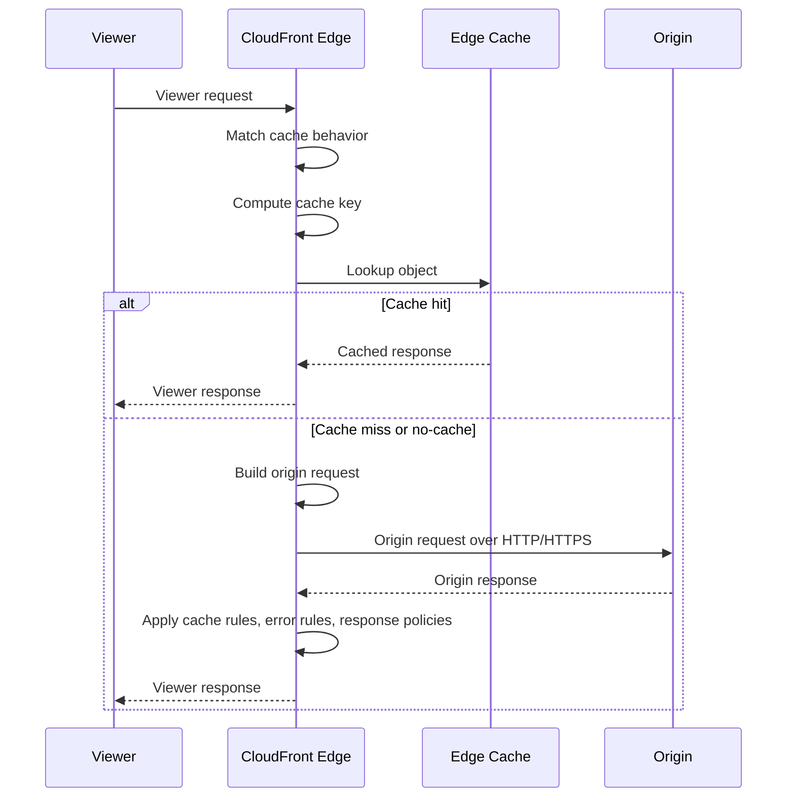
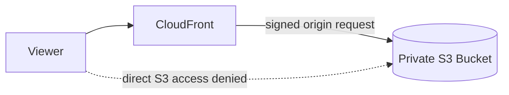
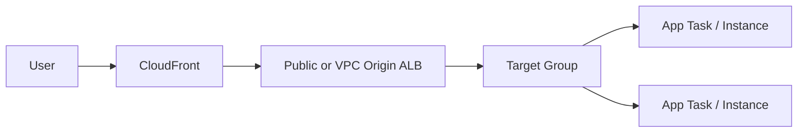
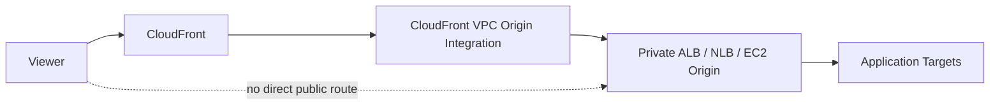
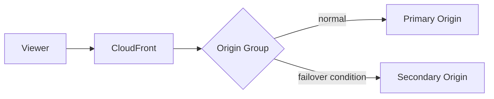
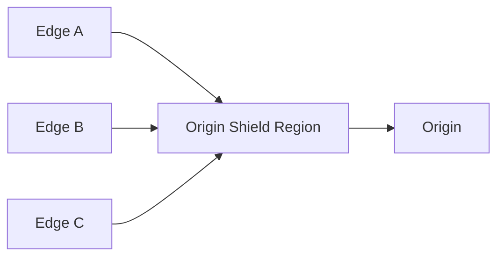

# Part 056 — CloudFront Origins

CloudFront is only as reliable as its origin design.

A distribution can have excellent cache policies, perfect TLS configuration, and WAF protection, but still fail in production because the origin boundary is weak:

- S3 bucket is publicly reachable when it should only be reachable through CloudFront.
- ALB accepts direct internet traffic and bypasses edge security.
- API Gateway caching/CORS/auth semantics conflict with CloudFront behavior.
- Custom origin certificate does not match the origin domain name.
- Origin failover is configured for `GET` but the incident is on `POST`.
- Health semantics are based on HTTP status codes that do not represent real application health.
- Origin timeouts are shorter or longer than upstream service timeouts in the wrong places.

This part is about origin engineering: how CloudFront talks to backends, how to choose origin types, how to protect them, and how to model failure.

---

## 1. What Is a CloudFront Origin?

An origin is the source CloudFront contacts on a cache miss or when caching is disabled.

Common origins:

- Amazon S3 bucket or S3 static website endpoint
- Application Load Balancer
- Network Load Balancer through VPC origins in supported designs
- API Gateway endpoint
- AWS Lambda function URL
- EC2 instance or custom HTTP server
- External origin outside AWS
- Media services or object storage systems with HTTP/S endpoint
- Origin group with primary and secondary origins

The origin is not just a hostname. It is a contract:

```yaml
origin_contract:
  domain_name: origin.example.internal_or_public
  protocol: https
  host_header: expected-host.example.com
  tls_certificate_matches: true
  allowed_methods: [GET, HEAD, OPTIONS, POST]
  timeout_budget: explicit
  auth_boundary: cloudfront_or_origin_or_both
  direct_access_allowed: false
  health_semantics: defined
  failover_behavior: defined
```

If this contract is implicit, debugging will be slow.

---

## 2. Origin Request Lifecycle

On cache miss, CloudFront creates an origin request based on:

- matched cache behavior
- selected origin or origin group
- cache policy
- origin request policy
- origin custom headers
- viewer protocol/origin protocol settings
- edge function mutations
- origin timeout settings



The origin sees a request shaped by CloudFront, not necessarily the exact viewer request.

That is a feature. It is also a source of bugs.

---

## 3. Origin Selection by Cache Behavior

A distribution can route different paths to different origins.

Example:

```yaml
origins:
  s3_assets:
    type: s3
    path_owner: frontend_platform
  app_alb:
    type: alb
    path_owner: web_runtime
  api_gateway:
    type: api_gateway
    path_owner: api_platform

behaviors:
  - path: /assets/*
    origin: s3_assets
    cache: long
  - path: /api/*
    origin: api_gateway
    cache: disabled_or_public_api
  - path: /*
    origin: app_alb
    cache: html_short
```

This is a powerful pattern because it lets CloudFront become a unified front door while preserving different backend ownership models.

But it also means path ownership must be explicit. A careless default behavior can send sensitive API traffic to the wrong origin or apply the wrong cache policy.

---

## 4. S3 as an Origin

S3 is the most common CloudFront origin for static assets.

There are two very different S3 origin styles:

1. **S3 REST endpoint origin**
2. **S3 static website endpoint origin**

They behave differently.

### S3 REST endpoint

Typical origin domain:

```text
bucket-name.s3.<region>.amazonaws.com
```

Use when:

- you want private bucket access through CloudFront
- you want Origin Access Control
- you serve static files but do not need S3 website routing semantics
- you want stronger origin protection

### S3 static website endpoint

Typical origin domain:

```text
bucket-name.s3-website-<region>.amazonaws.com
```

Use when:

- you need S3 website features such as index/error document behavior
- you accept that this is treated as a custom HTTP origin
- you understand that private bucket access via OAC/OAI is not the same pattern as REST endpoint origin

For most secure modern static delivery, prefer S3 REST endpoint with CloudFront Origin Access Control.

---

## 5. Origin Access Control and Origin Access Identity

Historically, CloudFront used Origin Access Identity to restrict S3 origins. Modern designs should prefer Origin Access Control where supported.

The goal is:

```text
Viewer -> CloudFront -> S3
Viewer -X-> S3 directly
```

Conceptually:



A strong bucket policy should grant CloudFront access and deny public access.

Sketch:

```json
{
  "Version": "2012-10-17",
  "Statement": [
    {
      "Effect": "Allow",
      "Principal": { "Service": "cloudfront.amazonaws.com" },
      "Action": "s3:GetObject",
      "Resource": "arn:aws:s3:::example-bucket/*",
      "Condition": {
        "StringEquals": {
          "AWS:SourceArn": "arn:aws:cloudfront::111122223333:distribution/EDFDVBD6EXAMPLE"
        }
      }
    }
  ]
}
```

The exact policy must match your account, bucket, and distribution. The important invariant is not the JSON itself; it is the access path:

> S3 should trust CloudFront, not the whole internet.

---

## 6. S3 Origin Design Patterns

### Pattern A — Static frontend assets

```yaml
path: /assets/*
origin: s3_rest_private
cache_policy: long_ttl_no_cookies_no_query
origin_access: OAC
bucket_public_access: blocked
object_names: content_hashed
```

This is the default for React/Vue/Svelte/Angular build artifacts.

### Pattern B — Single-page app shell

```yaml
path: /*
origin: s3_rest_private
cache_policy: short_html
custom_error_mapping:
  403_or_404: /index.html # only if SPA routing requires it
```

Be careful. SPA fallback can hide real 404/403 errors. Use path-specific behavior if possible.

### Pattern C — Public downloads

```yaml
path: /downloads/*
origin: s3_rest_private
cache_policy: medium_or_long
security: signed_url_if_not_public
```

### Pattern D — Private downloads

```yaml
path: /private-downloads/*
origin: s3_rest_private
viewer_access: signed_url_or_signed_cookie
origin_access: OAC
cache_key: avoid_user_specific_leakage
```

Private downloads require both viewer-side authorization and origin protection.

---

## 7. ALB as an Origin

Application Load Balancer is a common origin for dynamic web apps and APIs.



ALB origin is useful when:

- you need HTTP host/path routing behind CloudFront
- you run ECS/EKS/EC2 workloads
- you need WebSocket/gRPC support depending on configuration
- you want CloudFront for edge TLS/WAF/cache but ALB for app routing
- you want one CloudFront distribution to front multiple app paths

### Direct ALB bypass problem

If the ALB is internet-facing and accepts traffic from anywhere, users can bypass CloudFront:

```text
User -> ALB directly
```

That bypasses:

- CloudFront WAF if attached at CloudFront
- CloudFront signed URLs/cookies
- viewer protocol enforcement
- edge header normalization
- rate limiting at edge
- origin shield/caching

Mitigation options:

1. Restrict ALB Security Group to CloudFront origin-facing prefix list where applicable.
2. Require a secret custom header from CloudFront and validate at origin/ALB/WAF.
3. Use CloudFront VPC origins where supported.
4. Put ALB internal and expose only through supported private/edge integration.
5. Use AWS WAF on both CloudFront and ALB if direct access cannot be fully closed.

Do not claim “CloudFront protects my app” if the app is reachable directly without equivalent controls.

---

## 8. ALB Origin TLS and Host Header

There are two TLS boundaries:

```text
Viewer <TLS> CloudFront <TLS or HTTP> ALB <HTTP/TLS> Targets
```

Recommended production default:

```yaml
viewer_to_cloudfront: HTTPS only
cloudfront_to_origin: HTTPS only
alb_to_target: depends_on_internal_policy
```

If CloudFront connects to ALB over HTTPS:

- ALB listener must support HTTPS.
- Certificate must match the origin domain name CloudFront uses.
- Host header behavior must be intentional.
- Origin protocol policy must be explicit.

Common 502 cause:

```text
CloudFront origin domain: internal-alb-123.region.elb.amazonaws.com
CloudFront forwards Host: www.example.com
ALB certificate only matches app-origin.example.com
TLS/SNI/Host mismatch leads to failure.
```

Use a dedicated origin hostname:

```text
origin-www.example.com -> ALB DNS name
```

Certificate covers:

```text
origin-www.example.com
```

CloudFront origin domain uses:

```text
origin-www.example.com
```

Then viewer hostname can remain:

```text
www.example.com
```

This separates viewer brand DNS from origin TLS/DNS.

---

## 9. API Gateway as an Origin

API Gateway can sit behind CloudFront, but you must understand whether CloudFront is adding value or duplicating behavior.

API Gateway already has its own front door, throttling, authorizers, stages, custom domains, and optional caching depending on type/configuration. CloudFront can still help when you want:

- one unified domain for web + API
- edge WAF at CloudFront
- path routing between static frontend and API
- custom cache policy for public GET APIs
- geographic edge control
- response header normalization
- CloudFront Functions/Lambda@Edge before API Gateway

Example:

```yaml
/api/*:
  origin: api_gateway_regional_domain
  allowed_methods: all
  cache_policy: disabled_for_private_or_selected_for_public_get
  origin_request_policy:
    headers: [Authorization, Content-Type, Origin, X-Request-ID]
    query_strings: selected_or_all
```

### Stage path issue

API Gateway origin paths often include a stage:

```text
https://abc123.execute-api.ap-southeast-1.amazonaws.com/prod
```

CloudFront can configure an origin path:

```yaml
origin_path: /prod
```

Then viewer path:

```text
/api/orders
```

becomes origin path:

```text
/prod/api/orders
```

Be explicit. Many API Gateway + CloudFront bugs are path composition bugs.

### Authorization and caching

If API Gateway response depends on `Authorization`, disable CloudFront caching for that behavior unless you have a very specific token-aware design.

CloudFront can forward Authorization, but forwarding is not enough. The cache key must not share private responses.

---

## 10. Custom HTTP Origin

A custom origin is any HTTP/S server CloudFront can reach, including:

- EC2 instance
- NGINX/Apache reverse proxy
- Kubernetes ingress
- external SaaS endpoint
- on-prem HTTP endpoint
- non-AWS object storage endpoint

Custom origins give flexibility but also require you to own more failure modes:

- DNS resolution
- TLS certificate validity
- origin scaling
- keep-alive behavior
- connection limits
- firewall allowlists
- HTTP protocol correctness
- redirect loops
- header handling
- timeout budgets
- health behavior

Custom origin checklist:

```text
[ ] Origin hostname is stable.
[ ] TLS certificate matches origin domain.
[ ] Origin supports expected Host header.
[ ] Origin allows CloudFront source traffic.
[ ] Origin has capacity for cache-miss bursts.
[ ] Origin handles keep-alive correctly.
[ ] Origin timeout is aligned with CloudFront and upstream services.
[ ] Origin logs include CloudFront request identifiers.
[ ] Direct bypass is controlled.
[ ] Redirects do not point viewers to the origin hostname.
```

---

## 11. VPC Origins

CloudFront VPC origins let CloudFront reach supported private resources in a VPC, such as certain ALB/NLB/EC2 origin patterns, without exposing the origin as a normal public internet endpoint.

The architectural intent is:

```text
Viewer -> CloudFront edge -> CloudFront-managed private connectivity -> VPC origin
```

This can reduce direct-origin bypass risk for workloads that should be fronted only by CloudFront.

Mental model:



Important design questions:

1. Is the origin type supported?
2. Which VPC/subnet/security group boundaries apply?
3. How is origin security group access controlled?
4. What operational team owns the VPC origin resource?
5. What logs prove CloudFront reached the private origin?
6. What is the rollback path if VPC origin integration fails?

VPC origins do not remove the need to understand TLS, Host headers, cache behavior, origin timeout, or app health. They mostly change the network reachability model.

---

## 12. Lambda Function URL as an Origin

Lambda function URLs can be used as HTTP origins.

Use carefully.

Good fit:

- lightweight dynamic endpoint
- low-to-moderate traffic
- event-driven backend
- public GET endpoint with CloudFront caching
- webhook receiver with edge filtering

Risks:

- cold starts
- concurrency limits
- auth semantics
- payload limits
- observability split between CloudFront and Lambda
- accidental public direct access if not restricted appropriately

Pattern:

```yaml
path: /edge-api/*
origin: lambda_function_url
cache_policy: disabled_or_short_public_get
origin_request_policy:
  headers: [Authorization, Content-Type, X-Request-ID]
security:
  function_url_auth: aws_iam_or_custom
  cloudfront_waf: enabled
```

If you need complex API management, API Gateway or ALB may be a better origin.

---

## 13. Origin Groups and Failover

CloudFront origin groups allow a cache behavior to use a primary and secondary origin.



CloudFront can fail over when the primary origin returns configured HTTP status codes, such as selected 4xx/5xx responses depending on your configuration.

However, a critical limitation matters:

> CloudFront origin failover applies only for viewer requests using GET, HEAD, or OPTIONS. It does not fail over POST, PUT, PATCH, DELETE, and similar mutating methods.

This means origin group failover is strong for static content and read-heavy public content, but it is not a complete multi-region transactional API failover solution.

### Good origin failover use cases

- S3 static website/object fallback
- read-only public content
- media files
- documentation site
- static fallback for app shell
- public GET API with idempotent behavior

### Risky origin failover use cases

- payments
- order submission
- regulatory case mutation
- write-heavy APIs
- session-dependent operations
- non-idempotent POST workflows

For write workloads, origin failover must be paired with data-layer replication, idempotency, consistency design, and application-level failover.

---

## 14. Origin Failover Design

A production origin group contract should define:

```yaml
origin_group:
  primary: app-primary-region
  secondary: app-secondary-region
  failover_status_codes: [500, 502, 503, 504]
  failover_methods: [GET, HEAD, OPTIONS]
  data_consistency: read_only_or_eventually_consistent
  cache_behavior: public_get_only
  testing: synthetic_failover_tested
```

Common bug:

```text
Primary returns 200 with error page body.
CloudFront sees 200.
No origin failover happens.
```

Health semantics must be HTTP status semantics. If the origin returns `200 OK` for degraded states, CloudFront cannot infer failure from the body.

Another common bug:

```text
Primary returns 403 due to bad bucket policy.
Failover status codes include only 500/502/503/504.
CloudFront does not fail over.
```

Decide which errors should fail over. Be careful with 403/404. For S3, a 403 may mean private content is correctly denied, not origin outage.

---

## 15. Multi-Origin Routing Patterns

### Static + API split

```yaml
/assets/* -> s3_assets
/api/*    -> api_gateway
/*        -> alb_web
```

### Region-local read failover

```yaml
/images/* -> origin_group(s3_primary, s3_secondary)
```

### Blue/green origin switch

```yaml
/* -> alb_blue
# update behavior to alb_green during rollout
```

For safer weighted rollout, Route 53 or Global Accelerator may be more appropriate depending on layer and protocol.

### Origin by path ownership

```yaml
/docs/*       -> docs_bucket
/app/*        -> frontend_bucket
/api/billing/* -> billing_api
/api/cases/*   -> case_management_api
```

This maps architecture ownership into edge routing. It is powerful, but governance must prevent path collisions.

---

## 16. Origin Custom Headers

CloudFront can add custom headers to origin requests.

Use cases:

- origin bypass protection
- environment identification
- routing hints
- legacy backend compatibility

Example:

```yaml
origin_custom_headers:
  X-Origin-Verify: ${secret_value}
```

Origin validates:

```text
if X-Origin-Verify != expected_secret:
  return 403
```

This is not a substitute for network controls, but it is useful as a defense layer.

Rules:

1. Do not expose the secret to browser code.
2. Rotate it.
3. Store it in infrastructure secret management.
4. Use it with SG/WAF/origin access restrictions where possible.
5. Log validation failures.

Custom headers can also cause bugs if they override or conflict with viewer headers. Keep them minimal.

---

## 17. Origin Protocol Policy

Origin protocol policy controls whether CloudFront uses HTTP or HTTPS to the origin.

Common choices:

```yaml
origin_protocol_policy: https-only
```

Preferred for production custom origins.

```yaml
origin_protocol_policy: match-viewer
```

Can be dangerous if viewers can use HTTP. Usually avoid unless there is a deliberate reason.

```yaml
origin_protocol_policy: http-only
```

Sometimes used for internal trusted origins, but it weakens encryption-in-transit. Use only with explicit risk acceptance.

A strong default:

```text
Viewer HTTP -> redirect to HTTPS at CloudFront
CloudFront -> origin over HTTPS
Origin -> target over HTTPS if data sensitivity requires it
```

---

## 18. Origin Timeouts and Connection Behavior

Origin timeout settings influence how long CloudFront waits for origin connection and response.

Timeouts must align across the chain:

```text
Viewer
  -> CloudFront
    -> ALB/API Gateway/custom origin
      -> application server
        -> database/downstream service
```

Bad timeout chain:

```text
CloudFront waits 60s
ALB waits 30s
App waits 90s for database
Database times out at 120s
```

This creates confusing 504/502 behavior and wasted work.

Better:

```text
Client timeout > CloudFront timeout > ALB/app timeout > downstream timeout? 
```

Actually, there is no universal formula. The invariant is:

> The layer responsible for retry/failover must time out before callers give up, and mutating operations must not be blindly retried without idempotency.

For read-only cacheable operations, shorter origin timeout plus retry/failover may be acceptable.

For write operations, timeouts must be aligned with idempotency keys and transaction semantics.

---

## 19. Origin Shield

Origin Shield adds an additional centralized caching layer between edge locations and your origin.

Use it when:

- many edge locations miss for the same object
- origin is expensive or fragile
- cache stampede risk matters
- cross-region origin access should be consolidated
- you want improved origin offload for popular objects

Mental model:



Without Origin Shield, multiple regional edge caches can hit the origin independently. With Origin Shield, they coordinate through one extra cache layer.

Trade-off:

- better origin protection and cache efficiency
- extra request path hop
- additional cost
- region choice matters

Choose the Origin Shield Region close to the origin or aligned with AWS guidance for your workload.

---

## 20. Protecting Origins from Direct Access

A CloudFront design is incomplete until direct-origin access is addressed.

### S3

Use:

- S3 Block Public Access
- Origin Access Control
- bucket policy scoped to CloudFront distribution

### ALB

Use some combination of:

- Security Group restricted to CloudFront origin-facing prefix list where applicable
- CloudFront custom origin header validation
- AWS WAF on ALB as backup
- private/VPC origin pattern
- origin hostname not exposed publicly

### API Gateway

Use:

- resource policy where applicable
- custom domain strategy
- authorizer still enforced at API Gateway
- WAF at CloudFront and/or API Gateway as needed
- do not rely only on obscurity of execute-api URL

### Custom origin

Use:

- firewall/allowlist
- mTLS if appropriate
- secret custom header
- origin auth
- rate limits
- logs for direct access attempts

Principle:

> CloudFront should be the public front door. Origins should not accidentally remain alternate public front doors.

---

## 21. Origin Health and Application Health

An origin can be reachable but semantically unhealthy.

Examples:

```text
ALB returns 200 for /health but app cannot reach database.
API Gateway returns 200 for shallow mock health while downstream is broken.
S3 bucket is reachable but deploy uploaded incomplete asset set.
Custom origin returns branded 200 error page.
```

Define health depth:

| Health Type | Meaning | Use |
|---|---|---|
| TCP health | Port open | Network reachability only. |
| HTTP shallow | App process alive | Basic load balancer health. |
| HTTP deep | Critical dependencies checked | Failover decisions, carefully. |
| Synthetic user journey | Business path works | External monitoring. |

For CloudFront origin failover, HTTP status codes matter. If the origin hides failure behind 200 responses, CloudFront cannot fail over based on configured error codes.

---

## 22. Origin DNS

CloudFront resolves origin DNS names. Origin DNS design affects failover and operations.

Good practices:

- Use stable origin hostnames.
- Avoid pointing CloudFront to temporary generated names directly when a managed alias gives better control.
- Ensure TLS certificate matches origin hostname.
- Keep origin DNS TTL and CloudFront behavior in mind.
- Avoid redirecting viewers to origin hostnames.

Example:

```text
viewer: www.example.com -> CloudFront
origin: origin-www.example.com -> ALB
```

This gives you an origin-specific DNS and certificate boundary.

Do not use the same hostname for viewer and origin unless you intentionally understand the loop risk.

Bad:

```text
CloudFront alternate domain: www.example.com
CloudFront origin domain: www.example.com
```

This can create request loops or confusing DNS behavior.

---

## 23. Origin Path

CloudFront origin path prepends a path segment to requests sent to the origin.

Example:

```yaml
viewer_request: /api/orders
origin_domain: abc123.execute-api.ap-southeast-1.amazonaws.com
origin_path: /prod
origin_request: /prod/api/orders
```

Origin path is useful for:

- API Gateway stage mapping
- versioned origin folders
- blue/green folder-based deployments
- multi-tenant static origin layouts

But it is easy to misconfigure.

Checklist:

```text
[ ] Confirm viewer path.
[ ] Confirm behavior path pattern.
[ ] Confirm origin path.
[ ] Confirm edge rewrite functions.
[ ] Confirm origin router expectations.
[ ] Test with curl and origin logs.
```

Path bugs are often mistaken for auth bugs because they produce 403/404.

---

## 24. Redirects and Origin Hostnames

Origins often return redirects.

Bad origin redirect:

```http
HTTP/1.1 302 Found
Location: https://internal-origin.example.com/login
```

This leaks origin hostname and may bypass CloudFront.

Good redirect:

```http
Location: https://www.example.com/login
```

Design rules:

1. Origin should know public canonical hostname or receive enough forwarded headers to construct it.
2. CloudFront should forward `Host` only if origin needs it and TLS supports it.
3. Avoid absolute redirects to origin-local names.
4. Test login, logout, trailing slash redirects, and locale redirects through CloudFront.

---

## 25. Origin Request Methods

CloudFront behavior controls allowed methods and cached methods.

Common static origin:

```yaml
allowed_methods: [GET, HEAD]
cached_methods: [GET, HEAD]
```

CORS/static public API:

```yaml
allowed_methods: [GET, HEAD, OPTIONS]
cached_methods: [GET, HEAD, OPTIONS]
```

Private API:

```yaml
allowed_methods: [GET, HEAD, OPTIONS, POST, PUT, PATCH, DELETE]
cached_methods: [GET, HEAD]
cache_policy: disabled_or_careful
```

Do not allow all methods on static paths unless required. Method scope is part of attack surface.

---

## 26. Origin Observability

To debug origin issues, correlate CloudFront and origin logs.

Enable and use:

- CloudFront standard logs or real-time logs
- ALB access logs
- API Gateway access logs/execution logs as appropriate
- S3 server access logs or CloudTrail data events where needed
- application logs with request IDs
- CloudWatch metrics
- synthetic canaries through CloudFront

Propagate request IDs:

```text
Viewer sends or edge generates X-Request-ID
CloudFront forwards X-Request-ID
Origin logs X-Request-ID
App logs X-Request-ID
Downstream logs correlation ID
```

Without correlation, CloudFront-origin debugging becomes timestamp archaeology.

---

## 27. Origin Failure Matrix

| Symptom | Likely Layer | Checks |
|---|---|---|
| 502 from CloudFront | TLS/DNS/origin protocol | Certificate match, origin port, SNI/Host, protocol policy. |
| 503 from CloudFront | Capacity/origin unavailable | Origin health, DNS, connection limits, Lambda/API limits. |
| 504 from CloudFront | Timeout | Origin response timeout, app downstream timeout, SG/NACL/firewall. |
| 403 for S3 origin | Access policy | OAC/OAI, bucket policy, object ownership, Block Public Access. |
| 404 through CloudFront only | Path/origin path | Behavior match, origin path, rewrite function, SPA fallback. |
| Works direct origin, fails via CloudFront | Forwarding/policy | Host, auth header, cookies, query strings, method, TLS. |
| Works via CloudFront, direct origin blocked | Desired security | Confirm origin bypass protection. |
| Failover does not happen | Origin group criteria | Method, status code, error semantics, cache behavior. |

---

## 28. Implementation Blueprint: Static Frontend + API

A production frontend distribution could look like this:

```yaml
origins:
  frontend_s3:
    type: s3_rest
    access: origin_access_control
    public_access: blocked

  api_alb:
    type: alb
    protocol: https
    origin_domain: origin-api.example.com
    direct_access: restricted

behaviors:
  - path: /assets/*
    origin: frontend_s3
    allowed_methods: [GET, HEAD]
    cache_policy: static_hashed_long
    origin_request_policy: minimal

  - path: /api/*
    origin: api_alb
    allowed_methods: all
    cache_policy: caching_disabled
    origin_request_policy: auth_cors_trace

  - path: /*
    origin: frontend_s3
    allowed_methods: [GET, HEAD]
    cache_policy: html_short
    origin_request_policy: minimal
    custom_error_mapping:
      403: /index.html # only if SPA fallback is intentional
      404: /index.html
```

Security review:

```text
[ ] S3 bucket cannot be accessed directly.
[ ] ALB cannot be accessed directly or has equivalent controls.
[ ] API auth still happens at origin.
[ ] Cache disabled for private API.
[ ] Static assets are content-hashed.
[ ] HTML has short TTL.
[ ] CORS behavior tested.
[ ] Origin TLS certificate matches origin domain.
```

---

## 29. Implementation Blueprint: Multi-Region Read-Only Content

```yaml
origins:
  s3_primary:
    region: ap-southeast-1
  s3_secondary:
    region: us-east-1

origin_group:
  primary: s3_primary
  secondary: s3_secondary
  failover_status_codes: [500, 502, 503, 504]

behavior:
  path: /docs/*
  allowed_methods: [GET, HEAD]
  cache_policy: static_or_medium
```

Operational requirements:

```text
[ ] Content replication is working.
[ ] Secondary origin has equivalent bucket policy/OAC access.
[ ] Failover status codes are tested.
[ ] GET/HEAD behavior is sufficient.
[ ] Invalidation/deployment process covers both origins.
[ ] Synthetic probes validate primary and secondary.
```

Do not use this as a write failover pattern without application/data architecture.

---

## 30. Implementation Blueprint: Private ALB Behind CloudFront

Depending on supported feature availability and constraints, choose either VPC origin or tightly restricted public ALB.

```yaml
origin:
  type: vpc_origin_alb
  alb_scheme: internal
  protocol: https
  security_group:
    inbound: from_cloudfront_managed_path

behavior:
  path: /app/*
  cache_policy: html_short_or_disabled
  origin_request_policy: auth_cors_trace
```

Alternative public ALB with restrictions:

```yaml
alb:
  scheme: internet-facing
  security_group:
    inbound: cloudfront_origin_facing_prefix_list_only
  waf: optional_backup
origin_validation:
  custom_header_secret: required
```

Security posture:

```text
public viewer traffic terminates at CloudFront
origin traffic is accepted only from CloudFront-controlled path
application still authenticates/authorizes users
```

---

## 31. Origin Anti-Patterns

### Anti-Pattern 1 — Public S3 Bucket Behind CloudFront

If the bucket is public, CloudFront is not the only access path. Use OAC unless public direct bucket access is intentionally allowed.

### Anti-Pattern 2 — ALB Directly Reachable From Anywhere

CloudFront WAF and signed URL logic can be bypassed.

### Anti-Pattern 3 — Same Domain for Viewer and Origin

Can create loops or confusing redirects. Use distinct viewer and origin hostnames.

### Anti-Pattern 4 — Origin Returns 200 for Failure

CloudFront origin failover and monitoring cannot reason about hidden errors.

### Anti-Pattern 5 — Use Origin Failover for Non-Idempotent Writes

CloudFront failover is not transaction failover.

### Anti-Pattern 6 — Forward Host Without TLS Alignment

Host/SNI/certificate mismatch often becomes 502.

### Anti-Pattern 7 — SPA Fallback Everywhere

Mapping all 403/404 to `/index.html` can hide real broken links and permission failures.

### Anti-Pattern 8 — No Origin Request Correlation

Without request IDs and logs, cache miss and origin errors are hard to diagnose.

---

## 32. Production Checklist

Before approving a CloudFront origin design:

```text
[ ] Every behavior maps to the intended origin.
[ ] Origin domain names are stable and documented.
[ ] Origin protocol policy is explicit.
[ ] Origin TLS certificate matches CloudFront origin domain.
[ ] Host header forwarding is intentional.
[ ] Origin access bypass is blocked or equivalently protected.
[ ] S3 origins use OAC where appropriate.
[ ] ALB/API/custom origins have direct-access controls.
[ ] Origin request policy forwards only required values.
[ ] Origin path composition is tested.
[ ] Redirects use public viewer hostnames, not origin hostnames.
[ ] Origin timeout chain is reviewed.
[ ] Origin failover, if configured, is tested with real status codes.
[ ] Failover method limitations are understood.
[ ] Logs and request correlation exist across CloudFront and origin.
[ ] Synthetic canaries test through CloudFront.
[ ] Runbook covers 403/404/502/503/504.
```

---

## 33. Mental Model Recap

Origins are the backend contract of CloudFront.

Remember:

1. Origin choice determines security, latency, failover, and operational ownership.
2. S3 REST endpoint + OAC is the default secure static-content pattern.
3. S3 website endpoint is a custom HTTP origin with different trade-offs.
4. ALB origins must be protected from direct bypass.
5. API Gateway behind CloudFront requires careful path, auth, CORS, and cache design.
6. Custom origins require you to own DNS, TLS, scaling, timeout, and firewall behavior.
7. VPC origins shift origin reachability from public to private-style integration where supported.
8. Origin groups are useful for read failover, not generic write failover.
9. Origin TLS, Host header, and origin domain must align.
10. Every origin design needs logs, request correlation, and direct-bypass testing.

The next part focuses on CloudFront security:

> Origin Access Control, legacy OAI, signed URLs, signed cookies, geo restriction, HTTPS-only, and origin protection.

---

## References

- AWS Documentation — Use various origins with CloudFront distributions: https://docs.aws.amazon.com/AmazonCloudFront/latest/DeveloperGuide/DownloadDistS3AndCustomOrigins.html
- AWS Documentation — Origin settings: https://docs.aws.amazon.com/AmazonCloudFront/latest/DeveloperGuide/DownloadDistValuesOrigin.html
- AWS Documentation — Restrict access to an Amazon S3 origin: https://docs.aws.amazon.com/AmazonCloudFront/latest/DeveloperGuide/private-content-restricting-access-to-s3.html
- AWS Documentation — Restrict access with VPC origins: https://docs.aws.amazon.com/AmazonCloudFront/latest/DeveloperGuide/private-content-vpc-origins.html
- AWS Documentation — Optimize high availability with CloudFront origin failover: https://docs.aws.amazon.com/AmazonCloudFront/latest/DeveloperGuide/high_availability_origin_failover.html
- AWS Documentation — Request and response behavior for origin groups: https://docs.aws.amazon.com/AmazonCloudFront/latest/DeveloperGuide/RequestAndResponseBehaviorOriginGroups.html
- AWS Documentation — Require HTTPS for communication between CloudFront and your custom origin: https://docs.aws.amazon.com/AmazonCloudFront/latest/DeveloperGuide/using-https-cloudfront-to-custom-origin.html
