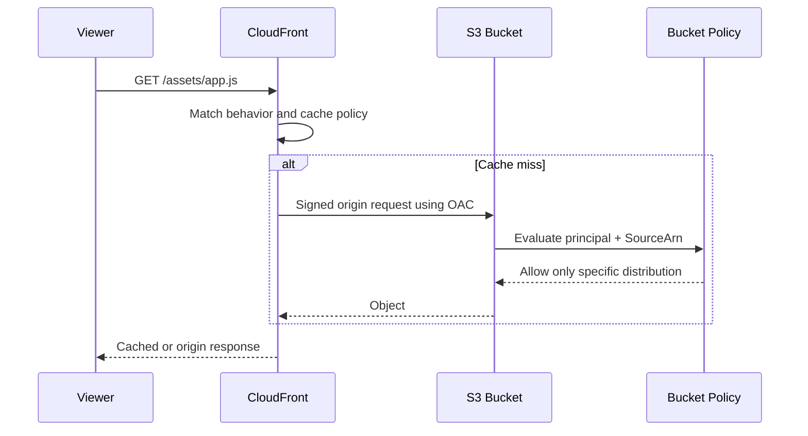
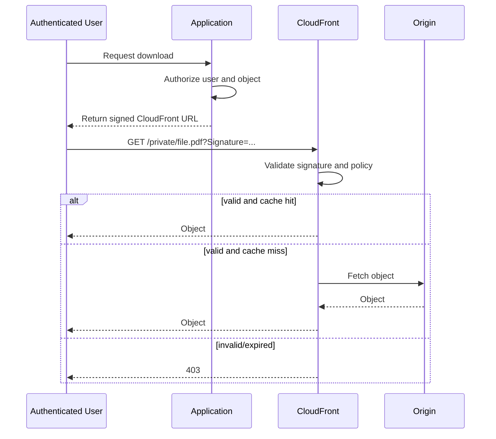
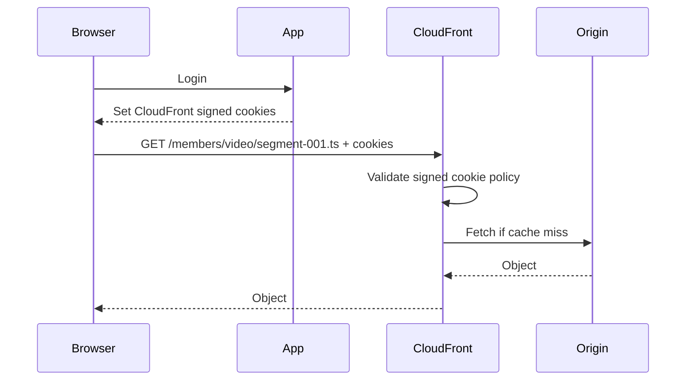
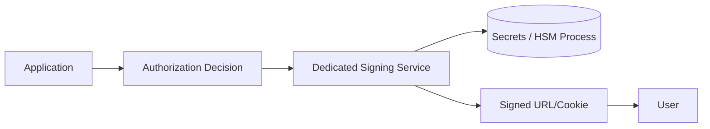
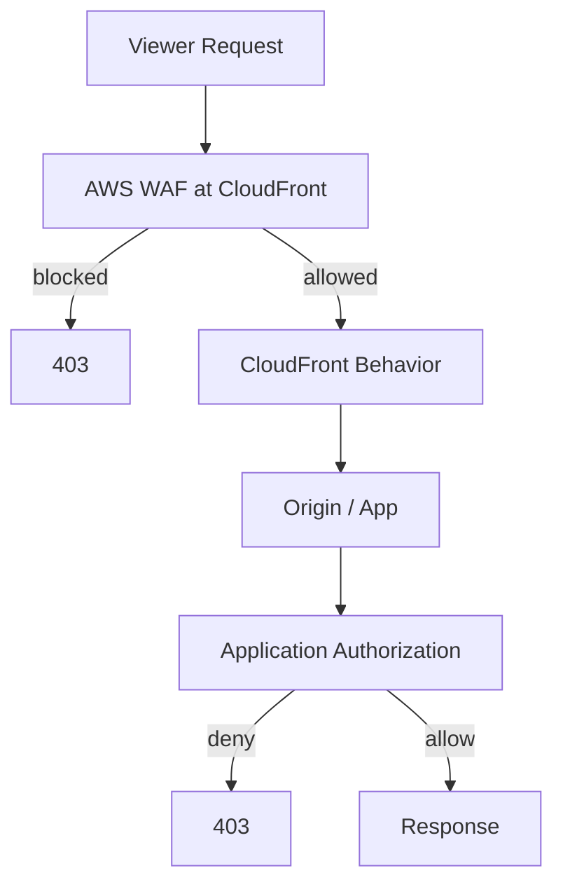
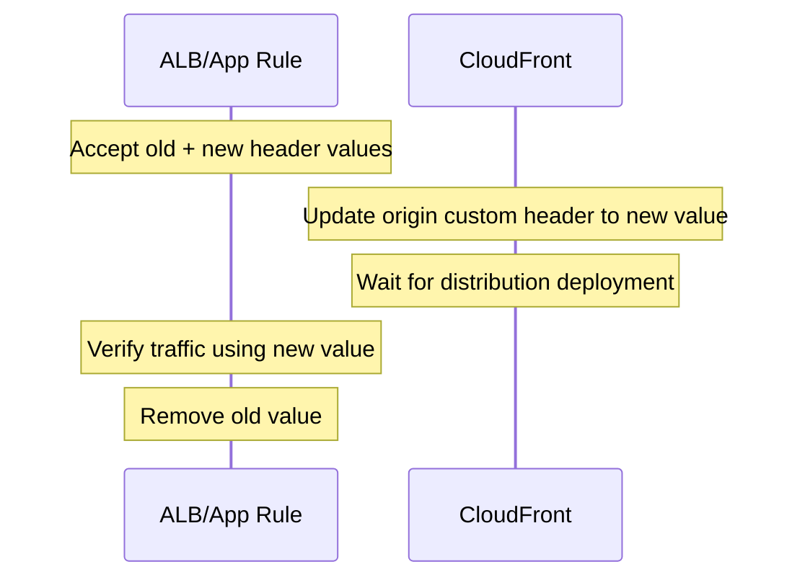

# Part 057 — CloudFront Security

CloudFront security is not one feature.

It is a set of boundaries that must agree:

- viewer boundary: who can call the distribution?
- distribution boundary: which behavior handles the request?
- cache boundary: what can be reused across users?
- origin boundary: can the origin be reached directly?
- identity boundary: is access enforced by CloudFront, origin, application, or all three?
- transport boundary: is TLS enforced from viewer to edge and from edge to origin?
- abuse boundary: can bots, scrapers, replayed URLs, or bypass paths drain the origin?
- operations boundary: can you prove the request path during an incident?

A secure CloudFront design is not merely:

> Put WAF in front of CloudFront.

A secure design is:

> Every valid request enters through the intended distribution, matches the intended behavior, carries the intended identity proof, uses the intended cache policy, reaches the intended origin over the intended protocol, and cannot bypass the edge controls.

That sentence is the invariant for this part.

---

## 1. Security Surfaces in CloudFront

CloudFront sits between viewers and origins. That creates several places to enforce control.

```mermaid
flowchart LR
    Viewer[Viewer / Bot / Client] --> DNS[DNS / Alias]
    DNS --> CF[CloudFront Distribution]
    CF --> Behavior[Cache Behavior]
    Behavior --> EdgeSecurity[Viewer TLS / Signed URL / WAF / Geo / Functions]
    EdgeSecurity --> Cache[Edge Cache]
    Cache --> OriginReq[Origin Request]
    OriginReq --> OriginProtection[OAC / Custom Header / Prefix List / VPC Origin]
    OriginProtection --> Origin[S3 / ALB / API / Custom Origin]

    Attacker[Direct Origin Caller] -. bypass attempt .-> Origin
    OriginProtection -. blocks .-> Attacker
```



Think of CloudFront security in five layers:

| Layer | Question | Common controls |
|---|---|---|
| Viewer access | Is the viewer allowed to request this content? | signed URL, signed cookie, WAF, application auth, geo restriction |
| Edge protocol | Is the viewer using the right protocol and hostname? | HTTPS viewer policy, alternate domain name, ACM certificate, HSTS at app/edge |
| Cache correctness | Can this object be reused safely? | cache key, `Cache-Control`, authorization handling, private/no-store policy |
| Origin access | Can the origin be reached only through CloudFront? | OAC, bucket policy, custom origin header, CloudFront prefix list, VPC origins |
| Abuse resilience | Can abnormal traffic exhaust cache/origin/cost? | WAF rate rules, Shield, bot controls, origin failover, throttling, logs |

The most common security bug is not missing encryption. It is **direct-origin bypass**.

If a user can access `https://origin.example.com/private/file.pdf` directly, then CloudFront signed URLs, WAF rules, cache policies, and geo restrictions can be bypassed.

---

## 2. Private Content vs Private Origin

Two concepts are often mixed.

### Private content

Private content means the viewer must prove authorization before CloudFront serves the object.

Examples:

- paid video file
- invoice PDF
- customer-specific export
- subscriber-only image archive
- temporary software artifact

CloudFront controls this using:

- signed URLs
- signed cookies
- application-generated tokens checked at the edge or origin
- WAF/application-specific controls

### Private origin

Private origin means the backend should not be reachable directly by arbitrary clients.

Examples:

- S3 bucket should be readable only by a CloudFront distribution
- ALB should accept traffic only from CloudFront
- EC2/custom origin should reject direct internet requests
- internal ALB/NLB/EC2 should be reached through CloudFront VPC origin where supported

CloudFront controls this using:

- Origin Access Control for supported AWS origins, especially S3
- legacy Origin Access Identity for older S3 designs
- S3 bucket policy with `AWS:SourceArn`
- custom header secret checked by ALB/app
- security group with CloudFront managed prefix list
- VPC origin pattern where applicable

A strong design usually needs both:

```yaml
private_content:
  user_must_have_valid_token: true
  token_lifetime: short
  token_scope: object_or_path
  cache_policy_safe_for_user_specific_content: true

private_origin:
  direct_origin_access_blocked: true
  cloudfront_distribution_is_only_allowed_path: true
  origin_access_enforced_by_resource_policy_or_network: true
```

---

## 3. Origin Access Control: The Modern S3 Origin Boundary

For S3 origins, the modern pattern is **Origin Access Control**, usually abbreviated as OAC.

OAC lets CloudFront sign origin requests to S3. S3 then uses bucket policy conditions to allow only requests coming from the intended CloudFront distribution.

High-level path:



The secure intent:

```yaml
s3_origin_security:
  bucket_public_access: blocked
  direct_s3_url_access: denied
  cloudfront_oac: enabled
  bucket_policy_allows:
    service_principal: cloudfront.amazonaws.com
    condition:
      AWS:SourceArn: arn:aws:cloudfront::<account-id>:distribution/<distribution-id>
```

This matters because without an origin boundary, any user who discovers the S3 object URL can bypass CloudFront.

---

## 4. OAC vs OAI

Historically, CloudFront used **Origin Access Identity** or OAI for private S3 origins.

For modern designs, prefer OAC unless there is a specific compatibility reason not to.

| Capability / Concern | OAC | OAI |
|---|---:|---:|
| Modern recommended pattern for S3 origin | Yes | Legacy |
| Works with S3 buckets in newer opt-in Regions | Yes | Limited legacy behavior |
| Supports SSE-KMS origin objects | Yes | Not the preferred model |
| Supports dynamic S3 methods such as `PUT`/`DELETE` with proper policy | Yes | Limited pattern |
| Uses service principal + source distribution condition | Yes | Uses CloudFront canonical user model |
| Works with S3 static website endpoint | No | No |
| Can be configured together on same origin | No | No |

Important distinction:

- S3 REST origin can use OAC.
- S3 static website endpoint is treated as a **custom origin**, so OAC/OAI is not the right mechanism.

If you need S3 website-style redirect/index document behavior, understand that you are moving out of the S3 REST origin protection model.

---

## 5. Minimal S3 OAC Policy Shape

The policy below is a conceptual shape, not a copy-paste template. Use your actual bucket, account, and distribution IDs.

```json
{
  "Version": "2012-10-17",
  "Statement": [
    {
      "Sid": "AllowCloudFrontServicePrincipalReadOnly",
      "Effect": "Allow",
      "Principal": {
        "Service": "cloudfront.amazonaws.com"
      },
      "Action": "s3:GetObject",
      "Resource": "arn:aws:s3:::example-bucket/*",
      "Condition": {
        "StringEquals": {
          "AWS:SourceArn": "arn:aws:cloudfront::111122223333:distribution/E1234567890ABC"
        }
      }
    }
  ]
}
```

For upload or mutation through CloudFront, the policy must be deliberately expanded.

Do not blindly add:

```json
"Action": "s3:*"
```

A mutable S3 origin behind CloudFront changes the threat model:

- viewer methods must be restricted
- behavior allowed methods must be explicit
- cache behavior must not cache unsafe responses
- bucket policy must restrict only the needed actions
- application-level authorization is usually still required
- object ownership, KMS key policy, and audit logs become part of the design

A safer write-capable origin contract:

```yaml
write_capable_s3_origin:
  cloudfront_allowed_methods: [GET, HEAD, OPTIONS, PUT]
  cacheable_methods: [GET, HEAD]
  oac_enabled: true
  bucket_policy:
    allow_get: true
    allow_put_to_specific_prefix: true
    deny_delete_unless_explicitly_required: true
  application_authorization: required
  object_prefix_is_tenant_scoped: true
  cloudtrail_data_events: enabled_for_sensitive_bucket
```

---

## 6. Direct-Origin Bypass: The Security Bug That Looks Like Networking

CloudFront often protects:

- WAF rules
- signed URL validation
- geo restriction
- rate limits
- TLS policy
- canonical host redirects
- bot filtering
- header normalization
- origin shielding

If the origin is reachable directly, the attacker avoids all of those.

### S3 bypass

Bad:

```text
https://d111111abcdef8.cloudfront.net/private/report.pdf
https://example-bucket.s3.amazonaws.com/private/report.pdf   # also works
```

Good:

```text
https://d111111abcdef8.cloudfront.net/private/report.pdf     # works if authorized
https://example-bucket.s3.amazonaws.com/private/report.pdf   # AccessDenied
```

### ALB bypass

Bad:

```text
https://www.example.com/api/orders       # through CloudFront
https://app-alb-123.us-east-1.elb.amazonaws.com/api/orders  # also works
```

Good:

```text
https://www.example.com/api/orders       # through CloudFront
https://app-alb-123.us-east-1.elb.amazonaws.com/api/orders  # rejected unless from CloudFront path
```

Direct-origin bypass is especially dangerous when:

- WAF is attached only to CloudFront
- the ALB has permissive listener rules
- origin accepts the same Host header from arbitrary clients
- origin authentication assumes CloudFront already filtered traffic
- origin endpoints leak through logs, error pages, DNS, JavaScript bundles, redirects, or certificate transparency

---

## 7. Protecting Custom Origins

For custom origins such as ALB, EC2, or external HTTP servers, OAC is not the universal solution.

You need origin-side enforcement.

Common options:

### Option A — Custom origin header

CloudFront adds a secret header to origin requests:

```yaml
cloudfront_origin_custom_header:
  name: X-Origin-Verify
  value: long-random-secret-rotated-periodically
```

The ALB or application only accepts requests with that header.

ALB listener rule shape:

```yaml
listener_rules:
  - priority: 10
    conditions:
      host: www.example.com
      http_header:
        name: X-Origin-Verify
        value: ${secret}
    action: forward_to_app_target_group
  - priority: 999
    action: fixed_response_403
```

This is simple, but it depends on secrecy. If the header name/value leaks, direct callers can spoof it.

Mitigations:

- rotate the secret
- keep it out of logs
- never expose it to viewer response
- enforce TLS from CloudFront to origin
- combine with CloudFront managed prefix list in security group
- reject unknown `Host` headers

### Option B — CloudFront managed prefix list

For origins protected by VPC security groups, allow inbound only from CloudFront origin-facing IP ranges using the AWS-managed CloudFront prefix list.

Conceptual SG rule:

```yaml
alb_security_group:
  inbound:
    - protocol: tcp
      port: 443
      source_prefix_list: com.amazonaws.global.cloudfront.origin-facing
```

This blocks most direct clients at the network layer. It does not prove the request came from **your** distribution, only from CloudFront origin-facing infrastructure. Combine it with a custom header or application-level validation when distribution-level proof matters.

### Option C — VPC origins

Where CloudFront VPC origins fit, CloudFront can reach supported resources through a private VPC origin model, reducing public exposure.

Use this when the requirement is:

```yaml
origin_exposure:
  public_dns: not_required
  public_inbound_path: not_required
  cloudfront_to_origin: private_network_path
```

Still apply normal origin security:

- SG restricts what reaches the service
- listener rules reject invalid host/path/header
- app auth is not skipped
- observability remains enabled

### Option D — Application-level proof

For APIs, the strongest boundary is often application-aware:

- signed request header
- mTLS to origin
- JWT validated by origin
- service-issued short-lived token
- HMAC over request path + timestamp

This is useful when origin protection must survive accidental network exposure.

---

## 8. Signed URLs

Signed URLs let you grant access to a specific URL for a controlled time and optional constraints.

Use signed URLs when:

- each protected object can have a unique URL
- access is short-lived
- sharing one file/object is acceptable
- download links are generated by an authenticated application
- clients may not support cookies

Example use cases:

- one invoice PDF
- temporary export file
- one video segment manifest
- private software artifact
- time-limited image

Mental model:



Signed URL policy can be:

| Policy type | Use when |
|---|---|
| Canned policy | You only need expiration time. |
| Custom policy | You need expiration plus optional start time and IP address restrictions. |

A signed URL is not the same as application login. It is a bearer token. Whoever has it can use it until it expires unless constrained.

Design rules:

```yaml
signed_url_design:
  lifetime: as_short_as_user_experience_allows
  scope: narrow_object_or_prefix
  ip_constraint: use_only_when_clients_have_stable_ips
  leakage_risk: treated_as_secret
  logging: avoid_logging_full_query_string_in_unsafe_places
  cache_policy: do_not_vary_on_signature_unnecessarily
```

### Cache key caution

The signature parameters prove authorization, but you usually do not want each unique signature to fragment the cache if the underlying object is identical and safe to cache.

The key question:

> Does authorization change object bytes, or only permission to access the same bytes?

If every authorized user receives the same object, cache can be shared after CloudFront validates the signature.

If response bytes differ by user, do not cache it as a shared object unless the cache key includes the correct user-specific variance or caching is disabled.

---

## 9. Signed Cookies

Signed cookies let you authorize access to multiple restricted files without changing each URL.

Use signed cookies when:

- users need access to many files under a path
- you want clean URLs
- browser clients can store cookies
- protected content includes many static assets
- subscriber area grants access to a directory-like set of objects

Example:

```text
/videos/course-123/manifest.m3u8
/videos/course-123/segment-001.ts
/videos/course-123/segment-002.ts
/videos/course-123/thumbnail.jpg
```

Instead of signing every URL, the application sets CloudFront signed cookies that authorize the path scope.



Signed cookies are powerful but easy to overscope.

Bad scope:

```json
{"Resource": "https://cdn.example.com/*"}
```

Better scope:

```json
{"Resource": "https://cdn.example.com/members/course-123/*"}
```

Production checklist:

```yaml
signed_cookie_design:
  cookie_scope: least_privilege_path
  cookie_lifetime: short
  secure: true
  http_only: true
  same_site: Lax_or_Strict_where_possible
  domain: narrow
  path: narrow
  revoke_strategy: short_ttl_or_key_rotation
```

Revocation is the hard part. CloudFront validates cryptographic policy at the edge; it does not call your app for every request. For highly sensitive content, keep lifetimes short and use application-layer checks for truly revocable sessions.

---

## 10. Trusted Key Groups and Signing Responsibility

CloudFront signed URLs and cookies need trusted public keys. The corresponding private key is held by the signer in your application or signing service.

Preferred modern mental model:

```yaml
cloudfront_key_group:
  public_keys:
    - active_key_1
    - next_key_for_rotation

signing_service:
  private_keys:
    - active_private_key_in_secret_manager_or_hsm_process
  responsibilities:
    - authorize_subject
    - choose_scope
    - choose_expiry
    - sign_policy
    - audit_issuance
```

Do not scatter private signing keys across application servers casually.

Better architecture:



Invariants:

- private key is not in frontend code
- private key is not printed in logs
- signing service records who got access to what and why
- key rotation is tested before incident
- old key removal is planned around maximum token lifetime

---

## 11. Viewer HTTPS and Origin HTTPS

CloudFront has two TLS legs:

```text
viewer  --TLS A-->  CloudFront edge  --TLS B-->  origin
```

They are separate.

You can have:

| Viewer to CloudFront | CloudFront to Origin | Security meaning |
|---|---|---|
| HTTPS | HTTPS | Preferred for sensitive traffic. |
| HTTPS | HTTP | Viewer leg encrypted, origin leg not encrypted. Risky unless origin path is private and threat model allows it. |
| HTTP redirected to HTTPS | HTTPS | Good default for web apps. |
| HTTP allowed | HTTP/HTTPS | Usually legacy/static only; not preferred for sensitive apps. |

Viewer TLS controls:

- viewer protocol policy: redirect HTTP to HTTPS or HTTPS only
- alternate domain name
- ACM certificate in the correct scope for CloudFront
- minimum TLS version/security policy
- HSTS header from app or edge logic

Origin TLS controls:

- origin protocol policy: HTTPS only where possible
- origin domain name must match certificate expectations
- SNI and Host header must be coherent
- self-signed/invalid origin certificates create 502-class failures

A common production bug:

```yaml
cloudfront_origin:
  domain_name: alb-123.us-east-1.elb.amazonaws.com
  origin_ssl_certificate_subject: api.example.com
  forwarded_host_header: www.example.com
result: tls_or_host_mismatch
```

Make the origin contract explicit:

```yaml
origin_tls_contract:
  cloudfront_origin_domain_name: origin.example.com
  certificate_san_includes: origin.example.com
  host_header_sent_to_origin: origin.example.com
  origin_protocol_policy: https-only
```

---

## 12. Geo Restriction Is Not Authorization

CloudFront geo restriction can allow or block requests based on viewer country information.

It is useful for:

- licensing restrictions
- coarse abuse reduction
- regional content availability
- compliance-oriented content blocking

It is not strong identity.

Do not use geo restriction as the only protection for private data.

A better classification:

```yaml
geo_restriction:
  good_for:
    - licensing_boundary
    - coarse_country_access_policy
    - reducing_unwanted_regions
  not_good_for:
    - authentication
    - tenant isolation
    - sensitive data authorization
    - replacing signed URLs
```

---

## 13. WAF Placement with CloudFront

AWS WAF attached to CloudFront evaluates traffic at the edge before it reaches origin.

Good uses:

- block known bad inputs
- managed rule groups
- SQLi/XSS pattern detection
- rate-based rules
- bot mitigation where licensed/configured
- header/path/query inspection
- emergency block rules during incident

But WAF is not a replacement for:

- application authorization
- input validation
- least privilege origin access
- data-layer authorization
- per-user business logic

WAF is a pressure valve and coarse filter.

Application authorization is the final judge.



Operationally, WAF at CloudFront is powerful because you can deploy emergency mitigations without changing application code. But poorly scoped WAF rules can also block legitimate traffic globally.

Rollout model:

```yaml
waf_rollout:
  mode_1: count
  analyze_logs: true
  false_positive_review: required
  mode_2: block_specific_low_risk_rules
  mode_3: expand_scope_gradually
  emergency_override: prebuilt_block_rule_with_expiry
```

---

## 14. Field-Level Encryption and Sensitive Fields

Some systems must protect particular request fields before they reach origin components that do not need to see them.

Field-level encryption is a specialized feature, not a general replacement for TLS.

Use only when you have a concrete requirement like:

- payment field protection
- regulatory field isolation
- specific backend component should receive encrypted form fields
- decryption must happen only inside a controlled service boundary

Do not introduce it casually. It complicates:

- debugging
- payload validation
- application changes
- key management
- incident analysis

Security features that create hidden coupling are dangerous unless the team owns the full operational model.

---

## 15. Security Headers at the Edge

Security headers can be added by origin, CloudFront response headers policy, CloudFront Functions, or Lambda@Edge.

Common headers:

```text
Strict-Transport-Security
Content-Security-Policy
X-Content-Type-Options
X-Frame-Options
Referrer-Policy
Permissions-Policy
```

Prefer response headers policy for static, uniform headers.

Use edge functions only when logic depends on request context.

Bad reason for Lambda@Edge:

> We need to add `X-Content-Type-Options: nosniff`.

Better:

> Use a response headers policy.

Use code only when policy is dynamic.

---

## 16. Caching and Authorization: The Sharp Edge

The most expensive CloudFront security incident is often not unauthorized origin access. It is **cross-user cache leakage**.

Danger pattern:

```yaml
request:
  path: /account/profile
  header:
    Authorization: Bearer user-token
origin_response:
  body: user-specific profile
cloudfront_cache_policy:
  cache_enabled: true
  cache_key_does_not_include_authorization_or_user_identity: true
result: possible_user_data_leak
```

Safe patterns:

### Pattern A — Do not cache user-specific response

```http
Cache-Control: private, no-store
```

CloudFront behavior:

```yaml
cache_policy: caching_disabled
origin_request_policy: forward_authorization_if_needed
```

### Pattern B — Cache shared protected content

```yaml
content: same_for_all_authorized_users
access_control: signed_url_or_cookie
cache_key: object_path_plus_content_variants
safe: yes
```

### Pattern C — Cache per-tenant but not per-user

```yaml
cache_key:
  - path
  - tenant_id_header
origin_validation:
  - user_belongs_to_tenant
risk: tenant_header_spoofing_if_not_controlled
```

Only use Pattern C if the tenant identity used in the cache key is derived or verified safely. Do not let the viewer choose arbitrary tenant headers.

---

## 17. Signed URL/Cookie and Cache Key Design

Signed access has a subtle performance trap.

If each signed URL includes unique query parameters and those parameters are included in the cache key, the cache hit ratio collapses.

Bad:

```yaml
cache_key:
  include_all_query_strings: true
url:
  /video/segment.ts?Expires=...&Signature=unique&Key-Pair-Id=...
result:
  same object cached many times
```

Better:

```yaml
authorization:
  cloudfront_validates_signature: true
cache_key:
  include_signature_query_params: false
  include_content_variant_params_only: true
```

But do not apply this blindly. The key question remains:

> Does the signature affect authorization only, or does it affect response bytes?

If response bytes are identical, keep auth proof out of cache identity.

If response bytes differ, the cache key must reflect the difference or caching must be disabled.

---

## 18. Origin Access for Multi-Origin Distributions

A distribution can route different paths to different origins.

Example:

```yaml
distribution:
  behaviors:
    - path: /static/*
      origin: s3-assets
      access: OAC
      cache: long_ttl
    - path: /media/private/*
      origin: s3-private-media
      access: signed_cookie + OAC
      cache: shared_authorized_content
    - path: /api/*
      origin: app-alb
      access: custom_header + prefix_list + app_auth
      cache: disabled
```

Do not apply one security model to every path.

Each behavior needs an independent contract:

```yaml
behavior_security_contract:
  path_pattern: /api/*
  viewer_methods: [GET, POST, PUT, DELETE]
  cache_policy: disabled
  origin_request_policy: api_forward_required_headers_only
  viewer_auth: application_or_edge_token
  origin_protection: custom_header_and_prefix_list
  waf_scope: api_rules
  logging: enabled
```

This is where CloudFront becomes architecture, not CDN configuration.

---

## 19. Secrets in Headers: Rotation Pattern

If you use a custom origin header as origin proof, rotate it intentionally.

Naive rotation breaks traffic:

```text
CloudFront starts sending new header value.
ALB only accepts old header value.
Requests fail.
```

Safer rotation:



Rotation contract:

```yaml
custom_origin_header_rotation:
  step_1: origin_accepts_old_and_new
  step_2: cloudfront_sends_new
  step_3: wait_until_deployed_and_observed
  step_4: origin_removes_old
  step_5: logs_confirm_no_old_header
```

---

## 20. Distribution Config as Security-Critical Code

CloudFront distribution config should be treated like application code.

Security-relevant fields include:

- aliases
- viewer certificate
- viewer protocol policy
- cache behaviors and path precedence
- allowed methods
- cache policy
- origin request policy
- response headers policy
- trusted key groups
- WAF association
- origin domain name
- origin access control
- origin custom headers
- logging configuration
- geo restriction
- error response mapping

A dangerous change can be one line:

```yaml
viewer_protocol_policy: allow-all
```

or:

```yaml
cache_policy: Managed-CachingOptimized
path_pattern: /api/*
```

or:

```yaml
origin_access_control: removed
```

Guardrail checks:

```yaml
cloudfront_policy_checks:
  - no_http_viewer_for_sensitive_distributions
  - s3_origins_must_use_oac
  - waf_required_for_public_app_distributions
  - api_paths_must_not_use_static_asset_cache_policy
  - signed_paths_must_have_trusted_key_group
  - origin_custom_headers_must_not_be_plaintext_in_repo
  - distribution_logs_enabled
  - direct_origin_access_test_exists
```

---

## 21. Direct-Origin Bypass Test Suite

For every production distribution, build tests that prove bypass resistance.

### S3 origin test

```bash
# Expected: 200 or 304 through CloudFront if authorized
curl -I https://cdn.example.com/private/file.pdf

# Expected: 403 direct to S3
curl -I https://example-bucket.s3.amazonaws.com/private/file.pdf
```

### ALB origin test

```bash
# Expected: app response through CloudFront
curl -I https://www.example.com/health

# Expected: 403 or no network access direct to ALB
curl -I https://app-alb-123.us-east-1.elb.amazonaws.com/health
```

### Host header bypass test

```bash
curl -I \
  -H 'Host: www.example.com' \
  https://app-alb-123.us-east-1.elb.amazonaws.com/health
```

Expected: still denied unless the request has valid origin proof and network source.

### WAF bypass test

Create a harmless request that WAF blocks through CloudFront. Then try the same request directly to origin.

Expected: origin direct path blocked before WAF bypass matters.

---

## 22. Logging and Evidence

Security without evidence is hope.

Enable and use:

- CloudFront standard logs or real-time logs where needed
- AWS WAF logs
- S3 server access logs or CloudTrail data events for sensitive buckets
- ALB access logs
- VPC Flow Logs for origin subnets
- CloudTrail for distribution config changes
- AWS Config/Security Hub rules where available

Request correlation is easier if you propagate a request ID.

Example header strategy:

```yaml
request_correlation:
  viewer_request_id: generated_by_cloudfront_or_function
  origin_request_header: X-Request-Id
  app_logs_include: X-Request-Id
  alb_logs_include: trace_header_where_supported
```

During incident response, you want to answer:

- Did the request hit CloudFront?
- Which behavior matched?
- Was WAF evaluated?
- Was signed URL/cookie valid?
- Was it served from cache or origin?
- Which origin was contacted?
- Did the origin see the CloudFront proof header/OAC request?
- Was there a direct-origin request around the same time?

---

## 23. Common Failure Modes

| Symptom | Likely cause | How to think |
|---|---|---|
| `AccessDenied` from S3 through CloudFront | Bucket policy/OAC mismatch | Check distribution ARN, service principal, object key, KMS policy. |
| Direct S3 URL works | Bucket public policy or ACL exposure | OAC is not enough if public access still allows read. |
| ALB direct URL works | Missing origin protection | Add SG restriction, custom header rule, or private origin pattern. |
| Signed URL always 403 | Key group mismatch, expired policy, bad resource path | Validate signer, time skew, URL encoding. |
| Signed cookie works for too much content | Policy resource scope too broad | Narrow path and cookie domain/path. |
| Cache leak between users | User-specific response cached as shared | Disable caching or fix cache key/headers. |
| WAF blocks legitimate users | Rule false positive | Count mode, sampled requests, targeted exclusion. |
| 502 to origin | TLS/SNI/DNS/certificate/header issue | Check origin domain, certificate SAN, Host header, DNS resolution. |
| OAC not usable with S3 website origin | Website endpoint is custom origin pattern | Use S3 REST origin + app/edge redirect logic, or accept custom-origin model. |

---

## 24. Secure CloudFront Reference Pattern

```mermaid
flowchart TD
    User[Viewer]
    DNS[Route 53 Alias]
    CF[CloudFront Distribution]
    WAF[AWS WAF]
    Static[S3 Static Assets]
    Private[S3 Private Media]
    API[Application Load Balancer]
    App[Application Targets]

    User --> DNS --> CF
    CF --> WAF
    WAF --> StaticBehavior[/static/* behavior]
    WAF --> PrivateBehavior[/media/private/* behavior]
    WAF --> APIBehavior[/api/* behavior]

    StaticBehavior -->|OAC| Static
    PrivateBehavior -->|Signed Cookie + OAC| Private
    APIBehavior -->|HTTPS + Custom Header + Prefix List| API
    API --> App
```

Security contract:

```yaml
cloudfront_distribution:
  viewer:
    https_only: true
    waf: enabled
    geo_restriction: only_if_business_requires
  static_assets:
    origin: s3
    oac: enabled
    cache: long_ttl_immutable
    signed_access: false
  private_media:
    origin: s3
    oac: enabled
    signed_cookies: enabled
    cache: safe_shared_protected_content
  api:
    origin: alb
    cache: disabled
    origin_protection:
      - custom_header_secret
      - cloudfront_managed_prefix_list
      - app_auth
  logs:
    cloudfront: enabled
    waf: enabled
    origin: enabled
    config_changes: tracked
```

---

## 25. Production Checklist

Before production:

- S3 origins use OAC unless there is a documented exception.
- S3 Block Public Access remains enabled unless a deliberate exception exists.
- Bucket policy allows only the intended CloudFront distribution.
- Custom origins reject direct access.
- ALB origins have SG restrictions and/or header-based listener rules.
- Viewer protocol policy is HTTPS-only or redirect-to-HTTPS.
- Origin protocol policy is HTTPS-only for sensitive workloads.
- Signed URL/cookie paths are narrow and lifetimes are short.
- Cache policy cannot leak user-specific content.
- WAF rules are deployed in count mode before broad blocking.
- Logs exist for CloudFront, WAF, and origin.
- CloudTrail captures distribution and bucket policy changes.
- Direct-origin bypass tests are automated.
- Secret header rotation is documented and tested.
- Incident runbook includes cache invalidation, WAF emergency rules, and origin isolation steps.

---

## 26. The Core Mental Model

CloudFront security is a chain.

```text
viewer identity -> edge policy -> cache correctness -> origin proof -> backend authorization -> evidence
```

Breaking any link can create a breach.

The practical engineering rule:

> Do not trust CloudFront security until you have proven that the origin cannot be reached directly and that cached responses cannot cross authorization boundaries.

That is the difference between a CDN configuration and a defensible edge architecture.
