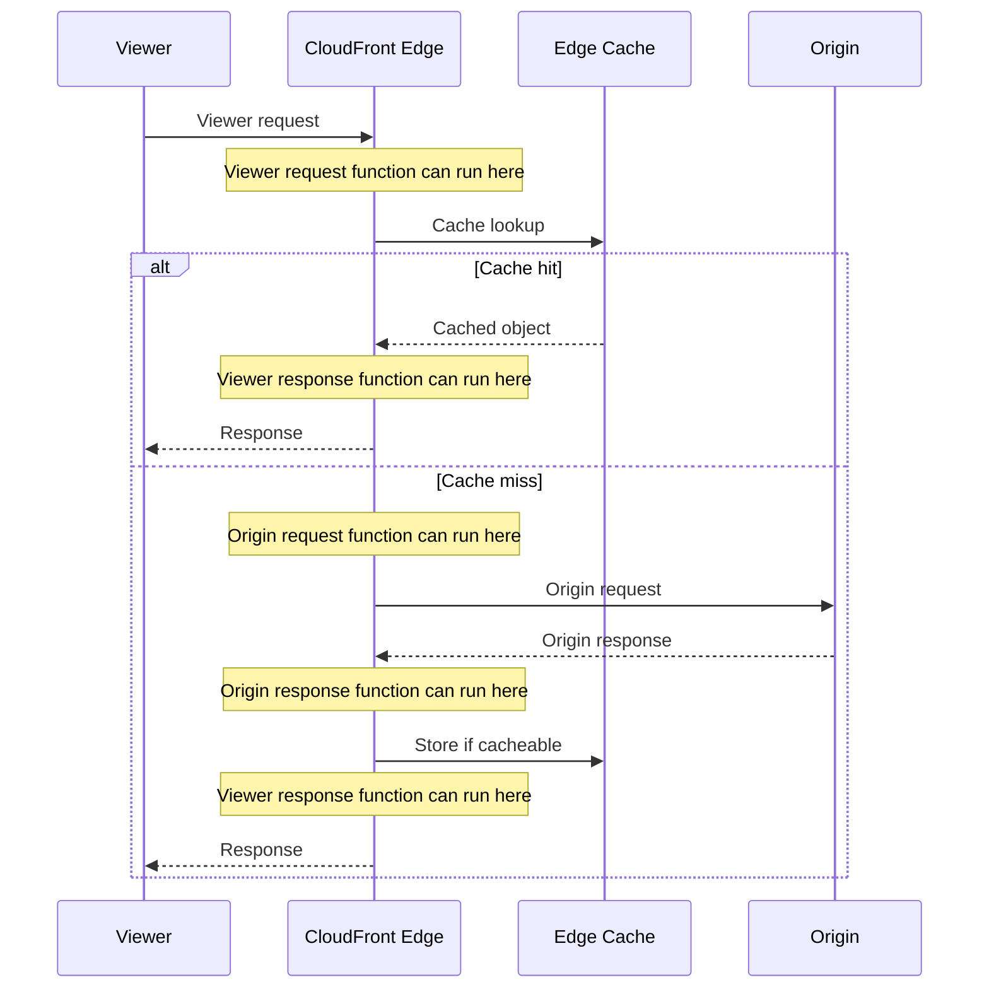
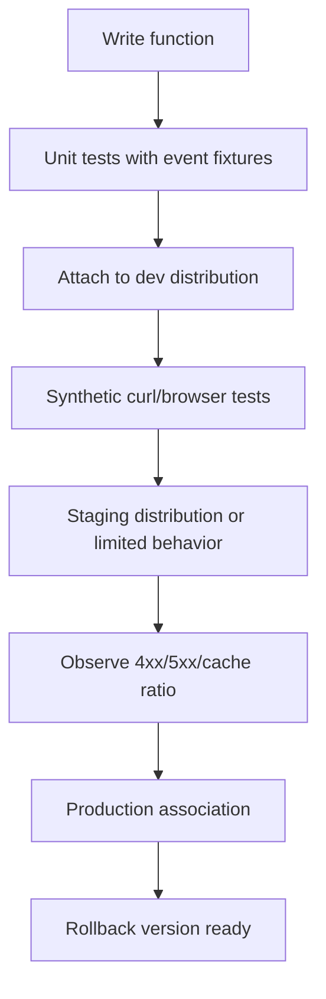
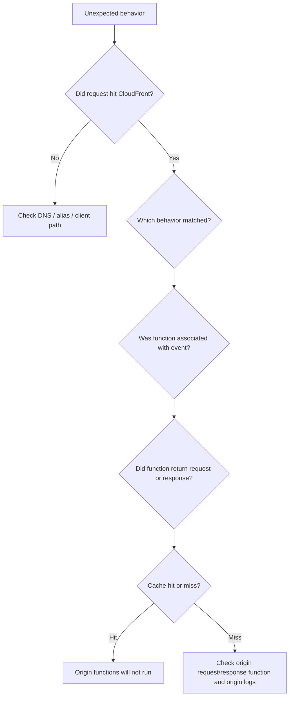

# Part 058 — CloudFront Functions and Lambda@Edge

Edge compute is not a place to move your application because it feels modern.

It is a place to make small, latency-sensitive, request-path decisions close to the viewer.

Good edge compute:

- normalizes cache keys
- redirects old URLs
- rewrites SPA routes
- adds or removes simple headers
- performs lightweight request authorization
- chooses an origin based on request metadata
- blocks obviously invalid requests before origin
- reduces origin work without hiding business logic

Bad edge compute:

- becomes a second application stack
- performs heavy business workflows
- depends on many external services
- stores secrets in unsafe places
- mutates cache identity accidentally
- makes debugging impossible
- hides authorization rules outside the main domain model

The question is not:

> Can this run at the edge?

The question is:

> Should this decision be made before cache, before origin, and without the full application context?

---

## 1. CloudFront Request Lifecycle with Edge Hooks

CloudFront has four major event positions around cache and origin.



The event position determines what information exists and what side effects happen.

| Event | Runs before cache lookup? | Runs on cache hit? | Can affect cache key? | Typical use |
|---|---:|---:|---:|---|
| Viewer request | Yes | Yes | Yes | URL rewrite, redirect, lightweight auth, cache normalization |
| Origin request | No | No | Indirectly after miss | origin selection, origin header manipulation, miss-only logic |
| Origin response | No | No | No for already chosen cache key | error rewrite, origin response shaping |
| Viewer response | No | Yes | No | security headers, response header adjustment |

Most edge bugs come from choosing the wrong event.

---

## 2. CloudFront Functions vs Lambda@Edge

CloudFront has two edge compute options:

- **CloudFront Functions**: lightweight JavaScript functions for viewer request/response events.
- **Lambda@Edge**: Lambda-based functions for viewer and origin request/response events.

Decision table:

| Need | Prefer |
|---|---|
| Sub-millisecond request normalization | CloudFront Functions |
| URL redirect/rewrite at viewer request | CloudFront Functions |
| Simple header add/remove at viewer boundary | CloudFront Functions |
| JWT/header shape check without network calls | CloudFront Functions if lightweight enough |
| Origin request manipulation | Lambda@Edge |
| Dynamic origin selection | Lambda@Edge |
| Access to request body | Lambda@Edge, with body limits |
| Third-party libraries | Lambda@Edge |
| Network calls to external services | Lambda@Edge, but be careful |
| More CPU/memory | Lambda@Edge |
| Runs only on cache miss | Lambda@Edge origin request/response |

Mental shortcut:

```yaml
cloudfront_functions:
  place: viewer_edge
  personality: tiny_fast_policy_logic
  avoid: heavy_dependencies_network_calls_request_body

lambda_at_edge:
  place: viewer_or_origin_edge
  personality: larger_request_response_customization
  avoid: becoming_full_application_runtime
```

---

## 3. Event Selection Framework

Use this decision tree.

```mermaid
flowchart TD
    A[Need edge logic?] --> B{Must run before cache lookup?}
    B -->|Yes| C{Lightweight and no network/body?}
    C -->|Yes| CF[CloudFront Function viewer request]
    C -->|No| LVR[Lambda@Edge viewer request]
    B -->|No| D{Only needed on cache miss?}
    D -->|Yes| E{Need request before origin or response after origin?}
    E -->|Before origin| LOR[Lambda@Edge origin request]
    E -->|After origin| LORS[Lambda@Edge origin response]
    D -->|No| F{Only response header mutation?}
    F -->|Yes| H[Response headers policy or viewer response function]
    F -->|No| RE[Re-check design; maybe application logic belongs at origin]
```

Ask four questions:

1. Does this logic need to run for cached objects?
2. Does this logic need to affect cache key identity?
3. Does this logic need origin-only information?
4. Can this logic safely execute without application database/state?

If the answer to #4 is no, edge is probably the wrong place.

---

## 4. Cache Key Normalization

Cache key normalization is one of the best CloudFront Functions use cases.

Problem:

```text
/assets/app.js?v=1&utm_source=ad
/assets/app.js?utm_source=ad&v=1
/assets/app.js?v=1&utm_campaign=x
```

If irrelevant query parameters are part of the cache key, the same object gets cached multiple times.

A viewer request function can normalize path/query before cache lookup.

Conceptual logic:

```javascript
function handler(event) {
  var request = event.request;

  // Example intent only: keep only query parameters that affect content.
  var allowed = ['v', 'lang'];
  var normalized = {};

  for (var key in request.querystring) {
    if (allowed.indexOf(key) >= 0) {
      normalized[key] = request.querystring[key];
    }
  }

  request.querystring = normalized;
  return request;
}
```

Invariant:

> Remove only request attributes that do not affect response bytes or authorization.

Do not normalize away:

- tenant identity
- language when content differs
- device class when content differs
- authorization-bearing parameters
- signed URL parameters unless CloudFront validates them separately and bytes are shared safely

---

## 5. URL Redirects

Redirects at the edge are useful for old URL migration and canonicalization.

Examples:

- `/old-docs/*` → `/docs/*`
- `example.com` → `www.example.com`
- HTTP → HTTPS, though viewer protocol policy often handles this better
- `/blog?id=123` → `/blog/some-slug`

CloudFront Function response pattern:

```javascript
function handler(event) {
  var request = event.request;

  if (request.uri.startsWith('/old/')) {
    return {
      statusCode: 301,
      statusDescription: 'Moved Permanently',
      headers: {
        location: { value: request.uri.replace('/old/', '/new/') }
      }
    };
  }

  return request;
}
```

Rules:

```yaml
redirect_rules:
  permanent_301: only_when_stable_forever
  temporary_302_or_307: for experiments_or_uncertain_migrations
  preserve_query_string: explicit_decision
  avoid_redirect_loops: test_required
  canonical_host: one_source_of_truth
```

A redirect bug at CloudFront can become global immediately after propagation.

Always test:

```bash
curl -I https://www.example.com/old/path
curl -I -L https://www.example.com/old/path
```

---

## 6. URL Rewrites

A rewrite changes what CloudFront requests without telling the viewer.

Example: single-page application fallback.

```javascript
function handler(event) {
  var request = event.request;

  var uri = request.uri;
  var hasExtension = uri.split('/').pop().indexOf('.') >= 0;

  if (!hasExtension && !uri.startsWith('/api/')) {
    request.uri = '/index.html';
  }

  return request;
}
```

Good uses:

- SPA routing
- clean URL mapping
- locale path normalization
- static asset path migration

Dangerous uses:

- hiding authorization decisions
- rewriting tenant path from untrusted headers
- making origin logs diverge from user-visible URL without correlation
- rewriting API methods or bodies

Rewrite contract:

```yaml
rewrite_contract:
  viewer_visible_url: /docs/getting-started
  origin_uri: /docs/index.html
  cache_key_uses: rewritten_uri_or_viewer_uri_explicitly_understood
  logs_preserve_original: true
```

---

## 7. Lightweight Authorization at the Edge

CloudFront Functions can perform lightweight authorization checks such as:

- required header exists
- token has expected shape
- HMAC timestamp is not stale
- JWT signature validation if implementation fits runtime constraints
- path-level allow/deny based on simple metadata

Example intent:

```javascript
function handler(event) {
  var request = event.request;
  var headers = request.headers;

  if (!headers.authorization) {
    return {
      statusCode: 401,
      statusDescription: 'Unauthorized',
      headers: {
        'cache-control': { value: 'no-store' }
      }
    };
  }

  return request;
}
```

Do not confuse this with full authorization.

Edge authorization is good when the rule is:

```yaml
edge_authorization_good:
  input: request_metadata_only
  state: none_or_static_key_value
  decision: coarse
  failure: safe_deny
  origin_still_enforces_business_auth: true
```

It is bad when the rule needs:

```yaml
edge_authorization_bad:
  needs_database: true
  needs_fresh_entitlements: true
  needs_complex_case_state: true
  needs_audit_workflow: true
  needs_revocation_immediate: true
```

For complex authorization, let edge reject obviously invalid traffic, but let the origin own the domain decision.

---

## 8. Origin Request Logic

Lambda@Edge origin request functions run only when CloudFront is about to call the origin. That means they do not run on cache hits.

Use origin request functions for:

- dynamic origin selection
- origin path modification on miss
- adding origin-only headers
- miss-only authentication delegation
- serving different origins by region/device/language after cache miss

Example conceptual dynamic origin selection:

```javascript
exports.handler = async (event, context, callback) => {
  const request = event.Records[0].cf.request;
  const headers = request.headers;

  const country = headers['cloudfront-viewer-country']?.[0]?.value;

  if (country === 'ID') {
    request.origin = {
      custom: {
        domainName: 'origin-id.example.com',
        port: 443,
        protocol: 'https',
        path: '',
        sslProtocols: ['TLSv1.2'],
        readTimeout: 30,
        keepaliveTimeout: 5,
        customHeaders: {}
      }
    };
    request.headers['host'] = [{ key: 'Host', value: 'origin-id.example.com' }];
  }

  callback(null, request);
};
```

Critical detail: if you change origin domain, Host header and TLS expectations must match.

Bad:

```yaml
origin_domain: origin-id.example.com
host_header: www.example.com
certificate_san: origin-id.example.com
result: possible_tls_or_app_routing_bug
```

Good:

```yaml
origin_domain: origin-id.example.com
host_header: origin-id.example.com
certificate_san: origin-id.example.com
```

Unless your origin explicitly expects a different Host header.

---

## 9. Origin Response Logic

Lambda@Edge origin response functions run after origin responds on a cache miss.

Use cases:

- transform selected origin errors
- add headers based on origin response
- normalize redirects from origin
- generate fallback for origin-specific response

Be careful with caching.

If origin returns `404`, and your origin response function rewrites it to `200` with fallback HTML, decide whether that fallback should be cached.

Example pattern:

```yaml
origin_response_fallback:
  origin_status: 404
  replacement: /index.html_or_static_error_page
  cache_control: explicit
  risk: caching_error_as_success_for_too_long
```

Prefer CloudFront custom error responses for simple static error mapping. Use Lambda@Edge only when response logic requires code.

---

## 10. Viewer Response Logic

Viewer response functions run before CloudFront returns a response to the viewer.

Use cases:

- add simple security headers
- remove internal headers
- add diagnostic response header in non-production
- normalize response headers

But if the header is static, prefer a response headers policy.

Bad:

```javascript
// Using code for static security headers everywhere
```

Better:

```yaml
response_headers_policy:
  strict_transport_security: enabled
  content_type_options: nosniff
  frame_options: DENY
  referrer_policy: same-origin
```

Use code when:

```yaml
viewer_response_code_needed:
  header_depends_on_path: true
  header_depends_on_request_header: true
  behavior_policy_is_not_expressive_enough: true
```

---

## 11. Request Body Handling

CloudFront Functions do not access request body.

Lambda@Edge can access a body only with explicit include-body behavior and strict limits.

Before using body access, challenge the design:

> Why is body-level logic happening before the origin?

Acceptable cases:

- small form normalization
- lightweight bot/abuse rejection
- early validation for very expensive origin operations

Bad cases:

- full API validation layer
- business transaction processing
- large upload inspection
- replacing application request parsing

For uploads, prefer origin/application control unless you have a very specific edge requirement.

---

## 12. State and Configuration

Edge code should be mostly stateless.

CloudFront Functions can use CloudFront KeyValueStore for certain viewer-side lookup patterns. Lambda@Edge has different constraints and should not be treated like regional Lambda with all features available.

Use state carefully:

```yaml
edge_state_good:
  - small redirect maps
  - feature flags for edge routing
  - country/path allowlists
  - static key metadata

edge_state_bad:
  - frequently changing account balances
  - case workflow state
  - user entitlement requiring immediate revocation
  - large per-user policy database
```

If state freshness matters more than latency, keep the decision at the origin.

---

## 13. Deployment Model

Edge code deployment has different operational characteristics from normal application deployment.

For Lambda@Edge:

- function must be published as a numbered version
- association uses a version, not `$LATEST`
- function is created in `us-east-1`
- replication and propagation take time
- rollback means associating a previous known-good version

For CloudFront Functions:

- develop/test/publish function
- associate with distribution behavior event
- keep functions tiny and deterministic
- avoid broad blast radius without staged rollout strategy

Deployment safety pattern:



Test fixtures are non-negotiable.

Example event fixture categories:

```yaml
edge_function_test_cases:
  - normal_request
  - missing_header
  - malformed_query_string
  - encoded_path
  - uppercase_lowercase_host
  - mobile_user_agent
  - signed_url_params
  - static_asset_path
  - api_path
  - malicious_header_shape
  - redirect_loop_candidate
```

---

## 14. Cache Interaction: The Most Important Part

Any viewer request mutation before cache lookup can change cache behavior.

Example:

```text
Viewer asks: /docs
Function rewrites: /docs/index.html
Cache key uses rewritten URI
```

That may be correct.

But consider:

```text
Viewer asks: /tenant-a/dashboard
Function rewrites: /dashboard
Cache key uses /dashboard
```

Now tenant A and tenant B may share a cached response unless tenant is still represented in the cache key or caching is disabled.

Invariant:

> If edge code removes information from the request before cache lookup, prove that the removed information does not affect response bytes or authorization.

Cache review checklist:

```yaml
cache_mutation_review:
  path_changed: yes_or_no
  query_changed: yes_or_no
  header_changed: yes_or_no
  cookie_changed: yes_or_no
  removed_fields_affect_response: false_required
  removed_fields_affect_authorization: false_required
  resulting_cache_key_documented: true
```

---

## 15. Edge Auth and Replay

If an edge function validates tokens, think about replay.

Simple HMAC example:

```yaml
request_token:
  path: /download/report.pdf
  expires: 2026-07-06T10:00:00Z
  signature: HMAC(secret, method + path + expires)
```

Validation checks:

- signature is valid
- expiry is in the future
- method/path match the signed values
- clock skew allowed only narrowly
- token is scoped to exact resource or narrow prefix

Replay problem:

> Anyone who captures the token can reuse it until expiry.

Mitigations:

- short expiry
- HTTPS only
- path/method binding
- optional IP binding when stable
- avoid logging full tokens
- origin-side authorization for high-value operations

Do not put long-lived global secrets in edge code casually.

---

## 16. Header Trust Boundaries

Headers are not trustworthy just because they exist.

A viewer can send:

```text
CloudFront-Viewer-Country: US
X-Forwarded-For: 1.2.3.4
X-Tenant-Id: tenant-a
X-Admin: true
```

CloudFront may add or overwrite some headers depending on policy and event phase. Your function must know whether a header came from viewer, CloudFront, or origin.

Design rules:

```yaml
header_trust:
  viewer_supplied_headers: untrusted
  cloudfront_added_headers: trust_only_after_cloudfront_adds_them
  origin_custom_header_secret: sensitive_not_viewer_visible
  app_authorization_headers: validated_by_app
```

If tenant identity is accepted from a viewer header, you likely have an authorization bug.

If tenant identity is derived from a validated token, it can be used more safely.

---

## 17. Dynamic Origin Selection

Dynamic origin selection is powerful and dangerous.

Good use cases:

- regional origin routing
- origin migration
- canary at origin layer
- A/B static experience when content is safe
- language-specific static origins

Dangerous use cases:

- user-controlled origin hostname
- open proxy behavior
- origin chosen from unvalidated query parameter
- tenant origin mapping without strong auth
- hidden data residency violation

Bad:

```javascript
// Never let viewer choose arbitrary origin.
request.origin.custom.domainName = request.querystring.origin.value;
```

Better:

```javascript
var allowedOrigins = {
  'id': 'origin-id.example.com',
  'sg': 'origin-sg.example.com',
  'default': 'origin-us.example.com'
};
```

Origin selection contract:

```yaml
dynamic_origin_selection:
  input: validated_country_or_known_header
  mapping: static_allowlist
  host_header_updated: true
  tls_certificate_matches: true
  cache_key_includes_variant_if_response_differs: true
  observability_header_added: true
```

---

## 18. Multi-Tenant Edge Logic

Multi-tenant systems are where edge logic can quietly become unsafe.

Suppose you route tenants by hostname:

```text
tenant-a.example.com
tenant-b.example.com
```

Safe mapping:

```yaml
tenant_resolution:
  source: host_header
  mapping: controlled_registry
  cache_key: includes_host
  origin_auth: validates_tenant_again
```

Unsafe mapping:

```yaml
tenant_resolution:
  source: X-Tenant-Id viewer_header
  cache_key: missing_tenant
  origin_auth: assumes_edge_checked
```

For tenant systems, the origin must not blindly trust edge rewrite. Edge can optimize, not replace, authorization.

---

## 19. Observability and Debugging

Edge bugs are hard because they happen before origin logs exist.

Use:

- CloudFront logs
- function logs/metrics
- real-time logs for high-signal debugging
- CloudWatch metrics for 4xx/5xx/error rate
- synthetic canaries
- origin logs to verify miss path
- custom debug headers in non-production only

Debug flow:



Add temporary debug headers only for controlled testing:

```yaml
debug_headers:
  X-Debug-Behavior: static
  X-Debug-Rewrite: /index.html
  X-Debug-Origin: origin-id
rules:
  production_public: avoid_or_strictly_gate
  staging: useful
  remove_after_debugging: mandatory
```

---

## 20. Common Failure Modes

| Symptom | Likely cause | Mental model |
|---|---|---|
| Function works in test but not production | Not published/associated/deployed correctly | Edge deployment is versioned and propagated. |
| Origin request function not running | Cache hit | Origin events run only on misses. |
| Header missing in viewer request | CloudFront-added header exists only later or not configured | Event phase matters. |
| Cache hit ratio drops after function | Function introduced high-cardinality cache key | Normalize only safe fields. |
| User-specific response leaks | Rewrite removed tenant/user variance | Cache identity lost authorization boundary. |
| 502 after Lambda@Edge change | Invalid function response shape, body size, header restriction, DNS/TLS issue | Edge validation is strict. |
| Redirect loop | Function redirects already-canonical URL | Test with `curl -L`. |
| Origin TLS failure | Changed origin domain without Host/cert alignment | Origin contract broken. |
| Authorization bypass | Edge trusted viewer-supplied header | Headers need provenance. |
| Rollback slow/confusing | No previous version documented | Keep rollback version and distribution config known. |

---

## 21. Patterns That Belong at CloudFront Functions

### Canonical host redirect

```javascript
function handler(event) {
  var request = event.request;
  var host = request.headers.host.value;

  if (host === 'example.com') {
    return {
      statusCode: 301,
      statusDescription: 'Moved Permanently',
      headers: {
        location: { value: 'https://www.example.com' + request.uri }
      }
    };
  }

  return request;
}
```

### Remove tracking params

```javascript
function handler(event) {
  var request = event.request;
  var qs = request.querystring;
  var cleaned = {};

  for (var key in qs) {
    if (!key.startsWith('utm_') && key !== 'fbclid') {
      cleaned[key] = qs[key];
    }
  }

  request.querystring = cleaned;
  return request;
}
```

### SPA fallback

```javascript
function handler(event) {
  var request = event.request;
  var uri = request.uri;

  if (!uri.includes('.') && !uri.startsWith('/api/')) {
    request.uri = '/index.html';
  }

  return request;
}
```

These are small, deterministic, cache-aware decisions.

---

## 22. Patterns That Belong at Lambda@Edge

### Dynamic origin selection on cache miss

Use when origin choice should happen only when CloudFront needs origin.

### Origin response transformation

Use when response from origin needs conditional code-based change.

### Request body inspection

Use only for small bodies and specific cases.

### Library-dependent logic

Use when logic requires package dependencies not available in CloudFront Functions.

But keep the constraint:

> Lambda@Edge should still be edge logic, not a hidden regional service.

---

## 23. Patterns That Should Stay at Origin

Do not move these to edge unless there is a very strong reason:

- full business authorization
- regulatory workflow state transitions
- database-backed entitlement decisions requiring freshness
- payment processing
- case management transitions
- write-side validation
- audit-critical decisions
- complex personalization
- large request/response transformations

Origin-owned contract:

```yaml
origin_responsibilities:
  business_authz: true
  data_integrity: true
  write_validation: true
  audit_decisions: true
  domain_invariants: true
```

Edge-owned contract:

```yaml
edge_responsibilities:
  request_shape: true
  coarse_rejection: true
  cache_identity: true
  routing_hint: true
  latency_optimization: true
```

---

## 24. Production Review Checklist

Before deploying edge code:

- Event phase is correct.
- Cache key impact is documented.
- Removed headers/query/cookies do not affect response bytes or authorization.
- Redirect loops are tested.
- Origin rewrite updates Host/TLS expectations correctly.
- Function handles malformed input safely.
- Function returns valid CloudFront event structure.
- No secrets are exposed to viewers or logs.
- No viewer-supplied identity header is trusted without validation.
- Origin still enforces business authorization.
- Logs and metrics are enabled.
- Rollback version exists.
- Synthetic tests cover normal and malicious paths.
- Changes are reviewed like production application code.

---

## 25. Final Mental Model

CloudFront Functions and Lambda@Edge are tools for **request-path control**.

They are strongest when they are:

- small
- deterministic
- cache-aware
- stateless or near-stateless
- easy to test
- explicit about header trust
- clear about what belongs to origin

They are dangerous when they are:

- broad
- stateful
- authorization-heavy
- cache-blind
- hard to roll back
- dependent on hidden external behavior

The engineering rule:

> Put logic at the edge only when its correctness depends on being before cache or before origin. Otherwise, keep it where the domain model and operational evidence already live.
