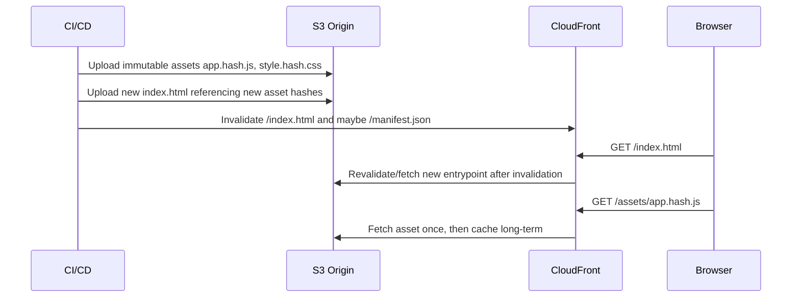
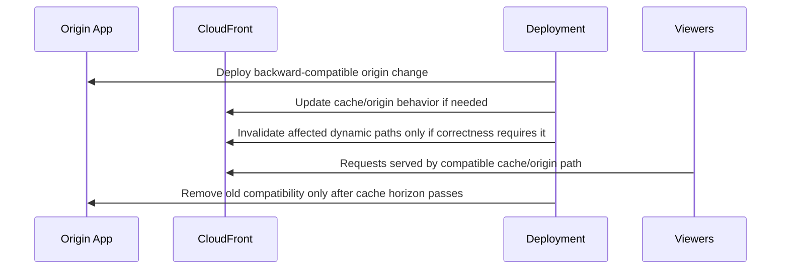
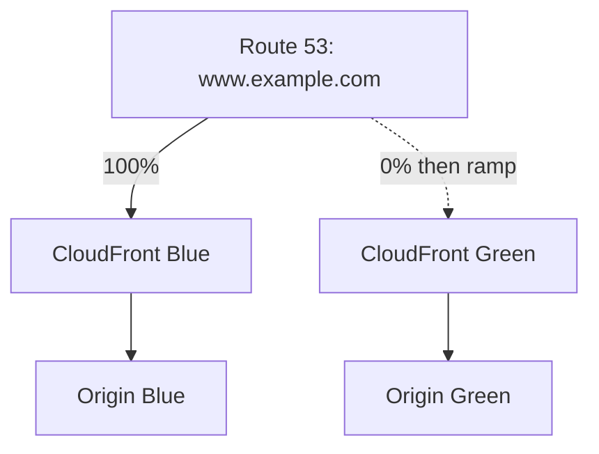
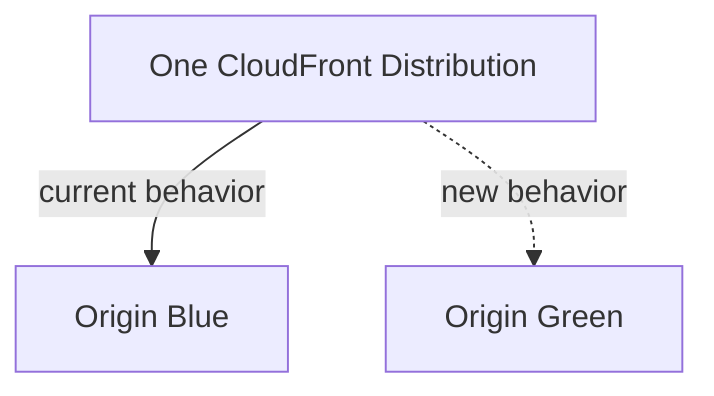
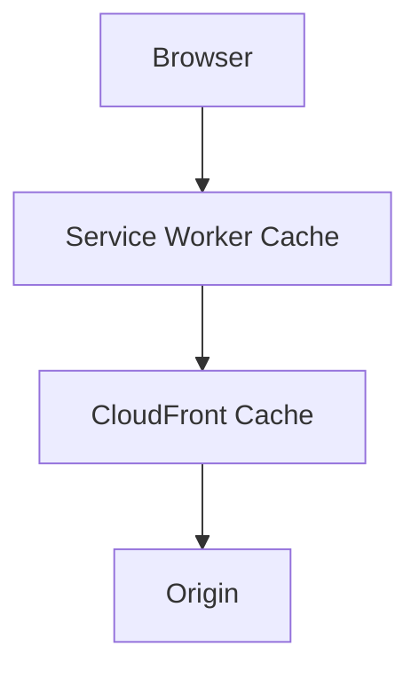
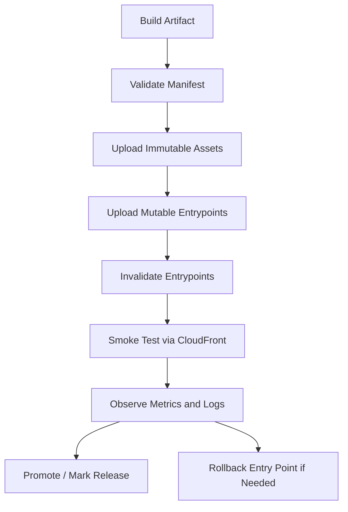
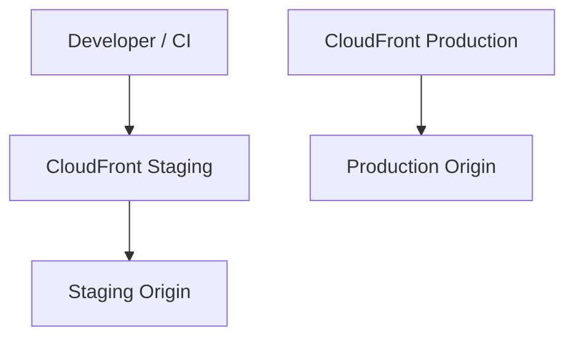

# Part 059 — CloudFront Invalidation, Versioning, and Deployments

In the previous parts, we treated CloudFront as a global edge proxy, cache, security boundary, and edge-compute platform. This part answers the production question that appears after the first successful distribution goes live:

> How do we deploy new content safely when old content is already cached globally?

CloudFront deployment is not simply `upload files to S3` and `invalidate /*`. That works in small systems, but it does not scale as a release discipline. In production, a CloudFront deployment is a coordination problem between:

- object names,
- cache keys,
- cache TTL,
- invalidation scope,
- origin state,
- browser cache,
- DNS/front-door routing,
- rollback strategy,
- and release ownership.

A good deployment model makes cached content an ally. A bad deployment model turns the cache into a distributed stale-state machine.

---

## 1. Core Mental Model

CloudFront has many caches spread across edge locations and regional edge caches. A viewer request may be served from cache without touching your origin. That is the point.

The release problem is therefore:

```text
new deployment exists at origin
but old deployment may still exist at edge
and old deployment may still exist in the browser
and some users may see old HTML with new JS
or new HTML with old JS
or old API schema with new frontend assumptions
```

Do not think of deployment as replacing bytes. Think of it as changing a graph of references.

For a web application, the graph often looks like this:

```mermaid
flowchart TD
    User[Viewer Browser]
    CF[CloudFront Edge Cache]
    HTML[index.html]
    JS1[app.8f71c2.js]
    CSS1[style.91aa0.css]
    API[/api/*]
    S3[S3 Static Origin]
    ALB[ALB / API Origin]

    User --> CF
    CF --> HTML
    HTML --> JS1
    HTML --> CSS1
    HTML --> API
    CF --> S3
    CF --> ALB
```

The HTML document is usually the mutable entrypoint. The JS/CSS/images are usually immutable assets. The API is usually dynamic and governed by compatibility rules.

That leads to the main invariant:

> Mutable entrypoints may be invalidated. Immutable assets should be versioned.

---

## 2. Invalidation vs Versioning

AWS documents two primary ways to update content before cached objects naturally expire:

1. invalidate cached files, so CloudFront fetches them again from origin on the next request;
2. use versioned file names so the new content has a different URL.

These are not equivalent.

| Strategy | What Changes | Best For | Weakness |
|---|---|---|---|
| Invalidation | Same URL, cache entry marked stale/removed | HTML, metadata, emergency purge | Operationally asynchronous, can be overused, has path-count cost model |
| Versioning | New URL points to new object | JS, CSS, images, binaries, long-lived assets | Requires content-addressed build/references |
| Short TTL | Old entry naturally expires soon | Semi-dynamic content | Higher origin load and weaker cache hit ratio |
| No-store/no-cache | Avoid cache persistence | Truly user-specific or highly volatile content | Gives up CDN benefit |
| Cache tag invalidation | Invalidate by semantic tags | Groups of objects not aligned to paths | Requires deliberate tagging model |

A mature system uses all of them, but not randomly.

---

## 3. Why `invalidate /*` Is a Smell

`/*` is useful during emergencies. It is a bad default release primitive.

It has several problems:

- It destroys cache locality globally.
- It causes the next wave of requests to refetch from origin.
- It hides bad cache-key and TTL design.
- It can amplify origin load after a deployment.
- It makes every release behave like a cache outage.
- It does not fix browser cache if browsers cached assets independently.
- It can still race with clients that already loaded stale HTML.

Use global wildcard invalidation only when the business requirement is stronger than the cache-warmth requirement, such as security exposure, legal removal, severe content corruption, or broken release recovery.

A better default is:

```text
invalidate mutable entrypoints only
use immutable file names for assets
keep API backward compatible
roll forward by changing references
roll back by repointing entrypoint references
```

---

## 4. Immutable Asset Versioning

Immutable asset versioning means the content hash is part of the file name.

Examples:

```text
/assets/app.9f3a22c1.js
/assets/vendor.71be02ef.js
/assets/styles.510a7b8a.css
/assets/logo.2026-07-06.svg
```

If the content changes, the URL changes.

That gives you a powerful invariant:

> A URL never changes meaning.

When this invariant holds, you can cache assets aggressively because `/assets/app.9f3a22c1.js` will always be the same bytes.

Recommended headers for immutable assets:

```http
Cache-Control: public, max-age=31536000, immutable
```

This does not mean every file should use one-year cache. It means files with content-addressed names can safely use long TTLs because a new deployment creates new URLs.

### Bad Pattern

```html
<script src="/assets/app.js"></script>
<link rel="stylesheet" href="/assets/style.css" />
```

This makes `app.js` mutable. If cached for long, users may keep old code. If cached for short, performance suffers. If invalidated on every release, origin load increases.

### Better Pattern

```html
<script src="/assets/app.9f3a22c1.js"></script>
<link rel="stylesheet" href="/assets/style.510a7b8a.css" />
```

The mutable object becomes only the HTML entrypoint that references the latest immutable assets.

---

## 5. The Entry Point Problem

The entrypoint is usually one of these:

```text
/index.html
/app/index.html
/manifest.json
/service-worker.js
/config/runtime.json
```

Entrypoints are different from assets. They are pointers to a release.

A typical SPA release works like this:



The correct release order is important:

1. Upload all immutable assets first.
2. Verify assets exist at origin.
3. Upload the new entrypoint last.
4. Invalidate only the entrypoint paths.
5. Run smoke tests through CloudFront, not only against origin.

Never publish an entrypoint that references assets not yet uploaded.

---

## 6. Cache-Control Contracts

Think of `Cache-Control` as a distributed consistency contract.

Common patterns:

| Content | Example | Cache-Control | Deployment Behavior |
|---|---|---|---|
| Immutable static asset | `/assets/app.hash.js` | `public, max-age=31536000, immutable` | Never invalidate under normal release |
| HTML entrypoint | `/index.html` | `public, max-age=60, stale-while-revalidate=...` or controlled TTL | Invalidate on release if quick rollout needed |
| Runtime config | `/config/runtime.json` | short TTL, sometimes no-cache | Can change without rebuilding app |
| User-specific API | `/api/me` | `private, no-store` | Usually bypass CloudFront cache |
| Public API response | `/api/catalog` | explicit TTL by business freshness | Version API contract separately |
| Error response | `404`, `500` | short error TTL | Avoid caching transient origin failure too long |

Important distinction:

- Browser cache is controlled by response headers received by the browser.
- CloudFront cache is controlled by CloudFront policies and origin headers.
- Invalidation only affects CloudFront cache, not content already cached by browsers.

That is why immutable filenames are more reliable than relying purely on invalidation.

---

## 7. CloudFront Invalidation Semantics

Invalidation tells CloudFront to remove or mark cached objects as stale. On the next viewer request for that path, CloudFront goes back to origin.

Operational facts to internalize:

- invalidation is not a synchronous global transaction;
- wildcard invalidation can cover many objects;
- invalidating a path invalidates all cached variants for that object across associated headers/cookies, but query string behavior needs care;
- invalidation does not change origin content;
- invalidation does not purge browser cache;
- invalidation should be treated as a release event and logged.

### Path Examples

```text
/index.html
/manifest.json
/config/runtime.json
/assets/legacy-broken-file.js
/images/*
/*
```

A wildcard path can count as one invalidation path even if it affects many files, but using broad wildcards casually is still a performance and reliability smell.

---

## 8. Query Strings, Headers, Cookies, and Invalidations

Part 055 explained cache keys. Here is the deployment consequence.

If your cache key varies by query string, header, or cookie, CloudFront can hold multiple variants for the same logical path.

Examples:

```text
/products?page=1
/products?page=2
/products?currency=USD
/products?currency=EUR
```

A deployment or purge policy must know whether the query string is part of the identity of the content.

Bad release thinking:

```text
Invalidate /products and assume all variants are gone.
```

Better release thinking:

```text
Do we cache /products by query string?
If yes, do we need /products* or exact paths?
Can we instead use cache tags or shorter TTL for this class?
```

Rule of thumb:

> Every cache-key dimension creates a deployment invalidation dimension.

If you add `Accept-Language`, `CloudFront-Viewer-Country`, or `Authorization` to the cache key, you also expanded the number of cached variants that may need reasoning during release.

---

## 9. Cache Tag Invalidation

CloudFront supports invalidating cached objects by semantic tags. This is useful when your invalidation boundary does not map cleanly to URL paths.

Example use cases:

- invalidate all pages related to `product:1234`;
- invalidate all pages under `tenant:alpha`;
- invalidate all fragments generated from `catalog:v7`;
- invalidate all localized pages for a business entity.

Path-based invalidation is URL-structure dependent. Tag-based invalidation is domain-dependent.

Conceptually:

```mermaid
flowchart LR
    ProductUpdate[Product 1234 updated]
    Tag[Cache tag: product-1234]
    Obj1[/products/1234]
    Obj2[/search?q=1234]
    Obj3[/category/shoes?page=2]

    ProductUpdate --> Tag
    Tag --> Obj1
    Tag --> Obj2
    Tag --> Obj3
```

Design warning:

> Cache tags are not an excuse to avoid TTL and cache-key design. They are a precision tool for domain-driven invalidation.

Use tags when you have a real entity/content graph. Do not tag everything with broad tags like `all`, `site`, or `production` and call it engineering.

---

## 10. Release Patterns for Static Websites

### Pattern A — Small Static Site

Good for documentation, landing pages, internal tools.

```text
- S3 origin
- CloudFront distribution
- long TTL for hashed assets
- short TTL or invalidation for HTML
- CI uploads assets first, HTML last
```

Release algorithm:

```bash
# 1. Build
npm ci
npm run build

# 2. Upload immutable assets with long cache
aws s3 sync dist/assets s3://my-site/assets \
  --cache-control "public,max-age=31536000,immutable"

# 3. Upload HTML/config with shorter cache
aws s3 cp dist/index.html s3://my-site/index.html \
  --cache-control "public,max-age=60"

# 4. Invalidate mutable entrypoint
aws cloudfront create-invalidation \
  --distribution-id E1234567890 \
  --paths "/index.html" "/manifest.json"
```

The important thing is not the exact command. The important thing is the order.

### Pattern B — SPA With Runtime Config

Avoid baking environment-specific configuration into hashed JS when you need late binding.

```text
/index.html                  short TTL
/config/runtime.json          short TTL
/assets/app.<hash>.js         long TTL immutable
/assets/chunk.<hash>.js       long TTL immutable
```

This lets you change API base URL, feature flags, or tenant metadata without rebuilding every asset.

But `runtime.json` becomes a mutable operational object. Treat it as configuration, not as random static content.

### Pattern C — Documentation Site

Docs often need fast correction but also strong cache performance.

Recommended layout:

```text
/docs/index.html              short TTL or invalidated
/docs/<slug>/index.html       moderate TTL
/assets/<hash>.js             long TTL immutable
/assets/<hash>.css            long TTL immutable
/search-index.<hash>.json     long TTL immutable
/latest-search-index.json     short TTL pointer if needed
```

Never make the entire docs site depend on `invalidate /*` unless your volume is tiny.

---

## 11. Release Patterns for Dynamic Origins

CloudFront is often in front of ALB, API Gateway, or a custom origin. The deployment problem is then less about S3 files and more about application compatibility.

### Dynamic Origin Invariant

> A new edge configuration must be compatible with both the old and new origin during rollout.

Examples:

- If CloudFront starts forwarding a new header, old origin must tolerate it.
- If CloudFront stops forwarding a cookie, origin must not depend on it.
- If CloudFront rewrites URLs, both app versions should understand the path during transition.
- If cache policy changes, you must reason about stale variants already cached.

### Safe Dynamic Deployment Sequence



This mirrors database migration discipline:

```text
expand -> migrate -> contract
```

For CloudFront:

```text
make origin compatible -> update edge/cache behavior -> let old variants expire -> remove compatibility
```

---

## 12. Blue/Green With CloudFront

Blue/green is not one pattern. There are several layers where it can happen.

| Layer | Blue/Green Mechanism | Use When |
|---|---|---|
| DNS | Route 53 weighted/alias switch between distributions | You need independent CloudFront distributions |
| CloudFront origin | Same distribution, switch origin or origin group behavior | You want one stable hostname/distribution |
| Origin path | Same origin, change origin path from `/blue` to `/green` | Static release trees in S3/custom origin |
| Application LB | CloudFront points to ALB, ALB shifts target groups | App team owns rollout behind stable CDN |
| Asset pointer | HTML references new asset hash | Static asset rollout |

### Distribution-Level Blue/Green



Benefits:

- strong isolation;
- easy rollback by DNS weighting;
- can test Green with its CloudFront domain or alternate staging domain;
- safer for major distribution config changes.

Costs/trade-offs:

- DNS TTL and resolver behavior matter;
- certificate/CNAME ownership needs care;
- duplicate distribution config can drift;
- WAF/logging/security controls must be replicated.

### Origin-Level Blue/Green



Benefits:

- stable distribution and hostname;
- less DNS movement;
- easier to keep WAF/logging/common policies stable.

Risks:

- distribution config updates are global control-plane operations;
- rollback still requires CloudFront config deployment;
- stale cache entries may survive unless URLs/cache keys differ.

---

## 13. Canary Releases

CloudFront can support canary-style rollout, but be precise about the layer.

### Canary by DNS Weight

Use Route 53 weighted records pointing to separate CloudFront distributions.

Pros:

- clear separation;
- simple mental model;
- rollback is DNS weight.

Cons:

- DNS caching makes percentages approximate;
- not ideal for per-request deterministic routing;
- client stickiness is weak unless application handles it.

### Canary by Edge Logic

Use CloudFront Functions or Lambda@Edge to route based on cookie/header/path.

Pros:

- better request-level control;
- can pin users to cohort;
- does not require DNS change.

Cons:

- code at edge becomes routing control plane;
- must avoid cache poisoning by including cohort dimension when needed;
- observability must distinguish cohorts.

Example request routing concept:

```js
function handler(event) {
  var request = event.request;
  var headers = request.headers;

  if (headers.cookie && headers.cookie.value.includes('release=green')) {
    request.uri = '/green' + request.uri;
  } else {
    request.uri = '/blue' + request.uri;
  }

  return request;
}
```

Do not blindly copy this into production. The point is the invariant:

> If release cohort changes response identity, the cache key or URI must reflect the cohort.

Otherwise, a green response can be cached and served to a blue user.

---

## 14. Rollback Design

A rollback must be designed before the release.

### Static Site Rollback

With immutable assets, rollback is simple:

```text
previous index.html -> references previous asset hashes
assets still exist -> rollback is republish previous entrypoint
invalidate /index.html
```

This is why you should not delete old hashed assets immediately.

Keep at least a retention window:

```text
release artifacts retained for 30-90 days
or at least longer than max browser/cache TTL
```

### Dynamic App Rollback

Rollback is harder because cached responses may encode behavior from the new version.

Questions to answer before release:

- Are cached responses schema-compatible with the old app?
- Did we change cache key dimensions?
- Did we change forwarded headers/cookies/query strings?
- Did we change authorization behavior?
- Did we cache errors during the incident?
- Which paths need invalidation on rollback?

Rollback checklist:

```text
1. Stop traffic ramp or switch origin/DNS back.
2. Confirm origin old version is healthy.
3. Invalidate only incorrect mutable/dynamic paths.
4. Keep immutable assets from both versions available.
5. Watch 4xx/5xx/cache-hit/origin-latency metrics.
6. Compare CloudFront logs by release cohort or distribution.
```

---

## 15. Service Workers and Browser Cache

Service workers can break otherwise-correct CloudFront deployments.

A service worker is another cache layer with its own lifecycle. If it caches assets aggressively, CloudFront invalidation may not affect what the browser serves.

Recommended discipline:

- version service worker explicitly;
- avoid caching HTML entrypoints forever;
- use content-hashed asset names;
- test hard refresh and normal navigation;
- test upgrade from N-1 and N-2 versions, not only fresh install;
- provide a safe kill switch for bad service worker behavior.

For service workers, the release graph expands:



When debugging stale content, ask:

```text
Is the response from browser memory/disk cache?
Is it from service worker?
Is it from CloudFront?
Is it from origin?
```

Do not assume the CDN is guilty.

---

## 16. API Deployment Behind CloudFront

For APIs, deployment safety depends on compatibility and cacheability.

### Safe API Rules

1. Do not cache user-specific responses unless the cache key includes the complete identity boundary, which is usually dangerous.
2. Prefer additive API changes.
3. Keep old fields and old semantics until cached clients naturally age out.
4. Version breaking API changes in URL, header, or media type.
5. Be careful caching `404` or `403`; negative cache can hide newly-created resources.
6. Use short error caching TTLs for volatile APIs.
7. Include release version in logs and response headers for debugging.

Example response headers:

```http
X-App-Version: 2026.07.06.1
X-Cache-Policy: public-catalog-v3
Cache-Control: public, max-age=60, stale-while-revalidate=300
```

These headers help correlate user reports with deployment state.

---

## 17. Cache-Safe CI/CD Pipeline

A mature CloudFront release pipeline has explicit phases.



### Manifest Validation

Before upload, validate that every referenced asset exists in the build output.

Example release manifest:

```json
{
  "release": "2026.07.06.1",
  "entrypoints": [
    "/index.html",
    "/manifest.json"
  ],
  "immutableAssets": [
    "/assets/app.9f3a22c1.js",
    "/assets/vendor.71be02ef.js",
    "/assets/style.510a7b8a.css"
  ],
  "invalidate": [
    "/index.html",
    "/manifest.json"
  ]
}
```

### Deployment Gate

The pipeline should fail if:

- an entrypoint references a missing asset;
- an immutable asset is being overwritten with different bytes;
- a mutable object is uploaded with one-year immutable caching;
- invalidation paths are unexpectedly broad;
- CloudFront smoke test still returns old release after a defined observation window;
- canary cohort has elevated errors.

---

## 18. Safe S3 Upload Discipline

S3 sync is convenient but dangerous if not controlled.

Bad pattern:

```bash
aws s3 sync dist/ s3://site-bucket --delete
aws cloudfront create-invalidation --paths "/*"
```

Why it is risky:

- `--delete` can remove assets still referenced by old HTML in browser/cache;
- every release purges the CDN;
- cache headers may be uniform and wrong;
- rollback may fail because old assets were removed.

Better pattern:

```bash
# Upload hashed assets without deleting old hashes immediately
aws s3 sync dist/assets/ s3://site-bucket/assets/ \
  --cache-control "public,max-age=31536000,immutable" \
  --exclude "*" \
  --include "*.js" \
  --include "*.css" \
  --include "*.png" \
  --include "*.svg"

# Upload entrypoint separately
aws s3 cp dist/index.html s3://site-bucket/index.html \
  --cache-control "public,max-age=60,must-revalidate" \
  --content-type "text/html"

# Targeted invalidation
aws cloudfront create-invalidation \
  --distribution-id "$DISTRIBUTION_ID" \
  --paths "/index.html"
```

Garbage collection of old assets should be a separate job with retention logic, not part of every release.

---

## 19. Distribution Configuration Deployment

Changing CloudFront distribution config is different from changing content.

Examples of config changes:

- add cache behavior;
- change origin request policy;
- change cache policy;
- add CloudFront Function;
- attach WAF web ACL;
- add alternate domain name;
- change TLS certificate;
- enable Origin Shield;
- change origin timeout.

These are control-plane changes. They take time to deploy globally and should be treated as infrastructure releases.

Recommended approach:

```text
1. Store distribution config in IaC.
2. Use separate staging distribution for major config change.
3. Diff cache/origin policies before apply.
4. Apply during low-risk window if blast radius is high.
5. Monitor deployment status and distribution metrics.
6. Keep rollback config ready.
```

Do not mix risky CloudFront config changes with application release unless the dependency is explicit and tested.

---

## 20. Staging Distribution Pattern

A staging distribution is useful for validating CloudFront behavior before production.



Test in staging:

- cache behavior selection;
- header/cookie/query forwarding;
- CORS;
- signed URLs/cookies;
- WAF interaction;
- CloudFront Function/Lambda@Edge behavior;
- origin TLS/SNI/Host header;
- invalidation pipeline;
- access log schema.

But remember: staging traffic volume and geographic distribution rarely match production. Staging proves correctness, not necessarily performance.

---

## 21. Deployment Failure Modes

| Symptom | Likely Cause | How to Prove | Fix |
|---|---|---|---|
| Some users see old UI | HTML cached at edge/browser/service worker | Check `Age`, `x-cache`, browser cache, service worker | Targeted invalidation, service worker update, shorter HTML TTL |
| New HTML references missing JS | Entrypoint uploaded before assets | Fetch asset URL via CloudFront and origin | Upload assets first, validate manifest |
| Users get mixed old/new chunks | Non-hashed assets or deleted old assets | Inspect HTML and network panel | Content-hash assets, retain old assets |
| Invalidation did not affect variant | Query string path mismatch | Check cache key and invalidation path | Use wildcard/query-specific invalidation or better key design |
| Origin spike after release | Overbroad invalidation | CloudFront origin request metrics | Target invalidation, use versioning, warm critical paths |
| Rollback still broken | Cached error/new variant remains | Check logs by path/status/cache result | Invalidate affected paths, fix error TTL |
| Canary leaks to stable users | Cache key lacks cohort dimension | Compare response headers/cookies and cache key | Add cohort to URI/cache key or disable caching for canary response |
| CORS breaks after deploy | Cached preflight or header policy mismatch | Inspect `OPTIONS` response and cache behavior | Cache CORS correctly, invalidate preflight paths |

---

## 22. Deployment Observability

Every release should emit enough data to answer:

```text
Which release served this request?
Was it served from CloudFront cache?
Which cache behavior matched?
Which origin handled it?
Was this a canary user?
Was the object stale, refreshed, or newly fetched?
```

Useful headers:

```http
X-Release-Id: 2026.07.06.1
X-Origin-Name: app-green
X-Cache-Policy-Name: static-assets-v4
X-Canary-Cohort: stable
```

Be careful not to expose sensitive internal data. Release IDs and non-sensitive policy names are usually acceptable; secrets and internal topology are not.

Log dimensions to preserve:

- distribution ID;
- cache behavior/path pattern;
- origin identifier;
- status code;
- edge result type;
- request ID;
- user agent;
- country/edge location;
- release ID header from origin;
- canary cohort if applicable.

---

## 23. Deployment Runbook

### Normal Static Release

```text
1. Build artifact.
2. Generate manifest of entrypoints and immutable assets.
3. Upload immutable assets with long TTL.
4. Upload mutable entrypoints with short TTL.
5. Invalidate entrypoints.
6. Smoke test through CloudFront hostname.
7. Verify x-cache behavior and release marker.
8. Watch 4xx/5xx/origin latency/cache hit ratio.
9. Keep previous assets for rollback window.
```

### Emergency Purge

```text
1. Identify exact sensitive/broken paths.
2. Prefer exact path invalidation.
3. Use wildcard only when path set cannot be enumerated safely.
4. Confirm origin contains corrected response or denies access.
5. Run CloudFront fetch from multiple regions if possible.
6. Confirm browser/service worker implications.
7. Record incident reason and invalidation paths.
```

### Rollback

```text
1. Restore previous entrypoint or switch origin/DNS back.
2. Invalidate mutable paths.
3. Do not delete new assets until investigation completes.
4. Monitor mixed-version symptoms.
5. Compare logs before/after rollback.
```

---

## 24. Engineering Checklist

Before using CloudFront for production deployments, ensure:

- [ ] All static build assets are content-hashed.
- [ ] Immutable assets are uploaded before mutable entrypoints.
- [ ] Old assets are retained longer than max realistic cache/browser TTL.
- [ ] HTML entrypoints have short TTL or release invalidation.
- [ ] Runtime config is separated if late binding is required.
- [ ] Invalidation paths are generated from release manifest.
- [ ] `/*` invalidation requires explicit human approval or incident mode.
- [ ] Cache keys are documented per behavior.
- [ ] Canary cohort affects cache key or URI if response differs.
- [ ] Rollback is tested through CloudFront.
- [ ] Service worker upgrade path is tested.
- [ ] Release ID appears in logs or safe headers.
- [ ] Distribution config changes are IaC-managed and reviewed separately.

---

## 25. The Practical Rule

CloudFront deployment becomes simple when you stop mutating identity.

The strongest production pattern is:

```text
immutable assets: new content -> new URL
mutable entrypoints: small set -> targeted invalidation
APIs: compatibility first -> cache carefully
edge config: IaC change -> tested and rolled out intentionally
```

That model avoids most CDN deployment incidents.

---

## References

- AWS CloudFront Developer Guide — Invalidate files to remove content: https://docs.aws.amazon.com/AmazonCloudFront/latest/DeveloperGuide/Invalidation.html
- AWS CloudFront Developer Guide — What you need to know when invalidating paths: https://docs.aws.amazon.com/AmazonCloudFront/latest/DeveloperGuide/invalidation-specifying-objects.html
- AWS CloudFront Developer Guide — Pay for file invalidation: https://docs.aws.amazon.com/AmazonCloudFront/latest/DeveloperGuide/PayingForInvalidation.html
- AWS CloudFront Developer Guide — Invalidating content by cache tags: https://docs.aws.amazon.com/AmazonCloudFront/latest/DeveloperGuide/invalidation-by-tags.html
- AWS CloudFront Developer Guide — Manage how long content stays in the cache: https://docs.aws.amazon.com/AmazonCloudFront/latest/DeveloperGuide/Expiration.html
