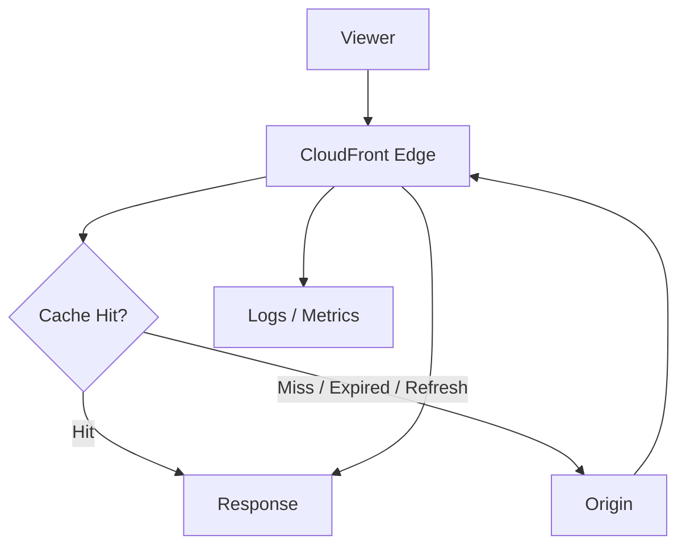
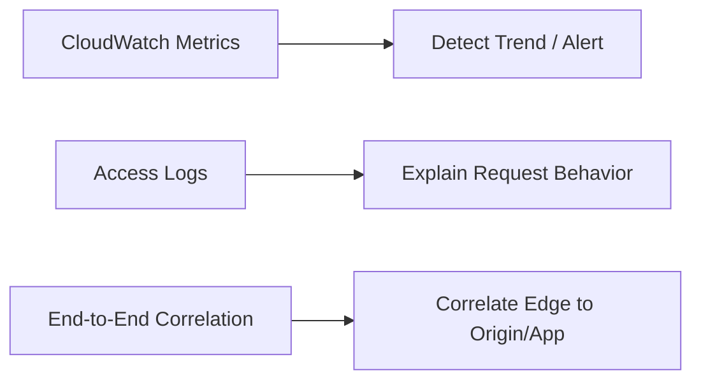
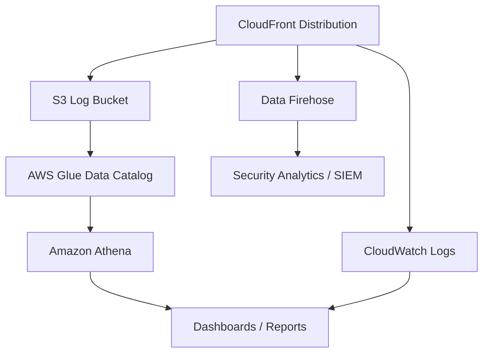
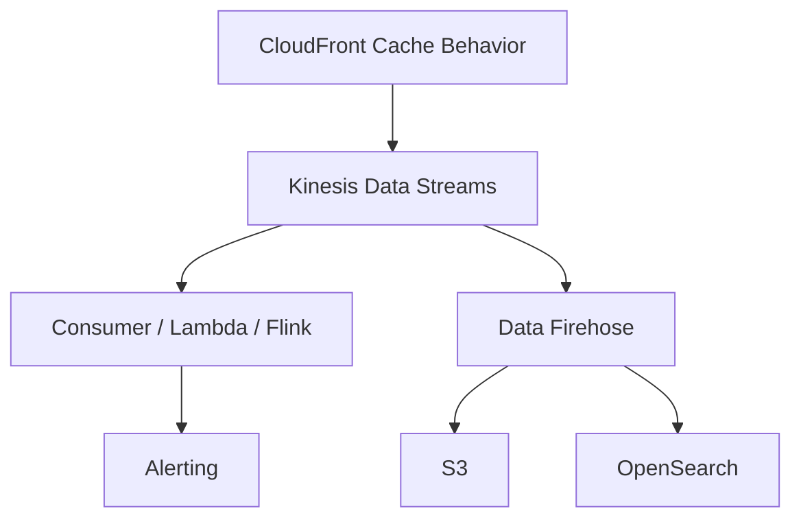
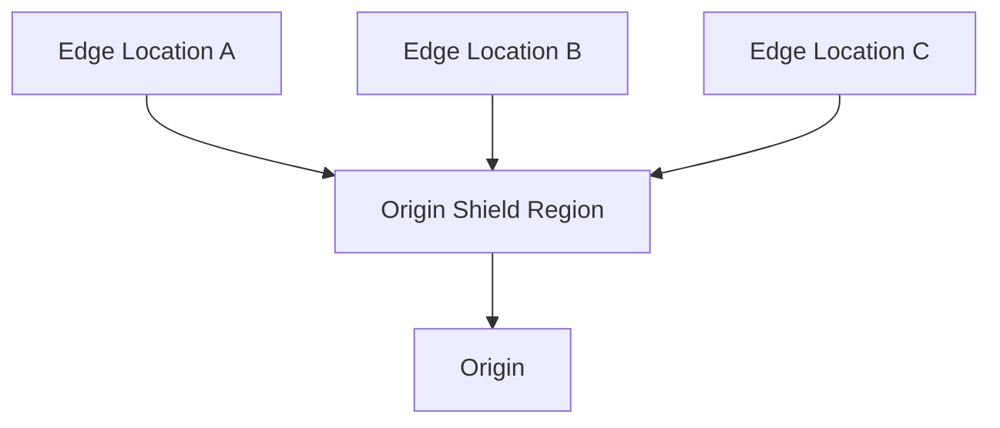
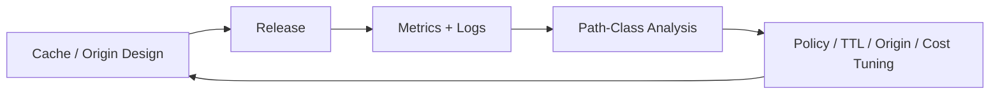

# Part 060 — CloudFront Observability, Performance, and Cost

A CloudFront distribution is easy to create and hard to operate well.

The difference is observability.

Without observability, CloudFront is a black box in front of your application. With observability, it becomes a measurable edge layer where you can answer:

- Is CloudFront helping or hurting latency?
- Are requests served from cache or origin?
- Which path causes origin load?
- Which status codes are generated by CloudFront vs origin?
- Did deployment reduce cache hit ratio?
- Is Origin Shield reducing origin pressure?
- Are real-time logs worth their cost for this workload?
- Is the distribution over-configured for regions or request classes we do not need?

This part turns CloudFront from a feature into an operating system component.

---

## 1. CloudFront Observability Mental Model

A request through CloudFront has several possible outcomes:



Operationally, every request belongs to one of these classes:

| Class | Meaning | Primary Concern |
|---|---|---|
| Cache hit | Served from edge/regional cache | Low latency, low origin cost |
| Cache miss | Fetched from origin | Origin capacity, origin latency |
| Refresh hit/revalidation | Cache entry stale or requires validation | TTL and validation efficiency |
| Error from origin | Origin returned failure | App/origin health |
| Error from CloudFront | Edge rejected/failed request before origin success | TLS, DNS, policy, WAF, config |
| Redirect/rewrite at edge | Function changed request/response | Edge-code correctness |

The goal is not 100% cache hit ratio. The goal is correct cache behavior for each path class.

---

## 2. Three Observability Planes

CloudFront observability has three planes.



### CloudWatch Metrics

Metrics answer: **what is happening at aggregate level?**

Examples:

- requests;
- bytes downloaded/uploaded;
- total error rate;
- 4xx error rate;
- 5xx error rate;
- cache hit rate;
- origin latency;
- edge function errors/throttles/execution utilization.

Metrics are for alarms, dashboards, and trend analysis.

### Access Logs

Logs answer: **what happened for this request or path class?**

Examples:

- which object path;
- which status code;
- cache result;
- edge location;
- user agent;
- referer;
- host;
- request time;
- bytes sent;
- TLS/protocol fields depending on log type/field selection.

Logs are for forensic analysis and cost/performance attribution.

### End-to-End Correlation

Correlation answers: **how do I connect the CloudFront request to origin/application logs?**

Use request IDs and release markers.

At minimum, preserve:

```http
X-Amz-Cf-Id: <CloudFront request id received by origin>
X-Request-Id: <application request id>
X-Release-Id: <origin release version>
```

The origin receives CloudFront headers that can help link edge and application events. Your application should log them safely.

---

## 3. Standard Logs vs Real-Time Logs

CloudFront supports standard access logs and real-time access logs. They solve different problems.

| Capability | Standard Logs | Real-Time Logs |
|---|---|---|
| Delivery model | Batch/log delivery destination | Kinesis Data Streams-based real-time delivery |
| Latency | Not for immediate incident response | Seconds-level operational use case |
| Cost | Standard logs are generally used as baseline logging; destination/storage/query costs still matter | Additional CloudFront + Kinesis/consumer costs |
| Use case | analytics, audit, path-level performance, long-term reporting | incident debugging, live launches, bot spikes, canary monitoring |
| Sampling | Usually broad logging strategy | Sampling rate can be configured |
| Operational complexity | Lower | Higher; requires stream capacity/consumer pipeline |

Use standard logs for the baseline. Add real-time logs only where the decision latency justifies the pipeline and cost.

---

## 4. Standard Logging Architecture

A common production architecture:



Design choices:

- S3 is good for long-term storage and Athena queries.
- CloudWatch Logs is convenient for operational search and metric filters.
- Firehose is useful when streaming to S3/OpenSearch/SIEM.
- Partitioned logs reduce query cost.
- Cross-account delivery can centralize logs in a security/observability account.

Recommended S3 partition idea:

```text
s3://org-logs/cloudfront/
  account_id=123456789012/
  distribution_id=E123ABC/
  year=2026/month=07/day=06/hour=13/
```

Partitioning is not cosmetic. It prevents every Athena query from scanning months of logs.

---

## 5. Real-Time Logging Architecture

Real-time logs are for live operational loops.



Use real-time logs when:

- launching a high-risk release;
- monitoring canary by path/cohort;
- detecting attack/bot spike quickly;
- debugging intermittent edge behavior;
- correlating origin failures with edge request fields in near real time.

Avoid real-time logs when:

- you only need daily analytics;
- no one will watch or alert on the stream;
- the stream is built but not capacity-tested;
- the cost owner is unknown.

Important operational invariant:

> Real-time logs are an operational signal, not a billing-accurate ledger.

AWS documents real-time log delivery as best effort. Do not use it as the sole source for financial reconciliation.

---

## 6. Key CloudFront Metrics

### Distribution-Level Metrics

| Metric Family | What It Tells You | Production Use |
|---|---|---|
| Requests | Traffic volume | Capacity trend, anomaly detection |
| Bytes downloaded/uploaded | Data transfer shape | Cost and workload profile |
| Total error rate | Overall failure ratio | SLO alert |
| 4xx error rate | Client/auth/path errors | Bot, broken links, auth failures |
| 5xx error rate | Origin/edge failure | Incident alert |
| Cache hit rate | Cache efficiency | Origin load and latency analysis |
| Origin latency | Time to origin response | Origin performance signal |

### Edge Function Metrics

For CloudFront Functions and Lambda@Edge, monitor:

- invocation count;
- validation errors;
- execution errors;
- throttles;
- execution utilization for CloudFront Functions;
- duration for Lambda@Edge;
- status-code changes caused by function logic.

Edge code is production code. It needs alarms.

---

## 7. Cache Hit Ratio Is Not Enough

A high cache hit ratio can be bad if you cache the wrong thing.

Examples:

- caching `403` caused by temporary auth error;
- caching personalized page without identity boundary;
- caching old product prices too long;
- caching CORS preflight incorrectly;
- caching API response missing a query string dimension.

A low cache hit ratio can be acceptable if content is dynamic or user-specific.

Better metric model:

```text
cache hit ratio by behavior/path class
origin request rate by behavior/path class
origin latency by origin
error rate by result type
bytes by behavior
cost by distribution/path family
```

You do not optimize a distribution. You optimize behavior classes.

---

## 8. Path-Class Performance Model

Define performance expectations per path class.

| Path Class | Example | Expected Cache Hit | Expected Origin Latency Sensitivity |
|---|---|---:|---|
| Immutable assets | `/assets/*.hash.js` | Very high | Low after warmup |
| HTML entrypoint | `/index.html` | Medium | Medium |
| Public catalog API | `/api/catalog/*` | Medium/high depending freshness | Medium |
| User API | `/api/me` | Near zero | High |
| Media segments | `/video/*` | High | High during live event spikes |
| Admin pages | `/admin/*` | Low/none | Medium |

Dashboards should reflect this. A single global cache hit rate hides bad engineering.

---

## 9. Reading `x-cache`, `Age`, and Response Headers

When debugging from a client:

```bash
curl -I https://www.example.com/assets/app.9f3a22c1.js
```

Useful headers:

```http
x-cache: Hit from cloudfront
age: 4821
via: ... cloudfront ...
x-amz-cf-pop: CGK50-P1
x-amz-cf-id: ...
cache-control: public,max-age=31536000,immutable
```

Interpretation:

| Header | Meaning |
|---|---|
| `x-cache` | Whether response was hit/miss/error from CloudFront perspective |
| `Age` | How long object has been cached since origin response or revalidation context |
| `x-amz-cf-pop` | Edge POP that handled request |
| `x-amz-cf-id` | Request identifier useful for AWS/support/origin correlation |
| `Cache-Control` | Cache contract from origin/viewer response |

Do not overfit to one curl from one region. CloudFront is distributed. Test from multiple geographies or use logs.

---

## 10. Origin Latency Analysis

Origin latency is one of the most useful CloudFront metrics because it separates edge performance from origin performance.

Common causes of elevated origin latency:

- origin application slow;
- database dependency slow;
- ALB target unhealthy or overloaded;
- TLS handshake/SNI issue;
- origin keepalive/connection reuse misconfigured;
- too many cache misses after invalidation;
- missing compression or large response payloads;
- origin located far from chosen Origin Shield region;
- origin security appliance inspection bottleneck;
- DNS resolution delay or origin failover event.

Debugging sequence:

```text
1. Identify path behavior with elevated origin latency.
2. Check cache hit rate for same window.
3. Check origin 5xx/4xx and ALB/API/application logs.
4. Compare CloudFront origin latency with ALB target response time/application latency.
5. Check recent invalidations/deployments/config changes.
6. Confirm whether traffic is concentrated by geography or POP.
7. Inspect origin connection/timeouts/TLS settings.
```

---

## 11. Compression and Protocol Performance

CloudFront can improve performance by reducing bytes and improving connection behavior.

Key levers:

- Gzip/Brotli compression for text-based content;
- HTTP/2 and HTTP/3 support for viewer connections;
- TLS termination close to viewer;
- keepalive/reuse toward origin;
- cache policy that avoids unnecessary origin trips;
- long TTL for immutable assets;
- image/video optimization outside or adjacent to CloudFront;
- range requests for large files where appropriate.

Compression is not a universal win.

Do not compress:

- already-compressed images/video archives;
- very tiny payloads where overhead dominates;
- sensitive content in contexts vulnerable to compression side channels without careful controls.

Performance invariant:

> Bytes saved help only if correctness, CPU, and cache-key behavior remain sane.

---

## 12. Origin Shield

Origin Shield adds an additional centralized caching layer between CloudFront edge locations and your origin.

Mental model:



Without Origin Shield, several edge locations may independently miss and hit your origin. With Origin Shield, those misses can be collapsed through a shared layer.

Good fit:

- popular content requested globally;
- origin is expensive or fragile;
- live events/media;
- dynamic acceleration where origin request coalescing matters;
- multi-CDN or multiple CloudFront distributions sharing an origin.

Poor fit:

- very low traffic;
- highly personalized content;
- origin already close and cheap;
- workloads where additional shield path does not reduce origin requests.

Choose Origin Shield region deliberately. It should be close to your origin or aligned with origin network performance, not randomly selected.

---

## 13. Cost Model

CloudFront cost is a function of several variables, not just traffic volume.

Common cost dimensions:

- data transfer out to internet;
- HTTP/HTTPS requests;
- invalidation paths above free monthly quota;
- real-time logs;
- CloudFront Functions or Lambda@Edge invocations/duration;
- Origin Shield request/data effects;
- field-level encryption if used;
- dedicated IP custom SSL legacy scenarios if applicable;
- destination/query/storage cost for logs;
- origin cost caused by misses.

A CDN cost review must include origin cost. A low CloudFront bill with high origin egress/compute may be a bad design.

---

## 14. Cost Optimization Levers

| Lever | Reduces | Risk |
|---|---|---|
| Better cache key | Origin requests | Incorrect sharing if key is too narrow |
| Longer TTL for immutable assets | Origin load and latency | Stale content if URLs are mutable |
| Versioned filenames | Invalidation need | Requires build discipline |
| Targeted invalidation | Origin storm and invalidation cost | Requires release manifest |
| Compression | Data transfer, latency | CPU/compat/security considerations |
| Origin Shield | Origin load | Additional request path/cost; not always beneficial |
| Price class | Edge cost by geography | Higher latency for excluded geographies |
| Real-time log sampling | Logging cost | Reduced visibility for rare events |
| WAF/rate limiting | Bot/request cost | False positives if poorly tuned |
| Separate distributions by workload | Better policy/cost isolation | More operational complexity |

Cost optimization is not “make everything cache longer.” It is matching cost to correctness.

---

## 15. Price Class Thinking

CloudFront price class lets you restrict the edge locations used to serve content to reduce cost, at the possible expense of latency for some geographies.

Decision model:

```text
Where are users?
What latency do they need?
How much data do they download?
What revenue or user experience is tied to those geographies?
Can Route 53/region placement/origin design compensate?
```

Good use cases for restrictive price class:

- regional product with users concentrated in known geographies;
- internal/extranet app with predictable countries;
- cost-sensitive static content where latency outside main regions is acceptable.

Bad use cases:

- global SaaS with enterprise customers worldwide;
- latency-sensitive APIs;
- media delivery with broad global audience;
- unknown user geography.

Do not choose price class from engineering preference alone. Use logs to see viewer geography and latency profile.

---

## 16. Cache Policy Cost Traps

### Trap 1 — Forwarding Too Many Headers

Forwarding all headers can destroy caching. Every unnecessary header in the cache key increases variants.

Bad:

```text
Cache key includes all headers
```

Better:

```text
Cache key includes only required headers:
- Accept-Encoding
- CloudFront-Viewer-Country if content actually varies by country
- Accept-Language only if content actually varies by language
```

### Trap 2 — Cookies in Cache Key

Cookies often contain session/user-specific data. Adding all cookies to cache key can produce near-zero cache hit ratio.

Better:

```text
Do not cache authenticated pages
or extract a stable coarse cookie like theme/language if truly needed
```

### Trap 3 — Query String Explosion

Marketing parameters can destroy cache hit ratio.

Example:

```text
/page?utm_source=a
/page?utm_source=b
/page?fbclid=...
```

If these do not change content, exclude them from cache key or normalize them at edge.

### Trap 4 — Authorization Header

If `Authorization` is forwarded and cached incorrectly, you risk either near-zero cache efficiency or severe data leakage.

Default stance:

```text
Authenticated/user-specific responses are not cached unless formally proven safe.
```

---

## 17. Error Caching and Incident Behavior

CloudFront can cache error responses based on error caching configuration.

Error caching is useful for reducing origin pressure during repeated missing-object requests, but dangerous during incidents.

Examples:

- A temporary origin bug returns `500`; long error TTL keeps serving failure.
- A new object briefly missing returns `404`; CloudFront caches the 404 even after object appears.
- Auth service glitch returns `403`; cached error blocks legitimate viewers.

Production recommendation:

| Status | Typical Approach |
|---|---|
| 404 for immutable assets | moderate TTL can be acceptable |
| 404 for newly-created resources | short TTL |
| 403 auth-related | short/no cache unless static authorization model |
| 500/502/503/504 | short TTL |

Always include error TTL in release and incident review.

---

## 18. Security Observability

CloudFront security visibility often combines:

- CloudFront access logs;
- AWS WAF logs;
- Shield metrics/events if applicable;
- origin logs;
- Route 53/Global Accelerator metrics if used as front door;
- CloudTrail for configuration changes;
- S3/access logs for origin data if relevant.

Questions to answer:

```text
Was the request blocked by WAF?
Did CloudFront reject it before origin?
Did origin reject it?
Was it served from cache and never reached origin?
Was the source a bot/user-agent/geography spike?
Which release/config change happened near the event?
```

Security incidents need both request-level evidence and control-plane evidence.

---

## 19. CloudFront Dashboard Design

A production dashboard should be behavior-aware.

### Global Overview

- request count;
- total 4xx/5xx;
- cache hit rate;
- bytes out;
- top distributions by requests/errors/cost;
- top countries/edge locations by traffic;
- recent deployments/invalidation events.

### Per Distribution

- requests by cache behavior/path prefix;
- cache hit rate by path prefix;
- origin request rate;
- origin latency p50/p90/p99 if available through logs/metrics pipeline;
- error rate by status;
- top paths by bytes;
- top paths by misses;
- top user agents;
- WAF actions;
- edge function errors.

### Per Release

- 4xx/5xx before/after;
- cache hit ratio before/after;
- origin request spike;
- invalidation paths;
- canary cohort comparison;
- latency by geography.

---

## 20. Log Query Examples

Assume logs are available in Athena with a normalized table.

### Top Paths by Request Count

```sql
SELECT
  uri_stem,
  COUNT(*) AS requests
FROM cloudfront_logs
WHERE date = DATE '2026-07-06'
GROUP BY uri_stem
ORDER BY requests DESC
LIMIT 50;
```

### Paths Causing Most Origin Misses

```sql
SELECT
  uri_stem,
  COUNT(*) AS misses
FROM cloudfront_logs
WHERE date = DATE '2026-07-06'
  AND result_type IN ('Miss', 'OriginShieldMiss', 'RefreshHit')
GROUP BY uri_stem
ORDER BY misses DESC
LIMIT 50;
```

Field names vary by your logging pipeline and selected log fields. Normalize early.

### Error Rate by Path Prefix

```sql
SELECT
  regexp_extract(uri_stem, '^/[^/]+') AS path_prefix,
  COUNT(*) AS requests,
  SUM(CASE WHEN status >= 500 THEN 1 ELSE 0 END) AS errors_5xx,
  100.0 * SUM(CASE WHEN status >= 500 THEN 1 ELSE 0 END) / COUNT(*) AS error_rate_5xx
FROM cloudfront_logs
WHERE date = DATE '2026-07-06'
GROUP BY 1
ORDER BY error_rate_5xx DESC;
```

---

## 21. Performance Debugging Runbook

### Symptom: Users Report Slow Site

```text
1. Identify path class: static asset, HTML, API, media, admin.
2. Check CloudFront cache hit ratio for that path class.
3. Check origin latency and origin error rate.
4. Compare affected geography/edge POPs.
5. Inspect object size and compression headers.
6. Check recent invalidation/deployment/config changes.
7. Verify DNS/front-door path if Route 53/Global Accelerator involved.
8. Test with curl from multiple networks.
9. Correlate CloudFront request ID with origin logs.
```

### Symptom: Origin CPU Spiked

```text
1. Check CloudFront origin request rate.
2. Look for recent wildcard invalidation.
3. Identify top miss paths.
4. Check cache policy change or query/header/cookie variance.
5. Check bot/user-agent spike.
6. Check WAF/rate-based rules.
7. Consider temporary cache TTL increase for safe public content.
8. Consider Origin Shield if repeated global misses are expected.
```

### Symptom: Cost Spiked

```text
1. Break down by distribution.
2. Break down by requests vs data transfer.
3. Identify top paths by bytes.
4. Identify top geographies.
5. Check real-time logging usage.
6. Check Lambda@Edge/CloudFront Function invocation volume.
7. Check invalidation volume.
8. Check origin miss cost and origin egress/compute.
9. Check bot traffic and hotlinking.
```

---

## 22. Origin Protection and Cost

A CloudFront distribution can reduce origin load, but only if the origin is protected from direct bypass.

If users or bots can hit the origin directly, CloudFront metrics understate true traffic and origin cost.

Origin protection patterns:

- S3 origin with OAC;
- ALB/custom origin restricted by CloudFront managed prefix list and/or secret header;
- WAF at CloudFront;
- private origin/VPC origin where applicable;
- origin logs that distinguish CloudFront vs non-CloudFront traffic.

Invariant:

> If CloudFront is the control point, direct origin access must be impossible or irrelevant.

Otherwise, cache, WAF, logging, and cost assumptions are incomplete.

---

## 23. Multi-Distribution Governance

At scale, organizations accumulate distributions.

Common problems:

- inconsistent logging;
- no owner tags;
- unbounded invalidations;
- wildcard certificates attached manually;
- WAF missing from some distributions;
- stale distributions serving old apps;
- insecure origins exposed publicly;
- real-time logs enabled with no consumer;
- duplicate distributions with different cache policies.

Minimum governance baseline:

```text
required tags:
- owner
- application
- environment
- data-classification
- cost-center

required controls:
- access logging enabled
- TLS policy approved
- WAF attached for public web apps
- origin protection documented
- cache behaviors reviewed
- alarms on 5xx and origin latency
- IaC ownership defined
```

CloudFront is global, but ownership must be local and explicit.

---

## 24. SLOs for CloudFront

A useful CloudFront SLO is not only uptime.

Examples:

```text
Availability:
99.95% of viewer requests for public paths return non-5xx per 30 days.

Latency:
95% of cached static asset requests complete under target threshold for key geographies.

Freshness:
95% of entrypoint requests observe latest release within N minutes after deployment completion.

Origin protection:
Origin request rate stays below X requests/sec during normal release.

Error budget:
CloudFront-generated 5xx plus origin 5xx visible through CloudFront remain below threshold.
```

SLOs should be split by path class. Static assets, API calls, media delivery, and admin tools do not share the same user expectation.

---

## 25. Operational Anti-Patterns

Avoid these:

- one distribution for unrelated workloads with conflicting cache/security needs;
- forwarding all headers/cookies/query strings by default;
- caching authenticated responses without identity proof;
- `invalidate /*` on every deploy;
- no access logs because metrics “look fine”;
- real-time logs enabled forever without sampling/cost owner;
- origin exposed directly while assuming CloudFront enforces security;
- no release marker in responses/logs;
- no old asset retention, causing rollback failure;
- no dashboard per path class;
- using global cache hit rate as the only success metric;
- changing CloudFront config manually during incidents without postmortem capture.

---

## 26. Production Checklist

Before considering CloudFront production-ready:

- [ ] Standard logs enabled to an approved destination.
- [ ] Logs are partitioned and queryable.
- [ ] Real-time logs used only where operationally justified.
- [ ] CloudWatch alarms exist for 5xx/error rate/origin latency.
- [ ] Cache hit ratio tracked by path class, not only globally.
- [ ] Origin latency and origin request rate are monitored.
- [ ] Top miss paths are reviewed periodically.
- [ ] WAF/security logs are correlated with CloudFront logs.
- [ ] Origin access bypass is blocked or monitored.
- [ ] Price class matches real user geography and latency needs.
- [ ] Compression behavior is validated.
- [ ] Origin Shield decision is evidence-based.
- [ ] Cost dashboard includes CloudFront, logging, edge compute, and origin cost.
- [ ] Release events/invalidation events appear in observability timeline.
- [ ] IaC defines distribution config, cache policies, origin policies, and logging.

---

## 27. The Practical Rule

CloudFront optimization is not one knob. It is a feedback loop.



The best CloudFront teams do not guess. They measure path classes, identify origin pressure, validate cache correctness, and tune with a release/rollback model.

That is what separates a CDN checkbox from a production content delivery platform.

---

## References

- AWS CloudFront Developer Guide — Monitor CloudFront metrics with Amazon CloudWatch: https://docs.aws.amazon.com/AmazonCloudFront/latest/DeveloperGuide/monitoring-using-cloudwatch.html
- AWS CloudFront Developer Guide — Configure standard logging v2: https://docs.aws.amazon.com/AmazonCloudFront/latest/DeveloperGuide/standard-logging.html
- AWS CloudFront Developer Guide — Use real-time access logs: https://docs.aws.amazon.com/AmazonCloudFront/latest/DeveloperGuide/real-time-logs.html
- AWS CloudFront Developer Guide — Use Amazon CloudFront Origin Shield: https://docs.aws.amazon.com/AmazonCloudFront/latest/DeveloperGuide/origin-shield.html
- AWS CloudFront Developer Guide — Understand the cache key: https://docs.aws.amazon.com/AmazonCloudFront/latest/DeveloperGuide/understanding-the-cache-key.html
