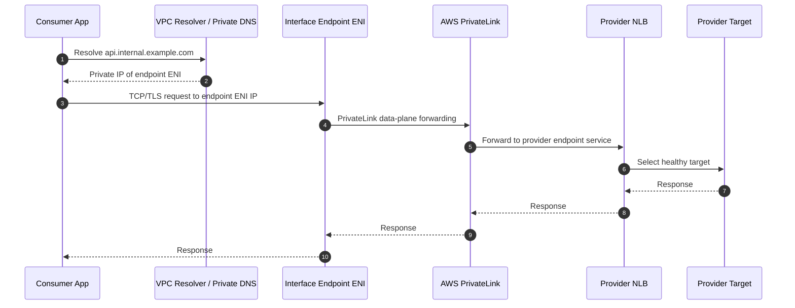
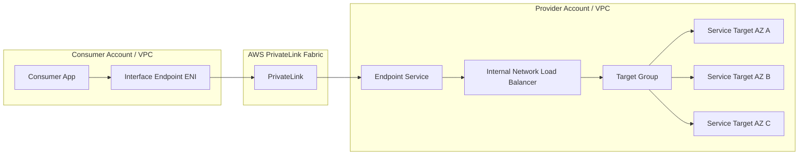
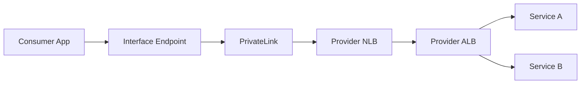
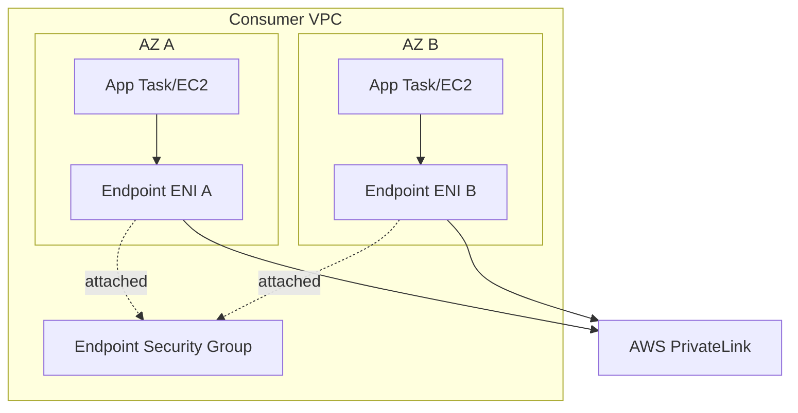
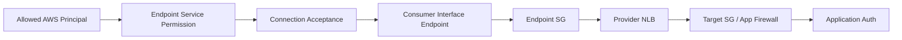
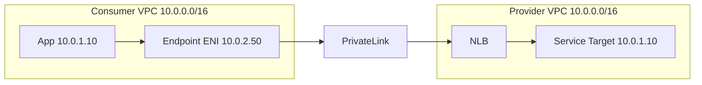
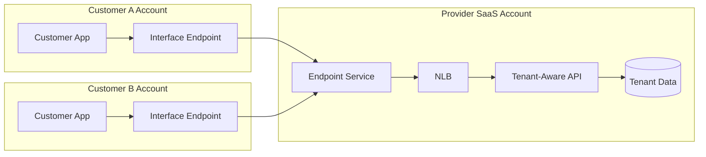
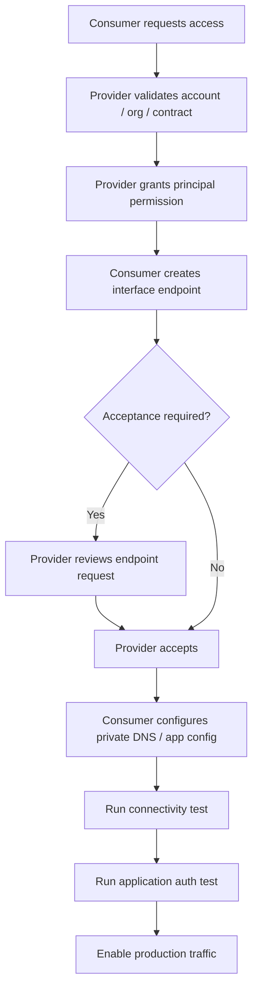

# Part 061 — AWS PrivateLink Provider/Consumer Model

> PrivateLink is not “VPC peering but safer”. PrivateLink is **service exposure without network exposure**.
>
> Peering connects networks. Transit Gateway connects route domains. PrivateLink connects **one consumer entry point** to **one provider service front door**.

This part is about using AWS PrivateLink as an application-networking primitive. We already covered VPC endpoints at the foundation level in Part 018 and endpoint policy/private DNS in Part 019. This part goes deeper into the **provider/consumer model**: how to publish your own service privately to another VPC, account, organization, or customer without opening full network reachability.

The mental shift is important. With PrivateLink, the consumer does not learn the provider subnet routes. The provider does not learn the consumer subnet routes. Neither side needs to solve full bidirectional network connectivity. The only contract is:

```txt
consumer private IP -> interface endpoint ENI -> AWS PrivateLink fabric -> provider endpoint service -> NLB/GWLB -> provider targets
```

That single line is the whole design.

---

## 1. What Problem PrivateLink Solves

Imagine you run an internal billing API in Account A. Ten workload accounts need to call it. You have several options:

1. VPC Peering from every workload VPC to the billing VPC.
2. Transit Gateway hub-and-spoke.
3. Shared VPC.
4. Public internet endpoint with auth and WAF.
5. PrivateLink endpoint service.

Peering and TGW solve **network reachability**. That is powerful, but also broad. If the route and security policy allow it, many addresses in one VPC can potentially reach many addresses in another VPC. That may be fine for platform-level shared services. It is often too much for SaaS-style service exposure.

PrivateLink solves a narrower problem:

> “Allow this consumer VPC to privately reach this provider service, without making either VPC routable to the other.”

That distinction is the heart of the service.

### 1.1 What PrivateLink Gives You

PrivateLink gives you:

- private IP entry points in the consumer VPC;
- no public internet path between consumer and provider;
- no need for overlapping CIDR resolution in many service-specific cases;
- provider-side control over which AWS principals can connect;
- optional manual approval for endpoint connection requests;
- consumer-side security group around the endpoint ENIs;
- private DNS integration for user-friendly service names;
- clean cross-account and SaaS-style service publication;
- a blast radius bounded to a service, not a whole VPC.

### 1.2 What PrivateLink Does Not Give You

PrivateLink does **not** give you:

- general bidirectional VPC-to-VPC routing;
- ICMP/ping-style network diagnostics to arbitrary provider hosts;
- direct access to all provider subnets;
- automatic identity authorization at HTTP/application layer;
- a replacement for API authentication;
- a replacement for service-level rate limiting;
- a cheap universal substitute for every east-west connection.

PrivateLink is not a routing fabric. It is a **private service ingress fabric**.

---

## 2. Core Objects

There are two sides.

### 2.1 Provider Side

The provider owns the service. The provider creates:

- a service VPC;
- service targets, usually EC2, ECS, EKS, appliances, or internal services;
- a Network Load Balancer or Gateway Load Balancer;
- a VPC endpoint service configuration;
- allowed principals;
- optional private DNS name;
- optional acceptance workflow.

For normal application services, the provider front door is typically an **NLB**. For virtual appliance insertion, the provider front door can be a **GWLB**.

### 2.2 Consumer Side

The consumer owns the caller network. The consumer creates:

- an interface VPC endpoint in selected subnets;
- endpoint ENIs with private IP addresses;
- endpoint security group rules;
- optional private DNS usage;
- client routing via DNS, not route table prefixes.

The consumer talks to a DNS name. The DNS name resolves to one or more private IP addresses on endpoint ENIs inside the consumer VPC.

---

## 3. Packet Path

A successful PrivateLink request is conceptually simple.



The application sees a private IP in its own VPC. It does not see the provider target IP. The provider target sees traffic through the provider load balancer path, not as arbitrary routed traffic from the consumer VPC.

That is why PrivateLink works even when consumer and provider CIDRs overlap in many common cases. The consumer only routes to local endpoint ENI addresses in its own subnet. The provider receives traffic at the endpoint service front door.

---

## 4. PrivateLink as a Contract

Treat a PrivateLink service as a contract with four layers.

| Layer | Provider Contract | Consumer Contract |
|---|---|---|
| Network entry | Endpoint service name, service Region, supported AZs/IP types | Interface endpoint in chosen VPC/subnets |
| DNS | Optional private DNS name and domain verification | Resolve endpoint-specific or private DNS name |
| Transport | Port/protocol exposed by NLB/GWLB | Security group permits client to endpoint ENI |
| Application | TLS, auth, tenancy, rate limit, schema | Client credentials, timeout, retry, idempotency |

The dangerous mistake is treating PrivateLink as only a network setup. In production, the network succeeds only if the application contract is also explicit.

Example contract:

```yaml
service: billing-api
provider_account: 111111111111
endpoint_service_name: com.amazonaws.vpce.ap-southeast-1.vpce-svc-0abc123
private_dns_name: billing-api.platform.internal
ports:
  - 443
protocol: HTTPS
auth:
  type: mTLS + service token
availability:
  azs:
    - apse1-az1
    - apse1-az2
    - apse1-az3
consumer_requirements:
  endpoint_sg_egress: tcp/443 to endpoint ENI
  client_timeout: 2s connect, 5s read
  retry_policy: bounded exponential backoff, no retry for non-idempotent calls
observability:
  provider_access_log: enabled
  consumer_flow_log: enabled
  dashboard: billing-api-privatelink
```

---

## 5. Provider Architecture

A common provider-side architecture looks like this:



The provider front door should be engineered like any other production load balancer:

- expose only required ports;
- use healthy multi-AZ targets;
- define target health checks carefully;
- support graceful draining;
- instrument access logs/metrics;
- isolate per service or per trust boundary;
- avoid sharing one NLB for unrelated contracts unless the routing model is deliberate.

### 5.1 NLB as Provider Front Door

NLB is the usual PrivateLink provider front door because PrivateLink endpoint services are built around NLB/GWLB service exposure.

The common application pattern is:

```txt
consumer endpoint -> endpoint service -> internal NLB -> service targets
```

For HTTP services that need path/host routing, there are two patterns:

1. NLB directly to application targets, with routing handled inside the app or mesh.
2. NLB to ALB target, then ALB does L7 routing.

The second pattern is useful when you want PrivateLink plus ALB capabilities.



This pattern has trade-offs:

- more moving parts;
- more load balancer cost;
- more health-check surfaces;
- better L7 routing, TLS, and HTTP observability;
- clearer separation between PrivateLink transport and application routing.

### 5.2 One Endpoint Service per Service vs Shared Front Door

A provider can publish multiple services in different ways.

#### Option A — One endpoint service per application service

```txt
vpce-svc-billing -> billing NLB
vpce-svc-ledger  -> ledger NLB
vpce-svc-report  -> report NLB
```

Pros:

- clean isolation;
- simple contract;
- service-specific approval;
- simple blast radius;
- per-service metrics/cost tagging.

Cons:

- more endpoint services;
- more NLBs;
- more consumer endpoints.

#### Option B — Shared endpoint service with L7 routing behind it

```txt
vpce-svc-platform -> NLB -> ALB -> many services
```

Pros:

- fewer endpoint services;
- fewer consumer endpoints;
- easier for consumers to onboard once.

Cons:

- larger blast radius;
- more complex authorization;
- harder per-service ownership;
- DNS and certificate design become more important;
- one misconfiguration can affect many services.

For internal platform APIs, Option A is usually safer until operational maturity justifies consolidation.

---

## 6. Consumer Architecture

On the consumer side, an interface endpoint creates ENIs in selected subnets. Those ENIs are local private entry points.



The consumer chooses subnets for endpoint placement. The application reaches endpoint IPs using DNS. Security groups on the endpoint ENIs control who can connect to the endpoint.

### 6.1 Consumer Endpoint Placement

Use at least two AZs for production. Endpoint placement is not only availability; it also affects latency and data processing paths.

A common design:

| Workload Placement | Endpoint Placement | Why |
|---|---|---|
| App runs in 3 private app subnets | Endpoint ENI in same 3 AZs | AZ-local access and high availability |
| App runs in ECS/EKS across 2 AZs | Endpoint ENI in same 2 AZs | Avoid unnecessary cross-AZ path |
| Centralized shared services VPC | Endpoint ENI in shared services subnets | One central access point, but possible central bottleneck |
| Many accounts with same service | Endpoint per account/VPC | Strong isolation, more cost |

The safe default is **endpoint per workload VPC, in the same AZs as workloads**.

### 6.2 Endpoint Security Group

Endpoint SG is the consumer-side choke point.

Example intent:

```txt
Allow tcp/443 from app security group to endpoint ENI.
Deny by omission everything else.
```

In AWS terms, SG rules are allow-only. So the endpoint SG should not be `0.0.0.0/0` inbound unless the endpoint is deliberately shared across broad subnets.

Bad rule:

```txt
inbound tcp/443 from 10.0.0.0/8
```

Better rule:

```txt
inbound tcp/443 from sg-consumer-billing-callers
```

This keeps the consumer-side access contract attached to workload identity at the network layer.

---

## 7. Private DNS

PrivateLink gives the consumer endpoint-specific DNS names automatically. A provider can also configure a private DNS name for the endpoint service, subject to domain ownership verification.

Two DNS modes matter.

### 7.1 Endpoint-Specific DNS

The consumer can call a generated DNS name similar in shape to:

```txt
vpce-xxxxxxxx-yyyyyyyy.vpce-svc-zzzzzzzz.ap-southeast-1.vpce.amazonaws.com
```

This is operationally explicit but ugly. It leaks infrastructure detail into application configuration.

Use it for:

- initial testing;
- debugging;
- bootstrap before private DNS is ready;
- rare cases where per-endpoint hostnames are intentional.

### 7.2 Provider Private DNS Name

A better application contract uses a stable private DNS name:

```txt
billing-api.platform.internal
```

The provider verifies ownership of the DNS name. Consumers can enable Private DNS on their interface endpoint so that calls to the private name resolve to endpoint ENI IPs in the consumer VPC.

The important operational point:

> Private DNS makes PrivateLink feel like a normal service name, but it also hides the endpoint path. Debugging must explicitly verify DNS resolution.

### 7.3 Private DNS Failure Modes

Common failures:

| Symptom | Likely Cause | Debug |
|---|---|---|
| Name resolves to public IP | Private DNS not enabled or wrong resolver path | `dig +short service-name` from app subnet |
| Name returns NXDOMAIN | Private hosted zone / private DNS association issue | Query VPC resolver directly |
| TLS hostname mismatch | Certificate SAN does not include private DNS name | Inspect cert with `openssl s_client` |
| Works in one VPC, fails in another | Endpoint not created or private DNS disabled in failing VPC | Compare endpoint settings |
| Hybrid client resolves wrong answer | On-prem DNS not forwarding to Route 53 Resolver properly | Trace resolver chain |

---

## 8. Security Model

PrivateLink security is layered.



### 8.1 Provider Principal Permission

The provider controls which AWS principals can create endpoints to the service.

This is not the same as application authorization. It answers:

> “May this AWS account/role create a private network entry point to my service?”

It does not answer:

> “May this caller perform `POST /payments`?”

### 8.2 Acceptance Required

For production services, manual acceptance is often safer, especially for external customers or high-sensitivity APIs.

Acceptance required means:

1. provider grants principal permission;
2. consumer creates endpoint;
3. endpoint connection enters pending state;
4. provider reviews and accepts;
5. data-plane connectivity becomes available.

Use automatic acceptance only when account onboarding is already tightly governed, for example inside one AWS Organization with automated controls.

### 8.3 Consumer Endpoint Security Group

The endpoint SG limits callers in the consumer VPC. This is essential because once a VPC has an endpoint, many resources might be able to resolve and attempt connection unless SG/routing/application config prevents it.

### 8.4 Provider Target Protection

The provider should still protect targets. Do not assume PrivateLink alone is enough.

Use:

- target SG allowing only NLB-origin traffic as appropriate;
- app-level auth;
- mTLS if service identity matters;
- rate limits;
- tenant-aware authorization;
- request logging with consumer identity/correlation ID;
- abuse protection for external consumers.

PrivateLink makes the network private. It does not make the request trustworthy.

---

## 9. PrivateLink and Overlapping CIDR

This is one of the cleanest reasons to choose PrivateLink.

With VPC Peering or Transit Gateway, overlapping CIDR creates route ambiguity. If both sides use `10.0.0.0/16`, a route table cannot cleanly decide whether `10.0.20.5` is local or remote.

PrivateLink avoids this for service-specific connectivity because the consumer connects to an ENI IP inside its own VPC.



Both VPCs can have overlapping address ranges. The consumer never routes directly to provider `10.0.1.10`. It routes locally to `10.0.2.50`.

But do not overstate this. Overlapping CIDR is safe only because the contract is service-specific. If the real requirement is broad network access, PrivateLink may become a workaround maze rather than architecture.

---

## 10. Multi-AZ Design

A production PrivateLink service should be multi-AZ on both sides.

Provider side:

- NLB enabled in at least two AZs;
- healthy targets in multiple AZs;
- endpoint service available in those AZs;
- health checks represent real readiness;
- deployment process avoids draining all targets in one AZ at once.

Consumer side:

- interface endpoint ENIs in multiple AZs;
- app subnets in same AZs as endpoint ENIs;
- DNS returns usable endpoint addresses;
- clients have sane connect/read timeouts;
- retry policy is bounded and idempotency-aware.

### 10.1 AZ Name vs AZ ID Problem

Across AWS accounts, AZ names like `ap-southeast-1a` are not guaranteed to map to the same physical AZ. AZ IDs such as `apse1-az1` are stable across accounts.

For provider/consumer contracts, use AZ IDs when communicating placement constraints.

Bad contract:

```txt
Service available in ap-southeast-1a and ap-southeast-1b.
```

Better contract:

```txt
Service available in AZ IDs apse1-az1 and apse1-az2.
```

This avoids silent cross-AZ mismatch between accounts.

---

## 11. Cross-Account and SaaS Pattern

PrivateLink is commonly used for private SaaS.



PrivateLink handles private connectivity. The SaaS provider still must handle tenant isolation.

Tenant isolation needs application-layer controls:

- tenant identity in credentials/token/cert;
- tenant-aware authorization;
- tenant-scoped rate limits;
- per-tenant audit trail;
- request correlation;
- abuse detection;
- emergency tenant disable switch.

A dangerous anti-pattern:

> “The endpoint connection came from customer account X, therefore every request must be tenant X.”

That assumption breaks when credentials leak, proxies are used, or shared endpoints exist. Treat endpoint identity as a useful network signal, not as the sole authorization truth.

---

## 12. Provider Onboarding Workflow

A robust onboarding process should be explicit.



Onboarding should capture:

- consumer AWS account ID;
- VPC ID/environment;
- expected AZ IDs;
- endpoint ID after creation;
- endpoint SG intent;
- DNS name to use;
- expected source identity at application layer;
- owner/team/escalation contact;
- expected traffic volume;
- data classification;
- termination process.

Do not onboard consumers with ad-hoc screenshots and tribal knowledge. PrivateLink scales operationally only when the contract is formal.

---

## 13. Terraform/IaC Shape

A minimal provider shape:

```hcl
resource "aws_lb" "service" {
  name               = "billing-privatelink-nlb"
  load_balancer_type = "network"
  internal           = true
  subnets            = var.provider_subnet_ids
}

resource "aws_vpc_endpoint_service" "billing" {
  acceptance_required        = true
  network_load_balancer_arns = [aws_lb.service.arn]

  private_dns_name = "billing-api.platform.internal"

  tags = {
    Service = "billing-api"
    Exposure = "privatelink"
  }
}

resource "aws_vpc_endpoint_service_allowed_principal" "consumer" {
  vpc_endpoint_service_id = aws_vpc_endpoint_service.billing.id
  principal_arn           = "arn:aws:iam::${var.consumer_account_id}:root"
}
```

A minimal consumer shape:

```hcl
resource "aws_vpc_endpoint" "billing" {
  vpc_id              = var.consumer_vpc_id
  service_name        = var.billing_endpoint_service_name
  vpc_endpoint_type   = "Interface"
  subnet_ids          = var.consumer_endpoint_subnet_ids
  security_group_ids  = [aws_security_group.billing_endpoint.id]
  private_dns_enabled = true

  tags = {
    Service = "billing-api"
    Owner   = "payments-team"
  }
}

resource "aws_security_group" "billing_endpoint" {
  name   = "vpce-billing-api"
  vpc_id = var.consumer_vpc_id
}

resource "aws_security_group_rule" "from_callers" {
  type                     = "ingress"
  security_group_id        = aws_security_group.billing_endpoint.id
  source_security_group_id = var.consumer_app_sg_id
  protocol                 = "tcp"
  from_port                = 443
  to_port                  = 443
}
```

This is intentionally incomplete. Production modules should add:

- allowed principal lifecycle;
- connection acceptance workflow;
- endpoint connection state validation;
- Route 53 validation if private DNS is used;
- tagging and ownership metadata;
- monitoring alarms;
- integration tests;
- drift detection.

---

## 14. Observability

PrivateLink troubleshooting requires observability on both sides.

Consumer side:

- VPC Flow Logs on endpoint ENIs/subnets;
- app logs with DNS name, resolved IP, connection timeout, request ID;
- CloudWatch endpoint metrics if used;
- DNS query logs if Route 53 Resolver query logging is enabled;
- security group rule history via CloudTrail/Config.

Provider side:

- NLB metrics;
- target health;
- application access logs;
- endpoint connection state;
- CloudTrail events for endpoint service permissions/acceptance;
- service-specific latency/error metrics.

### 14.1 What Flow Logs Can and Cannot Tell You

Flow Logs can show:

- app attempted to connect to endpoint ENI;
- endpoint SG/NACL accepted or rejected traffic;
- source/destination private IP/port;
- byte/packet counts.

Flow Logs cannot show:

- HTTP path;
- TLS certificate mismatch reason;
- application auth failure reason;
- provider target selection;
- full packet payload.

Use the right tool. Do not try to debug `401 Unauthorized` with only Flow Logs.

---

## 15. Debugging Runbook

When a PrivateLink call fails, debug from consumer to provider.

### 15.1 Step 1 — Is DNS Correct?

From the same subnet/runtime environment as the application:

```bash
nslookup billing-api.platform.internal
# or
dig +short billing-api.platform.internal
```

Expected:

- private IPs inside the consumer VPC endpoint subnets;
- not public IPs;
- not provider target IPs;
- not NXDOMAIN.

### 15.2 Step 2 — Is TCP Reachable?

```bash
nc -vz billing-api.platform.internal 443
```

If TCP fails:

- endpoint SG inbound from caller SG;
- caller SG egress;
- subnet NACL ephemeral ports;
- endpoint ENI state;
- endpoint connection accepted;
- provider endpoint service available;
- provider NLB target health.

### 15.3 Step 3 — Is TLS Correct?

```bash
openssl s_client -connect billing-api.platform.internal:443 -servername billing-api.platform.internal
```

Check:

- certificate CN/SAN;
- SNI behavior;
- chain trust;
- protocol/cipher compatibility;
- whether NLB terminates TLS or passes through.

### 15.4 Step 4 — Is Application Auth Correct?

```bash
curl -v https://billing-api.platform.internal/health
curl -v https://billing-api.platform.internal/v1/account \
  -H "Authorization: Bearer $TOKEN" \
  -H "X-Request-ID: debug-$(date +%s)"
```

If `/health` works but application endpoint fails, the network is probably fine. Move to auth, tenant context, schema, or app-level routing.

### 15.5 Step 5 — Is Provider Healthy?

Provider should check:

- endpoint connection state;
- NLB healthy host count;
- target group health reason;
- app logs with request ID;
- target CPU/memory/socket exhaustion;
- deployment events;
- rate limit / throttling;
- dependency failures behind the service.

---

## 16. Failure Catalogue

| Failure | Symptom | Cause | Fix |
|---|---|---|---|
| Endpoint request stuck pending | Consumer endpoint exists but no traffic | Provider requires acceptance | Accept request or automate acceptance policy |
| DNS resolves to public address | Client bypasses PrivateLink | Private DNS disabled or resolver path wrong | Enable Private DNS, fix forwarding |
| TLS hostname mismatch | `curl` cert error | Cert not valid for private name | Issue certificate for service DNS name |
| TCP timeout | No connection | Endpoint SG, NACL, endpoint state, NLB target issue | Walk packet path |
| HTTP 503 | NLB has no healthy targets | Bad health check or service down | Fix target health check/readiness |
| Works in AZ A, fails in AZ B | Partial placement | Missing endpoint ENI or unhealthy target in one AZ | Add endpoint/provider AZ capacity |
| Consumer account cannot create endpoint | Service not found or permission denied | Principal not allowed or wrong service name/Region | Add allowed principal, validate Region |
| Unexpected broad access from consumer VPC | Endpoint SG too open | Inbound from CIDR too broad | Restrict to caller SGs |
| Tenant data leak risk | Network endpoint reused across tenants | App auth relies only on endpoint identity | Enforce tenant auth at app layer |

---

## 17. Cost Model

PrivateLink cost typically appears in multiple places:

- interface endpoint hourly charge;
- data processing through endpoint;
- provider NLB cost;
- cross-AZ data transfer if placement is poor;
- logs/metrics;
- extra ALB if NLB-to-ALB pattern is used.

Cost optimization should not start with “centralize all endpoints”. That often creates availability, ownership, and routing complexity.

A better sequence:

1. Place endpoints where traffic originates.
2. Measure traffic volume per service and per account.
3. Identify high-volume AWS service endpoints where gateway endpoint or service-specific endpoint placement is cheaper.
4. Consolidate only when ownership and fault-domain impact are acceptable.
5. Tag every endpoint with service, owner, environment, and contract ID.

---

## 18. When to Choose PrivateLink

Choose PrivateLink when:

- you need private access to a specific service across accounts/VPCs;
- consumers should not have broad network access to provider VPC;
- CIDRs overlap;
- you expose SaaS/private APIs to customers;
- you want provider-controlled onboarding;
- network segmentation is more important than full mesh connectivity;
- the service boundary is clear and stable.

Avoid PrivateLink when:

- the requirement is broad bidirectional network access;
- consumers need many ports and dynamic target discovery;
- you need transparent L3 connectivity;
- there are hundreds of tiny internal services with no platform automation;
- application identity/auth is weak and you are using PrivateLink as a false security blanket.

---

## 19. PrivateLink vs Alternatives

| Requirement | Better Fit | Why |
|---|---|---|
| One service exposed to many accounts | PrivateLink | Service-scoped, provider-controlled |
| Many services with mesh-style auth/routing | VPC Lattice / service mesh | Higher-level service networking |
| Full VPC-to-VPC reachability | TGW / Peering | Route-domain connectivity |
| Shared platform subnet ownership | VPC Sharing | Same VPC/subnet model |
| Private access to AWS services | Interface/Gateway endpoints | Native AWS service endpoints |
| Hybrid on-prem to many VPCs | Direct Connect + TGW / Cloud WAN | Routing fabric problem |
| Private appliance insertion | GWLB endpoint service | Transparent inspection path |

---

## 20. Production Checklist

Before production launch:

- [ ] Endpoint service has clear owner and escalation path.
- [ ] NLB spans at least two AZs.
- [ ] Targets are healthy in multiple AZs.
- [ ] Health checks represent real readiness.
- [ ] Allowed principals are least-privilege.
- [ ] Acceptance workflow is documented.
- [ ] Private DNS name is verified and certificate matches it.
- [ ] Consumer endpoint SG is restricted to caller SGs.
- [ ] DNS resolution tested from actual runtime subnets.
- [ ] TCP/TLS/application tests pass.
- [ ] Flow Logs and provider logs are enabled where needed.
- [ ] Dashboard includes connection count, target health, 5xx, latency.
- [ ] Runbook covers pending endpoint, DNS failure, TCP timeout, TLS error, 5xx.
- [ ] Cost tags are present.
- [ ] Deprovisioning process removes allowed principal and endpoint connection.

---

## 21. Mental Model Recap

PrivateLink is best understood as **a private socket into a provider-owned service**, not as a route to a provider-owned network.

The invariants:

1. Consumer connects to endpoint ENI IPs in its own VPC.
2. Provider exposes an endpoint service backed by NLB/GWLB.
3. No full VPC-to-VPC route is created.
4. Security is layered: principal permission, endpoint acceptance, endpoint SG, provider target controls, application auth.
5. DNS is the user-facing contract; the endpoint is the infrastructure implementation.
6. PrivateLink solves service exposure cleanly, but it does not solve application authorization.

If you keep those invariants, PrivateLink becomes one of the safest tools for cross-account application networking on AWS.

---

## References

- AWS PrivateLink concepts: `https://docs.aws.amazon.com/vpc/latest/privatelink/concepts.html`
- Create a service powered by AWS PrivateLink: `https://docs.aws.amazon.com/vpc/latest/privatelink/create-endpoint-service.html`
- Share your services through AWS PrivateLink: `https://docs.aws.amazon.com/vpc/latest/privatelink/privatelink-share-your-services.html`
- AWS PrivateLink in scalable multi-VPC infrastructure: `https://docs.aws.amazon.com/whitepapers/latest/building-scalable-secure-multi-vpc-network-infrastructure/aws-privatelink.html`
