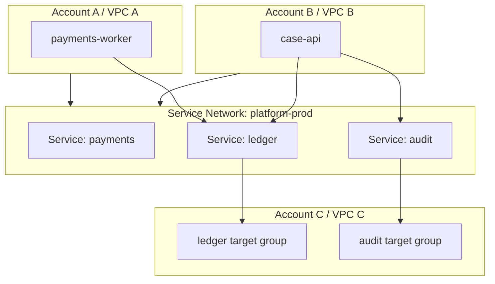
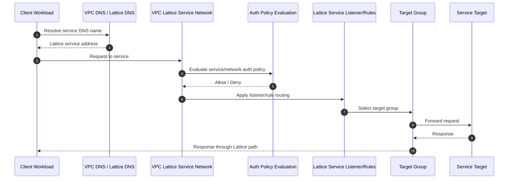
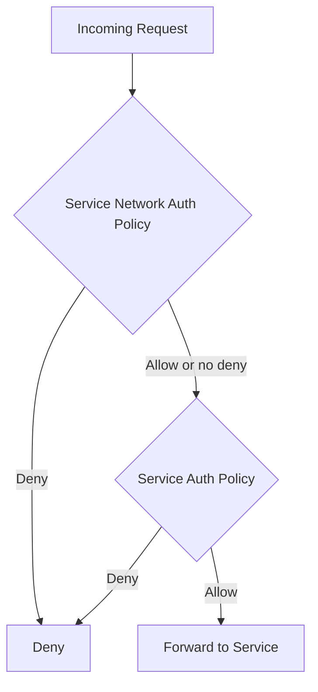
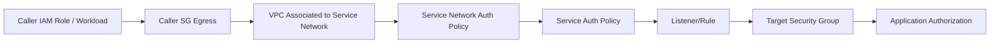
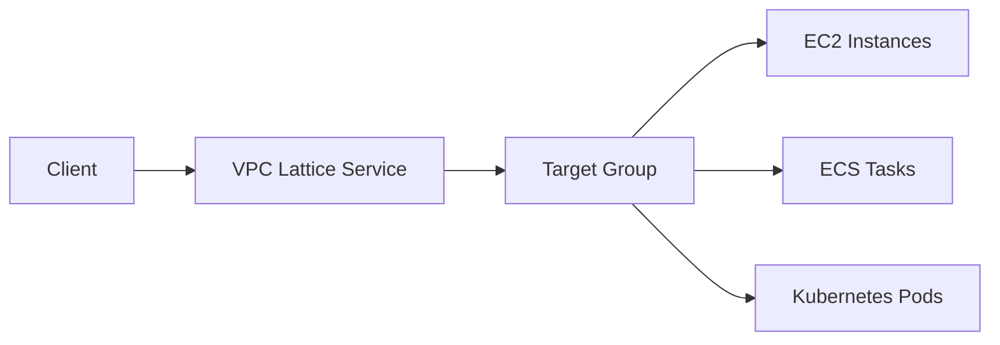
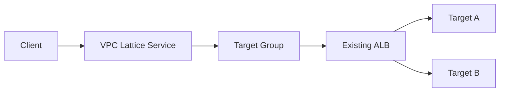
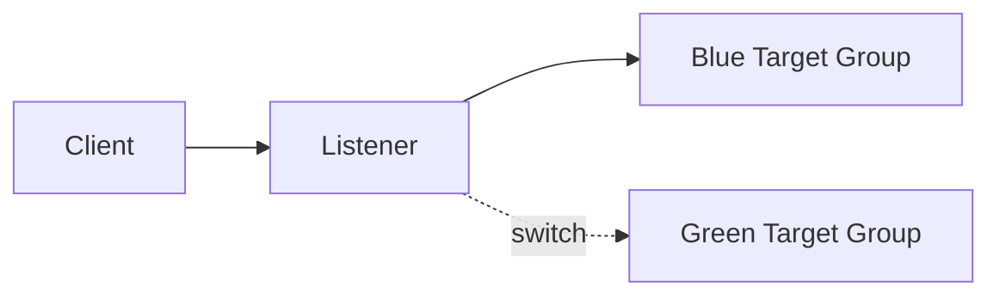
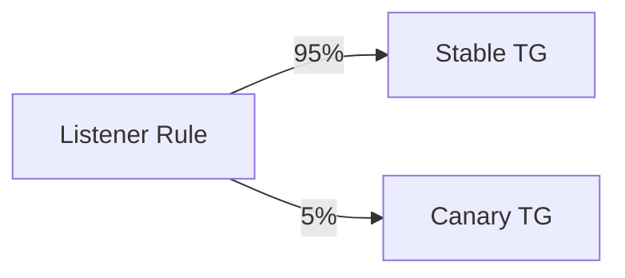
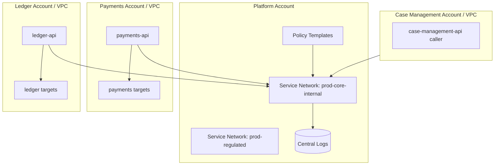

# Part 062 — Amazon VPC Lattice Deep Dive

> VPC Lattice is not just “load balancing between VPCs”. It is AWS’s managed application-networking layer for connecting, securing, and observing services across VPCs and accounts.

PrivateLink, from Part 061, exposes a provider service to consumers through interface endpoints. That model is excellent when the provider wants to publish one stable private service boundary. But modern platforms often need something broader:

- many services;
- many VPCs;
- many accounts;
- service-level auth;
- HTTP routing;
- centralized service discovery-like access;
- observability at the service network layer;
- less route table choreography.

This is where **Amazon VPC Lattice** fits.

VPC Lattice gives you a service network: a logical application network where services can be registered, VPCs can be associated, policies can be applied, and service-to-service traffic can be routed without building full mesh VPC routing by hand.

---

## 1. The Problem VPC Lattice Solves

Assume a platform has 30 internal services across 12 AWS accounts:

```txt
payments-api
ledger-api
customer-profile
notification-api
case-management-api
audit-api
risk-scoring
workflow-engine
```

Each team owns its own VPC/account. You need service-to-service calls across teams. Classical options:

1. Put everything in one VPC.
2. Peer VPCs.
3. Attach all VPCs to Transit Gateway.
4. Expose each service through PrivateLink.
5. Build a Kubernetes service mesh.
6. Use VPC Lattice.

Each option has a bias.

| Option | Bias |
|---|---|
| One VPC | Simple network, weak account/VPC isolation |
| Peering | Point-to-point routing, poor at scale |
| Transit Gateway | Great for network routing, not service auth/routing by itself |
| PrivateLink | Great provider/consumer boundary, many endpoints for many services |
| Service mesh | Deep L7 control, usually workload/runtime specific |
| VPC Lattice | Managed AWS-level service networking across VPCs/accounts |

VPC Lattice answers this question:

> “How do we let services in different VPCs/accounts call each other privately, with service-level routing, auth policies, and observability, without manually wiring every route and endpoint?”

---

## 2. Core Mental Model

VPC Lattice has four main nouns:

1. **Service network** — a logical application network.
2. **Service** — an independently deployable application exposed in Lattice.
3. **Target group** — compute targets behind the service.
4. **VPC association** — VPCs that can access the service network.

A service has listeners and rules, similar in spirit to a load balancer.



The service network is the shared context. VPCs join the context. Services attach to the context. Policies decide who can call what.

---

## 3. What VPC Lattice Is — and Is Not

### 3.1 VPC Lattice Is

VPC Lattice is:

- application networking across VPCs/accounts;
- service discovery-like access through service DNS names;
- managed service routing;
- HTTP/HTTPS/TLS listener/rule model;
- service-level auth policy surface;
- support for targets such as instances, IPs, Lambda, ALB, ECS tasks, and Kubernetes Pods;
- observability through access logs and metrics;
- an alternative to hand-rolled internal service exposure patterns.

### 3.2 VPC Lattice Is Not

VPC Lattice is not:

- a full replacement for Transit Gateway;
- a general purpose L3 routing fabric;
- a replacement for all service mesh features;
- a replacement for application authentication design;
- automatically the cheapest path for all east-west traffic;
- a magic abstraction that removes ownership boundaries.

A useful framing:

> Transit Gateway connects networks. PrivateLink publishes services. VPC Lattice organizes service-to-service access.

---

## 4. Key Components

### 4.1 Service Network

The service network is the logical boundary where services and VPCs meet.

Think of it as an application-level “network segment”. It does not mean every IP in every associated VPC can route to every other IP. It means workloads in associated VPCs can discover and access services associated with that service network, subject to policy.

A platform may define service networks like:

```txt
platform-prod
platform-nonprod
regulated-prod
analytics-prod
partner-integration
```

The service network should map to a trust boundary, not merely an org chart.

Bad service network design:

```txt
one giant service network for everything
```

Better service network design:

```txt
prod-core-services
prod-regulated-services
nonprod-core-services
shared-observability-services
```

### 4.2 Service

A service is the application-facing object. It has:

- name;
- optional custom domain;
- listeners;
- rules;
- target groups;
- auth settings;
- service network associations;
- access logs/metrics.

Example:

```txt
service: ledger-api
listener: HTTPS 443
rules:
  /v1/accounts/* -> ledger-v1-targets
  /v2/accounts/* -> ledger-v2-targets
```

### 4.3 Listener

A listener accepts client connections for a protocol/port.

Common listener types:

- HTTP;
- HTTPS;
- TLS.

A listener has a default action and optional rules. For HTTP/HTTPS, routing rules can be used for path/host/header-style service routing depending on feature support and configuration.

### 4.4 Rule

Rules decide where requests go.

Example intent:

```txt
if path starts with /v1 -> forward to v1 target group
if path starts with /v2 -> forward to v2 target group
otherwise -> default target group
```

Rules let you do progressive migration, canaries, and versioned routing without forcing callers to know target details.

### 4.5 Target Group

Target groups contain compute resources running the service. Supported target types include common AWS compute patterns such as:

- EC2 instances;
- IP addresses;
- Lambda functions;
- Application Load Balancers;
- ECS tasks;
- Kubernetes Pods.

The target group is where service networking meets runtime placement.

### 4.6 VPC Association

A VPC associated with a service network can access services in that service network, subject to policy and security controls.

This is not the same as attaching a VPC to Transit Gateway. You are not building full IP reachability between VPCs. You are granting the VPC participation in a service network.

---

## 5. Request Path

The request path looks like this:



The key point: clients target a service identity/name, not a remote VPC subnet.

---

## 6. Service Network Design

Design service networks around **trust and lifecycle**, not convenience.

### 6.1 One Service Network per Environment

```txt
platform-dev
platform-staging
platform-prod
```

Pros:

- simple mental model;
- prevents nonprod/prod mixing;
- easy blast radius containment.

Cons:

- may be too broad inside prod;
- regulated services may need stricter boundary.

### 6.2 One Service Network per Trust Domain

```txt
prod-public-facing-backend
prod-regulated-data
prod-internal-tools
prod-observability
```

Pros:

- better security segmentation;
- clearer policy ownership;
- easier compliance story.

Cons:

- more associations/policies;
- more governance overhead.

### 6.3 One Service Network per Platform Capability

```txt
identity-services
payment-services
case-management-services
analytics-services
```

Pros:

- maps to domain ownership;
- policy can align to team contracts.

Cons:

- cross-domain flows require deliberate association and policy;
- risk of org-chart architecture.

### 6.4 Recommended Baseline

For most mature organizations:

```txt
environment + trust domain
```

Example:

```txt
prod-core-internal
prod-regulated
prod-shared-observability
nonprod-core-internal
```

This is less chaotic than one giant service network, but not so granular that every service becomes its own island.

---

## 7. Auth Policy Model

VPC Lattice auth policies are IAM-style policy documents attached to a service network or service. They control which principals can access services.

Conceptually:



In practice, think of policies as a service-network admission layer.

### 7.1 Network-Level vs Service-Level Policy

Use service network policy for broad guardrails:

```txt
Only principals from AWS Organization o-abc123 may access this service network.
```

Use service policy for specific contracts:

```txt
Only payments-worker role may call ledger-api.
Only case-management-api role may call audit-api.
```

### 7.2 Example Policy Shape

A conceptual service-level allow policy:

```json
{
  "Version": "2012-10-17",
  "Statement": [
    {
      "Effect": "Allow",
      "Principal": {
        "AWS": "arn:aws:iam::222222222222:role/payments-worker"
      },
      "Action": "vpc-lattice-svcs:Invoke",
      "Resource": "arn:aws:vpc-lattice:ap-southeast-1:111111111111:service/svc-abc123/*"
    }
  ]
}
```

Policy structure and supported condition keys should be validated against current AWS docs and your IaC provider version, because service authorization surfaces evolve.

### 7.3 What Auth Policy Does Not Replace

Lattice auth policy does not replace:

- application authorization;
- user-level authorization;
- tenant isolation;
- schema validation;
- rate limiting;
- audit logging inside the application;
- data access controls.

It is a network/application-front-door authorization layer. Keep your domain authorization inside the app.

---

## 8. Security Group and Network Boundary

VPC Lattice removes much route table wiring, but it does not mean all security groups become irrelevant.

You still need to reason about:

- client workload egress;
- target workload ingress;
- VPC association boundary;
- service/network auth policies;
- TLS/certificates;
- app-layer auth.

A useful layered view:



A request should need to satisfy all relevant layers. If one layer is too broad, the others become more important.

---

## 9. Service Registration Patterns

### 9.1 Direct Compute Targets

Use direct targets when services are simple and you want fewer components.



Pros:

- fewer load balancers;
- direct service model;
- simpler cost surface.

Cons:

- runtime-specific health/registration needs;
- migration from existing ALB/NLB may require work;
- team may need new operational model.

### 9.2 ALB as Target

Use ALB target when a service already has ALB-based routing/security.



Pros:

- preserve existing ALB routing;
- easier migration;
- reuse WAF/TLS/logging patterns where applicable.

Cons:

- more hops;
- more cost;
- duplicated routing concepts;
- harder failure analysis.

### 9.3 Lambda Target

Use Lambda target for event-like HTTP endpoints or internal serverless services.

Pros:

- no server management;
- service network can expose Lambda-backed capability;
- useful for lightweight internal APIs.

Cons:

- cold start and concurrency behavior;
- different timeout/error model;
- less suitable for long-running connections.

---

## 10. Cross-Account Operating Model

VPC Lattice becomes useful when ownership is clear.

Common account roles:

| Account Type | Owns |
|---|---|
| Network/platform account | Service networks, shared policies, governance |
| Producer account | Services, target groups, targets, service-level policies |
| Consumer account | VPC association, caller workloads, caller IAM roles |
| Security account | Audit, policy review, logging, guardrails |

Do not centralize everything blindly. Centralize what must be consistent; delegate what must move quickly.

A good split:

- platform team owns service network standards;
- service teams own service definitions and targets;
- security team owns guardrail policy templates;
- consumer teams own their caller identity and egress controls.

---

## 11. Naming and DNS Strategy

VPC Lattice can provide service DNS names. For human-friendly contracts, custom domains are often needed.

A clean naming model:

```txt
ledger.prod.core.internal
payments.prod.core.internal
risk.prod.regulated.internal
```

Avoid names that encode current infrastructure:

```txt
ledger-alb-ap-southeast-1a.internal
svc-0abc123.internal
```

Names should represent service contracts, not implementation.

### 11.1 Versioning in Names vs Paths

For APIs:

```txt
ledger.prod.core.internal/v1/accounts
ledger.prod.core.internal/v2/accounts
```

is usually better than:

```txt
ledger-v1.prod.core.internal
ledger-v2.prod.core.internal
```

But for breaking platform migrations, separate service names may be cleaner.

Rule of thumb:

- use path/header versioning for API evolution;
- use separate service names for independent lifecycle or blast radius;
- do not use DNS as your only versioning strategy.

---

## 12. Routing Patterns

### 12.1 Blue/Green



Use listener/rule changes to shift traffic only when:

- health checks are meaningful;
- rollback is tested;
- target versions are backward compatible;
- clients are resilient to connection resets/retries.

### 12.2 Weighted Canary



Good for:

- low-risk rollout;
- performance validation;
- dependency compatibility testing.

Risk:

- if traffic volume is low, canary sample is misleading;
- sticky clients may skew distribution;
- downstream effects may not appear at 5%.

### 12.3 Path-Based Split

```txt
/v1/* -> v1 target group
/v2/* -> v2 target group
/admin/* -> admin target group
```

Use this when paths represent stable subcontracts. Avoid turning one Lattice service into a hidden API gateway for unrelated domains.

---

## 13. Observability

VPC Lattice observability should answer:

1. Who called what?
2. Was the request allowed or denied?
3. Which service/listener/rule handled it?
4. Which target group/target received it?
5. What latency/error happened?
6. Is the problem caller, Lattice policy/routing, target, or dependency?

Minimum dashboard:

| Signal | Why |
|---|---|
| Request count by service | Traffic shape |
| 4xx by service/rule | Client/auth/routing issues |
| 5xx by service/target group | Provider failure |
| Latency p50/p90/p99 | User-visible service health |
| Auth denied count | Policy drift or caller misuse |
| Healthy target count | Deployment/readiness |
| Top callers | Blast radius and abuse detection |

Access logs should include enough identifiers to correlate with application logs. Always propagate a request ID.

Example header contract:

```txt
X-Request-ID: generated by caller or gateway
X-Caller-Service: optional logical caller name
X-Tenant-ID: only if app-layer auth validates it
```

Do not trust caller-provided headers for security decisions unless they are signed or injected by a trusted component.

---

## 14. Failure Mode Catalogue

| Failure | Symptom | Likely Cause | Debug Path |
|---|---|---|---|
| DNS does not resolve | Client cannot find service | VPC not associated, wrong DNS config, wrong service name | Resolve from workload subnet |
| Access denied | Request blocked before target | Service network/service auth policy denies caller | Inspect auth policy and caller principal |
| TCP/TLS failure | Connection cannot establish | Listener/cert/protocol mismatch, SG issue | Test with `curl -v`, `openssl s_client` |
| HTTP 404 | Lattice service reachable but route not matched | Listener rule/path mismatch | Inspect listener rules and path sent by client |
| HTTP 503 | No healthy targets | Target health check/readiness/deployment issue | Check target group health |
| High p99 latency | Target overload or cross-zone/runtime issue | Slow target, downstream dependency, retries | Compare Lattice logs and app traces |
| Works from VPC A, fails from VPC B | Association or policy mismatch | VPC B not associated or caller role not allowed | Compare VPC association/policy |
| Unexpected service access | Policy too broad | Network-level allow without service-level guardrail | Tighten service auth policy |

---

## 15. Debugging Runbook

### Step 1 — Resolve Service Name

From the exact caller runtime:

```bash
nslookup ledger.prod.core.internal
# or
dig +short ledger.prod.core.internal
```

If DNS fails, do not inspect target health yet. The request never reached the service path.

### Step 2 — Verify Caller Identity

If auth policy uses IAM principal conditions, verify the actual principal used by the workload.

Common mistakes:

- ECS task role differs from expected role;
- EKS pod identity/IRSA role not what policy allows;
- EC2 instance profile missing;
- cross-account role session uses unexpected ARN shape;
- request is unsigned when auth policy expects authenticated access.

### Step 3 — Test Transport

```bash
curl -v https://ledger.prod.core.internal/health
```

Check:

- DNS resolution;
- TLS handshake;
- HTTP status;
- response headers;
- request ID.

### Step 4 — Inspect Lattice Logs/Metrics

Determine whether the request:

- arrived at Lattice;
- was denied by policy;
- matched a listener rule;
- forwarded to a target group;
- received target response;
- timed out.

### Step 5 — Inspect Target

If Lattice forwarded but response is bad:

- target group health;
- application logs with request ID;
- target CPU/memory/socket count;
- dependency latency;
- recent deployments;
- SG ingress;
- runtime readiness endpoint.

---

## 16. Migration Patterns

### 16.1 From VPC Peering/TGW to Lattice

Goal: reduce broad network reachability and move to service contracts.

Migration steps:

1. Inventory current cross-VPC flows.
2. Group flows by logical service.
3. Create Lattice service for one low-risk provider.
4. Associate consumer VPCs with service network.
5. Add service auth policy for selected callers.
6. Shift one caller from old DNS/route path to Lattice service DNS.
7. Monitor latency/errors.
8. Repeat per service.
9. Remove old broad route when no longer used.

Do not migrate by attaching every service and every VPC at once. That only recreates broad mesh behavior through a new abstraction.

### 16.2 From PrivateLink to Lattice

PrivateLink is often provider/consumer-contract oriented. Lattice is often service-network oriented.

Move from PrivateLink to Lattice when:

- many internal services are being published through separate endpoint services;
- consumer endpoint sprawl becomes operationally expensive;
- service-level auth/routing/observability is needed;
- all participants are inside controlled AWS account boundaries.

Keep PrivateLink when:

- exposing service to external customers;
- consumer should not join a broader service network;
- one stable provider boundary is enough;
- overlapping CIDR service-specific exposure is the key requirement;
- endpoint acceptance workflow is central to governance.

---

## 17. Cost and Complexity Model

Costs vary by Region and usage, so always verify current pricing. Architecturally, cost surfaces include:

- service/network hourly or usage-based charges depending on Lattice pricing model;
- request/data processing;
- logs;
- target infrastructure;
- ALB if used as target;
- cross-AZ or inter-region effects if applicable;
- operational cost of policy/service ownership.

Do not compare Lattice only against “free route tables”. Compare it against:

- engineering time spent managing peering/TGW routes;
- blast radius of broad connectivity;
- cost of many PrivateLink endpoints;
- lack of service-level auth;
- debugging cost without centralized service logs;
- compliance burden of uncontrolled east-west traffic.

The right question is not “is Lattice cheaper?” but:

> “Does Lattice reduce service-networking complexity enough to justify its cost and abstraction?”

---

## 18. Governance Model

A mature VPC Lattice platform needs standards.

### 18.1 Required Metadata

Each service should have:

```yaml
service: ledger-api
environment: prod
owner: ledger-platform
service_network: prod-core-internal
data_classification: confidential
allowed_callers:
  - payments-worker
  - case-management-api
slo:
  availability: 99.9
  p99_latency_ms: 250
runbook: https://internal/runbooks/ledger-api
```

### 18.2 Policy Review

Policies should be reviewed for:

- wildcard principals;
- organization-wide allows without service-level constraints;
- stale caller roles;
- nonprod-to-prod access;
- broad cross-account access;
- missing explicit ownership.

### 18.3 Change Management

Listener/rule/policy changes can break many callers. Treat them like API gateway or load balancer changes:

- test in nonprod;
- deploy via IaC;
- include rollback;
- run contract tests;
- monitor denied requests and 5xx after deployment;
- notify consumers for breaking changes.

---

## 19. Anti-Patterns

### Anti-Pattern 1 — One Giant Service Network

One service network for all environments and trust levels creates a giant application blast radius.

Fix: split by environment and trust domain.

### Anti-Pattern 2 — Auth Policy as the Only Authorization

Lattice can allow a caller role to invoke a service. It does not understand your domain rules.

Fix: keep application authorization and tenant checks.

### Anti-Pattern 3 — Recreating Full Mesh Through Lattice

If every service can call every service, you have not created governance. You have recreated the old network with prettier objects.

Fix: define caller-service contracts.

### Anti-Pattern 4 — No Request Correlation

Without request IDs, Lattice logs and app logs are hard to join.

Fix: require request ID propagation.

### Anti-Pattern 5 — Ignoring Runtime Readiness

If health checks are shallow, Lattice sends traffic to targets that cannot handle real requests.

Fix: health checks must represent dependency readiness enough for safe routing.

---

## 20. VPC Lattice vs PrivateLink vs Transit Gateway

| Dimension | VPC Lattice | PrivateLink | Transit Gateway |
|---|---|---|---|
| Main abstraction | Service network | Provider endpoint service | Routing hub |
| Connectivity type | Service-to-service | Consumer endpoint to provider service | Network-to-network |
| Route table work | Low | Low for consumer service path | High/centralized |
| Service auth | Built-in auth policies | Not primary feature | Not service-level |
| Best for | Internal service networking across VPCs/accounts | Private SaaS/specific service exposure | Hybrid/multi-VPC routing fabric |
| Blast radius | Service network / service policy | Endpoint service boundary | Route domain boundary |
| External customer fit | Possible but often PrivateLink is cleaner | Strong | Usually poor |
| Overlapping CIDR | Helps because service-level | Strong for service-specific exposure | Problematic |

---

## 21. Reference Architecture

A production reference design:



Contracts:

- service network policy allows only principals from the AWS Organization;
- service policy allows only specific caller roles;
- service names use stable internal domains;
- all services emit access logs;
- all targets have real health checks;
- all changes are IaC-driven;
- contract tests validate allowed and denied paths.

---

## 22. Production Checklist

Before adopting VPC Lattice in production:

- [ ] Service networks map to environment/trust domains.
- [ ] Ownership of service network vs service vs target group is clear.
- [ ] VPC association process is controlled.
- [ ] Service auth policy is least-privilege.
- [ ] Network-level policy has organization/account guardrails.
- [ ] Service DNS names are stable and documented.
- [ ] Target groups have meaningful health checks.
- [ ] Access logs and metrics are enabled.
- [ ] Request ID propagation is required.
- [ ] Caller identity is verified from actual runtime.
- [ ] Nonprod/prod separation is enforced.
- [ ] Wildcard policies are reviewed.
- [ ] Rollback exists for listener/rule/policy changes.
- [ ] Cost allocation tags are applied.
- [ ] Contract tests cover allowed and denied callers.

---

## 23. Mental Model Recap

VPC Lattice is a managed service-networking layer.

The invariants:

1. A service network is a trust/context boundary.
2. A service is the application-facing object.
3. Target groups connect the service to runtime compute.
4. VPC associations make workloads eligible to access service-network services.
5. Auth policies control who can invoke services.
6. Observability must be designed as part of the service contract.
7. Lattice reduces route-table complexity, but it does not remove the need for application authorization and ownership discipline.

Use VPC Lattice when your problem is **many services across many VPCs/accounts** and you want managed service networking with policy and observability. Use PrivateLink when your problem is **publishing one provider service privately to consumers**. Use Transit Gateway when your problem is **routing many networks**.

---

## References

- Amazon VPC Lattice overview: `https://docs.aws.amazon.com/vpc-lattice/latest/ug/what-is-vpc-lattice.html`
- Services in VPC Lattice: `https://docs.aws.amazon.com/vpc-lattice/latest/ug/services.html`
- Target groups in VPC Lattice: `https://docs.aws.amazon.com/vpc-lattice/latest/ug/target-groups.html`
- VPC Lattice auth policies: `https://docs.aws.amazon.com/vpc-lattice/latest/ug/auth-policies.html`
- VPC Lattice service access settings: `https://docs.aws.amazon.com/vpc-lattice/latest/ug/service-access.html`
