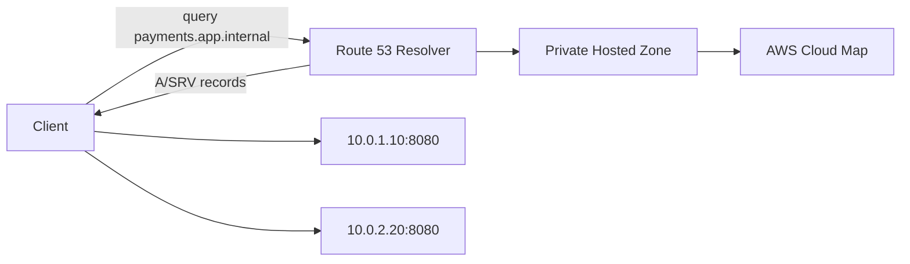
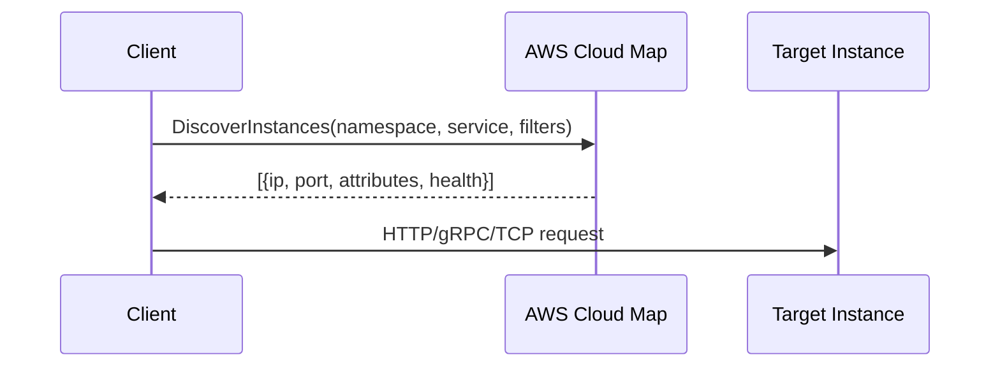
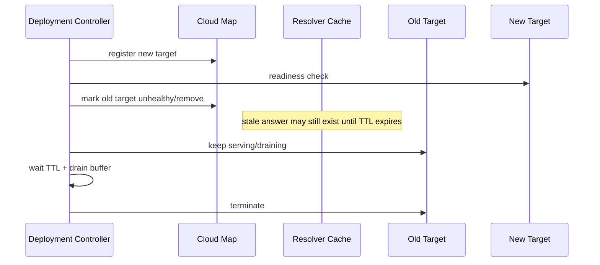
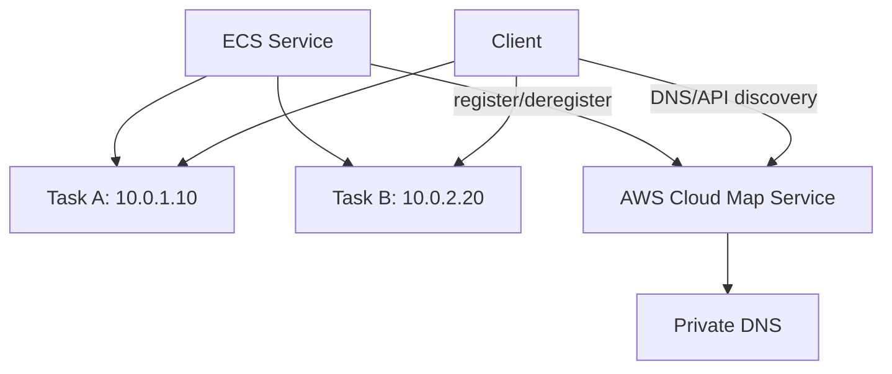
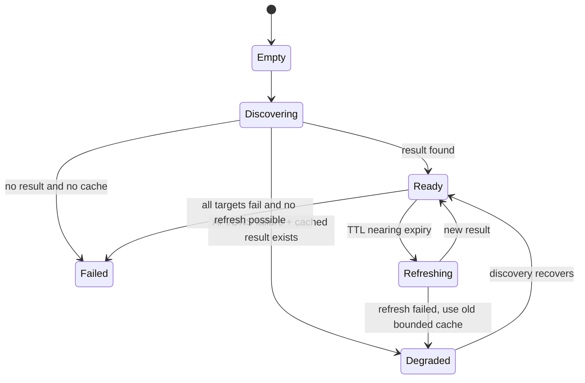

# Part 063 — AWS Cloud Map and Service Discovery

Service discovery sering terlihat seperti topik microservices, tetapi di AWS ia adalah topik networking yang sangat konkret. Masalahnya bukan hanya “bagaimana service A tahu alamat service B”, tetapi:

1. siapa yang menjadi sumber kebenaran lokasi service,
2. apakah discovery dilakukan lewat DNS atau API,
3. bagaimana health memengaruhi hasil discovery,
4. berapa lama client boleh menyimpan jawaban lama,
5. apa yang terjadi saat deployment, scale-out, scale-in, failover, atau partial outage,
6. bagaimana discovery dibatasi oleh VPC, account, namespace, IAM, dan DNS resolver path.

AWS Cloud Map adalah managed service discovery registry. Ia bisa mengembalikan lokasi resource melalui DNS query atau API call. Dalam dokumentasi AWS, Cloud Map terdiri dari namespace, service, dan service instance; namespace mengelompokkan service dan menentukan cara resource ditemukan, service menjadi template discovery, dan instance adalah resource konkret yang didaftarkan ke service.

Mental model yang perlu dipegang:

> Cloud Map bukan load balancer. Cloud Map adalah registry lokasi service. Client atau integration layer tetap harus memutuskan cara memakai hasil discovery tersebut.

---

## 1. Problem Dasar: Alamat Service Tidak Stabil

Di sistem statis, client bisa menyimpan alamat server:

```txt
billing.internal -> 10.20.4.17
```

Di cloud, alamat semacam itu rapuh:

- task ECS bisa mati dan diganti,
- pod bisa berpindah node,
- EC2 bisa diganti Auto Scaling Group,
- target bisa bertambah karena scale-out,
- target bisa hilang karena deployment,
- service bisa dipindah subnet/AZ,
- account dan VPC bisa berbeda,
- health instance bisa berubah tanpa perubahan deployment.

Tanpa service discovery, ada dua pola buruk:

1. **Hardcoded address** — cepat di awal, gagal saat scaling/failure.
2. **Load balancer untuk semua hal** — stabil tetapi bisa overkill, mahal, dan menghilangkan beberapa informasi instance-level.

Cloud Map berada di tengah:

- lebih dinamis dari hardcoded DNS manual,
- lebih ringan dari load balancer untuk beberapa service internal,
- bisa dipakai oleh platform seperti ECS,
- bisa dipakai lewat DNS atau API,
- bisa membawa metadata instance.

---

## 2. Cloud Map sebagai Registry, Bukan Router

Cloud Map menyimpan mapping seperti ini:

```txt
namespace: app.internal
service:   payments
instances:
  - id: task-001
    AWS_INSTANCE_IPV4: 10.0.11.23
    AWS_INSTANCE_PORT: 8080
    version: v42
    az: ap-southeast-1a
    shard: s1

  - id: task-002
    AWS_INSTANCE_IPV4: 10.0.12.41
    AWS_INSTANCE_PORT: 8080
    version: v42
    az: ap-southeast-1b
    shard: s2
```

Client bisa menemukan instance melalui:

```txt
payments.app.internal
```

atau melalui API:

```txt
DiscoverInstances(namespace=app.internal, service=payments, queryParameters={version=v42})
```

Perbedaannya penting:

| Mode | Cocok Untuk | Kelebihan | Risiko |
|---|---|---|---|
| DNS discovery | client umum, sederhana, bahasa apa pun | mudah, kompatibel, tidak perlu SDK | TTL, cache stale, metadata terbatas |
| API discovery | client yang butuh metadata/filtering | bisa pakai attributes, lebih eksplisit | perlu SDK, retry, IAM, fallback |
| Load balancer | public/private stable entrypoint | health check dan distribution dikelola LB | cost, hop tambahan, kurang granular |

Cloud Map tidak otomatis membuat request dari client ke instance menjadi aman, terenkripsi, retry-safe, atau load-balanced secara sempurna. Ia hanya mengembalikan kandidat lokasi. Kualitas production system tetap bergantung pada client behavior.

---

## 3. Komponen Cloud Map

### 3.1 Namespace

Namespace adalah boundary naming.

Contoh:

```txt
corp.internal
payments.internal
svc.prod.example.com
```

Namespace menentukan cara service ditemukan:

| Namespace Type | Discovery | Umum Dipakai Untuk |
|---|---|---|
| Private DNS namespace | DNS di dalam VPC | internal service discovery |
| Public DNS namespace | public DNS | internet-facing discovery tertentu |
| HTTP namespace | API discovery only | metadata-rich discovery tanpa DNS |

Private DNS namespace biasanya membuat private hosted zone Route 53 di belakang layar. Karena itu, VPC association dan DNS resolver behavior menjadi bagian dari desain.

### 3.2 Service

Service adalah definisi discovery untuk sekelompok instance.

Contoh service:

```txt
orders.corp.internal
payments.corp.internal
inventory.corp.internal
```

Service bisa mengandung:

- DNS record configuration,
- routing policy,
- health check configuration,
- custom health check configuration,
- attributes yang nanti bisa digunakan saat discovery.

### 3.3 Service Instance

Instance adalah resource konkret yang didaftarkan.

Contoh instance:

```yaml
id: task-7ff3c
attributes:
  AWS_INSTANCE_IPV4: 10.0.21.83
  AWS_INSTANCE_PORT: 8080
  deployment: blue
  version: 2026.07.06-1
  az: ap-southeast-1a
```

Instance bukan harus EC2. Ia bisa mewakili ECS task, endpoint, database proxy, appliance, atau resource lain selama atribut discovery-nya valid.

---

## 4. DNS Discovery vs API Discovery

### 4.1 DNS Discovery

DNS discovery cocok ketika client hanya butuh IP/port dan bisa bekerja dengan jawaban DNS.



Record yang umum:

| Record | Makna |
|---|---|
| A | IPv4 address target |
| AAAA | IPv6 address target |
| SRV | hostname + port; cocok jika port target dinamis |
| CNAME | alias; tidak selalu cocok untuk service instance dinamis |

SRV record sering lebih ekspresif untuk service discovery karena port adalah bagian dari jawaban. Namun banyak HTTP client sederhana tidak memakai SRV record secara native. Akibatnya, banyak platform tetap memakai A record + port konvensional.

### 4.2 API Discovery

API discovery cocok ketika client butuh metadata.

Contoh kebutuhan:

- pilih instance dengan `version=v2`,
- pilih shard tertentu,
- pilih AZ lokal,
- pilih endpoint dengan capability tertentu,
- lakukan canary berdasarkan metadata.

Flow:



API discovery membuka kemampuan lebih besar, tetapi juga membawa tanggung jawab lebih besar:

- client perlu AWS SDK atau wrapper internal,
- IAM permission harus benar,
- retry/backoff harus benar,
- discovery result harus di-cache dengan hati-hati,
- fallback saat Cloud Map API unavailable harus dipikirkan.

---

## 5. Cloud Map Tidak Menggantikan Load Balancer

Perbandingan yang lebih tepat:

| Aspek | Cloud Map | ALB/NLB | VPC Lattice |
|---|---|---|---|
| Fungsi utama | menemukan lokasi service | mendistribusikan traffic | service networking + policy + routing |
| Data plane traffic lewat layanan? | tidak | ya | ya |
| Health-aware routing | terbatas pada discovery result | ya | ya |
| Retry/circuit breaker | client-side | tidak otomatis untuk app-level | tergantung client/proxy behavior |
| Metadata filtering | API discovery bisa | tidak | policy/routing level |
| Cocok untuk | internal dynamic registry | stable front door | service-to-service cross-VPC/account |

Cloud Map memberi alamat. Load balancer menjadi alamat. Itu perbedaan besar.

Dengan Cloud Map:

```txt
client -> lookup -> target langsung
```

Dengan ALB/NLB:

```txt
client -> load balancer -> target
```

Konsekuensi:

- Cloud Map bisa lebih direct dan hemat hop.
- Cloud Map mendorong kompleksitas ke client.
- Load balancer menyederhanakan client tetapi menambah komponen data plane.
- Lattice menaikkan abstraksi untuk service-to-service governance.

---

## 6. Health Semantics

Cloud Map dapat memakai beberapa pendekatan health:

1. Route 53 health check.
2. Custom health status yang diperbarui oleh aplikasi/platform.
3. Tidak memakai health filtering.

Masalah penting:

> Health discovery bukan health request real-time.

Jika DNS TTL masih menyimpan jawaban lama, client masih bisa mencoba instance yang baru saja unhealthy atau deregistered. Jika API discovery result di-cache terlalu lama, masalah yang sama terjadi.

### 6.1 Health Check Route 53

Cocok untuk resource yang bisa diperiksa dari perspektif Route 53 health checker. Untuk private/internal endpoint, model ini sering kurang cocok karena reachability checker harus sesuai dengan desain network.

### 6.2 Custom Health

Custom health memberi aplikasi/platform kontrol eksplisit.

Contoh:

```txt
register instance -> healthy
start draining -> unhealthy
wait TTL + connection drain
stop instance
```

Ini berguna untuk ECS/task deployment, custom orchestrator, atau workload yang punya readiness semantics sendiri.

### 6.3 No Health Check

Kadang valid untuk resource yang stabil atau ketika health sudah dikontrol oleh layer lain. Namun untuk dynamic compute, no-health discovery berarti client harus siap menerima stale/dead target.

---

## 7. TTL adalah Kontrak Deployment

TTL bukan sekadar angka DNS. TTL adalah janji berapa lama client/resolver boleh mempercayai jawaban lama.

Jika TTL 60 detik:

- deployment tidak boleh mengasumsikan semua client pindah dalam 1 detik,
- target lama harus tetap menerima traffic setidaknya selama periode cache realistis,
- connection draining harus mempertimbangkan TTL,
- rollback juga tidak instan.

Contoh bug produksi:

```txt
T0: task lama deregistered dari Cloud Map
T1: deployment menghentikan task lama
T2: client masih punya cached DNS selama 30 detik
T3: request gagal ke IP lama
```

Solusi:

```txt
T0: mark unhealthy / remove from discovery
T1: wait TTL + safety buffer
T2: drain connection
T3: terminate task
```

Mermaid lifecycle:



---

## 8. Naming Strategy

Bad naming:

```txt
ip-10-0-1-12.internal
service-prod-alb-123.internal
orders-v2-temp.internal
```

Good naming:

```txt
orders.service.prod.corp.internal
orders.service.staging.corp.internal
orders-read.service.prod.corp.internal
orders-write.service.prod.corp.internal
```

Prinsip:

1. Nama merepresentasikan capability, bukan deployment artifact.
2. Environment harus eksplisit.
3. Jangan mencampur public dan private semantics di nama yang sama tanpa split-horizon plan.
4. Jangan memasukkan version ke nama kecuali version memang bagian dari contract client.
5. Gunakan namespace sebagai boundary ownership.

Contoh struktur:

```txt
<service>.<domain>.<environment>.<org-internal-zone>

payments.core.prod.corp.internal
ledger.core.prod.corp.internal
search.platform.prod.corp.internal
```

---

## 9. Metadata Discovery Pattern

API discovery menjadi kuat ketika metadata dipakai sebagai selection logic.

Contoh attributes:

```yaml
version: v2
az: ap-southeast-1a
cell: cell-3
protocol: grpc
portName: grpc-public
complianceZone: pii
```

Client bisa melakukan:

```txt
DiscoverInstances(
  namespace=core.prod.corp.internal,
  service=payments,
  queryParameters={
    version=v2,
    cell=cell-3
  }
)
```

Namun jangan menjadikan Cloud Map sebagai database konfigurasi umum. Ia registry discovery, bukan config store.

Gunakan metadata untuk:

- routing ringan,
- canary target selection,
- shard/cell awareness,
- protocol/port selection,
- capability discovery.

Hindari metadata untuk:

- secret,
- large config,
- policy kompleks,
- feature flag utama,
- data yang berubah sangat sering.

---

## 10. Cloud Map dengan ECS

ECS service discovery memakai AWS Cloud Map untuk mengelola namespace/service/instance bagi ECS service. Saat task naik/turun, ECS dapat mendaftarkan/deregister instance discovery.

Mental model:



Hal yang harus diperhatikan:

- task lifecycle tidak sama dengan DNS cache lifecycle,
- health check container berbeda dengan Cloud Map health semantics,
- port mapping harus cocok dengan record type,
- service discovery langsung ke task berarti client harus siap terhadap target churn,
- load balancer tetap lebih cocok untuk traffic publik/stabil atau ketika client tidak bisa menangani multi-target behavior.

---

## 11. Cloud Map vs Route 53 Private Hosted Zone Manual

Route 53 private hosted zone manual cocok untuk record stabil:

```txt
db.internal -> rds-endpoint
proxy.internal -> nlb.internal
```

Cloud Map cocok untuk dynamic registry:

```txt
orders.internal -> many changing task IPs
```

Decision rule:

| Situasi | Pilihan |
|---|---|
| Nama internal stabil ke ALB/NLB/RDS | Private hosted zone manual |
| Banyak instance dinamis | Cloud Map |
| Butuh metadata/filtering | Cloud Map API discovery |
| Cross-account service networking + auth | VPC Lattice / PrivateLink |
| Public API | CloudFront/API Gateway/ALB + Route 53 |

---

## 12. Failure Modes

### 12.1 Stale DNS

Gejala:

- client masih memanggil IP lama,
- deployment terlihat sukses tetapi error naik beberapa menit,
- hanya sebagian client terdampak.

Penyebab:

- TTL terlalu tinggi,
- resolver/client cache tidak menghormati TTL sempurna,
- target dimatikan sebelum drain selesai.

Mitigasi:

- TTL realistis,
- deployment drain buffer,
- client retry ke hasil discovery baru,
- target tetap melayani selama grace period.

### 12.2 Registry Drift

Gejala:

- instance mati masih ada di Cloud Map,
- instance hidup belum terdaftar,
- discovery result tidak cocok dengan actual workload.

Penyebab:

- deregistration gagal,
- controller crash,
- IAM permission salah,
- manual mutation.

Mitigasi:

- reconciler periodik,
- compare desired state vs Cloud Map state,
- alert pada stale instance,
- IaC untuk namespace/service, automation untuk instance lifecycle.

### 12.3 Discovery API Dependency

Gejala:

- client gagal menemukan target saat AWS API throttling/unavailable,
- traffic turun walaupun target sehat.

Mitigasi:

- cache last-known-good result,
- bounded TTL cache,
- exponential backoff,
- fallback DNS mode untuk beberapa client,
- separate discovery failure from target failure in metrics.

### 12.4 Split-Horizon Confusion

Gejala:

- nama yang sama resolve berbeda dari VPC berbeda,
- on-prem melihat public record, VPC melihat private record,
- debugging dari laptop memberi hasil beda dari workload.

Mitigasi:

- dokumentasikan resolver path,
- gunakan query dari network vantage point yang benar,
- aktifkan Route 53 Resolver query logs,
- hindari nama ambigu tanpa policy.

---

## 13. Client-Side Discovery Runtime

Discovery bukan hanya lookup. Client runtime yang sehat punya state machine:



Invariant:

1. Jangan lakukan discovery pada setiap request.
2. Jangan cache selamanya.
3. Jangan menganggap result kosong selalu berarti service tidak ada; bisa jadi discovery path gagal.
4. Pisahkan metric `discovery_error` dan `target_error`.
5. Gunakan jitter untuk refresh agar tidak terjadi thundering herd.

Pseudo-code:

```java
final class ServiceDirectory {
    private final Duration ttl = Duration.ofSeconds(30);
    private final Duration staleTtl = Duration.ofMinutes(5);
    private volatile DiscoverySnapshot lastGood;

    List<Endpoint> resolve(String serviceName) {
        var snapshot = lastGood;

        if (snapshot != null && !snapshot.isExpired(ttl)) {
            return snapshot.endpoints();
        }

        try {
            var fresh = cloudMapDiscover(serviceName);
            if (!fresh.isEmpty()) {
                lastGood = new DiscoverySnapshot(fresh, Instant.now());
                return fresh;
            }

            if (snapshot != null && !snapshot.isExpired(staleTtl)) {
                return snapshot.endpoints();
            }

            throw new NoHealthyEndpointException(serviceName);
        } catch (DiscoveryException e) {
            if (snapshot != null && !snapshot.isExpired(staleTtl)) {
                return snapshot.endpoints();
            }
            throw e;
        }
    }
}
```

---

## 14. Security and Governance

Cloud Map berada di intersection IAM, DNS, VPC, dan application ownership.

Governance checklist:

- namespace dibuat oleh platform/network team,
- service ownership jelas,
- instance registration dilakukan oleh deployment controller, bukan manual,
- API discovery permission dibatasi per namespace/service,
- tidak menyimpan secret di attributes,
- query logging/DNS logging diaktifkan untuk critical namespace,
- naming convention diverifikasi di CI/IaC,
- stale instance direkonsiliasi otomatis,
- deletion namespace/service dilindungi karena berdampak luas.

IAM boundary contoh:

| Role | Permission |
|---|---|
| Platform admin | create namespace, create service, delete service |
| Deployment controller | register/deregister instance, update health |
| Application runtime | discover instances |
| Auditor | list/read namespace/service/instances |

---

## 15. Observability

Minimum metrics/logs:

| Signal | Makna |
|---|---|
| discovery latency | waktu lookup DNS/API |
| discovery error rate | kegagalan registry/resolver/API |
| result count | jumlah endpoint ditemukan |
| stale cache usage | client memakai last-known-good result |
| target connection error | target tidak bisa dihubungi |
| target response error | target reachable tetapi app error |
| deregistration lag | waktu dari stop intent ke hilang dari discovery |
| stale instance count | instance registered tetapi tidak ada workload sehat |

Untuk DNS mode, gunakan:

- Route 53 Resolver query logs,
- VPC Flow Logs untuk traffic client → target,
- application logs untuk selected endpoint,
- deployment events untuk register/deregister lifecycle.

Untuk API mode, gunakan:

- AWS SDK metrics,
- retry/throttle metrics,
- CloudTrail untuk mutation API,
- service runtime metrics.

---

## 16. Implementation Blueprint

### Step 1 — Tetapkan Discovery Boundary

Contoh:

```txt
namespace: core.prod.corp.internal
owner: platform-networking
visibility: private DNS + API
associated VPCs: prod workload VPCs
```

### Step 2 — Buat Service Contract

```yaml
service: payments
protocol: http
port: 8080
recordType: A
health: custom
attributes:
  - version
  - cell
  - az
  - deployment
```

### Step 3 — Register Instance via Controller

```yaml
instanceId: ecs-task-abc123
AWS_INSTANCE_IPV4: 10.0.14.52
AWS_INSTANCE_PORT: 8080
version: 2026.07.06
cell: cell-1
az: ap-southeast-1a
```

### Step 4 — Client Runtime

Client harus:

- resolve dengan TTL/cache bounded,
- shuffle endpoints,
- retry ke endpoint lain untuk connection failure,
- circuit-break target yang buruk,
- refresh discovery dengan jitter,
- expose selected endpoint di trace/log.

### Step 5 — Deployment Lifecycle

```txt
register new -> readiness -> route traffic -> mark old unhealthy -> wait TTL -> drain -> terminate
```

### Step 6 — Reconciliation

Periodik:

```txt
actual workload set == registered Cloud Map instance set
```

Jika tidak cocok:

- deregister zombie instance,
- register missing instance,
- alert jika drift berulang.

---

## 17. Anti-Patterns

### Anti-Pattern 1 — Menganggap DNS Discovery Sama dengan Load Balancer

DNS bisa memberi beberapa IP, tetapi client behavior menentukan apakah semua IP dipakai, apakah retry benar, dan apakah stale result ditangani.

### Anti-Pattern 2 — TTL Terlalu Tinggi untuk Dynamic Compute

TTL tinggi mengurangi query tetapi memperpanjang stale routing saat deployment/failure.

### Anti-Pattern 3 — Semua Service Memakai Cloud Map Meski Butuh Stable Entry Point

Untuk public API, partner integration, atau service yang client-nya tidak discovery-aware, gunakan ALB/NLB/API Gateway/Lattice.

### Anti-Pattern 4 — Menyimpan Konfigurasi Besar di Attributes

Cloud Map attributes bukan general configuration database.

### Anti-Pattern 5 — Manual Register/Deregister

Manual operation menyebabkan registry drift. Registry harus direkonsiliasi oleh deployment/platform automation.

---

## 18. Decision Matrix

| Pertanyaan | Jawaban Mengarah Ke |
|---|---|
| Client hanya butuh stable HTTP endpoint? | ALB/API Gateway/VPC Lattice |
| Client perlu menemukan banyak instance dinamis? | Cloud Map |
| Client perlu metadata filtering? | Cloud Map API discovery |
| Consumer berada di VPC/account berbeda dan butuh private service exposure? | PrivateLink/VPC Lattice |
| Perlu auth policy service-to-service managed? | VPC Lattice |
| Perlu public edge/cache/security? | CloudFront/API Gateway/ALB + WAF |
| Perlu DNS public domain? | Route 53 public hosted zone |

---

## 19. Production Checklist

Sebelum Cloud Map dipakai produksi:

- [ ] namespace ownership jelas,
- [ ] VPC association benar,
- [ ] resolver path diuji dari workload VPC,
- [ ] TTL dipilih berdasarkan deployment drain model,
- [ ] service registration otomatis,
- [ ] deregistration path diuji,
- [ ] custom health semantics jelas,
- [ ] client punya bounded cache dan retry,
- [ ] stale instance reconciliation ada,
- [ ] CloudTrail untuk mutation API dipantau,
- [ ] Resolver query logs aktif untuk critical namespace,
- [ ] dashboard membedakan discovery failure vs target failure,
- [ ] runbook split-horizon DNS tersedia.

---

## 20. Lab: Build a Small Internal Discovery System

Target:

```txt
client -> Cloud Map -> two private service instances
```

Langkah:

1. Buat private DNS namespace `lab.internal`.
2. Buat service `echo.lab.internal`.
3. Jalankan dua instance/task HTTP sederhana pada port 8080.
4. Register keduanya sebagai Cloud Map instances.
5. Query via DNS dari instance di VPC yang sama.
6. Query via `DiscoverInstances` API.
7. Deregister satu instance.
8. Amati TTL/stale behavior.
9. Ubah client untuk retry ke endpoint lain.
10. Catat perbedaan failure: DNS stale, connection refused, HTTP 5xx.

Expected learning:

- DNS discovery bukan instant failover,
- API discovery memberi metadata tetapi perlu client logic,
- deployment lifecycle harus menghormati TTL,
- registry drift harus direkonsiliasi.

---

## 21. Ringkasan

Cloud Map adalah primitive penting untuk service discovery, tetapi ia bukan silver bullet. Ia paling bernilai ketika:

- instance dinamis,
- client discovery-aware,
- metadata discovery dibutuhkan,
- discovery lifecycle dikontrol automation,
- TTL dan health semantics dipahami sebagai bagian dari deployment contract.

Gunakan Cloud Map untuk menemukan resource. Gunakan load balancer, VPC Lattice, PrivateLink, atau API Gateway ketika yang dibutuhkan adalah stable data-plane front door, policy enforcement, private service exposure, atau public API boundary.

Bagian berikutnya membahas API Gateway sebagai networking boundary: kapan ia menjadi public front door, kapan ia private API via VPC endpoint, dan kapan ia menjadi jembatan ke private VPC resource melalui VPC Link.

---

## References

- AWS Cloud Map Developer Guide — What is AWS Cloud Map: https://docs.aws.amazon.com/cloud-map/latest/dg/what-is-cloud-map.html
- AWS Cloud Map — DiscoverInstances API: https://docs.aws.amazon.com/cloud-map/latest/api/API_DiscoverInstances.html
- AWS Cloud Map — Service DNS configuration: https://docs.aws.amazon.com/cloud-map/latest/dg/services-route53.html
- AWS Cloud Map — Health check configuration: https://docs.aws.amazon.com/cloud-map/latest/dg/services-health-checks.html
- Amazon ECS Developer Guide — Service discovery: https://docs.aws.amazon.com/AmazonECS/latest/developerguide/service-discovery.html
