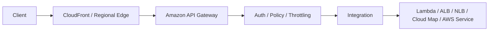
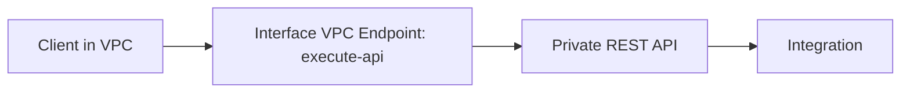
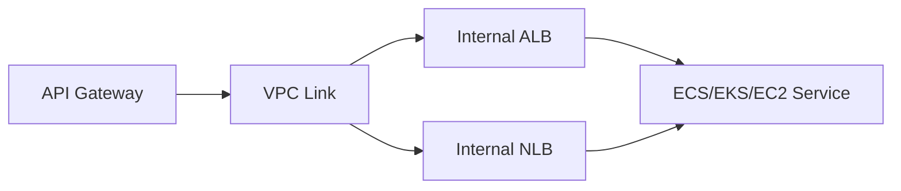
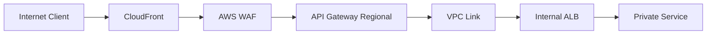
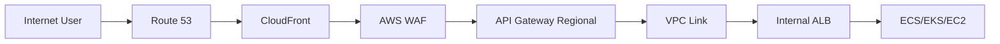
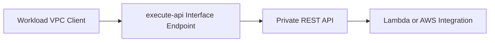
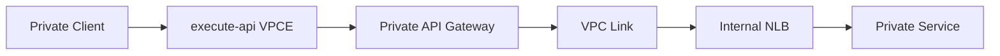

# Part 064 — API Gateway Networking Positioning

API Gateway sering diajarkan sebagai layanan API management: resource, method, route, authorizer, throttling, stage, deployment. Dalam seri networking ini, kita melihatnya dari sudut berbeda:

> API Gateway adalah boundary antara client HTTP dan network/internal service topology.

Ia bisa menjadi:

- public API front door,
- private API hanya dari VPC,
- integration layer ke private ALB/NLB/service,
- API policy enforcement point,
- edge yang dikombinasikan dengan CloudFront/WAF,
- adapter antara internet-facing client dan workload private.

Namun API Gateway bukan pengganti universal untuk ALB, NLB, CloudFront, PrivateLink, atau VPC Lattice. Ia punya posisi spesifik: request/response API boundary dengan kontrol identity, throttling, transformation, deployment stage, dan integration policy.

---

## 1. Mental Model

Ada tiga pertanyaan utama:

1. **Siapa client-nya?** Internet user, partner, mobile app, internal VPC workload, on-prem, atau service lain?
2. **Di mana backend-nya?** Lambda, public HTTP endpoint, private ALB/NLB, ECS/EKS/EC2, Cloud Map service, atau AWS service integration?
3. **Boundary apa yang dibutuhkan?** Auth, throttling, request shaping, private connectivity, WAF, caching, custom domain, observability, usage plan, or stage rollout?

API Gateway duduk di antara client dan backend.



Jangan mulai desain dengan “pakai API Gateway atau ALB?” Mulai dengan boundary:

- Apakah perlu API product semantics?
- Apakah client public atau private?
- Apakah backend public atau private?
- Apakah butuh request-aware policy?
- Apakah butuh simple L7 load balancing saja?
- Apakah butuh CDN/cache?

---

## 2. Endpoint Types dan Reachability

API Gateway memiliki beberapa cara diposisikan terhadap network.

### 2.1 Public / Regional API

Regional API endpoint cocok ketika:

- API diakses dari internet,
- latency region tertentu cukup,
- ingin integrasi dengan custom domain,
- CloudFront bisa ditambahkan eksplisit di depan jika perlu global edge/security/caching.

Flow:

```txt
Internet client -> API Gateway regional endpoint -> integration
```

### 2.2 Edge-Optimized Pattern

Untuk beberapa REST API use case, API Gateway bisa memanfaatkan CloudFront-managed edge distribution. Namun untuk kontrol penuh CloudFront behavior, banyak arsitektur modern memilih CloudFront eksplisit di depan regional API.

Flow eksplisit:

```txt
Internet client -> CloudFront -> WAF -> API Gateway regional -> backend
```

Kelebihan CloudFront eksplisit:

- cache behavior lebih jelas,
- WAF/Shield posture konsisten,
- custom headers ke origin,
- origin failover possible dengan origin group,
- edge functions bisa dipakai.

### 2.3 Private API

Private REST API hanya bisa dipanggil dari dalam VPC melalui interface VPC endpoint untuk `execute-api`. Interface endpoint ini menggunakan AWS PrivateLink.

Flow:



Private API cocok untuk:

- internal platform API,
- partner connected via private network,
- regulated workloads yang tidak boleh expose public endpoint,
- shared internal API across VPCs/accounts via endpoint strategy.

Tetapi private API bukan sama dengan “backend private”. Private API menjelaskan bagaimana client mencapai API Gateway. Backend integration masih harus didesain sendiri.

---

## 3. Private API vs Private Integration

Ini salah satu kebingungan paling umum.

| Konsep | Arti |
|---|---|
| Private API | Client mengakses API Gateway secara private melalui interface VPC endpoint |
| Private integration | API Gateway mengakses backend private di VPC melalui VPC Link |

Mereka bisa dipakai terpisah atau bersama.

### Public API dengan Private Backend

```txt
Internet client -> API Gateway public/regional -> VPC Link -> internal ALB/NLB -> service
```

### Private API dengan Private Backend

```txt
VPC client -> execute-api interface endpoint -> Private API Gateway -> VPC Link -> internal ALB/NLB -> service
```

### Private API dengan Lambda Backend

```txt
VPC client -> execute-api interface endpoint -> Private API Gateway -> Lambda
```

Private API mengamankan ingress ke API Gateway. Private integration mengamankan egress dari API Gateway ke backend VPC resource.

---

## 4. VPC Link Mental Model

VPC Link adalah jembatan dari API Gateway ke private resource dalam VPC.



VPC Link menjawab problem:

> Bagaimana API Gateway yang managed service dapat memanggil backend private tanpa membuat backend internet-facing?

Private integration modern dapat diarahkan ke Application Load Balancer atau Network Load Balancer. Untuk HTTP API, private integration juga dapat memakai AWS Cloud Map dalam beberapa pola.

### 4.1 Kapan Pakai ALB di Belakang API Gateway

ALB cocok jika backend butuh:

- HTTP routing kompleks,
- host/path rules,
- target group ke ECS/EKS/EC2,
- HTTP health check,
- header-based routing,
- gRPC/WebSocket support pada ALB side sesuai kebutuhan,
- target-level observability L7.

Pattern:

```txt
API Gateway -> VPC Link -> internal ALB -> ECS services
```

### 4.2 Kapan Pakai NLB di Belakang API Gateway

NLB cocok jika backend butuh:

- TCP/TLS style backend,
- static private IP style behavior,
- very high connection scale,
- integration chain yang sudah memakai NLB,
- provider pattern tertentu.

Pattern:

```txt
API Gateway -> VPC Link -> internal NLB -> targets
```

### 4.3 Kapan Pakai Cloud Map Integration

Cloud Map cocok jika backend dinamis dan API Gateway integration ingin menemukan service melalui service discovery, terutama dalam HTTP API private integration pattern.

Pattern:

```txt
API Gateway -> VPC Link -> Cloud Map service discovery -> service instances
```

Gunakan dengan hati-hati:

- health semantics harus jelas,
- service discovery TTL/result behavior harus dipahami,
- API Gateway bukan magic service mesh,
- observability target tetap harus ada.

---

## 5. API Gateway vs ALB

Pertanyaan “API Gateway atau ALB?” sering salah framing. Mereka berbeda posisi.

| Aspek | API Gateway | ALB |
|---|---|---|
| Fokus | API boundary/management | L7 load balancing |
| Auth built-in | authorizer, IAM, JWT/Cognito/custom | OIDC/Cognito auth support, lebih terbatas sebagai API product |
| Throttling/quotas | kuat | tidak sebagai API product |
| Request transformation | kuat | terbatas |
| Target | Lambda, HTTP, AWS service, VPC Link | EC2/IP/Lambda/ALB target groups |
| API version/stage | native | perlu desain sendiri |
| Cost model | per request + features | per LCU/hour/data |
| Cocok untuk | public/partner/mobile API | web app ingress/internal service routing |

Rule of thumb:

- Pakai API Gateway jika client melihat API sebagai product contract.
- Pakai ALB jika butuh HTTP load balancer untuk aplikasi/web service.
- Pakai CloudFront di depan keduanya jika butuh edge caching/security/global distribution.
- Pakai VPC Lattice jika problem utamanya service-to-service networking lintas VPC/account dengan policy.

---

## 6. API Gateway vs CloudFront

CloudFront adalah CDN/global edge proxy. API Gateway adalah API boundary.

| Pertanyaan | CloudFront | API Gateway |
|---|---|---|
| Cache global edge? | ya | terbatas/berbeda context |
| API auth/throttling/stage? | bukan fokus utama | ya |
| Static assets? | ya | tidak cocok |
| Request routing ke multiple origins? | ya | integration-based |
| WAF placement? | umum | juga bisa |
| Lambda/authorizer integration? | tidak sebagai API manager | ya |

Common production pattern:



CloudFront handles edge/security/cache. API Gateway handles API contract. ALB handles private HTTP routing to workloads.

---

## 7. API Gateway vs PrivateLink

PrivateLink exposes private services through interface endpoints. API Gateway exposes API contract.

| Use Case | Better Fit |
|---|---|
| Consumer needs private network access to provider service | PrivateLink |
| Consumer needs managed API auth/throttle/transform | API Gateway |
| SaaS private endpoint with stable TCP/HTTP service | PrivateLink + NLB |
| Internal API product with request policy | API Gateway private API |
| Cross-account service-to-service with auth policy | VPC Lattice |

Hybrid pattern:

```txt
Consumer VPC -> interface endpoint -> private API Gateway -> VPC Link -> internal service
```

This provides private API exposure plus API Gateway controls.

---

## 8. Security Boundary

API Gateway security can involve several layers:

1. DNS/custom domain.
2. TLS certificate.
3. Resource policy.
4. VPC endpoint policy for private API access.
5. API authorizer/IAM/JWT/custom auth.
6. WAF rules.
7. Throttling/usage plan.
8. Backend security group and route isolation.
9. Backend auth.

Important invariant:

> Network-private does not mean authorized.

Private API reachable only from VPC still needs API-level authorization if callers are not equally trusted.

### 8.1 Private API Policy Chain

For private REST API, access can be constrained by:

- interface endpoint reachability,
- endpoint policy,
- API Gateway resource policy,
- IAM/auth/authorizer,
- backend controls.

Example intent:

```txt
Allow execute-api invoke only from vpce-abc123 and only from approved principals.
```

### 8.2 WAF Placement

WAF can protect API Gateway, CloudFront, and ALB depending on architecture.

Common pattern:

```txt
CloudFront + WAF -> API Gateway -> private backend
```

or:

```txt
API Gateway + WAF -> Lambda/backend
```

If CloudFront is in front of API Gateway, decide where WAF policy lives. Avoid duplicating WAF rules blindly unless there is a clear defense-in-depth reason.

---

## 9. Networking Failure Modes

### 9.1 Public API Works, Backend Fails

Symptoms:

- API Gateway returns 5xx,
- integration latency spikes,
- backend metrics show no request or partial request.

Possible causes:

- VPC Link unhealthy,
- ALB/NLB target unhealthy,
- SG/NACL denies backend path,
- wrong listener/port,
- TLS hostname mismatch,
- timeout chain mismatch.

Debug order:

1. API Gateway access logs.
2. Integration status/latency.
3. VPC Link status.
4. ALB/NLB target health.
5. Backend security group.
6. Flow Logs.
7. Application logs.

### 9.2 Private API Not Reachable

Symptoms:

- client in VPC cannot call API,
- DNS resolves unexpectedly,
- request goes public path or fails TLS.

Possible causes:

- missing execute-api interface endpoint,
- private DNS disabled on endpoint,
- API resource policy denies `aws:SourceVpce`,
- endpoint policy denies invoke,
- client resolver path not using VPC resolver,
- wrong custom domain/private DNS setup.

Debug order:

```txt
DNS -> route -> interface endpoint SG -> endpoint policy -> API resource policy -> authorizer -> integration
```

### 9.3 CloudFront + API Gateway Header/TLS Issue

Symptoms:

- 403/404 from API Gateway,
- custom domain mismatch,
- origin request not matching expected Host header,
- auth header not forwarded.

Possible causes:

- CloudFront origin domain misconfigured,
- Host header forwarding wrong,
- cache policy excludes Authorization when needed,
- CORS preflight cached incorrectly,
- WAF blocks at edge.

### 9.4 Timeout Mismatch

Timeout chain:

```txt
client timeout
  > CloudFront origin timeout
    > API Gateway integration timeout
      > ALB idle timeout
        > backend server timeout
          > downstream timeout
```

Bad design:

```txt
backend timeout > API Gateway timeout
```

Result:

- API Gateway gives up while backend still working,
- retry storm,
- duplicate work,
- inconsistent client behavior.

Good design:

```txt
downstream < backend < ALB/API Gateway < client
```

Use idempotency keys for mutating APIs.

---

## 10. Observability

Minimum signals:

| Layer | Signal |
|---|---|
| API Gateway | access logs, execution logs where applicable, integration latency, 4xx/5xx |
| WAF | allowed/blocked/count rules, sampled requests |
| CloudFront | edge status, origin status, cache result, real-time logs if needed |
| VPC Link | link status, integration error patterns |
| ALB/NLB | target health, access logs, target response time, reset/errors |
| VPC | Flow Logs for backend path |
| App | request ID, trace ID, selected route, downstream latency |

Correlate request IDs:

```txt
client request id
  -> CloudFront x-edge-request-id
  -> API Gateway request id
  -> backend trace id
```

If these IDs are not propagated, debugging distributed API failures becomes guesswork.

---

## 11. Cost and Capacity Thinking

API Gateway cost/capacity is request-driven. ALB/NLB cost is time + LCU/NLCU + data dimension. CloudFront cost is request + data transfer + features. VPC Link and NAT paths may add cost depending on architecture.

Cost traps:

- using API Gateway for high-volume low-value internal calls when ALB/Lattice would fit better,
- using NAT path for private backend calls that should stay inside VPC Link/private network,
- duplicating CloudFront in front of edge-optimized API without clear reason,
- enabling verbose logs for all traffic without retention/partitioning strategy,
- using API Gateway as generic proxy for bulk file transfer.

Design rule:

> API Gateway is valuable when API control features justify per-request boundary cost.

If all you need is basic HTTP routing to private service, ALB may be simpler. If you need API product behavior, API Gateway earns its place.

---

## 12. Reference Architectures

### 12.1 Public API, Private Service



Use when:

- public client,
- private backend,
- API auth/throttle needed,
- edge security/cache useful.

### 12.2 Private API for Internal Consumers



Use when:

- API must not be public,
- clients live inside VPC/private network,
- API Gateway controls still desired.

### 12.3 Private API + Private Backend



Use when:

- ingress to API Gateway must be private,
- backend also private,
- network and API authorization both required.

### 12.4 Partner Private API

```txt
Partner network -> Direct Connect/VPN -> VPC -> execute-api VPCE -> Private API Gateway
```

or:

```txt
Partner VPC -> PrivateLink/interface endpoint strategy -> private API exposure
```

Decision depends on ownership, routing, DNS, and authorization boundary.

---

## 13. Implementation Blueprint

### Step 1 — Classify API Exposure

```yaml
api: payments-public
client: internet/mobile
exposure: public-regional
edge: cloudfront
waf: enabled
backend: private-alb-via-vpc-link
```

or:

```yaml
api: compliance-internal
client: workload-vpc/on-prem
exposure: private-rest-api
interfaceEndpoint: execute-api
backend: lambda
```

### Step 2 — Define Network Path

For public/private backend:

```txt
Route 53 -> CloudFront -> API Gateway -> VPC Link -> Internal ALB -> Service
```

For private API:

```txt
Client -> VPC Resolver -> execute-api VPCE -> Private API Gateway -> Integration
```

### Step 3 — Define Policy Chain

```yaml
resourcePolicy:
  allowSourceVpce: vpce-abc123
  allowPrincipalOrg: o-example

authorization:
  type: jwt-or-iam-or-custom

waf:
  managedRules: enabled
  rateLimit: enabled

backend:
  securityGroupAllows: vpc-link-to-alb
```

### Step 4 — Define Timeout Contract

```yaml
clientTimeout: 30s
cloudfrontOriginTimeout: 20s
apiGatewayIntegrationTimeout: 10s
albIdleTimeout: 15s
backendTimeout: 8s
downstreamTimeout: 5s
```

The exact values depend on service behavior, but ordering matters.

### Step 5 — Define Logs and Correlation

```yaml
requiredHeaders:
  - x-request-id
  - traceparent
  - x-correlation-id

logs:
  cloudfront: enabled
  waf: sampled-and-full-for-blocked
  apiGatewayAccess: enabled
  albAccess: enabled
  app: structured-json
```

### Step 6 — Test Failure Modes

Test before production:

- backend target unhealthy,
- VPC Link misroute,
- SG deny,
- WAF block,
- authorizer deny,
- endpoint policy deny,
- API resource policy deny,
- DNS private endpoint resolution failure,
- timeout and retry storm,
- deployment rollback.

---

## 14. Anti-Patterns

### Anti-Pattern 1 — API Gateway as Universal Reverse Proxy

If there is no API management need, API Gateway can become expensive and unnecessarily complex.

### Anti-Pattern 2 — Public Backend Behind Public API Gateway

If API Gateway is the intended public boundary, backend should usually be private or protected. Otherwise clients may bypass API Gateway controls.

### Anti-Pattern 3 — Private API Without API Authorization

Private reachability is not identity. Internal callers still need auth boundary where trust is not uniform.

### Anti-Pattern 4 — CloudFront Caching Authenticated API Incorrectly

If Authorization/cookies/query parameters affect response, cache key and origin request policy must reflect correctness.

### Anti-Pattern 5 — Timeout Chain Reversed

Backend work continuing after API Gateway timeout leads to retries, duplicate writes, and false failure signals.

### Anti-Pattern 6 — No Request Correlation Across Layers

Without propagated request IDs, CloudFront/API Gateway/ALB/app logs become separate islands.

---

## 15. Decision Matrix

| Requirement | Suggested Architecture |
|---|---|
| Public REST/HTTP API with auth/throttle | API Gateway regional + WAF, optionally CloudFront |
| Public API with static assets and global edge cache | CloudFront + WAF + API Gateway/ALB origins |
| Private API only from VPC | Private REST API + execute-api interface endpoint |
| Public API to private ECS/EKS service | API Gateway + VPC Link + internal ALB/NLB |
| Simple web app ingress | ALB + WAF/CloudFront if needed |
| High-volume internal service-to-service | ALB/NLB/VPC Lattice depending policy needs |
| Cross-account private service exposure | PrivateLink or VPC Lattice |
| API product for external partners | API Gateway + custom domain + auth + throttling + observability |

---

## 16. Debugging Runbook

### Public API → Private Backend

1. Resolve custom domain.
2. Check CloudFront distribution behavior if present.
3. Check WAF action.
4. Check API Gateway access logs.
5. Check integration status/latency.
6. Check VPC Link health/status.
7. Check ALB/NLB listener and target health.
8. Check backend SG/NACL.
9. Check Flow Logs from LB to target.
10. Check app logs with request ID.

### Private API

1. From client host, resolve API DNS name.
2. Confirm it resolves to VPCE/private path.
3. Confirm interface endpoint SG allows client.
4. Confirm endpoint policy allows invoke.
5. Confirm API resource policy allows source VPCE/principal.
6. Confirm authorizer/IAM decision.
7. Confirm integration/backend.

### CloudFront in Front of API Gateway

1. Confirm Host header/origin domain.
2. Confirm cache policy forwards required auth/cors headers.
3. Confirm origin request policy forwards required values.
4. Confirm WAF not blocking.
5. Confirm API Gateway stage/base path mapping.
6. Confirm response caching is not serving stale auth-sensitive payload.

---

## 17. What Good Looks Like

A mature API Gateway networking design has:

- explicit client/backend classification,
- private backend where API Gateway is public boundary,
- resource policy and authorizer both understood,
- WAF placement intentional,
- timeout contract written down,
- request ID propagated end-to-end,
- access logs enabled with safe retention,
- VPC Link/backend target health monitored,
- deployment and rollback tested,
- bypass path blocked,
- DNS/custom domain ownership clear,
- cost model reviewed before high-volume use.

---

## 18. Ringkasan

API Gateway bukan hanya “tempat membuat endpoint”. Dari sisi networking, ia adalah boundary yang mengubah request client menjadi integration call ke backend dengan policy, auth, throttling, routing, dan observability.

Gunakan API Gateway ketika API contract dan request-level control adalah inti masalah. Gunakan ALB/NLB ketika kebutuhan utama adalah load balancing. Gunakan CloudFront ketika edge/cache/global distribution penting. Gunakan PrivateLink atau VPC Lattice ketika private service exposure atau service-to-service connectivity lintas VPC/account adalah masalah utama.

Bagian berikutnya masuk ke EKS/Kubernetes networking on AWS, tetapi hanya dari sudut networking AWS: VPC CNI, pod IP, load balancer controller, ingress, service, security groups for pods, dan batasannya.

---

## References

- Amazon API Gateway Developer Guide — Private REST APIs: https://docs.aws.amazon.com/apigateway/latest/developerguide/apigateway-private-apis.html
- Amazon API Gateway Developer Guide — Set up a private integration: https://docs.aws.amazon.com/apigateway/latest/developerguide/set-up-private-integration.html
- Amazon API Gateway Developer Guide — VPC links and private integrations: https://docs.aws.amazon.com/apigateway/latest/developerguide/http-api-vpc-links.html
- AWS Cloud Map Developer Guide — What is AWS Cloud Map: https://docs.aws.amazon.com/cloud-map/latest/dg/what-is-cloud-map.html
- Amazon CloudFront Developer Guide — Introduction: https://docs.aws.amazon.com/AmazonCloudFront/latest/DeveloperGuide/Introduction.html
- AWS WAF Developer Guide: https://docs.aws.amazon.com/waf/latest/developerguide/what-is-aws-waf.html
