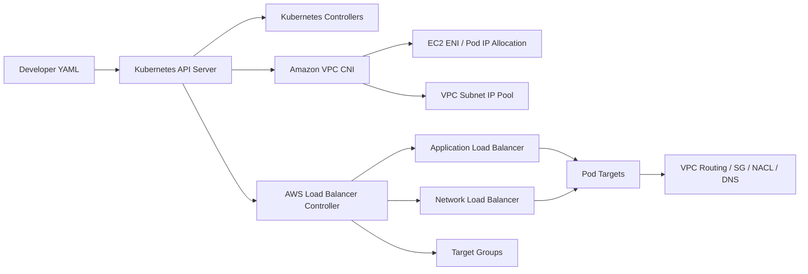
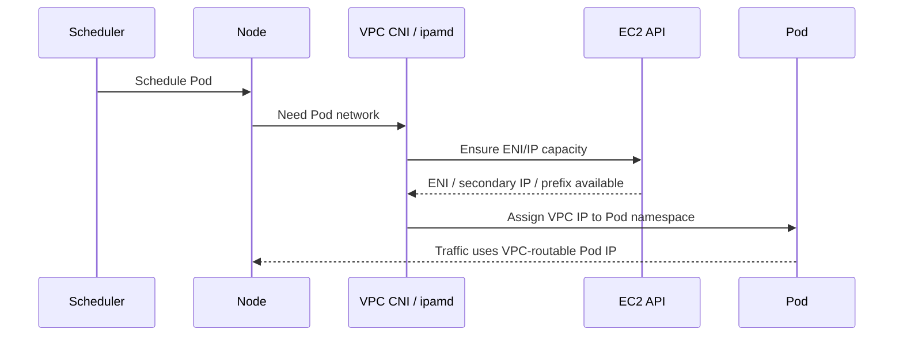
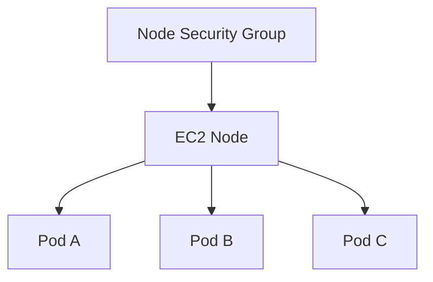
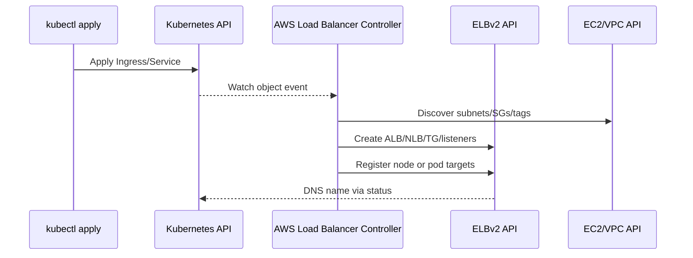
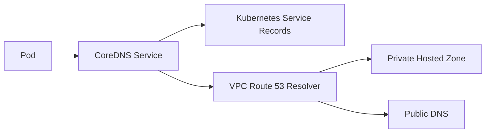
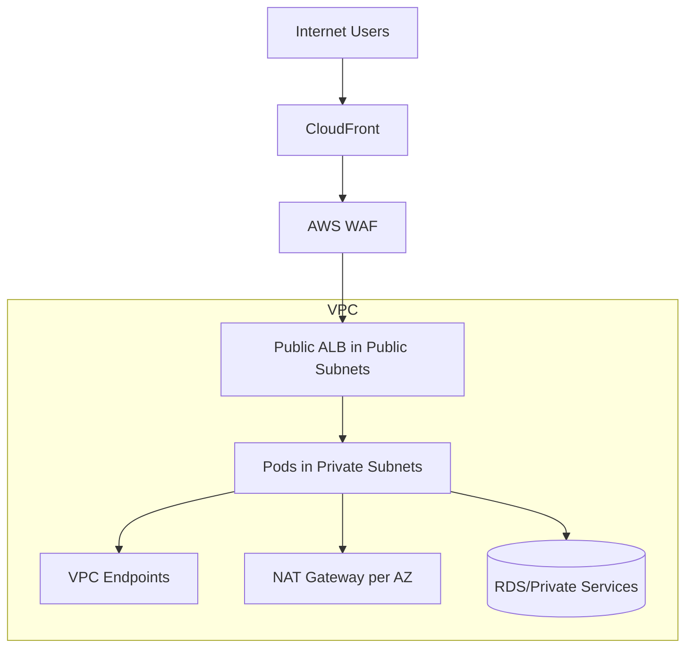
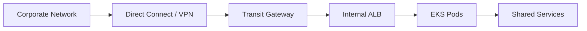
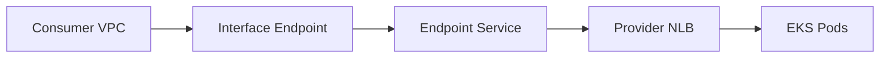

# Part 065 — EKS and Kubernetes Networking on AWS

> Tujuan part ini bukan mengajarkan Kubernetes dari nol. Tujuannya adalah membuat kamu bisa membaca **Amazon EKS networking** sebagai sistem produksi: Pod punya IP dari VPC, node punya ENI, Service menjadi abstraction, Ingress/LoadBalancer memproduksi resource AWS, dan security boundary berpindah-pindah antara Kubernetes object, AWS network primitive, dan identity.

Kubernetes networking sering tampak seperti dunia sendiri: `Service`, `Ingress`, `CNI`, `kube-proxy`, `CoreDNS`, `NetworkPolicy`. Di AWS, semua abstraction itu akhirnya harus jatuh ke primitive yang sudah kita pelajari: VPC, subnet, route table, ENI, security group, NACL, load balancer, DNS, NAT, VPC endpoint, and logs.

Kalau kamu hanya paham Kubernetes object, kamu akan bingung saat ALB muncul di wrong subnet, target unhealthy, Pod tidak bisa pull image, atau service tiba-tiba kehabisan IP. Kalau kamu hanya paham VPC, kamu akan bingung mengapa sebuah `Ingress` bisa membuat ALB, mengapa target group menunjuk ke node atau Pod, dan mengapa security group rules berubah otomatis.

Mental model yang benar:

```txt
Kubernetes declares desired connectivity.
AWS implements the physical/data-plane connectivity.
The controller is the compiler between both worlds.
```

---

## 1. Core Invariant

Amazon EKS networking punya satu invariant besar:

> Di default Amazon VPC CNI model, Pod mendapatkan IP address dari VPC, bukan dari overlay network yang tersembunyi dari VPC.

Ini membedakan EKS default networking dari banyak Kubernetes distribution yang memakai overlay. Dengan VPC-native addressing:

- Pod IP terlihat sebagai IP VPC.
- Pod traffic dapat diamati dengan VPC Flow Logs pada ENI tertentu.
- Security group dan route table VPC menjadi relevan langsung terhadap Pod traffic.
- Subnet capacity menjadi bagian dari Pod scheduling capacity.
- IP exhaustion menjadi failure mode nyata, bukan hanya masalah EC2 instance.

AWS documentation menjelaskan Amazon VPC CNI membuat ENI dan meng-assign private IPv4/IPv6 address dari VPC ke Pod. Ini berarti Pod bukan hanya Kubernetes abstraction; Pod menjadi participant di VPC address space.

---

## 2. Mapping Kubernetes Abstraction ke AWS Primitive

| Kubernetes Concept | AWS Primitive yang Terlibat | Apa yang Sebenarnya Terjadi |
|---|---|---|
| Node | EC2 instance / managed node / Fargate runtime | Compute tempat Pod berjalan. Node punya ENI, subnet, security group, route path. |
| Pod | VPC IP pada node ENI / branch ENI / Fargate ENI | Workload unit yang mengirim/menerima traffic. |
| CNI | Amazon VPC CNI plugin | Mengalokasikan IP Pod dari VPC dan menghubungkan Pod ke network namespace. |
| Service `ClusterIP` | iptables/IPVS/eBPF rules di node, plus kube-proxy behavior | Stable virtual IP di cluster, diterjemahkan ke endpoint Pod. |
| Service `NodePort` | Port terbuka di node | Jalan masuk via node IP:port, sering dipakai sebagai mekanisme target LB instance mode. |
| Service `LoadBalancer` | NLB, kadang lewat controller/Auto Mode | Membuat AWS load balancer untuk expose service. |
| Ingress | ALB via AWS Load Balancer Controller | L7 routing HTTP/HTTPS ke service/pod. |
| NetworkPolicy | Policy engine pada CNI | Mengontrol Pod-to-Pod/Pod-to-external traffic bila fitur/plugin mendukung. |
| CoreDNS | Kubernetes DNS service | Resolve `*.svc.cluster.local`, kadang forward ke VPC Resolver. |
| ExternalDNS | Route 53 record automation | Mengubah DNS record berdasarkan ingress/service annotation. |

Diagram mental:



Yang penting: Kubernetes API server menerima intent. AWS controller menerjemahkan intent itu menjadi resource AWS. Masalah produksi sering muncul saat intent Kubernetes valid, tetapi resource AWS hasil compile tidak cocok dengan subnet, SG, quota, IAM, atau route yang ada.

---

## 3. EKS Control Plane vs Data Plane

EKS menyediakan managed Kubernetes control plane. Tetapi jaringan aplikasi kamu tetap hidup di data plane: node, subnet, ENI, Pod, load balancer, target group, DNS, route table.

Secara operasional, pisahkan tiga plane:

| Plane | Contoh | Pertanyaan Debugging |
|---|---|---|
| Kubernetes control plane | API server, scheduler, controller-manager, etcd managed by EKS | Apakah object tersimpan? Apakah controller melihat event? |
| AWS control plane | EC2 API, ELB API, IAM, VPC API, EKS API | Apakah controller bisa membuat ENI/LB/SG/target group? |
| Data plane | Pod traffic, node ENI, ALB/NLB packets, DNS, NAT, VPC endpoints | Apakah packet benar-benar sampai? |

Kesalahan umum: melihat `kubectl get ingress` dan mengira traffic pasti bisa masuk. Padahal bisa saja ALB dibuat di subnet salah, security group belum allow, target group unhealthy, atau target-type tidak cocok.

---

## 4. Amazon VPC CNI: Apa yang Sebenarnya Dilakukan

Amazon VPC CNI berjalan sebagai add-on di node. Komponen utamanya mengelola ENI dan IP address untuk Pod.

Sederhananya:

1. Node bergabung ke cluster.
2. VPC CNI melihat kapasitas ENI/IP yang tersedia untuk instance type itu.
3. CNI membuat/attach ENI tambahan bila perlu.
4. CNI menjaga warm pool IP/prefix agar Pod bisa start cepat.
5. Saat Pod dijadwalkan, CNI memberikan IP dari VPC ke network namespace Pod.
6. Pod mengirim traffic memakai IP itu.



### 4.1 Secondary IP Mode

Classic mode memakai secondary private IP pada ENI. Tiap Pod mendapatkan salah satu secondary IP.

Kapasitas Pod per node dibatasi oleh:

- instance type;
- jumlah ENI maksimum;
- jumlah private IP per ENI;
- reserved IP untuk node/system;
- CNI configuration;
- security groups for Pods bila memakai branch ENI;
- subnet free IP.

Implikasi: autoscaling node tidak menyelesaikan masalah bila subnet CIDR sudah habis.

### 4.2 Prefix Delegation

Prefix delegation mengalokasikan prefix IP ke ENI, bukan individual IP satu per satu. Ini biasanya meningkatkan density Pod dan mengurangi pressure EC2 API.

Gunakan prefix delegation ketika:

- cluster IPv4 mulai padat;
- banyak Pod kecil per node;
- Pod churn tinggi;
- startup latency karena IP allocation mulai terlihat;
- ingin meningkatkan Pod density tanpa langsung memperbesar subnet.

Tetapi prefix delegation bukan silver bullet. Subnet tetap finite. Kalau CIDR planning buruk, prefix delegation hanya menunda krisis.

### 4.3 Warm Pool

VPC CNI menjaga cadangan IP/prefix agar Pod start tidak harus selalu menunggu EC2 API.

Parameter seperti warm IP/prefix target harus dipahami sebagai trade-off:

| Setting terlalu kecil | Setting terlalu besar |
|---|---|
| Pod startup bisa lambat saat spike. | IP address idle ter-reserve di node. |
| Lebih banyak EC2 API call saat scale-out. | Subnet tampak cepat habis. |
| Cocok untuk cluster kecil/stabil. | Cocok untuk latency-sensitive scale bursts, tapi butuh CIDR cukup. |

---

## 5. Pod IP Exhaustion: Failure yang Paling Sering Diremehkan

Pod IP exhaustion biasanya muncul sebagai problem Kubernetes, padahal root cause-nya IPAM/subnet capacity.

Gejala:

- Pod stuck `ContainerCreating`.
- CNI error saat assign IP.
- Node punya CPU/memory cukup, tapi Pod tidak bisa running.
- Scale-out workload gagal di AZ tertentu.
- Hanya sebagian node/AZ terkena.

Cara berpikir:

```txt
Pod capacity = min(
  EC2 instance ENI/IP limits,
  subnet free IP per AZ,
  CNI mode and warm pool config,
  maxPods configuration,
  branch ENI limits if SG for Pods is used,
  daemonset/system Pod overhead
)
```

### 5.1 CIDR Planning untuk EKS

Jangan mendesain subnet EKS hanya berdasarkan node count. Desain berdasarkan **Pod count per AZ**.

Contoh kasar:

```txt
workload pods per AZ       = 800
system pods per AZ         = 80
surge during deployment    = 30%
reserved growth            = 50%
required pod IPs per AZ    = (800 + 80) * 1.3 * 1.5 = 1716
```

Subnet `/21` punya 2048 IPv4 address nominal, dikurangi reserved. Itu mungkin cukup secara kasar, tetapi belum menghitung node IP, load balancer ENI, VPC endpoints, NAT, dan margin operasional. Untuk platform besar, alokasikan CIDR dengan future cluster dan multi-AZ growth sejak awal.

### 5.2 Custom Networking

Custom networking memungkinkan Pod memakai subnet/security group berbeda dari primary subnet node. Ini berguna ketika:

- node subnet sudah terbatas;
- ingin memisahkan node IP dan Pod IP;
- ingin memakai secondary CIDR khusus Pod;
- ingin governance IPAM lebih rapi;
- ingin migrasi dari CIDR lama tanpa rebuild total.

Trade-off:

- konfigurasi lebih kompleks;
- troubleshooting harus tahu subnet Pod vs subnet node;
- route/security policy harus cocok;
- observability harus mengaitkan Pod IP ke ENI/subnet yang benar.

---

## 6. Node Security Group vs Security Groups for Pods

Default VPC CNI behavior: Pod biasanya mewarisi security group node. Artinya semua Pod pada node punya boundary network yang sama dari perspektif VPC.

Ini sederhana, tetapi tidak cukup untuk multi-tenant atau workload dengan sensitivity berbeda.

### 6.1 Node Security Group Model



Implikasi:

- SG rule harus cukup luas untuk semua Pod di node.
- Workload berbeda sensitivity tidak ideal dicampur di node yang sama.
- Least privilege network sulit jika hanya memakai node SG.
- Kubernetes NetworkPolicy perlu ditambahkan untuk Pod-level isolation.

### 6.2 Security Groups for Pods

Security Groups for Pods mengintegrasikan EC2 security group ke Pod tertentu. Ini membuat Pod dapat punya SG berbeda dari node.

Gunakan untuk:

- Pod yang akses database sensitif;
- Pod yang harus dipisahkan dari workload lain;
- compliance boundary;
- service yang perlu allowlist SG-based dari RDS/ElastiCache/resource VPC lain;
- workload multi-tenant.

Namun ada batasan dan trade-off:

- memakai trunk/branch ENI model;
- ada limit branch ENI per instance type;
- memengaruhi max pods;
- tidak semua mode/OS/compute type sama;
- debugging lebih kompleks karena Pod tidak hanya “traffic dari node SG”.

Rule of thumb:

| Kebutuhan | Pilihan |
|---|---|
| Cluster sederhana, single tenant | Node SG + NetworkPolicy cukup. |
| Workload sensitif butuh AWS SG referencing | Security Groups for Pods. |
| Banyak service mesh / platform policy | NetworkPolicy/service mesh + selected SG for Pods. |
| IP/ENI capacity ketat | Evaluasi limit SG for Pods sebelum mengaktifkan luas. |

---

## 7. Kubernetes NetworkPolicy di EKS

Security group bekerja di AWS/VPC boundary. Kubernetes NetworkPolicy bekerja di Pod policy boundary.

Jangan mencampur keduanya sebagai barang yang sama.

| Aspect | Security Group | NetworkPolicy |
|---|---|---|
| Scope | ENI/Pod ENI/node ENI | Pod selector / namespace selector / IP block |
| Semantics | AWS allow rules, stateful | Kubernetes policy semantics, implementation-dependent |
| Best for | AWS resource boundary, DB access, VPC-level policy | East-west Pod isolation, namespace segmentation |
| Visibility | VPC Flow Logs, ENI, SG config | Kubernetes policy + CNI logs/metrics |
| Ownership | Cloud/platform/security team | Platform/app team jointly |

NetworkPolicy sangat berguna untuk mencegah default “all Pods can talk to all Pods” model. Tetapi enforcement hanya ada jika CNI/plugin mendukungnya dan diaktifkan dengan benar.

Baseline policy yang sehat:

1. default deny ingress untuk namespace penting;
2. allow dari ingress controller ke app service;
3. allow app ke dependency spesifik;
4. allow DNS ke CoreDNS;
5. allow observability agent;
6. default deny egress untuk workload sensitif jika operasional siap.

---

## 8. Services: ClusterIP, NodePort, LoadBalancer

### 8.1 ClusterIP

`ClusterIP` memberi stable virtual IP internal cluster.

Use case:

- service-to-service internal cluster;
- dependency internal namespace;
- target untuk Ingress controller;
- abstraction atas Pod endpoint yang berubah.

Failure mode:

- selector salah → no endpoints;
- Pod readiness false → endpoint tidak siap;
- kube-proxy issue;
- DNS resolve benar tetapi endpoint kosong;
- NetworkPolicy block.

Debug:

```bash
kubectl get svc <service>
kubectl get endpoints <service>
kubectl get endpointslice -l kubernetes.io/service-name=<service>
kubectl describe svc <service>
```

### 8.2 NodePort

`NodePort` membuka port pada setiap node. Ini sering menjadi implementation detail untuk load balancer instance target mode.

Jangan expose NodePort langsung ke public internet kecuali benar-benar sadar risikonya.

### 8.3 LoadBalancer

`Service` type `LoadBalancer` membuat cloud load balancer. Di AWS, ini biasanya berarti NLB untuk L4 traffic. Dengan controller/Auto Mode, annotation menentukan scheme, target type, health check, TLS, subnet, SG, dan behavior lain.

---

## 9. AWS Load Balancer Controller

AWS Load Balancer Controller adalah bridge penting antara Kubernetes API dan ELB resources.

Controller bisa membuat:

- ALB untuk Kubernetes `Ingress`;
- NLB untuk Kubernetes `Service` type `LoadBalancer`;
- target groups;
- listener/rules;
- security group rules;
- target registration;
- AWS resource tags.



### 9.1 ALB Ingress

ALB cocok untuk:

- HTTP/HTTPS L7 routing;
- host/path-based routing;
- TLS termination;
- WAF integration;
- OIDC/Cognito authentication;
- gRPC/WebSocket cases;
- multi-service routing behind one load balancer.

Kubernetes `Ingress` bukan load balancer. `Ingress` adalah intent. ALB adalah implementation.

### 9.2 NLB Service

NLB cocok untuk:

- TCP/UDP/TLS;
- low latency;
- static IP/EIP;
- source IP preservation;
- PrivateLink provider pattern;
- non-HTTP protocols.

### 9.3 Target Type: Instance vs IP

Ini decision penting.

| Target Type | Target Group Berisi | Traffic Path | Trade-off |
|---|---|---|---|
| `instance` | Node instance + NodePort | LB → node → kube-proxy → Pod | Lebih compatible, hop ekstra, bergantung NodePort. |
| `ip` | Pod IP langsung | LB → Pod IP | Lebih direct, butuh Pod IP routable/stable enough, SG/health perlu benar. |

Di EKS dengan VPC CNI, `ip` target type sangat masuk akal karena Pod IP ada di VPC. Tetapi jangan lupa:

- Pod readiness harus cocok dengan target health;
- Pod churn berarti target registration/deregistration churn;
- security group harus allow dari LB ke Pod/node path;
- subnet/AZ alignment tetap penting.

---

## 10. Public vs Internal Load Balancer untuk EKS

Sama seperti ELB biasa, load balancer EKS bisa public atau internal.

| Pattern | Scheme | Use Case |
|---|---|---|
| Public ALB | `internet-facing` | Web/API public ingress, biasanya CloudFront/WAF di depan. |
| Internal ALB | `internal` | Internal HTTP service, private API, admin plane. |
| Public NLB | `internet-facing` | Public TCP/UDP/TLS, static IP. |
| Internal NLB | `internal` | Private service, PrivateLink provider, internal L4. |

Production rule:

> Jangan jadikan Kubernetes namespace sebagai security boundary public/private. Public/private ditentukan oleh load balancer scheme, subnet selection, route table, SG, DNS, dan WAF/edge placement.

---

## 11. Subnet Discovery dan Tagging

AWS Load Balancer Controller perlu memilih subnet. Biasanya berdasarkan tag dan role subnet.

Subnet tagging harus menjadi platform contract:

```txt
public ingress subnets:
  kubernetes.io/role/elb = 1

private/internal ingress subnets:
  kubernetes.io/role/internal-elb = 1
```

Failure mode:

- ALB dibuat di public subnet padahal internal diinginkan;
- internal LB tidak dibuat karena subnet tidak ditemukan;
- hanya satu AZ terpilih karena tag hilang;
- subnet dipilih tetapi IP subnet habis;
- route table subnet tidak sesuai scheme.

Checklist:

- subnet punya tag role benar;
- subnet cukup IP untuk LB nodes;
- public subnet punya route ke IGW;
- private subnet punya route internal yang benar;
- cluster tag/resource ownership jelas;
- multi-account shared subnet ownership dipahami.

---

## 12. EKS DNS: CoreDNS, VPC Resolver, dan Route 53

DNS path di EKS punya beberapa layer:



CoreDNS biasanya menjawab:

- `service.namespace.svc.cluster.local`;
- Kubernetes internal records;
- forward query external ke upstream resolver, seringnya VPC resolver.

Masalah umum:

| Symptom | Kemungkinan Root Cause |
|---|---|
| `service.namespace` tidak resolve | Service tidak ada, namespace salah, CoreDNS issue. |
| External domain tidak resolve | CoreDNS forward problem, VPC resolver/DHCP issue, DNS Firewall block. |
| Private domain resolve beda di Pod vs EC2 | Search domain/CoreDNS forward/private hosted zone association. |
| DNS latency tinggi | CoreDNS overload, negative caching, resolver path jauh, query storm. |
| Random timeout | CoreDNS replica kurang, node pressure, NetworkPolicy block UDP/TCP 53. |

CoreDNS adalah dependency kritikal. Perlakukan seperti production component:

- autoscale/replica cukup;
- PDB untuk CoreDNS;
- monitor latency/error;
- avoid chatty DNS clients;
- cache dengan benar;
- jangan block DNS di NetworkPolicy tanpa allow eksplisit.

---

## 13. Egress dari EKS

Pod egress tidak otomatis “aman” hanya karena Pod berada di private subnet.

Egress path umum:

```txt
Pod -> node ENI / Pod ENI -> subnet route table -> NAT Gateway / VPC Endpoint / TGW / firewall -> destination
```

### 13.1 Internet Egress via NAT

Untuk private node/Pod yang butuh internet:

- route `0.0.0.0/0` ke NAT Gateway;
- idealnya NAT per AZ;
- security group outbound dikontrol;
- DNS harus resolve public domains;
- NAT port exhaustion dimonitor.

Workload seperti package download, external API, telemetry, atau image pull bisa menyebabkan NAT traffic besar.

### 13.2 Private AWS Service Access via VPC Endpoint

Untuk AWS services, prefer VPC endpoints bila feasible:

- ECR API/DKR;
- S3 gateway endpoint untuk image layers/log/object access;
- CloudWatch Logs;
- STS;
- Secrets Manager;
- SSM;
- KMS;
- X-Ray;
- EKS API depending on pattern.

Manfaat:

- mengurangi NAT cost;
- menjaga traffic di AWS private network;
- endpoint policy bisa membatasi akses;
- lebih defensible untuk regulated environment.

### 13.3 Image Pull Path

Banyak outage EKS terjadi bukan karena app, tetapi karena Pod tidak bisa pull image.

Checklist image pull private cluster:

- node/Pod bisa resolve ECR domains;
- VPC endpoint ECR API tersedia;
- VPC endpoint ECR DKR tersedia;
- S3 gateway endpoint tersedia untuk layer download;
- security group endpoint allow inbound from node/Pod;
- endpoint policy tidak terlalu ketat;
- IAM role node/IRSA/pod identity punya permission;
- DNS private endpoint aktif.

---

## 14. Private EKS Cluster Access

EKS API server endpoint bisa public, private, atau kombinasi sesuai konfigurasi.

Decision model:

| Mode | Use Case | Risk |
|---|---|---|
| Public endpoint open broad | Dev/test cepat | Exposure besar, IP allowlist lemah bila tidak dikontrol. |
| Public endpoint restricted CIDR | Banyak org default | Butuh update allowlist, masih public surface. |
| Private endpoint | Regulated/enterprise/private ops | Butuh bastion/VPN/Direct Connect/Verified Access path untuk kubectl/CI. |
| Public + private | Migration/flexible | Harus governance ketat agar public tidak jadi bypass. |

Private endpoint bukan berarti semua cluster traffic private. Itu hanya API server access path. App ingress/egress tetap ditentukan ALB/NLB/route/NAT/endpoint.

---

## 15. Fargate Networking

EKS Fargate menghilangkan node management dari user, tetapi bukan menghilangkan network design.

Ciri penting:

- Pod berjalan di Fargate runtime;
- Pod mendapatkan ENI/IP di subnet yang dipilih;
- security group diterapkan pada Pod/Fargate profile path;
- tidak semua DaemonSet/node-level pattern berlaku;
- NetworkPolicy/security features punya batasan berbeda;
- observability agent model berbeda.

Gunakan Fargate untuk:

- workload isolasi tinggi;
- bursty/small services;
- platform yang tidak ingin expose node;
- namespace tertentu.

Hati-hati untuk:

- DaemonSet dependency;
- node-local caching;
- low-level packet inspection;
- high-throughput networking;
- custom CNI expectations.

---

## 16. EKS Auto Mode Networking Note

EKS Auto Mode dapat mengelola banyak aspek compute/networking/load balancing secara otomatis. Ini menurunkan operational burden, tetapi tidak menghapus invariant networking.

Kamu tetap perlu paham:

- subnet selection;
- annotation behavior;
- NLB/ALB scheme;
- target health;
- SG rules;
- VPC endpoint/NAT path;
- DNS;
- quotas/cost.

Automation mengurangi langkah manual, bukan menghapus failure modes.

---

## 17. Observability untuk EKS Networking

Gunakan observability berlapis.

| Layer | Tool | Pertanyaan |
|---|---|---|
| Kubernetes object | `kubectl get/describe`, events | Apakah intent benar? |
| Controller | ALB Controller logs, CNI logs | Apakah AWS resource berhasil dibuat? |
| AWS resource | ELB target health, SG, subnet, route | Apakah implementation benar? |
| Packet metadata | VPC Flow Logs | Apakah traffic accept/reject? |
| DNS | CoreDNS logs/metrics, Resolver query logs | Apakah name resolve benar? |
| App | access logs, metrics, tracing | Apakah app menerima request? |

### 17.1 Debug ALB Ingress

```bash
kubectl get ingress -A
kubectl describe ingress -n <ns> <name>
kubectl get svc -n <ns>
kubectl get endpointslice -n <ns>
kubectl logs -n kube-system deploy/aws-load-balancer-controller
```

Lalu cek AWS:

- ALB created?
- correct scheme?
- correct subnets?
- listener rules correct?
- target group health?
- SG path ALB → target allowed?
- target type instance/ip matches expectation?

### 17.2 Debug Pod Egress

Urutan:

1. Pod resolve DNS?
2. Pod route keluar node/ENI?
3. SG outbound allow?
4. NACL allow ephemeral?
5. Route table private subnet ke NAT/endpoint/TGW?
6. NAT/endpoint healthy?
7. Destination allow?
8. Response path symmetric?

### 17.3 Debug Pod-to-Pod

Urutan:

1. Service selector benar?
2. EndpointSlice ada?
3. Readiness probe healthy?
4. NetworkPolicy allow?
5. SG for Pods allow?
6. Node route and CNI healthy?
7. DNS service name benar?

---

## 18. Production Architecture Pattern

### 18.1 Private EKS with Public Edge



Use when:

- public app needs CDN/WAF;
- workloads remain private;
- ECR/CloudWatch/Secrets via endpoints;
- internet egress controlled via NAT/firewall.

### 18.2 Internal Platform Cluster



Use when:

- internal enterprise apps;
- no public ingress;
- hybrid DNS integrated;
- TGW segmentation controls access.

### 18.3 PrivateLink Provider from EKS



Use when:

- expose one service privately to other accounts/VPCs;
- avoid routing full CIDR mesh;
- consumers may have overlapping CIDR;
- SaaS/private platform API pattern.

---

## 19. Failure Catalogue

| Failure | Typical Symptom | Likely Root Cause |
|---|---|---|
| Pod stuck creating | CNI cannot assign IP | Subnet IP exhaustion, ENI limit, CNI config. |
| Ingress has no address | Controller failed | IAM permission, subnet tags, controller logs. |
| ALB 503 | No healthy targets | Readiness, target group health path, SG, service selector. |
| ALB 504 | Timeout | App slow, wrong timeout, target unreachable. |
| NLB target unhealthy | Health check fails | Port mismatch, SG, target type, app bind address. |
| Pod cannot resolve DNS | DNS timeout/NXDOMAIN | CoreDNS, NetworkPolicy, Resolver/DNS Firewall. |
| Pod cannot pull image | ECR/S3 path broken | NAT/VPCE/IAM/DNS/endpoint SG. |
| Works in one AZ only | Zonal subnet issue | Missing route, SG, IP exhaustion, LB subnet tag. |
| Service works by Pod IP but not DNS | Kubernetes DNS/service issue | CoreDNS/Service/EndpointSlice. |
| Service works inside cluster but not from ALB | LB integration issue | Target registration, NodePort, SG, health check. |

---

## 20. Design Checklist

Before production:

- [ ] VPC CIDR and subnet sizes based on Pod growth, not node count only.
- [ ] Pod density and `maxPods` reviewed per instance type.
- [ ] Prefix delegation/custom networking decision documented.
- [ ] Public/internal subnet tags managed by IaC.
- [ ] ALB/NLB scheme and target type explicitly chosen.
- [ ] Security group model documented: node SG vs SG for Pods.
- [ ] NetworkPolicy baseline defined.
- [ ] CoreDNS capacity and monitoring configured.
- [ ] VPC endpoints for ECR/S3/CloudWatch/STS/Secrets/KMS evaluated.
- [ ] NAT per AZ or centralized egress trade-off documented.
- [ ] Private EKS API endpoint access path tested.
- [ ] Controller IAM permissions least-privilege and observable.
- [ ] VPC Flow Logs enabled at useful scope.
- [ ] Runbooks exist for: Pod IP exhaustion, ALB 503, DNS failure, image pull failure.

---

## 21. Lab: Debug a Broken EKS Ingress

Scenario:

- App Pod is running.
- Service exists.
- Ingress exists.
- ALB DNS returns 503.

Debug path:

```bash
kubectl get pods -n app -o wide
kubectl get svc -n app
kubectl get endpointslice -n app
kubectl describe ingress -n app web
kubectl logs -n kube-system deploy/aws-load-balancer-controller
```

Check AWS:

1. ALB target group has targets?
2. Targets are healthy?
3. Health check path matches app?
4. Target port matches service targetPort?
5. ALB SG outbound allows target?
6. Node/Pod SG inbound allows ALB?
7. NACL allows ephemeral response?
8. If target type `ip`, are Pod IPs registered?
9. If target type `instance`, is NodePort open?

Expected learning:

> EKS networking debugging is not “kubectl or AWS console”. It is both. Kubernetes tells you intended graph; AWS tells you compiled network graph.

---

## 22. Mental Compression

Remember these invariants:

1. In default EKS VPC CNI, Pod IPs come from VPC.
2. Pod scaling consumes subnet IPs.
3. Ingress/Service objects compile into AWS ELB resources via controller.
4. ALB is L7; NLB is L4.
5. Target type controls whether LB talks to node or Pod.
6. Node SG is coarse; SG for Pods is precise but capacity-sensitive.
7. NetworkPolicy is not a replacement for security groups.
8. DNS has two worlds: CoreDNS for cluster names, Route 53 Resolver for VPC/external names.
9. Private cluster still needs egress paths for images/logs/secrets.
10. Debug from intent to implementation to packet path.

---

## References

- Amazon EKS Best Practices: Amazon VPC CNI — https://docs.aws.amazon.com/eks/latest/best-practices/vpc-cni.html
- Amazon EKS User Guide: Assign IPs to Pods with the Amazon VPC CNI — https://docs.aws.amazon.com/eks/latest/userguide/managing-vpc-cni.html
- Amazon EKS User Guide: AWS Load Balancer Controller — https://docs.aws.amazon.com/eks/latest/userguide/aws-load-balancer-controller.html
- Amazon EKS User Guide: Application Load Balancing on EKS — https://docs.aws.amazon.com/eks/latest/userguide/alb-ingress.html
- Amazon EKS User Guide: Security groups for Pods — https://docs.aws.amazon.com/eks/latest/userguide/security-groups-for-pods.html
- Amazon EKS Best Practices: Security Groups Per Pod — https://docs.aws.amazon.com/eks/latest/best-practices/sgpp.html
- Amazon EKS User Guide: Kubernetes Network Policies with VPC CNI — https://docs.aws.amazon.com/eks/latest/userguide/cni-network-policy.html
