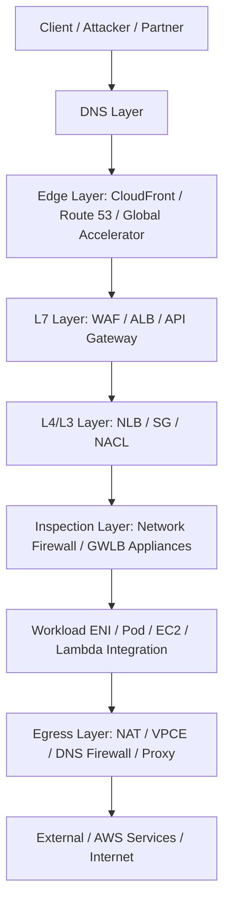
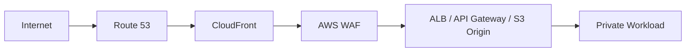
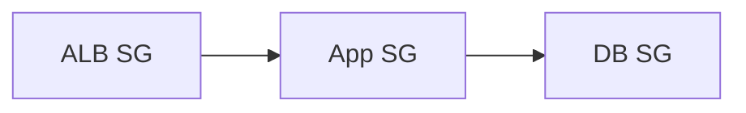
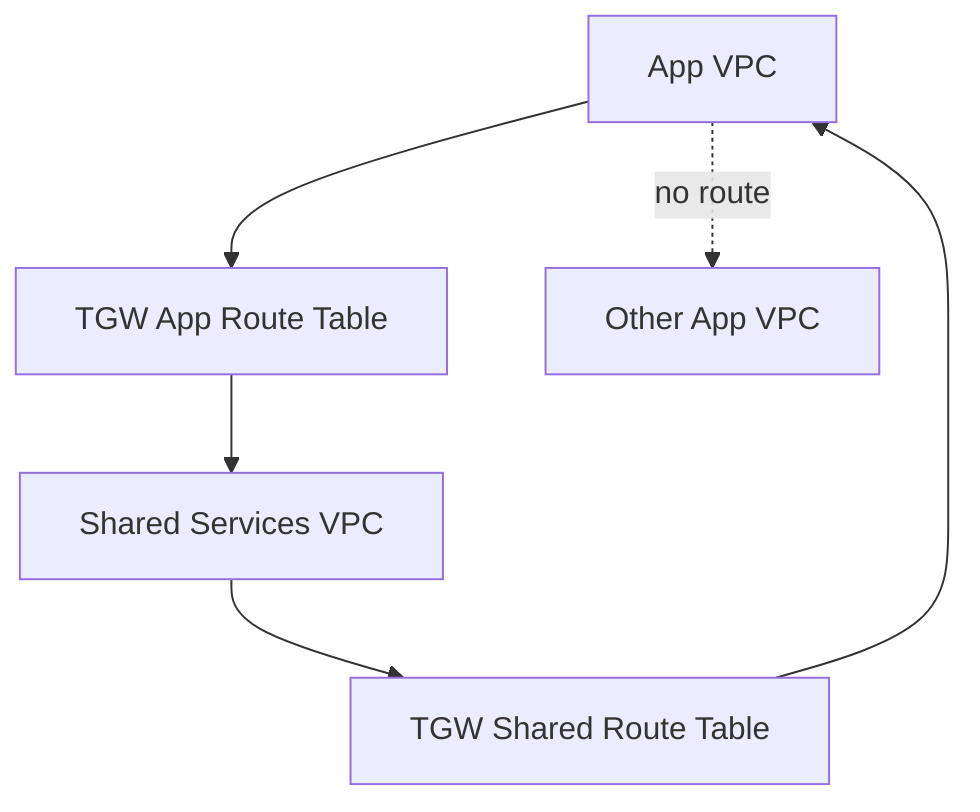
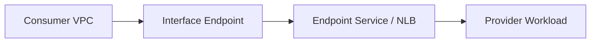
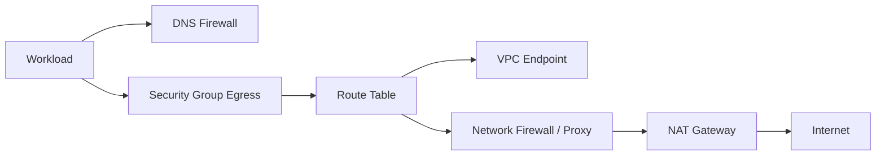
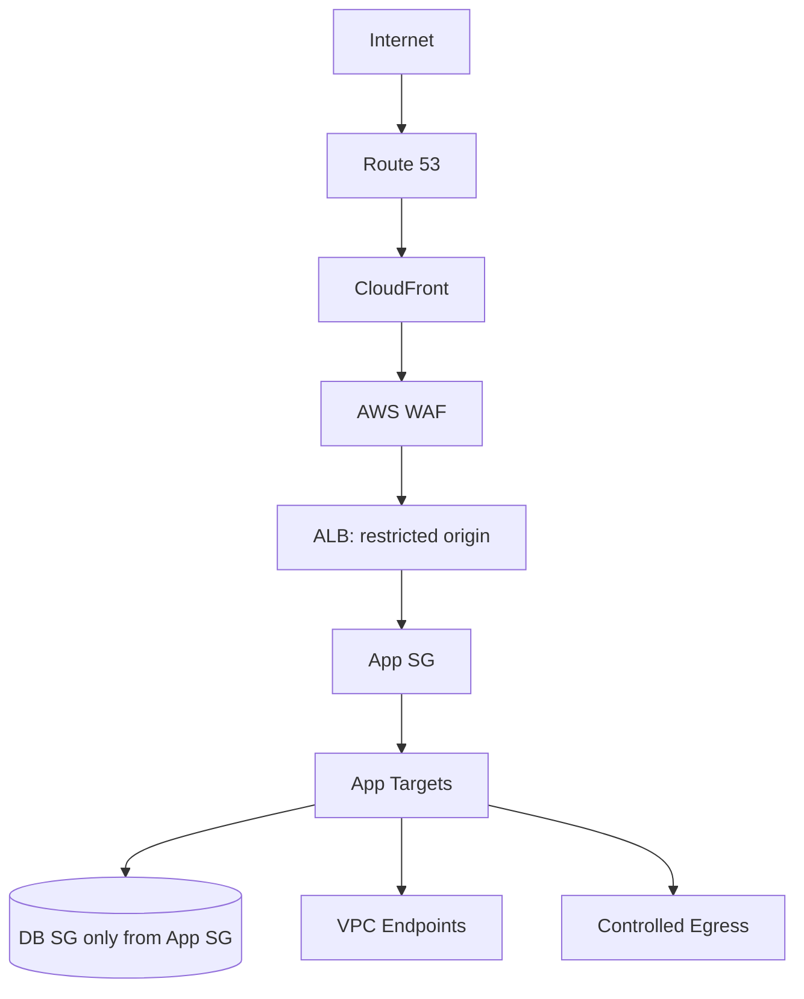
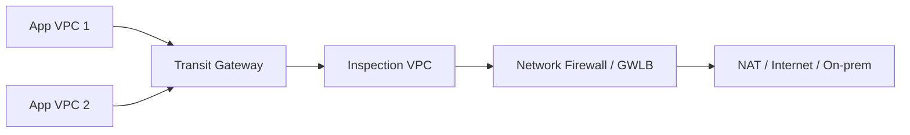
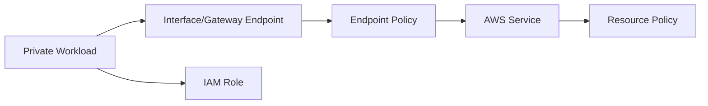

# Part 066 — Network Security Reference Model

> Network security di AWS bukan satu produk. Ia adalah komposisi banyak control di layer berbeda: DNS, edge, L7 HTTP, L4/L3 packet, route table, subnet, ENI, identity, resource policy, inspection, logging, dan governance.

Kalau kamu hanya bertanya “pakai WAF atau Network Firewall?”, framing-nya sudah salah. Pertanyaan yang benar:

```txt
Traffic apa?
Dari mana?
Ke mana?
Lewat boundary apa?
Di layer mana decision paling efektif dibuat?
Siapa pemilik policy?
Bagaimana kita membuktikan policy bekerja?
Apa failure mode saat control plane bermasalah?
```

Part ini adalah reference model. Nanti Part 067–070 akan memperdalam WAF, Shield, Network Firewall, dan Firewall Manager. Di sini kita membangun peta agar kamu tidak menggunakan layanan secara acak.

---

## 1. The Core Model: Defense-in-Depth, Not Duplicate Controls

Defense-in-depth bukan berarti memasang semua firewall di semua tempat. Itu hanya menambah biaya dan kompleksitas.

Defense-in-depth berarti:

1. setiap control punya layer yang jelas;
2. setiap control punya threat model yang jelas;
3. control tidak saling bertentangan;
4. ada observability untuk membuktikan keputusan allow/deny;
5. ada owner untuk policy lifecycle;
6. ada safe rollout dan rollback.



Security decision harus diletakkan di layer yang punya informasi terbaik.

| Pertanyaan Security | Layer Terbaik |
|---|---|
| Domain ini boleh di-resolve? | DNS Firewall / Resolver policy |
| HTTP path/header/body ini malicious? | AWS WAF |
| Source IP/ASN/reputation ini harus diblokir? | WAF / CloudFront / Shield / NACL depending layer |
| Port TCP ini boleh masuk ke workload? | Security Group / NACL |
| VPC A boleh route ke VPC B? | Route table / TGW route table / Cloud WAN segment |
| Workload boleh akses S3 bucket ini? | IAM + bucket policy + endpoint policy |
| Semua egress internet harus diinspeksi? | Network Firewall / GWLB appliance / centralized egress |
| Multi-account policy harus seragam? | Firewall Manager / Organizations SCP/IaC guardrails |

---

## 2. Security Boundary Taxonomy

AWS network security harus dipahami sebagai beberapa boundary.

### 2.1 Identity Boundary

Identity boundary menjawab: **principal siapa yang boleh melakukan aksi apa?**

Contoh:

- IAM role;
- STS session;
- service-linked role;
- IRSA / EKS Pod Identity;
- resource policy;
- endpoint policy;
- VPC Lattice auth policy;
- Verified Access policy.

Network allow tanpa identity allow belum cukup untuk akses AWS API. Sebaliknya, IAM allow tanpa route/DNS/security group juga belum cukup.

### 2.2 Network Boundary

Network boundary menjawab: **packet boleh lewat atau tidak?**

Contoh:

- route table;
- security group;
- NACL;
- Network Firewall;
- GWLB appliance;
- Transit Gateway route table;
- Cloud WAN segment;
- private/public subnet design.

### 2.3 Application Boundary

Application boundary menjawab: **request aplikasi valid atau tidak?**

Contoh:

- AWS WAF;
- ALB listener/auth/TLS rules;
- API Gateway authorizer/throttling/resource policy;
- CloudFront signed URL/cookie;
- application authN/authZ;
- mTLS.

### 2.4 DNS Boundary

DNS boundary menjawab: **nama apa yang boleh di-resolve dan ke mana?**

Contoh:

- Route 53 Resolver rules;
- Route 53 Resolver DNS Firewall;
- private hosted zones;
- split-horizon DNS;
- resolver query logging;
- DNSSEC for public domain integrity.

DNS boundary sering dilupakan, padahal malware, data exfiltration, callback domain, dan shadow SaaS sering mulai dari DNS.

### 2.5 Edge Boundary

Edge boundary menjawab: **traffic global dari internet masuk lewat pintu mana?**

Contoh:

- CloudFront;
- Route 53;
- Global Accelerator;
- AWS Shield;
- WAF on CloudFront;
- origin access control/protection.

Edge boundary penting karena beberapa serangan lebih murah diblokir di edge daripada di origin.

---

## 3. Service Map: Control by Layer

| Layer | AWS Controls | Strength | Weakness |
|---|---|---|---|
| DNS | Route 53 Resolver DNS Firewall, query logging | Block domain before connection; useful for egress governance | Tidak melihat encrypted SNI/HTTP body; hanya DNS via Resolver path |
| Edge | CloudFront, Global Accelerator, Route 53, Shield | Global absorption, latency, DDoS resilience, static front door | Tidak menggantikan origin security |
| L7 HTTP | AWS WAF, ALB rules, API Gateway | Melihat method/path/header/query/body subset/rate patterns | Hanya HTTP(S), perlu rule tuning |
| L4/L3 | SG, NACL, NLB, route table | Fast, simple allowlist/denylist by IP/port/protocol | Tidak paham request aplikasi |
| Inspection | Network Firewall, GWLB appliances | Stateful inspection, centralized egress, IDS/IPS pattern | Cost/latency/operations lebih kompleks |
| Resource/API | IAM, resource policy, endpoint policy | Precise action/resource/principal control | Tidak menggantikan network path control |
| Governance | Firewall Manager, AWS Organizations, Config, SCP, IaC | Multi-account consistency | Salah policy bisa menyebar luas |

---

## 4. Packet Boundary: Security Group, NACL, Route Table

Ini baseline paling dekat dengan VPC.

### 4.1 Route Table Is a Security-Relevant Control

Route table bukan firewall, tetapi route absence adalah bentuk isolation.

Jika tidak ada route dari subnet A ke destination B, traffic tidak sampai walaupun SG allow.

Gunakan route table untuk:

- segmentasi subnet;
- centralized inspection path;
- isolated subnet;
- controlled egress via NAT/firewall/endpoint;
- TGW domain separation;
- blackhole guardrail.

Route table tidak bisa menggantikan SG karena route table tidak memfilter per port/protocol/principal.

### 4.2 Security Group as Resource Boundary

Security Group adalah stateful allowlist di ENI/resource boundary.

Gunakan untuk:

- workload ingress/egress allowlist;
- database only from app SG;
- ALB to app targets;
- endpoint ENI inbound from consumer SG;
- Pod SG for sensitive workloads.

Security group anti-pattern:

```txt
0.0.0.0/0 inbound to application port because "WAF is in front"
```

WAF di depan tidak mencegah direct-origin bypass kecuali origin SG/resource policy memaksa hanya WAF/CloudFront/ALB path.

### 4.3 NACL as Subnet Guardrail

NACL adalah stateless subnet-level allow/deny. Gunakan untuk coarse guardrail:

- explicit deny known bad CIDR;
- subnet class protection;
- temporary containment;
- compliance-mandated subnet filter;
- additional blast-radius boundary.

Jangan gunakan NACL sebagai primary app policy karena stateless + ephemeral port complexity membuat operasional rapuh.

---

## 5. Edge Security Model

Untuk aplikasi public, edge security sebaiknya bukan optional.

Baseline:



### 5.1 CloudFront as Origin Shielding Boundary

CloudFront bisa:

- terminate TLS at edge;
- cache safe content;
- reduce origin request volume;
- integrate with WAF;
- restrict S3 origin via OAC;
- send custom header to custom origin;
- use managed prefix list to restrict ALB SG;
- provide global distribution.

Namun CloudFront tidak otomatis melindungi origin jika origin masih reachable langsung.

Origin protection invariant:

> Semua origin harus menolak request yang tidak datang melalui approved front door.

Untuk S3: gunakan OAC.
Untuk ALB/custom origin: gunakan security group allowlist CloudFront prefix list + secret custom header + WAF/ALB rules jika perlu.
Untuk API Gateway: gunakan resource policy/custom domain/private API pattern sesuai exposure.

### 5.2 Shield and DDoS Resilience

AWS Shield Standard memberi proteksi DDoS otomatis untuk AWS customers. Shield Advanced memberi proteksi tambahan, visibility, response support, cost protection features, dan integration dengan WAF untuk advanced protections.

DDoS thinking:

| Attack Class | Better Control |
|---|---|
| Volumetric L3/L4 | Shield, CloudFront, Global Accelerator, Route 53, ELB scaling |
| HTTP request flood | WAF rate-based rules, Shield Advanced app-layer mitigation, app throttling |
| Expensive path abuse | WAF, API Gateway throttling, auth, caching, circuit breaker |
| Origin saturation | CloudFront caching, origin shielding, autoscaling, queueing |

DDoS resilience bukan hanya “enable Shield”. Ia butuh architecture:

- use scalable AWS edge entry points;
- avoid direct origin exposure;
- cache aggressively where safe;
- rate-limit unauthenticated expensive endpoints;
- separate static/dynamic/API paths;
- monitor anomalies;
- rehearse incident runbook.

---

## 6. AWS WAF Placement Model

AWS WAF adalah L7 HTTP(S) request control. Ia cocok untuk:

- CloudFront distributions;
- Application Load Balancers;
- API Gateway REST APIs;
- AppSync GraphQL APIs;
- other supported resources depending current AWS support.

Gunakan WAF untuk:

- managed rule groups;
- IP sets;
- rate-based rules;
- geo match;
- header/path/query/body inspection;
- bot control / fraud control when needed;
- custom label-based rule chain;
- SQLi/XSS/common exploit filtering.

WAF tidak cocok untuk:

- raw TCP/UDP non-HTTP;
- database port protection;
- east-west packet inspection;
- replacing app authorization;
- solving bad route/SG design.

### 6.1 WAF at CloudFront vs ALB

| Placement | Advantage | Risk/Trade-off |
|---|---|---|
| CloudFront WAF | Blocks at edge, global, good for public apps | Need CloudFront front door; origin must be protected. |
| ALB WAF | Closer to regional app, simpler if no CloudFront | Attack reaches region/origin LB first. |
| API Gateway WAF | API-focused, integrates with API boundary | Only protects API Gateway traffic path. |

Default recommendation for serious public app:

```txt
Route 53 -> CloudFront + WAF -> protected origin
```

Use ALB WAF directly only when CloudFront is not appropriate or as additional regional layer.

---

## 7. East-West Security Model

East-west traffic is internal traffic between workloads/services/VPCs.

Do not assume internal means trusted.

Controls:

- SG referencing between app tiers;
- TGW route table segmentation;
- VPC Lattice auth policy;
- PrivateLink service-specific exposure;
- Network Firewall/GWLB inspection for selected paths;
- Kubernetes NetworkPolicy;
- service mesh mTLS/authz;
- IAM/resource policy for AWS API calls;
- VPC endpoint policies.

### 7.1 Three East-West Patterns

#### Pattern A — SG-Based Tiering



Simple, effective for classic app tiers.

#### Pattern B — TGW Segmentation



Good for multi-account/network domains.

#### Pattern C — PrivateLink Service Exposure



Good when consumer only needs one service, not full network reachability.

---

## 8. Egress Security Model

Ingress gets attention. Egress causes breaches.

A healthy AWS egress model answers:

- Which workloads may access internet?
- Through which path?
- Is DNS filtered?
- Is traffic inspected?
- Are AWS service calls private via endpoints?
- Are endpoint policies restrictive?
- Are logs queryable by workload/account/VPC?
- Can we block exfiltration during incident?

### 8.1 Egress Control Stack



### 8.2 NAT Gateway Is Not a Security Control

NAT hides private IP from internet. It does not decide whether destination is allowed, whether payload is malicious, or whether domain is suspicious.

Use NAT as connectivity primitive. Add security via:

- SG egress;
- NACL guardrails;
- DNS Firewall;
- Network Firewall/proxy;
- VPC endpoint policies;
- application allowlists;
- logging and anomaly detection.

### 8.3 VPC Endpoints as Egress Reduction

For AWS services, VPC endpoints reduce public/NAT egress dependency.

But endpoint alone is not security. Endpoint policy should answer:

- which principal?
- which resource?
- which action?
- from which endpoint/VPC?

Example mental model:

```txt
Access S3 from private subnet requires:
  DNS path -> endpoint route/private DNS -> endpoint policy -> IAM policy -> bucket policy -> KMS policy if encrypted
```

---

## 9. AWS Network Firewall and Inspection Model

AWS Network Firewall provides managed network traffic filtering. It supports stateless and stateful rule groups and is commonly deployed for centralized ingress/egress/east-west inspection.

Use it when you need:

- centralized egress filtering;
- domain/IP/protocol inspection beyond SG;
- Suricata-compatible stateful rules;
- IDS/IPS-style control;
- compliance inspection point;
- multi-account standardization via Firewall Manager.

Do not use it blindly for all traffic. It adds:

- route complexity;
- cost;
- latency;
- policy lifecycle;
- asymmetric routing risk;
- logging volume.

### 9.1 Distributed vs Centralized Inspection

| Model | Description | Use Case |
|---|---|---|
| Distributed | Firewall endpoints in each VPC | Strong local isolation, less centralized routing complexity, higher per-VPC operational/cost footprint. |
| Centralized | Inspection VPC via TGW | Central security team control, shared inspection stack, route complexity and blast radius must be managed. |
| Hybrid | Local for sensitive VPCs, central for common egress | Balanced large-enterprise model. |

### 9.2 Inspection Route Invariant

For stateful inspection, traffic path must be symmetric.

```txt
Forward path and return path must traverse the same inspection state domain.
```

If request goes through firewall A and response bypasses it or goes through firewall B without shared state, traffic can break.

---

## 10. DNS Firewall Model

Route 53 Resolver DNS Firewall filters outbound DNS queries passing through Route 53 Resolver.

It is useful because many outbound connections begin with DNS. Blocking bad domain resolution can stop connection before TCP/TLS.

Use DNS Firewall for:

- known malicious domains;
- deny newly registered domains if policy allows;
- allowlist for high-security workloads;
- block crypto/mining/callback domains;
- prevent DNS-based exfiltration patterns at least partially;
- central DNS governance via Firewall Manager.

Limitations:

- only sees DNS through Route 53 Resolver path;
- apps can use hardcoded IPs;
- apps can use external encrypted DNS if egress permits;
- domain block does not inspect HTTP payload;
- false positives can break dependencies.

Therefore pair DNS Firewall with:

- SG egress restrictions;
- Network Firewall/proxy for internet path;
- endpoint policies for AWS services;
- VPC Flow Logs and query logs;
- dependency inventory.

---

## 11. Verified Access and Zero Trust Network Access

Verified Access changes the model from “connect user to network” to “grant user/device/context access to application”.

It is not a universal VPN replacement, but it is powerful for private web application access.

Use it when:

- users need access to internal web apps;
- device posture/identity should be evaluated per request;
- broad VPN network reachability is undesirable;
- apps are behind ALB/NLB/ENI supported endpoints;
- auditability matters.

Do not use it for:

- arbitrary network-level access;
- non-supported protocols;
- replacing app authorization completely;
- service-to-service traffic.

---

## 12. Security Control Composition by Scenario

### 12.1 Public Web Application

Recommended stack:

```txt
Route 53
  -> CloudFront
  -> AWS WAF
  -> ALB origin restricted to CloudFront/WAF path
  -> private app targets
  -> private DB only from app SG
  -> egress via VPCE/NAT/firewall as required
```

Controls:

- Shield Standard/Advanced depending risk;
- WAF managed rules + rate-based rules;
- CloudFront OAC/custom origin protection;
- ALB SG not open to world unless intended;
- app SG only from ALB SG;
- DB SG only from app SG;
- logs at CloudFront/WAF/ALB/app/VPC.

### 12.2 Internal Enterprise Application

Recommended stack:

```txt
Corporate network
  -> DX/VPN/TGW
  -> internal ALB / VPC Lattice / Verified Access
  -> app
  -> shared services/private endpoints
```

Controls:

- TGW route segmentation;
- Route 53 Resolver hybrid DNS;
- SG referencing;
- internal WAF if HTTP threat model requires;
- Verified Access for user-facing internal apps;
- endpoint policies for AWS APIs;
- Flow Logs and Resolver query logs.

### 12.3 Regulated Workload with Restricted Egress

Recommended stack:

```txt
Workload subnet
  -> no direct internet route
  -> AWS service access via VPC endpoints
  -> approved internet egress via firewall/proxy
  -> DNS Firewall allowlist/blocklist
  -> endpoint/resource/IAM policies
```

Controls:

- isolated/private subnet;
- no broad `0.0.0.0/0` unless via inspection;
- VPC endpoint policy;
- KMS key policy;
- DNS Firewall;
- Network Firewall or proxy;
- workload identity allowlist;
- alert on unexpected egress.

### 12.4 Multi-Account Platform

Recommended stack:

- network account owns TGW/DX/Cloud WAN/shared egress;
- security account owns Firewall Manager policies and central logs;
- workload accounts own app SGs under guardrails;
- shared services account owns DNS/shared endpoints/AD/etc.;
- IaC modules enforce standard patterns;
- exceptions are explicit and expiring.

---

## 13. Policy Ownership Model

Security fails when ownership is vague.

| Policy | Owner | Review Frequency |
|---|---|---|
| TGW route table segmentation | Network platform | Per architecture change / quarterly |
| Security group baseline | App + platform | Per release / continuous drift |
| WAF managed/custom rules | AppSec + app team | Monthly + after incident |
| DNS Firewall domain lists | Security operations | Continuous/threat intel driven |
| Network Firewall rules | Network security | Change-controlled |
| VPC endpoint policies | Platform + resource owner | Per service onboarding |
| CloudFront origin protection | Edge/platform + app | Per distribution change |
| Firewall Manager policies | Security governance | Org-level change process |
| Verified Access policies | IAM/security + app owner | Per app onboarding/review |

---

## 14. Observability and Evidence

A control you cannot observe is a belief, not an engineering control.

### 14.1 Logs by Layer

| Layer | Evidence |
|---|---|
| DNS | Resolver query logs, DNS Firewall logs/metrics |
| Edge | CloudFront logs, real-time logs, CloudFront metrics |
| WAF | WAF logs, labels, sampled requests, metrics |
| DDoS | Shield metrics/events, CloudWatch metrics |
| Load balancer | ALB/NLB access logs, target health, CloudWatch metrics |
| VPC packet metadata | VPC Flow Logs |
| Firewall | Network Firewall flow/alert logs |
| Kubernetes | controller logs, CNI logs, NetworkPolicy logs if available |
| IAM/API | CloudTrail, Access Analyzer findings |
| Resource access | S3 data events, KMS CloudTrail, VPC endpoint logs/metrics where available |

### 14.2 Minimal Security Dashboard

For serious production, dashboard should include:

- WAF blocked/allowed/challenged by rule group;
- top WAF labels;
- CloudFront 4xx/5xx and origin latency;
- ALB target 5xx vs ELB 5xx;
- Shield events/metrics for protected resources;
- Network Firewall alert count by rule/action;
- DNS Firewall blocked queries by domain/list/VPC;
- NAT bytes/connection errors;
- VPC Flow Logs rejects by subnet/SG/NACL pattern;
- unexpected public exposure findings;
- endpoint policy deny trends if available via CloudTrail.

---

## 15. Rollout Strategy

Never roll out network security as a blind big-bang.

Use progressive enforcement:

1. **Observe**: enable logs and inventory current traffic.
2. **Model**: classify expected flows by app/team/environment.
3. **Simulate/count**: WAF count mode, firewall alert-only where possible, query logs.
4. **Narrow blast radius**: apply to one app/VPC/account/env.
5. **Enforce**: block only well-understood flows.
6. **Monitor**: watch errors, business metrics, security logs.
7. **Expand**: apply via Firewall Manager/IaC after confidence.
8. **Expire exceptions**: every exception has owner and expiry.

---

## 16. Failure Modes

| Control | Failure Mode | Impact | Mitigation |
|---|---|---|---|
| WAF | Rule too broad | Legit users blocked | Count mode, sampled requests, staged rollout. |
| DNS Firewall | Domain false positive | Dependency outage | query logs, allowlist exception path, dependency inventory. |
| Network Firewall | Asymmetric routing | Random connection drops | route design, appliance mode/TGW route symmetry. |
| SG | Rule too broad | Lateral movement risk | SG referencing, least privilege, Config/IaC drift. |
| NACL | Ephemeral ports blocked | Intermittent connection failure | avoid complex app policy in NACL, document ephemeral ranges. |
| CloudFront origin protection | Origin still public | Bypass WAF/cache | OAC, SG prefix list, secret header, origin policy. |
| Endpoint policy | Too permissive | Data access bypass path | least privilege, `aws:SourceVpce`, IAM/resource policy alignment. |
| Firewall Manager | Bad policy org-wide | Broad outage | staged OU rollout, remediation disabled first, approvals. |
| Verified Access | Trust provider/policy issue | User access outage | break-glass path, staged apps, logs. |
| Centralized egress | Inspection VPC failure | Multi-VPC egress outage | HA per AZ, failover design, clear blast radius. |

---

## 17. Architecture Decision Matrix

| Requirement | Prefer | Avoid |
|---|---|---|
| Public HTTP app protection | CloudFront + WAF + Shield | Direct public ALB with no WAF/origin protection |
| Public TCP app static IP | Global Accelerator or NLB | DNS-only failover for fast L4 failover expectations |
| Internal HTTP app access by employees | Verified Access / internal ALB + identity | Broad Client VPN network access by default |
| Service-specific private cross-account access | PrivateLink / VPC Lattice | Full VPC peering/TGW mesh unless needed |
| Broad VPC-to-VPC routing | TGW / Cloud WAN | Large VPC peering mesh |
| AWS service private access | VPC endpoints + endpoint policies | NAT-only access to AWS public endpoints |
| Malicious domain blocking | DNS Firewall | Only SG/NACL, because they do not understand domains |
| Stateful egress inspection | Network Firewall / GWLB appliance | NACL-heavy app filtering |
| Multi-account enforcement | Firewall Manager + IaC + Organizations | Manual per-account firewall setup |

---

## 18. Reference Architectures

### 18.1 Secure Public Application



Invariant:

- origin not directly accessible;
- app not public;
- DB only from app;
- AWS API access via endpoints where possible;
- logs enabled at every meaningful layer.

### 18.2 Centralized Inspection with TGW



Invariant:

- route tables force traffic through inspection;
- return path symmetric;
- inspection VPC highly available per AZ;
- exceptions explicit.

### 18.3 Private AWS Service Access



Invariant:

- network path private;
- endpoint policy restrictive;
- identity policy restrictive;
- resource policy verifies source when appropriate;
- KMS policy included for encrypted data.

---

## 19. Security Review Questions

Ask these in every architecture review:

1. What are all ingress paths?
2. Can origin be reached directly, bypassing CloudFront/WAF/API boundary?
3. What are all egress paths?
4. Which traffic goes through NAT, endpoint, firewall, or TGW?
5. Are DNS queries filtered/logged?
6. Are private hosted zones and Resolver rules documented?
7. Are SG rules principal-like through SG referencing, or broad CIDR?
8. Are NACLs simple enough to operate?
9. Are endpoint policies least-privilege?
10. Does WAF run in count mode before block rollout?
11. Are DDoS assumptions tested against architecture, not just service names?
12. Is east-west routing intentional or accidental?
13. Are logs centralized and queryable during incident?
14. Are exceptions owned and expiring?
15. What breaks if control plane API is temporarily unavailable?
16. What is the rollback for every security policy change?

---

## 20. Minimal Production Baseline

For a mature AWS environment, baseline should include:

- [ ] VPC/subnet route intent documented.
- [ ] No unmanaged public origins for public apps.
- [ ] CloudFront + WAF for internet-facing HTTP where appropriate.
- [ ] Shield Advanced evaluated for critical public endpoints.
- [ ] Security groups least-privilege and managed by IaC.
- [ ] NACLs simple and documented.
- [ ] VPC Flow Logs enabled for critical VPCs/subnets/ENIs.
- [ ] Resolver query logging for sensitive environments.
- [ ] DNS Firewall for outbound DNS governance.
- [ ] VPC endpoints for core AWS service dependencies.
- [ ] Endpoint policies aligned with IAM/resource policies.
- [ ] Egress path intentionally designed, not default NAT everywhere.
- [ ] TGW/Cloud WAN route tables reviewed as security boundary.
- [ ] Network Firewall/GWLB used where inspection is justified.
- [ ] Firewall Manager used for multi-account policy consistency.
- [ ] Security logs centralized with retention and search.
- [ ] Runbooks tested for WAF false positive, DNS block false positive, firewall routing failure, origin bypass, and egress incident.

---

## 21. Mental Compression

Remember this model:

```txt
DNS decides names.
Route tables decide paths.
Security groups decide resource-level packet permission.
NACLs provide subnet guardrails.
WAF decides HTTP request acceptability.
Shield absorbs and mitigates DDoS classes.
Network Firewall/GWLB inspect selected packet flows.
Endpoint policies constrain private AWS service access.
Firewall Manager distributes policy across accounts.
Logs prove or disprove everything.
```

The mature engineer does not ask “which firewall should I use?” first.

They ask:

```txt
What decision must be made?
At which layer is the decision most accurate?
Where is the cheapest and safest place to enforce it?
How will we know it worked?
How will we roll it back?
```

---

## References

- AWS WAF, AWS Firewall Manager, and AWS Shield Advanced Developer Guide — https://docs.aws.amazon.com/waf/latest/developerguide/what-is-aws-waf.html
- AWS WAF — https://docs.aws.amazon.com/waf/latest/developerguide/waf-chapter.html
- AWS Shield — https://docs.aws.amazon.com/waf/latest/developerguide/shield-chapter.html
- AWS Firewall Manager — https://docs.aws.amazon.com/waf/latest/developerguide/fms-chapter.html
- AWS Network Firewall policies in Firewall Manager — https://docs.aws.amazon.com/waf/latest/developerguide/network-firewall-policies.html
- Route 53 Resolver DNS Firewall — https://docs.aws.amazon.com/Route53/latest/DeveloperGuide/resolver-dns-firewall.html
- AWS Verified Access User Guide — https://docs.aws.amazon.com/verified-access/latest/ug/what-is-verified-access.html
