# Part 067 — AWS WAF Deep Dive

> AWS WAF bukan “firewall semua traffic”. AWS WAF adalah policy engine untuk HTTP(S) request. Ia kuat ketika masalahnya berada di layer aplikasi: path, header, method, query string, cookie, body, IP reputation, bot signal, rate pattern, atau exploit payload.

Mental model yang benar:

```txt
AWS WAF does not protect a subnet.
AWS WAF protects an HTTP entry point.
```

Entry point yang umum:

- Amazon CloudFront distribution;
- Application Load Balancer;
- Amazon API Gateway;
- AWS AppSync;
- Amazon Cognito user pool;
- AWS App Runner service;
- AWS Verified Access endpoint;
- beberapa integrasi AWS lain yang mendukung Web ACL association.

Kalau traffic tidak lewat resource yang bisa di-associate dengan Web ACL, AWS WAF tidak melihat request itu.

---

## 1. Why AWS WAF Exists

Security Group dan NACL tahu hal seperti ini:

```txt
source IP
source port
destination IP
destination port
protocol
```

Mereka tidak tahu:

```txt
GET /admin/export?format=csv HTTP/1.1
Host: app.example.com
User-Agent: suspicious-bot
Cookie: session=...
X-Forwarded-For: ...
Body: {"q":"' OR 1=1 --"}
```

AWS WAF hidup di boundary HTTP. Karena itu ia bisa melakukan decision berdasarkan:

- URI path;
- query string;
- HTTP method;
- headers;
- cookies;
- request body;
- label dari rule sebelumnya;
- IP set;
- regex pattern set;
- geographic origin;
- rate per aggregation key;
- managed intelligence seperti common exploit patterns atau bot classification.

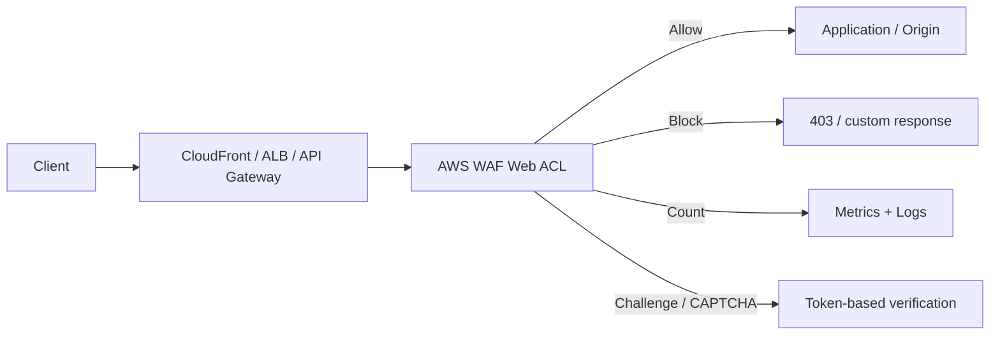

AWS WAF bukan pengganti secure coding. Ia adalah compensating control dan traffic gate. Aplikasi tetap harus melakukan auth, validation, authorization, rate limit bisnis, idempotency, dan abuse prevention.

---

## 2. Core Objects

### 2.1 Web ACL

Web ACL adalah container policy. Resource yang dilindungi di-associate ke Web ACL.

Satu Web ACL berisi:

- default action;
- ordered rules;
- rule groups;
- managed rule groups;
- visibility config;
- optional custom response;
- optional logging configuration;
- association ke protected resource.

Model sederhana:

```txt
Web ACL
  default action: allow | block
  rules:
    priority 0: allow known health checks
    priority 10: block known bad IP set
    priority 20: managed common rule set
    priority 30: rate limit login path
    priority 40: bot control
    priority 50: custom app rule
```

Default action bukan detail kecil. Ia menentukan posture:

| Default Action | Meaning | Typical Use |
|---|---|---|
| Allow | Request lewat kecuali ada rule block/challenge | Most public web apps |
| Block | Request ditolak kecuali ada rule allow eksplisit | Narrow admin/API surfaces |

Untuk public application, default `allow` dengan block/challenge rule biasanya lebih realistis. Untuk admin endpoint, callback endpoint, atau allowlisted integration, default `block` bisa lebih defensible.

### 2.2 Rule

Rule adalah satu decision unit. Ia punya:

- priority;
- statement/matcher;
- action;
- visibility config.

Rule statement bisa berupa:

- IP set match;
- regex pattern match;
- byte match;
- SQL injection match;
- XSS match;
- size constraint;
- geographic match;
- rate-based statement;
- label match;
- logical AND/OR/NOT;
- managed rule group reference;
- custom rule group reference.

### 2.3 Rule Group

Rule group adalah reusable collection of rules. Cocok untuk platform team yang ingin membuat baseline security:

```txt
company-web-baseline-rule-group
company-admin-surface-rule-group
company-api-protection-rule-group
company-bot-observability-rule-group
```

Rule group membantu standardisasi, tetapi juga bisa menjadi sumber blast radius kalau update policy terlalu agresif. Treat rule group like code: version, test, canary, observe, promote.

### 2.4 Managed Rule Group

AWS Managed Rules memberi rule group yang dikelola AWS. Nilainya bukan karena “sempurna”, tetapi karena mengurangi beban membuat rule umum untuk vulnerability dan unwanted traffic yang sering muncul.

Contoh kategori:

- baseline/common protection;
- known bad inputs;
- SQLi/XSS patterns;
- admin protection;
- Linux/Unix/PHP/WordPress-specific patterns;
- IP reputation;
- anonymous IP list;
- Bot Control.

Managed rules tetap harus dioperasikan. Jangan langsung `block` semua rule di production tanpa fase `count`. False positive bisa terjadi, terutama pada aplikasi dengan payload aneh, API internal, file upload, GraphQL, search query, atau rich text input.

### 2.5 IP Set and Regex Pattern Set

IP set cocok untuk:

- allowlist admin office/VPN/proxy;
- blocklist malicious ranges sementara;
- partner callback allowlist;
- emergency containment.

Regex pattern set cocok untuk reusable matching terhadap:

- URI pattern;
- suspicious user agent;
- header value;
- query parameter;
- path namespace;
- business-specific routes.

Jangan jadikan IP blocklist manual sebagai strategi utama. IP attacker berubah. IP set paling berguna untuk allowlist, temporary block, dan containment.

### 2.6 Labels

Labels adalah mekanisme composability AWS WAF yang sering diremehkan.

Rule bisa menambahkan label, lalu rule berikutnya bisa match label tersebut.

Contoh:

```txt
Rule A:
  detect suspicious bot signal
  action: count
  label: company:suspicious-bot

Rule B:
  if label company:suspicious-bot AND path starts /login
  action: challenge
```

Label membuat WAF bisa dibangun seperti pipeline evaluasi, bukan sekumpulan rule datar.

---

## 3. Rule Evaluation Model

Rule dievaluasi berdasarkan priority dari angka paling kecil ke besar.

Decision penting:

```txt
terminating action stops evaluation
non-terminating action allows evaluation to continue
```

Terminating action:

- `Allow`;
- `Block`;
- kadang `CAPTCHA` / `Challenge` ketika token invalid/missing;
- managed rule action yang berakhir block/allow.

Non-terminating action:

- `Count`;
- CAPTCHA/Challenge ketika token valid;
- label generation yang tidak menghentikan request.

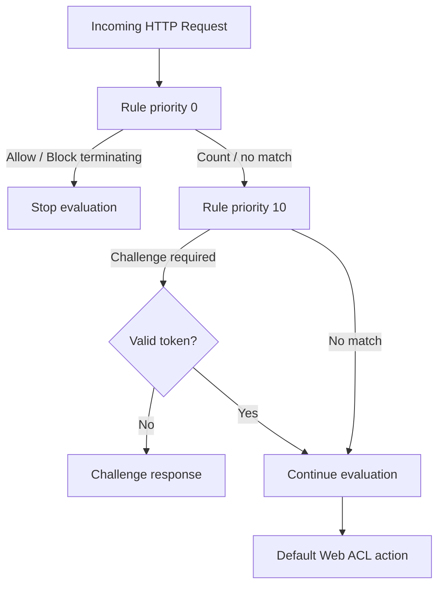

Operational implication:

- Put precise allow rules above noisy block rules.
- Put emergency block high priority.
- Put observability/count rules before terminating rules when you need telemetry.
- Put broad managed rules after explicit safe allow exceptions.
- Avoid “allow all known bots” too early unless you fully trust detection.

---

## 4. Scope: CloudFront vs Regional

AWS WAF Web ACL scope matters.

| Scope | Used For | Region Semantics |
|---|---|---|
| `CLOUDFRONT` | CloudFront distribution | Managed from `us-east-1` control plane convention |
| `REGIONAL` | ALB, API Gateway regional, AppSync, Cognito, App Runner, Verified Access | Created in same Region as protected resource |

This matters for IaC layout.

A common mistake:

```txt
Create WAF Web ACL in ap-southeast-1 and try to attach it to CloudFront.
```

CloudFront-scoped WAF resources have special global/edge semantics. Treat them as edge security resources, not regional workload resources.

---

## 5. Where to Attach AWS WAF

### 5.1 CloudFront + WAF

Best for internet-facing apps where edge protection is desired.

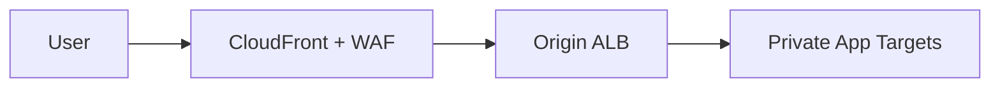

Advantages:

- attack filtering before traffic reaches regional origin;
- global edge capacity;
- simpler origin protection with CloudFront-only access;
- integrates well with Shield, rate control, bot handling, signed URLs/cookies;
- protects multiple origin types behind one edge policy.

Risks:

- if origin is publicly reachable directly, attackers can bypass CloudFront/WAF;
- cache key mistakes can mix users/content;
- forwarded header trust must be explicit;
- CloudFront deployment propagation affects rollout speed.

### 5.2 ALB + WAF

Best when application is regional and HTTP routing stays at ALB.

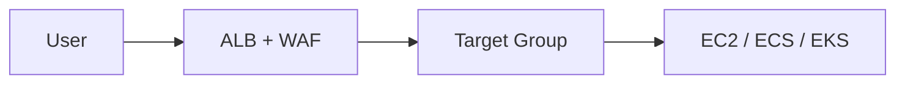

Advantages:

- close to application;
- direct access to ALB request context;
- works for internal or external regional ALB where supported;
- easier debugging with ALB logs + WAF logs.

Risks:

- traffic reaches regional ALB before WAF decision;
- DDoS absorption weaker than edge-first designs;
- direct internet exposure to ALB still exists;
- if used behind CloudFront, be clear whether WAF is at CloudFront, ALB, or both.

### 5.3 API Gateway + WAF

Best for public API controls.

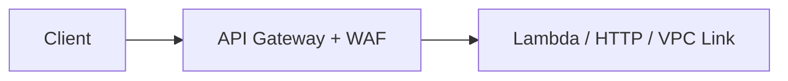

Advantages:

- API-specific WAF controls;
- rate-based WAF as outer abuse layer;
- API Gateway auth/throttling/usage plan can remain inner policy;
- good for API exploit filtering.

Risks:

- WAF rate-based rules are not a replacement for business-level quota;
- API Gateway timeout/size limits still matter;
- request transformation can change what backend sees.

### 5.4 Multi-Layer WAF

Sometimes you use both CloudFront WAF and ALB WAF.

Valid if:

- edge policy handles global threats, IP reputation, bot, generic exploit;
- regional policy handles application-specific rules;
- log correlation exists;
- false positive workflow is clear.

Bad if:

- both layers run nearly identical managed rules;
- nobody can tell which layer blocked;
- emergency changes require two teams and two pipelines;
- cost doubles without reducing risk.

---

## 6. Actions: Allow, Block, Count, CAPTCHA, Challenge

### 6.1 Allow

`Allow` terminates evaluation and sends request to protected resource.

Use carefully. It can bypass later protection rules.

Good use:

```txt
Allow known monitoring health check path from known internal synthetic monitoring IPs.
```

Bad use:

```txt
Allow every request from a corporate NAT IP before managed exploit rules.
```

Corporate networks get compromised too.

### 6.2 Block

`Block` terminates evaluation and rejects request.

Use for:

- known malicious IPs;
- invalid host header;
- disallowed methods;
- unexpected admin path access;
- confirmed exploit payload;
- high-confidence bot category.

Be careful with broad managed rules in block mode. Start with count unless the risk is clearly acceptable.

### 6.3 Count

`Count` is your production safety tool.

Use count to:

- evaluate new rule;
- collect labels;
- measure false positives;
- build dashboards;
- stage managed rule updates;
- perform incident analysis.

A mature WAF rollout often looks like:

```txt
count -> observe -> exception tuning -> partial block/challenge -> full enforce
```

### 6.4 CAPTCHA

CAPTCHA asks the client to solve a puzzle. Use when you need human verification.

Common use:

- suspicious signup flow;
- password reset abuse;
- scraping sensitive listing pages;
- high-risk form submission.

Drawbacks:

- user friction;
- accessibility concerns;
- API clients cannot solve it;
- only works for browser-like flows over HTTPS secure contexts.

### 6.5 Challenge

Challenge is a silent browser challenge. It is lower-friction than CAPTCHA.

Common use:

- bot suspicion before login;
- suspicious user-agent/path combination;
- volumetric scraping where you do not want to block immediately;
- rate-based rules for browser endpoints.

Challenge is bad for non-browser API clients unless carefully scoped.

---

## 7. Rate-Based Rules

Rate-based rule aggregates requests and triggers an action when rate exceeds a threshold.

Possible aggregation dimensions include things like:

- source IP;
- forwarded IP;
- label namespace;
- header/cookie/query/custom keys depending capability;
- URI path scoped by statement.

The biggest mistake: using a single global IP-based rate rule for the whole application.

Bad:

```txt
If source IP > 1000 requests / 5 minutes, block.
```

Why bad?

- corporate NAT makes many users look like one IP;
- mobile carrier NAT does the same;
- CDN/proxy chain can hide client IP if forwarded IP config is wrong;
- high-traffic static/API endpoints may be legitimate;
- login should have different threshold than product catalog.

Better:

```txt
Rule: login brute force
Scope: path starts /login or /api/auth
Aggregate: IP or forwarded IP + maybe label
Action: challenge/block after observation

Rule: expensive search abuse
Scope: path /api/search
Aggregate: IP or account signal if available at edge
Action: challenge/count/block depending client type

Rule: scraping listing pages
Scope: path /products or /search
Aggregate: IP + bot labels
Action: challenge
```

Rate limit must be close to abuse domain.

| Abuse Type | Better Key | Better Scope |
|---|---|---|
| Login brute force | IP, forwarded IP, username hash if surfaced safely | `/login`, `/oauth/token` |
| Signup spam | IP + path + maybe device/browser signal | `/signup` |
| Scraping | IP + bot label + path class | listing/detail pages |
| API abuse | API key/account/user where possible | API resource/method |
| Expensive query attack | path + query class | search/export/report endpoints |

WAF rate-based rules are security controls, not exact billing/quota systems. Business quota belongs inside API Gateway usage plans, service-layer rate limiting, or application/account-level quota engine.

---

## 8. Managed Rules: How to Use Them Without Breaking Production

Managed rules are useful because they encode common protection logic. But production safety requires discipline.

### 8.1 Recommended Rollout Pattern

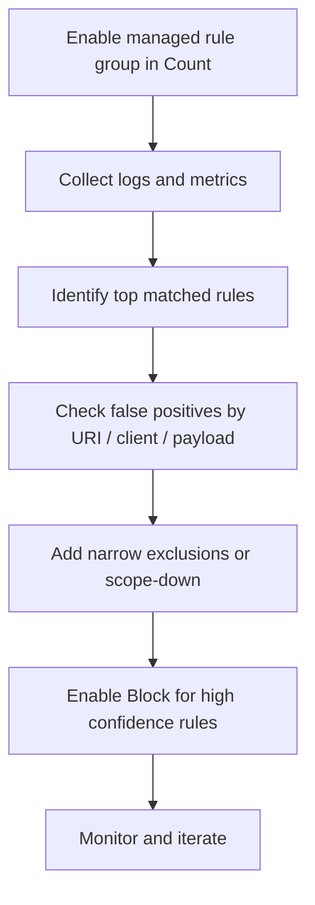

### 8.2 Rule Override Strategy

For managed rule groups, you often override individual rule actions.

Example posture:

| Rule Type | Initial Action | Later Action |
|---|---|---|
| IP reputation | Count | Block or Challenge |
| Known bad inputs | Count | Block after FP check |
| SQLi/XSS | Count | Block for normal APIs; Count for rich input paths until tuned |
| Admin protection | Count | Block on public app |
| Bot Control categories | Count | Challenge/block by bot class |

### 8.3 Scope-Down Statements

Scope-down statements reduce where a rule group applies.

Example:

```txt
Apply SQLi managed group to /api/*
But exclude /api/content/draft where rich HTML is expected
```

Better than disabling the entire rule group.

### 8.4 Exclusions

An exclusion must be narrow and documented.

Bad:

```txt
Disable SQLi rule globally because search endpoint false-positive occurred.
```

Better:

```txt
For SQLi rule X:
  exclude only path /api/search
  only for method POST
  only if content-type application/json
  create backlog item to fix query encoding or request contract
```

Every exception is a future incident unless owned.

---

## 9. Bot Control and Bot Strategy

Bot traffic is not one thing.

| Bot Category | Desired Action |
|---|---|
| Search engine crawler | Allow or rate shape |
| Uptime monitor | Allow if known |
| Partner integration | Allow if authenticated or allowlisted |
| Scraper | Challenge/block/throttle |
| Credential stuffing bot | Block/challenge + app-layer detection |
| Inventory hoarding bot | Challenge + business rules |
| Fake signup bot | Challenge/CAPTCHA + app validation |

A naive “block all bots” rule breaks SEO, monitoring, partner integrations, and legitimate automation.

A mature bot strategy:

1. identify bot categories;
2. distinguish browser vs API clients;
3. allow verified desirable bots where appropriate;
4. challenge suspicious browser-like bots;
5. block high-confidence malicious automation;
6. use app-layer fraud signal for account/session abuse;
7. log enough to explain decisions.

Bot Control is most useful when combined with labels and scoped actions.

Example:

```txt
If BotControl label indicates scraping signal
AND path starts /catalog
THEN Challenge

If BotControl label indicates automated browser
AND path starts /login
THEN Block or CAPTCHA

If verified search bot
AND path starts /public-docs
THEN Count/Allow
```

---

## 10. Forwarded IP and Client Identity

When WAF sits behind a proxy or CDN layer, source IP semantics matter.

Common chain:

```txt
Client -> CloudFront -> ALB -> App
```

At ALB, the source IP may be CloudFront edge IP. The real client IP is usually in `X-Forwarded-For`.

But trusting forwarded headers blindly is dangerous.

Rules:

1. If CloudFront is the only path to ALB, restrict direct ALB access.
2. Only trust `X-Forwarded-For` from trusted upstream proxies.
3. Do not allow clients to bypass upstream and inject fake forwarded headers.
4. Align WAF forwarded IP config with actual deployment.
5. Correlate WAF logs with CloudFront/ALB logs to verify source identity.

For edge WAF on CloudFront, client IP semantics are cleaner because WAF evaluates at CloudFront before forwarding to origin.

---

## 11. Custom Rules That Actually Help

### 11.1 Host Header Enforcement

Block unexpected hostnames.

```txt
IF Host header is not app.example.com or www.example.com
THEN Block
```

Why?

- reduces domain fronting-style misuse;
- catches scanner traffic;
- prevents accidental origin exposure;
- protects multi-tenant ALB confusion.

### 11.2 Method Enforcement

Block methods your app does not use.

```txt
IF method not in GET, HEAD, POST, PUT, PATCH, DELETE, OPTIONS
THEN Block
```

For static sites:

```txt
Allow only GET, HEAD, OPTIONS
```

### 11.3 Admin Path Protection

```txt
IF path starts /admin
AND source IP not in admin allowlist
THEN Block
```

Better yet, admin should often be behind VPN/Verified Access/private network, not public WAF-only access.

### 11.4 Login Brute Force

```txt
IF path = /login
AND rate by forwarded IP exceeds threshold
THEN Challenge or CAPTCHA
```

App must still protect by account/user/password attempt semantics. WAF sees traffic, not user intent.

### 11.5 Expensive Endpoint Shielding

```txt
IF path in /report/export, /search, /analytics/query
AND request rate high
THEN Challenge/Block
```

This is availability protection, not exploit protection.

### 11.6 Content-Type Enforcement

For JSON APIs:

```txt
IF method POST/PUT/PATCH
AND Content-Type not application/json
THEN Block
```

Need exceptions for multipart upload, webhooks, and browser forms.

### 11.7 Size Guardrails

Reject oversized body/query/header when not expected.

This protects against:

- expensive parsing;
- header bombs;
- oversized query abuse;
- accidental large payloads hitting wrong endpoint.

---

## 12. Architecture Patterns

### 12.1 Public Website with CloudFront WAF

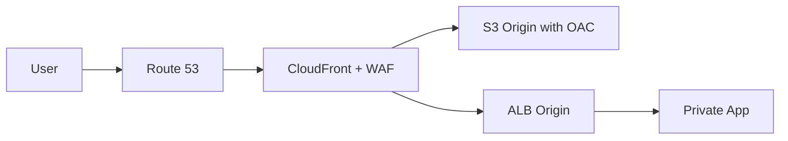

Policy:

- WAF at CloudFront;
- S3 locked with OAC;
- ALB origin restricted to CloudFront prefix list/custom header where appropriate;
- managed common rules count → enforce;
- rate-based rules for login/search;
- Bot Control scoped to public pages;
- WAF logs to S3/Firehose/SIEM.

### 12.2 Regional API with API Gateway WAF

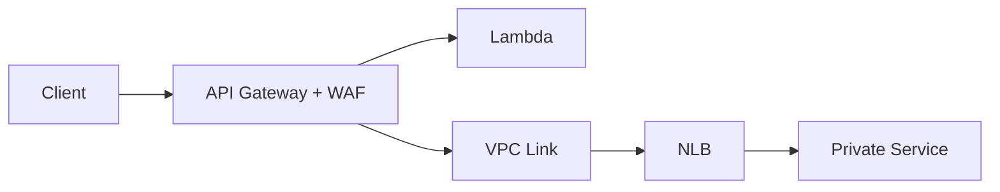

Policy:

- WAF blocks bad payloads and simple abuse;
- API Gateway authorizer authenticates;
- service enforces authorization;
- app quota handles user/account limits;
- WAF rate-based rule protects expensive paths.

### 12.3 Public ALB with WAF

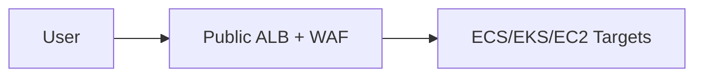

Use when CloudFront is unnecessary or unsuitable.

Policy:

- ALB SG allows 80/443 from internet;
- target SG allows only ALB SG;
- WAF on ALB;
- access logs and WAF logs correlated;
- Shield Advanced considered for high-risk public service.

### 12.4 Dual-Layer: CloudFront WAF + ALB WAF

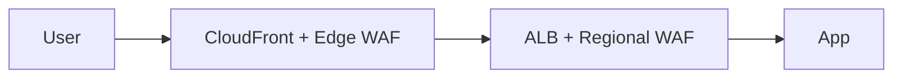

Use when:

- edge WAF does broad global protection;
- regional WAF does app-specific path rules;
- origin protection prevents bypass;
- logging clearly identifies block layer.

Do not duplicate rules mindlessly.

---

## 13. Logging and Observability

WAF without logs is theater.

You need to know:

```txt
which rule matched?
which action happened?
which URI/method/header was involved?
which client IP was evaluated?
which labels were attached?
was request blocked, counted, challenged, or allowed?
```

### 13.1 Metrics

At minimum track:

- allowed requests;
- blocked requests;
- counted requests;
- CAPTCHA/challenge attempts;
- per-rule match counts;
- sudden increase by rule group;
- false-positive support tickets;
- top paths blocked;
- top countries/IPs blocked;
- WCU usage;
- cost by rule group/logging volume.

### 13.2 Logs

Send WAF logs to a durable analytics path.

Common pattern:

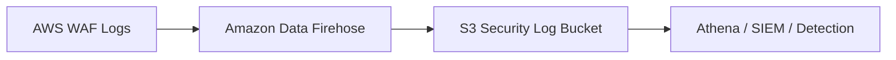

For high-traffic workloads, logging volume can be large. Use:

- log filtering if appropriate;
- partitioned S3 layout;
- lifecycle policies;
- sampling for debug only when acceptable;
- separate hot/cold analytics.

### 13.3 Useful Questions

During incident:

```sql
-- pseudo-query shape
SELECT terminatingRuleId, action, httpRequest.uri, count(*)
FROM waf_logs
WHERE timestamp > now() - interval '1 hour'
GROUP BY terminatingRuleId, action, httpRequest.uri
ORDER BY count(*) DESC;
```

Investigate:

- which rule caused block spike;
- whether source was few IPs or many IPs;
- whether challenge solved rate increased;
- whether legitimate user agents are affected;
- whether one path dominates;
- whether CloudFront/ALB origin errors changed after WAF action.

---

## 14. False Positive Workflow

False positives are not edge cases. They are expected operational events.

### 14.1 Triage Checklist

When user reports 403:

1. identify request timestamp;
2. identify host/path/method;
3. identify source IP or request ID if available;
4. query WAF logs;
5. find terminating rule;
6. confirm whether action is managed/custom/rate/bot;
7. inspect labels;
8. reproduce with controlled request if safe;
9. decide: app should change, client should change, rule should narrow, or exception needed.

### 14.2 Exception Principle

Exception must be:

- narrow;
- time-bound where possible;
- documented;
- observable;
- reviewed;
- owned.

Bad exception:

```txt
Disable CommonRuleSet because API broke.
```

Good exception:

```txt
For rule X in managed group Y:
  set count only when:
    path = /api/content/draft
    method = POST
    content-type = application/json
  owner: content-platform
  review: 2026-08-01
```

### 14.3 Emergency Bypass

Prepare an emergency bypass before incidents.

Options:

- change a specific rule action from block to count;
- add narrow allow for incident responder test IP;
- disable managed rule group temporarily;
- switch Web ACL association only if blast radius understood.

Do not make emergency WAF changes without logs. Otherwise you may remove the only thing keeping the app alive.

---

## 15. IaC and Governance

WAF rules are production code.

Minimum engineering standard:

```txt
Version control
Code review
Named rules
Rule descriptions
Dashboards
Log destinations
Canary/count phase
Rollback plan
Owner metadata
Test fixtures for known requests
```

### 15.1 Naming Convention

Example:

```txt
web-acl-prod-edge-public-app
rule-000-allow-health-checks
rule-010-block-invalid-host
rule-020-block-admin-path-non-corp
rule-100-aws-managed-common-count
rule-110-aws-managed-known-bad-inputs-block
rule-200-rate-login-challenge
rule-210-rate-expensive-search-count
rule-300-bot-control-count
```

Priority number should encode intent. Leave gaps for future insertions.

### 15.2 Environment Strategy

Do not blindly copy production thresholds to dev.

| Environment | Strategy |
|---|---|
| Dev | Count + testing fixtures |
| Staging | Similar to prod but lower risk traffic |
| Production canary | Count and limited enforce |
| Production full | Enforced with dashboards and rollback |

### 15.3 Policy Ownership

Separate ownership:

| Policy Area | Owner |
|---|---|
| Managed rules baseline | Security/platform team |
| App-specific path exclusions | App team + security approval |
| Rate thresholds | App team + SRE/security |
| Bot policy | Security + product/SEO/platform |
| Emergency blocklist | Security incident commander |
| Logging/SIEM pipeline | Security platform |

---

## 16. Capacity and Cost Thinking

AWS WAF uses Web ACL Capacity Units conceptually to represent rule processing capacity. You do not need to memorize every WCU number; you need to design with budget awareness.

Cost and capacity drivers:

- request volume;
- number of Web ACLs;
- number and type of rules;
- managed rule groups;
- Bot Control / advanced features;
- CAPTCHA/Challenge usage;
- logging volume;
- duplicated Web ACLs across layers.

Optimization principles:

1. Put high-value edge protection where it reduces origin load.
2. Do not duplicate expensive rule groups at multiple layers unless justified.
3. Use scope-down statements to avoid evaluating expensive rules everywhere.
4. Use labels to avoid repeated expensive matching.
5. Keep logs useful but lifecycle-managed.
6. Evaluate Bot Control cost against business risk.

Security control that nobody can afford to keep enabled is not a production control.

---

## 17. Failure Modes

### 17.1 WAF Blocks Legitimate Traffic

Symptoms:

- sudden 403 increase;
- support tickets from specific users/partners;
- conversion/login drop;
- WAF blocked metrics spike.

Debug:

1. query WAF logs by time/path/source;
2. identify terminating rule;
3. check recent rule/deployment changes;
4. move rule to count or add narrow exception;
5. monitor recovery.

### 17.2 WAF Does Not Block Attack

Symptoms:

- origin CPU spike;
- login attack continues;
- WAF allowed count high;
- app sees malicious payloads.

Debug:

1. confirm traffic passes protected resource;
2. verify Web ACL association;
3. check whether rule scope matches path/method/header;
4. confirm forwarded IP config;
5. check rule priority and earlier allow rules;
6. inspect logs for labels/count matches;
7. add scoped custom/rate rule.

### 17.3 Origin Bypass

Symptoms:

- attack not visible in WAF logs;
- origin logs show direct requests;
- source IP is not CloudFront/ALB expected path.

Fix:

- restrict origin SG to trusted upstream;
- use CloudFront managed prefix list where applicable;
- use secret custom header validation;
- use private origin/VPC origins where possible;
- avoid public DNS pointing to origin;
- monitor direct-origin access.

### 17.4 Rate Rule Misfires Due to NAT

Symptoms:

- many legitimate users blocked from same corporate/mobile IP;
- one IP dominates blocked logs;
- path is broad.

Fix:

- scope rate rule to abusive path;
- use challenge instead of block;
- use additional aggregation key where possible;
- integrate app-level account/session rate limit;
- allowlist known partner NAT only with compensating controls.

### 17.5 CAPTCHA/Challenge Breaks API Clients

Symptoms:

- API receives challenge response instead of JSON;
- partner integration fails;
- mobile clients cannot proceed.

Fix:

- scope CAPTCHA/Challenge only to browser routes;
- use block/count for API clients;
- create separate host/path for API;
- use auth/quota for API abuse.

---

## 18. Security Patterns by Workload

### 18.1 Static Website

Controls:

- CloudFront + WAF;
- OAC for S3;
- block invalid host;
- allow only GET/HEAD/OPTIONS;
- managed common rules often less critical than bot/rate rules;
- signed URL/cookie for private assets.

### 18.2 Public REST API

Controls:

- WAF at API Gateway or CloudFront;
- managed known bad inputs in count → block;
- rate per path class;
- block invalid methods;
- content-type enforcement;
- app auth/quota;
- logs correlated with request IDs.

### 18.3 Login/Auth Service

Controls:

- rate login path;
- challenge suspicious browser traffic;
- CAPTCHA after risk threshold;
- app-level account lockout/risk engine;
- bot control labels;
- protect password reset/signup separately;
- monitor conversion and false positives.

### 18.4 Admin Portal

Controls:

- do not expose publicly when possible;
- Verified Access/VPN/private access preferred;
- WAF allowlist/block invalid host/path;
- strong auth/MFA;
- strict method/path rules;
- small blast radius Web ACL.

### 18.5 Marketplace/Search/Catalog

Controls:

- bot strategy;
- challenge scraping behavior;
- rate expensive search/export;
- cache public pages through CloudFront;
- avoid blocking desirable search crawlers;
- coordinate with product/SEO.

---

## 19. Implementation Blueprint

### 19.1 Baseline Web ACL

```txt
Default action: allow

Priority 000 - Count all requests with visibility metric
Priority 010 - Block invalid host header
Priority 020 - Block disallowed methods
Priority 030 - Allow known health checks only if needed
Priority 040 - Block emergency IP set
Priority 100 - AWS managed common rules in count
Priority 110 - AWS managed known bad inputs in count/block after tuning
Priority 120 - IP reputation in count/challenge/block
Priority 200 - Login rate challenge
Priority 210 - Expensive endpoint rate challenge/count
Priority 300 - Bot Control count/challenge scoped
Priority 900 - App-specific custom blocks
Default - allow
```

### 19.2 Production Rollout

```txt
Week 1:
  attach Web ACL with mostly Count rules
  enable logging
  build dashboard

Week 2:
  analyze top matches
  add exceptions
  block invalid host/method

Week 3:
  enforce high-confidence managed rules
  challenge suspicious login/search traffic

Week 4:
  bot policy rollout
  tune rate thresholds
  document runbooks
```

### 19.3 Test Fixtures

Maintain request fixtures:

```txt
legitimate login
legitimate signup
legitimate file upload
legitimate rich text payload
legitimate GraphQL query
known SQLi payload
known XSS payload
invalid host header
unexpected method
high-rate login simulation
bot-like user agent
```

Run them before changing Web ACL.

---

## 20. Debugging Runbook

### 20.1 User Gets 403

```txt
1. Identify resource: CloudFront? ALB? API Gateway?
2. Get timestamp, host, path, method, client IP, request ID if available.
3. Query WAF logs around timestamp.
4. Find terminatingRuleId and action.
5. Check labels and matched rule group.
6. Determine if false positive or intended block.
7. Apply narrow exception or move rule to count.
8. Verify recovery with same request pattern.
9. Create follow-up ticket for permanent fix.
```

### 20.2 Attack Reaches Origin

```txt
1. Confirm attack path: direct origin or protected front door?
2. Check WAF allowed/blocked metrics.
3. Check Web ACL association.
4. Check rule priority and earlier allow rule.
5. Check forwarded IP config.
6. Add scoped count rule to observe attack signature.
7. Promote to challenge/block when confident.
8. Restrict origin bypass.
9. Monitor origin CPU/latency/error recovery.
```

### 20.3 Rate Rule Not Working

```txt
1. Confirm aggregation key.
2. Confirm scope-down statement matches path.
3. Check whether request source IP is true client IP.
4. Check if traffic is distributed across many IPs.
5. Use labels or path-specific aggregation where possible.
6. Add app-layer quota for identity/account-level abuse.
```

---

## 21. Anti-Patterns

### Anti-Pattern 1: WAF as Only Security Layer

WAF cannot replace auth, validation, authorization, quota, or secure coding.

### Anti-Pattern 2: Managed Rules Directly in Block Without Observation

This can break legitimate traffic with no warning.

### Anti-Pattern 3: Origin Bypass Left Open

If attackers can hit ALB directly, CloudFront WAF becomes optional from attacker perspective.

### Anti-Pattern 4: One Global Rate Rule

Broad IP rate limits punish NAT users and miss distributed abuse.

### Anti-Pattern 5: No Logs

Without WAF logs, every 403 becomes guesswork.

### Anti-Pattern 6: Duplicate WAF at Every Layer

Layered security is not duplicated policy. Duplicates increase cost and confusion.

### Anti-Pattern 7: Security Team Owns All App Exceptions Alone

App teams understand expected payloads. Security teams understand threat model. Exceptions require both.

---

## 22. Mental Model Recap

```txt
AWS WAF is an HTTP policy engine.
It sees requests, not packets.
It protects associated resources, not VPCs.
It is strongest at the edge/app boundary.
Its rules are ordered and terminating actions matter.
Count mode is how mature teams deploy safely.
Managed rules need tuning, not blind trust.
Rate rules are security controls, not exact quota systems.
Bot control needs business context.
Logs are mandatory.
Origin bypass can invalidate the entire design.
```

A top-tier engineer does not ask: “Should we enable WAF?”

They ask:

```txt
Which HTTP boundary?
Which resource association?
Which threat model?
Which rules in count vs block?
How do we detect false positives?
How do we prevent origin bypass?
How do we correlate WAF, CDN, LB, and app logs?
Who owns exceptions?
What is the rollback path?
```

---

## 23. Hands-On Lab

### Goal

Build a production-shaped WAF configuration for a public app:

```txt
Route 53 -> CloudFront + WAF -> ALB -> private app targets
```

### Tasks

1. Create CloudFront distribution with ALB origin.
2. Restrict ALB origin to CloudFront path where possible.
3. Create WAF Web ACL with:
   - invalid host block;
   - method enforcement;
   - AWS managed common rules in count;
   - known bad inputs in count;
   - login rate challenge;
   - search path rate count;
   - emergency IP block set.
4. Enable WAF logs to S3 via Firehose.
5. Generate legitimate and malicious test requests.
6. Query logs and identify terminating rule.
7. Promote one rule from count to block.
8. Simulate false positive and add narrow exception.
9. Document rollback.

### Expected Outcome

You should be able to answer:

```txt
Why was a request blocked?
Which rule matched?
Can origin be bypassed?
What happens if we disable this rule?
Which rules are still in count mode?
Which false positive exceptions exist?
How do we roll back in under 5 minutes?
```

---

## 24. References

- AWS WAF Developer Guide — Web ACLs: https://docs.aws.amazon.com/waf/latest/developerguide/web-acl.html
- AWS WAF Rule Actions: https://docs.aws.amazon.com/waf/latest/developerguide/waf-rule-action.html
- AWS Managed Rules for AWS WAF: https://docs.aws.amazon.com/waf/latest/developerguide/aws-managed-rule-groups.html
- AWS WAF Rate-Based Rules: https://docs.aws.amazon.com/waf/latest/developerguide/waf-rule-statement-type-rate-based-request-limiting.html
- AWS WAF CAPTCHA and Challenge: https://docs.aws.amazon.com/waf/latest/developerguide/waf-captcha-and-challenge.html
- AWS WAF Bot Control: https://docs.aws.amazon.com/waf/latest/developerguide/waf-bot-control.html
