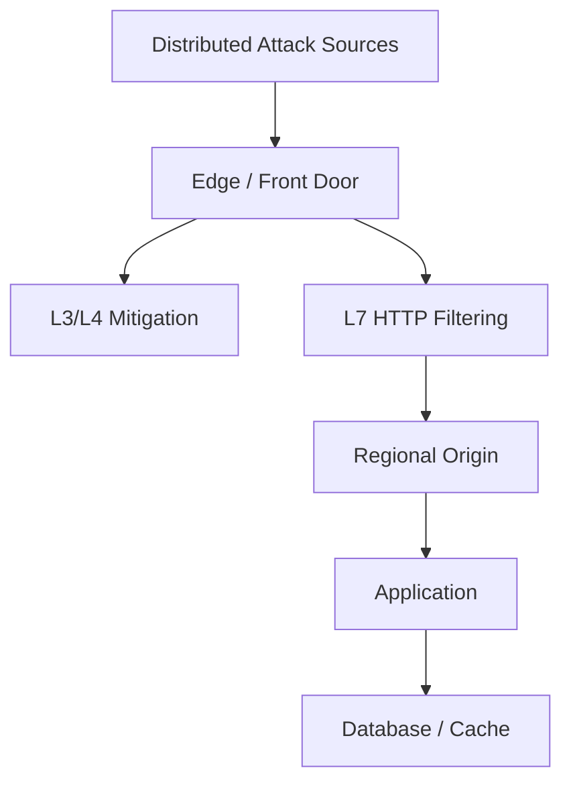
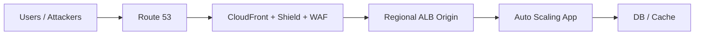
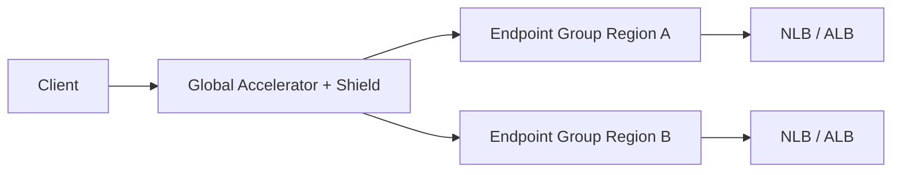
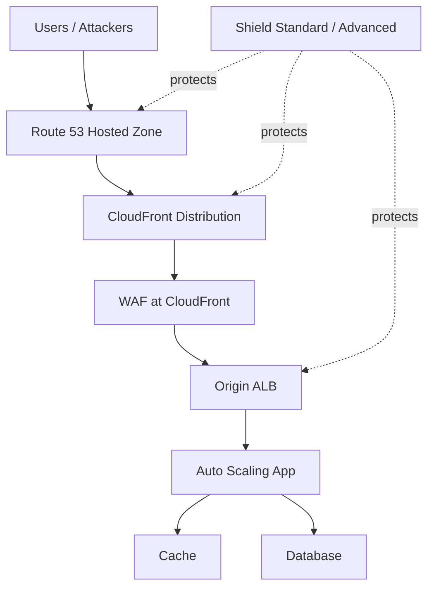
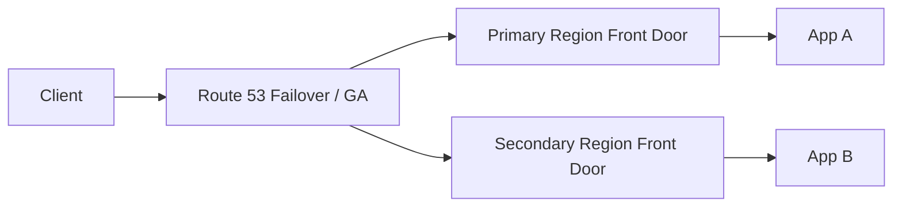
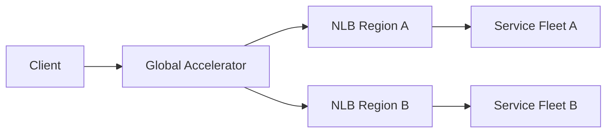
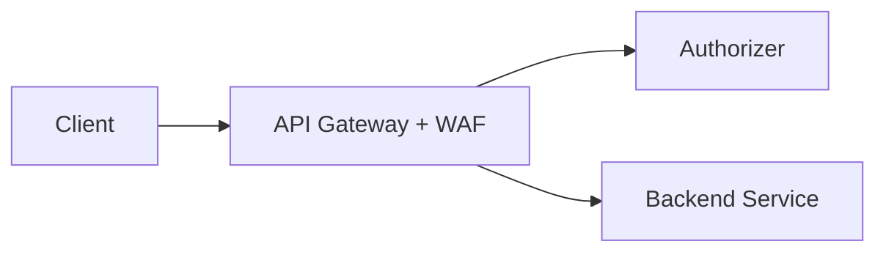

# Part 068 — AWS Shield and DDoS Resilience

> DDoS resilience bukan hanya membeli proteksi. DDoS resilience adalah kemampuan architecture untuk tetap menerima legitimate traffic ketika attacker mencoba menghabiskan capacity, state, bandwidth, connection table, DNS availability, application CPU, atau human response loop.

AWS Shield adalah bagian penting dari cerita ini, tetapi bukan satu-satunya control.

Mental model:

```txt
DDoS protection = edge capacity + traffic filtering + scalable origin + health-based routing + operational response + cost containment.
```

Kalau aplikasi kamu masih punya public origin yang bisa dibypass, single-AZ dependency, tiny fixed backend pool, no autoscaling, no WAF logging, dan no runbook, Shield Advanced tidak otomatis menjadikannya resilient.

---

## 1. What DDoS Actually Tries to Break

DDoS bukan satu jenis serangan. Ia adalah keluarga attack yang mencoba membuat sistem tidak bisa melayani user sah.

Target yang bisa diserang:

| Target | Attack Shape |
|---|---|
| Bandwidth | volumetric flood |
| Packet processing | high packet rate |
| Connection state | SYN flood, connection exhaustion |
| TLS handshake | expensive cryptographic negotiation |
| HTTP worker | slowloris, request flood |
| Application CPU | expensive route/query abuse |
| Database/cache | induced backend load |
| DNS | query flood, hosted zone availability pressure |
| Human ops | alert storm, manual mitigation overload |
| Cost | forced scaling or data transfer spike |

A DDoS plan must handle more than “block bad IP”. Distributed attacks often come from many sources and may look partially legitimate.

---

## 2. AWS Shield Standard vs Shield Advanced

### 2.1 Shield Standard

Shield Standard is automatically available to AWS customers at no extra charge. It protects against common network and transport layer DDoS attacks.

Most value appears when your application uses AWS edge-integrated services:

- Amazon CloudFront;
- Amazon Route 53;
- AWS Global Accelerator;
- Elastic Load Balancing;
- Elastic IP-backed resources.

The practical meaning:

```txt
If you front the application with AWS edge services, more attack traffic can be absorbed/mitigated before it reaches your origin.
```

### 2.2 Shield Advanced

Shield Advanced adds enhanced detection, mitigation, visibility, support, and cost protection capabilities for eligible resources.

Typical protected resource types include:

- CloudFront distributions;
- Route 53 hosted zones;
- Global Accelerator accelerators;
- Elastic Load Balancing load balancers;
- Elastic IP addresses.

Key value areas:

- enhanced DDoS detection;
- attack visibility/events;
- advanced mitigation integration;
- AWS Shield Response Team access depending support plan/engagement flow;
- cost protection for scaling charges caused by DDoS where eligible;
- proactive engagement when configured;
- integration with health checks and WAF.

Do not treat Shield Advanced as a replacement for CloudFront/WAF/Autoscaling. Treat it as specialized DDoS resilience layer.

---

## 3. DDoS Layers and Controls



| Layer | Attack | AWS Control |
|---|---|---|
| L3 network | volumetric flood | Shield, edge services, Global Accelerator, CloudFront |
| L4 transport | SYN/UDP/TCP floods | Shield, NLB/GA/edge mitigation, capacity design |
| L7 HTTP | request flood, scraper, expensive URL | WAF, CloudFront, ALB/API Gateway controls, app limits |
| DNS | query flood | Route 53 + Shield |
| Origin | connection exhaustion | CloudFront/GA/ELB scaling, SG origin restriction, autoscaling |
| App | expensive operations | app-layer rate limit, caching, queueing, backpressure |

A top-tier design does not depend on one layer. It creates progressively narrower filters.

---

## 4. Edge-First DDoS Architecture

Most public applications should prefer edge-first exposure.



Why edge-first helps:

- attack reaches global edge fleet first;
- origin receives less junk;
- WAF can filter HTTP attack at edge;
- CloudFront cache can absorb static/public GET load;
- Route 53 gives resilient authoritative DNS;
- origin can be locked to CloudFront where possible.

### 4.1 Critical Origin Protection

If attacker can bypass CloudFront and hit ALB directly:

```txt
DDoS mitigation at CloudFront becomes optional for the attacker.
```

Protect origin:

- ALB SG allow only CloudFront managed prefix list where appropriate;
- use custom secret header from CloudFront and validate at ALB/app/WAF regional layer;
- avoid publishing origin DNS name;
- use private origins/VPC origins where suitable;
- monitor direct-origin traffic;
- block unexpected Host header;
- use regional WAF if origin remains public.

### 4.2 Cache as DDoS Absorber

CloudFront cache can convert repeated public content requests into edge hits.

Good candidates:

- static assets;
- public catalog pages;
- documentation;
- unauthenticated GET responses;
- versioned content;
- error pages.

Bad candidates:

- per-user private content;
- session-specific HTML;
- auth-sensitive API response;
- mutable account data.

DDoS resilience improves when expensive origin work is not required for every public request.

---

## 5. Global Accelerator for DDoS Resilience

Global Accelerator is useful when you need static anycast IPs and acceleration for TCP/UDP workloads or non-cacheable applications.



Use cases:

- TCP/UDP service;
- static IP requirement;
- multi-region failover without DNS TTL dependency;
- gaming/real-time protocol;
- API where CloudFront caching is not the primary value;
- global ingress into regional ALB/NLB.

Compared to DNS failover:

| Aspect | Route 53 | Global Accelerator |
|---|---|---|
| Steering mechanism | DNS answers | Anycast IP + AWS global network |
| Client cache effect | TTL/resolver caching matters | Client keeps static IPs |
| Protocol | DNS-level | TCP/UDP via listeners |
| Failover style | DNS re-resolution | Endpoint health/traffic management |
| Edge DDoS posture | Route 53 protected DNS | GA edge front door for app traffic |

Global Accelerator is not an HTTP WAF. Pair with WAF at ALB/CloudFront/API Gateway where needed.

---

## 6. Route 53 and DNS DDoS Resilience

DNS availability is part of application availability.

```txt
If users cannot resolve the hostname, application capacity does not matter.
```

Route 53 is designed as a highly available authoritative DNS service. With Shield protections, it is a strong default for public hosted zones.

Design principles:

- use Route 53 public hosted zones for AWS-hosted public apps;
- avoid fragile third-party DNS unless explicitly justified;
- use sensible TTLs;
- do not rely on DNS as sub-second failover;
- use health checks carefully;
- avoid overly complex routing policies that humans cannot reason about during attack;
- monitor DNS query patterns.

DNS DDoS differs from app DDoS. Your app logs may show nothing because requests never reach application.

---

## 7. Elastic Load Balancing Under DDoS

ELB is horizontally scalable managed infrastructure, but it is not magic.

### 7.1 ALB

ALB is useful for HTTP(S) applications and WAF association.

DDoS concerns:

- request flood to expensive path;
- TLS handshake pressure;
- target saturation;
- 502/503/504 under backend stress;
- WAF false positive under aggressive mitigation;
- direct-origin bypass behind CloudFront.

Controls:

- CloudFront in front when appropriate;
- WAF at CloudFront or ALB;
- autoscaling targets;
- target health checks tuned;
- graceful degradation;
- static/cached error responses;
- ALB capacity reservation for critical workloads where appropriate;
- Shield Advanced protection for eligible ALBs.

### 7.2 NLB

NLB is useful for TCP/UDP/TLS and static IP/zonal patterns.

DDoS concerns:

- connection flood;
- SYN/UDP flood;
- backend connection table exhaustion;
- target port exhaustion;
- lack of L7 visibility;
- source IP preservation exposing real client IP to targets.

Controls:

- Global Accelerator in front where useful;
- Shield Advanced protection for eligible path/resource model;
- SG support where available/appropriate;
- autoscaling backend;
- protocol-specific throttling in app/service;
- connection limits/backpressure;
- Flow Logs/NLB metrics.

### 7.3 GWLB / Appliances

DDoS is not always best handled by inline appliances. Volumetric attacks should be absorbed upstream as much as possible. Inline appliances are useful for inspection, but can become bottlenecks if placed incorrectly.

---

## 8. L7 DDoS and AWS WAF

Many “DDoS” incidents are really high-rate HTTP abuse.

Examples:

```txt
GET /search?q=expensive repeated from many IPs
POST /login brute force
GET /product/123 scraping at high rate
POST /graphql huge query
GET /report/export repeatedly
```

Shield helps with DDoS detection/mitigation, but L7 semantics often need AWS WAF and application controls.

WAF controls:

- rate-based rules;
- Bot Control;
- IP reputation;
- managed rule groups;
- CAPTCHA/Challenge;
- path-specific restrictions;
- method/header enforcement.

Application controls:

- authenticated quotas;
- per-account limits;
- request complexity limits;
- caching;
- queueing;
- circuit breakers;
- degraded mode;
- async exports;
- search query budget.

Do not expect WAF to understand business identity unless you expose safe signals through headers/cookies and design around them. For account-level abuse, the app must participate.

---

## 9. Shield Advanced Operational Model

### 9.1 Protection Scope

You enable Shield Advanced protections for eligible resources. The resource list must match your real front doors.

Bad:

```txt
Protect CloudFront distribution, but attackers can hit origin ALB directly.
```

Better:

```txt
Protect CloudFront distribution.
Restrict origin ALB.
Optionally protect ALB if it remains internet-facing.
Protect Route 53 hosted zone.
Protect Global Accelerator if used.
```

### 9.2 Health-Based Detection and Proactive Engagement

Health checks matter because traffic anomaly alone does not always mean application impact. A spike can be viral traffic, product launch, or attack.

A health signal tells operations:

```txt
Is the protected application still healthy?
```

Good health check:

- represents user-visible service availability;
- does not hit expensive backend path;
- is not trivially cached incorrectly;
- checks enough dependency to be meaningful;
- has clear alarm thresholds;
- is documented for response process.

Bad health check:

```txt
/health returns 200 even when login, checkout, or API is dead.
```

### 9.3 Incident Response Integration

Prepare before attack:

- know which resources are protected;
- enable logs and metrics;
- configure contacts/proactive engagement if using it;
- define escalation path;
- prebuild WAF emergency rules;
- know how to restrict origin;
- know who can change DNS/CloudFront/WAF/ALB;
- test runbooks.

During attack, slow IAM/process friction can be more dangerous than packet flood.

---

## 10. DDoS Resilient Reference Architectures

### 10.1 Public Web Application



Controls:

- Route 53 DNS;
- CloudFront front door;
- WAF at edge;
- Shield Advanced for high-risk critical apps;
- ALB origin restricted;
- app autoscaling;
- cache static/public content;
- graceful degradation;
- WAF logs and CloudFront logs.

### 10.2 Multi-Region Active/Passive



Key decision:

- Route 53 failover if DNS-level recovery acceptable;
- Global Accelerator if static anycast IP and faster endpoint failover semantics needed;
- CloudFront origin groups for HTTP origin failover for cacheable/web workloads.

DDoS-specific concern:

```txt
Can secondary absorb legitimate traffic if primary is under attack or intentionally drained?
```

A DR environment that is too small is not DDoS resilient.

### 10.3 TCP/UDP Service with Global Accelerator



Controls:

- Shield at GA/resource layer;
- NLB metrics;
- backend connection limits;
- protocol-level validation;
- autoscaling;
- failover endpoint group;
- Flow Logs.

### 10.4 API Gateway Public API



Controls:

- WAF path-based rate rules;
- API Gateway throttling/quotas;
- auth-required endpoints;
- app-level quota;
- request complexity limits;
- Shield Advanced if frontend resources eligible/critical.

---

## 11. Origin and Backend Resilience

DDoS mitigation often fails at the backend, not the edge.

### 11.1 Autoscaling

Autoscaling helps if bottleneck is stateless compute.

It does not help if:

- DB is bottleneck;
- cache is bottleneck;
- app has global lock;
- every request triggers external API;
- scaling is too slow;
- quotas limit capacity;
- attack creates expensive per-request memory.

### 11.2 Backpressure

Application must reject or degrade before it collapses.

Mechanisms:

- request queue limits;
- concurrency limits;
- timeout budgets;
- circuit breakers;
- bulkheads;
- static fallback;
- async processing;
- priority for authenticated users;
- shed unauthenticated expensive traffic.

### 11.3 Caching

DDoS resilience improves when origin is not required for every request.

Use:

- CloudFront cache;
- application cache;
- CDN stale-if-error style patterns where appropriate;
- static error/maintenance pages;
- precomputed expensive responses.

### 11.4 Dependency Protection

An HTTP flood to `/search` may become a database DDoS.

Protect dependencies:

- query complexity limits;
- result caps;
- pagination caps;
- rate by account/API key;
- circuit breaker on DB/cache;
- background exports;
- request deduplication;
- idempotency keys.

---

## 12. Metrics and Detection

### 12.1 Edge Metrics

Track:

- CloudFront requests/error rates/cache hit ratio/origin latency;
- WAF allowed/blocked/challenged/counted requests;
- Shield events and detections;
- Route 53 health check status;
- Global Accelerator endpoint health and traffic;
- ALB/NLB processed bytes, active connections, new connections, target errors.

### 12.2 Origin Metrics

Track:

- CPU/memory;
- request latency p50/p95/p99;
- worker/thread saturation;
- connection pool saturation;
- DB CPU/IO/locks;
- cache hit rate;
- queue depth;
- autoscaling events;
- 5xx by path;
- rejected requests due to backpressure.

### 12.3 Human Signal

DDoS response needs human-readable dashboards:

```txt
Are real users impacted?
Which entry point is under attack?
Is attack HTTP, TCP, UDP, or DNS?
Is WAF blocking or counting?
Is origin bypass happening?
Is backend saturated?
Can we safely raise/lower rate thresholds?
Is failover needed?
```

Dashboards should answer decision questions, not just display graphs.

---

## 13. Runbook: Suspected DDoS Event

### 13.1 First 5 Minutes

```txt
1. Confirm user impact: synthetic checks, SLO, health checks.
2. Identify attacked entry point: DNS, CloudFront, GA, ALB, API Gateway, NLB, EIP.
3. Check Shield events/detections if enabled.
4. Check WAF metrics: allowed vs blocked vs challenged.
5. Check origin health: ALB target errors, app CPU, DB/cache saturation.
6. Check direct-origin traffic possibility.
7. Assign incident commander and security/network/app leads.
```

### 13.2 Classification

Classify quickly:

| Signal | Likely Type |
|---|---|
| Huge network bytes/packets, little app log | L3/L4 volumetric |
| SYN/new connection spike | L4 connection flood |
| High HTTP request rate to few paths | L7 request flood |
| High expensive endpoint latency | app-layer resource attack |
| DNS query anomaly, app sees little | DNS DDoS |
| WAF blocked spike but app healthy | mitigated L7 attack |
| Origin sees attack but WAF does not | origin bypass or wrong association |

### 13.3 Mitigation Actions

Potential actions:

- enable/adjust WAF rate rule;
- challenge suspicious browser traffic;
- block invalid host/method/path;
- apply emergency IP set for concentrated attack;
- restrict origin SG;
- increase CloudFront caching for public content;
- serve static maintenance/degraded page;
- disable expensive unauthenticated endpoint;
- increase autoscaling capacity;
- fail over using Route 53/GA if primary unhealthy;
- contact AWS support/SRT flow if using Shield Advanced.

Avoid random broad blocks. Measure before/after.

### 13.4 Communication

Communicate:

```txt
Current impact:
Entry point affected:
Attack class:
Mitigations applied:
Customer-visible behavior:
Risk of false positives:
Next decision point:
Owner:
```

During DDoS, poor coordination causes self-inflicted outages.

---

## 14. Runbook: HTTP Flood to Login

Symptoms:

- login p95/p99 spikes;
- auth DB/cache pressure;
- WAF allowed requests high;
- many failed login attempts;
- source IP distribution broad.

Actions:

```txt
1. Confirm path /login or /oauth/token spike.
2. Apply WAF rate-based challenge scoped to login browser route.
3. For API token endpoint, avoid CAPTCHA; use app/client quota and block obvious bad signatures.
4. Add temporary stricter app-layer per-account/per-username controls.
5. Ensure password reset/signup not also abused.
6. Monitor legitimate login success rate.
7. Review false positives from corporate NAT/mobile networks.
```

Long-term:

- risk-based auth;
- credential stuffing detection;
- breached password intelligence;
- bot challenge at edge;
- per-account lockout with abuse-safe design;
- async fraud pipeline.

---

## 15. Runbook: Expensive Search/Export Abuse

Symptoms:

- search/export endpoints dominate traffic;
- DB CPU high;
- cache miss rate high;
- app autoscaling does not help;
- WAF sees normal-looking requests.

Actions:

```txt
1. Identify expensive path/query class.
2. Add scoped WAF rate count/challenge for unauthenticated traffic.
3. Require auth for expensive exports if possible.
4. Lower max page size / query complexity temporarily.
5. Serve cached/stale results where acceptable.
6. Disable export temporarily behind feature flag if needed.
7. Add queue/asynchronous export path.
```

Lesson:

```txt
DDoS can be semantic. The packet is valid; the work is expensive.
```

---

## 16. Runbook: Direct-Origin Attack

Symptoms:

- WAF at CloudFront shows no corresponding attack;
- ALB logs show direct traffic;
- Host header may be ALB DNS name or random;
- origin target saturation.

Actions:

```txt
1. Confirm traffic source path from ALB logs and Flow Logs.
2. Restrict ALB Security Group to CloudFront managed prefix list if applicable.
3. Enforce expected Host header via ALB/WAF/app.
4. Add secret custom header validation from CloudFront to origin.
5. Remove public DNS records pointing to origin.
6. Consider CloudFront VPC origins/private origin pattern.
7. Add regional WAF as defense-in-depth if origin remains public.
```

Root cause:

```txt
Front door was optional.
```

---

## 17. Cost Protection and Cost Failure Modes

DDoS can create cost impact:

- data transfer out;
- CloudFront request volume;
- WAF request inspection;
- autoscaling compute;
- NAT data processing;
- logging ingestion;
- Firehose/S3/Athena/SIEM volume;
- downstream managed service load.

Shield Advanced can provide DDoS cost protection for eligible scaling charges under AWS conditions, but cost resilience still requires design:

- cache public content;
- avoid NAT for high-volume AWS service access when VPC endpoints fit;
- filter before origin;
- avoid logging every noisy request into premium SIEM without filtering/lifecycle;
- use emergency WAF blocks/challenges;
- set budget anomaly alerts;
- monitor per-entry-point request cost.

Cost is part of availability. A system that survives technically but causes extreme cost spike still failed operationally.

---

## 18. Testing DDoS Resilience Safely

Do not run unauthorized DDoS tests. AWS has policies and processes for penetration testing/simulation. Always follow AWS rules and your organization’s approval process.

Safe resilience testing focuses on architecture behavior:

- synthetic load tests within allowed limits;
- WAF rule simulation with replayed logs;
- tabletop exercises;
- origin bypass validation;
- failover game days;
- health check failure drills;
- autoscaling warm-up tests;
- cache hit ratio tests;
- runbook timed exercises.

Questions to test:

```txt
Can we identify entry point under 5 minutes?
Can we determine L3/L4/L7/app semantic attack class?
Can we add WAF emergency rule safely?
Can we restrict origin without breaking legitimate traffic?
Can we fail over without DNS confusion?
Can we distinguish attack from marketing traffic spike?
Can we roll back a bad mitigation?
```

---

## 19. Governance Model

### 19.1 Resource Inventory

Maintain inventory:

```txt
public hosted zones
CloudFront distributions
Global Accelerators
public ALBs/NLBs
Elastic IPs
API Gateways
origin DNS names
WAF Web ACL associations
Shield Advanced protections
health checks
incident contacts
```

Unknown public entry points are DDoS liabilities.

### 19.2 Protection Policy

Example standard:

```txt
Tier 0 / critical public app:
  Route 53 hosted zone protected
  CloudFront or GA front door required unless exception
  WAF logging required
  Shield Advanced protection required
  origin bypass restricted
  health checks configured
  DDoS runbook tested quarterly

Tier 1 public app:
  WAF required
  CloudFront/GA preferred
  Shield Advanced based on risk
  origin bypass restricted

Tier 2 internal app:
  no public exposure unless approved
  Verified Access/VPN/private access preferred
```

### 19.3 Ownership

| Area | Owner |
|---|---|
| Shield subscription/protection inventory | Security/platform |
| CloudFront/GA/Route 53 front door | Platform/network |
| WAF rules | Security + app team |
| Origin restriction | Network/app platform |
| App backpressure | App team |
| DB/cache protection | App/data platform |
| Incident response | SRE/security incident command |
| Cost monitoring | FinOps + platform |

---

## 20. Anti-Patterns

### Anti-Pattern 1: Public Origin Behind CloudFront

CloudFront cannot protect what attackers can bypass.

### Anti-Pattern 2: Only Scaling the App

Scaling app nodes does not fix database, cache, external API, or lock contention bottlenecks.

### Anti-Pattern 3: Using DNS Failover as Instant Circuit Breaker

DNS TTL and resolver caching limit precision. Use Global Accelerator or application-level controls when fast steering is required.

### Anti-Pattern 4: Blocking Entire Countries Without Business Review

Geo-blocking can reduce noise, but can also block legitimate customers, VPNs, travelers, and partners.

### Anti-Pattern 5: No WAF Logs During L7 Attack

You cannot tune what you cannot see.

### Anti-Pattern 6: CAPTCHA on APIs

CAPTCHA/Challenge should be scoped carefully. Non-browser clients cannot solve browser workflows.

### Anti-Pattern 7: Inline Appliance as Volumetric Shield

Push volumetric mitigation to edge/provider layers. Inline inspection is not a substitute for upstream capacity.

### Anti-Pattern 8: No Game Day

The first DDoS event should not be the first time your team uses Shield/WAF/GA/Route 53 failover.

---

## 21. Design Checklist

### Front Door

```txt
[ ] Is every public hostname known?
[ ] Is Route 53 used or otherwise resilient DNS documented?
[ ] Is CloudFront or Global Accelerator appropriate?
[ ] Is WAF attached at the right boundary?
[ ] Is Shield Advanced enabled for critical eligible resources?
[ ] Is direct origin bypass prevented?
```

### Capacity

```txt
[ ] Can origin scale for legitimate spike?
[ ] Are DB/cache dependencies protected?
[ ] Are expensive endpoints cached, queued, or limited?
[ ] Are ALB/NLB metrics monitored?
[ ] Are quotas/capacity reservations considered for critical apps?
```

### Security Controls

```txt
[ ] Are WAF managed rules staged safely?
[ ] Are rate rules path-specific?
[ ] Are bot policies business-aware?
[ ] Are invalid host/method rules present?
[ ] Are emergency IP/rate rules ready?
```

### Observability

```txt
[ ] WAF logs enabled?
[ ] CloudFront/ALB/API logs enabled?
[ ] Shield events monitored?
[ ] Route 53 health checks meaningful?
[ ] Dashboards answer incident questions?
[ ] Cost anomaly alerts configured?
```

### Operations

```txt
[ ] DDoS runbook exists?
[ ] Contacts/proactive engagement configured if using Shield Advanced?
[ ] IAM permissions ready for responders?
[ ] Failover tested?
[ ] Origin restriction tested?
[ ] Rollback process tested?
```

---

## 22. Mental Model Recap

```txt
Shield is not a magic shield around bad architecture.
DDoS resilience starts with front-door design.
Use edge services to absorb traffic before origin.
Use WAF for L7 request semantics.
Use Route 53/GA/CloudFront according to steering layer.
Protect origin from bypass.
Autoscale only where bottleneck is scalable.
Cache public work.
Apply backpressure before collapse.
Instrument everything.
Practice incident response.
```

A top-tier engineer thinks in failure modes:

```txt
What if DNS is attacked?
What if CloudFront is healthy but origin is bypassed?
What if login is attacked from 100k IPs?
What if attack traffic is valid GET requests?
What if WAF mitigation blocks real customers?
What if failover sends all traffic to an undersized region?
What if logs become the cost bottleneck?
What if responders lack permission to change WAF?
```

---

## 23. Hands-On Lab

### Goal

Design and validate a DDoS-resilient public application front door.

Architecture:

```txt
Route 53 -> CloudFront + WAF + Shield Advanced candidate -> ALB -> Auto Scaling app
```

### Tasks

1. Inventory all public entry points.
2. Put CloudFront in front of ALB.
3. Attach WAF to CloudFront.
4. Add invalid host/method rules.
5. Add scoped login/search rate rules in count mode.
6. Enable WAF and CloudFront logs.
7. Restrict ALB origin to CloudFront where possible.
8. Create Route 53 health check representing user-visible app health.
9. Build dashboard:
   - CloudFront requests/error/origin latency;
   - WAF allowed/blocked/challenged;
   - ALB target response time/errors;
   - app CPU/latency;
   - DB/cache saturation.
10. Run a safe tabletop:
   - HTTP flood to `/login`;
   - direct-origin bypass attempt;
   - false positive from WAF rule;
   - failover decision.

### Expected Outcome

You should be able to answer:

```txt
Can attackers bypass the front door?
Which WAF rules would activate under login abuse?
What user-visible signal triggers escalation?
Which resources should Shield Advanced protect?
How do we distinguish attack from product launch traffic?
How do we reduce origin work during attack?
Who can change WAF/CloudFront/Route 53 during incident?
What is the rollback plan for bad mitigation?
```

---

## 24. References

- AWS Shield Standard overview: https://docs.aws.amazon.com/waf/latest/developerguide/ddos-standard-summary.html
- How AWS Shield and Shield Advanced work: https://docs.aws.amazon.com/waf/latest/developerguide/ddos-overview.html
- List of resources that AWS Shield Advanced protects: https://docs.aws.amazon.com/waf/latest/developerguide/ddos-protections-by-resource-type.html
- AWS Shield mitigation logic for CloudFront and Route 53: https://docs.aws.amazon.com/waf/latest/developerguide/ddos-event-mitigation-logic-continuous-inspection.html
- AWS WAF Web ACLs: https://docs.aws.amazon.com/waf/latest/developerguide/web-acl.html
- AWS Global Accelerator documentation: https://docs.aws.amazon.com/global-accelerator/latest/dg/what-is-global-accelerator.html
