# Part 069 — AWS Network Firewall Deep Dive

> Goal part ini: kamu bisa mendesain, memasang, mengoperasikan, dan men-debug **AWS Network Firewall** sebagai kontrol jaringan produksi, bukan hanya tahu bahwa ia adalah “firewall managed AWS”.

AWS Network Firewall sering disalahpahami sebagai Security Group yang lebih kuat. Itu framing yang salah.

Security Group adalah **stateful allow-list di resource/ENI boundary**. NACL adalah **stateless subnet guardrail**. AWS Network Firewall adalah **managed inspection point** yang harus kamu **lewati secara eksplisit melalui routing**. Artinya, Network Firewall bukan sekadar policy object. Ia adalah kombinasi dari:

1. **firewall endpoint** di subnet tertentu,
2. **route table steering** agar traffic masuk ke endpoint itu,
3. **firewall policy** yang mengatur stateless/stateful behavior,
4. **rule groups** sebagai unit reusable,
5. **logging/metrics** untuk membuktikan apa yang terjadi.

Jika route salah, firewall tidak melihat traffic. Jika route asimetris, stateful inspection rusak. Jika DNS dan TLS tidak kamu pahami, domain-based rule akan terlihat “random”. Jika kamu menaruh firewall di satu AZ untuk semua AZ, kamu menciptakan bottleneck dan failure coupling.

AWS Network Firewall adalah alat yang kuat, tapi hanya kalau diperlakukan sebagai **stateful network appliance yang managed**, bukan tombol ajaib.

---

## 1. Mental Model: Firewall Sebagai Node di Packet Path

Network Firewall hanya bisa memfilter traffic yang melewatinya.

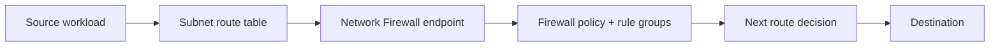

Model ini penting karena banyak insiden bukan disebabkan rule yang salah, tapi traffic **tidak pernah masuk firewall**.

Contoh:

- workload subnet route langsung ke NAT Gateway, bukan firewall endpoint;
- TGW route table mengirim traffic langsung ke VPC attachment target, bukan inspection VPC;
- return path tidak melewati firewall yang sama;
- NACL/Security Group memblokir sebelum firewall;
- DNS resolve ke private endpoint sehingga path berubah;
- VPC endpoint/gateway endpoint membuat traffic ke AWS service tidak melewati NAT/firewall.

Invariant utama:

> Network Firewall adalah enforcement point hanya untuk traffic yang secara routing dipaksa melewati firewall endpoint.

---

## 2. Komponen Dasar AWS Network Firewall

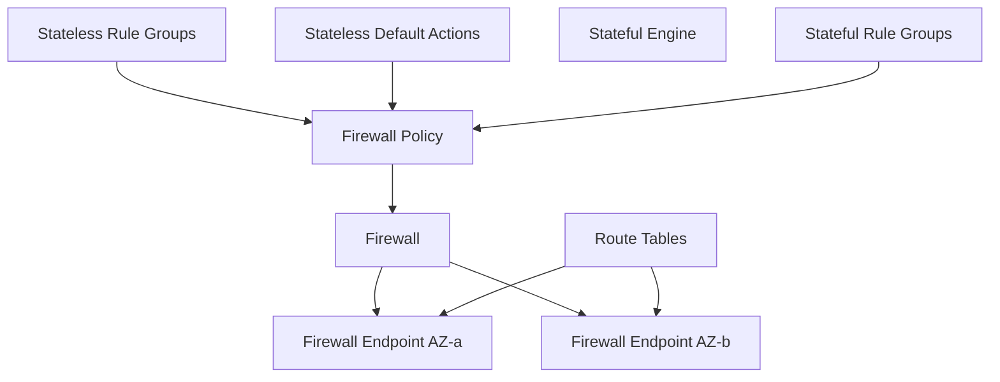

### 2.1 Firewall

Firewall adalah resource Network Firewall yang ditempatkan ke VPC dan subnet tertentu. Untuk desain produksi multi-AZ, kamu biasanya membuat firewall endpoint di setiap AZ yang menerima traffic.

Firewall bukan target publik aplikasi. Ia adalah hop internal di network path.

### 2.2 Firewall Endpoint

Saat firewall dibuat pada subnet tertentu, AWS membuat endpoint firewall di subnet itu. Route table dapat menargetkan endpoint ini.

Kamu harus berpikir firewall endpoint seperti “appliance endpoint” per-AZ.

Prinsip desain:

- buat endpoint di AZ yang sama dengan source/traffic path bila memungkinkan;
- jaga route symmetry;
- jangan hairpin traffic semua AZ ke satu firewall endpoint kecuali sadar konsekuensi latency, cost, dan failure domain;
- untuk TGW + stateful inspection, pahami appliance mode dan AZ affinity.

### 2.3 Firewall Policy

Firewall policy menentukan bagaimana firewall memproses packet:

- rule group stateless mana yang dipakai;
- default action stateless;
- rule group stateful mana yang dipakai;
- rule ordering untuk stateful engine;
- default stateful action dalam model tertentu.

Policy adalah “execution plan”, bukan sekadar kumpulan rule.

### 2.4 Rule Group

Rule group adalah unit reusable yang berisi rule.

Ada dua keluarga besar:

| Rule group | Cara kerja | Cocok untuk |
|---|---|---|
| Stateless | melihat packet secara individual tanpa konteks flow | coarse filtering, forwarding ke stateful engine, drop cepat untuk traffic jelas buruk |
| Stateful | memahami flow/session dan bisa memakai Suricata-compatible rules | domain allow/deny, IDS/IPS, protocol-aware inspection, egress policy |

AWS dokumentasi menjelaskan bahwa stateless engine memeriksa packet secara isolasi, sedangkan stateful engine memakai rules kompatibel Suricata untuk stateful traffic inspection.

---

## 3. Stateless vs Stateful: Jangan Salah Memakai Mesin

### 3.1 Stateless Engine

Stateless engine menjawab pertanyaan:

> “Packet ini, sendirian, cocok dengan rule apa?”

Ia tidak memahami bahwa packet ini bagian dari TCP session yang sudah established. Ia tidak peduli arah conversation kecuali rule match kamu menyatakan source/destination.

Contoh penggunaan tepat:

- drop traffic ke port yang pasti tidak boleh;
- pass traffic tertentu tanpa stateful inspection jika benar-benar aman;
- forward candidate traffic ke stateful engine;
- coarse segmentation berdasarkan CIDR/protocol/port.

Contoh anti-pattern:

- menulis egress allow policy kompleks hanya dengan stateless rules;
- lupa ephemeral return port;
- menganggap stateless engine seperti Security Group.

### 3.2 Stateful Engine

Stateful engine menjawab pertanyaan:

> “Flow ini sedang dalam state apa, dan apakah payload/protocol/session-nya sesuai policy?”

Ia cocok untuk:

- allow/deny berdasarkan domain;
- TLS SNI inspection;
- HTTP Host inspection;
- Suricata signature;
- flow-aware allow/drop;
- threat intel rules;
- alerting IDS-style;
- drop established traffic berdasarkan policy.

### 3.3 Recommended Mental Flow

Untuk kebanyakan desain egress inspection:

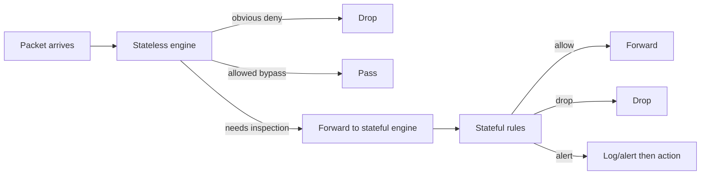

Desain ini menjaga stateless layer sederhana dan memindahkan logic yang butuh konteks ke stateful engine.

---

## 4. Rule Ordering: Default vs Strict

Stateful rules bisa dievaluasi dengan mode ordering berbeda. Ini bukan detail kecil.

### 4.1 Default Action Order

Dalam model default Suricata-like action order, urutan action seperti pass/drop/reject/alert mengikuti model engine, bukan semata urutan teks yang kamu tulis.

Risikonya:

- rule yang menurut kamu “di atas” belum tentu menang sesuai intuisi;
- exception rule bisa kalah oleh rule lain;
- rule group lintas tim sulit diprediksi.

### 4.2 Strict Order

Strict order membuat evaluasi mengikuti urutan yang kamu tentukan. Untuk organisasi besar, ini biasanya lebih mudah di-govern karena policy bisa dipahami sebagai pipeline deterministik.

AWS dokumentasi merekomendasikan strict order ketika kamu perlu menentukan urutan evaluasi stateful rules secara eksplisit.

Pattern strict order:

1. allow infrastructure baseline;
2. allow AWS service dependencies yang disetujui;
3. allow business-approved domains/protocols;
4. drop known-bad/threat intel;
5. drop everything else atau alert-only sesuai fase rollout.

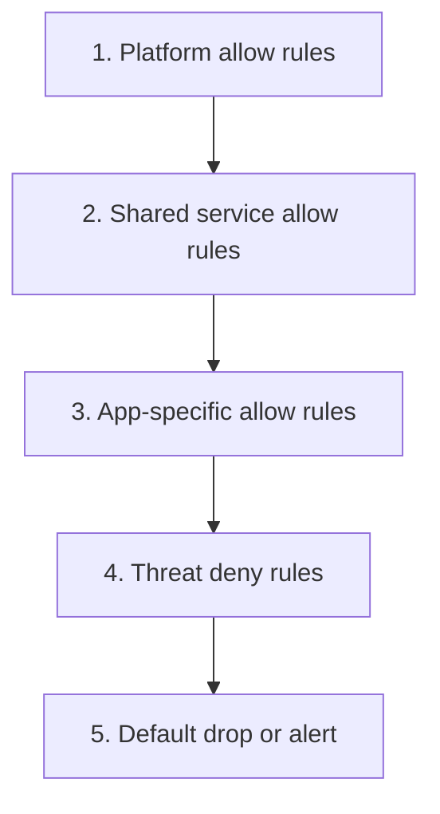

---

## 5. Domain-Based Egress Filtering

Domain-based filtering terlihat sederhana:

> “Izinkan `api.vendor.com`, blokir yang lain.”

Di produksi, ini rumit karena domain matching bergantung pada protokol dan metadata yang terlihat.

### 5.1 HTTP Host Header

Untuk HTTP plain-text, firewall bisa melihat Host header.

Masalah:

- traffic HTTP tidak terenkripsi;
- banyak layanan modern memakai HTTPS;
- Host header bisa tidak sama dengan final upstream jika ada proxy chain;
- HTTP/2 dan TLS termination mengubah visibility tergantung lokasi.

### 5.2 TLS SNI

Untuk HTTPS, firewall biasanya mengandalkan SNI pada TLS ClientHello.

Masalah:

- SNI menunjukkan nama server yang diminta, bukan URL path;
- encrypted client hello dapat mengurangi visibility pada masa depan;
- certificate SAN tidak selalu sama dengan domain aplikasi;
- CDN/SaaS multi-tenant bisa memakai domain luas;
- domain wildcard terlalu permisif.

### 5.3 DNS vs Firewall Domain Rule

DNS Firewall dan Network Firewall domain filtering berbeda.

| Layer | Tool | Apa yang dikontrol | Kelemahan |
|---|---|---|---|
| DNS | Route 53 Resolver DNS Firewall | domain resolution | tidak melihat traffic setelah IP diketahui/cache/DoH/external resolver |
| Network/TLS/HTTP | AWS Network Firewall | flow dan protocol metadata | tergantung visibility SNI/Host dan route path |
| Application | Proxy/API gateway | URL, method, auth context | butuh app-aware proxy architecture |

Defense-in-depth yang sehat:

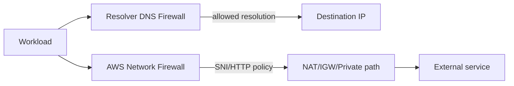

---

## 6. Deployment Pattern 1: Distributed Firewall per VPC

### 6.1 Kapan Cocok

Distributed firewall cocok ketika:

- workload VPC punya autonomy tinggi;
- volume traffic besar dan ingin menghindari centralized bottleneck;
- blast radius ingin kecil;
- policy berbeda per environment/application;
- tim platform menyediakan module/IaC standard.

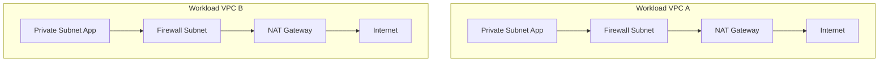

### 6.2 Kelebihan

- failure domain kecil;
- traffic tetap lokal di VPC/AZ;
- routing lebih mudah dipahami;
- cost data processing lintas VPC/TGW bisa lebih rendah untuk beberapa pola;
- rule bisa dekat dengan owner aplikasi.

### 6.3 Kekurangan

- policy sprawl;
- rule drift;
- deployment cost per VPC;
- observability tersebar;
- butuh automation kuat.

### 6.4 Invariant

Distributed bukan berarti tidak governed. Artinya enforcement point tersebar, tetapi policy lifecycle harus tetap standard.

---

## 7. Deployment Pattern 2: Centralized Inspection VPC dengan Transit Gateway

### 7.1 Kapan Cocok

Centralized inspection cocok ketika:

- organisasi ingin kontrol egress/east-west dari satu tempat;
- network team mengoperasikan shared inspection stack;
- banyak VPC kecil;
- compliance butuh central logging dan policy enforcement;
- traffic antar-VPC harus melewati inspection domain.

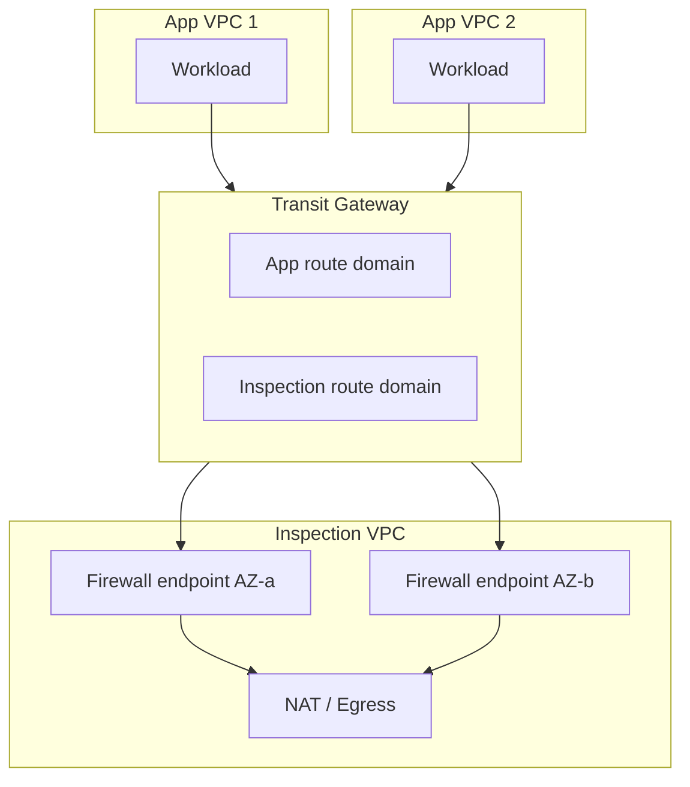

### 7.2 Route Table Design

Biasanya ada minimal dua jenis TGW route table:

| TGW route table | Attachment association | Route target |
|---|---|---|
| app route table | workload VPC attachments | default route atau selected CIDR ke inspection VPC attachment |
| inspection route table | inspection VPC attachment | workload CIDRs ke masing-masing workload attachment, default ke egress |

Di VPC inspection, route table subnet firewall/NAT harus menjaga path kembali simetris.

### 7.3 Appliance Mode

Untuk stateful appliance, return traffic harus kembali melewati firewall endpoint yang memahami flow tersebut. Pada desain TGW, appliance mode membantu menjaga traffic flow simetris ke appliance VPC.

Tanpa symmetry, kamu bisa melihat gejala:

- first packet allowed, return packet dropped;
- intermittent connectivity antar-AZ;
- TLS handshake timeout;
- flow logs ACCEPT tapi aplikasi timeout karena arah balik hilang;
- firewall state table tidak punya flow.

### 7.4 Kelebihan

- central policy;
- central logs;
- easier compliance evidence;
- less per-VPC operational overhead;
- cocok untuk shared egress dan east-west inspection.

### 7.5 Kekurangan

- routing complexity tinggi;
- TGW data processing cost;
- blast radius inspection VPC lebih besar;
- butuh desain multi-AZ matang;
- debugging butuh korelasi VPC route, TGW route, firewall logs, NAT logs/metrics, DNS.

---

## 8. Deployment Pattern 3: Egress Filtering

Egress filtering menjawab:

> “Workload ini boleh keluar ke mana, dengan protokol apa, dan lewat jalur apa?”

### 8.1 Baseline Architecture

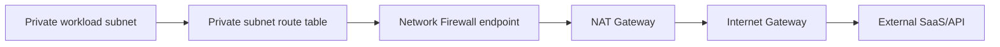

Route intent:

| Source subnet | Destination | Target |
|---|---|---|
| private app subnet | `0.0.0.0/0` | firewall endpoint |
| firewall subnet | `0.0.0.0/0` | NAT Gateway |
| NAT public subnet | `0.0.0.0/0` | Internet Gateway |

Untuk IPv6, path-nya berbeda. Jangan mengasumsikan NAT Gateway sebagai universal egress control untuk IPv6.

### 8.2 Egress Policy Layers

Layer sehat untuk egress:

1. Security Group outbound minimum;
2. DNS Firewall allow/deny domain resolution;
3. Network Firewall domain/IP/protocol enforcement;
4. NAT/IGW controlled egress path;
5. CloudWatch/firewall logs untuk evidence;
6. IaC policy registry untuk allowed external dependency.

### 8.3 Allowlist Reality

Egress allowlist yang terlalu ideal sering gagal karena SaaS modern memakai:

- CDN;
- dynamic IP ranges;
- multiple domains;
- OCSP/CRL dependencies;
- regional endpoint changes;
- redirect chains;
- telemetry endpoints;
- package registry dependencies.

Production approach:

- mulai dari observe/log mode;
- klasifikasikan destination;
- buat dependency registry;
- allow domain yang perlu;
- batasi wildcard;
- tambahkan exception expiry;
- review logs berkala;
- ubah default dari alert ke drop setelah confidence cukup.

---

## 9. Deployment Pattern 4: East-West Inspection

East-west inspection mengontrol traffic antar workload/network internal.

Contoh:

- app VPC ke database shared VPC;
- prod service ke shared service;
- account A ke account B;
- VPC ke on-prem;
- subnet regulated ke subnet non-regulated.

### 9.1 Pertanyaan Kunci

Sebelum memasang firewall east-west, jawab:

1. Apakah traffic benar-benar harus di-inspect atau cukup SG/TGW route segmentation?
2. Apakah protocol inspection memberi nilai dibanding allowlist IP/port?
3. Apakah latency tambahan acceptable?
4. Apakah route symmetry bisa dijamin?
5. Apakah ownership rule jelas?
6. Apakah log volume/cost dipahami?

### 9.2 Centralized East-West via TGW

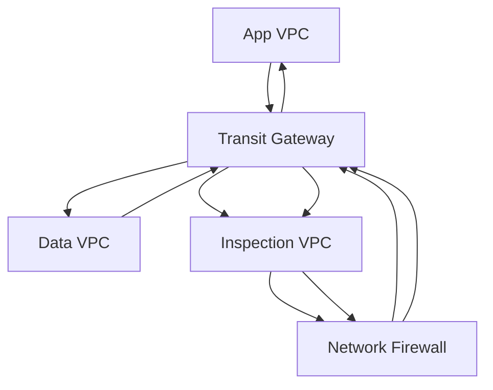

Anti-pattern paling umum: hanya forward request path ke firewall, tapi response path langsung antar VPC. Untuk stateful firewall, ini rusak.

---

## 10. Deployment Pattern 5: Ingress Inspection

Ingress inspection berarti traffic dari internet masuk melewati control layer sebelum workload.

Untuk HTTP/S public app, sering kali urutan yang lebih sehat:

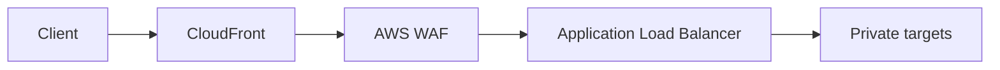

Network Firewall tidak menggantikan WAF. Network Firewall tidak memahami business-level HTTP semantics seperti WAF managed rules, bot controls, atau request body inspection di layer aplikasi.

Network Firewall ingress lebih relevan ketika:

- protocol bukan HTTP/S;
- butuh IP/protocol-level inspection;
- memakai GWLB/inspection architecture;
- traffic hybrid masuk dari DX/VPN/TGW;
- appliance-style filtering diperlukan.

Untuk web ingress, gunakan WAF/Shield/CloudFront/ALB sebagai primary app edge; Network Firewall bisa menjadi layer tambahan untuk network-level controls, bukan pengganti.

---

## 11. Rule Design: Dari Policy Intent ke Rule

Rule yang baik dimulai dari intent, bukan syntax.

### 11.1 Policy Intent Template

```yaml
id: egress.vendor.payment-api
owner: payments-platform
source:
  vpc: prod-payments-vpc
  subnets: app-private
  security_group: sg-payments-app
allowed_destination:
  domains:
    - api.payment-vendor.example
    - auth.payment-vendor.example
  protocols:
    - tls:443
reason: payment authorization and settlement
expiry: 2026-12-31
observability:
  log: true
  metric_filter: payment_vendor_egress
rollback:
  mode: alert-only
```

Baru setelah itu diturunkan menjadi DNS Firewall rule, Network Firewall stateful rule, SG outbound rule, atau proxy policy.

### 11.2 Rule Group Taxonomy

| Rule group | Owner | Isi |
|---|---|---|
| platform-baseline | platform/security | DNS, NTP, OS update, AWS service dependencies |
| threat-deny | security | threat intel, known bad IP/domain/signature |
| app-egress-prod | app team + security approval | approved SaaS/API dependency |
| regulated-deny | compliance/security | deny policy untuk regulated boundary |
| alert-canary | security | rules dalam alert mode sebelum enforce |

### 11.3 Jangan Menaruh Semua Rule di Satu Blob

Satu blob Suricata besar sulit di-review, sulit di-test, dan sulit dikaitkan ke ownership.

Lebih baik:

- rule group per concern;
- naming standard;
- ownership metadata;
- change review;
- test traffic;
- staged deployment;
- log-based verification.

---

## 12. Observability: Apa yang Harus Dilihat

Network Firewall logging bisa mencakup flow logs dan alert logs tergantung konfigurasi.

### 12.1 Yang Harus Ada di Dashboard

| Sinyal | Kenapa penting |
|---|---|
| dropped flows by source | menemukan workload yang melanggar egress policy |
| dropped flows by destination | menemukan dependency yang belum di-allow atau exfiltration attempt |
| top alerted signatures | menemukan noise atau threat pattern |
| rule group hit count | membuktikan rule aktif/berguna |
| packet/byte volume | kapasitas dan cost signal |
| firewall endpoint health | availability enforcement point |
| NAT metrics after firewall | korelasi egress path |
| TGW bytes by attachment | centralized inspection traffic/cost signal |

### 12.2 Correlation Checklist

Untuk satu koneksi gagal, kumpulkan:

1. source ENI/IP/subnet/AZ;
2. destination IP/domain/port;
3. DNS resolution result;
4. source subnet route table;
5. TGW route table jika lintas VPC;
6. firewall endpoint target;
7. firewall flow/alert logs;
8. NAT Gateway metrics/log correlation jika internet egress;
9. destination health;
10. application timeout/error.

---

## 13. Debugging Runbook: “Aplikasi Tidak Bisa Keluar ke Vendor API”

### Step 1 — Buktikan DNS

Dari workload atau debug pod/instance:

```bash
nslookup api.vendor.example
```

Pertanyaan:

- Apakah domain resolve?
- Resolver mana yang dipakai?
- Apakah DNS Firewall memblokir?
- Apakah hasilnya public IP, private endpoint, atau CDN IP?
- Apakah TTL/cache membuat hasil berbeda antar host?

### Step 2 — Buktikan Route Source

Periksa route table subnet workload:

| Destination | Expected target |
|---|---|
| vendor public IP / `0.0.0.0/0` | firewall endpoint, bukan langsung NAT |
| VPC local CIDR | local |
| AWS service endpoint prefix | gateway endpoint jika intended |

Jika `0.0.0.0/0` langsung ke NAT, firewall tidak melihat traffic.

### Step 3 — Buktikan Firewall Melihat Traffic

Cari firewall log berdasarkan:

- source IP;
- destination IP;
- destination port;
- timestamp;
- protocol.

Jika tidak ada log:

- route salah;
- traffic tidak dikirim;
- endpoint AZ berbeda/path asimetris;
- NACL/SG blokir sebelum firewall;
- DNS resolve ke path lain.

### Step 4 — Baca Action

Jika log menunjukkan drop:

- rule mana yang match?
- stateless atau stateful?
- apakah default drop?
- apakah SNI/Host tidak sesuai?
- apakah domain redirect ke domain lain?
- apakah TLS handshake tidak membawa SNI?

### Step 5 — Cek Return Path

Untuk stateful firewall, return path harus simetris.

Gejala return path salah:

- SYN keluar, SYN/ACK tidak terlihat;
- TLS timeout;
- intermittent antar-AZ;
- firewall sees one direction only;
- Flow Logs di destination accept, source timeout.

### Step 6 — Cek NAT/Internet

Jika firewall allow tetapi koneksi masih gagal:

- NAT route;
- NAT port exhaustion;
- NACL public NAT subnet;
- IGW route;
- destination firewall/vendor allowlist;
- TLS trust/certificate;
- proxy requirement.

---

## 14. Failure Modes yang Sering Terjadi

| Failure mode | Gejala | Akar masalah | Fix |
|---|---|---|---|
| Firewall bypass | rule tidak pernah hit | route table langsung ke NAT/TGW | steer route ke firewall endpoint |
| Asymmetric routing | timeout/intermittent | request/response lewat endpoint berbeda | per-AZ routing, TGW appliance mode |
| Domain rule tidak match | HTTPS drop | SNI tidak sesuai/redirect/wildcard kurang | capture SNI/log, allow dependency chain |
| Overblocking AWS APIs | app gagal pull image/secrets/log | egress default drop tanpa AWS dependency | VPC endpoints atau baseline allow rules |
| Centralized bottleneck | latency/cost naik | semua traffic hairpin ke inspection VPC | distributed endpoint atau scoped inspection |
| Rule chaos | sulit audit | semua rule di satu group | rule taxonomy + owner metadata |
| Alert noise | SOC ignore alert | no tuning/staging | baseline, suppress, severity tagging |
| IPv6 escape path | IPv6 traffic bypass policy | only IPv4 route inspected | dual-stack route/security design |

---

## 15. Cost Model

Network Firewall cost biasanya datang dari:

- firewall endpoint hourly;
- traffic processing;
- logging ingestion/storage;
- cross-AZ data transfer jika route hairpin;
- TGW data processing untuk centralized inspection;
- NAT Gateway data processing setelah firewall;
- operational overhead rule management.

Cost trap umum:

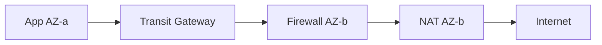

Traffic dari AZ-a diproses di AZ-b karena route atau endpoint placement buruk. Dampaknya:

- latency naik;
- cross-AZ charge;
- failure coupling;
- debugging lebih susah.

---

## 16. Security Invariants

Gunakan invariants ini sebagai review checklist:

1. **No route, no inspection.** Firewall hanya enforce traffic yang melewatinya.
2. **Stateful inspection requires symmetry.** Return path harus melewati stateful engine yang sama atau kompatibel.
3. **DNS is not traffic.** DNS allow tidak berarti traffic allow; traffic allow tidak berarti DNS allow.
4. **Domain filtering is metadata filtering.** Ia tidak sama dengan URL-level authorization.
5. **Default drop needs dependency discipline.** Semua dependency external harus dikenal.
6. **Centralization increases blast radius.** Governance lebih mudah, tapi outage impact lebih luas.
7. **Logs are part of the control.** Tanpa logs, kamu tidak bisa membuktikan enforcement.
8. **IPv6 is a separate path.** Jangan mengamankan IPv4 lalu lupa IPv6.

---

## 17. Reference Architecture: Regulated Egress VPC

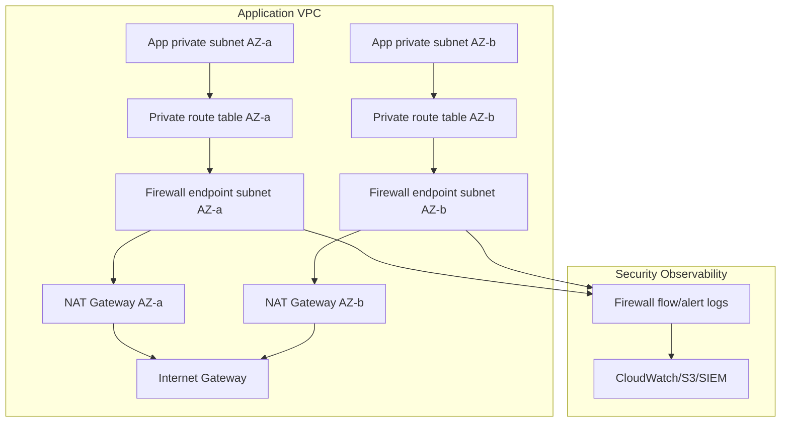

Design choices:

- per-AZ firewall endpoint;
- per-AZ NAT;
- private subnet default route to local firewall endpoint;
- firewall subnet route to local NAT;
- NAT subnet route to IGW;
- VPC endpoints for AWS APIs where possible;
- DNS Firewall for domain resolution control;
- Network Firewall for network/protocol enforcement;
- logs to central security account/SIEM.

---

## 18. Lab: Build a Minimal Egress Inspection Path

### Objective

Private EC2 instance can reach only approved HTTPS destination via Network Firewall.

### Topology

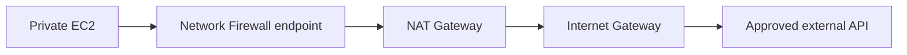

### Steps

1. Create VPC with two AZs.
2. Create private app subnets.
3. Create firewall subnets.
4. Create public NAT subnets.
5. Deploy NAT Gateway per AZ.
6. Deploy Network Firewall with endpoints per AZ.
7. Private app route table: `0.0.0.0/0` → firewall endpoint same AZ.
8. Firewall subnet route table: `0.0.0.0/0` → NAT Gateway same AZ.
9. NAT subnet route table: `0.0.0.0/0` → IGW.
10. Add stateful rules in alert mode first.
11. Generate HTTPS traffic to approved and unapproved domains.
12. Verify logs.
13. Change default to drop or add deny rules.
14. Re-test.

### Validation

| Test | Expected |
|---|---|
| approved domain HTTPS | succeeds |
| unapproved domain HTTPS | blocked/logged |
| direct AWS API without endpoint | either allowed via baseline or blocked intentionally |
| route to NAT bypass | should not exist |
| firewall logs | show source/destination/action |

---

## 19. Production Readiness Checklist

Before production rollout:

- [ ] Rule ownership documented.
- [ ] Default action strategy defined: alert-first or drop-first.
- [ ] Per-AZ endpoint design reviewed.
- [ ] Route symmetry verified.
- [ ] TGW appliance mode reviewed if centralized.
- [ ] IPv6 path reviewed.
- [ ] DNS Firewall interaction reviewed.
- [ ] VPC endpoint bypass paths reviewed.
- [ ] NAT cost and port exhaustion reviewed.
- [ ] Logs enabled and queryable.
- [ ] Dashboard and alarms configured.
- [ ] Emergency bypass/rollback plan approved.
- [ ] IaC tests validate route targets.
- [ ] Synthetic traffic tests validate allowed/denied paths.

---

## 20. Key Takeaways

AWS Network Firewall is not “a better Security Group”. It is a managed inspection appliance inserted into packet paths through routing.

The hardest parts are not rule syntax. The hardest parts are:

- deciding what traffic must be inspected;
- forcing route symmetry;
- avoiding bypass paths;
- governing rule ownership;
- handling domain/SNI/DNS realities;
- proving behavior through logs;
- keeping cost and blast radius under control.

A top-tier engineer treats Network Firewall as a stateful distributed system component. It has placement, state, logs, failure modes, scaling behavior, and organizational ownership. That is the level where design becomes production-grade.

---

## References

- AWS Network Firewall — What is AWS Network Firewall: https://docs.aws.amazon.com/network-firewall/latest/developerguide/what-is-aws-network-firewall.html
- AWS Network Firewall — Stateless and stateful rules engines: https://docs.aws.amazon.com/network-firewall/latest/developerguide/firewall-rules-engines.html
- AWS Network Firewall — Working with stateless rule groups: https://docs.aws.amazon.com/network-firewall/latest/developerguide/stateless-rule-groups-standard.html
- AWS Network Firewall — Working with stateful rule groups: https://docs.aws.amazon.com/network-firewall/latest/developerguide/stateful-rule-groups-ips.html
- AWS Network Firewall — Managing evaluation order for Suricata compatible rules: https://docs.aws.amazon.com/network-firewall/latest/developerguide/suricata-rule-evaluation-order.html
- AWS Security Services Best Practices — AWS Network Firewall: https://aws.github.io/aws-security-services-best-practices/guides/network-firewall/
