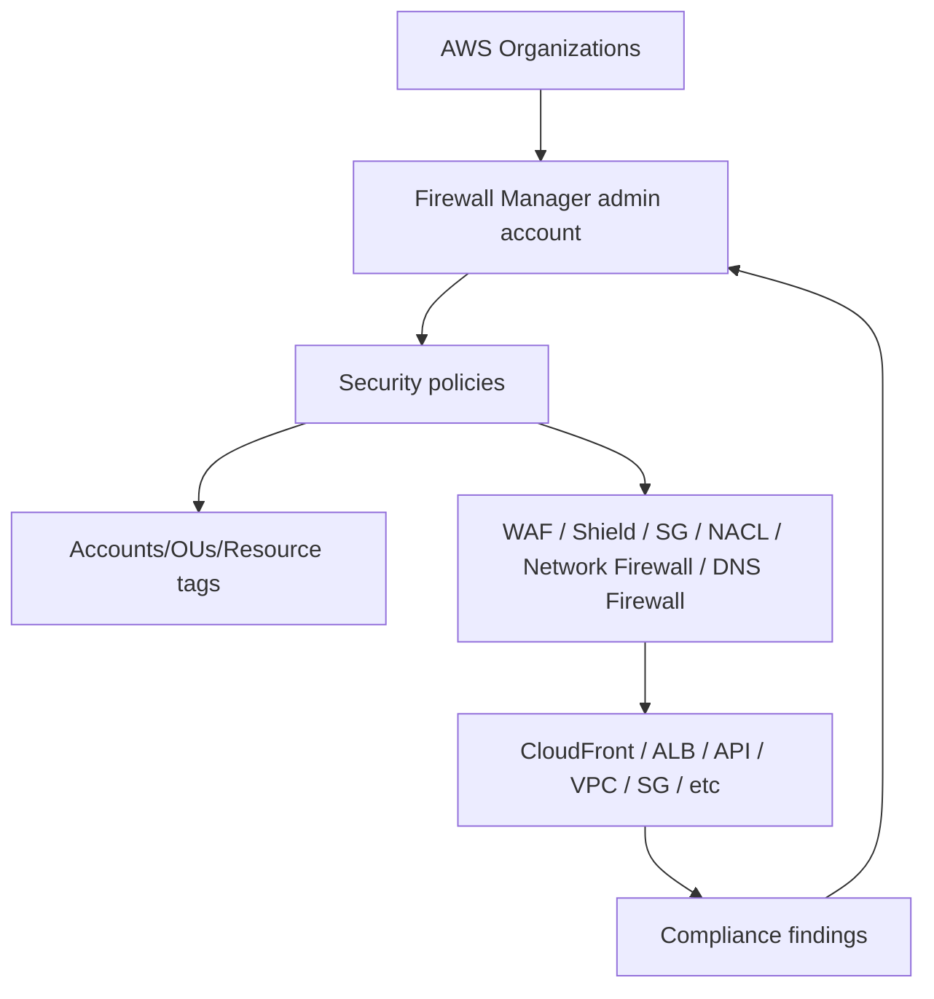
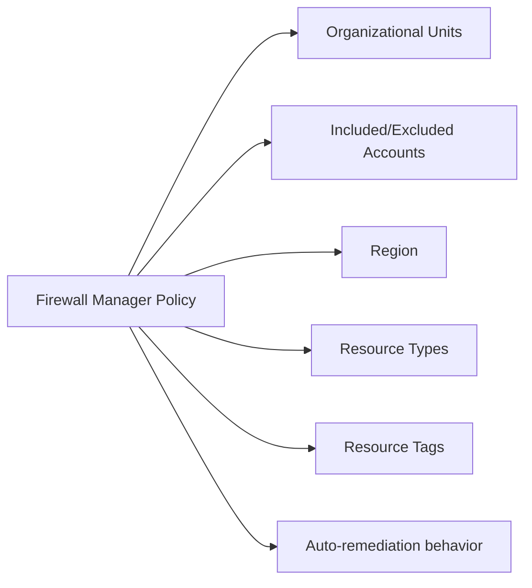
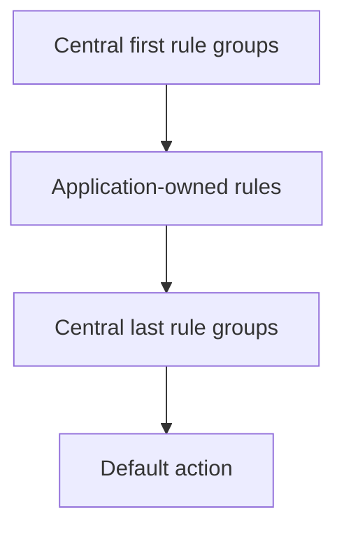
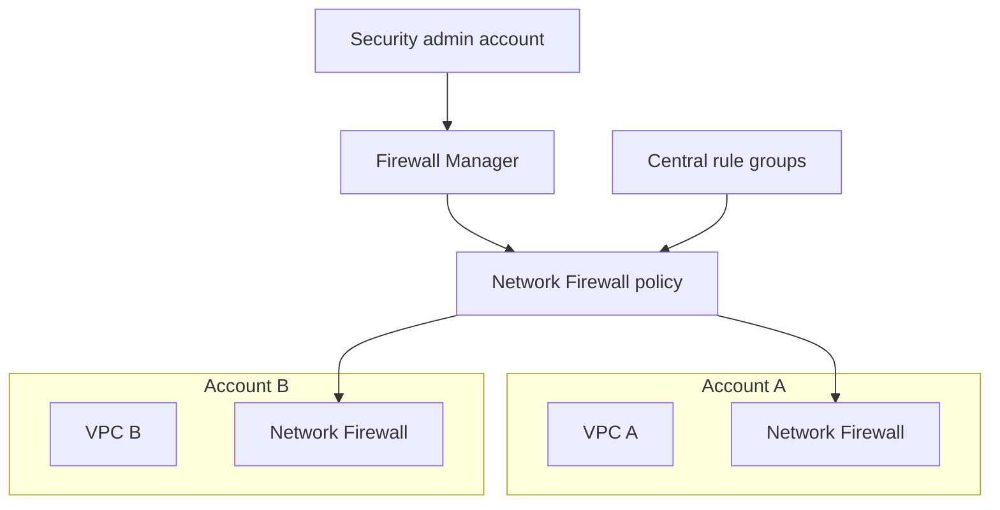
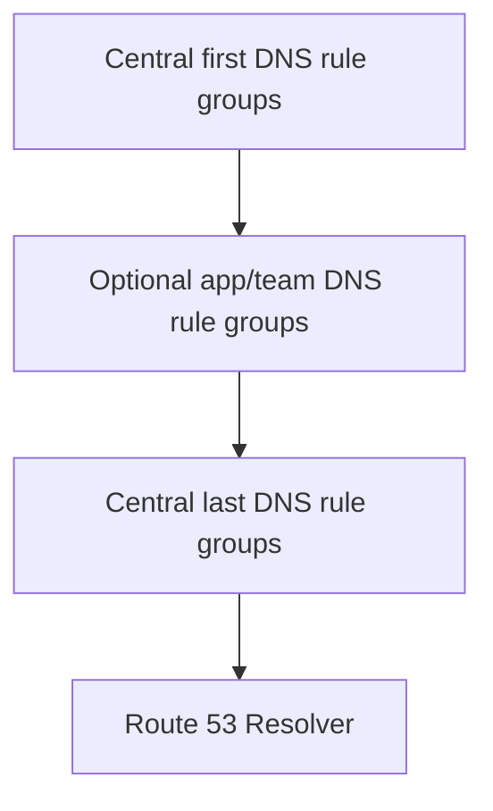
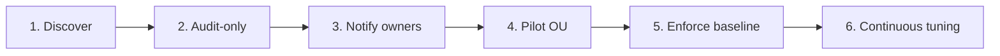
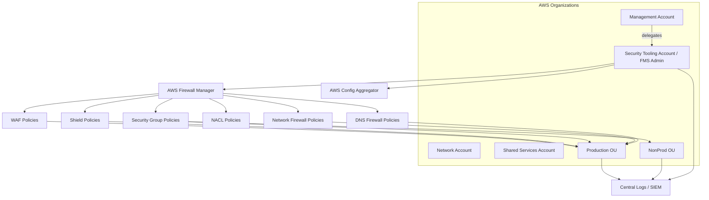

# Part 070 — Firewall Manager and Policy Governance

> Goal part ini: kamu bisa memakai **AWS Firewall Manager** sebagai governance layer untuk organisasi multi-account, bukan sekadar fitur untuk “apply WAF rule ke banyak account”.

Firewall Manager adalah jawaban untuk problem yang muncul setelah kamu punya banyak account, banyak VPC, banyak ALB/API/CloudFront distribution, banyak security group, banyak DNS Firewall association, dan banyak tim aplikasi:

> Bagaimana memastikan kontrol network security tetap konsisten saat resource terus dibuat oleh puluhan tim?

Tanpa governance layer, security posture akan berubah menjadi kumpulan exception:

- beberapa ALB lupa WAF;
- beberapa CloudFront distribution pakai rule lama;
- beberapa VPC belum punya DNS Firewall;
- beberapa security group terlalu permissive;
- beberapa Network Firewall policy berbeda tanpa alasan;
- akun baru belum ikut baseline;
- environment dev/test/prod drift;
- audit evidence dikumpulkan manual.

Firewall Manager mengubah pendekatan dari **resource-by-resource configuration** menjadi **organization-scoped security policy**.

---

## 1. Mental Model: Firewall Manager Bukan Firewall

Firewall Manager bukan packet-processing firewall. Ia tidak melihat packet dan tidak memutuskan allow/drop pada data plane.

Firewall Manager adalah **policy orchestration and compliance control plane**.



Core idea:

> Firewall Manager manages where and how protection policies are applied across accounts and resources.

Ia bukan pengganti WAF, Shield, Network Firewall, DNS Firewall, Security Group, atau NACL. Ia mengatur deployment dan compliance layanan-layanan itu.

---

## 2. Problem yang Diselesaikan Firewall Manager

### 2.1 Resource Sprawl

Di organisasi multi-account, resource muncul terus:

- new CloudFront distribution;
- new ALB;
- new API Gateway stage;
- new VPC;
- new security group;
- new account under workload OU;
- new region enabled;
- new application team deploy stack.

Manual review tidak scale.

### 2.2 Policy Drift

Drift terjadi ketika resource awalnya comply, lalu berubah:

- Web ACL dilepas;
- managed rule group version berubah;
- security group rule ditambah manual;
- DNS Firewall association hilang;
- VPC baru tidak punya firewall baseline;
- Network Firewall policy tidak sama antar account.

Firewall Manager membantu mendeteksi dan, untuk tipe policy tertentu, melakukan remediation atau association otomatis.

### 2.3 Evidence Gap

Audit bertanya:

- Resource mana yang dilindungi WAF?
- Account mana yang belum comply?
- Apakah semua VPC prod punya DNS Firewall?
- Apakah SG public inbound 0.0.0.0/0:22 masih ada?
- Apakah Shield Advanced diterapkan ke edge resources penting?

Tanpa central policy, evidence menjadi query manual lintas account.

---

## 3. Prerequisites dan Administrative Model

AWS dokumentasi Firewall Manager menyebut prerequisite penting seperti AWS Organizations, default administrator account, AWS Config, dan resource sharing untuk beberapa policy type.

### 3.1 AWS Organizations

Firewall Manager bekerja pada scope organisasi.

Scope bisa berbasis:

- entire organization;
- Organizational Unit/OUs;
- account include/exclude;
- resource tags;
- resource type;
- Region.

### 3.2 Firewall Manager Administrator

Management account menyiapkan Firewall Manager administrator. Praktik sehat:

- jangan operasikan harian dari management/root-like account;
- gunakan delegated security tooling account;
- batasi administrative scope jika organisasi besar;
- pisahkan pembuat policy dan approver;
- log semua perubahan policy.

### 3.3 AWS Config

Firewall Manager memakai AWS Config untuk inventory/compliance visibility pada banyak skenario. Tanpa Config yang sehat, governance visibility menjadi bolong.

Checklist:

- AWS Config enabled di account/Region target;
- recorder mencakup resource yang perlu;
- delivery channel/logging siap;
- aggregator/security account disiapkan jika perlu;
- cost Config dipahami.

### 3.4 AWS RAM untuk Beberapa Policy

Untuk Network Firewall dan DNS Firewall policy tertentu, resource sharing via AWS RAM bisa relevan agar Firewall Manager dapat mengatur resource lintas account sesuai model policy.

---

## 4. Policy Types yang Dikelola Firewall Manager

AWS Firewall Manager dapat mengelola berbagai protection type. Yang relevan untuk seri networking/content delivery:

| Policy type | Data-plane service | Primary use case |
|---|---|---|
| AWS WAF policy | AWS WAF | enforce Web ACL/rule groups pada CloudFront/ALB/API/etc |
| Shield Advanced policy | AWS Shield Advanced | DDoS protection governance untuk edge/public resources |
| Security group policy | Amazon VPC Security Groups | audit/enforce SG baseline dan common rules |
| Network ACL policy | VPC Network ACLs | subnet-level guardrail governance |
| AWS Network Firewall policy | AWS Network Firewall | centralized/distributed firewall deployment governance |
| Route 53 Resolver DNS Firewall policy | DNS Firewall | DNS egress filtering governance untuk VPC |
| Third-party firewall policy | Marketplace firewall integrations | centralized management third-party firewall protection |

Firewall Manager paling berguna ketika policy perlu diterapkan lintas account/resource secara konsisten.

---

## 5. Scope: Bagian Terpenting yang Sering Diremehkan

Policy yang salah scope bisa lebih berbahaya daripada tidak ada policy.

### 5.1 Scope Dimensions



Pertanyaan desain:

1. Apakah policy untuk semua account atau hanya prod OU?
2. Apakah sandbox/developer account dikecualikan?
3. Apakah scope berbasis tag cukup trustworthy?
4. Apa yang terjadi untuk resource tanpa tag?
5. Apakah policy enforce atau audit-only?
6. Apakah resource existing dan future resource otomatis masuk?
7. Apakah CloudFront global butuh treatment khusus?

### 5.2 Tag-Based Scope Trap

Tag-based policy terlihat fleksibel, tapi tag bisa:

- tidak ada;
- salah eja;
- berubah;
- tidak enforced;
- dibuat setelah resource deploy;
- dimanipulasi untuk menghindari control.

Jika tag dipakai untuk security scope, wajib ada tag governance:

- SCP atau tag policy;
- IaC validation;
- resource creation guardrail;
- periodic drift detection;
- default-deny untuk untagged critical resources.

---

## 6. AWS WAF Policy Governance

Firewall Manager WAF policy membantu memastikan resource tertentu punya Web ACL/rule baseline.

### 6.1 Pattern: Central Baseline + App-Owned Middle Rules

AWS WAF policy model dapat mengatur rule groups yang berjalan lebih dulu dan terakhir, sementara account owner dapat menambahkan rule di tengah pada beberapa model.



Pattern ini penting untuk balance:

- central team enforce baseline security;
- app team tetap bisa menambahkan allow/block khusus aplikasi;
- emergency global block bisa ditempatkan di first/last group;
- audit tahu baseline selalu hadir.

### 6.2 WAF Policy Use Cases

| Use case | Policy intent |
|---|---|
| semua ALB internet-facing harus punya Web ACL | prevent unprotected public app |
| CloudFront distribution production wajib managed rules | global edge baseline |
| rate limit default untuk API public | abuse protection |
| block country/ASN tertentu untuk app tertentu | regional compliance/policy |
| log semua sampled/blocked requests | forensic evidence |

### 6.3 Pitfall

- managed rule false positive bisa memutus app;
- policy terlalu luas menerapkan WAF ke resource internal yang tidak butuh;
- app team tidak punya proses exception;
- logging cost tidak dihitung;
- WAF on ALB vs CloudFront double evaluation tidak dirancang.

---

## 7. Shield Advanced Policy Governance

Shield Advanced governance relevan untuk resource public/edge penting.

### 7.1 Resource Candidates

- CloudFront distribution;
- Route 53 hosted zone;
- Global Accelerator accelerator;
- Elastic IP;
- ALB;
- Classic Load Balancer.

### 7.2 Policy Intent

```yaml
policy: prod-edge-ddos-protection
scope:
  ou: production
  resource_tags:
    exposure: public
    criticality: high
protection:
  shield_advanced: enabled
  waf_integration: required_where_supported
response:
  escalation: security-incident-channel
```

### 7.3 Design Notes

DDoS governance bukan hanya “enable Shield”. Kamu juga butuh:

- origin protection;
- WAF logging;
- health checks;
- incident contact path;
- runbook untuk sudden traffic surge;
- clarity antara legitimate spike dan attack;
- cost protection expectation.

---

## 8. Security Group Policy Governance

Security Group policy di Firewall Manager membantu mengatur common security group behavior dan audit rules.

### 8.1 Tiga Masalah SG di Organisasi Besar

1. **Permissive ingress**: `0.0.0.0/0` ke SSH/RDP/database.
2. **Unused SG sprawl**: ribuan SG tidak dipakai tapi tetap membingungkan audit.
3. **Common baseline drift**: app SG tidak punya required inbound/outbound baseline.

### 8.2 Policy Modes

Firewall Manager mendukung security group policy untuk common policy, content audit, dan usage audit pattern.

Gunakan secara berbeda:

| Need | Pattern |
|---|---|
| semua resource punya common baseline SG | common security group policy |
| cari SG dengan rule berbahaya | content audit policy |
| cari SG tidak digunakan/redundan | usage audit policy |

### 8.3 Guardrail Examples

- no inbound SSH/RDP from internet;
- no database port from internet;
- no `0.0.0.0/0` to admin ports;
- no `::/0` equivalent forgotten for IPv6;
- required SG attached to public ALB;
- audit SG unused > N days.

### 8.4 Pitfall

Security Group adalah resource-level firewall. Jangan mencoba memakai SG policy untuk menyelesaikan semua segmentation problem. Untuk cross-account routing domain, tetap butuh VPC/TGW/PrivateLink/Lattice design.

---

## 9. Network ACL Policy Governance

NACL policy governance cocok untuk subnet-level guardrail yang harus konsisten.

Use cases:

- deny known-bad CIDR di subnet class tertentu;
- subnet public punya baseline NACL;
- regulated subnet punya explicit deny boundary;
- subnet DMZ punya stricter stateless policy;
- audit NACL yang terlalu permissive.

Caution:

NACL stateless. Firewall Manager bisa membantu governance, tapi rule NACL yang salah bisa memutus return traffic.

Checklist sebelum enforce NACL policy:

- ephemeral ports dipahami;
- inbound dan outbound return path diuji;
- IPv4 dan IPv6 rules lengkap;
- ordering rule number konsisten;
- exception strategy tersedia;
- staged rollout audit-only dulu.

---

## 10. Network Firewall Policy Governance

Firewall Manager dapat membantu menerapkan AWS Network Firewall protection ke VPC organisasi.

### 10.1 Problem yang Diselesaikan

- setiap VPC harus punya inspection path;
- firewall policy baseline harus sama;
- rule group centrally managed;
- new VPC otomatis masuk baseline;
- compliance status visible;
- distributed deployment tetap governed.

### 10.2 Pattern: Distributed Firewall, Central Policy



Kelebihan:

- enforcement dekat workload;
- central governance;
- policy reuse;
- less manual drift.

Trade-off:

- per-VPC endpoint cost;
- route table integration tetap harus benar;
- exception handling perlu proses;
- logs harus dikirim central.

### 10.3 Pattern: Central Inspection VPC Governance

Firewall Manager bisa menjadi bagian governance, tapi centralized inspection tetap membutuhkan TGW route design, appliance mode, route symmetry, dan ownership route table. Firewall Manager tidak otomatis membuat arsitektur routing kamu benar.

Ingat:

> Firewall Manager manages policy application. It does not remove the need to design packet paths.

---

## 11. DNS Firewall Policy Governance

DNS Firewall policy membantu menerapkan Resolver DNS Firewall rule group associations ke VPC dalam scope.

### 11.1 Use Cases

- block malware/phishing domains across all VPCs;
- allowlist DNS for regulated workloads;
- prevent DNS-based exfiltration;
- enforce known resolver path;
- apply domain lists consistently across new VPCs.

### 11.2 Policy Layering



Be careful with priority. DNS policy order can change behavior materially.

### 11.3 DNS Firewall and Network Firewall Together

DNS Firewall blocks name resolution. Network Firewall inspects traffic. Keduanya saling melengkapi.

Example:

| Scenario | DNS Firewall | Network Firewall |
|---|---|---|
| malware domain known | block query | may never see traffic |
| direct IP exfiltration | cannot help | can block IP/port/flow |
| DoH to external resolver | may not see domain query | can block DoH destination |
| approved SaaS domain | allow query | allow SNI/flow |

---

## 12. Compliance vs Remediation

Firewall Manager policy bisa digunakan dalam dua gaya operasional:

### 12.1 Audit-First

- detect non-compliant resources;
- notify owner;
- create ticket;
- measure blast radius;
- tune policy;
- then enforce.

Cocok untuk:

- legacy estate;
- unknown app behavior;
- high false positive risk;
- first rollout.

### 12.2 Auto-Remediation

- automatically attach Web ACL;
- automatically apply SG policy;
- automatically associate DNS Firewall rule group;
- automatically protect future resources.

Cocok untuk:

- mature baseline;
- new accounts/resources;
- low-risk standardized controls;
- compliance-mandated posture.

### 12.3 Rollout Ladder



Jangan mulai dari enforce global jika kamu belum punya inventory, exception process, dan rollback path.

---

## 13. Exception Management

Policy tanpa exception process akan dilawan. Exception tanpa expiry akan menjadi permanent bypass.

### 13.1 Exception Template

```yaml
exception_id: fms-waf-2026-0042
policy: prod-public-alb-waf-baseline
resource: arn:aws:elasticloadbalancing:...
owner: checkout-platform
reason: managed rule false positive on legacy callback payload
risk_acceptor: head-of-platform-security
expires_at: 2026-08-31
compensating_controls:
  - custom WAF rule limiting source IP range
  - enhanced logging enabled
review:
  cadence: weekly
```

### 13.2 Exception Classes

| Class | Example | Max lifetime |
|---|---|---|
| deployment exception | app migration belum siap | short |
| false positive exception | WAF managed rule blocks valid request | medium with fix plan |
| architecture exception | resource type incompatible | reviewed quarterly |
| emergency exception | incident workaround | hours/days |

---

## 14. Organizational Operating Model

Firewall Manager succeeds or fails based on operating model.

### 14.1 Roles

| Role | Responsibility |
|---|---|
| Security platform team | define baseline policy, manage FMS admin, own evidence |
| Network platform team | route/firewall topology, TGW/VPC integration |
| Application team | resource owner, app-specific rules, exception justification |
| Governance/risk | approve exceptions, review compliance |
| SRE/operations | respond to alarms/incidents |

### 14.2 RACI Example

| Activity | Security | Network | App | Governance |
|---|---|---|---|---|
| WAF baseline rule group | A/R | C | C | C |
| ALB tagged public/internal | C | C | R | I |
| Network Firewall route design | C | A/R | C | I |
| DNS Firewall domain list | A/R | C | C | C |
| Exception approval | R | C | R | A |
| Incident response | R | R | C | I |

A = accountable, R = responsible, C = consulted, I = informed.

---

## 15. IaC and Policy-as-Code

Firewall Manager policy should be code-reviewed like production application code.

Recommended repository structure:

```text
security-governance/
  firewall-manager/
    policies/
      waf-prod-public.yml
      dns-firewall-baseline.yml
      network-firewall-prod.yml
      sg-audit-admin-ports.yml
    rule-groups/
      waf/
      dns-firewall/
      network-firewall/
    exceptions/
      active/
      expired/
    tests/
      policy-scope-tests/
      rule-regression-tests/
```

### 15.1 Tests to Write

- policy targets correct OUs;
- sandbox OU excluded where intended;
- prod OU included;
- CloudFront global policy uses correct Region semantics;
- tags required for scope are enforced;
- no policy has broad exception without expiry;
- WAF log destination exists;
- DNS Firewall default domain list attached;
- Network Firewall rule groups use approved order;
- SG audit policy flags admin ports.

### 15.2 CI Gates

Pull request should show:

- affected accounts/OUs;
- affected resource types;
- enforcement mode change;
- estimated log/cost impact;
- rollback plan;
- exception diff;
- test results.

---

## 16. Observability and Evidence

Firewall Manager gives compliance posture, but you still need service-specific logs.

| Control | Evidence source |
|---|---|
| WAF baseline attached | Firewall Manager compliance + WAF config/logs |
| Shield Advanced enabled | Firewall Manager policy + Shield events |
| SG admin port blocked | FMS SG audit findings + EC2 SG config |
| DNS Firewall associated | FMS compliance + Resolver query logs |
| Network Firewall deployed | FMS compliance + firewall flow/alert logs |
| NACL guardrail applied | FMS compliance + VPC config/Flow Logs |

Compliance evidence has two levels:

1. **configuration evidence**: policy attached/applied;
2. **runtime evidence**: traffic/request/log proves control works.

Audit yang matang butuh keduanya.

---

## 17. Failure Modes

| Failure mode | Gejala | Penyebab | Mitigasi |
|---|---|---|---|
| Account baru tidak terlindungi | resource baru non-compliant | OU/scope salah atau Config belum aktif | organization bootstrap pipeline |
| Tag bypass | resource tanpa policy | scope hanya tag dan tag tidak enforced | tag policy/SCP/default inclusion |
| WAF false positive global | banyak app error 403 | enforce rule tanpa pilot | count mode/pilot OU/exception process |
| DNS outage | app gagal resolve dependency | DNS Firewall block terlalu agresif | alert-first, query logs, staged rollout |
| Network Firewall deployed but bypassed | compliance OK tapi traffic tidak filtered | route table tidak diarahkan | route compliance tests |
| CloudFront not covered | edge distribution missing policy | global/Region scope salah | separate CloudFront policy handling |
| Exception sprawl | baseline melemah | exception tanpa expiry | exception registry with expiration |
| Config blind spot | compliance tidak akurat | AWS Config disabled/incomplete | Config conformance baseline |

---

## 18. Runbook: Public ALB Tidak Punya WAF

### Situation

Security dashboard menunjukkan public ALB di prod OU tidak comply dengan WAF policy.

### Step 1 — Confirm Resource Identity

- account ID;
- Region;
- ALB ARN;
- tags;
- internet-facing/internal scheme;
- owner team;
- creation time.

### Step 2 — Check Policy Scope

- apakah account ada di OU target?
- apakah Region policy benar?
- apakah resource type ALB included?
- apakah tag include/exclude match?
- apakah resource masuk exception?

### Step 3 — Check Remediation Mode

- audit-only atau auto-remediate?
- jika auto, kenapa gagal?
- permission/service-linked role issue?
- WAF quota issue?
- conflict dengan existing Web ACL?

### Step 4 — Apply/Remediate

- attach required Web ACL;
- confirm WAF logs active;
- test application path;
- watch 4xx/5xx;
- notify owner.

### Step 5 — Prevent Recurrence

- enforce IaC module default;
- add CI check for public ALB without WAF tag/policy;
- update account bootstrap;
- review tag governance.

---

## 19. Runbook: DNS Firewall Policy Blocking Production Dependency

### Situation

App suddenly cannot reach external SaaS. DNS query returns block response or NXDOMAIN-like behavior.

### Step 1 — Confirm DNS Layer

- query from workload;
- check Route 53 Resolver query logs;
- identify matched DNS Firewall rule group/rule;
- check policy priority.

### Step 2 — Confirm Scope

- is VPC under newly enforced policy?
- was account moved to prod OU?
- did rule list update recently?
- did domain change from vendor side?

### Step 3 — Decide Immediate Action

Options:

- add temporary allow exception with expiry;
- rollback rule group version;
- switch policy to alert/count mode if systemic;
- route dependency through approved proxy if policy requires.

### Step 4 — Permanent Fix

- add vendor dependency to registry;
- include all required domains;
- test in pre-prod;
- document owner/risk;
- expire temporary exception.

---

## 20. Governance Architecture Reference



Key properties:

- delegated admin, not daily management account use;
- Config enabled as baseline;
- policies scoped by OU/resource type/tag carefully;
- logs centralized;
- exceptions tracked as code/data;
- account bootstrap ensures new accounts are ready;
- compliance monitored continuously.

---

## 21. Design Decision Matrix

| Question | Prefer Firewall Manager when... | Prefer local service config when... |
|---|---|---|
| Is this a baseline control? | yes, applies broadly | no, one-off app behavior |
| Does resource appear frequently? | yes, many teams create it | no, rare static resource |
| Is central audit required? | yes | no |
| Does false positive risk exist? | use audit/count/pilot first | app team may tune locally |
| Does policy need exceptions? | yes, with registry | yes, but limited local override |
| Is routing topology involved? | FMS can govern, but design separately | local IaC may be clearer |

---

## 22. Top-Tier Engineering Perspective

Firewall Manager is not about “central security wants control”. It is about **making security invariants durable under organizational scale**.

The real engineering problem is not creating a WAF rule. It is ensuring that:

- future resources inherit the right protection;
- account moves do not break compliance;
- exceptions expire;
- false positives are managed safely;
- logs and evidence exist;
- enforcement mode changes are reviewed;
- local autonomy and central guardrails coexist;
- the organization can answer “are we protected?” with evidence, not hope.

This is why Firewall Manager belongs in an advanced networking/content-delivery series. At small scale, you configure services. At large scale, you govern systems that create services.

---

## 23. Production Readiness Checklist

- [ ] AWS Organizations configured.
- [ ] Firewall Manager administrator/delegated admin set.
- [ ] AWS Config enabled in target accounts/Regions.
- [ ] Account bootstrap includes Config/FMS prerequisites.
- [ ] Policies represented as code.
- [ ] Scope tested for OUs/accounts/tags/resource types.
- [ ] CloudFront/global policy handling reviewed.
- [ ] Audit-only rollout completed before broad enforcement.
- [ ] Exception process with expiry implemented.
- [ ] Central logs/SIEM integration implemented.
- [ ] App owner notification path defined.
- [ ] Rollback plan for each policy type defined.
- [ ] Dashboards show compliance and runtime logs.
- [ ] New account onboarding test exists.
- [ ] Periodic policy review scheduled.

---

## 24. Key Takeaways

Firewall Manager is the governance layer for distributed security controls.

It answers:

- which accounts/resources must be protected;
- which policy baseline applies;
- whether resource drift is acceptable;
- whether remediation should happen automatically;
- whether the organization can prove compliance.

It does not replace good network architecture. It does not fix broken routing. It does not remove the need for WAF/Shield/Network Firewall/DNS Firewall expertise. It makes those controls scalable across accounts and resources.

At top-tier engineering level, Firewall Manager is part of the **control-plane architecture** for network security.

---

## References

- AWS Firewall Manager — Overview: https://docs.aws.amazon.com/waf/latest/developerguide/fms-chapter.html
- AWS Firewall Manager — Prerequisites: https://docs.aws.amazon.com/waf/latest/developerguide/fms-prereq.html
- AWS Firewall Manager — Administrators: https://docs.aws.amazon.com/waf/latest/developerguide/fms-administrators.html
- AWS Firewall Manager — Using policies: https://docs.aws.amazon.com/waf/latest/developerguide/working-with-policies.html
- AWS Firewall Manager — Creating policies: https://docs.aws.amazon.com/waf/latest/developerguide/create-policy.html
- AWS Firewall Manager — Security group policies: https://docs.aws.amazon.com/waf/latest/developerguide/security-group-policies.html
