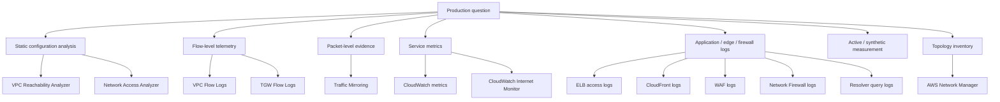
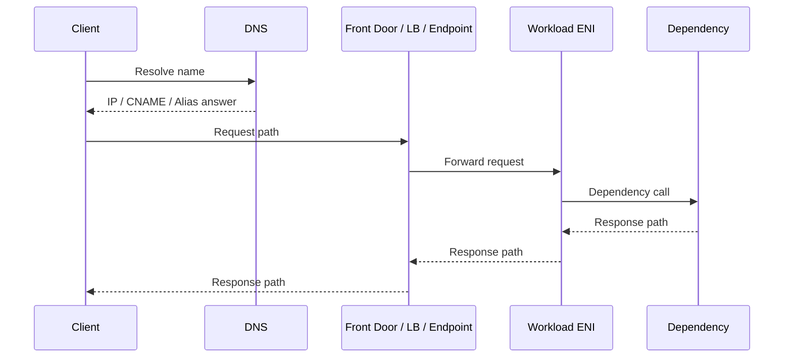
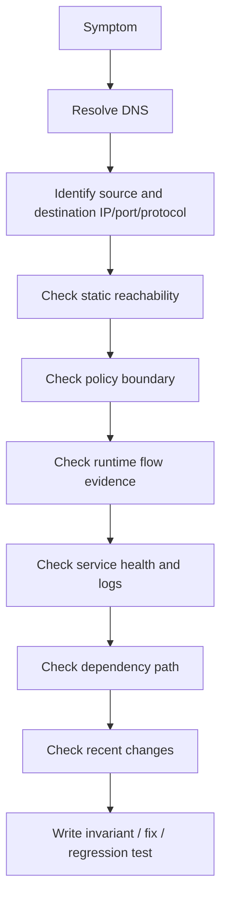
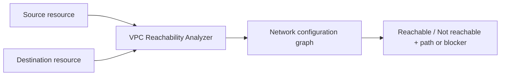
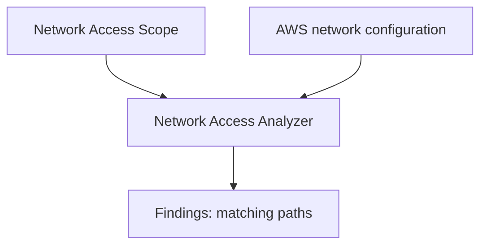
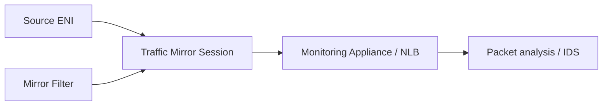
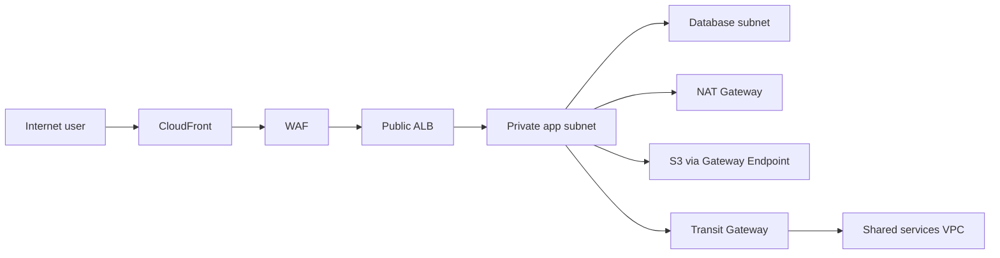

# Part 071 — Network Observability and Reachability

> Goal part ini: kamu bisa membuktikan **apakah traffic seharusnya bisa lewat**, **apakah traffic benar-benar lewat**, **di mana traffic berhenti**, dan **apakah jalur traffic sesuai intensi arsitektur**.

Di networking, debugging yang buruk biasanya terdengar seperti ini:

> “Kayaknya Security Group-nya.”

Atau:

> “Mungkin DNS.”

Atau:

> “Coba buka port dulu.”

Engineer production-grade tidak menebak seperti itu. Mereka memisahkan problem menjadi beberapa pertanyaan yang bisa dibuktikan:

1. **Name resolution**: nama yang dipakai aplikasi resolve ke IP apa?
2. **Intended path**: berdasarkan konfigurasi saat ini, path apa yang seharusnya dipilih?
3. **Policy decision**: control mana yang allow/deny?
4. **Runtime evidence**: packet/flow benar-benar terlihat di mana?
5. **Application interpretation**: error aplikasi muncul karena network, TLS, auth, timeout, atau protocol?
6. **Blast radius**: apakah masalah lokal ke subnet/AZ/VPC/account/Region/edge/on-prem?
7. **Regression source**: perubahan apa yang mengubah path, policy, DNS, capacity, atau target health?

Part ini membangun toolkit observability untuk menjawab pertanyaan-pertanyaan itu tanpa ritual trial-and-error.

---

## 1. Mental Model: Network Observability Bukan Satu Log

Network observability di AWS adalah gabungan dari beberapa kelas sinyal.



Jangan mencari “satu tool yang bisa menjawab semua”. Tidak ada.

Setiap tool menjawab pertanyaan berbeda:

| Pertanyaan | Sinyal utama | Contoh tool |
|---|---|---|
| Konfigurasi memungkinkan traffic? | Static analysis | Reachability Analyzer |
| Ada path yang melanggar policy? | Static reasoning | Network Access Analyzer |
| Packet/flow terlihat dari/ke ENI? | Flow telemetry | VPC Flow Logs |
| Path melewati TGW? | Transit telemetry | TGW Flow Logs, TGW metrics |
| Packet actual seperti apa? | Packet evidence | Traffic Mirroring |
| User internet mengalami latency/loss? | Internet performance telemetry | CloudWatch Internet Monitor |
| Edge/origin error? | L7 logs | CloudFront/ALB/WAF logs |
| DNS query resolve ke mana? | DNS telemetry | Route 53 Resolver query logs |
| Topologi global berubah? | Topology/events | AWS Network Manager |

Rule of thumb:

> Static analysis membuktikan **what should happen**. Runtime telemetry membuktikan **what did happen**. Application logs menjelaskan **what the application thought happened**.

Ketiganya harus digabung.

---

## 2. Observability Invariant untuk AWS Networking

Sebelum memilih tool, pegang invariant berikut.

### 2.1 No Single Source of Truth

AWS network path bisa dipengaruhi oleh:

- DNS answer;
- route table;
- subnet association;
- Security Group;
- NACL;
- endpoint policy;
- IAM/resource policy;
- load balancer health;
- target registration;
- Private DNS;
- TGW route table association/propagation;
- Network Firewall route steering;
- CloudFront cache/origin policy;
- WAF rule;
- on-prem BGP;
- local host firewall;
- application listener binding;
- TLS/SNI/certificate behavior.

Jadi “network down” hampir selalu terlalu kasar.

### 2.2 Path Harus Dibaca dari Dua Arah

Koneksi bukan hanya request path. Ada response path.



Banyak incident terjadi karena request path benar, response path salah:

- NACL lupa ephemeral outbound/inbound;
- appliance stateful melihat hanya satu arah traffic;
- TGW route table hanya berisi route forward;
- on-prem route advertisement asymmetric;
- NAT/inspection VPC tidak menjaga symmetry;
- firewall appliance tidak memakai appliance mode saat perlu.

### 2.3 Control Plane Success Bukan Data Plane Success

`terraform apply` sukses bukan berarti packet bisa lewat.

CloudFormation sukses bukan berarti:

- DNS sudah resolve sesuai ekspektasi;
- target LB sehat;
- route BGP sudah converge;
- endpoint Private DNS aktif;
- certificate chain valid;
- WAF tidak false-positive;
- firewall rule tidak drop;
- NAT tidak port-exhausted.

Observability harus memvalidasi post-condition, bukan hanya deployment success.

### 2.4 ACCEPT di Flow Logs Bukan Berarti Aplikasi Berhasil

VPC Flow Logs bisa menunjukkan `ACCEPT` pada TCP connection, tetapi aplikasi tetap gagal karena:

- TLS handshake gagal;
- SNI salah;
- HTTP Host header salah;
- backend return 502/503;
- auth token invalid;
- DNS resolved ke environment salah;
- app listener tidak bind ke interface yang benar;
- connection idle timeout.

Flow Logs menjawab network-level accept/reject, bukan application correctness.

### 2.5 Absence of Logs Bukan Bukti Absence of Traffic

Tidak melihat log bisa berarti:

- logging belum aktif;
- log destination/permission salah;
- sampling/aggregation window belum selesai;
- traffic tidak sampai ke resource yang kamu logging;
- packet dijawab dari cache/DNS resolver;
- query tidak dicatat karena resolver cache;
- traffic lewat resource lain;
- Traffic Mirroring filter tidak match;
- CloudFront cache hit sehingga origin tidak dipanggil.

Jadi selalu tanyakan:

> “Saya logging di boundary yang tepat atau hanya boundary yang kebetulan mudah?”

---

## 3. Layered Debugging Model

Gunakan model berikut untuk debugging sistematis.



Urutan ini sengaja dibuat untuk menghindari chaos debugging.

### 3.1 Define the Five-Tuple

Sebelum membuka console, tulis lima-tuple:

```text
source_ip      = ?
destination_ip = ?
protocol       = tcp/udp/icmp
destination_port = ?
source_port    = ephemeral or fixed?
```

Untuk AWS managed front door, lima-tuple bisa berubah antar-hop.

Contoh client → ALB → target:

```text
Client -> ALB:
source_ip      = public client IP
destination_ip = ALB node IP
protocol       = tcp
destination_port = 443

ALB -> Target:
source_ip      = ALB private node IP
destination_ip = target ENI private IP
protocol       = tcp
destination_port = target port, e.g. 8080
```

Jika kamu salah mengira source IP target adalah client IP asli, Security Group rule bisa salah.

### 3.2 Define the Boundary

Traffic bisa berhenti di:

- DNS;
- client network;
- internet path;
- AWS edge;
- Route 53 answer;
- CloudFront distribution;
- Global Accelerator endpoint group;
- ALB/NLB;
- Security Group;
- NACL;
- route table;
- NAT Gateway;
- interface endpoint;
- TGW;
- Network Firewall;
- workload host firewall;
- application process;
- dependency.

Debugging bagus selalu mempersempit boundary.

### 3.3 Correlate Time

Semua log harus dibandingkan dalam time window yang sama.

Gunakan:

- exact timestamp dari client error;
- timezone normalized ke UTC;
- request ID/correlation ID jika ada;
- ALB trace ID;
- CloudFront request ID;
- WAF terminating rule ID;
- target app log request ID;
- deployment/change timestamp.

Tanpa correlation, kamu hanya membaca noise.

---

## 4. VPC Reachability Analyzer

Reachability Analyzer adalah tool static configuration analysis untuk menguji apakah sebuah source bisa reach destination berdasarkan konfigurasi VPC saat ini.

Ia tidak mengirim packet actual. Ia menganalisis konfigurasi.



### 4.1 Apa yang Dijawab Reachability Analyzer

Pertanyaan yang cocok:

- “Apakah ENI A bisa reach ENI B port 5432?”
- “Apakah instance private bisa reach internet gateway?”
- “Apakah ALB bisa reach target instance?”
- “Apakah route table dan SG/NACL memungkinkan path ini?”
- “Komponen mana yang blocking path?”

Output ideal:

- reachable path;
- hop-by-hop explanation;
- blocking component jika tidak reachable;
- route/security object yang relevan.

### 4.2 Apa yang Tidak Dijawab

Reachability Analyzer tidak membuktikan:

- aplikasi mendengarkan pada port tersebut;
- TLS certificate valid;
- DNS hostname resolve ke IP yang kamu kira;
- IAM/resource policy mengizinkan akses;
- service endpoint sedang sehat;
- on-prem firewall mengizinkan path di luar AWS-supported graph;
- runtime capacity cukup;
- packet actual sedang lewat.

Jadi gunakan Reachability Analyzer untuk membuktikan configuration path, bukan application success.

### 4.3 Pattern: ALB to Target Debugging

Misal ALB health check gagal ke target EC2.

Langkah:

1. Ambil target private IP dan port target group.
2. Identifikasi ALB security group.
3. Identifikasi target ENI.
4. Jalankan Reachability Analyzer dari ALB resource atau ENI path yang tersedia ke target ENI/port.
5. Periksa hasil:
   - SG target tidak allow source SG ALB;
   - NACL subnet target menolak inbound target port;
   - NACL subnet ALB menolak ephemeral response;
   - route table salah;
   - target di subnet tak sesuai.

Jika Reachability Analyzer reachable tetapi health check masih gagal, pindah ke layer aplikasi:

- app tidak listen;
- health path salah;
- app return code tidak sesuai matcher;
- TLS handshake gagal;
- app bind hanya `127.0.0.1`;
- host firewall drop.

### 4.4 Pattern: Private Subnet to S3 Endpoint

Problem: workload private subnet tidak bisa akses S3.

Reachability check:

- source: workload ENI;
- destination: prefix list / endpoint path jika didukung;
- protocol/port: TCP 443.

Lalu validasi manual:

- route table subnet punya gateway endpoint route untuk S3 prefix list;
- endpoint policy allow action/resource/principal;
- IAM policy allow;
- bucket policy tidak require source VPCE yang berbeda;
- DNS resolve ke endpoint path yang benar untuk interface endpoint case;
- app tidak memakai custom endpoint URL yang salah.

---

## 5. Network Access Analyzer

Network Access Analyzer berbeda dari Reachability Analyzer.

Reachability Analyzer menjawab:

> “Apakah A bisa reach B?”

Network Access Analyzer menjawab:

> “Apakah ada path di network saya yang match kondisi akses tertentu?”

AWS mendeskripsikan Network Access Analyzer sebagai static analysis yang memakai automated reasoning untuk menganalisis path yang dapat diambil packet, lalu menghasilkan finding untuk path yang sesuai Network Access Scope.



### 5.1 Mental Model: Policy Assertion, Bukan Troubleshooting Satu Koneksi

Network Access Analyzer cocok untuk guardrail:

- “Tidak boleh ada ENI yang reachable dari internet kecuali resource ber-tag `public-approved=true`.”
- “Tidak boleh ada route dari prod ke nonprod.”
- “Database subnet tidak boleh reachable dari IGW.”
- “Workload PCI hanya boleh reachable dari inspection VPC.”
- “Management port tidak boleh terbuka dari CIDR corporate selain via bastion/Verified Access.”

Ini seperti unit test untuk network exposure.

### 5.2 Scope Design

Network Access Scope harus dibuat seperti security invariant.

Contoh invariant:

```text
Invariant:
No inbound path from internet gateway to any ENI tagged tier=database.

Finding means:
At least one configuration path violates this invariant.
```

Contoh lain:

```text
Invariant:
Only approved ingress subnets may receive traffic from internet-facing load balancers.
```

Network Access Analyzer bukan replacement manual review. Ia membantu menemukan path yang mungkin luput dari review manusia.

### 5.3 Audit-First Workflow

Untuk organisasi besar, jangan langsung enforce dengan mengubah resource.

Workflow:

1. Definisikan invariant.
2. Jalankan analyzer di mode discovery.
3. Klasifikasikan finding:
   - intended;
   - unintended but low risk;
   - high risk;
   - false-positive due to modelling assumption;
   - exception temporary.
4. Tambahkan tag/exception metadata.
5. Fix route/SG/NACL/resource placement.
6. Jadikan analyzer run sebagai continuous compliance control.

### 5.4 Anti-Pattern

Anti-pattern umum:

- membuat scope terlalu luas sampai finding terlalu banyak;
- tidak punya owner untuk finding;
- tidak punya expiry untuk exception;
- memakai analyzer sekali saat audit saja;
- tidak menghubungkan finding ke IaC source;
- tidak membedakan “internet reachable” dan “application exploitable”.

Network Access Analyzer bagus untuk menemukan exposure path, tetapi risk decision tetap butuh context.

---

## 6. VPC Flow Logs

VPC Flow Logs merekam metadata IP traffic dari/ke network interface, subnet, atau VPC. Flow log bisa dikirim ke CloudWatch Logs, S3, atau Data Firehose.

Flow Logs bukan packet capture.

Ia tidak merekam payload, HTTP header, TLS certificate, request body, atau SQL query.

### 6.1 Apa yang Ada di Flow Log

Field umum:

```text
version
account-id
interface-id
srcaddr
dstaddr
srcport
dstport
protocol
packets
bytes
start
end
action
log-status
```

Custom format bisa menambahkan field seperti:

- `vpc-id`;
- `subnet-id`;
- `instance-id`;
- `tcp-flags`;
- `pkt-srcaddr`;
- `pkt-dstaddr`;
- `flow-direction`;
- `traffic-path`;
- `az-id`;
- `sublocation-type`;
- `sublocation-id`.

Untuk production, custom format sering lebih berguna daripada default format.

### 6.2 ACCEPT dan REJECT

`ACCEPT` berarti packet diizinkan oleh VPC-level controls yang Flow Logs lihat.

`REJECT` biasanya berarti Security Group atau NACL menolak traffic.

Namun hati-hati:

- SG stateful bisa membuat return traffic accepted tanpa explicit inbound/outbound yang kamu cari;
- Flow Logs tidak melihat semua managed-service internals;
- traffic yang tidak sampai ENI tertentu tidak muncul di ENI itu;
- aplikasi bisa reject setelah network accepted;
- NACL reject bisa terlihat tetapi root cause-nya route asymmetric.

### 6.3 Log Status

`OK` berarti data log normal.

`NODATA` berarti tidak ada traffic selama interval capture.

`SKIPDATA` berarti beberapa log record dilewati karena internal capacity/processing constraints.

Jangan treat `NODATA` sebagai bukti bahwa client tidak mencoba koneksi sampai kamu yakin logging boundary tepat.

### 6.4 Flow Logs Placement Strategy

Aktifkan Flow Logs di level yang sesuai:

| Level | Kapan dipakai | Trade-off |
|---|---|---|
| ENI | Debug target spesifik | Presisi tinggi, coverage kecil |
| Subnet | Debug subnet class | Coverage sedang |
| VPC | Baseline observability | Volume/cost lebih besar |
| TGW | Transit path | Penting untuk hub-spoke/hybrid |

Untuk platform production, gunakan tiered strategy:

- VPC-level Flow Logs untuk critical VPC;
- TGW Flow Logs untuk transit hub;
- ENI-level temporary Flow Logs untuk incident;
- S3/Firehose untuk long-term analytics;
- CloudWatch Logs untuk near-real-time troubleshooting.

### 6.5 Query Pattern

Contoh query mental model, bukan sintaks tunggal:

```sql
-- cari reject ke database port
filter dstPort = 5432
and action = 'REJECT'
and dstAddr in database_subnet_cidrs
order by start desc
```

```sql
-- cari outbound dependency call dari service tertentu
filter srcAddr = '10.20.12.34'
and dstPort = 443
and action = 'ACCEPT'
order by bytes desc
```

```sql
-- cari scanning / unexpected inbound
filter flowDirection = 'ingress'
and action = 'REJECT'
group by srcAddr, dstPort
order by count desc
```

### 6.6 Flow Logs untuk Security

Flow Logs membantu:

- mendeteksi unexpected public inbound attempts;
- melihat lateral movement attempt;
- melihat egress ke unknown IP;
- memverifikasi SG hardening;
- menemukan subnet yang tidak seharusnya punya internet egress;
- menginvestigasi spike NAT/TGW data processing;
- membuktikan traffic melewati endpoint private atau NAT.

Tapi Flow Logs bukan IDS penuh. Untuk deep content inspection, gunakan Network Firewall, appliance, WAF logs, DNS logs, endpoint logs, atau Traffic Mirroring.

---

## 7. Transit Gateway Metrics and Flow Logs

Jika arsitektur memakai Transit Gateway, observability di VPC saja tidak cukup.

TGW adalah hub transit. Problem bisa terjadi di:

- VPC attachment subnet;
- TGW route table association;
- TGW route propagation;
- blackhole route;
- attachment state;
- appliance mode;
- route asymmetry;
- cross-region peering;
- VPN/BGP route advertisement;
- DX Gateway route propagation.

### 7.1 TGW CloudWatch Metrics

Metrics TGW membantu melihat:

- bytes in/out;
- packets in/out;
- packet drops;
- attachment behavior;
- VPN tunnel state via related VPN metrics;
- route/data movement trend.

Metrics menjawab:

> “Apakah traffic melewati TGW attachment ini?”

Bukan:

> “Kenapa app return 500?”

### 7.2 TGW Flow Logs

TGW Flow Logs memberi visibility flow melalui Transit Gateway. Ini penting untuk:

- membuktikan traffic prod → shared service lewat TGW;
- melihat cross-account path;
- debugging route domain;
- investigasi unexpected east-west traffic;
- audit segmentation;
- cost attribution.

### 7.3 Pattern: App VPC Cannot Reach Shared Service VPC

Langkah:

1. Resolve destination DNS ke IP service.
2. Check app subnet route table: route shared CIDR ke TGW attachment?
3. Check TGW route table associated with app attachment: route shared CIDR ke shared attachment?
4. Check TGW route table associated with shared attachment: return route app CIDR ke app attachment?
5. Check SG/NACL on both sides.
6. Check TGW Flow Logs: apakah flow muncul di app attachment?
7. Check VPC Flow Logs: apakah target ENI melihat traffic?
8. Check app logs/listener.

Jika TGW Flow Logs menunjukkan traffic masuk attachment app tetapi tidak keluar shared attachment, problem ada di TGW route table/blackhole/association/propagation.

Jika keluar TGW tetapi tidak terlihat target ENI, problem ada di shared VPC route/subnet/security.

---

## 8. Traffic Mirroring

Traffic Mirroring menyalin packet dari ENI sumber ke target monitoring appliance.

Gunakan ketika Flow Logs tidak cukup.



### 8.1 Kapan Butuh Traffic Mirroring

Gunakan untuk:

- melihat TCP handshake actual;
- melihat retransmission/reset;
- verifikasi source/destination actual;
- debugging protocol custom;
- IDS/NDR use case;
- forensic network investigation;
- membuktikan client mengirim payload tertentu;
- debugging TLS handshake sampai level ClientHello/SNI tanpa decrypt payload.

### 8.2 Apa yang Harus Dijaga

Traffic Mirroring bisa mahal dan sensitif.

Risiko:

- capture data sensitif;
- volume besar;
- privacy/compliance exposure;
- appliance bottleneck;
- filter terlalu luas;
- retention tidak jelas;
- akses PCAP tidak diaudit.

Production rule:

> Mirror sesempit mungkin, selama waktu sesingkat mungkin, dengan approval dan retention policy jelas.

### 8.3 Traffic Mirroring vs Network Firewall Logs

| Need | Better tool |
|---|---|
| Lihat metadata allow/drop firewall | Network Firewall logs |
| Lihat packet handshake | Traffic Mirroring |
| Lihat VPC-level accept/reject | Flow Logs |
| Lihat HTTP WAF decision | WAF logs |
| Lihat origin status CloudFront | CloudFront logs |

---

## 9. CloudWatch Internet Monitor

CloudWatch Internet Monitor memberi visibility terhadap dampak masalah internet terhadap availability/performance antara aplikasi AWS dan end user.

Ini penting karena tidak semua problem ada di VPC.

User bisa mengalami:

- ISP degradation;
- route internet buruk;
- regional internet issue;
- edge path problem;
- geography-specific latency;
- packet loss;
- client-to-AWS path yang berubah.

### 9.1 Pertanyaan yang Dijawab

Internet Monitor cocok untuk:

- “Kenapa user Indonesia latency tinggi tapi Singapore normal?”
- “Apakah masalah ada di AWS Region, ISP, atau internet path?”
- “Apakah CloudFront/Global Accelerator membantu geography ini?”
- “Apakah incident hanya memengaruhi ASN tertentu?”
- “Availability drop ini lokal atau global?”

### 9.2 Internet Monitor vs Synthetic Canary

| Tool | Menjawab |
|---|---|
| Internet Monitor | Internet path performance/availability berdasarkan AWS global network telemetry |
| Synthetic canary | Apakah endpoint bisa dipanggil dari lokasi tertentu dengan skenario tertentu |
| Real user monitoring | Experience actual user browser/app |
| CloudFront logs | Request actual yang mencapai edge |

Jangan hanya punya synthetic monitoring dari satu Region. Itu tidak mewakili internet user global.

### 9.3 Design Implication

Jika Internet Monitor menunjukkan geography/ASN tertentu bermasalah, opsi mitigasi bisa berupa:

- CloudFront untuk HTTP content/API;
- Global Accelerator untuk TCP/UDP/static IP entrypoint;
- multi-Region deployment;
- Route 53 latency/geolocation policy;
- regional edge/origin strategy;
- communication dengan provider/customer network team.

---

## 10. AWS Network Manager untuk Transit Gateway Global Network

AWS Network Manager membantu memonitor dan mengelola global network, khususnya ketika memakai Transit Gateway lintas account/Region dan hybrid locations.

Gunakan untuk:

- topology visualization;
- global network inventory;
- events;
- CloudWatch metrics;
- transit gateway network monitoring;
- centralized view atas network resources.

### 10.1 Kapan Berguna

Network Manager berguna ketika:

- ada banyak TGW di banyak Region;
- ada on-prem sites;
- ada SD-WAN/TGW Connect;
- network team perlu view lintas account;
- audit butuh topology evidence;
- incident melibatkan route domain global.

### 10.2 Limitation Mental Model

Topology visualization bukan packet proof.

Network Manager membantu melihat graph dan event. Untuk membuktikan packet path, tetap gunakan:

- Reachability Analyzer;
- TGW Flow Logs;
- VPC Flow Logs;
- VPN/DX/BGP status;
- appliance logs;
- application logs.

---

## 11. DNS Observability

DNS sering menjadi root cause, tetapi sering tidak diobservasi.

Sinyal DNS di AWS:

- Route 53 public hosted zone changes;
- Route 53 query logs untuk public hosted zones;
- Route 53 Resolver query logs untuk VPC queries;
- DNS Firewall logs/actions;
- private hosted zone associations;
- Resolver rules;
- inbound/outbound endpoint metrics;
- app resolver cache;
- OS resolver cache;
- client library cache;
- JVM DNS cache.

### 11.1 Debugging DNS Path

Untuk setiap DNS incident, tulis:

```text
query name   = api.example.com
query type   = A / AAAA / CNAME
client       = instance/pod/user/on-prem resolver
resolver     = AmazonProvidedDNS / custom DNS / on-prem
zone matched = public hosted zone / private hosted zone / resolver rule
answer       = ?
TTL          = ?
time         = ?
```

### 11.2 Common Failure Modes

| Symptom | Likely cause |
|---|---|
| Works in one VPC, fails in another | private hosted zone association missing |
| Works from AWS, fails on-prem | inbound Resolver endpoint/rule missing |
| Public users get old IP | TTL/cache/propagation |
| Private API resolves public IP | Private DNS disabled or wrong endpoint |
| NXDOMAIN for internal name | more-specific private zone without record |
| Service discovery stale | TTL too high or unhealthy registration not removed |
| DNS firewall block | rule group/domain list matched |

---

## 12. Edge and Load Balancer Observability

### 12.1 CloudFront

CloudFront signals:

- standard logs;
- real-time logs;
- CloudWatch metrics;
- cache hit rate;
- origin latency;
- 4xx/5xx error rate;
- WAF logs;
- function/Lambda@Edge logs;
- origin access logs.

Debugging questions:

- Was request a cache hit or origin fetch?
- Which cache behavior matched?
- Did WAF block/challenge?
- Did CloudFront connect to origin?
- Did origin return 5xx?
- Was Host header/TLS/SNI correct?
- Did function mutate URI/header?

### 12.2 ALB

ALB signals:

- access logs;
- target health reason;
- `HTTPCode_ELB_5XX_Count`;
- `HTTPCode_Target_5XX_Count`;
- `TargetResponseTime`;
- `TargetConnectionErrorCount`;
- `RejectedConnectionCount`;
- WAF logs if associated;
- target app logs.

ALB 5xx interpretation:

| Metric/log | Meaning |
|---|---|
| ELB 5xx | ALB generated error or could not reach target correctly |
| Target 5xx | Target returned error |
| TargetConnectionError | ALB could not connect to target |
| TargetResponseTime high | Target slow or dependency slow |

### 12.3 NLB

NLB signals:

- target health;
- TCP reset metrics;
- active/new flow metrics;
- TLS negotiation metrics for TLS listeners;
- VPC Flow Logs;
- target logs;
- client logs.

Because NLB is L4, application-level interpretation must come from client/target logs.

### 12.4 GWLB

GWLB debugging requires extra care:

- route table must steer traffic into GWLB endpoint;
- response path must return through same stateful appliance path;
- appliance health determines target selection;
- MTU/GENEVE overhead can bite;
- appliance policy can drop silently if logging poor.

---

## 13. Observability Matrix by Incident Type

| Incident | First tools | Next tools |
|---|---|---|
| EC2 cannot reach RDS | DNS, Reachability Analyzer, Flow Logs | app logs, RDS logs, host firewall |
| ALB 502 | ALB access logs, target health, app logs | Flow Logs, Reachability Analyzer |
| NLB connection reset | client logs, NLB metrics, target logs | Flow Logs, Traffic Mirroring |
| PrivateLink consumer fails | DNS, endpoint SG, endpoint policy | provider NLB health/logs, Flow Logs |
| CloudFront 403 | CloudFront logs, WAF logs, OAC/bucket policy | S3 access logs/origin logs |
| CloudFront 504 | CloudFront logs, origin metrics | ALB logs, SG/NACL, origin TLS |
| TGW VPC-to-VPC fail | route tables, TGW Flow Logs | VPC Flow Logs, Reachability Analyzer |
| Hybrid VPN intermittent | VPN tunnel metrics, BGP routes | on-prem logs, TGW Flow Logs |
| Internet users slow | Internet Monitor, CloudFront metrics | RUM, synthetic canaries, origin metrics |
| Unexpected internet exposure | Network Access Analyzer | SG/NACL/route review, Flow Logs |
| DNS inconsistent | Resolver query logs, hosted zone/rules | cache inspection, app/JVM cache |

---

## 14. Production Network Dashboard Design

Dashboard bukan kumpulan semua metrics. Dashboard harus menjawab operational questions.

### 14.1 VPC Foundation Dashboard

Include:

- NAT Gateway bytes/packets/errors;
- NAT `ErrorPortAllocation`;
- NAT `PacketsDropCount`;
- VPC Flow Logs reject trends;
- top talkers by bytes;
- top rejected destination ports;
- interface endpoint bytes/cost trend;
- DNS query volume/errors;
- Resolver endpoint status.

### 14.2 Transit Dashboard

Include:

- TGW attachment bytes in/out;
- TGW packet drops;
- TGW Flow Logs volume;
- VPN tunnel status;
- BGP route count changes;
- Direct Connect BGP state;
- attachment state;
- route table change events.

### 14.3 Edge Dashboard

Include:

- CloudFront requests;
- cache hit rate;
- origin latency;
- 4xx/5xx rate;
- WAF block/count/challenge rate;
- ALB target response time;
- ALB/NLB healthy target count;
- Shield events if applicable;
- Internet Monitor availability/performance score.

### 14.4 Security Dashboard

Include:

- WAF terminating rule IDs;
- Network Firewall drops by rule/domain;
- DNS Firewall blocks;
- SG/NACL compliance drift;
- Network Access Analyzer findings;
- public exposure inventory;
- unexpected egress destinations;
- exception expiry list.

---

## 15. Runbook: “Service A Cannot Reach Service B”

This is the canonical AWS networking runbook.

### 15.1 Inputs

Collect:

```text
source workload:
  account:
  region:
  vpc:
  subnet:
  eni/ip:
  security groups:

destination:
  dns name:
  resolved IP:
  account:
  region:
  vpc:
  port/protocol:
  front door: direct / ALB / NLB / endpoint / TGW / PrivateLink / Lattice

error:
  exact timestamp:
  client error:
  timeout/refused/tls/http code:
```

### 15.2 Step 1: DNS

From source environment:

```bash
nslookup service.internal.example.com
# or
dig service.internal.example.com A
```

Validate:

- expected IP range;
- private vs public answer;
- TTL;
- CNAME chain;
- VPC private hosted zone association;
- Resolver rule path;
- endpoint Private DNS.

### 15.3 Step 2: Static Reachability

Run Reachability Analyzer if source/destination are in supported AWS resources.

If not supported, manually validate:

- subnet route table source;
- TGW route table source attachment association;
- propagated routes;
- destination route table return route;
- SG source/destination;
- NACL both subnets;
- firewall route steering;
- endpoint policy.

### 15.4 Step 3: Runtime Flow

Query Flow Logs:

- source ENI outbound;
- destination ENI inbound;
- TGW attachment if transit;
- firewall endpoint if inspection;
- NAT if egress.

Interpret:

| Observation | Interpretation |
|---|---|
| No source flow | app did not send, DNS failed, wrong source, logging wrong ENI |
| Source ACCEPT, destination no flow | route/transit/firewall path issue |
| Source REJECT | source SG/NACL boundary |
| Destination REJECT | destination SG/NACL boundary |
| Both ACCEPT | move to application/TLS/auth/health |

### 15.5 Step 4: Application Layer

Check:

- process listening;
- host firewall;
- target health;
- TLS certificate/SNI;
- HTTP Host header;
- app logs;
- dependency timeout;
- auth policy;
- service mesh/network policy if Kubernetes.

### 15.6 Step 5: Close the Loop

After fix:

- document root cause;
- add Reachability Analyzer path test if possible;
- add Network Access Analyzer invariant if exposure-related;
- add dashboard/alert if missing;
- add IaC test or policy guardrail;
- update runbook.

---

## 16. Runbook: “Unexpected Internet Exposure”

### 16.1 Inputs

Collect:

- resource ARN/ENI;
- public IP/DNS;
- VPC/subnet;
- route table;
- SG/NACL;
- load balancer scheme;
- CloudFront/Global Accelerator/Route 53 records;
- resource tags;
- owner;
- business justification.

### 16.2 Analysis Steps

1. Check if resource has public IP/EIP.
2. Check subnet route to IGW.
3. Check SG inbound from `0.0.0.0/0` or `::/0`.
4. Check NACL allows inbound/ephemeral response.
5. Check if resource is behind public ALB/NLB.
6. Check Route 53 public records.
7. Check CloudFront distribution origin direct access bypass.
8. Run Network Access Analyzer scope for internet ingress.
9. Query Flow Logs for actual inbound attempts.
10. Validate WAF/Shield/Firewall coverage if exposure is intended.

### 16.3 Remediation Classes

| Class | Remediation |
|---|---|
| Accidental public IP | remove public IP / move subnet / launch template fix |
| Public subnet misuse | route table/subnet placement correction |
| SG too broad | restrict to LB SG/prefix list/corporate CIDR |
| Direct origin bypass | OAC/custom header/prefix list/firewall rule |
| Intended public endpoint missing WAF | attach WAF/FMS policy |
| Exception required | add expiry + owner + compensating controls |

---

## 17. Runbook: “Network Cost Spike”

Network cost spikes are observability problems too.

### 17.1 Usual Suspects

- NAT Gateway data processing;
- cross-AZ traffic;
- inter-Region transfer;
- Transit Gateway data processing;
- centralized inspection hairpin;
- CloudFront origin miss spike;
- S3 access via NAT instead of gateway endpoint;
- interface endpoint per-AZ hourly + data processing;
- VPC peering cross-AZ/Region transfer;
- log volume explosion;
- Traffic Mirroring too broad;
- WAF/Bot Control inspection volume;
- CloudFront invalidation/deployment mistakes.

### 17.2 Investigation Path

1. Break down cost by service.
2. Identify source account/VPC/subnet/workload.
3. Query Flow Logs top talkers.
4. Check NAT metrics by AZ.
5. Check TGW attachment bytes.
6. Check CloudFront cache hit ratio and origin bytes.
7. Check endpoint usage.
8. Check recent deployment/config changes.
9. Classify as legitimate growth, architecture anti-pattern, or bug.

### 17.3 Fix Patterns

| Cost source | Fix pattern |
|---|---|
| S3 via NAT | Gateway endpoint |
| AWS API via NAT | Interface endpoints for high-volume services |
| Cross-AZ NAT | per-AZ NAT routing |
| CloudFront origin miss | cache key/policy correction |
| TGW hairpin | localize dependencies or revise topology |
| Cross-AZ ALB/NLB cost | evaluate cross-zone and placement |
| Log cost | sampling/filtering/lifecycle/partitioning |
| Internet egress high | CloudFront cache/compression/origin shielding |

---

## 18. Observability-as-Code

Network observability harus ikut IaC.

Minimal baseline module harus membuat:

- VPC Flow Logs;
- TGW Flow Logs untuk transit hub;
- Route 53 Resolver query logs untuk critical VPC;
- DNS Firewall logs jika dipakai;
- Network Firewall logs;
- WAF logs;
- CloudFront logs untuk public distribution;
- ALB access logs untuk critical ingress;
- dashboards;
- alarms;
- Network Access Analyzer scopes;
- tagging untuk owner/data-class/environment;
- log retention/lifecycle;
- centralized log bucket/firehose destination.

### 18.1 IaC Contract Example

```yaml
network_observability:
  vpc_flow_logs:
    enabled: true
    destination: centralized-s3
    format: custom
    retention_days: 400
  tgw_flow_logs:
    enabled_for_transit_hub: true
  resolver_query_logs:
    enabled_for:
      - prod
      - shared-services
  waf_logs:
    required_for_public_edges: true
  network_access_analyzer:
    scopes:
      - no_internet_to_database
      - no_prod_to_nonprod
      - no_management_port_from_internet
```

The goal is not just logging. The goal is enforceable evidence.

---

## 19. Common Mistakes

### Mistake 1: Logging Only at the Application

App logs cannot tell whether traffic was blocked by NACL before reaching app.

### Mistake 2: Logging Only at the VPC

Flow Logs cannot explain WAF decision, CloudFront cache hit, TLS error, or app auth failure.

### Mistake 3: No DNS Logs

Without DNS logs, Private Hosted Zone/Resolver rule bugs look like random network failures.

### Mistake 4: No Transit Logs

In TGW-heavy architecture, VPC logs alone leave a blind spot at the hub.

### Mistake 5: No Correlation IDs

Without correlation, CloudFront/ALB/app logs become separate islands.

### Mistake 6: No Known-Good Test

A runbook should include known-good connectivity tests:

- canary from app subnet to dependency;
- synthetic from internet geography;
- DNS query test;
- endpoint policy test;
- expected blocked-path test.

### Mistake 7: Alerting on Raw Volume Only

Alert on meaningful symptoms:

- error rate;
- latency percentile;
- reject spike by class;
- healthy target count;
- NAT port allocation errors;
- route/tunnel state;
- WAF false-positive surge;
- CloudFront origin error rate;
- DNS NXDOMAIN spike.

---

## 20. Final Mental Model

Network observability is the ability to answer four questions quickly:

1. **Should this traffic be possible?**
   - Reachability Analyzer, route/SG/NACL/TGW analysis.

2. **Is there any unintended path?**
   - Network Access Analyzer, Firewall Manager compliance, Access Analyzer-style reasoning.

3. **Did traffic actually flow?**
   - VPC Flow Logs, TGW Flow Logs, service logs, metrics.

4. **What happened at the protocol/application boundary?**
   - ALB/CloudFront/WAF/Network Firewall/app logs, Traffic Mirroring when needed.

The best AWS network engineers are not the ones who memorize the most services.

They are the ones who can turn a vague symptom into a small set of falsifiable hypotheses, then prove or disprove each one with the right signal.

---

## 21. Practice Lab

### Lab Goal

Build observability for this topology:



Enable:

- CloudFront standard logs;
- WAF logs;
- ALB access logs;
- VPC Flow Logs;
- TGW Flow Logs;
- Resolver query logs;
- Reachability Analyzer saved paths;
- Network Access Analyzer scope for no internet-to-DB;
- dashboard for edge/origin/network/dependency.

### Required Experiments

1. Break target SG and prove with Reachability Analyzer + Flow Logs.
2. Break NACL ephemeral response and prove with Flow Logs.
3. Break DNS private hosted zone association and prove with Resolver query logs.
4. Break ALB health check path and prove with target health reason + app logs.
5. Remove S3 gateway endpoint route and detect NAT cost/flow change.
6. Create accidental public SG rule and detect with Network Access Analyzer.
7. Increase CloudFront cache key variance and detect origin request spike.

### Completion Criteria

You are done when you can explain each failure without guessing.

---

## 22. References

- AWS VPC Reachability Analyzer: `https://docs.aws.amazon.com/vpc/latest/reachability/what-is-reachability-analyzer.html`
- AWS Network Access Analyzer: `https://docs.aws.amazon.com/vpc/latest/network-access-analyzer/how-network-access-analyzer-works.html`
- VPC Flow Logs: `https://docs.aws.amazon.com/vpc/latest/userguide/flow-logs.html`
- Transit Gateway monitoring and flow logs: `https://docs.aws.amazon.com/vpc/latest/tgw/transit-gateway-monitoring.html`
- CloudWatch Internet Monitor: `https://docs.aws.amazon.com/AmazonCloudWatch/latest/monitoring/CloudWatch-InternetMonitor.html`
- AWS Network Manager / Global Networks for Transit Gateways: `https://docs.aws.amazon.com/network-manager/latest/tgwnm/what-are-global-networks.html`
