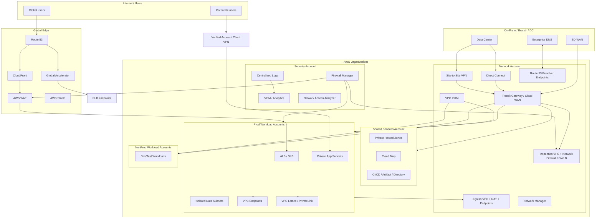
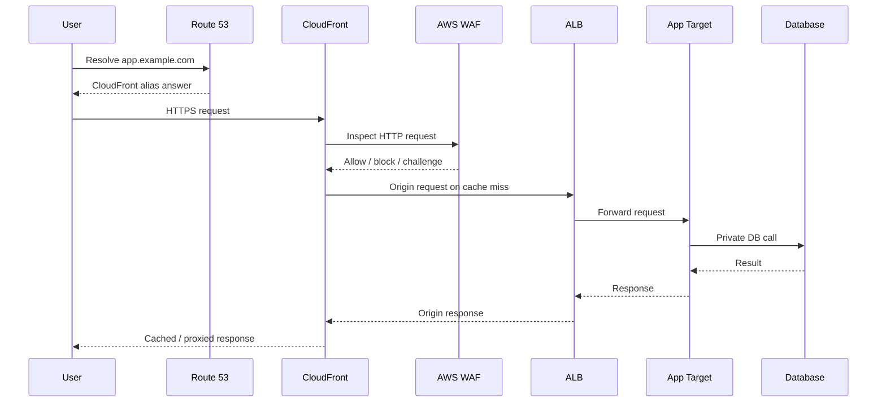
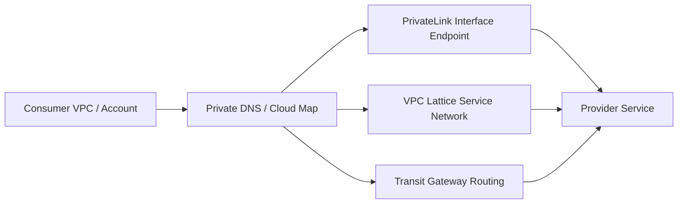
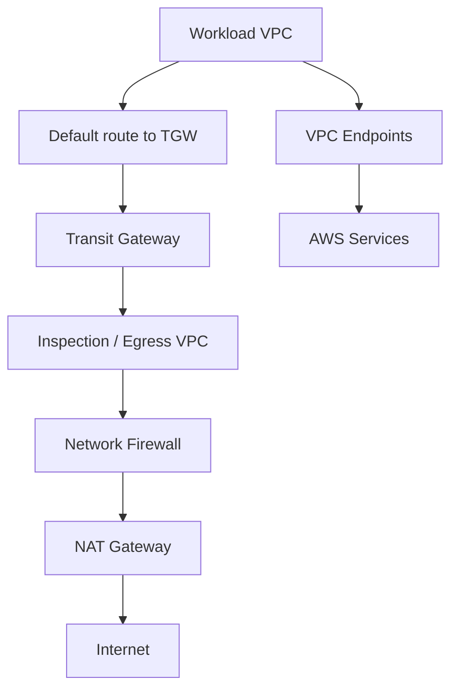
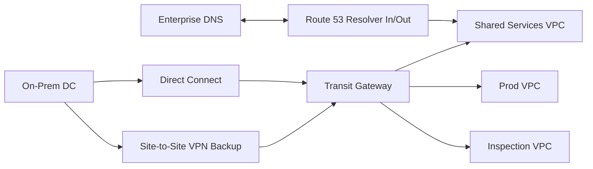
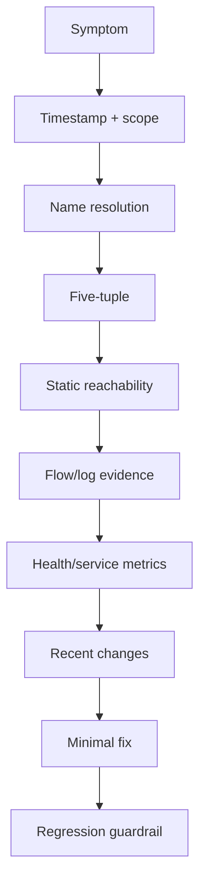
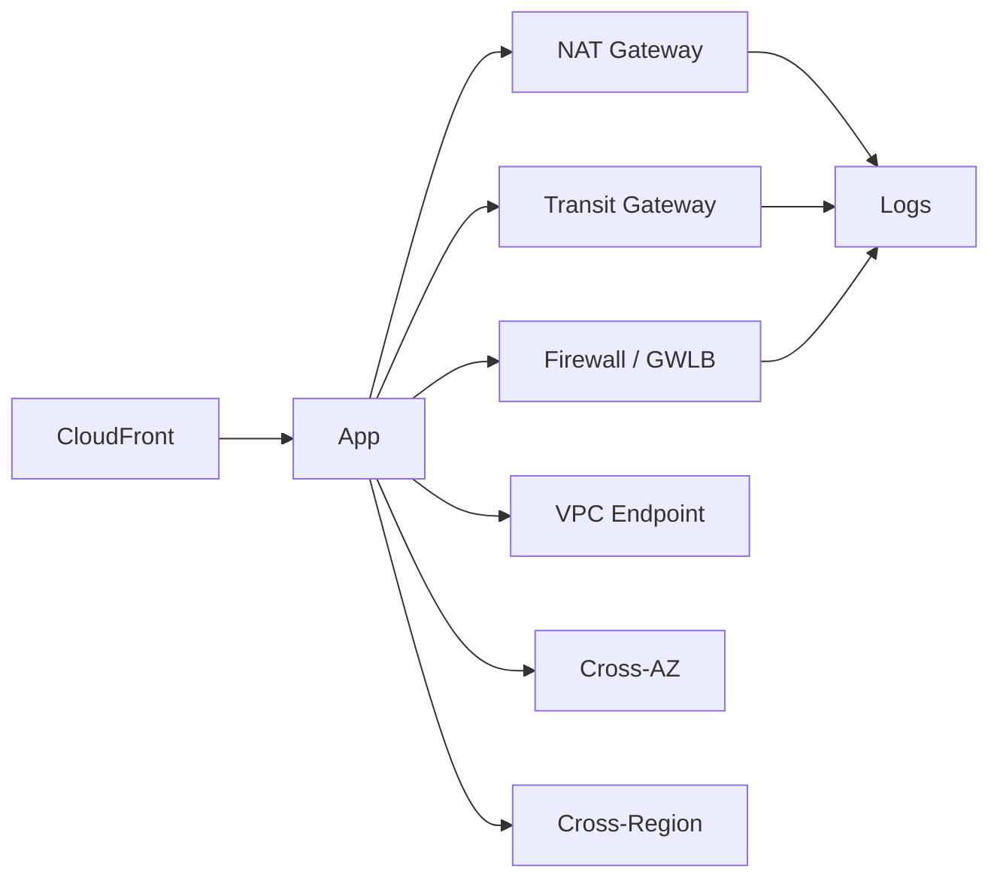
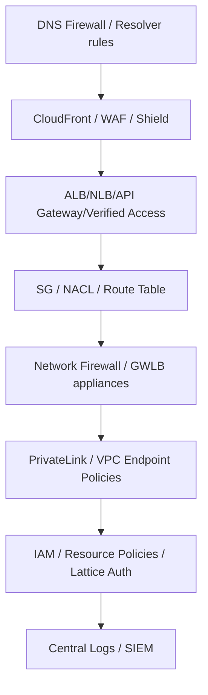

# Part 072 — Production Debugging, Cost, and Final Architecture

> Goal part ini: kamu bisa menyatukan semua materi AWS Networking and Content Delivery menjadi **arsitektur produksi yang bisa dioperasikan**, bukan sekadar gambar reference architecture yang terlihat rapi.

Ini adalah bagian terakhir seri.

Kita sudah membahas:

- mental model cloud networking;
- VPC, subnet, route table, IGW, NAT, endpoint;
- Security Group, NACL, ENI, DNS, IPv6;
- VPC Peering, Transit Gateway, Cloud WAN, IPAM;
- VPN, Direct Connect, hybrid DNS, Verified Access;
- Route 53, Global Accelerator, CloudFront;
- ALB, NLB, GWLB;
- PrivateLink, VPC Lattice, Cloud Map, API Gateway, EKS networking;
- WAF, Shield, Network Firewall, Firewall Manager;
- observability, reachability, logs, analyzer, runbooks.

Part terakhir ini menjawab pertanyaan yang lebih besar:

> Jika semua primitive itu tersedia, bagaimana kita merancang, mengoperasikan, dan mempertahankan network platform yang benar-benar production-grade?

---

## 1. Final Mental Model: Network Sebagai Product Platform

Di organisasi kecil, network sering dianggap “infrastructure”.

Di organisasi besar, network adalah **platform product**.

Artinya network punya:

- customer: application teams, security teams, compliance, operations;
- contract: routing, DNS, ingress, egress, access, logging;
- lifecycle: request, provision, change, deprecate;
- SLO: availability, latency, change safety, diagnosis time;
- API: IaC modules, account vending, subnet allocation, service onboarding;
- guardrails: policies, analyzer, firewall manager, IPAM, SCP, CI checks;
- documentation: diagrams, runbooks, ownership, exception records.

Network platform yang bagus membuat application team bisa bergerak cepat tanpa membuka blast radius liar.

Network platform yang buruk membuat semua hal menjadi ticket manual, exception permanen, dan incident sulit dibuktikan.

---

## 2. Final Reference Architecture

Berikut arsitektur konseptual enterprise AWS Networking and Content Delivery yang menggabungkan seluruh seri.



Ini bukan template yang harus disalin mentah-mentah.

Ini adalah **set of responsibilities**.

Setiap kotak punya owner, contract, observability, cost model, dan failure mode.

---

## 3. Architecture Responsibility Map

| Area | Owner utama | Contract |
|---|---|---|
| IP addressing | Network platform | CIDR allocation, no overlap, growth plan, IPAM compliance |
| Account networking | Platform/cloud foundation | VPC/subnet baseline, route domain, shared services access |
| Ingress | App + platform + security | Public/private entrypoint, TLS, WAF, DDoS posture, origin protection |
| Egress | Network + security | NAT/endpoints/proxy/firewall, allowed destinations, logging |
| Hybrid | Network team | DX/VPN/BGP/DNS, redundancy, route advertisement, failover testing |
| DNS | Platform + app | Public/private zones, delegation, resolver rules, naming contract |
| Service-to-service | App platform | PrivateLink/Lattice/Cloud Map/LB pattern, auth, discoverability |
| Security controls | Security platform | WAF/Shield/Firewall/DNS Firewall/SG policy, exceptions |
| Observability | Platform + SRE | Flow logs, edge logs, metrics, dashboards, runbooks |
| Cost | FinOps + platform | data path cost visibility, endpoint/NAT/TGW/CloudFront optimization |

Jika owner tidak jelas, incident akan lambat.

Jika contract tidak jelas, setiap workload akan mendesain network sendiri.

---

## 4. Data Path Reference: Public Web Application



### 4.1 Invariants

Public web app invariants:

- public DNS points to CloudFront or Global Accelerator, not directly to instance;
- origin cannot be directly abused without intended controls;
- WAF attached at edge or supported public entrypoint;
- ALB/NLB target subnets are private unless intentionally public;
- app-to-DB path is private;
- DB has no internet route and no public exposure;
- CloudFront cache policy does not cache user-specific private responses incorrectly;
- TLS boundaries are explicit;
- logs exist at CloudFront, WAF, ALB, app, and database.

### 4.2 Failure Diagnosis

| Symptom | Likely boundary |
|---|---|
| DNS not resolving | Route 53/delegation/record |
| 403 at edge | WAF, signed URL/cookie, OAC, geo restriction |
| 404 from CloudFront | cache behavior/path/origin mapping |
| 502 from CloudFront | origin TLS/Host/header/connection |
| 504 from CloudFront | origin timeout/unreachable/slow |
| ALB 502 | target reset/malformed response/TLS issue |
| ALB 503 | no healthy targets/rule mismatch |
| app 500 | app/dependency/data layer |
| DB timeout | SG/NACL/route/DB capacity/app pool |

---

## 5. Data Path Reference: Private Service-to-Service



### 5.1 Decision Rules

| Need | Prefer |
|---|---|
| expose one provider service privately to many consumers | PrivateLink |
| cross-account app-to-app with service-level auth/observability | VPC Lattice |
| full network routing between VPCs | Transit Gateway |
| simple small-scale direct VPC connectivity | VPC Peering |
| dynamic discovery inside compute platform | Cloud Map / ECS / EKS discovery |
| HTTP API boundary with throttling/auth/transform | API Gateway |

### 5.2 Anti-Pattern

Do not use TGW just because two services need to talk.

TGW grants network-level reachability between CIDR ranges. If the intended contract is **service-specific private exposure**, PrivateLink or VPC Lattice may reduce blast radius.

Do not use PrivateLink when you need broad bidirectional network access. PrivateLink is service-oriented and consumer-initiated.

Do not use DNS alone as a security boundary. DNS is naming, not authorization.

---

## 6. Data Path Reference: Centralized Egress



### 6.1 Egress Invariants

- high-volume AWS services use endpoints where appropriate;
- internet egress is observable;
- DNS egress is controlled or logged;
- firewall route steering preserves symmetry;
- NAT is per-AZ or centralization cost is explicitly accepted;
- destination allowlist/blocklist has owner;
- exceptions expire;
- Flow Logs and firewall logs are centralized;
- app teams know how to request new egress destination.

### 6.2 Centralized vs Distributed Egress

| Model | Good for | Risk |
|---|---|---|
| Distributed NAT per VPC/AZ | autonomy, AZ-local routing, simpler blast radius | repeated cost, inconsistent policy |
| Centralized egress VPC | consistent inspection, central logs, policy control | TGW/data processing cost, hairpin, route complexity |
| Proxy-based egress | HTTP/S allowlist, auth, detailed logs | non-HTTP protocols harder, app compatibility |
| Endpoint-first | AWS service access, lower NAT dependency | endpoint sprawl, policy/DNS complexity |

There is no universal winner. The right answer depends on governance, volume, protocol, and failure tolerance.

---

## 7. Data Path Reference: Hybrid Enterprise



### 7.1 Hybrid Invariants

- route advertisements are documented and filtered;
- BGP failover is tested, not assumed;
- DX and VPN preference is intentional;
- DNS resolution is bidirectional only where needed;
- on-prem CIDR and AWS CIDR are managed by IPAM/source of truth;
- inspection path is symmetric;
- no uncontrolled transitive route leaks;
- critical routes have monitoring;
- connection ownership includes AWS side and on-prem side.

### 7.2 Common Hybrid Failures

| Symptom | Common cause |
|---|---|
| AWS can reach on-prem, on-prem cannot reach AWS | missing return route/firewall/NACL |
| one Region works, another fails | TGW peering/static route/DXGW association issue |
| DNS works in AWS, fails on-prem | inbound endpoint/rule/firewall path missing |
| failover takes too long | BGP timers/route preference/device behavior |
| traffic bypasses inspection | route table propagation/default route leak |
| intermittent app timeout | MTU/MSS/IPsec fragmentation/asymmetry |

---

## 8. Production Debugging Methodology

When incident happens, do not start by changing config.

Start by reducing uncertainty.



### 8.1 The First Ten Questions

1. Which users/workloads are affected?
2. Since when?
3. Is it global, regional, AZ-specific, VPC-specific, subnet-specific, or account-specific?
4. Is it all traffic or one protocol/port/path?
5. What exact DNS name was used and what did it resolve to?
6. What is source IP, destination IP, protocol, and port?
7. Did the request reach the front door?
8. Did the front door reach the target?
9. Was there a recent change in DNS, routing, SG/NACL, LB, firewall, deployment, certificate, or endpoint policy?
10. Which log proves the current hypothesis?

If you cannot answer these, do not change rules yet.

### 8.2 Timeout Taxonomy

Timeout is not a root cause.

| Timeout type | Meaning |
|---|---|
| DNS timeout | resolver/rule/connectivity issue |
| TCP connect timeout | no SYN response, route/drop/firewall/listener issue |
| TCP connection refused | host reachable but port closed/rejected |
| TLS handshake timeout | path works but TLS negotiation stuck |
| TLS certificate error | trust/SNI/cert mismatch |
| HTTP 504 | upstream timeout through proxy/LB/CDN |
| application timeout | dependency/capacity/thread pool/app-level wait |

### 8.3 Use Binary Search Across the Path

For long paths, split the path.

Example CloudFront → ALB → App → DB:

1. User to CloudFront: CloudFront logs?
2. CloudFront to ALB: ALB access logs show request?
3. ALB to app: target logs show request?
4. App to DB: DB connection logs/Flow Logs?
5. Response path: where did error code originate?

Do not debug DB if request never reached ALB.

---

## 9. Cost Model: Network Architecture Is a Billing Graph

AWS network design is not only packet movement. It is also cost movement.

Every hop can add cost.



### 9.1 Cost Categories to Model

| Category | Examples |
|---|---|
| hourly resources | NAT Gateway, interface endpoints, VPN, DX port, appliances |
| data processing | NAT Gateway, Transit Gateway, PrivateLink, GWLB, Network Firewall |
| data transfer | internet egress, inter-AZ, inter-Region, cross-account paths |
| request-based | CloudFront requests, WAF requests, Route 53 queries, health checks |
| logging | CloudWatch ingestion, S3 storage, Firehose, real-time logs |
| security add-ons | Shield Advanced, WAF managed rules, Bot Control, Firewall Manager |
| operational cost | manual tickets, slow incident response, exception management |

Avoid memorizing prices in architecture docs because prices change. Model the **cost dimensions** and validate with current pricing during implementation.

### 9.2 Network Cost Smells

| Smell | Likely problem |
|---|---|
| S3 traffic through NAT | missing gateway endpoint |
| High NAT bytes from private app | endpoint missing or uncontrolled egress |
| High TGW bytes between two services | chatty dependency across VPC/account |
| High cross-AZ transfer | dependency placement/cross-zone/hairpin |
| CloudFront origin bytes high | poor cache key/TTL/origin request policy |
| Real-time logs cost spike | logging too broad |
| Firewall data processing spike | central inspection for high-volume trusted path |
| Interface endpoint hourly sprawl | endpoint-per-VPC without usage justification |

### 9.3 Optimization Hierarchy

Optimize in this order:

1. **Remove unnecessary traffic**: cache, batch, reduce chatter.
2. **Localize traffic**: same AZ/VPC/Region where sensible.
3. **Choose correct private path**: endpoint/PrivateLink/Lattice/TGW.
4. **Avoid NAT for AWS services**: gateway/interface endpoints.
5. **Cache at edge**: CloudFront and correct cache key.
6. **Control logs**: useful fields, retention, partitioning, sampling where allowed.
7. **Review centralization tax**: inspection/TGW/east-west cost.

Do not optimize cost by removing observability/security blindly.

---

## 10. Governance Model

Production AWS networking needs governance that does not block every team manually.

### 10.1 Guardrail Categories

| Guardrail | Example |
|---|---|
| Preventive | SCP blocks public S3, mandatory tag policy, restricted SG rule creation |
| Detective | Network Access Analyzer, Config, Security Hub, Flow Log analytics |
| Corrective | Firewall Manager remediation, automated SG cleanup, route drift fix |
| Procedural | exception approval, design review, runbook, game day |
| Educational | internal handbook, reference modules, decision trees |

### 10.2 Change Classes

Classify changes by blast radius.

| Change | Risk |
|---|---|
| Add SG inbound from ALB SG to one app | low/medium |
| Add default route to TGW for VPC | high |
| Modify TGW route table propagation | high |
| Change public DNS record | high if customer-facing |
| Update WAF managed rule in block mode | high if public app |
| Create new NAT Gateway | medium cost/route impact |
| Attach VPC to Cloud WAN/TGW | high route-domain impact |
| Change Resolver rule for domain suffix | high hidden dependency risk |

High-risk network changes need pre-check, deploy window or safe rollout, validation, and rollback plan.

### 10.3 Exception Lifecycle

Every exception must have:

```yaml
exception:
  owner: team-name
  reason: business justification
  scope: resource/account/vpc
  risk: accepted risk
  compensating_controls:
    - waf
    - logging
    - restricted cidr
  expiry: 2026-09-30
  review_frequency: monthly
```

Permanent exceptions are usually undocumented architecture decisions.

---

## 11. Reliability Model

Network reliability is built from fault-domain-aware placement and failover.

### 11.1 AZ-Level Reliability

Patterns:

- subnets per AZ;
- NAT Gateway per AZ for private egress;
- ALB/NLB across AZs;
- targets distributed across AZs;
- endpoint subnets per AZ where relevant;
- avoid cross-AZ single appliance bottleneck;
- test AZ impairment behavior.

### 11.2 Region-Level Reliability

Patterns:

- Route 53 failover/latency/weighted routing;
- CloudFront origin groups;
- Global Accelerator endpoint groups;
- multi-Region application/data design;
- Route 53 ARC for advanced recovery control where applicable;
- explicit data failover plan;
- DNS TTL strategy;
- runbooks for regional evacuation.

### 11.3 Hybrid Reliability

Patterns:

- redundant Direct Connect connections in separate locations if required;
- VPN backup;
- BGP route preference tested;
- dual customer gateway devices;
- on-prem firewall/router redundancy;
- hybrid DNS endpoint redundancy;
- failover game days.

### 11.4 Reliability Anti-Patterns

- one NAT Gateway shared across AZs for critical workloads without accepting AZ dependency;
- one firewall appliance path for all traffic;
- DNS failover without app/data failover readiness;
- TGW route propagation uncontrolled;
- CloudFront origin failover but app writes not multi-Region safe;
- Direct Connect treated as encrypted by default;
- Client VPN as permanent production service-to-service path;
- manually edited route tables in production.

---

## 12. Security Model

Security in AWS networking is layered.



### 12.1 Security Invariants

- no database subnet internet ingress;
- no management port from internet;
- public HTTP entrypoints have WAF unless exception;
- origin direct access is controlled;
- DNS egress is logged/filtered in critical environments;
- all production VPCs have Flow Logs;
- endpoint policies restrict sensitive data-plane access;
- SG ingress uses source SG/prefix list where possible;
- firewall policies are managed centrally;
- exceptions expire;
- logs are immutable enough for investigation.

### 12.2 Trust Boundary Principle

Never confuse reachability with authorization.

- TGW route allows network path, not user authorization.
- PrivateLink exposes endpoint, not business permission.
- Security Group allows socket, not API permission.
- DNS private name hides service from public resolution, not from authorized private clients.
- WAF blocks classes of HTTP traffic, not all application abuse.

Use identity/resource policies and application authorization where needed.

---

## 13. Final Decision Matrix

| Problem | First service to consider | Why |
|---|---|---|
| Isolated virtual network for workload | VPC | foundational boundary |
| Private subnet outbound internet | NAT Gateway / egress proxy | controlled outbound path |
| Private AWS service access | VPC endpoints | avoid public/NAT path |
| Many VPCs need routed connectivity | Transit Gateway / Cloud WAN | route-domain hub/global network |
| One service privately exposed to many consumers | PrivateLink | service-specific private access |
| Cross-account service mesh-like access | VPC Lattice | service network + auth/observability |
| Public web acceleration | CloudFront | CDN/cache/edge security |
| TCP/UDP global static entry | Global Accelerator | anycast IP + AWS global network |
| DNS routing/failover | Route 53 | authoritative DNS control |
| L7 routing to targets | ALB | HTTP/gRPC/WebSocket routing |
| L4 static IP/high performance | NLB | TCP/UDP/TLS load balancing |
| Appliance insertion | GWLB | transparent inspection pattern |
| Web attack filtering | WAF | HTTP request control |
| DDoS resilience | Shield + edge architecture | L3/L4/L7 protection posture |
| VPC network firewalling | Network Firewall | centralized/stateful inspection |
| Multi-account security policy | Firewall Manager | org-wide governance |
| Remote user app access without VPN | Verified Access | identity-aware app access |
| Remote network connectivity | VPN / Direct Connect | hybrid network path |
| Network evidence | Flow Logs / Analyzer / logs | proof, not guessing |

---

## 14. Build Review Checklist

Use this checklist before launching a production workload.

### 14.1 Addressing and Placement

- [ ] CIDR allocated from IPAM/source of truth.
- [ ] No overlap with current/future on-prem/cloud networks.
- [ ] Subnet tiers are explicit: ingress, app, data, endpoint, inspection.
- [ ] Subnets cover required AZs.
- [ ] IPv6 decision documented.
- [ ] ENI/IP capacity modeled for EC2/EKS/Lambda/VPC endpoints.

### 14.2 Routing

- [ ] Route tables reflect subnet intent.
- [ ] No accidental `0.0.0.0/0` to IGW in private/data subnets.
- [ ] NAT/egress path is AZ-aware or centralization accepted.
- [ ] TGW association/propagation reviewed.
- [ ] Return paths validated.
- [ ] Blackhole/guardrail routes documented if used.

### 14.3 Security

- [ ] SG rules are least privilege.
- [ ] NACLs are not accidentally blocking ephemeral ports.
- [ ] Public entrypoints have WAF/Shield posture.
- [ ] Direct origin bypass controlled.
- [ ] Endpoint policies and resource policies align.
- [ ] Network Firewall/DNS Firewall applied where required.
- [ ] Firewall Manager policy coverage checked.
- [ ] Exceptions have owner and expiry.

### 14.4 DNS

- [ ] Public hosted zone/delegation correct.
- [ ] Private hosted zone associations correct.
- [ ] Resolver rules do not shadow zones unexpectedly.
- [ ] TTL strategy documented.
- [ ] Split-horizon behavior tested.
- [ ] Hybrid DNS tested both directions.

### 14.5 Ingress/Egress

- [ ] CloudFront/GA/Route 53 decision documented.
- [ ] ALB/NLB scheme and target type correct.
- [ ] TLS termination boundary clear.
- [ ] Health checks meaningful.
- [ ] Egress destinations approved.
- [ ] AWS service access uses endpoints where justified.

### 14.6 Observability

- [ ] VPC Flow Logs enabled.
- [ ] TGW Flow Logs enabled if TGW used.
- [ ] Resolver query logs enabled for critical VPCs.
- [ ] CloudFront/ALB/WAF/Network Firewall logs enabled.
- [ ] Dashboards exist.
- [ ] Alerts mapped to runbooks.
- [ ] Reachability paths tested.
- [ ] Network Access Analyzer scopes defined for exposure invariants.

### 14.7 Reliability and Operations

- [ ] Multi-AZ target distribution.
- [ ] Failover behavior tested.
- [ ] Route/DNS changes have rollback plan.
- [ ] Hybrid failover tested.
- [ ] Incident runbook exists.
- [ ] Ownership documented.
- [ ] Cost impact reviewed.

---

## 15. Final Anti-Pattern Catalog

### 15.1 “Everything Through the TGW”

TGW is powerful, but making all services reachable at network level creates broad blast radius.

Use service-specific access when possible.

### 15.2 “Public Subnet Means Web Tier”

Public subnet means route to IGW. It does not mean safe for application instances.

Prefer public ALB/CloudFront, private targets.

### 15.3 “Security Group as Documentation”

SG rules are enforcement, not architecture documentation.

Document intent separately.

### 15.4 “DNS as Authorization”

Private DNS names reduce accidental exposure, but anyone with network access and name knowledge may still connect if SG/auth allows.

### 15.5 “Centralized Everything”

Centralized egress, inspection, DNS, and endpoints can improve governance but add blast radius, latency, cost, and operational coupling.

Centralize deliberately.

### 15.6 “No Packet Path Ownership”

If no team owns the end-to-end path, every incident becomes cross-team blame.

Own the path as a product contract.

### 15.7 “CloudFront Without Cache Discipline”

CloudFront is not magic acceleration. Bad cache key design can reduce hit ratio, leak user-specific content, or overload origin.

### 15.8 “Failover Without State Plan”

Routing traffic to another Region is not recovery if data, secrets, queues, capacity, and dependencies are not ready.

### 15.9 “Observability After Incident”

Logs enabled after incident are too late.

Baseline logs must exist before production.

### 15.10 “Cost Review After Scale”

Network cost architecture choices become painful after traffic grows.

Model paths early.

---

## 16. From Knowledge to Skill

Knowing AWS networking services is not enough.

Top-tier AWS network engineering skill looks like this:

1. **You can predict packet path** before opening console.
2. **You can read route tables as policy**, not configuration trivia.
3. **You can separate DNS, routing, filtering, identity, and application failure**.
4. **You can design for blast radius** across subnet/AZ/VPC/account/Region/edge.
5. **You can choose between TGW, PrivateLink, Lattice, peering, endpoint, and CloudFront** based on semantics, not popularity.
6. **You can debug using evidence**, not superstition.
7. **You can model cost as path cost**, not monthly surprise.
8. **You can build guardrails that allow teams to move fast safely**.
9. **You can explain trade-offs to app, security, network, and leadership teams**.
10. **You can turn incident learnings into platform improvements**.

The difference between average and elite is not “knows more services”.

It is **path literacy + failure modelling + operational discipline**.

---

## 17. Final Practice: Design Review Exercise

Design this system:

- public SaaS application;
- users in APAC, Europe, and US;
- workloads in two AWS Regions;
- strict tenant data isolation;
- private admin access for internal staff;
- private integration with enterprise customer networks;
- audit requirement for all public ingress and egress;
- high-volume S3 access from private workloads;
- EKS for app platform;
- centralized security account;
- multiple workload accounts.

### Expected Architecture Decisions

You should be able to justify:

- Route 53 vs Global Accelerator vs CloudFront;
- CloudFront cache behavior and origin protection;
- WAF placement and policy ownership;
- ALB/NLB target strategy;
- VPC/subnet/AZ layout;
- EKS pod networking/IP capacity;
- PrivateLink vs TGW for customer/private integration;
- Direct Connect/VPN hybrid pattern;
- Route 53 Resolver for hybrid DNS;
- VPC endpoints for S3/AWS APIs;
- NAT/egress/Network Firewall design;
- Flow Logs/TGW Flow Logs/WAF/CloudFront/Resolver logs;
- Network Access Analyzer invariants;
- failover and game-day plan;
- network cost model.

### Review Questions

If you cannot answer these, the design is not ready:

1. What is the exact packet path for user request?
2. What is the exact packet path for app-to-S3?
3. What is the exact packet path for app-to-customer-private-network?
4. Where is TLS terminated and re-encrypted?
5. How is origin bypass prevented?
6. How does a private workload resolve internal service names?
7. What happens if one AZ loses NAT?
8. What happens if one Region is evacuated?
9. What traffic can reach database subnets?
10. How do you prove no internet-to-database path exists?
11. Which logs prove WAF blocked a request?
12. Which logs prove traffic crossed TGW?
13. Which team owns a route change?
14. How are exceptions approved and expired?
15. Which path is the biggest cost risk?

---

## 18. Series Closure

This is the final part of the series.

You have completed:

```text
Learn AWS Networking and Content Delivery
Parts 001 - 072
Status: Complete
```

Final mental model:

> AWS Networking is not a list of services. It is a set of packet paths, policy boundaries, naming contracts, failure domains, and operational evidence.

When you design a network, draw the packet path.

When you secure a network, define the allowed path and prove the forbidden path is impossible.

When you debug a network, collect evidence at each boundary.

When you optimize a network, model the cost and latency of each hop.

When you scale a network organization, turn good decisions into reusable platform contracts.

That is the difference between “can configure AWS networking” and “can own AWS networking in production”.

---

## 19. References

- AWS Networking and Content Delivery decision guide: `https://docs.aws.amazon.com/decision-guides/latest/networking-on-aws-how-to-choose/choosing-networking-and-content-delivery-service.html`
- AWS Well-Architected Reliability — highly available network connectivity: `https://docs.aws.amazon.com/wellarchitected/latest/framework/rel_planning_network_topology_ha_conn_users.html`
- AWS Well-Architected Reliability — fail over to healthy resources: `https://docs.aws.amazon.com/wellarchitected/latest/reliability-pillar/rel_withstand_component_failures_failover2good.html`
- Amazon VPC documentation: `https://docs.aws.amazon.com/vpc/latest/userguide/what-is-amazon-vpc.html`
- AWS VPC Connectivity Options whitepaper: `https://docs.aws.amazon.com/whitepapers/latest/aws-vpc-connectivity-options/introduction.html`
- AWS Fault Isolation Boundaries: `https://docs.aws.amazon.com/whitepapers/latest/aws-fault-isolation-boundaries/welcome.html`
- AWS CloudFront Developer Guide: `https://docs.aws.amazon.com/AmazonCloudFront/latest/DeveloperGuide/Introduction.html`
- AWS Transit Gateway documentation: `https://docs.aws.amazon.com/vpc/latest/tgw/what-is-transit-gateway.html`
