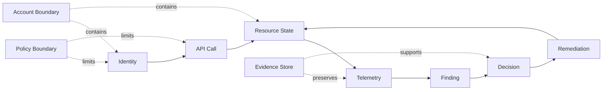
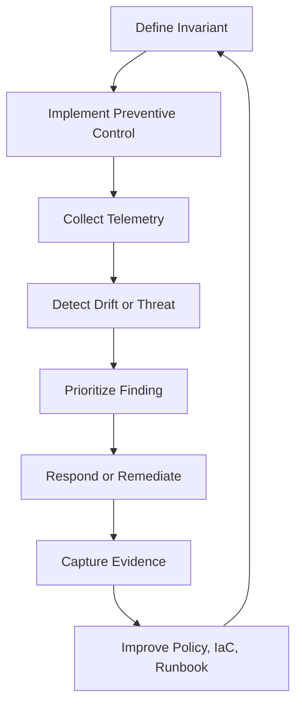
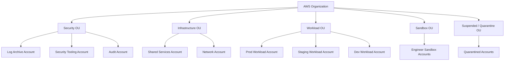
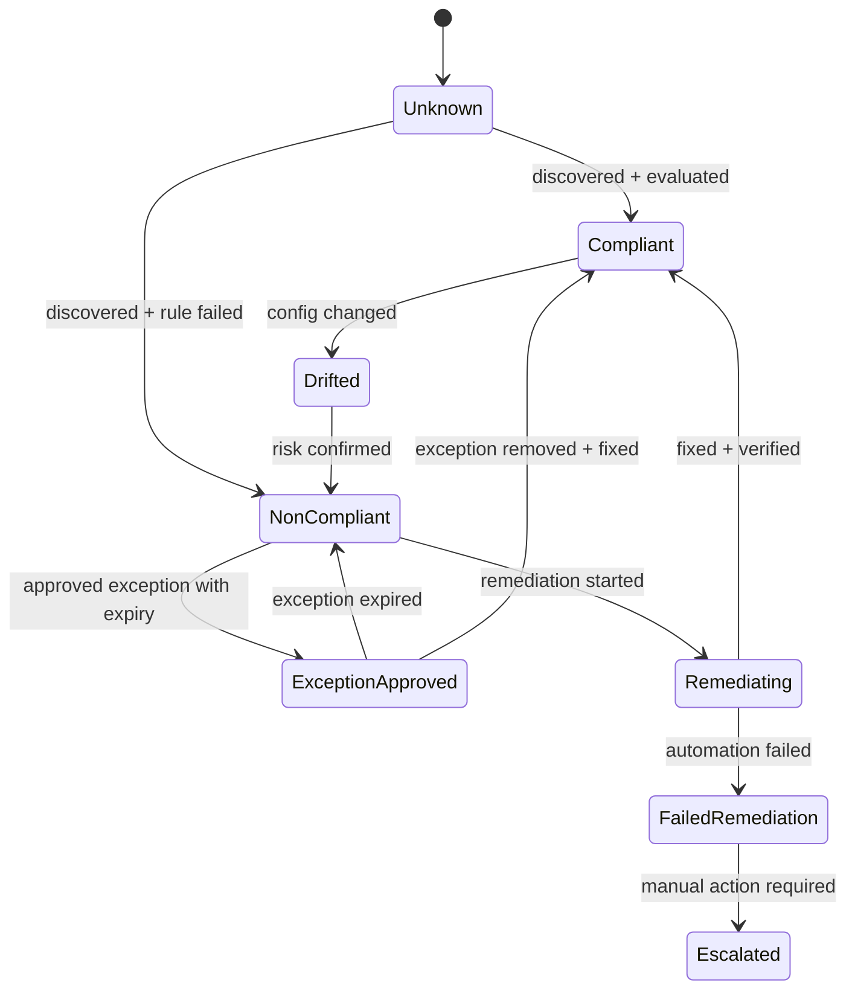

# Cloud Security Operating Model

AWS security yang matang tidak dimulai dari daftar service. Ia dimulai dari cara berpikir.

Kalau kita langsung belajar IAM, GuardDuty, Security Hub, CloudTrail, Config, KMS, Macie, Inspector, CloudWatch, dan Systems Manager sebagai service terpisah, kita akan cepat hafal fitur tetapi tetap rapuh saat harus mendesain sistem production. Masalahnya bukan kurang tahu tombol. Masalahnya adalah belum punya model operasi.

Model operasi menjawab pertanyaan yang lebih fundamental:

1. Siapa boleh melakukan apa?
2. Di boundary mana tindakan itu terjadi?
3. Bagaimana perubahan terekam?
4. Bagaimana pelanggaran terdeteksi?
5. Bagaimana dampak dibatasi?
6. Bagaimana recovery dijalankan?
7. Bagaimana semua itu bisa dibuktikan ke auditor, security reviewer, incident commander, dan engineering leadership?

AWS adalah cloud platform berbasis API. Hampir semua perubahan penting adalah API call: membuat role, mengubah policy, membuka security group, menulis object ke bucket, membuat access key, mematikan logging, mengubah KMS key policy, membuat snapshot publik, menghapus alarm, men-disable guardrail. Karena itu AWS security operating model harus dibangun di sekitar **API, identity, resource state, telemetry, dan control loop**.

Materi ini adalah fondasi seri. Part berikutnya akan membahas shared responsibility, account boundary, IAM, audit, detection, monitoring, management, incident response, dan compliance. Tetapi semua part itu akan kembali ke satu model dasar di sini.

---

## 1. AWS bukan sekadar infra. AWS adalah programmable control system.

Di data center tradisional, banyak perubahan melewati manusia: request firewall, request server, request DNS, request storage, request user access. Di AWS, banyak keputusan itu berubah menjadi API call yang bisa dieksekusi dalam detik.

Itu membuat engineering lebih cepat, tetapi juga membuat kesalahan lebih cepat menyebar.

Contoh sederhana:

```text
Developer membuat S3 bucket → menambahkan bucket policy → salah condition → bucket terbuka publik → data bisa diakses dari internet.
```

Tidak ada teknisi data center yang memindahkan kabel. Tidak ada change board manual. Tidak ada firewall team yang menolak. Semua terjadi melalui control plane.

Jadi mental model pertama:

> AWS security adalah pengamanan terhadap perubahan state yang dikendalikan API.

State itu bisa berupa:

- IAM policy.
- S3 bucket policy.
- Security group rule.
- KMS key policy.
- CloudTrail trail configuration.
- CloudWatch alarm.
- Config recorder.
- Lambda environment variable.
- RDS snapshot sharing.
- EBS volume encryption.
- ECS task role.
- EKS service account mapping.
- Organization SCP.
- Account membership dalam OU.

Setiap state punya konsekuensi keamanan.

---

## 2. Unit dasar AWS security operating model

Kita akan memakai delapan objek mental.



### 2.1 Identity

Identity adalah siapa atau apa yang melakukan tindakan.

Di AWS, identity bukan hanya manusia. Identity bisa berupa:

- human user yang login melalui IAM Identity Center;
- role yang diasumsikan oleh developer;
- EC2 instance profile;
- ECS task role;
- Lambda execution role;
- EKS workload identity;
- CI/CD role;
- vendor cross-account role;
- emergency break-glass role;
- AWS service-linked role;
- root user.

Security yang matang memperlakukan semua identity sebagai actor yang dapat membuat perubahan state.

Pertanyaan wajib:

```text
Identity ini boleh melakukan tindakan apa?
Untuk resource mana?
Dari kondisi apa?
Selama berapa lama?
Dengan attribution apa?
Apakah tindakannya terekam?
Siapa yang bertanggung jawab kalau identity ini disalahgunakan?
```

### 2.2 API call

API call adalah tindakan nyata di AWS. Console hanyalah UI di atas API. CLI hanyalah client API. Terraform, CloudFormation, CDK, SDK, GitHub Actions, Jenkins, ArgoCD, dan internal platform portal semuanya pada akhirnya memanggil API AWS.

Karena itu audit AWS harus berpikir seperti ini:

```text
Tidak penting user mengklik tombol atau menjalankan script.
Yang penting: API apa yang dipanggil, oleh principal apa, dari source apa, terhadap resource apa, dan hasilnya apa.
```

CloudTrail menjadi sumber utama untuk management event. Untuk data-plane event tertentu seperti S3 object-level access atau Lambda invocation, kita perlu mengaktifkan data events secara eksplisit sesuai kebutuhan biaya dan risiko.

### 2.3 Resource state

Resource state adalah konfigurasi saat ini.

Contoh:

- bucket public access block aktif atau tidak;
- RDS storage terenkripsi atau tidak;
- security group membuka `0.0.0.0/0:22` atau tidak;
- KMS key policy memberi akses ke principal tak dikenal atau tidak;
- CloudTrail multi-region aktif atau tidak;
- GuardDuty enabled di semua region atau tidak;
- access key sudah tua atau tidak;
- EBS snapshot dibagikan publik atau tidak.

CloudTrail menjawab “siapa mengubah apa”. AWS Config menjawab “konfigurasinya apa sekarang dan bagaimana sejarahnya”. Dua hal ini saling melengkapi.

### 2.4 Telemetry

Telemetry adalah sinyal yang dikumpulkan dari sistem.

Telemetry AWS biasanya berupa:

- logs;
- metrics;
- traces;
- events;
- configuration history;
- findings;
- inventory;
- billing anomaly;
- network flow;
- user activity;
- service health.

Dalam security operating model, telemetry bukan hanya untuk melihat error aplikasi. Telemetry adalah bahan bakar untuk audit, detection, incident response, SLO, capacity, cost governance, dan compliance.

### 2.5 Finding

Finding adalah telemetry yang sudah diberi makna risiko.

Contoh:

```text
Raw event:
AuthorizeSecurityGroupIngress dipanggil.

Finding:
Security group production membuka SSH dari internet.
```

Contoh lain:

```text
Raw event:
GetObject dari IP asing.

Finding:
Kemungkinan data exfiltration dari bucket sensitif.
```

Finding bisa berasal dari GuardDuty, Security Hub, Inspector, Macie, Config, Access Analyzer, atau pipeline internal.

Finding yang baik punya minimal:

- affected resource;
- account;
- region;
- severity;
- evidence;
- detection source;
- owner;
- remediation path;
- SLA;
- status;
- exception metadata bila dikecualikan.

### 2.6 Decision

Tidak semua finding harus otomatis diperbaiki. Security operations adalah sistem pengambilan keputusan.

Keputusan bisa berupa:

- ignore karena false positive;
- suppress dengan alasan dan expiry;
- assign ke team pemilik;
- escalate ke incident;
- auto-remediate;
- quarantine resource;
- revoke credential;
- update guardrail;
- open postmortem;
- update runbook.

Top 1% engineer tidak hanya bertanya “alert-nya apa?”, tetapi “decision apa yang harus diambil dari alert ini?”

### 2.7 Remediation

Remediation adalah perubahan yang mengurangi risiko atau mengembalikan invariant.

Contoh:

- menutup security group rule;
- memblokir public S3 policy;
- men-disable access key;
- memindahkan account ke quarantine OU;
- menerapkan SCP sementara;
- mengaktifkan CloudTrail kembali;
- memaksa rotation secret;
- revoke session;
- patch package rentan;
- restore dari backup;
- memperbaiki Terraform module agar issue tidak muncul lagi.

Remediation yang matang bukan hanya “memadamkan api”. Ia juga memperbaiki jalur penyebab.

### 2.8 Evidence store

Evidence store menyimpan bukti yang bisa dipercaya.

Dalam AWS, evidence store biasanya mencakup:

- CloudTrail log archive;
- AWS Config history;
- Security Hub findings;
- GuardDuty findings;
- CloudWatch Logs;
- VPC Flow Logs;
- S3 server access logs atau CloudTrail data events;
- incident timeline;
- ticket/change record;
- deployment metadata;
- backup restore test result;
- compliance evidence.

Evidence harus dilindungi lebih kuat daripada workload biasa. Kalau attacker bisa menghapus atau mengubah evidence, investigation dan audit kehilangan dasar.

---

## 3. Control loop: cara AWS security benar-benar bekerja

Security operating model adalah loop, bukan checklist.



Contoh invariant:

```text
Semua production account harus mengirim CloudTrail management events ke centralized log archive.
```

Preventive control:

- SCP mencegah member account men-disable CloudTrail atau menghapus log bucket policy.
- Bucket policy log archive hanya menerima log dari organization yang benar.
- KMS key policy dibatasi untuk logging pipeline.

Detective control:

- AWS Config rule mengecek CloudTrail enabled.
- Security Hub mengumpulkan failed control.
- EventBridge mendeteksi API call `StopLogging`, `DeleteTrail`, atau perubahan bucket policy.

Corrective control:

- Automation mengaktifkan kembali trail.
- Account bisa dipindahkan ke quarantine OU jika ada indikasi kompromi.
- Incident dibuat jika tindakan dilakukan oleh principal mencurigakan.

Evidence:

- CloudTrail event perubahan.
- Config timeline.
- Security Hub finding.
- Ticket incident.
- Runbook execution result.

Improvement:

- Perketat SCP.
- Tambahkan unit test IaC.
- Tambahkan detection untuk varian baru.
- Perjelas ownership.

Inilah inti cloud security engineering: bukan membeli tool, tetapi membangun loop.

---

## 4. Preventive, detective, corrective, recovery control

Untuk setiap risiko, jangan hanya memilih satu jenis control. Pilih kombinasi.

| Control Type | Pertanyaan | Contoh AWS |
|---|---|---|
| Preventive | Bagaimana mencegah hal buruk terjadi? | SCP, IAM policy, permission boundary, S3 Block Public Access, KMS key policy, VPC endpoint policy. |
| Detective | Bagaimana tahu hal buruk terjadi? | CloudTrail, Config, GuardDuty, Security Hub, Inspector, Macie, CloudWatch alarm. |
| Corrective | Bagaimana mengembalikan sistem ke state aman? | EventBridge automation, Systems Manager Automation, Lambda remediation, patching, policy rollback. |
| Recovery | Bagaimana pulih saat dampak sudah terjadi? | AWS Backup, restore testing, disaster recovery, incident runbook, credential rotation. |

Contoh risiko: `S3 bucket menjadi publik`.

| Layer | Control |
|---|---|
| Preventive | S3 Block Public Access di account dan bucket; SCP deny perubahan public access block. |
| Detective | Config rule untuk public bucket; Security Hub control; Access Analyzer external access finding. |
| Corrective | Auto-remediation mengembalikan block public access dan menghapus policy publik. |
| Recovery | Jika data sudah terekspos: incident response, access log review, key rotation, notification workflow, legal/compliance handling. |

Engineer yang matang tidak bertanya “service apa untuk S3 security?” tetapi “control loop apa untuk risiko public data exposure?”

---

## 5. Account adalah blast-radius boundary

AWS account bukan hanya container billing. Account adalah boundary penting untuk:

- identity;
- quota;
- logging;
- network;
- resource namespace;
- service enablement;
- security tooling;
- blast radius;
- compliance scoping;
- ownership;
- incident containment.

Di organisasi kecil, satu account sering terasa cukup. Di production serius, satu account menjadi jebakan.

Kenapa?

Karena banyak resource policy dan IAM permission menjadi terlalu luas. Log bercampur. Security exception sulit dibedakan dari risiko nyata. Developer sandbox bisa memengaruhi production. Root user menjadi terlalu kritikal. Billing anomaly sulit ditelusuri. Incident response tidak punya boundary isolasi yang bersih.

Model yang lebih sehat:



Prinsipnya:

```text
Semakin tinggi dampak bisnis dan risiko data, semakin kuat boundary dan guardrail-nya.
```

---

## 6. Policy adalah bahasa kontrol AWS

Security di AWS banyak diekspresikan sebagai policy.

Ada banyak jenis policy:

- IAM identity policy;
- IAM resource policy;
- role trust policy;
- service control policy;
- permission boundary;
- session policy;
- KMS key policy;
- S3 bucket policy;
- VPC endpoint policy;
- AWS Organizations policy;
- backup policy;
- tag policy;
- CloudWatch resource policy;
- EventBridge bus policy.

Jangan melihat policy sebagai JSON panjang. Lihat policy sebagai kontrak.

Kontrak policy menjawab:

```text
Principal mana yang boleh melakukan Action apa terhadap Resource mana dengan Condition apa?
```

Empat kata ini harus tertanam:

```text
Principal - Action - Resource - Condition
```

Kalau salah satu kabur, desain policy berbahaya.

Contoh policy yang rapuh secara mental model:

```json
{
  "Effect": "Allow",
  "Action": "s3:*",
  "Resource": "*"
}
```

Masalahnya bukan hanya wildcard. Masalahnya adalah policy ini tidak menjawab:

- bucket mana;
- object prefix mana;
- dari role mana;
- dari account mana;
- untuk operasi apa;
- dengan encryption context apa;
- lewat VPC endpoint mana;
- apakah hanya untuk environment tertentu;
- apakah bisa digunakan untuk delete;
- apakah bisa mengubah bucket policy;
- apakah bisa membuat public exposure.

Top 1% engineer membaca IAM policy seperti membaca kode production: mencari invariant, side effect, edge case, dan escalation path.

---

## 7. Security invariant: aturan yang harus selalu benar

Invariant adalah kondisi yang tidak boleh dilanggar.

Contoh invariant AWS:

```text
INV-001: Root user tidak digunakan untuk operasi harian.
INV-002: Semua production account mengirim CloudTrail ke log archive.
INV-003: Tidak ada S3 bucket production yang public.
INV-004: Semua data confidential harus dienkripsi at rest dengan KMS key yang dikontrol organisasi.
INV-005: Tidak ada access key permanen untuk human user.
INV-006: Semua privileged access harus melalui federated identity dan MFA.
INV-007: Semua internet-facing endpoint production harus punya owner, logging, dan monitoring.
INV-008: Semua security finding critical harus punya SLA dan escalation path.
INV-009: Semua resource production harus punya tag ownership minimum.
INV-010: Semua backup critical workload harus diuji restore-nya.
```

Invariant yang baik punya empat properti:

1. **Clear**: bisa dipahami engineer tanpa interpretasi panjang.
2. **Testable**: bisa dicek oleh tool atau review.
3. **Actionable**: jika gagal, ada tindakan perbaikan.
4. **Owned**: ada team atau role yang bertanggung jawab.

Invariant yang buruk:

```text
Pastikan security bagus.
```

Invariant yang baik:

```text
Semua S3 bucket yang menyimpan data confidential harus memiliki Block Public Access aktif, default encryption aktif, object ownership terdefinisi, access logging atau CloudTrail data events sesuai classification, dan tidak memiliki bucket policy yang memberi akses ke principal di luar AWS Organization kecuali ada approved exception dengan expiry.
```

Panjang? Ya. Tetapi bisa diuji.

---

## 8. AWS security sebagai state machine

Kita bisa memodelkan posture resource sebagai state machine.

Misalnya bucket:



Kenapa state machine penting?

Karena security operations sering kacau bukan karena tidak ada alert, tetapi karena status tidak jelas.

Pertanyaan yang harus bisa dijawab:

- Apakah resource ini belum dievaluasi atau sudah gagal compliance?
- Apakah finding ini false positive atau exception yang disetujui?
- Apakah remediation sedang berjalan atau gagal?
- Apakah owner sudah diberi tahu?
- Apakah SLA sudah lewat?
- Apakah exception punya expiry?
- Apakah kondisi compliant sudah diverifikasi ulang?

Jika status tidak eksplisit, dashboard security akan menjadi tumpukan noise.

---

## 9. Observability bukan hanya monitoring aplikasi

Di seri ini, monitoring dan management tidak dipisahkan dari security.

Monitoring menjawab:

```text
Apakah sistem berjalan sesuai ekspektasi?
```

Security monitoring menjawab:

```text
Apakah sistem berjalan dalam batas aman?
```

Operational management menjawab:

```text
Jika tidak, siapa melakukan apa, kapan, dengan alat apa, dan bagaimana kita mengembalikannya?
```

CloudWatch metric CPU tinggi bisa menjadi operational issue. Tetapi perubahan IAM policy yang memberi `AdministratorAccess` ke role CI/CD juga operational issue, security issue, compliance issue, dan audit issue.

Karena itu telemetry harus dilihat dalam empat dimensi:

| Dimensi | Contoh Pertanyaan |
|---|---|
| Health | Apakah service sehat? Latency, error, saturation? |
| Change | Apa yang berubah? Siapa mengubah? Lewat pipeline atau manual? |
| Access | Siapa mengakses apa? Dari mana? Apakah sesuai pola normal? |
| Risk | Apakah konfigurasi membuka exposure, privilege escalation, atau data loss? |

Observability yang hanya fokus pada CPU, memory, latency, dan error belum cukup untuk AWS production.

---

## 10. Ownership: tidak ada security tanpa pemilik

Tool tidak memperbaiki ownership yang kabur.

Setiap account, workload, data store, secret, KMS key, dashboard, alarm, finding, dan exception harus punya owner.

Tag minimum yang sering berguna:

```yaml
OwnerTeam: payments-platform
BusinessService: payment-processing
Environment: prod
DataClassification: confidential
CostCenter: finops-123
OnCall: payments-primary
Repository: github.com/company/payments-service
ManagedBy: terraform
Criticality: tier-1
```

Tag bukan dekorasi. Tag adalah routing metadata.

Tanpa tag:

- finding tidak tahu dikirim ke siapa;
- cost anomaly tidak tahu milik siapa;
- incident tidak tahu owner;
- audit tidak tahu business context;
- exception tidak tahu approver;
- backup tidak tahu criticality;
- dashboard tidak tahu service boundary.

Top 1% organization memperlakukan metadata sebagai control surface.

---

## 11. Maturity model AWS security operations

Gunakan model berikut untuk menilai kondisi organisasi.

| Level | Karakteristik | Risiko |
|---|---|---|
| 0 - Ad hoc | Satu account, manual console, root kadang dipakai, logging tidak konsisten. | Tidak ada auditability dan blast radius besar. |
| 1 - Basic Guardrails | IAM mulai rapi, CloudTrail aktif, beberapa alarm, beberapa managed rules. | Banyak exception informal dan owner tidak jelas. |
| 2 - Multi-Account Baseline | AWS Organizations, centralized logging, baseline SCP, Security Hub, GuardDuty. | Detection ada, tetapi remediation dan ownership belum matang. |
| 3 - Operationalized Security | Finding lifecycle, SLA, auto-remediation, runbook, incident response, evidence. | Risiko utama berpindah ke kualitas automation dan exception management. |
| 4 - Engineering-Integrated | Policy as code, IaC validation, golden modules, automated evidence, service ownership. | Butuh governance agar platform tidak terlalu rigid. |
| 5 - Adaptive Control System | Controls terus diperbarui dari incident, threat intel, audit, architecture review, dan production learning. | Kompleksitas organisasi menjadi tantangan utama. |

Target seri ini adalah membawa cara berpikir ke Level 4-5, meskipun implementasi riil bisa bertahap.

---

## 12. Case study: public S3 bucket bukan masalah S3 saja

Misalkan ada bucket production berisi export data customer. Developer menambahkan bucket policy untuk integrasi vendor. Policy salah dan membuka akses publik.

Melihat ini sebagai “S3 issue” terlalu dangkal.

Mari pecah dengan operating model.

### 12.1 Identity

Siapa membuat policy?

- Human role?
- CI/CD role?
- Terraform automation?
- Vendor role?
- Root user?

Apakah identity itu seharusnya boleh mengubah bucket policy production?

### 12.2 API call

API apa yang dipanggil?

- `PutBucketPolicy`?
- `PutPublicAccessBlock`?
- `PutBucketAcl`?
- `PutObjectAcl`?

Apakah event terekam di CloudTrail?

### 12.3 Resource state

Apa state bucket sekarang?

- Public access block aktif?
- Bucket policy public?
- ACL masih relevan?
- Object ownership?
- Encryption?
- Replication?
- Access logging?

### 12.4 Telemetry

Sinyal apa yang tersedia?

- CloudTrail management event.
- CloudTrail data event jika aktif.
- S3 access logs jika aktif.
- Config timeline.
- Access Analyzer finding.
- Security Hub control.
- Macie classification jika bucket mengandung sensitive data.

### 12.5 Finding

Apakah finding punya severity yang cukup?

Bucket public dengan data test berbeda dari bucket public dengan data customer.

Severity harus mempertimbangkan:

- data classification;
- exposure path;
- access evidence;
- duration;
- account type;
- business criticality;
- regulatory impact.

### 12.6 Decision

Apakah auto-remediate aman?

Untuk bucket production confidential, biasanya ya: block public access dulu, investigasi kemudian. Tetapi jika bucket memang public website, jangan auto-remediate tanpa classification dan exception.

### 12.7 Remediation

Tindakan:

- aktifkan block public access;
- revert bucket policy;
- revoke temporary vendor access;
- rotate credential bila ada indikasi misuse;
- review access logs;
- buka incident jika data sempat diakses;
- patch Terraform module;
- tambah policy test.

### 12.8 Evidence

Evidence yang harus disimpan:

- CloudTrail event perubahan;
- Config before/after;
- finding timeline;
- access log;
- ticket approval vendor;
- remediation execution log;
- post-incident decision.

Satu kesalahan bucket policy berubah menjadi pelajaran lengkap tentang AWS security operating model.

---

## 13. Production checklist untuk Part 001

Gunakan checklist ini sebagai baseline berpikir, bukan checklist final.

### Identity

- [ ] Semua human privileged access melalui federation dan MFA.
- [ ] Tidak ada access key permanen untuk human user production.
- [ ] Break-glass role tersedia, diuji, dan diaudit.
- [ ] Role trust policy dibatasi dan direview.
- [ ] CI/CD role punya permission minimum untuk deployment path-nya.

### Account boundary

- [ ] Production, staging, dev, sandbox dipisah secara account atau minimal boundary kuat.
- [ ] Security tooling dan log archive berada di account terpisah.
- [ ] SCP melindungi audit baseline dan region policy.
- [ ] Account owner dan business service jelas.

### Audit

- [ ] CloudTrail organization trail aktif multi-region.
- [ ] Log dikirim ke centralized immutable-ish log archive.
- [ ] AWS Config aktif untuk resource penting.
- [ ] Log retention sesuai classification dan compliance need.

### Detection

- [ ] GuardDuty aktif organization-wide.
- [ ] Security Hub mengagregasi findings.
- [ ] Config rule mengecek invariant utama.
- [ ] Finding punya owner, severity, SLA, dan workflow.

### Data protection

- [ ] Data classification diterjemahkan ke controls.
- [ ] KMS key ownership jelas.
- [ ] Secrets tidak hardcoded.
- [ ] Sensitive data discovery tersedia untuk S3 berisiko.

### Operations

- [ ] Alarm actionable, bukan noise.
- [ ] Dashboard memetakan service ownership.
- [ ] Incident runbook tersedia untuk skenario utama.
- [ ] Backup dan restore diuji.

---

## 14. Kesalahan mental model yang harus dihindari

### 14.1 “Kami sudah pakai IAM, berarti aman”

IAM bukan keamanan. IAM adalah salah satu bahasa untuk mengekspresikan authorization. Kalau policy terlalu luas, trust policy lemah, session tidak teratribusi, dan audit tidak dibaca, IAM justru menjadi jalur privilege escalation.

### 14.2 “CloudTrail aktif, berarti audit selesai”

CloudTrail aktif belum berarti evidence siap. Pertanyaan lanjutannya:

- Apakah multi-region?
- Apakah organization-wide?
- Apakah log bisa dihapus workload account?
- Apakah data events yang relevan aktif?
- Apakah log retention cukup?
- Apakah query dan investigation path tersedia?

### 14.3 “Security Hub merah banyak, berarti security team gagal”

Mungkin benar, mungkin tidak. Bisa jadi organisasi tidak punya ownership metadata, exception model, severity tuning, atau remediation workflow. Findings tanpa lifecycle hanya menciptakan rasa bersalah, bukan keamanan.

### 14.4 “Managed service berarti AWS yang urus security”

AWS mengurangi sebagian beban operasional, tetapi customer tetap mengontrol identity, data, konfigurasi, network exposure, logging, dan compliance posture. Ini akan dibahas dalam Part 002.

### 14.5 “Automation selalu lebih baik”

Automation yang salah bisa mempercepat kerusakan. Auto-remediation harus punya guard condition, dry-run, audit, rollback, dan exception handling.

---

## 15. Latihan desain

Ambil satu workload production. Jawab pertanyaan berikut.

```text
1. Account mana yang menjalankan workload ini?
2. Siapa owner teknis dan owner bisnisnya?
3. Identity mana saja yang bisa mengubah resource production?
4. Resource mana yang menyimpan data confidential?
5. CloudTrail dan Config evidence tersedia di mana?
6. GuardDuty/Security Hub findings untuk account ini dikirim ke mana?
7. Apa invariant security paling penting untuk workload ini?
8. Jika invariant dilanggar, siapa yang diberi tahu?
9. Apa yang bisa diperbaiki otomatis?
10. Apa yang harus menjadi incident?
```

Kalau jawaban pertanyaan ini tidak jelas, masalahnya bukan service AWS. Masalahnya operating model.

---

## 16. Ringkasan

AWS security, monitoring, dan management harus dipahami sebagai control loop atas sistem cloud yang dikendalikan API.

Fondasinya:

```text
Identity melakukan API call.
API call mengubah resource state.
Resource state menghasilkan telemetry.
Telemetry menjadi finding.
Finding memicu decision.
Decision menjalankan remediation.
Remediation mengembalikan invariant.
Evidence membuktikan semua proses itu.
```

Jika model ini kuat, service AWS menjadi mudah ditempatkan. IAM mengontrol identity. Organizations dan SCP mengontrol boundary. CloudTrail dan Config menyimpan audit dan state history. GuardDuty, Security Hub, Inspector, Macie, dan Access Analyzer memberi finding. CloudWatch dan X-Ray memberi operational telemetry. EventBridge, Lambda, dan Systems Manager menjalankan automation. AWS Backup dan incident runbook mendukung recovery.

Tanpa model ini, semua service hanya menjadi dashboard yang ramai.

---

## Referensi Resmi

- AWS Security Reference Architecture: `https://docs.aws.amazon.com/prescriptive-guidance/latest/security-reference-architecture/introduction.html`
- AWS Well-Architected Framework - Security Pillar: `https://docs.aws.amazon.com/wellarchitected/latest/security-pillar/welcome.html`
- AWS Well-Architected Framework - Security Design Principles: `https://docs.aws.amazon.com/wellarchitected/latest/framework/sec-design.html`
- AWS Well-Architected Framework - Operational Excellence Pillar: `https://docs.aws.amazon.com/wellarchitected/latest/operational-excellence-pillar/welcome.html`
- AWS Well-Architected Framework - Operational Excellence Design Principles: `https://docs.aws.amazon.com/wellarchitected/latest/framework/oe-design-principles.html`
- AWS Shared Responsibility Model: `https://docs.aws.amazon.com/whitepapers/latest/aws-risk-and-compliance/shared-responsibility-model.html`
