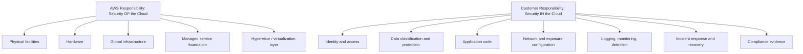
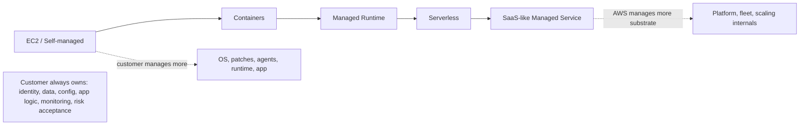
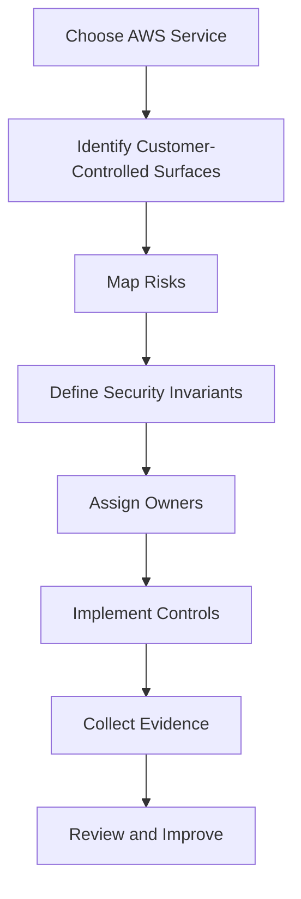
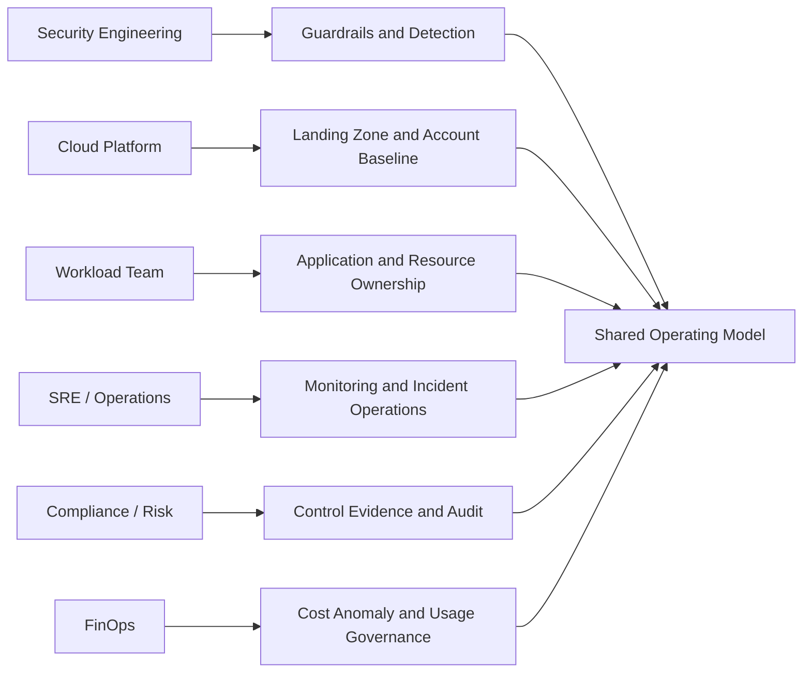

# Shared Responsibility With Engineering Consequences

Shared responsibility model sering dijelaskan terlalu sederhana:

```text
AWS bertanggung jawab atas security OF the cloud.
Customer bertanggung jawab atas security IN the cloud.
```

Kalimat itu benar, tetapi belum cukup untuk engineer.

Engineer perlu tahu konsekuensinya:

- Siapa patch OS?
- Siapa mengatur encryption?
- Siapa membuat IAM role?
- Siapa memastikan log tidak bisa dihapus?
- Siapa mendesain network exposure?
- Siapa memonitor anomalous access?
- Siapa menguji restore backup?
- Siapa bertanggung jawab jika snapshot dibuka publik?
- Siapa bertanggung jawab jika Lambda environment variable berisi secret bocor?
- Siapa bertanggung jawab jika CI/CD role punya `AdministratorAccess`?

Part ini membongkar shared responsibility sebagai **engineering ownership model**, bukan slogan compliance.

---

## 1. Model paling dasar

AWS menyediakan dan mengamankan infrastruktur global: region, availability zone, physical data center, hardware, host virtualization layer, dan managed service foundation. Customer mengamankan konfigurasi, identity, data, aplikasi, workload, network exposure, dan operasi yang dibuat di atas AWS.

Diagram sederhananya:



Tetapi batasnya tidak statis. Batas tanggung jawab berubah berdasarkan jenis service.

EC2 memberi kontrol lebih besar, sehingga tanggung jawab customer lebih besar. Lambda, S3, DynamoDB, dan banyak managed services mengurangi tanggung jawab pada OS/runtime/fleet tertentu, tetapi tidak menghapus tanggung jawab pada identity, data, configuration, logging, dan application behavior.

---

## 2. Cara membaca shared responsibility dengan benar

Gunakan lima pertanyaan.

```text
1. Layer apa yang dikontrol AWS?
2. Layer apa yang dikontrol customer?
3. Konfigurasi mana yang bisa customer ubah?
4. Data apa yang customer masukkan?
5. Telemetry apa yang harus customer aktifkan, baca, dan tindaklanjuti?
```

Shared responsibility bukan tabel hafalan. Ia adalah cara memetakan control ownership.

Contoh:

```text
AWS mengelola durability S3.
Customer tetap bertanggung jawab atas bucket policy, access control, object encryption choice, data classification, retention, public exposure, logging decision, lifecycle policy, dan incident response terhadap data yang disimpan.
```

Contoh lain:

```text
AWS mengelola underlying compute fleet Lambda.
Customer tetap bertanggung jawab atas function code, dependency vulnerability, execution role, environment variable, secret handling, trigger permission, concurrency risk, logging, and data processed by the function.
```

---

## 3. Responsibility berubah mengikuti service abstraction

Semakin rendah abstraction, semakin banyak customer mengelola. Semakin tinggi abstraction, semakin banyak AWS mengelola platform substrate. Tetapi customer tetap memegang risiko bisnis, data, identity, dan konfigurasi.



### 3.1 EC2

Pada EC2, customer biasanya bertanggung jawab atas:

- guest operating system;
- OS patching;
- package vulnerability;
- host firewall di OS;
- installed agents;
- application runtime;
- application code;
- IAM instance profile;
- security group;
- EBS encryption decision;
- backup strategy;
- log agent configuration;
- endpoint protection jika dibutuhkan;
- SSH/session access model;
- incident response di instance.

AWS bertanggung jawab atas physical host, hypervisor, data center, dan infrastruktur dasar layanan EC2.

### 3.2 Containers di AWS

Untuk ECS/EKS, tanggung jawab tergantung mode.

Pada EKS, AWS mengelola control plane Kubernetes yang disediakan sebagai managed service, tetapi customer tetap mengelola banyak aspek cluster dan workload:

- node group atau compute layer bila memakai EC2 nodes;
- container image vulnerability;
- pod permission;
- Kubernetes RBAC;
- network policy jika digunakan;
- secrets handling;
- workload identity;
- admission control;
- logging dan audit;
- deployment policy;
- runtime hardening.

Pada ECS Fargate, AWS mengambil lebih banyak tanggung jawab atas server substrate, tetapi customer tetap mengelola task definition, task role, container image, secrets, network configuration, logging, dan application behavior.

### 3.3 Lambda

Pada Lambda, customer tidak patch OS host. Namun customer tetap bertanggung jawab atas:

- function code;
- dependency supply chain;
- execution role;
- resource-based policy;
- event source permission;
- environment variable;
- secret retrieval;
- timeout dan concurrency configuration;
- error handling;
- logging dan tracing;
- data yang diproses;
- abuse path melalui trigger.

Managed runtime tidak berarti managed application security.

### 3.4 S3

S3 menghilangkan banyak operasi storage tradisional. Tidak ada disk replacement, RAID, filesystem patching, atau storage cluster management oleh customer. Tetapi customer tetap bertanggung jawab atas:

- bucket policy;
- object ownership;
- block public access;
- encryption choice;
- KMS key policy jika memakai SSE-KMS;
- lifecycle dan retention;
- access logging atau data event decision;
- replication policy;
- object classification;
- data deletion protection;
- public exposure exception.

### 3.5 RDS

RDS mengurangi beban database infrastructure, tetapi customer tetap bertanggung jawab atas:

- database engine configuration yang tersedia untuk customer;
- user dan privilege database;
- schema dan query security;
- encryption setting;
- network access;
- backup retention choice;
- parameter group;
- credential rotation;
- audit logging setting;
- minor/major version upgrade decision sesuai mode;
- data protection dan access review.

### 3.6 DynamoDB

DynamoDB menghilangkan OS dan database server management. Customer tetap bertanggung jawab atas:

- table access policy;
- IAM permissions;
- encryption key choice;
- point-in-time recovery setting;
- data model consequences;
- stream access;
- backup and restore policy;
- global table replication decision;
- application-level authorization;
- data classification.

---

## 4. Responsibility matrix praktis

Gunakan tabel ini sebagai peta awal. Detail akan bergantung konfigurasi aktual.

| Area | EC2 | Lambda | S3 | RDS | DynamoDB |
|---|---|---|---|---|---|
| Physical data center | AWS | AWS | AWS | AWS | AWS |
| Hardware lifecycle | AWS | AWS | AWS | AWS | AWS |
| Hypervisor / substrate | AWS | AWS | AWS | AWS | AWS |
| Guest OS patching | Customer | AWS-managed runtime layer | N/A | AWS-managed DB host layer | N/A |
| Runtime dependency | Customer | Shared/customer for packaged dependencies | N/A | Partly customer via extensions/config | N/A |
| Application code | Customer | Customer | Customer for producers/consumers | Customer | Customer |
| IAM access | Customer | Customer | Customer | Customer | Customer |
| Resource policy | Customer if applicable | Customer if applicable | Customer | Customer if applicable | Customer if applicable |
| Network exposure | Customer | Customer | Customer via endpoint/policy/public exposure | Customer | Customer via endpoint/policy |
| Encryption configuration | Customer | Customer | Customer | Customer | Customer |
| Data classification | Customer | Customer | Customer | Customer | Customer |
| Logging enablement | Customer | Customer | Customer | Customer | Customer |
| Threat detection response | Customer | Customer | Customer | Customer | Customer |
| Compliance evidence | Customer with AWS-provided artifacts and telemetry | Customer | Customer | Customer | Customer |

Intinya: AWS mengurangi beban layer bawah. AWS tidak mengambil alih keputusan bisnis, data ownership, access design, dan risk acceptance.

---

## 5. Engineering consequence #1: “Managed” bukan “unowned”

Kesalahan umum:

```text
Karena pakai managed service, tim merasa tidak perlu ownership kuat.
```

Padahal managed service sering membuat resource lebih mudah dibuat, lebih banyak tersebar, dan lebih sulit dikontrol jika governance lemah.

Contoh:

- S3 bucket dibuat oleh banyak team.
- Lambda function dibuat untuk automation kecil tetapi execution role terlalu luas.
- DynamoDB table dibuat tanpa PITR.
- RDS instance dibuat dengan public accessibility.
- CloudWatch log group tidak punya retention.
- KMS key dibuat tanpa owner jelas.
- Secrets dibuat tanpa rotation.

Managed service mengurangi toil infrastruktur, bukan menghapus tanggung jawab engineering.

Rule praktis:

```text
Setiap managed resource tetap harus punya owner, classification, access model, logging strategy, backup/recovery expectation, dan deletion/retention rule.
```

---

## 6. Engineering consequence #2: ownership harus eksplisit per control

Jangan hanya menulis “security team owns security”. Itu tidak operasional.

Lebih baik:

| Control | Primary Owner | Supporting Owner | Evidence |
|---|---|---|---|
| Organization CloudTrail | Security Platform | Cloud Platform | CloudTrail config, S3 log archive, Config rule. |
| S3 bucket public exposure | Workload Team | Security Platform | Config/Security Hub finding, bucket policy, exception ticket. |
| IAM permission set | Platform IAM Team | App Owner | IAM Identity Center assignment, approval record. |
| Lambda dependency vulnerability | Workload Team | AppSec | Inspector finding, SBOM, deployment record. |
| KMS key policy | Key Owner / Platform | Security Review | Key policy, CloudTrail usage, rotation setting. |
| Patch compliance EC2 | Workload Team | Platform Ops | SSM compliance, maintenance window result. |
| Backup restore readiness | Workload Team | SRE/Platform | AWS Backup job, restore test evidence. |
| Security finding triage | Security Operations | Resource Owner | Security Hub workflow status, ticket SLA. |

Security team bisa mendefinisikan guardrail dan detection. Tetapi workload team tetap memiliki banyak risiko yang lahir dari aplikasinya sendiri.

---

## 7. Engineering consequence #3: service abstraction mengubah failure mode

Saat pindah dari EC2 ke Lambda, sebagian risiko hilang, tetapi risiko baru muncul.

### 7.1 EC2 failure modes

- OS tidak dipatch.
- SSH key bocor.
- Agent logging mati.
- Instance profile terlalu luas.
- Security group membuka port sensitif.
- Disk tidak terenkripsi.
- AMI lama masih dipakai.
- Manual change tidak kembali ke IaC.

### 7.2 Lambda failure modes

- Execution role terlalu luas.
- Function URL terbuka tanpa auth.
- Event source memicu data processing tak terkendali.
- Environment variable berisi secret.
- Dependency rentan ikut dipaketkan.
- Logging bocor data sensitif.
- Reserved concurrency tidak dibatasi sehingga downstream overload.
- Resource policy memberi invoke permission terlalu luas.

### 7.3 S3 failure modes

- Bucket policy public.
- KMS key policy salah sehingga data tidak bisa dibaca saat incident.
- Lifecycle menghapus evidence terlalu cepat.
- Replication menyalin data sensitif ke account/region yang salah.
- Access logs tidak aktif untuk bucket berisiko.
- Object ownership menyebabkan account lain punya object yang sulit dikontrol.

Abstraction tidak menghapus failure. Ia memindahkan failure ke layer lain.

---

## 8. Engineering consequence #4: compliance mengikuti konfigurasi, bukan niat

Auditor, regulator, dan incident reviewer tidak bisa mengaudit niat.

Mereka melihat evidence:

- policy;
- logs;
- configuration history;
- approval;
- ticket;
- deployment record;
- incident timeline;
- access review;
- backup result;
- exception register.

Kalimat seperti ini tidak cukup:

```text
Kami biasanya tidak membuka bucket ke publik.
```

Yang dibutuhkan:

```text
Semua bucket production dievaluasi oleh Config rule. Public bucket diblokir oleh S3 Block Public Access dan SCP. Exception harus dibuat melalui approval workflow dengan expiry. CloudTrail mencatat perubahan policy. Security Hub mengagregasi finding. Evidence disimpan di log archive account selama periode retensi yang ditentukan.
```

Compliance bukan dokumen yang ditulis setelah sistem selesai. Compliance adalah output dari operating model.

---

## 9. Engineering consequence #5: default AWS tidak selalu sama dengan default organisasi

AWS memberi banyak pilihan karena melayani banyak use case. Organisasi production harus membuat default sendiri.

Contoh default organisasi:

```text
- Semua account baru otomatis masuk CloudTrail organization trail.
- Semua region tidak disetujui diblokir oleh SCP.
- Semua S3 bucket harus Block Public Access aktif.
- Semua EBS volume production harus encrypted.
- Semua RDS production harus backup retention minimal N hari.
- Semua CloudWatch log group harus punya retention policy.
- Semua human access harus melalui IAM Identity Center.
- Semua access key human user dilarang.
- Semua workload role harus punya owner tag.
- Semua critical finding harus ditangani dalam SLA tertentu.
```

AWS memberi primitive. Platform engineering harus membangun productized guardrails.

---

## 10. Dari shared responsibility ke control ownership

Cara praktis menerjemahkan shared responsibility:



Contoh untuk Lambda:

### 10.1 Customer-controlled surfaces

- function code;
- dependency package;
- execution role;
- resource policy;
- trigger;
- environment variables;
- VPC config;
- concurrency;
- log output;
- tracing;
- destination/dead-letter config.

### 10.2 Risks

- privilege escalation through role;
- secret leakage;
- data exposure through logs;
- unauthorized invoke;
- downstream overload;
- vulnerable dependency;
- missing audit trail;
- uncontrolled error replay.

### 10.3 Invariants

```text
- Lambda production execution role must not have wildcard admin permissions.
- Lambda handling confidential data must not log raw payload.
- Lambda secrets must be read from approved secret store, not hardcoded in environment variables.
- Public Lambda Function URL must require explicit approved exception.
- Critical Lambda must have error alarm and dashboard.
```

### 10.4 Controls

- IAM policy review.
- IaC module constraints.
- Static analysis.
- CloudTrail monitoring for policy changes.
- CloudWatch alarm.
- Security Hub/Config custom rule.
- Inspector scanning for Lambda package vulnerabilities where applicable.
- EventBridge detection for risky configuration change.

### 10.5 Evidence

- Terraform plan and state metadata.
- CloudTrail events.
- IAM policy document.
- CloudWatch logs and metrics.
- Finding records.
- Exception approval if any.

Ini jauh lebih berguna daripada sekadar mengatakan “Lambda adalah managed service”.

---

## 11. Responsibility map per role organisasi

Dalam organisasi nyata, responsibility tersebar.



### 11.1 Security Engineering

Bertanggung jawab atas:

- security standards;
- threat model;
- guardrail definition;
- detection engineering;
- finding lifecycle;
- security tooling;
- incident response playbook;
- security exception model.

Tidak seharusnya menjadi bottleneck untuk setiap deployment kecil.

### 11.2 Cloud Platform Team

Bertanggung jawab atas:

- AWS Organizations;
- account vending;
- Control Tower atau landing zone;
- baseline SCP;
- centralized logging;
- IAM Identity Center integration;
- shared network/security services;
- golden IaC modules;
- platform paved roads.

### 11.3 Workload Team

Bertanggung jawab atas:

- application code;
- data classification;
- service-specific configuration;
- IAM role yang dipakai workload;
- operational dashboard;
- alarm actionability;
- vulnerability remediation;
- backup/restore expectation;
- business risk acceptance.

### 11.4 SRE / Operations

Bertanggung jawab atas:

- production health;
- incident process;
- on-call;
- runbook;
- operational readiness;
- SLO/SLA signal;
- post-incident improvement.

### 11.5 Compliance / Risk

Bertanggung jawab atas:

- control mapping;
- audit evidence requirement;
- regulatory interpretation;
- exception governance;
- assessment cadence;
- risk register.

Top engineering organization membuat boundary ini jelas, lalu mengotomasi evidence antar boundary.

---

## 12. Anti-pattern dalam shared responsibility

### 12.1 “Security team owns all security findings”

Security team bisa own detection platform, tetapi resource owner harus own remediation untuk resource-nya. Jika tidak, security team berubah menjadi helpdesk yang tidak punya context aplikasi.

### 12.2 “Platform team melarang semua hal berisiko”

Guardrail yang terlalu kaku akan didorong ke shadow IT. Lebih baik sediakan paved road aman, exception path yang jelas, dan detection kuat.

### 12.3 “Developer bebas karena ini dev account”

Dev account tetap bisa menyimpan credential, menambang crypto, menjadi pivot point, atau membuka data internal. Sandbox boleh longgar, tetapi tidak boleh tanpa guardrail minimum.

### 12.4 “Kami pakai Terraform, jadi semua perubahan aman”

IaC meningkatkan repeatability, tetapi tidak otomatis benar. Terraform bisa mengatur public bucket, admin role, atau log retention nol hari jika modul dan review buruk.

### 12.5 “Kami punya AWS artifact, jadi compliance selesai”

AWS compliance artifact membantu membuktikan kontrol AWS sebagai penyedia cloud. Customer tetap perlu membuktikan konfigurasi dan operasi miliknya sendiri.

---

## 13. Shared responsibility sebagai contract test

Bayangkan setiap workload harus melewati contract test sebelum production.

```text
Identity Contract:
- Human access melalui federation?
- Workload role least privilege?
- No long-lived human access key?

Data Contract:
- Data classification jelas?
- Encryption sesuai classification?
- Retention dan deletion policy jelas?

Network Contract:
- Public exposure eksplisit dan disetujui?
- Egress path diketahui?
- Security group minimal?

Audit Contract:
- CloudTrail relevant events tersedia?
- App logs punya correlation ID?
- Log retention sesuai kebutuhan?

Detection Contract:
- Critical misconfiguration terdeteksi?
- Alarm actionable?
- Finding routing punya owner?

Recovery Contract:
- Backup tersedia?
- Restore pernah diuji?
- Credential rotation path jelas?

Compliance Contract:
- Evidence otomatis tersedia?
- Exception punya expiry?
```

Ini cara mengubah shared responsibility dari teori menjadi engineering gate.

---

## 14. Practical service-by-service questions

Saat memilih service AWS, tanyakan ini.

### 14.1 Identity

```text
Principal apa yang mengakses service ini?
Apakah ada resource policy?
Apakah ada cross-account access?
Apakah ada service-linked role?
Apakah ada trust policy yang bisa disalahgunakan?
```

### 14.2 Data

```text
Data apa yang masuk?
Apa classification-nya?
Apakah encryption default cukup?
Apakah perlu customer-managed KMS key?
Apakah log bisa membocorkan data?
Apakah backup dan replica mengikuti classification yang sama?
```

### 14.3 Network

```text
Apakah service ini public by design?
Apakah bisa diakses via private endpoint?
Apakah policy membatasi source VPC endpoint/account/org?
Apakah egress path terkontrol?
```

### 14.4 Change

```text
Bagaimana konfigurasi berubah?
Lewat IaC, console, pipeline, atau automation?
Apakah manual change terdeteksi sebagai drift?
Apakah ada approval untuk high-risk change?
```

### 14.5 Telemetry

```text
Event apa yang dicatat default?
Event apa yang harus diaktifkan?
Berapa biaya telemetry tambahan?
Siapa membaca telemetry?
Alert mana yang actionable?
```

### 14.6 Incident

```text
Bagaimana isolate resource?
Bagaimana revoke access?
Bagaimana preserve evidence?
Bagaimana restore?
Bagaimana komunikasi ke owner?
```

---

## 15. Worked example: memilih S3 untuk data export vendor

Scenario:

```text
Tim product ingin membuat bucket S3 untuk export data ke vendor eksternal setiap malam.
Data berisi informasi customer confidential.
```

Pendekatan dangkal:

```text
Buat bucket, kasih policy vendor, selesai.
```

Pendekatan shared responsibility yang benar:

### 15.1 Boundary

- Bucket ada di account production atau dedicated integration account?
- Vendor access cross-account atau presigned URL?
- Apakah perlu prefix per vendor?
- Apakah data dienkripsi dengan KMS key khusus?

### 15.2 Identity

- Principal vendor apa?
- Apakah menggunakan external ID?
- Apakah akses read-only?
- Apakah access dibatasi ke prefix tertentu?
- Apakah ada expiration atau periodic review?

### 15.3 Data

- Field apa yang diekspor?
- Apakah minimization diterapkan?
- Apakah object retention jelas?
- Apakah lifecycle menghapus object setelah periode tertentu?
- Apakah object bisa direplikasi ke region lain?

### 15.4 Logging

- CloudTrail data events aktif untuk bucket ini?
- Apakah access log cukup?
- Apakah log dikirim ke log archive account?
- Apakah access pattern vendor dimonitor?

### 15.5 Detection

- Alert jika bucket menjadi public.
- Alert jika access dari principal selain vendor.
- Alert jika object download volume anomali.
- Alert jika bucket policy berubah.

### 15.6 Recovery

- Bagaimana revoke vendor access cepat?
- Bagaimana rotate KMS grant/policy?
- Bagaimana menentukan object mana yang diakses?
- Bagaimana legal/compliance diberi evidence?

Ini shared responsibility dalam bentuk engineering design.

---

## 16. Minimum viable responsibility model

Untuk organisasi yang baru merapikan AWS, mulai dari model minimum ini.

| Domain | Minimum Standard |
|---|---|
| Account | Semua workload production punya owner dan environment jelas. |
| Identity | Human privileged access via federation + MFA. |
| Root | Root user tidak dipakai harian, MFA aktif, emergency process jelas. |
| Logging | CloudTrail multi-region aktif dan terpusat. |
| Configuration | AWS Config aktif untuk resource penting. |
| Detection | GuardDuty dan Security Hub aktif di semua account relevan. |
| Data | Classification minimal dan encryption default untuk storage utama. |
| Secrets | Secret tidak hardcoded, memakai approved secret store. |
| Monitoring | Critical workload punya alarm actionable. |
| Backup | Critical data punya backup dan restore test. |
| Findings | Critical finding punya owner dan SLA. |
| Exception | Exception harus punya alasan, approver, dan expiry. |

Ini belum sempurna, tetapi jauh lebih baik daripada security berbasis niat.

---

## 17. Checklist desain sebelum memilih AWS service

Sebelum memakai service baru, jawab:

```text
1. Apa yang AWS kelola untuk service ini?
2. Apa yang tetap kita kelola?
3. Resource policy atau IAM surface apa yang ada?
4. Data apa yang akan masuk?
5. Bagaimana encryption dikonfigurasi?
6. Bagaimana public/private exposure dikontrol?
7. Event apa yang dicatat CloudTrail?
8. Log/metric/tracing apa yang perlu diaktifkan?
9. Apa top 3 failure mode security untuk service ini?
10. Apa guardrail preventifnya?
11. Apa detection-nya?
12. Apa remediation-nya?
13. Apa recovery plan-nya?
14. Apa evidence untuk audit?
15. Siapa owner-nya?
```

Kalau pertanyaan ini tidak bisa dijawab, service belum siap production.

---

## 18. Ringkasan

Shared responsibility bukan pembagian kerja abstrak antara AWS dan customer. Ia adalah peta ownership.

Yang harus dibawa oleh engineer:

```text
Managed service mengurangi beban layer bawah.
Managed service tidak menghapus tanggung jawab identity, data, configuration, monitoring, detection, incident response, dan compliance evidence.
```

Cara menerapkannya:

1. Identifikasi surface yang customer kontrol.
2. Turunkan risiko dari surface tersebut.
3. Definisikan invariant.
4. Assign owner.
5. Implement preventive, detective, corrective, recovery controls.
6. Kumpulkan evidence.
7. Review setelah incident, audit, atau architecture change.

Dalam part berikutnya, kita akan masuk ke `AWS Control Plane and Data Plane`: batas yang sangat penting untuk threat modeling, audit, monitoring, dan incident response.

---

## Referensi Resmi

- AWS Shared Responsibility Model: `https://docs.aws.amazon.com/whitepapers/latest/aws-risk-and-compliance/shared-responsibility-model.html`
- AWS Well-Architected Framework - Shared Responsibility: `https://docs.aws.amazon.com/wellarchitected/latest/security-pillar/shared-responsibility.html`
- AWS Well-Architected Framework - Security Pillar: `https://docs.aws.amazon.com/wellarchitected/latest/security-pillar/welcome.html`
- AWS Well-Architected Framework - Security Design Principles: `https://docs.aws.amazon.com/wellarchitected/latest/framework/sec-design.html`
- AWS Well-Architected Framework - Operational Excellence Pillar: `https://docs.aws.amazon.com/wellarchitected/latest/operational-excellence-pillar/welcome.html`
- AWS Well-Architected Framework - Use Multiple Environments: `https://docs.aws.amazon.com/wellarchitected/latest/operational-excellence-pillar/ops_dev_integ_multi_env.html`
