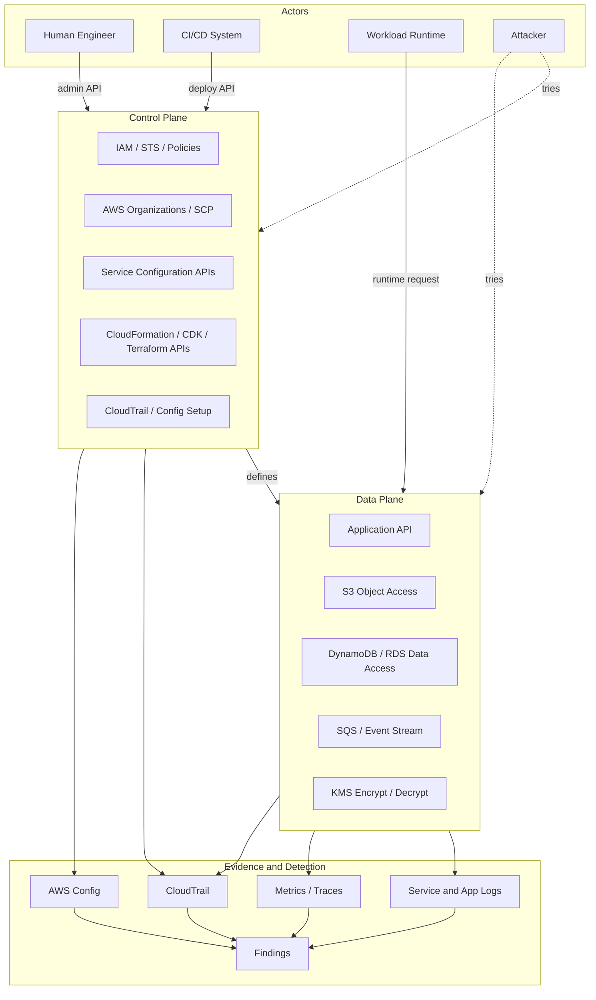
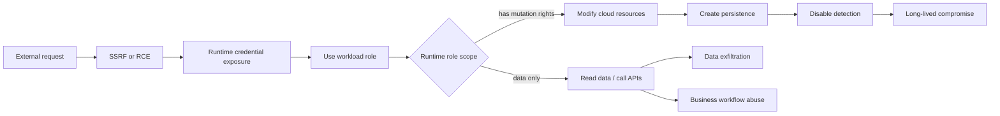
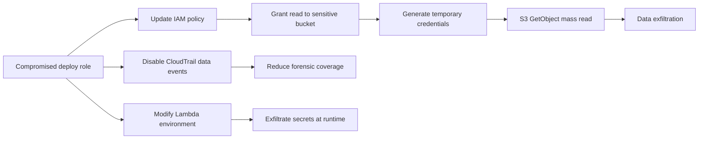

# AWS Control Plane and Data Plane

Ada satu pemisahan yang kalau benar-benar dipahami akan mengubah cara kita mendesain security, observability, incident response, dan reliability di AWS:

```text
Control plane mengubah sistem.
Data plane menjalankan fungsi sistem.
```

Banyak engineer tahu istilah ini, tetapi belum menggunakannya sebagai alat berpikir. Akibatnya desain cloud sering terlihat benar di diagram, tetapi rapuh di incident nyata.

Contoh:

- sistem failover butuh membuat resource baru saat incident;
- remediation security butuh mengubah banyak policy saat control plane sedang terdegradasi;
- runtime role aplikasi bisa melakukan action deploy;
- alarm hanya memantau data plane, tetapi tidak memantau perubahan control plane;
- audit hanya melihat `Create`, `Update`, `Delete`, tetapi tidak melihat data exfiltration;
- incident response runbook terlalu bergantung pada console, IAM, atau API administratif.

AWS sendiri memisahkan banyak service ke dalam control plane dan data plane. Control plane biasanya berisi API administratif untuk membuat, membaca, memperbarui, menghapus, dan mendaftarkan resource. Data plane menangani traffic harian atau fungsi utama service. Dalam prinsip reliability AWS, saat event yang berdampak pada resiliency terjadi, recovery sebaiknya meminimalkan operasi control plane dan lebih mengandalkan mekanisme data plane yang sudah dipersiapkan sebelumnya.

Part ini membangun mental model itu dari first principles.

---

## 1. Definisi kerja

Kita akan memakai definisi praktis berikut.

### 1.1 Control plane

Control plane adalah bagian sistem yang mengubah konfigurasi, resource, policy, routing, capacity, metadata, atau hubungan antar resource.

Contoh action control plane:

```text
CreateRole
AttachRolePolicy
PutBucketPolicy
AuthorizeSecurityGroupIngress
CreateFunction
UpdateFunctionConfiguration
CreateLoadBalancer
RegisterTargets
CreateTrail
StopLogging
PutKeyPolicy
CreateAccessKey
UpdateAssumeRolePolicy
CreateVpcEndpoint
PutConfigRule
```

Control plane menjawab:

```text
Bagaimana sistem dikonfigurasi?
Siapa boleh melakukan apa?
Resource apa yang ada?
Traffic harus diarahkan ke mana?
Logging aktif atau tidak?
Alarm apa yang dibuat?
Kunci mana yang boleh dipakai?
```

### 1.2 Data plane

Data plane adalah bagian sistem yang menjalankan fungsi utama resource terhadap traffic atau request aktual.

Contoh action data plane:

```text
S3 GetObject
S3 PutObject
DynamoDB GetItem
DynamoDB PutItem
Kinesis PutRecord
SQS SendMessage
SQS ReceiveMessage
Lambda Invoke
API Gateway request handling
ALB forwarding request
RDS query execution
ECS task serving HTTP traffic
CloudFront serving cached object
KMS Encrypt atau Decrypt
```

Data plane menjawab:

```text
Request user dilayani atau tidak?
Object bisa dibaca atau tidak?
Record bisa ditulis atau tidak?
Message bisa dikirim atau tidak?
Packet bisa mengalir atau tidak?
Kunci bisa dipakai untuk decrypt atau tidak?
```

### 1.3 Kenapa pemisahan ini penting?

Karena security incident, outage, dan audit punya sifat berbeda di dua plane ini.

| Dimensi | Control Plane | Data Plane |
|---|---|---|
| Tujuan utama | Mengubah konfigurasi dan resource | Menjalankan traffic/request produksi |
| Risiko utama | Unauthorized change, privilege escalation, guardrail bypass | Data exfiltration, abuse, unauthorized runtime access |
| Telemetry umum | CloudTrail management events, Config change, EventBridge events | Service logs, data events, app logs, flow logs, metrics, traces |
| Dampak compromise | Mengubah masa depan sistem | Mengeksploitasi fungsi berjalan saat ini |
| Recovery ideal | Predefined runbook, minimal mutation saat krisis | Pre-provisioned failover, throttling, isolation, routing |
| Kontrol utama | IAM, SCP, permission boundary, change control, Config | Resource policy, network path, encryption, throttling, monitoring |

Mental model yang benar:

```text
Control plane compromise = attacker dapat membentuk ulang sistem.
Data plane compromise = attacker dapat menyalahgunakan fungsi sistem.
```

Keduanya buruk, tetapi bentuk kerusakannya berbeda.

---

## 2. Diagram dasar



Perhatikan arah panah paling penting:

```text
Control plane defines data plane.
Data plane produces business behavior.
Evidence plane observes both.
```

Kalau control plane salah, data plane bisa menjadi salah walaupun aplikasinya tidak berubah.

---

## 3. Contoh konkret per service

Tidak semua service punya boundary yang terlihat sama, tetapi pola umumnya konsisten.

| Service | Control Plane | Data Plane | Contoh Security Risk |
|---|---|---|---|
| IAM | Membuat role, policy, trust policy, access key | STS credential issuance dan policy enforcement saat request | Privilege escalation via `iam:PassRole`, trust policy longgar |
| S3 | Membuat bucket, bucket policy, lifecycle, replication | `GetObject`, `PutObject`, `DeleteObject` | Public object access, exfiltration, object overwrite |
| EC2 | Membuat instance, security group, route, volume | Network packet flow, instance workload execution | Security group dibuka, instance disalahgunakan |
| ELB/ALB | Membuat listener, target group, rule | Forwarding request ke target | Routing ke target salah, TLS policy lemah |
| Lambda | Membuat function, update code/config, role | Invocation runtime | Runtime role terlalu luas, secret leak via env |
| DynamoDB | Membuat table, index, backup, policy | `GetItem`, `PutItem`, `Query`, `Scan` | Unauthorized read/write, hot partition abuse |
| KMS | Membuat key, key policy, grants, aliases | `Encrypt`, `Decrypt`, `GenerateDataKey` | Key policy memberi decrypt ke principal salah |
| CloudTrail | Membuat trail, mengubah event selector, stop logging | Delivery event ke storage | Attacker mematikan audit atau mengurangi event coverage |
| CloudWatch | Membuat alarm, dashboard, metric filter | Metrics/log ingestion dan query | Alarm dihapus atau tidak mencakup sinyal penting |
| Route 53 | Hosted zone dan record management | DNS query answering | Hijack record melalui unauthorized change |
| EKS | Cluster config, node group, access entry | Kubernetes API dan pod traffic | IAM/K8s boundary kacau, pod identity abuse |

Yang perlu diingat: “control plane” bukan berarti hanya AWS Console. Terraform apply, CDK deploy, CloudFormation stack update, GitHub Actions role, Jenkins role, dan internal platform portal adalah control plane client.

---

## 4. Control plane adalah sumber perubahan state

AWS security yang matang harus bisa menjawab pertanyaan berikut untuk setiap perubahan penting:

```text
Siapa mengubah apa?
Kapan?
Dari mana?
Dengan credential apa?
Melalui tool apa?
Terhadap resource mana?
Sebelum dan sesudah state-nya seperti apa?
Apakah perubahan ini sesuai policy?
Apakah perubahan ini berhubungan dengan incident?
```

CloudTrail menjawab banyak pertanyaan tentang API call. AWS Config menjawab perubahan konfigurasi resource dari waktu ke waktu. Tetapi keduanya punya cakupan, biaya, dan konfigurasi yang harus didesain.

### 4.1 Contoh: security group dibuka

Event:

```text
AuthorizeSecurityGroupIngress
```

Pertanyaan control-plane:

```text
Principal siapa yang memanggil?
Apakah role itu boleh mengubah security group production?
Apakah request berasal dari CI/CD atau laptop personal?
Apakah ada ticket/change ID?
Apakah rule membuka 0.0.0.0/0?
Apakah port sensitif?
Apakah AWS Config menandai non-compliant?
Apakah EventBridge memicu remediation?
```

Pertanyaan data-plane:

```text
Setelah rule terbuka, apakah ada traffic masuk?
IP mana yang mencoba connect?
Apakah ada successful handshake?
Apakah ada login attempt?
Apakah workload menerima request abnormal?
```

Security mature bukan hanya tahu bahwa rule berubah. Security mature tahu apakah perubahan itu menghasilkan exposure aktual.

### 4.2 Contoh: bucket policy berubah

Control-plane event:

```text
PutBucketPolicy
PutPublicAccessBlock
DeleteBucketPolicy
```

Data-plane event:

```text
GetObject
PutObject
DeleteObject
ListBucket
```

Jika bucket policy menjadi publik, kita perlu tahu:

- siapa membuat perubahan;
- apakah bucket berisi data sensitif;
- apakah public access block aktif;
- apakah ada object-level read setelah perubahan;
- apakah request berasal dari network tak dikenal;
- apakah Macie atau internal classifier memberi label data sensitif;
- apakah remediation memblokir policy atau mengembalikan state.

---

## 5. Data plane adalah tempat dampak bisnis terjadi

Control plane mengubah bentuk sistem. Tetapi dampak bisnis sering terjadi di data plane:

- data dibaca;
- transaksi dibuat;
- pesan dikirim;
- request user gagal;
- file dipublikasikan;
- query lambat;
- decrypt dilakukan;
- endpoint diserang;
- traffic diblokir;
- queue menumpuk.

Itu berarti observability data plane harus menghubungkan sinyal teknis ke dampak bisnis.

Contoh pertanyaan:

```text
Apakah user tidak bisa login?
Apakah pembayaran gagal?
Apakah case regulatory tidak bisa dieskalasi?
Apakah data sensitif dibaca oleh principal asing?
Apakah queue investigasi berhenti diproses?
Apakah SLA breach terjadi pada tenant tertentu?
```

Untuk workload serius, telemetry tidak cukup berupa CPU dan memory. Kita perlu sinyal domain:

```text
case_created_total
case_escalated_total
case_assignment_failed_total
authorization_denied_total
sensitive_record_read_total
export_requested_total
export_completed_total
policy_decision_latency_ms
workflow_state_transition_failed_total
```

Dalam konteks seri ini, domain metric seperti itu tidak dibahas sebagai desain aplikasi umum. Ia dibahas sebagai security dan operational evidence.

---

## 6. Control plane failure berbeda dari data plane failure

Ini bagian yang sering diremehkan.

Control plane biasanya dioptimalkan untuk konsistensi perubahan konfigurasi. Data plane biasanya didesain untuk availability fungsi utama. Artinya dalam kondisi gangguan, data plane bisa tetap berjalan walaupun operasi administratif tertentu terganggu.

Konsekuensinya:

```text
Jangan mendesain recovery produksi yang hanya bisa berjalan jika control plane sehat.
```

Contoh anti-pattern:

```text
Saat region bermasalah, sistem baru akan membuat database replica, membuat bucket, membuat role, update DNS, update route, dan deploy ulang service.
```

Itu terlalu banyak control plane operation saat situasi paling buruk.

Pattern yang lebih sehat:

```text
Resource kritis sudah disiapkan.
Failover path sudah diuji.
Role sudah ada.
KMS key sudah siap.
Logging sudah aktif.
Routing switch minimal.
Runbook mengutamakan action yang paling kecil dan paling deterministik.
```

### 6.1 Static stability

Static stability berarti sistem tetap berfungsi tanpa harus membuat banyak perubahan baru ketika terjadi gangguan.

Di security, static stability berarti:

- guardrail sudah aktif sebelum incident;
- detective control sudah mengirim sinyal sebelum incident;
- isolation mechanism sudah tersedia;
- break-glass sudah diuji;
- backup policy sudah berjalan;
- restore permission sudah disiapkan;
- log archive sudah immutable;
- incident role sudah punya akses tepat;
- runbook tidak meminta engineer “membuat semuanya sekarang”.

Kalau kita butuh improvisasi control plane besar saat incident, berarti desain operasional belum matang.

---

## 7. Security consequence: dua jenis compromise

Mari bedakan dua skenario.

### 7.1 Compromised deploy role

Deploy role biasanya punya akses control plane. Ia bisa:

- mengubah IAM role;
- mengganti Lambda code;
- mengganti ECS task definition;
- mengubah security group;
- mengubah bucket policy;
- mengubah CloudWatch alarm;
- mengganti KMS alias;
- membuat secret baru;
- mengubah parameter;
- deploy resource exfiltration.

Jika deploy role compromise, attacker bisa membentuk ulang environment.

Dampaknya sering lebih luas daripada runtime compromise karena attacker bisa membuat persistence:

```text
backdoor IAM role
malicious Lambda layer
alternate event rule
new access key
public snapshot
disabled alarm
weakened bucket policy
shadow logging destination
```

### 7.2 Compromised runtime role

Runtime role aplikasi biasanya punya akses data plane. Ia bisa:

- membaca object;
- menulis database;
- mengirim message;
- memanggil service internal;
- decrypt secret;
- publish event;
- menulis log;
- mengambil parameter;
- mengakses queue.

Jika runtime role compromise, attacker bisa menyalahgunakan fungsi aplikasi yang sedang berjalan.

Dampaknya sering langsung ke data:

```text
bulk read
unauthorized export
data tampering
fraudulent transaction
message poisoning
workflow manipulation
secret retrieval
```

### 7.3 Kesalahan fatal: role campuran

Anti-pattern paling berbahaya:

```text
Role yang dipakai runtime juga bisa deploy.
Role yang dipakai CI/CD juga bisa membaca semua data production.
Role yang dipakai support engineer juga bisa mengubah guardrail.
```

Prinsipnya:

```text
Deploy identity should mutate infrastructure.
Runtime identity should serve workload.
Human identity should operate through controlled elevation.
Security tooling identity should observe and remediate with bounded scope.
```

Jangan menyatukan plane yang berbeda hanya karena “lebih praktis”.

---

## 8. Control plane observability

Control plane observability bertujuan mendeteksi perubahan berbahaya sebelum data-plane impact membesar.

Minimal sinyal:

| Sinyal | Sumber | Pertanyaan |
|---|---|---|
| Management API call | CloudTrail | Siapa mengubah resource? |
| Configuration drift | AWS Config | State sekarang compliant atau tidak? |
| Organization change | CloudTrail Organizations | Account pindah OU? SCP berubah? |
| IAM change | CloudTrail IAM | Policy/trust/access key berubah? |
| Logging change | CloudTrail, Config | Audit dimatikan atau dikurangi? |
| Security service change | CloudTrail | GuardDuty/Security Hub/Config dimatikan? |
| Network exposure change | Config, CloudTrail | Port atau route terbuka? |
| KMS key change | CloudTrail, Config | Key policy melemah? |
| Public access change | Config, S3 controls | Bucket/snapshot/image terbuka? |

### 8.1 Event yang sebaiknya dianggap high-signal

Contoh event control plane yang layak menjadi trigger detection:

```text
StopLogging
DeleteTrail
PutEventSelectors
DeleteFlowLogs
PutBucketPolicy
DeleteBucketPolicy
PutPublicAccessBlock
DeletePublicAccessBlock
CreateAccessKey
AttachUserPolicy
PutUserPolicy
AttachRolePolicy
PutRolePolicy
UpdateAssumeRolePolicy
CreatePolicyVersion
SetDefaultPolicyVersion
PutKeyPolicy
CreateGrant
AuthorizeSecurityGroupIngress
ModifySnapshotAttribute
ModifyImageAttribute
DisableSecurityHub
DeleteDetector
StopConfigurationRecorder
```

Tidak semua event selalu malicious. Tetapi event seperti ini mengubah kemampuan audit, akses, exposure, atau privilege. Ia harus masuk daftar “known dangerous mutations”.

---

## 9. Data plane observability

Data plane observability bertujuan memahami penggunaan aktual dan dampak aktual.

Minimal sinyal:

| Area | Sinyal | Contoh |
|---|---|---|
| Object storage | S3 data events, access logs | `GetObject` massal dari principal asing |
| Database | audit log, query log, app metric | query tidak normal, export masif |
| Network | VPC Flow Logs, ALB logs, WAF logs | scan, unusual egress, rejected connection |
| Runtime | app logs, traces, metrics | spike error, auth bypass, tenant anomaly |
| Messaging | queue depth, message age, DLQ | poisoning, backlog, consumer stuck |
| Cryptography | KMS CloudTrail events | decrypt spike, unexpected principal |
| API | access logs, WAF, app auth logs | credential stuffing, rate abuse |

### 9.1 Data event tidak boleh diaktifkan tanpa desain

Beberapa data-plane telemetry bisa besar dan mahal, terutama S3 object-level data events atau high-volume Lambda/DynamoDB events. Jadi prinsipnya bukan “aktifkan semua”. Prinsipnya:

```text
Aktifkan data-plane evidence untuk resource yang risikonya membenarkan biaya dan volume.
```

Kriteria:

- data sensitif;
- regulated workload;
- shared tenant data;
- external-facing object access;
- high-value KMS key;
- privileged admin bucket;
- forensic requirement;
- incident history;
- business critical path.

---

## 10. Plane-aware IAM design

IAM design harus memisahkan aksi berdasarkan plane.

### 10.1 Deploy role

Deploy role boleh melakukan control-plane mutation yang diperlukan untuk deployment.

Tetapi deploy role sebaiknya tidak otomatis boleh:

- membaca semua secret production;
- decrypt semua data;
- membaca semua object customer;
- assume break-glass role;
- mematikan CloudTrail;
- menghapus Config recorder;
- mengubah SCP;
- men-disable GuardDuty;
- membuat access key manusia;
- mengubah billing/payment account.

Deploy role harus dibatasi oleh:

- account boundary;
- permission boundary;
- IaC-controlled resource path;
- condition key;
- tag-based scope jika matang;
- explicit deny untuk security baseline;
- approval untuk production mutation tertentu.

### 10.2 Runtime role

Runtime role boleh menjalankan data-plane operation yang diperlukan aplikasi.

Runtime role sebaiknya tidak bisa:

- mengubah IAM policy;
- membuat role;
- update function/task definition sendiri;
- mengubah security group;
- membuat public bucket;
- disable logging;
- membuat access key;
- read semua secret lintas service;
- decrypt dengan semua KMS key.

Runtime role harus kecil, spesifik, dan punya dependency eksplisit.

### 10.3 Security tooling role

Security tooling role punya kebutuhan khusus: observe luas, mutate terbatas.

Pattern yang sehat:

```text
Read broadly.
Detect centrally.
Remediate through pre-approved narrow actions.
Escalate for destructive actions.
```

Contoh remediation yang bisa diotomasi:

- re-enable public access block;
- revoke dangerous security group ingress;
- quarantine instance by changing security group;
- disable compromised access key;
- tag finding resource;
- create incident ticket;
- snapshot evidence;
- isolate IAM role session by policy update jika benar-benar diuji.

Tapi otomatisasi destructive seperti delete resource, rotate all keys, atau stop all instances harus punya guardrail kuat.

---

## 11. Plane-aware incident response

Incident response sering gagal karena runbook tidak membedakan plane.

### 11.1 Saat control plane dicurigai compromise

Contoh indikator:

- CloudTrail menunjukkan policy berubah tanpa change record;
- security service dimatikan;
- access key baru dibuat;
- trust policy role berubah;
- bucket policy melemah;
- SCP berubah;
- root digunakan;
- CI/CD role melakukan action aneh.

Prioritas:

```text
1. Preserve evidence.
2. Stop further mutation.
3. Identify compromised principal.
4. Revoke or constrain credential/session.
5. Restore known-good control state.
6. Validate data-plane impact.
7. Add detections for persistence path.
```

Poin penting: jangan langsung “memperbaiki semua” sebelum evidence minimum aman. Perubahan panik bisa menghapus jejak.

### 11.2 Saat data plane dicurigai compromise

Contoh indikator:

- data read melonjak;
- KMS decrypt spike;
- WAF mendeteksi exploit;
- app authorization anomaly;
- queue diisi payload aneh;
- export endpoint dipakai abnormal;
- database query pattern berubah.

Prioritas:

```text
1. Stop active abuse.
2. Bound blast radius.
3. Preserve request/log evidence.
4. Identify abused identity or endpoint.
5. Validate whether control plane was also changed.
6. Rotate/revoke affected credentials.
7. Recover data integrity if needed.
```

Data-plane incident harus selalu mengecek control plane juga. Banyak attacker memulai dari data plane lalu berusaha naik ke control plane.

---

## 12. Attack path: dari data plane ke control plane



Pelajaran:

```text
Runtime role yang terlalu luas mengubah data-plane compromise menjadi control-plane compromise.
```

Karena itu, pertanyaan paling tajam untuk setiap workload identity adalah:

```text
Jika credential ini bocor, apakah attacker hanya bisa memakai fungsi runtime yang memang dibutuhkan, atau bisa mengubah bentuk infrastruktur?
```

Jika jawabannya yang kedua, boundary salah.

---

## 13. Attack path: dari control plane ke data plane



Pelajaran:

```text
Control-plane access adalah kemampuan menciptakan data-plane access.
```

Jadi deploy role harus diperlakukan sebagai high-value security principal, bukan hanya automation helper.

---

## 14. Plane-aware guardrail design

Guardrail harus ditempatkan sesuai plane.

### 14.1 Preventive control di control plane

Contoh:

- SCP mencegah disable CloudTrail;
- permission boundary mencegah developer membuat admin role;
- IAM condition membatasi region;
- S3 public access block default;
- required encryption via policy;
- explicit deny untuk `iam:CreateAccessKey` di human roles;
- deny `PutBucketPolicy` yang membuat public access;
- deny `ec2:AuthorizeSecurityGroupIngress` untuk port tertentu dari internet;
- deny `kms:PutKeyPolicy` kecuali security admin path.

### 14.2 Detective control di control plane

Contoh:

- Config rule untuk public bucket;
- Security Hub control;
- Access Analyzer external access finding;
- CloudTrail Lake query;
- EventBridge rule untuk dangerous mutation;
- Config aggregator untuk organization-wide compliance.

### 14.3 Preventive control di data plane

Contoh:

- resource policy membatasi source account/source VPC endpoint;
- KMS encryption context;
- VPC endpoint policy;
- WAF rule;
- rate limit;
- token scope;
- app-level authorization;
- private endpoint;
- mTLS untuk internal service jika justified;
- S3 object ownership dan block ACL.

### 14.4 Detective control di data plane

Contoh:

- S3 data event untuk bucket sensitif;
- KMS decrypt anomaly;
- VPC Flow Logs egress detection;
- ALB/WAF logs;
- application audit logs;
- GuardDuty finding;
- Macie sensitive data finding;
- domain-level access anomaly.

---

## 15. The “minimum mutation” principle

Untuk operasi production, terutama recovery dan incident response:

```text
Semakin sedikit mutation saat krisis, semakin tinggi peluang recovery berhasil.
```

Mutation saat krisis buruk karena:

- engineer sedang stres;
- approval bisa dilewati;
- audit bisa berantakan;
- dependency tidak terlihat;
- control plane mungkin lambat atau degraded;
- rollback tidak jelas;
- perubahan bisa memperluas incident;
- postmortem sulit karena sistem berubah terlalu banyak.

Prinsip desain:

```text
Prepare control plane before crisis.
Operate data plane during crisis.
Mutate only what is necessary.
Record every mutation.
```

---

## 16. Practical checklist: workload review

Gunakan checklist ini ketika mereview workload AWS.

### 16.1 Identity separation

```text
[ ] Apakah human admin, deploy role, runtime role, dan security tooling role terpisah?
[ ] Apakah runtime role tidak punya IAM mutation?
[ ] Apakah deploy role tidak bisa membaca semua data production?
[ ] Apakah break-glass role punya audit dan approval jelas?
[ ] Apakah third-party role dibatasi external ID, scope, dan duration?
```

### 16.2 Control-plane visibility

```text
[ ] Apakah semua management events terekam CloudTrail organization-wide?
[ ] Apakah CloudTrail multi-region?
[ ] Apakah Config merekam resource kritis?
[ ] Apakah perubahan IAM, KMS, S3 policy, security group, dan logging diberi alert?
[ ] Apakah security service disable event diberi alert?
```

### 16.3 Data-plane visibility

```text
[ ] Apakah resource sensitif punya data-plane logging yang cukup?
[ ] Apakah S3/KMS/DB access ke data sensitif bisa ditelusuri?
[ ] Apakah app audit log punya actor, tenant, action, resource, decision, correlation ID?
[ ] Apakah egress abnormal bisa dideteksi?
[ ] Apakah high-volume logging punya retention dan cost control?
```

### 16.4 Recovery design

```text
[ ] Apakah failover tidak bergantung pada membuat banyak resource baru?
[ ] Apakah IAM role recovery sudah ada sebelum incident?
[ ] Apakah backup restore permission sudah diuji?
[ ] Apakah runbook bisa berjalan saat console lambat/tidak nyaman?
[ ] Apakah data-plane switch lebih dominan daripada control-plane mutation?
```

### 16.5 Guardrails

```text
[ ] Apakah security baseline dilindungi SCP atau permission boundary?
[ ] Apakah public exposure dicegah sebelum deploy?
[ ] Apakah logging tidak bisa dimatikan oleh workload account biasa?
[ ] Apakah KMS key policy punya separation of duties?
[ ] Apakah dangerous mutation punya detection dan remediation?
```

---

## 17. Contoh review: API workload sederhana

Misalkan ada workload:

```text
CloudFront -> ALB -> ECS service -> RDS + S3 + SQS
```

### 17.1 Control-plane surface

- CloudFront distribution config.
- WAF rules.
- ALB listener/rules/target group.
- ECS service/task definition.
- IAM execution role dan task role.
- Security group.
- RDS parameter/subnet/security config.
- S3 bucket policy.
- SQS queue policy.
- KMS key policy.
- CloudWatch alarm/log group.
- Secrets Manager secret.

### 17.2 Data-plane surface

- User HTTP request.
- ALB forwarded request.
- ECS task runtime.
- SQL query ke RDS.
- S3 `GetObject`/`PutObject`.
- SQS `SendMessage`/`ReceiveMessage`.
- KMS decrypt untuk secret/data key.
- CloudWatch log ingestion.

### 17.3 Key question

```text
Jika ECS task role bocor, apakah attacker bisa:
- membaca semua S3 object?
- membaca semua secret?
- decrypt semua KMS key?
- mengirim arbitrary message?
- mengubah ECS service?
- mengubah security group?
- membuat IAM role?
```

Kalau jawabannya “ya” untuk mutation control-plane, desain role perlu diperbaiki.

### 17.4 Detection map

| Event | Plane | Detection |
|---|---|---|
| WAF blocked request spike | Data | WAF logs, metric alarm |
| ECS task role calls unusual API | Data/control depending action | CloudTrail anomaly/query |
| Security group opens public admin port | Control | Config rule, EventBridge remediation |
| S3 object read spike | Data | CloudTrail data event, S3 server access/log analytics |
| KMS decrypt spike | Data | CloudTrail KMS events, anomaly alarm |
| Task definition updated outside CI/CD | Control | CloudTrail source identity and deploy role validation |
| CloudWatch alarm deleted | Control | CloudTrail dangerous mutation rule |

---

## 18. Common anti-patterns

### 18.1 “CloudTrail sudah aktif, berarti semua aman”

CloudTrail management events tidak otomatis memberi semua data-plane evidence. Untuk beberapa service dan resource, data events perlu desain terpisah.

### 18.2 “Semua remediation bisa otomatis”

Tidak semua harus otomatis. Remediation yang salah bisa menjadi outage. Otomatisasi harus punya scope, idempotency, rollback, dan exception model.

### 18.3 “Deploy role boleh admin karena hanya dipakai pipeline”

Pipeline adalah target bernilai tinggi. Jika pipeline compromise, admin deploy role menjadi jalan penuh ke control plane.

### 18.4 “Runtime role butuh admin untuk fleksibilitas”

Itu menghapus boundary antara data plane dan control plane. Jika runtime compromise, attacker bisa mengubah infrastruktur.

### 18.5 “Failover nanti tinggal Terraform apply”

Pada incident besar, control plane dependency bisa memperlambat recovery. Resource kritis dan permission recovery harus siap sebelum insiden.

### 18.6 “Monitoring hanya CPU, memory, dan HTTP 5xx”

Itu monitoring infrastruktur dasar. Security dan operations butuh event mutation, access pattern, authorization decision, data movement, queue health, dependency health, dan business outcome.

---

## 19. Engineering artifacts yang harus dihasilkan

Setelah memahami part ini, setiap workload penting sebaiknya punya artifact berikut.

### 19.1 Plane map

```text
Resource: S3 customer-document-bucket
Control-plane actions:
- CreateBucket
- PutBucketPolicy
- PutPublicAccessBlock
- PutLifecycleConfiguration
- PutReplicationConfiguration
- PutEncryptionConfiguration

Data-plane actions:
- GetObject
- PutObject
- DeleteObject
- ListBucket

Control-plane owners:
- Platform deploy role
- Storage admin role

Data-plane users:
- document-service task role
- export-service task role

Critical telemetry:
- CloudTrail management events
- S3 data events for regulated prefixes
- Macie classification
- Config public access rule
- KMS decrypt events
```

### 19.2 Dangerous mutation list

```text
Action: PutBucketPolicy
Risk: public exposure or cross-account access
Allowed path: IaC deploy role only
Detection: EventBridge + CloudTrail
Response: validate policy, block if public, notify owner
Evidence: CloudTrail event + Config diff
```

### 19.3 Data access evidence map

```text
Data class: regulated case document
Storage: S3 bucket prefix /cases/
Accessing role: case-document-service-prod-task-role
Required evidence: actor, case ID, tenant ID, object key hash, decision, request ID
AWS telemetry: S3 data event, KMS decrypt event
Application telemetry: domain audit log
Retention: according to regulatory evidence policy
```

---

## 20. Tiny lab: classify plane by action

Klasifikasikan action berikut.

| Action | Plane | Why |
|---|---|---|
| `ec2:AuthorizeSecurityGroupIngress` | Control | Mengubah network exposure. |
| `s3:GetObject` | Data | Membaca object. |
| `iam:UpdateAssumeRolePolicy` | Control | Mengubah trust boundary role. |
| `kms:Decrypt` | Data | Memakai key untuk operasi cryptographic runtime. |
| `cloudtrail:StopLogging` | Control | Mengubah audit behavior. |
| `lambda:InvokeFunction` | Data | Menjalankan function. |
| `lambda:UpdateFunctionCode` | Control | Mengubah code yang akan berjalan. |
| `dynamodb:PutItem` | Data | Menulis item. |
| `dynamodb:UpdateTable` | Control | Mengubah table configuration. |
| `organizations:MoveAccount` | Control | Mengubah governance boundary. |

Latihan ini sederhana, tetapi efeknya besar. Setelah terbiasa, kita bisa membaca IAM policy dan langsung melihat apakah role itu runtime role, deploy role, security role, atau campuran berbahaya.

---

## 21. Key takeaways

1. Control plane mengubah state; data plane menjalankan fungsi.
2. Control-plane compromise memberi attacker kemampuan membentuk ulang sistem.
3. Data-plane compromise memberi attacker kemampuan menyalahgunakan fungsi berjalan.
4. Runtime role tidak boleh punya mutation control-plane kecuali benar-benar diperlukan dan dibatasi ketat.
5. Deploy role tidak boleh otomatis punya akses baca data production.
6. CloudTrail management events penting, tetapi tidak selalu cukup untuk data-plane evidence.
7. Recovery production harus meminimalkan control-plane mutation saat krisis.
8. Guardrail, detection, dan runbook harus plane-aware.
9. Static stability lebih baik daripada improvisasi saat incident.
10. Semua part berikutnya akan memakai model ini.

---

## 22. Preview part berikutnya

Part berikutnya membahas **Threat Model for AWS Workloads**.

Kita akan menyusun threat model yang tidak berhenti di diagram aplikasi. Kita akan memasukkan account boundary, identity, control-plane API, data-plane path, secret, KMS, telemetry, supply chain, egress, dan incident response. Tujuannya agar threat model menjadi alat engineering nyata, bukan dokumen formalitas.

---

## Referensi resmi

- AWS Fault Isolation Boundaries — Control planes and data planes: https://docs.aws.amazon.com/whitepapers/latest/aws-fault-isolation-boundaries/control-planes-and-data-planes.html
- AWS Well-Architected Reliability Pillar — REL11-BP04 Rely on the data plane and not the control plane during recovery: https://docs.aws.amazon.com/wellarchitected/latest/reliability-pillar/rel_withstand_component_failures_avoid_control_plane.html
- Amazon Route 53 Application Recovery Controller — Data and control planes: https://docs.aws.amazon.com/r53recovery/latest/dg/data-and-control-planes.html
- AWS Fault Isolation Boundaries — Global services: https://docs.aws.amazon.com/whitepapers/latest/aws-fault-isolation-boundaries/global-services.html
- AWS Well-Architected Security Pillar: https://docs.aws.amazon.com/wellarchitected/latest/security-pillar/welcome.html
