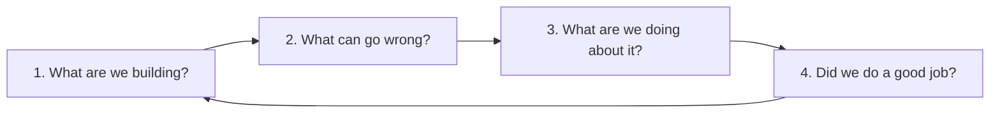
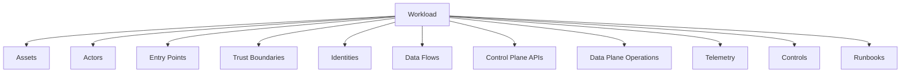
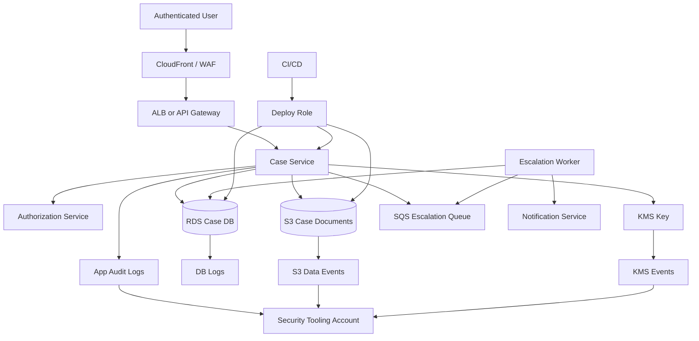

# Threat Model for AWS Workloads

Threat model yang buruk biasanya berbentuk checklist.

Threat model yang berguna berbentuk peta keputusan:

```text
Apa yang kita lindungi?
Siapa yang bisa menyerang?
Dari jalur mana?
Privilege apa yang bisa didapat?
Data apa yang bisa disentuh?
Kontrol apa yang mencegah?
Sinyal apa yang mendeteksi?
Runbook apa yang merespons?
Apa bukti bahwa kontrol itu bekerja?
```

Di AWS, threat model tidak cukup menggambar user, API, database, dan internet. Itu terlalu aplikasi-sentris. Workload AWS hidup di dalam sistem yang lebih besar: account, role, trust policy, KMS key, bucket policy, VPC endpoint, CI/CD role, CloudTrail, Config, GuardDuty, Security Hub, CloudWatch, backup vault, dan organization guardrail.

Jadi threat model AWS harus memasukkan dua hal sekaligus:

```text
1. Threat terhadap aplikasi dan data.
2. Threat terhadap cloud control surface yang membentuk aplikasi dan data itu.
```

AWS Well-Architected Security Pillar menempatkan threat modeling sebagai praktik untuk mengidentifikasi, memelihara, dan memprioritaskan ancaman beserta mitigasinya. Model ini harus diperbarui mengikuti perubahan workload dan lanskap ancaman, bukan dibuat sekali lalu dilupakan.

---

## 1. Apa yang salah dari threat model biasa?

Banyak threat model gagal karena terlalu dangkal.

Contoh threat model yang tidak cukup:

```text
Threat: attacker mengakses API.
Mitigation: gunakan authentication.
```

Ini bukan threat model. Ini kalimat umum.

Threat model yang lebih berguna:

```text
Threat: attacker memakai credential user valid hasil phishing untuk mengakses endpoint export case document.
Asset: regulated case document.
Entry point: public API /cases/{caseId}/documents/export.
Trust boundary: internet -> API Gateway/ALB -> app service -> S3/KMS.
Abuse path: valid token -> missing object-level authorization -> batch export -> S3 GetObject -> KMS Decrypt.
Preventive controls: MFA, risk-based session, object-level authorization, tenant/case policy decision, export quota, KMS encryption context.
Detective controls: unusual export count, S3 GetObject spike, KMS decrypt anomaly, domain audit log, GuardDuty where applicable.
Response: disable session, revoke token, quarantine account, preserve evidence, notify data owner, rotate affected credentials if needed.
Residual risk: compromised privileged internal user can still request export; requires approval workflow and monitoring.
```

Perbedaannya jauh.

Threat model yang matang tidak hanya menyebut “gunakan auth”. Ia menjelaskan path, boundary, control, signal, owner, dan residual risk.

---

## 2. Empat pertanyaan dasar

Gunakan empat pertanyaan ini sebagai loop utama.



Dalam konteks AWS, terjemahannya:

### 2.1 What are we building?

Bukan hanya “aplikasi X”. Jawab secara struktural:

- account mana;
- region mana;
- environment mana;
- service AWS apa;
- identity apa;
- data apa;
- endpoint apa;
- trust boundary apa;
- deployment path apa;
- observability apa;
- recovery mechanism apa;
- compliance requirement apa.

### 2.2 What can go wrong?

Pertanyaan ini harus mencakup:

- unauthorized access;
- privilege escalation;
- data exfiltration;
- data tampering;
- workflow manipulation;
- denial of service;
- logging evasion;
- backup destruction;
- credential theft;
- supply-chain compromise;
- misconfiguration;
- insider misuse;
- cross-account trust abuse;
- tenant isolation failure;
- cost/resource abuse.

### 2.3 What are we doing about it?

Jawaban harus dibagi:

```text
Prevent: bagaimana mencegah?
Detect: bagaimana mengetahui?
Respond: bagaimana menghentikan?
Recover: bagaimana memulihkan?
Prove: bagaimana membuktikan?
```

### 2.4 Did we do a good job?

Buktikan dengan:

- test case;
- policy simulation;
- access analyzer finding;
- Config compliance;
- Security Hub posture;
- CloudTrail query;
- game day;
- incident simulation;
- restore test;
- penetration test where appropriate;
- review residual risk.

---

## 3. Unit kerja threat model AWS

Threat model AWS harus punya beberapa unit eksplisit.



### 3.1 Assets

Asset adalah hal bernilai yang harus dilindungi.

Contoh asset:

- data customer;
- regulated case file;
- investigation record;
- payment data;
- authorization policy;
- encryption key;
- audit log;
- model artifact;
- production database;
- deployment pipeline;
- admin role;
- backup vault;
- incident evidence;
- domain workflow state.

Jangan hanya menyebut “data”. Klasifikasikan data.

| Asset | Data Class | Impact if Compromised |
|---|---|---|
| Case document | Regulated confidential | Legal breach, enforcement failure, reputational loss |
| User session token | Secret | Account takeover |
| KMS key policy | Security control | Mass decrypt possibility |
| CloudTrail logs | Evidence | Forensic blind spot |
| CI/CD deploy role | Privileged identity | Full environment mutation |
| Backup vault | Recovery asset | Ransomware recovery failure |

### 3.2 Actors

Actor bukan hanya attacker eksternal.

| Actor | Capability | Concern |
|---|---|---|
| Anonymous internet user | Hit public endpoint | Exploit, DDoS, scraping |
| Authenticated low-privilege user | Valid token | Broken object-level authorization |
| Privileged business user | Broad domain access | Insider misuse, mass export |
| Developer | Deploy or inspect environment | Accidental exposure, privilege misuse |
| CI/CD system | Control-plane mutation | Supply-chain compromise |
| Workload runtime | Data-plane access | SSRF/RCE credential abuse |
| Third-party vendor | Cross-account role/API integration | Confused deputy, overbroad trust |
| Security automation | Remediation role | Bad automation causing outage |
| Break-glass operator | Emergency privilege | Uncontrolled mutation if abused |

### 3.3 Entry points

Entry point adalah tempat attacker bisa mulai berinteraksi.

Contoh:

- public HTTP endpoint;
- admin console;
- SSO login;
- CI/CD trigger;
- webhook;
- S3 presigned URL;
- upload file;
- message queue;
- email ingestion;
- partner API;
- internal service endpoint;
- SSH/session access;
- CloudFormation/Terraform pipeline;
- support tooling;
- customer export feature;
- API key endpoint.

### 3.4 Trust boundaries

Trust boundary adalah garis perubahan tingkat kepercayaan.

Contoh boundary AWS:

```text
Internet -> edge/WAF
Edge -> application runtime
Application -> database
Application -> object storage
Workload account -> security tooling account
Developer workstation -> IAM Identity Center
CI/CD platform -> AWS STS
Runtime container -> IMDS/credential provider
Tenant A -> shared service -> Tenant B data
Prod account -> log archive account
Application -> KMS key
```

Threat model yang tidak menggambar trust boundary biasanya kehilangan serangan paling penting.

---

## 4. AWS-specific threat surfaces

### 4.1 Identity and privilege

Pertanyaan:

```text
Siapa bisa assume role?
Role mana punya admin?
Role mana bisa pass role?
Policy mana punya wildcard?
Trust policy mana menerima external principal?
Apakah source identity terekam?
Apakah session duration masuk akal?
Apakah permission boundary dipakai?
```

Threat:

- privilege escalation via `iam:PassRole`;
- overbroad trust policy;
- external ID tidak ada untuk vendor;
- long-lived access key;
- stale user/role;
- wildcard resource/action;
- missing MFA for privileged role;
- role chaining menghilangkan attribution;
- permission boundary bypass.

### 4.2 Network exposure

Pertanyaan:

```text
Endpoint mana publik?
Port mana terbuka?
Egress ke mana diizinkan?
Apakah private endpoint digunakan?
Apakah VPC endpoint policy membatasi resource?
Apakah DNS path bisa disalahgunakan?
Apakah WAF/Shield relevan?
```

Threat:

- public admin port;
- unrestricted egress;
- data exfiltration via NAT;
- SSRF ke metadata service;
- bypass via alternate endpoint;
- misconfigured security group;
- overly broad private connectivity;
- DNS exfiltration.

### 4.3 Data storage

Pertanyaan:

```text
Data apa disimpan di S3/RDS/DynamoDB/OpenSearch/EFS?
Apakah encryption at rest aktif?
KMS key apa dipakai?
Siapa bisa decrypt?
Siapa bisa export?
Siapa bisa snapshot?
Siapa bisa share snapshot?
Apakah data-plane access direkam?
```

Threat:

- bucket public;
- snapshot public/cross-account;
- backup exposed;
- weak bucket policy;
- unauthorized export;
- mass read;
- missing object-level authorization;
- KMS key policy overly permissive;
- data retained beyond policy;
- logs berisi data sensitif.

### 4.4 Secrets and credentials

Pertanyaan:

```text
Secret disimpan di mana?
Siapa bisa read secret?
Apakah secret dipakai di env var?
Apakah rotation ada?
Apakah secret muncul di log?
Apakah CI/CD menyimpan credential statis?
```

Threat:

- secret in code;
- secret in log;
- secret in container image;
- secret in build artifact;
- stale database password;
- broad `secretsmanager:GetSecretValue`;
- secret copied to Parameter Store without encryption discipline;
- manual sharing credential.

### 4.5 CI/CD and supply chain

Pertanyaan:

```text
Siapa bisa merge ke main?
Siapa bisa trigger deploy prod?
Role apa dipakai pipeline?
Apakah artifact signed?
Apakah dependency scanned?
Apakah IaC plan reviewed?
Apakah pipeline bisa read production data?
```

Threat:

- malicious code deploy;
- compromised GitHub token;
- poisoned dependency;
- overprivileged deploy role;
- build log secret leak;
- Terraform state leak;
- artifact registry compromise;
- unreviewed IaC changing security baseline.

### 4.6 Observability and evidence

Pertanyaan:

```text
Apakah CloudTrail aktif organization-wide?
Apakah log archive immutable?
Apakah Config merekam resource kritis?
Apakah app audit log punya actor/action/resource/decision?
Apakah attacker bisa menghapus log?
Apakah alarm bisa dimatikan oleh workload role?
```

Threat:

- CloudTrail disabled;
- event selector dikurangi;
- log retention terlalu pendek;
- log bisa dihapus oleh account owner;
- audit log tidak punya correlation ID;
- security finding tidak punya owner;
- alert fatigue membuat finding diabaikan;
- attacker membuat noise untuk menyembunyikan sinyal.

### 4.7 Backup and recovery

Pertanyaan:

```text
Apa restore objective?
Backup ada di account mana?
Apakah vault lock digunakan?
Siapa bisa delete recovery point?
Apakah restore diuji?
Apakah backup terenkripsi dengan key yang bisa dipakai saat incident?
```

Threat:

- backup deleted;
- backup encrypted dengan key yang hilang;
- restore role tidak siap;
- backup tidak mencakup data penting;
- retention tidak memenuhi regulasi;
- ransomware menghapus primary dan backup;
- restore belum pernah diuji.

---

## 5. STRIDE, tetapi diterjemahkan ke AWS

STRIDE tetap berguna kalau diterjemahkan ke cloud reality.

| STRIDE | AWS Interpretation | Example |
|---|---|---|
| Spoofing | Principal palsu atau credential dicuri | Stolen STS credential memakai role aplikasi |
| Tampering | Resource/data/config diubah ilegal | Bucket policy diubah agar publik |
| Repudiation | Tidak bisa membuktikan siapa melakukan apa | App audit log tanpa actor/correlation ID |
| Information Disclosure | Data terbuka atau diekspor | S3 object read massal dari role salah |
| Denial of Service | Resource/service dibuat tidak tersedia | WAF bypass, queue flood, KMS throttle, RDS exhaustion |
| Elevation of Privilege | Hak akses naik dari scope awal | `iam:PassRole` ke admin role |

Namun jangan berhenti di STRIDE. Untuk AWS, tambahkan kategori berikut.

| Extra Category | Why It Matters |
|---|---|
| Logging Evasion | Attacker sering mencoba mematikan atau mengurangi audit. |
| Persistence | Attacker membuat role, key, event rule, Lambda, atau policy untuk akses berulang. |
| Lateral Movement | Dari satu workload/account ke workload/account lain. |
| Data Plane Abuse | Menggunakan izin legitimate untuk tujuan malicious. |
| Governance Bypass | Mengubah OU, SCP, Config, Security Hub, GuardDuty, atau baseline. |
| Cost Abuse | Mining, resource spam, data transfer, logging explosion. |
| Recovery Destruction | Menghapus backup, key, snapshot, atau runbook. |

---

## 6. Attack library untuk AWS workload

Gunakan library ini untuk memulai threat enumeration. Jangan jadikan checklist mati; jadikan pemicu diskusi.

### 6.1 Credential theft

```text
Threat:
Credential human, CI/CD, atau workload runtime dicuri.

Entry points:
phishing, malware, leaked env var, build log, SSRF, RCE, exposed metadata credential, copied access key.

Impact:
API abuse sesuai permission credential.

Controls:
IAM Identity Center, MFA, temporary credentials, no long-lived key, least privilege, source identity, short session, CloudTrail detection, GuardDuty findings.
```

### 6.2 Privilege escalation

```text
Threat:
Principal low/mid privilege mendapat hak lebih tinggi.

Paths:
iam:PassRole, sts:AssumeRole trust weakness, policy version change, permission boundary bypass, CloudFormation service role abuse, Lambda role mutation.

Controls:
permission boundaries, SCP explicit deny, Access Analyzer, policy review, IAM path conventions, deploy role separation.
```

### 6.3 Public exposure

```text
Threat:
Resource yang harus private menjadi publik.

Paths:
S3 bucket policy, object ACL, public snapshot, public AMI, security group 0.0.0.0/0, OpenSearch public endpoint, API Gateway misconfig.

Controls:
S3 Block Public Access, Config rules, SCP, Security Hub controls, Access Analyzer, EventBridge remediation.
```

### 6.4 Data exfiltration

```text
Threat:
Data sensitif dibaca dan dikirim keluar.

Paths:
S3 GetObject mass read, database export, snapshot share, application export endpoint, unrestricted egress, KMS decrypt abuse.

Controls:
object-level authorization, VPC endpoint policy, egress filtering, Macie, KMS encryption context, data events, anomaly detection, export workflow approval.
```

### 6.5 Logging and detection evasion

```text
Threat:
Attacker mengurangi visibilitas.

Paths:
StopLogging, DeleteTrail, PutEventSelectors, StopConfigurationRecorder, disable GuardDuty, delete alarms, shorten retention, alter subscription filter.

Controls:
SCP deny, delegated security admin, log archive account, immutable storage, EventBridge high-priority alert, Config rule.
```

### 6.6 Workload runtime compromise

```text
Threat:
Application container/function/instance dikompromikan.

Paths:
RCE, vulnerable dependency, SSRF, deserialization, file upload exploit, exposed admin endpoint.

Impact:
Runtime role abuse, data read/write, internal service calls, secret retrieval.

Controls:
least privilege runtime role, IMDSv2 for EC2, network segmentation, WAF, patching, Inspector, app-level auth, secrets hygiene, egress control.
```

### 6.7 CI/CD compromise

```text
Threat:
Pipeline deploys malicious infra or code.

Paths:
repo compromise, stolen token, malicious dependency, compromised runner, unprotected branch, overbroad OIDC trust.

Controls:
branch protection, OIDC scoped trust, least privilege deploy role, artifact signing, IaC policy checks, environment approval, CloudTrail deploy attribution.
```

### 6.8 Backup destruction

```text
Threat:
Attacker menghapus kemampuan recovery.

Paths:
delete recovery point, disable backup plan, delete vault, delete KMS key, modify retention, compromise backup admin role.

Controls:
AWS Backup policies, vault lock, separate backup account, SCP deny destructive action, restore testing, KMS governance.
```

---

## 7. Threat register schema

Threat model harus menghasilkan register yang bisa diprioritaskan dan ditindaklanjuti.

Gunakan schema berikut.

```text
id: THR-AWS-001
workload: case-management-prod
asset: regulated case document
actor: authenticated user with valid token
entryPoint: GET /cases/{caseId}/documents/{documentId}
trustBoundary: public API -> app service -> S3/KMS
threat: user accesses document from another tenant or case
attackPath:
  - obtain valid session
  - guess or enumerate document ID
  - call document endpoint
  - app checks authentication but not object-level authorization
  - app reads S3 object and decrypts through KMS
impact: regulated data disclosure
likelihood: medium
impactLevel: critical
risk: high
preventiveControls:
  - object-level authorization policy
  - tenant/case ownership check
  - non-enumerable IDs
  - KMS encryption context includes tenant/case
  - API rate limit
 detectiveControls:
  - domain audit log for document read
  - unusual cross-case access detection
  - S3 data events on regulated prefix
  - KMS decrypt anomaly
responseControls:
  - revoke session
  - disable user
  - block export/read feature if systemic
  - preserve logs
recoveryControls:
  - legal notification workflow
  - incident report
  - policy fix and backfill scan
owner: case-platform-team
controlOwner: security-platform-team
status: open
reviewDate: 2026-08-01
residualRisk: medium after controls
```

Jangan takut threat register terlihat “terlalu engineering”. Justru itu tujuannya. Threat model harus bisa masuk backlog, runbook, dan alert design.

---

## 8. Risk scoring yang berguna

Risk scoring tidak perlu rumit, tetapi harus konsisten.

Gunakan lima dimensi:

| Dimension | Question |
|---|---|
| Impact | Jika terjadi, seberapa buruk dampaknya? |
| Likelihood | Seberapa mungkin terjadi dengan threat landscape saat ini? |
| Exposure | Seberapa mudah path diakses attacker? |
| Detectability | Seberapa cepat kita tahu? |
| Recoverability | Seberapa cepat kita membatasi dan pulih? |

Contoh scoring sederhana:

```text
Impact: 5 critical
Likelihood: 3 medium
Exposure: 4 high
Detectability: 2 weak
Recoverability: 2 weak

Risk priority = high
Reason: asset critical, exposure high, detection/recovery weak.
```

Catatan penting: jangan biarkan angka menipu. Scoring adalah alat diskusi, bukan kebenaran matematis.

Threat dengan impact critical dan detection lemah layak diprioritaskan walaupun likelihood tidak pasti.

---

## 9. Control matrix

Setiap threat penting harus punya control matrix.

| Threat | Prevent | Detect | Respond | Recover | Prove |
|---|---|---|---|---|---|
| Bucket becomes public | S3 BPA, SCP, IaC check | Config, Access Analyzer, Security Hub | Auto-block policy, notify owner | Revert policy, assess access | CloudTrail + Config diff |
| Runtime role exfiltrates data | Least privilege, KMS context, egress control | S3 data events, KMS anomaly, app audit | Disable role/session, isolate workload | Rotate secret, reprocess data | CloudTrail + app logs |
| CloudTrail disabled | SCP deny, delegated admin | EventBridge alert | Re-enable, isolate principal | Validate log gap | CloudTrail org evidence |
| CI/CD role abused | OIDC scoped trust, approvals, least privilege | CloudTrail source identity, deploy anomaly | Disable pipeline role | Redeploy known-good artifact | Git commit + CloudTrail |
| Backup deleted | Vault lock, SCP deny delete | Backup compliance, CloudTrail | Disable principal | Restore from locked vault | AWS Backup reports |

Control matrix memaksa kita tidak berhenti di “mitigation: IAM”.

---

## 10. Example workload threat model

Kita pakai workload contoh: **regulated case management platform**.

Tujuannya bukan membahas domain regulatory secara panjang, tetapi memakai contoh yang kompleks: ada user internal, data sensitif, workflow state, audit evidence, document storage, dan kewajiban defensibility.

### 10.1 Architecture sketch



### 10.2 Assets

| Asset | Class | Why it matters |
|---|---|---|
| Case record | Regulated confidential | Legal and operational integrity |
| Case document | Regulated confidential | Sensitive evidence/data |
| Workflow state | Integrity-critical | Wrong escalation can alter enforcement lifecycle |
| Authorization policy | Security-critical | Defines who can see/do what |
| Audit log | Evidence-critical | Required to defend decisions |
| KMS key | Security-critical | Controls decrypt capability |
| CI/CD role | Privileged | Can mutate production |
| Backup | Recovery-critical | Needed for ransomware/operator error |

### 10.3 Threats

#### Threat 1: Broken object-level authorization

```text
Actor: authenticated user
Path: valid token -> document endpoint -> missing case-level permission -> S3 GetObject
Impact: cross-case or cross-tenant data disclosure
```

Controls:

- app-level authorization decision for case/document;
- policy decision logged with actor, subject, action, resource, decision, reason;
- document IDs non-enumerable;
- S3 key not accepted directly from client without authorization;
- KMS encryption context includes case/tenant where feasible;
- data event logging for regulated prefixes;
- anomaly detection for unusual document reads.

#### Threat 2: Workflow state tampering

```text
Actor: privileged or compromised internal user
Path: update case status directly or via API misuse
Impact: incorrect escalation, unauthorized closure, legal defensibility failure
```

Controls:

- state machine transition validation;
- separation of duty for sensitive transitions;
- append-only state transition audit;
- immutable event log or tamper-evident evidence store;
- CloudTrail and app audit correlation;
- alert on rare or high-impact transitions.

#### Threat 3: Runtime role credential abuse

```text
Actor: attacker after RCE/SSRF
Path: app runtime credential -> S3/KMS/DB access
Impact: data exfiltration or tampering
```

Controls:

- least privilege task role;
- no infrastructure mutation permission;
- scoped S3 prefix;
- KMS key condition/encryption context;
- no broad secret read;
- network egress control;
- runtime anomaly detection;
- rapid role disable/quarantine runbook.

#### Threat 4: Deploy pipeline compromise

```text
Actor: attacker compromises repository or runner
Path: malicious IaC/code -> deploy role -> production mutation
Impact: backdoor, policy weakening, data access path creation
```

Controls:

- protected branches;
- environment approval;
- OIDC trust scoped by repository/branch/environment;
- deploy role without broad data read;
- IaC policy checks;
- CloudTrail source attribution;
- alarm on deploy outside expected pipeline context;
- artifact/version rollback.

#### Threat 5: Audit evidence destruction

```text
Actor: privileged attacker or misconfigured admin role
Path: delete/alter logs, reduce CloudTrail event selectors, shorten retention
Impact: inability to investigate or defend decisions
```

Controls:

- log archive account;
- restricted write-only log delivery;
- S3 Object Lock where required;
- SCP deny stop/delete logging;
- Config rule for trail/log retention;
- EventBridge alert for dangerous logging mutation;
- periodic evidence query tests.

---

## 11. Threat model as code-ish artifact

Threat model tidak harus langsung menjadi program. Tetapi ia harus cukup terstruktur agar bisa diotomasi sebagian.

Contoh YAML-style artifact:

```yaml
workload: case-management-prod
owner: case-platform-team
dataClassification:
  - regulated-confidential
  - evidence-critical
accounts:
  workload: prod-case-account
  security: security-tooling-account
  logArchive: log-archive-account
criticalIdentities:
  - name: case-service-task-role
    type: runtime
    plane: data
  - name: case-deploy-role
    type: cicd
    plane: control
  - name: security-remediation-role
    type: automation
    plane: control
criticalThreats:
  - id: THR-001
    name: cross-case document read
    asset: case-document
    severity: critical
    controls:
      prevent:
        - object-level authorization
        - scoped S3 access
      detect:
        - app audit log
        - S3 data event
        - KMS decrypt anomaly
      respond:
        - revoke session
        - disable user
        - preserve evidence
```

Keuntungannya:

- bisa direview di pull request;
- bisa dibandingkan antar versi;
- bisa dikaitkan ke controls;
- bisa menjadi input security review;
- bisa menjadi basis test dan detection backlog.

---

## 12. Integrasi dengan engineering lifecycle

Threat model yang bagus harus muncul di beberapa titik lifecycle.

### 12.1 Architecture design

Output:

- boundary diagram;
- data classification;
- critical identity list;
- initial threat register;
- control objective;
- residual risk.

### 12.2 Pre-production readiness

Output:

- IAM review;
- public exposure review;
- CloudTrail/Config coverage;
- logging retention;
- alert routing;
- backup plan;
- break-glass test;
- runbook draft.

### 12.3 Deployment review

Output:

- IaC diff review;
- policy check;
- security group diff;
- KMS policy diff;
- bucket policy diff;
- dangerous mutation review;
- rollback plan.

### 12.4 Runtime operations

Output:

- findings triage;
- anomaly investigation;
- access review;
- incident simulation;
- control drift remediation;
- telemetry quality review.

### 12.5 Post-incident

Output:

- threat register update;
- new detection;
- new guardrail;
- runbook correction;
- evidence gap fix;
- owner and SLA update.

Threat model bukan dokumen satu kali. Ia adalah living model.

---

## 13. Detection requirements derived from threat model

Threat model harus menghasilkan detection requirement.

Contoh:

```text
Threat: deploy role used outside pipeline.
Detection requirement:
Alert when role case-prod-deploy-role is assumed without expected OIDC subject, source IP, user agent, repository context, or deployment window.
```

```text
Threat: sensitive document mass read.
Detection requirement:
Alert when a single principal reads more than N regulated documents in M minutes, grouped by tenant/case/user, excluding approved export workflow.
```

```text
Threat: logging disabled.
Detection requirement:
Critical alert on StopLogging, DeleteTrail, PutEventSelectors reducing coverage, StopConfigurationRecorder, DeleteDeliveryChannel, DisableSecurityHub, DeleteDetector.
```

```text
Threat: backup deletion.
Detection requirement:
Alert on DeleteRecoveryPoint, DeleteBackupVault, PutBackupVaultAccessPolicy, StartBackupJob failures for critical resources, and backup compliance drift.
```

Detection that tidak berasal dari threat model sering berakhir sebagai noise. Threat-driven detection lebih mudah diprioritaskan.

---

## 14. Response requirements derived from threat model

Setiap high-risk threat butuh response plan.

Contoh response plan untuk runtime credential abuse:

```text
Trigger:
GuardDuty credential exfiltration finding or unusual API call from runtime role.

Immediate action:
- preserve CloudTrail and app logs;
- identify role session and source workload;
- isolate workload network path if active abuse;
- restrict role permission through emergency boundary or detach policy if approved;
- rotate related secrets;
- redeploy clean workload;
- verify no control-plane mutation occurred.

Evidence:
- CloudTrail events;
- VPC Flow Logs;
- app audit logs;
- container/task metadata;
- GuardDuty finding;
- KMS decrypt history;
- S3 data event if involved.
```

Response plan yang baik tidak menunggu incident commander bertanya “sekarang apa?”.

---

## 15. Common anti-patterns

### 15.1 Threat model dibuat setelah sistem selesai

Kalau threat model dibuat setelah semua desain diputuskan, ia hanya menjadi audit theater. Threat model harus mempengaruhi boundary, IAM, data flow, logging, dan deployment path.

### 15.2 Threat model hanya application-level

Di AWS, attacker sering menyerang IAM, role trust, KMS policy, bucket policy, CI/CD role, dan logging config. Jika model hanya membahas endpoint HTTP, banyak risiko cloud hilang.

### 15.3 Semua threat diberi severity high

Kalau semua high, tidak ada prioritas. Gunakan asset criticality, exposure, detectability, dan recoverability.

### 15.4 Mitigation terlalu abstrak

“Use IAM” bukan mitigation. Mitigation yang baik menyebut policy boundary, principal, action, resource, condition, owner, dan evidence.

### 15.5 Tidak ada residual risk

Tidak semua risiko bisa dihilangkan. Yang penting residual risk diketahui, disetujui, dimonitor, dan diberi expiry/review date.

### 15.6 Tidak ada owner

Threat tanpa owner tidak akan selesai. Setiap threat minimal punya workload owner dan control owner.

### 15.7 Tidak ada detection

Preventive control bisa gagal. Tanpa detection, organisasi buta saat failure terjadi.

---

## 16. Review questions untuk engineer senior

Gunakan pertanyaan ini saat design review.

### 16.1 Identity

```text
Principal mana yang paling berbahaya?
Apa dampak jika principal itu bocor?
Apakah ada path dari runtime role ke control-plane mutation?
Apakah deploy role bisa membaca data production?
Apakah trust policy membatasi source dengan cukup?
Apakah source identity/audit attribution tersedia?
```

### 16.2 Data

```text
Data paling sensitif ada di mana?
Siapa bisa decrypt?
Siapa bisa export?
Apakah data-plane access tercatat?
Apakah data bisa dibaca lintas tenant/case?
Apakah logs mengandung data sensitif?
```

### 16.3 Control plane

```text
Action apa yang bisa mengubah blast radius?
Siapa bisa mematikan logging?
Siapa bisa membuka public exposure?
Siapa bisa mengubah KMS key policy?
Siapa bisa membuat persistence?
Apakah dangerous mutation punya alert?
```

### 16.4 Detection

```text
Jika threat utama terjadi, sinyal pertama muncul di mana?
Berapa lama sampai team tahu?
Apakah alert menuju owner yang benar?
Apakah ada false positive path yang jelas?
Apakah logs cukup untuk forensik?
```

### 16.5 Recovery

```text
Apa yang harus dipulihkan dulu?
Backup apa yang dipercaya?
Siapa bisa restore?
Apakah restore pernah diuji?
Apakah incident role sudah ada?
Apakah runbook membutuhkan banyak control-plane mutation?
```

---

## 17. Minimum viable threat model template

Gunakan ini untuk workload baru.

```text
# Threat Model: <workload-name>

## Context
- Owner:
- Business function:
- Environment:
- AWS accounts:
- Regions:
- Criticality:

## Assets
| Asset | Class | Location | Owner | Impact |

## Architecture and Boundaries
- Entry points:
- Trust boundaries:
- Control-plane surfaces:
- Data-plane operations:
- External dependencies:

## Identities
| Principal | Type | Plane | Permissions | Blast Radius | Owner |

## Data Flows
| Flow | Source | Destination | Data Class | AuthN | AuthZ | Encryption | Logs |

## Threat Register
| ID | Threat | Asset | Actor | Path | Impact | Likelihood | Risk | Owner | Status |

## Control Matrix
| Threat ID | Prevent | Detect | Respond | Recover | Prove |

## Open Risks
| Risk | Reason | Owner | Review Date | Accepted By |

## Detection Requirements
| Signal | Source | Query/Rule | Severity | Destination |

## Runbooks
| Scenario | Runbook | Owner | Last Tested |
```

Template ini cukup ringan untuk dipakai, tetapi cukup struktural untuk mencegah diskusi security menjadi kabur.

---

## 18. Practical lab: threat model satu feature

Ambil satu feature kecil, misalnya:

```text
User dapat mengunduh dokumen case sebagai PDF.
```

Isi cepat:

```text
Asset:
- case document PDF
- case metadata
- download audit trail

Actor:
- authorized investigator
- unauthorized internal user
- compromised account
- malicious tenant/user if multi-tenant

Entry point:
- GET /cases/{caseId}/documents/{documentId}/download

Trust boundary:
- public/private client -> API -> app authz -> S3 -> KMS

Threats:
- user downloads document from unauthorized case
- user mass downloads documents
- presigned URL reused beyond intended scope
- PDF contains data from wrong case
- S3 object key guessed
- KMS decrypt allowed outside app path
- download not logged

Controls:
- object-level authorization
- short-lived presigned URL if used
- no direct S3 key exposure
- KMS encryption context
- domain audit log
- rate limit/export threshold
- S3 data event for sensitive prefix
- alert on unusual download volume
```

Ini kecil, tetapi sangat efektif. Threat modeling per feature sering lebih berguna daripada dokumen besar yang tidak pernah dibaca.

---

## 19. Key takeaways

1. Threat model AWS harus memasukkan aplikasi dan cloud control surface.
2. Asset harus spesifik: data, identity, key, audit log, backup, workflow state.
3. Actor bukan hanya attacker eksternal; CI/CD, runtime role, vendor, dan insider juga actor.
4. Trust boundary adalah tempat risiko paling sering muncul.
5. Threat harus dijelaskan sebagai attack path, bukan kalimat umum.
6. Setiap threat penting perlu preventive, detective, response, recovery, dan proof control.
7. Runtime compromise dan deploy compromise punya blast radius berbeda.
8. Detection requirement harus turun dari threat model.
9. Residual risk harus eksplisit, punya owner, dan punya review date.
10. Threat model adalah living engineering artifact.

---

## 20. Preview part berikutnya

Part berikutnya adalah **Security Invariants and Cloud Guardrails**.

Kita akan membangun cara berpikir berbasis invariant: kondisi yang harus selalu benar di AWS environment. Contohnya: CloudTrail tidak boleh mati, bucket sensitif tidak boleh publik, production role tidak boleh punya access key, KMS key policy tidak boleh memberi decrypt ke principal asing, dan runtime role tidak boleh punya IAM mutation. Dari invariant inilah guardrail, detection, remediation, dan audit evidence akan diturunkan.

---

## Referensi resmi

- AWS Well-Architected Security Pillar — SEC01-BP07 Identify threats and prioritize mitigations using a threat model: https://docs.aws.amazon.com/wellarchitected/latest/security-pillar/sec_securely_operate_threat_model.html
- AWS Well-Architected Framework — SEC 1. How do you securely operate your workload?: https://docs.aws.amazon.com/wellarchitected/latest/framework/sec-01.html
- AWS Well-Architected Security Pillar: https://docs.aws.amazon.com/wellarchitected/latest/security-pillar/welcome.html
- AWS Security Reference Architecture: https://docs.aws.amazon.com/prescriptive-guidance/latest/security-reference-architecture/architecture.html
- AWS Security Incident Response User Guide: https://docs.aws.amazon.com/security-ir/latest/userguide/what-is.html
