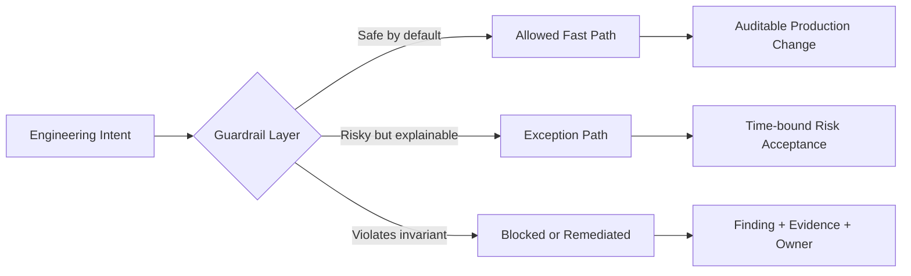
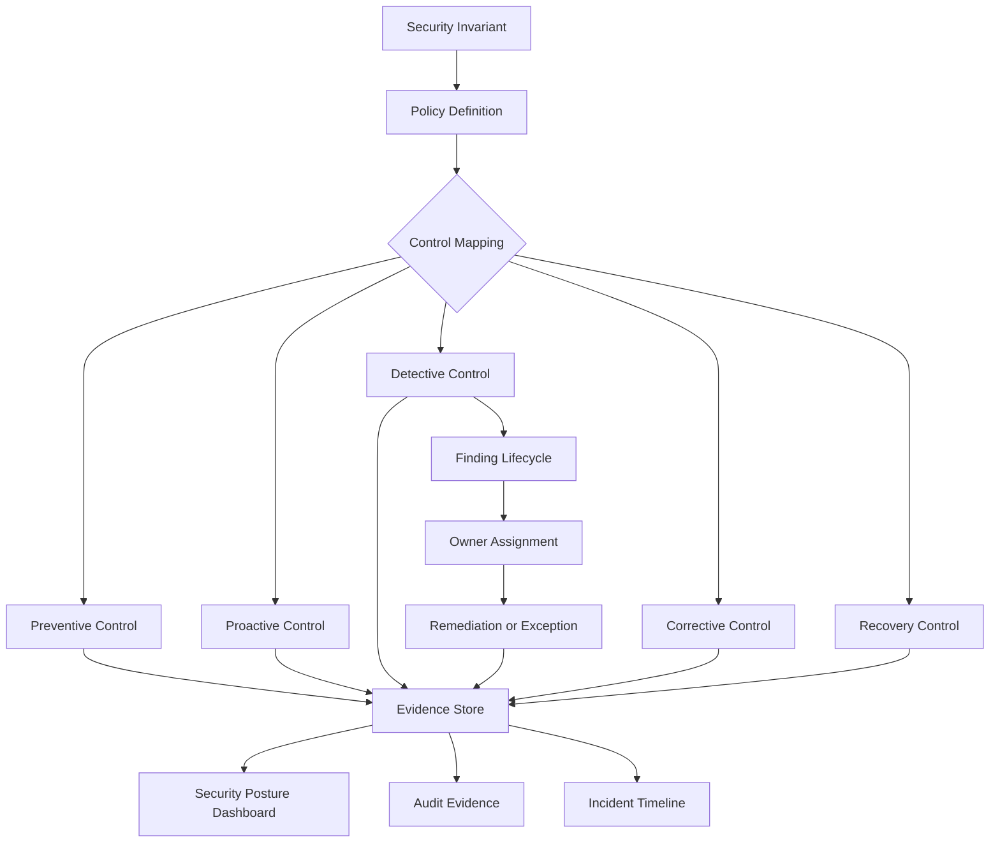
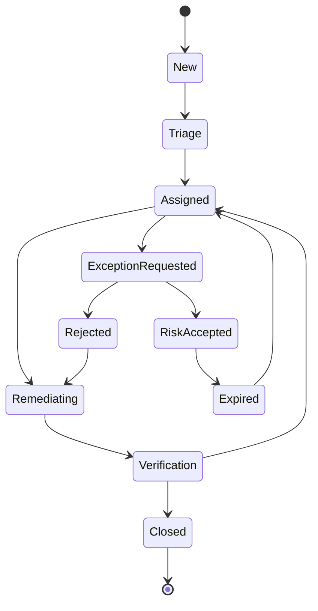
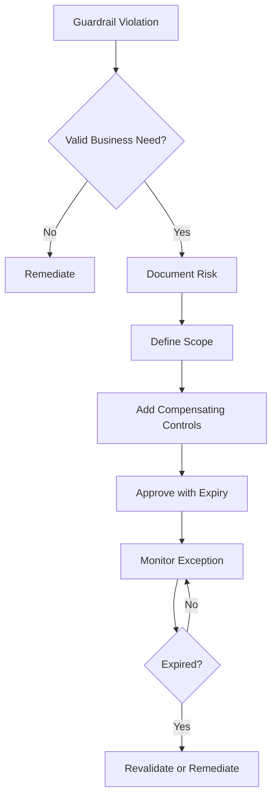

# Part 005 — Security Invariants and Cloud Guardrails

Cloud security yang matang tidak dimulai dari daftar service.

Ia dimulai dari kalimat seperti ini:

> Tidak boleh ada perubahan production yang tidak bisa dilacak.

> Tidak boleh ada bucket berisi data sensitif yang bisa diakses publik.

> Tidak boleh ada human identity yang memakai long-lived access key untuk operasi production.

> Tidak boleh ada account yang bisa mematikan audit trail-nya sendiri tanpa terdeteksi.

Kalimat-kalimat itu adalah **security invariant**.

Invariant adalah kondisi yang harus tetap benar walaupun sistem berubah: engineer deploy resource baru, pipeline gagal, IAM role diubah, workload diskalakan, incident terjadi, account baru dibuat, atau vendor integration ditambahkan.

Guardrail adalah mekanisme yang membuat invariant itu tetap benar.

Jadi, topik part ini bukan “gunakan SCP”, “aktifkan Config”, atau “nyalakan Security Hub”. Itu terlalu permukaan. Topik sebenarnya adalah:

> Bagaimana mengubah prinsip security menjadi constraint operasional yang bisa ditegakkan, dipantau, dibuktikan, dan diperbaiki.

AWS Well-Architected Security Pillar menekankan beberapa prinsip desain inti: strong identity foundation, traceability, security at all layers, automated security best practices, data protection, dan preparation for security events. Guardrail adalah cara menjadikan prinsip-prinsip itu sebagai sistem operasi nyata, bukan poster di dokumen arsitektur.

---

## 1. Mental Model: Invariant, Policy, Control, Guardrail

Empat istilah ini sering bercampur. Untuk engineering, kita harus pisahkan.

| Istilah | Makna | Contoh |
|---|---|---|
| Invariant | Kebenaran yang harus selalu dijaga | “Semua CloudTrail management events harus terekam secara organization-wide.” |
| Policy | Pernyataan aturan | “AWS accounts wajib memiliki CloudTrail multi-region trail.” |
| Control | Mekanisme yang menegakkan atau mengecek policy | SCP, AWS Config rule, Control Tower control, EventBridge remediation. |
| Guardrail | Sistem kontrol yang melindungi engineer dari kondisi berbahaya | SCP menolak disable CloudTrail, Config mendeteksi drift, EventBridge memicu remediation. |

Invariant adalah **apa yang harus benar**.

Policy adalah **apa yang organisasi nyatakan sebagai aturan**.

Control adalah **bagaimana aturan itu diterapkan**.

Guardrail adalah **pengalaman operasional agar orang tidak mudah jatuh ke state berbahaya**.

Kesalahan umum: organisasi membeli atau mengaktifkan tool lalu menganggap guardrail sudah selesai. Padahal tool bukan guardrail sampai ia punya scope, owner, enforcement mode, evidence, exception process, dan response path.

---

## 2. Guardrail Bukan Sekadar “Block Everything”

Guardrail yang baik bukan hanya mencegah. Ia harus menjaga sistem tetap bergerak.

Cloud team yang hanya membuat deny policy tanpa model exception akan dibypass. Security team yang hanya mengirim finding tanpa ownership akan diabaikan. Platform team yang hanya membuat template tanpa detection akan buta terhadap drift.

Guardrail harus memenuhi dua tujuan yang sering bertabrakan:

1. **Reduce dangerous freedom**: engineer tidak boleh mudah membuat state yang merusak security posture.
2. **Preserve productive autonomy**: engineer tetap bisa membangun, deploy, test, dan troubleshoot tanpa menunggu approval manual terus-menerus.

Tujuan guardrail bukan membuat semua orang lambat. Tujuannya membuat jalur aman menjadi jalur paling mudah.



Guardrail yang matang tidak hanya menjawab “boleh atau tidak”. Ia menjawab:

- siapa yang mencoba;
- dari account mana;
- terhadap resource apa;
- di environment apa;
- dengan data sensitivity apa;
- apakah ini jalur normal atau emergency;
- apakah ada exception yang masih berlaku;
- apakah hasil akhirnya terekam.

---

## 3. Lima Kelas Control: Preventive, Proactive, Detective, Corrective, Recovery

Untuk AWS, jangan memandang control sebagai satu tipe. Gunakan lima kelas.

| Control Type | Kapan bekerja | Tujuan | Contoh AWS |
|---|---:|---|---|
| Preventive | Sebelum API call berhasil | Menolak aksi berbahaya | SCP, IAM explicit deny, resource policy, permission boundary. |
| Proactive | Sebelum resource dideploy | Mencegah resource non-compliant dibuat | Control Tower proactive controls, IaC validation, CloudFormation hooks. |
| Detective | Setelah state/event muncul | Menemukan pelanggaran atau anomali | AWS Config, CloudTrail, GuardDuty, Security Hub, CloudWatch alarms. |
| Corrective | Setelah finding/event | Mengembalikan state ke aman | EventBridge + Lambda/SSM Automation, auto-remediation Config. |
| Recovery | Setelah kerusakan terjadi | Memulihkan business capability | AWS Backup, restore testing, runbook, incident response. |

AWS Control Tower mengelompokkan controls ke preventive, detective, dan proactive. Untuk operating model internal, tambahkan corrective dan recovery agar tidak berhenti di deteksi.

### 3.1 Preventive Control

Preventive control menolak perubahan sebelum masuk ke state berbahaya.

Contoh:

- SCP menolak `cloudtrail:StopLogging` di semua workload accounts.
- SCP menolak penggunaan region yang belum disetujui.
- IAM permission boundary mencegah developer membuat role dengan privilege escalation path.
- S3 bucket policy menolak request yang tidak memakai TLS.

Preventive control paling kuat ketika invariant-nya universal dan exception-nya sangat jarang.

Gunakan preventive control untuk hal yang hampir tidak pernah valid:

- mematikan CloudTrail organization trail;
- menghapus log archive bucket;
- memakai root user untuk operasi harian;
- membuat public access ke storage berisi data sensitif;
- menjalankan service di region yang tidak disetujui;
- menghapus KMS key kritikal tanpa proses formal.

Jangan gunakan preventive control untuk kondisi yang masih sering butuh variasi sah. Jika semua variasi sah dipaksa melalui tiket manual, engineer akan mencari jalan pintas.

### 3.2 Proactive Control

Proactive control mengecek resource sebelum dideploy.

Bedanya dengan preventive control: preventive biasanya bekerja di authorization/API boundary, sedangkan proactive sering bekerja di provisioning pipeline atau deployment validation.

Contoh:

- template CloudFormation ditolak karena S3 bucket tidak punya encryption;
- Terraform plan gagal karena security group membuka `0.0.0.0/0` ke port admin;
- container image tidak boleh dipromote karena critical vulnerability;
- Lambda function tidak boleh dibuat jika environment variable mengandung secret plaintext.

Proactive control cocok untuk developer experience. Engineer melihat error sebelum resource benar-benar hidup.

### 3.3 Detective Control

Detective control menerima bahwa sistem tidak sempurna. Ia mencari pelanggaran setelah terjadi.

Contoh:

- Config rule mendeteksi security group publik;
- CloudTrail Lake query menemukan `AssumeRole` dari lokasi aneh;
- GuardDuty menemukan credential exfiltration pattern;
- Security Hub mengkorelasikan finding dari berbagai service;
- CloudWatch alarm mendeteksi spike error atau unusual API failure.

Detective control wajib punya owner dan response path. Finding tanpa owner hanyalah noise.

### 3.4 Corrective Control

Corrective control memperbaiki state.

Contoh:

- security group publik otomatis ditutup;
- compromised access key otomatis dinonaktifkan;
- instance dicabut dari target group dan dipindahkan ke quarantine security group;
- bucket public access block diaktifkan ulang;
- resource tanpa tag owner diberi label non-compliant dan dibatasi.

Corrective control harus hati-hati. Auto-remediation bisa menjadi outage generator jika trigger-nya salah.

Aturan praktis:

- auto-remediate jika risiko tinggi dan false positive rendah;
- auto-ticket jika risiko sedang atau butuh konteks bisnis;
- auto-page jika impact bisa sedang berjalan;
- auto-quarantine jika blast radius lebih berbahaya daripada downtime lokal.

### 3.5 Recovery Control

Recovery control sering terlupakan dalam security, padahal ransomware, credential compromise, dan destructive change tidak selalu bisa dicegah.

Contoh:

- backup immutable;
- restore drill;
- break-glass role;
- runbook isolasi account;
- disaster recovery account;
- cross-region recovery plan;
- evidence preservation.

Invariant yang baik tidak hanya berbunyi “serangan tidak boleh terjadi”. Itu tidak realistis. Invariant yang matang berbunyi:

> Jika compromise terjadi, blast radius harus terbatas, bukti harus tersedia, dan business-critical capability harus bisa dipulihkan dalam batas waktu yang disetujui.

---

## 4. Bentuk Invariant yang Bisa Dioperasikan

Invariant yang buruk:

> AWS harus aman.

Terlalu abstrak. Tidak bisa dites.

Invariant yang lebih baik:

> Semua production accounts harus mengirim CloudTrail management events dari semua region ke log archive account, dengan log file validation aktif, dan workload account tidak boleh bisa menghapus bucket log archive.

Ini bisa diuji.

Gunakan format berikut:

```text
For <scope>, <resource/control surface> must/must not <state/action>,
verified by <evidence source>, enforced by <control>,
owned by <team>, with exception via <process> and expiry <duration>.
```

Contoh:

```text
For all production AWS accounts, S3 buckets must not allow public read/write access,
verified by AWS Config and Security Hub, enforced by S3 Block Public Access and SCP/resource policy,
owned by the workload team, with exception via security risk acceptance capped at 30 days.
```

Field minimal:

| Field | Pertanyaan |
|---|---|
| Scope | Berlaku untuk account, OU, region, resource, data class, atau workload apa? |
| Desired state | State apa yang wajib benar? |
| Forbidden state | State apa yang tidak boleh terjadi? |
| Enforcement point | Di mana control diterapkan? IAM, SCP, Config, pipeline, EventBridge? |
| Evidence | Dari mana bukti kepatuhan diambil? CloudTrail, Config, Security Hub, logs? |
| Owner | Siapa yang memperbaiki? Security, platform, workload team? |
| Exception | Bagaimana pengecualian dibuat, disetujui, dan kedaluwarsa? |
| Severity | Jika dilanggar, seberapa serius? |
| Response SLA | Berapa lama sampai diperbaiki? |

Invariant harus bisa berubah menjadi query, rule, alarm, atau denial.

Jika tidak bisa diuji, itu belum invariant engineering. Itu masih aspirasi.

---

## 5. Invariant Catalog untuk AWS Production Environment

Berikut katalog awal. Ini bukan daftar final untuk semua organisasi, tetapi baseline yang masuk akal untuk environment serius.

### 5.1 Identity Invariants

| Invariant | Kenapa penting | Enforcement | Evidence |
|---|---|---|---|
| Human access ke AWS production harus memakai federation atau IAM Identity Center, bukan long-lived IAM user key. | Long-lived credential mudah bocor dan sulit dirotasi. | IAM policy, SCP, access key detection, permission model. | IAM credential report, Access Analyzer, CloudTrail. |
| Root user tidak boleh dipakai untuk operasi harian. | Root melewati banyak boundary normal. | MFA, credential vaulting, SCP where applicable, alerting. | CloudTrail root activity event. |
| Semua role production harus punya trust policy yang eksplisit dan minimal. | Trust policy adalah gerbang role assumption. | IAM review, Access Analyzer, policy validation. | IAM role inventory, Access Analyzer findings. |
| Cross-account access harus bisa diatribusikan ke source identity. | Audit tanpa actor attribution tidak cukup. | STS source identity, session tags, naming convention. | CloudTrail AssumeRole chain. |
| Permission escalation path harus dicegah. | Banyak breach tidak dimulai dari admin, tetapi dari privilege escalation. | Permission boundary, SCP, IAM Access Analyzer. | Policy analysis, CloudTrail, Access Analyzer. |

Contoh invariant yang eksplisit:

```text
No production IAM role trust policy may allow assumption by wildcard principal or unknown external account unless there is an approved integration record with owner, external ID, and expiry review.
```

### 5.2 Audit Invariants

| Invariant | Kenapa penting | Enforcement | Evidence |
|---|---|---|---|
| CloudTrail organization trail harus aktif untuk semua accounts dan regions. | Tanpa audit trail, investigation menjadi spekulatif. | Organization trail, SCP deny stop/delete trail. | CloudTrail status, S3 log archive. |
| Workload account tidak boleh bisa menghapus centralized logs. | Attacker sering mencoba menghapus jejak. | Log archive account, bucket policy, KMS policy. | S3 object lock/versioning, CloudTrail. |
| Audit logs harus punya retention sesuai risk class. | Compliance dan forensics butuh horizon waktu. | S3 lifecycle, retention policy, CloudWatch retention. | Bucket inventory, Config, evidence report. |
| Critical security events harus menghasilkan alert. | Logging tanpa alert tidak cukup untuk incident. | EventBridge, CloudWatch alarms, Security Hub. | Incident timeline, alert records. |

Audit invariant harus menjawab: “Jika besok regulator atau incident commander bertanya, bisakah kita membuktikan apa yang terjadi?”

### 5.3 Data Protection Invariants

| Invariant | Kenapa penting | Enforcement | Evidence |
|---|---|---|---|
| Data at rest untuk managed storage harus terenkripsi. | Mengurangi dampak storage exposure dan memenuhi compliance. | Default encryption, KMS, Config rules. | Config, service metadata, KMS logs. |
| Data in transit harus memakai TLS kecuali exception eksplisit. | Mencegah interception dan downgrade. | Resource policy, ALB/NLB config, service setting. | Config, CloudTrail, synthetic checks. |
| Secret tidak boleh disimpan di plaintext config atau source-controlled template. | Secret leakage sering menjadi entry point. | Secrets Manager, Parameter Store SecureString, scanning. | Secret inventory, repo scanning, CloudTrail. |
| Public data access harus intentional dan terdokumentasi. | “Public by accident” adalah salah satu failure mode paling mahal. | S3 Block Public Access, bucket policy validation, Macie. | Config, Macie, Security Hub. |

### 5.4 Network Exposure Invariants

| Invariant | Kenapa penting | Enforcement | Evidence |
|---|---|---|---|
| Administrative ports tidak boleh terbuka ke internet. | SSH/RDP/admin UI publik memperbesar attack surface. | SCP, Config, Security Hub control, Firewall Manager. | Security group inventory, Config finding. |
| Internet-facing endpoint harus lewat approved edge pattern. | Edge control memberi WAF, TLS, logging, rate limit. | Architecture standard, WAF policy, endpoint governance. | ALB/CloudFront/WAF logs. |
| Egress dari sensitive workloads harus dibatasi dan terobservasi. | Data exfiltration sering keluar melalui jalur outbound. | Route control, firewall, VPC endpoint policy, DNS logging. | VPC Flow Logs, firewall logs, DNS logs. |

Network invariant dalam seri ini tidak akan mengulang detail VPC. Kita hanya melihatnya sebagai surface security dan evidence.

### 5.5 Workload Runtime Invariants

| Invariant | Kenapa penting | Enforcement | Evidence |
|---|---|---|---|
| Compute runtime harus punya owner, environment, data classification, dan criticality tags. | Tanpa metadata, finding tidak bisa di-route. | Tag policy, Config rule, deployment guardrail. | Resource inventory, Config aggregator. |
| Known critical vulnerability harus punya SLA remediation. | Vulnerability tanpa SLA menjadi backlog kosmetik. | Inspector, ECR scan, ticket automation. | Security Hub/Inspector finding lifecycle. |
| Runtime access harus auditable. | Troubleshooting tidak boleh menjadi blind spot. | SSM Session Manager, IAM role, shell logging. | SSM session logs, CloudTrail. |
| Instance metadata harus hardened untuk EC2. | Metadata credential theft adalah path umum. | IMDSv2 enforcement, launch template policy. | Config, EC2 metadata options. |

---

## 6. Guardrail Architecture: Dari Invariant ke Enforcement Pipeline

Jangan desain guardrail sebagai rule terpisah. Desain sebagai pipeline.



Pipeline minimal:

1. **Define invariant**: tulis kondisi yang harus benar.
2. **Classify risk**: impact jika dilanggar.
3. **Map control**: preventive/proactive/detective/corrective/recovery.
4. **Assign owner**: siapa yang menerima finding.
5. **Instrument evidence**: dari mana status terbukti.
6. **Automate response**: ticket, remediation, quarantine, page.
7. **Track exceptions**: siapa menerima risiko dan sampai kapan.
8. **Review drift**: apakah guardrail masih efektif.

---

## 7. Implementasi Guardrail di AWS: Layer by Layer

### 7.1 Organization Layer

Organization layer adalah tempat control lintas account.

Tools utama:

- AWS Organizations;
- Organizational Units;
- Service Control Policies;
- AWS Control Tower controls;
- delegated administrator untuk security services;
- tag policies;
- backup policies.

Gunakan layer ini untuk invariant yang berlaku luas.

Contoh:

```text
All workload accounts must not disable core security services.
```

Implementation candidates:

- SCP deny untuk API tertentu;
- Control Tower mandatory/strongly recommended controls;
- delegated admin untuk centralized service configuration;
- monitoring dari security tooling account.

Organization layer cocok untuk “hard boundary”. Tetapi ia berbahaya jika terlalu granular. SCP yang terlalu kompleks bisa membuat troubleshooting sulit dan menimbulkan false deny.

Design rule:

> Pakai organization-level controls untuk hal yang universal. Pakai account/workload-level controls untuk hal yang kontekstual.

### 7.2 Account Layer

Account layer adalah tempat baseline per account.

Baseline account yang baik mencakup:

- CloudTrail enrollment;
- Config recorder;
- GuardDuty membership;
- Security Hub membership;
- default encryption setting jika service mendukung;
- IAM password/account policy bila masih relevan;
- break-glass role;
- support role;
- baseline logging;
- budget/alarm;
- owner metadata.

Invariant:

```text
No active AWS account may exist outside the baseline enrollment process.
```

Jika account dibuat tetapi belum masuk security tooling, itu bukan sekadar hygiene issue. Itu blind spot.

### 7.3 Identity Layer

Identity layer menjaga siapa bisa melakukan apa.

Tools:

- IAM policy;
- permission boundary;
- trust policy;
- session policy;
- IAM Identity Center permission sets;
- STS session tags;
- IAM Access Analyzer;
- credential report.

Invariant:

```text
Any permission that can create, modify, or assume privileged roles must be explicitly bounded by a permission boundary or restricted to platform/security roles.
```

Fokus identity guardrail bukan hanya “least privilege”. Itu terlalu umum. Fokusnya:

- mencegah privilege escalation;
- mencegah unclear trust;
- mencegah long-lived credential;
- menjaga attribution;
- membatasi session duration;
- memastikan emergency access terpisah dari normal access.

### 7.4 Resource Layer

Resource layer menggunakan policy di resource itu sendiri.

Contoh:

- S3 bucket policy;
- KMS key policy;
- SQS queue policy;
- SNS topic policy;
- ECR repository policy;
- Secrets Manager resource policy;
- VPC endpoint policy.

Invariant:

```text
Sensitive resources must not trust principals outside approved accounts unless the trust is explicit, reviewed, and attributable.
```

Resource policy sering menjadi lubang karena security team fokus pada identity policy. Padahal access di AWS sering hasil gabungan identity-side dan resource-side permission.

### 7.5 Deployment Layer

Deployment layer menjaga perubahan sebelum masuk runtime.

Tools:

- CloudFormation Guard;
- CloudFormation hooks;
- Terraform policy checks;
- CI/CD checks;
- image scanning;
- secret scanning;
- IaC drift detection;
- deployment approval only for high-risk exceptions.

Invariant:

```text
No infrastructure change may reach production unless it passes baseline security validation or has an approved time-bound exception.
```

Deployment guardrail memberi feedback paling cepat ke engineer. Ia juga paling mudah dijadikan developer-friendly.

### 7.6 Detection and Response Layer

Detection layer mencari apa yang lolos atau berubah setelah deployment.

Tools:

- CloudTrail;
- AWS Config;
- Security Hub;
- GuardDuty;
- Inspector;
- Macie;
- Detective;
- CloudWatch;
- EventBridge;
- ticketing/SOAR integration.

Invariant:

```text
Every high-severity security finding must have an owner, SLA, state, and evidence trail.
```

Jangan hanya kumpulkan finding. Kelola lifecycle-nya.

Finding lifecycle minimal:



---

## 8. Contoh Desain Guardrail: “Tidak Ada Public S3 Bucket”

Mari ambil satu invariant dan uraikan seperti engineer.

### 8.1 Invariant

```text
Production S3 buckets must not allow public read or write access unless the bucket is classified as intentional public distribution and approved through an exception process.
```

### 8.2 Threat

Public bucket bisa menyebabkan:

- data breach;
- unauthorized modification;
- malware hosting;
- compliance violation;
- loss of customer trust;
- incident response besar karena sulit tahu apakah data sudah diakses.

### 8.3 Controls

| Type | Control |
|---|---|
| Preventive | S3 Block Public Access at account/bucket level; SCP deny changes that disable guardrail in production. |
| Proactive | IaC validation menolak bucket policy public. |
| Detective | AWS Config rule, Security Hub control, S3 public access analyzer. |
| Corrective | EventBridge remediation mengaktifkan kembali block public access atau menghapus statement public. |
| Recovery | Access log review, object versioning, incident runbook, customer notification path jika regulated data. |

### 8.4 Evidence

Evidence minimal:

- Config compliance state;
- CloudTrail event untuk bucket policy change;
- S3 public access block setting;
- Security Hub finding;
- exception record jika ada;
- remediation event jika pernah dilanggar.

### 8.5 Failure Modes

| Failure Mode | Dampak | Mitigasi |
|---|---|---|
| Bucket dibuat sebelum guardrail aktif | Blind spot | Account baseline tidak boleh dianggap complete sebelum control aktif. |
| Exception tidak kedaluwarsa | Public access menjadi permanen | Exception wajib expiry dan re-approval. |
| Public access intentional tapi tidak diberi label | Noise atau salah remediation | Tag `public-intent=true` plus approval ID. |
| Auto-remediation memutus website statis sah | Outage | Pisahkan distribution bucket approved dengan data bucket. |
| Bucket policy tidak public, tetapi access via cross-account role terlalu luas | False sense of security | Tambahkan Access Analyzer dan resource policy review. |

### 8.6 Engineering Lesson

Invariant “no public S3” bukan satu rule. Ia adalah gabungan identity, resource policy, account baseline, exception, evidence, dan remediation.

---

## 9. Contoh Desain Guardrail: “CloudTrail Tidak Boleh Dimatikan”

### 9.1 Invariant

```text
No workload account principal may stop, delete, or weaken organization-level CloudTrail logging or its delivery path.
```

### 9.2 Controls

| Type | Control |
|---|---|
| Preventive | SCP deny `cloudtrail:StopLogging`, `cloudtrail:DeleteTrail`, destructive S3/KMS actions against log archive resources. |
| Detective | CloudTrail event pattern untuk stop/delete trail attempt, Config compliance, Security Hub. |
| Corrective | Re-enable trail jika local trail dimatikan, page security jika org trail delivery terganggu. |
| Recovery | Preserve logs in separate log archive account with restricted access and retention. |

### 9.3 Why This Matters

Attacker yang sudah mendapat credential sering mencoba mengurangi visibility. Jika account bisa mematikan audit-nya sendiri, account itu tidak punya forensic readiness.

Security maturity bukan hanya “kita punya logs”. Maturity adalah “principal yang diserang tidak bisa menghapus bukti dengan mudah”.

---

## 10. Exception Model: Karena Dunia Nyata Tidak Bersih

Guardrail tanpa exception model akan gagal secara sosial.

Exception bukan kelemahan. Exception adalah cara mengubah pelanggaran menjadi risk decision yang eksplisit.

Exception minimal harus punya:

| Field | Isi |
|---|---|
| Invariant yang dilanggar | Contoh: public ingress ke port non-standard. |
| Business justification | Mengapa perlu. |
| Scope | Account/resource/region/environment. |
| Compensating control | Logging, WAF, IP allowlist, extra monitoring. |
| Owner | Nama team/role. |
| Approver | Security/risk owner yang sah. |
| Expiry | Tanggal kedaluwarsa. |
| Review cadence | Kapan dievaluasi ulang. |
| Evidence link | Ticket/change record/config snapshot. |

Jangan izinkan exception tanpa expiry. Exception tanpa expiry adalah policy baru yang tidak terdokumentasi.



---

## 11. Severity and SLA Model

Tidak semua pelanggaran sama.

Gunakan severity berdasarkan kombinasi:

- environment: prod lebih tinggi dari dev;
- data class: regulated lebih tinggi dari internal;
- exposure: internet-facing lebih tinggi dari private;
- exploitability: active credential exposure lebih tinggi dari theoretical misconfig;
- blast radius: org-wide lebih tinggi dari resource tunggal;
- control gap: audit disabled lebih tinggi dari missing tag;
- active signal: GuardDuty active finding lebih tinggi dari static posture issue.

Contoh matriks:

| Condition | Severity | Response |
|---|---:|---|
| CloudTrail disabled in production account | Critical | Page security/platform immediately. |
| Public S3 bucket with sensitive data | Critical | Block/remediate immediately, start incident triage. |
| Public admin port in dev sandbox | High | Auto-close or ticket same day. |
| Missing owner tag on non-prod resource | Low/Medium | Ticket/backlog with deadline. |
| Unused IAM permission | Medium | Reduce during periodic access review. |
| Critical Inspector finding on internet-facing production workload | Critical/High | Patch, isolate, or mitigate within SLA. |

SLA tanpa enforcement menjadi dekorasi. Hubungkan SLA ke ticketing, dashboard, escalation, dan exception expiry.

---

## 12. Guardrail Ownership Model

Security guardrail gagal ketika semua orang mengira orang lain yang punya.

Gunakan ownership yang eksplisit.

| Area | Primary Owner | Supporting Owner |
|---|---|---|
| Organization/SCP baseline | Cloud platform team | Security architecture |
| Detection rule | Security engineering | SOC/operations |
| Workload remediation | Workload team | Platform/security |
| Audit evidence | Governance/risk/security | Platform |
| Exception approval | Risk owner/security | Business owner |
| Runtime patching | Workload/platform depending on model | Security posture team |
| Log archive | Security/platform | Compliance |

Prinsip penting:

> Security team boleh memiliki control, tetapi workload team harus memiliki risiko workload-nya.

Jika security team memperbaiki semua finding sendiri, organisasi tidak belajar. Jika workload team diberi finding tanpa context, mereka akan menganggap security sebagai noise generator.

---

## 13. Guardrail as Product

Perlakukan guardrail seperti produk internal.

Guardrail punya user: engineer.

Guardrail punya UX: error message, docs, auto-fix, exception path.

Guardrail punya SLO: false positive rate, time to remediate, adoption, coverage.

Guardrail punya changelog: policy berubah, scope diperluas, exception model diperketat.

Guardrail punya rollout strategy:

1. observe only;
2. warn only;
3. block in sandbox;
4. block in non-prod;
5. block in prod for new resources;
6. remediate existing resources;
7. enforce org-wide.

Langsung memblokir semua environment sering menghasilkan resistensi. Rollout yang baik memberi visibility dulu, lalu enforcement.

---

## 14. Failure Modes Guardrail

### 14.1 Overblocking

Guardrail terlalu agresif menolak use case sah.

Dampak:

- engineer bypass lewat account lain;
- shadow IT;
- ticket overload;
- security dianggap penghambat.

Mitigasi:

- mulai dengan observe mode;
- ukur false positive;
- dokumentasikan fast path;
- sediakan exception yang jelas;
- buat error message actionable.

### 14.2 Underblocking

Guardrail terlihat ada, tetapi tidak menutup path utama.

Contoh:

- melarang public bucket policy tetapi lupa ACL/access point;
- menolak IAM user creation tetapi membiarkan access key lama;
- mengaktifkan CloudTrail hanya single-region;
- men-scan image tetapi tidak menahan promotion.

Mitigasi:

- threat model per invariant;
- test guardrail dengan red-team style scenarios;
- coverage dashboard;
- periodic control validation.

### 14.3 No Evidence

Control aktif tetapi tidak bisa dibuktikan.

Dampak:

- audit manual;
- incident investigation lambat;
- compliance posture lemah;
- leadership tidak percaya dashboard.

Mitigasi:

- setiap guardrail wajib punya evidence source;
- evidence disimpan di account terpisah;
- dashboard harus traceable ke raw event/config;
- audit sample secara berkala.

### 14.4 No Owner

Finding muncul tetapi tidak ada yang merasa bertanggung jawab.

Mitigasi:

- tag owner wajib;
- mapping account ke team;
- routing rules;
- escalation chain;
- orphan resource cleanup.

### 14.5 Permanent Exception

Exception dibuat untuk deadline, lalu hidup selamanya.

Mitigasi:

- expiry wajib;
- auto-notification sebelum expiry;
- exception masuk dashboard;
- exception tanpa owner dianggap violation.

---

## 15. Practical Build Plan

Untuk membangun guardrail system dari nol, jangan mulai dari 100 rule. Mulai dari invariant paling kritikal.

### Step 1 — Pilih 10 Invariant Pertama

Prioritaskan:

1. CloudTrail org-wide aktif dan tidak bisa dimatikan.
2. Log archive terpisah dan write-protected.
3. Root usage terdeteksi dan dipage.
4. No public S3 untuk data bucket.
5. No public admin port.
6. Security services aktif di semua accounts.
7. Human production access memakai federation/temporary credential.
8. KMS key critical tidak bisa dihapus tanpa control.
9. Account baru wajib baseline sebelum dipakai.
10. High severity finding punya owner dan SLA.

### Step 2 — Buat Control Matrix

Contoh format:

| Invariant | Preventive | Detective | Corrective | Evidence | Owner |
|---|---|---|---|---|---|
| CloudTrail cannot be disabled | SCP | EventBridge + Config | Re-enable/page | CloudTrail/S3 | Platform/Security |
| No public S3 | S3 BPA/SCP | Config/Security Hub | Remove public policy | Config/Security Hub | Workload |
| No root activity | MFA/process | CloudTrail alert | Incident response | CloudTrail | Security |

### Step 3 — Rollout by OU

Mulai dari sandbox/non-prod untuk melihat breakage.

Lalu:

- apply ke new accounts;
- remediate existing accounts;
- enforce di prod;
- buat exception dashboard;
- review setiap bulan.

### Step 4 — Measure

Metrics yang berguna:

| Metric | Kenapa penting |
|---|---|
| Guardrail coverage by account | Menemukan blind spot. |
| Violations by invariant | Melihat area paling bermasalah. |
| Mean time to remediate | Mengukur respons nyata. |
| Exception count and age | Mengukur policy debt. |
| False positive rate | Menjaga trust engineer. |
| Prevented events | Membuktikan value preventive control. |
| Recurring violations by team/resource | Menemukan root cause sistemik. |

---

## 16. Anti-Patterns

### Anti-pattern 1: “Security Hub menyala, berarti aman”

Security Hub adalah aggregation/correlation layer. Ia bukan pengganti ownership, remediation, atau architecture decision.

### Anti-pattern 2: Semua guardrail dibuat sebagai SCP

SCP kuat, tetapi kasar. SCP tidak tahu konteks resource sedalam Config atau pipeline validation. Gunakan SCP untuk ceiling universal, bukan semua policy.

### Anti-pattern 3: Finding tanpa SLA

Finding tanpa SLA hanya inventory rasa bersalah.

### Anti-pattern 4: Exception via chat

Jika exception hanya terjadi di Slack/Teams tanpa record, audit dan incident response akan kacau.

### Anti-pattern 5: Guardrail dibuat setelah incident besar saja

Incident memang memberi pelajaran, tetapi guardrail harus dibangun berdasarkan threat model, bukan hanya trauma historis.

### Anti-pattern 6: Central security memperbaiki semua hal

Ini menciptakan dependency dan bottleneck. Security harus membuat sistem agar owner bisa memperbaiki dengan cepat.

---

## 17. Checklist Part 005

Gunakan checklist ini sebelum lanjut.

```text
[ ] Saya bisa membedakan invariant, policy, control, dan guardrail.
[ ] Saya bisa menjelaskan preventive, proactive, detective, corrective, dan recovery control.
[ ] Saya bisa menulis invariant dalam format yang bisa diuji.
[ ] Saya bisa memetakan invariant ke AWS controls.
[ ] Saya paham kenapa finding tanpa owner bukan guardrail yang matang.
[ ] Saya paham kenapa exception harus punya expiry.
[ ] Saya bisa membuat control matrix untuk 10 invariant pertama.
[ ] Saya bisa menjelaskan kapan memakai SCP dan kapan memakai Config/pipeline/detection.
[ ] Saya paham bahwa guardrail harus menjaga autonomy, bukan hanya blocking.
```

---

## 18. Latihan Praktis

Ambil satu workload AWS yang kamu miliki atau bayangkan.

Tulis 5 invariant:

1. identity invariant;
2. audit invariant;
3. data protection invariant;
4. network exposure invariant;
5. incident response invariant.

Untuk masing-masing, isi tabel:

| Invariant | Scope | Preventive | Detective | Corrective | Evidence | Owner | Exception |
|---|---|---|---|---|---|---|---|
| ... | ... | ... | ... | ... | ... | ... | ... |

Jika satu invariant tidak bisa punya evidence, rewrite invariant-nya sampai bisa diuji.

---

## 19. Ringkasan

Security invariant adalah fondasi security engineering di AWS.

Guardrail adalah mekanisme untuk menjaga invariant tetap benar saat sistem berubah.

Guardrail yang matang harus:

- jelas scope-nya;
- bisa diuji;
- punya owner;
- punya evidence;
- punya exception model;
- punya response path;
- bisa diukur;
- tidak mematikan produktivitas engineer.

AWS menyediakan banyak building block: Organizations, SCP, Control Tower controls, IAM, Config, CloudTrail, Security Hub, GuardDuty, EventBridge, CloudWatch, KMS, Macie, Inspector, Systems Manager, dan lainnya. Tetapi tool tidak otomatis menjadi guardrail. Guardrail lahir ketika tool tersebut dikaitkan ke invariant, risiko, ownership, dan operasi harian.

Di part berikutnya, kita masuk ke boundary yang membuat guardrail bisa diskalakan: **multi-account architecture**.

---

## References

- AWS Well-Architected Framework — Security Pillar: https://docs.aws.amazon.com/wellarchitected/latest/security-pillar/welcome.html
- AWS Well-Architected Framework — Detection: https://docs.aws.amazon.com/wellarchitected/latest/framework/sec-detection.html
- AWS Control Tower — About controls: https://docs.aws.amazon.com/controltower/latest/controlreference/controls.html
- AWS Control Tower — Control behavior and guidance: https://docs.aws.amazon.com/controltower/latest/controlreference/control-behavior.html
- AWS Prescriptive Guidance — Detective controls: https://docs.aws.amazon.com/prescriptive-guidance/latest/aws-security-controls/detective-controls.html
- AWS Prescriptive Guidance — Proactive controls: https://docs.aws.amazon.com/prescriptive-guidance/latest/aws-security-controls/proactive-controls.html
- AWS Security Reference Architecture: https://docs.aws.amazon.com/prescriptive-guidance/latest/security-reference-architecture/introduction.html
