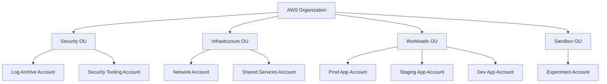
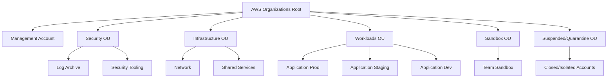
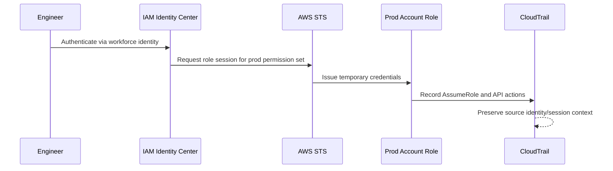
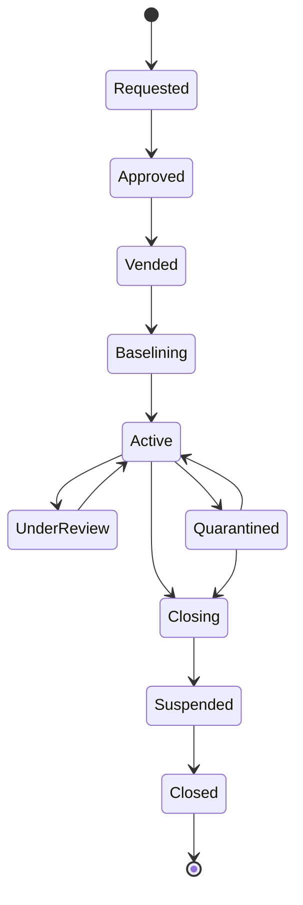

# Part 006 — Multi-Account as Security Boundary

Di AWS, account bukan sekadar tempat resource tinggal.

Account adalah boundary.

Lebih tepatnya, account adalah gabungan dari beberapa boundary sekaligus:

- security boundary;
- audit boundary;
- blast-radius boundary;
- billing boundary;
- quota boundary;
- operational ownership boundary;
- compliance evidence boundary;
- incident containment boundary.

Jika kamu memperlakukan AWS account hanya sebagai “folder besar untuk environment”, arsitektur cloud-mu akan sulit diamankan saat tumbuh.

AWS Well-Architected Security Pillar secara eksplisit merekomendasikan pemisahan workload menggunakan account karena account-level separation menyediakan isolation boundary yang kuat untuk security, billing, dan access. AWS Control Tower juga menegaskan bahwa satu account tidak cukup untuk environment well-architected; multi-account lebih mendukung security goals dan business processes.

Part ini menjawab pertanyaan inti:

> Mengapa multi-account adalah desain security paling fundamental di AWS, dan bagaimana cara memakainya tanpa menciptakan kompleksitas yang tidak terkendali?

---

## 1. Mental Model: Account adalah Cell

Bayangkan AWS organization sebagai organisme besar. Account adalah cell.

Cell yang baik punya membran. Ia bisa berkomunikasi dengan cell lain, tetapi tidak semua isi cell bercampur.

Dalam cloud engineering, account membrane membatasi:

- siapa bisa melihat resource;
- siapa bisa mengubah resource;
- service apa yang aktif;
- event apa yang tercatat;
- quota apa yang bisa habis;
- biaya apa yang dikaitkan ke owner;
- incident apa yang bisa diisolasi;
- compliance scope apa yang berlaku.



Account bukan boundary sempurna untuk semua hal, tetapi ia boundary yang sangat penting. Banyak control AWS dirancang dengan asumsi account sebagai unit administrasi.

---

## 2. Kenapa Tidak Satu Account Saja?

Satu account terlihat sederhana di awal.

Satu billing view. Satu tempat deploy. Satu set IAM role. Satu VPC. Satu namespace mental.

Lalu sistem tumbuh.

Masalah mulai muncul:

- dev bisa melihat resource prod;
- eksperimen menghabiskan quota production;
- IAM policy menjadi penuh kondisi environment;
- CloudTrail penuh event campuran;
- tag menjadi satu-satunya pemisah ownership;
- incident di satu app sulit diisolasi;
- auditor bertanya scope evidence dan jawabannya kabur;
- production access sulit dibedakan dari non-production access;
- security exception untuk satu workload melemahkan semua workload.

Satu account memindahkan kompleksitas dari account boundary ke IAM condition, naming convention, tags, dan proses manual. Itu bukan menghilangkan kompleksitas. Itu menyembunyikannya di tempat yang lebih rapuh.

### 2.1 Problem IAM di Single Account

Dalam satu account, kamu mungkin mencoba memisahkan environment dengan tag:

```text
Allow developer to manage resources where tag Environment=dev
Deny production resources where tag Environment=prod
```

Masalahnya:

- tidak semua action support resource-level permissions;
- tidak semua action support tag condition;
- beberapa API bersifat account-wide;
- developer bisa membuat resource tanpa tag jika guardrail tidak sempurna;
- service-linked roles dan managed service behavior kadang tidak pas dengan model tag;
- audit masih campur dalam account yang sama.

Tag berguna untuk governance. Tapi tag bukan pengganti account boundary.

### 2.2 Problem Audit di Single Account

Saat audit atau incident, kamu ingin menjawab:

- siapa mengubah production;
- apakah dev credential pernah menyentuh prod;
- resource mana masuk compliance scope;
- apakah log event ini business-critical atau eksperimen;
- siapa owner account/resource.

Jika semua ada di satu account, kamu harus mengandalkan metadata yang sering tidak lengkap.

Dengan multi-account, pertanyaan pertama menjadi lebih mudah:

> Account ini scope-nya apa?

Account yang dirancang baik sudah membawa makna.

---

## 3. Boundary Apa Saja yang Diberikan Account?

### 3.1 IAM Boundary

IAM resource berada di dalam account. Role, policy, user, dan service-linked role punya account context.

Account memudahkan pemisahan:

- prod role vs dev role;
- workload A role vs workload B role;
- platform admin vs application admin;
- break-glass access per scope;
- third-party integration per workload.

Tanpa pemisahan account, trust policy dan permission policy harus menanggung semua kompleksitas.

### 3.2 Audit Boundary

CloudTrail event selalu punya account ID.

Account ID menjadi dimensi investigasi utama:

- event terjadi di account mana;
- principal berasal dari account mana;
- role mana yang diasumsikan;
- apakah event lintas account;
- apakah event terjadi di account produksi, sandbox, atau security tooling.

Dengan account boundary, timeline investigation menjadi lebih bersih.

### 3.3 Blast-Radius Boundary

Jika credential compromise terjadi di satu account, account boundary membantu membatasi akses default.

Tentu ini tergantung desain. Jika kamu memberi role cross-account admin ke semua account, boundary itu rusak. Tetapi baseline-nya tetap lebih baik daripada semua workload berada di satu account.

Blast radius yang bisa dibatasi:

- IAM permissions;
- service quotas;
- network reachability;
- resource deletion;
- data access;
- cost spike;
- deployment mistake;
- incident response action.

### 3.4 Quota Boundary

Banyak AWS service quota berlaku per account per region.

Jika dev load test, batch job, atau eksperimen AI menghabiskan quota di account yang sama dengan prod, production bisa terdampak.

Account memisahkan kapasitas administratif.

### 3.5 Billing and Cost Boundary

Account memudahkan chargeback/showback.

Biaya yang berasal dari workload tertentu lebih mudah diatribusikan jika workload punya account sendiri atau setidaknya account per environment/team.

Tags tetap penting, tetapi account adalah baseline cost boundary yang kuat.

### 3.6 Compliance Boundary

Regulated workload sering butuh:

- akses terbatas;
- retention khusus;
- encryption policy khusus;
- monitoring khusus;
- data residency;
- auditor evidence;
- change control lebih ketat.

Memisahkan regulated workload ke account/OU khusus membuat compliance control tidak harus diterapkan ke semua workload secara berlebihan.

### 3.7 Operational Ownership Boundary

Account harus punya owner.

Owner bukan hanya orang yang membayar. Owner adalah pihak yang bertanggung jawab atas:

- resource lifecycle;
- security findings;
- patching;
- cost anomaly;
- incident response;
- compliance exception;
- decommissioning.

Jika account tidak punya owner, account itu harus dianggap risiko.

---

## 4. Apa yang Tidak Dijamin oleh Account Boundary?

Account bukan magic wall.

Beberapa hal tetap bisa melewati account boundary jika kamu membuatnya begitu.

| Area | Risiko |
|---|---|
| Cross-account IAM role | Role terlalu luas bisa membuat compromise menyebar. |
| Shared KMS key | Key policy buruk bisa membuka decrypt lintas account. |
| Resource policy | S3/SQS/SNS/ECR/Secrets policy bisa memberi akses ke account lain. |
| Network peering/transit | Routing salah bisa membuka lateral movement. |
| Central CI/CD role | Deployment role org-wide bisa menjadi crown jewel. |
| Delegated admin | Security/management service admin bisa berdampak lintas account. |
| Organization management account | Jika management account lemah, seluruh org berisiko. |

Jadi multi-account bukan pengganti least privilege. Multi-account memberi struktur agar least privilege lebih mungkin diterapkan.

---

## 5. Account vs VPC vs Namespace vs Cluster

Jangan bingung boundary.

| Boundary | Cocok untuk | Tidak cocok untuk |
|---|---|---|
| AWS Account | Security, audit, billing, quota, compliance, ownership | Fine-grained runtime isolation di dalam aplikasi. |
| VPC | Network routing dan reachability | Identity/audit/compliance boundary utama. |
| Kubernetes Namespace | Runtime grouping dalam cluster | AWS-level security boundary yang kuat. |
| IAM Role | Permission delegation | Environment isolation penuh. |
| Tag | Governance metadata | Enforcement utama untuk semua kasus. |
| OU | Policy grouping lintas account | Workload runtime boundary. |

Rule praktis:

> Jika salah konfigurasi di boundary itu bisa menghapus production atau membocorkan regulated data, pertimbangkan account-level separation.

---

## 6. Baseline Multi-Account Topology

AWS Security Reference Architecture menggambarkan beberapa functional accounts yang umum: organization management, security tooling, log archive, network, shared services, dan workload application accounts.

Kita akan membahas detail tiap account di part berikutnya. Di sini fokusnya mental model.



### 6.1 Management Account

Management account adalah root administrative control untuk AWS Organizations.

Prinsip:

- jangan jalankan workload di management account;
- batasi akses sangat ketat;
- gunakan hanya untuk organization-level administration;
- monitor semua activity;
- protect root user;
- minimalkan integrations.

Management account adalah crown jewel. Jika compromise terjadi di sini, blast radius bisa organization-wide.

### 6.2 Log Archive Account

Log archive account menyimpan log security/audit dari seluruh organization.

Prinsip:

- workload accounts menulis log, tetapi tidak bisa menghapusnya;
- access dibatasi untuk audit/security role;
- retention dan immutability dikontrol;
- KMS key policy dirancang hati-hati;
- log archive tidak menjalankan workload umum.

Tujuannya membuat bukti tidak berada di tempat yang sama dengan actor yang mungkin diserang.

### 6.3 Security Tooling Account

Security tooling account menjalankan security services dan response automation.

Contoh:

- GuardDuty administrator;
- Security Hub administrator;
- Inspector delegated admin;
- Macie administrator;
- Detective administrator;
- EventBridge routing;
- remediation automation;
- SIEM/SOAR integration.

Security tooling account bukan tempat semua security engineer menjadi admin semua workload. Ia adalah account operasi security services.

### 6.4 Network Account

Network account mengelola centralized networking components jika organisasi memakai model network terpusat.

Contoh:

- Transit Gateway;
- centralized egress;
- inspection VPC;
- Network Firewall;
- shared DNS;
- VPC endpoints tertentu.

Network account punya blast radius besar karena routing menghubungkan banyak workload.

### 6.5 Shared Services Account

Shared services account berisi layanan internal bersama.

Contoh:

- directory integration;
- artifact repository;
- shared CI/CD services;
- internal DNS;
- observability collector;
- developer platform services.

Risiko shared services: jika terlalu banyak central dependency, account ini menjadi choke point sekaligus attack path.

### 6.6 Workload Accounts

Workload account adalah tempat aplikasi berjalan.

Pola umum:

- account per app per environment;
- account per team per environment;
- account per product domain;
- account khusus untuk regulated workload;
- account sementara untuk migration/experiments.

Semakin besar risiko dan criticality, semakin kuat alasan untuk pemisahan account.

### 6.7 Sandbox Accounts

Sandbox memberi ruang eksperimen.

Prinsip:

- tidak boleh menyimpan data sensitif;
- budget ketat;
- permission lebih longgar tapi guardrail dasar tetap ada;
- lifecycle pendek;
- tidak boleh terhubung langsung ke production;
- auto-cleanup jika idle.

Sandbox yang baik mengurangi dorongan engineer untuk bereksperimen di production-like account.

### 6.8 Suspended or Quarantine OU

OU ini dipakai untuk account yang:

- sedang ditutup;
- terkena incident;
- tidak punya owner;
- melanggar policy berat;
- perlu dibatasi sementara.

SCP di OU ini biasanya sangat restrictive.

---

## 7. Account Granularity: Seberapa Banyak Account?

Pertanyaan umum: “Berapa account yang ideal?”

Jawaban buruk: “Sebanyak mungkin.”

Jawaban yang lebih baik:

> Buat account ketika boundary security, compliance, blast radius, ownership, quota, atau audit-nya memang berbeda.

### 7.1 Account per Environment

Pattern:

```text
app-dev
app-staging
app-prod
```

Kelebihan:

- prod terpisah jelas;
- access dev tidak otomatis menyentuh prod;
- audit prod bersih;
- quota prod aman dari eksperimen;
- policy prod bisa lebih ketat.

Kekurangan:

- lebih banyak account dikelola;
- butuh automation bootstrap;
- cross-environment promotion butuh proses.

Ini pattern baseline yang kuat.

### 7.2 Account per Team

Pattern:

```text
team-a-dev
team-a-prod
team-b-dev
team-b-prod
```

Cocok ketika team punya ownership kuat atas domain.

Risiko: jika satu account berisi terlalu banyak aplikasi berbeda, blast radius antar aplikasi dalam team masih bercampur.

### 7.3 Account per Application

Pattern:

```text
payment-prod
case-management-prod
notification-prod
```

Cocok untuk workload kritikal, regulated, atau high-scale.

Kelebihan:

- blast radius kecil;
- audit jelas;
- cost attribution jelas;
- security exception tidak melebar.

Kekurangan:

- account sprawl;
- baseline automation wajib matang;
- observability dan incident routing harus scalable.

### 7.4 Account per Data Classification

Pattern:

```text
analytics-public
analytics-internal
analytics-regulated
```

Cocok ketika data sensitivity adalah boundary utama.

### 7.5 Account per Lifecycle or Temporary Need

Pattern:

```text
migration-temp
vendor-poc
loadtest-isolated
incident-forensics
```

Cocok untuk aktivitas berisiko tinggi yang tidak boleh bercampur dengan workload normal.

---

## 8. Decision Matrix untuk Membuat Account Baru

Gunakan matrix ini.

| Pertanyaan | Jika jawabannya ya, pertimbangkan account terpisah |
|---|---|
| Apakah workload ini production-critical? | Ya. |
| Apakah data-nya regulated/sensitive? | Ya. |
| Apakah owner-nya berbeda dari workload lain? | Ya. |
| Apakah butuh IAM admin berbeda? | Ya. |
| Apakah butuh network exposure berbeda? | Ya. |
| Apakah butuh compliance evidence berbeda? | Ya. |
| Apakah failure-nya tidak boleh memengaruhi workload lain? | Ya. |
| Apakah quota/cost spike bisa mengganggu workload lain? | Ya. |
| Apakah lifecycle-nya sementara/eksperimental? | Ya. |
| Apakah butuh region policy berbeda? | Ya. |

Jika tidak ada satupun yang ya, account baru mungkin tidak perlu.

---

## 9. OU Design: Policy Grouping, Bukan Org Chart

OU sering disalahgunakan sebagai cerminan struktur organisasi manusia.

Itu rapuh.

Org chart berubah. Security posture harus lebih stabil.

OU sebaiknya merepresentasikan kebutuhan policy dan operasi.

Contoh OU yang masuk akal:

```text
Root
├── Security
├── Infrastructure
├── Workloads
│   ├── Prod
│   ├── NonProd
│   └── Regulated
├── Sandbox
└── Suspended
```

Design principle dari AWS untuk multi-account strategy termasuk mengorganisasi berdasarkan security dan operational needs, menerapkan security controls ke OU daripada account individual, menghindari OU hierarchy terlalu dalam, dan mulai kecil lalu expand.

### 9.1 Jangan Terlalu Dalam

OU hierarchy terlalu dalam membuat policy evaluation dan reasoning sulit.

Buruk:

```text
Root / BusinessUnit / Department / Tribe / Squad / Product / Environment / Region / DataClass
```

Lebih baik:

```text
Root / Workloads / Prod
Root / Workloads / NonProd
Root / Workloads / Regulated
Root / Sandbox
```

Detail seperti product, tribe, dan cost center bisa memakai tags/account metadata, bukan OU layer semua.

### 9.2 Apply Policy at OU Level

Jika policy diterapkan account-by-account, governance akan drift.

OU-level policy membuat baseline lebih konsisten:

- prod OU mendapat deny lebih ketat;
- sandbox OU mendapat budget dan region restrictions;
- suspended OU mendapat deny-all except break-glass;
- regulated OU mendapat data protection controls tambahan.

---

## 10. Account Baseline: Account Tidak Boleh Kosong

Account baru tanpa baseline adalah blind spot.

Sebelum dipakai, account harus melewati bootstrap.

Minimal baseline:

| Area | Baseline |
|---|---|
| Identity | IAM Identity Center assignment, break-glass role, no unnecessary IAM users. |
| Audit | CloudTrail org trail coverage, Config recorder, log delivery. |
| Detection | GuardDuty, Security Hub, Inspector/Macie as applicable. |
| Data protection | S3 Block Public Access, default encryption where applicable. |
| Network | Approved VPC/network pattern or explicit no-network state. |
| Cost | Budget, anomaly detection, owner metadata. |
| Tags/metadata | owner, environment, data classification, criticality. |
| Operations | support contact, incident routing, patching model. |
| Governance | OU placement, SCP attachment, Control Tower enrollment if used. |

Invariant:

```text
No AWS account may host workload resources until account baseline is complete and evidence is available.
```

---

## 11. Cross-Account Access Model

Multi-account membuat cross-account access tidak terhindarkan.

Contoh:

- security tooling membaca findings dari workload account;
- CI/CD pipeline deploy ke workload account;
- developer assume role ke dev/prod account;
- log delivery menulis ke log archive;
- monitoring account membaca metrics/logs;
- shared services diakses workload account.

Prinsip desain:

1. **Trust should be explicit**.
2. **Access should be scoped by role and purpose**.
3. **Session should be attributable**.
4. **Automation role should be narrower than human admin role**.
5. **Production access should be different from non-production access**.
6. **Cross-account role should not become org-wide skeleton key**.



Kita akan membahas IAM dan STS lebih dalam di part 017–026. Untuk sekarang, pahami bahwa account boundary harus dilengkapi attribution. Tanpa attribution, cross-account access akan sulit diaudit.

---

## 12. Account Boundary and Incident Response

Saat incident, account boundary membantu menjawab tindakan containment.

Contoh skenario: credential workload account dicurigai bocor.

Dengan multi-account:

- revoke role/session di account terdampak;
- isolate account via OU/SCP sementara;
- disable specific access path;
- inspect CloudTrail account tersebut;
- preserve evidence ke log archive;
- review cross-account trust;
- pastikan production lain tidak otomatis terdampak.

Dengan single account:

- semua role dan resource bercampur;
- containment bisa memutus workload lain;
- sulit tahu mana bagian compromised;
- deny policy darurat punya risiko outage luas.

### 12.1 Quarantine OU Pattern

Quarantine OU bisa memiliki SCP seperti:

- deny resource creation;
- deny network changes;
- deny IAM mutations;
- allow only security/forensics roles;
- allow read-only investigation;
- allow log delivery.

Hati-hati: jangan membuat SCP quarantine yang juga memblokir evidence collection atau remediation role.

---

## 13. Management Account Hardening

Management account adalah account paling sensitif.

Prinsip:

- tidak ada workload;
- tidak ada CI/CD general-purpose;
- akses manusia sangat terbatas;
- root user protected;
- MFA enforced;
- alert untuk semua aktivitas penting;
- delegated administrator dipakai agar operasi harian security services tidak dilakukan langsung dari management account;
- contact dan alternate contacts benar;
- billing/security contact terjaga;
- tidak menjadi tempat eksperimen.

Jika ada satu account yang harus membosankan, itu management account.

Boring is secure.

---

## 14. Account Metadata Model

Multi-account hanya berguna jika account bisa dipahami.

Setiap account harus punya metadata:

| Metadata | Contoh |
|---|---|
| Account name | `payment-prod` |
| Account ID | `123456789012` |
| Owner team | `payments-platform` |
| Business owner | `finance-products` |
| Environment | `prod` |
| Data classification | `regulated` |
| Criticality | `tier-1` |
| Region scope | `ap-southeast-1`, `us-east-1` |
| Cost center | `FIN-042` |
| Incident contact | on-call rotation/team channel |
| Compliance scope | PCI/PII/internal/etc. |
| Lifecycle state | active/suspended/closing/sandbox |

Account metadata harus menjadi input untuk:

- alert routing;
- finding assignment;
- cost reporting;
- exception approval;
- access review;
- incident escalation;
- compliance evidence.

Tanpa metadata, multi-account berubah menjadi account sprawl.

---

## 15. Account Lifecycle

Account punya lifecycle. Jangan hanya pikir create.



### 15.1 Requested

Account request harus menjawab:

- workload apa;
- owner siapa;
- environment apa;
- data apa;
- region apa;
- network pattern apa;
- estimated cost;
- compliance requirement;
- access model.

### 15.2 Vended

Account dibuat melalui account vending process, bukan manual ad-hoc.

Output vending:

- account created;
- placed in OU;
- baseline applied;
- owner metadata recorded;
- security services enrolled;
- access assignments configured;
- budget set;
- evidence recorded.

### 15.3 Active

Account beroperasi. Monitoring dan controls berjalan.

### 15.4 Under Review

Account masuk review jika:

- owner berubah;
- cost anomaly;
- repeated findings;
- unused for long time;
- compliance scope berubah;
- exception menumpuk.

### 15.5 Quarantined

Account dibatasi karena incident atau governance issue.

### 15.6 Closing/Suspended/Closed

Account decommission harus memastikan:

- data dipindah/dihapus sesuai policy;
- backup/retention jelas;
- DNS/endpoint dicabut;
- IAM trust dicabut;
- cost berhenti;
- evidence disimpan;
- account tidak lagi menerima deployment.

---

## 16. Common Multi-Account Failure Modes

### 16.1 Account Sprawl Tanpa Ownership

Banyak account, tidak ada owner jelas.

Mitigasi:

- account registry;
- mandatory owner metadata;
- periodic access/account review;
- auto-suspend orphan sandbox;
- cost anomaly routing.

### 16.2 Central Admin Role Terlalu Kuat

Satu role bisa admin semua account.

Mitigasi:

- pisahkan role by function;
- gunakan just-in-time elevation;
- session duration pendek;
- require approval untuk prod;
- alert pada privileged action;
- review trust policy.

### 16.3 CI/CD Role Menjadi Skeleton Key

Pipeline role sering punya permission luas karena “biar deploy gampang”.

Mitigasi:

- deployment role per workload/environment;
- permission boundary;
- scoped CloudFormation execution role;
- artifact provenance;
- approval untuk production;
- CloudTrail attribution.

### 16.4 Log Archive Tidak Benar-Benar Terpisah

Workload account masih bisa menghapus log atau KMS key.

Mitigasi:

- separate log archive account;
- restricted bucket policy;
- object lock/versioning jika sesuai;
- KMS key separation;
- deny destructive actions;
- test deletion attempts.

### 16.5 Management Account Dipakai untuk Workload

Ini meningkatkan risiko crown jewel.

Mitigasi:

- explicit policy: no workloads;
- Config/custom checks;
- limited IAM;
- alert resource creation;
- periodic review.

### 16.6 OU Mengikuti Org Chart

Policy berubah setiap reorg.

Mitigasi:

- OU berdasarkan security/operational needs;
- org/team metadata via tags/registry;
- shallow hierarchy.

### 16.7 Semua Account Terkoneksi Network Penuh

Multi-account tetapi network flat.

Mitigasi:

- segmentation;
- explicit route sharing;
- centralized inspection jika perlu;
- least connectivity;
- flow logs;
- endpoint policies.

---

## 17. Production Account Design Rules

Untuk production-grade AWS account:

```text
1. Account has exactly one clear business/workload ownership context.
2. Account belongs to an OU that reflects security and operational posture.
3. Account is enrolled into organization-level audit and detection.
4. Human access is federated, temporary, and attributable.
5. Automation access is scoped and separable from human access.
6. Logs leave the account into a protected log archive.
7. Security findings route to an accountable owner.
8. Cost and quota are visible.
9. Cross-account trusts are explicit and reviewed.
10. Account can be quarantined without destroying evidence.
```

Jika salah satu tidak benar, account belum production-ready.

---

## 18. Practical Design Examples

### 18.1 Small Engineering Organization

Cukup sederhana:

```text
Security OU
  log-archive
  security-tooling
Workloads OU
  app-dev
  app-staging
  app-prod
Sandbox OU
  team-sandbox
```

Ini sudah jauh lebih baik daripada satu account.

### 18.2 Medium Platform Organization

```text
Security OU
  log-archive
  security-tooling
Infrastructure OU
  network
  shared-services
Workloads OU
  product-a-dev
  product-a-prod
  product-b-dev
  product-b-prod
Sandbox OU
  sandbox-team-a
  sandbox-team-b
Suspended OU
```

### 18.3 Regulated Environment

```text
Security OU
  log-archive
  security-tooling
Infrastructure OU
  regulated-network
  shared-services
Regulated Workloads OU
  payments-prod
  payments-staging
  identity-prod
General Workloads OU
  marketing-prod
  internal-tools-prod
Sandbox OU
Suspended OU
```

Regulated OU mendapat control tambahan: region restriction, encryption requirements, stricter logging, tighter access, backup policy, and exception process.

---

## 19. Account Boundary Testing

Jangan hanya percaya desain. Test.

Test cases:

```text
[ ] Bisakah developer dev assume role production tanpa approval?
[ ] Bisakah workload account menghentikan CloudTrail?
[ ] Bisakah workload account menghapus log archive object?
[ ] Bisakah sandbox mengakses production network?
[ ] Bisakah CI/CD role deploy ke account yang salah?
[ ] Bisakah public resource dibuat di prod?
[ ] Bisakah account baru hidup tanpa GuardDuty/Config/Security Hub?
[ ] Bisakah root activity terdeteksi?
[ ] Bisakah incident account dipindah ke quarantine OU tanpa memutus log delivery?
[ ] Bisakah auditor melihat evidence per account/environment?
```

Boundary yang tidak pernah diuji bukan boundary. Itu asumsi.

---

## 20. Relationship to Future Parts

Part ini adalah pondasi untuk beberapa bagian berikutnya:

- Part 009–016 akan membahas AWS Organizations, OU, Control Tower, SCP, delegated admin, dan account vending secara detail.
- Part 017–026 akan membahas IAM dan access model di dalam dan lintas account.
- Part 027–034 akan membahas audit/logging/evidence yang bergantung pada account boundary.
- Part 041–048 akan membahas detection dan remediation lintas account.
- Part 072 akan menggabungkan semuanya menjadi final production-grade reference architecture.

---

## 21. Checklist Part 006

```text
[ ] Saya paham account adalah security, audit, quota, cost, compliance, dan ownership boundary.
[ ] Saya paham kenapa satu account untuk semua environment menjadi rapuh saat scale.
[ ] Saya bisa membedakan account boundary dari VPC, namespace, role, tag, dan OU.
[ ] Saya paham baseline functional accounts: management, log archive, security tooling, network, shared services, workload, sandbox.
[ ] Saya paham bahwa account boundary bisa rusak oleh cross-account role, resource policy, shared KMS key, dan central CI/CD role.
[ ] Saya bisa menentukan kapan workload butuh account terpisah.
[ ] Saya paham OU sebaiknya berdasarkan security/operational needs, bukan org chart.
[ ] Saya bisa membuat account baseline sebelum account dipakai.
[ ] Saya bisa menjelaskan account lifecycle dari request sampai closure.
[ ] Saya bisa membuat test cases untuk membuktikan account boundary bekerja.
```

---

## 22. Latihan Praktis

Desain multi-account layout untuk sistem berikut:

```text
Sebuah platform case management regulatory.
Ada public portal, internal officer portal, enforcement workflow engine,
document storage berisi regulated evidence, analytics workload,
shared notification service, dan sandbox untuk eksperimen ML.
```

Jawab:

1. Account apa saja yang kamu buat?
2. OU apa saja?
3. Mana yang regulated?
4. Mana yang boleh internet-facing?
5. Mana yang boleh punya production data?
6. Account mana yang menyimpan logs?
7. Account mana yang menjalankan security tooling?
8. Cross-account role apa saja yang dibutuhkan?
9. Bagaimana account bisa dikarantina saat incident?
10. Apa 5 invariant account-level yang wajib benar?

Jika jawabanmu hanya “buat VPC berbeda”, ulangi. VPC bukan pengganti account boundary.

---

## 23. Ringkasan

AWS multi-account architecture adalah salah satu keputusan security paling penting.

Account memberi boundary untuk:

- identity;
- audit;
- blast radius;
- quota;
- cost;
- compliance;
- ownership;
- incident containment.

Tetapi account boundary hanya berguna jika:

- OU dirancang berdasarkan security/operational needs;
- account punya owner dan metadata;
- baseline diterapkan otomatis;
- cross-account trust dibatasi;
- logs keluar ke log archive;
- security tooling dikelola terpusat;
- management account dijaga sebagai crown jewel;
- lifecycle account dikontrol dari request sampai closure.

Multi-account bukan kompleksitas tambahan tanpa alasan. Ia adalah cara memindahkan kompleksitas dari IAM spaghetti, tag fragility, dan manual process ke boundary yang lebih eksplisit dan bisa dioperasikan.

Di part berikutnya, kita akan membahas **environment separation strategy**: bagaimana memisahkan prod, staging, dev, sandbox, shared services, dan regulated environments tanpa menciptakan duplikasi buta atau bottleneck platform.

---

## References

- AWS Well-Architected Security Pillar — SEC01-BP01 Separate workloads using accounts: https://docs.aws.amazon.com/wellarchitected/latest/security-pillar/sec_securely_operate_multi_accounts.html
- AWS Control Tower — AWS multi-account strategy for your AWS Control Tower landing zone: https://docs.aws.amazon.com/controltower/latest/userguide/aws-multi-account-landing-zone.html
- AWS Organizations — Best practices for a multi-account environment: https://docs.aws.amazon.com/organizations/latest/userguide/orgs_best-practices.html
- AWS Whitepaper — Organizing Your AWS Environment Using Multiple Accounts: https://docs.aws.amazon.com/whitepapers/latest/organizing-your-aws-environment/organizing-your-aws-environment.html
- AWS Whitepaper — Design principles for your multi-account strategy: https://docs.aws.amazon.com/whitepapers/latest/organizing-your-aws-environment/design-principles-for-your-multi-account-strategy.html
- AWS Security Reference Architecture — Architecture: https://docs.aws.amazon.com/prescriptive-guidance/latest/security-reference-architecture/architecture.html
- AWS Security Reference Architecture — Log Archive account: https://docs.aws.amazon.com/prescriptive-guidance/latest/security-reference-architecture/log-archive.html
- AWS Security Reference Architecture — Security Tooling account: https://docs.aws.amazon.com/prescriptive-guidance/latest/security-reference-architecture/security-tooling.html
