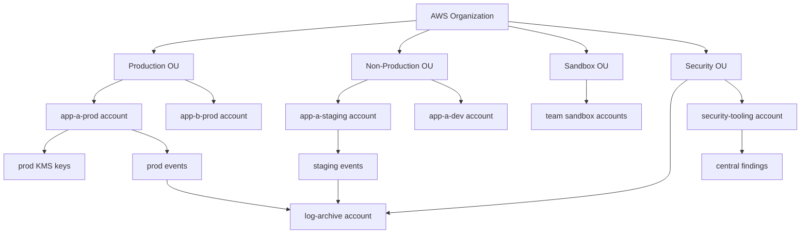
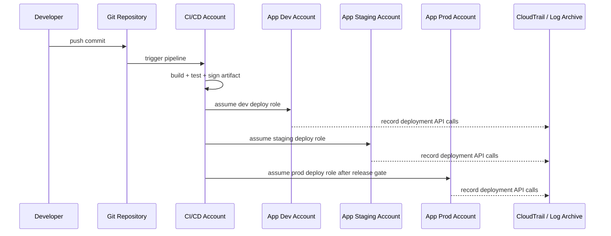
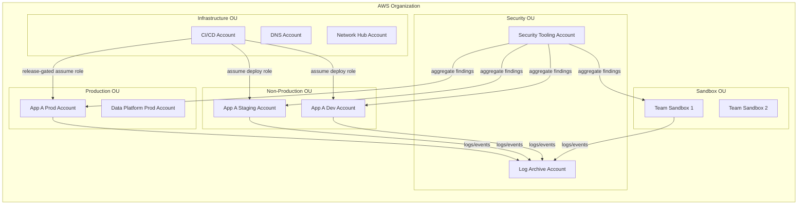

# Part 007 — Environment Separation Strategy

Environment separation sering dianggap topik sederhana.

Biasanya orang langsung membuat:

```text
prod
staging
dev
```

Lalu merasa selesai.

Di AWS, itu belum cukup.

Environment bukan sekadar nama folder, workspace Terraform, suffix resource, atau namespace Kubernetes. Environment adalah **risk boundary**: batas yang menentukan siapa boleh melakukan apa, data apa boleh berada di mana, audit apa harus tersedia, failure apa bisa menyebar, dan kontrol apa harus diwariskan.

Kalau boundary salah, efeknya tidak langsung terlihat saat sistem masih kecil. Efeknya muncul saat:

- satu engineer punya akses dev lalu tidak sengaja menyentuh prod,
- satu pipeline non-prod membawa credential prod,
- staging berisi data production tanpa kontrol production,
- satu SCP terlalu longgar di OU yang salah,
- satu vulnerability scanner tidak punya visibility ke workload account tertentu,
- satu billing spike dari sandbox bercampur dengan cost production,
- satu incident sulit diinvestigasi karena log prod dan non-prod tercampur tanpa ownership yang jelas.

AWS Well-Architected Security Pillar merekomendasikan pemisahan workload menggunakan account dan menyebut account-level separation sebagai isolation boundary yang kuat untuk security, billing, dan access. AWS juga menekankan bahwa workload dengan environment berbeda seperti production, development, dan test sebaiknya dipisahkan melalui multi-account strategy.

Part ini membahas strategi pemisahan environment sebagai desain operasi, bukan naming convention.

---

## 1. Core Mental Model

Pemisahan environment menjawab pertanyaan:

> State mana yang boleh gagal bersama?

Itu pertanyaan paling penting.

Kalau dua hal boleh gagal bersama, boleh berbagi boundary yang sama. Kalau tidak boleh gagal bersama, jangan taruh di boundary yang sama.

Boundary bisa berupa:

| Boundary | Yang Dipisahkan | Contoh |
|---|---|---|
| AWS account | IAM, quota, billing, resource ownership, sebagian besar blast radius | Prod account dan dev account berbeda |
| OU | Policy inheritance dan governance scope | Production OU punya SCP lebih ketat daripada Sandbox OU |
| Region | Data residency, latency, disaster boundary | `ap-southeast-1` untuk primary, `ap-southeast-3` untuk DR tertentu |
| VPC | Network reachability | Prod VPC tidak routable langsung dari dev VPC |
| KMS key | Cryptographic boundary | Prod data tidak didekripsi oleh non-prod principal |
| Log archive | Evidence boundary | Security logs tidak bisa dihapus oleh workload owner |
| CI/CD identity | Deployment authority | Dev pipeline tidak bisa assume role prod |
| Human role | Operational authority | Read-only prod access berbeda dari admin sandbox |

Environment separation yang bagus tidak bergantung pada satu boundary. Ia memakai beberapa boundary berlapis.



Diagram ini tidak mengatakan bahwa semua organisasi harus memakai struktur persis seperti ini. Yang penting adalah prinsipnya:

> Production, non-production, sandbox, security tooling, dan log archive tidak boleh menjadi sekadar tag. Mereka harus menjadi boundary operasional.

---

## 2. Environment Bukan Sama dengan Stage

Banyak tim memakai istilah environment dan stage secara bergantian. Untuk sistem kecil, itu bisa dimaklumi. Untuk AWS organization skala besar, itu berbahaya.

**Stage** adalah posisi dalam delivery lifecycle.

Contoh:

```text
local -> dev -> test -> staging -> prod
```

**Environment** adalah runtime boundary dengan control set tertentu.

Contoh:

```text
app-a-prod account
app-a-staging account
app-a-dev account
platform-shared-prod account
security-tooling account
log-archive account
sandbox-team-x account
```

Stage menjelaskan **kapan software berada dalam lifecycle**.

Environment menjelaskan **di mana software berjalan dan kontrol apa yang berlaku**.

Kesalahan desain terjadi saat organisasi hanya menambah stage tetapi tidak menambah boundary. Misalnya semua stage berada dalam satu account:

```text
one-shared-account
├── app-a-dev
├── app-a-staging
└── app-a-prod
```

Ini terlihat hemat di awal, tetapi membuat banyak risiko:

- IAM policy menjadi penuh kondisi string dan tag.
- Resource discovery menjadi sulit.
- Engineer dev bisa melihat resource prod kalau policy salah satu baris.
- Quota account menjadi shared failure mode.
- CloudTrail tetap bisa merekam, tetapi investigation harus memilah resource naming yang rawan inkonsisten.
- GuardDuty/Security Hub finding bercampur antara experimental dan critical.
- Cost allocation bergantung pada tagging disiplin, bukan boundary.
- SCP tidak bisa berbeda per stage karena semua stage ada di account yang sama.

Untuk production-grade system, environment harus lebih dekat ke account boundary daripada naming convention.

---

## 3. Dimensi yang Harus Dipisahkan

Jangan mulai dari “butuh berapa account”. Mulai dari dimensi risiko.

### 3.1 Data Sensitivity

Data production, regulated data, customer PII, secrets, key material, dan telemetry sensitif tidak boleh diperlakukan sama dengan data dummy.

Pertanyaan desain:

- Apakah non-prod memakai data production?
- Apakah data production telah dimasking sebelum masuk staging?
- Siapa boleh membaca snapshot database?
- Apakah KMS key prod bisa dipakai oleh principal non-prod?
- Apakah log aplikasi mengandung PII?
- Apakah query debug bisa mengekstrak data pelanggan?

Kalau jawabannya tidak jelas, environment separation belum matang.

**Invariant yang sehat:**

```text
Non-production account tidak boleh memiliki akses langsung ke plaintext production data kecuali melalui proses controlled, audited, masked, dan time-bounded.
```

### 3.2 Human Access

Production access harus lebih sempit, lebih auditable, dan lebih temporer daripada non-production.

Contoh perbedaan:

| Environment | Human Access Model |
|---|---|
| Dev | Developer bisa punya write access terbatas sesuai sandbox aplikasi |
| Staging | Developer bisa deploy dan troubleshoot, tetapi tidak punya akses rahasia production |
| Prod | Read-only default, write via pipeline, break-glass dengan approval dan audit |
| Sandbox | Eksperimen bebas dalam limit ketat dan tanpa akses network/data production |

Kesalahan umum adalah memberi role `PowerUserAccess` di seluruh account karena “engineer butuh velocity”. Velocity seperti ini adalah utang risiko.

### 3.3 Deployment Authority

Pipeline adalah principal juga.

Kalau pipeline dev bisa assume role prod, maka dev bukan environment lemah. Ia menjadi jalan masuk ke prod.

Aturan minimal:

- Dev pipeline hanya deploy ke dev.
- Staging pipeline hanya deploy ke staging.
- Prod deploy role hanya bisa diasumsikan oleh pipeline yang punya kontrol release production.
- Prod deployment harus punya artifact provenance: commit, build ID, approver atau release event, dan hash artifact.
- Prod role tidak boleh menyimpan long-lived credential.

### 3.4 Network Reachability

Jangan menjadikan network sebagai satu-satunya security boundary, tetapi jangan pula mengabaikannya.

Pertanyaan desain:

- Apakah dev bisa connect ke database prod?
- Apakah sandbox punya route ke shared service prod?
- Apakah staging bisa call production API dengan credential internal?
- Apakah egress prod dan non-prod punya policy berbeda?
- Apakah VPC endpoint policy membatasi akses ke bucket/key tertentu?

Network reachability harus mengikuti data sensitivity dan identity boundary.

### 3.5 Audit and Evidence

Environment separation juga berarti evidence separation.

Prod harus punya:

- CloudTrail organization trail aktif,
- CloudTrail management events multi-region,
- data events untuk resource sensitif,
- AWS Config recorder,
- Security Hub/GuardDuty/Inspector/Macie enrollment sesuai kebutuhan,
- log retention yang cukup untuk audit dan investigation,
- immutable atau protected log archive.

Non-prod juga perlu audit, tetapi retention, alert severity, dan SLA bisa berbeda.

Sandbox tetap harus terekam. “Sandbox” bukan sinonim “tidak diaudit”.

### 3.6 Cost, Quota, and Throttling

AWS account punya quota dan billing visibility. Menyatukan environment berarti menyatukan failure mode quota.

Contoh:

- Load test di staging menghabiskan NAT gateway bandwidth/cost dan mengaburkan cost prod.
- Eksperimen dev mencapai quota Lambda concurrency dan mengganggu deployment prod jika satu account.
- Sandbox membuat ratusan NAT gateway, GPU instance, atau log ingestion besar tanpa budget guardrail.

Account separation membantu membuat cost dan quota menjadi boundary yang bisa dikendalikan.

### 3.7 Compliance Scope

Compliance scope harus sekecil mungkin.

Kalau regulated workload dicampur dengan experimental workload dalam account yang sama, maka audit scope ikut melebar.

Prinsip:

> Jangan membawa seluruh organisasi masuk scope compliance hanya karena boundary environment malas didesain.

---

## 4. Account-Per-Environment vs OU-Per-Environment

Dua pola umum:

### Pattern A — OU per Environment

```text
Workloads OU
├── Prod OU
│   ├── app-a-prod
│   └── app-b-prod
├── Staging OU
│   ├── app-a-staging
│   └── app-b-staging
└── Dev OU
    ├── app-a-dev
    └── app-b-dev
```

Kelebihan:

- SCP mudah berbeda per environment.
- Production controls bisa diterapkan seragam.
- Security team mudah membaca semua prod account.
- Cocok saat environment policy lebih dominan daripada application policy.

Kekurangan:

- Melihat semua account milik satu aplikasi butuh query/tagging.
- Aplikasi regulated khusus mungkin butuh OU tambahan.
- Delegasi ke application platform team bisa lebih kompleks.

### Pattern B — OU per Application atau Product

```text
Workloads OU
├── App A OU
│   ├── app-a-prod
│   ├── app-a-staging
│   └── app-a-dev
└── App B OU
    ├── app-b-prod
    ├── app-b-staging
    └── app-b-dev
```

Kelebihan:

- Ownership aplikasi jelas.
- Team bisa melihat seluruh lifecycle aplikasi.
- Cocok untuk product-aligned organization.

Kekurangan:

- Prod SCP harus diterapkan ke account individual atau nested OU.
- Governance berbeda environment bisa lebih susah kalau tidak ada child OU.
- Risiko policy drift antar aplikasi.

### Pattern C — Hybrid

```text
Workloads OU
├── Production OU
│   ├── App A OU
│   │   └── app-a-prod
│   └── App B OU
│       └── app-b-prod
├── NonProduction OU
│   ├── App A OU
│   │   ├── app-a-staging
│   │   └── app-a-dev
│   └── App B OU
│       ├── app-b-staging
│       └── app-b-dev
└── Regulated OU
    └── payment-prod
```

Hybrid biasanya paling realistis untuk enterprise. Production dan regulated workload butuh control yang kuat. Non-prod butuh fleksibilitas. Sandbox butuh limit agresif.

Pilihan terbaik ditentukan oleh pertanyaan:

> Apakah kontrol lebih sering berbeda berdasarkan environment, aplikasi, data classification, region, atau team ownership?

OU harus mengikuti pola kontrol, bukan struktur organisasi HR.

---

## 5. Baseline Environment Taxonomy

Untuk seri ini, gunakan taxonomy berikut sebagai default.

| Environment Type | Tujuan | Boundary Minimal | Kontrol Minimal |
|---|---|---|---|
| Production | Menjalankan customer-facing atau business-critical workload | Dedicated account per workload atau domain | Strict IAM, audit, Config, GuardDuty, Security Hub, backup, patch, SLO, change control |
| Staging | Validasi release sebelum prod | Dedicated account jika workload critical | Similar-to-prod topology, masked data, controlled deploy, logging cukup |
| Test/QA | Integration, performance, regression | Dedicated atau shared per domain tergantung risiko | No prod secrets, budget guardrail, ephemeral data |
| Development | Developer iteration | Account per team/app atau shared dev account dengan boundary jelas | Limited service set, no prod network/data, lower retention |
| Sandbox | Eksperimen | Account vending dengan expiry/budget | Strong SCP, budget alarm, no peering to prod, no sensitive data |
| Shared Services | DNS, CI/CD, artifact, directory, network hub, observability | Dedicated account per function jika penting | Very strict access, high audit, no casual workload deployment |
| Security Tooling | Security operations and findings aggregation | Dedicated account | Delegated admin, finding aggregation, response automation |
| Log Archive | Immutable-ish evidence store | Dedicated account | Write from many, read by few, deletion protection, retention policy |
| Audit/Compliance | Evidence and assessment | Dedicated or security tooling-separated | Controlled read access, report generation, evidence export |

Taxonomy ini bukan template buta. Ia adalah starting point.

---

## 6. Production Harus Menjadi Boundary Tertinggi

Production memiliki karakter berbeda:

- data nyata,
- customer impact,
- compliance impact,
- availability target,
- incident severity,
- legal/audit consequence,
- reputational risk.

Karena itu, production membutuhkan prinsip:

```text
Prod is not a bigger dev. Prod is a protected operating zone.
```

### 6.1 Default Prod Rules

Production account sebaiknya punya baseline:

- Tidak ada root access untuk aktivitas normal.
- Tidak ada IAM user untuk human engineer.
- Human write access sangat terbatas dan time-bounded.
- Deployment via role khusus pipeline.
- Secrets prod hanya diakses workload prod dan deployment flow yang sah.
- CloudTrail, Config, GuardDuty, Security Hub tidak bisa dimatikan oleh workload owner.
- Backup dan log retention mengikuti business criticality.
- KMS key policy memisahkan admin key dari pengguna key.
- Break-glass access diaudit dan direview.
- Public exposure membutuhkan exception eksplisit.

### 6.2 Prod Bukan Tempat Eksperimen

Eksperimen di prod kadang perlu, misalnya feature flag, canary, chaos engineering, atau performance validation. Tetapi eksperimen production harus punya:

- blast radius kecil,
- rollback path,
- owner jelas,
- observability aktif,
- stop condition,
- approval sesuai risiko,
- post-experiment evidence.

Eksperimen tanpa guardrail bukan engineering. Itu gambling.

---

## 7. Staging: Mirror Prod atau Tidak?

Ada dua ekstrem yang sama-sama salah.

Ekstrem pertama:

> “Staging harus 100% sama dengan prod.”

Ini mahal, sering tidak realistis, dan bisa memperluas risiko jika staging memakai data production.

Ekstrem kedua:

> “Staging cukup seadanya.”

Ini membuat staging tidak mampu mendeteksi failure yang akan muncul di prod.

Strategi yang benar:

> Staging harus mirip prod pada dimensi failure yang ingin divalidasi.

Contoh:

| Dimensi | Harus Sama dengan Prod? | Catatan |
|---|---:|---|
| IAM deployment path | Ya | Kalau prod deploy via pipeline, staging juga harus via pipeline. |
| Network topology utama | Sebaiknya | Agar dependency path bisa diuji. |
| Database engine/version | Ya | Major/minor mismatch bisa menyembunyikan failure. |
| Data volume | Tergantung | Performance test butuh volume representatif, tidak selalu data asli. |
| Data sensitivity | Tidak harus | Pakai masked/synthetic data jika memungkinkan. |
| Instance size | Tergantung | Bisa lebih kecil kecuali performance validation. |
| Security services | Ya untuk critical signals | GuardDuty/Config/Security Hub tetap berguna. |
| Retention log | Bisa lebih pendek | Tapi cukup untuk debugging release. |

Staging bukan replika visual prod. Staging adalah simulator risiko production.

---

## 8. Dev dan Sandbox Harus Dibedakan

Dev adalah environment untuk membangun workload yang nyata.

Sandbox adalah environment untuk eksperimen yang mungkin tidak menjadi workload nyata.

Mencampur keduanya menyebabkan dua masalah:

1. Sandbox menjadi terlalu dibatasi sehingga engineer tidak bisa belajar.
2. Dev menjadi terlalu bebas sehingga workload nyata kehilangan kontrol.

### Dev Account

Dev account boleh punya:

- akses engineer lebih luas daripada prod,
- deployment sering,
- data synthetic,
- log retention pendek,
- cost limit moderat,
- service allowlist sesuai platform.

Tetapi dev tetap harus:

- tidak memakai production secrets,
- tidak punya route langsung ke production database,
- tidak bisa assume prod role,
- tidak menyimpan customer PII tanpa approval,
- tetap diaudit.

### Sandbox Account

Sandbox account harus:

- mudah dibuat,
- mudah dihancurkan,
- punya expiry,
- punya budget limit,
- punya region restriction jika perlu,
- tidak punya connectivity ke production,
- tidak boleh menyimpan data sensitif,
- boleh lebih bebas dalam resource experimentation selama masih dalam guardrail.

Sandbox yang baik mengurangi shadow IT karena engineer punya tempat aman untuk mencoba.

---

## 9. Shared Services: Berguna, Tetapi Berbahaya

Shared services account sering menampung:

- CI/CD platform,
- artifact repository,
- central DNS,
- directory/federation integration,
- observability tooling,
- network hub,
- image registry,
- secrets bootstrap,
- license server,
- golden AMI/image pipeline.

Karena banyak workload bergantung padanya, shared services account menjadi high-value target.

Aturan:

- Jangan taruh aplikasi bisnis biasa di shared services account.
- Jangan campur shared prod dan shared non-prod tanpa boundary jelas.
- Jangan beri admin luas ke semua platform engineer tanpa permission boundary.
- Jangan jadikan shared services sebagai jalan pintas untuk bypass production controls.
- Audit shared services harus minimal setara production.

Shared services adalah dependency root. Treat it like production.

---

## 10. Environment Separation dan CI/CD

Dalam AWS, deployment biasanya berarti pipeline melakukan `AssumeRole` ke target account.

Model aman:



Yang perlu dijaga:

- Role prod hanya trusted ke pipeline principal tertentu.
- Trust policy menggunakan condition yang mengikat source account/source ARN jika memungkinkan.
- Artifact yang masuk prod sama dengan artifact yang diuji, bukan rebuild liar.
- Prod deployment role tidak memberi izin membuat IAM admin kecuali memang bagian dari platform deployment yang dikontrol.
- Manual prod console changes harus menjadi exception, bukan normal path.

Pipeline adalah extension dari permission model. Jangan desain IAM manusia dengan ketat tetapi membiarkan pipeline menjadi super-admin tanpa audit.

---

## 11. Environment Promotion Model

Environment separation harus sejalan dengan promotion model.

```text
source code -> build artifact -> dev deploy -> staging deploy -> production deploy
```

Yang berpindah antar environment seharusnya **artifact dan configuration intent**, bukan credential dan state mentah.

### Yang Boleh Dipromosikan

- Container image digest.
- Lambda artifact checksum.
- Infrastructure module version.
- Schema migration version.
- Configuration template.
- Policy bundle yang sudah direview.
- Release manifest.

### Yang Tidak Boleh Dipromosikan Sembarangan

- Secrets.
- Database dump production.
- IAM access key.
- KMS key material.
- Session token.
- Manual console state.
- Environment-specific endpoint hardcoded.

Promotion model yang buruk membuat environment separation hanya ilusi.

---

## 12. Naming, Tagging, dan Metadata

Account boundary tetap membutuhkan metadata.

Minimal setiap account punya metadata:

| Field | Contoh | Tujuan |
|---|---|---|
| `account_type` | `workload`, `security`, `log-archive`, `sandbox` | Taxonomy |
| `environment` | `prod`, `staging`, `dev`, `sandbox` | Control mapping |
| `workload_id` | `payments`, `case-management` | Ownership dan cost |
| `owner_team` | `regulatory-platform` | Escalation |
| `data_classification` | `confidential`, `regulated` | Security baseline |
| `criticality` | `tier-0`, `tier-1`, `tier-2` | Incident priority |
| `cost_center` | `cc-1234` | Chargeback/showback |
| `lifecycle` | `active`, `temporary`, `decommissioning` | Cleanup |

Metadata ini dipakai untuk:

- account vending,
- SCP placement,
- GuardDuty/Security Hub routing,
- Config aggregator filtering,
- incident escalation,
- cost allocation,
- audit report,
- backup policy,
- exception registry.

Tagging resource tetap penting, tetapi account metadata lebih kuat untuk governance karena tidak bergantung pada setiap resource creator.

---

## 13. Environment-Specific Guardrail Matrix

Contoh matrix:

| Control | Sandbox | Dev | Staging | Prod |
|---|---:|---:|---:|---:|
| CloudTrail org trail | Wajib | Wajib | Wajib | Wajib |
| AWS Config | Minimal | Wajib untuk managed resources | Wajib | Wajib |
| GuardDuty | Wajib | Wajib | Wajib | Wajib |
| Security Hub | Optional/aggregated | Wajib jika workload managed | Wajib | Wajib |
| IAM Identity Center | Wajib | Wajib | Wajib | Wajib |
| IAM user creation | Deny | Deny by default | Deny | Deny |
| Root activity alert | Wajib | Wajib | Wajib | Wajib |
| Public S3 | Deny by default | Deny by default | Deny by default | Deny, exception only |
| Region restriction | Ketat | Sesuai kebutuhan | Ketat | Ketat |
| Budget alarm | Sangat ketat | Ketat | Moderat | Berdasarkan forecast |
| Backup policy | Optional | Tergantung | Tergantung | Wajib sesuai RTO/RPO |
| Log retention | Pendek | Pendek/moderat | Moderat | Panjang sesuai audit |
| Prod data access | Deny | Deny | Masked only | Controlled |
| Break-glass role | Tidak perlu | Terbatas | Ada jika critical | Wajib, audited |

Matrix seperti ini membantu security menjadi eksplisit. Tanpa matrix, setiap account menjadi negosiasi manual.

---

## 14. Common Anti-Patterns

### Anti-Pattern 1 — One Account to Rule Them All

Semua dev, staging, prod, security tooling, dan logs dalam satu account.

Masalah:

- Tidak ada account-level blast radius.
- SCP tidak bisa dipakai untuk membedakan prod/non-prod.
- IAM policy menjadi terlalu rumit.
- Audit signal bercampur.
- Cost dan quota bercampur.

### Anti-Pattern 2 — Environment Hanya Suffix Resource

```text
orders-prod-db
orders-dev-db
orders-staging-db
```

Naming membantu manusia membaca resource, tetapi tidak mencegah credential dev menyentuh prod jika policy salah.

### Anti-Pattern 3 — Staging Memakai Data Production Tanpa Kontrol

Staging sering dianggap non-prod, tetapi data production membuatnya menjadi production-like dari sisi security.

Rule:

> Classification follows data, not environment name.

Kalau staging berisi PII nyata, staging butuh kontrol seperti production untuk aspek data protection.

### Anti-Pattern 4 — Sandbox Terhubung ke Prod

Sandbox yang punya VPN/peering/private endpoint ke prod bukan sandbox. Itu ungoverned entry point.

### Anti-Pattern 5 — Shared Services Menjadi Hidden Admin Plane

CI/CD account yang bisa deploy apa pun ke mana pun tanpa release gate adalah super-admin terselubung.

### Anti-Pattern 6 — OU Mengikuti Struktur Organisasi HR

Divisi bisa berubah setiap tahun. Control requirement biasanya lebih stabil: prod, regulated, sandbox, security, infra.

OU harus dioptimalkan untuk control inheritance, bukan org chart.

---

## 15. Decision Framework: Kapan Membuat Account Baru?

Buat account baru jika salah satu kondisi ini benar:

1. Workload punya data sensitivity berbeda.
2. Workload punya compliance scope berbeda.
3. Workload punya owner berbeda dan membutuhkan autonomy.
4. Workload punya deployment lifecycle berbeda.
5. Workload punya availability criticality berbeda.
6. Workload punya blast radius yang tidak boleh bercampur.
7. Workload butuh quota/cost boundary sendiri.
8. Workload butuh KMS key dan secret boundary sendiri.
9. Workload butuh network reachability berbeda.
10. Workload perlu dihapus/decommission tanpa mengganggu workload lain.

Jangan membuat account baru hanya karena:

- ingin naming rapi,
- satu developer minta “tempat coba-coba” tanpa expiry,
- ingin menghindari tagging,
- ingin bypass policy di account lama.

Account baru adalah unit operasi. Ia butuh owner, baseline, logging, budget, lifecycle, dan decommission path.

---

## 16. Reference Architecture: Environment Separation Minimal



Desain ini memiliki beberapa invariant:

- Log archive tidak dikelola oleh workload account.
- Security tooling tidak bercampur dengan application runtime.
- Sandbox tidak menjadi dependency production.
- CI/CD punya role berbeda per target environment.
- Production OU bisa diberi SCP lebih ketat.
- Non-prod tetap diaudit.

---

## 17. Migration Path dari Single Account ke Multi-Environment

Banyak organisasi sudah telanjur memiliki satu account besar. Jangan langsung memindahkan semuanya sekaligus.

Gunakan urutan migrasi:

### Step 1 — Inventory

Identifikasi:

- resource per workload,
- data classification,
- IAM principals,
- network dependencies,
- KMS keys,
- secrets,
- pipelines,
- CloudTrail/Config status,
- cost owner,
- current public exposure.

### Step 2 — Define Target Taxonomy

Tetapkan minimal:

```text
security/log-archive
security/security-tooling
workloads/prod
workloads/non-prod
sandbox
infrastructure/shared-services
```

### Step 3 — Move Logs First

Sebelum migrasi workload, pastikan audit dan log archive siap.

Kalau migrasi gagal, Anda tetap butuh evidence.

### Step 4 — Separate Production

Pisahkan production dari dev/test terlebih dahulu.

Production adalah boundary paling penting.

### Step 5 — Separate High-Risk Shared Services

CI/CD, DNS, federation, artifact repository, and network hub harus keluar dari account campuran.

### Step 6 — Create Sandbox Vending

Berikan tempat eksperimen yang aman agar engineer tidak memakai dev/prod untuk eksperimen.

### Step 7 — Tighten SCP and IAM

Jangan menerapkan deny besar-besaran sebelum Anda tahu dependency aktual. Mulai dari monitor/detect, lalu deny untuk invariant yang sudah jelas.

### Step 8 — Decommission Legacy Account

Legacy shared account harus punya exit plan. Kalau tidak, ia menjadi permanent exception.

---

## 18. Checklist Desain Environment

Gunakan checklist ini sebelum membuat environment baru.

### Identity

- Siapa human owner?
- Siapa technical owner?
- Role apa yang boleh write?
- Apakah human write access time-bounded?
- Apakah IAM user creation dicegah?
- Apakah root activity diawasi?

### Data

- Data classification apa?
- Apakah ada PII/customer data?
- Apakah data masked/synthetic?
- KMS key apa yang dipakai?
- Siapa boleh decrypt?

### Network

- Apakah environment butuh inbound public?
- Apakah ada route ke prod?
- Apakah egress dibatasi?
- Apakah VPC endpoint policy dibutuhkan?

### Audit

- CloudTrail aktif?
- Config aktif?
- Logs dikirim ke log archive?
- Retention berapa lama?
- Siapa boleh membaca log?

### Detection

- GuardDuty enrolled?
- Security Hub enabled?
- Inspector/Macie relevan?
- Finding diarahkan ke owner mana?

### Operations

- Budget limit ada?
- Backup policy ada?
- Patch responsibility jelas?
- Incident contact jelas?
- Decommission path ada?

---

## 19. Latihan Engineering

Ambil satu workload nyata. Buat tabel berikut.

| Question | Answer |
|---|---|
| Workload name |  |
| Owner team |  |
| Production account |  |
| Staging account |  |
| Dev account |  |
| Data classification |  |
| Prod deploy role |  |
| Human prod access |  |
| Secrets boundary |  |
| KMS boundary |  |
| Log archive path |  |
| GuardDuty/Security Hub aggregation |  |
| Backup policy |  |
| Budget owner |  |
| Incident owner |  |
| Decommission procedure |  |

Kalau tabel ini sulit diisi, bukan berarti tabelnya terlalu detail. Itu sinyal bahwa environment ownership belum jelas.

---

## 20. Kesimpulan

Environment separation adalah fondasi untuk semua part berikutnya.

IAM policy, SCP, CloudTrail, Config, GuardDuty, Security Hub, KMS, Systems Manager, backup, dan incident response semuanya menjadi lebih jelas jika boundary environment jelas.

Prinsip utama:

1. Environment adalah risk boundary, bukan suffix nama resource.
2. Production harus menjadi protected operating zone.
3. Staging harus mirip prod pada dimensi failure yang ingin diuji.
4. Dev dan sandbox harus dibedakan.
5. Shared services harus diperlakukan seperti dependency root.
6. Account dan OU harus mengikuti control requirement, bukan org chart.
7. Data classification mengalahkan label environment.
8. Audit harus lintas semua environment, termasuk sandbox.

Bagian berikutnya akan membahas **Cloud Risk Register and Control Mapping**: bagaimana mengubah risiko menjadi control, evidence, owner, SLA, dan remediation workflow.

---

## References

- AWS Well-Architected Framework — Security Pillar: SEC01-BP01 Separate workloads using accounts. https://docs.aws.amazon.com/wellarchitected/latest/security-pillar/sec_securely_operate_multi_accounts.html
- AWS Whitepaper — Organizing Your AWS Environment Using Multiple Accounts. https://docs.aws.amazon.com/whitepapers/latest/organizing-your-aws-environment/organizing-your-aws-environment.html
- AWS Security Reference Architecture — Workloads OU / Application account. https://docs.aws.amazon.com/prescriptive-guidance/latest/security-reference-architecture/application.html
- AWS Security Reference Architecture — Security Tooling account. https://docs.aws.amazon.com/prescriptive-guidance/latest/security-reference-architecture/security-tooling.html
- AWS Security Reference Architecture — Log Archive account. https://docs.aws.amazon.com/prescriptive-guidance/latest/security-reference-architecture/log-archive.html
