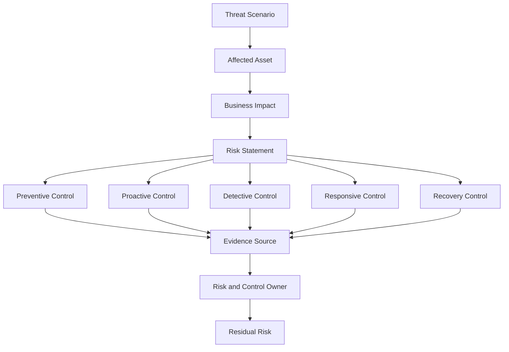
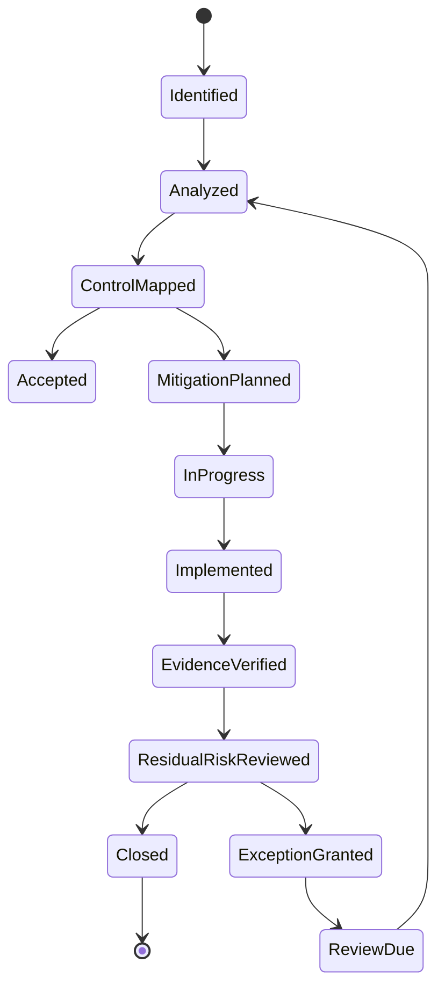

# Part 008 — Cloud Risk Register and Control Mapping

Security yang matang tidak dimulai dari tool.

Ia dimulai dari kalimat seperti ini:

> Apa risiko yang sedang kita kurangi?

Tanpa jawaban jelas, organisasi akan mengaktifkan banyak service tetapi tetap tidak tahu apakah posture membaik.

GuardDuty aktif. Security Hub aktif. Config aktif. Inspector aktif. Macie aktif. CloudTrail aktif. Tetapi saat auditor, incident commander, atau CTO bertanya “risiko terbesar kita apa?”, jawabannya tetap kabur.

Itu tanda sistem security masih tool-driven, bukan risk-driven.

Part ini membahas cara membangun **cloud risk register** dan **control mapping** untuk AWS environment.

Risk register bukan dokumen GRC statis. Untuk engineering, risk register adalah struktur kerja yang menghubungkan:

```text
threat scenario -> affected asset -> impact -> control -> evidence -> owner -> remediation -> residual risk
```

AWS Cloud Adoption Framework menekankan pentingnya security governance, risk assessment, control framework, security assurance, dan continuous monitoring untuk mengevaluasi efektivitas kontrol. AWS Prescriptive Guidance juga membagi security controls menjadi preventive, proactive, detective, dan responsive controls. Itu memberi kita bahasa operasional untuk memetakan risiko menjadi sistem kontrol.

---

## 1. Problem: Banyak Finding, Sedikit Risk Clarity

Lingkungan AWS yang cukup besar biasanya menghasilkan banyak sinyal:

- Security Hub findings,
- GuardDuty findings,
- AWS Config noncompliance,
- Inspector vulnerabilities,
- IAM Access Analyzer external access findings,
- Macie sensitive data findings,
- CloudTrail suspicious events,
- CloudWatch alarms,
- budget anomalies,
- penetration test reports,
- audit observations,
- incident postmortems.

Tanpa risk model, semua sinyal ini menjadi noise.

Masalah klasik:

- Critical vulnerability di instance non-routable dev dianggap sama dengan critical vulnerability di public-facing prod.
- Public S3 bucket kosong mendapat perhatian lebih besar daripada IAM role prod dengan privilege escalation path.
- Security team membuat finding, tetapi tidak tahu owner teknis.
- Platform team menutup finding satu per satu tanpa memperbaiki control penyebabnya.
- Audit meminta evidence, tetapi evidence tersebar di screenshot, spreadsheet, dan percakapan Slack.
- Remediation SLA dibuat berdasarkan severity tool, bukan business impact.

Risk register yang baik mengubah ini menjadi sistem berpikir.

---

## 2. Risk Register untuk Engineer

Risk register bukan sekadar tabel compliance. Ia harus bisa dipakai engineer untuk mengambil keputusan.

Minimal field:

| Field | Makna |
|---|---|
| `risk_id` | Identifier stabil, misalnya `AWS-RISK-IAM-001` |
| `risk_statement` | Pernyataan risiko dalam format sebab-akibat |
| `threat_scenario` | Cara risiko terjadi secara teknis |
| `affected_assets` | Account, workload, data, identity, network, service |
| `business_impact` | Dampak pada confidentiality, integrity, availability, compliance, cost, reputation |
| `likelihood` | Kemungkinan sebelum kontrol |
| `impact` | Besar dampak sebelum kontrol |
| `inherent_risk` | Risk rating sebelum kontrol |
| `controls` | Preventive, proactive, detective, responsive/recovery controls |
| `evidence_source` | CloudTrail, Config, Security Hub, IAM Access Analyzer, ticket, IaC scan, etc. |
| `control_owner` | Tim yang menjaga kontrol |
| `risk_owner` | Pemilik risiko bisnis/teknis |
| `remediation_sla` | Batas waktu berdasarkan severity dan environment |
| `exception_process` | Cara menyetujui penyimpangan |
| `residual_risk` | Risiko setelah kontrol |
| `review_cadence` | Kapan risiko dievaluasi ulang |

Format risk statement yang bagus:

```text
Because <condition>, a <threat actor or failure mode> could <action>, causing <impact>.
```

Contoh:

```text
Because production IAM roles can create new inline policies without permission boundaries,
a compromised deployment role could escalate privileges and modify security controls,
causing unauthorized access to sensitive data and loss of audit integrity.
```

Kalimat ini jauh lebih berguna daripada:

```text
IAM risk high.
```

---

## 3. Control Taxonomy

AWS Prescriptive Guidance membagi security control menjadi empat tipe utama.

### 3.1 Preventive Controls

Preventive controls mencegah event terjadi.

Contoh AWS:

- SCP menolak penggunaan region tidak disetujui.
- IAM policy tidak memberi `s3:PutBucketPublicAccessBlock` sembarangan.
- KMS key policy tidak mengizinkan decrypt lintas account tanpa syarat.
- VPC endpoint policy membatasi akses bucket tertentu.
- Permission boundary membatasi role yang dibuat platform team.

Preventive control bagus untuk invariant yang jelas.

Tetapi terlalu banyak preventive control tanpa exception path akan menghambat engineering dan mendorong bypass.

### 3.2 Proactive Controls

Proactive controls mencegah resource noncompliant dibuat, biasanya pada provisioning path.

Contoh:

- IaC policy check menolak S3 bucket public sebelum merge.
- CloudFormation Guard rule mencegah resource tanpa encryption.
- Control Tower proactive control mengecek template sebelum provision.
- CI/CD policy gate mencegah security group `0.0.0.0/0` untuk port sensitif.

Proactive control berada sebelum resource hidup.

### 3.3 Detective Controls

Detective controls mendeteksi, mencatat, dan memberi alert setelah event terjadi.

Contoh:

- CloudTrail merekam API call.
- AWS Config mendeteksi resource drift.
- GuardDuty mendeteksi credential exfiltration pattern.
- Security Hub mengagregasi posture findings.
- IAM Access Analyzer mendeteksi external access.
- CloudWatch alarm mendeteksi error rate atau unusual activity.

Detective control penting karena tidak semua risiko bisa dicegah.

### 3.4 Responsive Controls

Responsive controls menggerakkan remediation.

Contoh:

- EventBridge memicu Lambda untuk memblokir public S3 bucket.
- Systems Manager Automation mengisolasi EC2 instance.
- Security Hub custom action membuat ticket incident.
- Step Functions menjalankan approval + remediation workflow.
- Incident Manager memanggil on-call dan membuat incident timeline.

Responsive control membuat detection menjadi action.

### 3.5 Recovery Controls

AWS Prescriptive Guidance menekankan empat tipe di atas. Dalam engineering, kita juga sering memisahkan recovery controls karena recovery adalah kemampuan berbeda dari remediation.

Contoh:

- AWS Backup restore test.
- Cross-region replication.
- Immutable backup vault.
- Disaster recovery runbook.
- Rebuild-from-IaC capability.

Recovery control menjawab:

> Setelah failure atau compromise, bisakah sistem kembali ke state aman?

---

## 4. Risk-to-Control Mapping Flow



Mapping ini memaksa kita tidak berhenti di “aktifkan service”.

Untuk setiap risiko, tanyakan:

1. Bisakah dicegah?
2. Bisakah dicegah sebelum provision?
3. Kalau terjadi, bagaimana dideteksi?
4. Setelah terdeteksi, siapa bergerak?
5. Bagaimana dipulihkan?
6. Evidence apa yang membuktikan kontrol berjalan?
7. Risiko apa yang tetap tersisa?

---

## 5. Risk Register Example: Public S3 Exposure

### Risk Statement

```text
Because S3 buckets may be created or modified with public access,
an external actor could read or write sensitive objects,
causing data disclosure, integrity loss, regulatory exposure, and reputational damage.
```

### Mapping

| Dimension | Value |
|---|---|
| Risk ID | `AWS-RISK-DATA-001` |
| Affected assets | S3 buckets, customer data, logs, artifacts |
| Environment | Prod, staging with production-like data |
| Inherent risk | High |
| Preventive control | SCP to restrict dangerous public access mutations where appropriate; S3 Block Public Access baseline |
| Proactive control | IaC scan / Control Tower proactive control for bucket public access setting |
| Detective control | AWS Config rule for public buckets; Security Hub control; IAM Access Analyzer external access finding |
| Responsive control | EventBridge remediation to re-enable block public access or quarantine bucket policy |
| Recovery control | Object versioning, backup/replication for integrity recovery if write exposure occurred |
| Evidence | Config compliance history, CloudTrail `PutBucketPolicy`, Security Hub finding timeline, remediation ticket |
| Owner | Platform storage team + workload owner |
| SLA | Immediate for prod sensitive data; shorter SLA for internet-exposed buckets |
| Residual risk | Approved public static website bucket with explicit exception and monitoring |

### Notes

Public exposure is not always wrong. A static public website bucket may be intentional. The risk register must support exception, not pretend all public access is equal.

The correct question is:

> Is this exposure intentional, approved, scoped, monitored, and free of sensitive data?

---

## 6. Risk Register Example: Long-Lived Human Access Keys

### Risk Statement

```text
Because human IAM users may possess long-lived access keys,
phishing, malware, or accidental disclosure could allow unauthorized API access,
causing privilege misuse, data access, resource manipulation, or persistence.
```

### Mapping

| Dimension | Value |
|---|---|
| Risk ID | `AWS-RISK-IAM-002` |
| Affected assets | IAM users, API control plane, workload resources |
| Inherent risk | High |
| Preventive control | SCP/IAM policy preventing IAM user access key creation except approved automation accounts |
| Proactive control | IaC policy forbidding IAM users/access keys in workload modules |
| Detective control | IAM credential report, Access Analyzer unused access, CloudTrail access key usage, Security Hub IAM controls |
| Responsive control | Disable access key, rotate affected credentials, investigate CloudTrail activity |
| Recovery control | Revoke sessions where possible, rotate downstream secrets, rebuild compromised resources |
| Evidence | IAM credential report, CloudTrail `CreateAccessKey`, incident ticket, key deactivation record |
| Owner | Identity platform team |
| SLA | Immediate if key has admin access or prod usage |
| Residual risk | Dedicated service integration requiring access key with compensating controls and expiry |

### Design Principle

Human access should go through federation and temporary credentials. IAM users are exceptional, not default.

---

## 7. Risk Register Example: CloudTrail Disabled or Tampered

### Risk Statement

```text
Because workload administrators may be able to stop, delete, or alter audit logging,
a malicious or compromised principal could hide unauthorized activity,
causing loss of forensic evidence and audit integrity.
```

### Mapping

| Dimension | Value |
|---|---|
| Risk ID | `AWS-RISK-AUDIT-001` |
| Affected assets | CloudTrail, S3 log bucket, KMS log key, CloudWatch Logs |
| Inherent risk | Critical |
| Preventive control | SCP denying `cloudtrail:StopLogging`, `cloudtrail:DeleteTrail`, log bucket deletion, KMS key deletion except security admin path |
| Proactive control | Account baseline must include organization trail before account active |
| Detective control | CloudTrail event for logging changes, Config rule, Security Hub controls, EventBridge alert |
| Responsive control | Re-enable trail, isolate principal, create security incident, preserve evidence |
| Recovery control | Cross-account log archive, S3 Object Lock where applicable, KMS key recovery windows |
| Evidence | CloudTrail event history, log archive object presence, Config timeline, incident record |
| Owner | Security operations/platform security |
| SLA | Immediate |
| Residual risk | AWS service outage or pre-baseline account gap mitigated by account vending process |

### Important Insight

Audit integrity is a tier-0 control. If logging can be disabled by the same people being monitored, the system has weak evidence integrity.

---

## 8. Risk Register Example: Unpatched Compute

### Risk Statement

```text
Because compute resources may run vulnerable packages or runtime versions,
an attacker could exploit known vulnerabilities,
causing unauthorized access, lateral movement, data exposure, or service disruption.
```

### Mapping

| Dimension | Value |
|---|---|
| Risk ID | `AWS-RISK-VULN-001` |
| Affected assets | EC2, container images, Lambda runtimes, AMIs |
| Inherent risk | Medium to Critical depending exposure |
| Preventive control | Approved base images, restricted AMI usage, ECR pull policy |
| Proactive control | Image scan in CI/CD, dependency scan before deploy |
| Detective control | Amazon Inspector findings, ECR scan findings, runtime inventory |
| Responsive control | Patch Manager, rebuild image, redeploy workload, isolate vulnerable instance |
| Recovery control | Immutable infrastructure rebuild, known-good AMI/image rollback |
| Evidence | Inspector finding, patch compliance, deployment record, SSM inventory |
| Owner | Workload team + platform compute team |
| SLA | Based on severity, exploitability, exposure, and environment |
| Residual risk | Accepted vulnerability due to vendor constraint with compensating controls |

### Severity Trap

Do not blindly use CVSS as business priority.

A critical CVE on an isolated dev instance may be lower operational priority than a medium CVE on an internet-facing production authentication service.

Risk priority needs context:

```text
severity = technical severity × exposure × asset criticality × exploitability × compensating controls
```

---

## 9. Risk Register Example: Overprivileged Deployment Role

### Risk Statement

```text
Because deployment roles may have broad administrative permissions,
a compromised CI/CD pipeline or malicious commit could modify IAM, disable controls, or access sensitive resources,
causing privilege escalation and production compromise.
```

### Mapping

| Dimension | Value |
|---|---|
| Risk ID | `AWS-RISK-IAM-003` |
| Affected assets | CI/CD account, prod workload accounts, IAM roles, KMS keys, data stores |
| Inherent risk | Critical |
| Preventive control | Permission boundary, SCP, scoped deploy role, separation of security-admin functions |
| Proactive control | IaC policy to detect wildcard admin permissions and privilege escalation actions |
| Detective control | CloudTrail monitoring for IAM mutations, Access Analyzer policy validation, Security Hub IAM controls |
| Responsive control | Revoke role trust, disable pipeline, roll back IAM changes, incident response |
| Recovery control | Restore known-good IAM/IaC state, rotate secrets, rebuild compromised runtime |
| Evidence | AssumeRole events, IAM policy change events, deployment manifest, code review record |
| Owner | Platform engineering + application owner |
| SLA | Immediate for prod admin path |
| Residual risk | Controlled deployment needs elevated rights for specific resources with explicit boundary |

### Design Principle

A deployment role should have enough power to deploy the workload, not enough power to become the organization administrator.

---

## 10. Building a Control Library

Risk register becomes scalable only if controls are reusable.

Control library format:

| Field | Example |
|---|---|
| `control_id` | `AWS-CTRL-AUDIT-001` |
| `name` | Organization CloudTrail enabled |
| `type` | Detective + preventive |
| `objective` | Ensure AWS API activity is recorded across accounts and regions |
| `implementation` | Organization trail in management/security account, protected S3 log archive, SCP prevents disabling |
| `scope` | All accounts, all enabled regions |
| `evidence` | CloudTrail config, S3 log objects, Config compliance, CloudTrail events |
| `owner` | Security platform team |
| `automation` | Account vending baseline + Config rule + EventBridge alert |
| `failure_mode` | New account not enrolled, trail stopped, S3 bucket policy changed, KMS key inaccessible |
| `test_method` | Create sandbox account and validate events reach log archive |

A control library prevents every risk assessment from reinventing the same controls.

---

## 11. Evidence Mapping

A control without evidence is a belief.

Evidence mapping answers:

> How do we prove this control exists and operated during the period in question?

Examples:

| Control | Evidence Source | Evidence Type |
|---|---|---|
| Organization CloudTrail enabled | CloudTrail configuration, S3 log archive objects | Configuration + runtime logs |
| No public S3 buckets | AWS Config compliance, Security Hub findings | Compliance state |
| GuardDuty enabled in all accounts | GuardDuty admin account, organization membership | Service configuration |
| IAM user access keys prohibited | IAM credential report, CloudTrail `CreateAccessKey` events | Identity evidence |
| Production deploys via pipeline | CloudTrail `AssumeRole`, CI/CD deployment record | Change evidence |
| Backups restorable | AWS Backup job + restore test result | Recovery evidence |
| Root user not used | CloudTrail root events, alert history | Activity evidence |

Good evidence has properties:

- generated automatically,
- timestamped,
- hard to tamper with by workload owner,
- linked to account/resource/owner,
- retained long enough,
- queryable during audit or incident.

Screenshots are weak evidence. They may be acceptable for manual exceptions, but not as primary control proof.

---

## 12. Risk Scoring That Engineers Can Use

Avoid pretending risk scoring is mathematically precise. It is a prioritization tool.

A useful scoring model:

```text
risk_score = impact × likelihood × exposure_modifier × control_gap_modifier
```

### Impact

| Score | Meaning |
|---:|---|
| 1 | Limited inconvenience |
| 2 | Minor service or internal impact |
| 3 | Customer-visible or internal operational impact |
| 4 | Major customer/data/compliance impact |
| 5 | Existential, regulated, widespread, or tier-0 impact |

### Likelihood

| Score | Meaning |
|---:|---|
| 1 | Hard to trigger, requires unusual condition |
| 2 | Possible but unlikely |
| 3 | Plausible in normal operation |
| 4 | Likely under common failure/attack conditions |
| 5 | Already observed or easy to exploit |

### Exposure Modifier

| Modifier | Meaning |
|---:|---|
| 0.5 | Isolated, non-prod, no sensitive data |
| 1.0 | Internal exposure |
| 1.5 | Internet-exposed or cross-account reachable |
| 2.0 | Internet-exposed production with sensitive data |

### Control Gap Modifier

| Modifier | Meaning |
|---:|---|
| 0.5 | Strong preventive + detective + response controls tested |
| 1.0 | Some controls exist, partially tested |
| 1.5 | Mostly detective, weak response |
| 2.0 | No reliable controls/evidence |

This model is intentionally simple. The goal is consistent prioritization, not false precision.

---

## 13. Risk Register as Workflow

Risk register harus bergerak bersama engineering cadence.



Setiap risk item perlu lifecycle.

| State | Makna |
|---|---|
| Identified | Risiko ditemukan dari threat model, finding, audit, incident, architecture review |
| Analyzed | Impact, likelihood, affected assets, owner dipahami |
| ControlMapped | Preventive/proactive/detective/responsive controls ditentukan |
| MitigationPlanned | Work item dibuat dan diprioritaskan |
| InProgress | Control sedang dibuat/diperbaiki |
| Implemented | Control tersedia |
| EvidenceVerified | Evidence membuktikan control berjalan |
| ResidualRiskReviewed | Risiko sisa dievaluasi |
| ExceptionGranted | Risiko diterima sementara dengan expiry |
| Closed | Risiko selesai atau tidak relevan lagi |

Tanpa lifecycle, risk register menjadi graveyard.

---

## 14. Exception Model

Security exception bukan kegagalan. Exception tanpa expiry adalah kegagalan.

Exception harus punya:

- risk ID,
- control yang dilanggar,
- alasan bisnis/teknis,
- affected account/resource,
- compensating control,
- approver,
- expiry date,
- review cadence,
- rollback/remediation plan,
- evidence.

Contoh exception buruk:

```text
Allow public S3 because app needs it.
```

Contoh exception lebih baik:

```text
Exception AWS-RISK-DATA-001-EX-2026-004 allows public read for bucket app-static-prod-assets.
Bucket contains only hashed static assets generated by pipeline.
S3 Block Public Access remains enabled at account level except bucket policy managed by IaC.
Macie classification confirms no sensitive objects.
CloudTrail data events enabled for object writes.
Expires 2026-10-01 or when CloudFront OAC migration completes.
Approved by Product Security and App Owner.
```

Exception yang jelas menjaga velocity tanpa menghancurkan governance.

---

## 15. Mapping AWS Services to Control Types

| AWS Capability | Preventive | Proactive | Detective | Responsive | Recovery |
|---|---:|---:|---:|---:|---:|
| Service Control Policies | Yes | No | No | No | No |
| IAM policies / permission boundaries | Yes | No | Partial | No | No |
| Control Tower controls | Yes | Yes | Yes | Partial | No |
| AWS Config | No | Partial | Yes | Partial | No |
| CloudTrail | No | No | Yes | Supports | No |
| GuardDuty | No | No | Yes | Supports | No |
| Security Hub | No | No | Yes | Supports | No |
| Inspector | No | Partial via CI integration | Yes | Supports | No |
| Macie | No | No | Yes | Supports | No |
| IAM Access Analyzer | Partial | Partial | Yes | Supports | No |
| EventBridge | No | No | Routing | Yes | No |
| Lambda / Step Functions | No | No | No | Yes | Partial |
| Systems Manager Automation | No | No | No | Yes | Partial |
| AWS Backup | No | No | Partial | No | Yes |
| KMS | Yes | No | CloudTrail evidence | Supports | Partial |
| CloudWatch | No | No | Yes | Supports | No |

A service can support more than one control type depending on design. CloudTrail is primarily detective, but it also supports responsive workflows because events can route to EventBridge. Config is detective by default, but remediation automation can make it part of responsive control.

---

## 16. Control Coverage Matrix

Untuk setiap high-risk area, pastikan kontrol tidak hanya detective.

| Risk Area | Preventive | Proactive | Detective | Responsive | Recovery |
|---|---|---|---|---|---|
| Public data exposure | Block public access, SCP | IaC scan | Config, Security Hub, Macie | Auto-block/quarantine | Versioning/backup |
| Credential compromise | MFA, federation, no IAM users | Policy lint | GuardDuty, CloudTrail | Disable key/session, incident | Rotate secrets |
| Audit tampering | SCP, log bucket policy | Account baseline | Config, CloudTrail | Re-enable, isolate principal | Protected archive |
| Privilege escalation | Permission boundary, SCP | IAM policy validation | Access Analyzer, CloudTrail | Revoke role, rollback policy | Restore IAM baseline |
| Vulnerable compute | Approved images | Image scan | Inspector | Patch/redeploy/isolate | Rebuild from image |
| Data loss | KMS, access control | Backup policy check | Backup job monitoring | Restore workflow | Backup/replication |
| Network exposure | SG restrictions, endpoint policy | IaC scan | Config, flow logs | Revoke rule | Rebuild safe network state |

If a risk has only detective controls, you are accepting that bad states can happen and remain until response. That may be acceptable for low-risk dev scenarios. It is usually not acceptable for tier-0 production controls.

---

## 17. Owner Model

Every risk needs two owners:

### Risk Owner

The person or group accountable for accepting or reducing business/technical risk.

Examples:

- application owner,
- platform owner,
- data owner,
- product owner,
- CISO delegate,
- compliance owner.

### Control Owner

The team responsible for implementing and operating the control.

Examples:

- identity platform team owns IAM Identity Center baseline,
- security platform team owns GuardDuty/Security Hub aggregation,
- workload team owns application-level encryption and dependency patching,
- cloud platform team owns account vending and SCP baseline,
- SRE team owns operational alarms and incident runbooks.

Do not confuse them.

Security team may own detection tooling, but workload owner often owns remediation.

---

## 18. SLA Model

SLA harus mempertimbangkan:

- severity,
- environment,
- exposure,
- data sensitivity,
- exploitability,
- business criticality,
- compensating controls.

Contoh SLA:

| Risk Priority | Prod Sensitive | Prod Non-Sensitive | Staging | Dev/Sandbox |
|---|---:|---:|---:|---:|
| Critical | Immediate / same day | Same day | 3 days | 7 days |
| High | 3 days | 7 days | 14 days | 30 days |
| Medium | 14 days | 30 days | 45 days | 60 days |
| Low | Backlog | Backlog | Backlog | Backlog/auto-expire |

SLA yang sama untuk semua environment akan gagal. Terlalu ketat untuk sandbox, terlalu longgar untuk prod.

---

## 19. Risk Register Storage Model

Risk register bisa dimulai sebagai MDX/YAML, bukan harus langsung tool besar.

Contoh file:

```yaml
risk_id: AWS-RISK-IAM-003
risk_statement: >
  Because deployment roles may have broad administrative permissions,
  a compromised CI/CD pipeline or malicious commit could modify IAM,
  disable controls, or access sensitive resources.
category: identity
inherent_risk: critical
affected_environments:
  - prod
controls:
  preventive:
    - AWS-CTRL-IAM-BOUNDARY-001
    - AWS-CTRL-SCP-IAM-001
  proactive:
    - AWS-CTRL-IAC-IAM-LINT-001
  detective:
    - AWS-CTRL-CLOUDTRAIL-IAM-001
    - AWS-CTRL-ACCESS-ANALYZER-001
  responsive:
    - AWS-CTRL-IR-REVOKE-ROLE-001
owner:
  risk_owner: platform-engineering
  control_owner: identity-platform
sla:
  prod: immediate
residual_risk: high
review_cadence: quarterly
```

File-based risk register punya keuntungan:

- bisa direview via pull request,
- versioned,
- dekat dengan engineering workflow,
- bisa digenerate menjadi dashboard,
- bisa dipetakan ke controls-as-code.

Nanti saat maturity naik, data ini bisa masuk ke GRC platform atau Audit Manager mapping.

---

## 20. Minimal Initial Risk Register for AWS

Mulai dengan risiko inti ini.

| Risk ID | Risk |
|---|---|
| `AWS-RISK-ORG-001` | Management account compromise |
| `AWS-RISK-ORG-002` | Account not enrolled in baseline controls |
| `AWS-RISK-IAM-001` | Human overprivilege in production |
| `AWS-RISK-IAM-002` | Long-lived access keys |
| `AWS-RISK-IAM-003` | Overprivileged deployment role |
| `AWS-RISK-AUDIT-001` | CloudTrail disabled or tampered |
| `AWS-RISK-AUDIT-002` | Logs deleted or inaccessible during incident |
| `AWS-RISK-DATA-001` | Public data exposure |
| `AWS-RISK-DATA-002` | KMS key misuse or excessive decrypt access |
| `AWS-RISK-DATA-003` | Production data copied to non-prod without masking |
| `AWS-RISK-NET-001` | Unintended internet exposure |
| `AWS-RISK-NET-002` | Uncontrolled egress and data exfiltration |
| `AWS-RISK-VULN-001` | Unpatched compute or vulnerable image |
| `AWS-RISK-SECRET-001` | Secret leakage in code, logs, or CI/CD |
| `AWS-RISK-OPS-001` | Missing operational alarms for critical workload |
| `AWS-RISK-OPS-002` | Backup exists but restore not tested |
| `AWS-RISK-IR-001` | Detection exists but no response owner/runbook |
| `AWS-RISK-COST-001` | Sandbox or compromised account creates uncontrolled cost |

Jangan mulai dengan 200 risiko. Mulai dengan 15–25 risiko yang benar-benar bisa ditindaklanjuti.

---

## 21. How to Review Risk Register

Review risk register secara periodik dan event-driven.

### Periodic Review

- monthly untuk high-risk open items,
- quarterly untuk full risk register,
- annually untuk risk model dan compliance mapping.

### Event-Driven Review

Review saat:

- account baru dibuat,
- workload baru masuk prod,
- incident terjadi,
- audit finding muncul,
- major AWS service/control berubah,
- data classification berubah,
- new public endpoint ditambahkan,
- new third-party integration dibuat,
- acquisition/reorg mengubah ownership.

Risk register yang tidak berubah saat arsitektur berubah berarti tidak lagi merepresentasikan realita.

---

## 22. Anti-Patterns

### Anti-Pattern 1 — Risk Register sebagai Spreadsheet Mati

Spreadsheet yang hanya diperbarui sebelum audit bukan risk management. Itu audit theater.

### Anti-Pattern 2 — Semua Risiko Diberi Rating High

Kalau semua high, tidak ada prioritas.

### Anti-Pattern 3 — Severity Tool Sama dengan Risk Priority

Tool severity penting, tetapi tidak cukup. Tambahkan context environment, exposure, data, dan business criticality.

### Anti-Pattern 4 — Control Tanpa Owner

Control tanpa owner akan drift.

### Anti-Pattern 5 — Evidence Manual sebagai Default

Screenshot dan manual attestation tidak scale. Automate evidence wherever possible.

### Anti-Pattern 6 — Exception Tanpa Expiry

Exception tanpa expiry adalah policy baru yang tidak diakui.

### Anti-Pattern 7 — Remediate Finding, Bukan Control Gap

Jika public bucket muncul sepuluh kali, masalahnya bukan sepuluh bucket. Masalahnya provisioning path tidak punya proactive/preventive control.

---

## 23. Practical Implementation Plan

### Week 1 — Build Initial Register

- Ambil top 20 AWS risks.
- Tulis risk statement yang jelas.
- Mapping affected account/environment.
- Tentukan risk owner dan control owner.

### Week 2 — Map Existing Controls

- SCP apa yang sudah ada?
- Config rule apa yang aktif?
- CloudTrail/GuardDuty/Security Hub sudah coverage account mana?
- Evidence apa yang tersedia otomatis?
- Remediation apa yang masih manual?

### Week 3 — Identify Control Gaps

Untuk setiap risk:

- Apakah hanya detective?
- Apakah preventive terlalu longgar?
- Apakah response tidak punya owner?
- Apakah evidence tidak cukup?
- Apakah exception tidak punya expiry?

### Week 4 — Prioritize Engineering Backlog

Buat backlog:

- baseline account vending,
- SCP hardening,
- CloudTrail/log archive protection,
- GuardDuty/Security Hub organization aggregation,
- Config conformance pack,
- IAM Access Analyzer rollout,
- remediation automation untuk top 5 risks,
- evidence dashboard.

---

## 24. Kesimpulan

Cloud risk register adalah jembatan antara security architecture dan daily engineering.

Tanpa risk register, Anda hanya punya banyak tools dan banyak finding.

Dengan risk register, Anda punya sistem:

```text
risk -> control -> evidence -> owner -> remediation -> residual risk
```

Prinsip utama:

1. Risk harus ditulis sebagai scenario sebab-akibat.
2. Control harus dipetakan ke preventive, proactive, detective, responsive, dan recovery capability.
3. Evidence harus otomatis, timestamped, queryable, dan sulit dimanipulasi oleh workload owner.
4. Owner harus jelas: risk owner berbeda dari control owner.
5. SLA harus mempertimbangkan environment, exposure, data sensitivity, dan business criticality.
6. Exception harus punya expiry dan compensating control.
7. Finding berulang adalah sinyal control gap, bukan sekadar backlog remediation.

Dengan Part 008, fase fondasi selesai. Part berikutnya mulai masuk ke **AWS Organizations Deep Dive**, yaitu bagaimana struktur organisasi AWS menjadi control plane untuk semua account, OU, delegated administrator, SCP, dan governance inheritance.

---

## References

- AWS Prescriptive Guidance — Types of security controls. https://docs.aws.amazon.com/prescriptive-guidance/latest/aws-security-controls/security-control-types.html
- AWS Cloud Adoption Framework — Security Perspective: compliance and assurance. https://docs.aws.amazon.com/whitepapers/latest/overview-aws-cloud-adoption-framework/security-perspective.html
- AWS Cloud Adoption Framework — Governance Perspective: control and oversight. https://docs.aws.amazon.com/whitepapers/latest/overview-aws-cloud-adoption-framework/governance-perspective.html
- AWS Control Tower — About controls. https://docs.aws.amazon.com/controltower/latest/controlreference/controls.html
- AWS Control Tower — Control behavior and guidance. https://docs.aws.amazon.com/controltower/latest/controlreference/control-behavior.html
- AWS Well-Architected Framework — Security Pillar. https://docs.aws.amazon.com/wellarchitected/latest/security-pillar/welcome.html
