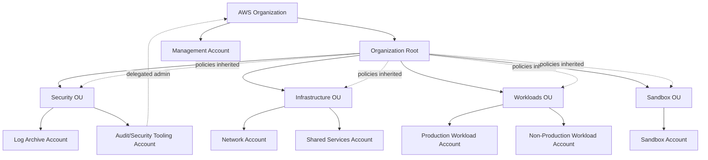
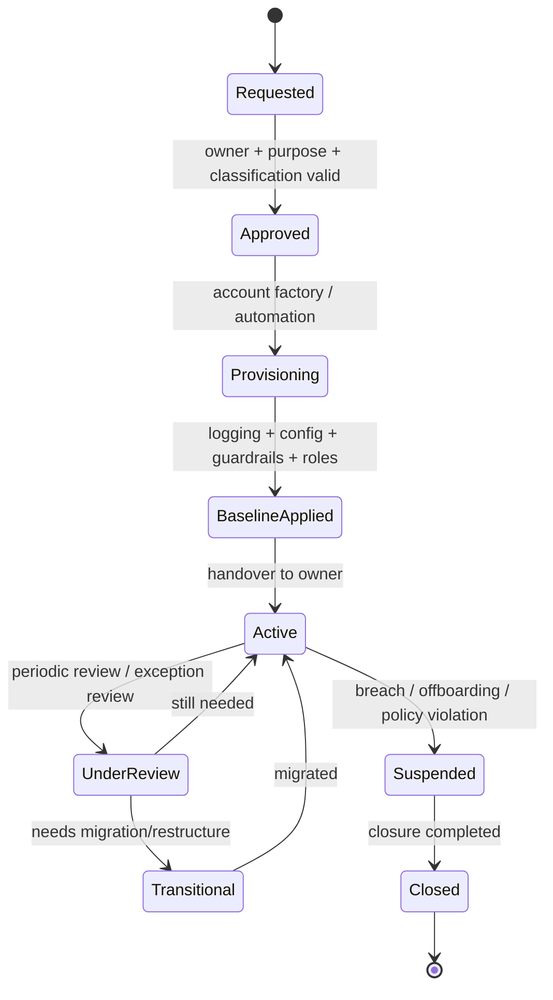
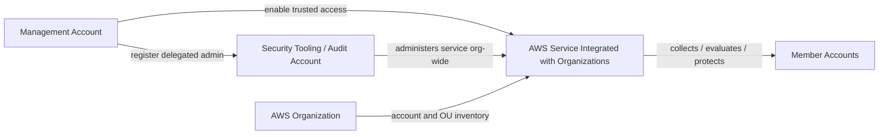
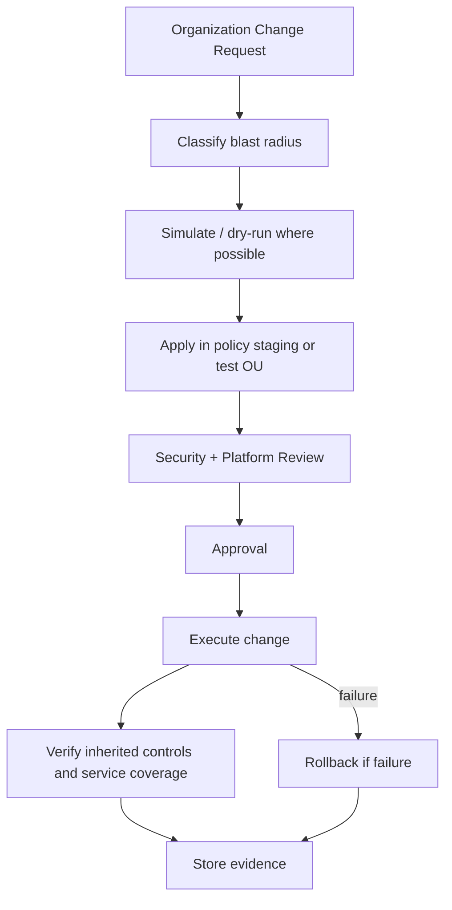

# Part 009 — AWS Organizations Deep Dive

Di AWS skala production, pertanyaan pertama bukan:

> Service apa yang harus kita aktifkan?

Pertanyaan pertama adalah:

> Siapa yang punya wewenang untuk membuat, membatasi, mengaudit, memindahkan, menutup, dan memulihkan account?

Kalau jawaban ini tidak jelas, semua security control setelahnya menjadi rapuh.

IAM policy bisa rapi, tetapi salah account.
CloudTrail bisa aktif, tetapi tidak organization-wide.
GuardDuty bisa aktif, tetapi hanya di beberapa account.
SCP bisa keras, tetapi menutup delivery pipeline.
Account sandbox bisa bebas, tetapi punya jalan ke data production.
Security tooling account bisa ada, tetapi management account tetap dipakai untuk operasi harian.

AWS Organizations adalah lapisan yang mengatur **struktur kekuasaan** di atas banyak AWS account. Ia bukan hanya fitur billing. Ia adalah governance kernel untuk environment multi-account.

Dokumentasi AWS menjelaskan bahwa AWS account adalah boundary alami untuk permission, security, cost, dan workload; AWS Organizations memberi kemampuan untuk mengelola akun secara hierarkis, memakai organizational units, menerapkan policy, mendelegasikan administrasi service, mengaktifkan audit lintas akun, dan mengonsolidasikan billing.

Part ini membahas AWS Organizations sebagai sistem operasi organisasi: objek, policy, inheritance, delegated admin, trusted access, lifecycle, failure mode, dan cara mengoperasikannya.

---

## 1. Mental Model: Organization Adalah Governance Tree

AWS Organizations membentuk tree seperti ini:

```text
organization
└── root
    ├── ou
    │   ├── account
    │   └── account
    ├── ou
    │   └── nested-ou
    │       └── account
    └── account
```

Setiap node memiliki fungsi berbeda.

| Objek | Fungsi | Risiko Jika Salah Dipahami |
|---|---|---|
| Organization | Container global untuk semua account | Governance tersebar dan tidak konsisten |
| Management account | Account paling berkuasa untuk organisasi | Menjadi single point of administrative compromise |
| Root | Node tertinggi di organization tree | Policy root terlalu kasar dan merusak semua account |
| OU | Group akun yang menerima policy dan automation sama | OU mengikuti struktur perusahaan, bukan control boundary |
| Account | Boundary security, billing, quota, workload, evidence | Terlalu banyak workload bercampur dalam satu blast radius |
| Policy | Aturan yang diwariskan ke account/OU | Salah pakai SCP sebagai IAM policy |
| Delegated admin | Member account yang mengelola service organisasi tertentu | Security service dikelola dari management account terus-menerus |
| Trusted access | Izin agar service AWS beroperasi lintas organization | Service aktif sebagian dan coverage tidak lengkap |

Model sederhananya:



Ada tiga hal penting.

Pertama, organization tree bukan dokumentasi struktur perusahaan. Tree ini adalah **control topology**.

Kedua, account bukan sekadar tempat resource. Account adalah boundary audit, permission, quota, cost, incident response, dan ownership.

Ketiga, policy inheritance membuat keputusan OU berdampak besar. Satu policy di OU bisa mengubah kemampuan semua account di bawahnya.

---

## 2. AWS Organizations Bukan Sekadar Consolidated Billing

Banyak tim pertama kali memakai AWS Organizations untuk consolidated billing. Itu valid, tetapi terlalu kecil.

Di operating model yang matang, Organizations dipakai untuk:

- membuat akun secara standar,
- mengelompokkan akun berdasarkan control requirement,
- membatasi service/API/region dengan Service Control Policies,
- membatasi resource-side exposure dengan Resource Control Policies,
- menstandarkan tag dengan tag policies,
- mengaktifkan backup policy organization-wide,
- mengaktifkan CloudTrail dan AWS Config lintas akun,
- mendelegasikan administrasi security service,
- memberi security team visibility lintas akun,
- memisahkan production dari non-production,
- mengelola suspended/compromised account,
- menjadi fondasi landing zone.

Kalimat internal yang harus dipegang:

> AWS Organizations adalah tempat kita mendefinisikan batas maksimum perilaku cloud environment.

IAM menentukan apa yang boleh dilakukan principal di dalam account.
SCP menentukan apa yang tidak mungkin dilakukan principal di account anggota, bahkan jika IAM mengizinkan.
OU menentukan kelompok account yang menerima batasan sama.
Delegated admin menentukan account mana yang mengelola service organisasi tanpa memakai management account untuk operasi harian.

---

## 3. Management Account: Account Paling Berbahaya

Management account adalah account yang membuat dan mengelola organization. Ia punya kekuasaan khusus:

- membuat/memberi invitation ke member account,
- memindahkan account antar OU,
- attach/detach policy organization,
- enable trusted access untuk service,
- register delegated administrator,
- consolidated billing,
- beberapa operasi yang hanya bisa dilakukan dari management account.

Karena itu, prinsip produksinya:

> Management account harus diperlakukan sebagai control-plane vault, bukan workspace operasional.

Jangan menaruh workload aplikasi di management account.
Jangan menjalankan CI/CD reguler dari management account.
Jangan membuat VPC production di management account.
Jangan menjadikan management account sebagai tempat security dashboard harian jika bisa didelegasikan.
Jangan membiarkan engineer memakai role administratif management account untuk pekerjaan rutin.

AWS juga merekomendasikan agar management account dan user/role di dalamnya hanya dipakai untuk task yang memang harus dilakukan oleh account tersebut, dan resource workload disimpan di member account. Salah satu alasannya: SCP tidak membatasi user/role di management account.

### 3.1 Invariant Management Account

Untuk management account, invariant minimal:

```text
No workload resources in management account.
No long-lived human IAM users except tightly controlled break-glass/root scenario.
No day-to-day engineering access.
No direct CI/CD deployment into management account.
No security service operation if delegated administrator is supported.
Every management account use must create an audit trail and a ticket/reference.
Root user protected with strong MFA and emergency procedure.
```

### 3.2 Role yang Biasanya Dibutuhkan

| Role | Tujuan | Akses |
|---|---|---|
| OrgAdminBreakGlass | Emergency organization administration | Sangat terbatas, MFA, approval, logged |
| BillingReadOnly | Finance visibility | Billing/cost read-only |
| OrganizationReadOnly | Audit/inventory | Organizations read-only |
| ControlTowerAdmin | Landing zone administration | Hanya jika memakai Control Tower |
| SecurityDelegationOperator | Register delegated admin / trusted access | Dipakai jarang, change-controlled |

Role ini tidak seharusnya dipakai harian.

---

## 4. Organization Root: Jangan Jadikan Tempat Sampah Policy

Root adalah node tertinggi di organization tree. Policy yang di-attach di root diwariskan ke semua OU dan account di bawahnya, kecuali management account untuk beberapa jenis efek seperti SCP limitation terhadap principal management account.

Root-level policy cocok untuk invariant yang benar-benar universal.

Contoh root-level SCP candidate:

- deny disabling CloudTrail organization trail,
- deny leaving organization,
- deny removing AWS Config recorder,
- deny unsupported regions,
- deny root user access for non-break-glass operations,
- deny modification of security baseline resource tertentu.

Tetapi root-level policy buruk untuk aturan yang butuh variasi.

Contoh yang sebaiknya tidak langsung root-level tanpa staging:

- block all EC2 in semua region,
- deny IAM role creation,
- deny KMS key creation,
- deny public IP creation,
- force all accounts into same network pattern,
- block services yang mungkin dipakai security/infrastructure account.

Root-level policy harus kecil, stabil, dan jarang berubah.

### 4.1 Root Policy Test

Sebelum policy ditempel di root, jawab:

```text
Apakah aturan ini valid untuk security, log archive, infrastructure, workload, sandbox, deployment, dan exception account?
Apakah ada service AWS internal yang butuh action ini untuk baseline?
Apakah policy ini akan memutus incident response?
Apakah policy ini akan memutus account factory?
Apakah policy ini sudah diuji di policy staging OU?
Apakah rollback path jelas?
```

Kalau salah satu jawabannya kabur, jangan tempel di root.

---

## 5. Member Account: Unit Operasional yang Harus Punya Owner

Member account adalah AWS account yang berada di dalam organization.

Setiap account harus memiliki metadata operasional:

| Metadata | Contoh | Kenapa Penting |
|---|---|---|
| Account ID | `123456789012` | Identifier final di AWS |
| Account alias/name | `prd-payments-api` | Human-readable ownership |
| OU | `Workloads/Production` | Menentukan policy inheritance |
| Environment | `prod` | Risk classification |
| Business owner | `Payments Platform` | Accountability |
| Technical owner | `Team Ledger` | Remediation owner |
| Cost center | `FIN-204` | Chargeback/showback |
| Data classification | `confidential` | Control requirement |
| Regulatory scope | `PCI`, `PII`, `none` | Audit mapping |
| Criticality | `tier-0`, `tier-1`, `tier-2` | Incident priority |
| Created by | Account factory pipeline | Traceability |
| Expiry/review date | For sandbox/exception | Prevent account sprawl |

Account tanpa owner adalah liability.

Akun tanpa klasifikasi data membuat severity finding tidak bisa diprioritaskan.
Akun tanpa environment membuat policy tidak bisa akurat.
Akun tanpa review date menjadi shadow infrastructure.

### 5.1 Account Lifecycle



Account lifecycle harus diautomasi sejauh mungkin. Yang penting bukan hanya membuat account, tetapi memastikan account masuk ke governance baseline sebelum dipakai.

---

## 6. Organizational Unit: Policy Boundary, Bukan Department Boundary

OU adalah grouping account. AWS Organizations memungkinkan policy ditempel ke OU sehingga account di dalamnya mewarisi policy tersebut.

Kesalahan umum: OU dibuat mengikuti struktur organisasi perusahaan.

```text
Root
├── Engineering
├── Marketing
├── Finance
└── HR
```

Struktur ini terlihat rapi, tetapi buruk untuk security karena Engineering bisa punya prod, dev, sandbox, PII, non-PII, deployment tooling, dan experiment account dengan control requirement berbeda.

OU seharusnya dibuat berdasarkan **control similarity**.

Pertanyaan yang benar:

```text
Account mana yang harus menerima guardrail sama?
Account mana yang memiliki blast radius mirip?
Account mana yang boleh memakai service/region sama?
Account mana yang punya baseline audit sama?
Account mana yang dikelola automation sama?
Account mana yang punya compliance requirement sama?
```

Bukan:

```text
Tim mana yang punya account ini?
Departemen mana yang membayar account ini?
VP mana yang membawahi tim ini?
```

Ownership bisa ditangkap dengan tag, account metadata, CMDB, atau registry. OU bukan tempat utama untuk struktur reporting.

---

## 7. Policy Types: Organisasi Sebagai Control Fabric

AWS Organizations mendukung beberapa jenis policy. Di seri ini, kita akan membahas detail beberapa policy di part khusus. Untuk part ini, pahami posisi arsitekturalnya.

### 7.1 Service Control Policies

SCP mendefinisikan maximum permission untuk account anggota. SCP tidak memberi izin. SCP hanya membatasi izin yang bisa efektif.

Formula mental:

```text
effective permission = IAM allows AND not denied by SCP AND not blocked by other applicable policy layers
```

SCP cocok untuk:

- deny service yang tidak boleh dipakai,
- deny region yang tidak disetujui,
- deny disabling audit/security services,
- deny public exposure primitive tertentu,
- deny risky IAM mutation,
- force penggunaan approved organization path.

SCP tidak cocok untuk:

- memberi akses kepada user,
- menggantikan IAM least privilege,
- membuat exception per user harian,
- mengekspresikan semua business rule yang berubah cepat,
- dipasang tanpa testing.

### 7.2 Resource Control Policies

Resource Control Policies berada di sisi resource governance. Tujuannya adalah mencegah penggunaan resource AWS secara tidak diinginkan dari pusat organisasi. Secara mental, SCP mengontrol batas aksi principal; RCP membantu mengontrol batas resource.

Gunakan ini sebagai defense-in-depth, bukan pengganti resource policy yang benar.

Contoh ide kontrol:

```text
Resource di organization tidak boleh diakses dari principal luar organization kecuali exception formal.
Resource sensitif harus menolak akses non-approved network/source condition.
```

Detailnya akan masuk ke Part 014.

### 7.3 Tag Policies

Tag policies membantu menstandarkan tag di seluruh organization.

Tag policy bukan magic enforcement untuk semua resource. Ia membantu mendefinisikan aturan tag dan dapat dipakai untuk compliance visibility. Untuk enforcement yang lebih keras, biasanya perlu kombinasi:

- IAM/SCP condition,
- Config rule,
- IaC validation,
- pipeline gate,
- remediation automation,
- cost governance.

Tag yang minimum untuk security/operations:

```yaml
owner: team-name
environment: prod|staging|dev|sandbox
data-classification: public|internal|confidential|regulated
criticality: tier-0|tier-1|tier-2|tier-3
cost-center: code
managed-by: terraform|cloudformation|manual|platform
service: logical-service-name
```

### 7.4 Backup Policies

Backup policies dapat membantu mengatur backup plan lintas account secara organization-wide. Ini penting untuk recovery posture.

Tetapi backup governance tidak selesai dengan policy. Harus ada:

- restore test,
- vault lock untuk skenario tertentu,
- cross-account backup isolation,
- monitoring job failure,
- evidence untuk audit,
- owner untuk restore decision.

Detailnya akan dibahas di Part 068.

---

## 8. Trusted Access dan Delegated Administrator

Banyak AWS service bisa terintegrasi dengan AWS Organizations. Biasanya ada dua konsep:

1. **Trusted access**: service diizinkan bekerja lintas organization.
2. **Delegated administrator**: member account tertentu diberi wewenang mengelola service tersebut untuk organization.

Mental model:



Contoh service yang sering memakai pola delegated admin:

- GuardDuty,
- Security Hub,
- Inspector,
- Macie,
- CloudTrail,
- AWS Config,
- IAM Access Analyzer,
- Firewall Manager,
- Backup,
- Systems Manager Explorer/OpsCenter dalam beberapa desain,
- Detective.

Prinsipnya:

> Management account mengaktifkan dan mendelegasikan. Member delegated admin mengoperasikan.

Ini mengurangi penggunaan management account harian.

### 8.1 Delegated Admin Anti-Pattern

Anti-pattern umum:

```text
Semua security service dikelola dari management account karena paling mudah.
```

Konsekuensi:

- terlalu banyak manusia butuh akses management account,
- audit menjadi kabur,
- blast radius administratif membesar,
- separation of duties melemah,
- incident response bergantung pada account paling sensitif.

Pattern yang lebih baik:

```text
Management account: bootstrap + delegation only.
Audit/security tooling account: day-to-day org-wide security operation.
Log archive account: immutable evidence storage.
Workload accounts: run application and emit telemetry.
```

---

## 9. Organization-Wide Service Enablement

Saat security service diaktifkan hanya per account, coverage akan bocor.

Contoh masalah:

- GuardDuty aktif di prod account, tetapi tidak aktif di sandbox yang punya akses internet.
- CloudTrail aktif di satu region, tetapi tidak multi-region.
- AWS Config aktif di account lama, tetapi account baru belum masuk recorder.
- Security Hub tidak auto-enable standards di account baru.
- Inspector tidak scan account yang dibuat manual.
- Macie tidak melihat S3 bucket di account merger/migrasi.

Di multi-account environment, coverage harus dijawab dengan organization-level enablement.

Checklist service organization-wide:

| Service | Pertanyaan Coverage |
|---|---|
| CloudTrail | Apakah organization trail multi-region aktif dan tidak bisa dimatikan member account? |
| AWS Config | Apakah recorder dan aggregator mencakup semua account/region relevan? |
| GuardDuty | Apakah auto-enable untuk account baru aktif sesuai policy? |
| Security Hub | Apakah standards dan central configuration diterapkan? |
| Inspector | Apakah account baru otomatis masuk vulnerability scanning? |
| Macie | Apakah sensitive data discovery punya scope yang jelas? |
| IAM Access Analyzer | Apakah external access dianalisis lintas account? |
| Backup | Apakah backup policies diterapkan berdasarkan OU/data criticality? |
| CloudWatch/Observability | Apakah telemetry dikirim ke tempat yang bisa dipakai owner dan platform? |

Ingat: organization-wide bukan berarti semua service harus aktif di semua account secara buta. Ia berarti coverage didefinisikan dari policy, bukan kebetulan.

---

## 10. Control Plane Operation: Siapa Boleh Mengubah Organization?

AWS Organizations adalah high-impact control plane. Perubahan kecil bisa berdampak besar.

Contoh perubahan high risk:

- move account dari `Production` ke `Sandbox`,
- detach SCP dari root,
- disable trusted access untuk GuardDuty,
- unregister delegated admin Security Hub,
- attach deny policy terlalu luas,
- create account tanpa baseline,
- invite external account ke organization,
- remove account dari organization,
- delete OU yang masih dipakai automation.

Karena itu, organisasi matang memperlakukan Organizations changes seperti production database migration.

### 10.1 Change Workflow



### 10.2 Change Classification

| Change | Risk Level | Required Control |
|---|---:|---|
| Rename OU | Low/Medium | Check automation dependencies |
| Create new OU | Medium | Define control contract |
| Move account | High | Verify inherited SCP/backup/config/security coverage |
| Attach SCP to root | Critical | Staging, simulation, approvals, rollback |
| Disable trusted access | Critical | Incident-level approval |
| Register delegated admin | High | Separation of duties review |
| Remove member account | Critical | Legal, billing, data, audit review |

---

## 11. Organization Inventory as Source of Truth

Organizations gives account and OU structure, but it is not a complete CMDB.

You still need an account registry.

Minimal registry schema:

```yaml
account_id: "123456789012"
account_name: "prd-payments-api"
ou_path: "/Workloads/Production"
status: "active"
environment: "prod"
owner_team: "payments-platform"
technical_owner: "ledger-runtime"
business_owner: "finance-products"
criticality: "tier-1"
data_classification: "regulated"
regulatory_scope:
  - pii
  - pci
created_at: "2026-07-06"
created_by: "account-factory"
baseline_version: "lz-baseline-2026.07"
exception_refs: []
runbook_url: "..."
```

Tanpa registry, Anda tidak bisa menjawab:

- siapa owner account ini?
- apa tujuan account ini?
- apakah account ini boleh punya internet egress?
- apakah account ini harus punya Macie?
- apakah account ini regulated?
- apakah account ini masih diperlukan?
- apakah account ini boleh dipindah OU?

Organizations memberi struktur. Registry memberi makna operasional.

---

## 12. CLI/API untuk Membaca Organization

Engineer senior harus bisa membaca organization tanpa bergantung penuh pada console.

Contoh command:

```bash
aws organizations describe-organization
aws organizations list-roots
aws organizations list-accounts
aws organizations list-organizational-units-for-parent --parent-id r-xxxx
aws organizations list-accounts-for-parent --parent-id ou-xxxx-yyyyyyyy
aws organizations list-parents --child-id 123456789012
aws organizations list-policies --filter SERVICE_CONTROL_POLICY
aws organizations list-policies-for-target --target-id ou-xxxx-yyyyyyyy --filter SERVICE_CONTROL_POLICY
aws organizations list-targets-for-policy --policy-id p-xxxxxxxx
aws organizations list-delegated-administrators
aws organizations list-aws-service-access-for-organization
```

Contoh pertanyaan operasional:

```bash
# Account ini ada di OU mana?
aws organizations list-parents --child-id 123456789012

# SCP apa yang langsung ditempel ke OU ini?
aws organizations list-policies-for-target \
  --target-id ou-xxxx-yyyyyyyy \
  --filter SERVICE_CONTROL_POLICY

# Service apa yang punya trusted access?
aws organizations list-aws-service-access-for-organization

# Siapa delegated administrator organization-wide?
aws organizations list-delegated-administrators
```

Untuk production, command ini sebaiknya dibungkus ke read-only audit script dan dijalankan periodik untuk mendeteksi drift.

---

## 13. Failure Modes AWS Organizations

### 13.1 Management Account Dipakai Seperti Admin Workstation

Gejala:

- banyak user/role punya admin di management account,
- workload resource ada di management account,
- security dashboard harian dari management account,
- deployment pipeline memakai credential management account.

Akibat:

- compromise management account berarti compromise governance plane,
- SCP tidak menyelamatkan management account,
- audit sulit membedakan admin org vs workload operation.

Remediasi:

- pindahkan workload keluar,
- delegasikan service admin,
- batasi role management account,
- enforce MFA dan approval,
- monitor CloudTrail management account secara ketat.

### 13.2 OU Mengikuti Struktur Organisasi

Gejala:

```text
Root/Engineering/TeamA/Prod
Root/Engineering/TeamA/Dev
Root/Finance/Prod
Root/Marketing/Sandbox
```

Akibat:

- policy duplikatif,
- production dan non-production mendapat kontrol berbeda secara tidak sengaja,
- audit evidence sulit dikelompokkan,
- exception menjadi liar.

Remediasi:

- redesign OU berdasarkan control set,
- gunakan account metadata untuk owner/team,
- migrasi account bertahap melalui Transitional OU.

### 13.3 SCP Dipakai Terlalu Cepat

Gejala:

- policy langsung ditempel root,
- tidak ada staging OU,
- tidak ada impact analysis,
- account factory gagal setelah policy baru,
- deployment pipeline rusak.

Akibat:

- outage governance,
- engineer mencari bypass,
- security dianggap blocker.

Remediasi:

- buat Policy Staging OU,
- test dengan representative accounts,
- dokumentasikan rollback,
- gunakan Access Analyzer policy validation jika relevan,
- rollout bertahap.

### 13.4 Delegated Admin Tidak Konsisten

Gejala:

- GuardDuty delegated ke Audit account,
- Security Hub delegated ke management account,
- Config aggregator di random infra account,
- Macie per account manual.

Akibat:

- coverage blind spot,
- finding correlation sulit,
- ownership tidak jelas.

Remediasi:

- definisikan security tooling account,
- konsolidasikan delegated admin,
- dokumentasikan service ownership,
- audit `list-delegated-administrators` periodik.

### 13.5 Account Dibuat di Luar Factory

Gejala:

- account baru muncul tanpa baseline,
- CloudTrail/Config belum aktif,
- IAM role tidak standar,
- tagging kosong,
- owner tidak tercatat.

Akibat:

- blind spot audit,
- security coverage delayed,
- budget leakage,
- remediation manual.

Remediasi:

- account creation hanya via approved pipeline,
- EventBridge/account lifecycle detection,
- automatic quarantine untuk account non-compliant,
- periodic account inventory reconciliation.

---

## 14. Production Baseline untuk AWS Organizations

Baseline minimal:

```text
1. Management account hardened and workload-free.
2. Root user protected with MFA and documented break-glass procedure.
3. Organization tree designed by control boundary.
4. Security OU contains Log Archive and Audit/Security Tooling accounts.
5. Infrastructure OU contains shared network, identity, monitoring, backup, shared services accounts if needed.
6. Workload OUs separate production and non-production controls.
7. Sandbox OU has strict data and connectivity restrictions.
8. Suspended OU exists for compromised/offboarded accounts.
9. Policy Staging OU exists for SCP/control testing.
10. Organization-wide CloudTrail and Config strategy defined.
11. Delegated administrators registered for supported security services.
12. Account registry exists and is reconciled periodically.
13. Account creation uses standardized factory/pipeline.
14. OU/account movement requires change control.
15. Root-level policies are few, stable, tested, and reversible.
```

---

## 15. Example Organization Layout

```mermaid
flowchart TD
    Root[Root]

    Security[Security OU]
    Infra[Infrastructure OU]
    Workloads[Workloads OU]
    Sandbox[Sandbox OU]
    PolicyStaging[Policy Staging OU]
    Transitional[Transitional OU]
    Suspended[Suspended OU]
    Exceptions[Exceptions OU]

    Log[Log Archive Account]
    Audit[Audit / Security Tooling Account]
    Network[Network Account]
    Identity[Identity Account]
    Monitoring[Monitoring Account]
    Backup[Backup Account]
    Shared[Shared Services Account]
    Prod[Production Workload Accounts]
    NonProd[Non-Production Workload Accounts]
    Sand[Individual Sandbox Accounts]
    Stage[Test Accounts for SCP/Controls]
    Migrating[Migrating Accounts]
    Closed[Closed / Compromised Accounts]
    ExceptionAccounts[Approved Exception Accounts]

    Root --> Security
    Root --> Infra
    Root --> Workloads
    Root --> Sandbox
    Root --> PolicyStaging
    Root --> Transitional
    Root --> Suspended
    Root --> Exceptions

    Security --> Log
    Security --> Audit
    Infra --> Network
    Infra --> Identity
    Infra --> Monitoring
    Infra --> Backup
    Infra --> Shared
    Workloads --> Prod
    Workloads --> NonProd
    Sandbox --> Sand
    PolicyStaging --> Stage
    Transitional --> Migrating
    Suspended --> Closed
    Exceptions --> ExceptionAccounts
```



Ini bukan template wajib. Ini struktur awal yang masuk akal untuk banyak organisasi.

Yang penting: setiap OU punya alasan kontrol.

---

## 16. Engineering Decision Record: Membuat OU Baru

Setiap OU baru harus punya design record.

Template:

```md
# OU Decision Record

## Name
Workloads/RegulatedProduction

## Purpose
Menampung account production yang memproses regulated data.

## Why existing OUs are insufficient
Production OU standar tidak cukup karena workload ini membutuhkan stricter region restriction, Macie mandatory, backup retention lebih panjang, dan deployment approval berbeda.

## Control contract
- CloudTrail org trail mandatory
- AWS Config mandatory
- GuardDuty mandatory
- Security Hub mandatory
- Macie mandatory for S3
- Approved regions only
- No public S3
- No internet-facing load balancer without exception
- Backup policy: daily + monthly retention

## Owners
- Platform owner: Cloud Platform Team
- Security owner: Cloud Security Team
- Workload owner: Each account owner

## Allowed account types
- Production regulated workloads only

## Disallowed account types
- Sandbox
- Shared tooling
- Non-production

## Rollout plan
- Create OU
- Attach baseline SCP
- Apply Config conformance pack
- Test with one account
- Move pilot workload
- Verify telemetry coverage

## Rollback plan
- Move account back to Production OU
- Detach new policy
- Preserve evidence

## Review date
2026-10-01
```

Tanpa record seperti ini, OU akan bertambah tanpa arsitektur.

---

## 17. Questions Engineer Senior Harus Bisa Jawab

Untuk environment AWS production, Anda harus bisa menjawab:

```text
Berapa account aktif di organization?
Account mana yang tidak punya owner?
Account mana yang berada di OU salah?
Policy apa yang inherited oleh production account?
Siapa delegated admin untuk GuardDuty, Security Hub, Config, Inspector, Macie?
Apakah management account punya workload resource?
Apakah account baru otomatis mendapat CloudTrail, Config, GuardDuty, Security Hub?
Apakah sandbox account bisa mengakses production data?
Apakah ada account di luar baseline landing zone?
Apa prosedur move account antar OU?
Apa rollback jika SCP baru memutus deployment?
Apa bukti bahwa audit log tidak bisa dimatikan member account?
```

Kalau tidak bisa, maturity organization masih rendah.

---

## 18. Practical Lab: Audit AWS Organization

Tujuan lab: membangun inventory awal Organizations.

### 18.1 Ambil Struktur Dasar

```bash
aws organizations describe-organization > organization.json
aws organizations list-roots > roots.json
aws organizations list-accounts > accounts.json
aws organizations list-delegated-administrators > delegated-admins.json
aws organizations list-aws-service-access-for-organization > trusted-access.json
```

### 18.2 Ambil OU dan Policy

```bash
ROOT_ID=$(jq -r '.Roots[0].Id' roots.json)

aws organizations list-organizational-units-for-parent \
  --parent-id "$ROOT_ID" > top-level-ous.json

aws organizations list-policies \
  --filter SERVICE_CONTROL_POLICY > scps.json
```

### 18.3 Pertanyaan Analisis

Buat tabel:

| Check | Result | Risk | Action |
|---|---|---|---|
| Management account has workload resource? | TBD | Critical | Move workload |
| Security OU exists? | TBD | High | Create/align landing zone |
| Log archive account exists? | TBD | High | Provision baseline |
| Audit/security tooling account exists? | TBD | High | Provision/delegate |
| Delegated admins configured? | TBD | Medium/High | Register supported services |
| Suspended OU exists? | TBD | Medium | Create controlled holding OU |
| Policy staging OU exists? | TBD | Medium | Create before SCP rollout |

---

## 19. Core Takeaways

AWS Organizations adalah fondasi security dan management AWS skala serius.

Yang perlu diingat:

1. **Management account adalah governance root of trust.** Jangan dipakai untuk workload atau operasi harian.
2. **OU adalah policy boundary.** Desain berdasarkan control requirement, bukan struktur organisasi manusia.
3. **Account adalah unit ownership.** Setiap account harus punya owner, purpose, data classification, dan lifecycle.
4. **SCP bukan IAM.** SCP membatasi maximum permission, tidak memberi akses.
5. **Delegated admin mengurangi risiko management account.** Operasikan security service dari member account yang tepat.
6. **Organization-wide enablement mengurangi blind spot.** Security coverage harus otomatis untuk account baru.
7. **Perubahan Organizations adalah high-risk change.** Gunakan staging, review, evidence, dan rollback.

Part berikutnya akan membahas **Organizational Unit Design** secara lebih detail: bagaimana memilih OU, kapan memecah OU, kapan membuat exception OU, bagaimana mengelola suspended/transitional accounts, dan bagaimana menghindari OU sprawl.

---

## Referensi Resmi

- AWS Organizations User Guide — What is AWS Organizations?: https://docs.aws.amazon.com/organizations/latest/userguide/orgs_introduction.html
- AWS Organizations — Best practices for a multi-account environment: https://docs.aws.amazon.com/organizations/latest/userguide/orgs_best-practices.html
- AWS Organizations — Managing organizational units: https://docs.aws.amazon.com/organizations/latest/userguide/orgs_manage_ous.html
- AWS Organizations — Best practices for managing OUs: https://docs.aws.amazon.com/organizations/latest/userguide/orgs_manage_ous_best_practices.html
- AWS Organizations — Delegated administrator for AWS services: https://docs.aws.amazon.com/organizations/latest/userguide/orgs_integrate_delegated_admin.html
- AWS Whitepaper — Organizing Your AWS Environment Using Multiple Accounts: https://docs.aws.amazon.com/whitepapers/latest/organizing-your-aws-environment/organizing-your-aws-environment.html
- AWS Prescriptive Guidance — Configuring account structure and OUs: https://docs.aws.amazon.com/prescriptive-guidance/latest/designing-control-tower-landing-zone/account-structure.html
