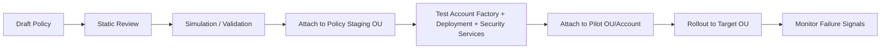
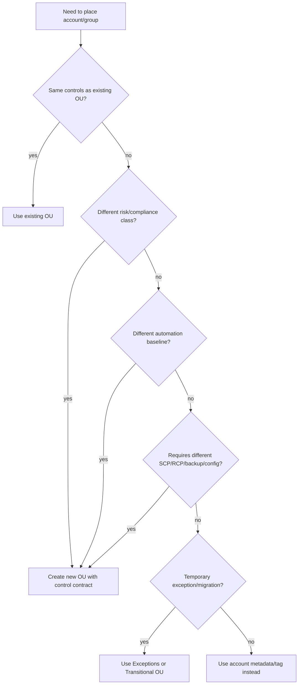
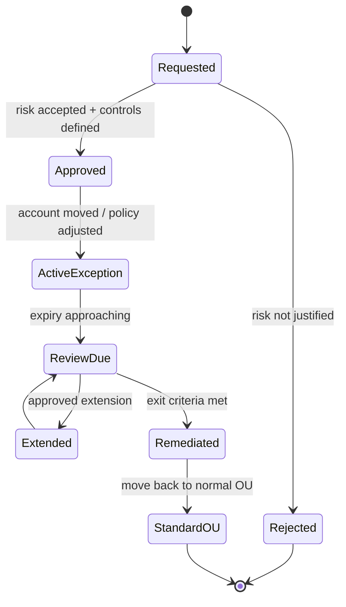

# Part 010 — Organizational Unit Design

Organizational Unit terlihat sederhana: folder untuk account.

Di production, OU bukan folder.

OU adalah kontrak kontrol.

Ketika sebuah account ditempatkan di OU tertentu, kita sedang mengatakan:

```text
Account ini menerima policy ini.
Account ini menerima baseline ini.
Account ini berada dalam risk class ini.
Account ini boleh/tidak boleh memakai capability ini.
Account ini diaudit dengan cara ini.
Account ini dimiliki oleh operating model ini.
```

Karena itu, desain OU yang buruk akan merusak seluruh governance AWS.

OU yang mengikuti struktur perusahaan akan cepat berubah, penuh exception, sulit diaudit, dan membuat SCP menjadi tambalan.
OU yang terlalu granular akan menghasilkan policy sprawl.
OU yang terlalu kasar akan membuat security control terlalu lemah atau terlalu menghambat.
OU tanpa lifecycle akan menumpuk account lama, account testing, account migrasi, dan account suspended di tempat yang salah.

AWS merekomendasikan multi-account environment saat workload tumbuh, dan menyarankan OU disusun berdasarkan common set of controls, bukan meniru struktur reporting perusahaan. AWS juga membedakan foundational OUs, application/workload OUs, sandbox, exceptions, transitional, dan suspended OUs dalam panduan multi-account/Control Tower.

Part ini membahas cara mendesain OU dengan efektif.

---

## 1. Prinsip Utama: OU Mengelompokkan Kesamaan Kontrol

Sebuah OU baik jika account di dalamnya memiliki jawaban yang sama untuk pertanyaan berikut:

```text
Apakah account-account ini punya risk class yang mirip?
Apakah production impact-nya mirip?
Apakah data classification-nya mirip?
Apakah region policy-nya sama?
Apakah allowed service policy-nya sama?
Apakah audit baseline-nya sama?
Apakah backup/retention policy-nya sama?
Apakah security tooling coverage-nya sama?
Apakah deployment governance-nya sama?
Apakah exception policy-nya sama?
```

Jika jawabannya banyak yang berbeda, account tersebut mungkin tidak cocok berada dalam OU yang sama.

### 1.1 OU Bukan Struktur Manusia

Struktur yang buruk:

```text
Root
├── CTO
│   ├── Platform
│   ├── Data
│   └── Product
├── CFO
│   └── FinanceSystems
└── COO
    └── Operations
```

Kenapa buruk?

Karena `Platform` bisa punya shared tooling, production, sandbox, network, deployment, dan security automation yang kontrolnya berbeda.

`FinanceSystems` bisa punya regulated production dan non-production yang tidak boleh diperlakukan sama.

`Data` bisa punya analytics sandbox dan confidential production data lake yang harus dipisah.

Ownership manusia boleh berubah. Control boundary tidak boleh ikut kacau setiap kali reorg.

### 1.2 OU Sebagai Control Contract

Tuliskan OU sebagai kontrak:

```yaml
ou: /Workloads/Production
purpose: Host production workload accounts.
allowed_account_types:
  - customer-facing application
  - internal tier-1 service
  - production data processing
required_controls:
  - cloudtrail-org-trail
  - config-recorder
  - guardduty
  - security-hub
  - inspector
  - approved-regions-only
  - no-public-s3
  - mandatory-backup-for-stateful-resources
prohibited:
  - experimental services without exception
  - unmanaged IAM users
  - disabling audit services
owner:
  platform: cloud-platform
  security: cloud-security
  account: workload-team
review_frequency: quarterly
```

Kalau kontrak OU tidak bisa ditulis, OU belum matang.

---

## 2. Foundational OU vs Workload OU

AWS guidance membedakan foundational OUs dan application/workload OUs.

Foundational OU berisi account yang mendukung governance, security, compliance, identity, networking, monitoring, backup, dan shared infrastructure.

Workload OU berisi account tempat aplikasi bisnis berjalan.

Pemisahan ini penting karena security control untuk account foundational sering berbeda dari workload account.

Contoh:

- Log Archive account harus menerima log lintas account, jadi policy-nya berbeda.
- Audit/Security Tooling account perlu read/investigation access lintas account.
- Network account mungkin mengelola Transit Gateway, DNS resolver, inspection VPC.
- Monitoring account mungkin menerima telemetry lintas workload.
- Backup account mungkin menyimpan recovery copy lintas account.
- Workload account tidak perlu kekuasaan ini.

Jangan campur foundational account dan workload account dalam OU yang sama hanya karena “sama-sama production”.

---

## 3. Struktur Minimum yang Masuk Akal

Untuk organisasi yang mulai serius, struktur minimal:

```mermaid
flowchart TD
    Root[Root]

    Security[Security OU]
    Infrastructure[Infrastructure OU]
    Workloads[Workloads OU]
    Sandbox[Sandbox OU]
    PolicyStaging[Policy Staging OU]
    Suspended[Suspended OU]
    Transitional[Transitional OU]
    Exceptions[Exceptions OU]

    LogArchive[Log Archive]
    Audit[Audit / Security Tooling]
    Network[Network]
    Shared[Shared Services]
    Monitoring[Monitoring]
    Backup[Backup]
    Prod[Production]
    NonProd[Non-Production]
    Sandboxes[Sandbox Accounts]
    PolicyTest[Policy Test Accounts]
    SuspAccounts[Suspended / Compromised]
    Migrating[Migrating Accounts]
    ExceptionAcc[Approved Exception Accounts]

    Root --> Security
    Root --> Infrastructure
    Root --> Workloads
    Root --> Sandbox
    Root --> PolicyStaging
    Root --> Suspended
    Root --> Transitional
    Root --> Exceptions

    Security --> LogArchive
    Security --> Audit
    Infrastructure --> Network
    Infrastructure --> Shared
    Infrastructure --> Monitoring
    Infrastructure --> Backup
    Workloads --> Prod
    Workloads --> NonProd
    Sandbox --> Sandboxes
    PolicyStaging --> PolicyTest
    Suspended --> SuspAccounts
    Transitional --> Migrating
    Exceptions --> ExceptionAcc
```



Ini bukan struktur final untuk semua organisasi, tetapi baseline yang cukup defensible.

---

## 4. OU Catalogue

### 4.1 Security OU

**Tujuan:** menampung account security foundation.

Biasanya berisi:

- Log Archive account,
- Audit/Security Tooling account.

AWS Control Tower secara default membuat Security OU yang berisi Log Archive dan Audit account.

Kontrol utama:

- log storage immutable/strongly protected,
- akses write dari source account tetapi read terbatas,
- Security Hub/GuardDuty/Config/CloudTrail delegated admin sesuai desain,
- KMS key policy ketat,
- perubahan policy harus change-controlled,
- tidak ada workload aplikasi.

Anti-pattern:

- menaruh aplikasi internal di Audit account,
- memberi semua engineer akses Security OU,
- memakai Log Archive account untuk query ad hoc tanpa kontrol,
- mencampur security tooling dan production workload.

### 4.2 Infrastructure OU

**Tujuan:** menampung shared infrastructure.

Bisa berisi:

- Network account,
- Identity account,
- Shared Services account,
- Monitoring account,
- Backup account,
- Operations Tooling account.

Kontrol utama:

- akses admin terbatas ke platform team,
- strict change management,
- strong logging,
- controlled cross-account sharing,
- automation-first provisioning,
- dependency mapping karena banyak workload bergantung pada account ini.

Anti-pattern:

- network account menjadi tempat workload,
- shared services account penuh server manual,
- monitoring account punya write access berlebihan ke workload,
- identity account dipakai untuk eksperimen.

### 4.3 Workloads OU

**Tujuan:** menampung application/business workload account.

Minimal pecah menjadi:

```text
/Workloads/Production
/Workloads/NonProduction
```

Untuk organisasi besar, bisa ditambah:

```text
/Workloads/Production/Regulated
/Workloads/Production/Standard
/Workloads/NonProduction/SharedDev
/Workloads/NonProduction/Test
```

Kontrol utama production:

- stricter SCP,
- no unmanaged IAM users,
- mandatory security service coverage,
- stronger backup requirements,
- tighter public exposure control,
- deployment via approved pipeline,
- change traceability,
- incident runbook.

Kontrol non-production:

- tetap ada audit/security baseline,
- tetapi allowed experimentation lebih luas,
- data production tidak boleh disalin sembarangan,
- budget guardrail lebih ketat,
- lifecycle cleanup jelas.

Anti-pattern:

- production dan dev dalam account yang sama,
- semua workload semua environment di satu OU,
- production account menerima policy sandbox,
- non-production punya akses langsung ke production data.

### 4.4 Sandbox OU

**Tujuan:** eksperimen aman.

Sandbox harus aman untuk gagal.

Kontrol utama:

- budget limit,
- no production connectivity by default,
- no confidential/regulated data,
- restricted IAM escalation,
- restricted region/service if needed,
- mandatory expiration/review,
- automatic cleanup.

Anti-pattern:

- sandbox bisa peering/VPN ke production,
- sandbox menyimpan copy database production,
- sandbox dibiarkan bertahun-tahun,
- sandbox punya role admin yang bisa assume ke workload account.

Sandbox bukan non-production. Sandbox adalah eksplorasi dengan blast radius sengaja kecil.

### 4.5 Policy Staging OU

**Tujuan:** menguji SCP, RCP, Config rule, Control Tower control, atau automation sebelum rollout.

Kontrol utama:

- account representatif,
- tidak menjalankan workload critical,
- punya telemetry lengkap,
- perubahan policy dicatat,
- rollback script tersedia.

Alur:



Anti-pattern:

- policy langsung ditempel ke root,
- policy staging account tidak mirip workload nyata,
- tidak ada test untuk account factory,
- tidak ada rollback.

### 4.6 Exceptions OU

**Tujuan:** menampung account yang secara formal membutuhkan penyimpangan dari baseline.

Exception harus menjadi state sementara atau sangat terkontrol, bukan tempat buangan.

Setiap account di Exceptions OU harus punya:

```yaml
exception_id: SEC-EXC-2026-041
reason: Vendor appliance requires unsupported region during migration.
risk_acceptor: VP Engineering
security_owner: Cloud Security
expiry_date: 2026-09-30
compensating_controls:
  - isolated network
  - enhanced CloudTrail data events
  - dedicated GuardDuty finding review
  - weekly review
exit_plan: migrate to standard Production OU
```

Anti-pattern:

- semua hal sulit dimasukkan ke Exceptions OU,
- exception tanpa expiry,
- exception tanpa compensating control,
- exception permanen tetapi tidak dimasukkan ke standard architecture.

### 4.7 Transitional OU

**Tujuan:** holding area untuk account yang sedang dimigrasi, direstruktur, atau belum memenuhi baseline.

Contoh:

- account hasil merger/acquisition,
- account lama sebelum landing zone,
- account yang akan dipindahkan ke OU final,
- account yang sedang cleanup.

Kontrol utama:

- restricted access,
- logging wajib,
- inventory wajib,
- remediation plan,
- expiry/review date,
- no new workload unless approved.

Anti-pattern:

- transitional menjadi permanen,
- account dipindah ke Workloads tanpa baseline verification,
- account lama tidak pernah ditutup.

### 4.8 Suspended OU

**Tujuan:** area sangat terbatas untuk account yang disuspended, offboarded, compromised, atau menunggu closure.

Kontrol utama:

- deny hampir semua action,
- preserve evidence,
- stop unnecessary spend jika aman,
- maintain billing/audit access,
- no workload activity,
- closure workflow.

Contoh alasan:

- account diduga compromise,
- project selesai,
- owner tidak valid,
- account melanggar policy berat,
- migrasi selesai dan account tidak lagi dipakai.

Anti-pattern:

- langsung delete/close tanpa evidence review,
- membiarkan suspended account tetap punya resource mahal,
- tidak punya runbook compromise.

---

## 5. Workload OU: Production vs Non-Production

AWS merekomendasikan production workload dan test/development workload dipisah dalam account berbeda. Di banyak organisasi, pemisahan OU juga berguna.

### 5.1 Production OU

Production OU harus punya kontrol yang mengutamakan:

- availability,
- integrity,
- auditability,
- least privilege,
- change traceability,
- recovery readiness,
- public exposure control.

Contoh control contract:

```yaml
ou: /Workloads/Production
scp:
  - deny-disable-cloudtrail
  - deny-disable-config
  - deny-leave-organization
  - deny-unapproved-regions
  - deny-public-s3-except-approved
mandatory_services:
  - cloudtrail
  - config
  - guardduty
  - securityhub
  - inspector
  - cloudwatch
  - backup
change_control:
  required: true
access:
  human_admin: break-glass-or-approved-session
  deployment: approved-cicd-role
backup:
  required_for_stateful: true
```

### 5.2 Non-Production OU

Non-production bukan berarti tidak aman.

Ia berarti:

- impact lebih rendah,
- experimentation lebih luas,
- cost control lebih agresif,
- production data tidak boleh masuk tanpa masking/anonymization,
- security baseline tetap wajib.

Contoh control:

```yaml
ou: /Workloads/NonProduction
allowed:
  - broader service exploration
  - lower backup retention
  - more frequent teardown
blocked:
  - production data copy without approval
  - external public exposure without owner
  - cross-account assume-role into production
mandatory:
  - cloudtrail
  - config
  - guardduty
  - budget alerts
```

---

## 6. Regulated Workloads

Jika workload memproses regulated data, jangan hanya menambahkan tag `regulated=true` dan selesai.

Regulated workload sering butuh OU atau sub-OU khusus jika kontrolnya berbeda secara material.

Contoh:

```text
/Workloads/Production/Regulated
/Workloads/Production/Standard
```

Regulated OU bisa punya:

- stricter region allowlist,
- mandatory Macie untuk S3,
- longer log retention,
- stricter KMS key administration,
- backup retention lebih panjang,
- stronger network egress control,
- mandatory break-glass procedure,
- required evidence collection,
- limited deployment principals,
- additional Config conformance pack.

Tetapi jangan membuat regulated OU jika hanya berbeda nama owner. Buat OU baru hanya jika control contract benar-benar berbeda.

---

## 7. Decision Algorithm: Perlu OU Baru atau Tidak?

Gunakan algoritma berikut.



Rule praktis:

```text
Buat OU baru hanya jika ada perbedaan kontrol yang akan diterapkan di level OU.
Jika hanya berbeda owner, cost center, aplikasi, atau squad, gunakan metadata/tag/registry.
```

---

## 8. OU Depth: Jangan Terlalu Datar, Jangan Terlalu Dalam

Struktur terlalu datar:

```text
Root
├── AccountA
├── AccountB
├── AccountC
├── AccountD
└── AccountE
```

Masalah:

- policy ditempel per account,
- automation sulit,
- compliance grouping buruk,
- tidak scalable.

Struktur terlalu dalam:

```text
Root/BusinessUnit/Department/Team/Product/Service/Environment/Region/Account
```

Masalah:

- policy inheritance sulit dipahami,
- account movement berisiko,
- reorg merusak cloud governance,
- automation dependency kompleks,
- engineer bingung account harus masuk mana.

Prinsip:

- 2–4 level biasanya cukup untuk banyak organisasi,
- kedalaman harus merepresentasikan kontrol, bukan hirarki bisnis,
- hindari memasukkan region sebagai OU jika region policy bisa dikontrol via SCP/tag/metadata,
- hindari memasukkan team sebagai OU jika tidak ada control difference.

---

## 9. Account Movement: Move Account Itu Change Berisiko

Memindahkan account antar OU bukan operasi administratif biasa.

Saat account pindah OU, ia bisa menerima atau kehilangan:

- SCP,
- RCP,
- tag policy,
- backup policy,
- Control Tower controls,
- StackSets deployment target,
- Config conformance pack,
- security service auto-enable scope,
- cost allocation grouping,
- monitoring grouping.

### 9.1 Account Move Checklist

Sebelum move:

```text
1. Apa OU asal dan OU tujuan?
2. Policy apa yang akan hilang?
3. Policy apa yang akan bertambah?
4. Apakah workload akan kehilangan permission yang dibutuhkan?
5. Apakah security coverage tetap aktif?
6. Apakah backup policy berubah?
7. Apakah StackSets akan deploy/remove resource?
8. Apakah Control Tower enrollment tetap valid?
9. Apakah billing/cost allocation berubah?
10. Apa rollback jika deployment gagal setelah move?
```

Setelah move:

```text
1. Verify parent OU.
2. Verify effective SCP set.
3. Verify CloudTrail/Config/GuardDuty/Security Hub coverage.
4. Verify workload smoke test.
5. Verify monitoring alarms.
6. Update account registry.
7. Store evidence.
```

---

## 10. Mapping OU ke Control Layer

| Control Layer | Root | Security OU | Infra OU | Prod OU | NonProd OU | Sandbox OU | Exceptions OU | Suspended OU |
|---|---|---|---|---|---|---|---|---|
| Organization trail | Mandatory | Mandatory | Mandatory | Mandatory | Mandatory | Mandatory | Mandatory | Preserve |
| AWS Config | Mandatory | Mandatory | Mandatory | Mandatory | Mandatory | Optional/limited | Mandatory | Preserve/limited |
| GuardDuty | Mandatory | Mandatory | Mandatory | Mandatory | Mandatory | Mandatory | Mandatory | Alert-only |
| Security Hub | Mandatory | Mandatory | Mandatory | Mandatory | Recommended | Optional | Mandatory | Limited |
| Inspector | N/A | As needed | As needed | Mandatory | Recommended | Optional | Case-by-case | N/A |
| Macie | N/A | As needed | As needed | Data-dependent | Data-dependent | Usually no sensitive data | Case-by-case | N/A |
| Backup policy | Root baseline | Evidence retention | Shared infra backup | Mandatory | Lower retention | Usually no | Case-by-case | Preserve only |
| Region allowlist | Universal baseline | Strict | Strict | Strict | Moderate | Strict/cost-driven | Exception-specific | Strict |
| Public exposure | Universal deny baseline | Very restricted | Restricted | Approved only | Restricted | Usually denied | Exception-specific | Denied |
| Human admin | Minimal | Security/platform only | Platform only | Approved session | Broader but controlled | Limited | Controlled | Break-glass only |

Ini bukan policy final. Ini cara berpikir.

---

## 11. Naming Convention

OU naming harus stabil, pendek, dan merepresentasikan control purpose.

Contoh baik:

```text
Security
Infrastructure
Workloads
Workloads/Production
Workloads/NonProduction
Sandbox
PolicyStaging
Transitional
Suspended
Exceptions
```

Contoh buruk:

```text
JohnTeam
VP-Alice
NewProjects
Misc
Temporary
Prod2
SecureProdNew
LegacyButStillUsed
```

Account naming juga harus standar:

```text
<env>-<domain>-<service>
prd-payments-ledger
stg-payments-ledger
dev-risk-engine
sbx-alice-mltest
sec-log-archive
sec-audit
inf-network
inf-monitoring
```

Nama bukan sumber kebenaran final, tetapi membantu manusia membaca environment cepat.

---

## 12. OU dan Automation Targeting

OU sering dipakai sebagai target automation:

- CloudFormation StackSets deploy baseline ke semua account di OU,
- Control Tower controls diterapkan ke OU,
- Config conformance packs diterapkan per OU,
- backup policy ditempel per OU,
- security service auto-enrollment mengikuti OU/account scope,
- cost reports dikelompokkan per OU,
- custom automation memproses account list per OU.

Karena itu, OU rename/move bisa merusak automation.

Sebelum mengubah OU:

```text
Cari semua pipeline, StackSets, Terraform state, scripts, dashboards, reports, dan policies yang mereferensikan OU ID atau OU path.
```

Jangan hanya cari nama OU. Banyak integrasi memakai OU ID.

---

## 13. Exception Design: Jangan Melawan Sistem, Bentuk Jalur Resmi

Security governance gagal jika semua exception dilakukan diam-diam.

Lebih baik punya Exceptions OU yang resmi, sempit, dan diaudit daripada engineer membuat bypass sendiri.

### 13.1 Exception Lifecycle



### 13.2 Exception Record

```yaml
exception_id: SEC-EXC-2026-017
account_id: "123456789012"
current_ou: /Exceptions
standard_ou: /Workloads/Production
requested_by: team-analytics
risk_owner: data-platform-director
security_reviewer: cloud-security
reason: temporary need for service not yet approved in standard production OU
controls_relaxed:
  - allow service X in region Y
compensating_controls:
  - dedicated CloudTrail data events
  - narrower IAM role
  - daily finding review
  - cost anomaly alert
expiry: 2026-08-31
exit_plan: migrate to approved managed service pattern
```

---

## 14. Suspended OU Design

Suspended OU harus siap sebelum incident.

Jika account compromise terjadi dan organisasi belum punya holding area, tim akan improvisasi di kondisi buruk.

Suspended OU control:

```text
Deny creating new resources.
Deny changing IAM except break-glass remediation role.
Deny disabling logs.
Deny deleting evidence buckets/logs.
Deny network changes except approved isolation.
Allow billing/cost visibility.
Allow security forensic read-only access.
Allow limited cleanup workflow after evidence preservation.
```

Account yang masuk Suspended OU harus punya runbook:

1. freeze change,
2. preserve evidence,
3. identify active credentials,
4. revoke/rotate credentials,
5. snapshot relevant resources if needed,
6. isolate network paths,
7. stop non-critical cost drivers,
8. decide restore/rebuild/close,
9. document final disposition.

Suspended OU bukan recycle bin. Ia adalah containment state.

---

## 15. Transitional OU Design

Transitional OU adalah buffer untuk perubahan besar.

Gunakan untuk:

- account hasil akuisisi,
- account lama dari single-account era,
- account yang belum memenuhi baseline,
- account yang perlu inventory sebelum dipindahkan,
- account yang sedang decommission.

Jangan gunakan Transitional OU sebagai tempat “nanti dirapikan”.

Setiap account Transitional harus punya:

```yaml
entry_date: 2026-07-06
reason: acquired account onboarding
required_baseline_gaps:
  - no organization trail integration
  - missing config recorder
  - unknown IAM users
  - unknown public S3 buckets
exit_target_ou: /Workloads/Production/Standard
exit_due_date: 2026-08-15
owner: cloud-migration-team
```

---

## 16. Example: SaaS Product Company

SaaS company dengan beberapa domain produk bisa memakai struktur:

```text
Root
├── Security
│   ├── Log Archive
│   └── Audit
├── Infrastructure
│   ├── Network
│   ├── Identity
│   ├── Monitoring
│   └── Shared Services
├── Workloads
│   ├── Production
│   │   ├── prd-payments
│   │   ├── prd-billing
│   │   └── prd-notifications
│   └── NonProduction
│       ├── stg-payments
│       ├── dev-payments
│       └── test-billing
├── Deployments
│   └── cicd-platform
├── Sandbox
├── PolicyStaging
├── Transitional
├── Exceptions
└── Suspended
```

Catatan:

- Produk/domain tidak harus menjadi OU jika kontrol sama.
- Account registry menyimpan owner produk.
- Production dan non-production dipisah karena kontrol berbeda.
- Deployment tooling bisa OU/account terpisah karena permission dan risk model berbeda.

---

## 17. Example: Regulated Enterprise

Untuk enterprise regulated:

```text
Root
├── Security
├── Infrastructure
├── Workloads
│   ├── Production
│   │   ├── Regulated
│   │   └── Standard
│   └── NonProduction
│       ├── RegulatedTest
│       └── StandardTest
├── Data
│   ├── ProductionData
│   └── AnalyticsNonProduction
├── Deployments
├── Sandbox
├── PolicyStaging
├── Exceptions
├── Transitional
└── Suspended
```

Kenapa `Regulated` dipisah?

Karena control contract berbeda:

- longer retention,
- stricter encryption/key admin,
- approved region only,
- sensitive data discovery,
- stronger egress control,
- audit evidence automation,
- stricter deployment approval.

Kenapa `Data` bisa dipisah?

Jika data platform memiliki control model berbeda dari application workload: lake formation, centralized data access, sensitive discovery, retention, data sharing, dan governance data owner. Tetapi jangan membuat Data OU hanya karena timnya bernama Data.

---

## 18. Example: Platform-Heavy Organization

Untuk organisasi yang banyak shared platform:

```text
Root
├── Security
├── Infrastructure
│   ├── Network
│   ├── Identity
│   ├── Observability
│   ├── Backup
│   ├── DeveloperPlatform
│   └── SharedRuntime
├── Workloads
│   ├── Production
│   └── NonProduction
├── Deployments
├── Sandbox
├── PolicyStaging
├── Transitional
├── Exceptions
└── Suspended
```

DeveloperPlatform account mungkin meng-host artifact repository, golden pipeline, internal portals, deployment orchestration, atau account vending automation.

Risikonya: platform account sering punya permission lintas workload. Karena itu ia tidak boleh disamakan dengan workload biasa.

---

## 19. Common Mistakes

### Mistake 1 — Terlalu Cepat Membuat OU per Team

Dampak:

- policy duplicate,
- reorg pain,
- audit fragmentation.

Solusi:

- team ownership di metadata,
- OU berdasarkan control,
- account registry kuat.

### Mistake 2 — Sandbox Terlalu Bebas

Dampak:

- credential leak,
- public exposure,
- biaya tak terkendali,
- data production bocor.

Solusi:

- sandbox budget limit,
- no production connectivity,
- no regulated data,
- expiration.

### Mistake 3 — Exceptions OU Tanpa Expiry

Dampak:

- baseline melemah permanen,
- audit gagal,
- security team kehilangan kontrol.

Solusi:

- exception record,
- expiry,
- compensating control,
- review cadence.

### Mistake 4 — Tidak Ada Policy Staging OU

Dampak:

- SCP memutus workload,
- rollback panik,
- security rollout ditolak engineer.

Solusi:

- staging OU,
- pilot rollout,
- blast radius analysis.

### Mistake 5 — Suspended Account Dibiarkan Aktif

Dampak:

- cost leakage,
- evidence hilang,
- compromised access tetap hidup,
- closure tidak jelas.

Solusi:

- Suspended OU,
- closure runbook,
- forensic preservation,
- periodic review.

---

## 20. Review Checklist Desain OU

Gunakan checklist ini sebelum menyetujui OU design.

```text
[ ] Apakah OU didesain berdasarkan control boundary, bukan org chart?
[ ] Apakah production dan non-production dipisahkan?
[ ] Apakah foundational accounts dipisahkan dari workload accounts?
[ ] Apakah Security OU memiliki Log Archive dan Audit/Security Tooling account?
[ ] Apakah Infrastructure OU memiliki shared infrastructure account yang diperlukan?
[ ] Apakah Sandbox OU terisolasi dari production?
[ ] Apakah Policy Staging OU tersedia?
[ ] Apakah Exceptions OU punya lifecycle dan expiry?
[ ] Apakah Transitional OU punya exit criteria?
[ ] Apakah Suspended OU punya containment policy?
[ ] Apakah setiap OU punya control contract tertulis?
[ ] Apakah account registry menyimpan owner, criticality, data classification, dan environment?
[ ] Apakah automation dependency terhadap OU ID/path terdokumentasi?
[ ] Apakah account move punya checklist dan rollback?
[ ] Apakah root-level policy minimal dan stabil?
```

---

## 21. Practical Exercise: Rancang OU untuk Organisasi Anda

Ambil daftar account yang ada, lalu isi tabel:

| Account | Current OU | Environment | Data Class | Criticality | Owner | Proposed OU | Reason |
|---|---|---|---|---|---|---|---|
| prd-payment-api | ? | prod | regulated | tier-1 | payments | /Workloads/Production/Regulated | Needs strict controls |
| dev-payment-api | ? | dev | internal | tier-2 | payments | /Workloads/NonProduction | Non-prod controls |
| sec-log-archive | ? | security | confidential | tier-0 | security | /Security | Evidence storage |
| sbx-ml-research | ? | sandbox | public/internal | tier-3 | data | /Sandbox | Experimentation |

Kemudian jawab:

```text
OU mana yang control contract-nya belum jelas?
Account mana yang perlu dipindah?
Account mana yang membutuhkan exception formal?
Account mana yang harus masuk Suspended/Transitional?
Apakah ada account tanpa owner?
Apakah ada account production bercampur dengan non-production?
```

---

## 22. Core Takeaways

OU design adalah salah satu keputusan paling penting dalam AWS governance.

Yang perlu diingat:

1. **OU adalah control contract.** Bukan folder kosmetik.
2. **Kelompokkan berdasarkan common controls.** Bukan department atau team.
3. **Pisahkan foundational dan workload account.** Risiko dan permission model berbeda.
4. **Pisahkan production dan non-production.** Account dan OU bisa menjadi boundary yang kuat.
5. **Sandbox harus aman untuk gagal.** Bukan jalan pintas ke production.
6. **Policy Staging OU mencegah outage governance.** Uji control sebelum rollout.
7. **Exceptions OU harus punya expiry.** Exception tanpa lifecycle menjadi arsitektur baru yang tidak diakui.
8. **Suspended OU adalah containment state.** Siapkan sebelum incident.
9. **Transitional OU harus punya exit plan.** Kalau tidak, ia menjadi kuburan account lama.
10. **OU movement adalah production change.** Perlu impact analysis dan rollback.

Part berikutnya akan masuk ke **Control Tower Landing Zone**: bagaimana landing zone mengotomasi baseline multi-account, apa yang dibuat Control Tower, apa yang tetap harus kita desain sendiri, dan bagaimana memandang guardrails/controls sebagai sistem operasi governance.

---

## Referensi Resmi

- AWS Organizations — Best practices for managing OUs: https://docs.aws.amazon.com/organizations/latest/userguide/orgs_manage_ous_best_practices.html
- AWS Organizations — Managing organizational units: https://docs.aws.amazon.com/organizations/latest/userguide/orgs_manage_ous.html
- AWS Organizations — Best practices for a multi-account environment: https://docs.aws.amazon.com/organizations/latest/userguide/orgs_best-practices.html
- AWS Whitepaper — Recommended OUs and accounts: https://docs.aws.amazon.com/whitepapers/latest/organizing-your-aws-environment/recommended-ous-and-accounts.html
- AWS Prescriptive Guidance — Configuring account structure and OUs: https://docs.aws.amazon.com/prescriptive-guidance/latest/designing-control-tower-landing-zone/account-structure.html
- AWS Control Tower — Configure organizational units: https://docs.aws.amazon.com/controltower/latest/userguide/configure-ous.html
