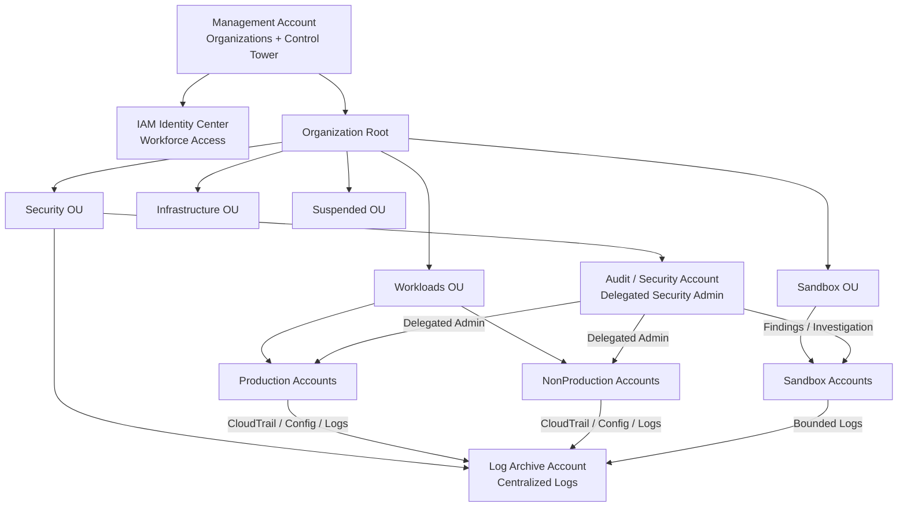
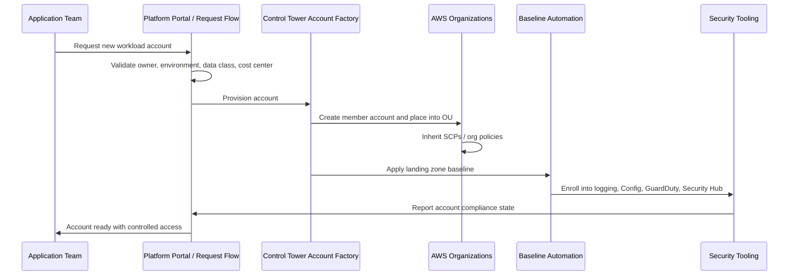
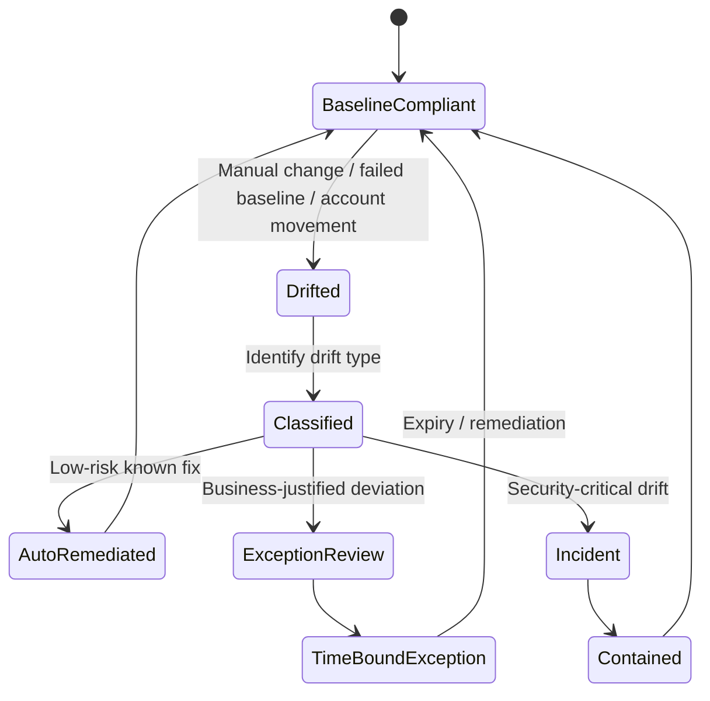
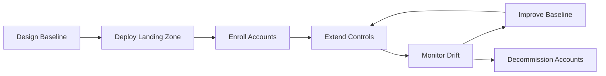

# Part 011 — Control Tower Landing Zone

## 1. Masalah Yang Sebenarnya Diselesaikan Control Tower

AWS Control Tower sering dipahami terlalu sempit sebagai wizard untuk membuat multi-account environment. Itu salah arah.

Control Tower bukan hanya alat provisioning. Control Tower adalah **governance bootstrapper**: ia membuat starting state AWS organization menjadi lebih aman, lebih konsisten, lebih bisa diaudit, dan lebih mudah diperluas.

Masalah yang diselesaikan bukan:

> “Bagaimana membuat banyak AWS account?”

Masalah sebenarnya adalah:

> “Bagaimana memastikan setiap AWS account yang dibuat punya baseline security, audit, identity, logging, dan governance yang sama sejak menit pertama?”

Tanpa landing zone, organisasi biasanya jatuh ke pola ini:

1. Account dibuat manual.
2. Admin lokal diberi akses terlalu luas.
3. CloudTrail tidak konsisten.
4. AWS Config tidak aktif di semua region.
5. GuardDuty/Security Hub baru dinyalakan setelah incident.
6. Tidak ada tag, owner, cost center, atau workload classification.
7. Tidak jelas apakah account dev boleh menjalankan resource production-like.
8. Tidak ada cara reliable untuk mengetahui account mana yang drift dari baseline.

Masalah ini bukan masalah tooling. Ini masalah **state initialization** dan **control inheritance**.

Dalam distributed system, node baru harus bootstrap dengan konfigurasi benar. Dalam AWS organization, account baru adalah node baru. Jika bootstrap-nya salah, semua sistem di atasnya akan mewarisi risiko yang sulit diperbaiki.

Control Tower memberi baseline untuk itu.

---

## 2. Mental Model: Landing Zone Sebagai Kernel Governance

Landing zone adalah **kernel** dari cloud operating system internal.

Kernel ini tidak menjalankan semua workload. Kernel menetapkan batas operasi minimum:

- account mana yang boleh ada,
- OU mana account ditempatkan,
- kontrol apa yang berlaku,
- audit trail apa yang wajib aktif,
- logging disimpan di mana,
- siapa yang boleh mengelola akses,
- bagaimana account baru dibuat,
- bagaimana drift dikenali,
- bagaimana governance diperluas.

Analogi sederhananya:

| Sistem Operasi | AWS Landing Zone |
|---|---|
| Kernel | Control Tower baseline |
| User/process | AWS account dan workload |
| System call | AWS API call |
| Permission model | IAM, SCP, permission set |
| Audit log | CloudTrail, Config, CloudWatch Logs |
| Process isolation | AWS account boundary |
| Policy enforcement | Control Tower controls, SCP, Config rules |
| Package bootstrap | Account Factory, StackSets, IaC baseline |

Jadi pertanyaan desainnya bukan “pakai Control Tower atau tidak”, tetapi:

> “Apa baseline minimum yang harus selalu benar sebelum engineer pertama membuat resource?”

---

## 3. Apa Itu AWS Control Tower

AWS Control Tower adalah layanan AWS untuk membuat dan mengelola secure multi-account environment berdasarkan best practice AWS.

Komponen utamanya:

1. **Landing zone**  
   Baseline environment yang terdiri dari AWS Organizations, OU, shared accounts, IAM Identity Center integration, centralized logging, audit, dan governance controls.

2. **Account Factory**  
   Mekanisme provisioning account baru dengan baseline configuration.

3. **Controls**  
   High-level governance rules untuk mencegah, mendeteksi, atau memvalidasi konfigurasi resource/account.

4. **Dashboard governance**  
   Tampilan compliance dan drift dari akun dan OU yang dikelola.

5. **Integration dengan AWS Organizations**  
   Control Tower duduk di atas Organizations, bukan menggantikannya.

6. **Integration dengan CloudTrail, Config, CloudFormation StackSets, IAM Identity Center, dan service governance lain**.

AWS mendeskripsikan Control Tower controls sebagai aturan high-level untuk ongoing governance, dengan behavior preventive, detective, dan proactive. Preventive controls biasanya memakai SCP/RCP, detective controls memakai AWS Config rules, dan proactive controls memakai CloudFormation hooks.

---

## 4. Apa Yang Bukan Control Tower

Control Tower bukan pengganti semua security architecture.

Ia **bukan**:

- pengganti threat modeling,
- pengganti IAM least privilege,
- pengganti SOC,
- pengganti incident response,
- pengganti vulnerability management,
- pengganti observability platform,
- pengganti IaC governance,
- pengganti platform engineering,
- pengganti desain data protection,
- pengganti review architecture.

Control Tower memberi baseline. Ia tidak otomatis membuat workload aman.

Kalimat yang harus diingat:

> Control Tower makes the environment governable. It does not make every workload well-governed by itself.

Ini penting karena banyak organisasi merasa “sudah pakai Control Tower” berarti “AWS kami aman”. Itu sama seperti merasa aplikasi aman karena server sudah memakai Linux hardened image, padahal aplikasi masih bisa punya SQL injection, public bucket, over-permissioned role, dan secret leak.

---

## 5. Baseline Account Dalam Landing Zone

Control Tower biasanya membentuk beberapa account penting:

| Account | Peran |
|---|---|
| Management account | Root administrative account untuk AWS Organizations dan Control Tower. Harus sangat dibatasi. |
| Log Archive account | Penyimpanan log terpusat, terutama audit/security logs. |
| Audit/Security account | Account untuk security tooling, auditor access, delegated admin, dan investigation. |
| Workload accounts | Account tempat aplikasi berjalan. |
| Shared services account | Opsional, untuk network/shared platform capability. |

### 5.1 Management Account

Management account adalah account paling sensitif di organisasi.

Ia memegang kemampuan untuk:

- membuat account,
- menghapus atau memindahkan account,
- mengubah OU,
- mengatur policy organisasi,
- mengaktifkan trusted access service,
- menunjuk delegated administrator,
- mengubah landing zone.

Dalam production-grade organization, management account harus diperlakukan seperti **root of trust**.

Praktik yang masuk akal:

- tidak menjalankan workload di management account,
- tidak membuat long-lived human admin kecuali break-glass,
- memakai IAM Identity Center untuk akses administratif,
- MFA wajib,
- CloudTrail dan alert root usage,
- akses harian dipindah ke delegated admin account,
- change ke Organizations/Control Tower harus melalui controlled process.

Management account bukan tempat eksperimen.

### 5.2 Log Archive Account

Log Archive account adalah immutable-ish evidence store.

Tujuannya:

- menerima log dari member accounts,
- memisahkan log dari account yang mungkin compromised,
- mengurangi kemungkinan attacker menghapus evidence,
- memberi auditor lokasi evidence yang konsisten,
- menjadi basis forensic readiness.

Salah satu invariant penting:

> Workload owner boleh mengelola aplikasinya, tetapi tidak boleh bisa menghapus audit trail yang membuktikan apa yang mereka lakukan.

### 5.3 Audit / Security Account

Audit atau Security account dipakai untuk security operations.

Biasanya menjadi delegated administrator untuk service seperti:

- AWS Security Hub,
- Amazon GuardDuty,
- Amazon Inspector,
- Amazon Macie,
- AWS Config aggregator,
- AWS IAM Access Analyzer,
- AWS Firewall Manager,
- Amazon Detective.

Account ini tidak sama dengan Log Archive account.

Log Archive menyimpan evidence. Security account menganalisis, mengorelasikan, dan merespons.

Jika keduanya digabung sembarangan, operator security yang butuh investigasi bisa tidak sengaja memiliki hak terlalu besar terhadap evidence store.

---

## 6. Landing Zone Architecture



Arsitektur ini punya tiga boundary utama:

1. **Governance boundary**: Management account dan AWS Organizations.
2. **Evidence boundary**: Log Archive account.
3. **Detection/response boundary**: Audit/Security account.

Workload accounts tidak boleh menjadi pusat governance, evidence, atau detection untuk dirinya sendiri. Kalau account compromised, control plane investigasi harus tetap berdiri di luar account itu.

---

## 7. Account Factory: Account Baru Harus Lahir Sudah Aman

Account Factory adalah salah satu bagian terpenting Control Tower.

Masalah yang diselesaikan:

> Account baru tidak boleh lahir sebagai blank AWS account yang harus di-hardening manual.

Account baru harus lahir dengan:

- OU benar,
- baseline logging aktif,
- baseline controls inherited,
- IAM access path benar,
- owner dan metadata jelas,
- budget/cost visibility aktif,
- security services enrolled,
- naming/email/account alias standar,
- support/contact process jelas,
- lifecycle state jelas.

### 7.1 Account Vending Flow



### 7.2 Metadata Yang Wajib Ada Saat Account Dibuat

Account tanpa metadata adalah future orphan.

Minimal metadata:

| Metadata | Mengapa Penting |
|---|---|
| Account owner | Siapa bertanggung jawab atas risk dan cost. |
| Technical owner | Siapa merespons incident teknis. |
| Business owner | Siapa menerima residual risk. |
| Environment | Prod, nonprod, sandbox, shared, security. |
| Data classification | Menentukan control mandatory. |
| Regulatory scope | PCI, HIPAA, SOC2, internal, dsb. |
| Cost center | Chargeback/showback. |
| Criticality | Menentukan monitoring, backup, incident SLA. |
| Allowed regions | Data residency dan operational restriction. |
| Expiry date | Khusus sandbox/experiment account. |

Tanpa metadata ini, account akan menjadi resource yang “ada tetapi tidak dimiliki”. Itu salah satu bentuk risiko paling mahal di cloud.

---

## 8. Control Tower Controls: Preventive, Detective, Proactive

Control Tower controls punya tiga behavior utama.

| Behavior | Cara Kerja | Contoh Pertanyaan |
|---|---|---|
| Preventive | Mencegah aksi terjadi | “Bisakah user menonaktifkan CloudTrail?” |
| Detective | Mendeteksi state yang tidak sesuai | “Apakah bucket ini public?” |
| Proactive | Memvalidasi resource sebelum diprovision | “Apakah template ini akan membuat resource non-compliant?” |

### 8.1 Preventive Controls

Preventive control menghentikan tindakan sebelum terjadi.

Biasanya cocok untuk invariant yang benar-benar tidak boleh dilanggar, misalnya:

- tidak boleh menonaktifkan CloudTrail organisasi,
- tidak boleh meninggalkan organization,
- tidak boleh membuat resource di region yang dilarang,
- tidak boleh menghapus log bucket,
- tidak boleh mengubah baseline security service.

Preventive control efektif untuk hal yang jelas dan jarang berubah.

Tetapi preventive control yang terlalu agresif bisa menghentikan operasi sah. Karena itu preventive control harus didesain dengan exception path.

### 8.2 Detective Controls

Detective control tidak mencegah aksi. Ia mendeteksi state tidak patuh.

Cocok untuk resource state yang terlalu dinamis untuk diblokir total:

- security group terlalu terbuka,
- S3 bucket encryption belum aktif,
- EBS volume tidak terenkripsi,
- public access block berubah,
- resource tidak punya tag,
- backup policy tidak diterapkan.

Detective control hanya berguna jika ada response loop.

Tanpa response loop, detective control hanya menghasilkan dashboard merah.

Formula operasionalnya:

```text
Detective Control = Detection + Owner + SLA + Remediation + Evidence
```

Kalau salah satu tidak ada, kontrolnya belum matang.

### 8.3 Proactive Controls

Proactive control memvalidasi konfigurasi sebelum resource dibuat atau diubah, terutama pada CloudFormation-based provisioning.

Ia berguna untuk shift-left governance:

- template yang membuat public bucket ditolak,
- resource tanpa encryption ditolak,
- unsupported region ditolak,
- mandatory tag tidak ada ditolak,
- insecure configuration tidak masuk ke environment.

Proactive control adalah jembatan antara platform governance dan delivery workflow.

---

## 9. Guidance Category: Mandatory, Strongly Recommended, Elective

Selain behavior, Control Tower controls punya guidance.

| Guidance | Makna Praktis |
|---|---|
| Mandatory | Bagian dari baseline yang harus ada untuk landing zone. |
| Strongly recommended | Best practice untuk multi-account environment, tetapi perlu keputusan organisasi. |
| Elective | Opsional sesuai risk appetite, industri, data class, atau workload type. |

Jangan menganggap “elective” berarti tidak penting.

Elective berarti:

> “AWS tidak bisa memutuskan ini untuk semua organisasi, tetapi organisasi Anda mungkin harus mengaktifkannya berdasarkan risk model.”

Contoh: data residency controls mungkin elective secara global, tetapi mandatory untuk organisasi yang terikat regulasi lokasi data.

---

## 10. Control Placement: OU Adalah Unit Governance

Control Tower controls biasanya diterapkan ke OU, bukan hanya account individual.

Ini penting karena OU adalah **control contract**.

Misalnya:

| OU | Control Intent |
|---|---|
| Production | Strict audit, limited region, no public unmanaged exposure, backup mandatory. |
| NonProduction | Strong baseline, lebih longgar untuk eksperimen terkontrol. |
| Sandbox | Cost bound, expiry, restricted sensitive services. |
| Security | Protect security tooling, deny destructive actions. |
| Log Archive | Protect evidence immutability. |
| Suspended | Deny almost everything except recovery/investigation path. |

Control yang sama tidak selalu cocok untuk semua OU.

Kesalahan umum:

> Menerapkan semua control ke root OU tanpa memahami efek operasionalnya.

Lebih baik mulai dari policy staging OU, uji control, lalu rollout bertahap.

---

## 11. Governed Accounts vs Ungoverned Accounts

Dalam Control Tower, tidak semua account otomatis berada dalam state governance penuh.

Ada konsep penting:

- account yang dibuat melalui Account Factory,
- account existing yang di-enroll,
- account yang belum terdaftar/governed,
- account yang drift dari baseline,
- account yang berada di OU tidak dikelola.

Risikonya:

> Organisasi merasa semua account sudah governed, padahal sebagian account hanya berada di AWS Organizations tetapi belum mendapat baseline Control Tower yang sama.

Inventory account harus membedakan:

| State | Arti | Risiko |
|---|---|---|
| Governed | Dalam OU terkelola dan baseline berlaku | Normal |
| Enrolled legacy | Account lama sudah masuk governance | Perlu validasi drift |
| Unenrolled | Ada di organization tetapi belum dikelola penuh | High risk |
| Suspended | Tidak aktif atau dikarantina | Perlu deny policy |
| Transitional | Sedang migrasi baseline | Perlu monitoring ketat |

---

## 12. Drift: Ketika Baseline Tidak Lagi Sama Dengan Realita

Drift adalah kondisi ketika konfigurasi aktual tidak lagi sama dengan baseline yang diharapkan.

Drift bisa terjadi karena:

- perubahan manual,
- emergency fix,
- service update,
- account dipindah OU,
- StackSet gagal apply,
- permission terlalu luas,
- security service dinonaktifkan,
- region baru belum tercakup,
- legacy account tidak fully enrolled.

Drift bukan hanya masalah teknis. Drift adalah kehilangan kepercayaan terhadap governance state.

### 12.1 Drift Lifecycle



### 12.2 Jenis Drift

| Drift Type | Contoh | Response |
|---|---|---|
| Security service drift | GuardDuty disabled | Auto-remediate + incident if repeated |
| Logging drift | CloudTrail changed | Immediate escalation |
| Policy drift | SCP detached | Critical investigation |
| Account placement drift | Prod account moved to weak OU | Governance incident |
| Resource drift | Public bucket created | Depends on data class |
| Metadata drift | Owner missing | Operational remediation |

---

## 13. Landing Zone Lifecycle

Landing zone bukan sekali setup lalu selesai.

Ia punya lifecycle:

1. **Design**  
   OU, account model, baseline controls, identity flow, logging model.

2. **Deploy**  
   Setup Control Tower landing zone dan shared accounts.

3. **Enroll**  
   Masukkan existing account ke governance.

4. **Extend**  
   Tambahkan controls, StackSets, delegated admin, automation.

5. **Monitor**  
   Pantau drift, compliance, account state, security findings.

6. **Evolve**  
   Update landing zone sesuai AWS changes, regulatory requirement, incident lessons.

7. **Decommission**  
   Suspended OU, account closure, evidence retention, cost cleanup.

### 13.1 Lifecycle Diagram



---

## 14. Region Strategy Dalam Landing Zone

Region bukan hanya keputusan latency. Region adalah security dan compliance boundary.

Pertanyaan yang harus dijawab:

- Region mana yang boleh dipakai?
- Region mana yang hanya boleh untuk disaster recovery?
- Region mana yang dilarang karena data residency?
- Bagaimana kontrol diterapkan di region baru?
- Apakah CloudTrail multi-region aktif?
- Apakah Config recorder mencakup region yang dipakai?
- Apakah security services mendukung region tersebut?
- Apakah backup/replication melewati batas regulasi?

SCP region restriction sering dipakai, tetapi harus hati-hati.

Beberapa global service memerlukan exception. Jika region deny dibuat terlalu kasar, Anda bisa merusak IAM, CloudFront, Route 53, STS, atau service global lain.

Region strategy harus punya allowlist dan exception yang eksplisit.

---

## 15. Identity Integration

Control Tower biasanya terintegrasi dengan IAM Identity Center untuk human access.

Model yang sehat:

- human tidak login sebagai IAM user lokal di setiap account,
- akses diberikan via permission set,
- permission set dipetakan ke job role,
- account assignment mengikuti OU/workload ownership,
- privileged access dibuat time-bound jika memungkinkan,
- break-glass dipisahkan dari daily admin,
- semua access path bisa diaudit.

Jangan membuat Control Tower tetapi tetap membiarkan IAM user lokal tersebar di member accounts. Itu menghancurkan value governance.

---

## 16. Baseline Logging Dan Evidence

Landing zone harus mengaktifkan audit baseline sejak awal.

Minimal:

- organization trail,
- multi-region CloudTrail,
- log delivery ke Log Archive,
- CloudTrail log file validation,
- AWS Config recorder/aggregrator sesuai scope,
- CloudWatch log retention policy,
- S3 access logging atau CloudTrail data events sesuai data class,
- EventBridge rules untuk critical governance changes,
- alarm untuk root usage, CloudTrail stop, Config recorder stop, GuardDuty disable.

Evidence harus dikumpulkan sebelum incident terjadi.

Kalau Anda baru menyalakan logging setelah incident, Anda sedang melihat jejak kaki setelah lantainya diganti.

---

## 17. Control Tower Dan Existing Accounts

Realita enterprise: hampir selalu ada existing accounts.

Masalahnya, existing accounts punya state historis:

- IAM users lama,
- custom CloudTrail,
- bucket policy tidak standar,
- security group terbuka,
- resource tanpa tag,
- billing owner tidak jelas,
- root credential tidak diketahui,
- region liar,
- service tidak ter-enroll.

Jangan langsung enroll semua account tanpa assessment.

### 17.1 Enrollment Readiness Checklist

| Check | Tujuan |
|---|---|
| Account owner known | Bisa assign remediation. |
| Root credential status known | Hindari privileged unknown. |
| CloudTrail current state known | Hindari kehilangan audit. |
| Config compatibility known | Hindari baseline conflict. |
| Region usage known | SCP tidak memutus workload. |
| IAM admin path known | Hindari lockout. |
| Critical workload mapped | Hindari outage akibat control. |
| Existing automation known | Hindari StackSet/config conflict. |

### 17.2 Enrollment Strategy

Urutan aman:

1. Inventory account.
2. Classify by environment dan criticality.
3. Run non-invasive assessment.
4. Fix root dan audit gaps.
5. Move to transitional OU.
6. Enable baseline controls.
7. Observe drift.
8. Move to target OU.
9. Attach stronger controls.
10. Close exceptions.

---

## 18. Control Tower, IaC, Dan Platform Engineering

Control Tower memberi baseline. IaC memberi repeatability. Platform engineering memberi productized workflow.

Ketiganya harus bekerja bersama.

Pattern yang sehat:

```text
Control Tower = environment baseline
IaC = workload/resource declaration
Platform Portal = request and ownership workflow
Security Automation = detection/remediation loop
```

Jangan memakai Control Tower untuk semua resource workload. Itu bukan tujuannya.

Workload tetap sebaiknya diprovision dengan IaC pipeline yang punya:

- policy-as-code check,
- security review gate,
- tagging enforcement,
- deployment audit,
- rollback path,
- drift detection.

Control Tower menjaga lantai. Platform/IaC membangun rumah di atasnya.

---

## 19. Failure Modes Control Tower Landing Zone

### 19.1 Management Account Menjadi Workload Account

Gejala:

- EC2, Lambda, database, atau app berjalan di management account.
- Banyak engineer punya admin access ke management account.
- Billing, Organizations, dan workload runtime bercampur.

Risiko:

- compromise workload bisa menjadi compromise organisasi,
- accidental policy change berdampak global,
- audit sulit,
- blast radius terlalu besar.

Remediasi:

- migrasikan workload keluar,
- batasi akses management account,
- jadikan management account hanya governance plane.

### 19.2 Log Archive Bisa Diubah Workload Admin

Gejala:

- workload role bisa menghapus log bucket,
- bucket policy terlalu longgar,
- KMS key bisa di-disable oleh non-security role.

Risiko:

- attacker menghapus jejak,
- auditor tidak percaya evidence,
- incident response buta.

Remediasi:

- isolate log archive,
- KMS policy strict,
- deny destructive action,
- lifecycle/retention policy,
- object lock bila sesuai requirement.

### 19.3 Semua Control Diterapkan Sekaligus

Gejala:

- banyak workload gagal deploy,
- engineer membuat workaround,
- security team dianggap blocker,
- exception membanjir.

Risiko:

- governance kehilangan legitimasi,
- shadow AWS account muncul,
- control akhirnya dimatikan.

Remediasi:

- policy staging OU,
- phased rollout,
- blast radius kecil,
- change communication,
- exception workflow.

### 19.4 Sandbox Tanpa Batas

Gejala:

- sandbox bisa membuat resource mahal,
- bisa memakai region mana pun,
- bisa menyimpan data sensitif,
- tidak ada expiry.

Risiko:

- cost spike,
- data leakage,
- orphan resource,
- security blind spot.

Remediasi:

- budget alarm,
- allowed service boundary,
- no sensitive data policy,
- expiry tag,
- automated cleanup.

---

## 20. Control Decision Matrix

Gunakan matrix berikut sebelum mengaktifkan control:

| Pertanyaan | Jika Ya | Jika Tidak |
|---|---|---|
| Apakah pelanggaran bisa menyebabkan incident besar? | Preventive atau proactive | Detective cukup |
| Apakah ada legitimate exception? | Buat exception path | Deny keras bisa diterapkan |
| Apakah false positive tinggi? | Mulai detective | Jangan langsung preventive |
| Apakah resource dibuat via IaC? | Proactive/policy-as-code efektif | Perlu detective runtime |
| Apakah owner jelas? | Bisa enforce SLA | Perbaiki ownership dulu |
| Apakah remediation aman diotomasi? | Auto-remediate | Manual approval |
| Apakah impact lintas OU? | Rollout bertahap | Bisa apply langsung ke target OU |

---

## 21. Production Landing Zone Minimum Viable Baseline

Minimum baseline yang masuk akal untuk organisasi engineering serius:

### 21.1 Organization

- AWS Organizations all features enabled.
- OU design berbasis control, bukan reporting line.
- Management account tidak menjalankan workload.
- Delegated admin dipakai untuk security services.

### 21.2 Account

- Account dibuat melalui Account Factory atau workflow resmi.
- Account punya owner, environment, data class, cost center.
- Existing account enrollment punya readiness checklist.
- Suspended account masuk OU khusus.

### 21.3 Identity

- IAM Identity Center untuk human access.
- No long-lived IAM users untuk akses manusia normal.
- Break-glass path terdokumentasi.
- Root access dibatasi dan diaudit.

### 21.4 Audit

- Organization CloudTrail multi-region.
- Logs dikirim ke Log Archive account.
- Config aggregator aktif sesuai scope.
- Critical governance event punya alert.

### 21.5 Controls

- Mandatory controls aktif.
- Strongly recommended controls dievaluasi per OU.
- Region restriction dirancang dengan exception global service.
- Guardrail untuk melindungi CloudTrail, Config, log archive, security tooling.

### 21.6 Operations

- Drift review rutin.
- Account lifecycle process.
- Exception register.
- Control rollout process.
- Incident runbook untuk governance compromise.

---

## 22. Implementation Roadmap

### Stage 1 — Foundation Design

Deliverable:

- OU model,
- account taxonomy,
- security account model,
- logging model,
- identity model,
- region strategy,
- control baseline.

Exit criteria:

- semua boundary jelas,
- management account usage policy disetujui,
- log archive dan audit account design disetujui.

### Stage 2 — Landing Zone Deployment

Deliverable:

- Control Tower landing zone aktif,
- shared accounts dibuat,
- IAM Identity Center integrated,
- baseline logging aktif,
- mandatory controls aktif.

Exit criteria:

- account baru bisa dibuat dari workflow resmi,
- logs masuk ke log archive,
- dashboard governance menunjukkan account baseline.

### Stage 3 — Account Factory Hardening

Deliverable:

- metadata wajib,
- account naming/email standard,
- budget baseline,
- security service enrollment,
- tagging baseline,
- access assignment workflow.

Exit criteria:

- account baru lahir dengan owner, OU, access, audit, dan controls benar.

### Stage 4 — Existing Account Enrollment

Deliverable:

- inventory,
- risk classification,
- transitional OU,
- remediation backlog,
- enrollment plan.

Exit criteria:

- tidak ada unknown account,
- semua account punya target OU,
- exceptions tercatat.

### Stage 5 — Control Expansion

Deliverable:

- strongly recommended/elective controls dievaluasi,
- policy staging OU,
- rollout plan,
- exception workflow,
- alert/remediation.

Exit criteria:

- control punya owner, SLA, evidence, dan rollback plan.

### Stage 6 — Continuous Governance

Deliverable:

- drift review,
- compliance reporting,
- security findings integration,
- governance incident process,
- landing zone update process.

Exit criteria:

- landing zone menjadi living system, bukan setup satu kali.

---

## 23. Runbook: Account Baru Production

Gunakan runbook ini sebagai checklist awal.

```text
Request:
  - workload name
  - business owner
  - technical owner
  - environment = production
  - data classification
  - regulatory scope
  - criticality
  - expected regions
  - cost center

Validation:
  - owner valid
  - data class allowed in requested region
  - production OU target confirmed
  - security controls required identified
  - backup requirement identified
  - monitoring requirement identified

Provision:
  - create account via Account Factory
  - place in production OU
  - apply baseline access assignment
  - enroll security services
  - verify CloudTrail delivery
  - verify Config recording
  - verify GuardDuty/Security Hub/Inspector enrollment as applicable
  - attach budget/cost alert

Handover:
  - provide access path
  - provide security baseline summary
  - provide exception process
  - provide incident contact path
  - register account in CMDB/platform inventory

Post-Provision:
  - run compliance scan
  - verify no drift
  - verify mandatory tags
  - verify backup plan if required
  - verify dashboard visibility
```

---

## 24. Review Questions

Jawab pertanyaan ini sebelum menganggap landing zone matang:

1. Apakah ada workload di management account?
2. Apakah semua account punya owner dan environment?
3. Apakah account baru bisa dibuat tanpa security team manual hardening?
4. Apakah semua production account mengirim audit log ke account di luar dirinya?
5. Apakah workload admin bisa menghapus evidence?
6. Apakah root usage bisa dideteksi?
7. Apakah region strategy eksplisit?
8. Apakah existing account sudah dibedakan antara governed dan unenrolled?
9. Apakah Control Tower drift dipantau?
10. Apakah controls punya owner, SLA, dan exception process?
11. Apakah sandbox account punya batas biaya dan expiry?
12. Apakah security services dikelola via delegated admin?
13. Apakah OU didesain berdasarkan kontrol, bukan struktur organisasi?
14. Apakah ada policy staging sebelum rollout SCP/control baru?
15. Apakah auditor bisa melihat evidence tanpa meminta workload owner mengekspor manual?

---

## 25. Kesimpulan

Control Tower adalah titik awal untuk AWS governance yang defensible.

Ia memberi:

- baseline multi-account,
- account factory,
- centralized logging,
- security/audit account separation,
- control framework,
- visibility terhadap governance state,
- fondasi untuk policy inheritance.

Tetapi Control Tower bukan akhir security architecture.

Engineering organization yang matang memperlakukan landing zone sebagai living control system:

```text
Landing Zone = Baseline + Account Lifecycle + Controls + Evidence + Drift Management + Continuous Improvement
```

Jika account baru lahir tanpa owner, tanpa audit, tanpa control, dan tanpa lifecycle, berarti landing zone belum menyelesaikan masalah aslinya.

Tujuan akhirnya bukan “mengaktifkan Control Tower”.

Tujuan akhirnya adalah:

> Setiap AWS account lahir dengan batas yang benar, diaudit sejak awal, masuk ke governance yang tepat, dan bisa dikelola sepanjang hidupnya tanpa mengandalkan heroics manual.

---

## References

- AWS Control Tower User Guide — https://docs.aws.amazon.com/controltower/latest/userguide/what-is-control-tower.html
- About controls in AWS Control Tower — https://docs.aws.amazon.com/controltower/latest/controlreference/controls.html
- Control behavior and guidance — https://docs.aws.amazon.com/controltower/latest/controlreference/control-behavior.html
- How controls work in AWS Control Tower — https://docs.aws.amazon.com/controltower/latest/userguide/how-controls-work.html
- AWS Organizations User Guide — https://docs.aws.amazon.com/organizations/latest/userguide/orgs_introduction.html
- AWS Well-Architected Security Pillar — Define permission guardrails — https://docs.aws.amazon.com/wellarchitected/latest/security-pillar/sec_permissions_define_guardrails.html
- AWS Prescriptive Guidance — Designing and implementing an AWS Control Tower landing zone — https://docs.aws.amazon.com/prescriptive-guidance/latest/designing-control-tower-landing-zone/welcome.html
