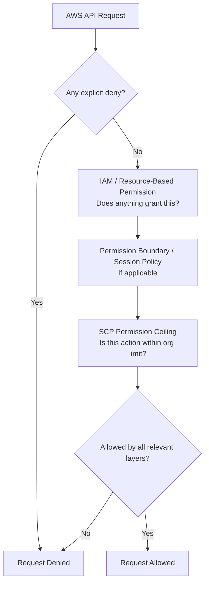
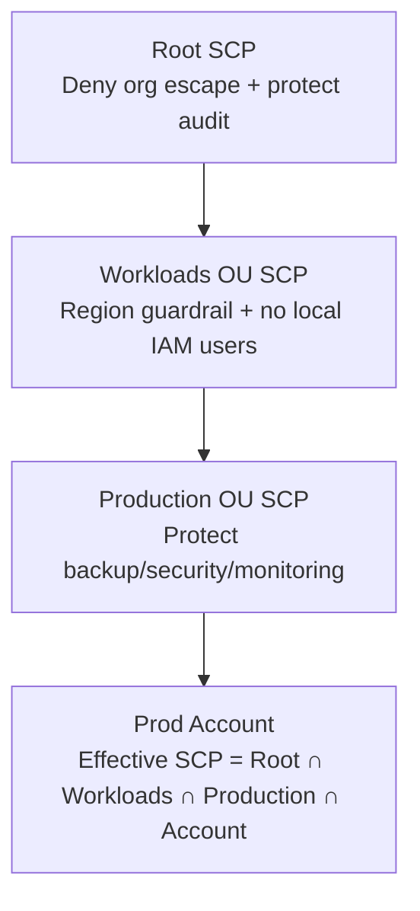
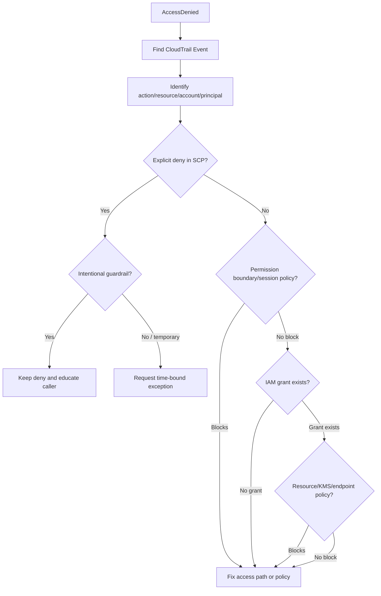

# Part 012 — Service Control Policies From First Principles

## 1. Masalah Yang Diselesaikan SCP

IAM policy menjawab pertanyaan:

> “Apa yang boleh dilakukan principal ini?”

Service Control Policy menjawab pertanyaan berbeda:

> “Apa batas maksimum yang boleh pernah diberikan kepada principal di account atau OU ini?”

Perbedaan ini fundamental.

IAM adalah mekanisme pemberian izin. SCP adalah mekanisme pembatasan izin maksimum pada level organisasi.

SCP tidak didesain untuk menggantikan IAM. SCP didesain untuk mencegah bahkan administrator lokal sekalipun melakukan hal yang organisasi anggap tidak boleh terjadi.

Contoh invariant:

- member account root user tidak boleh dipakai untuk operasi sehari-hari,
- CloudTrail organisasi tidak boleh dimatikan,
- AWS Config recorder tidak boleh dihentikan,
- log archive bucket tidak boleh dihapus,
- resource tidak boleh dibuat di region yang tidak disetujui,
- account tidak boleh meninggalkan organization,
- security service tidak boleh dinonaktifkan oleh workload admin,
- public exposure tertentu tidak boleh dibuat tanpa controlled path.

Tanpa SCP, account admin lokal yang punya `AdministratorAccess` bisa melewati banyak policy internal.

Dengan SCP, organisasi bisa berkata:

> “Bahkan jika seseorang mendapat AdministratorAccess di member account, batas ini tetap tidak bisa dilewati.”

Itulah power SCP.

---

## 2. Definisi Yang Tepat

Service Control Policy adalah policy AWS Organizations yang menetapkan **permission guardrail** untuk IAM users dan IAM roles di member accounts.

SCP menetapkan maximum available permissions.

Ia tidak memberi izin.

Jika SCP berisi `Allow`, itu bukan berarti principal otomatis mendapat izin. Principal masih perlu IAM identity policy, resource policy, atau mekanisme izin lain yang benar.

Kalimat paling penting:

```text
Effective Permission = Permissions Granted by IAM/Resource Policy ∩ Permissions Allowed by SCP/RCP ∩ Other Boundaries
```

Dengan kata lain:

- IAM bisa memberi izin.
- SCP bisa membatasi izin.
- SCP tidak bisa memberi izin yang tidak diberikan IAM.
- Explicit deny selalu menang.

---

## 3. SCP Sebagai Permission Ceiling

Bayangkan sebuah gedung.

IAM policy adalah lift yang membawa user ke lantai tertentu. SCP adalah plafon gedung.

Jika plafon hanya sampai lantai 5, tidak peduli lift punya tombol sampai lantai 100, user tidak bisa melewati lantai 5.



SCP adalah ceiling, bukan floor.

Jika IAM tidak memberi izin, SCP tidak membantu.

Jika SCP melarang, IAM admin pun tidak bisa melewati.

---

## 4. Scope SCP

SCP dapat ditempelkan ke:

- organization root,
- organizational unit,
- account individual.

Policy yang efektif untuk sebuah account adalah hasil inheritance dari semua policy di jalur:

```text
Organization Root → Parent OU → Child OU → Account
```

Account hanya punya permission yang diizinkan oleh semua parent di atasnya.

Jika root OU deny suatu action, child OU tidak bisa mengizinkannya kembali.

Ini mirip type system dengan constraint inheritance:

- parent mempersempit ruang aksi,
- child hanya bisa mempersempit lagi,
- child tidak bisa melonggarkan constraint parent.

---

## 5. Hal Yang Dipengaruhi Dan Tidak Dipengaruhi SCP

SCP berlaku untuk IAM users dan IAM roles yang dikelola oleh member accounts dalam organization. SCP juga membatasi root user pada member account.

Namun ada batas penting:

| Area | Efek SCP |
|---|---|
| IAM users di member account | Terpengaruh |
| IAM roles di member account | Terpengaruh |
| Root user di member account | Terpengaruh |
| Management account | Tidak terpengaruh oleh SCP |
| Resource-based policy secara langsung | Tidak langsung dibatasi oleh SCP terhadap principal luar organisasi |
| Principal dari account luar organization | Tidak dipengaruhi oleh SCP milik account resource owner |
| Service-linked roles | Umumnya tidak dibatasi oleh SCP agar AWS service bisa berfungsi |

Implikasi praktis:

1. Jangan mengandalkan SCP untuk melindungi management account. Management account harus diamankan dengan cara lain.
2. Jangan menganggap SCP resource-owner account otomatis membatasi principal eksternal yang diberi akses oleh resource policy.
3. Jangan kaget jika service-linked role masih bisa melakukan tindakan yang diperlukan service.
4. Untuk resource-side restriction lintas principal, pertimbangkan Resource Control Policies, resource policies, bucket policies, KMS policies, endpoint policies, atau condition keys yang tepat.

---

## 6. SCP Bukan IAM Policy Biasa

Sintaks SCP mirip IAM policy, tetapi semantiknya berbeda.

Kesalahan umum:

```json
{
  "Version": "2012-10-17",
  "Statement": [
    {
      "Effect": "Allow",
      "Action": "s3:*",
      "Resource": "*"
    }
  ]
}
```

Banyak engineer membaca policy di atas sebagai “memberi S3 full access”. Dalam SCP, itu salah.

Makna sebenarnya:

> “Di scope ini, maksimum izin yang tersedia hanya S3. Tetapi principal tetap harus punya IAM permission untuk memakai S3.”

Jika principal tidak punya IAM permission, tetap tidak bisa akses S3.

Jika principal punya `AdministratorAccess`, SCP ini membatasi admin tersebut hanya ke S3.

---

## 7. FullAWSAccess Dan Allowlist Model

Secara default, AWS Organizations biasanya memakai AWS managed SCP bernama `FullAWSAccess` agar semua services tetap tersedia kecuali dibatasi policy lain.

Ada dua model besar SCP:

1. **Denylist model**  
   Mulai dari full access, lalu deny hal tertentu.

2. **Allowlist model**  
   Mulai dari akses sempit, lalu allow hanya service/action tertentu.

### 7.1 Denylist Model

Contoh:

```json
{
  "Version": "2012-10-17",
  "Statement": [
    {
      "Sid": "DenyLeavingOrganization",
      "Effect": "Deny",
      "Action": [
        "organizations:LeaveOrganization"
      ],
      "Resource": "*"
    }
  ]
}
```

Kelebihan:

- mudah diterapkan,
- minim risiko breakage,
- cocok untuk invariant kritis,
- cocok untuk organization yang masih tumbuh.

Kekurangan:

- tidak membatasi service baru secara default,
- guardrail harus terus diperluas,
- admin lokal masih punya ruang luas selama tidak dilarang.

### 7.2 Allowlist Model

Contoh konsep:

```json
{
  "Version": "2012-10-17",
  "Statement": [
    {
      "Sid": "AllowOnlyApprovedServices",
      "Effect": "Allow",
      "Action": [
        "ec2:*",
        "s3:*",
        "rds:*",
        "cloudwatch:*"
      ],
      "Resource": "*"
    }
  ]
}
```

Kelebihan:

- sangat ketat,
- service baru tidak otomatis bisa dipakai,
- cocok untuk regulated/sandbox/restricted OU.

Kekurangan:

- mudah merusak workload,
- butuh exception banyak,
- banyak AWS service memakai dependent actions,
- bisa menghambat inovasi jika proses approval buruk.

### 7.3 Rekomendasi Praktis

Untuk kebanyakan organisasi:

- root/production OU: denylist kuat untuk invariant kritis,
- sandbox/restricted OU: allowlist atau denylist agresif,
- regulated OU: allowlist + exception workflow,
- policy staging OU: tempat uji SCP baru,
- suspended OU: deny hampir semua action.

---

## 8. Policy Evaluation: Urutan Mental Yang Benar

Saat AWS menerima request, pertanyaan besarnya:

1. Apakah ada explicit deny dari policy mana pun?
2. Apakah principal punya izin dari identity/resource policy?
3. Apakah permission boundary/session policy membatasi izin?
4. Apakah SCP mengizinkan action itu berada dalam maximum permission?
5. Apakah condition terpenuhi?
6. Apakah service-specific control lain seperti KMS key policy, bucket policy, endpoint policy, atau RCP membatasi?

Simplifikasi:

```text
Any explicit deny → denied
No grant → denied
Grant exists but outside SCP → denied
Grant exists and within SCP → maybe allowed, subject to other policies
```

Jangan debug akses AWS hanya dari IAM policy. Dalam multi-account environment, IAM policy hanya satu layer.

---

## 9. SCP Inheritance

Misalnya struktur:

```text
Root
└── Workloads OU
    └── Production OU
        └── account-prod-payments
```

Policy efektif account adalah intersection dari:

- SCP di Root,
- SCP di Workloads OU,
- SCP di Production OU,
- SCP langsung di account.

Jika Root deny `organizations:LeaveOrganization`, semua account terkena.

Jika Workloads deny region luar allowlist, Production ikut terkena.

Jika Production deny `iam:CreateUser`, account production tidak bisa membuat IAM user lokal.

Jika account-level SCP menambah deny untuk service tertentu, deny itu hanya berlaku di account tersebut.

### 9.1 Mermaid Inheritance



---

## 10. Designing SCP From Invariants

Jangan mulai dari service list.

Mulailah dari invariant.

Buruk:

> “Kita butuh SCP untuk S3, EC2, IAM, CloudTrail, Config, Lambda...”

Lebih baik:

> “Apa state atau aksi yang tidak boleh terjadi di environment ini?”

Contoh invariant:

| Invariant | Candidate SCP |
|---|---|
| Audit trail tidak boleh dimatikan | Deny `cloudtrail:StopLogging`, `cloudtrail:DeleteTrail`, perubahan trail tertentu |
| Config tidak boleh dihentikan | Deny `config:StopConfigurationRecorder`, delete recorder/rule tertentu |
| Account tidak boleh keluar org | Deny `organizations:LeaveOrganization` |
| Root tidak boleh dipakai untuk action normal | Deny actions when principal is root, dengan exception root-only tasks |
| Region tidak disetujui tidak boleh dipakai | Deny actions outside `aws:RequestedRegion` allowlist dengan exception global services |
| Security Hub/GuardDuty tidak boleh dimatikan | Deny disable/delete/update critical settings |
| IAM user lokal tidak boleh dibuat | Deny `iam:CreateUser`, `iam:CreateAccessKey` kecuali controlled break-glass path |
| Log archive tidak boleh dihapus | Deny destructive S3/KMS actions pada account/role scope tertentu |

SCP terbaik biasanya pendek, jelas, dan dikaitkan ke invariant yang bisa dijelaskan dalam satu kalimat.

---

## 11. Condition Keys: SCP Yang Matang Ada Konteks

SCP tanpa condition sering terlalu kasar.

Condition memungkinkan policy seperti:

- deny di semua region kecuali region tertentu,
- deny jika principal bukan role security tertentu,
- deny jika request tidak datang dari AWS service tertentu,
- deny jika resource tag tidak sesuai,
- deny jika principal ARN bukan role platform,
- deny jika MFA tidak ada untuk action tertentu,
- deny jika organisasi principal tidak cocok.

Contoh region restriction konseptual:

```json
{
  "Version": "2012-10-17",
  "Statement": [
    {
      "Sid": "DenyOutsideApprovedRegions",
      "Effect": "Deny",
      "NotAction": [
        "iam:*",
        "organizations:*",
        "route53:*",
        "cloudfront:*",
        "support:*",
        "sts:*"
      ],
      "Resource": "*",
      "Condition": {
        "StringNotEquals": {
          "aws:RequestedRegion": [
            "ap-southeast-1",
            "ap-southeast-3"
          ]
        }
      }
    }
  ]
}
```

Catatan penting:

- Global services butuh exception.
- `NotAction` kuat tetapi berbahaya jika tidak dipahami.
- Selalu uji di policy staging OU.
- Region guardrail harus sinkron dengan data residency dan operational support.

---

## 12. Common SCP Patterns

### 12.1 Deny Account Leaving Organization

```json
{
  "Version": "2012-10-17",
  "Statement": [
    {
      "Sid": "DenyLeavingOrganization",
      "Effect": "Deny",
      "Action": "organizations:LeaveOrganization",
      "Resource": "*"
    }
  ]
}
```

Tujuan:

- member account tidak bisa keluar dari governance,
- mengurangi risiko account escape,
- menjaga consolidated audit dan policy inheritance.

### 12.2 Protect CloudTrail

```json
{
  "Version": "2012-10-17",
  "Statement": [
    {
      "Sid": "DenyCloudTrailTampering",
      "Effect": "Deny",
      "Action": [
        "cloudtrail:StopLogging",
        "cloudtrail:DeleteTrail",
        "cloudtrail:UpdateTrail",
        "cloudtrail:PutEventSelectors",
        "cloudtrail:PutInsightSelectors"
      ],
      "Resource": "*"
    }
  ]
}
```

Dalam production, biasanya perlu exception untuk role security/platform tertentu. Jangan membuat policy yang bahkan automation resmi tidak bisa menjalankan update yang diperlukan.

### 12.3 Deny IAM User Creation

```json
{
  "Version": "2012-10-17",
  "Statement": [
    {
      "Sid": "DenyLocalIamUsers",
      "Effect": "Deny",
      "Action": [
        "iam:CreateUser",
        "iam:CreateLoginProfile",
        "iam:CreateAccessKey",
        "iam:UpdateLoginProfile"
      ],
      "Resource": "*"
    }
  ]
}
```

Tujuan:

- memaksa human access via IAM Identity Center/federation,
- mengurangi long-lived credential,
- mencegah akses lokal liar.

### 12.4 Deny Disabling GuardDuty

```json
{
  "Version": "2012-10-17",
  "Statement": [
    {
      "Sid": "DenyGuardDutyDisable",
      "Effect": "Deny",
      "Action": [
        "guardduty:DeleteDetector",
        "guardduty:DisassociateFromMasterAccount",
        "guardduty:DisassociateFromAdministratorAccount",
        "guardduty:StopMonitoringMembers",
        "guardduty:UpdateDetector"
      ],
      "Resource": "*"
    }
  ]
}
```

Perhatikan service API bisa berubah. SCP harus direview periodik mengikuti evolusi service.

### 12.5 Deny Root User Except Break-Glass Tasks

Secara konsep:

```json
{
  "Version": "2012-10-17",
  "Statement": [
    {
      "Sid": "DenyRootUserNormalOperations",
      "Effect": "Deny",
      "Action": "*",
      "Resource": "*",
      "Condition": {
        "StringLike": {
          "aws:PrincipalArn": "arn:aws:iam::*:root"
        }
      }
    }
  ]
}
```

Namun root user punya beberapa root-only tasks. Dalam real deployment, Anda harus mendesain exception sesuai kebutuhan, root access management model, dan prosedur break-glass. Jangan copy-paste deny `*` tanpa memahami konsekuensi operasional.

---

## 13. SCP Dengan Exception

SCP tanpa exception path sering menjadi bom waktu.

Exception bukan berarti melemahkan security. Exception adalah cara membuat security bisa dioperasikan tanpa bypass liar.

Jenis exception:

| Exception Type | Contoh |
|---|---|
| Principal exception | Role security automation boleh update CloudTrail. |
| Region exception | Global service harus tetap boleh jalan di `us-east-1`. |
| Account exception | Security tooling account punya izin lebih luas. |
| Time-bound exception | Workload diberi 7 hari untuk migrasi. |
| Resource exception | Hanya resource tertentu yang boleh diubah. |
| Break-glass exception | Role emergency dengan approval dan alert. |

Exception harus punya:

- owner,
- alasan,
- expiry,
- risk acceptance,
- evidence,
- review cycle.

Kalau exception tidak expired, itu bukan exception. Itu policy baru yang tidak diakui.

---

## 14. SCP Deployment Strategy

Jangan deploy SCP langsung ke production OU tanpa observasi.

Deployment aman:

```mermaid
flowchart LR
    Draft[Draft SCP from invariant]
    Static[Static Review\nIAM Access Analyzer / policy validation]
    Sim[Simulation / Access Impact Review]
    Stage[Attach to Policy Staging OU]
    Observe[Observe CloudTrail denied events]
    Pilot[Attach to pilot nonprod account]
    ProdCanary[Attach to production canary OU/account]
    Rollout[Rollout OU-wide]
    Monitor[Monitor denies + exceptions]

    Draft --> Static --> Sim --> Stage --> Observe --> Pilot --> ProdCanary --> Rollout --> Monitor
```



### 14.1 Policy Staging OU

Policy staging OU adalah OU khusus untuk menguji guardrail.

Gunanya:

- melihat dampak pada account yang mirip production,
- menguji automation baseline,
- mendeteksi dependent actions yang terblokir,
- menguji exception path,
- melatih rollback.

Tanpa policy staging, SCP rollout menjadi operasi high-risk.

### 14.2 Canary Account

Sebelum attach ke OU besar, attach ke satu atau beberapa account representatif.

Pilih account yang:

- punya workload nyata tetapi tidak paling kritis,
- punya owner responsif,
- punya observability memadai,
- bisa rollback cepat.

---

## 15. Observability Untuk SCP

SCP tidak berguna jika denial tidak terlihat.

Anda perlu memonitor:

- `AccessDenied` spike,
- CloudTrail events dengan error code `AccessDenied`,
- action yang paling sering diblokir,
- principal yang sering ditolak,
- account/OU yang paling terdampak,
- automation failure setelah policy rollout,
- deployment pipeline failure,
- ticket/exception volume.

SCP rollout harus punya dashboard.

Minimal query:

```sql
fields @timestamp, eventSource, eventName, userIdentity.arn, recipientAccountId, errorCode, errorMessage
| filter errorCode like /AccessDenied/
| sort @timestamp desc
| limit 100
```

Gunakan query ini di log analytics yang sesuai dengan tempat CloudTrail Anda dikirim. Sintaks aktual bisa berbeda tergantung CloudWatch Logs Insights, Athena, atau SIEM.

---

## 16. SCP Debugging Model

Saat engineer berkata:

> “Saya sudah punya AdministratorAccess tetapi tetap ditolak.”

Kemungkinan besar ada boundary lain.

Debug urutan:

1. Ambil CloudTrail event request yang ditolak.
2. Identifikasi principal ARN.
3. Identifikasi account dan OU path.
4. List SCP dari root sampai account.
5. Cari explicit deny yang match action/resource/condition.
6. Cek permission boundary/session policy.
7. Cek resource policy/KMS policy/endpoint policy.
8. Cek service-linked role atau service-specific guardrail.
9. Validasi condition context: region, principal ARN, tag, org ID, MFA, source VPC, source IP.
10. Tentukan: bug policy, intentional deny, missing exception, atau wrong access path.

### 16.1 Debug Decision Tree



---

## 17. Failure Modes SCP

### 17.1 SCP Dipakai Sebagai IAM Policy

Gejala:

- SCP terlalu detail per role,
- ratusan action dimasukkan tanpa invariant jelas,
- team mencoba memberi akses lewat SCP.

Risiko:

- kebingungan debugging,
- policy terlalu panjang,
- OU sulit dikelola,
- IAM dan Organizations responsibility bercampur.

Prinsip:

> IAM grants. SCP bounds.

### 17.2 Deny Terlalu Luas Tanpa Exception

Gejala:

- CloudFormation gagal,
- AWS service integration rusak,
- deployment pipeline berhenti,
- account enrollment gagal.

Risiko:

- outage operasional,
- security policy dimatikan karena dianggap mengganggu,
- engineer mencari shadow path.

Mitigasi:

- policy staging,
- exception role,
- canary rollout,
- deny event monitoring.

### 17.3 Region Guardrail Merusak Global Services

Gejala:

- IAM/CloudFront/Route53/STS/support operation gagal,
- workload deploy gagal walau tidak memakai region terlarang.

Penyebab:

- SCP memakai deny region tanpa NotAction exception untuk global services.

Mitigasi:

- identifikasi global services,
- test dengan IaC pipeline,
- audit denied events,
- documented exception.

### 17.4 SCP Tidak Melindungi Management Account

Gejala:

- organisasi merasa root SCP melindungi semua account,
- admin management account terlalu banyak,
- workload ada di management account.

Risiko:

- compromise management account tidak dibatasi SCP,
- attacker bisa mengubah organisasi.

Mitigasi:

- management account hardening,
- no workload policy,
- least privilege admin,
- MFA/break-glass,
- CloudTrail alert.

### 17.5 SCP Tidak Dipantau

Gejala:

- banyak AccessDenied tanpa analisis,
- engineer tidak tahu kenapa gagal,
- exception lewat chat informal.

Risiko:

- hidden productivity cost,
- governance kehilangan trust,
- workaround liar.

Mitigasi:

- denied-event dashboard,
- clear error playbook,
- exception workflow,
- policy owner.

---

## 18. SCP Design Standards

Gunakan standar ini untuk setiap SCP.

### 18.1 Naming

Format:

```text
scp-<scope>-<intent>-<severity>
```

Contoh:

```text
scp-root-protect-audit-critical
scp-prod-restrict-regions-high
scp-sandbox-limit-services-medium
scp-suspended-deny-all-critical
```

### 18.2 Statement ID

`Sid` harus menjelaskan invariant.

Buruk:

```text
DenyStuff
Policy1
SecurityDeny
```

Baik:

```text
DenyCloudTrailTampering
DenyLeavingOrganization
DenyLocalIamUserCreation
DenyOutsideApprovedRegions
```

### 18.3 Description Registry

SCP JSON tidak punya field description standar di dalam statement IAM-like policy. Karena itu simpan registry terpisah:

```yaml
policy: scp-prod-protect-audit-critical
owner: cloud-security-platform
invariant: Production accounts must not disable or delete audit trail controls.
attached_to:
  - ou-production
risk_if_removed: CloudTrail can be disabled by account admins, reducing forensic visibility.
exception_process: security-exception-request
last_reviewed: 2026-07-06
review_cycle: quarterly
```

### 18.4 Review Cadence

SCP harus direview karena AWS API berubah.

Review minimal:

- quarterly untuk critical SCP,
- setiap AWS service adoption baru,
- setelah incident,
- setelah Control Tower/Organizations capability update,
- setelah account OU restructuring.

---

## 19. SCP Dan Developer Experience

Security guardrail yang baik harus bisa dijelaskan.

Developer harus tahu:

- apa yang dilarang,
- kenapa dilarang,
- bagaimana meminta exception,
- bagaimana memperbaiki deployment,
- siapa owner policy,
- apakah denial karena policy organisasi atau IAM lokal.

Jika SCP hanya menghasilkan `AccessDenied` misterius, maka guardrail akan dianggap sebagai hambatan acak.

Pattern yang sehat:

1. Policy punya halaman dokumentasi.
2. Error umum punya runbook.
3. Deny event punya owner/team mapping.
4. Exception workflow jelas.
5. Policy changes diumumkan sebelum rollout.
6. Canary rollout menghasilkan impact report.

Security yang tidak bisa dipahami akan dilewati.

---

## 20. SCP Untuk OU Berbeda

### 20.1 Root OU

Root-level SCP sebaiknya hanya untuk invariant universal.

Contoh:

- deny leaving organization,
- protect organization audit primitives,
- restrict dangerous root/member-account behavior,
- block disabling core security services jika berlaku universal.

Jangan menaruh environment-specific policy di root.

### 20.2 Production OU

Production SCP harus menjaga reliability, audit, dan data protection.

Contoh:

- restrict regions,
- deny disabling monitoring/security,
- deny local IAM user creation,
- protect backup and KMS baseline,
- protect logging destinations,
- deny public exposure patterns jika bisa diterapkan aman.

### 20.3 NonProduction OU

NonProduction harus cukup aman tetapi tidak menghambat discovery.

Contoh:

- deny disabling audit,
- deny sensitive data locations,
- allow more services than production,
- cost controls,
- no production data policy.

### 20.4 Sandbox OU

Sandbox harus dibatasi biaya dan risiko.

Contoh:

- allowlist services,
- deny expensive instance families,
- deny marketplace subscription,
- deny IAM privilege escalation,
- region restriction,
- expiry automation.

### 20.5 Suspended OU

Suspended OU sebaiknya deny hampir semua action.

Tujuannya:

- mencegah resource baru,
- mencegah perubahan tidak sah,
- mempertahankan kemampuan audit/recovery terbatas.

---

## 21. SCP Dan Separation of Duties

SCP membantu membuat separation of duties menjadi enforceable.

Contoh:

| Role | Boleh | Tidak Boleh |
|---|---|---|
| Workload admin | Deploy app resources | Disable CloudTrail/GuardDuty |
| Platform admin | Manage baseline infra | Delete log archive evidence |
| Security admin | Manage detection tooling | Deploy arbitrary workload app |
| Auditor | Read evidence | Change control state |
| Break-glass | Emergency action | Silent use without alert |

SCP tidak cukup untuk semua separation. Tetapi SCP bisa memastikan batas tertentu tidak bisa dilanggar oleh role lokal.

---

## 22. SCP Dan Incident Response

Dalam incident, SCP bisa menjadi containment tool.

Contoh containment SCP:

- deny creating new IAM users/access keys,
- deny changing security groups,
- deny disabling logs,
- deny data exfiltration services,
- deny certain regions,
- deny destructive deletes,
- deny internet-facing resource creation.

Tetapi hati-hati: containment SCP juga bisa menghambat forensic collection atau recovery automation.

Incident SCP harus sudah disiapkan sebelum incident.

Minimal:

- quarantine OU,
- emergency SCP templates,
- tested attachment/removal process,
- approval path,
- CloudTrail verification,
- rollback process.

---

## 23. SCP As Code

SCP sebaiknya dikelola seperti source code.

Repository structure:

```text
org-policies/
  scp/
    root/
      protect-audit.json
      deny-leave-org.json
    production/
      restrict-regions.json
      deny-local-iam-users.json
    sandbox/
      service-allowlist.json
    suspended/
      deny-all-except-audit.json
  metadata/
    policy-registry.yaml
  tests/
    expected-denies.yaml
    expected-allows.yaml
  docs/
    scp-runbook.md
```

Pipeline:

1. lint JSON,
2. validate policy syntax,
3. static analysis,
4. simulate representative actions,
5. peer review,
6. deploy to staging OU,
7. observe,
8. rollout.

Policy tanpa version control adalah hidden production logic.

---

## 24. Testing SCP

SCP test harus mencakup expected deny dan expected allow.

Contoh test matrix:

| Test | Principal | Action | Region | Expected |
|---|---|---|---|---|
| CloudTrail stop by workload admin | workload-admin | `cloudtrail:StopLogging` | approved | Deny |
| CloudTrail update by security automation | security-automation | `cloudtrail:UpdateTrail` | approved | Allow |
| EC2 create in approved region | platform-deployer | `ec2:RunInstances` | `ap-southeast-1` | Allow |
| EC2 create in disallowed region | platform-deployer | `ec2:RunInstances` | `us-west-2` | Deny |
| IAM user creation | app-admin | `iam:CreateUser` | global | Deny |
| Route53 change under region SCP | dns-admin | `route53:ChangeResourceRecordSets` | global | Allow if intended |

Test bukan hanya syntax. Test harus menguji business invariant.

---

## 25. Anti-Patterns

### 25.1 Copy-Paste SCP Dari Internet

SCP sangat context-sensitive.

Policy yang aman di satu organisasi bisa mematikan platform Anda.

Jangan copy-paste tanpa:

- memahami condition,
- memahami global service exception,
- memahami OU scope,
- memahami service dependencies,
- menguji deny events.

### 25.2 Terlalu Banyak Account-Level SCP

Jika banyak policy ditempel langsung ke account individual, OU kehilangan nilai.

Account-level SCP cocok untuk exception khusus, tetapi jangan menjadi default.

Jika banyak account butuh policy sama, buat OU atau revisi OU design.

### 25.3 Tidak Ada Owner SCP

SCP tanpa owner akan membusuk.

Harus ada owner yang menjawab:

- kenapa policy ada,
- siapa yang terdampak,
- bagaimana exception,
- kapan review,
- kapan dihapus.

### 25.4 Mengunci Diri Sendiri

SCP bisa membuat admin tidak bisa melakukan recovery.

Mitigasi:

- jangan apply policy baru tanpa staging,
- punya break-glass path,
- pahami management account tidak dibatasi SCP,
- uji rollback,
- dokumentasikan emergency procedure.

---

## 26. Practical SCP Review Checklist

Sebelum attach SCP ke OU, jawab:

1. Invariant apa yang ditegakkan?
2. Mengapa invariant ini perlu SCP, bukan IAM/Config saja?
3. Scope OU/account mana yang benar?
4. Apakah policy memakai denylist atau allowlist?
5. Apa legitimate exception?
6. Apa global service yang perlu dikecualikan?
7. Apakah service-linked role terdampak?
8. Apakah Control Tower baseline/StackSets terdampak?
9. Apakah deployment pipeline terdampak?
10. Apakah break-glass masih bisa dilakukan?
11. Bagaimana rollback?
12. Bagaimana monitoring AccessDenied?
13. Siapa policy owner?
14. Kapan review berikutnya?
15. Apakah policy sudah diuji di staging OU?

---

## 27. Kesimpulan

SCP adalah salah satu alat paling kuat dalam AWS governance, tetapi juga salah satu yang paling mudah disalahgunakan.

Prinsip utamanya:

```text
IAM grants. SCP bounds.
```

SCP yang baik:

- berasal dari security invariant,
- diterapkan di OU yang tepat,
- memakai explicit deny untuk hal yang tidak boleh terjadi,
- punya exception path,
- diuji sebelum production rollout,
- dipantau setelah rollout,
- dikelola sebagai code,
- direview berkala.

SCP yang buruk:

- copy-paste,
- terlalu luas,
- tidak punya owner,
- tidak punya observability,
- dipakai untuk menggantikan IAM,
- diterapkan ke root tanpa memikirkan efeknya,
- membuat engineer mencari bypass.

Tujuan akhirnya bukan membuat policy paling ketat.

Tujuan akhirnya adalah membuat batas organisasi yang jelas, defensible, dan bisa dioperasikan:

> Even if a member account is misconfigured, over-permissioned, or partially compromised, there are organization-level things it still cannot do.

Itulah nilai SCP.

---

## References

- AWS Organizations — Service control policies — https://docs.aws.amazon.com/organizations/latest/userguide/orgs_manage_policies_scps.html
- AWS Organizations — SCP syntax — https://docs.aws.amazon.com/organizations/latest/userguide/orgs_manage_policies_scps_syntax.html
- AWS Organizations — Service control policy examples — https://docs.aws.amazon.com/organizations/latest/userguide/orgs_manage_policies_scps_examples.html
- AWS Well-Architected Security Pillar — Define permission guardrails — https://docs.aws.amazon.com/wellarchitected/latest/security-pillar/sec_permissions_define_guardrails.html
- AWS Organizations — What is AWS Organizations? — https://docs.aws.amazon.com/organizations/latest/userguide/orgs_introduction.html
- IAM User Guide — Root user best practices — https://docs.aws.amazon.com/IAM/latest/UserGuide/root-user-best-practices.html
