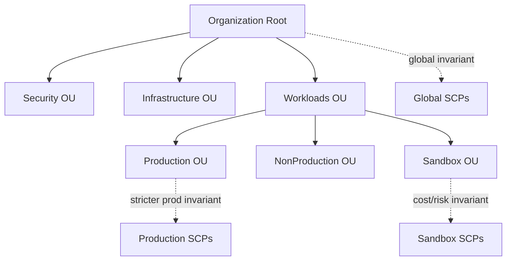
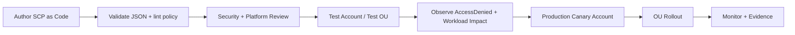

# Part 013 — SCP Design Patterns

Part sebelumnya membangun prinsip dasar SCP:

> IAM grants. SCP bounds.

Sekarang kita masuk ke bagian yang lebih dekat ke production: **bagaimana mendesain SCP yang benar-benar bisa dipakai di organisasi besar tanpa membuat cloud platform menjadi rapuh**.

Kesalahan umum engineer saat pertama kali memakai SCP adalah memperlakukannya seperti IAM policy biasa.

Itu keliru.

SCP bukan tempat untuk menulis permission detail setiap role. SCP adalah tempat untuk menulis **batas organisasi**.

SCP yang baik tidak banyak. SCP yang baik tegas, kecil, mudah dites, bisa dijelaskan, bisa diaudit, dan melindungi invariant penting.

SCP yang buruk biasanya terlihat seperti ini:

- terlalu panjang,
- mencoba menggantikan IAM,
- penuh exception individual,
- dipasang langsung di root organization tanpa staged rollout,
- tidak punya break-glass path,
- tidak punya test account,
- tidak punya pemilik,
- tidak bisa dijelaskan dalam satu kalimat,
- tidak punya rollback plan,
- membuat platform team takut melakukan perubahan.

Internal engineering handbook yang matang biasanya memperlakukan SCP sebagai **kernel-level guardrail**.

Kalau IAM adalah aplikasi user-space, SCP adalah syscall filter organisasi.

Ia tidak perlu tahu semua detail aplikasi. Ia hanya perlu memastikan syscall berbahaya tertentu tidak pernah lewat.

---

## 1. Tujuan Utama SCP Design Pattern

SCP pattern dipakai untuk melindungi hal-hal yang secara organisasi tidak boleh bergantung pada disiplin manual tiap account.

Contoh:

```text
Tidak boleh ada orang di workload account yang bisa mematikan CloudTrail organisasi.
```

Ini bukan preferensi.

Ini invariant audit.

Contoh lain:

```text
Tidak boleh ada workload team yang bisa keluar dari AWS Organization.
```

Ini bukan sekadar policy.

Ini boundary governance.

Contoh lain:

```text
Tidak boleh ada resource production dibuat di region yang belum disetujui.
```

Ini bukan soal kerapian.

Ini bisa terkait data residency, incident readiness, monitoring coverage, dan cost governance.

SCP pattern yang baik selalu berawal dari kalimat invariant.

Bukan dari JSON.

Urutan berpikirnya:

```text
Risk → Invariant → Scope → Exception → Policy → Test → Rollout → Evidence
```

Bukan:

```text
Copy JSON dari internet → attach ke root → berharap aman
```

---

## 2. Prinsip Desain SCP Yang Layak Production

Ada delapan prinsip yang harus dipegang.

### 2.1 SCP Harus Melindungi Boundary, Bukan Mengatur Workflow Harian

Jangan pakai SCP untuk permission detail seperti:

```text
Developer A boleh read S3 bucket X.
Developer B boleh write DynamoDB table Y.
```

Itu domain IAM, IAM Identity Center permission set, permission boundary, atau resource policy.

SCP sebaiknya menjawab pertanyaan seperti:

```text
Apakah siapa pun di account ini boleh menonaktifkan audit?
Apakah account ini boleh memakai region tertentu?
Apakah workload admin boleh menghapus KMS key logging?
Apakah account ini boleh sharing resource ke luar organisasi?
```

SCP adalah policy untuk **kelas risiko**, bukan untuk tiket akses individual.

### 2.2 Prefer Explicit Deny Untuk Invariant

Dalam organisasi AWS modern, strategi SCP yang paling umum adalah deny-list guardrail.

Secara konseptual:

```text
FullAWSAccess attached sebagai allow ceiling default.
SCP tambahan berisi Deny terhadap hal yang tidak boleh terjadi.
```

Dengan pendekatan ini, IAM tetap mengatur izin harian, sementara SCP memblokir aksi berisiko tinggi.

Contoh mental model:

```text
IAM says: Admin role may do everything.
SCP says: Everything except disabling audit, leaving org, using forbidden regions, and deleting protected baseline resources.
```

### 2.3 SCP Harus Punya Scope Yang Jelas

SCP bisa ditempel di:

- organization root,
- OU,
- account individual.

Jangan otomatis memilih root.

Root-level SCP cocok untuk invariant global yang benar-benar berlaku untuk semua member account.

OU-level SCP cocok untuk invariant domain tertentu.

Account-level SCP cocok untuk exception atau eksperimen sementara, tetapi jangan jadikan account-level attachment sebagai desain permanen yang berantakan.

Contoh:

| Invariant | Scope Yang Masuk Akal |
|---|---|
| Member account tidak boleh leave organization | Root |
| Prod hanya boleh region tertentu | Production OU |
| Sandbox tidak boleh expensive GPU instance | Sandbox OU |
| Regulated workload tidak boleh public S3 | Regulated OU |
| Security tooling account tidak boleh menghapus detector | Security OU |

### 2.4 Exception Harus Menjadi Bagian Dari Desain

Policy tanpa exception path akan dipaksa dilanggar.

Exception bukan kelemahan.

Exception adalah safety valve yang didesain.

Yang buruk adalah exception liar.

Exception yang sehat punya:

- owner,
- alasan,
- durasi,
- scope,
- approval,
- CloudTrail evidence,
- expiry,
- review period.

Contoh exception sehat:

```text
Role: arn:aws:iam::*:role/security-break-glass-region-expansion
Purpose: temporary region enablement for disaster recovery test
Valid until: 2026-09-30
Approval: cloud-platform-architecture-board
Detection: EventBridge rule + Security Hub note
```

### 2.5 SCP Harus Bisa Diobservasi

SCP bukan hanya prevent control.

SCP juga menghasilkan signal.

Ketika action diblokir, CloudTrail bisa menunjukkan `AccessDenied` atau authorization failure. Dari sana, security team bisa membaca:

- siapa mencoba aksi itu,
- dari account mana,
- lewat user agent apa,
- lewat source IP mana,
- apakah role session berasal dari IAM Identity Center,
- apakah upaya itu legitimate workflow atau indikasi compromise.

SCP rollout yang matang selalu disertai query CloudTrail.

### 2.6 Jangan Membuat SCP Yang Tidak Bisa Dioperasikan

SCP terlalu agresif bisa merusak:

- CloudFormation deployment,
- Control Tower baseline,
- AWS service-linked role,
- AWS managed service integration,
- incident response,
- backup restore,
- disaster recovery,
- support operation,
- onboarding account baru.

SCP yang tampak “aman” tetapi menghalangi recovery adalah anti-pattern.

Security control tidak boleh mengunci pintu darurat.

### 2.7 Gunakan Progressive Rollout

Urutan aman:

```text
Draft policy
→ validate syntax
→ simulate dengan IAM Access Analyzer/policy checks bila relevan
→ attach ke test account
→ observe CloudTrail AccessDenied
→ attach ke non-prod OU kecil
→ attach ke production canary account
→ attach ke OU production
→ baru pertimbangkan root/global
```

Jangan attach policy baru langsung ke root kecuali dampaknya sudah dipahami.

### 2.8 Setiap SCP Harus Bisa Dijelaskan Dengan Satu Kalimat

Jika sebuah SCP tidak bisa dijelaskan dalam satu kalimat, kemungkinan SCP itu mengandung terlalu banyak tanggung jawab.

Contoh bagus:

```text
Deny attempts to disable organization-level audit logging except from approved security administration roles.
```

Contoh buruk:

```text
General security guardrail for many things.
```

SCP harus kecil dan tajam.

---

## 3. Layering SCP Dalam OU

Bayangkan struktur organisasi seperti ini:



Layering policy yang sehat:

```text
Root SCP     = invariant yang benar-benar universal
OU SCP       = invariant untuk kelas account tertentu
Account SCP  = temporary exception/canary, bukan desain utama
```

Contoh layering:

| Layer | Contoh SCP |
|---|---|
| Root | Deny member account leaving organization. Deny disabling baseline audit. |
| Security OU | Deny deleting security tooling infrastructure. |
| Infrastructure OU | Deny changes to shared network/logging without platform role. |
| Production OU | Deny unapproved regions. Deny public exposure actions. |
| Sandbox OU | Deny expensive instance families. Deny marketplace subscription. |

Yang perlu diperhatikan: explicit deny di parent akan berlaku ke child. Jika root sudah deny sebuah action, child OU tidak bisa “allow ulang”.

Ini penting.

Jangan taruh deny yang butuh exception luas di root.

---

## 4. Pattern 1 — Deny Member Account Leaving Organization

### 4.1 Risk

Jika workload account bisa keluar dari organization, maka organisasi bisa kehilangan:

- SCP enforcement,
- RCP enforcement,
- centralized CloudTrail/Config coverage,
- delegated security administration,
- consolidated billing visibility,
- security service aggregation,
- account lifecycle governance.

Account leaving organization adalah event besar.

Untuk regulated environment, ini bisa berarti account keluar dari compliance boundary.

### 4.2 Invariant

```text
Tidak ada principal di member account yang boleh mengeluarkan account dari AWS Organization.
```

### 4.3 Example SCP

```json
{
  "Version": "2012-10-17",
  "Statement": [
    {
      "Sid": "DenyLeavingOrganization",
      "Effect": "Deny",
      "Action": [
        "organizations:LeaveOrganization"
      ],
      "Resource": "*"
    }
  ]
}
```

### 4.4 Scope

Biasanya root-level cocok, karena hampir semua member account tidak seharusnya keluar sendiri.

### 4.5 Exception

Exception sebaiknya bukan IAM exception biasa di member account. Proses account offboarding harus dikendalikan dari management account atau delegated account lifecycle pipeline.

### 4.6 Failure Mode

Jika organisasi memakai proses M&A, account migration, atau legal separation, policy ini perlu operational runbook.

Jangan tunggu sampai hari migrasi baru sadar `LeaveOrganization` diblokir.

---

## 5. Pattern 2 — Deny Root User Usage For Member Accounts

### 5.1 Risk

Root user member account punya karakteristik berbahaya:

- tidak scoped seperti role biasa,
- sering jarang dipakai sehingga monitoring lemah,
- jika credential bocor, dampaknya besar,
- bisa melakukan action yang tidak semua IAM principal bisa lakukan,
- sulit diselaraskan dengan least privilege workflow.

Dalam environment matang, root user hanya dipakai untuk tindakan khusus yang memang memerlukan root.

### 5.2 Invariant

```text
Root user member account tidak boleh dipakai untuk operasi sehari-hari.
```

### 5.3 Example SCP

```json
{
  "Version": "2012-10-17",
  "Statement": [
    {
      "Sid": "DenyRootUserActions",
      "Effect": "Deny",
      "Action": "*",
      "Resource": "*",
      "Condition": {
        "StringLike": {
          "aws:PrincipalArn": "arn:aws:iam::*:root"
        }
      }
    }
  ]
}
```

### 5.4 Important Caveat

Jangan memakai pattern ini secara buta.

Ada operasi tertentu yang historically atau operationally mungkin membutuhkan root account. Karena itu, organisasi perlu root access runbook:

- root MFA enabled,
- credential vaulting,
- dual control,
- approval,
- CloudTrail detection,
- time-bound execution,
- post-action review.

SCP deny root harus diuji terhadap kebutuhan nyata organisasi.

Jika root benar-benar harus dipakai untuk emergency path, desain exception harus sangat sempit.

### 5.5 Better Operating Model

Lebih baik daripada “root tidak pernah dipakai” adalah:

```text
Root credentials exist, are locked, monitored, and only usable through emergency governance.
```

Security bukan hanya deny.

Security adalah controlled access.

---

## 6. Pattern 3 — Deny Disabling CloudTrail

### 6.1 Risk

CloudTrail adalah sumber utama untuk menjawab:

```text
Who did what, when, from where, against which resource, with what result?
```

Jika attacker atau insider bisa mematikan CloudTrail, maka organisasi kehilangan evidence.

Mematikan audit trail sering menjadi langkah dalam attack chain.

### 6.2 Invariant

```text
Workload account admin tidak boleh menonaktifkan, menghapus, atau merusak CloudTrail baseline.
```

### 6.3 Example SCP

```json
{
  "Version": "2012-10-17",
  "Statement": [
    {
      "Sid": "DenyCloudTrailTampering",
      "Effect": "Deny",
      "Action": [
        "cloudtrail:DeleteTrail",
        "cloudtrail:StopLogging",
        "cloudtrail:UpdateTrail",
        "cloudtrail:PutEventSelectors",
        "cloudtrail:PutInsightSelectors"
      ],
      "Resource": "*",
      "Condition": {
        "ArnNotLike": {
          "aws:PrincipalArn": [
            "arn:aws:iam::*:role/AWSControlTowerExecution",
            "arn:aws:iam::*:role/security-audit-admin-*",
            "arn:aws:iam::*:role/org-cloudtrail-admin-*"
          ]
        }
      }
    }
  ]
}
```

### 6.4 Design Notes

Jangan hanya deny `StopLogging`.

Audit tampering bisa terjadi lewat beberapa jalur:

- delete trail,
- update trail destination,
- change event selector,
- change insight selector,
- modify log bucket policy,
- modify KMS key used by trail,
- disable organization trail integration.

SCP CloudTrail perlu dilengkapi dengan controls lain:

- S3 bucket policy di log archive account,
- KMS key policy untuk CloudTrail log encryption,
- AWS Config rules,
- EventBridge detection,
- Security Hub controls,
- CloudTrail log file validation,
- restricted delegated admin.

### 6.5 Failure Mode

Jika exception role terlalu luas, attacker yang memperoleh role itu bisa tetap mematikan audit.

Jika exception role terlalu sempit, platform team bisa gagal memperbaiki trail ketika ada migration atau reconfiguration.

Prinsipnya:

```text
Exception role must be rare, monitored, and operationally documented.
```

---

## 7. Pattern 4 — Deny Disabling AWS Config

### 7.1 Risk

CloudTrail menjawab “action apa yang terjadi”.

AWS Config menjawab “state resource berubah menjadi apa”.

Jika Config dimatikan, organisasi kehilangan configuration timeline dan compliance visibility.

### 7.2 Invariant

```text
Workload admin tidak boleh menghentikan configuration recording atau menghapus compliance baseline.
```

### 7.3 Example SCP

```json
{
  "Version": "2012-10-17",
  "Statement": [
    {
      "Sid": "DenyConfigTampering",
      "Effect": "Deny",
      "Action": [
        "config:DeleteConfigRule",
        "config:DeleteConfigurationRecorder",
        "config:DeleteDeliveryChannel",
        "config:DeleteConformancePack",
        "config:DeleteOrganizationConfigRule",
        "config:DeleteOrganizationConformancePack",
        "config:StopConfigurationRecorder"
      ],
      "Resource": "*",
      "Condition": {
        "ArnNotLike": {
          "aws:PrincipalArn": [
            "arn:aws:iam::*:role/AWSControlTowerExecution",
            "arn:aws:iam::*:role/security-config-admin-*"
          ]
        }
      }
    }
  ]
}
```

### 7.4 What This Protects

Policy ini melindungi control evidence.

Bukan hanya security posture.

Tanpa Config, audit akan sulit membuktikan kapan resource menjadi non-compliant dan siapa yang mengubahnya.

### 7.5 Edge Case

AWS Config punya regional behavior. Pastikan deployment region, recorder coverage, dan aggregation strategy sudah jelas sebelum SCP dipasang.

SCP tidak memperbaiki Config yang salah desain.

SCP hanya mencegah Config dirusak setelah baseline benar.

---

## 8. Pattern 5 — Deny Disabling GuardDuty, Security Hub, Inspector, Macie

### 8.1 Risk

Security service seperti GuardDuty, Security Hub, Inspector, dan Macie membentuk detection/posture layer.

Jika workload admin bisa menonaktifkannya, attacker bisa mengurangi visibility sebelum melakukan aksi lanjutan.

### 8.2 Invariant

```text
Security detection and posture services are centrally managed and cannot be disabled by workload accounts.
```

### 8.3 Example SCP

```json
{
  "Version": "2012-10-17",
  "Statement": [
    {
      "Sid": "DenySecurityServiceTampering",
      "Effect": "Deny",
      "Action": [
        "guardduty:DeleteDetector",
        "guardduty:DisassociateFromMasterAccount",
        "guardduty:DisassociateMembers",
        "guardduty:StopMonitoringMembers",
        "guardduty:UpdateDetector",
        "securityhub:DisableSecurityHub",
        "securityhub:BatchDisableStandards",
        "securityhub:DeleteMembers",
        "securityhub:DisassociateFromAdministratorAccount",
        "inspector2:Disable",
        "inspector2:DisassociateMember",
        "macie2:DisableMacie",
        "macie2:DisableOrganizationAdminAccount",
        "macie2:DisassociateFromAdministratorAccount"
      ],
      "Resource": "*",
      "Condition": {
        "ArnNotLike": {
          "aws:PrincipalArn": [
            "arn:aws:iam::*:role/security-service-admin-*",
            "arn:aws:iam::*:role/AWSControlTowerExecution"
          ]
        }
      }
    }
  ]
}
```

### 8.4 Design Notes

Jangan terlalu cepat memasukkan semua action security service ke dalam Deny.

Beberapa action update bisa legitimate:

- update finding suppression,
- update standards,
- update member configuration,
- update delegated admin,
- configure organization settings.

Bedakan:

```text
Disable / delete / disassociate = high-risk
Update / tune / configure = perlu role khusus, bukan selalu deny global
```

### 8.5 Failure Mode

Security tooling yang belum siap bisa menghasilkan alert noise. Jika tim workload tidak punya jalur suppress/exception yang benar, mereka akan meminta permission bypass.

Jadi SCP harus dipasangkan dengan finding lifecycle:

```text
Finding → Triage → Owner → SLA → Exception → Suppression with expiry → Evidence
```

Ini akan dibahas lebih dalam di Part 046.

---

## 9. Pattern 6 — Region Restriction

### 9.1 Risk

Region restriction sering disalahpahami sebagai cost control saja.

Sebenarnya region restriction bisa melindungi:

- data residency,
- incident response readiness,
- monitoring coverage,
- backup/DR design,
- encryption/key management pattern,
- legal/compliance scope,
- latency and dependency assumptions,
- service availability consistency.

Jika workload bebas memakai region apa pun, maka platform team harus siap mengamankan semuanya.

Itu jarang benar.

### 9.2 Invariant

```text
Production workload hanya boleh membuat/mengubah resource di approved regions.
```

### 9.3 Example SCP

```json
{
  "Version": "2012-10-17",
  "Statement": [
    {
      "Sid": "DenyUnapprovedRegions",
      "Effect": "Deny",
      "NotAction": [
        "a4b:*",
        "acm:*",
        "aws-marketplace-management:*",
        "aws-marketplace:*",
        "aws-portal:*",
        "budgets:*",
        "ce:*",
        "chime:*",
        "cloudfront:*",
        "config:*",
        "cur:*",
        "directconnect:*",
        "ec2:DescribeRegions",
        "ec2:DescribeTransitGateways",
        "ec2:DescribeVpnGateways",
        "fms:*",
        "globalaccelerator:*",
        "health:*",
        "iam:*",
        "importexport:*",
        "kms:*",
        "mobileanalytics:*",
        "networkmanager:*",
        "organizations:*",
        "pricing:*",
        "route53:*",
        "route53domains:*",
        "s3:GetAccountPublic*",
        "s3:ListAllMyBuckets",
        "s3:PutAccountPublic*",
        "shield:*",
        "sts:*",
        "support:*",
        "trustedadvisor:*",
        "waf-regional:*",
        "waf:*",
        "wafv2:*",
        "wellarchitected:*"
      ],
      "Resource": "*",
      "Condition": {
        "StringNotEquals": {
          "aws:RequestedRegion": [
            "ap-southeast-1",
            "ap-southeast-3"
          ]
        },
        "ArnNotLike": {
          "aws:PrincipalArn": [
            "arn:aws:iam::*:role/security-break-glass-region-*",
            "arn:aws:iam::*:role/platform-region-admin-*"
          ]
        }
      }
    }
  ]
}
```

### 9.4 Why `NotAction` Exists Here

Beberapa AWS services bersifat global atau punya control plane khusus. Jika region deny terlalu polos, console dan service global bisa rusak.

Contoh layanan global/khusus:

- IAM,
- Route 53,
- CloudFront,
- Organizations,
- Support,
- Billing/Cost Explorer,
- AWS WAF global scope,
- beberapa listing/read-only action.

Karena itu region deny sering memakai `NotAction` untuk mengecualikan layanan global atau action yang dibutuhkan agar akun tetap bisa dikelola.

### 9.5 Failure Mode

Region deny bisa memblokir:

- disaster recovery test,
- backup restore ke region lain,
- global service integration,
- AWS service yang memerlukan call ke specific home region,
- Control Tower atau security service baseline,
- new AWS region adoption.

Karena itu region deny harus punya:

- approved region registry,
- exception role,
- DR mode,
- rollout test,
- automation untuk update policy,
- komunikasi ke workload team.

### 9.6 Good Operating Question

Sebelum membuat region deny, jawab ini:

```text
Apakah semua mandatory security services sudah aktif di approved regions?
Apakah log archive menerima event dari semua approved regions?
Apakah break-glass flow bisa berjalan jika region utama bermasalah?
Apakah backup/restore region termasuk allowed?
Apakah global services sudah dikecualikan secara benar?
```

---

## 10. Pattern 7 — Deny Public S3 Exposure Controls Tampering

### 10.1 Risk

S3 sering menjadi titik data exposure karena resource policy, ACL, bucket public access block, dan cross-account sharing.

SCP tidak selalu menjadi satu-satunya cara terbaik untuk mengontrol S3 exposure. RCP, bucket policy, S3 Block Public Access, IAM Access Analyzer, Macie, dan Config rules juga penting.

Tetapi SCP bisa melindungi agar baseline public access block tidak dimatikan.

### 10.2 Invariant

```text
Workload admin tidak boleh menonaktifkan account-level atau bucket-level S3 public access protection tanpa approved path.
```

### 10.3 Example SCP

```json
{
  "Version": "2012-10-17",
  "Statement": [
    {
      "Sid": "DenyS3PublicAccessBlockTampering",
      "Effect": "Deny",
      "Action": [
        "s3:DeleteAccountPublicAccessBlock",
        "s3:PutAccountPublicAccessBlock",
        "s3:DeleteBucketPublicAccessBlock",
        "s3:PutBucketPublicAccessBlock"
      ],
      "Resource": "*",
      "Condition": {
        "ArnNotLike": {
          "aws:PrincipalArn": [
            "arn:aws:iam::*:role/security-data-protection-admin-*",
            "arn:aws:iam::*:role/platform-storage-admin-*"
          ]
        }
      }
    }
  ]
}
```

### 10.4 Important Nuance

`PutBucketPublicAccessBlock` bisa dipakai untuk memperketat maupun melonggarkan konfigurasi. SCP di atas menolak semua perubahan kecuali dari role khusus.

Alternatif yang lebih halus adalah pakai preventive control lain atau IaC guardrail yang memastikan nilai tetap strict.

Dalam organisasi besar, pattern umum:

```text
SCP protects who can change public access controls.
Config detects drift.
Automation restores strict setting.
Access Analyzer detects external sharing.
Macie detects sensitive data.
RCP constrains external access at resource side.
```

---

## 11. Pattern 8 — Deny IAM Privilege Escalation Primitives

### 11.1 Risk

Di banyak AWS compromise, attacker tidak langsung punya admin.

Mereka punya permission kecil, lalu mencari privilege escalation path.

Contoh action berbahaya:

- `iam:CreatePolicyVersion`,
- `iam:SetDefaultPolicyVersion`,
- `iam:AttachRolePolicy`,
- `iam:PutRolePolicy`,
- `iam:UpdateAssumeRolePolicy`,
- `iam:PassRole`,
- `lambda:CreateFunction` dengan privileged role,
- `cloudformation:CreateStack` dengan privileged execution role,
- `glue:CreateDevEndpoint`,
- `ec2:RunInstances` dengan instance profile admin,
- `ecs:RunTask` dengan task role privileged.

Tidak semua ini harus dideny dengan SCP universal. Tetapi beberapa organisasi memilih membatasi IAM mutation untuk workload accounts.

### 11.2 Invariant

```text
Only approved identity administration roles may mutate IAM permissions and trust boundaries.
```

### 11.3 Example SCP

```json
{
  "Version": "2012-10-17",
  "Statement": [
    {
      "Sid": "DenyIAMPrivilegeMutationExceptIdentityAdmins",
      "Effect": "Deny",
      "Action": [
        "iam:AttachGroupPolicy",
        "iam:AttachRolePolicy",
        "iam:AttachUserPolicy",
        "iam:CreateAccessKey",
        "iam:CreateLoginProfile",
        "iam:CreatePolicy",
        "iam:CreatePolicyVersion",
        "iam:CreateRole",
        "iam:DeleteRolePermissionsBoundary",
        "iam:DetachRolePolicy",
        "iam:PassRole",
        "iam:PutGroupPolicy",
        "iam:PutRolePermissionsBoundary",
        "iam:PutRolePolicy",
        "iam:PutUserPolicy",
        "iam:SetDefaultPolicyVersion",
        "iam:UpdateAssumeRolePolicy"
      ],
      "Resource": "*",
      "Condition": {
        "ArnNotLike": {
          "aws:PrincipalArn": [
            "arn:aws:iam::*:role/identity-admin-*",
            "arn:aws:iam::*:role/platform-deployment-admin-*",
            "arn:aws:iam::*:role/AWSControlTowerExecution"
          ]
        }
      }
    }
  ]
}
```

### 11.4 Why This Is Dangerous If Overused

Modern delivery pipelines sering perlu membuat role untuk Lambda, ECS, Step Functions, EventBridge, CodeBuild, dan service lain.

Jika SCP terlalu keras, deployment akan rusak.

Karena itu pattern ini biasanya cocok jika organisasi sudah punya:

- centralized permission boundary,
- role vending pipeline,
- IaC modules approved,
- platform deployment role,
- separation antara app deploy dan IAM mutation,
- exception flow jelas.

Jika belum punya itu, SCP ini bisa menyebabkan shadow process.

Team akan cari jalan lain.

### 11.5 Safer Variant

Daripada deny semua IAM mutation, batasi hanya action privilege escalation paling berbahaya:

```json
{
  "Version": "2012-10-17",
  "Statement": [
    {
      "Sid": "DenyPolicyVersionEscalation",
      "Effect": "Deny",
      "Action": [
        "iam:CreatePolicyVersion",
        "iam:SetDefaultPolicyVersion",
        "iam:DeletePolicyVersion"
      ],
      "Resource": "*",
      "Condition": {
        "ArnNotLike": {
          "aws:PrincipalArn": "arn:aws:iam::*:role/identity-admin-*"
        }
      }
    }
  ]
}
```

Mulai dari narrow deny.

Jangan langsung mencoba menjadi IAM governance platform melalui SCP.

---

## 12. Pattern 9 — Require Permission Boundary For IAM Role Creation

### 12.1 Risk

Jika workload team boleh membuat IAM role tanpa permission boundary, mereka bisa membuat role baru yang lebih luas daripada intended delegation model.

Permission boundary membantu platform team mendelegasikan IAM role creation tanpa melepas kontrol penuh.

### 12.2 Invariant

```text
Any IAM role created by delegated teams must include the approved permission boundary.
```

### 12.3 Example SCP

```json
{
  "Version": "2012-10-17",
  "Statement": [
    {
      "Sid": "DenyCreateRoleWithoutApprovedPermissionBoundary",
      "Effect": "Deny",
      "Action": [
        "iam:CreateRole",
        "iam:PutRolePermissionsBoundary"
      ],
      "Resource": "*",
      "Condition": {
        "StringNotEquals": {
          "iam:PermissionsBoundary": "arn:aws:iam::*:policy/ApprovedWorkloadPermissionBoundary"
        },
        "ArnNotLike": {
          "aws:PrincipalArn": [
            "arn:aws:iam::*:role/identity-admin-*",
            "arn:aws:iam::*:role/platform-deployment-admin-*"
          ]
        }
      }
    },
    {
      "Sid": "DenyRemovingPermissionBoundary",
      "Effect": "Deny",
      "Action": [
        "iam:DeleteRolePermissionsBoundary"
      ],
      "Resource": "*",
      "Condition": {
        "ArnNotLike": {
          "aws:PrincipalArn": [
            "arn:aws:iam::*:role/identity-admin-*"
          ]
        }
      }
    }
  ]
}
```

### 12.4 Design Notes

This is a strong pattern.

Tetapi butuh desain IAM yang matang.

Permission boundary harus:

- tidak terlalu longgar,
- tidak terlalu sempit,
- versioned,
- deployed consistently,
- dilindungi dari deletion/modification,
- dipahami oleh pipeline.

Kalau boundary policy tidak tersedia di account saat role dibuat, deployment akan gagal.

Account bootstrap harus memastikan boundary policy sudah ada sebelum workload pipeline berjalan.

### 12.5 Common Failure

SCP mewajibkan boundary, tetapi CloudFormation stack mencoba membuat role tanpa boundary.

Akibatnya deployment gagal dengan error IAM yang sulit dipahami developer.

Solusinya bukan melepas SCP.

Solusinya adalah standard IaC module yang otomatis menambahkan boundary.

---

## 13. Pattern 10 — Protect Baseline Infrastructure Roles

### 13.1 Risk

Control Tower, security baseline, log forwarding, monitoring agent, patch manager, dan backup automation biasanya membuat role penting di member accounts.

Jika workload admin bisa menghapus atau mengubah role baseline, governance bisa rusak.

### 13.2 Invariant

```text
Baseline roles created by organization/platform/security automation cannot be modified by workload administrators.
```

### 13.3 Example SCP

```json
{
  "Version": "2012-10-17",
  "Statement": [
    {
      "Sid": "DenyTamperingWithBaselineRoles",
      "Effect": "Deny",
      "Action": [
        "iam:DeleteRole",
        "iam:DeleteRolePolicy",
        "iam:DetachRolePolicy",
        "iam:PutRolePolicy",
        "iam:AttachRolePolicy",
        "iam:UpdateAssumeRolePolicy",
        "iam:UpdateRole",
        "iam:UpdateRoleDescription",
        "iam:DeleteRolePermissionsBoundary"
      ],
      "Resource": [
        "arn:aws:iam::*:role/AWSControlTowerExecution",
        "arn:aws:iam::*:role/security-*",
        "arn:aws:iam::*:role/platform-baseline-*",
        "arn:aws:iam::*:role/log-forwarder-*",
        "arn:aws:iam::*:role/backup-*"
      ],
      "Condition": {
        "ArnNotLike": {
          "aws:PrincipalArn": [
            "arn:aws:iam::*:role/org-baseline-admin-*",
            "arn:aws:iam::*:role/AWSControlTowerExecution"
          ]
        }
      }
    }
  ]
}
```

### 13.4 Naming Convention Matters

SCP sering bergantung pada ARN pattern.

Jika naming convention kacau, policy menjadi kacau.

Contoh naming sehat:

```text
security-guardduty-admin
security-config-recorder
platform-baseline-deployer
platform-patch-manager
backup-vault-admin
```

Contoh naming buruk:

```text
role1
admin-new
temporary-prod-admin
john-test-role
```

Security architecture sering gagal bukan karena kurang kriptografi, tetapi karena naming dan ownership tidak disiplin.

---

## 14. Pattern 11 — Deny Deleting Log Archive Buckets And KMS Keys

### 14.1 Risk

Centralized log archive adalah memory organisasi.

Jika log bucket, log prefix, atau KMS key bisa dihapus/dimodifikasi sembarangan, audit evidence hilang.

### 14.2 Invariant

```text
Audit evidence storage cannot be deleted, overwritten, or made unreadable by workload administrators.
```

### 14.3 Example SCP For Log Archive Account Or OU

```json
{
  "Version": "2012-10-17",
  "Statement": [
    {
      "Sid": "DenyLogArchiveBucketDeletion",
      "Effect": "Deny",
      "Action": [
        "s3:DeleteBucket",
        "s3:DeleteBucketPolicy",
        "s3:DeleteBucketEncryption",
        "s3:DeleteObject",
        "s3:DeleteObjectVersion",
        "s3:PutBucketPolicy",
        "s3:PutLifecycleConfiguration",
        "s3:PutBucketAcl",
        "s3:PutObjectAcl"
      ],
      "Resource": [
        "arn:aws:s3:::org-log-archive-*",
        "arn:aws:s3:::org-log-archive-*/*"
      ],
      "Condition": {
        "ArnNotLike": {
          "aws:PrincipalArn": [
            "arn:aws:iam::*:role/log-archive-admin-*",
            "arn:aws:iam::*:role/security-audit-admin-*"
          ]
        }
      }
    },
    {
      "Sid": "DenyLogKmsKeyDestruction",
      "Effect": "Deny",
      "Action": [
        "kms:DisableKey",
        "kms:ScheduleKeyDeletion",
        "kms:DeleteAlias",
        "kms:PutKeyPolicy"
      ],
      "Resource": "*",
      "Condition": {
        "ForAnyValue:StringLike": {
          "aws:ResourceTag/Purpose": "log-archive"
        },
        "ArnNotLike": {
          "aws:PrincipalArn": [
            "arn:aws:iam::*:role/log-archive-admin-*",
            "arn:aws:iam::*:role/security-kms-admin-*"
          ]
        }
      }
    }
  ]
}
```

### 14.4 Defense In Depth

SCP saja tidak cukup.

Log archive harus memakai:

- S3 Object Lock jika sesuai kebutuhan immutability,
- bucket versioning,
- MFA delete jika applicable,
- KMS key separation,
- restrictive bucket policy,
- lifecycle retention policy,
- CloudTrail log validation,
- access logging/CloudTrail data event untuk sensitive path,
- separate log archive account,
- minimal human access.

### 14.5 Failure Mode

SCP yang memblokir `PutLifecycleConfiguration` bisa menghambat retention policy update.

Karena itu log retention change harus punya controlled admin role dan review process.

Security evidence harus immutable terhadap attacker, tetapi tetap governable oleh authorized process.

---

## 15. Pattern 12 — Deny Disabling Backup Protection

### 15.1 Risk

Backup bukan hanya operational feature.

Backup adalah recovery control.

Dalam ransomware atau destructive insider scenario, attacker mungkin mencoba:

- delete backup vault,
- delete recovery point,
- remove backup plan,
- disable backup rule,
- modify vault access policy,
- remove vault lock configuration.

### 15.2 Invariant

```text
Production backup protection cannot be removed by workload administrators.
```

### 15.3 Example SCP

```json
{
  "Version": "2012-10-17",
  "Statement": [
    {
      "Sid": "DenyBackupTampering",
      "Effect": "Deny",
      "Action": [
        "backup:DeleteBackupPlan",
        "backup:DeleteBackupVault",
        "backup:DeleteBackupVaultAccessPolicy",
        "backup:DeleteBackupVaultLockConfiguration",
        "backup:DeleteRecoveryPoint",
        "backup:PutBackupVaultAccessPolicy",
        "backup:StartBackupJob",
        "backup:StopBackupJob",
        "backup:UpdateBackupPlan"
      ],
      "Resource": "*",
      "Condition": {
        "ArnNotLike": {
          "aws:PrincipalArn": [
            "arn:aws:iam::*:role/backup-admin-*",
            "arn:aws:iam::*:role/security-resilience-admin-*"
          ]
        }
      }
    }
  ]
}
```

### 15.4 Be Careful With `StartBackupJob`

Denying `StartBackupJob` may be too strict for some organizations. Sometimes workload teams need to trigger on-demand backups before risky changes.

A better design might be:

```text
Allow workload team to start backup.
Deny workload team from deleting vault/recovery point or weakening vault policy.
```

This is why SCP must map to operating model.

Do not cargo-cult policy statements.

---

## 16. Pattern 13 — Deny Expensive Resources In Sandbox

### 16.1 Risk

Sandbox accounts are necessary for learning and experimentation.

But sandbox accounts can become cost explosion zones.

SCP can enforce cost guardrail where IAM alone is not enough.

### 16.2 Invariant

```text
Sandbox accounts cannot launch high-cost instance families or create expensive managed resources.
```

### 16.3 Example SCP

```json
{
  "Version": "2012-10-17",
  "Statement": [
    {
      "Sid": "DenyExpensiveEC2InstanceTypesInSandbox",
      "Effect": "Deny",
      "Action": [
        "ec2:RunInstances"
      ],
      "Resource": "arn:aws:ec2:*:*:instance/*",
      "Condition": {
        "ForAnyValue:StringLike": {
          "ec2:InstanceType": [
            "p*.*",
            "g*.*",
            "trn*.*",
            "inf*.*",
            "x*.*",
            "u*.*",
            "hpc*.*"
          ]
        }
      }
    }
  ]
}
```

### 16.4 Scope

Ini cocok untuk Sandbox OU.

Jangan tempel di root.

Production ML workload mungkin legitimate memakai GPU atau Trainium/Inferentia.

### 16.5 Complementary Controls

Untuk cost, SCP perlu dilengkapi:

- AWS Budgets,
- Cost Anomaly Detection,
- quota management,
- account vending constraints,
- tag policies,
- scheduled cleanup,
- service catalog atau curated templates.

SCP mencegah aksi ekstrem.

Ia tidak menggantikan FinOps.

---

## 17. Pattern 14 — Deny Marketplace Subscription In Workload Accounts

### 17.1 Risk

AWS Marketplace bisa menjadi jalur pengadaan software yang tidak melewati review security/legal/procurement.

Untuk organisasi regulated, ini bisa bermasalah.

### 17.2 Invariant

```text
Marketplace subscription must go through approved procurement path.
```

### 17.3 Example SCP

```json
{
  "Version": "2012-10-17",
  "Statement": [
    {
      "Sid": "DenyMarketplaceSubscriptions",
      "Effect": "Deny",
      "Action": [
        "aws-marketplace:Subscribe",
        "aws-marketplace:Unsubscribe",
        "aws-marketplace:AcceptAgreementRequest",
        "aws-marketplace:CreateAgreementRequest"
      ],
      "Resource": "*",
      "Condition": {
        "ArnNotLike": {
          "aws:PrincipalArn": [
            "arn:aws:iam::*:role/procurement-admin-*",
            "arn:aws:iam::*:role/platform-marketplace-admin-*"
          ]
        }
      }
    }
  ]
}
```

### 17.4 Design Notes

Ini bukan hanya cost control.

Ini supply-chain control.

Marketplace product bisa membawa:

- AMI,
- container image,
- SaaS integration,
- data processing service,
- third-party agent,
- license terms.

Semua itu harus masuk vendor risk review.

---

## 18. Pattern 15 — Deny CloudFormation StackSet Baseline Tampering

### 18.1 Risk

Banyak organisasi memakai CloudFormation StackSets atau Control Tower baseline untuk deploy role, Config recorder, security agents, logging forwarders, atau account bootstrap resources.

Jika workload admin bisa mengubah baseline stack, governance drift terjadi.

### 18.2 Invariant

```text
Organization baseline stacks cannot be modified outside the platform/security deployment pipeline.
```

### 18.3 Example SCP

```json
{
  "Version": "2012-10-17",
  "Statement": [
    {
      "Sid": "DenyBaselineCloudFormationTampering",
      "Effect": "Deny",
      "Action": [
        "cloudformation:DeleteStack",
        "cloudformation:UpdateStack",
        "cloudformation:CancelUpdateStack",
        "cloudformation:DeleteStackSet",
        "cloudformation:UpdateStackSet",
        "cloudformation:DeleteStackInstances",
        "cloudformation:UpdateTerminationProtection"
      ],
      "Resource": "*",
      "Condition": {
        "ForAnyValue:StringLike": {
          "aws:ResourceTag/BaselineManaged": "true"
        },
        "ArnNotLike": {
          "aws:PrincipalArn": [
            "arn:aws:iam::*:role/platform-baseline-deployer-*",
            "arn:aws:iam::*:role/AWSControlTowerExecution"
          ]
        }
      }
    }
  ]
}
```

### 18.4 Caveat

Not all CloudFormation actions support all tag condition contexts in every useful way. Test carefully.

Sometimes stronger pattern is:

- specific stack naming convention,
- deployment role restriction,
- stack termination protection,
- CloudFormation drift detection,
- Config custom rule,
- EventBridge alert for stack mutation.

SCP is only one layer.

---

## 19. Pattern 16 — Deny Disabling Organization-Level Integrations

### 19.1 Risk

Delegated administrator and trusted access make organization-wide services work.

If modified carelessly, organization-wide security posture breaks.

High-risk actions include:

- deregister delegated admin,
- disable trusted service access,
- disable policy type,
- detach critical organization policies,
- delete OU/account structure unexpectedly.

### 19.2 Invariant

```text
Only organization administration roles may change AWS Organizations security/governance configuration.
```

### 19.3 Example SCP

```json
{
  "Version": "2012-10-17",
  "Statement": [
    {
      "Sid": "DenyOrganizationsGovernanceTampering",
      "Effect": "Deny",
      "Action": [
        "organizations:DeregisterDelegatedAdministrator",
        "organizations:DisableAWSServiceAccess",
        "organizations:DisablePolicyType",
        "organizations:DetachPolicy",
        "organizations:DeletePolicy",
        "organizations:UpdatePolicy",
        "organizations:MoveAccount",
        "organizations:RemoveAccountFromOrganization"
      ],
      "Resource": "*",
      "Condition": {
        "ArnNotLike": {
          "aws:PrincipalArn": [
            "arn:aws:iam::*:role/org-admin-*",
            "arn:aws:iam::*:role/security-org-admin-*"
          ]
        }
      }
    }
  ]
}
```

### 19.4 Management Account Limitation

SCP does not affect the management account.

Jadi jika high-risk action hanya bisa dilakukan dari management account, SCP di member account bukan solusi lengkap.

Management account harus dilindungi lewat:

- minimal human access,
- IAM Identity Center permission sets,
- hardware/security key MFA,
- CloudTrail monitoring,
- break-glass process,
- separation of duties,
- no workload in management account.

---

## 20. Pattern 17 — Deny Sharing Resources Outside Organization

### 20.1 Risk

Resource sharing ke luar organisasi bisa terjadi melalui:

- RAM share,
- S3 bucket policy,
- KMS key policy,
- ECR repository policy,
- Secrets Manager resource policy,
- SQS policy,
- EventBridge bus policy,
- Lambda permission,
- cross-account role trust.

SCP dapat membantu mencegah beberapa class sharing, tetapi resource-side enforcement sering lebih cocok dengan RCP/resource policy/data perimeter.

### 20.2 Invariant

```text
Production resources cannot be shared externally unless through approved exception path.
```

### 20.3 Example SCP For RAM Sharing

```json
{
  "Version": "2012-10-17",
  "Statement": [
    {
      "Sid": "DenyExternalRamSharing",
      "Effect": "Deny",
      "Action": [
        "ram:CreateResourceShare",
        "ram:UpdateResourceShare",
        "ram:AssociateResourceShare",
        "ram:AssociateResourceSharePermission"
      ],
      "Resource": "*",
      "Condition": {
        "Bool": {
          "ram:RequestedAllowsExternalPrincipals": "true"
        },
        "ArnNotLike": {
          "aws:PrincipalArn": [
            "arn:aws:iam::*:role/platform-resource-sharing-admin-*"
          ]
        }
      }
    }
  ]
}
```

### 20.4 Better Layering

For external access risk, combine:

```text
SCP     = restrict who can create external sharing paths.
RCP     = restrict who can access organization-owned resources.
IAM AA  = detect resource policies allowing external access.
Config  = detect drift.
Macie   = classify exposed sensitive S3 data.
```

Part 014 will cover RCP and resource-side boundary in detail.

---

## 21. Pattern 18 — Deny Modification Of Account Alternate Contacts And Security Contacts

### 21.1 Risk

AWS account metadata and alternate contacts are operationally important.

If security, operations, or billing contacts are wrong, incident notifications and account communications can be missed.

### 21.2 Invariant

```text
Only account lifecycle automation or approved account administrators may modify critical account contact metadata.
```

### 21.3 Example SCP

```json
{
  "Version": "2012-10-17",
  "Statement": [
    {
      "Sid": "DenyAccountContactTampering",
      "Effect": "Deny",
      "Action": [
        "account:PutAlternateContact",
        "account:DeleteAlternateContact",
        "account:PutContactInformation"
      ],
      "Resource": "*",
      "Condition": {
        "ArnNotLike": {
          "aws:PrincipalArn": [
            "arn:aws:iam::*:role/account-lifecycle-admin-*",
            "arn:aws:iam::*:role/org-account-factory-*"
          ]
        }
      }
    }
  ]
}
```

### 21.4 Why It Matters

Incident response is not just logs and alerts.

It is also communication path.

If account contacts are wrong, high-severity AWS notifications might not reach the right team.

---

## 22. Pattern 19 — Deny Disabling EBS Encryption Defaults

### 22.1 Risk

Some organizations require encryption at rest by default.

EBS encryption-by-default is an account/region setting. If it is disabled, new EBS volumes might violate baseline control.

### 22.2 Invariant

```text
EBS encryption defaults cannot be disabled by workload administrators.
```

### 22.3 Example SCP

```json
{
  "Version": "2012-10-17",
  "Statement": [
    {
      "Sid": "DenyDisablingEbsEncryptionByDefault",
      "Effect": "Deny",
      "Action": [
        "ec2:DisableEbsEncryptionByDefault",
        "ec2:ResetEbsDefaultKmsKeyId"
      ],
      "Resource": "*",
      "Condition": {
        "ArnNotLike": {
          "aws:PrincipalArn": [
            "arn:aws:iam::*:role/security-encryption-admin-*",
            "arn:aws:iam::*:role/platform-account-baseline-*"
          ]
        }
      }
    }
  ]
}
```

### 22.4 Complementary Controls

Use Config to detect:

- EBS volume not encrypted,
- snapshots shared publicly,
- snapshot sharing externally,
- default KMS key not approved.

SCP protects setting mutation.

Config verifies actual resource state.

---

## 23. Pattern 20 — Deny Public AMI Or Snapshot Sharing

### 23.1 Risk

Public AMI or snapshot sharing can leak data.

Snapshots may contain databases, logs, credentials, or PII.

### 23.2 Invariant

```text
No production AMI or snapshot may be made public by workload administrators.
```

### 23.3 Example SCP

```json
{
  "Version": "2012-10-17",
  "Statement": [
    {
      "Sid": "DenyPublicAmiAndSnapshotSharing",
      "Effect": "Deny",
      "Action": [
        "ec2:ModifyImageAttribute",
        "ec2:ModifySnapshotAttribute"
      ],
      "Resource": "*",
      "Condition": {
        "ArnNotLike": {
          "aws:PrincipalArn": [
            "arn:aws:iam::*:role/platform-image-factory-admin-*",
            "arn:aws:iam::*:role/security-data-protection-admin-*"
          ]
        }
      }
    }
  ]
}
```

### 23.4 Why This Is Coarse

The policy above blocks all modification of image/snapshot attributes except by approved roles. That may be too coarse for some organizations.

Alternative:

- allow sharing only with approved accounts,
- use image factory account,
- use RAM/private sharing workflow,
- detect public snapshots with Config/Security Hub,
- quarantine or revoke public sharing automatically.

---

## 24. Pattern 21 — Deny Unapproved KMS Key Policy Mutation

### 24.1 Risk

KMS key policy is one of the most critical resource policies in AWS.

A bad key policy can:

- grant decrypt access externally,
- lock out admins,
- break services,
- allow destructive key deletion,
- bypass intended IAM controls.

### 24.2 Invariant

```text
Only approved KMS administrators may change key policies for protected keys.
```

### 24.3 Example SCP

```json
{
  "Version": "2012-10-17",
  "Statement": [
    {
      "Sid": "DenyProtectedKmsPolicyMutation",
      "Effect": "Deny",
      "Action": [
        "kms:PutKeyPolicy",
        "kms:DisableKey",
        "kms:ScheduleKeyDeletion",
        "kms:CreateGrant",
        "kms:RetireGrant",
        "kms:RevokeGrant"
      ],
      "Resource": "*",
      "Condition": {
        "ForAnyValue:StringLike": {
          "aws:ResourceTag/ProtectionLevel": [
            "platform",
            "security",
            "regulated",
            "log-archive"
          ]
        },
        "ArnNotLike": {
          "aws:PrincipalArn": [
            "arn:aws:iam::*:role/security-kms-admin-*",
            "arn:aws:iam::*:role/platform-kms-admin-*"
          ]
        }
      }
    }
  ]
}
```

### 24.4 Caution

Be very careful denying `kms:CreateGrant` globally.

Many AWS services use grants to access encrypted resources. Overly broad deny can break EBS, RDS, Lambda, CloudWatch Logs, and other integrations.

Prefer tag-scoped or role-scoped restrictions.

Test with real workloads.

---

## 25. Pattern 22 — Protect VPC Endpoint Policies And Private Access Baseline

### 25.1 Risk

Private access and endpoint policies are part of data perimeter design. If workload admins can weaken endpoint policies, they may bypass network-origin restrictions.

### 25.2 Invariant

```text
Network perimeter controls cannot be weakened outside the platform networking pipeline.
```

### 25.3 Example SCP

```json
{
  "Version": "2012-10-17",
  "Statement": [
    {
      "Sid": "DenyVpcEndpointPolicyTampering",
      "Effect": "Deny",
      "Action": [
        "ec2:ModifyVpcEndpoint",
        "ec2:DeleteVpcEndpoints",
        "ec2:ModifyVpcEndpointServiceConfiguration",
        "ec2:DeleteVpcEndpointServiceConfigurations"
      ],
      "Resource": "*",
      "Condition": {
        "ArnNotLike": {
          "aws:PrincipalArn": [
            "arn:aws:iam::*:role/platform-network-admin-*",
            "arn:aws:iam::*:role/security-network-admin-*"
          ]
        }
      }
    }
  ]
}
```

### 25.4 Scope

Cocok untuk Infrastructure OU atau shared networking accounts.

Untuk workload account, perlu dipertimbangkan apakah team boleh membuat endpoint sendiri atau harus lewat platform module.

---

## 26. SCP Anti-Patterns

### 26.1 Anti-Pattern: SCP Sebagai IAM Replacement

Gejala:

- SCP berisi permission allow detail,
- mencoba mengatur tiap role,
- sering berubah mengikuti tiket akses,
- policy menjadi besar dan sulit dipahami.

Masalah:

- governance root menjadi bottleneck,
- perubahan permission harian jadi berisiko organisasi,
- testing sulit,
- exception membengkak.

Solusi:

```text
Gunakan IAM Identity Center, IAM roles, permission boundaries, dan resource policies untuk access detail.
Gunakan SCP hanya untuk batas maksimum organisasi.
```

### 26.2 Anti-Pattern: Root-Level Deny Terlalu Cepat

Gejala:

- policy baru langsung attach ke organization root,
- tidak ada test OU,
- tidak ada CloudTrail analysis,
- tiba-tiba deployment banyak gagal.

Solusi:

```text
Use staged rollout. Canary account first. Then OU. Then broader scope.
```

### 26.3 Anti-Pattern: Exception Role Terlalu Luas

Gejala:

```json
"ArnNotLike": {
  "aws:PrincipalArn": "arn:aws:iam::*:role/Admin*"
}
```

Masalah:

- hampir semua admin menjadi exception,
- SCP hanya memberi rasa aman palsu,
- attacker cukup compromise admin role.

Solusi:

```text
Exception role should be rare, specific, monitored, and separate from daily admin.
```

### 26.4 Anti-Pattern: Deny Tanpa Read-Only Exception

Kadang policy deny terlalu luas sampai menghalangi read-only inspection.

Security engineer tetap perlu membaca state untuk investigasi.

Pisahkan:

```text
Mutating actions = deny/controlled.
Read/list/describe actions = usually allowed by IAM if needed.
```

### 26.5 Anti-Pattern: Policy Tidak Punya Owner

SCP tanpa owner akan membusuk.

Setiap SCP harus punya metadata:

```text
Owner: cloud-security-platform
Risk: audit-tampering
Scope: Production OU
Exception: security-break-glass-audit-admin
Review: quarterly
Evidence: CloudTrail AccessDenied query + Organizations policy attachment state
```

---

## 27. SCP Deployment Pipeline

SCP seharusnya dikelola seperti production code.

Pipeline minimal:



### 27.1 Repository Structure

Contoh:

```text
aws-org-policies/
  scp/
    global/
      deny-leave-organization.json
      deny-audit-tampering.json
    production/
      deny-unapproved-regions.json
      deny-public-exposure-controls.json
    sandbox/
      deny-expensive-instance-types.json
  tests/
    expected-deny.yaml
    expected-allow.yaml
  metadata/
    policy-owners.yaml
    exception-registry.yaml
```

### 27.2 Policy Metadata

Policy JSON tidak cukup.

Tambahkan metadata di luar JSON:

```yaml
policyId: deny-audit-tampering
owner: cloud-security-platform
scope: root
risk: audit-evidence-loss
controlType: preventive
exceptionRoles:
  - security-audit-admin
  - org-cloudtrail-admin
reviewCadence: quarterly
rollbackPlan: detach from root and attach to quarantine OU only
cloudTrailQueries:
  - source: cloudtrail.amazonaws.com
    errorCode: AccessDenied
expectedImpact:
  - workload admins cannot stop CloudTrail
  - security admins can update organization trail
```

### 27.3 Change Review Questions

Sebelum merge SCP:

```text
Apa invariant yang dilindungi?
Apa action yang dideny?
Apakah action itu mutating atau read-only?
Siapa exception role?
Bagaimana exception role diaudit?
Apa OU scope?
Apa dampak ke Control Tower/service-linked role?
Apa dampak ke CI/CD?
Apa CloudTrail query untuk melihat deny?
Apa rollback plan?
```

---

## 28. Testing SCP

### 28.1 Test Dengan Principal Nyata

Policy simulation berguna, tetapi jangan berhenti di simulation.

Test dengan role nyata:

- developer role,
- workload admin role,
- pipeline deploy role,
- security admin role,
- break-glass role,
- AWSControlTowerExecution role jika relevan.

### 28.2 Expected Deny Matrix

Contoh:

| Principal | Action | Expected Result |
|---|---|---|
| workload-admin | `cloudtrail:StopLogging` | Deny |
| security-audit-admin | `cloudtrail:StopLogging` | Allow if IAM grants |
| workload-admin | `cloudtrail:DescribeTrails` | Allow if IAM grants |
| pipeline-role | `iam:CreateRole` without boundary | Deny |
| pipeline-role | `iam:CreateRole` with boundary | Allow if IAM grants |
| sandbox-user | `ec2:RunInstances p4d.24xlarge` | Deny |
| sandbox-user | `ec2:RunInstances t3.micro` | Allow if IAM grants |

### 28.3 Observe AccessDenied

CloudTrail query concept:

```sql
SELECT eventTime,
       eventSource,
       eventName,
       userIdentity.accountId,
       userIdentity.arn,
       awsRegion,
       sourceIPAddress,
       errorCode,
       errorMessage
FROM cloudtrail
WHERE errorCode LIKE '%AccessDenied%'
  AND eventTime > current_timestamp - interval '24' hour
ORDER BY eventTime DESC;
```

Dalam praktik, query engine bisa CloudTrail Lake, Athena over S3 logs, atau SIEM.

### 28.4 Canary Period

Setelah attach ke canary account, tunggu beberapa siklus operasional:

- deploy aplikasi,
- patching,
- backup,
- incident drill,
- security scan,
- log forwarding,
- Control Tower drift check,
- Config evaluation,
- developer workflow.

Jangan hanya test satu CLI command.

---

## 29. SCP Rollback Model

SCP adalah preventive control. Jika salah, impact bisa langsung.

Rollback harus didefinisikan sebelum rollout.

### 29.1 Rollback Levels

| Level | Action |
|---|---|
| Policy statement rollback | revert policy document to previous version |
| Attachment rollback | detach policy from impacted OU/account |
| Scope rollback | move from root to narrower OU |
| Exception rollback | add temporary exception role/path |
| Emergency rollback | delegated org admin removes policy attachment |

### 29.2 Rollback Anti-Pattern

Jangan membuat rollback bergantung pada role yang justru diblokir SCP.

Contoh buruk:

```text
SCP memblokir organizations:DetachPolicy untuk semua role termasuk role yang dibutuhkan rollback.
```

Emergency admin harus diuji sebelum production rollout.

---

## 30. SCP Documentation Template

Setiap SCP sebaiknya punya halaman seperti ini:

```mdx
# SCP: Deny CloudTrail Tampering

## Purpose
Prevent workload administrators from disabling or modifying organization audit trail configuration.

## Protected Invariant
CloudTrail organization logging must remain enabled and centrally controlled.

## Scope
Attached to Root / Production OU.

## Denied Actions
- cloudtrail:StopLogging
- cloudtrail:DeleteTrail
- cloudtrail:UpdateTrail
- cloudtrail:PutEventSelectors

## Exceptions
- security-audit-admin
- org-cloudtrail-admin

## Operational Impact
Workload admins cannot manage CloudTrail. Security platform owns trail lifecycle.

## Testing
Expected deny for workload-admin. Expected allow for security-audit-admin if IAM grants.

## Evidence
CloudTrail AccessDenied events for blocked tampering attempts.

## Rollback
Detach policy from OU using org-admin break-glass role.
```

Documentation is not bureaucracy.

Documentation is how future incident responders understand why the guardrail exists.

---

## 31. SCP Maturity Model

### Level 0 — No SCP

Semua account bergantung pada IAM lokal.

Risiko:

- local admin bisa mematikan security baseline,
- inconsistent governance,
- weak audit defensibility.

### Level 1 — Basic Global Deny

Ada SCP minimal:

- deny leave organization,
- deny disabling CloudTrail,
- deny root usage or root risky operations.

### Level 2 — OU-Specific Guardrails

Production, Sandbox, Regulated, Security OU punya guardrail berbeda.

### Level 3 — SCP As Code

SCP dikelola lewat repository, review, testing, staged rollout, metadata.

### Level 4 — Evidence-Driven SCP

Setiap deny punya evidence pipeline:

- CloudTrail deny monitoring,
- exception registry,
- drift detection,
- periodic access review.

### Level 5 — Integrated Control Plane

SCP menjadi bagian dari broader governance:

- Control Tower controls,
- RCP,
- IAM Access Analyzer,
- Config,
- Security Hub,
- EventBridge automation,
- ticketing/exception lifecycle,
- audit evidence automation.

---

## 32. Practical Checklist

Sebelum memasang SCP baru:

```text
[ ] Invariant sudah jelas.
[ ] Scope attachment sudah benar.
[ ] Action yang dideny adalah action mutating/high-risk.
[ ] Exception role spesifik dan jarang dipakai.
[ ] Exception role dimonitor.
[ ] CloudTrail query disiapkan.
[ ] Test account tersedia.
[ ] Impact ke Control Tower/service-linked role dipahami.
[ ] Impact ke CI/CD dipahami.
[ ] Rollback role tidak ikut diblokir.
[ ] Dokumentasi owner dan review cadence tersedia.
[ ] Policy size tidak mendekati limit tanpa alasan.
[ ] Tidak ada wildcard exception berbahaya.
[ ] Tidak memakai SCP untuk menggantikan IAM detail.
```

---

## 33. Kesimpulan

SCP design pattern yang matang tidak dimulai dari JSON.

Ia dimulai dari pertanyaan:

```text
Apa yang secara organisasi tidak boleh pernah terjadi, bahkan jika seseorang punya AdministratorAccess di member account?
```

Jawaban pertanyaan itu menjadi invariant.

Invariant menjadi guardrail.

Guardrail menjadi SCP.

SCP kemudian diuji, dimonitor, diberi owner, diberi exception path, dan dioperasikan sebagai production code.

SCP bukan alat untuk membuat cloud menjadi kaku.

SCP adalah alat untuk memastikan kebebasan workload team tetap berada di dalam batas yang aman.

Dalam organisasi AWS yang matang, developer tetap bisa bergerak cepat, tetapi tidak bisa secara tidak sengaja atau sengaja menghancurkan audit, keluar dari organisasi, membuka data ke publik, atau mematikan detection pipeline.

Itulah tujuan SCP.

Bukan mengontrol semua hal.

Melainkan menjaga batas yang tidak boleh dilanggar.

---

## Official References

- AWS Organizations User Guide — Service Control Policies: https://docs.aws.amazon.com/organizations/latest/userguide/orgs_manage_policies_scps.html
- AWS Organizations User Guide — Service Control Policy Examples: https://docs.aws.amazon.com/organizations/latest/userguide/orgs_manage_policies_scps_examples.html
- AWS Control Tower — Preventive Controls: https://docs.aws.amazon.com/controltower/latest/controlreference/preventive-controls.html
- AWS Control Tower — Region Deny Control: https://docs.aws.amazon.com/controltower/latest/userguide/region-deny.html
- AWS Prescriptive Guidance — Best Practices for AWS Organizations SCPs in Multi-Account Environment: https://aws.amazon.com/blogs/industries/best-practices-for-aws-organizations-service-control-policies-in-a-multi-account-environment/
