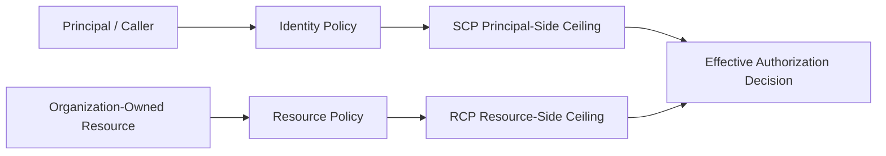
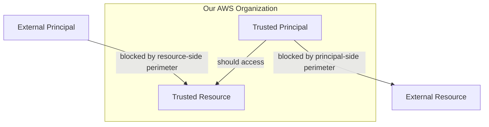
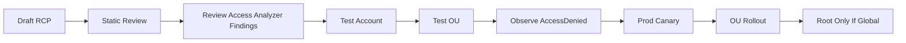
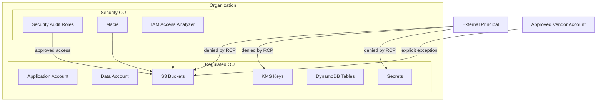
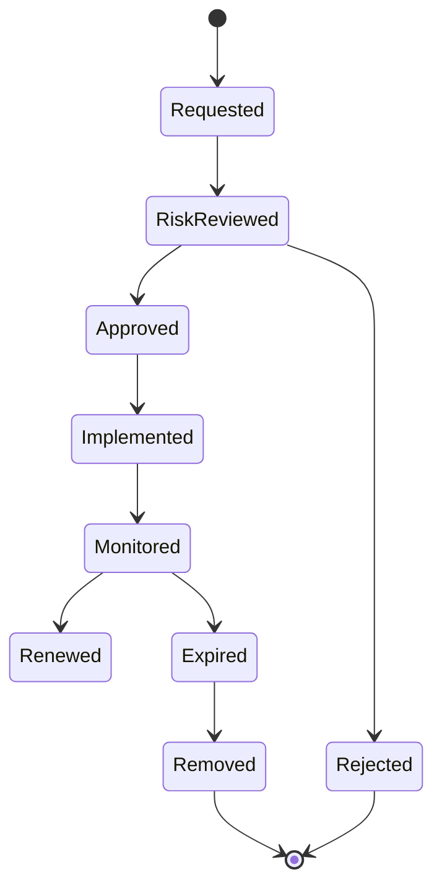
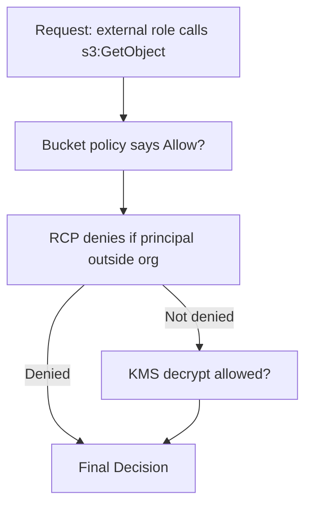

# Part 014 — Resource Control Policies and Resource Boundaries

Part 012 dan 013 membahas SCP.

SCP membatasi apa yang boleh dilakukan **principal di member account organisasi**.

Namun ada kelas risiko lain yang tidak cukup ditutup oleh SCP:

> Bagaimana kalau resource di account kita memberi akses kepada principal di luar organisasi?

Contoh:

- S3 bucket policy memberi `s3:GetObject` ke account vendor,
- KMS key policy memberi decrypt ke external role,
- SQS queue policy memberi send/receive ke principal luar,
- Secrets Manager secret policy memberi read ke external principal,
- CloudWatch Logs resource policy menerima write dari external account,
- DynamoDB resource policy membuka akses lintas account,
- STS operation tertentu melibatkan resource-side evaluation.

SCP tidak selalu cukup untuk mencegah itu.

SCP membatasi principal di organisasi kita. Tetapi jika resource kita punya resource-based policy yang mengizinkan external principal, request tersebut bisa datang dari luar organisasi.

Di sinilah **Resource Control Policy** masuk.

RCP menjawab pertanyaan berbeda:

```text
Apa batas maksimum akses yang boleh diberikan oleh resource milik organisasi kita?
```

Jika SCP adalah guardrail di sisi principal, RCP adalah guardrail di sisi resource.

---

## 1. Mental Model: Principal Boundary vs Resource Boundary

Bayangkan ada dua sisi dalam authorization:



SCP bertanya:

```text
Apakah principal dari member account organisasi boleh melakukan action ini?
```

RCP bertanya:

```text
Apakah resource milik member account organisasi boleh menerima action ini dari principal tersebut?
```

Keduanya tidak memberi permission.

Keduanya hanya membatasi.

Permission tetap harus diberikan oleh identity-based policy atau resource-based policy yang valid.

Secara kasar:

```text
Effective Permission = Identity/Resource Grants ∩ SCP ∩ RCP ∩ Other Applicable Boundaries
```

---

## 2. Masalah Yang Diselesaikan RCP

AWS security problem yang sering muncul di organisasi besar:

```text
Kami punya banyak account.
Kami punya banyak team.
Masing-masing team bisa membuat resource policy.
Bagaimana memastikan resource policy mereka tidak membuka akses ke luar organisasi?
```

Sebelum RCP, organisasi biasanya memakai kombinasi:

- IAM Access Analyzer,
- Config rules,
- custom scanners,
- bucket policy linting,
- IaC checks,
- detective remediation,
- S3 Block Public Access,
- service-specific guardrails,
- manual review.

Semua itu masih penting.

Tetapi sifatnya sering detective atau resource-by-resource.

RCP memberi centralized preventive guardrail pada level AWS Organizations untuk resource yang didukung.

Tujuan RCP bukan menggantikan resource policy yang benar.

Tujuan RCP adalah memastikan resource policy yang salah tidak bisa melewati batas organisasi.

---

## 3. Definisi RCP Yang Tepat

Resource Control Policy adalah policy AWS Organizations yang menetapkan **maximum available permissions untuk resources** di member accounts dalam organisasi.

Beberapa karakteristik penting:

- RCP hanya tersedia jika AWS Organization memakai **all features**, bukan consolidated billing saja.
- RCP tidak berlaku untuk resource di management account.
- RCP berlaku untuk resource di member accounts, termasuk account yang menjadi delegated administrator.
- RCP tidak memberi permission.
- RCP membatasi effective permission.
- RCP dievaluasi bersama SCP, identity policy, dan resource policy.
- RCP dapat ditempel di root, OU, atau account.
- RCP mendukung subset AWS services, bukan semua service.
- RCP bisa memengaruhi principal internal maupun eksternal yang mencoba mengakses resource yang dilindungi.
- RCP tidak membatasi calls yang dilakukan oleh service-linked roles.

Kalimat paling penting:

```text
Use SCP when you need to limit permissions of IAM principals within member accounts.
Use RCP when you need to restrict principals, especially external principals, from accessing resources within member accounts.
```

---

## 4. RCP Bukan Resource Policy

Resource policy memberi akses.

RCP membatasi akses maksimum.

Contoh resource policy S3:

```json
{
  "Effect": "Allow",
  "Principal": {
    "AWS": "arn:aws:iam::999999999999:role/vendor-reader"
  },
  "Action": "s3:GetObject",
  "Resource": "arn:aws:s3:::prod-data-bucket/*"
}
```

Resource policy di atas memberi akses ke external vendor role.

RCP bisa berkata:

```text
Walaupun bucket policy mengizinkan external role, resource dalam OU ini tidak boleh diakses oleh principal di luar organization kecuali exception tertentu.
```

Jadi RCP bukan tempat membuat grant.

RCP adalah rem darurat pada resource-side authorization.

---

## 5. SCP vs RCP

| Dimensi | SCP | RCP |
|---|---|---|
| Sisi kontrol | Principal-side | Resource-side |
| Membatasi siapa | IAM users/roles di member accounts | Resource dalam member accounts |
| Masalah utama | Local admin terlalu kuat | Resource policy terlalu terbuka |
| External principal | Tidak selalu cukup | Sangat relevan |
| Memberi permission? | Tidak | Tidak |
| Berlaku ke management account? | Tidak efektif untuk management account principals sebagai member scope | Tidak berlaku ke resources di management account |
| Scope attachment | Root, OU, account | Root, OU, account |
| Cocok untuk | Deny disabling audit, region restriction, IAM mutation | Deny external access, enforce trusted identity/resource perimeter |

Mental model sederhana:

```text
SCP prevents our identities from doing forbidden things.
RCP prevents our resources from being used in forbidden ways.
```

---

## 6. RCPFullAWSAccess

Saat RCP diaktifkan, AWS memasang managed policy `RCPFullAWSAccess` secara otomatis ke:

- organization root,
- setiap OU,
- setiap account.

Policy ini tidak memberi permission.

Ia hanya membuat semua existing IAM/resource permissions tetap pass-through sampai organisasi mulai menambahkan Deny RCP.

Konsepnya mirip baseline allow ceiling.

```text
RCPFullAWSAccess means: RCP layer does not restrict anything yet.
```

Kemudian organisasi menambahkan Deny statements untuk boundary tertentu.

---

## 7. Service Support Scope

RCP tidak berlaku ke semua AWS services.

Pada saat materi ini disusun, AWS mendokumentasikan dukungan RCP untuk layanan seperti:

- Amazon S3,
- AWS STS,
- AWS KMS,
- Amazon SQS,
- AWS Secrets Manager,
- Amazon Cognito,
- Amazon CloudWatch Logs,
- Amazon DynamoDB,
- AWS AppConfig,
- Amazon AppStream,
- Amazon EC2 Auto Scaling,
- AWS CodeBuild,
- AWS CodeCommit,
- Amazon Comprehend,
- Amazon Comprehend Medical,
- DynamoDB Accelerator,
- Amazon ECR,
- AWS Health,
- Amazon Kinesis Video Streams,
- Amazon OpenSearch Serverless,
- AWS Support,
- Amazon Textract,
- Amazon Transcribe,
- Amazon Translate.

Daftar ini bisa bertambah.

Karena itu rule engineering-nya:

```text
Jangan desain security posture yang menganggap RCP berlaku universal ke semua AWS service.
Selalu cek service support saat membuat policy baru.
```

RCP adalah control penting, tetapi bukan silver bullet.

---

## 8. Resource Boundary Sebagai Kontrak

Resource boundary menjawab:

```text
Resource milik organisasi boleh diakses oleh siapa?
Dari organisasi mana?
Dari account mana?
Dari network path mana?
Dengan service principal apa?
Dengan exception apa?
```

Untuk production, boundary minimal biasanya:

```text
Only trusted identities may access organization resources.
Only trusted resources may be used by organization identities.
Only expected networks may be used for sensitive access.
Only approved external integrations may cross boundary.
```

RCP terutama membantu bagian:

```text
Only trusted identities may access my resources.
```

Dalam AWS data perimeter, condition key penting termasuk:

- `aws:PrincipalOrgID`,
- `aws:PrincipalAccount`,
- `aws:PrincipalOrgPaths`,
- `aws:ResourceOrgID`,
- `aws:ResourceAccount`,
- `aws:ResourceOrgPaths`,
- `aws:SourceVpce`,
- `aws:SourceVpc`,
- `aws:ViaAWSService`,
- `aws:PrincipalIsAWSService`.

Namun tidak semua service/action mendukung semua condition key secara sama.

Test selalu wajib.

---

## 9. Pattern 1 — Deny External Access To S3 Buckets By Default

### 9.1 Risk

S3 bucket policy bisa membuka data ke external AWS account atau public internet.

S3 Block Public Access membantu melawan public access, tetapi external cross-account access yang tidak public tetap bisa menjadi risiko.

Contoh risiko:

```text
Bucket policy memberi GetObject ke vendor account lama yang sudah tidak dipakai.
Bucket policy memberi PutObject ke external account tanpa ownership/ACL handling jelas.
Bucket policy memberi akses ke role di luar organization karena copy-paste policy.
```

### 9.2 Invariant

```text
S3 buckets in production accounts must not be accessed by principals outside our AWS Organization unless explicitly exempted.
```

### 9.3 Example RCP

```json
{
  "Version": "2012-10-17",
  "Statement": [
    {
      "Sid": "DenyS3AccessFromPrincipalsOutsideOrg",
      "Effect": "Deny",
      "Principal": "*",
      "Action": [
        "s3:GetObject",
        "s3:PutObject",
        "s3:DeleteObject",
        "s3:ListBucket"
      ],
      "Resource": [
        "arn:aws:s3:::*",
        "arn:aws:s3:::*/*"
      ],
      "Condition": {
        "StringNotEqualsIfExists": {
          "aws:PrincipalOrgID": "o-exampleorgid"
        },
        "BoolIfExists": {
          "aws:PrincipalIsAWSService": "false"
        }
      }
    }
  ]
}
```

### 9.4 Explanation

Policy ini mengatakan:

```text
Jika principal bukan bagian dari AWS Organization kita, deny access ke S3 resource yang dilindungi.
```

`aws:PrincipalIsAWSService` membantu menghindari memblokir service principal AWS yang legitimate, tetapi pola ini harus dites untuk service integrations organisasi.

### 9.5 Caveat

External access mungkin legitimate:

- vendor analytics,
- partner data exchange,
- cross-organization M&A integration,
- public static website,
- AWS service writing logs,
- central logging dari organization lain,
- support process.

RCP harus punya exception model.

Jangan membuat boundary yang memutus integrasi bisnis tanpa inventory.

---

## 10. Pattern 2 — Allow External Access Only To Approved Accounts

### 10.1 Risk

Kadang external access diperlukan, tetapi hanya ke specific partner accounts.

### 10.2 Invariant

```text
External access is denied except for explicitly approved AWS accounts.
```

### 10.3 Example RCP

```json
{
  "Version": "2012-10-17",
  "Statement": [
    {
      "Sid": "DenyS3ExternalAccessExceptApprovedAccounts",
      "Effect": "Deny",
      "Principal": "*",
      "Action": [
        "s3:GetObject",
        "s3:PutObject",
        "s3:ListBucket"
      ],
      "Resource": [
        "arn:aws:s3:::*",
        "arn:aws:s3:::*/*"
      ],
      "Condition": {
        "StringNotEqualsIfExists": {
          "aws:PrincipalOrgID": "o-exampleorgid"
        },
        "StringNotEqualsIfExists": {
          "aws:PrincipalAccount": [
            "111122223333",
            "444455556666"
          ]
        },
        "BoolIfExists": {
          "aws:PrincipalIsAWSService": "false"
        }
      }
    }
  ]
}
```

### 10.4 Important Correction

JSON tidak boleh punya duplicate key dalam object yang sama. Contoh di atas secara sintaks JSON mentah bermasalah karena `StringNotEqualsIfExists` muncul dua kali.

Versi yang benar harus menggabungkan condition dengan struktur yang valid, misalnya:

```json
{
  "Version": "2012-10-17",
  "Statement": [
    {
      "Sid": "DenyS3ExternalAccessExceptApprovedAccounts",
      "Effect": "Deny",
      "Principal": "*",
      "Action": [
        "s3:GetObject",
        "s3:PutObject",
        "s3:ListBucket"
      ],
      "Resource": [
        "arn:aws:s3:::*",
        "arn:aws:s3:::*/*"
      ],
      "Condition": {
        "StringNotEqualsIfExists": {
          "aws:PrincipalOrgID": "o-exampleorgid",
          "aws:PrincipalAccount": [
            "111122223333",
            "444455556666"
          ]
        },
        "BoolIfExists": {
          "aws:PrincipalIsAWSService": "false"
        }
      }
    }
  ]
}
```

Namun logic condition gabungan harus diuji sangat hati-hati. IAM condition semantics bisa tidak intuitif ketika menggabungkan OrgID dan PrincipalAccount.

Dalam environment production, lebih aman membuat policy dari contoh resmi AWS, lalu menyesuaikannya dengan test matrix.

### 10.5 Engineering Rule

Jika exception external account banyak, jangan taruh semuanya langsung di RCP global.

Gunakan registry:

```yaml
approvedExternalAccounts:
  - accountId: "111122223333"
    owner: data-platform
    purpose: vendor risk scoring export
    expires: 2026-12-31
    resources:
      - arn:aws:s3:::prod-risk-export/*
  - accountId: "444455556666"
    owner: finance-platform
    purpose: tax reporting integration
    expires: 2027-03-31
```

Generate policy dari registry.

Jangan edit manual di console.

---

## 11. Pattern 3 — Protect KMS Keys From External Decrypt

### 11.1 Risk

KMS keys sering menjadi boundary paling penting untuk data confidentiality.

Jika key policy memberi decrypt ke external principal, data bisa terbuka meskipun S3/RDS/EBS resource tampak aman.

### 11.2 Invariant

```text
KMS keys in protected accounts must not allow cryptographic operations by principals outside the organization except approved service/principal exceptions.
```

### 11.3 Example RCP

```json
{
  "Version": "2012-10-17",
  "Statement": [
    {
      "Sid": "DenyKmsCryptoFromOutsideOrg",
      "Effect": "Deny",
      "Principal": "*",
      "Action": [
        "kms:Decrypt",
        "kms:Encrypt",
        "kms:ReEncryptFrom",
        "kms:ReEncryptTo",
        "kms:GenerateDataKey",
        "kms:GenerateDataKeyWithoutPlaintext"
      ],
      "Resource": "*",
      "Condition": {
        "StringNotEqualsIfExists": {
          "aws:PrincipalOrgID": "o-exampleorgid"
        },
        "BoolIfExists": {
          "aws:PrincipalIsAWSService": "false"
        }
      }
    }
  ]
}
```

### 11.4 Why KMS Is Subtle

AWS services often access KMS on behalf of workloads.

Some requests use service principals or service-linked roles. Some use grants. Some carry encryption context. Some are invoked through integrated services.

A careless RCP can break:

- S3 SSE-KMS reads/writes,
- EBS volume attach,
- RDS encryption,
- CloudWatch Logs encryption,
- Lambda environment variable decrypt,
- Secrets Manager secret retrieval,
- cross-account backup restore.

KMS RCP must be tested with representative workloads.

### 11.5 Complementary Controls

Use:

- KMS key policy least privilege,
- grants review,
- CloudTrail KMS data/control events where appropriate,
- IAM Access Analyzer for external key access,
- Config custom rules for key policy posture,
- SCP to restrict `kms:PutKeyPolicy`, `kms:ScheduleKeyDeletion`, `kms:DisableKey`,
- RCP to bound external cryptographic usage.

---

## 12. Pattern 4 — Protect Secrets Manager Secrets From External Access

### 12.1 Risk

Secrets Manager supports resource-based policies. A secret can be shared cross-account.

That is powerful and dangerous.

If a secret policy allows external access, credentials can leak outside the organization boundary.

### 12.2 Invariant

```text
Secrets in organization accounts may not be read by principals outside the organization unless explicitly approved.
```

### 12.3 Example RCP

```json
{
  "Version": "2012-10-17",
  "Statement": [
    {
      "Sid": "DenySecretsAccessFromOutsideOrg",
      "Effect": "Deny",
      "Principal": "*",
      "Action": [
        "secretsmanager:GetSecretValue",
        "secretsmanager:DescribeSecret"
      ],
      "Resource": "*",
      "Condition": {
        "StringNotEqualsIfExists": {
          "aws:PrincipalOrgID": "o-exampleorgid"
        },
        "BoolIfExists": {
          "aws:PrincipalIsAWSService": "false"
        }
      }
    }
  ]
}
```

### 12.4 Operating Notes

Secrets are high-value assets.

Protect them with multiple layers:

- secret naming convention,
- KMS key boundary,
- resource policy validation,
- RCP for external access prevention,
- rotation,
- short-lived credentials where possible,
- audit retrieval events,
- application-level secret caching controls,
- break-glass secret access review.

RCP prevents broad external access.

It does not solve poor secret lifecycle.

---

## 13. Pattern 5 — Protect SQS Queues From External Send/Receive

### 13.1 Risk

SQS queue policy can allow external accounts to send or receive messages.

This may create:

- data injection,
- data exfiltration,
- replay path,
- queue poisoning,
- confused deputy flows,
- integration drift.

### 13.2 Invariant

```text
Production queues may only be used by trusted principals unless the queue is explicitly designated as external integration boundary.
```

### 13.3 Example RCP

```json
{
  "Version": "2012-10-17",
  "Statement": [
    {
      "Sid": "DenySqsAccessFromOutsideOrg",
      "Effect": "Deny",
      "Principal": "*",
      "Action": [
        "sqs:SendMessage",
        "sqs:ReceiveMessage",
        "sqs:DeleteMessage",
        "sqs:ChangeMessageVisibility",
        "sqs:GetQueueAttributes"
      ],
      "Resource": "*",
      "Condition": {
        "StringNotEqualsIfExists": {
          "aws:PrincipalOrgID": "o-exampleorgid"
        },
        "BoolIfExists": {
          "aws:PrincipalIsAWSService": "false"
        }
      }
    }
  ]
}
```

### 13.4 Architecture Guidance

Jika memang ada external producer/consumer, jangan campur dengan internal queue.

Buat explicit integration boundary:

```text
external-ingress-queue
→ validation/normalization worker
→ internal queue/topic
```

RCP exception hanya untuk queue boundary itu, bukan semua queue production.

---

## 14. Pattern 6 — Protect DynamoDB Resource Policies

### 14.1 Risk

DynamoDB resource-based policies dapat mendukung cross-account access untuk table/index/stream resource tertentu.

Jika salah, data operational atau PII bisa terbuka lintas account.

### 14.2 Invariant

```text
DynamoDB tables in production may not be accessed by principals outside approved organizational boundary.
```

### 14.3 Example RCP

```json
{
  "Version": "2012-10-17",
  "Statement": [
    {
      "Sid": "DenyDynamoDbAccessFromOutsideOrg",
      "Effect": "Deny",
      "Principal": "*",
      "Action": [
        "dynamodb:GetItem",
        "dynamodb:BatchGetItem",
        "dynamodb:Query",
        "dynamodb:Scan",
        "dynamodb:PutItem",
        "dynamodb:UpdateItem",
        "dynamodb:DeleteItem",
        "dynamodb:BatchWriteItem"
      ],
      "Resource": "*",
      "Condition": {
        "StringNotEqualsIfExists": {
          "aws:PrincipalOrgID": "o-exampleorgid"
        },
        "BoolIfExists": {
          "aws:PrincipalIsAWSService": "false"
        }
      }
    }
  ]
}
```

### 14.4 Caveat

DynamoDB access is often app-to-database internal access.

External access should be rare and explicit. Prefer API mediation over direct table sharing.

If a partner needs data, give them an API, export, or controlled data product, not raw table access, unless there is strong reason.

---

## 15. Pattern 7 — CloudWatch Logs Resource Boundary

### 15.1 Risk

CloudWatch Logs can receive logs from services/accounts and may involve resource policies. Incorrect resource policy can permit unexpected writes or access patterns.

### 15.2 Invariant

```text
Log groups and log destinations must only accept writes/access from trusted organization identities or approved AWS services.
```

### 15.3 Example RCP

```json
{
  "Version": "2012-10-17",
  "Statement": [
    {
      "Sid": "DenyCloudWatchLogsAccessFromOutsideOrg",
      "Effect": "Deny",
      "Principal": "*",
      "Action": [
        "logs:PutLogEvents",
        "logs:CreateLogStream",
        "logs:GetLogEvents",
        "logs:FilterLogEvents",
        "logs:StartQuery"
      ],
      "Resource": "*",
      "Condition": {
        "StringNotEqualsIfExists": {
          "aws:PrincipalOrgID": "o-exampleorgid"
        },
        "BoolIfExists": {
          "aws:PrincipalIsAWSService": "false"
        }
      }
    }
  ]
}
```

### 15.4 Design Note

Central logging architectures often rely on service integrations and cross-account delivery.

Test before broad attachment.

For log archive accounts, combine RCP with:

- resource policy,
- KMS key policy,
- S3 bucket policy,
- subscription filter governance,
- CloudTrail and Config visibility,
- retention controls.

---

## 16. Pattern 8 — STS Boundary Thinking

### 16.1 Why STS Appears In RCP Support

STS participates in identity delegation and role assumption flows. RCP support for STS matters because certain authorization decisions involve resources and identities across accounts.

### 16.2 Risk

Cross-account role assumption is often the gateway to lateral movement.

SCP controls what principals in your accounts can do.

Trust policies control who can assume your roles.

RCP can help resource-side constraints where supported.

### 16.3 Invariant

```text
Roles in protected accounts should not be assumable by untrusted external principals unless explicitly approved.
```

### 16.4 Better Primary Control

For STS, the first and most important control is usually trust policy:

```json
{
  "Effect": "Allow",
  "Principal": {
    "AWS": "arn:aws:iam::111122223333:role/approved-caller"
  },
  "Action": "sts:AssumeRole",
  "Condition": {
    "StringEquals": {
      "sts:ExternalId": "example-external-id"
    }
  }
}
```

RCP can complement, but do not rely on RCP alone for role trust hygiene.

Trust policy design remains critical.

### 16.5 Detection

Monitor:

- `AssumeRole` from external account,
- unusual source IP/user agent,
- role session name anomalies,
- missing source identity,
- newly modified trust policy,
- Access Analyzer external access findings.

---

## 17. Resource Perimeter With `aws:PrincipalOrgID`

The most common perimeter condition:

```text
aws:PrincipalOrgID == our organization ID
```

This says:

```text
Only principals from our AWS Organization are trusted by default.
```

Example concept:

```json
{
  "Condition": {
    "StringNotEqualsIfExists": {
      "aws:PrincipalOrgID": "o-exampleorgid"
    }
  }
}
```

Used in a Deny statement, this means:

```text
Deny if principal organization is not our org.
```

### 17.1 Why `IfExists` Matters

Some requests may not have a condition key present.

`IfExists` changes evaluation behavior.

This can be useful but dangerous.

If you do not understand IAM condition evaluation, do not freestyle RCP.

Test with:

- internal IAM role,
- external IAM role,
- AWS service principal,
- anonymous/public request if relevant,
- service integration,
- cross-account pipeline,
- break-glass admin.

### 17.2 Service Principals

AWS services sometimes access resources using service principal patterns that are not members of your AWS Organization.

If your RCP says “deny everything not from our org”, you may accidentally block AWS service integrations.

Common mitigation uses condition keys such as:

```text
aws:PrincipalIsAWSService
aws:ViaAWSService
aws:CalledVia
aws:SourceArn
aws:SourceAccount
```

But exact support depends on service/action.

Do not assume uniform behavior.

---

## 18. Resource Boundary With `aws:PrincipalOrgPaths`

`aws:PrincipalOrgID` trusts the entire organization.

Sometimes too broad.

Example:

```text
Sandbox account principal should not access production data resource even though sandbox belongs to same org.
```

In that case, use finer conditions such as:

```text
aws:PrincipalOrgPaths
aws:PrincipalAccount
```

### 18.1 Example Objective

```text
Production S3 buckets may only be accessed by principals from Production OU or Security OU.
```

### 18.2 Conceptual RCP

```json
{
  "Version": "2012-10-17",
  "Statement": [
    {
      "Sid": "DenyS3AccessUnlessPrincipalFromApprovedOrgPath",
      "Effect": "Deny",
      "Principal": "*",
      "Action": [
        "s3:GetObject",
        "s3:PutObject",
        "s3:ListBucket"
      ],
      "Resource": [
        "arn:aws:s3:::*",
        "arn:aws:s3:::*/*"
      ],
      "Condition": {
        "ForAllValues:StringNotLikeIfExists": {
          "aws:PrincipalOrgPaths": [
            "o-exampleorgid/r-root/ou-root-prod/*",
            "o-exampleorgid/r-root/ou-root-security/*"
          ]
        },
        "BoolIfExists": {
          "aws:PrincipalIsAWSService": "false"
        }
      }
    }
  ]
}
```

### 18.3 OU Movement Risk

Org path conditions depend on OU structure.

If account is moved between OUs, access behavior can change.

Therefore OU movement is security-sensitive.

Combine with SCP preventing unauthorized `organizations:MoveAccount`.

---

## 19. Resource Boundary With `aws:ResourceOrgID`

Sometimes the issue is the opposite:

```text
Our principals should only access resources that belong to our organization.
```

That is more commonly controlled with SCP or identity policy using `aws:ResourceOrgID` where supported.

RCP focuses on resources we own, but resource perimeter architecture uses both directions:

```text
Principal-side perimeter: our identities only access trusted resources.
Resource-side perimeter: our resources only allow trusted identities.
```

Diagram:



RCP helps with `XP → R`.

SCP/identity policy helps with `P → XR`.

---

## 20. Data Perimeter Control Matrix

A robust data perimeter uses multiple policy types.

| Objective | Primary Controls | Notes |
|---|---|---|
| Only trusted identities access our resources | RCP, resource policies, `aws:PrincipalOrgID` | RCP prevents overly permissive resource policy from winning. |
| Our identities access only trusted resources | SCP, identity policies, `aws:ResourceOrgID` | Prevents accidental writes/reads to external resources. |
| Access occurs only from expected networks | VPC endpoint policies, IAM conditions, resource policies | Use `aws:SourceVpce`, `aws:SourceVpc` where supported. |
| AWS services can still operate | Service principal exceptions | Avoid breaking legitimate service integrations. |
| External integrations are explicit | Exception registry + resource-level policy | Avoid broad org-wide exceptions. |
| Drift is visible | IAM Access Analyzer, Config, CloudTrail | Preventive + detective. |

RCP is only one row in the broader matrix.

But it is an important row.

---

## 21. RCP Deployment Strategy

AWS strongly recommends testing RCP impact before attaching broadly.

That recommendation exists because RCP can break resource access in subtle ways.

### 21.1 Progressive Deployment



### 21.2 Pre-Deployment Inventory

Before attaching RCP, inventory:

```text
Which resources have resource-based policies?
Which resources are public?
Which resources are shared cross-account?
Which external accounts are legitimate?
Which AWS service principals need access?
Which workloads rely on cross-account access?
Which security/logging services write into protected resources?
Which backup/DR flows cross account or region?
```

### 21.3 Tools To Use

- IAM Access Analyzer external access findings,
- CloudTrail historical access logs,
- Config advanced queries,
- Security Hub findings,
- Macie for S3 sensitive data,
- service-specific inventory,
- IaC repository search,
- resource policy linting,
- business owner integration registry.

---

## 22. RCP As Code

RCP should not be edited manually in console.

Manage it as code.

Example repository:

```text
aws-org-policies/
  rcp/
    global/
      deny-external-access-s3.json
      deny-external-access-kms.json
    production/
      deny-external-secrets-access.json
      deny-external-sqs-access.json
    regulated/
      deny-external-dynamodb-access.json
  registry/
    approved-external-accounts.yaml
    service-principal-exceptions.yaml
    resource-exceptions.yaml
  tests/
    s3-external-deny.yaml
    kms-service-integration.yaml
```

### 22.1 Metadata Example

```yaml
policyId: deny-external-s3-access
owner: cloud-security-platform
scope: production-ou
risk: data-exfiltration-via-resource-policy
controlType: preventive
resourceTypes:
  - s3:bucket
  - s3:object
trustedOrgId: o-exampleorgid
exceptions:
  registry: registry/approved-external-accounts.yaml
reviewCadence: monthly
cloudTrailSignals:
  - eventSource: s3.amazonaws.com
    errorCode: AccessDenied
rollout:
  stage: canary
  rollback: detach from production-ou
```

### 22.2 Generated Policies

For external exceptions, generate RCP from registry.

Do not let humans hand-edit arrays of account IDs across multiple policies.

Manual editing creates drift and stale exceptions.

---

## 23. RCP Testing Matrix

Example matrix for S3 external access RCP:

| Caller | Resource | Expected |
|---|---|---|
| Role in same production account | Production bucket | Allow if IAM/resource policy grants |
| Role in same organization, different production account | Production bucket | Allow if policy grants |
| Role in sandbox OU | Production bucket | Depends on OrgID vs OrgPath design |
| External vendor role approved | Approved integration bucket | Allow if exception + bucket policy grants |
| External vendor role unapproved | Any production bucket | Deny |
| Anonymous principal | Any production bucket | Deny |
| AWS service principal for logging | Log bucket | Allow if service exception correct |
| Security audit role | Sensitive bucket | Allow if IAM grants and not denied |

Do not deploy RCP without this table.

---

## 24. RCP And IAM Access Analyzer

IAM Access Analyzer is critical before and after RCP.

Before RCP:

```text
Find existing external access.
Classify what is legitimate vs accidental.
Build exception registry.
```

After RCP:

```text
Validate that unintended external access is blocked.
Detect resource policies that still try to allow external access.
Track drift/new exposures.
```

Important nuance:

Access Analyzer can show external access allowed by resource policy. RCP can make effective access denied. Both signals matter.

A resource policy that allows external access but is blocked by RCP is still a design smell unless it is documented.

Why?

Because someone may later move account/OU, remove RCP, or change exception.

Prevented risk is not the same as clean design.

---

## 25. RCP And CloudTrail

RCP denial should show up as failed authorization attempts in CloudTrail for supported service operations.

Operationally, monitor:

```text
AccessDenied after RCP rollout
Unexpected spike by service/source IP
Denied calls from known partner accounts
Denied calls from AWS service principal
Denied calls from production pipelines
Denied calls from unknown accounts
```

Example query concept:

```sql
SELECT eventTime,
       eventSource,
       eventName,
       recipientAccountId,
       userIdentity.accountId AS callerAccount,
       userIdentity.arn AS callerArn,
       awsRegion,
       sourceIPAddress,
       errorCode,
       errorMessage
FROM cloudtrail
WHERE errorCode LIKE '%AccessDenied%'
  AND eventTime > current_timestamp - interval '7' day
ORDER BY eventTime DESC;
```

High-signal patterns:

- external account repeatedly denied on sensitive bucket,
- denied KMS decrypt attempts from unknown principal,
- service principal denied after rollout,
- production app denied after OU move,
- vendor denied after exception expiry.

---

## 26. Common RCP Failure Modes

### 26.1 Blocking AWS Service Integrations

Symptom:

```text
CloudWatch Logs delivery fails.
S3 replication fails.
Backup restore fails.
KMS decrypt fails through service.
```

Cause:

```text
RCP treats AWS service principal as untrusted external principal.
```

Mitigation:

- test service principal paths,
- use `aws:PrincipalIsAWSService`, `aws:ViaAWSService`, `aws:SourceArn`, `aws:SourceAccount` carefully,
- read service-specific authorization docs,
- add narrow exceptions.

### 26.2 Trusting Entire Organization Too Broadly

`aws:PrincipalOrgID` allows any principal from any account in the organization if resource/IAM policy grants.

If sandbox account is compromised, and resource policy trusts OrgID broadly, sandbox could access resources that trust the org.

Mitigation:

- use `aws:PrincipalOrgPaths` for production/regulated resources,
- separate sandbox OU,
- avoid broad resource policies,
- monitor cross-OU access,
- restrict trust to specific roles/accounts where possible.

### 26.3 Exception Registry Becomes Permanent Backdoor

External exceptions often begin legitimate.

Then no one removes them.

Mitigation:

- expiry date required,
- owner required,
- business purpose required,
- quarterly review,
- automated stale exception detection,
- exception-specific CloudTrail monitoring.

### 26.4 Assuming RCP Covers Unsupported Services

RCP support is service-specific.

If a service is unsupported, RCP will not protect it.

Mitigation:

- check support list,
- use SCP/resource policy/IAM/Config/service-specific controls,
- keep control matrix updated.

### 26.5 Attaching To Root Too Early

Root attachment can break organization-wide flows quickly.

Mitigation:

- test account,
- test OU,
- canary production,
- monitor AccessDenied,
- then broaden.

---

## 27. Resource Boundary Patterns Beyond RCP

RCP is one layer. Resource boundaries also include service-native controls.

### 27.1 S3

Controls:

- S3 Block Public Access,
- bucket policy with `aws:PrincipalOrgID`,
- object ownership,
- ACL disabled where possible,
- bucket owner enforced,
- Macie,
- Access Analyzer,
- Config rules,
- RCP external access deny.

### 27.2 KMS

Controls:

- key policy least privilege,
- grants hygiene,
- encryption context,
- service conditions,
- key rotation,
- SCP for key policy mutation,
- RCP for external crypto operations,
- CloudTrail monitoring.

### 27.3 SQS/SNS/EventBridge

Controls:

- resource policy principal restrictions,
- source account/source ARN conditions,
- cross-account integration registry,
- dead-letter queue monitoring,
- message schema validation,
- RCP where supported.

### 27.4 Secrets Manager

Controls:

- resource policy validation,
- KMS key separation,
- secret rotation,
- short-lived auth alternatives,
- secret access logging,
- RCP external access deny.

### 27.5 DynamoDB

Controls:

- avoid raw table sharing,
- API mediation,
- fine-grained IAM conditions,
- table resource policy review,
- encryption controls,
- RCP external access deny where supported.

---

## 28. Designing A Resource Perimeter For Regulated Workloads

For regulated OU, a strong perimeter could look like this:



### 28.1 Controls

```text
RCP: deny external principal access by default.
SCP: deny unapproved resource policy mutation.
IAM: least privilege app roles.
KMS: key policy scoped to regulated roles/services.
Access Analyzer: detect external sharing.
Macie: classify sensitive S3 data.
Config: detect public/cross-account posture drift.
CloudTrail: record access attempts and denied calls.
Exception registry: manage partner access.
```

### 28.2 Operational Rule

No external data path exists unless it is represented in the registry.

If it is not in the registry, it is a bug or incident.

---

## 29. RCP Exception Design

Exception is not a `Principal: *` hole.

Exception should be resource-scoped, principal-scoped, time-bound, and observable.

### 29.1 Exception Record

```yaml
exceptionId: ext-s3-risk-export-2026-001
owner: risk-platform
resource:
  type: s3
  arn: arn:aws:s3:::prod-risk-export/*
externalPrincipal:
  accountId: "111122223333"
  roleArn: arn:aws:iam::111122223333:role/vendor-risk-reader
purpose: Daily risk scoring export
approvedBy:
  - cloud-security
  - data-governance
  - vendor-risk
expiresAt: 2026-12-31
evidence:
  ticket: SEC-12345
  dataClassification: confidential
  dpa: signed
monitoring:
  cloudTrailQuery: vendor-risk-reader access to prod-risk-export
```

### 29.2 Exception Lifecycle



Exception without expiry is not exception.

It is hidden architecture.

---

## 30. RCP And OU Design

RCP effectiveness depends on OU design.

Example:

```text
Production OU:
  deny external access except approved registry
Regulated OU:
  deny external access, require tighter org path, no broad partner exceptions
Sandbox OU:
  deny access to production resources from sandbox principals through resource policies/SCP conditions
Shared Services OU:
  allow specific cross-account internal integrations
Security OU:
  allow audit/security service access into member resources
```

OU is not merely folder.

OU is control contract.

RCP makes that contract enforceable on resources.

---

## 31. RCP And Account Movement

If RCP is attached by OU, moving account changes effective guardrails.

This creates security implications.

Example:

```text
Account moved from Production OU to Transitional OU.
Production RCP no longer applies.
External access boundary changes.
```

Therefore `organizations:MoveAccount` must be controlled.

Use SCP from Part 013:

```text
Only org-admin roles may move accounts between OUs.
```

Also monitor CloudTrail for account movement events.

Account movement is not administrative housekeeping.

It is security boundary mutation.

---

## 32. RCP And Management Account Limitation

RCP does not affect resources in the management account.

This reinforces a core design principle:

```text
Do not run workloads in the management account.
```

If production data resource lives in management account, RCP cannot protect it.

Management account should be used for:

- organization management,
- billing root function,
- tightly controlled governance operations.

Not for:

- application workloads,
- data buckets,
- shared services,
- log processing,
- security analytics pipelines.

Use dedicated accounts.

---

## 33. RCP And Service-Linked Roles

RCPs do not apply to calls made by service-linked roles.

This is important.

AWS services need service-linked roles to operate.

You should not expect RCP to restrict every AWS-managed action.

Instead:

- understand service-linked role purpose,
- monitor service activity,
- restrict who can configure service integrations,
- use service-specific controls,
- use SCP for humans/pipelines modifying service configuration,
- use Config/Security Hub for posture.

Again: RCP is a boundary, not an omnipotent control.

---

## 34. Example: Full Data Perimeter Flow

Consider a production S3 bucket with sensitive data.

### 34.1 Desired Behavior

```text
Application role in same production account can read/write.
Security audit role can read metadata and selected objects.
Macie can scan.
External anonymous access is denied.
External vendor access is denied unless registered.
Sandbox roles cannot read production data.
```

### 34.2 Controls

```text
IAM role policy: app role can access only needed prefix.
Bucket policy: allow app role/security role/service principal.
KMS key policy: allow app role and needed AWS services.
RCP: deny external principal access unless exception.
SCP: deny bucket policy mutation except platform-storage-admin.
S3 BPA: block public access.
Access Analyzer: detect external sharing.
Macie: classify sensitive data.
Config: detect public/cross-account policy drift.
CloudTrail data events: record object access where justified.
```

### 34.3 Effective Authorization



Even if bucket policy accidentally allows external role, RCP can deny.

That is the value.

---

## 35. RCP Review Checklist

Before deploying RCP:

```text
[ ] Service supports RCP for target actions/resources.
[ ] Invariant is documented.
[ ] Scope is root/OU/account with rationale.
[ ] Existing external resource policies are inventoried.
[ ] IAM Access Analyzer findings reviewed.
[ ] Legitimate external integrations registered.
[ ] AWS service principal paths tested.
[ ] Internal cross-account flows tested.
[ ] Sandbox/non-prod/prod behavior tested separately.
[ ] CloudTrail AccessDenied monitoring prepared.
[ ] Rollback role/path tested.
[ ] Exception expiry model exists.
[ ] Account movement impact understood.
[ ] Management account limitation understood.
[ ] Service-linked role limitation understood.
```

---

## 36. RCP Maturity Model

### Level 0 — No Resource Boundary

Resource policies are managed independently by teams.

External sharing is detected manually or not at all.

### Level 1 — Detective Only

IAM Access Analyzer and Config detect external exposure.

Remediation is manual.

### Level 2 — Basic RCP External Deny

RCP denies broad external access for high-risk resources like S3/KMS/Secrets.

### Level 3 — OU-Specific Resource Boundary

Production, Regulated, Sandbox, Shared Services have different RCP boundary rules.

### Level 4 — Exception Registry

External access is generated from approved registry and expires automatically.

### Level 5 — Full Data Perimeter Engineering

RCP, SCP, endpoint policy, resource policy, IAM conditions, Access Analyzer, Config, Macie, CloudTrail, and exception workflow are integrated.

---

## 37. Kesimpulan

SCP dan RCP adalah dua sisi dari governance boundary.

SCP menjaga principal kita:

```text
Even if our identities are over-permissioned, they cannot perform forbidden organization-level actions.
```

RCP menjaga resource kita:

```text
Even if our resource policies are too permissive, our resources cannot be used outside approved boundaries.
```

Resource boundary adalah konsep penting untuk AWS production engineering karena banyak data leak tidak terjadi melalui IAM identity policy langsung.

Banyak terjadi melalui resource policy yang terlalu longgar, cross-account sharing yang lupa ditutup, service integration yang tidak dipahami, atau exception vendor yang tidak pernah expired.

RCP membantu mengubah prinsip:

```text
Resource kita tidak boleh sembarang diakses dari luar organisasi.
```

menjadi preventive guardrail yang bisa diterapkan di root, OU, atau account.

Namun RCP tidak menggantikan desain resource policy, KMS policy, IAM least privilege, Access Analyzer, Config, Macie, CloudTrail, atau exception governance.

RCP adalah pagar.

Pagar tetap butuh peta, gerbang, penjaga, kamera, dan prosedur darurat.

Di AWS, itu berarti:

```text
RCP + SCP + IAM + resource policy + endpoint policy + detection + evidence + exception lifecycle.
```

Itulah resource boundary yang layak production.

---

## Official References

- AWS Organizations User Guide — Resource Control Policies: https://docs.aws.amazon.com/organizations/latest/userguide/orgs_manage_policies_rcps.html
- AWS Organizations User Guide — RCP Evaluation: https://docs.aws.amazon.com/organizations/latest/userguide/orgs_manage_policies_rcps_evaluation.html
- AWS Organizations User Guide — Resource Control Policy Examples: https://docs.aws.amazon.com/organizations/latest/userguide/orgs_manage_policies_rcps_examples.html
- AWS News Blog — Introducing Resource Control Policies: https://aws.amazon.com/blogs/aws/introducing-resource-control-policies-rcps-a-new-authorization-policy/
- AWS Whitepaper — Building a Data Perimeter on AWS: https://docs.aws.amazon.com/whitepapers/latest/building-a-data-perimeter-on-aws/perimeter-implementation.html
- AWS Identity — Data Perimeters on AWS: https://aws.amazon.com/identity/data-perimeters-on-aws/
