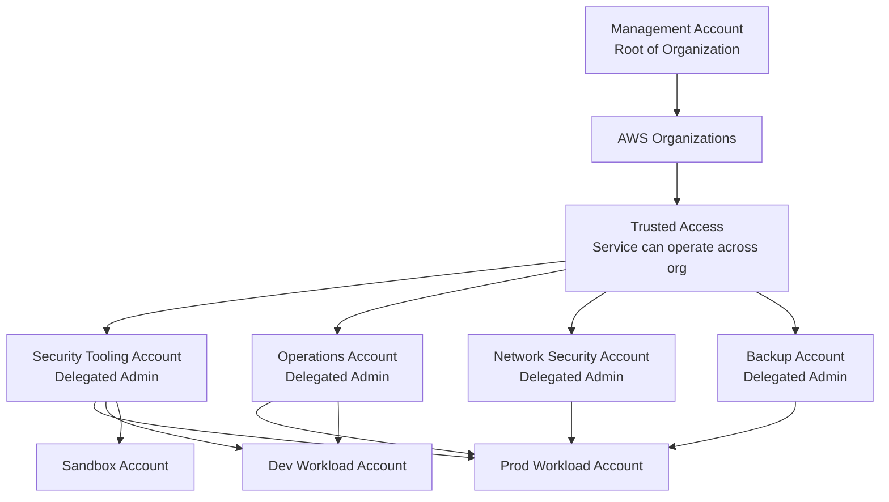
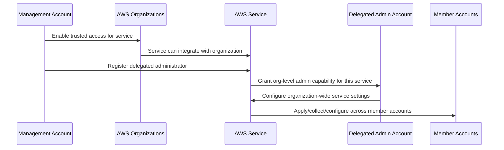
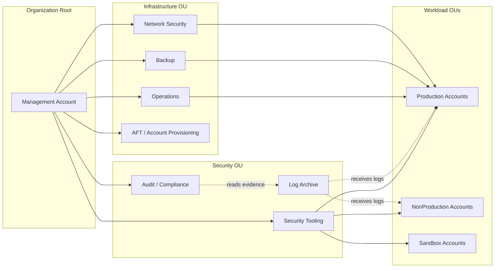
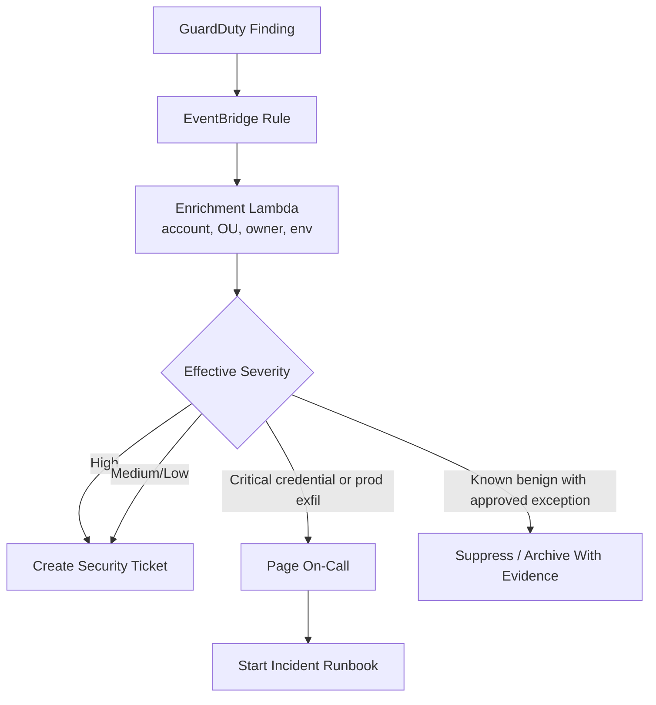
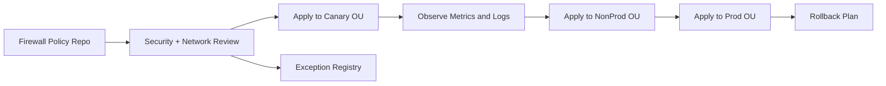
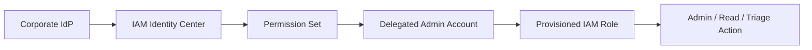
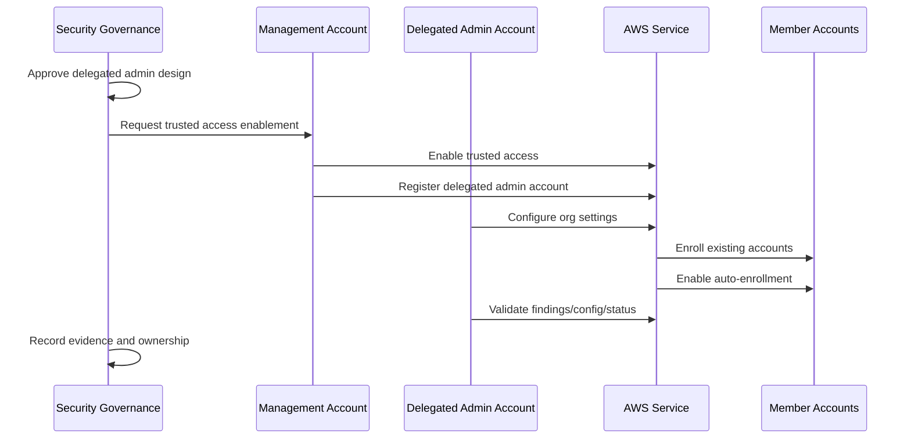

# Part 015 — Delegated Administrator Model

Di Part 009 kita membahas AWS Organizations sebagai governance kernel.
Di Part 010 kita membahas OU sebagai control contract.
Di Part 011 kita membahas Control Tower sebagai landing zone bootstrapper.
Di Part 012–014 kita membahas SCP dan RCP sebagai permission ceiling.

Sekarang kita masuk ke pertanyaan yang lebih operasional:

```text
Siapa yang boleh mengelola service security dan governance untuk seluruh organisasi AWS?
```

Jawaban yang lemah:

```text
Management account saja, karena paling tinggi privilege-nya.
```

Jawaban yang matang:

```text
Management account hanya dipakai untuk tugas yang memang tidak bisa didelegasikan.
Operasi security, audit, compliance, monitoring, dan management lintas account harus dipindahkan ke delegated administrator accounts.
```

Ini bukan sekadar best practice kosmetik.
Ini adalah desain blast radius.

Management account adalah akun paling sensitif di organisasi AWS. Jika akun ini dipakai setiap hari untuk operasi normal, maka setiap aktivitas normal ikut membawa risiko organisasi-level.

Delegated administrator model adalah cara memisahkan:

- ownership organisasi,
- operasi security,
- operasi audit,
- operasi monitoring,
- operasi fleet,
- operasi compliance,
- operasi network security,
- dan operasi workload.

Tujuannya sederhana:

```text
Jangan jadikan management account sebagai workstation administratif sehari-hari.
```

---

## 1. Masalah yang Ingin Diselesaikan

Dalam organisasi AWS kecil, banyak tim memulai seperti ini:

```text
Management Account
├── create account
├── enable CloudTrail
├── enable Config
├── enable GuardDuty
├── enable Security Hub
├── enable IAM Identity Center
├── create StackSets
├── manage budgets
├── manage backup policy
├── inspect security findings
├── operate incident response
└── manage everything
```

Ini cepat di awal, tetapi buruk untuk organisasi serius.

Masalahnya:

1. management account menjadi terlalu aktif,
2. terlalu banyak manusia butuh akses ke management account,
3. audit trail organisasi bercampur dengan aktivitas harian,
4. privilege escalation impact menjadi sangat besar,
5. SCP tidak membatasi principal di management account,
6. incident di management account bisa mengganggu seluruh organisasi,
7. separation of duties sulit dibuktikan,
8. security team dan platform team berebut akun yang sama,
9. automation pipeline menjadi terlalu powerful,
10. compliance evidence sulit menjelaskan siapa sebenarnya operator kontrol.

Dalam cloud governance matang, management account harus diperlakukan seperti **root of trust organisasi**.

Bukan seperti laptop admin bersama.

---

## 2. Definisi: Delegated Administrator

Delegated administrator adalah member account dalam AWS Organizations yang diberi wewenang oleh management account untuk mengelola fitur organisasi pada service tertentu.

Contoh:

- Security account menjadi delegated administrator untuk Security Hub,
- Security account menjadi delegated administrator untuk GuardDuty,
- Audit account menjadi delegated administrator untuk Config aggregator atau Audit Manager,
- Network Security account menjadi delegated administrator untuk Firewall Manager,
- Operations account menjadi delegated administrator untuk Systems Manager Quick Setup atau Change Manager,
- Backup account menjadi delegated administrator untuk AWS Backup,
- AFT management account menjadi akun operasional untuk Account Factory for Terraform.

Mental modelnya:

```text
Management account memberikan kepercayaan organisasi-level kepada service.
Service lalu mengizinkan member account tertentu menjadi operator organisasi-level untuk service itu.
```

Diagram:



Delegated administrator bukan berarti semua privilege management account berpindah.

Ia hanya berarti:

```text
Untuk service X, account Y boleh melakukan operasi organisasi-level yang didukung oleh service X.
```

---

## 3. Trusted Access vs Delegated Administrator

Dua konsep ini sering tercampur.

### 3.1 Trusted Access

Trusted access adalah izin organisasi agar service AWS tertentu dapat mengintegrasikan dirinya dengan AWS Organizations.

Contoh:

```text
Enable trusted access for Security Hub
Enable trusted access for GuardDuty
Enable trusted access for Config
Enable trusted access for Firewall Manager
```

Artinya service tersebut boleh melihat atau mengelola aspek tertentu lintas account dalam organisasi sesuai integrasinya.

Trusted access adalah relasi:

```text
AWS Organizations <-> AWS Service
```

### 3.2 Delegated Administrator

Delegated administrator adalah member account yang ditunjuk untuk mengoperasikan service tersebut secara organisasi-level.

Delegated administrator adalah relasi:

```text
AWS Service <-> Member Account
```

Gabungannya:



Jika trusted access belum aktif, delegated admin biasanya tidak bisa bekerja.
Jika delegated admin belum ditetapkan, management account sering masih menjadi satu-satunya operator organisasi-level untuk service tersebut.

---

## 4. Rule Utama: Minimize Management Account Usage

Prinsipnya:

```text
Management account hanya untuk tindakan yang tidak bisa dilakukan dari member account.
```

Contoh tindakan yang biasanya tetap membutuhkan management account:

- membuat organisasi awal,
- mengundang atau membuat member account,
- mendaftarkan delegated administrator untuk service tertentu,
- mengaktifkan atau menonaktifkan trusted access,
- mengelola beberapa policy organisasi tertentu,
- operasi billing tertentu,
- lifecycle kritis akun organisasi,
- break-glass organisasi.

Contoh tindakan yang sebaiknya didelegasikan:

- memantau Security Hub findings,
- mengelola GuardDuty organization configuration,
- menjalankan vulnerability management,
- mengelola Macie discovery,
- mengelola Config aggregator,
- mengelola backup policy secara operasional,
- mengelola firewall policy,
- menjalankan fleet management,
- mengelola account provisioning pipeline,
- mengelola incident response runbook.

Jika sebuah engineer harus login ke management account setiap minggu, itu smell.

Jika security analyst butuh management account untuk membaca findings, itu smell.

Jika CI/CD pipeline deploy baseline dari management account setiap hari, itu smell.

---

## 5. Recommended Account Layout

Dalam organisasi production-grade, delegated admin tidak harus satu account untuk semua service. Tetapi jangan juga pecah terlalu granular sampai operasinya sulit.

Desain praktis:

```text
Management Account
├── tugas organisasi yang tidak bisa didelegasikan
├── root of trust
└── minimal human access

Security Tooling Account
├── Security Hub delegated admin
├── GuardDuty delegated admin
├── Inspector delegated admin
├── Macie delegated admin
├── IAM Access Analyzer delegated admin bila sesuai
└── security automation/event routing

Log Archive Account
├── centralized immutable logs
├── CloudTrail destination
├── Config snapshots
├── VPC Flow Logs destination bila dipilih
└── read access sangat terbatas

Audit / Compliance Account
├── Audit Manager
├── evidence review
├── auditor access
└── read-only cross-account views

Network Security Account
├── Firewall Manager delegated admin
├── Network Firewall policy operation
├── WAF policy governance
└── Shield Advanced central management bila digunakan

Operations Account
├── Systems Manager delegated operation
├── Quick Setup
├── Change Manager
├── Incident Manager
└── operational runbooks

Backup Account
├── AWS Backup delegated admin
├── backup policy operation
├── restore test orchestration
└── vault governance

AFT / Account Provisioning Account
├── Account Factory for Terraform pipeline
├── account request repository
├── global customization
└── account customization
```

Diagram:



Kuncinya:

```text
Delegated admin account adalah operational control point.
Log archive account adalah evidence custody point.
Management account adalah trust anchor.
```

Jangan mencampur semuanya jika audit dan blast radius penting.

---

## 6. Delegated Admin Matrix

Gunakan matrix seperti ini dalam internal handbook.

| Domain | AWS Service | Delegated Admin Account | Mengapa |
|---|---|---|---|
| Security posture | Security Hub | Security Tooling | Central findings, standards, aggregation, action workflow. |
| Threat detection | GuardDuty | Security Tooling | Organization-wide detector configuration dan findings. |
| Vulnerability | Inspector | Security Tooling | Central vulnerability visibility untuk EC2, ECR, Lambda. |
| Sensitive data | Macie | Security Tooling | Discovery dan classification S3 lintas account. |
| Firewall governance | Firewall Manager | Network Security | Central policy untuk WAF, Shield, security group, Network Firewall. |
| Config compliance | AWS Config | Audit atau Security Tooling | Aggregator dan compliance timeline. |
| Audit evidence | Audit Manager | Audit / Compliance | Evidence collection dan assessment. |
| Backup governance | AWS Backup | Backup Account | Backup policy, vault, recovery readiness. |
| Fleet management | Systems Manager | Operations | Quick Setup, Change Manager, automation, patch visibility. |
| Account vending | Control Tower / AFT | AFT Management Account | Provisioning pipeline dan customization. |
| Cross-account IaC | CloudFormation StackSets | Platform / Infra | Baseline deployment lintas account dan Region. |
| Access analysis | IAM Access Analyzer | Security Tooling | External access visibility dan unused access review. |

Matrix ini harus hidup dalam repository platform/security.

Tambahkan kolom:

- owner team,
- break-glass owner,
- allowed operators,
- production change process,
- enablement date,
- exception policy,
- evidence location,
- runbook link.

---

## 7. Design Decision: One Security Admin or Multiple Admin Accounts?

Ada dua pola umum.

### 7.1 Central Security Tooling Account

Semua security service utama didelegasikan ke satu `Security Tooling Account`.

Kelebihan:

- operasi lebih sederhana,
- findings mudah dikorelasikan,
- event routing lebih mudah,
- security team punya satu cockpit,
- automation lebih mudah dibangun.

Kekurangan:

- account ini menjadi sangat penting,
- compromise berdampak besar pada visibility security,
- permission model harus sangat ketat,
- workload security dan compliance custody bisa tercampur.

Cocok untuk:

- organisasi kecil sampai menengah,
- security team yang masih terpusat,
- platform maturity awal sampai menengah.

### 7.2 Domain-Specific Admin Accounts

Security Hub/GuardDuty di security account, Firewall Manager di network security account, Audit Manager di audit account, Backup di backup account, Systems Manager di operations account.

Kelebihan:

- separation of duties lebih kuat,
- blast radius lebih kecil,
- audit lebih mudah menjelaskan ownership,
- domain-specific runbook lebih jelas.

Kekurangan:

- koordinasi lebih rumit,
- cross-service correlation butuh pipeline,
- lebih banyak IAM role dan permission set,
- onboarding account lebih kompleks.

Cocok untuk:

- regulated environment,
- enterprise besar,
- banyak platform/domain team,
- kebutuhan audit yang kuat.

### 7.3 Rekomendasi Praktis

Mulai dari pola ini:

```text
Security Tooling Account:
  Security Hub, GuardDuty, Inspector, Macie, Access Analyzer

Log Archive Account:
  log custody only, no active investigation tooling unless controlled

Audit Account:
  evidence review, Audit Manager, read-only access

Network Security Account:
  Firewall Manager, WAF/Shield/Network Firewall governance

Operations Account:
  Systems Manager, Incident Manager, Change Manager

Backup Account:
  AWS Backup delegated operations
```

Jangan pindahkan semua ke management account hanya karena lebih mudah.

---

## 8. Security Hub Delegated Admin Pattern

Security Hub biasanya menjadi correlation layer untuk findings.

Pattern:

```text
Management account
  -> enable trusted access for Security Hub
  -> designate Security Tooling account as delegated admin

Security Tooling account
  -> enable Security Hub organization configuration
  -> enable standards
  -> configure central finding aggregation
  -> integrate GuardDuty, Inspector, Macie, Config, IAM Access Analyzer
  -> route findings to EventBridge
  -> create workflow for triage/remediation
```

Important distinction:

```text
Security Hub finding bukan incident.
Finding adalah signal.
Incident adalah decision + scope + response lifecycle.
```

Delegated admin tidak cukup jika tidak ada finding lifecycle.

Minimum operating model:

| Area | Decision |
|---|---|
| Finding owner | Security team, platform team, workload owner, or shared. |
| Severity normalization | AWS severity + business context + exposure + data sensitivity. |
| Deduplication | By resource, control, finding type, Region, account. |
| SLA | Critical, high, medium, low. |
| Exception | Expiry date, approver, compensating control. |
| Evidence | Finding history, remediation PR, Config compliance, CloudTrail event. |

---

## 9. GuardDuty Delegated Admin Pattern

GuardDuty delegated admin should centralize threat detection configuration.

Pattern:

```text
Security Tooling Account
├── organization detector configuration
├── auto-enable for new accounts
├── finding export
├── EventBridge rules
├── threat intel configuration
├── suppression rules with expiry
└── incident escalation integration
```

High-value design choices:

1. Enable auto-enrollment for new accounts where supported.
2. Route high-severity findings to incident workflow.
3. Keep suppression rules under code review.
4. Enrich findings with account metadata, OU, owner, environment, data classification.
5. Do not let sandbox noise hide prod compromise.
6. Treat credential-related findings differently from generic network findings.

Example routing logic:



---

## 10. Config Delegated Admin / Aggregator Pattern

AWS Config answers a different question from GuardDuty.

GuardDuty asks:

```text
Is something suspicious happening?
```

Config asks:

```text
What is the configuration state of resources over time, and is it compliant?
```

Delegated model:

```text
Audit or Security Tooling Account
├── organization aggregator
├── conformance packs
├── compliance dashboards
├── remediation workflow
└── evidence export
```

Do not use Config only as a compliance badge.

Use it as configuration timeline.

Examples of questions Config should answer:

- When did this S3 bucket become public?
- Which role attached `AdministratorAccess` last week?
- Which security group opened `0.0.0.0/0` to port 22?
- Which KMS key has rotation disabled?
- Which resource drifted from baseline?
- Which accounts are missing required recorder or delivery channel?

Config delegated admin should be designed with evidence retention in mind.

---

## 11. Firewall Manager Delegated Admin Pattern

Firewall Manager is different from Security Hub.

Security Hub aggregates findings.
Firewall Manager pushes and manages policies.

It belongs naturally to a Network Security account or Security Tooling account depending on organization structure.

Central policies may include:

- WAF policy for public ALB/API Gateway/CloudFront,
- Shield Advanced policy,
- security group audit policy,
- Network Firewall policy,
- DNS Firewall policy,
- third-party firewall policy if integrated.

Failure mode:

```text
Central firewall policy accidentally applies to all production resources and breaks traffic.
```

Therefore, policy rollout must support:

- scoped OU rollout,
- dry-run or audit mode if available,
- canary accounts,
- exception registry,
- rollback path,
- operational owner approval.

Mermaid deployment flow:



---

## 12. Systems Manager Delegated Operation Pattern

Systems Manager is management plane for fleet.

This is powerful.

It can:

- execute commands,
- start sessions,
- apply patches,
- collect inventory,
- enforce state,
- run automation,
- manage maintenance windows,
- coordinate change workflows.

Therefore, delegated admin for Systems Manager belongs to an Operations account, not casually to a generic tooling account.

Key controls:

| Control | Why |
|---|---|
| Separate production and non-production permissions | Fleet operations can cause outage. |
| Require approval for destructive automation | SSM can change many instances quickly. |
| Log Session Manager activity | Human shell access must be auditable. |
| Use maintenance windows | Avoid uncontrolled production changes. |
| Bind automation to documents with review | Avoid arbitrary command execution. |
| Tag scope carefully | Bad tag selector can affect wrong fleet. |

Systems Manager delegated admin is operational power.
Treat it like production deployment authority.

---

## 13. AWS Backup Delegated Admin Pattern

Backup governance should not depend on every workload team remembering to configure backups correctly.

Delegated admin model:

```text
Backup Account
├── organization backup policies
├── backup plan governance
├── vault governance
├── backup audit reports
├── restore testing orchestration
└── ransomware recovery posture
```

Important separation:

```text
Workload team owns data correctness.
Backup team owns recoverability control.
Security/compliance team owns evidence and retention requirements.
```

Failure mode:

- workload team deletes backup plan,
- compromised admin deletes recovery points,
- backup exists but restore was never tested,
- backup is regionally unavailable during incident,
- vault policy allows destructive operation too broadly.

Delegated admin alone does not solve this.

You need:

- backup policy,
- vault lock where appropriate,
- restore test schedule,
- immutable evidence,
- recovery runbook,
- ownership mapping.

---

## 14. Account Provisioning Delegated Operation Pattern

Account creation is an organization-level activity.

But customization, baseline, tagging, enrollment, and workflow should not be operated manually from management account.

Common pattern:

```text
Management Account
  -> owns AWS Organizations and Control Tower root setup

AFT Management Account
  -> runs account vending pipeline
  -> receives account requests
  -> applies account customizations
  -> manages baseline workflow
```

This is covered deeply in Part 016.

For now, remember:

```text
Account vending pipeline is delegated governance automation.
It must be protected like production infrastructure.
```

---

## 15. Permission Model for Delegated Admin Accounts

Delegated admin account is not safe by default.

You still need IAM boundaries inside it.

Suggested role model:

```text
SecurityToolingReadOnly
SecurityFindingTriage
SecurityAutomationOperator
SecurityServiceAdmin
SecurityBreakGlassAdmin
SecurityAuditReadOnly
```

For Operations account:

```text
OpsFleetReadOnly
OpsSessionOperatorNonProd
OpsSessionOperatorProd
OpsPatchOperator
OpsAutomationApprover
OpsBreakGlassAdmin
```

For Network Security account:

```text
NetworkSecurityReadOnly
WAFPolicyOperator
FirewallPolicyOperator
NetworkSecurityApprover
NetworkSecurityBreakGlass
```

Important:

- not everyone in security team needs admin,
- read-only investigation role is different from remediation role,
- remediation role is different from service configuration admin,
- break-glass must be exceptional and heavily logged,
- production operations should require stronger controls than non-production.

---

## 16. Human Access Pattern

Human access should flow through IAM Identity Center or federation.

Minimum pattern:



Rules:

1. no long-lived IAM users for human access,
2. MFA enforced at IdP/IAM Identity Center,
3. permission sets separated by function,
4. production and non-production permissions separated,
5. management account access assigned only to named individuals, not broad groups,
6. emergency access documented and tested,
7. CloudTrail must preserve user attribution.

Human access to delegated admin account is still powerful.

Make it auditable.

---

## 17. Automation Access Pattern

Automation needs roles too.

Bad pattern:

```text
One automation role with AdministratorAccess in Security Tooling account.
```

Better pattern:

```text
SecurityFindingEnrichmentRole
SecurityAutoRemediationRole
SecurityHubConfigurationRole
GuardDutyConfigurationRole
InspectorReportingRole
ConfigRemediationRole
```

Each role should have:

- clear purpose,
- scoped permissions,
- trust policy limited to the exact service or pipeline,
- permission boundary if delegated creation is allowed,
- CloudTrail attribution,
- deployment owner,
- code owner,
- rollback plan.

Automation should not become unreviewed super-admin.

---

## 18. Delegated Admin Enablement Runbook

A disciplined enablement flow:

```text
1. Define service owner.
2. Define delegated admin account.
3. Confirm account is enrolled in landing zone.
4. Confirm baseline logging, Config, GuardDuty, Security Hub are active.
5. Define permission sets and automation roles.
6. Enable trusted access from management account.
7. Register delegated administrator.
8. Configure service organization settings from delegated admin account.
9. Auto-enroll existing accounts.
10. Configure auto-enrollment for new accounts if supported.
11. Validate across canary accounts.
12. Validate across production accounts.
13. Configure EventBridge/log/finding export.
14. Add service to delegated admin registry.
15. Add runbook and break-glass procedure.
16. Add evidence query.
17. Review after 30 days.
```

Runbook as sequence:



---

## 19. Delegated Admin Registry

Every organization should maintain a registry.

Example schema:

```yaml
service: securityhub.amazonaws.com
delegatedAdminAccountId: "111122223333"
delegatedAdminAccountName: security-tooling-prod
ownerTeam: cloud-security
primaryContact: cloud-security-oncall
backupContact: platform-security
trustedAccessEnabled: true
autoEnrollment: true
regions:
  - ap-southeast-1
  - us-east-1
  - global
criticality: high
changeProcess: SEC-CHANGE-STANDARD
breakGlassRole: SecurityBreakGlassAdmin
lastReviewed: 2026-07-06
evidence:
  cloudtrailQuery: "eventName=RegisterDelegatedAdministrator"
  configRule: "required-security-service-enabled"
  dashboard: "security-org-service-status"
exceptions:
  allowed: true
  expiryRequired: true
```

This registry prevents mystery governance.

Questions it answers:

- Which account administers GuardDuty?
- Who owns Security Hub standards?
- Who can disable Macie?
- Where is evidence that Config aggregator is enabled?
- Which services still run from management account?
- Which delegated admin assignment is stale?

---

## 20. Failure Modes

### 20.1 Management Account Overuse

Symptom:

```text
Many engineers have management account admin access.
```

Impact:

- large blast radius,
- difficult attribution,
- impossible separation of duties,
- SCP cannot protect management account identities.

Control:

- delegate services,
- remove routine access,
- enforce named emergency access,
- review CloudTrail for management account usage.

### 20.2 Delegated Admin Account Becomes New Management Account

Symptom:

```text
Security Tooling account has too many humans and automation roles with admin.
```

Impact:

- centralized compromise of detection/remediation,
- finding tampering,
- suppression abuse,
- loss of visibility.

Control:

- least privilege roles,
- split read/triage/admin/remediation,
- require code review for suppression/remediation,
- log all admin activity.

### 20.3 Wrong Account Chosen as Delegated Admin

Symptom:

```text
A workload account becomes delegated admin for a security service.
```

Impact:

- workload team gains organization-level security authority,
- compliance separation breaks,
- lifecycle risk if account is retired.

Control:

- delegated admin registry,
- OU-level eligibility rule,
- management account approval checklist.

### 20.4 Trusted Access Disabled Without Cleanup

Symptom:

```text
Someone disables trusted access for a service without coordinating with delegated admin.
```

Impact:

- service integration breaks,
- member account resources remain partially configured,
- findings stop flowing,
- drift appears.

Control:

- SCP guardrail where possible,
- change approval,
- CloudTrail detection,
- service-specific disablement runbook.

### 20.5 Auto-Enrollment Not Enabled

Symptom:

```text
Existing accounts are protected, new accounts are not.
```

Impact:

- newly created workload accounts miss GuardDuty/Security Hub/Config/Inspector/Macie,
- account vending creates blind spots.

Control:

- account vending validation,
- periodic org coverage check,
- EventBridge trigger on account creation,
- Control Tower lifecycle event integration.

### 20.6 Delegated Admin Without Operational Runbook

Symptom:

```text
Service is centrally enabled, but nobody knows what to do with findings.
```

Impact:

- dashboard theater,
- false sense of security,
- findings age without remediation,
- audit gaps.

Control:

- finding lifecycle,
- ownership mapping,
- severity policy,
- SLA,
- exception process.

---

## 21. Controls to Protect Delegated Admin Accounts

Minimum baseline:

| Control | Required? | Notes |
|---|---:|---|
| CloudTrail org trail | Yes | Must capture delegated admin activity. |
| Config recorder | Yes | Account configuration drift must be visible. |
| GuardDuty | Yes | Delegated admin account itself must be monitored. |
| Security Hub | Yes | Findings for admin accounts are high priority. |
| IAM Access Analyzer | Yes | External access in admin accounts is dangerous. |
| MFA/federation | Yes | No long-lived human IAM users. |
| Break-glass role | Yes | Emergency only, logged, reviewed. |
| Permission set review | Yes | Review at least quarterly. |
| Budget/anomaly detection | Recommended | Admin account misuse can create cost events. |
| Backup of critical config | Recommended | Export service config/policies where practical. |
| SCP protection | Yes | Prevent disabling logging/security services from member accounts where possible. |

Delegated admin accounts are crown jewels.
Not as powerful as management account, but still very sensitive.

---

## 22. Detection Queries and Signals

Monitor for these events in CloudTrail:

```text
RegisterDelegatedAdministrator
DeregisterDelegatedAdministrator
EnableAWSServiceAccess
DisableAWSServiceAccess
CreateServiceLinkedRole
DeleteServiceLinkedRole
UpdateOrganizationConfiguration
DisableOrganizationAdminAccount
EnableOrganizationAdminAccount
```

Service-specific examples:

```text
Security Hub:
  EnableOrganizationAdminAccount
  DisableOrganizationAdminAccount
  BatchDisableStandards
  UpdateSecurityHubConfiguration

GuardDuty:
  EnableOrganizationAdminAccount
  DisableOrganizationAdminAccount
  UpdateOrganizationConfiguration
  CreateFilter
  UpdateFilter

Inspector:
  EnableDelegatedAdminAccount
  DisableDelegatedAdminAccount

Macie:
  EnableOrganizationAdminAccount
  DisableOrganizationAdminAccount

Firewall Manager:
  AssociateAdminAccount
  DisassociateAdminAccount
  PutPolicy
  DeletePolicy
```

Alert policy:

| Event | Severity | Response |
|---|---:|---|
| Disable trusted access | Critical | Immediate investigation. |
| Deregister delegated admin | Critical | Confirm approved change. |
| Change organization security config | High | Validate change ticket. |
| Create suppression/filter rule | Medium/High | Review scope and expiry. |
| Delete central policy | High | Validate rollback/change record. |

---

## 23. Delegated Admin Review Cadence

A serious organization reviews delegated admin setup periodically.

Monthly:

- coverage of all accounts,
- new accounts enrolled,
- service health,
- high-risk findings aging,
- unexpected admin activity.

Quarterly:

- permission set review,
- delegated admin registry review,
- suppression/exception review,
- break-glass test,
- management account usage review.

Annually or during major change:

- account layout review,
- service ownership review,
- compliance mapping,
- incident exercise,
- recovery simulation.

---

## 24. Decision Framework

When deciding whether to delegate a service, ask:

```text
1. Does this service support AWS Organizations integration?
2. Does it support delegated administrator?
3. Is the management account currently required for routine operations?
4. Which team owns this control?
5. Which account should operate it?
6. Does the delegated admin account have proper baseline controls?
7. What is the blast radius if this delegated account is compromised?
8. What CloudTrail events prove enablement?
9. How are new accounts auto-enrolled?
10. What is the rollback/disable procedure?
```

If you cannot answer those questions, do not enable it casually.

---

## 25. Practical Checklist

Before registering delegated admin:

- [ ] Service owner identified.
- [ ] Delegated admin account is not management account unless service requires it.
- [ ] Delegated admin account is in correct OU.
- [ ] Account has CloudTrail, Config, GuardDuty, Security Hub baseline.
- [ ] Human access is via IAM Identity Center/federation.
- [ ] No long-lived human IAM users.
- [ ] Permission sets are least privilege.
- [ ] Break-glass path exists.
- [ ] Event monitoring exists for delegated admin changes.
- [ ] Auto-enrollment behavior is understood.
- [ ] Existing account enrollment is tested.
- [ ] New account vending integration is planned.
- [ ] Registry entry created.
- [ ] Runbook documented.
- [ ] Evidence query documented.

---

## 26. The Core Invariant

The delegated administrator model has one invariant:

```text
Routine organization-wide operations must not require routine management account usage.
```

Everything else follows from that.

If management account is used daily, your organization root is part of your daily blast radius.

If delegated admin accounts are not protected, you only moved the blast radius somewhere else.

The goal is not delegation for delegation’s sake.

The goal is:

```text
clear ownership,
small blast radius,
auditable operation,
separation of duties,
repeatable governance,
and recoverable security control planes.
```

---

## 27. What Comes Next

Delegated administrator accounts answer:

```text
Who operates organization-wide controls?
```

Part 016 answers the next question:

```text
How do we create AWS accounts consistently so every new account is born secure, observable, governed, tagged, auditable, and owned?
```

That is the account vending machine problem.

---

## References

- AWS Organizations User Guide — Delegated administrator for AWS services that work with AWS Organizations: https://docs.aws.amazon.com/organizations/latest/userguide/orgs_integrate_delegated_admin.html
- AWS Organizations User Guide — Delegated administrator for AWS Organizations: https://docs.aws.amazon.com/organizations/latest/userguide/orgs_delegate_policies.html
- AWS Prescriptive Guidance — AWS Security Reference Architecture: Management account, trusted access, and delegated administrators: https://docs.aws.amazon.com/prescriptive-guidance/latest/security-reference-architecture/management-account.html
- AWS Organizations User Guide — Best practices for the management account: https://docs.aws.amazon.com/organizations/latest/userguide/orgs_best-practices_mgmt-acct.html
- AWS Security Hub User Guide — Designating a delegated administrator: https://docs.aws.amazon.com/securityhub/latest/userguide/designate-orgs-admin-account.html
- AWS IAM Identity Center User Guide — Delegated administration: https://docs.aws.amazon.com/singlesignon/latest/userguide/delegated-admin.html
