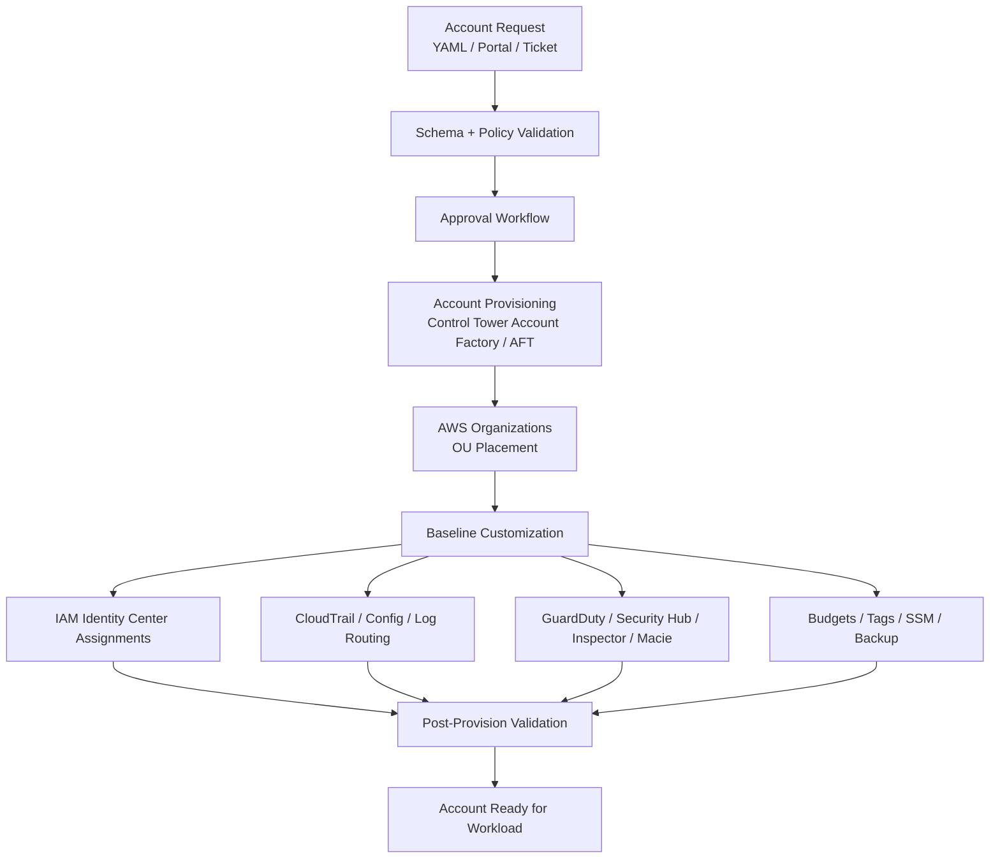
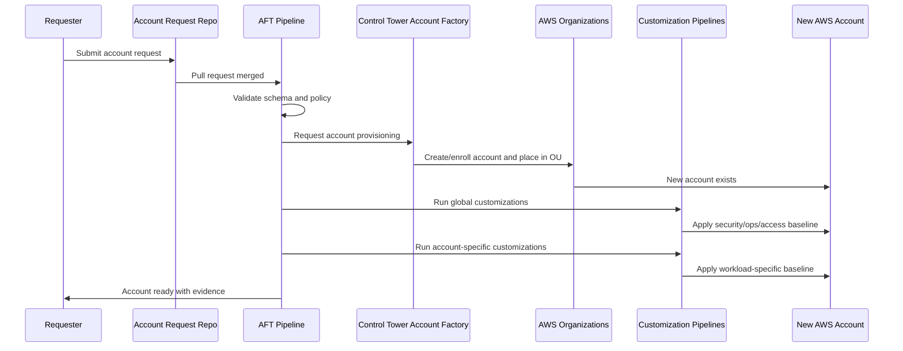
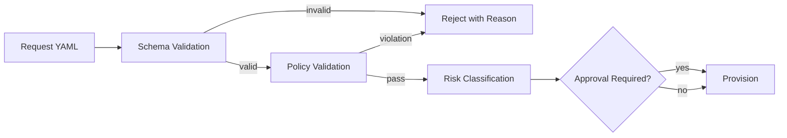
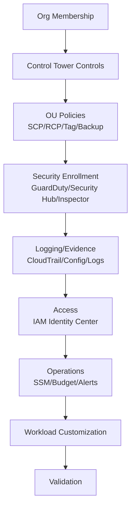
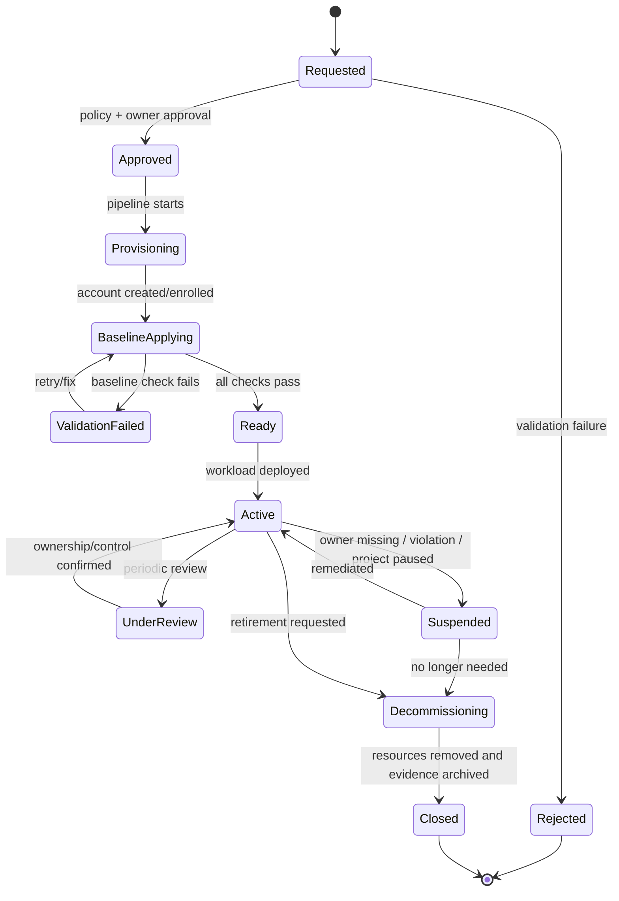
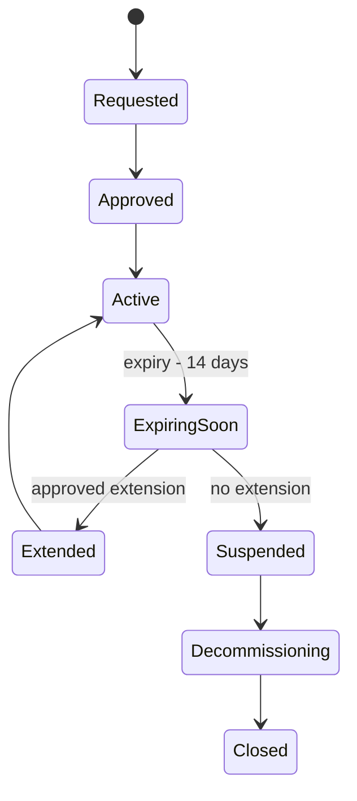

# Part 016 — Account Vending Machine Design

Di AWS multi-account environment, account bukan hanya tempat deploy resource.

Account adalah unit untuk:

- security boundary,
- blast radius,
- ownership,
- audit,
- budget,
- quota,
- compliance,
- workload lifecycle,
- environment separation,
- dan operational responsibility.

Karena itu, membuat account tidak boleh dianggap seperti membuat folder baru.

Membuat account adalah proses governance.

Pertanyaan besarnya:

```text
Bagaimana memastikan setiap AWS account baru lahir dengan security, monitoring, ownership, tagging, logging, guardrail, access, dan lifecycle yang benar?
```

Jawaban immature:

```text
Buat account manual dari console, lalu tim platform/security akan configure nanti.
```

Jawaban production-grade:

```text
Bangun account vending machine: pipeline provisioning account yang deklaratif, repeatable, auditable, gated, dan otomatis menerapkan baseline sebelum account dipakai workload.
```

Account vending machine bukan sekadar automation.

Ia adalah enforcement point pertama dalam cloud governance.

---

## 1. Mental Model: Account as a Product

Account harus diperlakukan seperti produk internal.

Produk ini punya:

- request form,
- approval workflow,
- schema,
- owner,
- lifecycle,
- baseline,
- access model,
- monitoring,
- cost allocation,
- compliance classification,
- decommission process,
- support model.

Jika account dibuat tanpa metadata, ia menjadi orphan.

Jika account dibuat tanpa baseline, ia menjadi blind spot.

Jika account dibuat tanpa owner, ia menjadi liability.

Jika account dibuat tanpa lifecycle, ia menjadi landfill.

Account vending machine harus menjamin invariant berikut:

```text
Tidak ada account aktif yang tidak memiliki owner, environment, OU, guardrail, logging, security monitoring, cost allocation, dan break-glass path.
```

---

## 2. Account Creation Is a Security Event

Membuat account baru menambah attack surface organisasi.

Account baru bisa memiliki:

- IAM roles,
- compute resources,
- S3 buckets,
- KMS keys,
- network paths,
- public endpoints,
- secrets,
- CloudTrail events,
- billing impact,
- compliance scope.

Jika account baru tidak langsung masuk ke:

- organization trail,
- Config recorder,
- GuardDuty,
- Security Hub,
- Inspector,
- Macie where needed,
- backup governance,
- IAM Identity Center assignments,
- budget alarms,
- tagging policy,
- SCP/RCP scope,

maka organisasi punya blind spot.

Blind spot biasanya bukan muncul dari workload paling besar.

Blind spot sering muncul dari:

- sandbox yang lupa dimatikan,
- temporary account yang menjadi permanen,
- vendor integration account,
- proof-of-concept yang berisi data asli,
- migration account yang tidak selesai,
- suspended project yang masih punya access key.

Account vending machine menutup risiko itu di awal.

---

## 3. Baseline Architecture

Account vending architecture minimal:



Important:

```text
Account is not ready when AWS account ID exists.
Account is ready when baseline controls are verified.
```

---

## 4. Control Tower Account Factory

AWS Control Tower Account Factory provides standardized account provisioning inside a Control Tower landing zone.

Its role:

- standardize new account creation,
- place accounts into managed OUs,
- apply landing zone controls,
- integrate with IAM Identity Center workflows,
- help administrators and allowed users provision accounts with approved configuration.

Account Factory is the built-in vending mechanism.

But in an engineering organization, Account Factory alone is usually not the complete system.

You still need:

- request schema,
- approval flow,
- metadata registry,
- account baseline customization,
- post-provision verification,
- drift detection,
- lifecycle management,
- integration with ticketing/source control,
- evidence pipeline.

Control Tower gives the foundation.

Your platform operating model gives the discipline.

---

## 5. Account Factory for Terraform / AFT

Account Factory for Terraform, commonly shortened as AFT, sets up a Terraform-based pipeline for provisioning and customizing accounts governed by Control Tower.

AFT is useful when you want:

- account requests as code,
- Terraform-driven customization,
- repository workflow,
- global account customization,
- account-specific customization,
- auditable changes,
- repeatable baseline,
- platform team review before provisioning.

AFT mental model:

```text
A repository change requests an account.
A pipeline validates and provisions it.
Customization pipelines apply baseline.
The account becomes governed infrastructure, not manual artifact.
```

Simplified AFT flow:



AFT should not be treated as “Terraform script that creates accounts”.

It is a control plane for account lifecycle.

---

## 6. Account Request Schema

The most important part of account vending is not the pipeline.

It is the request contract.

Example schema:

```yaml
account:
  name: payments-prod
  email: aws-payments-prod@example.com
  environment: prod
  businessUnit: payments
  product: payment-platform
  ownerTeam: payments-platform
  technicalOwner: team-payments-platform@example.com
  securityOwner: cloud-security@example.com
  costCenter: CC-1029
  dataClassification: confidential
  complianceScope:
    - pci-dss
    - internal-sox
  workloadCriticality: tier-1
  ou: /workloads/production/regulated
  regions:
    allowed:
      - ap-southeast-1
      - us-east-1
  network:
    pattern: shared-egress
    requiresPrivateConnectivity: true
  access:
    adminPermissionSet: PaymentsProdAdmin
    readOnlyPermissionSet: PaymentsProdReadOnly
    breakGlassRole: PaymentsProdBreakGlass
  security:
    guardDuty: required
    securityHub: required
    config: required
    inspector: required
    macie: required-for-s3
    publicResourceAllowed: false
  backup:
    required: true
    tier: gold
    restoreTestFrequency: quarterly
  lifecycle:
    temporary: false
    reviewFrequency: quarterly
```

This schema answers questions that AWS cannot infer for you:

- Who owns the account?
- What is the environment?
- Is regulated data allowed?
- Which OU should apply?
- Which Regions are allowed?
- Which access model applies?
- Which controls are mandatory?
- Which cost center pays?
- What backup tier applies?
- How often should ownership be reviewed?

Without this metadata, automation is blind.

---

## 7. Validation Rules

Account requests should fail before provisioning if they violate policy.

Examples:

```text
IF environment == prod THEN ownerTeam required.
IF environment == prod THEN breakGlassRole required.
IF dataClassification in [confidential, regulated] THEN macie required where S3 is used.
IF complianceScope contains pci-dss THEN OU must be /workloads/production/regulated.
IF temporary == true THEN expiryDate required.
IF publicResourceAllowed == true THEN security approval required.
IF allowedRegions contains unapproved region THEN reject.
IF costCenter missing THEN reject.
IF email domain not approved THEN reject.
IF account name not matching convention THEN reject.
```

Validation should be deterministic.

Do not rely on manual review to catch everything.

Policy-as-code example idea:

```text
account_request.yaml -> schema validation -> policy validation -> approval -> provisioning
```

Mermaid:



---

## 8. OU Placement as Control Selection

OU placement is not decoration.

OU placement determines inherited controls.

Example:

```text
/workloads/production/regulated
  -> strict SCP
  -> strict RCP
  -> backup required
  -> limited Regions
  -> public resource restrictions
  -> mandatory Macie/Config/Security Hub
  -> stricter change management

/workloads/nonproduction/standard
  -> baseline SCP
  -> lower backup tier
  -> broader experiment permissions
  -> still logged and monitored

/sandbox/individual
  -> strict budget
  -> deny expensive services
  -> no production data
  -> expiry required
  -> no external sharing
```

The vending machine must compute or validate OU placement based on account metadata.

Bad pattern:

```text
Requester selects any OU manually from dropdown.
```

Better pattern:

```text
Requester provides business and risk metadata.
Policy engine determines valid OUs.
Approver can choose only from valid OUs.
```

---

## 9. Baseline Layers

Think of baseline as layers.

```text
Layer 0: AWS Organizations membership
Layer 1: Control Tower landing zone controls
Layer 2: OU-level SCP/RCP/tag/backup policies
Layer 3: Central security service enrollment
Layer 4: Logging and evidence destinations
Layer 5: IAM Identity Center assignments
Layer 6: Operational tooling baseline
Layer 7: Workload-specific customization
Layer 8: Post-provision validation
```

Diagram:



Do not let workload deployment begin before Layer 8.

---

## 10. Baseline Controls

Minimum baseline for every account:

| Domain | Baseline |
|---|---|
| Organization | Account belongs to correct OU. |
| Logging | Organization CloudTrail captures management events. |
| Configuration | AWS Config recorder enabled where required. |
| Detection | GuardDuty enabled and reporting centrally. |
| Posture | Security Hub enabled and centrally managed. |
| Vulnerability | Inspector enabled where supported and relevant. |
| Sensitive data | Macie enabled for S3-sensitive accounts. |
| Access | IAM Identity Center permission sets assigned. |
| Root | Root MFA and root access process enforced. |
| Budget | Budget and anomaly detection configured. |
| Tags | Required tags enforced or validated. |
| Regions | Allowed Regions policy applied. |
| Networking | Approved network baseline or isolation posture. |
| Backup | Backup policy attached when required. |
| SSM | Systems Manager baseline if compute is expected. |
| Evidence | Account registry updated. |

This list should be adapted, not blindly copied.

But every account needs a baseline.

---

## 11. Account State Machine

Account lifecycle should be explicit.



The key insight:

```text
Ready is not the same as Active.
```

Ready means account baseline is complete.
Active means workload is using it.

---

## 12. Account Registry

The vending machine must produce or update an account registry.

Example:

```yaml
accountId: "123456789012"
accountName: payments-prod
accountEmail: aws-payments-prod@example.com
status: active
environment: prod
ouPath: /workloads/production/regulated
ownerTeam: payments-platform
technicalOwner: team-payments-platform@example.com
securityOwner: cloud-security@example.com
costCenter: CC-1029
dataClassification: confidential
complianceScope:
  - pci-dss
regionsAllowed:
  - ap-southeast-1
  - us-east-1
createdAt: 2026-07-06
createdBy: account-vending-pipeline
provisioningMethod: control-tower-aft
baselineVersion: 2026.07.1
lastBaselineValidation: 2026-07-06T10:23:00+07:00
breakGlassRole: arn:aws:iam::123456789012:role/BreakGlassAdmin
securityServices:
  cloudtrail: organization-trail
  config: enabled
  guardduty: enabled
  securityhub: enabled
  inspector: enabled
  macie: conditional
backupTier: gold
reviewFrequency: quarterly
nextReviewDue: 2026-10-06
```

This registry is not optional.

It is the source of truth for:

- incident routing,
- cost allocation,
- audit scoping,
- finding assignment,
- exception management,
- decommission decisions,
- recovery ownership.

---

## 13. Email and Root User Strategy

Every AWS account needs an account email.

Do not use personal emails.

Common patterns:

```text
aws-<account-name>@example.com
aws+<account-name>@example.com
cloud-account-<id>@example.com
```

Requirements:

- mailbox must be owned by company,
- security team/platform team can access account lifecycle notifications,
- root password process documented,
- root MFA enforced,
- root usage monitored,
- root credentials vaulted or avoided according to policy,
- account closure flow has mailbox access.

Root user handling:

```text
Root user is not an administrator role for normal work.
Root user is an emergency and account-level lifecycle principal.
```

Monitor for:

- root login,
- root access key creation,
- MFA disablement,
- account alternate contact changes,
- billing/contact changes.

---

## 14. Access Bootstrap

New account must not require manual IAM user creation.

Access bootstrap should use IAM Identity Center permission sets.

Examples:

```text
<team>-<env>-admin
<team>-<env>-poweruser
<team>-<env>-readonly
<team>-<env>-billing-readonly
<team>-<env>-breakglass
```

Production access should differ from non-production.

Example:

| Environment | Admin Access | Read Access | Break Glass |
|---|---|---|---|
| Sandbox | Self-service with budget guardrail | Self-service | Platform-owned. |
| Dev | Team admin allowed | Team read-only | Platform/security. |
| Staging | Limited team admin | Team read-only | Platform/security. |
| Prod | Controlled admin or deployment-only | Broad read-only if appropriate | Named emergency role. |

Avoid this:

```text
All engineers get AdministratorAccess in all accounts.
```

Prefer this:

```text
Humans get scoped permission sets.
Automation gets deployment roles.
Break-glass is separate, logged, and reviewed.
```

---

## 15. Network Baseline

This series already has separate networking material elsewhere, so we avoid repeating VPC basics.

For account vending, the question is narrower:

```text
What network posture should a new account have before workload deployment?
```

Patterns:

### 15.1 Empty Account

No default VPC, no network baseline.
Workload team provisions through approved IaC.

Good for:

- strict platform control,
- centralized networking,
- modern IaC environments.

Risk:

- workload blocked if network provisioning path is unclear.

### 15.2 Shared Network Attachment

Account is attached to shared networking via Transit Gateway, VPC sharing, or private connectivity pattern.

Good for:

- enterprise connectivity,
- centralized inspection,
- private workloads.

Risk:

- wrong route/attachment can create lateral movement.

### 15.3 Isolated Sandbox

Sandbox accounts get isolated network posture, no production connectivity.

Good for:

- experimentation,
- safety.

Risk:

- sandbox becomes shadow production if not controlled.

Account request should specify network pattern.
The vending machine should validate it.

---

## 16. Security Service Enrollment

Security service enrollment should not be manual.

Minimum design:

```text
On account creation:
  -> add to OU
  -> inherited SCP/RCP applies
  -> Control Tower lifecycle event emitted
  -> security tooling detects new account
  -> GuardDuty/Security Hub/Inspector/Config/Macie enrollment verified
  -> account registry updated
```

Coverage check:

```text
For every active account in Organizations:
  assert GuardDuty enabled
  assert Security Hub enabled
  assert Config enabled where required
  assert CloudTrail org trail covers it
  assert Inspector enabled where supported
  assert Macie enabled where classification requires
```

This should be a periodic job.

Do not assume auto-enable always worked.

---

## 17. Budget and Cost Guardrails

Every account needs cost ownership.

Minimum:

- cost center tag or account metadata,
- monthly budget threshold,
- anomaly detection,
- owner notification,
- sandbox hard limits where possible,
- expensive service restrictions via SCP where appropriate.

Example policy:

| Account Type | Budget Strategy |
|---|---|
| Prod tier-1 | Budget alert, anomaly detection, no hard stop. |
| Non-prod | Budget alert and review. |
| Sandbox | Strict budget, service deny list, expiry. |
| Temporary migration | Budget + expiry + owner review. |
| Security tooling | Budget but no automatic stop. |

Cost controls must not break critical recovery/security operations.

Do not automatically stop production security services because of budget.

---

## 18. Tagging and Metadata

Account-level metadata is more reliable than hoping every resource is tagged perfectly.

Required account tags/metadata:

```text
environment
ownerTeam
product
businessUnit
costCenter
dataClassification
complianceScope
criticality
managedBy
lifecycleStatus
```

Resource tags still matter, but account metadata is the fallback during incident.

Example incident enrichment:

```text
Finding: S3 bucket public
Account: 123456789012
Account metadata:
  ownerTeam: payments-platform
  environment: prod
  dataClassification: confidential
  complianceScope: pci-dss
Effective severity: critical
```

Without metadata, finding severity is guesswork.

---

## 19. Baseline Versioning

Baseline changes over time.

Therefore, every account should record baseline version.

Example:

```text
baselineVersion: 2026.07.1
```

When baseline changes:

```text
2026.08.0:
  - enable Inspector Lambda scanning
  - add S3 Block Public Access validation
  - update CloudWatch log retention policy
  - add new IAM Access Analyzer rule
```

Then the platform can ask:

```text
Which accounts are below baseline 2026.08.0?
```

That is drift management.

Without versioning, baseline becomes folklore.

---

## 20. Post-Provision Validation

Provisioning is not done until validation passes.

Validation examples:

```bash
# Pseudo-checks, not full scripts
assert account_in_organizations(account_id)
assert account_in_expected_ou(account_id, expected_ou)
assert control_tower_status(account_id) == "enrolled"
assert guardduty_enabled(account_id, regions)
assert securityhub_enabled(account_id, regions)
assert config_recorder_enabled(account_id, regions)
assert cloudtrail_org_trail_covers(account_id)
assert required_permission_sets_assigned(account_id)
assert budget_exists(account_id)
assert account_registry_updated(account_id)
assert no_default_public_exposure(account_id)
```

Validation output should be stored.

Example:

```json
{
  "accountId": "123456789012",
  "baselineVersion": "2026.07.1",
  "status": "ready",
  "checks": {
    "ouPlacement": "pass",
    "cloudTrailCoverage": "pass",
    "guardDuty": "pass",
    "securityHub": "pass",
    "config": "pass",
    "identityCenter": "pass",
    "budget": "pass",
    "registry": "pass"
  },
  "validatedAt": "2026-07-06T10:32:00+07:00"
}
```

This is compliance evidence.

---

## 21. Idempotency

Account vending pipeline must be idempotent where possible.

Meaning:

```text
Running the pipeline again should converge the account to desired baseline, not create duplicate or conflicting state.
```

Common non-idempotent risks:

- duplicate IAM roles,
- duplicate budgets,
- duplicate alarms,
- duplicate EventBridge rules,
- conflicting Config recorder settings,
- multiple KMS keys for same purpose,
- inconsistent SSO assignments,
- overwritten customizations.

Design principle:

```text
Every baseline resource has deterministic name, owner, version, and state.
```

Example names:

```text
role/PlatformBaselineExecutionRole
budget/account-monthly-budget
cloudwatch/alarm/account-security-baseline-failed
eventbridge/rule/security-finding-forwarder
ssm/document/platform-bootstrap-v2026-07-1
```

---

## 22. Drift Detection

Account can drift after creation.

Examples:

- Config disabled,
- GuardDuty disabled,
- Security Hub standard disabled,
- IAM permission set removed,
- budget deleted,
- SCP exception added,
- account moved to wrong OU,
- root user used,
- public exposure introduced,
- required log retention changed.

Drift detection should combine:

- AWS Config,
- CloudTrail events,
- Security Hub controls,
- periodic organization inventory,
- account registry comparison,
- IaC state checks,
- Control Tower drift detection where applicable.

Account vending is not only birth.

It is lifecycle convergence.

---

## 23. Exception Handling

Some accounts need exceptions.

Examples:

- vendor integration account needs external access,
- research account needs special Regions,
- migration account needs temporary elevated permissions,
- incident response account needs special tooling,
- regulated account needs stricter policy than default.

Exception rules:

```text
No permanent exception without explicit owner.
No exception without expiry.
No exception without compensating control.
No exception without evidence.
No exception hidden in manual console state.
```

Exception schema:

```yaml
exceptionId: EXC-2026-1042
accountId: "123456789012"
control: deny-external-s3-access
reason: temporary vendor migration
approvedBy: cloud-security-lead
ownerTeam: data-platform
compensatingControls:
  - vendor role external ID required
  - access analyzer monitored
  - CloudTrail data events enabled
expiresAt: 2026-08-31
reviewCadence: weekly
```

---

## 24. Sandbox Account Design

Sandbox is dangerous if misunderstood.

Sandbox does not mean no rules.

Sandbox means:

```text
safe experimentation within stronger blast-radius and cost boundaries.
```

Sandbox baseline:

- no production data,
- no production connectivity,
- strict budget,
- restricted expensive services,
- no external sharing by default,
- expiry date required,
- owner required,
- automated cleanup where possible,
- still monitored by CloudTrail/GuardDuty/Security Hub.

Bad sandbox:

```text
Unlimited admin, all Regions, no budget, no expiration, no monitoring.
```

That is not sandbox.

That is ungoverned production risk.

---

## 25. Temporary Account Design

Temporary accounts are common for:

- migration,
- proof of concept,
- vendor evaluation,
- incident response,
- load testing,
- training.

They need explicit expiry.

State machine:



Controls:

- expiry date required,
- owner notification,
- extension approval,
- resource inventory before closure,
- data export decision,
- cost finalization,
- evidence archived.

---

## 26. Decommissioning

Account closure is harder than creation.

A decommission workflow should ask:

```text
1. Who approved retirement?
2. Is workload fully migrated or removed?
3. Are there retained logs/evidence requirements?
4. Are backups still required?
5. Are DNS records removed?
6. Are IAM Identity Center assignments removed?
7. Are external integrations removed?
8. Are KMS keys scheduled/deleted according to policy?
9. Are secrets removed?
10. Are budgets closed?
11. Is account email archived or retained?
12. Is account registry updated?
```

Do not simply close account while evidence, backup, or compliance retention is unresolved.

---

## 27. Account Vending Failure Modes

### 27.1 Account Created Before Approval

Impact:

- unauthorized account exists,
- cost and attack surface created,
- baseline may run on wrong account.

Control:

- approval before provisioning,
- request status machine,
- pipeline gate.

### 27.2 Account Exists But Baseline Failed

Impact:

- account appears usable but is not monitored,
- workload team deploys into blind spot.

Control:

- Ready state only after validation,
- deny workload deployment until baseline ready,
- notify owner and platform.

### 27.3 Wrong OU Placement

Impact:

- wrong SCP/RCP,
- wrong compliance scope,
- excessive or insufficient privilege.

Control:

- metadata-driven OU validation,
- post-provision OU check,
- periodic inventory.

### 27.4 Missing Owner

Impact:

- findings unassigned,
- cost unowned,
- incidents delayed,
- account becomes orphan.

Control:

- owner required in schema,
- owner review cadence,
- suspend orphaned accounts.

### 27.5 Manual Console Changes to Baseline

Impact:

- drift,
- hidden exceptions,
- unreviewed security posture change.

Control:

- IaC-managed baseline,
- Config detection,
- CloudTrail alerts,
- break-glass review.

### 27.6 Pipeline Role Too Powerful

Impact:

- compromise of account vending pipeline compromises many accounts.

Control:

- scoped roles,
- permission boundaries,
- code review,
- separate non-prod/prod pipeline,
- pipeline secrets protection,
- CloudTrail monitoring.

### 27.7 Account Registry Out of Sync

Impact:

- incident routing wrong,
- audit evidence wrong,
- owners not notified.

Control:

- registry update as required pipeline step,
- periodic reconciliation with Organizations,
- fail validation if registry missing.

---

## 28. Security of the Account Vending Pipeline

The vending machine is critical infrastructure.

Protect it like production.

Controls:

| Area | Control |
|---|---|
| Source | Pull request review, code owners, signed commits if required. |
| Pipeline | Least privilege execution role, separate environments. |
| State | Secure backend, encryption, access logging. |
| Secrets | No static AWS keys, use federation/roles. |
| Approval | Risk-based approval before provisioning. |
| Audit | CloudTrail and pipeline logs retained. |
| Change | Baseline versioning and release notes. |
| Break glass | Emergency path documented and reviewed. |
| Recovery | Pipeline state and code recoverable. |

Compromise of account vending pipeline can create malicious accounts, weaken baselines, assign access, or bypass controls.

Treat it as a control plane.

---

## 29. Integration With Incident Response

Account metadata should enrich incidents automatically.

Example enrichment:

```json
{
  "findingId": "guardduty-abc",
  "accountId": "123456789012",
  "accountName": "payments-prod",
  "environment": "prod",
  "ownerTeam": "payments-platform",
  "criticality": "tier-1",
  "dataClassification": "confidential",
  "complianceScope": ["pci-dss"],
  "pager": "payments-platform-oncall",
  "securityContact": "cloud-security-oncall",
  "runbook": "runbooks/payments-prod-incident.md"
}
```

Without account vending metadata, incident response starts with lookup chaos.

With metadata, routing can be immediate.

---

## 30. Account Vending Readiness Checklist

Before calling your design production-ready:

- [ ] Request schema exists.
- [ ] Policy validation exists.
- [ ] Approval flow exists.
- [ ] OU placement is controlled.
- [ ] Control Tower Account Factory or AFT flow is defined.
- [ ] Baseline versioning exists.
- [ ] Security services auto-enroll or are validated.
- [ ] IAM Identity Center assignments are automated or controlled.
- [ ] Budget and cost metadata are required.
- [ ] Account registry exists and is reconciled.
- [ ] Post-provision validation gates readiness.
- [ ] Drift detection exists.
- [ ] Exception process exists.
- [ ] Temporary account expiry exists.
- [ ] Decommission workflow exists.
- [ ] Pipeline roles are least privilege.
- [ ] CloudTrail monitoring covers account vending events.
- [ ] Management account usage is minimized.

---

## 31. Minimal Implementation Roadmap

Do not try to build everything at once.

### Step 1 — Define Account Types

Start with:

```text
prod
nonprod
sandbox
temporary
security
infrastructure
audit
```

### Step 2 — Define Required Metadata

At minimum:

```text
accountName, ownerTeam, environment, OU, costCenter, dataClassification, criticality
```

### Step 3 — Use Control Tower Account Factory

Establish standardized account creation.

### Step 4 — Add Account Registry

Even a versioned YAML/JSON registry is better than nothing.

### Step 5 — Add Post-Provision Validation

Block readiness if security/logging/access baseline is missing.

### Step 6 — Add AFT or Equivalent Pipeline

Move from manual portal flow to request-as-code/customization-as-code.

### Step 7 — Add Drift and Lifecycle

Continuously reconcile accounts against desired state.

### Step 8 — Add Exception and Decommission

Close the lifecycle loop.

---

## 32. The Core Invariant

Account vending machine exists to enforce one invariant:

```text
Every AWS account must be born known, owned, governed, monitored, auditable, and recoverable.
```

If account creation is manual, this invariant depends on memory.

If account creation is automated but not validated, this invariant depends on hope.

If account creation is declarative, validated, approved, baselined, and reconciled, this invariant becomes engineering system.

That is the difference between cloud usage and cloud governance.

---

## 33. What Comes Next

Part 009–016 built the organization and governance foundation.

We now have:

- multi-account model,
- OU design,
- Control Tower baseline,
- SCP/RCP guardrails,
- delegated administrator accounts,
- account vending lifecycle.

The next phase starts with IAM.

Part 017 asks:

```text
How does AWS decide whether a principal can perform an action against a resource?
```

That is the IAM mental model.

---

## References

- AWS Control Tower User Guide — What is AWS Control Tower?: https://docs.aws.amazon.com/controltower/latest/userguide/what-is-control-tower.html
- AWS Control Tower User Guide — Provision and manage accounts with Account Factory: https://docs.aws.amazon.com/controltower/latest/userguide/account-factory.html
- AWS Control Tower User Guide — Terminology: https://docs.aws.amazon.com/controltower/latest/userguide/terminology.html
- AWS Control Tower User Guide — Account Factory for Terraform overview: https://docs.aws.amazon.com/controltower/latest/userguide/aft-overview.html
- AWS Control Tower User Guide — AFT architecture: https://docs.aws.amazon.com/controltower/latest/userguide/aft-architecture.html
- AWS Control Tower User Guide — Deploy AFT: https://docs.aws.amazon.com/controltower/latest/userguide/aft-getting-started.html
- AWS Organizations User Guide — Best practices for the management account: https://docs.aws.amazon.com/organizations/latest/userguide/orgs_best-practices_mgmt-acct.html
