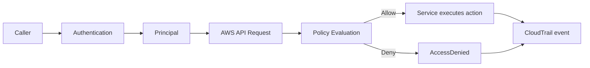
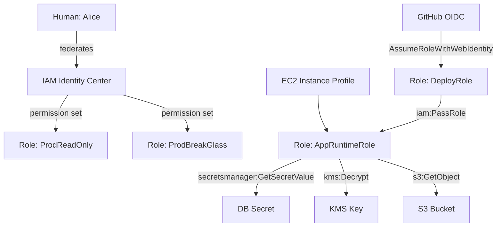
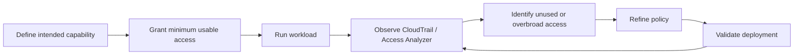

# Part 017 — IAM Mental Model

IAM adalah salah satu bagian AWS yang terlihat sederhana dari luar, tetapi menjadi sumber banyak insiden serius.

Bukan karena IAM sulit dibaca secara sintaks.

Tetapi karena IAM adalah **authorization engine untuk control plane AWS**.

Saat seseorang membuat S3 bucket, menghapus CloudTrail, membaca secret, menjalankan Lambda, membuat role baru, mengubah KMS key policy, membuka security group, atau mengambil snapshot database, semuanya melewati pertanyaan yang sama:

```text
Apakah principal ini boleh melakukan action ini terhadap resource ini, dalam context request ini?
```

Kalau pertanyaan itu tidak bisa dijawab secara deterministik, environment belum production-grade.

Part ini membangun mental model IAM dari first principles. Tujuannya bukan menghafal policy JSON, tetapi bisa membaca akses AWS seperti engineer membaca execution path program.

---

## 1. IAM Is Not a User Database

Kesalahan pertama adalah melihat IAM sebagai tempat menyimpan user.

Mental model yang lebih tepat:

```text
IAM adalah policy evaluation system untuk permintaan API AWS.
```

IAM mengevaluasi request yang masuk ke AWS API.

Request itu memiliki:

- principal,
- action,
- resource,
- request context,
- authentication state,
- account boundary,
- organization boundary,
- session boundary,
- dan policy set yang berlaku.

Karena AWS adalah platform berbasis API, IAM tidak hanya mengatur login manusia. IAM mengatur hampir semua operasi cloud.

Manusia, workload, service AWS, pipeline CI/CD, automation bot, federated identity, dan role session semuanya akhirnya muncul sebagai **principal** yang mencoba mengeksekusi **action**.

---

## 2. The Five Core Questions

Setiap analisis IAM harus direduksi menjadi lima pertanyaan:

```text
1. Who is calling?
2. What are they trying to do?
3. What resource are they touching?
4. Under what conditions?
5. Which boundaries constrain the request?
```

Dalam istilah IAM:

| Pertanyaan | IAM Concept |
|---|---|
| Who is calling? | Principal |
| What are they trying to do? | Action |
| What resource are they touching? | Resource |
| Under what conditions? | Condition / request context |
| Which boundaries constrain it? | SCP, RCP, permission boundary, session policy, resource policy, identity policy |

Jika salah satu pertanyaan tidak jelas, policy review akan dangkal.

Contoh review yang lemah:

```text
Policy ini hanya memberikan s3:GetObject, jadi aman.
```

Review yang benar:

```text
Principal apa yang mendapat permission ini?
Bucket atau prefix mana yang bisa dibaca?
Apakah ada condition untuk org ID, VPC endpoint, TLS, MFA, source account, atau encryption context?
Apakah role ini bisa diasumsikan dari account lain?
Apakah ada resource policy yang membuka akses dari luar identity policy?
Apakah akses ini dibatasi SCP/RCP/session policy?
```

---

## 3. IAM Request as an Event

Anggap setiap AWS API call sebagai event.



Request bukan hanya string action.

Request memiliki context:

- principal ARN,
- account ID,
- session name,
- source IP,
- VPC endpoint,
- MFA state,
- region,
- requested service,
- resource ARN,
- request tags,
- principal tags,
- source account,
- source ARN,
- organization ID,
- encryption context,
- called via service,
- dan metadata lain tergantung service.

IAM policy bukan hanya daftar allow/deny. Policy adalah program deklaratif yang dievaluasi terhadap request context.

---

## 4. Principal: The Caller After Authentication

Principal adalah entity yang membuat request ke AWS.

Principal bisa berupa:

- IAM user,
- IAM role,
- assumed role session,
- federated identity,
- AWS service principal,
- account principal,
- OIDC principal,
- SAML principal,
- workload identity,
- root user,
- atau role session dari proses automation.

Di production environment modern, manusia seharusnya jarang menggunakan IAM user. Pola yang lebih baik adalah:

```text
Human identity provider → IAM Identity Center / federation → permission set → IAM role → temporary session
```

Workload juga idealnya memakai temporary credentials:

```text
EC2 instance profile
ECS task role
Lambda execution role
EKS pod identity / IRSA
CI/CD OIDC role assumption
```

Yang perlu diingat:

```text
Policy melekat pada identity, tetapi request dieksekusi oleh session.
```

Ini penting untuk audit.

Role `ProdAdminRole` bukan identitas manusia. Ia adalah capability container. Yang harus bisa dilacak adalah siapa/apa yang masuk ke role itu, kapan, dari mana, dan dengan session metadata apa.

---

## 5. Action: The API Capability

Action merepresentasikan operasi yang ingin dilakukan.

Contoh:

```text
s3:GetObject
iam:PassRole
kms:Decrypt
ec2:AuthorizeSecurityGroupIngress
cloudtrail:StopLogging
secretsmanager:GetSecretValue
lambda:UpdateFunctionCode
organizations:AttachPolicy
```

Action terlihat seperti permission sederhana, tetapi dampaknya tidak selalu sama.

Beberapa action adalah read-only.

Beberapa action adalah write.

Beberapa action adalah privilege escalation primitive.

Beberapa action adalah data exfiltration primitive.

Beberapa action adalah audit tampering primitive.

Contoh action yang harus diperlakukan sebagai high-risk:

| Action | Risiko |
|---|---|
| `iam:CreatePolicyVersion` | Bisa mengganti managed policy menjadi lebih permisif jika versi baru dijadikan default. |
| `iam:AttachRolePolicy` | Bisa menambah permission ke role. |
| `iam:PassRole` | Bisa membuat service menjalankan role dengan permission lebih tinggi. |
| `sts:AssumeRole` | Bisa berpindah trust boundary. |
| `kms:Decrypt` | Bisa membuka data terenkripsi. |
| `secretsmanager:GetSecretValue` | Bisa mengambil kredensial aplikasi. |
| `cloudtrail:StopLogging` | Bisa mengganggu audit trail. |
| `ec2:ModifySnapshotAttribute` | Bisa membuka snapshot ke account lain. |
| `s3:PutBucketPolicy` | Bisa membuka data ke principal eksternal. |

Jangan menilai action hanya dari namanya.

Nilai action dari **capability graph** yang mungkin dibuka setelah action itu diberikan.

---

## 6. Resource: The Target and Its Granularity

Resource adalah objek yang disentuh action.

Contoh ARN:

```text
arn:aws:s3:::prod-customer-data
arn:aws:s3:::prod-customer-data/*
arn:aws:kms:ap-southeast-1:111122223333:key/abcd-1234
arn:aws:iam::111122223333:role/prod-payment-runtime
arn:aws:secretsmanager:ap-southeast-1:111122223333:secret:payment/db/password-AbCdEf
```

Resource granularity berbeda antar service.

Ada service/action yang mendukung resource-level permission.

Ada action yang hanya bisa memakai:

```json
"Resource": "*"
```

Ini bukan selalu kesalahan. Kadang AWS service memang tidak mendukung resource-level scoping untuk action tertentu.

Karena itu, review policy harus memakai Service Authorization Reference, bukan intuisi.

Pertanyaan review:

```text
Apakah action ini mendukung resource-level permission?
Jika tidak, condition apa yang bisa dipakai untuk mempersempit akses?
Jika resource harus wildcard, apakah action-nya high-risk?
Jika high-risk, apakah perlu permission boundary, SCP, approval workflow, atau dedicated role?
```

---

## 7. Condition: The Context Gate

Condition adalah bagian policy yang sering paling menentukan kualitas security.

Tanpa condition, policy hanya menjawab:

```text
Principal boleh action terhadap resource.
```

Dengan condition, policy bisa menjawab:

```text
Principal boleh action terhadap resource hanya jika request berasal dari organization ini,
melalui VPC endpoint ini, memakai TLS, dengan MFA, untuk tag tertentu,
dan hanya jika encryption context sesuai tenant/workload.
```

Contoh condition:

```json
{
  "Condition": {
    "StringEquals": {
      "aws:PrincipalOrgID": "o-exampleorgid",
      "aws:RequestedRegion": "ap-southeast-1"
    },
    "Bool": {
      "aws:SecureTransport": "true"
    }
  }
}
```

Condition adalah cara membuat policy lebih mirip kontrak daripada daftar akses.

Beberapa condition key penting:

| Condition Key | Kegunaan |
|---|---|
| `aws:PrincipalOrgID` | Membatasi principal dari AWS Organization tertentu. |
| `aws:PrincipalArn` | Membatasi principal spesifik. |
| `aws:SourceIp` | Membatasi source IP, hati-hati untuk private/network path yang kompleks. |
| `aws:SourceVpc` | Membatasi dari VPC tertentu untuk beberapa service path. |
| `aws:SourceVpce` | Membatasi akses lewat VPC endpoint tertentu. |
| `aws:SecureTransport` | Memaksa TLS. |
| `aws:MultiFactorAuthPresent` | Memaksa MFA untuk human-sensitive operations. |
| `aws:PrincipalTag/*` | ABAC berbasis tag principal. |
| `aws:ResourceTag/*` | ABAC berbasis tag resource. |
| `aws:RequestTag/*` | Mengontrol tag yang diminta saat create/update. |
| `aws:TagKeys` | Mengontrol key tag yang boleh dipakai. |
| `aws:CalledVia` | Mengontrol call chain lewat AWS service tertentu. |
| `kms:EncryptionContext:*` | Mengikat decrypt pada context tertentu. |

Condition adalah tempat banyak policy menjadi production-grade.

Tetapi condition juga tempat banyak bug lahir.

---

## 8. Effect: Allow and Deny Are Not Symmetric

Policy statement memiliki `Effect`:

```json
"Effect": "Allow"
```

atau:

```json
"Effect": "Deny"
```

Tetapi `Allow` dan `Deny` tidak simetris.

AWS memakai model default deny.

Artinya:

```text
No allow = deny.
Explicit deny = deny even if there is allow elsewhere.
```

Mental model:

```text
Allow membuka pintu hanya jika tidak ada boundary yang menutupnya.
Deny mengunci pintu dan tidak bisa dibuka oleh allow lain.
```

Ini membuat explicit deny cocok untuk guardrail.

Contoh:

```json
{
  "Effect": "Deny",
  "Action": [
    "cloudtrail:StopLogging",
    "cloudtrail:DeleteTrail"
  ],
  "Resource": "*"
}
```

Policy seperti ini tidak memberi siapa pun permission. Ia hanya memastikan action tertentu tidak dapat dilakukan oleh principal yang masuk dalam scope policy tersebut.

---

## 9. Identity-Based Policy vs Resource-Based Policy

Ada dua kelompok policy yang sering membingungkan:

```text
Identity-based policy: attached to principal.
Resource-based policy: attached to resource.
```

Identity-based policy menjawab:

```text
Apa yang boleh dilakukan principal ini?
```

Resource-based policy menjawab:

```text
Siapa yang boleh mengakses resource ini?
```

Contoh identity policy pada role aplikasi:

```json
{
  "Effect": "Allow",
  "Action": "s3:GetObject",
  "Resource": "arn:aws:s3:::prod-invoices/*"
}
```

Contoh resource policy pada bucket:

```json
{
  "Effect": "Allow",
  "Principal": {
    "AWS": "arn:aws:iam::111122223333:role/reporting-reader"
  },
  "Action": "s3:GetObject",
  "Resource": "arn:aws:s3:::prod-invoices/*"
}
```

Perbedaan ini penting dalam cross-account access.

Jika principal dari Account A ingin membaca bucket di Account B, maka umumnya perlu:

```text
Account A identity policy: principal boleh s3:GetObject ke bucket B.
Account B resource policy: bucket B mempercayai principal dari Account A.
```

Dengan kata lain, cross-account access sering membutuhkan izin dari dua sisi:

```text
caller side + resource owner side
```

---

## 10. Trust Policy Is Not Permission Policy

IAM role memiliki trust policy.

Trust policy menjawab:

```text
Siapa yang boleh assume role ini?
```

Permission policy menjawab:

```text
Setelah role diasumsikan, apa yang boleh dilakukan session role ini?
```

Jangan campur dua konsep ini.

Contoh trust policy:

```json
{
  "Effect": "Allow",
  "Principal": {
    "AWS": "arn:aws:iam::111122223333:role/ci-deploy-role"
  },
  "Action": "sts:AssumeRole"
}
```

Contoh permission policy pada role yang diasumsikan:

```json
{
  "Effect": "Allow",
  "Action": "lambda:UpdateFunctionCode",
  "Resource": "arn:aws:lambda:ap-southeast-1:444455556666:function:payment-*"
}
```

Trust policy bukan “apa yang bisa dilakukan role”.

Trust policy adalah “siapa yang bisa masuk ke role”.

Failure mode umum:

```text
Trust policy terlalu luas + permission policy kuat = privilege escalation path.
```

---

## 11. IAM as a Graph, Not a List

IAM lebih mudah dipahami sebagai graph.



Risiko bukan hanya policy individual.

Risiko muncul dari path:

```text
Can principal A become principal B?
Can principal B pass role C?
Can role C decrypt key D?
Can key D decrypt object E?
Can object E contain credentials for database F?
```

Karena itu, IAM review yang matang mencari path, bukan hanya statement.

---

## 12. Least Privilege Is a Lifecycle, Not a Starting State

Least privilege bukan berarti policy awal langsung sempurna.

Dalam sistem nyata, permission sering lahir dari kebutuhan delivery.

Production-grade approach:

```text
Start narrow enough.
Observe actual access.
Remove unused access.
Constrain high-risk action.
Add condition where possible.
Split role by responsibility.
Use boundary and guardrail for delegation.
Continuously review.
```

Least privilege adalah loop.



Jika organisasi mengharapkan engineer menulis policy sempurna dari awal tanpa feedback loop, hasilnya biasanya salah satu dari dua ekstrem:

```text
Terlalu sempit sehingga delivery macet.
Terlalu luas sehingga security menjadi formalitas.
```

---

## 13. Permission Boundary: Delegation Without Unlimited Delegation

Permission boundary adalah maksimum permission yang bisa diberikan oleh identity-based policy pada IAM user atau role.

Gunanya bukan untuk membatasi resource langsung.

Gunanya untuk membatasi apa yang bisa dicapai oleh identity yang diberi boundary.

Contoh mental model:

```text
Identity policy says: I want to allow X.
Permission boundary says: X is within allowed maximum.
Effective permission: allowed only if both agree.
```

Permission boundary sangat berguna saat platform/security team ingin memberi aplikasi kemampuan membuat role sendiri, tetapi tidak ingin aplikasi membuat role admin.

Contoh invariant:

```text
Developer automation may create roles only if every created role has approved boundary attached.
```

SCP dapat memaksa invariant ini:

```text
Deny iam:CreateRole unless iam:PermissionsBoundary equals approved boundary ARN.
```

Pola ini memungkinkan delegation yang aman:

```text
Central team controls maximum permission.
Product team controls implementation details within boundary.
```

---

## 14. `iam:PassRole`: The Permission That Often Matters More Than It Looks

`iam:PassRole` memungkinkan principal menyerahkan IAM role ke AWS service.

Contoh:

- menjalankan EC2 dengan instance profile,
- membuat Lambda dengan execution role,
- menjalankan ECS task dengan task role,
- membuat Glue job dengan role,
- menjalankan Step Functions dengan execution role.

Risikonya:

```text
Principal tidak perlu bisa assume role secara langsung.
Principal bisa membuat service menjalankan role itu untuknya.
```

Contoh privilege escalation:

```text
Developer role tidak punya secretsmanager:GetSecretValue.
Tetapi developer role punya lambda:CreateFunction dan iam:PassRole ke AdminExecutionRole.
Developer membuat Lambda dengan AdminExecutionRole.
Lambda membaca secret.
Developer membaca output Lambda.
```

Karena itu, `iam:PassRole` harus selalu dibatasi dengan:

- resource role spesifik,
- service target via `iam:PassedToService`,
- naming convention,
- permission boundary,
- SCP guardrail,
- dan deployment pipeline review.

Contoh pattern:

```json
{
  "Effect": "Allow",
  "Action": "iam:PassRole",
  "Resource": "arn:aws:iam::111122223333:role/app/payment-*",
  "Condition": {
    "StringEquals": {
      "iam:PassedToService": "lambda.amazonaws.com"
    }
  }
}
```

---

## 15. Wildcards: Sometimes Necessary, Often Dangerous

Wildcards muncul dalam dua bentuk:

```json
"Action": "s3:*"
```

atau:

```json
"Resource": "*"
```

Keduanya tidak otomatis salah.

Tetapi keduanya harus dijelaskan.

Review checklist:

```text
Kenapa wildcard diperlukan?
Apakah service/action mendukung resource-level permission?
Apakah wildcard mencakup privilege escalation action?
Apakah ada condition yang mempersempit akses?
Apakah ada SCP/RCP/boundary yang membatasi efeknya?
Apakah wildcard hanya berlaku pada sandbox atau automation role khusus?
Apakah ada expiry/exception record?
```

Wildcard tanpa penjelasan adalah smell.

Wildcard dengan boundary, condition, scope, owner, dan evidence bisa saja defensible.

---

## 16. `NotAction` and `NotResource`: Sharp Tools

`NotAction` dan `NotResource` sering membuat policy lebih pendek, tetapi juga lebih berisiko.

Contoh berbahaya:

```json
{
  "Effect": "Allow",
  "NotAction": "iam:*",
  "Resource": "*"
}
```

Niatnya mungkin:

```text
Allow semua kecuali IAM.
```

Masalahnya:

```text
Semua service baru yang bukan IAM ikut allowed.
Banyak privilege escalation path tidak ada di IAM saja.
```

`NotAction` lebih aman saat dipakai dengan `Deny`, misalnya untuk deny semua region kecuali region yang disetujui, sambil mengecualikan global services.

Tetapi rule-nya tetap:

```text
Gunakan NotAction/NotResource hanya jika reviewer bisa menjelaskan universe yang sedang dinegasikan.
```

Jika tidak bisa menjelaskan universe-nya, jangan pakai.

---

## 17. ABAC: Powerful, But Only If Tag Governance Exists

Attribute-Based Access Control memakai attribute seperti tag principal, tag resource, dan request tag.

Contoh:

```json
{
  "Effect": "Allow",
  "Action": "dynamodb:*",
  "Resource": "arn:aws:dynamodb:ap-southeast-1:111122223333:table/*",
  "Condition": {
    "StringEquals": {
      "aws:ResourceTag:app": "${aws:PrincipalTag/app}"
    }
  }
}
```

ABAC terlihat elegan.

Tetapi ABAC aman hanya jika tag aman.

Pertanyaan penting:

```text
Siapa boleh mengubah principal tag?
Siapa boleh mengubah resource tag?
Siapa boleh membuat resource dengan request tag tertentu?
Apakah tag immutable setelah resource dibuat?
Apakah tag diverifikasi oleh Config/IaC policy?
Apakah ada reserved tag namespace?
```

ABAC tanpa tag governance adalah privilege escalation dengan label rapi.

---

## 18. Resource Policy: External Access Starts Here

Banyak resource AWS punya resource-based policy:

- S3 bucket policy,
- KMS key policy,
- SQS queue policy,
- SNS topic policy,
- Lambda function policy,
- Secrets Manager resource policy,
- ECR repository policy,
- EventBridge event bus policy,
- API Gateway resource policy,
- IAM role trust policy.

Resource policy adalah salah satu tempat utama external access muncul.

Review resource policy dengan pertanyaan:

```text
Apakah Principal menggunakan wildcard?
Apakah Principal berasal dari account/organization yang benar?
Apakah ada aws:PrincipalOrgID?
Apakah ada aws:SourceArn dan aws:SourceAccount untuk service principal?
Apakah policy memberi akses cross-account?
Apakah resource ini menyimpan data sensitif?
Apakah Access Analyzer menemukan external access?
```

Contoh safer service principal pattern:

```json
{
  "Effect": "Allow",
  "Principal": {
    "Service": "cloudtrail.amazonaws.com"
  },
  "Action": "s3:PutObject",
  "Resource": "arn:aws:s3:::org-cloudtrail-logs/AWSLogs/111122223333/*",
  "Condition": {
    "StringEquals": {
      "aws:SourceAccount": "111122223333"
    },
    "ArnLike": {
      "aws:SourceArn": "arn:aws:cloudtrail:*:111122223333:trail/*"
    }
  }
}
```

---

## 19. IAM Review Heuristics

Saat membaca policy, jangan mulai dari formatting.

Mulai dari capability.

Checklist ringkas:

```text
1. Apa capability bisnis/operasional yang policy ini berikan?
2. Principal mana yang mendapatkan capability itu?
3. Apakah principal human, workload, service, atau automation?
4. Apakah credentials-nya temporary?
5. Apakah resource-nya scoped?
6. Apakah action high-risk?
7. Apakah ada condition yang relevan?
8. Apakah ada path privilege escalation?
9. Apakah ada path data exfiltration?
10. Apakah ada path audit tampering?
11. Apakah ada boundary organisasi/account/session?
12. Apakah CloudTrail bisa mengatribusikan request ke owner sebenarnya?
13. Apakah akses ini punya owner dan expiry?
```

Review IAM yang baik biasanya menemukan path, bukan typo.

---

## 20. IAM Smells

Beberapa smell yang harus memicu review lebih dalam:

| Smell | Mengapa berbahaya |
|---|---|
| `Action: *` | Semua action sekarang dan masa depan dalam scope. |
| `Resource: *` pada high-risk action | Tidak ada pembatas target. |
| `Principal: *` pada resource policy | Potensi public/external access. |
| Trust policy account-wide tanpa external ID/condition | Mudah menjadi confused deputy/cross-account abuse. |
| `iam:*` | Hampir selalu privilege escalation. |
| `iam:PassRole` ke wildcard role | Service bisa menjalankan role kuat. |
| `kms:Decrypt` ke wildcard key | Data boundary runtuh. |
| `secretsmanager:GetSecretValue` ke wildcard secret | Credential exfiltration. |
| Tidak ada condition pada cross-account access | Sulit membedakan akses sah dan tidak sah. |
| Long-lived IAM user access key | Credential leakage risk tinggi. |
| Human admin role tanpa MFA condition | Human access terlalu lemah. |
| Role session name tidak distandardkan | Audit attribution buruk. |

Smell bukan otomatis bug.

Smell berarti harus ada alasan engineering yang kuat.

---

## 21. IAM Invariants for Production

Beberapa invariant IAM yang sehat:

```text
Human access uses federation, not long-lived IAM users.
Production admin access is time-bound and auditable.
Root user is not used for daily operations.
Every workload uses role-based temporary credentials.
Cross-account access is explicit and owned.
High-risk actions are guarded by boundary/SCP/approval.
iam:PassRole is scoped by role and service.
Resource policies do not allow public/external access unless approved.
KMS key usage is separate from KMS key administration.
Permission changes are deployed through reviewable automation.
CloudTrail records all management plane access.
Unused access is reviewed and reduced continuously.
```

IAM maturity bukan berarti tidak ada admin role.

IAM maturity berarti setiap powerful capability memiliki:

```text
owner + reason + scope + boundary + audit + expiry + emergency path
```

---

## 22. Mini Case Study: Safe Deployment Role

Misalnya tim payment butuh deployment role untuk update Lambda.

Naive role:

```json
{
  "Effect": "Allow",
  "Action": "*",
  "Resource": "*"
}
```

Sedikit lebih baik tetapi masih lemah:

```json
{
  "Effect": "Allow",
  "Action": "lambda:*",
  "Resource": "*"
}
```

Lebih production-grade:

```json
{
  "Effect": "Allow",
  "Action": [
    "lambda:GetFunction",
    "lambda:UpdateFunctionCode",
    "lambda:UpdateFunctionConfiguration",
    "lambda:PublishVersion",
    "lambda:CreateAlias",
    "lambda:UpdateAlias"
  ],
  "Resource": "arn:aws:lambda:ap-southeast-1:111122223333:function:payment-*"
}
```

Dengan `iam:PassRole` terpisah:

```json
{
  "Effect": "Allow",
  "Action": "iam:PassRole",
  "Resource": "arn:aws:iam::111122223333:role/app/payment-lambda-*",
  "Condition": {
    "StringEquals": {
      "iam:PassedToService": "lambda.amazonaws.com"
    }
  }
}
```

Dan guardrail:

```text
SCP denies creating or updating Lambda outside approved regions.
Permission boundary prevents deployment role from creating admin roles.
Resource policy prevents external invocation unless approved.
CloudTrail tracks every deployment call.
Config detects functions missing required tags/logging/tracing.
```

Itulah perbedaan antara “bisa deploy” dan “bisa deploy dengan defensible control”.

---

## 23. Debugging Access Without Guessing

Saat menerima error AccessDenied, jangan langsung menambah permission.

Gunakan proses:

```text
1. Identify caller principal ARN.
2. Identify action denied.
3. Identify resource ARN.
4. Identify account and region.
5. Check explicit deny first.
6. Check SCP/RCP.
7. Check identity policy.
8. Check resource policy.
9. Check permission boundary.
10. Check session policy.
11. Check trust policy if assume role fails.
12. Check condition mismatch.
13. Validate with policy simulator / Access Analyzer where applicable.
14. Add narrow permission or fix boundary, not broad wildcard.
```

IAM debugging yang buruk:

```text
Tambahkan AdministratorAccess dulu supaya jalan.
```

IAM debugging yang baik:

```text
Cari policy layer mana yang menolak atau tidak memberi allow.
```

---

## 24. What You Should Internalize

IAM adalah bahasa kontrol utama AWS.

Kalau networking adalah topology, IAM adalah capability system.

Jangan membaca IAM sebagai file JSON.

Baca IAM sebagai:

```text
principal → action → resource → context → boundary → decision → evidence
```

Engineer top-tier tidak hanya bertanya:

```text
Policy ini benar atau salah?
```

Ia bertanya:

```text
Capability apa yang muncul dari policy ini?
Path abuse apa yang mungkin terjadi?
Control boundary apa yang membatasi blast radius?
Bagaimana kita membuktikan akses ini sah?
Bagaimana akses ini berkurang seiring waktu?
```

Itulah mental model IAM yang akan dipakai di part berikutnya ketika kita membedah policy evaluation engine secara lebih formal.

---

## References

- AWS IAM User Guide — Policies and permissions in IAM: https://docs.aws.amazon.com/IAM/latest/UserGuide/access_policies.html
- AWS IAM User Guide — IAM JSON policy element reference: https://docs.aws.amazon.com/IAM/latest/UserGuide/reference_policies_elements.html
- AWS IAM User Guide — Principal element: https://docs.aws.amazon.com/IAM/latest/UserGuide/reference_policies_elements_principal.html
- AWS IAM User Guide — Condition element: https://docs.aws.amazon.com/IAM/latest/UserGuide/reference_policies_elements_condition.html
- AWS IAM User Guide — Condition operators: https://docs.aws.amazon.com/IAM/latest/UserGuide/reference_policies_elements_condition_operators.html
- AWS Service Authorization Reference — Actions, resources, and condition keys: https://docs.aws.amazon.com/service-authorization/latest/reference/reference_policies_actions-resources-contextkeys.html
- AWS IAM User Guide — Policy evaluation logic: https://docs.aws.amazon.com/IAM/latest/UserGuide/reference_policies_evaluation-logic.html
- AWS IAM User Guide — Difference between explicit and implicit denies: https://docs.aws.amazon.com/IAM/latest/UserGuide/reference_policies_evaluation-logic_AccessPolicyLanguage_Interplay.html
- AWS IAM User Guide — Permissions boundaries for IAM entities: https://docs.aws.amazon.com/IAM/latest/UserGuide/access_policies_boundaries.html
