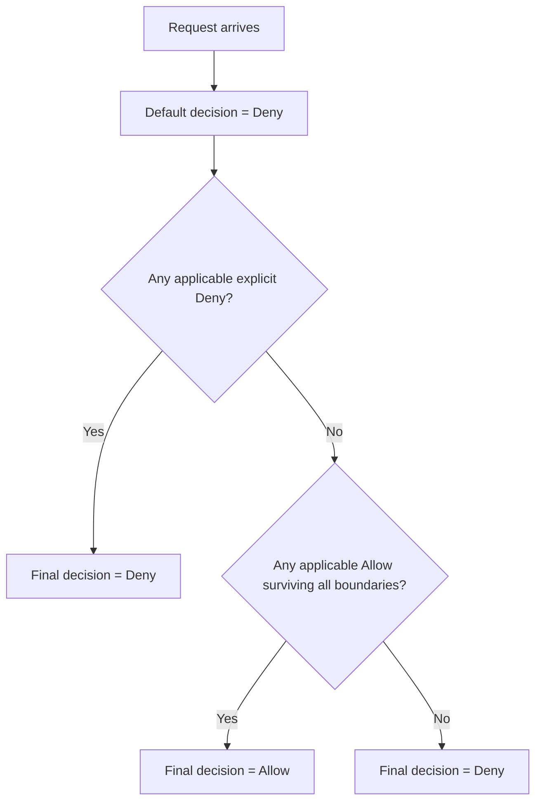
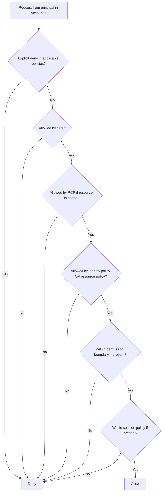
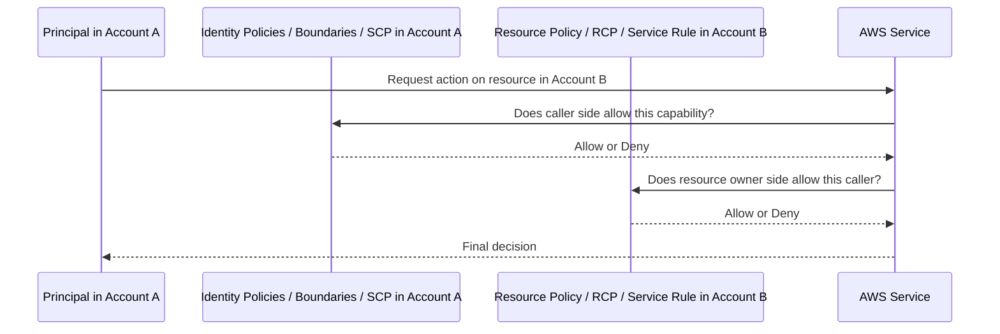
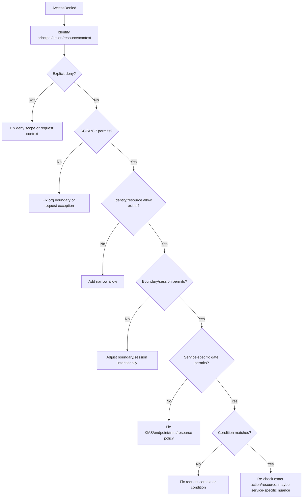

# Part 018 — IAM Policy Evaluation Engine

Part sebelumnya membangun mental model IAM.

Sekarang kita masuk ke mesin evaluasinya.

IAM policy evaluation harus dibaca seperti program authorization.

Input-nya adalah request.

Output-nya hanya satu dari dua:

```text
Allow
Deny
```

Tetapi jalan menuju output itu tidak sederhana, karena AWS bisa mengevaluasi banyak policy layer sekaligus:

- identity-based policy,
- resource-based policy,
- trust policy,
- service control policy,
- resource control policy,
- permission boundary,
- session policy,
- VPC endpoint policy,
- KMS key policy,
- dan service-specific authorization rule.

Part ini membahas cara berpikir deterministik agar IAM tidak terasa seperti trial-and-error.

---

## 1. The Request Tuple

Setiap AWS API request bisa direpresentasikan sebagai tuple:

```text
Request = {
  principal,
  action,
  resource,
  context
}
```

Contoh:

```text
principal = arn:aws:sts::111122223333:assumed-role/PaymentDeployRole/github-run-9912
action    = lambda:UpdateFunctionCode
resource  = arn:aws:lambda:ap-southeast-1:111122223333:function:payment-authorizer
context   = {
  requestedRegion = ap-southeast-1,
  principalOrgID = o-example,
  sourceIp = 203.0.113.10,
  mfaPresent = false,
  sessionName = github-run-9912,
  principalTags = { app = payment, env = prod }
}
```

IAM tidak mengevaluasi “role” secara abstrak.

IAM mengevaluasi request konkret.

Karena itu, policy yang terlihat benar bisa gagal jika context tidak cocok.

Contoh:

```text
Policy allow s3:GetObject only via aws:SourceVpce = vpce-abc.
Request datang lewat public endpoint.
Result: deny.
```

---

## 2. Default Deny Is the Ground State

Ground state IAM adalah deny.

```text
Unless there is an applicable allow, the request is denied.
```

Ini disebut implicit deny.



Jadi pertanyaan debugging pertama bukan:

```text
Policy mana yang allow?
```

Tetapi:

```text
Apakah ada explicit deny?
```

Karena explicit deny menang atas semua allow.

---

## 3. Explicit Deny Wins Globally Within the Applicable Policy Set

Jika ada `Deny` yang berlaku terhadap request, hasil akhir adalah deny.

Tidak peduli ada berapa `Allow` lain.

Contoh:

```json
{
  "Effect": "Deny",
  "Action": "s3:GetObject",
  "Resource": "arn:aws:s3:::prod-data/private/*"
}
```

Jika request cocok dengan action dan resource ini, request akan ditolak meskipun identity policy lain memberikan:

```json
{
  "Effect": "Allow",
  "Action": "s3:GetObject",
  "Resource": "arn:aws:s3:::prod-data/*"
}
```

Mental model:

```text
Deny is an interrupt.
Allow is only considered if no deny interrupts.
```

Ini sebabnya explicit deny cocok untuk:

- SCP guardrail,
- RCP data perimeter,
- bucket policy protection,
- KMS key protection,
- deny insecure transport,
- deny outside organization,
- deny non-approved regions,
- deny audit tampering.

Tetapi explicit deny juga berbahaya jika condition salah.

Satu deny yang terlalu luas bisa mematikan operasi produksi.

---

## 4. Policy Types Are Not All Additive

Kesalahan umum:

```text
Kalau ada allow di satu policy, berarti allowed.
```

Ini salah.

Beberapa policy bersifat additive.

Beberapa policy bersifat boundary.

Beberapa policy bersifat trust gate.

| Policy Type | Attached To | Role in Evaluation |
|---|---|---|
| Identity-based policy | IAM user/group/role | Memberi allow/deny ke principal. |
| Resource-based policy | Resource | Memberi allow/deny dari sisi resource. |
| Trust policy | IAM role | Menentukan siapa boleh assume role. |
| SCP | AWS Organizations root/OU/account | Permission ceiling untuk principal di member account. |
| RCP | AWS Organizations root/OU/account | Resource-side permission ceiling untuk resource di member account. |
| Permission boundary | IAM user/role | Maximum permission dari identity-based policy. |
| Session policy | STS session | Membatasi session temporary credential. |
| VPC endpoint policy | VPC endpoint | Membatasi akses lewat endpoint tertentu. |
| KMS key policy | KMS key | Gate utama untuk akses key. |

Jadi policy evaluation bukan sekadar union.

Ia adalah kombinasi:

```text
union + intersection + explicit deny + trust validation + service-specific rule
```

---

## 5. Boolean Model

Untuk menyederhanakan, pikirkan evaluasi sebagai boolean expression.

Untuk same-account request biasa:

```text
Allowed =
  NoExplicitDeny
  AND AllowedBySCP
  AND AllowedByRCPIfRelevant
  AND AllowedByIdentityOrResourcePolicy
  AND WithinPermissionBoundaryIfPresent
  AND WithinSessionPolicyIfPresent
  AND ServiceSpecificChecksPass
```

Untuk cross-account request:

```text
Allowed =
  CallerAccountAllowsPrincipal
  AND ResourceAccountAllowsAccess
  AND NoExplicitDenyOnEitherSide
  AND BoundariesPass
  AND ConditionsPass
```

Ini bukan representasi lengkap semua edge case, tetapi mental model ini cukup kuat untuk debugging.

---

## 6. Same-Account Evaluation: Identity and Resource Policies

Dalam account yang sama, identity-based policy dan resource-based policy umumnya berkontribusi sebagai union allow.

Jika identity policy allow, request bisa allowed.

Jika resource policy allow, request juga bisa allowed.

Tetapi tetap harus melewati deny dan boundary.



Important nuance:

```text
A resource-based policy can allow access to a principal even when the identity policy does not contain that allow, depending on principal type and policy context.
```

Karena itu, audit IAM tidak cukup dengan membaca policy yang attached ke role.

Harus baca resource policy juga.

---

## 7. SCP: Organization-Side Permission Ceiling

SCP tidak memberi permission.

SCP hanya membatasi maksimum permission untuk IAM users dan roles dalam member account.

Jika SCP tidak mengizinkan action, identity policy tidak bisa menghidupkannya.

Mental model:

```text
Identity policy says: role may do X.
SCP says: account may not do X.
Result: denied.
```

Contoh:

```json
{
  "Effect": "Deny",
  "Action": [
    "cloudtrail:StopLogging",
    "cloudtrail:DeleteTrail"
  ],
  "Resource": "*"
}
```

Jika SCP ini attached ke production OU, bahkan admin role di account production tidak bisa stop CloudTrail, kecuali ada exception desain yang valid.

SCP cocok untuk invariant lintas account:

```text
No account may leave organization.
No member account may disable CloudTrail/Config/GuardDuty.
No workload account may create IAM user access keys.
No prod account may use non-approved regions.
No non-security account may modify centralized log archive.
```

SCP tidak cocok untuk:

```text
Memberikan akses aplikasi ke database.
Memberikan read-only access ke developer.
Mengatur object-level application permission.
```

Karena SCP bukan grant mechanism.

---

## 8. RCP: Resource-Side Permission Ceiling

Resource Control Policy atau RCP membatasi maksimum permission terhadap resource dalam member account.

Jika SCP membatasi sisi principal di account, RCP membantu membatasi sisi resource.

Mental model:

```text
Resource policy says: external principal may access this resource.
RCP says: resources in this OU may not be accessed outside organization.
Result: denied.
```

RCP berguna untuk data perimeter.

Contoh invariant:

```text
S3 buckets in regulated OU must not be accessed by principals outside this AWS Organization.
KMS keys in production OU must not be used by principals outside approved accounts.
Secrets in workload accounts must not be shared externally.
```

RCP tidak menggantikan resource policy.

RCP adalah boundary.

Resource policy tetap menentukan access grant. RCP menentukan apakah grant itu masih berada dalam maksimum yang diizinkan organisasi.

---

## 9. Permission Boundary: Identity-Level Maximum

Permission boundary membatasi maximum permission untuk IAM user/role.

Formula sederhananya:

```text
Effective identity permission = identity policy ∩ permission boundary
```

Jika identity policy allow `s3:*`, tetapi boundary hanya allow `s3:GetObject`, maka principal hanya bisa `s3:GetObject`.

Jika boundary tidak allow action tertentu, identity policy tidak bisa memberinya.

Contoh use case:

```text
Platform team mengizinkan application team membuat IAM role sendiri,
tetapi setiap role wajib memakai boundary yang mencegah IAM admin, audit tampering, KMS admin, dan organization-level action.
```

Boundary sangat penting untuk delegated administration.

Tanpa boundary, memberi `iam:CreateRole` ke team bisa menjadi jalan ke admin penuh.

---

## 10. Session Policy: Temporary Credential Scope Reducer

Session policy diberikan saat membuat STS session.

Session policy tidak menambah permission.

Ia hanya mengurangi permission session.

Formula:

```text
Effective session permission = role permission ∩ session policy
```

Contoh:

Role `DataAccessRole` punya permission membaca banyak prefix S3.

Saat user mengambil session, broker memberi session policy yang hanya allow prefix tertentu:

```text
arn:aws:s3:::analytics-data/team-a/*
```

Maka session itu hanya bisa membaca prefix team-a meskipun role dasarnya lebih luas.

Session policy cocok untuk:

- just-in-time access,
- scoped break-glass,
- tenant-specific data access,
- temporary CI/CD deployment scope,
- delegated access broker.

Tetapi session policy tidak memperbaiki trust policy yang terlalu luas.

Jika terlalu banyak pihak bisa assume role, session policy harus dikontrol oleh broker yang terpercaya.

---

## 11. Trust Policy Evaluation: Can the Caller Become the Role?

Saat request adalah `sts:AssumeRole`, AWS mengevaluasi trust policy role target.

Ada dua sisi:

```text
Caller must be allowed to call sts:AssumeRole.
Target role trust policy must trust caller.
```

Contoh caller identity policy:

```json
{
  "Effect": "Allow",
  "Action": "sts:AssumeRole",
  "Resource": "arn:aws:iam::444455556666:role/ProdDeployRole"
}
```

Contoh target trust policy:

```json
{
  "Effect": "Allow",
  "Principal": {
    "AWS": "arn:aws:iam::111122223333:role/CICDBrokerRole"
  },
  "Action": "sts:AssumeRole",
  "Condition": {
    "StringEquals": {
      "sts:ExternalId": "deploy-prod-payment"
    }
  }
}
```

Jika salah satu sisi gagal, assume role gagal.

Failure mode:

```text
Caller has sts:AssumeRole but target role does not trust caller.
Result: deny.
```

Atau:

```text
Target role trusts caller but caller lacks sts:AssumeRole permission.
Result: deny.
```

Trust policy harus diperlakukan sebagai exposed surface.

Semakin kuat permission role target, semakin ketat trust policy harus dibuat.

---

## 12. Cross-Account Evaluation

Cross-account access lebih mudah dipahami sebagai two-party authorization.



Contoh Account A role ingin membaca S3 bucket di Account B.

Caller side:

```json
{
  "Effect": "Allow",
  "Action": "s3:GetObject",
  "Resource": "arn:aws:s3:::prod-shared-data/*"
}
```

Resource side:

```json
{
  "Effect": "Allow",
  "Principal": {
    "AWS": "arn:aws:iam::111122223333:role/AnalyticsReader"
  },
  "Action": "s3:GetObject",
  "Resource": "arn:aws:s3:::prod-shared-data/*"
}
```

Jika caller policy ada tetapi bucket policy tidak trust caller, deny.

Jika bucket policy trust caller tetapi caller side boundary/SCP/session policy melarang, deny.

Cross-account access harus ditulis sebagai contract:

```text
Who is trusted?
For what action?
On which resource?
From which organization/account/source?
With which audit owner?
Until when?
```

---

## 13. KMS Key Policy Is Special Enough to Treat Carefully

KMS sering menjadi sumber kebingungan karena key policy sangat penting dalam evaluasi access.

Untuk banyak resource, identity policy cukup jika resource policy tidak membatasi.

Untuk KMS, key policy menentukan siapa yang bisa memakai atau mendelegasikan access ke key.

Mental model:

```text
KMS key policy is the authority root for the key.
IAM policy can help only if key policy allows IAM-based delegation.
```

Implikasi:

```text
A role can have kms:Decrypt in identity policy, but still fail if key policy does not allow that principal or account path.
```

KMS juga sering memakai encryption context.

Contoh pattern:

```json
{
  "Effect": "Allow",
  "Action": "kms:Decrypt",
  "Resource": "*",
  "Condition": {
    "StringEquals": {
      "kms:EncryptionContext:app": "payment"
    }
  }
}
```

KMS policy review harus memisahkan:

```text
Key administration: create, update, delete, schedule deletion, manage grants.
Key usage: encrypt, decrypt, generate data key.
Grant management: allow AWS services or workloads to use key under constraints.
```

Jangan gabungkan semua dalam satu admin role luas kecuali untuk break-glass yang sangat dikontrol.

---

## 14. VPC Endpoint Policy Is Another Gate

VPC endpoint policy membatasi request yang melewati endpoint tertentu.

Misalnya workload tidak punya internet egress dan mengakses S3 via gateway endpoint/interface endpoint.

Walaupun IAM identity policy allow dan bucket policy allow, endpoint policy bisa deny.

Mental model:

```text
IAM says who may do what.
Endpoint policy says what traffic through this endpoint is allowed to request.
```

Endpoint policy berguna untuk data perimeter:

```text
Only allow S3 access to organization-approved buckets through this endpoint.
Only allow Secrets Manager access to secrets in this account.
Only allow DynamoDB access to specific tables.
```

Tetapi endpoint policy bukan pengganti IAM.

Ia hanya berlaku untuk path melalui endpoint itu.

Jika resource juga dapat diakses lewat path lain, endpoint policy tidak cukup.

---

## 15. Evaluation with Conditions

Condition dievaluasi terhadap request context.

Jika condition tidak match, statement dianggap tidak applicable.

Contoh:

```json
{
  "Effect": "Allow",
  "Action": "s3:GetObject",
  "Resource": "arn:aws:s3:::prod-data/*",
  "Condition": {
    "StringEquals": {
      "aws:SourceVpce": "vpce-123456"
    }
  }
}
```

Jika request tidak punya `aws:SourceVpce = vpce-123456`, statement allow ini tidak berlaku.

Akibatnya bisa implicit deny.

Hal yang sering keliru:

```text
Policy ada Allow, tetapi Allow tidak applicable karena condition mismatch.
```

Condition debugging harus memeriksa actual request context dari CloudTrail jika tersedia.

Beberapa condition key tidak selalu hadir pada semua request.

Jika key tidak hadir, operator tertentu bisa menghasilkan match yang berbeda tergantung operatornya, misalnya `...IfExists`.

Karena itu condition harus diuji, bukan diasumsikan.

---

## 16. Decision Table: Common Scenarios

| Scenario | Result | Reason |
|---|---|---|
| No policy allows action | Deny | Implicit deny. |
| Identity policy allows, no boundary, no deny | Allow | Same-account normal allow. |
| Identity policy allows, SCP denies | Deny | SCP boundary wins. |
| Identity policy allows, permission boundary omits action | Deny | Boundary intersection removes action. |
| Role permission allows, session policy omits action | Deny | Session policy reduces session. |
| Bucket policy allows external principal, caller identity lacks allow | Usually deny | Cross-account caller side also needs permission unless using specific resource policy semantics. |
| Bucket policy allows public principal, RCP denies external access | Deny | RCP resource ceiling wins. |
| Trust policy allows caller, caller lacks `sts:AssumeRole` | Deny | Caller side cannot invoke assume role. |
| Caller has `sts:AssumeRole`, trust policy does not trust caller | Deny | Target role rejects caller. |
| Identity allows `kms:Decrypt`, key policy does not allow path | Deny | KMS key policy gate. |
| Allow condition requires MFA, request has no MFA | Deny | Allow statement not applicable. |
| Explicit deny condition matches | Deny | Explicit deny wins. |

---

## 17. AccessDenied Debugging Algorithm

When debugging, do not add `AdministratorAccess`.

Run the evaluation backward.

```text
1. Capture exact error.
2. Identify caller principal ARN.
3. Identify whether principal is user, role, assumed-role session, service principal, or federated session.
4. Identify action.
5. Identify resource ARN.
6. Identify account owner of principal.
7. Identify account owner of resource.
8. Determine same-account or cross-account.
9. Search for explicit deny.
10. Check SCP on principal account.
11. Check RCP on resource account if applicable.
12. Check identity policy attached to caller role/user.
13. Check permission boundary on caller identity.
14. Check session policy if temporary credential is used.
15. Check resource policy.
16. Check trust policy if the failure is assume role.
17. Check service-specific policy such as KMS key policy or VPC endpoint policy.
18. Check condition keys and actual request context.
19. Apply the narrowest fix.
20. Add regression test or analyzer rule if this should not recur.
```

Mermaid version:



---

## 18. Example: Why Admin Role Still Cannot Stop CloudTrail

Scenario:

```text
Principal: arn:aws:sts::111122223333:assumed-role/AccountAdmin/Alice
Action: cloudtrail:StopLogging
Resource: arn:aws:cloudtrail:ap-southeast-1:111122223333:trail/org-trail
```

Identity policy:

```json
{
  "Effect": "Allow",
  "Action": "*",
  "Resource": "*"
}
```

SCP attached to production OU:

```json
{
  "Effect": "Deny",
  "Action": [
    "cloudtrail:StopLogging",
    "cloudtrail:DeleteTrail"
  ],
  "Resource": "*"
}
```

Evaluation:

```text
Explicit deny? Yes, from SCP.
Final decision: Deny.
```

This is correct.

The purpose of account admin is to operate workload, not to disable audit.

---

## 19. Example: Why Role Cannot Decrypt Secret

Scenario:

```text
Role has secretsmanager:GetSecretValue.
Secret uses customer managed KMS key.
Application fails reading secret.
```

Possible policies:

```json
{
  "Effect": "Allow",
  "Action": "secretsmanager:GetSecretValue",
  "Resource": "arn:aws:secretsmanager:ap-southeast-1:111122223333:secret:payment/db/password-*"
}
```

But role lacks:

```json
{
  "Effect": "Allow",
  "Action": "kms:Decrypt",
  "Resource": "arn:aws:kms:ap-southeast-1:111122223333:key/abcd-1234"
}
```

Or KMS key policy does not allow the role/account path.

Evaluation:

```text
Secrets Manager permission may pass.
KMS decrypt gate fails.
Final result: AccessDenied.
```

Lesson:

```text
Data access often requires both data-plane permission and key usage permission.
```

---

## 20. Example: Why CI/CD Can Deploy Too Much

Scenario:

```text
GitHub OIDC role can deploy any Lambda and pass any role.
```

Policy:

```json
{
  "Effect": "Allow",
  "Action": [
    "lambda:*",
    "iam:PassRole"
  ],
  "Resource": "*"
}
```

This is not merely broad.

It creates escalation path:

```text
Update any Lambda → pass powerful execution role → execute arbitrary code → read secrets/data.
```

Better design:

```text
lambda actions scoped to payment-* functions.
iam:PassRole scoped to app/payment-* roles.
iam:PassedToService condition = lambda.amazonaws.com.
Permission boundary on deploy role.
SCP denies passing security/audit/admin roles.
CloudTrail/EventBridge detects high-risk deployment events.
```

Policy evaluation thinking reveals capability graph, not just permission string.

---

## 21. Example: Resource Policy Opens External Access Despite Internal IAM Discipline

Scenario:

```text
All internal roles are least-privilege.
But S3 bucket policy allows external account root.
```

Bucket policy:

```json
{
  "Effect": "Allow",
  "Principal": {
    "AWS": "arn:aws:iam::999988887777:root"
  },
  "Action": "s3:GetObject",
  "Resource": "arn:aws:s3:::prod-data/*"
}
```

Internal IAM review would not catch this if it only inspects identity policies.

Required controls:

```text
IAM Access Analyzer external access finding.
Security Hub control/finding ingestion.
RCP denying external access for sensitive OU.
S3 Block Public Access where relevant.
Resource policy review in CI.
CloudTrail data event monitoring for sensitive bucket.
```

Resource-side access must be reviewed as seriously as identity-side access.

---

## 22. Common Misdiagnoses

| Symptom | Weak diagnosis | Better diagnosis |
|---|---|---|
| AccessDenied | “Need admin access.” | Identify exact denied action/resource and failing policy layer. |
| Role cannot assume another role | “Trust policy broken.” | Check both caller permission and target trust policy. |
| S3 access denied | “Bucket policy issue.” | Check identity policy, bucket policy, SCP/RCP, KMS, VPC endpoint, object ownership, condition. |
| KMS denied | “Need kms:*.” | Check key policy, grants, encryption context, caller identity, service integration. |
| Lambda deploy denied | “Need lambda:*.” | Check `iam:PassRole`, function ARN, boundary, deployment role scope. |
| Works in dev, fails in prod | “Prod is weird.” | Prod likely has SCP/RCP/boundary/condition guardrails dev lacks. |
| Policy simulator says allowed but runtime denies | “AWS bug.” | Check service-specific gate, resource policy, endpoint policy, KMS, session context, or request mismatch. |

---

## 23. Access Decision Must Be Observable

IAM decision should leave evidence.

For production-grade operations, each high-risk access should be observable through:

- CloudTrail management events,
- CloudTrail data events where needed,
- session name/source identity,
- IAM Identity Center attribution,
- role assumption event,
- EventBridge rules for high-risk actions,
- Security Hub/IAM Access Analyzer findings,
- ticket/change request link,
- and exception registry.

A permission that cannot be audited is operational debt.

A deny that cannot be explained is also operational debt.

---

## 24. Policy Evaluation as Engineering Contract

For every powerful role, define an access contract:

```text
Role: ProdPaymentDeployRole
Purpose: Deploy payment Lambda functions.
Caller: CI/CD broker role from tooling account via OIDC.
Trust: Only approved repository/environment claims.
Allowed actions: update/publish payment Lambda functions.
PassRole: Only payment Lambda runtime roles.
Boundary: Deployment boundary v3.
SCP constraints: no audit/security admin actions, approved regions only.
Session duration: 1 hour.
Evidence: CloudTrail + deployment ticket + pipeline run ID.
Review cadence: monthly unused access + quarterly privilege review.
Emergency path: separate break-glass role.
```

This is how IAM becomes manageable.

Not by pretending policy JSON is self-explanatory.

---

## 25. Production Invariants for Policy Evaluation

Useful invariants:

```text
Every allow must be explained by a business/operational capability.
Every high-risk allow must have a compensating boundary or detective control.
Every explicit deny must have an exception path or documented blast radius.
Every cross-account trust must have owner, purpose, and expiry/review.
Every role assumption must be attributable to a human/workload/pipeline.
Every permission boundary must be centrally versioned and protected.
Every SCP/RCP rollout must go through staging and impact analysis.
Every KMS key must separate administration from usage.
Every resource policy granting external access must be detected and reviewed.
Every AccessDenied fix must add the narrowest missing permission, not wildcard admin.
```

---

## 26. What You Should Internalize

IAM policy evaluation is not magic.

It is deterministic, but multi-layered.

The core model:

```text
Start denied.
Reject if any explicit deny applies.
Require an applicable allow.
Intersect with organization, resource, identity, and session boundaries.
Validate trust and service-specific gates.
Match conditions against actual request context.
Return allow only if every required gate passes.
```

The strongest AWS engineers debug IAM by identifying which gate failed.

They do not guess.

They do not add admin.

They model the request, evaluate the policy layers, and apply the narrowest controlled change.

That discipline is what turns IAM from a source of friction into a reliable security control plane.

---

## References

- AWS IAM User Guide — Policy evaluation logic: https://docs.aws.amazon.com/IAM/latest/UserGuide/reference_policies_evaluation-logic.html
- AWS IAM User Guide — How AWS enforcement code evaluates requests: https://docs.aws.amazon.com/IAM/latest/UserGuide/reference_policies_evaluation-logic_policy-eval-denyallow.html
- AWS IAM User Guide — Difference between explicit and implicit denies: https://docs.aws.amazon.com/IAM/latest/UserGuide/reference_policies_evaluation-logic_AccessPolicyLanguage_Interplay.html
- AWS IAM User Guide — Policies and permissions in IAM: https://docs.aws.amazon.com/IAM/latest/UserGuide/access_policies.html
- AWS IAM User Guide — Permissions boundaries for IAM entities: https://docs.aws.amazon.com/IAM/latest/UserGuide/access_policies_boundaries.html
- AWS Organizations User Guide — Service control policies: https://docs.aws.amazon.com/organizations/latest/userguide/orgs_manage_policies_scps.html
- AWS Organizations User Guide — Resource control policies: https://docs.aws.amazon.com/organizations/latest/userguide/orgs_manage_policies_rcps.html
- AWS IAM User Guide — Troubleshoot access denied error messages: https://docs.aws.amazon.com/IAM/latest/UserGuide/troubleshoot_access-denied.html
- AWS Service Authorization Reference — Actions, resources, and condition keys: https://docs.aws.amazon.com/service-authorization/latest/reference/reference_policies_actions-resources-contextkeys.html
