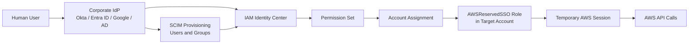
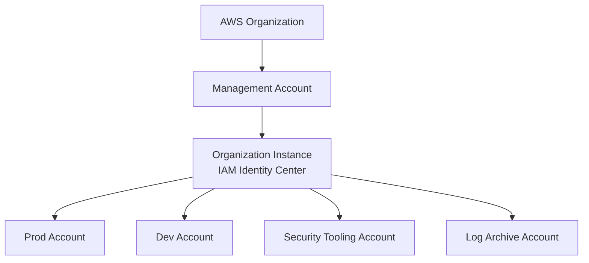
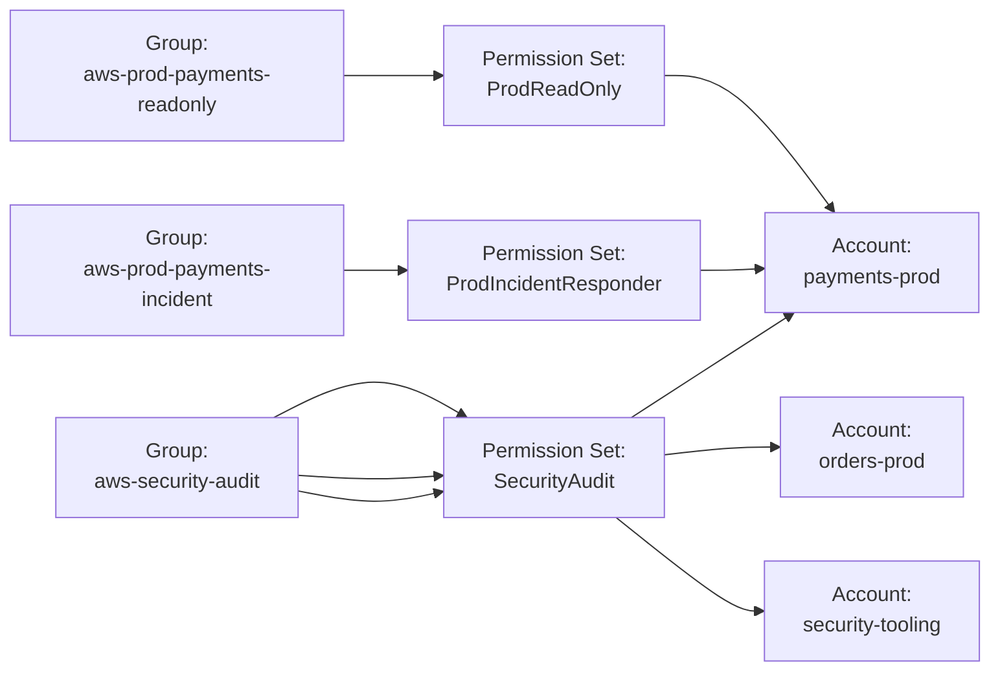
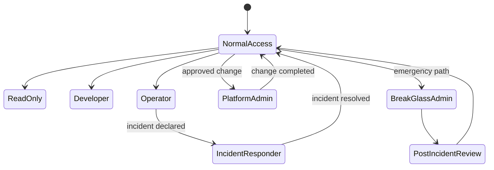
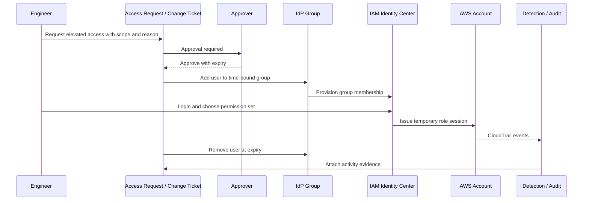
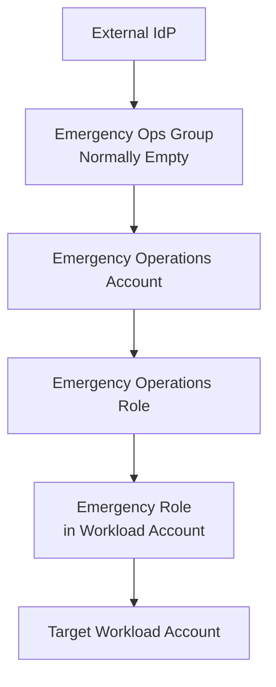

# Part 019 — IAM Identity Center for Human Access

Human access adalah salah satu attack surface paling mahal di AWS.

Bukan karena manusia selalu ceroboh. Masalahnya lebih struktural: manusia butuh akses lintas banyak account, lintas environment, lintas role, lintas tool, dan sering dalam kondisi tekanan operasional. Kalau model human access dibangun dengan IAM user per account, access key permanen, shared admin role, atau user manual di setiap account, maka organisasi sedang membuat **credential sprawl** yang akan susah diaudit, susah dicabut, dan susah dibuktikan.

IAM Identity Center adalah control plane untuk mengelola workforce access ke AWS accounts dan AWS applications secara terpusat. Namun cara memakainya tidak boleh berhenti di “aktifkan SSO lalu assign AdminAccess”. Di environment production-grade, IAM Identity Center harus diperlakukan sebagai **human access operating system**.

Artinya kita perlu menjawab pertanyaan berikut secara deterministik:

1. Siapa orangnya?
2. Dari identity provider mana identitas itu berasal?
3. Group apa yang menjadi sumber otorisasi?
4. Account mana yang boleh diakses?
5. Permission set apa yang dipakai?
6. Berapa lama session berlaku?
7. Apakah akses itu normal, privileged, atau emergency?
8. Bagaimana akses dicabut?
9. Bagaimana akses dibuktikan saat audit?
10. Apa yang terjadi kalau IAM Identity Center, IdP, atau Region terkait bermasalah?

Part ini membangun model tersebut.

---

## 1. Mental Model: IAM Identity Center Bukan IAM User Replacement Saja

Model buruk:

```text
user -> IAM user di account A
user -> IAM user di account B
user -> IAM user di account C
user -> access key permanen
```

Model yang benar:

```text
workforce identity -> group -> permission set -> account assignment -> temporary role session
```

IAM Identity Center bukan sekadar login portal. Ia adalah layer yang mengubah identitas manusia menjadi AWS role session yang terkontrol.



AWS mendefinisikan permission set sebagai level akses untuk user/group terhadap AWS account. Permission set disimpan di IAM Identity Center dan dapat diprovision ke satu atau lebih AWS account. Dengan multi-account permissions, IAM Identity Center menjadi satu tempat untuk assign permission ke group user di banyak AWS account.

Konsekuensinya:

- identitas manusia tidak seharusnya dibuat manual di setiap AWS account;
- akses manusia tidak seharusnya memakai access key permanen;
- akses admin tidak seharusnya menjadi default session harian;
- permission assignment harus berbasis group, bukan individu;
- akses harus punya durasi session yang jelas;
- semua akses privileged harus punya audit trail.

---

## 2. Organization Instance vs Account Instance

IAM Identity Center memiliki dua tipe instance:

1. **Organization instance**
2. **Account instance**

Untuk production multi-account environment, gunakan **organization instance**.

Organization instance berjalan sebagai pusat pengelolaan workforce access lintas AWS Organizations. Ini yang memungkinkan kita mengatur permission set dan account assignment lintas banyak account. Account instance hanya cocok untuk isolated use case tertentu, misalnya aplikasi AWS managed tertentu di satu account, bukan sebagai fondasi human access enterprise.



### Decision rule

Gunakan organization instance bila:

- ada lebih dari satu AWS account;
- akses manusia dikelola lintas account;
- ada AWS Organizations;
- akses perlu diaudit secara konsisten;
- security team ingin mengelola access posture dari satu tempat;
- account vending machine perlu bootstrap human access otomatis.

Hindari account instance sebagai default karena akan menghasilkan fragmentation: assignment, group, dan audit model menjadi tersebar.

---

## 3. Identity Source: Jangan Campur Sumber Identitas Tanpa Alasan Kuat

IAM Identity Center dapat memakai identity source seperti:

- built-in Identity Center directory;
- external identity provider via SAML;
- Microsoft AD integration;
- provisioning user/group dari external IdP melalui SCIM.

Untuk organisasi engineering modern, pola paling umum adalah:

```text
Corporate IdP -> SAML authentication -> IAM Identity Center
Corporate IdP -> SCIM provisioning -> IAM Identity Center users/groups
```

### Invariant

Sumber kebenaran identitas manusia harus berada di corporate identity system, bukan di AWS account individual.

Kenapa?

Karena lifecycle manusia terjadi di HR/IdP layer:

- joiner;
- mover;
- leaver;
- contractor expiry;
- department change;
- incident suspension;
- privileged access approval.

AWS account tidak boleh menjadi tempat utama untuk menentukan apakah seseorang masih bekerja, masih di tim yang sama, atau masih berhak mengakses prod.

### Common failure mode

```text
Engineer resign -> disabled in corporate IdP -> IAM user in one AWS account still active -> access key still valid
```

IAM Identity Center mengurangi risiko ini dengan memindahkan akses manusia ke temporary session yang bergantung pada identity source dan group assignment.

---

## 4. Permission Set: Template Akses, Bukan Role Random

Permission set adalah reusable access template.

Ia menjawab:

```text
Kalau seseorang masuk ke account tertentu menggunakan akses ini, permission efektif apa yang ia dapat?
```

Contoh permission set:

- `ReadOnly`
- `DeveloperPowerUser`
- `BillingReadOnly`
- `SecurityAudit`
- `IncidentResponder`
- `NetworkOperator`
- `DatabaseOperator`
- `BreakGlassAdmin`

Permission set dapat menggunakan:

- AWS managed policy;
- customer managed policy;
- inline policy;
- permissions boundary;
- session duration;
- relay state.

### Jangan desain permission set berdasarkan nama orang

Buruk:

```text
alice-admin-prod
bob-readonly-dev
charlie-s3-special
```

Baik:

```text
ProdReadOnly
ProdIncidentResponder
NonProdDeveloper
SecurityAudit
PlatformOperator
```

Permission set harus merepresentasikan **job function** atau **operational capability**, bukan identitas individual.

---

## 5. Account Assignment: Relasi Antara Group, Permission Set, dan Account

Account assignment adalah relasi:

```text
principal group + permission set + AWS account
```

Contoh:

```text
Group: aws-prod-payments-readonly
PermissionSet: ProdReadOnly
Account: payments-prod
```

```text
Group: aws-security-audit
PermissionSet: SecurityAudit
Account: all workload accounts
```

```text
Group: aws-platform-nonprod-admin
PermissionSet: NonProdAdmin
Account: nonprod platform accounts
```

Diagram:



### Why group-based assignment matters

Group-based assignment membuat access lifecycle bisa dikelola dari IdP:

- onboarding: add user to group;
- offboarding: remove user from group or disable identity;
- temporary elevation: add user to time-bound group;
- audit: list group membership and account assignments;
- review: certify group-to-permission-to-account mapping.

Assignment individual tetap mungkin, tapi sebaiknya menjadi exception yang tercatat, bukan default.

---

## 6. Permission Set Taxonomy

Permission set perlu taxonomy. Tanpa taxonomy, permission set akan tumbuh seperti role landfill.

Gunakan struktur berikut.

### 6.1 Read-only access

Tujuan:

- observasi;
- debugging ringan;
- audit;
- onboarding;
- investigation tanpa mutation.

Contoh:

```text
ReadOnly
ProdReadOnly
SecurityReadOnly
BillingReadOnly
```

Catatan: read-only di AWS tidak selalu aman sepenuhnya. Beberapa read action dapat mengekspos secret, configuration, atau metadata sensitif. Contoh: membaca parameter, secret metadata, environment variable Lambda, user data EC2, atau object S3 jika policy mengizinkan. Jadi read-only perlu scope.

### 6.2 Developer access

Tujuan:

- development environment;
- sandbox;
- non-prod workload;
- limited mutation.

Contoh:

```text
NonProdDeveloper
SandboxPowerUser
DevOpsNonProd
```

Hindari memberi developer default admin ke prod. Production mutation harus lewat pipeline, change management, atau incident role.

### 6.3 Operator access

Tujuan:

- restart service;
- inspect runtime;
- update scaling config;
- view logs;
- trigger operational runbook.

Contoh:

```text
ServiceOperator
DatabaseOperator
NetworkOperator
PlatformOperator
```

Operator access harus dibatasi pada operational actions. Jangan mencampur operator role dengan IAM admin.

### 6.4 Security access

Tujuan:

- investigation;
- posture review;
- finding triage;
- audit evidence;
- containment.

Contoh:

```text
SecurityAudit
SecurityInvestigator
SecurityResponder
SecurityAdmin
```

Security responder bisa butuh mutation seperti isolate instance, revoke security group rule, disable access key, atau quarantine resource. Tapi ini harus jelas dipisahkan dari read-only investigation.

### 6.5 Privileged admin access

Tujuan:

- platform administration;
- account baseline management;
- IAM administration;
- emergency remediation.

Contoh:

```text
PlatformAdmin
AccountAdmin
IAMAdmin
BreakGlassAdmin
```

Privileged admin access harus:

- jarang dipakai;
- session pendek;
- group membership ketat;
- memiliki alert;
- direview berkala;
- tidak digunakan untuk pekerjaan harian.

---

## 7. Naming Convention

Naming harus membuat assignment bisa dibaca tanpa membuka semua console.

### Permission set naming

Format:

```text
<Scope><Capability><PrivilegeLevel>
```

Contoh:

```text
ProdReadOnly
ProdIncidentResponder
NonProdDeveloper
SecurityAudit
PlatformAdmin
BillingReadOnly
```

### Group naming

Format:

```text
aws-<env-or-scope>-<domain-or-account-group>-<capability>
```

Contoh:

```text
aws-prod-payments-readonly
aws-prod-payments-incident-responder
aws-nonprod-platform-admin
aws-org-security-audit
aws-billing-readonly
```

### Account assignment naming registry

Buat registry assignment sebagai data, misalnya:

```yaml
assignments:
  - group: aws-prod-payments-readonly
    permissionSet: ProdReadOnly
    accounts:
      - payments-prod
    owner: payments-platform
    reviewCadence: quarterly
    risk: low

  - group: aws-prod-payments-incident-responder
    permissionSet: ProdIncidentResponder
    accounts:
      - payments-prod
    owner: payments-sre
    reviewCadence: monthly
    risk: high
    requiresPagerDutyOnCall: true

  - group: aws-org-security-audit
    permissionSet: SecurityAudit
    accounts:
      - '*'
    owner: cloud-security
    reviewCadence: quarterly
    risk: medium
```

Tujuannya bukan YAML-nya. Tujuannya adalah membuat human access menjadi **declarative and reviewable**.

---

## 8. Session Duration: Privilege Harus Punya Expiry yang Masuk Akal

Session duration adalah security control.

Default buruk:

```text
Semua permission set: 12 jam
```

Lebih baik:

| Permission Set Type | Suggested Session Duration | Reason |
|---|---:|---|
| ReadOnly | 4–8 jam | Cocok untuk observasi harian. |
| NonProdDeveloper | 4–8 jam | Work session normal, risiko lebih rendah. |
| ProdReadOnly | 2–4 jam | Production visibility, data exposure risk. |
| ProdOperator | 1–2 jam | Mutation risk. |
| SecurityResponder | 1 jam | High-impact containment. |
| IAMAdmin | 30–60 menit | Privilege escalation surface. |
| BreakGlassAdmin | 15–60 menit | Emergency only. |

Durasi terlalu pendek mengganggu operasi. Durasi terlalu panjang memperbesar credential replay window.

Prinsipnya:

```text
Semakin tinggi privilege dan semakin sensitif environment, semakin pendek session.
```

---

## 9. Jangan Jadikan AdminAccess Sebagai Mode Kerja Harian

AWS documentation memberi contoh bahwa administrative user sebaiknya juga punya permission set yang lebih restriktif agar tidak selalu menggunakan administrative permission untuk tugas yang tidak membutuhkannya.

Ini prinsip penting.

Engineer senior mungkin memang butuh admin dalam kondisi tertentu. Tapi bukan berarti semua pekerjaan dilakukan dengan admin session.

Model yang benar:

```text
Normal work       -> ReadOnly / Developer / Operator
Production issue  -> IncidentResponder
Platform change   -> PlatformAdmin via approval
Emergency         -> BreakGlassAdmin
```

Diagram:



---

## 10. Human Access vs Workload Access

Jangan campur human access dan workload access.

Human access:

- berasal dari orang;
- masuk lewat IdP/IAM Identity Center;
- punya session interaktif;
- dipakai untuk console/CLI;
- harus memiliki attribution ke manusia.

Workload access:

- berasal dari compute runtime;
- menggunakan IAM role, instance profile, task role, Lambda execution role, IRSA/pod identity;
- tidak boleh memakai identity manusia;
- tidak boleh memakai access key manusia;
- tidak boleh bergantung pada SSO login seseorang.

Anti-pattern:

```text
Developer menjalankan batch job memakai AWS_PROFILE dari IAM Identity Center session pribadinya.
```

Kenapa salah?

Karena audit akan menunjukkan manusia sebagai actor, padahal yang terjadi adalah workload automation. Revocation, retry, dan incident attribution menjadi kacau.

Rule:

```text
Human access is for human decisions. Workload access is for workload execution.
```

---

## 11. CLI Access Dengan IAM Identity Center

Developer tetap bisa memakai AWS CLI tanpa access key permanen.

Pola:

```bash
aws configure sso
aws sso login --profile prod-readonly
aws sts get-caller-identity --profile prod-readonly
```

Contoh profil:

```ini
[profile prod-payments-readonly]
sso_session = corp
sso_account_id = 111122223333
sso_role_name = ProdReadOnly
region = ap-southeast-1
output = json

[sso-session corp]
sso_start_url = https://example.awsapps.com/start
sso_region = ap-southeast-1
sso_registration_scopes = sso:account:access
```

### Operational invariant

Tidak ada access key permanen untuk user manusia kecuali exception yang tercatat, terbatas, dan punya expiry.

AWS IAM best practices merekomendasikan temporary credentials jika memungkinkan, dan menyebut long-term access key hanya untuk use case tertentu yang tidak bisa memakai IAM role/IAM Identity Center.

---

## 12. Audit Attribution

Human access harus bisa menjawab:

```text
Siapa melakukan API call ini?
Melalui permission set apa?
Ke account mana?
Dari IP/device mana?
Pada jam berapa?
Apakah ini normal access atau emergency access?
```

Event AWS API tetap direkam oleh CloudTrail di target account. Role yang dipakai biasanya role yang diprovision IAM Identity Center ke account target. Karena itu, naming permission set dan role session attribution menjadi penting.

### Minimal evidence

Untuk setiap privileged access event, kita butuh:

- CloudTrail event;
- assumed role ARN;
- session issuer;
- source IP;
- user agent;
- event time;
- request parameters;
- response/error;
- identity provider sign-in evidence;
- group membership evidence saat event terjadi;
- ticket/incident/change reference jika mutation production.

### Query thinking

Saat audit, pertanyaan yang muncul biasanya bukan:

```text
Apakah kalian punya IAM Identity Center?
```

Tetapi:

```text
Buktikan siapa saja yang punya production admin access pada 2026-06-01.
Buktikan siapa yang mengubah security group X.
Buktikan akses itu disetujui.
Buktikan akses sudah dicabut setelah orang tersebut pindah tim.
```

Maka assignment dan group membership harus bisa dipulihkan historisnya. Kalau IdP tidak menyimpan historical group membership, buat snapshot berkala.

---

## 13. Access Review Operating Model

Access review harus melihat tiga layer:

```text
IdP group membership
IAM Identity Center account assignment
Effective AWS permission
```

Jika hanya review group membership, kita belum tahu group itu memberi akses apa. Jika hanya review permission set, kita belum tahu siapa pemakainya. Jika hanya review CloudTrail, kita hanya melihat yang sudah terjadi, bukan latent access.

### Review cadence

| Access Type | Review Cadence | Reviewer |
|---|---:|---|
| ReadOnly non-prod | 6 bulan | Team manager/service owner |
| Developer non-prod | Quarterly | Team manager/platform owner |
| Prod read-only | Quarterly | Service owner |
| Prod operator | Monthly/quarterly | SRE/service owner |
| IAM admin | Monthly | Cloud security/platform lead |
| Break-glass | After every use + monthly existence check | Security + leadership |
| External/contractor | Monthly or expiry-based | Vendor owner |

### Review question

Jangan tanya:

```text
Apakah Alice masih butuh akses?
```

Tanya:

```text
Apa keputusan/operasi yang Alice lakukan sehingga permission ini masih diperlukan?
Apa jalur alternatif yang lebih rendah privilege?
Apa expiry date-nya?
```

---

## 14. Temporary Privilege Elevation

Temporary privilege elevation diperlukan untuk real-world operations.

Contoh:

- production incident;
- migration;
- security investigation;
- urgent billing issue;
- recovery from broken SCP/IAM policy;
- restore testing;
- service launch.

Model yang buruk:

```text
Tambahkan Alice ke admin group. Nanti jangan lupa dicabut.
```

Model yang baik:

```text
Request -> approval -> time-bound group membership -> session -> alert -> auto-removal -> review
```



Important invariant:

```text
No elevated access without expiry.
```

---

## 15. Emergency Access for IAM Identity Center Disruption

IAM Identity Center adalah highly available service, tetapi production operating model tetap harus punya emergency path.

AWS merekomendasikan emergency access configuration yang dibuat sebelum disruption terjadi. Konfigurasi ini memungkinkan emergency operations users sign in ke AWS Management Console melalui direct federation bila IAM Identity Center terganggu, selama IAM data plane dan external IdP masih tersedia.

Model AWS-nya:

```text
External IdP -> direct SAML federation -> emergency operations account -> emergency role -> switch role to workload accounts
```



AWS emergency access summary describes these steps:

1. Create an emergency operations account in AWS Organizations.
2. Connect the IdP to that account with SAML federation.
3. Create an emergency operations role in the emergency account and emergency roles in workload accounts.
4. Delegate access from the emergency role to workload account emergency roles.
5. Keep emergency operations group empty during normal operations.
6. During disruption, add trusted users to emergency group.
7. Users sign in through IdP and assume emergency roles.

### Design constraints

Emergency access must be:

- pre-created;
- tested periodically;
- isolated from normal IAM Identity Center path;
- monitored aggressively;
- limited to trusted responders;
- time-bound operationally;
- reviewed after every use.

### What emergency access is not

Emergency access is not:

- daily admin shortcut;
- shared password;
- unmanaged IAM user;
- permanent vendor backdoor;
- bypass from change management without incident reason.

---

## 16. When External IdP Is Down Too

The AWS emergency access pattern above still depends on the external IdP. If both IAM Identity Center and the external IdP are unavailable, you need a deeper break-glass model.

Possible layers:

1. IAM Identity Center normal access.
2. Direct SAML emergency access through IdP.
3. Root/break-glass access for organization management and critical accounts.
4. Centralized root access for member accounts where applicable.

Do not pretend one layer solves all failure modes.

Failure matrix:

| Failure | Normal IAM Identity Center | Direct Federation Emergency | Root/Break-Glass |
|---|---:|---:|---:|
| User forgot password | Depends on IdP | Depends on IdP | No |
| IAM Identity Center unavailable | No | Yes, if preconfigured | Maybe |
| IAM Identity Center Region disruption | No | Yes, if IAM data plane and IdP available | Maybe |
| External IdP unavailable | No | No | Maybe |
| Broken permission set | No/partial | Maybe | Maybe |
| Broken SCP denying admin | Maybe no | Maybe no | Requires careful root/SCP recovery plan |
| Compromised admin group | Dangerous | Dangerous | Root not replacement; incident required |

---

## 17. MFA Strategy

MFA should be enforced at the workforce identity layer.

Prefer phishing-resistant MFA where possible, such as passkeys or security keys. AWS IAM best practices recommend phishing-resistant MFA wherever possible.

For human AWS access, MFA can be enforced at:

- corporate IdP;
- IAM Identity Center, depending on identity source;
- root user credentials;
- direct federation emergency path;
- privileged access workflow.

### MFA is not enough

MFA does not solve:

- overbroad permission;
- stale group membership;
- excessive session duration;
- compromised device after login;
- malicious insider;
- missing CloudTrail;
- bad SCP exception;
- leaked temporary credentials during valid session.

MFA is authentication hardening. It is not authorization design.

---

## 18. Production Access Pattern

A sane production access model looks like this:

```text
Developers:
  non-prod developer access by default
  prod read-only if required
  prod mutation only via pipeline or incident role

SRE/platform:
  prod read-only by default
  prod operator access for operational actions
  admin access only for approved platform changes

Security:
  org-wide read/security audit
  responder role for containment
  admin only for security tooling/account baseline

Executives/auditors:
  billing/security/compliance read-only
```

### Prod mutation rule

Production mutation should happen through one of these paths:

1. approved deployment pipeline;
2. approved change request;
3. declared incident response;
4. emergency break-glass.

Anything else is an exception.

---

## 19. Anti-Patterns

### Anti-pattern 1: Everyone gets AdministratorAccess

This removes the ability to distinguish between observe, operate, administer, and recover.

### Anti-pattern 2: IAM users for humans in every account

This creates stale credentials and decentralized identity lifecycle.

### Anti-pattern 3: One shared admin role

Attribution becomes weak. CloudTrail will show role usage, but human mapping may depend on external logs that are not integrated.

### Anti-pattern 4: Assignment by individual instead of group

This creates access snowflakes and makes review painful.

### Anti-pattern 5: Admin permission set with 12-hour session

This increases blast radius of credential theft and session hijack.

### Anti-pattern 6: No emergency access testing

Emergency access that has never been tested is documentation, not capability.

### Anti-pattern 7: IdP groups named after teams only

Team names change. Access intent should be visible in the group name.

Bad:

```text
payments-team
```

Better:

```text
aws-prod-payments-readonly
aws-prod-payments-incident-responder
```

### Anti-pattern 8: No historical access evidence

If you cannot prove who had access at a specific time, you do not have audit-grade access management.

---

## 20. IAM Identity Center Rollout Plan

### Phase 1 — Inventory current human access

Collect:

- IAM users;
- console password enabled users;
- access keys;
- users with admin policy;
- roles assumable by humans;
- cross-account roles;
- CloudTrail identity usage;
- IdP groups;
- account list;
- production account owners.

### Phase 2 — Define target taxonomy

Define:

- permission set list;
- group naming convention;
- account grouping;
- environment model;
- session duration standard;
- emergency access model;
- review cadence.

### Phase 3 — Build non-prod first

Start with:

- sandbox;
- dev;
- staging;
- platform non-prod;
- read-only prod.

Do not migrate the highest-risk admin access first.

### Phase 4 — Migrate production access

Move:

- prod read-only;
- prod operator;
- prod incident responder;
- security audit;
- platform admin.

Require explicit owners and evidence.

### Phase 5 — Remove old IAM users and keys

After migration:

- disable unused IAM users;
- rotate/remove access keys;
- remove console passwords;
- block IAM user creation via SCP except controlled break-glass exceptions;
- monitor any remaining IAM user usage.

### Phase 6 — Automate assignment lifecycle

Use infrastructure-as-code or identity governance workflow to manage:

- permission sets;
- account assignments;
- group mappings;
- review exports;
- expiry;
- approvals.

---

## 21. Minimal Production Baseline

A production-grade IAM Identity Center baseline should include:

```yaml
identity:
  source: external-idp
  provisioning: scim
  mfa: phishing-resistant-preferred

permissionSets:
  - ReadOnly
  - NonProdDeveloper
  - ProdReadOnly
  - ProdOperator
  - SecurityAudit
  - SecurityResponder
  - PlatformAdmin
  - BreakGlassAdmin

assignmentRules:
  defaultToGroups: true
  individualAssignments: exception-only
  productionAdminRequiresApproval: true
  elevatedAccessRequiresExpiry: true

sessions:
  readOnly: PT4H
  nonProdDeveloper: PT8H
  prodOperator: PT2H
  securityResponder: PT1H
  platformAdmin: PT1H
  breakGlass: PT1H

audit:
  cloudTrail: organization-wide
  accessReview: quarterly
  privilegedAccessReview: monthly
  groupSnapshot: daily
  emergencyAccessTest: quarterly
```

---

## 22. Failure Modeling

### Failure: user removed from team but still has AWS access

Likely cause:

- stale IdP group;
- manual individual assignment;
- SCIM sync failure;
- shadow IAM user.

Controls:

- group-based assignment;
- daily assignment export;
- leaver workflow;
- no individual assignment default;
- IAM user detection.

### Failure: engineer uses admin for daily work

Likely cause:

- no lower-privilege permission set;
- admin easiest to use;
- poor CLI profile naming;
- no alert on admin session.

Controls:

- create usable lower-privilege roles;
- alert on admin session;
- shorten admin session;
- periodic report of admin usage.

### Failure: IAM Identity Center unavailable during incident

Likely cause:

- no emergency federation;
- emergency path not tested;
- emergency group not maintained.

Controls:

- emergency operations account;
- direct federation;
- periodic test;
- documented runbook;
- root/break-glass fallback.

### Failure: access review cannot answer who had access last month

Likely cause:

- no historical group snapshots;
- no assignment registry;
- IdP logs expired;
- no evidence export.

Controls:

- daily group membership snapshot;
- versioned assignment registry;
- CloudTrail retention;
- access review evidence archive.

---

## 23. Practical Checklist

Before calling the design production-ready, verify:

- [ ] IAM Identity Center uses organization instance.
- [ ] External IdP is integrated if corporate identity exists.
- [ ] SCIM or equivalent provisioning is configured.
- [ ] Access assignments are group-based by default.
- [ ] Permission sets have naming convention.
- [ ] Permission sets are mapped to job functions, not people.
- [ ] Admin access is not used for daily work.
- [ ] Production mutation access is separated from read-only access.
- [ ] Session durations vary by risk.
- [ ] Emergency access is pre-created.
- [ ] Emergency access is tested periodically.
- [ ] CloudTrail captures role session activity.
- [ ] Access review can reconstruct effective access.
- [ ] IAM users for humans are removed or exception-managed.
- [ ] Long-term access keys for humans are removed or exception-managed.

---

## 24. Key Takeaways

IAM Identity Center is the foundation for human access in multi-account AWS. But the value is not simply in central login. The value is in turning access into a controlled, auditable, reviewable, and revocable system.

The core model is:

```text
Identity source -> group -> permission set -> account assignment -> temporary session -> CloudTrail evidence
```

A strong design separates:

- human vs workload access;
- read vs mutate;
- non-prod vs prod;
- operator vs admin;
- normal vs emergency;
- assignment vs effective permission;
- authentication vs authorization;
- access grant vs evidence.

If your team can answer “who had what access, why, for how long, and what they did with it,” then you are moving from access management as configuration into access management as an engineering system.

---

## References

- AWS IAM Identity Center User Guide — What is IAM Identity Center?: https://docs.aws.amazon.com/singlesignon/latest/userguide/what-is.html
- AWS IAM Identity Center User Guide — Manage AWS accounts with permission sets: https://docs.aws.amazon.com/singlesignon/latest/userguide/permissionsetsconcept.html
- AWS IAM Identity Center User Guide — Create, manage, and delete permission sets: https://docs.aws.amazon.com/singlesignon/latest/userguide/permissionsets.html
- AWS IAM Identity Center User Guide — Assign user or group access to AWS accounts: https://docs.aws.amazon.com/singlesignon/latest/userguide/assignusers.html
- AWS IAM Identity Center User Guide — Set up emergency access to the AWS Management Console: https://docs.aws.amazon.com/singlesignon/latest/userguide/emergency-access.html
- AWS IAM User Guide — Security best practices in IAM: https://docs.aws.amazon.com/IAM/latest/UserGuide/best-practices.html
