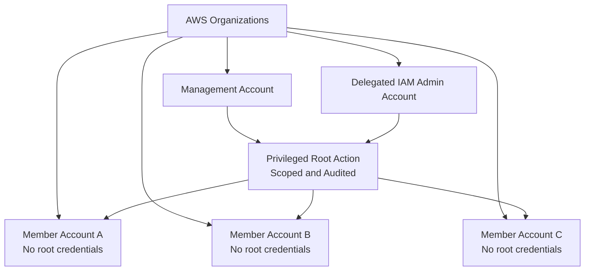
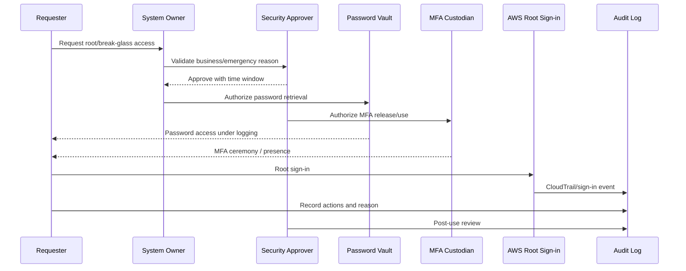
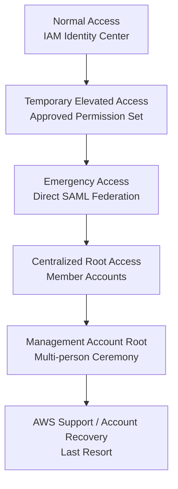
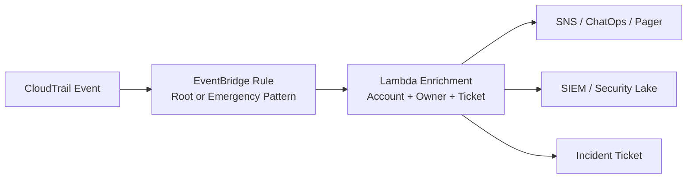

# Part 020 — Root User and Break-Glass Access

Root user adalah identitas paling berbahaya di AWS account.

Ia bukan “admin user biasa”. Ia adalah identity yang dibuat saat AWS account dibuat, memiliki akses sangat luas, dan dipakai untuk sejumlah tindakan yang tidak bisa atau tidak seharusnya dilakukan oleh IAM role biasa. Karena itu, root user harus diperlakukan seperti **nuclear control**: ada, sangat kuat, jarang dipakai, aksesnya dipisah, penggunaannya dipantau, dan setiap pemakaian harus bisa dijelaskan.

Di sisi lain, environment production-grade tidak boleh punya ilusi bahwa semua masalah bisa diselesaikan dengan IAM Identity Center atau admin role. Kadang sistem akses normal rusak. Kadang SCP salah. Kadang IdP bermasalah. Kadang resource policy mengunci semua orang. Kadang ada kompromi privileged role. Di situ kita butuh break-glass access.

Part ini membahas root user dan break-glass sebagai operating capability, bukan sebagai password yang disimpan di vault lalu dilupakan.

---

## 1. Mental Model: Root Is Not Daily Admin

Model yang salah:

```text
Root user = admin tertinggi untuk dipakai jika butuh cepat
```

Model yang benar:

```text
Root user = last-resort privileged identity untuk tugas root-only, recovery tertentu, dan kondisi emergency yang sudah didefinisikan
```

Root user tidak boleh menjadi:

- daily admin;
- deployment identity;
- CI/CD identity;
- break-fix shortcut;
- shared team login;
- vendor access;
- place to create long-term access keys.

Root user harus menjadi:

- dormant by default;
- protected by strong MFA or centralized root access strategy;
- monitored;
- documented;
- tested under controlled procedure;
- separated from normal operational identity.

---

## 2. Root User vs AdministratorAccess

IAM role dengan `AdministratorAccess` masih berada dalam IAM policy evaluation model. Ia bisa dibatasi oleh SCP, permission boundary, session policy, trust policy, atau resource policy. Root user berbeda: root adalah account-level principal yang memiliki kemampuan sangat tinggi, walaupun dalam AWS Organizations root member account tetap bisa dipengaruhi oleh SCP untuk banyak action.

Perbedaan praktis:

| Aspect | IAM Admin Role | Root User |
|---|---|---|
| Created manually? | Ya | Ada saat account dibuat |
| Human daily usage? | Kadang, tapi harus dibatasi | Tidak |
| Can have temporary session? | Ya | Root sign-in atau privileged root session mechanism tertentu |
| Controlled by trust policy? | Ya | Tidak seperti role biasa |
| Can be protected by IdP workflow? | Ya | Tidak secara natural |
| Intended for automation? | Ya, jika role khusus automation | Tidak |
| Should have access keys? | Bisa untuk role session only | Tidak boleh long-term access key |
| Audit criticality | Tinggi | Sangat tinggi |

---

## 3. Root-Only and Root-Sensitive Tasks

Beberapa task membutuhkan root user atau historically membutuhkan root. AWS menyediakan daftar “tasks that require root user credentials” yang harus dijadikan rujukan saat membuat runbook. Contoh kategori yang sering relevan:

- account-level recovery tertentu;
- perubahan detail account tertentu;
- closing account;
- sebagian tindakan terhadap billing/tax/legal/account settings;
- recovery dari konfigurasi yang mengunci semua IAM principal;
- privileged root actions yang sekarang dapat dikelola secara terpusat untuk member accounts jika fitur AWS Organizations root access management diaktifkan.

Prinsipnya:

```text
Jangan memakai root karena malas mendesain IAM. Pakai root hanya karena task memang root-only atau recovery path normal gagal.
```

---

## 4. AWS Root User Best Practices

AWS root user best practices mencakup beberapa invariant penting:

1. Secure root credentials.
2. Gunakan password yang kuat dan unik.
3. Aktifkan MFA untuk root credentials.
4. Jangan buat access key untuk root user.
5. Gunakan multi-person approval jika memungkinkan.
6. Gunakan email address yang dikelola bisnis untuk root credentials.
7. Batasi akses ke mekanisme account recovery.
8. Amankan root credentials untuk management account AWS Organizations.
9. Monitor root user sign-in and usage.
10. Untuk member accounts dalam AWS Organizations, pertimbangkan centralized root access dan hapus root user credentials dari member accounts.

Dalam multi-account environment, AWS merekomendasikan menghapus root user credentials dari member accounts melalui centralized root access agar member account tidak bisa sign in sebagai root atau melakukan password recovery root.

---

## 5. Root User Credential Strategy

Ada dua strategi besar untuk member accounts:

### Strategy A — Centralized root access and remove member root credentials

Cocok untuk AWS Organizations yang matang.

Karakteristik:

- root credentials member account dihapus;
- new member accounts dapat dibuat tanpa root credentials;
- member accounts tidak bisa sign in sebagai root;
- root password recovery member account dicegah;
- privileged root actions tertentu dapat dilakukan dari management account atau delegated administrator;
- jika task benar-benar membutuhkan root credentials member account, recovery dapat diizinkan sementara sesuai prosedur.

### Strategy B — Secure each account root user credentials manually

Cocok untuk standalone account, transisi, atau organisasi yang belum mengaktifkan centralized root access.

Karakteristik:

- setiap account punya root email/password/MFA;
- harus ada vaulting;
- harus ada multi-person approval;
- harus ada MFA resiliency;
- harus ada monitoring root usage;
- harus ada periodic validation.

### Decision rule

Untuk AWS Organizations production-grade, default target adalah:

```text
Management account root: secured manually with strong MFA and multi-person process.
Member account root: centralized root access, credentials removed where possible.
```

---

## 6. Centralized Root Access for Member Accounts

AWS IAM mendukung centralized root access untuk member accounts di AWS Organizations. Setelah fitur ini diaktifkan, organisasi dapat menghapus root user credentials dari member accounts dan mencegah recovery long-term root credentials untuk member accounts. AWS docs menyebut credentials yang dapat dihapus meliputi root password, access keys, signing certificates, dan MFA deactivation/removal.

Diagram:



### Why this matters

Tanpa centralized root access, setiap account menambah satu root credential set yang harus disimpan, diamankan, diuji, dan direview. Pada 5 account, masih mungkin manual. Pada 500 account, ini menjadi operational debt yang berbahaya.

Centralized root access mengubah model dari:

```text
N accounts -> N root credentials to protect
```

menjadi:

```text
N member accounts -> no long-term member root credentials by default
```

### Important limitation

Centralized root access bukan berarti root risk hilang. Ia memindahkan risk ke organization-level privileged operation. Maka management account/delegated admin access harus jauh lebih ketat.

---

## 7. Management Account Root User

Management account adalah account paling sensitif dalam AWS Organizations.

Ia mengontrol:

- AWS Organizations;
- organization policies;
- trusted access;
- delegated administrator registration;
- consolidated billing;
- account lifecycle;
- potentially centralized root access features.

Management account root harus dianggap sebagai tier paling tinggi.

### Management account root invariant

```text
Management account root credentials must not be accessible by one person alone.
```

Implementasi:

- root email adalah group mailbox resmi yang dikontrol organisasi;
- password disimpan di vault yang tidak bergantung pada AWS account yang sama;
- MFA memakai multiple hardware/security devices jika memungkinkan;
- password dan MFA custody dipisah;
- account recovery email dan phone number tidak dikontrol oleh orang yang sama;
- penggunaan root memerlukan approval minimal dua pihak;
- setiap sign-in menghasilkan alert;
- setelah penggunaan, activity direview.

---

## 8. Multi-Person Approval

AWS root best practices menyarankan multi-person approval jika memungkinkan. Implementasi praktisnya bukan sekadar “minta izin di chat”.

Model custody:

```text
Group A controls password vault access.
Group B controls MFA device physical access.
Group C approves emergency reason.
Security monitors CloudTrail/EventBridge alerts.
```

Diagram:



Key property:

```text
No single human can independently complete root sign-in.
```

---

## 9. Root MFA Resiliency

AWS supports registering multiple MFA devices for root user and IAM users. This improves resiliency if one device is lost or unavailable.

Design recommendation:

- use phishing-resistant hardware security keys where possible;
- register multiple MFA devices for management account root;
- store backup devices in physically separate secure locations;
- document custody;
- test device usability periodically;
- remove lost/stolen devices immediately;
- avoid one phone app controlled by one individual as the only root MFA.

MFA should not be treated as convenience. It is part of disaster recovery for identity.

---

## 10. Root Access Keys: Do Not Create Them

Root access keys are one of the highest-risk credentials in AWS.

AWS strongly recommends not creating access keys for root user because root has full access to all AWS services and resources in the account, including billing information. If root access keys exist, treat it as urgent remediation unless there is an extraordinary documented reason.

### Detection target

Detect:

- root access key exists;
- root access key used;
- root access key created;
- root sign-in without MFA;
- root sign-in from unusual IP/country;
- privileged root session activity;
- failed root login attempts.

### Remediation

If root access key exists:

1. Identify last used timestamp.
2. Identify owner/reason.
3. Disable key.
4. Monitor for breakage.
5. Delete key.
6. Replace automation with IAM role or workload identity.
7. File incident or security exception depending on usage.

---

## 11. Break-Glass Access: Definition

Break-glass access adalah controlled emergency access path untuk kondisi ketika normal access path gagal atau tidak cukup cepat untuk mencegah kerusakan besar.

Break-glass bukan root saja. Ia bisa berupa:

- emergency IAM Identity Center permission set;
- direct SAML emergency federation;
- emergency operations account;
- protected IAM role;
- root user;
- centralized root privileged action;
- hardware-token-protected admin identity;
- offline recovery process.

### Break-glass trigger examples

Valid triggers:

- production outage where normal role cannot remediate;
- compromised admin role requiring containment;
- broken SCP/resource policy causing lockout;
- IAM Identity Center disruption during critical incident;
- external IdP disruption with urgent AWS action needed;
- account recovery;
- legal/regulatory emergency requiring immediate data preservation;
- ransomware containment requiring backup/vault controls.

Invalid triggers:

- “lebih cepat daripada approval biasa”;
- “pipeline sedang lambat”;
- “developer butuh cek sebentar”;
- “belum sempat bikin role yang benar”;
- “vendor minta akses admin”.

---

## 12. Break-Glass Maturity Levels

### Level 0 — No break-glass

Tidak ada emergency path. Jika IAM/IdP rusak, organisasi hanya berharap AWS Support atau orang lama tahu password.

Risk: catastrophic.

### Level 1 — Shared emergency IAM user

Ada IAM user admin dengan password/MFA.

Risk: high. Lebih baik daripada tidak ada, tapi sering menjadi backdoor permanen.

### Level 2 — Emergency role with controlled membership

Ada emergency role/permission set, membership kosong saat normal, approval diperlukan.

Risk: moderate. Perlu expiry dan audit.

### Level 3 — Direct federation emergency account

Ada emergency operations account, direct SAML federation, role chaining ke workload accounts, tested periodically.

Risk: lower. Cocok untuk IAM Identity Center disruption if IdP available.

### Level 4 — Integrated break-glass operating system

Ada:

- emergency access layers;
- root credential strategy;
- centralized root access;
- multi-person approval;
- automated alert;
- session capture/evidence;
- post-use review;
- periodic game day.

Ini target production-grade.

---

## 13. Layered Emergency Access Design



Interpretasi:

- Gunakan layer terendah yang cukup untuk memulihkan kondisi.
- Jangan langsung memakai root jika temporary elevated role cukup.
- Jangan memakai emergency federation jika IAM Identity Center normal masih berfungsi.
- Jangan memakai management root untuk memperbaiki masalah workload biasa.

---

## 14. Emergency Operations Account

Emergency operations account adalah account khusus untuk emergency federation dan role assumption.

Tujuannya:

- memisahkan emergency access dari workload account;
- menyediakan fallback saat IAM Identity Center unavailable;
- memusatkan emergency role dan logging;
- menghindari direct emergency users di setiap account;
- menjaga normal state: emergency group kosong.

Minimal design:

```yaml
account: emergency-operations
ou: Security
normalAccess: no daily human access
federation: direct-saml-to-external-idp
emergencyGroup: aws-emergency-operations
emergencyGroupNormalMembership: empty
roles:
  - EmergencyOperationsRole
  - EmergencyReadOnlyRole
  - EmergencySecurityResponderRole
logging:
  cloudTrail: organization-trail
  alerts: root-and-emergency-role-usage
review:
  afterEveryUse: true
  quarterlyTest: true
```

---

## 15. Emergency Role in Workload Accounts

Emergency roles in workload accounts should be explicit and scoped.

Example trust model:

```text
Emergency role in workload account trusts emergency operations role from emergency account.
```

Simplified example:

```json
{
  "Version": "2012-10-17",
  "Statement": [
    {
      "Effect": "Allow",
      "Principal": {
        "AWS": "arn:aws:iam::999988887777:role/EmergencyOperationsRole"
      },
      "Action": "sts:AssumeRole",
      "Condition": {
        "StringEquals": {
          "aws:PrincipalOrgID": "o-exampleorgid"
        }
      }
    }
  ]
}
```

This is illustrative. In real implementation, add conditions aligned with your org, tags, external ID/session controls where applicable, and explicit monitoring.

### Permission design

Do not make every emergency role full admin by default.

Possible tiers:

| Role | Use |
|---|---|
| EmergencyReadOnly | Investigation during access outage. |
| EmergencyOperator | Restart, inspect, limited remediation. |
| EmergencySecurityResponder | Containment and security remediation. |
| EmergencyAdmin | Last-resort mutation. |

---

## 16. Break-Glass Session Evidence

Every break-glass event must produce evidence.

Minimum evidence package:

```yaml
breakGlassEvent:
  ticketId: INC-2026-000123
  reason: IAM Identity Center unavailable during Sev1 incident
  requester: alice@example.com
  approvers:
    - platform-lead@example.com
    - security-lead@example.com
  startTime: 2026-07-06T10:15:00+07:00
  endTime: 2026-07-06T11:05:00+07:00
  accountsAccessed:
    - payments-prod
  rolesUsed:
    - EmergencyOperationsRole
    - EmergencySecurityResponder
  actionsSummary:
    - isolated compromised EC2 instance
    - disabled leaked IAM access key
  cloudTrailQuery: s3://log-archive/evidence/INC-2026-000123/cloudtrail-query.sql
  postIncidentReview: PIR-2026-000045
```

The output of break-glass is not only remediation. The output is also an audit-grade explanation.

---

## 17. Alerting on Root and Break-Glass Usage

Usage should be noisy.

Alert on:

- root login;
- root API usage;
- root access key creation;
- root access key usage;
- management account root login;
- centralized root privileged task;
- AssumeRole into emergency role;
- emergency group membership change;
- emergency permission set assignment;
- disabling CloudTrail/Config/Security Hub/GuardDuty;
- changes to SCP/RCP that affect security controls;
- changes to emergency role trust policy.

Example EventBridge thinking:



A healthy system makes rare dangerous access visible immediately.

---

## 18. Root Activity Investigation

When root activity is detected, ask:

1. Was it expected?
2. Was there an approved ticket?
3. Was MFA used?
4. Which source IP and user agent?
5. What account?
6. Was this management account or member account?
7. Was this direct root sign-in or privileged root session?
8. What exact API calls occurred?
9. Were security controls changed?
10. Was any persistence created?
11. Were access keys created?
12. Did the actor touch IAM, Organizations, S3, KMS, CloudTrail, Config, GuardDuty, Security Hub, Backup, or billing?

### Immediate containment if unauthorized

- revoke active sessions where possible;
- rotate/disable root credentials if applicable;
- remove root access keys;
- inspect IAM changes;
- inspect Organization/SCP changes;
- inspect CloudTrail/Config/Security Hub/GuardDuty status;
- inspect S3 bucket policies and KMS key policies;
- notify incident response;
- preserve evidence.

---

## 19. Root Credential Storage

Do not store root password and MFA recovery path in a system that depends on the same AWS account to be accessible.

Bad:

```text
Root password for management account stored in a secrets manager inside the same management account.
```

Why?

If access to that account is broken, the secret may be inaccessible exactly when needed.

Better:

- enterprise password vault independent from AWS account access path;
- offline escrow for true emergency;
- multi-person release workflow;
- immutable access logs;
- password and MFA custody separation;
- documented recovery phone/email custody.

---

## 20. Root Email and Recovery Channels

The root email address is part of the security boundary.

It should be:

- controlled by the organization;
- not tied to one employee;
- monitored;
- protected by MFA;
- recoverable under business continuity process;
- not reused for unrelated services;
- included in ownership registry.

Recovery phone number and email access should not be controlled by the same person. AWS best practices explicitly call out restricting account recovery mechanisms and separating access to email inbox and phone number for recovery.

---

## 21. SCPs and Root User

SCPs can help restrict root user actions in member accounts, except for certain actions that must remain possible depending on AWS behavior and root-only requirements. But SCPs are dangerous if written carelessly.

Example principle:

```text
Deny root user actions in member accounts except approved root-only recovery tasks.
```

Illustrative SCP pattern:

```json
{
  "Version": "2012-10-17",
  "Statement": [
    {
      "Sid": "DenyRootUserMostActions",
      "Effect": "Deny",
      "Action": "*",
      "Resource": "*",
      "Condition": {
        "StringLike": {
          "aws:PrincipalArn": "arn:aws:iam::*:root"
        }
      }
    }
  ]
}
```

Do not copy this blindly. Real SCP design must account for:

- root-only tasks;
- management account exclusion;
- break-glass recovery;
- Control Tower controls;
- centralized root access;
- tested policy staging;
- rollback path.

The point is not this JSON. The point is the invariant:

```text
Root use in member accounts must be either impossible, centrally controlled, or explicitly exception-managed.
```

---

## 22. Break-Glass Runbook

A break-glass runbook should fit on one operational page but link to detailed evidence procedures.

### Runbook skeleton

```md
# Break-Glass Runbook

## Preconditions
- Incident/change ticket exists.
- Normal access path is unavailable or insufficient.
- Minimum two approvers identified.
- Scope is limited to account/resource/action/time window.

## Approval
- Service owner approval.
- Security approval.
- Platform/on-call lead approval for org-level access.

## Activation
- Add approved user to emergency group OR retrieve root credentials via ceremony.
- Record start time.
- Confirm MFA.
- Confirm target account and role.

## Execution
- Use least dangerous emergency role.
- Run only documented actions unless new approval is recorded.
- Capture command/output where safe.
- Preserve CloudTrail query markers.

## Deactivation
- Remove user from emergency group.
- End session.
- Rotate/reseal credentials if exposed.
- Confirm no new access keys/users/roles were created unless approved.

## Post-use Review
- Attach CloudTrail evidence.
- Summarize actions.
- Identify why normal access failed.
- Create remediation tasks.
- Review if permissions were excessive.
```

---

## 23. Testing Break-Glass

Untested break-glass is not a control.

Test scenarios:

1. IAM Identity Center unavailable simulation.
2. External IdP unavailable tabletop.
3. Lost root MFA device simulation.
4. Emergency operations account role assumption.
5. Workload emergency role assumption.
6. CloudTrail evidence retrieval.
7. Alerting path validation.
8. Emergency group add/remove workflow.
9. Management account root credential ceremony tabletop.
10. Centralized root privileged task test in non-prod/sandbox member account.

### Test cadence

| Test | Cadence |
|---|---:|
| Emergency role login test | Quarterly |
| Alerting test | Quarterly |
| Root credential custody review | Quarterly |
| Root MFA backup device validation | 6 months |
| Full tabletop | 6 months |
| Post-incident real review | Every use |

---

## 24. Governance Registry

Maintain a root and break-glass registry.

```yaml
rootAndBreakGlassRegistry:
  managementAccount:
    rootEmail: aws-root@example.com
    passwordCustodianGroup: security-vault-admins
    mfaCustodianGroup: executive-security-custodians
    recoveryEmailCustodian: it-identity
    recoveryPhoneCustodian: security-leadership
    lastCredentialTest: 2026-06-01
    lastMfaReview: 2026-06-01

  memberAccounts:
    strategy: centralized-root-access
    rootCredentialsRemoved: true
    exceptions:
      - account: legacy-prod-001
        reason: pending migration
        owner: cloud-platform
        expiry: 2026-09-30

  emergencyAccess:
    emergencyAccount: emergency-operations
    idpGroup: aws-emergency-operations
    normalMembership: empty
    lastTest: 2026-06-15
    alertRoute: security-sev1
```

This registry is not bureaucracy. It is the source of truth for a dangerous capability.

---

## 25. Failure Modeling

### Failure: root password known by one ex-employee

Controls:

- group email;
- password vault with access logs;
- rotation after personnel change;
- multi-person approval;
- root usage alert;
- centralized root access for member accounts.

### Failure: root MFA device lost

Controls:

- multiple MFA devices;
- documented recovery channels;
- backup hardware key in secure storage;
- custody separation;
- periodic validation.

### Failure: root access key exists and is used by automation

Controls:

- detection via IAM credential report / Config / Security Hub;
- replace with IAM role;
- disable then delete root key;
- incident review if unknown usage.

### Failure: emergency role becomes permanent admin bypass

Controls:

- emergency group normally empty;
- membership expiry;
- alert on membership change;
- monthly review;
- CloudTrail activity review;
- deny use outside incident/change ticket.

### Failure: SCP locks out admins

Controls:

- staged SCP rollout;
- policy simulator/testing;
- management account protected access;
- root/centralized root recovery runbook;
- change approval for org-level policies;
- emergency access tested.

### Failure: IAM Identity Center unavailable and emergency federation not configured

Controls:

- pre-build emergency operations account;
- direct SAML federation;
- quarterly test;
- documented fallback to root/centralized root where appropriate.

---

## 26. Minimal Production Baseline

```yaml
rootUser:
  managementAccount:
    password: strong_unique_vaulted
    mfa: multiple_devices
    accessKeys: forbidden
    approval: multi_person
    email: business_group_mailbox
    recoveryChannels: separated
    alerting: required

  memberAccounts:
    preferredStrategy: centralized_root_access
    rootCredentials: removed_where_possible
    exceptions: documented_with_expiry
    rootUsage: alert_and_review

breakGlass:
  normalAccess: iam_identity_center
  elevatedAccess: time_bound_permission_sets
  emergencyAccess: direct_saml_emergency_account
  deepestFallback: root_or_centralized_root
  groupMembership: empty_by_default
  approval: required
  expiry: required
  evidence: required
  testCadence: quarterly
```

---

## 27. Practical Checklist

- [ ] Management account root email is organization-controlled.
- [ ] Management account root password is strong, unique, and vaulted outside dependency on same AWS account.
- [ ] Management account root MFA is enabled.
- [ ] Multiple MFA devices are registered where appropriate.
- [ ] Root password and MFA custody are separated.
- [ ] Root access keys do not exist.
- [ ] Root sign-in and root API usage generate alerts.
- [ ] Member account root credential strategy is defined.
- [ ] Centralized root access is evaluated or enabled for AWS Organizations member accounts.
- [ ] Member account root credentials are removed where possible.
- [ ] Root exceptions have owner, reason, and expiry.
- [ ] Emergency operations account exists.
- [ ] Emergency IdP group is empty during normal operations.
- [ ] Emergency roles exist in target accounts.
- [ ] Emergency access is tested quarterly.
- [ ] Break-glass runbook exists.
- [ ] Every break-glass use requires post-use review.
- [ ] CloudTrail evidence can reconstruct root/break-glass activity.

---

## 28. Key Takeaways

Root user and break-glass access are not signs of weak engineering. They are signs that the organization accepts reality: normal access paths can fail, and some tasks require exceptional authority.

The difference between mature and immature organizations is not whether emergency access exists. The difference is whether it is controlled.

A mature AWS environment follows these rules:

```text
Root is not daily admin.
Root access keys do not exist.
Management root is protected by multi-person process.
Member root credentials are removed where possible.
Break-glass is layered.
Emergency access is empty by default.
Every dangerous access path is monitored.
Every use leaves evidence.
Every use triggers review.
```

Root user is the last door. Do not brick it. Do not leave it open. Engineer it like a recovery system.

---

## References

- AWS IAM User Guide — Root user best practices for your AWS account: https://docs.aws.amazon.com/IAM/latest/UserGuide/root-user-best-practices.html
- AWS IAM User Guide — AWS account root user: https://docs.aws.amazon.com/IAM/latest/UserGuide/id_root-user.html
- AWS IAM User Guide — Centralize root access for member accounts: https://docs.aws.amazon.com/IAM/latest/UserGuide/id_root-enable-root-access.html
- AWS IAM User Guide — Multi-factor authentication in IAM: https://docs.aws.amazon.com/IAM/latest/UserGuide/id_credentials_mfa.html
- AWS IAM User Guide — Security best practices in IAM: https://docs.aws.amazon.com/IAM/latest/UserGuide/best-practices.html
- AWS IAM Identity Center User Guide — Set up emergency access to the AWS Management Console: https://docs.aws.amazon.com/singlesignon/latest/userguide/emergency-access.html
- AWS IAM Identity Center User Guide — Summary of emergency access configuration: https://docs.aws.amazon.com/singlesignon/latest/userguide/emergency-access-implementation.html
