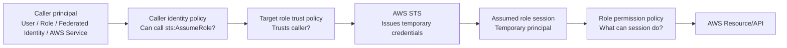
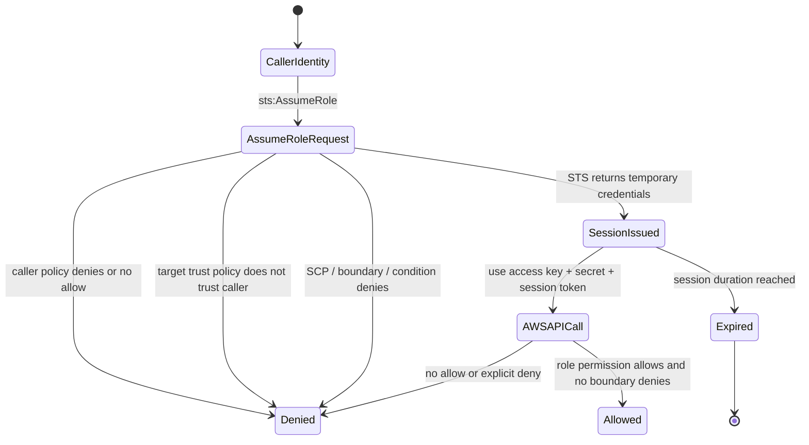
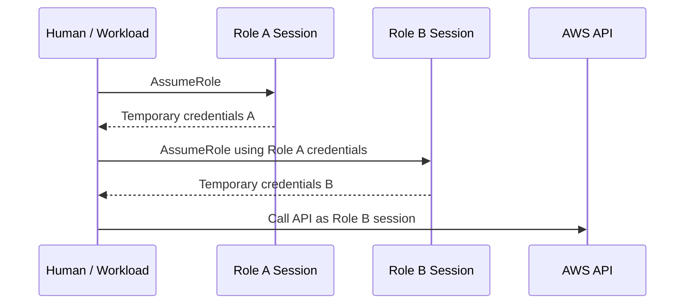
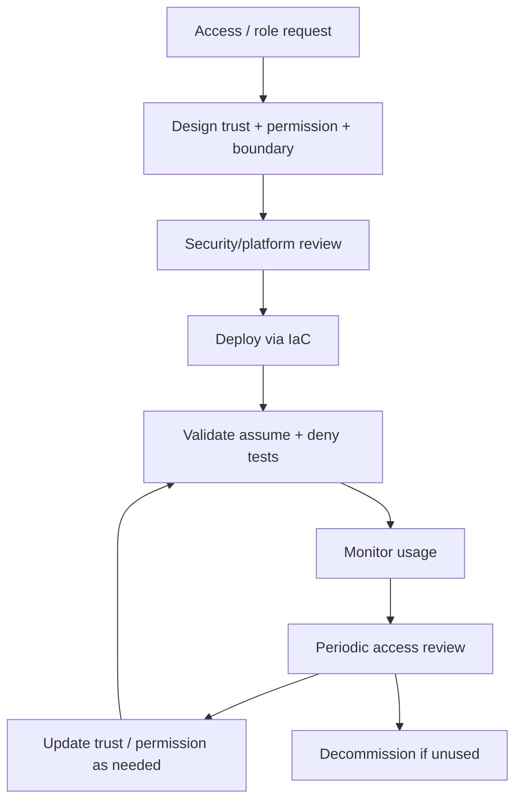

# Part 021 — IAM Roles and Trust Policies

IAM role adalah salah satu primitive paling penting di AWS.

Jika IAM user adalah identitas jangka panjang, IAM role adalah **capability sementara**. Role tidak punya password permanen. Role tidak punya access key permanen. Role diasumsikan oleh principal lain, lalu AWS STS mengeluarkan temporary credentials untuk sesi tertentu.

Di environment kecil, role sering dipahami sebagai “akun admin sementara”. Di environment production-grade, role adalah **kontrak delegasi**:

```text
Principal A boleh menjadi Role B hanya jika trust policy B mengizinkan, caller A punya izin sts:AssumeRole, boundary organisasi tidak menolak, dan sesi yang dihasilkan tetap bisa diaudit.
```

Part ini membahas IAM roles dan trust policies sebagai security boundary, bukan sekadar konfigurasi JSON.

---

## 1. Mental Model: Role Adalah Identity dan Resource Sekaligus

IAM role punya dua sisi:

| Sisi | Dikontrol oleh | Menjawab pertanyaan |
|---|---|---|
| Role sebagai resource | Trust policy | Siapa yang boleh assume role ini? |
| Role sebagai identity | Permission policy | Setelah diasumsikan, role ini boleh melakukan apa? |

Ini penting karena banyak desain IAM gagal akibat mencampur dua hal tersebut.

Trust policy tidak memberi izin untuk membaca S3, membuat EC2, deploy Lambda, atau mengubah KMS key. Trust policy hanya menentukan **siapa boleh mengambil identitas role**.

Permission policy role tidak menentukan siapa boleh assume role. Permission policy hanya menentukan **apa yang bisa dilakukan sesi role setelah berhasil diasumsikan**.



Cara membacanya:

1. caller harus boleh memanggil `sts:AssumeRole`;
2. target role harus mempercayai caller lewat trust policy;
3. AWS Organizations/SCP/permission boundary/session policy tidak boleh memblokir path;
4. STS mengeluarkan temporary credentials;
5. semua action berikutnya dievaluasi sebagai assumed role session.

Role bukan user. Role adalah **runtime identity**.

---

## 2. Kenapa Trust Policy Sangat Sensitif

Trust policy adalah resource-based policy khusus yang melekat pada IAM role. Ia mendefinisikan principal yang boleh melakukan `sts:AssumeRole`, `sts:AssumeRoleWithSAML`, `sts:AssumeRoleWithWebIdentity`, atau variasi STS lain tergantung use case.

Contoh trust policy sederhana:

```json
{
  "Version": "2012-10-17",
  "Statement": [
    {
      "Effect": "Allow",
      "Principal": {
        "AWS": "arn:aws:iam::111122223333:role/PlatformAdmin"
      },
      "Action": "sts:AssumeRole"
    }
  ]
}
```

Policy ini berkata:

```text
Role ini boleh diasumsikan oleh role PlatformAdmin dari account 111122223333.
```

Ia tidak berkata:

```text
PlatformAdmin boleh melakukan semua hal di target account.
```

Akses final masih bergantung pada permission policy target role.

---

## 3. AssumeRole Sebagai State Transition

Role assumption lebih mudah dipahami sebagai transisi state.



Ada dua authorization check yang sering dilupakan:

| Check | Lokasi | Makna |
|---|---|---|
| Caller-side authorization | Identity policy caller | Caller boleh memanggil `sts:AssumeRole` ke target role? |
| Target-side trust | Trust policy target role | Target role mempercayai caller? |

Jika salah satu gagal, role tidak bisa diasumsikan.

---

## 4. Anatomy of a Trust Policy

Trust policy minimal punya elemen berikut:

```json
{
  "Version": "2012-10-17",
  "Statement": [
    {
      "Sid": "AllowPlatformRoleToAssume",
      "Effect": "Allow",
      "Principal": {
        "AWS": "arn:aws:iam::111122223333:role/PlatformAdmin"
      },
      "Action": "sts:AssumeRole",
      "Condition": {
        "StringEquals": {
          "aws:PrincipalOrgID": "o-exampleorgid"
        }
      }
    }
  ]
}
```

Elemen penting:

| Elemen | Fungsi | Risiko umum |
|---|---|---|
| `Principal` | Siapa yang dipercaya | Terlalu luas, account root tanpa condition, wildcard, service principal tanpa SourceArn |
| `Action` | Mekanisme STS yang diizinkan | Salah memakai `AssumeRoleWithWebIdentity`, memberi federation path tidak sengaja |
| `Condition` | Constraint tambahan | Tidak memakai ExternalId, SourceArn, PrincipalOrgID, MFA, tag, session name |
| `Sid` | Label statement | Tidak wajib, tapi membantu audit dan review |
| `Effect` | Allow atau Deny | Trust policy biasanya Allow; explicit Deny dipakai hati-hati |

Trust policy yang baik bukan hanya memilih principal. Trust policy yang baik juga menjelaskan **konteks apa yang membuat trust itu sah**.

---

## 5. Principal: Jangan Salah Membaca `root`

Salah satu kebingungan klasik:

```json
"Principal": {
  "AWS": "arn:aws:iam::111122223333:root"
}
```

Ini tidak berarti hanya root user account `111122223333` yang boleh assume role. Dalam konteks trust policy, account root ARN sering dipakai untuk menunjuk **seluruh account sebagai trusted account**. Artinya administrator di account tersebut bisa memberi IAM principal dalam account itu permission untuk assume role.

Mental model yang lebih aman:

```text
Trusting account says: I trust account 111122223333 as a delegation domain.
Trusted account says: These specific identities may use that delegation.
```

Karena itu, lebih baik gunakan principal yang lebih spesifik jika memungkinkan:

```json
"Principal": {
  "AWS": "arn:aws:iam::111122223333:role/ProdDeploymentRole"
}
```

Atau gabungkan account principal dengan condition yang mengikat principal tertentu:

```json
{
  "Effect": "Allow",
  "Principal": {
    "AWS": "arn:aws:iam::111122223333:root"
  },
  "Action": "sts:AssumeRole",
  "Condition": {
    "ArnLike": {
      "aws:PrincipalArn": "arn:aws:iam::111122223333:role/team-platform/*"
    }
  }
}
```

Pattern ini berguna ketika role dibuat/dihapus otomatis dan ARN spesifik berubah, tetapi tetap harus dibatasi ke namespace role tertentu.

---

## 6. Trust Boundary: Account vs Role vs Organization

Ada beberapa tingkat trust.

### 6.1 Trust Account

```json
"Principal": {
  "AWS": "arn:aws:iam::111122223333:root"
}
```

Cocok jika:

- account tersebut dikelola oleh tim yang sama;
- ada guardrail kuat di account trusted;
- account tersebut menjadi identity hub/platform account;
- delegation dikelola di sisi caller.

Risiko:

- admin di trusted account bisa memberi principal baru akses ke role target;
- sulit memahami siapa actual human atau workload yang masuk;
- blast radius besar jika trusted account compromised.

### 6.2 Trust Specific Role

```json
"Principal": {
  "AWS": "arn:aws:iam::111122223333:role/DeploymentRole"
}
```

Cocok untuk:

- CI/CD role;
- security audit role;
- platform automation;
- controlled cross-account operation.

Risiko:

- role replacement bisa memutus akses;
- jika role punya permission terlalu luas di source account, attacker bisa pivot;
- harus mengelola lifecycle role ARN.

### 6.3 Trust Organization

```json
"Condition": {
  "StringEquals": {
    "aws:PrincipalOrgID": "o-exampleorgid"
  }
}
```

Cocok sebagai guardrail tambahan:

- hanya principal dari AWS Organization tertentu yang boleh masuk;
- mengurangi risiko trust ke account eksternal tak sengaja;
- berguna untuk resource policy dan trust policy lintas banyak account.

Risiko:

- terlalu luas jika hanya memakai `Principal: *` + `PrincipalOrgID` tanpa filter role/account;
- account sandbox dalam organization bisa menjadi jalur lateral movement jika tidak dipisahkan;
- organization membership bukan pengganti least privilege.

Pattern yang lebih defensible:

```json
{
  "Effect": "Allow",
  "Principal": {
    "AWS": "*"
  },
  "Action": "sts:AssumeRole",
  "Condition": {
    "StringEquals": {
      "aws:PrincipalOrgID": "o-exampleorgid"
    },
    "ArnLike": {
      "aws:PrincipalArn": [
        "arn:aws:iam::*:role/platform/deploy-*",
        "arn:aws:iam::*:role/security/audit-*"
      ]
    }
  }
}
```

Ini tetap harus dipakai hati-hati. Dalam banyak sistem regulated, lebih baik explicit account allowlist.

---

## 7. Cross-Account Access: Dua Sisi Policy

Misalnya:

- Account A: platform tooling account;
- Account B: production workload account;
- role di Account A ingin assume role di Account B.

Dibutuhkan:

### 7.1 Caller Policy di Account A

```json
{
  "Version": "2012-10-17",
  "Statement": [
    {
      "Effect": "Allow",
      "Action": "sts:AssumeRole",
      "Resource": "arn:aws:iam::444455556666:role/ProdDeploymentRole"
    }
  ]
}
```

### 7.2 Trust Policy di Account B

```json
{
  "Version": "2012-10-17",
  "Statement": [
    {
      "Effect": "Allow",
      "Principal": {
        "AWS": "arn:aws:iam::111122223333:role/PlatformPipelineRole"
      },
      "Action": "sts:AssumeRole"
    }
  ]
}
```

### 7.3 Permission Policy Target Role di Account B

```json
{
  "Version": "2012-10-17",
  "Statement": [
    {
      "Effect": "Allow",
      "Action": [
        "cloudformation:CreateChangeSet",
        "cloudformation:ExecuteChangeSet",
        "cloudformation:Describe*",
        "cloudformation:List*"
      ],
      "Resource": "*"
    }
  ]
}
```

Kalau hanya trust policy dibuat tetapi caller tidak boleh `sts:AssumeRole`, gagal.

Kalau caller boleh `sts:AssumeRole` tetapi trust policy target tidak percaya caller, gagal.

Kalau STS berhasil tetapi role permission tidak mengizinkan action berikutnya, assume berhasil tetapi operasi gagal.

---

## 8. Confused Deputy Problem

Confused deputy terjadi ketika entity yang punya privilege lebih tinggi bisa “dipakai” oleh pihak lain untuk melakukan action yang tidak seharusnya.

Dalam AWS, ini sering muncul dalam dua bentuk:

1. third-party SaaS/vendor yang assume role customer;
2. AWS service yang memakai service principal untuk mengakses resource customer.

### 8.1 Third-Party Cross-Account Confused Deputy

Misalnya vendor monitoring punya account AWS sendiri. Banyak customer membuat role yang mempercayai vendor account:

```json
"Principal": {
  "AWS": "arn:aws:iam::999988887777:root"
}
```

Jika hanya begitu, customer A bisa mencoba membuat vendor melakukan operasi terhadap customer B jika vendor tidak memisahkan konteks customer dengan benar. Untuk mencegah ini, gunakan `sts:ExternalId`.

Trust policy customer:

```json
{
  "Effect": "Allow",
  "Principal": {
    "AWS": "arn:aws:iam::999988887777:root"
  },
  "Action": "sts:AssumeRole",
  "Condition": {
    "StringEquals": {
      "sts:ExternalId": "customer-123456-nonce-like-value"
    }
  }
}
```

Vendor harus mengirim external ID tersebut saat memanggil `AssumeRole`.

External ID bukan password. Ia adalah **tenant binding**. Nilainya harus unik per customer/vendor relationship dan dikelola oleh vendor agar customer tidak bisa menebak/menggunakan ID customer lain.

### 8.2 Cross-Service Confused Deputy

Ketika AWS service perlu mengakses resource di account Anda, trust policy atau resource policy sering memakai service principal:

```json
"Principal": {
  "Service": "cloudtrail.amazonaws.com"
}
```

Jika service principal tidak dibatasi, service dari konteks lain bisa menjadi jalur akses tidak diinginkan. Gunakan condition seperti:

```json
"Condition": {
  "StringEquals": {
    "aws:SourceAccount": "111122223333"
  },
  "ArnLike": {
    "aws:SourceArn": "arn:aws:cloudtrail:*:111122223333:trail/org-trail"
  }
}
```

Rule of thumb:

| Trust type | Guardrail utama |
|---|---|
| Third-party vendor | `sts:ExternalId` |
| AWS service principal | `aws:SourceArn` dan/atau `aws:SourceAccount` |
| Internal organization | `aws:PrincipalOrgID`, account allowlist, principal ARN pattern |
| Human role assumption | MFA, source identity, session name, IdP group mapping |
| Workload role assumption | workload identity binding, tag/session constraint, explicit role path |

---

## 9. Service Principal Trust Policy

Banyak AWS service butuh role untuk menjalankan action atas nama Anda. Contoh: Lambda execution role.

```json
{
  "Version": "2012-10-17",
  "Statement": [
    {
      "Effect": "Allow",
      "Principal": {
        "Service": "lambda.amazonaws.com"
      },
      "Action": "sts:AssumeRole"
    }
  ]
}
```

Ini berarti Lambda service boleh assume role tersebut.

Namun jangan berhenti di trust policy. Permission policy role menentukan apa yang bisa dilakukan Lambda setelah running.

Security smell:

```text
Lambda execution role memiliki AdministratorAccess karena “nanti butuh akses macam-macam”.
```

Lebih baik:

- role per workload atau per bounded context;
- permission granular terhadap resource ARN tertentu;
- KMS decrypt hanya untuk key tertentu;
- CloudWatch Logs write hanya ke log group terkait;
- tidak memberi `iam:*`, `organizations:*`, `account:*`, atau `kms:*` tanpa alasan kuat;
- gunakan permission boundary untuk role yang dibuat oleh developer/platform automation.

---

## 10. Web Identity dan OIDC Trust

Untuk workload identity modern seperti GitHub Actions OIDC, EKS IRSA/pod identity style, atau external IdP, role tidak diasumsikan oleh IAM principal biasa, tetapi oleh federated principal.

Contoh trust policy OIDC untuk GitHub Actions secara konseptual:

```json
{
  "Version": "2012-10-17",
  "Statement": [
    {
      "Effect": "Allow",
      "Principal": {
        "Federated": "arn:aws:iam::111122223333:oidc-provider/token.actions.githubusercontent.com"
      },
      "Action": "sts:AssumeRoleWithWebIdentity",
      "Condition": {
        "StringEquals": {
          "token.actions.githubusercontent.com:aud": "sts.amazonaws.com"
        },
        "StringLike": {
          "token.actions.githubusercontent.com:sub": "repo:example-org/example-repo:ref:refs/heads/main"
        }
      }
    }
  ]
}
```

Mental model:

```text
Do not trust the provider broadly. Trust a narrow claim set.
```

Yang harus dibatasi:

- issuer/provider;
- audience;
- subject;
- repository/project/environment;
- branch/tag/environment name;
- account target;
- role session name/source identity jika tersedia;
- permission policy setelah assume.

Security smell:

```json
"StringLike": {
  "token.actions.githubusercontent.com:sub": "repo:example-org/*"
}
```

Ini terlalu luas untuk production deploy role. Jika satu repo di organization compromised, production role bisa menjadi target pivot.

---

## 11. MFA Condition Untuk Human AssumeRole

Untuk privileged human access, trust policy bisa mengharuskan MFA:

```json
{
  "Effect": "Allow",
  "Principal": {
    "AWS": "arn:aws:iam::111122223333:role/EngineeringAdminEntry"
  },
  "Action": "sts:AssumeRole",
  "Condition": {
    "Bool": {
      "aws:MultiFactorAuthPresent": "true"
    }
  }
}
```

Namun di organisasi modern, MFA biasanya ditegakkan di IdP/IAM Identity Center. Trust policy MFA condition tetap relevan untuk IAM-user-based legacy access atau emergency access path.

Jangan bergantung pada satu lapisan saja:

| Layer | Kontrol |
|---|---|
| IdP | MFA, device posture, group membership |
| IAM Identity Center | Permission set, account assignment, session duration |
| Trust policy | allowed caller, condition, source identity |
| SCP | deny high-risk actions kecuali role tertentu |
| CloudTrail | audit AssumeRole dan action berikutnya |
| EventBridge/Security Hub | alert privilege usage |

---

## 12. Source Identity dan Role Session Name

Dalam incident investigation, pertanyaan terpenting bukan hanya:

```text
Role apa yang melakukan action ini?
```

Tetapi:

```text
Siapa atau workload apa yang menyebabkan role session itu ada?
```

CloudTrail event untuk assumed role sering menampilkan assumed-role ARN seperti:

```text
arn:aws:sts::444455556666:assumed-role/ProdAdminRole/alice@example.com
```

Bagian akhir adalah role session name. Session name membantu, tapi bisa dipilih oleh caller dalam banyak skenario. Karena itu, untuk audit yang lebih kuat gunakan `SourceIdentity` jika memungkinkan.

Trust policy dapat mewajibkan source identity:

```json
{
  "Effect": "Allow",
  "Principal": {
    "AWS": "arn:aws:iam::111122223333:role/HumanAccessBroker"
  },
  "Action": [
    "sts:AssumeRole",
    "sts:SetSourceIdentity"
  ],
  "Condition": {
    "StringLike": {
      "sts:SourceIdentity": "*@example.com"
    }
  }
}
```

Gunakan source identity untuk:

- human attribution;
- privileged action investigation;
- approval-to-action correlation;
- join dengan ticket/incident/change request;
- detecting anonymous/generic session names seperti `admin`, `test`, `default`, `terraform`.

Session naming convention:

```text
human:<email>:<ticket>
ci:<repo>:<workflow>:<run-id>
workload:<service>:<environment>:<pod-or-task-id>
vendor:<vendor-name>:<tenant-id>:<purpose>
```

Jangan biarkan production admin session bernama:

```text
session
admin
test
aws-cli
terraform
```

Itu membuat forensic attribution lemah.

---

## 13. Session Tags dan ABAC

AssumeRole bisa membawa session tags. Session tags berguna untuk ABAC dan audit.

Contoh caller meminta session tag:

```bash
aws sts assume-role \
  --role-arn arn:aws:iam::444455556666:role/TeamScopedOperator \
  --role-session-name human:alice@example.com:CHG-1234 \
  --tags Team=payments Environment=prod Ticket=CHG-1234 \
  --transitive-tag-keys Team Environment
```

Trust policy dapat membatasi tag yang boleh dibawa:

```json
{
  "Effect": "Allow",
  "Principal": {
    "AWS": "arn:aws:iam::111122223333:role/HumanAccessBroker"
  },
  "Action": [
    "sts:AssumeRole",
    "sts:TagSession"
  ],
  "Condition": {
    "StringEquals": {
      "aws:RequestTag/Environment": "prod"
    },
    "ForAllValues:StringEquals": {
      "aws:TagKeys": [
        "Team",
        "Environment",
        "Ticket"
      ]
    }
  }
}
```

Risiko session tags:

- caller bisa memalsukan tag jika tidak dibatasi;
- ABAC bisa collapse jika tag taxonomy tidak governance;
- transitive tag bisa terbawa role chaining;
- tag-based access sulit diaudit jika tag ownership tidak jelas.

Gunakan session tags hanya jika:

- tag vocabulary dikelola;
- source of truth jelas;
- trust policy membatasi nilai tag;
- CloudTrail dipakai untuk audit;
- ada test policy otomatis.

---

## 14. Role Chaining

Role chaining adalah ketika Anda memakai credentials dari role A untuk assume role B.



Role chaining berguna untuk:

- hub-and-spoke access;
- central access broker;
- jump role pattern;
- federation entry role lalu target account role;
- break-glass path dengan approval.

Namun role chaining punya konsekuensi:

- session duration role-chained dibatasi;
- attribution bisa kabur jika source identity/session tag tidak dibawa;
- trust chain makin sulit ditinjau;
- attacker bisa pivot jika satu link chain terlalu luas;
- debugging `AccessDenied` lebih sulit karena ada beberapa policy boundary.

Rule of thumb:

```text
Allow role chaining only when it gives you clearer control, not because access design is messy.
```

Untuk production admin access, chain yang defensible biasanya:

```text
IdP user -> IAM Identity Center permission set -> central access broker role -> target account role
```

Tapi jangan buat chain terlalu panjang.

---

## 15. `iam:PassRole` dan Trust Policy

`iam:PassRole` bukan AssumeRole, tetapi sering menjadi privilege escalation path.

Contoh:

1. developer tidak boleh langsung assume `PowerfulRuntimeRole`;
2. tetapi developer boleh membuat Lambda dan `iam:PassRole` ke `PowerfulRuntimeRole`;
3. developer deploy Lambda yang menjalankan action privileged;
4. developer memicu Lambda;
5. privilege effective naik lewat service execution role.

Karena itu, role security harus dilihat sebagai kombinasi:

| Control | Pertanyaan |
|---|---|
| Trust policy | Service/principal apa yang boleh assume role? |
| Permission policy role | Setelah role aktif, action apa yang bisa dilakukan? |
| `iam:PassRole` policy | Siapa boleh memberikan role ini ke service? |
| SCP/permission boundary | Apakah high-risk role protected dari pass/attach/modify? |
| CloudTrail detection | Apakah pass role dan role modification dipantau? |

Policy caller yang terlalu luas:

```json
{
  "Effect": "Allow",
  "Action": "iam:PassRole",
  "Resource": "*"
}
```

Ini hampir selalu berbahaya.

Lebih baik:

```json
{
  "Effect": "Allow",
  "Action": "iam:PassRole",
  "Resource": "arn:aws:iam::444455556666:role/app/payments/runtime/*",
  "Condition": {
    "StringEquals": {
      "iam:PassedToService": "lambda.amazonaws.com"
    }
  }
}
```

Trust policy role runtime juga harus hanya mempercayai service yang relevan.

---

## 16. Trust Policy Design Patterns

### 16.1 Human Admin Role

```json
{
  "Version": "2012-10-17",
  "Statement": [
    {
      "Sid": "AllowCentralHumanAccessBroker",
      "Effect": "Allow",
      "Principal": {
        "AWS": "arn:aws:iam::111122223333:role/access/HumanAccessBroker"
      },
      "Action": [
        "sts:AssumeRole",
        "sts:SetSourceIdentity",
        "sts:TagSession"
      ],
      "Condition": {
        "StringEquals": {
          "aws:PrincipalOrgID": "o-exampleorgid"
        },
        "StringLike": {
          "sts:SourceIdentity": "*@example.com"
        },
        "ForAllValues:StringEquals": {
          "aws:TagKeys": ["Team", "Ticket", "Purpose"]
        }
      }
    }
  ]
}
```

Use case:

- access broker sudah menegakkan approval;
- CloudTrail butuh source identity;
- session harus membawa ticket/team.

### 16.2 CI/CD Deployment Role

```json
{
  "Version": "2012-10-17",
  "Statement": [
    {
      "Sid": "AllowPlatformPipeline",
      "Effect": "Allow",
      "Principal": {
        "AWS": "arn:aws:iam::111122223333:role/cicd/prod-deployer"
      },
      "Action": [
        "sts:AssumeRole",
        "sts:TagSession"
      ],
      "Condition": {
        "StringEquals": {
          "aws:PrincipalOrgID": "o-exampleorgid",
          "aws:RequestTag/Environment": "prod"
        }
      }
    }
  ]
}
```

Tambahkan kontrol di caller-side:

- pipeline hanya dari protected branch;
- approval untuk production;
- artifact digest immutable;
- change set review;
- session tags berisi repo, commit, run ID.

### 16.3 Third-Party Vendor Role

```json
{
  "Version": "2012-10-17",
  "Statement": [
    {
      "Sid": "AllowVendorWithExternalId",
      "Effect": "Allow",
      "Principal": {
        "AWS": "arn:aws:iam::999988887777:root"
      },
      "Action": "sts:AssumeRole",
      "Condition": {
        "StringEquals": {
          "sts:ExternalId": "vendor-issued-unique-customer-id"
        }
      }
    }
  ]
}
```

Tambahkan:

- permission policy read-only jika memungkinkan;
- deny modification action;
- CloudTrail alert untuk unusual usage;
- contract owner;
- expiry/review date;
- vendor offboarding runbook.

### 16.4 AWS Service Role With SourceArn

```json
{
  "Version": "2012-10-17",
  "Statement": [
    {
      "Sid": "AllowSpecificServiceContext",
      "Effect": "Allow",
      "Principal": {
        "Service": "example.amazonaws.com"
      },
      "Action": "sts:AssumeRole",
      "Condition": {
        "StringEquals": {
          "aws:SourceAccount": "111122223333"
        },
        "ArnLike": {
          "aws:SourceArn": "arn:aws:example:ap-southeast-1:111122223333:resource/specific-resource"
        }
      }
    }
  ]
}
```

Gunakan pattern ini saat service mendukung `SourceArn`/`SourceAccount`.

---

## 17. Trust Policy Anti-Patterns

### 17.1 Trust Everyone

```json
"Principal": "*"
```

Ini hanya masuk akal dengan condition yang sangat ketat. Tanpa condition, ini hampir pasti critical finding.

### 17.2 Trust Account Root Tanpa Batasan

```json
"Principal": {
  "AWS": "arn:aws:iam::111122223333:root"
}
```

Tidak selalu salah, tetapi terlalu luas jika account tersebut tidak punya kontrol internal kuat.

### 17.3 Vendor Role Tanpa External ID

```json
"Principal": {
  "AWS": "arn:aws:iam::999988887777:root"
}
```

Jika vendor melayani banyak customer, ini rawan confused deputy.

### 17.4 Service Principal Tanpa Source Constraint

```json
"Principal": {
  "Service": "events.amazonaws.com"
}
```

Untuk banyak service integration, tambahkan `aws:SourceArn`/`aws:SourceAccount` jika service mendukung.

### 17.5 Generic Session Name

```text
aws sts assume-role --role-session-name admin
```

Membuat forensic attribution lemah.

### 17.6 Role Bisa Diassume dan Dipass Terlalu Luas

Role dengan permission besar dan trust ke service luas dapat menjadi escalation path jika `iam:PassRole` tidak dibatasi.

### 17.7 Trust Policy Menggunakan Pattern Terlalu Longgar

```json
"ArnLike": {
  "aws:PrincipalArn": "arn:aws:iam::*:role/*Admin*"
}
```

Nama role bukan security boundary yang kuat jika account lain bisa membuat role dengan nama serupa.

---

## 18. Debugging AssumeRole AccessDenied

Ketika `AssumeRole` gagal, gunakan urutan ini.

### 18.1 Pastikan Target Role ARN Benar

```bash
aws iam get-role --role-name ProdDeploymentRole
```

Periksa:

- account ID target;
- role name;
- role path;
- max session duration;
- trust policy.

### 18.2 Periksa Caller Identity

```bash
aws sts get-caller-identity
```

Jangan menebak. Banyak debugging gagal karena CLI profile ternyata memakai role berbeda.

### 18.3 Periksa Caller Boleh `sts:AssumeRole`

Caller harus punya identity policy yang allow:

```json
{
  "Effect": "Allow",
  "Action": "sts:AssumeRole",
  "Resource": "arn:aws:iam::444455556666:role/ProdDeploymentRole"
}
```

Juga pastikan tidak ada explicit deny dari:

- identity policy;
- permission boundary caller;
- session policy caller;
- SCP source account;
- SCP target account jika relevan.

### 18.4 Periksa Trust Policy Target

Target role harus mempercayai caller actual, bukan caller yang Anda kira.

Periksa:

- principal ARN;
- account root semantics;
- `aws:PrincipalArn` condition;
- `aws:PrincipalOrgID`;
- external ID;
- MFA;
- source identity;
- session tag requirement.

### 18.5 Periksa STS Parameters

Jika trust policy butuh external ID:

```bash
aws sts assume-role \
  --role-arn arn:aws:iam::444455556666:role/VendorAccessRole \
  --role-session-name vendor:monitoring \
  --external-id vendor-issued-unique-customer-id
```

Jika butuh tags:

```bash
aws sts assume-role \
  --role-arn arn:aws:iam::444455556666:role/ProdOperator \
  --role-session-name human:alice@example.com:INC-123 \
  --tags Team=payments Ticket=INC-123 \
  --transitive-tag-keys Team
```

Jika butuh source identity, caller juga perlu permission untuk `sts:SetSourceIdentity` jika trust/action mensyaratkannya.

### 18.6 Jika Assume Berhasil Tapi Action Gagal

Itu bukan lagi masalah trust policy. Periksa permission role session:

- role identity policy;
- permission boundary role;
- session policy saat assume;
- SCP target account;
- RCP/resource policy target resource;
- KMS key policy;
- VPC endpoint policy;
- service-specific condition.

---

## 19. CloudTrail Evidence for Role Assumption

Setiap production role assumption harus bisa dijawab:

| Pertanyaan | Evidence |
|---|---|
| Siapa caller awal? | CloudTrail `userIdentity`, source identity, session issuer |
| Role apa yang diasumsikan? | `requestParameters.roleArn` pada `AssumeRole` event |
| Session name apa? | `requestParameters.roleSessionName` |
| Dari IP/agent mana? | `sourceIPAddress`, `userAgent` |
| Apakah ada external ID? | `requestParameters.externalId` visibility tergantung event handling dan masking; jangan jadikan satu-satunya secret |
| Action apa setelah assume? | CloudTrail event berikutnya dengan assumed-role ARN |
| Apakah sesuai ticket? | session name/tag/source identity join ke change/incident system |

Query investigasi dasar CloudTrail Lake/Logs-style:

```sql
SELECT eventTime, eventName, userIdentity.arn, requestParameters.roleArn, requestParameters.roleSessionName, sourceIPAddress
WHERE eventSource = 'sts.amazonaws.com'
  AND eventName = 'AssumeRole'
ORDER BY eventTime DESC
```

Untuk deteksi:

- AssumeRole dari IP/geolocation tidak biasa;
- role production diasumsikan di luar maintenance window;
- session name generic;
- vendor role dipakai setelah contract expired;
- admin role diasumsikan tanpa ticket tag;
- role chaining tidak biasa;
- spike AssumeRole gagal dari satu principal.

---

## 20. Review Checklist untuk Trust Policy

Gunakan checklist ini saat review PR/IaC.

### Principal

- Apakah principal spesifik?
- Jika memakai account root, apakah itu memang delegation domain yang diinginkan?
- Apakah principal berasal dari account/organization yang benar?
- Apakah sandbox/nonprod bisa assume role prod?
- Apakah external account/vendor tercatat di registry?

### Condition

- Apakah third-party trust memakai `sts:ExternalId`?
- Apakah service principal memakai `aws:SourceArn`/`aws:SourceAccount` jika didukung?
- Apakah organization boundary memakai `aws:PrincipalOrgID`?
- Apakah human privileged access punya source identity/session name/ticket discipline?
- Apakah session tag dibatasi?
- Apakah MFA dibutuhkan untuk legacy/emergency human path?

### Permission Interaction

- Apakah caller policy membatasi target role ARN?
- Apakah target role permission minimal?
- Apakah `iam:PassRole` dibatasi?
- Apakah permission boundary/SCP melindungi role dari modifikasi?
- Apakah role bisa attach policy baru ke dirinya sendiri?
- Apakah role bisa membuat role lain yang lebih privileged?

### Operations

- Apakah role owner jelas?
- Apakah purpose jelas?
- Apakah session duration sesuai risiko?
- Apakah access expiry/review ada?
- Apakah CloudTrail alert tersedia?
- Apakah break-glass path terpisah?

---

## 21. Role Ownership Model

Setiap role production harus punya metadata.

```yaml
role:
  name: ProdDeploymentRole
  account: prod-payments
  owner_team: platform-payments
  purpose: deploy CloudFormation changesets for payments services
  trusted_principals:
    - arn:aws:iam::111122223333:role/cicd/prod-deployer
  privilege_level: high
  session_duration: 1h
  requires_ticket: true
  allows_role_chaining: false
  allows_session_tags: true
  external_party: false
  review_frequency: quarterly
  break_glass: false
```

Tanpa ownership, role akan menjadi fossil access:

```text
Role masih ada karena tidak ada yang berani menghapusnya.
```

Fossil roles adalah risiko besar karena trust-nya sering sudah tidak relevan tetapi permission-nya masih aktif.

---

## 22. Role Lifecycle

Role lifecycle yang sehat:



Kontrol penting:

- role dibuat lewat IaC;
- trust policy wajib review;
- policy simulator atau automated IAM checks;
- CloudTrail usage baseline;
- unused role detection;
- expiry untuk vendor/emergency roles;
- decommission runbook;
- deny direct console edits untuk critical roles jika memungkinkan.

---

## 23. Production Role Archetypes

| Archetype | Trust principal | Permission style | Session duration | Notes |
|---|---|---|---|---|
| Human read-only | IAM Identity Center/broker | broad read, no write | 4–8h | Good for diagnostics |
| Human break-fix | access broker | scoped write | 1h | Requires ticket/approval |
| CI deployment | pipeline role/OIDC | deploy-specific | 1h | Bind to repo/branch/environment |
| Security audit | security tooling account | read/security APIs | 1–4h | Centralized audit role |
| Incident response | IR broker | quarantine/remediation | 1h | Heavily logged |
| Vendor monitoring | vendor account + ExternalId | read-only | 1h | Review and expiry |
| AWS service execution | service principal | resource-specific | service-managed | Protect PassRole |
| Automation remediation | EventBridge/Lambda/SSM | narrow corrective action | short | Avoid broad admin |

---

## 24. Concrete Failure Models

### 24.1 Compromised CI Role

If CI role can assume prod deployment role:

- attacker modifies workflow;
- OIDC token or pipeline role assumes prod role;
- attacker deploys backdoor or changes IAM;
- CloudTrail shows CI role, not human intent.

Controls:

- protected branches;
- environment approval;
- OIDC trust pinned to repo/ref/environment;
- permission boundary on deployment role;
- deny IAM mutation except controlled paths;
- session tags with commit/run ID;
- CloudTrail alert on unusual deploy role actions.

### 24.2 Vendor Account Compromised

If vendor account is compromised and customer trust lacks external ID:

- attacker enumerates customer roles;
- assumes roles without tenant binding;
- reads customer data.

Controls:

- external ID;
- read-only minimal role;
- vendor IP/userAgent monitoring if feasible;
- expiration date;
- regular access review;
- Security Hub/IAM Access Analyzer review for external access.

### 24.3 Developer Can Pass Admin Runtime Role

Developer cannot assume admin role, but can pass it to Lambda/ECS.

Controls:

- restrict `iam:PassRole` to runtime role namespace;
- restrict `iam:PassedToService`;
- permission boundary for developer-created roles;
- SCP deny passing protected roles;
- detection on `PassRole` to sensitive role.

### 24.4 Trust Policy Uses Account Root for Shared Tooling Account

Shared tooling account has many admins. Target prod role trusts account root. Any admin in tooling account can create a new role/user and grant assume permission.

Controls:

- trust specific role;
- constrain `aws:PrincipalArn`;
- use permission boundary in tooling account;
- monitor new principals with `sts:AssumeRole` permission;
- split tooling account by risk.

---

## 25. Practical Policy Tests

Minimal tests untuk role production:

```text
Positive tests:
- expected principal can assume role;
- expected source identity/session tag accepted;
- expected action allowed;
- expected CloudTrail event emitted.

Negative tests:
- wrong account cannot assume;
- wrong role in same account cannot assume;
- missing external ID fails;
- wrong external ID fails;
- missing SourceIdentity fails if required;
- disallowed session tag fails;
- sandbox principal cannot assume prod role;
- role cannot escalate itself;
- caller cannot PassRole protected role.
```

Contoh test command:

```bash
aws sts assume-role \
  --role-arn arn:aws:iam::444455556666:role/ProdDeploymentRole \
  --role-session-name ci:repo:workflow:12345
```

Negative test harus menjadi bagian dari pipeline policy validation, bukan dilakukan manual saat incident.

---

## 26. Engineering Heuristics

Gunakan heuristik berikut:

```text
Trust policy should be boring.
```

Kalau trust policy sulit dijelaskan dalam satu paragraf, kemungkinan desain access terlalu rumit.

```text
Trust account only when you trust its governance.
```

Jangan trust account hanya karena account itu milik organisasi Anda. Sandbox account dalam organization tetap bisa menjadi risk source.

```text
External access must have tenant binding.
```

Vendor role tanpa external ID adalah red flag.

```text
Service principal must be context-bound.
```

Gunakan SourceArn/SourceAccount jika service mendukung.

```text
AssumeRole is not enough evidence.
```

Butuh source identity, session name, tags, CloudTrail, ticket correlation.

```text
Role permission and role trust are reviewed together.
```

Trust sempit dengan permission liar tetap berbahaya jika caller compromised. Trust luas dengan permission sempit tetap bisa bocor jika privilege tumbuh nanti.

---

## 27. What Good Looks Like

Trust policy production-grade memiliki sifat:

- principal sempit;
- condition eksplisit;
- third-party menggunakan external ID;
- service principal dibatasi SourceArn/SourceAccount;
- human access punya attribution;
- session duration sesuai risiko;
- session tags dikontrol;
- role permission minimal;
- PassRole dibatasi;
- role dimiliki oleh team jelas;
- CloudTrail query/detection tersedia;
- role direview berkala;
- IaC menjadi source of truth.

Trust policy yang baik bukan policy yang terlihat paling canggih. Trust policy yang baik adalah policy yang **mengizinkan path yang memang dibutuhkan dan membuat semua path lain gagal secara jelas**.

---

## 28. Ringkasan

IAM role adalah kontrak delegasi sementara.

Trust policy menjawab **siapa boleh menjadi role ini**. Permission policy menjawab **apa yang bisa dilakukan setelah menjadi role ini**. Caller policy menjawab **apakah caller boleh meminta transisi itu**.

Untuk workload production, role harus dilihat sebagai bagian dari access graph:

```text
human/workload/vendor/service -> caller policy -> trust policy -> STS session -> role permissions -> resource policy/KMS/SCP/RCP -> CloudTrail evidence
```

Jika salah satu edge terlalu longgar, graph menjadi attack path.

Desain role yang matang selalu memikirkan:

- trust boundary;
- tenant binding;
- service context binding;
- source identity;
- session duration;
- role chaining;
- PassRole;
- privilege escalation;
- evidence;
- lifecycle.

Part berikutnya membahas permission boundaries: cara memberi platform/developer team kemampuan membuat IAM role dan policy tanpa memberi mereka kebebasan melampaui batas organisasi.

---

## References

- AWS IAM User Guide — IAM roles: https://docs.aws.amazon.com/IAM/latest/UserGuide/id_roles.html
- AWS IAM User Guide — Policies and permissions: https://docs.aws.amazon.com/IAM/latest/UserGuide/access_policies.html
- AWS IAM User Guide — Cross-account resource access: https://docs.aws.amazon.com/IAM/latest/UserGuide/access_policies-cross-account-resource-access.html
- AWS IAM User Guide — Confused deputy problem: https://docs.aws.amazon.com/IAM/latest/UserGuide/confused-deputy.html
- AWS IAM User Guide — Third-party access and external ID: https://docs.aws.amazon.com/IAM/latest/UserGuide/id_roles_common-scenarios_third-party.html
- AWS IAM User Guide — Principal element: https://docs.aws.amazon.com/IAM/latest/UserGuide/reference_policies_elements_principal.html
- AWS IAM User Guide — Monitor assumed roles with source identity: https://docs.aws.amazon.com/IAM/latest/UserGuide/id_credentials_temp_control-access_monitor.html
- AWS STS API Reference — AssumeRole: https://docs.aws.amazon.com/STS/latest/APIReference/API_AssumeRole.html
