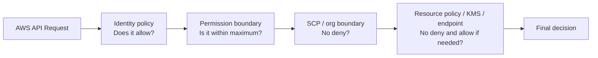
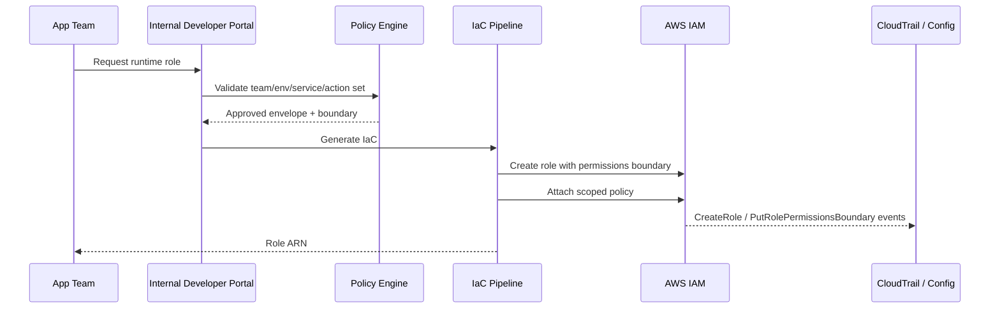
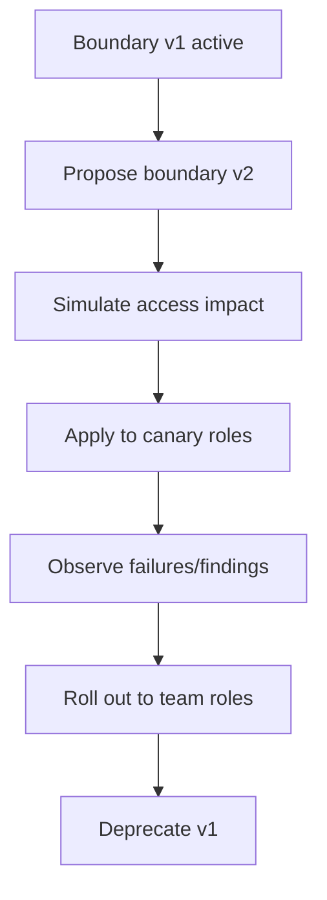
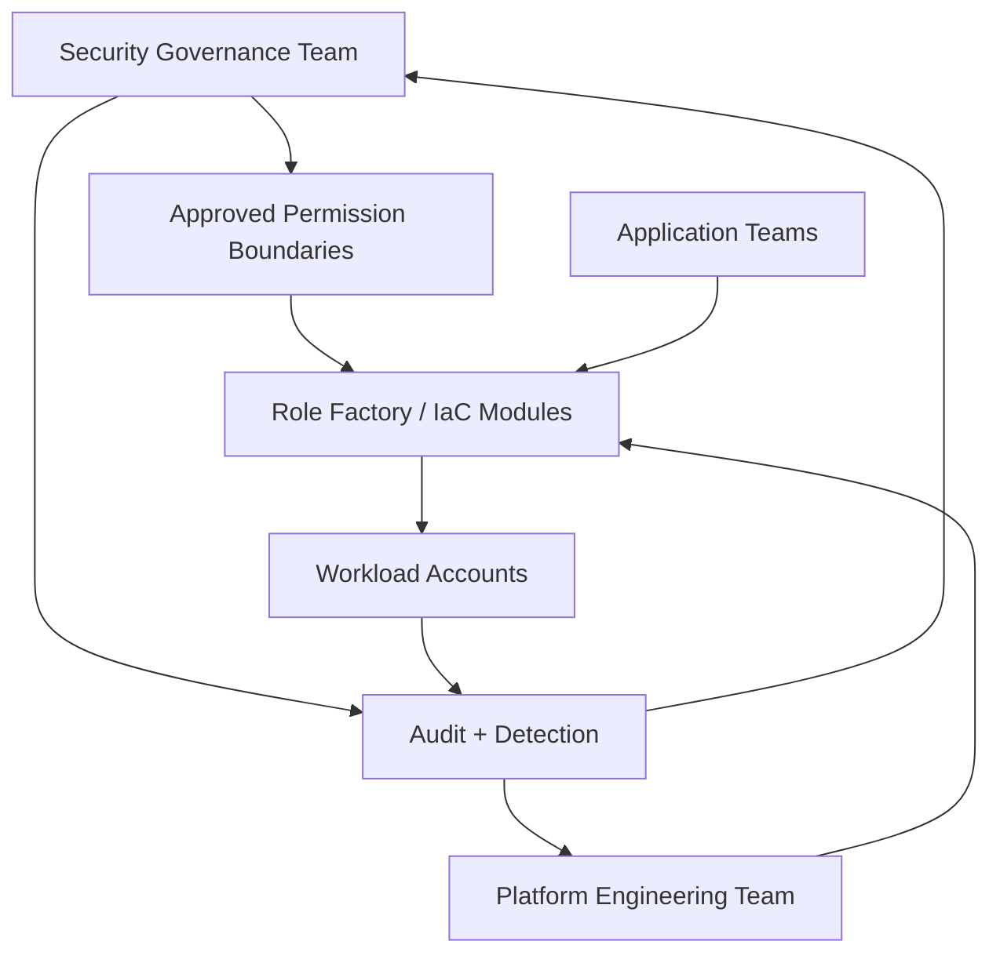

# Part 022 — Permission Boundaries and Delegated Platform Teams

Permission boundary adalah salah satu fitur IAM yang paling sering ada di environment mature, tetapi paling sering disalahpahami.

Banyak engineer membaca boundary sebagai “policy tambahan”. Itu kurang tepat.

Permission boundary adalah **maximum permission envelope** untuk IAM user atau IAM role. Ia tidak memberi permission. Ia membatasi permission yang bisa dihasilkan oleh identity-based policy.

Mental model paling sederhana:

```text
Effective permission = identity policy ALLOW ∩ permission boundary ALLOW ∩ no explicit deny ∩ no higher-level boundary denial
```

Part ini membahas permission boundary sebagai alat untuk delegated administration: platform team dan developer bisa membuat role/policy tertentu, tetapi tidak bisa membuat privilege di luar batas yang ditentukan security/platform governance.

---

## 1. Problem: Delegation Without Boundary Becomes Privilege Escalation

Di organisasi kecil, IAM sering dikelola oleh satu admin team. Di organisasi besar, itu tidak scalable.

Platform team perlu membuat deployment role.

Developer platform perlu membuat runtime role.

Data team perlu membuat Glue/Lambda/Step Functions role.

Security automation perlu membuat remediation role.

Jika semua IAM change harus menunggu central security team, delivery melambat. Jika semua team diberi `iam:*`, account menjadi privilege escalation playground.

Permission boundary menjawab masalah ini:

```text
Biarkan team membuat role sendiri, tetapi role yang dibuat tidak boleh punya effective permission di luar boundary yang disetujui.
```

Ini bukan pengganti review. Ini adalah **mechanical safety rail**.

---

## 2. Permission Boundary Bukan Permission Grant

Misalnya ada role dengan boundary berikut:

```json
{
  "Version": "2012-10-17",
  "Statement": [
    {
      "Effect": "Allow",
      "Action": [
        "s3:GetObject",
        "s3:PutObject"
      ],
      "Resource": "arn:aws:s3:::team-payments-*/*"
    }
  ]
}
```

Jika role tidak punya identity policy yang mengizinkan `s3:GetObject`, role tetap tidak bisa `GetObject`.

Boundary hanya berkata:

```text
Kalau identity policy mengizinkan sesuatu, maksimum yang boleh efektif hanya GetObject/PutObject pada bucket team-payments-*.
```

Ia bukan berkata:

```text
Role ini otomatis boleh GetObject/PutObject.
```

Diagram:



Jika identity policy allow tetapi boundary tidak allow, hasilnya deny.

Jika boundary allow tetapi identity policy tidak allow, hasilnya deny.

Jika keduanya allow tetapi SCP explicit deny, hasilnya deny.

---

## 3. Boundary Sebagai Contract

Boundary harus diperlakukan sebagai kontrak antara security/platform governance dan delegated team.

```text
Central team controls the envelope.
Delegated team controls permissions inside the envelope.
```

Contoh:

| Team | Boleh self-service | Tidak boleh |
|---|---|---|
| Application team | Membuat runtime role untuk service sendiri | Membuat org admin role |
| Data team | Membuat role untuk Glue/Athena/S3 domain tertentu | Membuka akses ke semua S3/KMS |
| Platform team | Membuat deployment role dengan action terbatas | Membuat role yang bisa disable CloudTrail/Security Hub |
| Security automation team | Membuat remediation role untuk action terdefinisi | Membuat blanket admin remediation role |
| Sandbox users | Membuat role eksperimen bounded | Menciptakan role lintas account ke prod |

Boundary yang baik membuat delegation aman secara default.

---

## 4. Policy Evaluation: Boundary in the Effective Permission Set

Untuk IAM entity dengan permission boundary, AWS mengevaluasi identity policy dan boundary sebagai intersection.

Contoh:

### Identity policy

```json
{
  "Effect": "Allow",
  "Action": "s3:*",
  "Resource": "*"
}
```

### Permission boundary

```json
{
  "Effect": "Allow",
  "Action": [
    "s3:GetObject",
    "s3:PutObject"
  ],
  "Resource": "arn:aws:s3:::team-payments-*/*"
}
```

### Effective result

| Action | Resource | Result | Reason |
|---|---|---|---|
| `s3:GetObject` | `team-payments-prod/file.txt` | Allow | allowed by identity and boundary |
| `s3:DeleteBucket` | `team-payments-prod` | Deny | identity allows but boundary does not |
| `s3:GetObject` | `central-audit-logs/file.txt` | Deny | boundary resource does not match |
| `ec2:RunInstances` | `*` | Deny | boundary does not allow EC2 |

Boundary reduces effective access. It does not expand it.

---

## 5. Why SCP Alone Is Not Enough

SCP adalah organization-level ceiling. Permission boundary adalah identity-level ceiling.

| Aspect | SCP | Permission Boundary |
|---|---|---|
| Attached to | Root/OU/account | IAM user/role |
| Scope | Account-level maximum | Principal-level maximum |
| Grants permission? | No | No |
| Typical owner | Cloud governance/security | Platform/IAM governance |
| Best for | Non-negotiable org guardrails | Delegated role/user creation |
| Example | Deny disabling CloudTrail | Role created by developer cannot exceed app runtime envelope |

SCP bisa mencegah semua account melakukan `organizations:LeaveOrganization` atau `cloudtrail:StopLogging`.

Tetapi SCP tidak ideal untuk membedakan ratusan role per team. Jika setiap app team punya envelope berbeda, permission boundary lebih presisi.

Gunakan keduanya:

```text
SCP: global no-go zones.
Boundary: maximum power of delegated IAM entities.
Identity policy: actual task permissions.
```

---

## 6. Delegated IAM Creation Pattern

Tujuan:

```text
Application team boleh membuat role untuk aplikasinya sendiri, tetapi semua role harus memakai boundary yang disetujui.
```

### 6.1 Boundary Policy

```json
{
  "Version": "2012-10-17",
  "Statement": [
    {
      "Sid": "AllowApplicationRuntimeActions",
      "Effect": "Allow",
      "Action": [
        "logs:CreateLogStream",
        "logs:PutLogEvents",
        "xray:PutTraceSegments",
        "xray:PutTelemetryRecords",
        "ssm:GetParameter",
        "secretsmanager:GetSecretValue",
        "kms:Decrypt",
        "s3:GetObject",
        "s3:PutObject",
        "dynamodb:GetItem",
        "dynamodb:PutItem",
        "dynamodb:UpdateItem",
        "dynamodb:Query"
      ],
      "Resource": "*"
    },
    {
      "Sid": "DenyIAMAndOrganizationAdministration",
      "Effect": "Deny",
      "Action": [
        "iam:*",
        "organizations:*",
        "account:*"
      ],
      "Resource": "*"
    }
  ]
}
```

Catatan: boundary dengan explicit deny harus hati-hati. Di boundary, deny tetap deny. Banyak organisasi lebih memilih boundary allow-list saja, lalu SCP untuk deny global.

### 6.2 Delegated Admin Policy

Principal delegated team diberi izin membuat role hanya jika memasang boundary tertentu.

```json
{
  "Version": "2012-10-17",
  "Statement": [
    {
      "Sid": "AllowCreateRoleOnlyWithApprovedBoundary",
      "Effect": "Allow",
      "Action": "iam:CreateRole",
      "Resource": "arn:aws:iam::444455556666:role/app/payments/*",
      "Condition": {
        "StringEquals": {
          "iam:PermissionsBoundary": "arn:aws:iam::444455556666:policy/boundary/ApplicationRuntimeBoundary"
        }
      }
    },
    {
      "Sid": "AllowAttachPolicyInsideRoleNamespace",
      "Effect": "Allow",
      "Action": [
        "iam:AttachRolePolicy",
        "iam:PutRolePolicy",
        "iam:DetachRolePolicy",
        "iam:DeleteRolePolicy"
      ],
      "Resource": "arn:aws:iam::444455556666:role/app/payments/*"
    },
    {
      "Sid": "AllowPassOnlyAppRolesToApprovedServices",
      "Effect": "Allow",
      "Action": "iam:PassRole",
      "Resource": "arn:aws:iam::444455556666:role/app/payments/*",
      "Condition": {
        "StringEquals": {
          "iam:PassedToService": [
            "lambda.amazonaws.com",
            "ecs-tasks.amazonaws.com"
          ]
        }
      }
    }
  ]
}
```

### 6.3 Prevent Boundary Removal

Delegated team tidak boleh menghapus boundary dari role.

```json
{
  "Version": "2012-10-17",
  "Statement": [
    {
      "Sid": "DenyBoundaryRemoval",
      "Effect": "Deny",
      "Action": [
        "iam:DeleteRolePermissionsBoundary",
        "iam:PutRolePermissionsBoundary"
      ],
      "Resource": "arn:aws:iam::444455556666:role/app/payments/*"
    }
  ]
}
```

Namun pattern ini perlu nuance: kadang delegated team perlu update boundary dari v1 ke v2. Buat workflow controlled, bukan izin bebas.

---

## 7. Boundary-Aware Role Factory

Dalam platform engineering, role creation sebaiknya tidak raw `iam:CreateRole` dari developer. Lebih baik lewat role factory.



Role factory menerima intent:

```yaml
service: payments-api
environment: prod
runtime: lambda
needs:
  logs: write
  xray: write
  ssm_parameters:
    - /payments/prod/*
  dynamodb_tables:
    - payments-prod-orders
  s3_buckets:
    - payments-prod-artifacts
```

Role factory menghasilkan:

- role path sesuai namespace;
- trust policy sesuai runtime service;
- permission boundary sesuai environment/team;
- inline/managed policy scoped;
- tags ownership;
- CloudWatch/Config controls;
- decommission metadata.

Boundary adalah guardrail. Role factory adalah UX dan consistency layer.

---

## 8. Boundary Design Dimensions

Boundary bisa didesain berdasarkan beberapa dimensi.

### 8.1 Environment Boundary

Prod boundary lebih ketat daripada dev.

| Environment | Boundary style |
|---|---|
| Sandbox | Banyak action boleh, tetapi tidak boleh IAM/org/billing/security disable, budget limited |
| Dev | Boleh membuat workload resource, no access prod data |
| Staging | Mirip prod tetapi data/token non-prod |
| Prod | Minimal runtime/deploy actions, strong KMS/secret restrictions |

### 8.2 Team Boundary

Team hanya boleh mengakses namespace resource sendiri.

```json
"Condition": {
  "StringEquals": {
    "aws:ResourceTag/OwnerTeam": "payments"
  }
}
```

Hati-hati: tag-based boundary butuh tag immutability. Jika principal bisa mengubah tag resource, ia bisa memperluas akses.

### 8.3 Service Boundary

Runtime Lambda tidak perlu action ECS admin.

Deployment role tidak perlu membaca secret runtime kecuali memang perlu.

Security scanner role tidak perlu write production resource kecuali remediation role terpisah.

### 8.4 Data Classification Boundary

Role biasa tidak boleh akses regulated buckets/tables kecuali boundary khusus.

```text
public/internal/confidential/regulated/secret
```

Boundary bisa mencegah principal self-service menjangkau resource dengan classification tinggi.

### 8.5 Privilege Level Boundary

| Boundary | Intended for |
|---|---|
| `ReadOnlyBoundary` | diagnostics/reporting |
| `AppRuntimeBoundary` | app runtime role |
| `AppDeployBoundary` | deployment role |
| `DataPipelineBoundary` | batch/data processing |
| `SecurityAutomationBoundary` | remediation automation |
| `SandboxExperimentBoundary` | controlled experimentation |

Jangan membuat satu boundary raksasa untuk semua use case.

---

## 9. Permissions Boundary for Developer-Created Roles

Contoh policy untuk developer yang boleh membuat role hanya di path tertentu dan wajib memakai boundary.

```json
{
  "Version": "2012-10-17",
  "Statement": [
    {
      "Sid": "CreateOnlyTeamRolesWithBoundary",
      "Effect": "Allow",
      "Action": [
        "iam:CreateRole"
      ],
      "Resource": "arn:aws:iam::*:role/app/${aws:PrincipalTag/Team}/*",
      "Condition": {
        "StringEquals": {
          "iam:PermissionsBoundary": "arn:aws:iam::*:policy/boundary/AppTeamBoundary"
        }
      }
    },
    {
      "Sid": "ManageOnlyTeamRoles",
      "Effect": "Allow",
      "Action": [
        "iam:GetRole",
        "iam:UpdateRole",
        "iam:TagRole",
        "iam:UntagRole",
        "iam:DeleteRole",
        "iam:PutRolePolicy",
        "iam:DeleteRolePolicy",
        "iam:AttachRolePolicy",
        "iam:DetachRolePolicy",
        "iam:ListRolePolicies",
        "iam:ListAttachedRolePolicies"
      ],
      "Resource": "arn:aws:iam::*:role/app/${aws:PrincipalTag/Team}/*"
    },
    {
      "Sid": "PassOnlyTeamRolesToAllowedServices",
      "Effect": "Allow",
      "Action": "iam:PassRole",
      "Resource": "arn:aws:iam::*:role/app/${aws:PrincipalTag/Team}/*",
      "Condition": {
        "StringEquals": {
          "iam:PassedToService": [
            "lambda.amazonaws.com",
            "ecs-tasks.amazonaws.com"
          ]
        }
      }
    }
  ]
}
```

Ini masih perlu guardrail tambahan:

- developer tidak boleh edit boundary policy;
- developer tidak boleh create policy version boundary;
- developer tidak boleh set default version boundary;
- developer tidak boleh attach AWS managed `AdministratorAccess` jika boundary masih memungkinkan dangerous action;
- developer tidak boleh create service-linked role sembarangan;
- developer tidak boleh create role di path protected.

---

## 10. Protect the Boundary Itself

Permission boundary tidak berguna jika delegated principal bisa mengubah boundary.

Resource yang harus dilindungi:

- boundary managed policy;
- role yang memakai boundary;
- IAM policy versions;
- role trust policy;
- role path/tag namespace;
- privileged managed policies;
- access analyzer/security tooling roles.

SCP/identity policy deny pattern:

```json
{
  "Version": "2012-10-17",
  "Statement": [
    {
      "Sid": "DenyBoundaryPolicyTampering",
      "Effect": "Deny",
      "Action": [
        "iam:CreatePolicyVersion",
        "iam:DeletePolicyVersion",
        "iam:SetDefaultPolicyVersion",
        "iam:DeletePolicy",
        "iam:CreatePolicy",
        "iam:TagPolicy",
        "iam:UntagPolicy"
      ],
      "Resource": "arn:aws:iam::*:policy/boundary/*"
    },
    {
      "Sid": "DenyRemovingBoundaryFromRoles",
      "Effect": "Deny",
      "Action": [
        "iam:DeleteRolePermissionsBoundary",
        "iam:PutRolePermissionsBoundary"
      ],
      "Resource": "arn:aws:iam::*:role/app/*"
    }
  ]
}
```

Nuance:

- Jangan deny central platform pipeline yang memang berwenang update boundary.
- Gunakan condition exception untuk break-glass/security admin role jika diperlukan.
- Audit semua update boundary policy.

---

## 11. Boundary and Resource-Based Policies

Salah satu bagian paling tricky: resource-based policy bisa berinteraksi dengan boundary dengan cara yang tidak intuitif.

Secara praktis, jangan menganggap boundary selalu menjadi satu-satunya pengaman untuk semua bentuk akses. Beberapa resource-based policy yang grant langsung ke session principal dapat menghasilkan evaluasi yang berbeda dibanding grant ke role ARN atau identity principal.

Engineering rule:

```text
Do not rely on permission boundary alone when resource policies are broad.
```

Untuk S3/KMS/SQS/SNS/Lambda resource policy:

- batasi principal;
- gunakan `aws:PrincipalOrgID` jika sesuai;
- gunakan account/role ARN spesifik;
- gunakan condition data perimeter;
- audit external access dengan IAM Access Analyzer;
- hindari `Principal: *` dengan condition lemah;
- test actual access, bukan hanya membaca policy.

Boundary adalah bagian dari authorization stack. Ia bukan firewall universal.

---

## 12. Boundary and KMS

KMS sering menjadi tempat boundary design terbentur realitas.

Untuk decrypt data, principal butuh:

- IAM permission `kms:Decrypt`;
- KMS key policy/grant yang memungkinkan;
- context condition sesuai;
- no SCP/resource denial.

Boundary dapat membatasi `kms:Decrypt` ke key tertentu:

```json
{
  "Effect": "Allow",
  "Action": [
    "kms:Decrypt",
    "kms:GenerateDataKey"
  ],
  "Resource": [
    "arn:aws:kms:ap-southeast-1:444455556666:key/11111111-2222-3333-4444-555555555555"
  ],
  "Condition": {
    "StringEquals": {
      "kms:ViaService": "s3.ap-southeast-1.amazonaws.com"
    }
  }
}
```

Tetapi key policy tetap harus didesain benar. Jangan biarkan KMS key policy memberi broad account-level access tanpa governance.

KMS design yang baik:

- key per domain/classification jika diperlukan;
- key admin terpisah dari key usage;
- boundary membatasi usage;
- key policy membatasi principal;
- grants dipantau;
- CloudTrail KMS events dianalisis;
- encryption context digunakan untuk high-value flows.

---

## 13. Boundary and `iam:PassRole`

Permission boundary membatasi role yang dibuat, tetapi `iam:PassRole` tetap harus dikontrol secara eksplisit.

Failure mode:

```text
Developer tidak bisa assume AdminRole.
Developer bisa membuat Lambda dan pass AdminRole.
Lambda berjalan sebagai AdminRole.
```

Boundary tidak menyelamatkan jika role yang dipass adalah role privileged existing tanpa boundary.

Kontrol:

```json
{
  "Effect": "Allow",
  "Action": "iam:PassRole",
  "Resource": "arn:aws:iam::444455556666:role/app/payments/*",
  "Condition": {
    "StringEquals": {
      "iam:PassedToService": [
        "lambda.amazonaws.com",
        "ecs-tasks.amazonaws.com"
      ]
    }
  }
}
```

Tambahkan deny untuk protected role namespace:

```json
{
  "Effect": "Deny",
  "Action": "iam:PassRole",
  "Resource": [
    "arn:aws:iam::*:role/security/*",
    "arn:aws:iam::*:role/admin/*",
    "arn:aws:iam::*:role/break-glass/*",
    "arn:aws:iam::*:role/audit/*"
  ]
}
```

---

## 14. Boundary and Trust Policy Mutation

Role permission boundary membatasi permissions role, tetapi jika delegated principal bisa mengubah trust policy role, ia bisa membuka role ke principal lain.

Contoh escalation:

1. developer membuat role bounded;
2. developer mengubah trust policy agar role bisa diasumsikan oleh external account;
3. external actor mendapat bounded permissions;
4. mungkin masih bounded, tetapi data exposure dan audit ownership rusak.

Untuk role production:

- trust policy generated by factory;
- developer tidak bebas update trust untuk prod;
- trusted principal harus dari approved set;
- external trust butuh registry dan approval;
- IAM Access Analyzer memonitor external access;
- Config custom rule memvalidasi trust policy.

Policy pattern:

```json
{
  "Effect": "Deny",
  "Action": "iam:UpdateAssumeRolePolicy",
  "Resource": "arn:aws:iam::*:role/app/prod/*",
  "Condition": {
    "StringNotEquals": {
      "aws:PrincipalArn": "arn:aws:iam::*:role/platform/role-factory"
    }
  }
}
```

Di praktik, exception menggunakan ARN role/pipeline konkret, bukan wildcard sembarangan.

---

## 15. Boundary Versioning

Boundary adalah policy managed. Ia bisa berubah. Perubahan boundary bisa:

- memperluas access semua role yang menggunakan boundary;
- mempersempit access dan memutus aplikasi;
- membuka/mematikan deployment path;
- mengubah compliance posture.

Karena itu boundary perlu versioning.

```text
boundary/ApplicationRuntimeBoundary/v1
boundary/ApplicationRuntimeBoundary/v2
boundary/DataPipelineBoundary/v1
boundary/SandboxBoundary/v3
```

Atau managed policy dengan controlled policy versions:

```text
arn:aws:iam::<account>:policy/boundary/ApplicationRuntimeBoundary
```

Tetapi update default version harus melalui pipeline dan review.

Migration pattern:



Boundary change harus punya:

- changelog;
- owner;
- affected roles list;
- access simulation result;
- rollback plan;
- approval;
- CloudTrail evidence.

---

## 16. Boundary Testing

Boundary tanpa test akan membusuk.

### 16.1 Positive Tests

```text
A role with AppRuntimeBoundary can:
- write to its CloudWatch log group;
- read approved SSM parameters;
- decrypt using approved KMS key path;
- read/write approved app S3 prefix;
- call approved DynamoDB table action.
```

### 16.2 Negative Tests

```text
A role with AppRuntimeBoundary cannot:
- create IAM user;
- attach AdministratorAccess;
- disable CloudTrail;
- decrypt unrelated KMS key;
- read central log archive;
- pass security admin role;
- update its own boundary;
- assume prod admin role;
- access another team's tagged resource.
```

Test forms:

- IAM policy simulator;
- unit tests on JSON policy structure;
- OPA/conftest or CloudFormation Guard-style checks;
- integration test in sandbox account;
- Access Analyzer policy validation;
- CloudTrail-based detection tests.

---

## 17. Boundary-Aware IaC Guardrails

Jika menggunakan Terraform/CloudFormation/CDK, validasi harus memastikan:

```text
Every IAM role created by app teams has approved permissions boundary.
```

Pseudo-rule:

```rego
package iam.boundary

deny[msg] {
  input.resource_type == "aws_iam_role"
  startswith(input.name, "app/")
  not input.permissions_boundary
  msg := sprintf("IAM role %s must define permissions_boundary", [input.name])
}

deny[msg] {
  input.resource_type == "aws_iam_role"
  input.permissions_boundary != "arn:aws:iam::ACCOUNT:policy/boundary/AppRuntimeBoundary"
  msg := sprintf("IAM role %s uses unapproved boundary", [input.name])
}
```

CloudFormation-style rule concept:

```yaml
Rule: IAMRoleMustHaveBoundary
AppliesTo: AWS::IAM::Role
Assert:
  Properties.PermissionsBoundary exists
  Properties.PermissionsBoundary in approvedBoundaryArnList
```

Tidak cukup memeriksa saat review. Enforce di pipeline.

---

## 18. Boundary Observability

Metric dan evidence yang perlu dipantau:

| Signal | Kenapa penting |
|---|---|
| `CreateRole` without boundary | Delegation bypass |
| `DeleteRolePermissionsBoundary` | Boundary removal attempt |
| `PutRolePermissionsBoundary` | Boundary replacement attempt |
| `CreatePolicyVersion` on boundary policy | Boundary expansion risk |
| `SetDefaultPolicyVersion` | Boundary behavior changed |
| `AttachRolePolicy` with admin policy | Potential escalation, even if boundary may cap |
| `iam:PassRole` to protected role | Common escalation path |
| External principal added to trust policy | Data/control plane exposure |
| AccessDenied spike after boundary update | Broken rollout |

EventBridge rule concept:

```json
{
  "source": ["aws.iam"],
  "detail-type": ["AWS API Call via CloudTrail"],
  "detail": {
    "eventSource": ["iam.amazonaws.com"],
    "eventName": [
      "CreateRole",
      "PutRolePermissionsBoundary",
      "DeleteRolePermissionsBoundary",
      "CreatePolicyVersion",
      "SetDefaultPolicyVersion",
      "UpdateAssumeRolePolicy",
      "PassRole"
    ]
  }
}
```

Routing:

```text
IAM event -> EventBridge -> enrichment Lambda -> classify risk -> Security Hub finding / Slack / ticket / auto-remediation
```

---

## 19. Boundary Anti-Patterns

### 19.1 Boundary Allows `*`

```json
{
  "Effect": "Allow",
  "Action": "*",
  "Resource": "*"
}
```

Ini boundary kosmetik. Ia tidak membatasi apa pun.

### 19.2 Boundary Terlalu Luas Karena Takut Aplikasi Rusak

```text
Allow all except IAM
```

Kadang masih terlalu luas: bisa disable logging, alter security groups, read unrelated data, create exfiltration channel.

### 19.3 Boundary Dipakai Sebagai Satu-Satunya Security Control

Boundary harus bekerja bersama:

- SCP;
- trust policy;
- resource policy;
- KMS key policy;
- IAM Access Analyzer;
- CloudTrail;
- Config;
- Security Hub;
- IaC validation.

### 19.4 Developer Bisa Mengubah Boundary

Ini membuat boundary meaningless.

### 19.5 Boundary Tidak Ditest

Boundary yang tidak ditest akan menjadi antara terlalu longgar atau terlalu rapuh.

### 19.6 Boundary Tidak Punya Owner

Tidak ada yang berani mengubahnya, akhirnya semua exception dibuat sebagai policy tambahan.

### 19.7 Satu Boundary Untuk Semua

Aplikasi runtime, deployment, data pipeline, security scanner, dan sandbox punya risk profile berbeda.

---

## 20. Delegated Platform Team Model

Model organisasi yang sehat:



Pembagian tanggung jawab:

| Actor | Owns |
|---|---|
| Security governance | non-negotiable deny zones, control objectives, evidence requirements |
| Platform engineering | role factory, modules, boundary implementation, developer UX |
| Application teams | requested capabilities, app-specific least privilege, runtime ownership |
| Cloud operations | monitoring, remediation, break-fix procedure |
| Audit/compliance | control mapping, evidence, review cadence |

Jangan membuat security team menjadi bottleneck untuk semua IAM role. Buat security team mengontrol boundary dan evidence.

---

## 21. Example: App Runtime Boundary

Boundary untuk runtime aplikasi serverless/container sederhana:

```json
{
  "Version": "2012-10-17",
  "Statement": [
    {
      "Sid": "AllowObservabilityWrite",
      "Effect": "Allow",
      "Action": [
        "logs:CreateLogStream",
        "logs:PutLogEvents",
        "xray:PutTraceSegments",
        "xray:PutTelemetryRecords",
        "cloudwatch:PutMetricData"
      ],
      "Resource": "*"
    },
    {
      "Sid": "AllowReadApprovedRuntimeConfig",
      "Effect": "Allow",
      "Action": [
        "ssm:GetParameter",
        "ssm:GetParameters",
        "secretsmanager:GetSecretValue"
      ],
      "Resource": [
        "arn:aws:ssm:*:*:parameter/app/*",
        "arn:aws:secretsmanager:*:*:secret:app/*"
      ]
    },
    {
      "Sid": "AllowDataPlaneOperationsOnly",
      "Effect": "Allow",
      "Action": [
        "dynamodb:GetItem",
        "dynamodb:PutItem",
        "dynamodb:UpdateItem",
        "dynamodb:DeleteItem",
        "dynamodb:Query",
        "dynamodb:Scan",
        "s3:GetObject",
        "s3:PutObject",
        "sqs:SendMessage",
        "sqs:ReceiveMessage",
        "sqs:DeleteMessage",
        "sns:Publish"
      ],
      "Resource": "*"
    }
  ]
}
```

Kemudian identity policy role mempersempit resource aktual:

```json
{
  "Version": "2012-10-17",
  "Statement": [
    {
      "Effect": "Allow",
      "Action": [
        "dynamodb:GetItem",
        "dynamodb:PutItem",
        "dynamodb:UpdateItem",
        "dynamodb:Query"
      ],
      "Resource": "arn:aws:dynamodb:ap-southeast-1:444455556666:table/payments-prod-orders"
    }
  ]
}
```

Boundary luas dalam kategori runtime, identity policy spesifik untuk app.

---

## 22. Example: Deployment Boundary

Deployment role butuh control plane action, tetapi tidak harus unrestricted admin.

Boundary deployment bisa mengizinkan:

- CloudFormation change set operations;
- read describe/list banyak service;
- update resource yang dimiliki stack tertentu;
- pass only stack execution roles;
- no direct disable security service;
- no direct organizations/account management;
- no log archive mutation;
- no KMS admin kecuali key alias/path tertentu.

Boundary concept:

```json
{
  "Version": "2012-10-17",
  "Statement": [
    {
      "Sid": "AllowCloudFormationDeploymentFlow",
      "Effect": "Allow",
      "Action": [
        "cloudformation:CreateChangeSet",
        "cloudformation:ExecuteChangeSet",
        "cloudformation:Describe*",
        "cloudformation:List*",
        "cloudformation:GetTemplate",
        "cloudformation:ValidateTemplate"
      ],
      "Resource": "*"
    },
    {
      "Sid": "AllowPassOnlyStackExecutionRoles",
      "Effect": "Allow",
      "Action": "iam:PassRole",
      "Resource": "arn:aws:iam::*:role/cfn-exec/app/*",
      "Condition": {
        "StringEquals": {
          "iam:PassedToService": "cloudformation.amazonaws.com"
        }
      }
    },
    {
      "Sid": "DenySecurityControlTampering",
      "Effect": "Deny",
      "Action": [
        "cloudtrail:StopLogging",
        "cloudtrail:DeleteTrail",
        "config:StopConfigurationRecorder",
        "guardduty:DeleteDetector",
        "securityhub:DisableSecurityHub",
        "organizations:*",
        "account:*"
      ],
      "Resource": "*"
    }
  ]
}
```

Identity policy deployment role kemudian mempersempit stack/resource yang bisa disentuh.

---

## 23. Exception Handling

Tidak semua kebutuhan cocok dengan boundary standar. Tetapi exception tanpa sistem akan menjadi lubang permanen.

Exception record:

```yaml
exception:
  id: IAM-BND-EXC-2026-0017
  requester: team-payments
  account: prod-payments
  role: app/payments/reconciliation-job
  requested_capability: kms:Decrypt on regulated settlement key
  reason: end-of-day reconciliation requires decrypting settlement payload
  compensating_controls:
    - key policy only allows this role
    - CloudTrail KMS data event monitored
    - job runs only from private subnet
    - output written to regulated bucket
  expiry: 2026-10-01
  approvers:
    - security-owner
    - data-owner
    - platform-owner
```

Exception harus:

- punya owner;
- punya expiry;
- punya compensating control;
- muncul di dashboard;
- direview;
- bisa dicabut.

Boundary jangan diperluas global hanya karena satu app butuh exception.

---

## 24. Boundary Failure Mode Analysis

### 24.1 Boundary Terlalu Ketat

Gejala:

- deployment sering gagal;
- engineer meminta admin bypass;
- banyak exception manual;
- platform dianggap menghambat.

Solusi:

- observability AccessDenied;
- canary boundary rollout;
- documented capability catalog;
- role factory UX;
- fast exception workflow.

### 24.2 Boundary Terlalu Longgar

Gejala:

- semua role bisa akses semua data plane;
- boundary hanya deny IAM;
- security findings tetap tinggi;
- blast radius per app besar.

Solusi:

- split boundary by archetype;
- resource/tag conditions;
- KMS/data classification controls;
- Access Analyzer;
- policy diff review.

### 24.3 Boundary Bisa Diubah Delegated Team

Gejala:

- policy version changed outside platform pipeline;
- role boundary replaced;
- role created without boundary.

Solusi:

- SCP deny tampering;
- EventBridge alert;
- Config rule;
- periodic inventory;
- central boundary owner.

### 24.4 Boundary Tidak Sinkron Dengan IaC Modules

Gejala:

- modules generate permissions outside boundary;
- deploy fails after module update;
- teams copy-paste policies.

Solusi:

- boundary tests in module CI;
- generated policies from capability catalog;
- versioned boundary/module pair;
- release notes.

---

## 25. Inventory Query Model

Untuk governance, Anda perlu tahu:

```text
Which roles have no boundary?
Which roles use deprecated boundary?
Which principals can create roles without boundary?
Which policies can edit boundary policies?
Which roles can pass protected roles?
```

Inventory fields:

```yaml
iam_role_inventory:
  account_id: "444455556666"
  role_name: "app/payments/runtime/api"
  path: "/app/payments/"
  permissions_boundary: "arn:aws:iam::444455556666:policy/boundary/AppRuntimeBoundary"
  attached_policies:
    - "arn:aws:iam::444455556666:policy/app/payments/api-runtime"
  trust_principals:
    - "lambda.amazonaws.com"
  tags:
    OwnerTeam: payments
    Environment: prod
    Service: payments-api
  last_used: "2026-07-04T12:44:00Z"
  risk_flags:
    - "none"
```

Runbook:

1. enumerate all roles;
2. classify by path/tag;
3. verify boundary presence;
4. verify approved boundary ARN;
5. inspect trust policy external principal;
6. inspect attached policies for admin/high-risk action;
7. inspect PassRole grants;
8. create finding/ticket for drift.

---

## 26. Boundary Governance Scorecard

| Control | Good | Weak |
|---|---|---|
| Boundary coverage | All delegated-created roles have approved boundary | Some roles missing boundary |
| Boundary ownership | Clear platform/security owner | No owner |
| Boundary update | Pipeline + review + tests | Manual console edits |
| Boundary scope | Archetype-specific | One broad boundary |
| Boundary protection | Cannot be changed by delegated teams | Delegated teams can edit/remove |
| Observability | IAM changes alerted | No monitoring |
| Exception | Expiring, approved, tracked | Permanent one-off policies |
| Test | Positive and negative tests | Hope-based access design |

---

## 27. Practical Implementation Roadmap

### Step 1 — Classify IAM Creation Use Cases

```text
Who needs to create roles?
For what runtime/service?
In which accounts/environments?
With what maximum data/control-plane access?
```

### Step 2 — Define Role Archetypes

Start with:

- app runtime;
- app deployment;
- data pipeline;
- read-only diagnostics;
- security automation;
- sandbox experiment.

### Step 3 — Create Boundary Policies

Create one boundary per archetype/environment where necessary.

### Step 4 — Protect Boundary Policies

Deny tampering outside platform/security pipeline.

### Step 5 — Enforce Boundary on Role Creation

Use `iam:PermissionsBoundary` condition in delegated admin policy.

### Step 6 — Restrict PassRole

Bind role namespace to allowed services.

### Step 7 — Validate With IaC

Every role in app namespace must define approved boundary.

### Step 8 — Monitor CloudTrail

Alert on boundary changes/removal and role creation without boundary.

### Step 9 — Review and Iterate

Use AccessDenied telemetry and exception patterns to refine boundary.

---

## 28. What Good Looks Like

A mature permission boundary model has these properties:

- teams can self-service safely;
- boundary is not a permission grant;
- every delegated role has approved boundary;
- boundary cannot be removed by the delegated principal;
- boundary policy cannot be edited without controlled pipeline;
- `iam:PassRole` is tightly scoped;
- trust policy mutation is governed;
- resource policies and KMS policies are still reviewed;
- boundary changes are versioned and tested;
- exceptions expire;
- CloudTrail/Config/Security Hub provide evidence;
- developers understand capability catalog, not raw IAM guesswork.

Permission boundary is successful when developers rarely think about it, but every role they create remains inside a safe envelope.

---

## 29. Ringkasan

Permission boundary adalah maximum permission envelope untuk IAM role/user.

Ia tidak memberi permission. Ia membatasi permission yang identity policy bisa hasilkan.

Boundary berguna saat organisasi ingin memberi otonomi ke platform/app teams tanpa memberikan hak membuat privilege tak terbatas.

Tetapi boundary harus dilindungi. Jika delegated team bisa menghapus boundary, mengubah policy version, pass protected role, atau mengubah trust policy sembarangan, boundary menjadi ilusi.

Model yang defensible:

```text
SCP defines global no-go zones.
Permission boundary defines delegated maximum envelope.
Identity policy defines actual task permission.
Trust policy defines who can assume.
PassRole defines which role can be delegated to services.
CloudTrail/Config/Access Analyzer define evidence and drift detection.
```

Part berikutnya membahas IAM Access Analyzer dan policy generation: bagaimana menemukan external access, unused access, policy smell, dan bergerak dari permission guesswork menuju evidence-based least privilege.

---

## References

- AWS IAM User Guide — Permissions boundaries for IAM entities: https://docs.aws.amazon.com/IAM/latest/UserGuide/access_policies_boundaries.html
- AWS IAM User Guide — Policy evaluation logic: https://docs.aws.amazon.com/IAM/latest/UserGuide/reference_policies_evaluation-logic.html
- AWS IAM User Guide — Policy evaluation explicit deny and allow: https://docs.aws.amazon.com/IAM/latest/UserGuide/reference_policies_evaluation-logic_AccessPolicyLanguage_Interplay.html
- AWS IAM User Guide — How AWS enforcement code evaluates requests: https://docs.aws.amazon.com/IAM/latest/UserGuide/reference_policies_evaluation-logic_policy-eval-denyallow.html
- AWS IAM User Guide — Identity-based policies and resource-based policies: https://docs.aws.amazon.com/IAM/latest/UserGuide/access_policies_identity-vs-resource.html
- AWS IAM User Guide — Policies and permissions: https://docs.aws.amazon.com/IAM/latest/UserGuide/access_policies.html
- AWS Prescriptive Guidance — Security Reference Architecture glossary: https://docs.aws.amazon.com/prescriptive-guidance/latest/security-reference-architecture/apg-gloss.html
