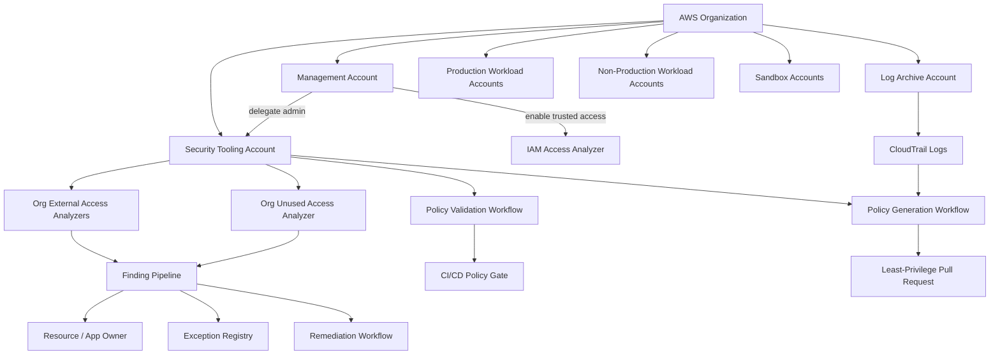
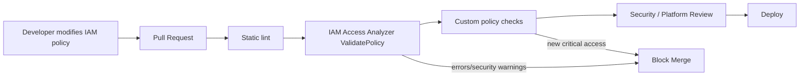
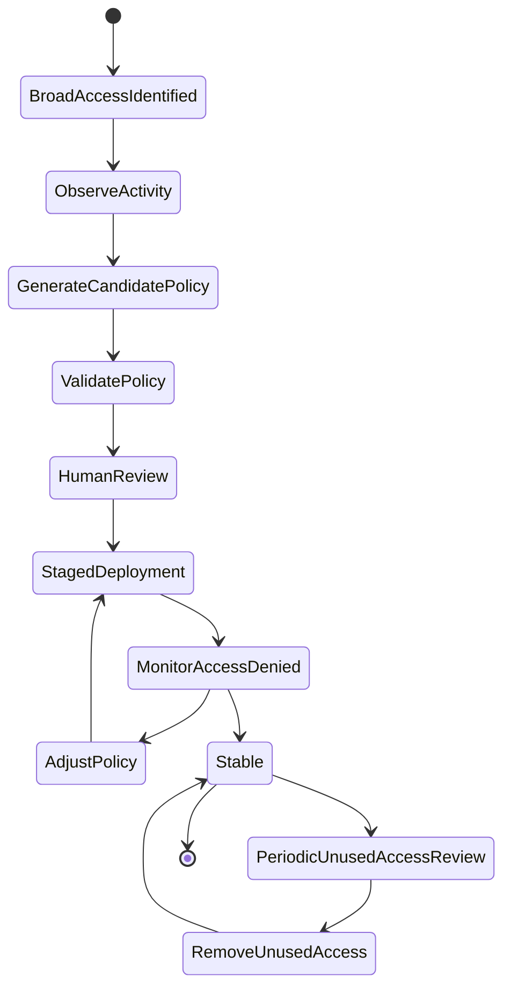
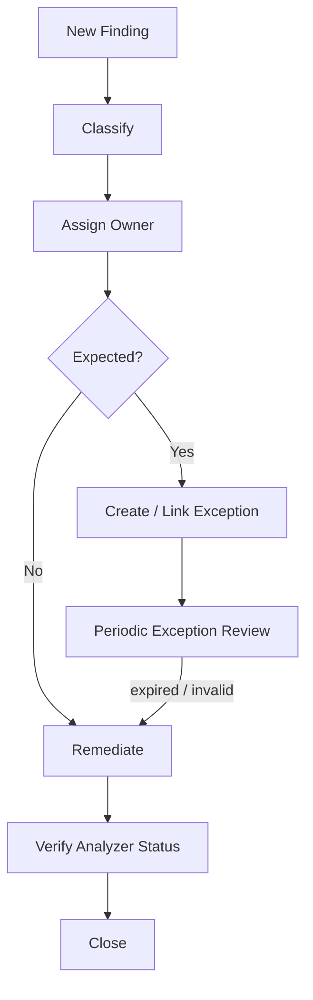
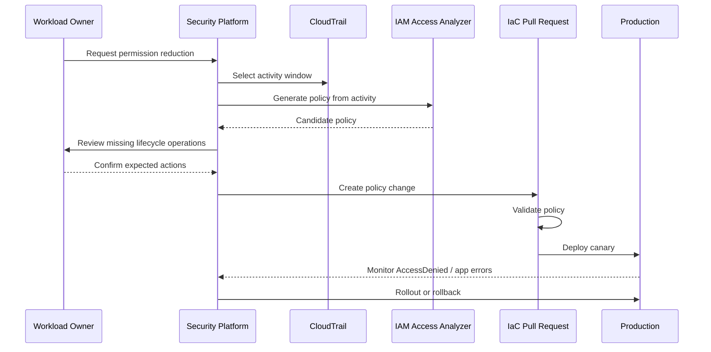
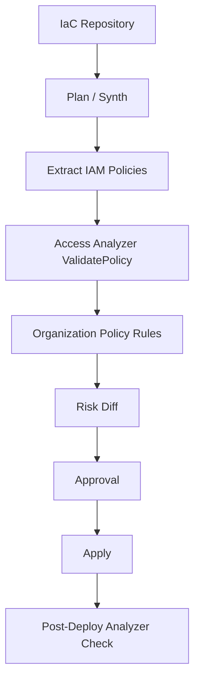

# Part 023 — IAM Access Analyzer and Policy Generation

IAM Access Analyzer sering dipahami terlalu sempit sebagai alat untuk mencari resource yang dibuka ke luar account. Itu benar, tetapi tidak cukup.

Di environment AWS yang besar, masalah akses bukan hanya `public bucket`. Masalah sebenarnya adalah:

1. policy terlalu luas,
2. role tidak pernah dipakai,
3. access key lama masih aktif,
4. permission pernah dibutuhkan satu tahun lalu tetapi sekarang tidak lagi,
5. resource policy memberi akses lintas account tanpa owner yang jelas,
6. engineer tidak tahu apakah perubahan policy memperluas akses,
7. security team tidak punya loop yang sistematis untuk mengubah finding menjadi policy improvement.

IAM Access Analyzer harus dilihat sebagai **permission intelligence layer**.

Ia membantu menjawab pertanyaan seperti:

- resource mana yang bisa diakses dari luar zone of trust?
- principal mana yang punya permission tetapi tidak pernah memakainya?
- policy ini valid secara grammar dan best practice?
- policy baru ini menambahkan akses yang sebelumnya tidak ada?
- role ini sebenarnya menggunakan action apa saja menurut CloudTrail?
- apakah broad policy bisa diturunkan menjadi policy yang lebih sempit?

Tujuan part ini bukan menghafal menu IAM Access Analyzer. Tujuannya adalah membangun **least-privilege refinement loop** yang bisa berjalan terus-menerus di organisasi AWS.

---

## 1. Mental Model: IAM Access Analyzer Bukan Sekadar Scanner

Scanner biasa biasanya bekerja seperti ini:

```text
resource ditemukan -> rule dicek -> issue dibuat
```

IAM Access Analyzer lebih dekat ke model ini:

```text
policy + activity + zone of trust + access semantics -> access finding / validation / recommendation
```

Ia tidak hanya melihat konfigurasi mentah. Ia menganalisis **efek akses** dari policy.

Itu penting karena policy AWS bersifat komposisional. Akses efektif bisa dipengaruhi oleh:

- identity-based policy,
- resource-based policy,
- trust policy,
- service control policy,
- resource control policy,
- permissions boundary,
- session policy,
- KMS key policy,
- VPC endpoint policy,
- condition key,
- principal origin,
- organization boundary,
- service-specific authorization behavior.

Manusia bisa membaca satu policy JSON. Namun di production, satu request AWS bisa melewati banyak lapisan policy. Access Analyzer membantu membaca sebagian dari kompleksitas itu secara lebih sistematis.

Namun ada batas penting: Access Analyzer bukan pengganti desain IAM. Ia tidak tahu intensi bisnis secara penuh. Ia bisa mengatakan “akses ini ada”, “akses ini tidak dipakai”, “policy ini berisiko”, atau “policy ini bisa dihasilkan dari aktivitas sebelumnya”. Ia tidak selalu bisa mengatakan “akses ini benar secara domain”. Itu tetap butuh owner, risk register, dan review proses.

---

## 2. Kapabilitas Utama IAM Access Analyzer

Secara praktis, IAM Access Analyzer dapat dipakai dalam lima mode kerja.

| Mode | Pertanyaan | Output |
|---|---|---|
| External access analysis | Resource mana yang dibagi ke luar zone of trust? | External access findings |
| Internal access analysis | Resource mana yang dapat diakses oleh principal internal tertentu? | Internal access findings |
| Unused access analysis | Permission atau credential mana yang tidak digunakan? | Unused access findings |
| Policy validation | Apakah policy valid dan mengikuti best practice IAM? | Error, security warning, general warning, suggestion |
| Policy generation | Policy least-privilege apa yang bisa dibuat dari aktivitas CloudTrail? | Generated IAM policy |

Kelima mode ini harus dipasang ke lifecycle berbeda.

External access cocok untuk **exposure review**.

Unused access cocok untuk **permission decay cleanup**.

Policy validation cocok untuk **shift-left policy review** di pipeline.

Policy generation cocok untuk **permission refactoring**.

Internal access cocok untuk **answering access questions** dan audit readiness.

---

## 3. Zone of Trust

Konsep paling penting untuk external access analyzer adalah **zone of trust**.

Zone of trust adalah batas yang Anda anggap “masih dipercaya”. Biasanya berupa:

- satu AWS account, atau
- seluruh AWS Organization.

Jika analyzer dibuat dengan account sebagai zone of trust, akses dari account lain akan dianggap external.

Jika analyzer dibuat dengan organization sebagai zone of trust, akses dari member account dalam organization tidak dianggap external, sedangkan akses dari luar organization dianggap external.

Contoh:

```text
Organization: o-abc123

Account A: workload-prod
Account B: security-tooling
Account C: shared-services
External Account X: third-party-vendor
```

Jika S3 bucket di Account A memberi akses ke Account B, maka:

- account-level analyzer di Account A melihatnya sebagai external,
- organization-level analyzer melihatnya sebagai trusted internal sharing.

Jika bucket memberi akses ke External Account X, maka:

- account-level analyzer melihatnya sebagai external,
- organization-level analyzer juga melihatnya sebagai external.

Ini bukan detail kecil. Salah memilih zone of trust membuat finding menjadi terlalu noisy atau terlalu permisif.

Untuk organisasi matang, pola umumnya:

- gunakan organization-level analyzer untuk exposure lintas organisasi,
- gunakan account-level atau scoped analysis untuk debugging detail,
- gunakan exception registry untuk sharing eksternal yang memang disetujui.

---

## 4. Deployment Architecture

Di multi-account AWS, IAM Access Analyzer sebaiknya tidak dikelola manual per workload account.

Desain yang lebih sehat:



Prinsipnya:

1. **Management account tidak menjadi tempat operasi harian.**  
   Ia hanya dipakai untuk enable trusted access dan delegated administration.

2. **Security tooling account menjadi delegated administrator.**  
   Di sinilah analyzer, finding workflow, automation, dan reporting dikelola.

3. **CloudTrail organization trail menjadi sumber policy generation.**  
   Tanpa telemetry aktivitas, policy generation tidak punya bahan yang cukup.

4. **Finding bukan akhir proses.**  
   Finding harus masuk lifecycle: triage, owner assignment, exception, remediation, verification, closure.

5. **Policy validation masuk CI/CD.**  
   Jangan tunggu policy terlanjur deploy lalu baru dianalisis.

---

## 5. Analyzer Types and Operational Use

### 5.1 External Access Analyzer

External access analyzer menganalisis resource-based policies untuk mendeteksi akses yang diberikan ke luar zone of trust.

Contoh resource policy yang relevan:

- S3 bucket policy,
- KMS key policy,
- SQS queue policy,
- SNS topic policy,
- Lambda function policy,
- IAM role trust policy,
- Secrets Manager resource policy,
- ECR repository policy,
- EventBridge event bus policy,
- dan resource lain yang didukung.

External access analyzer paling berguna untuk mendeteksi:

- public access,
- cross-account sharing yang tidak diketahui,
- vendor access tanpa approval,
- trust policy terlalu luas,
- wildcard principal,
- missing condition seperti `aws:PrincipalOrgID`,
- resource policy yang tidak lagi sesuai desain.

Mental model external access:

```text
resource policy says "who can access me?"
Access Analyzer asks "is that who outside the trusted boundary?"
```

### 5.2 Internal Access Analyzer

Internal access analysis membantu menjawab pertanyaan “principal internal mana yang bisa mengakses resource ini?” atau “akses internal seperti apa yang dimungkinkan oleh policy ini?”.

Ini berguna untuk audit dan review akses sensitif, terutama pada resource seperti:

- KMS key,
- secret,
- S3 bucket berisi data regulated,
- role admin,
- role deployment,
- event bus lintas account,
- repository container image,
- backup vault.

External access finding menjawab risiko keluar boundary. Internal access analysis membantu memahami risiko **di dalam boundary**.

Keduanya berbeda. Banyak insiden tidak membutuhkan public exposure. Akses internal yang terlalu luas cukup untuk menyebabkan data leakage, privilege escalation, atau lateral movement.

### 5.3 Unused Access Analyzer

Unused access analyzer mencari access yang diberikan tetapi tidak digunakan.

Contoh finding:

- IAM role tidak pernah dipakai dalam usage window,
- access key tidak digunakan,
- console password tidak digunakan,
- service-level permission tidak digunakan,
- action-level permission tidak digunakan.

Ini membantu melawan **permission entropy**.

Permission entropy terjadi karena akses cenderung bertambah, jarang berkurang.

Siklus klasiknya:

```text
incident deadline -> add broad permission
project selesai -> permission tetap ada
engineer pindah team -> role tetap ada
service diganti -> old role tetap ada
vendor offboarded -> external access lupa dicabut
```

Unused access analyzer tidak otomatis berarti akses harus langsung dihapus. Ia berarti akses harus masuk review.

Prinsip aman:

```text
unused != always unsafe
unused == needs justification
```

Contoh akses yang mungkin tidak sering dipakai tetapi valid:

- break-glass role,
- disaster recovery role,
- annual audit export role,
- rarely used restore role,
- incident-only forensic role.

Karena itu unused access harus dipadukan dengan classification:

| Type | Default Action |
|---|---|
| unused normal workload role | remove or reduce |
| unused human admin access | remove unless justified |
| unused access key | rotate/remove aggressively |
| unused break-glass role | keep but test and monitor |
| unused DR role | keep if covered by DR runbook |
| unused vendor role | confirm contract, otherwise remove |

### 5.4 Policy Validation

Policy validation memeriksa policy sebelum digunakan.

Ia mendeteksi masalah seperti:

- invalid syntax,
- unsupported action,
- missing resource,
- overly permissive access,
- wildcard risk,
- condition problem,
- policy grammar issue,
- best-practice warning.

Ini harus menjadi bagian dari pipeline.

Contoh workflow:



Policy validation bukan hanya security gate. Ia juga mengurangi cognitive load reviewer. Reviewer tidak harus menemukan error dasar secara manual.

### 5.5 Policy Generation

Policy generation membuat policy berdasarkan aktivitas yang terekam di CloudTrail.

Mental model:

```text
observed API calls -> inferred needed actions -> generated IAM policy
```

Ini berguna saat Anda punya role dengan policy terlalu luas seperti:

```json
{
  "Effect": "Allow",
  "Action": "*",
  "Resource": "*"
}
```

atau:

```json
{
  "Effect": "Allow",
  "Action": [
    "s3:*",
    "dynamodb:*",
    "kms:*"
  ],
  "Resource": "*"
}
```

Policy generation bisa digunakan untuk menghasilkan baseline policy berdasarkan penggunaan aktual.

Namun ada jebakan besar:

```text
policy generation observes past behavior, not future intent
```

Jika workload belum menjalankan semua code path, generated policy bisa terlalu sempit.

Karena itu policy generation harus dipakai sebagai **refactoring assistant**, bukan autopilot.

---

## 6. The Least-Privilege Refinement Loop

Least privilege bukan kondisi satu kali. Ia adalah loop.



Tahapnya:

1. temukan broad access,
2. kumpulkan aktivitas aktual,
3. generate candidate policy,
4. validasi grammar dan security,
5. review dengan owner,
6. deploy bertahap,
7. monitor `AccessDenied`,
8. adjust jika ada false reduction,
9. review unused access secara periodik.

Yang membuat loop ini aman adalah **staged deployment**.

Jangan langsung mengganti policy production yang sangat luas dengan generated policy tanpa canary atau fallback.

Pola yang lebih aman:

1. generate candidate policy,
2. attach sebagai additional policy di environment non-prod,
3. buat deny simulation atau policy simulator check jika memungkinkan,
4. test workload critical path,
5. deploy ke satu canary account/service,
6. monitor CloudTrail `AccessDenied`, application error, dan deployment failure,
7. rollout lebih luas.

---

## 7. Finding Lifecycle

Access Analyzer finding harus diperlakukan sebagai object lifecycle, bukan alert sekali lewat.

Lifecycle minimum:



Sebuah finding harus memiliki metadata minimal:

| Field | Tujuan |
|---|---|
| finding id | korelasi dengan analyzer |
| account id | lokasi resource |
| region | lokasi analyzer/resource |
| resource arn | object terdampak |
| resource owner | team yang bertanggung jawab |
| access type | external/internal/unused |
| principal | siapa yang mendapat akses |
| action scope | tindakan yang dapat dilakukan |
| exposure classification | public, external account, vendor, internal broad |
| data classification | public/internal/confidential/regulated/secret |
| expected? | yes/no/unknown |
| exception id | jika disetujui |
| expiry date | kapan exception habis |
| remediation owner | siapa memperbaiki |
| SLA | batas waktu penanganan |
| evidence link | PR, ticket, CloudTrail, config snapshot |

Tanpa metadata ini, finding berubah menjadi noise.

---

## 8. External Access Review Pattern

Misalnya Access Analyzer menemukan S3 bucket policy seperti ini:

```json
{
  "Version": "2012-10-17",
  "Statement": [
    {
      "Effect": "Allow",
      "Principal": "*",
      "Action": "s3:GetObject",
      "Resource": "arn:aws:s3:::example-prod-export/*"
    }
  ]
}
```

Pertanyaan review bukan langsung “hapus”. Pertanyaan yang benar:

1. Apakah bucket ini memang public distribution bucket?
2. Apakah data di dalamnya public-classified?
3. Apakah ada CloudFront/OAC pattern yang lebih tepat?
4. Apakah akses public ini punya approval?
5. Apakah ada compensating control?
6. Apakah finding ini muncul karena perubahan baru?
7. Apakah owner mengetahui exposure ini?
8. Apakah ada expiry?

Jika jawabannya tidak jelas, default harus dianggap unsafe.

Contoh remediation candidate:

```json
{
  "Version": "2012-10-17",
  "Statement": [
    {
      "Effect": "Deny",
      "Principal": "*",
      "Action": "s3:GetObject",
      "Resource": "arn:aws:s3:::example-prod-export/*",
      "Condition": {
        "StringNotEquals": {
          "aws:PrincipalOrgID": "o-exampleorgid"
        }
      }
    }
  ]
}
```

Namun policy seperti ini juga harus diuji. Tidak semua use case cocok dengan `PrincipalOrgID`. Vendor access, public website, cross-org integration, atau third-party data exchange mungkin butuh desain lain.

---

## 9. Trust Policy Review Pattern

Role trust policy sering menjadi titik masuk privilege escalation.

Contoh rawan:

```json
{
  "Version": "2012-10-17",
  "Statement": [
    {
      "Effect": "Allow",
      "Principal": {
        "AWS": "*"
      },
      "Action": "sts:AssumeRole"
    }
  ]
}
```

Ini hampir selalu salah untuk production.

Contoh lebih defensible untuk vendor access:

```json
{
  "Version": "2012-10-17",
  "Statement": [
    {
      "Effect": "Allow",
      "Principal": {
        "AWS": "arn:aws:iam::111122223333:role/vendor-prod-access"
      },
      "Action": "sts:AssumeRole",
      "Condition": {
        "StringEquals": {
          "sts:ExternalId": "vendor-specific-external-id"
        }
      }
    }
  ]
}
```

Untuk service-to-service access, gunakan condition yang mengikat sumber.

Contoh pola confused deputy defense untuk service principal:

```json
{
  "Effect": "Allow",
  "Principal": {
    "Service": "events.amazonaws.com"
  },
  "Action": "sts:AssumeRole",
  "Condition": {
    "StringEquals": {
      "aws:SourceAccount": "123456789012"
    },
    "ArnLike": {
      "aws:SourceArn": "arn:aws:events:ap-southeast-1:123456789012:rule/prod-*"
    }
  }
}
```

Access Analyzer membantu menemukan trust relationship yang keluar boundary. Tetapi owner tetap harus memutuskan apakah relationship itu valid.

---

## 10. Unused Access Review Pattern

Unused access review tidak boleh menjadi kampanye manual tahunan. Itu harus menjadi proses reguler.

### 10.1 Role Tidak Digunakan

Jika role tidak digunakan dalam periode yang ditentukan:

1. cek apakah role bagian dari break-glass/DR,
2. cek apakah role digunakan oleh automation musiman,
3. cek apakah role masih direferensikan IaC,
4. cek apakah trust policy masih memungkinkan assume,
5. cek apakah role punya attached policy sensitif,
6. disable path atau remove trust dulu jika perlu staged removal,
7. hapus setelah grace period.

Staged removal lebih aman daripada delete langsung.

Contoh staged approach:

```text
Day 0   mark candidate for removal
Day 7   notify owner
Day 14  remove trust policy or detach broad policy
Day 21  monitor for failure
Day 30  delete role
```

Untuk role sangat sensitif, tahapnya bisa lebih cepat. Untuk DR, tahapnya berbeda: bukan delete, tetapi test.

### 10.2 Access Key Tidak Digunakan

Access key yang tidak digunakan harus dianggap berisiko tinggi karena long-lived credential mudah bocor.

Remediation pattern:

1. identify key owner,
2. check last used service/region,
3. disable key,
4. monitor failure,
5. delete key,
6. migrate workload ke role-based temporary credential.

Prinsip keras:

```text
Long-lived access keys are exceptions, not defaults.
```

### 10.3 Unused Service and Action Permissions

Unused action findings cocok untuk policy pruning.

Namun jangan prune action secara buta. Ada action yang jarang dipakai tetapi penting untuk lifecycle:

- `kms:Decrypt` saat restore,
- `backup:StartRestoreJob`,
- `rds:RestoreDBInstanceFromDBSnapshot`,
- `ec2:CreateTags` saat provisioning,
- `iam:PassRole` saat deploy,
- `cloudformation:CreateChangeSet` hanya saat release.

Karena itu review unused action perlu melihat workload lifecycle, bukan hanya request harian.

---

## 11. Policy Generation Workflow

Policy generation paling efektif untuk tiga skenario:

1. role baru yang awalnya diberi broad permission untuk discovery,
2. legacy role yang terlalu luas,
3. vendor/integration role yang perlu disempitkan.

Workflow aman:



### 11.1 Choosing the Activity Window

Policy generation bergantung pada aktivitas yang terekam.

Window terlalu pendek menyebabkan policy kurang lengkap.

Window terlalu panjang bisa mempertahankan permission lama yang sudah tidak relevan.

Gunakan pilihan berbasis workload:

| Workload Type | Activity Window Approach |
|---|---|
| high-traffic API | beberapa siklus release + peak path |
| batch bulanan | minimal mencakup satu batch cycle penuh |
| financial close process | mencakup close period |
| DR role | jangan hanya pakai activity; gunakan runbook |
| deployment role | mencakup create/update/delete lifecycle |
| migration role | treat as temporary, expire after migration |

### 11.2 Policy Generation Is Not Resource Scoping Magic

Generated policy bisa membantu menemukan action yang dipakai. Namun resource scoping tetap perlu desain.

Contoh hasil awal mungkin seperti:

```json
{
  "Effect": "Allow",
  "Action": [
    "s3:GetObject",
    "s3:PutObject"
  ],
  "Resource": "*"
}
```

Policy ini masih terlalu luas. Refinement berikutnya:

```json
{
  "Effect": "Allow",
  "Action": [
    "s3:GetObject",
    "s3:PutObject"
  ],
  "Resource": [
    "arn:aws:s3:::prod-invoice-archive/*"
  ],
  "Condition": {
    "StringEquals": {
      "aws:ResourceTag/Application": "billing"
    }
  }
}
```

Namun condition di atas hanya valid jika service/action mendukung condition tersebut untuk resource yang dimaksud. Jangan menulis condition hanya karena terlihat rapi.

---

## 12. Policy Validation in CI/CD

IAM policy harus diperlakukan seperti code.

Minimum gate:

1. JSON parse,
2. IAM Access Analyzer policy validation,
3. custom organization rules,
4. diff risk classification,
5. reviewer assignment berdasarkan risk.

Contoh custom rules:

| Rule | Severity |
|---|---|
| `Action: *` and `Resource: *` | critical |
| `iam:PassRole` with wildcard resource | critical |
| trust policy `Principal: *` | critical |
| missing `aws:SourceArn` for service principal where applicable | high |
| KMS key policy allows external account without exception | high |
| S3 bucket policy public access | high/critical depending data class |
| policy allows disabling CloudTrail/Config/SecurityHub/GuardDuty | critical |
| wildcard admin allowed only in break-glass role | exception-required |

Policy validation dari AWS menangkap banyak kesalahan IAM umum. Custom rule menangkap standar internal organisasi.

Keduanya perlu.

---

## 13. Custom Policy Checks

Custom policy checks membantu membandingkan policy terhadap security standard internal.

Gunakan untuk pertanyaan seperti:

- apakah policy baru memberi akses lebih luas dari reference policy?
- apakah policy mengizinkan action yang termasuk critical?
- apakah policy melewati boundary yang disetujui?
- apakah perubahan ini menambah akses terhadap resource regulated?

Model yang baik:

```text
AWS policy validation -> correctness and IAM best practices
custom checks -> organization-specific risk standard
human review -> business intent and exception
```

Jangan menaruh semua logika di human review. Reviewer akan lelah dan tidak konsisten.

Jangan juga menaruh semua logika di automation. Automation tidak tahu semua konteks bisnis.

---

## 14. Integration With Infrastructure as Code

Dalam organisasi matang, IAM policy biasanya tidak dibuat manual di console.

Ia dibuat lewat:

- Terraform,
- CloudFormation,
- CDK,
- Pulumi,
- internal platform DSL,
- account vending baseline,
- permission set provisioning,
- security baseline stack.

Access Analyzer harus masuk di jalur ini.

Contoh pipeline:



Key idea:

```text
Do not only scan deployed access. Validate intended access before deployment.
```

Post-deploy check tetap perlu karena AWS policy bisa berubah dari luar pipeline, atau service-generated policy bisa muncul setelah deployment.

---

## 15. Access Analyzer and Security Hub / Finding Pipeline

Jangan biarkan Access Analyzer berdiri sendiri sebagai halaman console yang sesekali dibuka.

Finding harus masuk pipeline yang sama dengan sumber lain:

- GuardDuty,
- Security Hub,
- Inspector,
- Macie,
- Config,
- CloudTrail detections,
- custom controls,
- vulnerability backlog,
- exception registry.

Namun normalisasi harus hati-hati. Access Analyzer finding bukan malware alert. Ia adalah **access exposure finding**.

Fields yang harus dinormalisasi:

| Field | Contoh |
|---|---|
| source | IAM Access Analyzer |
| category | access exposure / unused access / policy risk |
| affected resource | S3 bucket / role / key / secret |
| principal granted | AWS account / IAM role / public |
| access path | resource policy / trust policy / unused identity policy |
| severity | derived from data class + principal + action |
| owner | team tag / account owner |
| status | active / archived / remediated |

Severity jangan hanya mengikuti default. Public read pada bucket static website berbeda dari public read pada bucket regulated export.

Gunakan severity formula:

```text
severity = exposure_scope × action_sensitivity × data_classification × environment × exploitability
```

Contoh:

| Finding | Severity |
|---|---|
| public read on public website bucket | low/accepted |
| public read on internal logs bucket | critical |
| external vendor assume role with external ID and read-only scope | medium/accepted with exception |
| external account KMS decrypt on regulated key | critical |
| unused developer access key | high |
| unused break-glass role | review, not delete |

---

## 16. Exception Registry

Tanpa exception registry, Access Analyzer akan menghasilkan dua hasil buruk:

1. finding valid terus muncul dan membuat noise,
2. finding berbahaya diarsipkan tanpa accountability.

Exception harus berupa object formal.

Minimal schema:

```yaml
exceptionId: EXC-2026-0012
source: iam-access-analyzer
findingId: abcdef12-3456-7890
resourceArn: arn:aws:s3:::partner-export-prod
accountId: "123456789012"
region: ap-southeast-1
ownerTeam: billing-platform
businessReason: nightly export to regulated partner
principalAllowed: arn:aws:iam::444455556666:role/partner-ingestion
allowedActions:
  - s3:GetObject
controls:
  - external account explicitly enumerated
  - bucket encrypted with KMS
  - object prefix restricted
  - access logged
  - contract DPA in place
  - quarterly review
expiresAt: 2026-10-01
approvedBy:
  - security-architecture
  - data-owner
```

Rule:

```text
Archive finding only if exception exists, is approved, and has expiry.
```

Finding yang diarchive tanpa expiry cenderung menjadi permanent blind spot.

---

## 17. Common Failure Modes

### 17.1 Analyzer Not Enabled Everywhere

Jika analyzer hanya aktif di beberapa account/region, Anda akan punya false sense of safety.

Mitigation:

- enable via delegated admin,
- track analyzer coverage,
- alert jika account baru belum onboarded,
- include analyzer in account vending baseline.

### 17.2 No Clear Zone of Trust

Jika organisasi tidak menyepakati zone of trust, semua cross-account sharing bisa terlihat seperti finding atau tidak terlihat sebagai risiko.

Mitigation:

- document trust boundary,
- separate organization-level external exposure from internal lateral exposure,
- use account tags and OU classification.

### 17.3 Findings Archived Without Review

Archive bisa menjadi tombol “hilangkan noise”.

Mitigation:

- require exception ID,
- require owner,
- require expiry,
- review archived findings periodically,
- alert on high-risk archive.

### 17.4 Policy Generation Treated as Complete Truth

Generated policy hanya melihat aktivitas yang terjadi.

Mitigation:

- choose representative activity window,
- include lifecycle paths,
- review with owner,
- deploy gradually,
- monitor failures.

### 17.5 Unused Access Removed Without Understanding Rare Operations

DR, restore, audit, and incident roles may be unused by design.

Mitigation:

- classify identity purpose,
- link to runbook,
- test rare roles instead of deleting blindly.

### 17.6 No Owner Mapping

Finding tanpa owner tidak akan selesai.

Mitigation:

- enforce account owner tag,
- enforce resource owner tag,
- map account to team,
- route finding automatically.

### 17.7 Lack of CloudTrail Coverage

Policy generation and audit review rely on activity logs.

Mitigation:

- organization trail,
- multi-region logging,
- data events where needed,
- log archive protection,
- CloudTrail integrity validation.

---

## 18. Practical Runbook: External Access Finding

When a new external access finding appears:

1. Identify resource ARN.
2. Identify account, OU, environment, owner.
3. Identify principal granted access.
4. Classify access scope: public, external account, external organization, vendor, unknown.
5. Identify actions allowed.
6. Identify data classification of resource.
7. Check if exception exists.
8. If no exception, contact owner and set SLA.
9. If public or regulated data exposure, escalate immediately.
10. Create remediation PR.
11. Validate policy.
12. Deploy remediation.
13. Confirm finding resolved or correctly archived.
14. Attach evidence to ticket.
15. Add regression guardrail if pattern should never happen again.

---

## 19. Practical Runbook: Policy Generation for Legacy Role

When reducing a legacy role:

1. Identify attached policies.
2. Identify assume role principals.
3. Identify workload owner.
4. Pull CloudTrail activity for representative period.
5. Generate candidate policy.
6. Compare candidate policy with current policy.
7. Identify actions removed.
8. Ask owner to map removed actions to lifecycle paths.
9. Add required but rare actions intentionally.
10. Scope resources manually.
11. Add conditions where supported.
12. Validate policy.
13. Deploy to non-prod.
14. Run integration tests.
15. Deploy canary to prod.
16. Monitor `AccessDenied` and service health.
17. Rollout.
18. Remove old broad policy.
19. Add unused access review reminder.

---

## 20. Access Analyzer Operating Metrics

Track the system, not just findings.

| Metric | Why It Matters |
|---|---|
| analyzer coverage by account/region | detects blind spots |
| active external findings by severity | exposure backlog |
| active unused access findings | permission decay |
| average age of high-risk findings | security debt |
| findings without owner | routing failure |
| archived findings without expiry | governance failure |
| policy validation failures in CI | shift-left quality |
| broad policies reduced per month | least-privilege progress |
| access keys removed | long-lived credential reduction |
| public access findings created after guardrail | preventive control gap |

A healthy program shows:

- decreasing broad policy count,
- decreasing unused role count,
- low finding age for high-risk external access,
- high coverage,
- low archive-without-exception rate,
- clear owner assignment.

---

## 21. What Good Looks Like

A mature AWS environment has these properties:

```text
Every account has analyzer coverage.
Every external access finding has owner, reason, expiry, or remediation.
Every broad IAM policy has a reduction plan.
Every generated policy goes through review and staged rollout.
Every unused access finding is classified, not blindly deleted.
Every policy change is validated before deployment.
Every exception is auditable.
```

The end state is not “zero findings”.

The end state is:

```text
all access is intentional, explainable, bounded, monitored, and periodically revalidated
```

---

## 22. Engineering Exercise

Use this exercise in a sandbox or non-production AWS account.

### Scenario

You have a legacy deployment role:

```text
arn:aws:iam::123456789012:role/legacy-deployment-role
```

It has:

```json
{
  "Effect": "Allow",
  "Action": "*",
  "Resource": "*"
}
```

### Task

Design a reduction plan.

Answer these:

1. What activity window would you use?
2. What CloudTrail coverage is required?
3. Which lifecycle operations must be tested?
4. What generated policy limitations do you expect?
5. How would you validate the candidate policy?
6. How would you deploy it safely?
7. What metrics would indicate success?
8. What rollback path would you prepare?

### Expected Thinking

A good answer does not say “generate and replace”.

A good answer says:

- deployment role needs create/update/delete lifecycle,
- rare rollback actions must be included,
- `iam:PassRole` must be scoped carefully,
- KMS permissions must be resource-scoped,
- CloudFormation/CDK generated actions may vary,
- rollout must be staged,
- `AccessDenied` must be monitored,
- old admin policy should be removed only after stable operation.

---

## 23. Checklist

Before considering IAM Access Analyzer “implemented”, verify:

- [ ] organization-level external access analyzer exists,
- [ ] unused access analyzer exists for organization,
- [ ] delegated administrator is configured,
- [ ] analyzer coverage is monitored,
- [ ] account vending baseline includes analyzer onboarding,
- [ ] findings are routed to owners,
- [ ] exception registry exists,
- [ ] archived findings require justification and expiry,
- [ ] policy validation runs in CI/CD,
- [ ] custom policy checks exist for organization-critical rules,
- [ ] CloudTrail organization trail is enabled,
- [ ] policy generation workflow is documented,
- [ ] broad policies have reduction backlog,
- [ ] access keys are reviewed and removed,
- [ ] metrics are reported to platform/security leadership.

---

## 24. Key Takeaways

IAM Access Analyzer is not a checkbox service.

It is a way to make AWS permissions observable, reviewable, and reducible.

Use it for:

- detecting external exposure,
- identifying unused access,
- validating policy before deployment,
- generating candidate least-privilege policies,
- supporting audit and access review,
- turning IAM from static JSON into an operational feedback loop.

The strongest pattern is:

```text
analyze access -> assign owner -> decide intent -> remediate or exception -> validate -> monitor -> repeat
```

That is how least privilege becomes an engineering system instead of a slogan.

---

## References

- AWS IAM Access Analyzer — What is IAM Access Analyzer: https://docs.aws.amazon.com/IAM/latest/UserGuide/what-is-access-analyzer.html
- IAM Access Analyzer findings: https://docs.aws.amazon.com/IAM/latest/UserGuide/access-analyzer-findings.html
- IAM Access Analyzer concepts: https://docs.aws.amazon.com/IAM/latest/UserGuide/access-analyzer-concepts.html
- Create an external access analyzer: https://docs.aws.amazon.com/IAM/latest/UserGuide/access-analyzer-create-external.html
- Create an unused access analyzer: https://docs.aws.amazon.com/IAM/latest/UserGuide/access-analyzer-create-unused.html
- IAM Access Analyzer policy validation: https://docs.aws.amazon.com/IAM/latest/UserGuide/access-analyzer-policy-validation.html
- IAM Access Analyzer policy generation: https://docs.aws.amazon.com/IAM/latest/UserGuide/access-analyzer-policy-generation.html
- AWS CLI Access Analyzer command reference: https://docs.aws.amazon.com/cli/latest/reference/accessanalyzer/
