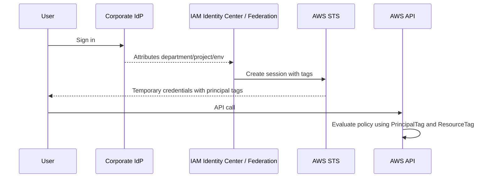
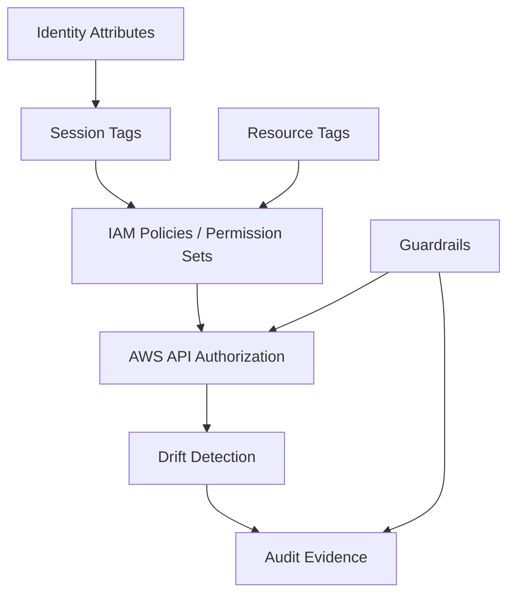
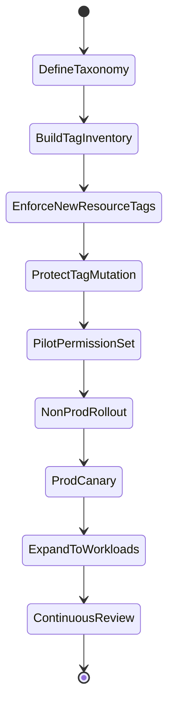

# Part 024 — Attribute-Based Access Control in AWS

Role-based access control mudah dimulai, tetapi sulit diskalakan.

Awalnya terlihat sederhana:

```text
AdminRole
DeveloperRole
ReadOnlyRole
BillingRole
```

Lalu organisasi tumbuh:

```text
ProdDeveloperRole
DevDeveloperRole
BillingProdDeveloperRole
BillingDevDeveloperRole
PaymentsProdReadOnlyRole
PaymentsStagingReadOnlyRole
DataSciencePIIReadOnlyRole
VendorLimitedProdSupportRole
```

Kemudian account bertambah, region bertambah, workload bertambah, compliance boundary bertambah, dan role explosion dimulai.

ABAC mencoba memecahkan masalah itu dengan pendekatan berbeda:

```text
permission = relationship between attributes
```

Bukan hanya:

```text
Alice has Role X
```

Melainkan:

```text
Alice can access resources where Alice.department == resource.department
Alice can deploy to resources where Alice.project == resource.project
Alice can operate resources where Alice.environment == resource.environment
```

Di AWS, attribute biasanya direpresentasikan sebagai **tags**:

- principal tags,
- resource tags,
- request tags,
- session tags,
- identity center attributes.

ABAC sangat kuat, tetapi juga sangat mudah disalahgunakan. Tag yang salah bisa menjadi authorization bypass. Tagging tanpa governance bukan ABAC; itu hanya label kosmetik.

Part ini membahas ABAC sebagai **security architecture**, bukan sekadar policy trick.

---

## 1. Mental Model

ABAC di AWS menjawab pertanyaan:

```text
Can this principal perform this action on this resource under these attribute conditions?
```

Contoh policy sederhana:

```json
{
  "Effect": "Allow",
  "Action": "ec2:StartInstances",
  "Resource": "*",
  "Condition": {
    "StringEquals": {
      "aws:ResourceTag/Project": "${aws:PrincipalTag/Project}"
    }
  }
}
```

Maknanya:

```text
Principal hanya boleh start EC2 instance jika tag Project pada resource sama dengan tag Project pada principal.
```

Ini mengurangi kebutuhan membuat role per project.

Namun ada syarat besar:

1. principal tag harus benar,
2. resource tag harus benar,
3. user tidak boleh bisa mengubah tag untuk menaikkan akses,
4. semua action penting harus mendukung tag condition yang dipakai,
5. resource tanpa tag harus diperlakukan aman,
6. tag taxonomy harus stabil.

Jika salah satu gagal, ABAC bisa menjadi lubang security.

---

## 2. ABAC Is Not “Better RBAC”

ABAC bukan pengganti total RBAC.

RBAC cocok untuk:

- coarse-grained job function,
- admin role,
- break-glass,
- auditor,
- security engineer,
- platform operator,
- deployment role,
- emergency support.

ABAC cocok untuk:

- project ownership,
- environment-specific access,
- team-scoped self-service,
- resource lifecycle delegation,
- multi-account permission set reuse,
- reducing role duplication,
- dynamic access from corporate directory attributes.

Production design biasanya hybrid:

```text
RBAC decides capability class.
ABAC decides scope.
```

Contoh:

```text
Role: Developer
Capability: read logs, restart dev resources, deploy non-prod
ABAC scope: only resources where Project == principal.Project and Environment in [dev, staging]
```

Jangan memaksa ABAC untuk semua hal. Root, break-glass, security admin, KMS admin, organization management, dan audit archive biasanya lebih cocok dengan explicit roles plus strong guardrails.

---

## 3. AWS ABAC Building Blocks

### 3.1 Principal Tags

Principal tag adalah tag yang melekat pada IAM principal, seperti IAM role atau IAM user.

Contoh:

```text
Principal: arn:aws:iam::123456789012:role/developer
PrincipalTag/Project = billing
PrincipalTag/Environment = dev
PrincipalTag/CostCenter = cc-1024
```

Principal tag bisa berasal dari:

- IAM role tags,
- IAM user tags,
- session tags passed via STS,
- IAM Identity Center attributes mapped into session.

Untuk human access modern, session tags dari identity provider lebih fleksibel daripada static IAM user tags.

### 3.2 Resource Tags

Resource tag adalah tag pada AWS resource.

Contoh:

```text
Resource: arn:aws:ec2:ap-southeast-1:123456789012:instance/i-abc123
ResourceTag/Project = billing
ResourceTag/Environment = dev
ResourceTag/Owner = billing-platform
```

ABAC hanya bekerja baik jika resource tagging konsisten.

Resource tanpa tag harus default-deny untuk action sensitif.

### 3.3 Request Tags

Request tag adalah tag yang dikirim saat membuat atau mengubah resource.

Condition key umum:

```text
aws:RequestTag/<TagKey>
aws:TagKeys
```

Ini penting untuk tag-on-create enforcement.

Contoh:

```json
{
  "Effect": "Allow",
  "Action": "ec2:RunInstances",
  "Resource": "*",
  "Condition": {
    "StringEquals": {
      "aws:RequestTag/Project": "${aws:PrincipalTag/Project}",
      "aws:RequestTag/Environment": "dev"
    },
    "ForAllValues:StringEquals": {
      "aws:TagKeys": [
        "Project",
        "Environment",
        "Owner"
      ]
    }
  }
}
```

Maknanya:

- user hanya boleh membuat instance untuk project-nya sendiri,
- environment hanya boleh `dev`,
- tag keys yang digunakan dibatasi.

### 3.4 Session Tags

Session tag adalah tag yang ikut dalam temporary credential session.

Ini sangat penting untuk federation.

Flow-nya:



Session tags memungkinkan policy yang sama digunakan banyak user dengan scope berbeda.

Namun session tag harus dikontrol. Jangan biarkan user memilih sendiri tag seperti `Project=payments` jika mereka bukan anggota payments.

### 3.5 IAM Identity Center Attributes

IAM Identity Center dapat menggunakan user attributes dari identity source untuk ABAC lintas account.

Contoh attribute:

```text
department = engineering
costCenter = cc-1024
project = billing
jobLevel = senior-engineer
```

Attribute ini dapat dipakai untuk menentukan access scope di permission set.

Namun jangan langsung memercayai semua attribute HR/IdP sebagai security attribute. Pastikan lifecycle dan ownership-nya jelas.

Pertanyaan penting:

- siapa boleh mengubah attribute?
- seberapa cepat attribute berubah setelah transfer team?
- apakah offboarding langsung mencabut session?
- apakah attribute bisa kosong?
- apakah ada approval untuk regulated project attribute?

---

## 4. ABAC Evaluation Pattern

Policy ABAC biasanya menggunakan condition key berikut:

| Condition Key | Arti |
|---|---|
| `aws:PrincipalTag/<key>` | tag pada principal/session |
| `aws:ResourceTag/<key>` | tag pada resource |
| `aws:RequestTag/<key>` | tag yang dikirim dalam request |
| `aws:TagKeys` | daftar tag key dalam request |
| `iam:ResourceTag/<key>` | tag pada IAM resource |
| service-specific tag keys | condition khusus service tertentu |

Contoh inti:

```json
{
  "Effect": "Allow",
  "Action": [
    "logs:DescribeLogGroups",
    "logs:DescribeLogStreams",
    "logs:GetLogEvents",
    "logs:FilterLogEvents"
  ],
  "Resource": "*",
  "Condition": {
    "StringEquals": {
      "aws:ResourceTag/Project": "${aws:PrincipalTag/Project}"
    }
  }
}
```

Namun tidak semua service/action mendukung resource-level permission atau tag condition yang sama. Selalu cek service authorization reference sebelum memakai tag sebagai security boundary.

ABAC yang tidak didukung oleh action tertentu bisa menghasilkan policy yang tidak bekerja atau scope yang tidak seperti diharapkan.

---

## 5. Tag Taxonomy as Security Schema

ABAC membutuhkan schema.

Tanpa schema, tag menjadi string bebas.

String bebas tidak aman sebagai authorization input.

Minimum security tag taxonomy:

| Tag | Contoh | Kegunaan Security |
|---|---|---|
| `Environment` | `prod`, `staging`, `dev`, `sandbox` | membatasi akses environment |
| `Application` | `billing`, `case-management` | ownership dan scoping |
| `OwnerTeam` | `billing-platform` | routing finding dan exception |
| `DataClass` | `public`, `internal`, `confidential`, `regulated`, `secret` | severity dan control mapping |
| `ManagedBy` | `terraform`, `cloudformation`, `manual-exception` | change governance |
| `CostCenter` | `cc-1024` | finance/accountability |
| `ComplianceScope` | `none`, `pci`, `sox`, `hipaa`, `gdpr` | control overlay |
| `AccessScope` | `self-service`, `platform-managed`, `security-managed` | delegation boundary |

Do not start ABAC before agreeing on tag semantics.

Bad tag schema:

```text
team = random free text
project = sometimes app name, sometimes cost center
env = prod / production / prd / live
owner = person name
sensitive = yes/no/maybe
```

Good tag schema:

```yaml
Environment:
  allowedValues:
    - prod
    - staging
    - dev
    - sandbox
  owner: cloud-platform
  mutableBy: platform-pipeline-only

Application:
  pattern: "^[a-z0-9-]{3,40}$"
  owner: platform-registry
  sourceOfTruth: service-catalog

DataClass:
  allowedValues:
    - public
    - internal
    - confidential
    - regulated
    - secret
  owner: security-architecture
  mutableBy: data-owner-approval
```

Treat tag schema like database schema.

Changing tag semantics is a breaking change for authorization.

---

## 6. Tag Governance Controls

ABAC fails when users can modify tags that control their own access.

You need four controls:

1. tag-on-create,
2. tag immutability,
3. tag mutation authorization,
4. tag drift detection.

### 6.1 Enforce Tag-on-Create

Users should not create security-relevant resources without required tags.

Example deny pattern:

```json
{
  "Effect": "Deny",
  "Action": [
    "ec2:RunInstances",
    "rds:CreateDBInstance"
  ],
  "Resource": "*",
  "Condition": {
    "Null": {
      "aws:RequestTag/Project": "true",
      "aws:RequestTag/Environment": "true",
      "aws:RequestTag/OwnerTeam": "true"
    }
  }
}
```

This says: if required request tags are missing, deny creation.

### 6.2 Restrict Tag Values

Tags must come from allowed values.

```json
{
  "Effect": "Deny",
  "Action": "ec2:RunInstances",
  "Resource": "*",
  "Condition": {
    "StringNotEquals": {
      "aws:RequestTag/Environment": [
        "dev",
        "staging",
        "prod",
        "sandbox"
      ]
    }
  }
}
```

### 6.3 Prevent Privilege Tag Mutation

If `Project` controls access, then changing `Project` is privilege mutation.

Example principle:

```text
Users may tag resources at creation only within their own project.
Users may not change Project, Environment, DataClass, or OwnerTeam after creation.
Only platform pipeline or approved data owner workflow can change protected tags.
```

Example deny:

```json
{
  "Effect": "Deny",
  "Action": [
    "ec2:CreateTags",
    "ec2:DeleteTags"
  ],
  "Resource": "*",
  "Condition": {
    "ForAnyValue:StringEquals": {
      "aws:TagKeys": [
        "Project",
        "Environment",
        "DataClass",
        "OwnerTeam"
      ]
    }
  }
}
```

Then allow protected tag mutation only to platform automation role.

### 6.4 Detect Tag Drift

Even with preventive controls, drift happens:

- old resources predate tag policy,
- service creates child resources,
- migration imports resources,
- manual emergency change bypasses pipeline,
- third-party tool mutates tags.

Detect drift using:

- AWS Config rules,
- Resource Groups Tagging API inventory,
- organization tag policy compliance,
- custom periodic scanners,
- IaC drift detection,
- Security Hub custom findings where needed.

---

## 7. ABAC Design Pattern: Project-Scoped Developer

Goal:

```text
Developer can operate non-prod resources for their own project only.
```

Principal session tags:

```text
Project=billing
AllowedEnvironment=dev
```

Resource tags:

```text
Project=billing
Environment=dev
```

Policy idea:

```json
{
  "Version": "2012-10-17",
  "Statement": [
    {
      "Sid": "AllowDescribe",
      "Effect": "Allow",
      "Action": [
        "ec2:Describe*",
        "cloudwatch:Get*",
        "cloudwatch:List*",
        "logs:Describe*"
      ],
      "Resource": "*"
    },
    {
      "Sid": "AllowOperateOwnNonProdInstances",
      "Effect": "Allow",
      "Action": [
        "ec2:StartInstances",
        "ec2:StopInstances",
        "ec2:RebootInstances"
      ],
      "Resource": "*",
      "Condition": {
        "StringEquals": {
          "aws:ResourceTag/Project": "${aws:PrincipalTag/Project}",
          "aws:ResourceTag/Environment": "dev"
        }
      }
    }
  ]
}
```

Notice `Describe*` often requires broad resource because many describe actions do not support resource-level scoping. This is common in AWS IAM.

Design implication:

```text
ABAC usually scopes mutating actions more strongly than read/list/describe actions.
```

If list/describe output itself is sensitive, you need additional account separation, service-specific controls, or custom access layer.

---

## 8. ABAC Design Pattern: Tag-on-Create Self-Service

Goal:

```text
Developer can create resources only under their own project and allowed environment.
```

Policy skeleton:

```json
{
  "Version": "2012-10-17",
  "Statement": [
    {
      "Sid": "AllowCreateWithMatchingProjectTag",
      "Effect": "Allow",
      "Action": [
        "ec2:RunInstances"
      ],
      "Resource": "*",
      "Condition": {
        "StringEquals": {
          "aws:RequestTag/Project": "${aws:PrincipalTag/Project}",
          "aws:RequestTag/Environment": "dev"
        },
        "ForAllValues:StringEquals": {
          "aws:TagKeys": [
            "Project",
            "Environment",
            "OwnerTeam"
          ]
        }
      }
    }
  ]
}
```

But EC2 `RunInstances` touches multiple resource types:

- instance,
- AMI,
- subnet,
- security group,
- volume,
- network interface,
- key pair,
- launch template.

Some of these require additional permissions. A clean-looking ABAC policy may fail if you do not understand the service authorization model.

Lesson:

```text
ABAC does not remove the need to understand service-specific IAM behavior.
```

---

## 9. ABAC Design Pattern: Environment Boundary

Goal:

```text
Non-prod engineers cannot mutate prod resources.
```

Use explicit deny for production mutation unless principal has production authorization.

```json
{
  "Effect": "Deny",
  "Action": [
    "ec2:StartInstances",
    "ec2:StopInstances",
    "ec2:TerminateInstances",
    "rds:DeleteDBInstance",
    "lambda:UpdateFunctionCode"
  ],
  "Resource": "*",
  "Condition": {
    "StringEquals": {
      "aws:ResourceTag/Environment": "prod"
    },
    "StringNotEquals": {
      "aws:PrincipalTag/ProdAccess": "true"
    }
  }
}
```

This is safer than relying only on allow policies.

Use explicit deny for hard boundaries.

Remember from IAM evaluation:

```text
explicit deny wins
```

---

## 10. ABAC Design Pattern: IAM Identity Center Permission Sets

With IAM Identity Center, you can use the same permission set across many accounts while attributes define scope.

Example:

```text
Permission Set: DeveloperSelfService
Session Tag: Project from IdP attribute department/project
Policy: allow operate where ResourceTag/Project == PrincipalTag/Project
```

Benefits:

- fewer permission sets,
- consistent access model across accounts,
- scope changes driven by identity attribute lifecycle,
- no need to create one role per project per account.

Risks:

- IdP attribute error becomes access error,
- stale group membership can retain access,
- session duration may delay revocation,
- project transfer needs strict lifecycle,
- privileged attributes need approval workflow.

A mature design treats identity attributes as security-sensitive data.

---

## 11. ABAC and Multi-Account Strategy

ABAC is not a substitute for account boundaries.

Do not put all prod, dev, sandbox, regulated, and experimental resources in one account just because tags can separate them.

Account boundary still provides:

- blast radius isolation,
- SCP boundary,
- billing/cost boundary,
- quota boundary,
- audit boundary,
- incident containment,
- simpler emergency lockdown.

Better model:

```text
Account / OU = coarse hard boundary
IAM role / permission set = capability boundary
ABAC tags = resource ownership and scope boundary
```

Example:

```text
Prod account:
  ABAC only among production-authorized teams.

Non-prod account:
  ABAC supports broader self-service.

Sandbox account:
  ABAC may be lighter, with cost and region guardrails.

Regulated account:
  ABAC is allowed only with stricter tag governance and evidence.
```

Do not rely on tags for hard tenant isolation unless you have very strong service-specific proof and compensating controls. For high-risk tenant isolation, prefer account/resource isolation or application-level authorization designed for tenancy.

---

## 12. ABAC for Data Classification

Data classification tags are powerful but dangerous.

Example:

```text
DataClass=regulated
```

This tag might drive:

- deny public sharing,
- require encryption with customer-managed KMS key,
- require Macie discovery,
- require CloudTrail data events,
- restrict access to approved roles,
- require longer retention,
- route findings with higher severity.

Example deny public access for regulated resource class where service supports relevant conditions:

```json
{
  "Effect": "Deny",
  "Action": [
    "s3:PutBucketPolicy",
    "s3:PutBucketAcl"
  ],
  "Resource": "*",
  "Condition": {
    "StringEquals": {
      "aws:ResourceTag/DataClass": "regulated"
    }
  }
}
```

But be careful:

- some policy changes happen at bucket level, not object level,
- object tags and bucket tags are different,
- service support varies,
- tag missing can bypass naive allow rules,
- changing `DataClass` can become privilege escalation.

Data classification tags must be owned by data governance/security, not arbitrary developers.

---

## 13. ABAC for KMS

KMS is special because key policy is always central.

A clean IAM ABAC policy may still fail if KMS key policy does not allow the principal path.

For KMS, think in layers:

```text
IAM policy allows use
KMS key policy permits account/principal/delegation
Grants may allow service use
Encryption context may further bind operation
SCP/RCP may bound access
```

ABAC can help scope KMS usage by tags, but do not treat it as sufficient alone.

Example pattern:

```text
Application resources use KMS keys tagged Application=billing.
Billing workload roles can use only KMS keys tagged Application=billing.
Key administration remains separate from key usage.
```

Conceptual IAM permission:

```json
{
  "Effect": "Allow",
  "Action": [
    "kms:Encrypt",
    "kms:Decrypt",
    "kms:GenerateDataKey"
  ],
  "Resource": "*",
  "Condition": {
    "StringEquals": {
      "aws:ResourceTag/Application": "${aws:PrincipalTag/Application}"
    }
  }
}
```

Then key policy must allow IAM policy delegation appropriately. We will go deeper into KMS in Part 036 and 037.

---

## 14. ABAC for S3

S3 ABAC is common but needs precision.

You may use bucket tags, object tags, prefixes, bucket policies, access points, and IAM conditions.

Possible patterns:

- access by bucket tag,
- access by object tag,
- access by prefix convention,
- access through S3 Access Points,
- deny public sharing by data class,
- restrict access to organization principal.

Example object tag read pattern:

```json
{
  "Effect": "Allow",
  "Action": "s3:GetObject",
  "Resource": "arn:aws:s3:::shared-analytics-prod/*",
  "Condition": {
    "StringEquals": {
      "s3:ExistingObjectTag/Project": "${aws:PrincipalTag/Project}"
    }
  }
}
```

Caution:

- object tag coverage must be enforced,
- uploads must tag objects correctly,
- users must not be able to retag objects into their scope,
- S3 bucket policy and IAM policy must align,
- data events should be logged for sensitive buckets.

---

## 15. Deny-by-Default for Missing Tags

A classic ABAC bug:

```json
{
  "Effect": "Allow",
  "Action": "service:DoThing",
  "Resource": "*",
  "Condition": {
    "StringEquals": {
      "aws:ResourceTag/Project": "${aws:PrincipalTag/Project}"
    }
  }
}
```

Looks fine. But what about resource without `Project` tag?

Usually the allow does not match. That is good. But if another broad allow exists elsewhere, missing tags may still be accessible.

Therefore ABAC should include guardrail denies for protected environments.

Example:

```json
{
  "Effect": "Deny",
  "Action": [
    "ec2:StartInstances",
    "ec2:StopInstances",
    "ec2:TerminateInstances"
  ],
  "Resource": "*",
  "Condition": {
    "Null": {
      "aws:ResourceTag/Project": "true"
    }
  }
}
```

This denies operations on untagged resources.

But apply carefully. Some AWS resources/actions do not support the expected resource tag condition. Test before deploying broadly.

---

## 16. Tag Policy vs IAM ABAC

AWS Organizations tag policies help standardize tag keys and values.

But tag policy is not the same as IAM authorization.

Mental model:

| Mechanism | Purpose |
|---|---|
| Tag policy | standardize allowed tag keys/values across organization |
| IAM ABAC policy | allow/deny request based on tags |
| SCP | set maximum permission boundary across accounts/OUs |
| Config rule | detect non-compliant or missing tags |
| IaC validation | prevent bad tags before deployment |
| Service Catalog/platform API | enforce tagging by construction |

A tag policy can say `Environment` should use `prod`, `dev`, `staging`.

IAM policy enforces what access follows from `Environment=prod`.

Config detects resources missing `Environment`.

SCP can deny bypass paths.

They are complementary.

---

## 17. ABAC Security Architecture

A defensible ABAC implementation has five layers.



Layer responsibilities:

| Layer | Responsibility |
|---|---|
| Identity attributes | source of truth for user/project/team relationship |
| Session tags | carry attributes into AWS session |
| IAM policies | evaluate relationship between principal and resource |
| Resource tags | classify ownership/scope/data/environment |
| Guardrails | prevent unsafe tag mutation and broad bypass |
| Drift detection | find missing/wrong tags |
| Audit evidence | prove access decision model and exceptions |

---

## 18. ABAC Failure Modes

### 18.1 Tag Tampering

If a developer can change `Project=payments` on a resource, they can move the resource into their access scope.

Mitigation:

- protected tags immutable after creation,
- only platform pipeline can mutate protected tags,
- log tag changes,
- alert on protected tag mutation.

### 18.2 Principal Attribute Tampering

If IdP admins can change `Project` attribute without approval, they can grant AWS access indirectly.

Mitigation:

- identity attribute change approval,
- privileged group monitoring,
- periodic access review,
- short session duration for sensitive roles,
- event-driven deprovisioning.

### 18.3 Inconsistent Tag Values

`prod`, `production`, `prd`, and `live` become different authorization domains.

Mitigation:

- tag policy,
- platform registry,
- IaC validation,
- dropdown/source-of-truth instead of free text,
- remediation jobs.

### 18.4 Service Does Not Support Expected Tag Condition

Not every AWS service supports every tag condition key for every action.

Mitigation:

- check service authorization reference,
- test policy with real API calls,
- use service-specific condition keys,
- fallback to account/resource isolation where needed.

### 18.5 Resource Created Without Tags

Untagged resources become unmanaged or fall through to broad policies.

Mitigation:

- tag-on-create deny,
- Config non-compliance,
- quarantine untagged resources,
- pipeline enforcement.

### 18.6 Role Explosion Returns Through Exceptions

ABAC starts clean, then every exception becomes a new role.

Mitigation:

- exception taxonomy,
- expiry,
- reusable policy fragments,
- access request workflow,
- avoid one-off permanent roles.

### 18.7 Overusing ABAC for Hard Isolation

ABAC is powerful but not always appropriate for hard security boundaries.

Mitigation:

- use account separation for prod/regulated/high-risk tenancy,
- use ABAC inside bounded accounts,
- combine with SCP/RCP,
- review service-specific guarantees.

---

## 19. ABAC Rollout Strategy

Do not roll out ABAC globally in one change.

Recommended rollout:



### Stage 1: Define Taxonomy

Agree on:

- tag keys,
- allowed values,
- owners,
- mutability,
- source of truth,
- enforcement point.

### Stage 2: Inventory Current Tags

Find:

- missing tags,
- inconsistent values,
- unsupported resources,
- manually managed resources,
- resources owned by unknown teams.

### Stage 3: Enforce on New Resources

Do not try to fix all old resources first. Stop the bleeding.

Require tags on new resources through:

- IaC validation,
- SCP where possible,
- service catalog/platform API,
- permission boundary,
- Config detection.

### Stage 4: Protect Tag Mutation

Before using tags for access, protect them.

### Stage 5: Pilot ABAC in Non-Prod

Choose workload with:

- clear owner,
- good tagging,
- low compliance risk,
- cooperative team,
- measurable operations.

### Stage 6: Canary Production

Apply to one bounded production workload.

Monitor:

- `AccessDenied`,
- deployment failures,
- support tickets,
- tag drift,
- policy validation findings,
- CloudTrail events.

### Stage 7: Expand

Only expand after proving:

- policy works,
- owner understands model,
- emergency path exists,
- drift detection works,
- documentation is clear.

---

## 20. ABAC Access Review

ABAC changes how access review works.

In RBAC, you review:

```text
Who has role X?
```

In ABAC, you review:

```text
Who has attributes that allow access to resource class Y?
```

Review questions:

1. Which users have `Project=billing`?
2. Which resources have `Project=billing`?
3. Which permission sets use `PrincipalTag/Project`?
4. Who can modify `Project` on users?
5. Who can modify `Project` on resources?
6. Which resources are missing `Project`?
7. Which resources have conflicting tags?
8. Which exceptions override ABAC?

ABAC audit evidence includes:

- IdP group/attribute export,
- IAM Identity Center permission assignments,
- permission set policies,
- resource tag inventory,
- CloudTrail session tags,
- Config compliance,
- tag policy compliance,
- exception records.

---

## 21. Operational Metrics

Track ABAC health.

| Metric | Why It Matters |
|---|---|
| percentage resources with required tags | coverage |
| protected tag mutation attempts | possible privilege abuse |
| resources with invalid tag values | schema drift |
| access denied due to ABAC condition | user impact / policy bug |
| principals missing required session tags | identity integration issue |
| permission sets using ABAC | adoption |
| accounts with tag policy applied | governance coverage |
| resources quarantined due to missing tags | enforcement effect |
| exceptions bypassing ABAC | model pressure |
| age of tag drift findings | operational debt |

A healthy ABAC program should show increasing tag coverage and decreasing manual exceptions.

---

## 22. What Good Looks Like

Good ABAC is boring.

It looks like this:

```text
A developer joins the Billing team.
The corporate directory sets Project=billing.
IAM Identity Center maps that attribute into AWS session tags.
The developer assumes the standard Developer permission set.
The same policy works across many accounts.
The developer can operate billing-owned dev resources.
The developer cannot mutate prod unless ProdAccess=true.
The developer cannot change protected tags.
Resources created through platform pipeline receive required tags.
Missing or invalid tags are detected.
Access can be explained during audit.
```

That is the goal.

Not clever IAM JSON. Not magical tags. A repeatable access system.

---

## 23. Engineering Exercise

Design ABAC for this scenario:

```text
Company has 40 AWS accounts.
There are 25 application teams.
Each team owns dev/staging/prod resources.
Developers should operate dev resources for their own team.
Only approved production operators can operate prod resources.
Security team needs read visibility everywhere.
DataClass=regulated resources need stricter control.
```

Answer:

1. What are the required principal attributes?
2. What are the required resource tags?
3. Which tags are protected?
4. Who can mutate protected tags?
5. Which boundary should be account/OU, not ABAC?
6. What permission sets are needed?
7. What explicit denies are needed?
8. What Config/tag policy controls are needed?
9. What audit evidence proves correctness?
10. What failure modes would you test?

Expected design direction:

- account boundary separates prod/non-prod or at least regulated/prod from sandbox,
- permission set defines capability class,
- `Project` scopes team resources,
- `Environment` gates prod actions,
- `DataClass` drives stricter controls,
- protected tags are immutable to normal developers,
- tag-on-create is enforced,
- missing tags are denied or quarantined,
- session tags come from IdP/IAM Identity Center,
- exceptions have expiry.

---

## 24. Checklist

Before using ABAC for real AWS authorization:

- [ ] tag taxonomy is defined,
- [ ] allowed values are documented,
- [ ] tag owners are defined,
- [ ] protected tags are identified,
- [ ] protected tag mutation is restricted,
- [ ] tag-on-create is enforced for important resources,
- [ ] resource inventory shows tag coverage,
- [ ] IAM Identity Center/session tag mapping is tested,
- [ ] service authorization support is verified,
- [ ] ABAC policies are validated,
- [ ] explicit denies protect hard boundaries,
- [ ] SCP/RCP guardrails complement IAM policies,
- [ ] Config or equivalent detects missing/invalid tags,
- [ ] CloudTrail captures session context and tag mutations,
- [ ] access review process understands attributes,
- [ ] exception registry exists,
- [ ] rollback path exists for ABAC rollout.

---

## 25. Key Takeaways

ABAC is a scaling tool, not a shortcut.

It lets you reduce role explosion by making access depend on relationships between principal attributes and resource attributes.

But tags become security inputs. That means tag governance becomes access-control governance.

The safe model is:

```text
RBAC for capability
ABAC for scope
Account/OUs for hard boundary
SCP/RCP for guardrails
Config/CloudTrail for evidence
```

ABAC done well makes access flexible, explainable, and scalable.

ABAC done poorly turns string tags into privilege escalation paths.

---

## References

- AWS IAM — Define permissions based on attributes with ABAC authorization: https://docs.aws.amazon.com/IAM/latest/UserGuide/introduction_attribute-based-access-control.html
- AWS IAM — Controlling access to AWS resources using tags: https://docs.aws.amazon.com/IAM/latest/UserGuide/access_tags.html
- AWS IAM — Controlling access to and for IAM users and roles using tags: https://docs.aws.amazon.com/IAM/latest/UserGuide/access_iam-tags.html
- AWS IAM — Pass session tags in AWS STS: https://docs.aws.amazon.com/IAM/latest/UserGuide/id_session-tags.html
- IAM Identity Center — Attribute-based access control: https://docs.aws.amazon.com/singlesignon/latest/userguide/abac.html
- AWS Tagging Best Practices — ABAC for individual resources: https://docs.aws.amazon.com/whitepapers/latest/tagging-best-practices/abac-for-individual-resources.html
- AWS IAM Service Authorization Reference: https://docs.aws.amazon.com/service-authorization/latest/reference/reference_policies_actions-resources-contextkeys.html
