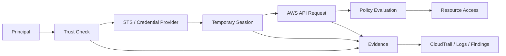
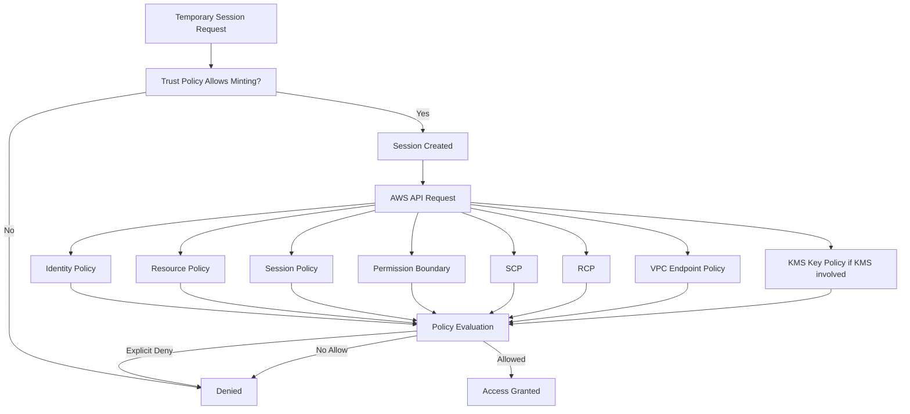
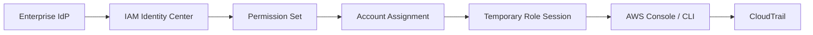
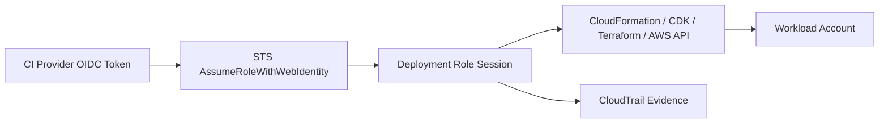
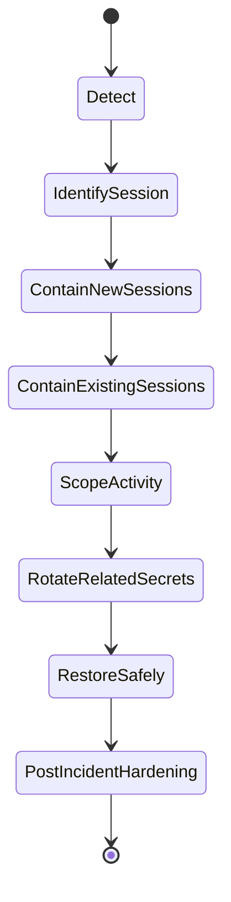

# Part 025 — Temporary Credentials and Session Design

Temporary credentials are not just a safer replacement for access keys.

They are the **runtime unit of authorization** in AWS.

Every serious AWS security model eventually converges on this idea:

> Do not ask, “who has this access forever?”  
> Ask, “who can mint a session, under what trust condition, for how long, carrying what context, bounded by what policy, and leaving what evidence?”

This part is about designing those sessions deliberately.

We are not learning STS as an API catalog. We are learning how to build an access system where credentials are:

- short-lived,
- attributable,
- scoped,
- auditable,
- revocable enough for real incidents,
- difficult to reuse outside their intended context,
- and boring to operate at scale.

---

## 1. The Production Invariant

A production-grade AWS environment should converge toward this invariant:

```text
No human, workload, pipeline, or automation path should require a long-lived AWS access key to perform normal production work.
```

This does not mean no long-lived credential exists anywhere. Some legacy integrations, external systems, vendor tooling, or transitional automation may still require them. But the invariant is that they are **exceptions**, not the access model.

A mature environment treats access keys as radioactive material:

| Property | Long-Lived Access Key | Temporary STS Session |
|---|---|---|
| Expiry | Does not expire automatically | Expires by design |
| Attribution | Often collapses into one IAM user | Can include role session name, source identity, session tags |
| Blast radius | Usually large until rotated/deleted | Limited by duration, role policy, session policy, boundary, SCP/RCP |
| Rotation | Operational burden | Natural expiration lifecycle |
| Incident response | Must revoke/rotate everywhere | Can reduce lifetime and deny older sessions |
| Human workflow | Often shared or embedded | Federation and role assumption |
| Workload workflow | Often embedded in config | Metadata/identity service credential vending |

The deeper point: **temporary credentials force access to be a protocol**, not a secret copied into a config file.

---

## 2. Mental Model: Credential Vending, Not Credential Storage

In a weak system, secrets are stored and distributed.

In a strong system, credentials are **vended** just in time.



The principal may be:

- a human federated through IAM Identity Center,
- an EC2 instance using an instance profile,
- an ECS task using a task role,
- a Lambda function using an execution role,
- an EKS pod using IRSA or EKS Pod Identity,
- a CI/CD runner assuming a deployment role,
- an external identity using web identity federation,
- an emergency operator using break-glass.

In all cases, the key question is:

```text
What conditions allow this principal to receive temporary credentials?
```

That question lives mostly in the **trust policy** and the surrounding control plane.

---

## 3. Temporary Credential Anatomy

A temporary credential set normally has three parts:

```text
AWS_ACCESS_KEY_ID
AWS_SECRET_ACCESS_KEY
AWS_SESSION_TOKEN
```

The session token is what makes it temporary. Without the token, the access key ID and secret access key are not enough.

A session also has metadata that matters operationally:

| Attribute | Why It Matters |
|---|---|
| Expiration | Defines upper bound of credential validity. |
| Role ARN | Shows the permission container used by the session. |
| Role session name | Appears in CloudTrail and should identify actor/workload/pipeline. |
| Source identity | Persistent attribution field for assumed role sessions. |
| Session tags | Attribute propagation for ABAC and ownership context. |
| Session policy | Inline or managed policy used to further restrict the session. |
| MFA context | Can prove the session was minted after MFA. |
| External ID | Helps protect cross-account third-party assumption from confused deputy risk. |

The mistake is to treat the credential as only `access_key + secret + token`.

The **real security object** is:

```text
temporary credential = identity + trust path + permission envelope + session context + duration + evidence
```

---

## 4. STS API Map

AWS Security Token Service is the service that issues many temporary credentials.

The API operation matters because it tells you what kind of identity exchange happened.

| STS Operation | Typical Use | Design Note |
|---|---|---|
| `AssumeRole` | IAM principal assumes a role in same or different account | Core primitive for cross-account access, automation, escalation, break-glass. |
| `AssumeRoleWithSAML` | Enterprise identity provider via SAML | Common for workforce federation, though IAM Identity Center abstracts much of this. |
| `AssumeRoleWithWebIdentity` | OIDC/web identity such as Kubernetes service account token or GitHub OIDC | Important for EKS IRSA and modern CI/CD federation. |
| `GetSessionToken` | Temporary credentials for IAM user, often with MFA | Useful in legacy IAM-user situations; not the strategic human access model. |
| `GetFederationToken` | Federated user temporary credentials | Less central in modern IAM Identity Center designs. |
| `GetCallerIdentity` | Identify current principal/session | Essential debugging and runtime verification command. |

Do not memorize these as trivia. Use them as forensic clues.

When you see a CloudTrail event, the session type tells you which access path produced it.

---

## 5. The Session Contract

Every production session should have a contract.

A session contract answers eight questions:

```text
1. Who or what is allowed to mint the session?
2. Which role or identity does the session become?
3. What permissions can the session exercise?
4. What extra boundaries restrict it?
5. How long does it live?
6. What context travels with it?
7. How is it observed?
8. How is it shut down or contained during an incident?
```

In implementation terms:

| Contract Field | AWS Mechanism |
|---|---|
| Who can mint | Trust policy, identity policy, IdP assignment, OIDC/SAML conditions |
| What it becomes | IAM role ARN / temporary session principal |
| Permission grant | Identity policy, resource policy, KMS key policy |
| Permission ceiling | SCP, RCP, permission boundary, session policy, endpoint policy |
| Duration | Role maximum session duration, request duration, federation settings |
| Context | Role session name, source identity, session tags, MFA condition |
| Evidence | CloudTrail, CloudWatch Logs, Security Hub, IAM Access Analyzer |
| Containment | Policy deny, revoke sessions mechanism, key disable, role trust removal, SCP emergency deny |

The strongest teams review session contracts the way application teams review API contracts.

---

## 6. Permission Is Not One Policy

A temporary session does not simply inherit “the role policy”.

The effective permission is the result of multiple layers.



The session can be restricted by:

- the role identity policy,
- resource-based policies,
- permissions boundaries,
- SCPs,
- RCPs,
- session policies,
- KMS key policies,
- VPC endpoint policies,
- service-specific authorization rules,
- explicit deny conditions.

This is why debugging temporary credentials requires a layered approach. “The role has `s3:GetObject`” is not enough.

---

## 7. Session Duration Design

Session duration is a security boundary and a usability trade-off.

Too short, and engineers build workarounds. Too long, and stolen credentials remain useful for too long.

Design duration by actor type:

| Actor | Typical Duration Strategy | Reasoning |
|---|---|---|
| Human read-only console access | Medium | Avoid constant interruption while keeping bounded exposure. |
| Human production admin access | Short | Privilege should decay quickly. |
| Break-glass | Very short | Emergency actions should be narrow and heavily audited. |
| CI/CD deployment | Short-to-medium | Should cover deployment window, not entire workday. |
| EC2/ECS/Lambda/EKS workload | Managed by credential provider | Runtime refresh should be automatic; app should not cache forever. |
| Vendor cross-account access | Short, explicit, monitored | Reduces blast radius of third-party compromise. |
| Data export or migration job | Bounded to job window | Use job-specific role/session policy, not permanent broad access. |

A simple baseline:

```text
Read-only human sessions:       4–8 hours
Production change sessions:     1–2 hours
Emergency sessions:             15–60 minutes
CI/CD deployment sessions:      30–120 minutes
Exploratory sandbox sessions:   4–12 hours
```

Do not copy this blindly. The right value depends on operational friction, sensitivity, incident response capability, and MFA posture.

The important rule:

```text
Session duration must be chosen intentionally per access path.
```

---

## 8. Role Chaining and the Hidden One-Hour Trap

Role chaining means:

```text
Principal assumes Role A, then uses Role A session to assume Role B.
```

This is common in multi-account environments:

```text
IAM Identity Center session -> shared access role -> workload account admin role
```

Role chaining is powerful, but it can create operational surprises. AWS limits role-chained sessions more aggressively than first-hop role sessions.

Design implication:

```text
Avoid unnecessary role chains in normal human and pipeline access paths.
```

Prefer direct assignment where possible:

```text
Human group -> permission set -> target account role
CI/CD OIDC -> target deployment role
Workload role -> target data role only when cross-account is required
```

Use role chaining when it expresses a real boundary, not because the access path evolved accidentally.

Bad chain:

```text
Developer -> OrgAccessRole -> SharedAdminRole -> ProdPowerUserRole -> DataAdminRole
```

Better:

```text
Developer group -> ProdReadOnly permission set
Developer on-call group -> ProdEmergencyOperator permission set
CI/CD OIDC provider -> ProdDeploymentRole
```

---

## 9. Role Session Name: Human-Readable Attribution

The role session name appears in assumed role ARNs and CloudTrail fields.

Example assumed-role ARN:

```text
arn:aws:sts::111122223333:assumed-role/ProdReadOnly/alice@example.com
```

The final segment is the role session name.

Do not allow meaningless session names such as:

```text
session
admin
aws-cli
terraform
bot
prod
```

A useful role session naming scheme should identify the actor and purpose.

Examples:

```text
alice@example.com
ci-github-payments-api-run-88234912
breakglass-jane-incident-INC-2026-0412
vendor-acme-ticket-CHG-77821
```

For automation, include:

- system name,
- environment,
- repository or pipeline,
- run/build ID,
- change/ticket ID when available.

For humans, include:

- stable user identifier,
- not a shared alias,
- not only a first name,
- preferably the enterprise identity email or immutable ID.

The naming rule:

```text
A CloudTrail investigator should understand the session name without opening five other systems.
```

---

## 10. SourceIdentity: Attribution That Survives Role Assumption

`SourceIdentity` is designed for persistent attribution across role sessions.

Role session name is useful, but it can be chosen by the caller in many flows. Source identity can be controlled and required through IAM conditions.

A strong pattern is:

```text
Require SourceIdentity for sensitive roles.
```

Example trust policy fragment:

```json
{
  "Effect": "Allow",
  "Principal": {
    "AWS": "arn:aws:iam::111122223333:role/IdentityCenterAccessRole"
  },
  "Action": "sts:AssumeRole",
  "Condition": {
    "StringLike": {
      "sts:SourceIdentity": "*@example.com"
    }
  }
}
```

Example deny if missing source identity:

```json
{
  "Effect": "Deny",
  "Action": "sts:AssumeRole",
  "Resource": "arn:aws:iam::*:role/Prod*",
  "Condition": {
    "Null": {
      "sts:SourceIdentity": "true"
    }
  }
}
```

Use this carefully. Not every service or flow sets source identity the same way. Roll it out to controlled human and pipeline paths first.

---

## 11. Session Tags: Context as Authorization Data

Session tags attach attributes to a temporary session.

They are powerful because they allow ABAC-style authorization without creating a new role for every combination of team, project, environment, and data domain.

Example attributes:

```text
team=payments
environment=prod
cost-center=fintech-042
change-id=CHG-2026-1182
oncall=true
data-domain=ledger
```

A policy can then refer to those tags:

```json
{
  "Effect": "Allow",
  "Action": [
    "s3:GetObject",
    "s3:PutObject"
  ],
  "Resource": "arn:aws:s3:::company-data-${aws:PrincipalTag/data-domain}/*",
  "Condition": {
    "StringEquals": {
      "aws:PrincipalTag/environment": "prod"
    }
  }
}
```

Session tags are not magic. They are only safe if tag issuance is controlled.

Bad design:

```text
Any caller can pass any session tag.
```

Good design:

```text
Only identity system / approved broker can pass sensitive session tags.
Policy restricts which tag keys and values are allowed.
CloudTrail records session context.
```

Control tag passing with conditions such as:

```json
{
  "Effect": "Allow",
  "Action": "sts:TagSession",
  "Resource": "*",
  "Condition": {
    "ForAllValues:StringEquals": {
      "aws:TagKeys": [
        "team",
        "environment",
        "change-id"
      ]
    }
  }
}
```

Use session tags for:

- team ownership,
- environment scoping,
- change attribution,
- temporary privilege elevation,
- data-domain access,
- break-glass labeling,
- CI/CD deployment context.

Avoid session tags for:

- secrets,
- high-cardinality noisy values without purpose,
- attributes callers can self-assert without verification,
- replacing resource ownership governance.

---

## 12. Session Policies: Shrinking a Role at Runtime

A session policy restricts the temporary credentials issued by STS.

It does not add permissions. It only reduces the effective permission of the role session.

This is useful when one role represents a broader capability, but a specific invocation should be narrower.

Example:

```text
Role policy allows deployment to multiple services.
Session policy restricts this run to payments-api only.
```

Example session policy concept:

```json
{
  "Version": "2012-10-17",
  "Statement": [
    {
      "Effect": "Allow",
      "Action": [
        "cloudformation:CreateChangeSet",
        "cloudformation:ExecuteChangeSet",
        "cloudformation:Describe*"
      ],
      "Resource": "arn:aws:cloudformation:ap-southeast-1:111122223333:stack/payments-api-prod/*"
    }
  ]
}
```

Effective permission becomes:

```text
role policy ∩ session policy ∩ boundary ∩ SCP ∩ RCP ∩ resource policies
```

Session policies are excellent for:

- CI/CD jobs,
- vendor access,
- data export jobs,
- migration windows,
- temporary analyst sessions,
- break-glass actions.

They are poor for:

- hiding bad role design forever,
- replacing least-privilege role policies,
- complex policy logic nobody can debug.

A practical rule:

```text
Use session policies to narrow a well-designed role, not to compensate for a dangerously broad role.
```

---

## 13. MFA Conditions for Session Minting

MFA should be enforced where human interactive access can produce privileged sessions.

Typical trust policy condition:

```json
{
  "Effect": "Allow",
  "Principal": {
    "AWS": "arn:aws:iam::111122223333:role/HumanAccessBroker"
  },
  "Action": "sts:AssumeRole",
  "Condition": {
    "Bool": {
      "aws:MultiFactorAuthPresent": "true"
    }
  }
}
```

This pattern is useful for:

- break-glass,
- production admin,
- security tooling admin,
- audit log access,
- KMS administration,
- destructive operations.

But MFA condition alone is not enough.

You still need:

- short session duration,
- strong IdP lifecycle,
- group assignment review,
- CloudTrail alerting,
- role naming and source identity,
- least privilege,
- emergency revocation path.

MFA proves a stronger authentication moment. It does not prove the action is safe.

---

## 14. External ID and Third-Party Sessions

External ID protects against the confused deputy problem in third-party cross-account access.

Scenario:

```text
Your AWS account trusts VendorRole in vendor account.
Another vendor customer tricks the vendor into using its privilege against your account.
```

External ID gives your trust policy a customer-specific condition.

Example:

```json
{
  "Effect": "Allow",
  "Principal": {
    "AWS": "arn:aws:iam::999988887777:role/VendorAccessRole"
  },
  "Action": "sts:AssumeRole",
  "Condition": {
    "StringEquals": {
      "sts:ExternalId": "customer-abc-strong-random-value"
    }
  }
}
```

For vendors, require:

- unique external ID per customer,
- documented access purpose,
- specific role name,
- narrow permission policy,
- short maximum session duration,
- CloudTrail monitoring,
- contractual offboarding path,
- no broad `AdministratorAccess`,
- no ability to disable logs or security tools.

The external ID is not a secret equivalent to a password. Treat it as a cross-account binding value that prevents accidental or malicious deputy confusion.

---

## 15. Regional STS Endpoints

STS has global and regional endpoint behavior.

For production design, prefer regional endpoints where possible.

Reasons:

- better alignment with workload region,
- lower latency in some environments,
- improved isolation thinking,
- fewer hidden dependencies on global endpoint behavior,
- clearer control over endpoint usage.

Operational checklist:

```text
[ ] SDKs and CLIs use regional STS endpoints where appropriate.
[ ] SCP or endpoint policy does not accidentally break required STS calls.
[ ] CI/CD systems know which region is used for role assumption.
[ ] Incident runbooks include STS endpoint dependencies.
[ ] CloudTrail queries account for AssumeRole events regionally.
```

Do not treat STS as “invisible plumbing”. It is on the critical path for almost every modern access workflow.

---

## 16. Credential Provider Chain: Runtime Access Without Embedded Secrets

Modern AWS SDKs look for credentials using a provider chain.

The exact order varies by SDK and version, but common sources include:

- environment variables,
- shared credentials/config files,
- web identity token files,
- ECS task role endpoint,
- EC2 instance metadata service,
- IAM Identity Center cached sessions,
- process credential providers,
- custom credential providers.

Production invariant:

```text
Application code should not know static AWS keys.
```

Good application code:

```java
S3Client s3 = S3Client.builder()
    .region(Region.AP_SOUTHEAST_1)
    .build();
```

Bad application code:

```java
AwsBasicCredentials creds = AwsBasicCredentials.create(
    System.getenv("AWS_ACCESS_KEY_ID"),
    System.getenv("AWS_SECRET_ACCESS_KEY")
);
```

The first version lets the runtime environment provide identity. The second version encourages secret injection and long-lived key sprawl.

For containers and functions, prefer runtime-native credential vending:

| Runtime | Preferred Credential Source |
|---|---|
| EC2 | Instance profile through IMDSv2 |
| ECS | Task role credentials endpoint |
| Lambda | Execution role credentials managed by Lambda |
| EKS | IRSA or EKS Pod Identity |
| CI/CD | OIDC federation to STS |
| Human CLI | IAM Identity Center / federated login |

---

## 17. Caching and Refresh Behavior

Temporary credentials expire. Applications must tolerate refresh.

Most AWS SDKs handle this automatically when using standard credential providers. Problems appear when teams manually extract credentials, store them, or cache them incorrectly.

Anti-pattern:

```text
Application starts, calls STS manually, stores credentials in a singleton, never refreshes.
```

Better:

```text
Use SDK credential provider; let it refresh before expiration.
```

Failure symptoms:

- application works for 60 minutes, then fails,
- long-running batch job fails halfway,
- container restart fixes access,
- `ExpiredToken` appears in logs,
- retries do not help because credentials are stale.

Engineering rule:

```text
Long-running processes should rely on refreshable credential providers, not manually cached credential values.
```

This is especially important for:

- stream processors,
- workers,
- schedulers,
- migration jobs,
- daemons,
- WebSocket services,
- long-running Kubernetes pods.

---

## 18. CloudTrail Evidence for Temporary Sessions

Temporary credentials are only valuable if you can investigate them.

CloudTrail records the session context inside `userIdentity`.

A simplified assumed role event looks like:

```json
{
  "eventSource": "s3.amazonaws.com",
  "eventName": "PutObject",
  "userIdentity": {
    "type": "AssumedRole",
    "principalId": "AROAXXXXX:ci-github-payments-api-run-88234912",
    "arn": "arn:aws:sts::111122223333:assumed-role/ProdDeployRole/ci-github-payments-api-run-88234912",
    "accountId": "111122223333",
    "sessionContext": {
      "sessionIssuer": {
        "type": "Role",
        "arn": "arn:aws:iam::111122223333:role/ProdDeployRole",
        "userName": "ProdDeployRole"
      },
      "attributes": {
        "creationDate": "2026-07-06T02:31:55Z",
        "mfaAuthenticated": "false"
      }
    }
  }
}
```

For investigation, you want to answer:

```text
Which original actor minted this session?
Which role was assumed?
What session name was used?
Was MFA present?
Was source identity set?
Were session tags present?
From which IP/user agent did the API call originate?
What was the credential issue time?
What actions happened after the session was created?
```

If you cannot answer these quickly, your temporary credential model is incomplete.

---

## 19. Session Design for Humans

Human access should flow through federation.

Target model:



Design rules:

```text
[ ] No regular production access through IAM users.
[ ] No shared admin users.
[ ] Permission sets are role-like products with owners.
[ ] Production privilege requires MFA.
[ ] Sensitive sessions have short duration.
[ ] Session names identify the human.
[ ] Access reviews happen per group/permission set/account.
[ ] Break-glass is separate from daily admin.
```

Human access categories:

| Category | Session Design |
|---|---|
| Read-only engineer | Federated read-only role, medium duration, broad visibility but no mutation. |
| Service owner operator | Scoped operational role, short-to-medium duration, service/environment bounded. |
| Production admin | Just-in-time role, short duration, approval/evidence. |
| Security responder | Investigation and containment role, strong audit, narrow destructive permissions. |
| Auditor | Read-only evidence role, cannot mutate logs/evidence. |
| Break-glass | Emergency role, shortest duration, multi-person process, immediate alerting. |

Bad human model:

```text
Everyone logs into one shared Admin IAM user because it is faster.
```

Good human model:

```text
Every human access path produces a temporary session whose original actor is visible in audit evidence.
```

---

## 20. Session Design for CI/CD

CI/CD should not store AWS access keys.

Modern model:



Trust policy should bind the CI identity to expected attributes.

Examples of attributes to constrain:

- repository,
- branch,
- environment,
- workflow name,
- organization,
- audience,
- subject,
- pipeline project,
- protected deployment environment.

Session naming should include:

```text
ci-<provider>-<repo>-<workflow/run-id>
```

Deployment role should not be permanent admin by default. Use scoped permissions and session policies where practical.

CI/CD session checklist:

```text
[ ] No static AWS keys in CI secret store.
[ ] OIDC trust policy restricts repository/project and environment.
[ ] Deployment role has permission boundary or scoped policy.
[ ] Session duration covers deployment window only.
[ ] Session name includes run/build ID.
[ ] CloudTrail links actions to pipeline run.
[ ] Destructive operations require separate approval or environment protection.
[ ] Production deploy role cannot disable CloudTrail/Config/Security Hub/GuardDuty.
```

---

## 21. Session Design for Workloads

Workloads should receive credentials from the platform, not from application configuration.

Runtime credential patterns:

| Runtime | Session Source | Key Risk |
|---|---|---|
| EC2 | Instance metadata service via instance profile | Over-broad instance role; IMDS exposure. |
| ECS | Task role endpoint | Confusing task role with execution role; container isolation assumptions. |
| Lambda | Lambda execution role | Shared execution role across unrelated functions. |
| EKS | IRSA or Pod Identity | Node role leakage, service account sprawl, Kubernetes compromise. |
| Batch/Glue/Step Functions | Service role/job role | Over-broad orchestration role. |

Workload identity should be scoped by **workload unit**, not by infrastructure cluster.

Bad:

```text
One EKS node role can access every S3 bucket used by every application.
```

Good:

```text
Each Kubernetes service account maps to a workload-specific IAM role.
```

Bad:

```text
One ECS task role is reused by all services in the cluster.
```

Good:

```text
Each task definition uses a task role scoped to that service's resources.
```

---

## 22. Revocation-Minded Design

Temporary credentials expire, but incident response often needs faster containment.

Assume this:

```text
Already-issued credentials may remain valid until expiration unless you apply an effective deny or revocation control.
```

Containment options:

| Action | Effect | Trade-Off |
|---|---|---|
| Remove trust policy permission | Prevents new sessions | Existing sessions may continue. |
| Attach explicit deny to role/session scope | Can block current and future use if condition matches | Must avoid blocking responders. |
| Reduce max session duration | Helps future sessions | Does not shorten already-issued sessions. |
| Revoke active sessions mechanism | AWS can add deny for sessions issued before a timestamp for supported role workflows | Must understand generated deny policy behavior. |
| Disable/delete IAM user access keys | Immediate for long-lived key | Not relevant to assumed role sessions. |
| SCP emergency deny | Broad containment across accounts/OUs | High blast radius if written poorly. |
| KMS key disable | Stops decrypt/encrypt use | Can break production and recovery. |
| Resource policy deny | Protects specific resource | Needs precise targeting. |

A production session design includes containment plans before the incident.

For privileged roles, define:

```text
[ ] How do we prevent new sessions?
[ ] How do we deny old sessions?
[ ] How do we identify sessions minted before compromise time?
[ ] Which emergency SCP exists?
[ ] Who can apply it?
[ ] How do we avoid locking out responders?
[ ] How do we restore access safely?
```

---

## 23. Emergency Deny Pattern

An emergency deny policy can block sessions issued before a known compromise time.

Conceptual policy:

```json
{
  "Version": "2012-10-17",
  "Statement": [
    {
      "Sid": "DenySessionsIssuedBeforeIncidentTime",
      "Effect": "Deny",
      "Action": "*",
      "Resource": "*",
      "Condition": {
        "DateLessThan": {
          "aws:TokenIssueTime": "2026-07-06T10:00:00Z"
        }
      }
    }
  ]
}
```

This pattern is powerful but dangerous.

Failure modes:

- breaks legitimate long-running jobs,
- denies responder sessions if timestamp is wrong,
- fails if attached to wrong identity/resource scope,
- creates confusion if teams do not understand `aws:TokenIssueTime`,
- may not apply to all credential types exactly as expected.

Use this as part of a tested incident response runbook, not as an improvisation during panic.

---

## 24. Credential Leakage Response

When temporary credentials leak, response should be fast and structured.



Investigation questions:

```text
1. What credential type leaked?
2. Which role/session/user did it represent?
3. When was it issued?
4. When does it expire?
5. Where was it observed?
6. What IPs/user agents used it?
7. What actions were performed?
8. What resources were touched?
9. Could it mint more credentials?
10. Did it access KMS, Secrets Manager, S3, IAM, STS, or logging services?
```

Containment order:

```text
1. Prevent new sessions from the compromised path.
2. Deny active compromised sessions if needed.
3. Protect logs and evidence.
4. Rotate any secrets accessed by the session.
5. Review privilege escalation attempts.
6. Restore access through clean session path.
7. Add detection and guardrails to prevent recurrence.
```

---

## 25. Temporary Credentials and Privilege Escalation

Temporary credentials are not automatically safe.

A short-lived admin session can still destroy an account in minutes.

Watch for these escalation capabilities:

| Capability | Risk |
|---|---|
| `iam:CreateAccessKey` | Converts temporary access into long-lived access. |
| `iam:PassRole` | Lets caller attach powerful role to service it controls. |
| `sts:AssumeRole` broad resource | Lateral movement into other roles/accounts. |
| `iam:PutRolePolicy` | Adds privilege to role. |
| `iam:AttachRolePolicy` | Adds managed privilege, possibly admin. |
| `kms:CreateGrant` | Delegates decrypt ability. |
| `lambda:UpdateFunctionCode` | Code execution under function role. |
| `ecs:RunTask` | Code execution under task role. |
| `cloudformation:*` | Indirect creation of privileged resources. |
| `ssm:SendCommand` | Remote command execution on managed instances. |
| `logs:DeleteLogGroup` / `cloudtrail:StopLogging` | Evidence destruction. |

Session duration does not solve excessive privilege. It only bounds time.

Least privilege, permission boundaries, SCPs, RCPs, and detection still matter.

---

## 26. Session Design Review Template

Use this template before approving a new role or privileged session path.

```mdx
## Session Contract Review

### 1. Purpose
- What job does this session enable?
- Is this a human, workload, pipeline, vendor, or emergency path?

### 2. Session Minting
- Who can call STS or receive credentials?
- Which trust policy allows it?
- Which IdP/OIDC/SAML condition binds the caller?
- Is MFA required?
- Is external ID required?

### 3. Permission Envelope
- What identity policy grants access?
- What resource policies are involved?
- What permission boundary applies?
- What SCP/RCP could deny it?
- Is a session policy used to shrink access?

### 4. Duration
- What is the max session duration?
- Why is that duration acceptable?
- What is the expected action window?

### 5. Attribution
- What is the role session name format?
- Is SourceIdentity required?
- Which session tags are allowed?
- How does this map to a human/change/workload owner?

### 6. Observability
- Which CloudTrail events prove session creation?
- Which alerts fire for unusual use?
- Is Access Analyzer used for external access?
- Are privileged actions monitored?

### 7. Containment
- How do we stop new sessions?
- How do we block existing sessions?
- Who can apply emergency deny?
- How do we avoid locking out responders?

### 8. Lifecycle
- Who owns the role?
- How often is access reviewed?
- What is the decommission path?
```

---

## 27. Common Anti-Patterns

### Anti-Pattern 1: Static Keys in CI

```text
AWS_ACCESS_KEY_ID and AWS_SECRET_ACCESS_KEY stored as repository secrets.
```

Why it is bad:

- key may live for years,
- rotation is manual,
- fork/secret exposure risk,
- weak attribution,
- hard to scope per branch/environment,
- hard to prove clean decommission.

Better:

```text
CI OIDC -> AssumeRoleWithWebIdentity -> short deployment session
```

---

### Anti-Pattern 2: One Admin Role for Everything

```text
Everyone assumes OrganizationAccountAccessRole with AdministratorAccess.
```

Why it is bad:

- no separation of duty,
- bad attribution,
- no environment scoping,
- easy lateral movement,
- hard incident containment,
- policy review impossible.

Better:

```text
Role catalog by job function, environment, and sensitivity.
```

---

### Anti-Pattern 3: Long Human Sessions for Production Admin

```text
12-hour prod admin session because people do not want to log in again.
```

Why it is bad:

- stolen token remains useful,
- browser compromise blast radius is high,
- human privilege persists beyond change window.

Better:

```text
Short privileged session + easy re-auth + JIT approval path.
```

---

### Anti-Pattern 4: Self-Asserted Session Tags

```text
Caller can pass team=security or environment=prod without verification.
```

Why it is bad:

- ABAC collapses,
- tag spoofing becomes privilege escalation,
- audit context becomes untrustworthy.

Better:

```text
Only trusted identity broker or IdP can issue sensitive session tags.
```

---

### Anti-Pattern 5: Manually Cached STS Credentials

```text
Application calls AssumeRole once and stores credentials until restart.
```

Why it is bad:

- `ExpiredToken` failures,
- long-running jobs break,
- refresh logic becomes custom security code.

Better:

```text
Use SDK credential providers and runtime-native credential vending.
```

---

## 28. Practical CLI Debugging

The first command for any credential confusion:

```bash
aws sts get-caller-identity
```

It answers:

```text
Which account am I in?
Which ARN am I using?
Which principal identity does AWS see?
```

Example output:

```json
{
  "UserId": "AROAXXXXX:ci-github-payments-api-run-88234912",
  "Account": "111122223333",
  "Arn": "arn:aws:sts::111122223333:assumed-role/ProdDeployRole/ci-github-payments-api-run-88234912"
}
```

Debug checklist:

```text
[ ] Is this the expected account?
[ ] Is this the expected role?
[ ] Is the session name meaningful?
[ ] Did the expected credential provider win?
[ ] Are old environment variables overriding the intended provider?
[ ] Is AWS_PROFILE pointing to the expected profile?
[ ] Is web identity token file mounted correctly?
[ ] Is the SDK using regional STS endpoint?
[ ] Is session expired?
[ ] Does CloudTrail show the corresponding AssumeRole event?
```

For local developer machines, the most common bug is stale environment variables overriding IAM Identity Center or profile-based credentials.

---

## 29. Policy Examples

### 29.1 Require MFA for Privileged Role Assumption

```json
{
  "Version": "2012-10-17",
  "Statement": [
    {
      "Effect": "Allow",
      "Principal": {
        "AWS": "arn:aws:iam::111122223333:role/HumanAccessBroker"
      },
      "Action": "sts:AssumeRole",
      "Condition": {
        "Bool": {
          "aws:MultiFactorAuthPresent": "true"
        }
      }
    }
  ]
}
```

### 29.2 Require External ID for Vendor Access

```json
{
  "Version": "2012-10-17",
  "Statement": [
    {
      "Effect": "Allow",
      "Principal": {
        "AWS": "arn:aws:iam::999988887777:role/VendorAccessRole"
      },
      "Action": "sts:AssumeRole",
      "Condition": {
        "StringEquals": {
          "sts:ExternalId": "customer-abc-2026-randomized-binding"
        }
      }
    }
  ]
}
```

### 29.3 Deny Missing SourceIdentity for Production Roles

```json
{
  "Version": "2012-10-17",
  "Statement": [
    {
      "Sid": "DenyProdAssumeRoleWithoutSourceIdentity",
      "Effect": "Deny",
      "Action": "sts:AssumeRole",
      "Resource": "arn:aws:iam::*:role/prod-*",
      "Condition": {
        "Null": {
          "sts:SourceIdentity": "true"
        }
      }
    }
  ]
}
```

### 29.4 Restrict Allowed Session Tag Keys

```json
{
  "Version": "2012-10-17",
  "Statement": [
    {
      "Effect": "Allow",
      "Action": [
        "sts:AssumeRole",
        "sts:TagSession"
      ],
      "Resource": "arn:aws:iam::111122223333:role/prod-service-operator",
      "Condition": {
        "ForAllValues:StringEquals": {
          "aws:TagKeys": [
            "team",
            "environment",
            "change-id"
          ]
        }
      }
    }
  ]
}
```

### 29.5 Emergency Deny for Older Sessions

```json
{
  "Version": "2012-10-17",
  "Statement": [
    {
      "Sid": "DenyOldTemporarySessions",
      "Effect": "Deny",
      "Action": "*",
      "Resource": "*",
      "Condition": {
        "DateLessThan": {
          "aws:TokenIssueTime": "2026-07-06T10:00:00Z"
        }
      }
    }
  ]
}
```

Only use this after testing the exact attachment scope and responder access path.

---

## 30. Engineering Heuristics

Use these as review shortcuts.

```text
If a credential does not expire, it must be treated as an exception.
```

```text
If a session cannot be attributed to a human, workload, pipeline, or ticket, it is not production-ready.
```

```text
If a role session can create long-lived access keys, it can escape the temporary credential model.
```

```text
If a session can pass arbitrary roles, it can likely escalate.
```

```text
If a CI/CD system stores AWS keys, the access design is outdated.
```

```text
If workloads share a broad runtime role, least privilege is being applied at the wrong boundary.
```

```text
If revocation is not documented, the role is not incident-ready.
```

---

## 31. End State

After this part, the target mental model is:

```text
A credential is not a secret string.
A credential is a time-bounded authorization session minted through a trust contract.
```

A top-tier AWS engineer should be able to look at any access path and describe:

- how the session is minted,
- what identity it becomes,
- what permission envelope applies,
- how long the session lives,
- how attribution is preserved,
- how the session appears in CloudTrail,
- how it can be contained,
- and why long-lived access keys are not part of the normal path.

That is the difference between “using IAM roles” and **engineering a credential system**.

---

## References

- AWS IAM User Guide — Temporary security credentials in IAM: https://docs.aws.amazon.com/IAM/latest/UserGuide/id_credentials_temp.html
- AWS IAM User Guide — Request temporary security credentials: https://docs.aws.amazon.com/IAM/latest/UserGuide/id_credentials_temp_request.html
- AWS STS API Reference — AssumeRole: https://docs.aws.amazon.com/STS/latest/APIReference/API_AssumeRole.html
- AWS IAM User Guide — Passing session tags in AWS STS: https://docs.aws.amazon.com/IAM/latest/UserGuide/id_session-tags.html
- AWS IAM User Guide — Disabling permissions for temporary security credentials: https://docs.aws.amazon.com/IAM/latest/UserGuide/id_credentials_temp_control-access_disable-perms.html
- AWS IAM User Guide — Grant a user permissions to pass a role to an AWS service: https://docs.aws.amazon.com/IAM/latest/UserGuide/id_roles_use_passrole.html
- AWS IAM User Guide — AWS security credentials: https://docs.aws.amazon.com/IAM/latest/UserGuide/security-creds.html
