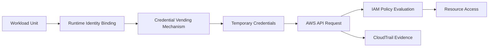
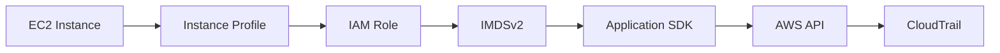
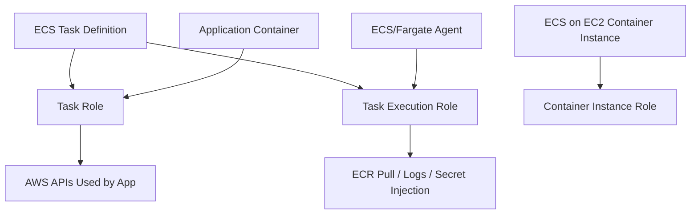
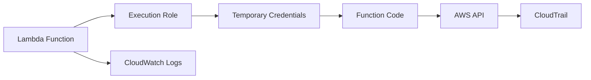
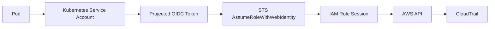
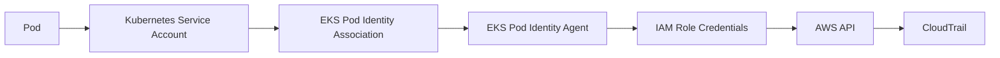
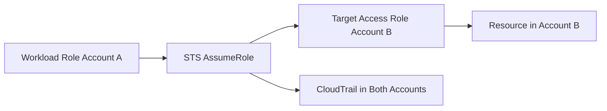
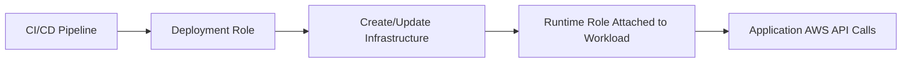

# Part 026 — Workload Identity Patterns

A workload identity is the answer to this question:

> When application code calls an AWS API, who does AWS think is calling?

This part covers the production patterns for EC2, ECS, Lambda, and EKS. The goal is not to memorize where each platform stores credentials. The goal is to build a reliable mental model for **runtime identity**.

The invariant:

```text
Workload code should not contain, read, or be deployed with long-lived AWS access keys.
```

A workload should receive temporary credentials from the platform through a controlled identity binding.

---

## 1. The Workload Identity Contract

Every workload identity pattern has the same structure:

```text
workload unit -> identity binding -> trust policy -> temporary credentials -> AWS API -> CloudTrail evidence
```

In diagram form:



The workload unit differs per platform:

| Platform | Workload Unit | Identity Binding |
|---|---|---|
| EC2 | Instance / application on instance | Instance profile attached to EC2 instance |
| ECS | Task | Task role in task definition |
| Lambda | Function | Execution role attached to function |
| EKS with IRSA | Kubernetes service account | IAM role trust to cluster OIDC provider and service account subject |
| EKS Pod Identity | Kubernetes service account | EKS Pod Identity association to IAM role |

The identity binding is a security boundary only if it maps closely to the workload’s ownership and permission needs.

Bad pattern:

```text
One shared role per cluster.
```

Better pattern:

```text
One role per workload permission boundary.
```

---

## 2. Why Workload Identity Is Not “Just IAM Role Attachment”

Attaching a role is easy.

Designing a workload identity system is harder because you must answer:

```text
1. Which runtime unit receives credentials?
2. Can another workload steal or reuse those credentials?
3. Can the workload mint more powerful credentials?
4. Are permissions scoped to resources owned by the workload?
5. Can the platform team enforce naming, tags, and boundaries?
6. Can CloudTrail identify the workload clearly?
7. Can we rotate, revoke, or replace the identity safely?
8. Can we detect unusual use from that identity?
```

A production workload identity should be:

- workload-specific,
- least-privileged,
- automatically refreshed,
- not manually copied,
- traceable in CloudTrail,
- protected from lateral movement,
- governed by guardrails,
- and easy to decommission.

---

## 3. Decision Matrix

| Runtime | Use This Identity Pattern | Avoid This |
|---|---|---|
| EC2 | Instance profile with IMDSv2 and app-specific role | Static keys in `/home/ec2-user/.aws/credentials` |
| ECS on Fargate | Task role for app, execution role for ECS operations | Putting app AWS keys in env vars |
| ECS on EC2 | Task role for app, execution role for ECS operations, instance role only for container agent/host needs | Letting all tasks inherit broad EC2 instance profile |
| Lambda | Function execution role per permission boundary | One giant execution role shared by unrelated functions |
| EKS | IRSA or EKS Pod Identity per service account/workload | Giving pods access through the node role |
| CI/CD runner | OIDC federation to deployment role | Long-lived AWS key stored in CI secrets |
| External workload | IAM Roles Anywhere or federation where appropriate | IAM user access key installed on external host forever |

A shortcut:

```text
The runtime identity should attach to the smallest unit that can be safely operated as a permission boundary.
```

For Lambda, that unit is often the function.  
For ECS, it is the task.  
For EKS, it is usually the Kubernetes service account.  
For EC2, it may be the instance, but only if the instance hosts one permission boundary.

---

## 4. EC2 Instance Profiles

EC2 uses an IAM role through an **instance profile**.

The instance profile is attached to the EC2 instance. Applications on the instance can retrieve temporary credentials through the Instance Metadata Service.



The good property: application code does not need stored AWS keys.

The risk: any process that can reach the metadata service may be able to retrieve the instance role credentials, unless runtime isolation is designed carefully.

### 4.1 EC2 Design Rules

```text
[ ] Use IAM role through instance profile, not static keys.
[ ] Require IMDSv2.
[ ] Avoid running unrelated trust zones on the same instance.
[ ] Scope the instance role to the application, not the entire account.
[ ] Do not attach AdministratorAccess to instances.
[ ] Avoid using the instance role as a human debugging role.
[ ] Monitor unusual API calls from instance roles.
[ ] Use SSM Session Manager instead of SSH keys where possible.
```

### 4.2 Instance Role Scope

Bad:

```text
role/webserver-prod
- s3:* on *
- dynamodb:* on *
- secretsmanager:* on *
- kms:Decrypt on *
```

Better:

```text
role/payments-api-prod-ec2
- s3:GetObject on config bucket prefix for payments-api
- dynamodb:PutItem/GetItem/UpdateItem on payments table
- secretsmanager:GetSecretValue on payments-api/prod/*
- kms:Decrypt only through Secrets Manager condition/context
```

### 4.3 IMDSv2 and Metadata Exposure

IMDSv2 adds session-oriented metadata access and mitigates several SSRF-style credential theft paths.

But IMDSv2 does not mean “credentials cannot be stolen.”

If an attacker gets code execution on the instance, the instance role remains a target.

Therefore:

```text
IMDSv2 is a control. It is not a substitute for least privilege.
```

### 4.4 EC2 Failure Modes

| Failure Mode | Consequence | Prevention |
|---|---|---|
| Broad instance role | Any app compromise becomes broad AWS compromise | App-specific roles and least privilege |
| Multiple apps on one instance | Weak isolation between workload identities | One workload boundary per instance or stronger isolation |
| IMDSv1 allowed | Higher credential theft risk via SSRF paths | Require IMDSv2 |
| Static keys also installed | Confusing credential source, long-lived compromise | Remove shared credentials files and env vars |
| Human uses instance role for admin | Poor attribution and privilege sprawl | Use IAM Identity Center roles for humans |

---

## 5. ECS Task Roles

ECS has multiple IAM roles. Confusing them is a common source of insecure design.

The key distinction:

```text
Task role = permissions for application code inside the container.
Task execution role = permissions for ECS/Fargate agent to prepare and run the task.
Container instance role = permissions for ECS agent and host when using ECS on EC2.
```



### 5.1 Task Role

The task role is the role your application uses.

Use it for:

- reading/writing S3 objects,
- reading Secrets Manager secrets at runtime,
- accessing DynamoDB,
- publishing SNS/SQS events,
- calling other AWS APIs as the app.

The task role should be specific to the service.

Example:

```text
role/orders-api-prod-task
role/orders-worker-prod-task
role/payments-settlement-prod-task
```

Do not reuse one task role for all services in a cluster.

### 5.2 Task Execution Role

The task execution role is used by ECS/Fargate infrastructure.

Use it for:

- pulling container images from ECR,
- writing logs to CloudWatch Logs,
- retrieving secrets for container startup when configured that way,
- other task lifecycle operations performed by the platform.

It is not the application’s business permission role.

A strong review question:

```text
Would the application code still need this permission after the container has started?
```

If yes, it probably belongs in the task role.  
If no and it is part of launching/running the task, it may belong in the execution role.

### 5.3 ECS on EC2 Container Instance Role

For ECS on EC2, the EC2 host also has an instance profile used by the ECS container agent and host-level operations.

Do not use the container instance role as the application permission model.

Bad:

```text
All tasks indirectly rely on broad EC2 instance profile permissions.
```

Good:

```text
Container instance role is only for ECS host/agent requirements.
Each task has its own task role for app permissions.
```

### 5.4 ECS Failure Modes

| Failure Mode | Consequence | Prevention |
|---|---|---|
| Task role and execution role combined | Agent and app privileges become mixed | Separate roles by lifecycle responsibility |
| Shared task role across services | One service compromise reaches other resources | One task role per permission boundary |
| Broad execution role | Image/log/secret lifecycle role can do too much | Use managed baseline then narrow if needed |
| EC2 instance role used by app | Task isolation weakened | Use task roles; restrict metadata paths |
| Secrets injected broadly | Secret exposure to wrong task | Scope execution role and task definitions |

---

## 6. Lambda Execution Roles

A Lambda function uses an **execution role**.

The execution role grants the function permission to access AWS services and resources. Lambda assumes that role when invoking the function.



Every Lambda function must have an execution role. At minimum, functions commonly need CloudWatch Logs permissions so Lambda can write logs.

### 6.1 Lambda Design Rules

```text
[ ] Prefer one execution role per function or permission boundary.
[ ] Avoid sharing one broad execution role across unrelated functions.
[ ] Keep invoke permission separate from execution permission.
[ ] Use resource-based policies for who can invoke the function.
[ ] Do not manually assume the same execution role inside function code.
[ ] Scope KMS, Secrets Manager, DynamoDB, S3, and EventBridge permissions tightly.
[ ] Treat code update permission as privilege escalation into the execution role.
```

### 6.2 Execution Role vs Invoke Permission

This distinction matters:

```text
Execution role: what the function can do after it runs.
Invoke permission: who or what can trigger the function.
```

Example:

- S3 permission to invoke Lambda is controlled by Lambda resource-based policy.
- Lambda permission to read/write DynamoDB is controlled by the execution role.

Do not solve invoke authorization by adding permissions to the execution role. They are different control planes.

### 6.3 Lambda Code Update as Privilege Escalation

If a principal can update Lambda code, it may be able to execute actions under the Lambda execution role.

Therefore this permission is sensitive:

```text
lambda:UpdateFunctionCode
lambda:UpdateFunctionConfiguration
lambda:CreateFunction
lambda:AddPermission
iam:PassRole
```

A deployment role that can update a function with a powerful execution role is effectively allowed to use that execution role indirectly.

Guardrail:

```text
Control iam:PassRole and Lambda update permissions together.
```

### 6.4 Lambda Failure Modes

| Failure Mode | Consequence | Prevention |
|---|---|---|
| Shared execution role | One function’s needed permission leaks to others | Role per function or permission boundary |
| Overbroad logging/KMS/secrets | Function compromise exposes unrelated data | Resource-scoped policy |
| Deployment role can pass any role | Deployment pipeline can create privileged functions | Restrict `iam:PassRole` by ARN and service |
| Public or broad invoke policy | Function can be triggered unexpectedly | Restrict resource-based policy |
| Function assumes itself manually | Confusing session chain and trust logic | Let Lambda assume execution role automatically |

---

## 7. EKS Workload Identity

EKS is more complex because there are two identity systems:

```text
Kubernetes identity controls what happens inside the cluster.
AWS IAM controls AWS API access.
```

They overlap at the workload identity bridge.

Modern EKS workload identity patterns:

| Pattern | Description |
|---|---|
| IRSA | IAM Roles for Service Accounts using Kubernetes service account token, OIDC provider, and `AssumeRoleWithWebIdentity`. |
| EKS Pod Identity | AWS-managed association between Kubernetes service account and IAM role, using EKS Pod Identity Agent. |

Both aim to avoid giving pods AWS permissions through the node instance role.

---

## 8. EKS IRSA

IRSA maps a Kubernetes service account to an IAM role through OIDC federation.



The IAM role trust policy binds to the OIDC provider and service account subject.

Conceptual trust policy:

```json
{
  "Version": "2012-10-17",
  "Statement": [
    {
      "Effect": "Allow",
      "Principal": {
        "Federated": "arn:aws:iam::111122223333:oidc-provider/oidc.eks.ap-southeast-1.amazonaws.com/id/CLUSTER_ID"
      },
      "Action": "sts:AssumeRoleWithWebIdentity",
      "Condition": {
        "StringEquals": {
          "oidc.eks.ap-southeast-1.amazonaws.com/id/CLUSTER_ID:aud": "sts.amazonaws.com",
          "oidc.eks.ap-southeast-1.amazonaws.com/id/CLUSTER_ID:sub": "system:serviceaccount:payments:payments-api"
        }
      }
    }
  ]
}
```

Service account annotation:

```yaml
apiVersion: v1
kind: ServiceAccount
metadata:
  name: payments-api
  namespace: payments
  annotations:
    eks.amazonaws.com/role-arn: arn:aws:iam::111122223333:role/payments-api-prod-irsa
```

### 8.1 IRSA Design Rules

```text
[ ] One service account per workload permission boundary.
[ ] IAM trust policy binds namespace and service account explicitly.
[ ] Do not use wildcard service account subjects for sensitive roles.
[ ] Restrict node IMDS access so pods cannot use node role credentials.
[ ] Treat Kubernetes RBAC that can mutate service accounts/pods as AWS privilege-sensitive.
[ ] Monitor AssumeRoleWithWebIdentity events.
```

### 8.2 Kubernetes RBAC Becomes AWS-Relevant

If a Kubernetes principal can:

- create pods using a privileged service account,
- update service account annotations,
- mutate deployments to use another service account,
- create projected tokens,
- exec into pods that have AWS permissions,

then that principal may indirectly gain AWS permissions.

This is the key EKS security insight:

```text
Kubernetes write privilege can become AWS IAM privilege.
```

Therefore, review Kubernetes RBAC and IAM trust policy together.

---

## 9. EKS Pod Identity

EKS Pod Identity provides another way to associate a Kubernetes service account with an IAM role.

Instead of manually managing an OIDC trust per service account pattern, you create an EKS Pod Identity association. The EKS Pod Identity Agent runs on nodes and provides credentials to pods on the same node.



Design considerations:

```text
[ ] Pod Identity Agent must run on nodes.
[ ] Each service account association maps to one IAM role in the same account as the cluster.
[ ] For cross-account access, use IAM role delegation from the associated role.
[ ] Agent networking and node posture matter.
[ ] Kubernetes RBAC still matters because service account usage can imply AWS access.
```

Pod Identity can simplify operations compared to managing many IRSA trust policy statements, but it does not remove the need for least privilege or Kubernetes hardening.

---

## 10. Containers Are Not a Security Boundary

This statement is especially important for ECS-on-EC2 and EKS:

```text
A container is a packaging and isolation mechanism, not a complete security boundary by itself.
```

A compromised container may attempt to:

- read credentials from metadata endpoints,
- access projected service account tokens,
- exploit kernel/node vulnerabilities,
- use host networking paths,
- pivot through service account permissions,
- call AWS APIs using available runtime credentials,
- exfiltrate credentials before expiration.

Therefore, workload identity must be combined with:

- least privilege IAM,
- node hardening,
- runtime isolation,
- network policies/security groups,
- IMDS restrictions,
- pod security controls,
- image scanning,
- admission control,
- CloudTrail monitoring,
- GuardDuty/EKS Runtime Monitoring where applicable.

---

## 11. Cross-Account Workload Access

Sometimes a workload in one account must access resources in another account.

Example:

```text
payments-api in workload account needs to read a parameter in shared config account.
```

There are two broad designs.

### 11.1 Direct Resource Policy

Resource in Account B trusts role from Account A.

Example S3 bucket policy concept:

```json
{
  "Effect": "Allow",
  "Principal": {
    "AWS": "arn:aws:iam::111122223333:role/payments-api-prod-task"
  },
  "Action": "s3:GetObject",
  "Resource": "arn:aws:s3:::shared-config-prod/payments-api/*"
}
```

Good for:

- S3,
- SQS,
- SNS,
- KMS with key policy,
- Secrets Manager resource policy in selected cases.

Risk:

- many resource policies become hard to inventory,
- external access must be analyzed,
- KMS policy alignment is easy to miss.

### 11.2 Assume Target Role

Workload role in Account A assumes a target role in Account B.



Good for:

- operationally explicit cross-account access,
- central data access roles,
- vendor-like internal delegation,
- short scoped sessions.

Risk:

- role chaining complexity,
- session attribution must be preserved,
- target role trust must be tight,
- lateral movement if source role can assume too many targets.

Target role trust policy concept:

```json
{
  "Effect": "Allow",
  "Principal": {
    "AWS": "arn:aws:iam::111122223333:role/payments-api-prod-task"
  },
  "Action": "sts:AssumeRole",
  "Condition": {
    "StringEquals": {
      "aws:PrincipalTag/service": "payments-api"
    }
  }
}
```

Use session tags/source identity where supported to preserve context.

---

## 12. `iam:PassRole` as the Workload Identity Gate

Many workload identities are attached by passing a role to a service.

Examples:

- create Lambda function with execution role,
- run ECS task with task role,
- create EC2 instance with instance profile,
- create Step Functions state machine with service role,
- create Glue job with job role,
- create SageMaker notebook/job role.

The permission that enables this is often:

```text
iam:PassRole
```

If a principal can pass any role to a service it controls, it may be able to execute code under a more privileged role.

Bad:

```json
{
  "Effect": "Allow",
  "Action": "iam:PassRole",
  "Resource": "*"
}
```

Better:

```json
{
  "Effect": "Allow",
  "Action": "iam:PassRole",
  "Resource": "arn:aws:iam::111122223333:role/app/payments-*",
  "Condition": {
    "StringEquals": {
      "iam:PassedToService": "ecs-tasks.amazonaws.com"
    }
  }
}
```

Guardrails:

```text
[ ] Restrict role ARNs that can be passed.
[ ] Restrict services roles can be passed to.
[ ] Require permissions boundary on created roles.
[ ] Deny passing security/audit/admin roles.
[ ] Detect new role attachments to compute services.
[ ] Review CloudTrail for PassRole-adjacent changes.
```

---

## 13. Workload Identity Naming

Names are not just cosmetics. They make CloudTrail usable.

Recommended pattern:

```text
<service>-<environment>-<runtime>-<purpose>
```

Examples:

```text
payments-api-prod-ecs-task
payments-api-prod-lambda-exec
ledger-worker-prod-ec2
fra-deployer-prod-github-oidc
risk-model-prod-eks-irsa
```

Avoid:

```text
app-role
lambda-role
ecsTaskRole
prod-role
admin-service-role
```

A good name lets an investigator infer:

- service,
- environment,
- runtime,
- permission boundary,
- owner.

Tags should add structured metadata:

```text
owner-team=payments
service=payments-api
environment=prod
data-classification=confidential
managed-by=terraform
rotation-model=temporary-credentials
```

---

## 14. Workload Identity Policy Shape

A workload role policy should describe the workload’s job.

Bad policy smell:

```json
{
  "Effect": "Allow",
  "Action": "*",
  "Resource": "*"
}
```

Better shape:

```json
{
  "Version": "2012-10-17",
  "Statement": [
    {
      "Sid": "ReadOwnConfiguration",
      "Effect": "Allow",
      "Action": [
        "ssm:GetParameter",
        "ssm:GetParameters",
        "secretsmanager:GetSecretValue"
      ],
      "Resource": [
        "arn:aws:ssm:ap-southeast-1:111122223333:parameter/payments-api/prod/*",
        "arn:aws:secretsmanager:ap-southeast-1:111122223333:secret:payments-api/prod/*"
      ]
    },
    {
      "Sid": "WriteOwnEvents",
      "Effect": "Allow",
      "Action": [
        "events:PutEvents"
      ],
      "Resource": "arn:aws:events:ap-southeast-1:111122223333:event-bus/payments-prod"
    },
    {
      "Sid": "UseOwnTable",
      "Effect": "Allow",
      "Action": [
        "dynamodb:GetItem",
        "dynamodb:PutItem",
        "dynamodb:UpdateItem",
        "dynamodb:Query"
      ],
      "Resource": [
        "arn:aws:dynamodb:ap-southeast-1:111122223333:table/payments-prod",
        "arn:aws:dynamodb:ap-southeast-1:111122223333:table/payments-prod/index/*"
      ]
    }
  ]
}
```

Good workload policy traits:

```text
[ ] Resource ARNs are specific.
[ ] Actions match application behavior.
[ ] Wildcards are justified and narrow.
[ ] KMS access is scoped and condition-aware.
[ ] Secrets access is prefix/resource specific.
[ ] No IAM mutation unless workload is an IAM management tool.
[ ] No CloudTrail/Config/security service disabling.
[ ] No broad sts:AssumeRole unless explicitly required.
```

---

## 15. KMS and Workload Identity

KMS often exposes hidden over-permission.

A workload that can call:

```text
kms:Decrypt
```

on broad keys may read data beyond its intended resources if ciphertext is available.

Use KMS conditions and key policies carefully.

Example condition through Secrets Manager:

```json
{
  "Effect": "Allow",
  "Action": "kms:Decrypt",
  "Resource": "arn:aws:kms:ap-southeast-1:111122223333:key/abcd-1234",
  "Condition": {
    "StringEquals": {
      "kms:ViaService": "secretsmanager.ap-southeast-1.amazonaws.com"
    },
    "ForAnyValue:StringLike": {
      "kms:EncryptionContext:SecretARN": "arn:aws:secretsmanager:ap-southeast-1:111122223333:secret:payments-api/prod/*"
    }
  }
}
```

The precise condition keys depend on service and encryption context. Validate them against actual CloudTrail/KMS behavior.

Design rule:

```text
Do not review workload IAM without reviewing relevant KMS key policy and encryption context.
```

---

## 16. Runtime Verification

Every deployment should be able to prove what identity it is using.

For debugging:

```bash
aws sts get-caller-identity
```

For applications, do not log credentials. But in controlled startup diagnostics, you may log the caller identity ARN or account ID.

Safe diagnostic output:

```text
AWS caller identity: arn:aws:sts::111122223333:assumed-role/payments-api-prod-ecs-task/...
AWS account: 111122223333
AWS region: ap-southeast-1
```

Unsafe diagnostic output:

```text
AWS_ACCESS_KEY_ID=...
AWS_SECRET_ACCESS_KEY=...
AWS_SESSION_TOKEN=...
```

Runtime identity checks:

```text
[ ] App identity ARN matches expected role.
[ ] Account ID matches expected environment.
[ ] Region matches deployment region.
[ ] Credential provider source is expected.
[ ] No static credential env vars override runtime provider.
[ ] CloudTrail shows expected role usage.
```

---

## 17. Observability for Workload Identity

Workload identity should produce observable signals.

Monitor:

```text
[ ] Unusual API calls from workload role.
[ ] Workload role used from unexpected IP/VPC endpoint/user agent.
[ ] Workload role calling IAM/STS unexpectedly.
[ ] Workload role accessing resources outside its namespace/prefix.
[ ] Sudden spike in AccessDenied.
[ ] Use of old/deprecated roles.
[ ] Role assumption from unexpected principal.
[ ] New iam:PassRole usage.
[ ] New resource policy granting workload role access.
```

Useful telemetry sources:

- CloudTrail management events,
- CloudTrail data events for sensitive S3/Lambda/DynamoDB patterns,
- CloudWatch Logs from app runtime,
- IAM Access Analyzer findings,
- AWS Config changes,
- Security Hub findings,
- GuardDuty findings,
- VPC Flow Logs for suspicious egress,
- EKS audit logs for service account and pod mutation,
- ECS task metadata and deployment events.

---

## 18. Guardrails for Workload Identity

A platform team should enforce workload identity guardrails.

### 18.1 SCP Guardrails

Examples:

```text
[ ] Deny creation of IAM users/access keys except approved automation account.
[ ] Deny iam:PassRole for admin/security/audit roles.
[ ] Deny attaching AdministratorAccess to workload roles.
[ ] Deny disabling CloudTrail/Config/Security Hub/GuardDuty.
[ ] Deny creation of compute resources without required tags.
[ ] Deny Lambda/ECS/EC2 creation outside approved deployment roles.
```

### 18.2 Permission Boundary Guardrails

Require delegated teams to create workload roles only with a boundary.

The boundary can prevent:

- IAM mutation outside allowed path,
- passing restricted roles,
- disabling security services,
- accessing unrelated account-wide data,
- attaching admin managed policies,
- creating long-lived users/keys.

### 18.3 IaC Policy Checks

Before deployment, check:

```text
[ ] No wildcard admin policy on workload role.
[ ] No static credentials in env vars or secrets.
[ ] `iam:PassRole` scoped to specific role/service.
[ ] Lambda execution role not shared unexpectedly.
[ ] ECS task role and execution role are different where appropriate.
[ ] EKS service account maps to approved role.
[ ] EC2 metadata options require IMDSv2.
[ ] Required tags exist on IAM roles.
```

---

## 19. Workload Identity Review Template

```mdx
## Workload Identity Review

### 1. Workload
- Service name:
- Environment:
- Runtime: EC2 / ECS / Lambda / EKS / other
- Owner team:
- Data classification:

### 2. Identity Binding
- IAM role name:
- Runtime binding mechanism:
- Trust policy:
- Who can attach or pass this role?

### 3. Permissions
- Required AWS APIs:
- Required resources:
- KMS keys involved:
- Secrets involved:
- Cross-account access:
- Resource policies involved:

### 4. Boundaries
- Permission boundary:
- SCP/RCP assumptions:
- VPC endpoint policy assumptions:
- KMS key policy assumptions:

### 5. Runtime Isolation
- Can another workload obtain these credentials?
- Is IMDS restricted where needed?
- Is service account/pod mutation controlled?
- Is host/container boundary acceptable?

### 6. Observability
- CloudTrail events expected:
- Alerts configured:
- Access Analyzer findings reviewed:
- Config/IaC checks:

### 7. Incident Response
- How to prevent new credential vending:
- How to deny active sessions:
- How to rotate dependent secrets:
- How to redeploy with a clean role:
```

---

## 20. Pattern: One Role Per Service Per Environment

A common default:

```text
role/<service>-<environment>-<runtime>
```

Examples:

```text
payments-api-prod-ecs-task
payments-api-staging-ecs-task
payments-worker-prod-lambda-exec
payments-recon-prod-eks-irsa
```

Benefits:

- clear blast radius,
- readable CloudTrail,
- easier access review,
- safer policy change,
- simpler decommissioning,
- better least privilege.

Cost:

- more IAM roles,
- more IaC modules,
- more policy management.

This cost is acceptable. IAM role count is usually cheaper than audit ambiguity.

---

## 21. Pattern: Shared Role Only for Same Permission Boundary

Sharing a role is acceptable when workloads truly share the same permission boundary.

Example acceptable:

```text
Three horizontally scaled ECS tasks of the same payments-api service use the same task role.
```

Example questionable:

```text
payments-api and refunds-api share a task role because both are owned by payments team.
```

Example bad:

```text
all-prod-services-task-role
```

Review question:

```text
If this role is compromised, are all affected workloads and resources within the same acceptable blast radius?
```

If no, split the role.

---

## 22. Pattern: Deployment Role vs Runtime Role

Do not mix deployment permissions and runtime permissions.



Deployment role can:

- create/update ECS service,
- update Lambda code,
- deploy CloudFormation/CDK/Terraform,
- pass approved runtime roles.

Runtime role can:

- read its secret,
- access its table/bucket/queue,
- publish its events.

Runtime role should not deploy infrastructure. Deployment role should not become the application runtime identity.

Critical control:

```text
Deployment role can pass only approved runtime roles.
```

---

## 23. Pattern: Brokered Access for Sensitive Data

Sometimes giving every workload direct data access creates too much risk.

Alternative:

```text
Workload -> domain service/broker -> sensitive data store
```

Instead of:

```text
Every service role can decrypt/read sensitive data directly.
```

Use brokered access when:

- data classification is high,
- access decisions require business rules,
- audit needs domain-level meaning,
- raw data should not be widely exposed,
- revocation must be centralized,
- masking/tokenization is required.

This is not always necessary. But for regulated data, direct IAM access may be too coarse.

---

## 24. Pattern: Read-Only Diagnostics Role

Workloads often need debugging visibility.

Do not add broad read permissions to the runtime role just because operators need diagnostics.

Better:

```text
Runtime role: minimum app permissions.
Human/operator role: read-only diagnostic permissions.
```

Example:

- app can write to its DynamoDB table,
- operator can read CloudWatch logs and selected metrics,
- operator cannot mutate production data unless using a separate approved role.

This preserves separation between application behavior and human debugging.

---

## 25. Incident Scenario: Compromised ECS Task Role

Scenario:

```text
payments-api container is compromised. Attacker obtains ECS task role credentials.
```

Immediate questions:

```text
1. Which task role?
2. What permissions does it have?
3. When were credentials issued?
4. How long until expiration?
5. Can it assume other roles?
6. Can it read secrets or decrypt data?
7. Can it modify infrastructure?
8. Did it access resources outside normal behavior?
9. Can new tasks still receive the same role credentials?
10. What is the clean redeploy path?
```

Containment:

```text
[ ] Scale down or isolate compromised service.
[ ] Prevent new task launches with compromised image/task definition.
[ ] Attach deny or tighten role policy if needed.
[ ] Rotate secrets the task role could read.
[ ] Review CloudTrail for task role activity.
[ ] Review data events for sensitive resources.
[ ] Redeploy with patched image and possibly new role.
[ ] Add detection for abnormal API calls from that role.
```

The quality of incident response depends heavily on whether the task role was narrow.

If it had `AdministratorAccess`, the incident is account-wide.

---

## 26. Incident Scenario: EKS Service Account Abuse

Scenario:

```text
A Kubernetes user can create pods in namespace payments and uses serviceAccountName: payments-api to obtain AWS permissions.
```

This may be valid or may be privilege escalation depending on RBAC intent.

Investigation:

```text
[ ] Who created the pod?
[ ] Which service account was used?
[ ] Which IAM role is associated?
[ ] Which AWS APIs were called?
[ ] Was node IMDS accessible?
[ ] Could the user mutate service accounts/deployments?
[ ] Was Kubernetes audit logging enabled?
```

Prevention:

```text
[ ] Limit who can create pods with sensitive service accounts.
[ ] Use admission policies to restrict serviceAccountName usage.
[ ] Separate namespaces by trust boundary.
[ ] Restrict node metadata access.
[ ] Monitor AssumeRoleWithWebIdentity or Pod Identity role usage.
[ ] Treat Kubernetes cluster-admin as AWS-sensitive.
```

---

## 27. Anti-Patterns Summary

| Anti-Pattern | Why It Fails | Replacement |
|---|---|---|
| Static keys in workload config | Long-lived, hard to rotate, weak attribution | Runtime IAM role/session |
| One role per account | Massive blast radius | Role per workload boundary |
| One role per cluster | Cross-service privilege leakage | Task/service-account/function-specific roles |
| Broad `iam:PassRole` | Privilege escalation | PassRole scoped by role ARN and service |
| Lambda shared admin execution role | Code update equals account compromise | Function-specific least privilege |
| EKS pods use node role | Pod compromise gets node permissions | IRSA or Pod Identity |
| Ignoring KMS policy | IAM looks narrow but decrypt is broad | Review KMS and encryption context |
| No CloudTrail review | Cannot investigate runtime access | Role-specific detection queries |
| Humans debug with workload role | Poor attribution | Human diagnostic roles |
| Deployment role equals runtime role | CI compromise becomes runtime/data compromise | Separate deployment and runtime roles |

---

## 28. Minimum Production Checklist

```text
[ ] No workload uses long-lived AWS access keys for normal operation.
[ ] EC2 uses instance profiles with IMDSv2 required.
[ ] ECS task role and execution role are intentionally separated.
[ ] Lambda execution roles are scoped per function or permission boundary.
[ ] EKS workloads use IRSA or EKS Pod Identity, not node role permissions.
[ ] iam:PassRole is restricted by role ARN and service.
[ ] Workload roles cannot mutate IAM unless that is their explicit job.
[ ] Workload roles cannot disable audit/security services.
[ ] KMS access is reviewed with key policy and encryption context.
[ ] Cross-account access is explicit and monitored.
[ ] CloudTrail can identify role usage clearly.
[ ] Access Analyzer findings are reviewed for external access.
[ ] Runtime identity can be verified without exposing credentials.
[ ] Incident runbooks exist for compromised workload credentials.
```

---

## 29. End State

A mature AWS environment does not ask application teams to manage AWS credentials.

It gives every workload a runtime identity through a controlled platform mechanism.

The core design question becomes:

```text
What is the smallest runtime boundary that should receive this permission?
```

For EC2, that boundary is usually the instance or app-host group.  
For ECS, the task.  
For Lambda, the function or function family.  
For EKS, the service account.  
For CI/CD, the pipeline run.  
For cross-account access, the source workload role and target role/resource policy pair.

If you can reason about that boundary, you can design least privilege that survives production complexity.

This closes the IAM foundation phase. The next phase moves into audit architecture: CloudTrail, Config, log archive, evidence, and forensic readiness.

---

## References

- AWS EC2 User Guide — IAM roles for Amazon EC2: https://docs.aws.amazon.com/AWSEC2/latest/UserGuide/iam-roles-for-amazon-ec2.html
- Amazon ECS Developer Guide — Amazon ECS task IAM role: https://docs.aws.amazon.com/AmazonECS/latest/developerguide/task-iam-roles.html
- Amazon ECS Developer Guide — Amazon ECS task execution IAM role: https://docs.aws.amazon.com/AmazonECS/latest/developerguide/task_execution_IAM_role.html
- Amazon ECS Developer Guide — Amazon ECS container instance IAM role: https://docs.aws.amazon.com/AmazonECS/latest/developerguide/instance_IAM_role.html
- AWS Lambda Developer Guide — Defining Lambda function permissions with an execution role: https://docs.aws.amazon.com/lambda/latest/dg/lambda-intro-execution-role.html
- AWS Lambda Developer Guide — Managing permissions in AWS Lambda: https://docs.aws.amazon.com/lambda/latest/dg/lambda-permissions.html
- Amazon EKS User Guide — IAM roles for service accounts: https://docs.aws.amazon.com/eks/latest/userguide/iam-roles-for-service-accounts.html
- Amazon EKS User Guide — EKS Pod Identity: https://docs.aws.amazon.com/eks/latest/userguide/pod-identities.html
- AWS IAM User Guide — Grant a user permissions to pass a role to an AWS service: https://docs.aws.amazon.com/IAM/latest/UserGuide/id_roles_use_passrole.html
