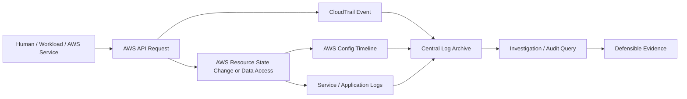
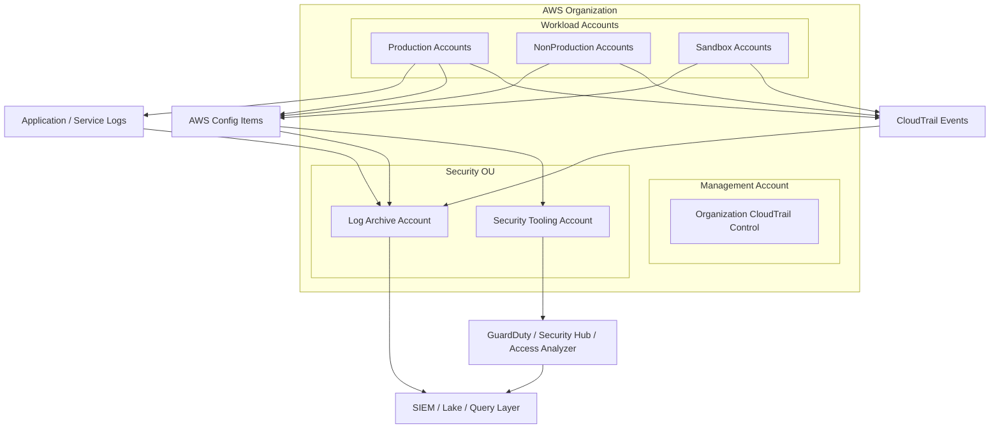
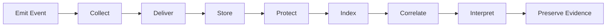
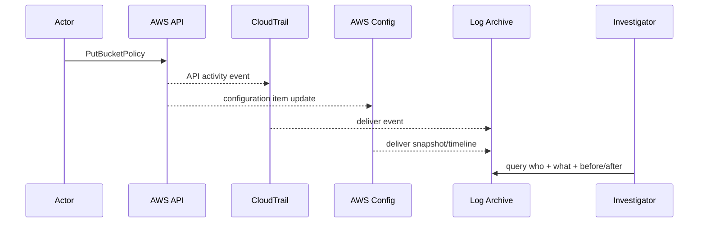
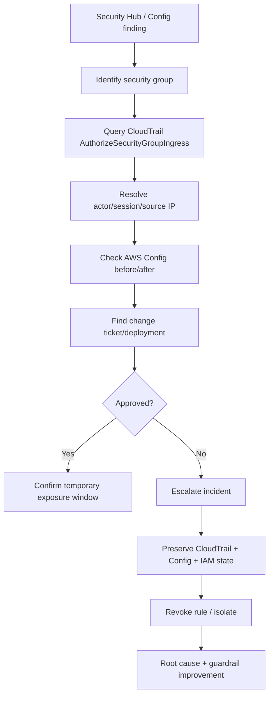

# Part 027 — Audit Architecture in AWS

Audit architecture bukan fitur logging. Audit architecture adalah **sistem pembuktian**.

Dalam AWS production environment, pertanyaan audit paling penting bukan:

> “Apakah kita punya log?”

Pertanyaan yang benar:

> “Saat terjadi insiden, regulatory review, suspicious change, atau dispute, bisakah kita membuktikan siapa melakukan apa, kapan, dari mana, terhadap resource apa, dengan hasil apa, menggunakan permission apa, dan apakah evidence itu masih utuh?”

Kalau jawabannya tidak jelas, logging kamu belum menjadi audit architecture. Ia baru menjadi kumpulan file.

AWS memberi banyak sumber evidence: CloudTrail, AWS Config, CloudWatch Logs, VPC Flow Logs, ELB logs, S3 access logs, GuardDuty findings, Security Hub findings, IAM Access Analyzer findings, Systems Manager session logs, KMS key usage, RDS audit logs, EKS audit logs, dan lain-lain. Namun sumber evidence yang banyak tidak otomatis menghasilkan auditability.

Auditability muncul ketika evidence punya struktur:

1. jelas sumbernya,
2. jelas coverage-nya,
3. jelas retensinya,
4. jelas integritasnya,
5. jelas ownership-nya,
6. jelas query path-nya,
7. jelas escalation path-nya,
8. jelas hubungan antar event-nya.

Part ini membangun mental model tersebut.

---

## 1. Audit Architecture Adalah Read Model untuk Sistem AWS

AWS environment bisa dianggap sebagai sistem event-driven raksasa.

Setiap perubahan penting biasanya terjadi melalui API:

- IAM role dibuat.
- Policy di-attach.
- Security group dibuka.
- S3 bucket policy diubah.
- KMS key policy diubah.
- Lambda function di-update.
- EC2 instance dijalankan.
- CloudTrail dihentikan.
- GuardDuty dinonaktifkan.
- Secret dibaca.
- Object diambil dari S3.

Sebagian event adalah control plane. Sebagian adalah data plane. Sebagian adalah application plane.

Audit architecture adalah read model yang memungkinkan engineer, security team, auditor, dan incident responder menjawab pertanyaan dari event tersebut.



Hal yang sering keliru: engineer menganggap audit log adalah output pasif. Padahal audit log harus didesain sebagai **domain model**.

Domain utamanya:

```text
Actor -> Action -> Target -> Context -> Result -> Evidence -> Interpretation
```

Contoh:

```text
Actor      : arn:aws:sts::111122223333:assumed-role/Admin/alice@example.com
Action     : ec2:AuthorizeSecurityGroupIngress
Target     : sg-0abc123
Context    : source IP 203.0.113.10, us-east-1, console session, MFA present
Result     : success
Evidence   : CloudTrail management event + Config diff + ticket approval
Meaning    : inbound SSH was opened to a production security group
```

Tanpa domain model ini, log query akan menjadi grep-driven firefighting.

---

## 2. Audit Questions yang Harus Bisa Dijawab

Audit architecture production-grade minimal harus bisa menjawab sembilan pertanyaan.

### 2.1 Who did it?

Harus bisa membedakan:

- IAM user,
- assumed role,
- federated human user,
- AWS service principal,
- workload role,
- automation role,
- external account principal,
- root user,
- anonymous/public access,
- cross-account caller.

Untuk assumed role, jangan berhenti di role ARN. Role ARN sering hanya menjawab “role apa”, bukan “siapa manusia atau workload di balik sesi itu”.

Bad evidence:

```text
arn:aws:sts::123456789012:assumed-role/ProductionAdmin/session-123
```

Better evidence:

```text
arn:aws:sts::123456789012:assumed-role/ProductionAdmin/alice@example.com
sourceIdentity: alice@example.com
mfaAuthenticated: true
identityProvider: IAM Identity Center
```

Karena itu session naming, `SourceIdentity`, IAM Identity Center attribution, dan STS session tag bukan kosmetik. Mereka adalah audit design.

### 2.2 What action was performed?

Harus jelas API action-nya:

- `iam:AttachRolePolicy`
- `s3:PutBucketPolicy`
- `kms:ScheduleKeyDeletion`
- `cloudtrail:StopLogging`
- `ec2:AuthorizeSecurityGroupIngress`
- `secretsmanager:GetSecretValue`
- `sts:AssumeRole`

Jangan hanya menyimpan “user updated resource”. Untuk AWS, action adalah API event.

### 2.3 Against what resource?

Resource target harus bisa di-resolve:

- ARN,
- resource ID,
- account ID,
- region,
- tag ownership,
- environment,
- data classification,
- business service.

Contoh `DeleteBucketPolicy` tanpa konteks bucket classification tidak cukup. `DeleteBucketPolicy` pada bucket sandbox berbeda risiko dengan `DeleteBucketPolicy` pada bucket berisi regulated evidence.

### 2.4 When did it happen?

Timestamp harus normalized. Tantangan nyata:

- CloudTrail delivery latency,
- multi-region event ordering,
- application clock skew,
- asynchronous service event,
- eventual consistency,
- delayed aggregation,
- duplicate event ingestion.

Audit architecture harus membedakan:

```text
eventTime      : kapan event terjadi menurut service
ingestionTime  : kapan event masuk pipeline
queryTime      : kapan evidence dilihat
detectionTime  : kapan alert dibuat
responseTime   : kapan response dimulai
```

### 2.5 From where?

Minimal:

- source IP,
- VPC endpoint ID jika request melalui private endpoint,
- user agent,
- AWS region,
- account,
- network path bila tersedia,
- identity provider,
- service invocation context.

Source IP untuk AWS service call tidak selalu merepresentasikan lokasi manusia. Misalnya, CloudFormation atau Lambda bisa melakukan API call atas nama role. Maka “from where” kadang berarti:

```text
who triggered automation -> automation role -> service call -> target resource
```

### 2.6 With what permission path?

Untuk insiden IAM, audit harus bisa menjawab:

- role apa yang dipakai,
- trust policy apa yang mengizinkan assumption,
- permission policy apa yang mengizinkan action,
- apakah permission boundary berlaku,
- apakah SCP/RCP membatasi,
- apakah session policy mempersempit,
- apakah resource policy memberi akses,
- apakah KMS key policy ikut mengizinkan,
- apakah VPC endpoint policy ikut membatasi.

CloudTrail memberi event. Ia tidak otomatis memberi full permission proof. Permission proof harus direkonstruksi dari IAM state, policy history, Config timeline, dan deployment history.

### 2.7 What changed?

Untuk change audit, event saja tidak cukup. Kita perlu before/after state.

CloudTrail menjawab:

```text
PutBucketPolicy was called.
```

AWS Config menjawab:

```text
Bucket policy changed from X to Y.
```

Ia berbeda. CloudTrail adalah **activity log**. Config adalah **configuration timeline**.

### 2.8 What was the result?

Audit architecture harus membedakan:

- successful action,
- failed authorization,
- throttled call,
- validation error,
- dry run,
- partial success,
- asynchronous success/failure.

Contoh: `AccessDenied` terhadap `iam:CreateUser` dari role yang tidak semestinya adalah signal penting, walaupun tidak ada perubahan resource. Banyak attack path terlihat dari failed attempts.

### 2.9 Can the evidence be trusted?

Evidence harus punya:

- centralization,
- immutability atau tamper resistance,
- restricted access,
- integrity validation,
- retention policy,
- encryption,
- independent account boundary,
- deletion protection,
- monitoring terhadap pipeline failure.

Audit log yang bisa diedit oleh admin workload bukan audit evidence. Ia hanya operational artifact.

---

## 3. Event Sources: Jangan Campur Semua ke Satu Konsep “Log”

Semua log bukan evidence yang sama. Masing-masing menjawab pertanyaan berbeda.

| Source | Primary Question | Nature | Common Failure |
|---|---|---|---|
| CloudTrail management events | Siapa melakukan AWS control plane action? | API activity | Tidak multi-region, tidak centralized, tidak immutable |
| CloudTrail data events | Siapa mengakses data/resource object-level? | Data plane activity | Tidak diaktifkan karena volume/cost |
| CloudTrail Insights | Ada anomali API call/error rate? | Behavioral anomaly | Dianggap pengganti detection penuh |
| AWS Config | Apa state resource dari waktu ke waktu? | Configuration timeline | Tidak semua resource direkam, recorder mati |
| CloudWatch Logs | Apa kata aplikasi/service? | Runtime logs | Retention pendek, format tidak standar |
| VPC Flow Logs | Siapa bicara ke siapa di network layer? | Network metadata | Tidak ada packet payload, salah interpretasi ACCEPT/REJECT |
| ELB/ALB logs | Request masuk ke load balancer? | Edge/request metadata | Tidak dikorelasikan dengan app trace |
| S3 server access / object logs | Object access | Data access evidence | Coverage tidak konsisten |
| GuardDuty findings | Apa indikasi threat? | Detection finding | Dianggap root-cause proof |
| Security Hub findings | Apa posture/finding terpusat? | Finding correlation | Noise tanpa lifecycle |
| IAM Access Analyzer | Ada external/unused access? | Access reasoning | Findings tidak ditindaklanjuti |
| Systems Manager logs | Siapa masuk shell/menjalankan command? | Admin session evidence | Session logging tidak enforced |

Prinsipnya:

> Audit architecture harus menggabungkan activity, state, runtime, network, detection, dan evidence lifecycle.

CloudTrail saja tidak cukup. Config saja tidak cukup. CloudWatch Logs saja tidak cukup.

---

## 4. Minimal Audit Stack untuk AWS Organization

Untuk multi-account AWS, minimal audit stack yang defensible biasanya seperti ini:



Ada dua account penting:

1. **Log Archive Account** — menyimpan evidence mentah dan arsip jangka panjang.
2. **Security Tooling Account** — menjalankan security service, aggregation, detection, triage, dan response tooling.

Jangan gabungkan keduanya sembarangan. Log Archive harus sangat pasif dan ketat. Security Tooling lebih aktif dan punya lebih banyak integrasi. Jika Security Tooling compromised, attacker tidak boleh mudah menghapus evidence mentah di Log Archive.

---

## 5. Audit Boundary: Evidence Harus Keluar dari Workload Account

Workload account tidak boleh menjadi satu-satunya tempat evidence disimpan.

Alasannya sederhana:

> Jika attacker mendapat admin di workload account, evidence di account itu ikut berada dalam blast radius.

Karena itu, log security-critical harus dikirim ke account terpisah yang tidak dikelola oleh workload team.

Bad architecture:

```text
Prod Account
- App
- IAM Admin
- CloudTrail logs bucket
- Config snapshot
- Security findings
```

Better architecture:

```text
Prod Account
- App
- Runtime resources
- Local operational logs if needed

Log Archive Account
- Central CloudTrail S3 bucket
- Central service log bucket
- Immutable retention

Security Tooling Account
- GuardDuty delegated admin
- Security Hub delegated admin
- Config aggregator
- Investigation access
```

Ini bukan berarti workload team tidak boleh melihat log. Mereka boleh melihat sesuai kebutuhan. Namun mereka tidak boleh memiliki permission untuk mengubah retensi, menghapus arsip, menonaktifkan trail, atau mengubah KMS key policy evidence.

---

## 6. Evidence Pipeline: Dari Event ke Bukti

Pipeline audit yang matang punya beberapa tahap.



### 6.1 Emit

Service harus menghasilkan event. Jika event source tidak aktif, pipeline tidak punya bahan.

Contoh:

- CloudTrail management event aktif.
- Data event untuk S3 bucket sensitif aktif.
- Config recorder aktif di semua region yang dipakai.
- VPC Flow Logs aktif untuk VPC penting.
- Application audit logs dikirim structured.
- Systems Manager session logging aktif.

### 6.2 Collect

Collection harus org-wide jika mungkin. Jangan bergantung pada tiap team untuk membuat trail manual.

Contoh:

- organization trail,
- organization Config aggregator,
- central GuardDuty administrator,
- central Security Hub administrator.

### 6.3 Deliver

Delivery failure harus dimonitor. Banyak organisasi membuat trail tetapi tidak memonitor apakah delivery ke S3 gagal.

Failure mode:

- bucket policy berubah,
- KMS key disabled,
- region baru tidak masuk coverage,
- account baru belum enrolled,
- service-linked role rusak,
- S3 object ownership/ACL issue,
- quota atau throttling.

### 6.4 Store

Storage evidence harus didesain dengan:

- account isolation,
- bucket policy ketat,
- encryption,
- lifecycle,
- object lock bila relevan,
- separate read/write roles,
- deny delete guardrail,
- retention by data class.

### 6.5 Protect

Protection bukan hanya S3 encryption. Protection termasuk:

- mencegah `cloudtrail:StopLogging`,
- mencegah `cloudtrail:DeleteTrail`,
- mencegah `s3:DeleteObject` pada log archive,
- mencegah perubahan bucket policy log archive,
- mencegah disable KMS key,
- mencegah perubahan lifecycle retention tanpa approval,
- alert pada perubahan security service.

### 6.6 Index

Evidence yang tidak bisa dicari saat insiden akan dianggap tidak ada.

Index/query layer bisa berupa:

- CloudTrail Lake,
- Athena over S3 logs,
- OpenSearch,
- SIEM,
- Security Lake,
- vendor tooling,
- custom investigation lake.

Yang penting bukan tool-nya. Yang penting query bisa menjawab audit questions.

### 6.7 Correlate

Audit butuh korelasi lintas event.

Contoh attack chain:

```text
1. User assumes Admin role.
2. User creates access key for dormant IAM user.
3. IAM user calls ListBuckets.
4. IAM user reads sensitive S3 objects.
5. Security group egress changed.
6. CloudTrail data events spike.
```

Kalau event tersebut tersebar tanpa shared identifiers, investigation menjadi lambat.

### 6.8 Interpret

Log tidak menjelaskan makna bisnis. Engineer harus menambahkan enrichment:

- account owner,
- service owner,
- environment,
- data classification,
- resource tags,
- ticket/change reference,
- deployment ID,
- incident ID,
- severity mapping.

### 6.9 Preserve

Saat insiden, evidence tertentu harus dibekukan:

- relevant CloudTrail objects,
- Config timeline,
- IAM policy snapshots,
- disk snapshots,
- memory/process evidence bila tersedia,
- application logs,
- findings,
- chat/ticket context.

Preservation harus punya runbook. Jangan improvisasi saat incident.

---

## 7. Audit Architecture untuk Control Plane

Control plane audit adalah pondasi paling penting di AWS.

Karena hampir semua perubahan AWS melalui API, CloudTrail management events menjadi evidence utama.

Control plane audit harus mencakup:

- IAM changes,
- Organizations changes,
- SCP/RCP changes,
- CloudTrail/Config changes,
- KMS changes,
- network configuration changes,
- security group changes,
- compute provisioning,
- storage policy changes,
- backup policy changes,
- logging changes,
- security service changes.

Minimal invariant:

```text
Every AWS account and every enabled region must produce control-plane activity evidence into a centralized archive that workload administrators cannot modify.
```

### 7.1 Management Events

Management events biasanya mencatat control plane operations. Contoh:

- `CreateUser`
- `AttachRolePolicy`
- `RunInstances`
- `CreateBucket`
- `PutBucketPolicy`
- `StopLogging`

Management events terbagi:

- read-only events,
- write events.

Write events lebih kritis untuk change detection. Read events penting untuk reconnaissance, investigation, dan suspicious enumeration.

Jangan hanya log write events di production kecuali ada alasan cost/volume yang kuat dan ada compensating control. Banyak serangan dimulai dari read/list/describe.

### 7.2 Multi-Region Requirement

AWS region bisa menjadi blind spot. Jika trail hanya aktif di satu region, attacker dapat menggunakan region lain untuk membuat resource, role, key, atau exfil path.

Minimum recommended pattern:

```text
Organization-level, multi-region CloudTrail for management events.
```

Opt-in region harus dipikirkan. Jika organisasi mengizinkan enable region baru, audit control harus ikut aktif.

### 7.3 Global Service Events

IAM, STS, CloudFront, Route 53, dan layanan global lain punya karakteristik region/event yang berbeda. Jangan menganggap semua aktivitas global otomatis mudah dipahami hanya dari satu region query.

Audit query harus tahu bagaimana CloudTrail merepresentasikan service global.

---

## 8. Audit Architecture untuk Data Plane

Control plane menjawab “siapa mengubah konfigurasi”. Data plane menjawab “siapa mengakses data atau melakukan operasi runtime terhadap resource”.

Data plane logging lebih mahal dan lebih berisik, jadi harus berbasis risk.

Contoh data event:

- S3 object-level access,
- Lambda Invoke,
- DynamoDB item-level API activity,
- Secrets Manager secret access,
- KMS decrypt/use events,
- EBS direct API events,
- S3 Object Lambda events.

Jangan aktifkan semua data events tanpa strategi. Jangan juga mematikannya semua karena cost.

Gunakan classification:

| Data Class | Data Event Strategy |
|---|---|
| Public | selective, mostly operational |
| Internal | enable for sensitive buckets/resources |
| Confidential | enable object/API access logs |
| Regulated | enable comprehensive data access evidence |
| Secret/credential | enable read access logging and alerting |

### 8.1 High-Value Data Event Targets

Prioritas tinggi:

- S3 bucket berisi PII/regulatory evidence,
- Secrets Manager secrets,
- KMS keys protecting sensitive workloads,
- DynamoDB tables with regulated data,
- Lambda functions that trigger critical workflow,
- backup vault operations,
- object stores used for audit/log archive.

### 8.2 Data Events Are Not Automatically Semantic

`GetObject` pada S3 tidak otomatis memberi tahu apakah data itu “customer complaint evidence” atau “static asset”. Perlu enrichment dari tag, inventory, classification, dan owner registry.

---

## 9. Configuration Audit: CloudTrail Tidak Cukup

CloudTrail memberi activity event. Tetapi untuk menjawab “apa state resource sebelum dan sesudah”, gunakan AWS Config.

Contoh:

CloudTrail:

```text
PutBucketPublicAccessBlock called by role X at time T.
```

Config:

```text
BlockPublicAcls changed from true to false.
Resource compliance changed from COMPLIANT to NON_COMPLIANT.
```

Audit architecture harus menggabungkan keduanya.



Audit without Config often fails during posture review because it can prove an action happened but not reliably reconstruct the complete resource state timeline.

---

## 10. Application Audit Logs: Jangan Campur dengan Debug Logs

Aplikasi perlu audit log sendiri. Namun application audit log tidak sama dengan application debug log.

Debug log:

```text
CustomerService#updateCustomer took 240ms
```

Audit log:

```json
{
  "event_type": "CUSTOMER_STATUS_CHANGED",
  "actor_type": "USER",
  "actor_id": "alice@example.com",
  "tenant_id": "tenant-123",
  "target_type": "CUSTOMER",
  "target_id": "cust-456",
  "before": { "status": "PENDING" },
  "after": { "status": "APPROVED" },
  "reason": "manual_review",
  "request_id": "req-abc",
  "trace_id": "trace-xyz",
  "decision_id": "authz-dec-789",
  "time": "2026-07-06T10:15:00Z"
}
```

Untuk regulatory systems, audit event harus merepresentasikan domain action, bukan implementation detail.

Good domain audit events:

- `CASE_ESCALATED`
- `ENFORCEMENT_ACTION_APPROVED`
- `EVIDENCE_ATTACHMENT_VIEWED`
- `RISK_SCORE_OVERRIDDEN`
- `SANCTION_DECISION_FINALIZED`
- `APPEAL_WINDOW_EXTENDED`
- `ACCESS_GRANTED_TO_CASE`
- `REPORT_EXPORTED`

Bad audit events:

- `POST /api/v1/cases/123`
- `update table case_status`
- `controller success`

Application audit logs harus bisa dikorelasikan dengan AWS audit logs:

```text
application actor -> workload role -> AWS API -> data/resource
```

---

## 11. Evidence Correlation Keys

Tanpa correlation key, audit investigation menjadi manual.

Minimal keys:

| Key | Purpose |
|---|---|
| `account_id` | AWS account boundary |
| `region` | regional location |
| `principal_arn` | AWS caller |
| `source_identity` | human/workload attribution |
| `role_session_name` | session attribution |
| `request_id` | app/API correlation |
| `trace_id` | distributed tracing correlation |
| `resource_arn` | target resource |
| `resource_owner` | operational owner |
| `environment` | prod/nonprod/sandbox |
| `change_id` | approved change/ticket |
| `incident_id` | incident response linkage |
| `finding_id` | detection/finding lifecycle |

Untuk AWS-native events, sebagian key sudah ada. Untuk application logs, tim engineering harus menambahkannya.

A good invariant:

```text
Every production-changing automation must emit a change_id into logs and propagate trace/request context.
```

---

## 12. Tamper Resistance: Evidence Tidak Boleh Bergantung pada Kejujuran Admin

Audit evidence harus melindungi diri dari tiga hal:

1. deletion,
2. mutation,
3. selective omission.

### 12.1 Deletion

Controls:

- S3 Object Lock untuk bucket tertentu,
- versioning,
- deny `s3:DeleteObject`,
- restricted lifecycle policy changes,
- separate log archive account,
- SCP preventing log archive tampering,
- alert on delete attempt.

### 12.2 Mutation

Controls:

- CloudTrail log file validation,
- KMS key protection,
- object lock/legal hold where needed,
- checksum/digest validation,
- write-once archive.

### 12.3 Selective Omission

Omission adalah blind spot yang paling berbahaya. Contoh:

- region baru tidak masuk trail,
- account baru belum enrolled,
- data events tidak aktif untuk bucket sensitif,
- Config recorder dimatikan,
- application audit event tidak dikirim karena exception path,
- log subscription filter gagal.

Controls:

- coverage dashboard,
- account vending baseline validation,
- Config/Security Hub controls,
- periodic audit drills,
- canary events,
- alert on logging disabled,
- org-wide guardrails.

---

## 13. Audit Coverage Matrix

Setiap organisasi butuh coverage matrix. Ini bukan spreadsheet compliance kosmetik; ini peta blind spot.

Contoh:

| Area | Evidence Source | Required? | Centralized? | Immutable? | Queryable? | Owner |
|---|---|---:|---:|---:|---:|---|
| IAM changes | CloudTrail management | Yes | Yes | Yes | Yes | Security Platform |
| SCP changes | CloudTrail management | Yes | Yes | Yes | Yes | Cloud Governance |
| S3 sensitive object reads | CloudTrail data | Risk-based | Yes | Yes | Yes | Data Platform |
| Resource state | AWS Config | Yes | Aggregated | Archive | Yes | Cloud Governance |
| Admin shell access | SSM Session logs | Yes for prod | Yes | Yes | Yes | Platform Ops |
| Network flows | VPC Flow Logs | Prod critical | Yes | Lifecycle | Yes | Network Security |
| App domain events | App audit log | Yes | Yes | Yes | Yes | Service Team |
| Findings | GuardDuty/Security Hub | Yes | Central | N/A | Yes | SecOps |

Setiap “No” atau “Partial” harus memiliki accepted risk atau remediation plan.

---

## 14. Audit Architecture Anti-Patterns

### 14.1 “We have CloudTrail, so we are audited”

CloudTrail adalah komponen, bukan architecture.

Tanpa centralization, retention, integrity, query, and coverage, CloudTrail mudah menjadi checkbox.

### 14.2 Logs Stored in the Same Account They Audit

Jika prod admin bisa menghapus prod logs, audit boundary lemah.

### 14.3 No Read Event Logging Anywhere

Menonaktifkan semua read events membuat reconnaissance sulit terlihat.

### 14.4 No Data Event Strategy

Tidak semua data events harus aktif, tetapi sensitive data access harus punya evidence.

### 14.5 Application Audit Is Just HTTP Access Log

HTTP access log tidak cukup untuk domain audit. Ia tidak menjawab meaning.

### 14.6 No Evidence Retention Model

Retention 7 hari mungkin cukup untuk debugging, tapi tidak cukup untuk compliance, fraud investigation, or delayed incident detection.

### 14.7 No Evidence Ownership

Jika semua orang menganggap “security team punya log”, tetapi service team yang memahami domain tidak ikut bertanggung jawab, audit interpretation gagal.

### 14.8 Logs Are Queryable Only by One Specialist

Audit query harus bisa dioperasikan melalui runbook, bukan tribal knowledge.

---

## 15. Designing an Audit Query Layer

Audit query layer harus disusun berdasarkan use case, bukan berdasarkan lokasi file.

Minimum query use cases:

### 15.1 Identity Investigation

Pertanyaan:

```text
Apa saja action yang dilakukan principal X dalam window waktu Y?
```

Butuh:

- CloudTrail management/data events,
- role session name,
- source identity,
- source IP,
- user agent,
- account/region,
- result code.

### 15.2 Resource Investigation

Pertanyaan:

```text
Siapa yang mengubah resource R dan bagaimana state berubah?
```

Butuh:

- CloudTrail events filtered by resource,
- AWS Config timeline,
- deployment events,
- IaC state/history,
- change ticket.

### 15.3 Access Investigation

Pertanyaan:

```text
Siapa membaca data sensitif D?
```

Butuh:

- CloudTrail data events,
- S3/KMS/Secrets Manager logs,
- application audit logs,
- user identity enrichment,
- data classification.

### 15.4 Blast Radius Investigation

Pertanyaan:

```text
Jika role X compromised, resource apa yang bisa disentuh dan action apa yang sudah dilakukan?
```

Butuh:

- IAM policy state,
- Access Analyzer,
- CloudTrail activity,
- Config inventory,
- resource tags/classification.

### 15.5 Control Failure Investigation

Pertanyaan:

```text
Kenapa guardrail tidak mencegah perubahan ini?
```

Butuh:

- SCP/RCP history,
- IAM evaluation reconstruction,
- permission boundary state,
- Config rule history,
- deployment pipeline logs,
- exception registry.

---

## 16. Evidence Retention Model

Tidak semua log perlu retention sama. Retention harus mengikuti risk dan usage.

Contoh model:

| Evidence Type | Hot Query | Warm Retention | Archive Retention | Notes |
|---|---:|---:|---:|---|
| CloudTrail management | 90 days | 1 year | 7 years | Core audit evidence |
| CloudTrail data for regulated data | 90 days | 1 year | 7 years | Cost-sensitive, high value |
| AWS Config timeline | 90 days | 1 year | 7 years | Useful for posture and change audit |
| GuardDuty findings | 90 days | 1 year | 3–7 years | Detection lifecycle |
| Application audit logs | 90 days | 1–2 years | regulatory-dependent | Domain evidence |
| Debug logs | 7–30 days | optional | rarely | Operational, not audit primary |
| VPC Flow Logs | 30–90 days | optional | risk-based | High volume |

Retention should be documented as engineering policy. Jangan biarkan default retention menentukan audit posture.

---

## 17. Audit Architecture as Code

Audit architecture harus dibangun sebagai code:

- organization trail definition,
- log archive bucket policy,
- KMS key policy,
- Config recorder,
- aggregator,
- account baseline,
- SCP guardrails,
- EventBridge rules,
- alarms,
- dashboard,
- lifecycle policy,
- object lock config,
- Security Hub controls,
- exception registry.

Manual setup akan drift.

A useful repository structure:

```text
cloud-governance/
  organizations/
    ous.yaml
    scps/
    rcps/
  landing-zone/
    control-tower-baseline/
    account-factory/
  audit/
    cloudtrail/
    config/
    log-archive/
    kms/
    eventbridge/
    dashboards/
  detection/
    guardduty/
    securityhub/
    access-analyzer/
  exceptions/
    accepted-risks.yaml
```

Audit change to audit system itself must be stricter than normal workload change.

---

## 18. Operational Runbooks

Audit architecture needs runbooks.

Minimum runbooks:

1. investigate IAM privilege escalation,
2. investigate root usage,
3. investigate CloudTrail stopped/modified,
4. investigate public S3 exposure,
5. investigate sensitive data access,
6. investigate cross-account access,
7. investigate KMS key policy change,
8. investigate production security group opened,
9. preserve evidence during incident,
10. validate audit coverage for new account.

Each runbook should specify:

```text
Trigger
Scope
Queries
Evidence sources
Owner
Escalation
Preservation steps
Expected false positives
Closure criteria
```

Without runbooks, logs become raw material, not operational capability.

---

## 19. Example: Investigating Production Security Group Exposure

Scenario:

> A production security group suddenly allows inbound SSH from `0.0.0.0/0`.

Audit path:



Evidence needed:

- Config finding,
- CloudTrail event,
- security group before/after,
- principal session context,
- ticket/deployment metadata,
- approval evidence,
- remediation event,
- final state proof.

Notice: no single log answers everything.

---

## 20. Example: Investigating Sensitive S3 Object Access

Scenario:

> Suspicious object reads from a regulated evidence bucket.

Audit path:

1. Identify bucket and object prefix.
2. Query CloudTrail data events for `GetObject`.
3. Resolve principal ARN and session identity.
4. Check if request came through expected VPC endpoint.
5. Check KMS decrypt events for related key.
6. Correlate with application audit event.
7. Check user/business reason.
8. Preserve relevant logs.
9. Determine if access was authorized, excessive, or malicious.

Important: S3 object access without KMS usage may mean object was unencrypted with SSE-S3 or read path did not require a customer-managed key. That itself may be a data protection finding.

---

## 21. Engineering Checklist

Use this checklist before declaring audit architecture “ready”.

### Organization Coverage

- [ ] Every active account is enrolled into audit baseline.
- [ ] Every allowed region is covered.
- [ ] New accounts are automatically baselined.
- [ ] Suspended/decommissioned accounts have evidence retained.
- [ ] Management account usage is logged and monitored.

### CloudTrail

- [ ] Organization trail exists.
- [ ] Multi-region management events are enabled.
- [ ] Read and write management events are captured unless explicitly justified.
- [ ] Log file validation is enabled.
- [ ] Delivery to central archive is monitored.
- [ ] CloudTrail modification/deletion is guarded by SCP and alerts.
- [ ] Data events are enabled for high-risk resources.

### AWS Config

- [ ] Config recorder active in required accounts/regions.
- [ ] Aggregator exists in security tooling account.
- [ ] Critical resources are recorded.
- [ ] Config rule compliance is routed to finding lifecycle.

### Log Archive

- [ ] Dedicated account exists.
- [ ] Bucket policies prevent workload admin tampering.
- [ ] KMS key policy separates admin and usage.
- [ ] Retention policy is documented.
- [ ] Delete/mutation attempts are alerted.
- [ ] Object lock/versioning is applied where required.

### Query and Response

- [ ] Security team can query evidence quickly.
- [ ] Service teams can access relevant operational logs without modifying archive.
- [ ] Common investigations have runbooks.
- [ ] Evidence preservation process exists.
- [ ] Audit drills are performed.

---

## 22. Key Takeaways

Audit architecture in AWS is not “turn on logs”. It is a system of evidence.

The core invariant:

```text
For every material change or sensitive access in production, we can reconstruct actor, action, target, context, result, state impact, and evidence integrity without depending on the compromised workload account.
```

Build it from:

- CloudTrail for activity,
- AWS Config for state timeline,
- centralized log archive for evidence protection,
- application audit logs for domain meaning,
- data events for sensitive access,
- detection findings for triage,
- query layer for investigation,
- runbooks for repeatability,
- guardrails for tamper resistance.

If your audit architecture cannot answer “who did what, when, from where, against what, with what result,” it is not ready for serious production.

---

## References

- AWS CloudTrail User Guide — https://docs.aws.amazon.com/awscloudtrail/latest/userguide/cloudtrail-user-guide.html
- AWS CloudTrail Concepts — https://docs.aws.amazon.com/awscloudtrail/latest/userguide/cloudtrail-concepts.html
- Creating a trail for an organization — https://docs.aws.amazon.com/awscloudtrail/latest/userguide/creating-trail-organization.html
- Logging management events with CloudTrail — https://docs.aws.amazon.com/awscloudtrail/latest/userguide/logging-management-events-with-cloudtrail.html
- Logging data events with CloudTrail — https://docs.aws.amazon.com/awscloudtrail/latest/userguide/logging-data-events-with-cloudtrail.html
- CloudTrail log file integrity validation — https://docs.aws.amazon.com/awscloudtrail/latest/userguide/cloudtrail-log-file-validation-intro.html
- AWS Security Reference Architecture: Log Archive account — https://docs.aws.amazon.com/prescriptive-guidance/latest/security-reference-architecture/log-archive.html
- AWS Security Reference Architecture Checklist — https://docs.aws.amazon.com/prescriptive-guidance/latest/security-reference-architecture/checklist.html
