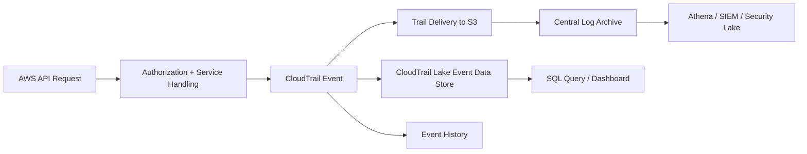
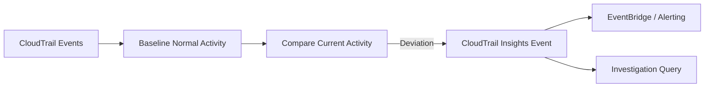
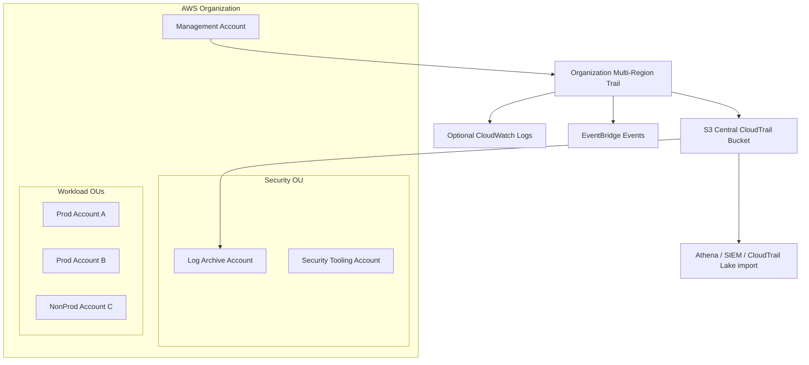
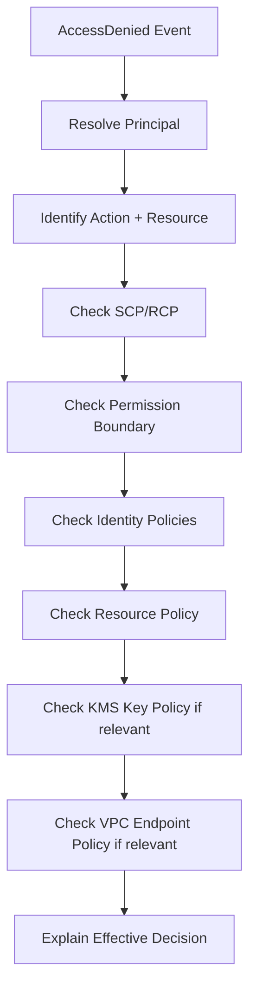
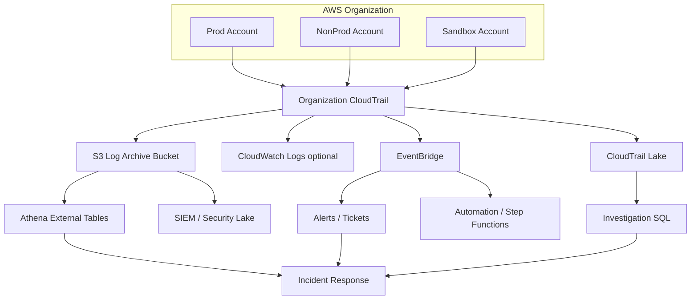

# Part 028 — CloudTrail Deep Dive

CloudTrail adalah salah satu service paling penting di AWS security. Namun banyak engineer hanya mengingat definisi dangkal:

> “CloudTrail logs API calls.”

Definisi itu benar, tetapi tidak cukup.

Cara yang lebih berguna:

> CloudTrail adalah activity ledger untuk AWS control plane dan selected data plane. Ia merekam event yang memungkinkan organisasi membangun governance, compliance, operational audit, security investigation, threat detection, dan forensic reconstruction.

CloudTrail bukan debugger. Bukan SIEM. Bukan full packet capture. Bukan application audit log. Bukan complete state timeline. Ia adalah ledger event AWS API dan service activity.

Part ini membedah CloudTrail dari first principles: event model, trail, organization trail, management events, data events, Insights events, CloudTrail Lake, integrity validation, delivery, query, dan failure mode.

---

## 1. Mental Model: CloudTrail sebagai Ledger, Bukan Log Biasa

CloudTrail event adalah record aktivitas di AWS account. Aktivitas ini bisa berasal dari:

- IAM identity,
- assumed role,
- federated user,
- AWS service,
- external account principal,
- root user,
- workload role,
- automation role.

CloudTrail event biasanya menjawab:

```text
Who called which AWS API, when, from where, against what, and what happened?
```

Namun ada batasan penting:

- Tidak semua service/action punya detail resource lengkap.
- Event tidak dijamin muncul sebagai ordered stack trace global.
- Beberapa operation asynchronous membutuhkan korelasi tambahan.
- Data events harus dipilih secara eksplisit untuk banyak resource type.
- CloudTrail tidak otomatis memberi semantic business meaning.
- CloudTrail tidak menggantikan AWS Config untuk before/after state.

CloudTrail adalah foundation, bukan keseluruhan audit system.



---

## 2. CloudTrail Event Anatomy

CloudTrail event adalah JSON record. Field tertentu sangat penting untuk investigation.

Contoh simplified event:

```json
{
  "eventVersion": "1.08",
  "userIdentity": {
    "type": "AssumedRole",
    "principalId": "AROA...:alice@example.com",
    "arn": "arn:aws:sts::123456789012:assumed-role/ProductionAdmin/alice@example.com",
    "accountId": "123456789012",
    "accessKeyId": "ASIA...",
    "sessionContext": {
      "sessionIssuer": {
        "type": "Role",
        "arn": "arn:aws:iam::123456789012:role/ProductionAdmin",
        "userName": "ProductionAdmin"
      },
      "attributes": {
        "creationDate": "2026-07-06T02:15:00Z",
        "mfaAuthenticated": "true"
      }
    }
  },
  "eventTime": "2026-07-06T02:20:10Z",
  "eventSource": "ec2.amazonaws.com",
  "eventName": "AuthorizeSecurityGroupIngress",
  "awsRegion": "ap-southeast-1",
  "sourceIPAddress": "203.0.113.10",
  "userAgent": "console.amazonaws.com",
  "requestParameters": {},
  "responseElements": {},
  "requestID": "abcd-1234",
  "eventID": "efgh-5678",
  "readOnly": false,
  "resources": [],
  "eventType": "AwsApiCall",
  "managementEvent": true,
  "recipientAccountId": "123456789012"
}
```

### 2.1 `userIdentity`

Ini field paling penting untuk attribution.

Types yang sering muncul:

| Type | Meaning |
|---|---|
| `Root` | Root user account |
| `IAMUser` | Long-lived IAM user |
| `AssumedRole` | STS role session |
| `FederatedUser` | Federated identity |
| `AWSService` | AWS service principal |
| `AWSAccount` | Cross-account principal |
| `Unknown` | Tidak bisa diklasifikasi lengkap |

Untuk production, sebagian besar event seharusnya berasal dari `AssumedRole`, bukan long-lived `IAMUser`.

Red flag:

```text
userIdentity.type = IAMUser
```

Bukan selalu salah, tetapi harus dipertanyakan. Untuk human dan workload modern, temporary credentials lebih defensible.

### 2.2 `sessionContext`

Untuk assumed role, `sessionContext` membantu menjawab:

- role apa yang di-assume,
- kapan sesi dibuat,
- apakah MFA dipakai,
- issuer role,
- session attributes.

Namun CloudTrail tidak selalu memberi identitas manusia ideal jika session naming buruk. Karena itu Part 025 menekankan desain `RoleSessionName`, `SourceIdentity`, dan session tags.

### 2.3 `eventSource` dan `eventName`

Ini pasangan service/action.

Contoh:

```text
eventSource = iam.amazonaws.com
eventName   = AttachRolePolicy
```

Dalam IAM policy language, ini biasanya setara dengan:

```text
iam:AttachRolePolicy
```

Untuk query, pola paling sering:

```sql
WHERE eventSource = 'iam.amazonaws.com'
  AND eventName = 'AttachRolePolicy'
```

### 2.4 `sourceIPAddress`

Field ini berguna, tapi jangan overinterpret.

Bisa berarti:

- public IP user,
- AWS internal service,
- VPC endpoint related source,
- NAT gateway IP,
- proxy/VPN IP,
- AWS service name.

Untuk service-to-service call, source IP tidak selalu merepresentasikan manusia.

### 2.5 `userAgent`

Useful untuk membedakan:

- console,
- AWS CLI,
- SDK,
- Terraform,
- CloudFormation,
- boto3,
- custom automation,
- suspicious tool.

Contoh smells:

```text
userAgent contains "aws-cli" for production admin change without change ticket
userAgent unknown for sensitive data access
```

### 2.6 `requestParameters` dan `responseElements`

Ini memberi detail input/output API. Untuk investigation, ini sering menjadi bagian paling berguna.

Contoh security group change dapat menunjukkan CIDR yang dibuka. IAM event dapat menunjukkan policy ARN yang di-attach.

Tapi hati-hati:

- field bisa kosong,
- sensitive fields bisa redacted,
- schema berbeda antar service,
- nested JSON sering perlu parsing khusus.

### 2.7 `errorCode` dan `errorMessage`

Failed events sangat penting.

Contoh:

```text
errorCode = AccessDenied
```

Ini bisa menunjukkan:

- reconnaissance,
- attempted privilege escalation,
- broken automation,
- missing permission,
- guardrail working correctly,
- attacker testing boundaries.

Jangan hanya query successful events.

### 2.8 `recipientAccountId`

Untuk cross-account scenarios, `recipientAccountId` membantu menentukan account yang menerima request.

Ini penting saat central security account atau external principal melakukan action terhadap resource di member account.

### 2.9 `eventID` dan `requestID`

`eventID` adalah CloudTrail event identifier.

`requestID` bisa membantu korelasi dengan AWS service logs atau support case. Namun jangan anggap semua service memakai request ID dengan pola sama.

---

## 3. Trails, Event History, dan CloudTrail Lake

CloudTrail punya beberapa consumption model.

| Capability | Purpose | Retention/Storage | Typical Use |
|---|---|---|---|
| Event History | Recent management event lookup | AWS-managed limited history | Quick console lookup |
| Trail | Deliver events to S3/CloudWatch Logs/EventBridge | Customer-controlled | Long-term archive, SIEM, compliance |
| Organization Trail | Trail across AWS Organization | Centralized | Multi-account governance |
| CloudTrail Lake | Managed event data store + SQL query | Configurable event data store | Investigation, analytics, dashboards |

### 3.1 Event History

Event History berguna untuk quick lookup, tetapi bukan audit architecture.

Jangan mengandalkan Event History untuk:

- long-term compliance,
- immutable evidence,
- cross-account retention strategy,
- advanced analytics,
- complete data event coverage.

### 3.2 Trail

Trail mengirim event ke S3 bucket. Ini cocok untuk:

- central archive,
- retention panjang,
- Athena query,
- SIEM ingestion,
- log file validation,
- regulatory evidence.

Trail adalah backbone traditional CloudTrail architecture.

### 3.3 Organization Trail

Organization trail memungkinkan logging event untuk semua account dalam AWS Organization.

Ini sangat penting karena account onboarding manual mudah gagal.

Pattern yang direkomendasikan:

```text
Organization multi-region trail -> central S3 bucket in Log Archive account
```

Biasanya dibuat/diatur dari management account atau delegated administration sesuai kemampuan service dan organisasi.

### 3.4 CloudTrail Lake

CloudTrail Lake menyediakan event data store yang bisa di-query dengan SQL. Ia dapat menyimpan CloudTrail events, Config configuration items, Audit Manager evidence, dan event luar AWS tergantung tipe event data store.

CloudTrail Lake berguna ketika:

- security team butuh query cepat tanpa membangun Athena schema manual,
- ingin managed dashboard/query,
- ingin menyimpan event dengan retention tertentu,
- butuh analytics terhadap management/data events.

Namun jangan otomatis mengganti S3 archive dengan Lake. Banyak organisasi tetap mempertahankan S3 archive sebagai immutable/long-term source of record, lalu memakai Lake atau SIEM sebagai query layer.

---

## 4. Management Events

Management events adalah event untuk management/control plane operations.

Contoh:

- `iam:CreateRole`
- `iam:AttachRolePolicy`
- `ec2:RunInstances`
- `ec2:AuthorizeSecurityGroupIngress`
- `s3:CreateBucket`
- `s3:PutBucketPolicy`
- `kms:CreateKey`
- `cloudtrail:StopLogging`
- `organizations:AttachPolicy`

Management events dibagi menjadi:

- read-only,
- write.

### 4.1 Write Management Events

Write events adalah perubahan. Ini mandatory untuk production audit.

Examples:

```text
CreateRole
PutRolePolicy
AttachUserPolicy
AuthorizeSecurityGroupIngress
PutBucketPolicy
ScheduleKeyDeletion
StopLogging
DeleteTrail
```

Untuk detection, write events sangat high-signal.

### 4.2 Read Management Events

Read events adalah query/enumeration.

Examples:

```text
ListRoles
GetBucketPolicy
DescribeInstances
ListAccessKeys
GetCallerIdentity
```

Read events bisa high-volume, tetapi sangat berguna untuk melihat reconnaissance.

Attackers sering melakukan:

```text
sts:GetCallerIdentity
iam:ListRoles
iam:ListPolicies
s3:ListBuckets
ec2:DescribeSecurityGroups
secretsmanager:ListSecrets
```

Jika kamu hanya menyimpan write events, banyak tahap awal attack chain hilang.

### 4.3 Excluding AWS KMS Events

CloudTrail management event untuk KMS bisa sangat banyak di environment tertentu. Beberapa organisasi mengecualikan KMS event dari management events untuk mengurangi noise/cost, tetapi ini harus diputuskan hati-hati.

KMS events sering penting untuk:

- secret/data decrypt investigation,
- unusual key usage,
- cross-account key usage,
- data access correlation.

Rule:

```text
Do not suppress noisy management events until you understand what forensic question you lose.
```

---

## 5. Data Events

Data events merekam operasi data plane terhadap resource tertentu. Secara default, banyak data event tidak otomatis aktif karena volume/cost.

Contoh data event resource types:

- S3 object-level operations,
- Lambda function invocations,
- DynamoDB item-level activity,
- S3 Object Lambda,
- EBS direct APIs,
- Secrets Manager secret access,
- KMS selected usage depending on event category and logging path,
- beberapa resource type lain yang didukung CloudTrail.

CloudTrail documentation terus berkembang untuk supported data event resource types. Jangan menghafal list statis. Gunakan dokumentasi terbaru saat mendesain coverage.

### 5.1 S3 Data Events

Untuk S3, management event seperti `PutBucketPolicy` tidak sama dengan object access event seperti `GetObject`.

Jika bucket menyimpan sensitive data, kamu biasanya butuh data events untuk prefix/bucket tertentu.

Query questions:

```text
Who read object X?
Who deleted objects under prefix Y?
Was access through expected role?
Was access through expected VPC endpoint?
Was access during approved job window?
```

### 5.2 Lambda Data Events

Lambda Invoke bisa menjadi data event. Ini berguna ketika function adalah boundary penting, misalnya:

- function memproses regulated workflow,
- function dapat melakukan privileged action,
- function dipanggil cross-account,
- function menjadi automation remediation path.

### 5.3 DynamoDB Data Events

DynamoDB item-level activity bisa sangat high-volume. Aktifkan berdasarkan risk:

- regulated tables,
- admin tables,
- tenant authorization tables,
- decision/evidence tables,
- critical workflow state tables.

### 5.4 Secrets Manager Data Events

Secret read access adalah high-value evidence.

Pertanyaan penting:

```text
Who called GetSecretValue?
Was it expected workload role?
Was it from expected account/region?
Did access spike unexpectedly?
Was secret rotation event correlated?
```

Untuk secret, data access event sering lebih penting daripada secret value itself. Jangan log secret content.

---

## 6. Insights Events

CloudTrail Insights mendeteksi unusual activity berdasarkan API call rate atau API error rate terhadap baseline.

Use cases:

- sudden spike in API calls,
- unusual error rate,
- unexpected volume of data API calls,
- potentially compromised automation,
- runaway deployment script,
- suspicious enumeration.

Namun Insights bukan pengganti GuardDuty, Security Hub, atau custom detection. Ia adalah anomaly signal pada CloudTrail activity.



Failure mode:

- baseline belum matang,
- noisy environment,
- legitimate batch job dianggap unusual,
- low-and-slow attack tidak terlihat,
- tidak ada triage lifecycle.

Gunakan Insights sebagai signal, bukan verdict.

---

## 7. Advanced Event Selectors

Advanced event selectors memungkinkan filtering event lebih presisi.

Kenapa penting?

Karena data events bisa mahal dan berisik. Kita butuh memilih resource/action yang relevan.

Contoh strategy:

```text
Enable S3 data events for:
- regulated bucket prefixes
- log archive bucket write/delete attempts
- evidence bucket reads
- backup vault related access

Do not enable all object events for all ephemeral buckets without cost model.
```

Selector design harus mengikuti:

- data classification,
- resource owner,
- threat model,
- cost estimate,
- investigation needs,
- compliance requirements.

---

## 8. Organization CloudTrail Design

Untuk multi-account AWS, baseline desain CloudTrail:



Key decisions:

1. Who owns the trail?
2. Which account owns destination bucket?
3. Which KMS key encrypts logs?
4. Who can read logs?
5. Who can modify trail?
6. Who can delete logs?
7. What regions are covered?
8. Which data events are included?
9. How is delivery failure detected?
10. How are new accounts enrolled?

### 8.1 Multi-Region Trail

Prefer multi-region organization trail for management events.

Reason:

- region misuse is common blind spot,
- attackers can create resources in unused region,
- IAM/global service events need consistent capture model,
- operations need one baseline, not per-account improvisation.

### 8.2 Single-Region Trail Exceptions

Single-region trails may be used for specialized data event capture or local compliance requirement, but should not replace organization-wide multi-region management trail.

### 8.3 Central Destination

Destination should be in Log Archive account, not a workload account.

Access model:

| Role | Permission |
|---|---|
| CloudTrail service | write log objects |
| Log archive admin | manage storage infrastructure, tightly controlled |
| Security analyst | read/query allowed logs |
| Workload team | read subset/derived logs if needed |
| Workload admin | no delete/retention modification |
| Break-glass | emergency read/admin with approval |

---

## 9. CloudTrail to CloudWatch Logs

CloudTrail can deliver events to CloudWatch Logs. Ini berguna untuk near-real-time metric filters dan alarms.

Use cases:

- root usage alarm,
- CloudTrail stopped alarm,
- IAM policy change alarm,
- security group open alarm,
- KMS key deletion alarm,
- failed console login alarm,
- Organizations policy change alarm.

Namun CloudWatch Logs bukan pengganti S3 archive.

Pattern:

```text
CloudTrail -> S3 for durable archive
CloudTrail -> CloudWatch Logs/EventBridge for alerting
CloudTrail -> Lake/SIEM for investigation
```

---

## 10. CloudTrail and EventBridge

CloudTrail events can appear through EventBridge for event-driven response. EventBridge is useful for routing security-relevant actions to automation.

Example patterns:

```json
{
  "source": ["aws.cloudtrail"],
  "detail-type": ["AWS API Call via CloudTrail"],
  "detail": {
    "eventSource": ["cloudtrail.amazonaws.com"],
    "eventName": ["StopLogging", "DeleteTrail"]
  }
}
```

Use cases:

- alert on CloudTrail tampering,
- auto-remediate public exposure,
- notify on root usage,
- create ticket on IAM admin policy attach,
- quarantine suspicious EC2 instance,
- preserve evidence on high-severity finding.

Caution:

- EventBridge is response path, not evidence archive.
- Automation must be idempotent.
- Avoid destructive remediation without guardrails.
- Route to human approval for high-risk changes.

---

## 11. CloudTrail Log File Integrity Validation

CloudTrail log file validation helps determine whether a log file was modified, deleted, or unchanged after delivery.

It works through digest files and cryptographic validation.

This matters because audit evidence needs integrity.

Threats:

- attacker modifies log object,
- attacker deletes selected log files,
- attacker injects fake log object,
- accidental lifecycle deletion,
- compromised admin changes archive.

Controls:

- enable log file validation,
- store in separate log archive account,
- protect S3 bucket policy,
- use versioning/object lock if needed,
- restrict KMS key admin,
- alert on delete/mutation attempts,
- periodically validate digest chain for high-assurance environments.

Integrity validation is not a substitute for access control. It helps detect tampering; it does not by itself prevent all tampering.

---

## 12. CloudTrail Security Controls

Baseline controls:

### 12.1 Prevent CloudTrail Disablement

SCP example intent:

```text
Deny cloudtrail:StopLogging
Deny cloudtrail:DeleteTrail
Deny cloudtrail:UpdateTrail except approved security roles
Deny cloudtrail:PutEventSelectors except approved security roles
```

### 12.2 Protect Destination Bucket

Bucket policy should:

- allow CloudTrail service to write with required conditions,
- deny non-secure transport,
- deny delete except break-glass or lifecycle role,
- restrict read to security/audit roles,
- require expected source account/org where possible,
- enforce encryption.

### 12.3 Protect KMS Key

KMS key policy should separate:

- key administration,
- key usage by CloudTrail/logging service,
- decrypt/read roles,
- break-glass.

Do not give broad `kms:*` to workload admins on log archive keys.

### 12.4 Monitor CloudTrail Health

Alerts:

- `StopLogging`,
- `DeleteTrail`,
- `UpdateTrail`,
- `PutEventSelectors`,
- failed delivery,
- destination bucket policy change,
- KMS key disabled/scheduled deletion,
- lifecycle policy changed,
- object delete attempts.

---

## 13. Query Patterns

CloudTrail query skill is fundamental. Tool may vary: CloudTrail Lake SQL, Athena, SIEM, OpenSearch. Patterns remain similar.

### 13.1 Root Usage

Intent:

```sql
SELECT eventTime, eventSource, eventName, sourceIPAddress, userAgent
FROM cloudtrail
WHERE userIdentity.type = 'Root'
ORDER BY eventTime DESC;
```

Root usage should be rare and explainable.

### 13.2 IAM Privilege Escalation Surface

High-risk IAM actions:

```text
CreateUser
CreateAccessKey
AttachUserPolicy
AttachRolePolicy
PutUserPolicy
PutRolePolicy
CreatePolicyVersion
SetDefaultPolicyVersion
UpdateAssumeRolePolicy
PassRole
CreateLoginProfile
AddUserToGroup
```

Query intent:

```sql
WHERE eventSource = 'iam.amazonaws.com'
  AND eventName IN (...high risk actions...)
```

### 13.3 CloudTrail Tampering

```sql
WHERE eventSource = 'cloudtrail.amazonaws.com'
  AND eventName IN ('StopLogging','DeleteTrail','UpdateTrail','PutEventSelectors')
```

Any hit should be investigated.

### 13.4 Security Group Exposure

```sql
WHERE eventSource = 'ec2.amazonaws.com'
  AND eventName IN ('AuthorizeSecurityGroupIngress', 'RevokeSecurityGroupIngress')
```

Then parse `requestParameters` for CIDR, ports, group ID.

### 13.5 KMS Key Risk

```sql
WHERE eventSource = 'kms.amazonaws.com'
  AND eventName IN ('DisableKey','ScheduleKeyDeletion','PutKeyPolicy','CreateGrant')
```

KMS changes can affect data recovery and confidentiality.

### 13.6 S3 Public Exposure

```sql
WHERE eventSource = 's3.amazonaws.com'
  AND eventName IN ('PutBucketPolicy','PutBucketAcl','PutPublicAccessBlock','DeletePublicAccessBlock')
```

Must correlate with Config/Macie/Security Hub for severity.

### 13.7 STS Role Assumption

```sql
WHERE eventSource = 'sts.amazonaws.com'
  AND eventName = 'AssumeRole'
```

Useful to reconstruct session chains and cross-account access.

---

## 14. CloudTrail for Detection Engineering

CloudTrail is a primary signal source for detection.

Detection examples:

| Detection | Signal |
|---|---|
| Root user activity | `userIdentity.type = Root` |
| New access key created | `iam:CreateAccessKey` |
| Admin policy attached | `iam:Attach*Policy` with admin policy |
| Trail stopped | `cloudtrail:StopLogging` |
| GuardDuty disabled | `guardduty:DeleteDetector` / disable operations |
| Public S3 exposure | `s3:PutBucketPolicy` / ACL changes |
| KMS key deletion | `kms:ScheduleKeyDeletion` |
| Unusual region usage | events in disallowed regions |
| Cross-account assume role | STS AssumeRole with external account |
| Console login failure spike | signin events / failed auth events |

Detection design should include:

```text
signal -> context -> severity -> owner -> response -> evidence -> tuning
```

Avoid alerting on raw event without context. Example: `AttachRolePolicy` in sandbox by pipeline may be low severity; same action in prod by human at 2 AM may be high severity.

---

## 15. CloudTrail and IAM Investigation

When debugging `AccessDenied`, CloudTrail helps but is not complete.

CloudTrail can show:

- caller,
- API,
- error code,
- request parameters,
- source IP,
- session context.

It does not fully compute for you:

- which policy denied,
- whether SCP denied,
- whether permission boundary blocked,
- whether resource policy missing,
- whether KMS key policy denied,
- whether VPC endpoint policy denied.

Use CloudTrail as observed behavior, then reconstruct IAM evaluation.

Investigation flow:



---

## 16. CloudTrail Cost and Volume Strategy

CloudTrail cost concerns usually come from:

- data events,
- CloudTrail Lake ingestion/retention/query,
- S3 storage,
- SIEM ingestion,
- CloudWatch Logs ingestion,
- Athena query scan volume.

Do not solve cost by disabling evidence blindly.

Better levers:

1. classify data/resources,
2. use advanced event selectors,
3. separate hot/warm/cold retention,
4. compress/partition S3 layout,
5. avoid sending all raw logs to expensive SIEM if not needed,
6. send high-signal detections to SIEM, keep raw archive in S3,
7. use lifecycle policies,
8. sample only non-audit operational logs, not required audit evidence,
9. build query tables with partitions,
10. review noisy service events with risk acceptance.

Cost principle:

```text
The cost of logging must be compared to the cost of not being able to prove what happened.
```

---

## 17. Common CloudTrail Failure Modes

### 17.1 Trail Exists but Is Single-Region

Blind spot in other regions.

### 17.2 Organization Trail Missing New Accounts

Account vending process does not verify enrollment.

### 17.3 Data Events Not Enabled for Sensitive Buckets

You can prove bucket policy changed, but not who read the object.

### 17.4 Logs Delivered but Nobody Can Query Them

Archive without query layer creates slow incident response.

### 17.5 Logs Queryable but Not Immutable

Good for debugging, weak for audit.

### 17.6 CloudTrail Events Not Correlated With Config

You know API was called, but not durable resource state impact.

### 17.7 CloudTrail Suppressed Due to Noise

Important forensic signals lost because nobody did classification.

### 17.8 Session Names Are Meaningless

Every event says:

```text
assumed-role/Admin/session
```

but no one knows which human or automation created the session.

### 17.9 No Alerts on CloudTrail Modification

Attacker disables logging and no one notices.

### 17.10 No Periodic Drill

Team discovers during incident that query path, permissions, or retention do not work.

---

## 18. Production Baseline

A defensible CloudTrail baseline:

```text
1. Organization-level multi-region trail for management events.
2. Central S3 delivery into Log Archive account.
3. Log file integrity validation enabled.
4. Destination bucket protected by restrictive bucket policy and KMS key policy.
5. CloudTrail modification actions protected by SCP and monitored.
6. Read and write management events enabled unless explicitly risk-accepted.
7. Data event strategy for sensitive S3, Secrets Manager, Lambda, DynamoDB, and other critical resources.
8. CloudTrail events routed to alerting/detection path for high-risk actions.
9. Query layer exists for investigation.
10. CloudTrail coverage included in account vending and drift detection.
```

---

## 19. Example Architecture: S3 Archive + Lake + EventBridge



Why this is strong:

- S3 is durable source of record.
- Lake provides fast managed investigation.
- EventBridge supports near-real-time response.
- SIEM receives relevant data.
- Archive is independent from workload accounts.

---

## 20. CloudTrail Runbook: Suspicious IAM Policy Attachment

Trigger:

```text
iam:AttachRolePolicy or iam:PutRolePolicy on production role
```

Steps:

1. Query CloudTrail for the event.
2. Resolve principal, session, source IP, user agent.
3. Identify target role and policy ARN/document.
4. Check if change came from pipeline or human.
5. Find change ticket/deployment ID.
6. Query Config/IaC history for before/after.
7. Assess whether policy grants admin, passrole, iam mutation, kms decrypt, s3 sensitive access.
8. Check subsequent actions by same principal/session.
9. If unauthorized, detach policy or isolate role.
10. Preserve CloudTrail event, IAM policy snapshot, Config item, ticket/chat context.
11. Open RCA: why guardrail allowed it?

Closure criteria:

```text
Actor identified, authorization path understood, policy impact assessed, remediation complete, evidence preserved, control improvement tracked.
```

---

## 21. CloudTrail Design Review Questions

Ask these before production sign-off:

1. Are all production accounts covered by organization trail?
2. Are all enabled/allowed regions covered?
3. Are management read and write events captured?
4. Which data event resources are captured, and why?
5. Which sensitive resources are not captured, and who accepted the risk?
6. Can workload admins delete or modify CloudTrail logs?
7. Is log file validation enabled?
8. Is the destination bucket protected from deletion and policy tampering?
9. Are CloudTrail control changes alerted?
10. Can security team query events within incident response time targets?
11. Can service owners access relevant evidence without archive mutation rights?
12. Are event selectors managed as code?
13. Is CloudTrail coverage tested when a new account is created?
14. Is there a runbook for CloudTrail delivery failure?
15. Are CloudTrail costs reviewed without sacrificing critical evidence?

---

## 22. Key Takeaways

CloudTrail is the AWS activity ledger.

Use it to answer:

```text
Who did what, when, from where, against which AWS resource, and what happened?
```

But design it carefully:

- organization-wide,
- multi-region,
- centralized,
- protected,
- queryable,
- correlated,
- cost-aware,
- data-classification driven,
- guarded against tampering,
- wired into detection and response.

The biggest CloudTrail mistake is not forgetting to enable it. The bigger mistake is enabling it but failing to turn it into a defensible evidence system.

---

## References

- AWS CloudTrail User Guide — https://docs.aws.amazon.com/awscloudtrail/latest/userguide/cloudtrail-user-guide.html
- CloudTrail concepts — https://docs.aws.amazon.com/awscloudtrail/latest/userguide/cloudtrail-concepts.html
- Working with CloudTrail trails — https://docs.aws.amazon.com/awscloudtrail/latest/userguide/cloudtrail-trails.html
- Creating a trail for an organization — https://docs.aws.amazon.com/awscloudtrail/latest/userguide/creating-trail-organization.html
- Receiving CloudTrail log files from multiple Regions — https://docs.aws.amazon.com/awscloudtrail/latest/userguide/receive-cloudtrail-log-files-from-multiple-regions.html
- Logging management events — https://docs.aws.amazon.com/awscloudtrail/latest/userguide/logging-management-events-with-cloudtrail.html
- Logging data events — https://docs.aws.amazon.com/awscloudtrail/latest/userguide/logging-data-events-with-cloudtrail.html
- Working with CloudTrail Insights — https://docs.aws.amazon.com/awscloudtrail/latest/userguide/logging-insights-events-with-cloudtrail.html
- CloudTrail Lake event data stores — https://docs.aws.amazon.com/awscloudtrail/latest/userguide/query-event-data-store.html
- CloudTrail Lake concepts — https://docs.aws.amazon.com/awscloudtrail/latest/userguide/cloudtrail-lake-concepts.html
- CloudTrail log file validation — https://docs.aws.amazon.com/awscloudtrail/latest/userguide/cloudtrail-log-file-validation-intro.html
- AWS Security Reference Architecture: Security Tooling account — https://docs.aws.amazon.com/prescriptive-guidance/latest/security-reference-architecture/security-tooling.html
