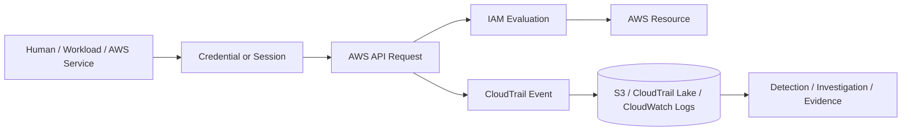
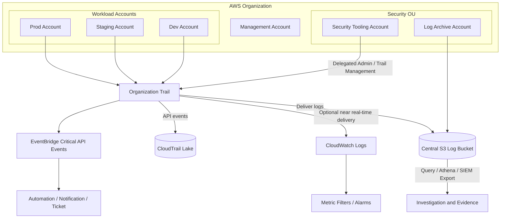
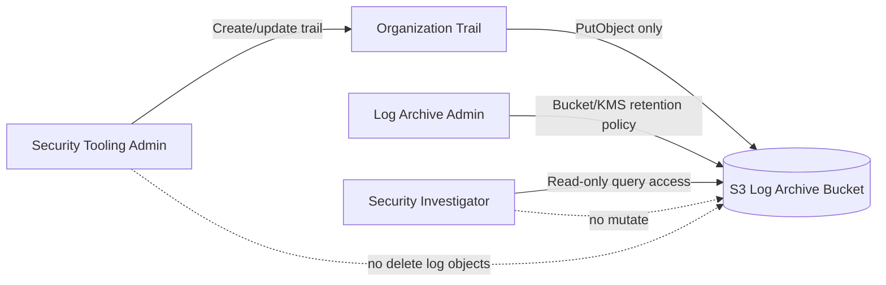
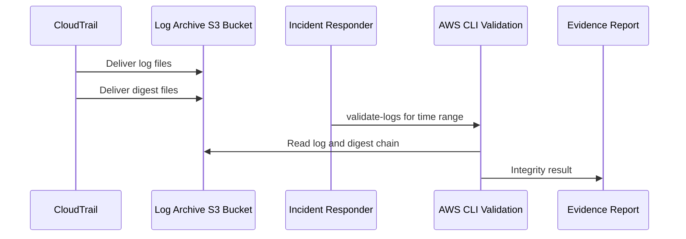
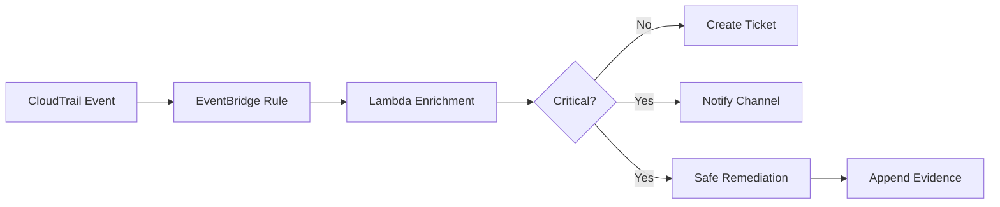

# Part 029 — CloudTrail Design Patterns

CloudTrail sering diperlakukan sebagai checkbox: “sudah enable trail”. Itu terlalu dangkal.

Di production-grade AWS environment, CloudTrail adalah **audit event backbone**. Hampir semua pertanyaan security dan compliance akan kembali ke CloudTrail:

- siapa melakukan perubahan?
- principal apa yang digunakan?
- role itu diasumsikan dari mana?
- resource apa yang disentuh?
- API call berhasil atau gagal?
- perubahan terjadi di region mana?
- apakah request datang dari console, CLI, SDK, AWS service, atau automation?
- apakah log bisa dipercaya setelah incident?
- apakah attacker bisa mematikan audit sebelum bergerak lebih jauh?

CloudTrail design yang buruk tidak selalu terlihat saat sistem normal. Ia baru terlihat saat incident, audit, dispute, atau postmortem. Pada saat itu, kekurangan audit biasanya sudah terlambat untuk diperbaiki.

Tujuan part ini adalah membangun desain CloudTrail yang **auditable, centralized, tamper-resistant, scalable, cost-aware, dan operationally useful**.

---

## 1. Mental Model: CloudTrail Adalah Event Ledger untuk AWS API

CloudTrail mencatat aktivitas yang terjadi melalui AWS API. Ini termasuk aktivitas dari AWS Management Console, AWS CLI, SDK, automation, service-linked role, dan beberapa aktivitas yang dilakukan AWS service atas nama principal.

Model dasarnya:



Hal penting: CloudTrail bukan hanya menyimpan “result”. Ia menyimpan **konteks keputusan**:

- `eventTime`
- `eventSource`
- `eventName`
- `awsRegion`
- `sourceIPAddress`
- `userAgent`
- `userIdentity`
- `requestParameters`
- `responseElements`
- `errorCode`
- `errorMessage`
- `recipientAccountId`
- `resources`

Artinya CloudTrail adalah salah satu sumber utama untuk membangun timeline.

Namun CloudTrail bukan sistem tracing aplikasi. CloudTrail tidak menggantikan application logs, distributed tracing, access logs, database audit logs, atau SIEM. CloudTrail hanya menjawab bagian penting: **apa yang terjadi pada AWS control/API layer**.

---

## 2. Design Invariants

Sebelum bicara pattern, definisikan invariant. Tanpa invariant, CloudTrail design akan berubah menjadi kumpulan setting.

Invariant minimum untuk AWS environment serius:

1. **Semua account harus punya management event logging.**
2. **CloudTrail harus multi-region kecuali ada alasan eksplisit yang terdokumentasi.**
3. **CloudTrail log harus dikirim ke account terpisah dari workload account.**
4. **Workload account tidak boleh bisa menghapus atau mengubah log archive.**
5. **Security tooling boleh mengelola trail, tetapi tidak boleh menjadi satu-satunya penjaga log.**
6. **Log integrity validation harus aktif.**
7. **CloudTrail bucket harus terenkripsi dan memiliki bucket policy least privilege.**
8. **Perubahan terhadap CloudTrail, S3 log bucket, KMS key, AWS Config, GuardDuty, Security Hub, dan IAM harus menghasilkan alert.**
9. **Data events harus diaktifkan berdasarkan risk tier, bukan asal enable semua.**
10. **Setiap exception harus punya owner, expiry, justification, dan compensating control.**

Invariant ini lebih penting daripada tool tertentu. Tool bisa berubah; invariant harus stabil.

---

## 3. Baseline Architecture

Desain minimal yang sehat untuk AWS Organization:



Key separation:

- **Management account**: organization control, not daily security operations.
- **Security Tooling account**: manages security services and delegated admin where possible.
- **Log Archive account**: owns immutable log storage.
- **Workload accounts**: produce events, but should not control central evidence.

This separation matters because the first thing a capable attacker wants after privilege escalation is to reduce visibility.

---

## 4. Pattern 1 — Use an Organization Trail as the Default Audit Spine

For multi-account AWS, individual per-account trails are operationally fragile. They drift. They are forgotten. New accounts get missed. Security posture becomes dependent on local account owners.

Use an **organization trail** as the default spine.

### Why

An organization trail allows CloudTrail to capture events across member accounts in an AWS Organization and deliver them to a central destination. This gives you a single baseline for governance, compliance, and investigation.

### Recommended posture

| Decision | Recommendation |
|---|---|
| Trail scope | Organization trail |
| Region mode | Multi-region |
| Management events | Read and write management events enabled |
| Global service events | Included where applicable |
| Log file validation | Enabled |
| S3 destination | Central bucket in Log Archive account |
| KMS | Customer managed key with carefully scoped key policy |
| CloudWatch Logs | Use for selected real-time monitoring, not as sole archive |
| EventBridge | Use for high-signal API events |

### Anti-pattern

```text
Each workload team creates its own trail in its own account and stores logs in the same account.
```

This fails three ways:

1. A compromised account can often tamper with its own logging resources.
2. Coverage drifts when new accounts or regions are added.
3. Investigation requires manual collection from many accounts.

---

## 5. Pattern 2 — Separate Trail Administration from Log Custody

A mature design separates two powers:

1. **Who can configure CloudTrail?**
2. **Who controls the archive that stores delivered logs?**

If the same role can disable CloudTrail and delete historical logs, the evidence chain is weak.

Better model:



This creates separation of duty:

- CloudTrail operators cannot silently rewrite log history.
- Log archive administrators cannot silently change trail coverage without detection.
- Investigators can read evidence without being able to mutate it.

---

## 6. Pattern 3 — Multi-Region Trail by Default

A single-region trail only records activity in one region. That is dangerous because attackers and accidental misconfiguration do not respect your intended region map.

A multi-region trail helps capture activity across enabled AWS regions and reduces blind spots caused by:

- someone creating resources in an unused region;
- credentials being abused from a different region;
- global service activity;
- region expansion not being reflected in audit design;
- temporary incident response actions performed outside normal deployment region.

### Guardrail

Use SCP or Control Tower controls to deny unauthorized region usage, but do not rely on region restriction as your only defense. You still want audit visibility into attempted or exceptional region activity.

### Useful invariant

```text
Every enabled AWS region must either be logged or explicitly forbidden.
```

The worst state is neither logged nor forbidden.

---

## 7. Pattern 4 — Treat Management Events as Mandatory

Management events represent control-plane operations such as creating resources, changing IAM policies, modifying security groups, deleting trails, updating buckets, changing KMS keys, and assuming roles.

Management events are the baseline for:

- change attribution;
- privilege escalation investigation;
- detection engineering;
- unauthorized configuration changes;
- audit evidence;
- post-incident reconstruction.

### Recommendation

Enable both read and write management events for your organization trail unless you have a clearly documented reason to filter read events.

Write-only management events reduce volume, but read events often matter during investigation. For example, discovery activity before an attack can show up as read/list/describe calls.

### Risk trade-off

| Option | Benefit | Risk |
|---|---|---|
| Write events only | Lower volume | Loses reconnaissance visibility |
| Read + write events | Better forensic context | Higher volume |
| No management events | Cheaper | Not acceptable for serious environment |

---

## 8. Pattern 5 — Data Events by Risk Tier

CloudTrail data events record resource-level operations for supported services. They are often high-volume and can become expensive if enabled everywhere without design.

Examples include object-level S3 access and Lambda function invocations.

The right model is **risk-tiered data event logging**.

### Tiering model

| Tier | Example | Data Event Strategy |
|---|---|---|
| Tier 0 | Security logs, audit evidence, KMS-adjacent critical buckets | Enable data events broadly |
| Tier 1 | Regulated or sensitive data buckets | Enable read/write data events |
| Tier 2 | Important business data | Enable write events and selected read events |
| Tier 3 | Low-risk ephemeral data | Usually disabled unless investigation needs it |
| Tier 4 | High-volume generated artifacts | Avoid broad logging; use service/application logs instead |

### Decision questions

Before enabling data events, ask:

1. Is this resource sensitive enough that object-level access needs evidence?
2. Can we afford the volume?
3. Will the events be queried or just stored forever?
4. What detection rules depend on them?
5. Who owns reviewing findings from these events?
6. How long must the evidence be retained?

### Common mistake

```text
Enable all S3 data events for every bucket in every account.
```

This can create high cost and noisy evidence without improving detection. A better approach is to classify buckets and enable data events where object-level access matters.

---

## 9. Pattern 6 — Use Advanced Event Selectors Intentionally

Advanced event selectors let you narrow CloudTrail event capture more precisely than coarse selectors.

Use them to define data event policies like:

- log only specific S3 bucket ARNs;
- log only write operations for lower-risk buckets;
- include read/write for regulated buckets;
- log Lambda invoke events only for sensitive functions;
- exclude known noisy paths where another evidence source is authoritative.

### Design rule

Do not let event selectors become invisible tribal knowledge. Store selector intent near the IaC configuration.

Example documentation next to selector:

```text
Reason: Enable S3 object-level read/write data events for customer-document-prod buckets.
Control: Detect unusual object access and support regulatory evidence.
Owner: Security Engineering + Data Platform.
Review: Quarterly or when bucket classification changes.
```

---

## 10. Pattern 7 — Protect the Trail from Being Disabled

CloudTrail itself is a high-value target.

Sensitive operations include:

- `cloudtrail:StopLogging`
- `cloudtrail:DeleteTrail`
- `cloudtrail:UpdateTrail`
- `cloudtrail:PutEventSelectors`
- `cloudtrail:PutInsightSelectors`
- `cloudtrail:RemoveTags`
- `s3:DeleteBucketPolicy` on log buckets
- `s3:PutBucketPolicy` on log buckets
- `kms:DisableKey` for log encryption key
- `kms:ScheduleKeyDeletion`

### Preventive controls

Use SCPs to deny dangerous CloudTrail mutations outside approved admin roles.

Example conceptual SCP fragment:

```json
{
  "Version": "2012-10-17",
  "Statement": [
    {
      "Sid": "DenyCloudTrailTamperingExceptSecurityAdmin",
      "Effect": "Deny",
      "Action": [
        "cloudtrail:StopLogging",
        "cloudtrail:DeleteTrail",
        "cloudtrail:UpdateTrail",
        "cloudtrail:PutEventSelectors",
        "cloudtrail:PutInsightSelectors"
      ],
      "Resource": "*",
      "Condition": {
        "StringNotLike": {
          "aws:PrincipalArn": "arn:aws:iam::*:role/security-cloudtrail-admin"
        }
      }
    }
  ]
}
```

This is illustrative. Production policies must account for AWSReservedSSO role names, break-glass roles, automation roles, and service-linked roles.

### Detective controls

Create alerts for attempted or successful tampering:

- CloudTrail stopped;
- trail deleted;
- event selectors changed;
- log bucket policy changed;
- log bucket lifecycle changed;
- KMS key disabled;
- KMS key scheduled for deletion;
- CloudWatch log group retention changed;
- Config recorder stopped.

---

## 11. Pattern 8 — Enable Log File Integrity Validation

CloudTrail log file integrity validation creates digest files that help determine whether log files were modified, deleted, or unchanged after CloudTrail delivered them.

Important nuance:

```text
Enabling validation does not automatically validate logs continuously.
It makes validation possible by delivering digest files.
```

You still need a runbook or automated validation process when evidence integrity matters.

### When to validate

- before handing logs to auditors;
- during security incident investigation;
- after suspected log tampering;
- during periodic control testing;
- before legal or regulatory evidence export.

### Operational pattern



---

## 12. Pattern 9 — Encrypt CloudTrail Logs With a Customer Managed KMS Key

S3 server-side encryption is necessary but not sufficient as an access governance design. For central audit logs, prefer a customer managed KMS key because key policy, grants, and CloudTrail usage can be explicitly controlled and audited.

### Key policy concerns

The KMS key must allow CloudTrail to encrypt logs, while not giving broad decrypt capability to workload teams.

Think in roles:

| Actor | Needed KMS Capability |
|---|---|
| CloudTrail service | Encrypt / GenerateDataKey for log delivery |
| Log archive admin | Key administration, not broad evidence read by default |
| Security investigator | Decrypt for investigation |
| SIEM export role | Decrypt only for export pipeline |
| Workload account admin | No decrypt access to central logs |

### Failure mode

If the KMS key policy is wrong, CloudTrail delivery can fail or investigators cannot decrypt logs during an incident.

Key policy must be tested as part of account baseline validation.

---

## 13. Pattern 10 — Use S3 as Immutable Archive, Not CloudWatch Logs Alone

CloudWatch Logs is useful for near-real-time monitoring and query, but S3 is the primary durable archive for CloudTrail trails.

Do not design CloudTrail evidence around only CloudWatch Logs.

### Why S3 archive matters

- long-term retention;
- lifecycle policies;
- Object Lock/WORM options;
- cross-account evidence boundary;
- Athena/S3 query lake integration;
- lower long-term storage cost;
- integration with backup and compliance controls;
- independent evidence custody.

### CloudWatch Logs is still useful for

- metric filters;
- alarms;
- short-term operational search;
- alerting on critical API calls;
- feeding subscription filters;
- rapid detection routing.

Use both, but with different jobs.

---

## 14. Pattern 11 — EventBridge for High-Signal Operational Events

CloudTrail events can be routed through EventBridge for reactive workflows.

Good candidates:

- root user activity;
- console login without MFA;
- CloudTrail stopped or updated;
- GuardDuty disabled;
- Security Hub disabled;
- Config recorder stopped;
- IAM policy attached to admin-like role;
- access key created for privileged user;
- S3 bucket policy made public;
- KMS key disabled;
- security group opened to the internet;
- VPC flow logs disabled;
- backup vault lock changed.

### Event-driven response model



### Warning

Do not auto-remediate every CloudTrail event. Some actions are legitimate and critical. Start with notify-only mode, measure false positives, then introduce limited automatic remediation for well-understood cases.

---

## 15. Pattern 12 — CloudTrail Lake for Investigation Workflows

CloudTrail Lake is useful when investigators need SQL-like queries over CloudTrail events without building a full Athena/S3 pipeline themselves.

Use it for:

- incident timeline reconstruction;
- principal activity review;
- cross-account API investigation;
- suspicious source IP analysis;
- change history around a resource;
- forensic search during audit.

### When not to rely only on CloudTrail Lake

CloudTrail Lake is not a replacement for immutable S3 archive. Treat it as a query/investigation layer, not the only evidence store.

Recommended model:

```text
S3 log archive = durable evidence system of record
CloudTrail Lake = investigation/query acceleration layer
CloudWatch Logs = monitoring and short-term operational query layer
SIEM = correlation and detection layer
```

---

## 16. Pattern 13 — Normalize Naming and Prefix Strategy

Centralized CloudTrail logs can become difficult to query if naming is inconsistent.

Use predictable bucket/prefix patterns.

Example:

```text
s3://org-log-archive-cloudtrail-<org-id>/<optional-prefix>/AWSLogs/<account-id>/CloudTrail/<region>/<yyyy>/<mm>/<dd>/...
```

Add metadata externally because S3 object paths alone are not enough:

- account ID → account name;
- account ID → OU;
- account ID → environment;
- account ID → workload owner;
- region → allowed/denied status;
- bucket/resource → data classification;
- principal ARN → owner/team.

CloudTrail event data becomes far more useful when joined with account registry and ownership data.

---

## 17. Pattern 14 — Build Audit Queries as Product Artifacts

A top-tier team does not wait until an incident to invent CloudTrail queries.

Maintain a query cookbook.

### Example query intents

| Query | Purpose |
|---|---|
| Root user activity | Detect root usage outside break-glass |
| `AssumeRole` by source IP | Identify unusual role assumption source |
| Failed authorization spikes | Detect probing or broken automation |
| IAM policy changes | Track privilege changes |
| Security group ingress changes | Detect exposure changes |
| CloudTrail mutation | Detect audit tampering |
| KMS key disable/delete | Detect encryption control tampering |
| S3 public policy changes | Detect data exposure risk |
| Access key creation | Detect long-lived credential creation |
| Console login failures | Detect human account attack |

### Example CloudTrail Lake style query

```sql
SELECT
  eventTime,
  recipientAccountId,
  awsRegion,
  eventSource,
  eventName,
  userIdentity.type,
  userIdentity.arn,
  sourceIPAddress,
  userAgent,
  errorCode
FROM $EDS_ID
WHERE eventTime > '2026-07-06 00:00:00'
  AND eventSource = 'iam.amazonaws.com'
  AND eventName IN (
    'CreatePolicyVersion',
    'AttachRolePolicy',
    'PutRolePolicy',
    'CreateAccessKey',
    'UpdateAssumeRolePolicy'
  )
ORDER BY eventTime DESC;
```

Do not rely on memory. Put queries in version control.

---

## 18. Pattern 15 — Alert on Absence, Not Just Bad Events

Many systems only alert when a bad event appears. For CloudTrail, also alert when expected evidence disappears.

Examples:

- no CloudTrail delivery to S3 for a region/account within expected interval;
- CloudTrail log bucket object count drops unexpectedly;
- CloudWatch Logs ingestion stops;
- EventBridge rule stops matching known heartbeat events;
- Config shows trail not logging;
- Security Hub control fails for CloudTrail requirements.

This is important because the absence of evidence can mean:

- service delivery failure;
- misconfiguration;
- account not enrolled;
- region newly enabled but not covered;
- attacker tampering;
- KMS/bucket policy issue.

---

## 19. Pattern 16 — Treat CloudTrail Cost as a Design Constraint

Cost should not drive you to disable audit. But ignoring cost creates pressure to disable audit later.

Cost drivers include:

- number of accounts;
- number of enabled regions;
- data events volume;
- CloudWatch Logs ingestion;
- CloudTrail Lake retention/query;
- SIEM ingestion;
- S3 storage and lifecycle;
- Athena query volume;
- replication/export pipeline.

### Cost-aware design principles

1. Keep management events broad.
2. Use data event tiering.
3. Use selectors to reduce noise.
4. Separate archive retention from hot query retention.
5. Use lifecycle policies for older logs where compliance allows.
6. Route only high-signal events to high-cost SIEM pipelines.
7. Store raw evidence durably even if derived indexes are shorter-lived.

---

## 20. Example Terraform Skeleton

This is not complete production Terraform. It shows structure.

```hcl
resource "aws_cloudtrail" "organization" {
  name                          = "org-management-events"
  s3_bucket_name                = aws_s3_bucket.cloudtrail_logs.id
  s3_key_prefix                 = "cloudtrail"
  is_organization_trail         = true
  is_multi_region_trail         = true
  include_global_service_events = true
  enable_log_file_validation    = true
  kms_key_id                    = aws_kms_key.cloudtrail.arn

  event_selector {
    read_write_type           = "All"
    include_management_events = true
  }
}
```

For production, add:

- organization/provider setup;
- bucket policy for CloudTrail delivery;
- KMS key policy for CloudTrail;
- lifecycle and Object Lock decision;
- CloudWatch Logs integration if required;
- EventBridge rules;
- Config/Security Hub validation;
- delegated admin model;
- data event selectors;
- tests.

---

## 21. Example Critical EventBridge Rule

Conceptual pattern for CloudTrail tampering:

```json
{
  "source": ["aws.cloudtrail"],
  "detail-type": ["AWS API Call via CloudTrail"],
  "detail": {
    "eventSource": ["cloudtrail.amazonaws.com"],
    "eventName": [
      "StopLogging",
      "DeleteTrail",
      "UpdateTrail",
      "PutEventSelectors",
      "PutInsightSelectors"
    ]
  }
}
```

Response should include:

1. capture full event;
2. identify principal and source IP;
3. identify account and region;
4. check whether change was approved;
5. verify trail state;
6. verify recent log delivery;
7. escalate if unauthorized;
8. preserve evidence.

---

## 22. CloudTrail Design Review Checklist

Use this checklist before declaring CloudTrail “done”.

### Coverage

- [ ] Organization trail exists.
- [ ] Trail is multi-region.
- [ ] Management events are enabled.
- [ ] Global service events are included where applicable.
- [ ] New accounts are automatically covered.
- [ ] Region enablement is governed.
- [ ] Data events are tiered by sensitivity.

### Integrity

- [ ] Log file validation is enabled.
- [ ] Logs are delivered to central S3 bucket.
- [ ] Bucket is in Log Archive account.
- [ ] Workload admins cannot delete central logs.
- [ ] S3 Object Lock decision is documented.
- [ ] Versioning/lifecycle/retention policy is defined.
- [ ] KMS key policy is tested.

### Detection

- [ ] CloudTrail tampering alerts exist.
- [ ] Log bucket mutation alerts exist.
- [ ] KMS key tampering alerts exist.
- [ ] Root usage alerts exist.
- [ ] IAM privilege escalation alerts exist.
- [ ] Security service disable alerts exist.
- [ ] Absence-of-log-delivery monitoring exists.

### Operations

- [ ] Query cookbook exists.
- [ ] Incident runbook exists.
- [ ] Access model for investigators exists.
- [ ] SIEM export is defined.
- [ ] Cost model is reviewed.
- [ ] Exceptions have expiry.
- [ ] CloudTrail health is tested periodically.

---

## 23. Failure Modes

### Failure Mode 1 — Trail exists but not organization-wide

Symptom: production accounts are logged, but sandbox/new workload accounts are not.

Impact: attacker can use unmonitored account/region as staging area.

Fix: organization trail and account enrollment validation.

### Failure Mode 2 — Logs stored inside same workload account

Symptom: each team has its own log bucket.

Impact: account compromise can become evidence compromise.

Fix: central Log Archive account with strict write/read separation.

### Failure Mode 3 — Data events enabled everywhere without ownership

Symptom: massive logs, high cost, no one reviews.

Impact: security team disables logging or ignores data.

Fix: classify resources and log by risk tier.

### Failure Mode 4 — CloudTrail alerts depend on CloudTrail only

Symptom: alerting on `StopLogging` works only if event delivery remains intact.

Impact: delayed or missing detection.

Fix: combine EventBridge, Config, Security Hub controls, and delivery health checks.

### Failure Mode 5 — KMS key policy blocks log delivery

Symptom: CloudTrail configured but logs stop arriving.

Impact: silent audit gap if delivery failure not monitored.

Fix: test KMS policy and monitor delivery errors/absence.

---

## 24. Practical Production Standard

A strong CloudTrail standard can be expressed as:

```text
Every AWS account in the organization is covered by a multi-region organization trail.
Management events are always logged.
Data events are enabled based on resource sensitivity.
Logs are delivered to a central Log Archive account.
Log file validation is enabled.
Logs are encrypted with a customer managed KMS key.
Workload account administrators cannot mutate central evidence.
Security-critical CloudTrail, S3, KMS, IAM, and security service events create alerts.
Log delivery absence is monitored.
Investigation queries and validation runbooks are version-controlled.
```

This is not “maximum logging”. It is **defensible audit architecture**.

---

## 25. What to Remember

CloudTrail design is not finished when the trail exists.

It is finished only when:

- coverage is organization-wide;
- logs are protected from the account that produced them;
- integrity can be validated;
- critical changes create alerts;
- data events follow risk classification;
- investigators can answer real questions quickly;
- cost model is sustainable;
- exceptions are visible and temporary.

The question is not:

```text
Is CloudTrail enabled?
```

The real question is:

```text
Can we prove what happened, across accounts and regions, after an attacker tried to hide it?
```

That is the standard.

---

## Official References

- AWS CloudTrail User Guide — What is CloudTrail: https://docs.aws.amazon.com/awscloudtrail/latest/userguide/cloudtrail-user-guide.html
- AWS CloudTrail Security Best Practices: https://docs.aws.amazon.com/awscloudtrail/latest/userguide/best-practices-security.html
- AWS CloudTrail Organization Trails: https://docs.aws.amazon.com/awscloudtrail/latest/userguide/creating-trail-organization.html
- AWS CloudTrail Multi-Region Trails: https://docs.aws.amazon.com/awscloudtrail/latest/userguide/receive-cloudtrail-log-files-from-multiple-regions.html
- AWS CloudTrail Data Events: https://docs.aws.amazon.com/awscloudtrail/latest/userguide/logging-data-events-with-cloudtrail.html
- AWS CloudTrail Log File Integrity Validation: https://docs.aws.amazon.com/awscloudtrail/latest/userguide/cloudtrail-log-file-validation-intro.html
- AWS CloudTrail to CloudWatch Logs: https://docs.aws.amazon.com/awscloudtrail/latest/userguide/send-cloudtrail-events-to-cloudwatch-logs.html
- AWS CloudTrail with AWS KMS: https://docs.aws.amazon.com/awscloudtrail/latest/userguide/encrypting-cloudtrail-log-files-with-aws-kms.html
- AWS Security Reference Architecture — Security Tooling Account: https://docs.aws.amazon.com/prescriptive-guidance/latest/security-reference-architecture/security-tooling.html
- AWS Security Reference Architecture — Log Archive Account: https://docs.aws.amazon.com/prescriptive-guidance/latest/security-reference-architecture/log-archive.html
