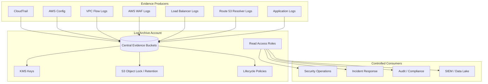
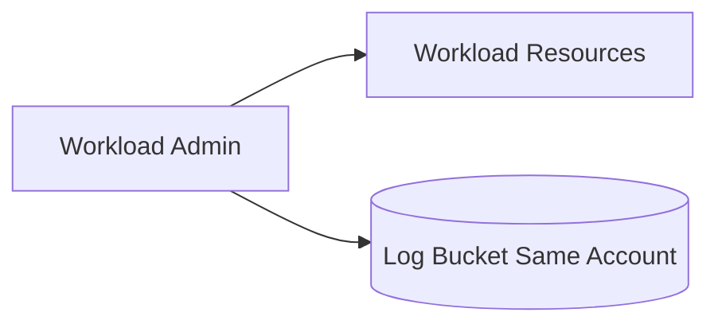
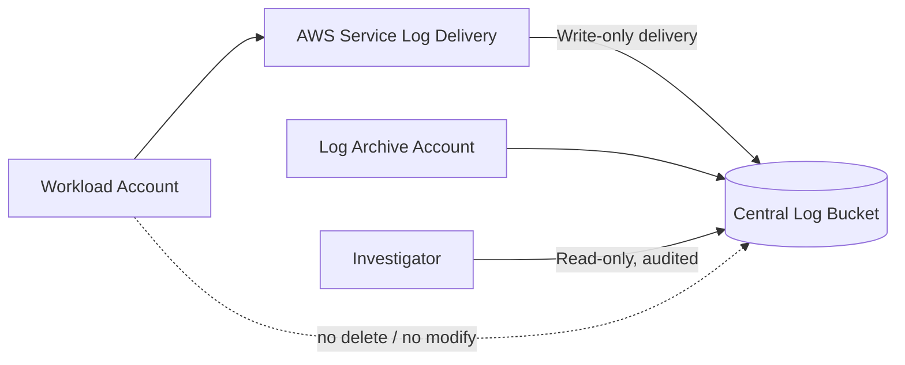
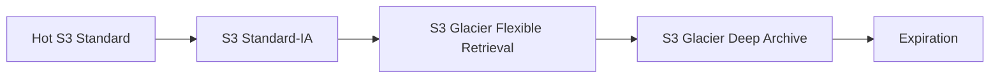
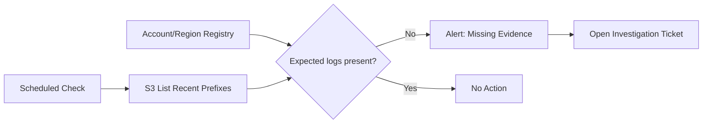

# Part 030 — Log Archive Account Design

Log Archive account adalah tempat di mana AWS organization menyimpan bukti.

Bukan sekadar bucket.
Bukan sekadar tujuan CloudTrail.
Bukan tempat “semua orang bisa lihat log kalau butuh”.

Log Archive account adalah **evidence custody boundary**.

Ia harus menjawab pertanyaan yang sangat keras:

```text
Jika workload account dikompromikan, apakah attacker bisa menghapus atau memodifikasi bukti?
```

Kalau jawabannya “bisa”, maka desain audit belum defensible.

Part ini membahas cara mendesain Log Archive account sebagai komponen production-grade: account boundary, bucket strategy, KMS policy, object immutability, retention, access model, query access, SIEM export, incident response, dan failure mode.

---

## 1. Mental Model: Log Archive Adalah Custody System

CloudTrail menghasilkan event.
AWS Config menghasilkan configuration timeline.
VPC Flow Logs menghasilkan network evidence.
ELB/ALB/NLB menghasilkan access logs.
CloudFront menghasilkan edge logs.
Route 53 Resolver Query Logs menghasilkan DNS evidence.
WAF menghasilkan HTTP security events.
Application logs menghasilkan business/technical trace.

Tetapi semua evidence ini perlu custody.



The archive has one primary job:

```text
Receive evidence from many producers, preserve it with integrity, and expose it only through controlled read paths.
```

---

## 2. Why a Dedicated Account?

A separate account gives hard boundaries:

- different IAM administrators;
- separate blast radius;
- independent SCPs;
- isolated KMS keys;
- dedicated bucket policies;
- restricted console access;
- clear evidence ownership;
- simpler audit story;
- less risk from workload compromise.

If logs stay in the same account as the workload, the account owner can often influence both the system and the evidence about the system. That is weak custody.

### Bad model



Problem: the same administrative boundary controls workload and evidence.

### Better model



---

## 3. Log Archive Invariants

Use these invariants as design anchors.

1. **Workload accounts can produce logs but cannot delete central logs.**
2. **Log archive admins are separate from workload admins.**
3. **Log write path is service-controlled and least privilege.**
4. **Log read path is explicit, auditable, and role-based.**
5. **No broad human write access to evidence buckets.**
6. **KMS decrypt is not automatically granted to bucket admins.**
7. **Retention is defined per log class.**
8. **Integrity and immutability controls are explicit.**
9. **Evidence export is controlled and logged.**
10. **Access to old logs is possible during incident, not blocked by forgotten lifecycle design.**

---

## 4. Account Placement in AWS Organization

Recommended account placement:

```text
Security OU
├── Security Tooling Account
└── Log Archive Account
```

The Log Archive account should not be inside a workload OU where application teams inherit broad administrative assumptions.

### SCP posture

Log Archive account should have stricter SCPs than normal workload accounts:

- deny disabling CloudTrail/Config/logging controls;
- deny deleting protected buckets;
- deny changing Object Lock configuration outside approved role;
- deny disabling or deleting KMS keys outside approved role;
- deny public S3 access configuration changes;
- deny creation of IAM users/access keys except controlled break-glass path;
- restrict regions if applicable;
- prevent leaving organization;
- prevent unapproved external sharing.

---

## 5. Bucket Strategy

There are two common strategies.

### Strategy A — One central bucket per log family

Example:

```text
org-log-archive-cloudtrail-prod
org-log-archive-config-prod
org-log-archive-vpcflow-prod
org-log-archive-alb-prod
org-log-archive-waf-prod
```

Benefits:

- simpler per-log-family policy;
- lifecycle can differ by log type;
- blast radius of policy mistake is smaller;
- easier cost attribution;
- simpler Object Lock decisions.

Trade-off:

- more buckets and policies to manage.

### Strategy B — One central bucket with prefixes

Example:

```text
org-log-archive-prod/cloudtrail/...
org-log-archive-prod/config/...
org-log-archive-prod/vpc-flow/...
org-log-archive-prod/alb/...
```

Benefits:

- fewer buckets;
- simpler global inventory;
- easier centralized query layout.

Trade-off:

- bucket policy becomes more complex;
- lifecycle/retention by prefix must be carefully governed;
- mistakes can affect more log types.

### Practical recommendation

For serious environments, use **separate buckets for major log families** unless your platform team has strong policy-as-code and testing maturity.

CloudTrail deserves its own bucket or at least a heavily protected prefix because it is foundational audit evidence.

---

## 6. Prefix and Partition Design

A log archive without consistent partitioning becomes hard to query.

Use naming that supports account/region/date filtering.

Example logical partition:

```text
s3://org-log-archive-cloudtrail/AWSLogs/<account-id>/CloudTrail/<region>/<yyyy>/<mm>/<dd>/...
```

For non-CloudTrail logs, normalize where possible:

```text
s3://org-log-archive-vpcflow/account_id=<account-id>/region=<region>/year=<yyyy>/month=<mm>/day=<dd>/...
s3://org-log-archive-waf/account_id=<account-id>/region=<region>/web_acl=<name>/year=<yyyy>/month=<mm>/day=<dd>/...
s3://org-log-archive-app/account_id=<account-id>/service=<service>/env=<env>/year=<yyyy>/month=<mm>/day=<dd>/...
```

### Why this matters

Good partitioning reduces:

- Athena scan cost;
- investigation time;
- SIEM export complexity;
- object listing pain;
- ad-hoc operational scripts;
- lifecycle mistakes.

---

## 7. Bucket Policy Design

Bucket policy should separate write and read.

### Write path

AWS services need permission to deliver logs.

For CloudTrail, delivery requires a bucket policy that allows the CloudTrail service principal to write objects to the expected prefix and check bucket ACL where required.

Conceptual pattern:

```json
{
  "Version": "2012-10-17",
  "Statement": [
    {
      "Sid": "AWSCloudTrailAclCheck",
      "Effect": "Allow",
      "Principal": { "Service": "cloudtrail.amazonaws.com" },
      "Action": "s3:GetBucketAcl",
      "Resource": "arn:aws:s3:::org-log-archive-cloudtrail"
    },
    {
      "Sid": "AWSCloudTrailWrite",
      "Effect": "Allow",
      "Principal": { "Service": "cloudtrail.amazonaws.com" },
      "Action": "s3:PutObject",
      "Resource": "arn:aws:s3:::org-log-archive-cloudtrail/AWSLogs/o-exampleorgid/*",
      "Condition": {
        "StringEquals": {
          "s3:x-amz-acl": "bucket-owner-full-control"
        }
      }
    }
  ]
}
```

Production policy should further scope by organization/account/trail where supported and should be generated/tested through IaC.

### Read path

Humans and tools should read logs through named roles:

- `security-investigator-readonly`
- `audit-evidence-readonly`
- `siem-export-role`
- `forensics-break-glass-readonly`

Avoid generic `AdministratorAccess` in Log Archive account.

---

## 8. Deny Unsafe Transport and Public Exposure

All log buckets should enforce TLS and block public access.

Conceptual deny:

```json
{
  "Sid": "DenyInsecureTransport",
  "Effect": "Deny",
  "Principal": "*",
  "Action": "s3:*",
  "Resource": [
    "arn:aws:s3:::org-log-archive-cloudtrail",
    "arn:aws:s3:::org-log-archive-cloudtrail/*"
  ],
  "Condition": {
    "Bool": {
      "aws:SecureTransport": "false"
    }
  }
}
```

Also enable S3 Block Public Access at account and bucket level.

Public log bucket exposure is not only a confidentiality issue. It can expose architecture, account IDs, usernames, source IPs, role names, service names, and incident response activity.

---

## 9. KMS Design

Log archive KMS design must avoid two mistakes:

1. key too permissive;
2. key too restrictive, causing log delivery failure or incident access failure.

### Key separation

Use separate KMS keys for different log families if access and retention differ materially.

Example:

```text
alias/org-log-archive-cloudtrail
alias/org-log-archive-config
alias/org-log-archive-vpcflow
alias/org-log-archive-app
```

### Roles

| Role | Admin? | Encrypt? | Decrypt? | Notes |
|---|---:|---:|---:|---|
| CloudTrail service | No | Yes | No | Delivery only |
| Log archive key admin | Yes | Maybe | Not by default | Separate admin from read |
| Security investigator | No | No | Yes | Read evidence |
| SIEM export role | No | No | Yes | Scoped export |
| Workload admin | No | No | No | No central evidence access |

### Key policy principle

KMS key policy should be written from the perspective of evidence custody, not convenience.

Do not grant broad decrypt to all security admins unless that is truly intended. Security tooling operators may need to manage services without being able to read all logs.

---

## 10. Object Lock and Immutability

S3 Object Lock can store objects using a WORM model. For log archives, it can help protect against accidental or inappropriate deletion.

### Modes

| Mode | Meaning | Use Case |
|---|---|---|
| Governance mode | privileged users can override if allowed | strong internal protection with controlled override |
| Compliance mode | no one can delete/overwrite until retention expires | strict regulatory retention |

### Decision framework

Use Object Lock for CloudTrail logs when:

- regulatory evidence integrity matters;
- insider risk is significant;
- ransomware/tampering resilience is required;
- audit retention must be demonstrable;
- legal hold may be needed.

Be careful:

- Object Lock must be planned early for bucket design.
- Compliance mode can create irreversible retention cost and operational rigidity.
- Lifecycle rules cannot delete locked objects before retention expires.
- You need tested runbooks for legal hold and retention changes.

### Practical posture

For many organizations:

```text
CloudTrail bucket: Object Lock enabled, governance mode by default, compliance mode only for regulated subsets or explicit legal requirements.
```

For heavily regulated environments, compliance mode may be required, but it must be approved as a governance decision, not casually enabled.

---

## 11. Retention Model

Retention must be explicit per log class.

Example baseline:

| Log Type | Hot Query | Warm Archive | Cold/Long Retention | Notes |
|---|---:|---:|---:|---|
| CloudTrail management events | 90–180 days | 1–2 years | 3–7+ years | audit/compliance dependent |
| CloudTrail data events | 30–90 days | 6–12 months | by sensitivity | high-volume, classify carefully |
| AWS Config snapshots/history | 90–180 days | 1–3 years | 3–7+ years | config evidence |
| VPC Flow Logs | 14–90 days | 6–12 months | selective | high-volume network evidence |
| WAF logs | 30–90 days | 6–12 months | selective | security investigation |
| ALB/CloudFront logs | 30–90 days | 6–12 months | business dependent | HTTP/access evidence |
| Application audit logs | 90–365 days | 1–7 years | regulated dependent | often compliance critical |

Do not copy this blindly. Define retention from:

- regulatory requirement;
- incident response needs;
- business dispute window;
- forensic value;
- cost model;
- privacy/data minimization rules;
- legal hold process.

---

## 12. Lifecycle Policies

Lifecycle policies should implement retention without breaking investigation.

Common lifecycle phases:



### Key rule

Do not transition logs to deep archive before your expected investigation window ends.

If incident responders often need last 180 days quickly, do not deep-archive after 30 days just to reduce cost.

### Lifecycle review

Review lifecycle when:

- regulations change;
- incident response SLA changes;
- SIEM retention changes;
- log volume changes;
- new workloads become regulated;
- Object Lock retention changes;
- legal hold is applied.

---

## 13. Access Model

Access to log archive should be role-based, time-bound where possible, and logged.

### Suggested roles

| Role | Purpose | Access |
|---|---|---|
| `log-archive-admin` | bucket/KMS/lifecycle administration | no routine log read unless explicitly needed |
| `security-investigator` | incident investigation | read selected log buckets, decrypt, query |
| `audit-reviewer` | audit evidence review | read scoped evidence, no export unless approved |
| `siem-export` | automated export | read source logs, write to destination, minimal decrypt |
| `break-glass-forensics` | emergency access | broad read, tightly controlled and alerted |

### Human access invariant

```text
No human should have standing broad write/delete access to evidence buckets.
```

### Session design

Use IAM Identity Center permission sets or equivalent federation with:

- MFA;
- short session duration for sensitive roles;
- approval workflow for broad access;
- session tags/source identity;
- CloudTrail monitoring;
- access review.

---

## 14. Read Without Mutate

Investigation access should be read-only.

But read-only is not always simple because S3 read access may require:

- `s3:GetObject`
- `s3:ListBucket`
- `kms:Decrypt`
- `athena:*` for query execution
- `glue:Get*` for catalog metadata
- `logs:StartQuery` if using CloudWatch Logs
- `cloudtrail:LookupEvents` or CloudTrail Lake access

Design query roles around actual workflows.

### Example workflows

| Workflow | Required Capability |
|---|---|
| Read raw CloudTrail object | S3 list/get + KMS decrypt |
| Query via Athena | S3 read + KMS decrypt + Athena + Glue catalog |
| Query via CloudTrail Lake | CloudTrail Lake query permission |
| Export to SIEM | S3 read + KMS decrypt + destination write |
| Validate integrity | S3 read log files + digest files |

---

## 15. SIEM and Data Lake Export

Many organizations forward logs to SIEM. That is useful, but SIEM should not become the only evidence store.

Preferred model:

```text
Central S3 Log Archive = raw immutable source of record
SIEM = detection/correlation/indexing layer
Data Lake = analytics/query layer
Ticketing = response workflow layer
```

### Export principles

- export only needed log families;
- avoid exporting unbounded noisy logs without detection use case;
- preserve raw logs in S3;
- use dedicated export role;
- log export activity;
- monitor export failures;
- avoid giving SIEM write/delete permission to archive source;
- document parser assumptions.

---

## 16. Evidence Catalog

Log archive without catalog becomes hard to use.

Maintain an evidence catalog:

| Field | Example |
|---|---|
| Log family | CloudTrail management events |
| Bucket | `org-log-archive-cloudtrail` |
| Prefix | `AWSLogs/<account-id>/CloudTrail/...` |
| Producer | CloudTrail organization trail |
| Owner | Security Engineering |
| Retention | 7 years |
| Object Lock | Governance mode, 1 year default |
| KMS key | `alias/org-log-archive-cloudtrail` |
| Query method | CloudTrail Lake / Athena |
| Access role | `security-investigator` |
| Compliance mapping | SOC2 CC7, ISO evidence, internal audit |
| Runbook | `runbooks/cloudtrail-investigation.md` |

This catalog is what turns stored logs into usable evidence.

---

## 17. Delivery Monitoring

You must monitor whether logs arrive.

### Signals

- CloudTrail delivery errors;
- no new S3 objects for expected account/region/time;
- KMS access denied events;
- bucket policy change;
- lifecycle policy change;
- Object Lock configuration change;
- S3 replication failure if used;
- SIEM export failure;
- CloudWatch subscription failure;
- Config rule non-compliance.

### Absence detection example



Missing logs should be treated as an incident precursor, not a minor housekeeping issue.

---

## 18. Legal Hold and Investigation Hold

During incident or legal dispute, normal lifecycle expiration may be unacceptable.

Design hold processes before you need them.

### Hold types

| Type | Trigger | Action |
|---|---|---|
| Incident hold | security incident investigation | preserve related account/region/time/resource logs |
| Legal hold | legal/compliance request | prevent deletion for defined scope |
| Audit hold | audit evidence package | preserve reviewed evidence until audit closes |

### Required metadata

- hold ID;
- requestor;
- approving authority;
- reason;
- scope;
- start time;
- expected end/review time;
- impacted bucket/prefix/object set;
- removal approval;
- evidence of application.

---

## 19. Cross-Region and Replication Strategy

For high resilience, consider replication of critical logs to another region or account.

### Use cases

- regional outage resilience;
- ransomware resilience;
- legal requirement;
- disaster recovery;
- independent copy for high-value evidence.

### Trade-offs

| Benefit | Cost/Risk |
|---|---|
| Better durability/resilience | More storage cost |
| Recovery from regional access issue | More KMS/policy complexity |
| Stronger evidence preservation | Replication failure must be monitored |
| Supports DR investigation | Data residency concerns |

Replication should not violate data residency or privacy requirements.

---

## 20. Privacy and Data Minimization

Logs contain sensitive information.

CloudTrail and access logs can include:

- usernames;
- role names;
- source IPs;
- user agents;
- request parameters;
- object keys;
- account IDs;
- resource names;
- service-specific metadata;
- sometimes business-sensitive identifiers embedded in names.

Do not assume logs are harmless.

Security controls:

- restrict read access;
- encrypt at rest;
- enforce TLS;
- minimize broad export;
- redact downstream views when needed;
- define retention with privacy input;
- avoid putting secrets in resource names, tags, object keys, or request parameters;
- monitor log access.

---

## 21. Example Account Baseline for Log Archive

When provisioning Log Archive account, baseline should include:

- IAM Identity Center access only;
- root account secured and monitored;
- no routine IAM users;
- organization trail destination bucket;
- Config recorder enabled;
- GuardDuty/Security Hub coverage where applicable;
- S3 Block Public Access at account level;
- approved KMS keys;
- evidence buckets;
- lifecycle policies;
- Object Lock decision;
- bucket access logging or S3 server access/access trail decision;
- EventBridge alerts for bucket/KMS/policy changes;
- break-glass role;
- investigator role;
- audit reviewer role;
- SIEM export role;
- account contact and ownership metadata;
- periodic access review.

---

## 22. Example Terraform Shape

Illustrative only:

```hcl
resource "aws_s3_bucket" "cloudtrail" {
  bucket = "org-log-archive-cloudtrail-prod"
}

resource "aws_s3_bucket_public_access_block" "cloudtrail" {
  bucket                  = aws_s3_bucket.cloudtrail.id
  block_public_acls       = true
  block_public_policy     = true
  ignore_public_acls      = true
  restrict_public_buckets = true
}

resource "aws_s3_bucket_versioning" "cloudtrail" {
  bucket = aws_s3_bucket.cloudtrail.id

  versioning_configuration {
    status = "Enabled"
  }
}

resource "aws_kms_key" "cloudtrail" {
  description             = "KMS key for central CloudTrail logs"
  deletion_window_in_days = 30
  enable_key_rotation     = true
}
```

Production version must add:

- bucket policy for CloudTrail delivery;
- deny insecure transport;
- deny destructive actions except controlled admin;
- KMS key policy for CloudTrail and investigators;
- lifecycle configuration;
- Object Lock if selected;
- alarms and Config rules;
- access roles;
- tests.

---

## 23. Destructive Action Protection

Protect against accidental or malicious destructive actions.

High-risk actions:

- `s3:DeleteObject`
- `s3:DeleteObjectVersion`
- `s3:PutBucketPolicy`
- `s3:DeleteBucketPolicy`
- `s3:PutLifecycleConfiguration`
- `s3:PutBucketObjectLockConfiguration`
- `s3:BypassGovernanceRetention`
- `kms:DisableKey`
- `kms:ScheduleKeyDeletion`
- `kms:PutKeyPolicy`
- `cloudtrail:StopLogging`

Use SCP + IAM + bucket policy + KMS policy + monitoring.

No single layer is enough.

---

## 24. Log Archive Runbooks

Minimum runbooks:

### Runbook 1 — CloudTrail log delivery failure

1. identify account/region/prefix missing logs;
2. check CloudTrail trail status;
3. check bucket policy;
4. check KMS key policy;
5. check CloudTrail service role errors;
6. check region enablement;
7. check recent changes to trail/bucket/KMS;
8. preserve evidence of gap;
9. open incident if suspicious;
10. close only after delivery is restored and gap is explained.

### Runbook 2 — Suspected evidence tampering

1. freeze relevant retention/lifecycle where possible;
2. collect CloudTrail events for S3/KMS/CloudTrail changes;
3. validate CloudTrail log integrity;
4. identify principal and session context;
5. check whether action was approved;
6. preserve digest validation result;
7. escalate to incident response;
8. review compensating evidence sources.

### Runbook 3 — Investigator access request

1. requestor submits case ID and scope;
2. owner approves;
3. time-bound role assignment granted;
4. session is monitored;
5. queries/exports are logged;
6. access expires automatically;
7. case evidence is attached to ticket.

---

## 25. Failure Modes

### Failure Mode 1 — Archive is central but not immutable

Centralization alone does not prevent deletion. Add Object Lock/versioning/deny policies where appropriate.

### Failure Mode 2 — Security tooling account can delete archive logs

If security operators can both configure detection and delete evidence, separation of duty is weak.

### Failure Mode 3 — KMS key policy grants broad decrypt

Logs are centralized but confidentiality is lost because many admins can decrypt everything.

### Failure Mode 4 — Lifecycle deletes logs before audit window

Storage is cheap until you need deleted evidence. Retention must follow risk and compliance, not arbitrary cost targets.

### Failure Mode 5 — SIEM has logs but archive is broken

SIEM indexes are not always complete raw evidence. Preserve raw logs in S3.

### Failure Mode 6 — No one knows how to query the archive

A log archive that cannot be used during incident is just expensive storage. Maintain query cookbooks and access runbooks.

---

## 26. Production Readiness Checklist

### Account

- [ ] Log Archive account is separate from workload accounts.
- [ ] Account is inside Security OU.
- [ ] Root user is secured and monitored.
- [ ] IAM users are prohibited or tightly controlled.
- [ ] Access is federated and reviewed.
- [ ] SCPs protect archive controls.

### Buckets

- [ ] CloudTrail bucket exists in Log Archive account.
- [ ] S3 Block Public Access is enabled.
- [ ] Versioning is enabled.
- [ ] Object Lock decision is documented.
- [ ] Lifecycle policies match retention model.
- [ ] Bucket policy allows only required service delivery paths.
- [ ] Insecure transport is denied.
- [ ] Destructive actions are restricted.

### KMS

- [ ] Customer managed key is used where required.
- [ ] CloudTrail/service delivery can encrypt.
- [ ] Investigator roles can decrypt when approved.
- [ ] Workload admins cannot decrypt central logs.
- [ ] Key deletion/disable is protected and alerted.

### Operations

- [ ] Log delivery is monitored.
- [ ] Absence detection exists.
- [ ] Evidence catalog exists.
- [ ] Query cookbook exists.
- [ ] Legal hold process exists.
- [ ] Incident access process exists.
- [ ] SIEM export is monitored.
- [ ] Periodic validation is performed.

---

## 27. What to Remember

Log Archive account is not storage plumbing.

It is the custody boundary for security evidence.

A strong design ensures:

- producers can write evidence;
- compromised workload accounts cannot erase evidence;
- investigators can read evidence with approval;
- admins cannot accidentally destroy retention;
- KMS decrypt is controlled;
- lifecycle matches compliance and incident needs;
- evidence can be queried, validated, and exported;
- absence of expected logs is detected.

The core question is:

```text
Can we still trust and access the evidence after the system that produced it has failed or been compromised?
```

If yes, your Log Archive account is doing its job.

---

## Official References

- AWS Security Reference Architecture — Log Archive Account: https://docs.aws.amazon.com/prescriptive-guidance/latest/security-reference-architecture/log-archive.html
- AWS Security Reference Architecture — Security Tooling Account: https://docs.aws.amazon.com/prescriptive-guidance/latest/security-reference-architecture/security-tooling.html
- AWS CloudTrail Security Best Practices: https://docs.aws.amazon.com/awscloudtrail/latest/userguide/best-practices-security.html
- AWS CloudTrail S3 Bucket Policy Requirements: https://docs.aws.amazon.com/awscloudtrail/latest/userguide/create-s3-bucket-policy-for-cloudtrail.html
- AWS CloudTrail Log File Integrity Validation: https://docs.aws.amazon.com/awscloudtrail/latest/userguide/cloudtrail-log-file-validation-intro.html
- AWS CloudTrail Encryption with AWS KMS: https://docs.aws.amazon.com/awscloudtrail/latest/userguide/encrypting-cloudtrail-log-files-with-aws-kms.html
- AWS Prescriptive Guidance — Encryption Best Practices for CloudTrail: https://docs.aws.amazon.com/prescriptive-guidance/latest/encryption-best-practices/cloudtrail.html
- Amazon S3 Security Best Practices: https://docs.aws.amazon.com/AmazonS3/latest/userguide/security-best-practices.html
