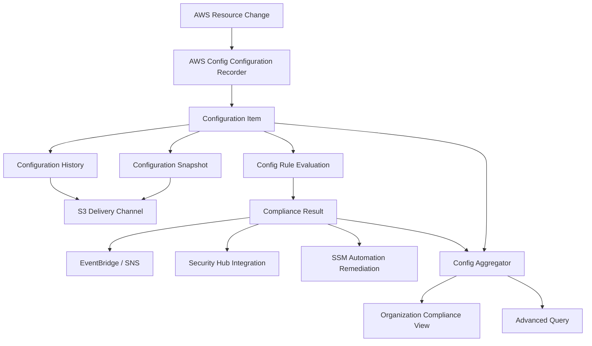
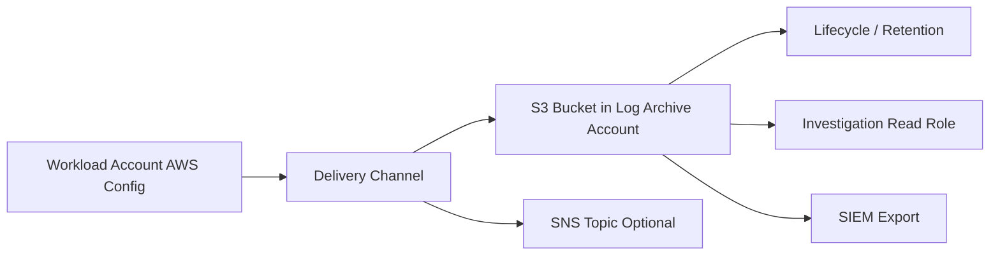
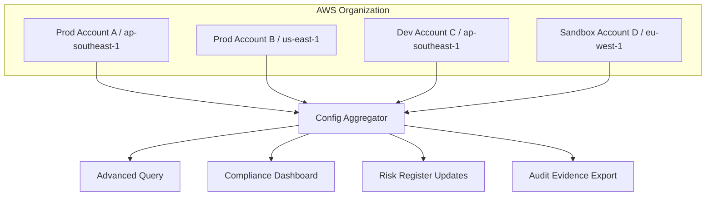
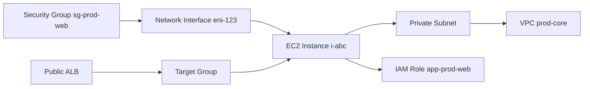
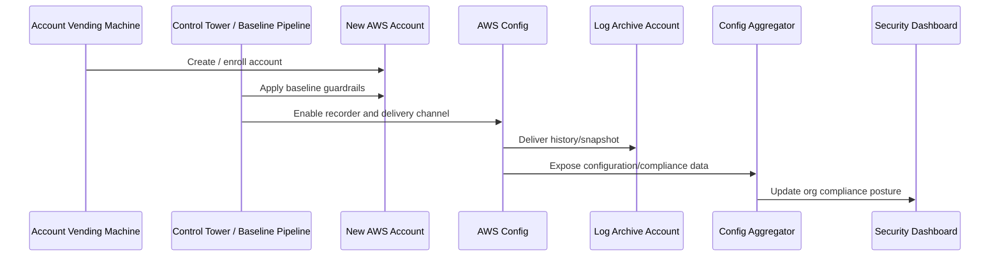
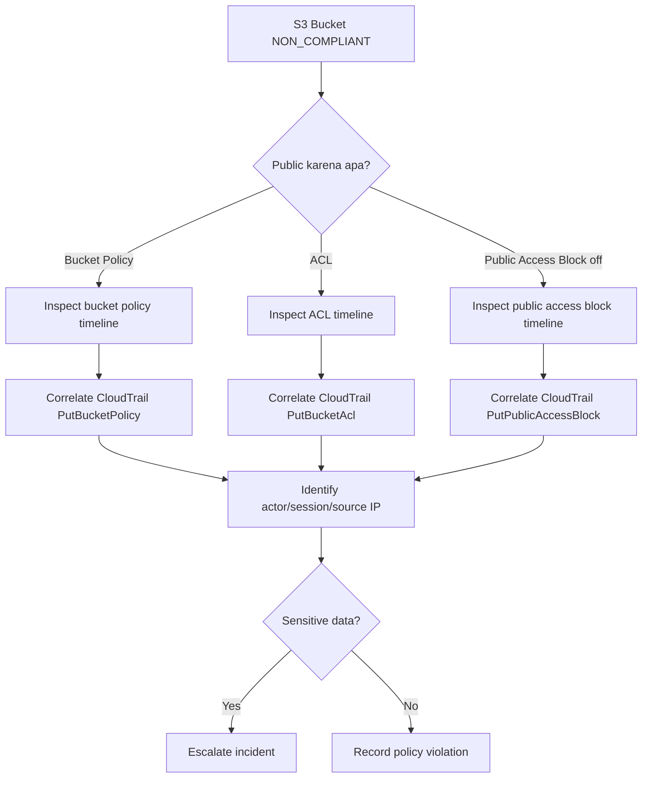
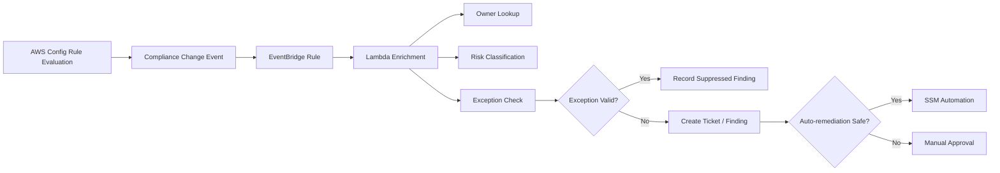
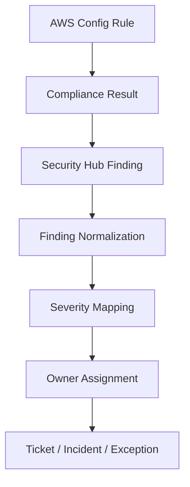

# Part 031 — AWS Config as Configuration Timeline

CloudTrail menjawab:

```text
Siapa memanggil API apa, kapan, dari mana, terhadap resource apa, dan hasilnya apa?
```

AWS Config menjawab pertanyaan yang berbeda:

```text
Resource itu bentuknya seperti apa pada titik waktu tertentu?
Bagaimana state-nya berubah dari waktu ke waktu?
Apakah state sekarang sesuai dengan aturan organisasi?
Resource apa saja yang berhubungan dengannya?
```

CloudTrail adalah **event audit**.
AWS Config adalah **configuration state timeline**.

Keduanya saling melengkapi. CloudTrail memberi jejak tindakan. Config memberi jejak bentuk resource. Tanpa CloudTrail, kita sulit tahu siapa mengubah sesuatu. Tanpa Config, kita sulit tahu perubahan itu membuat resource menjadi seperti apa.

Part ini membahas AWS Config sebagai sistem engineering untuk **configuration history**, **resource inventory**, **relationship graph**, **compliance state**, dan **drift investigation** di AWS Organization.

---

## 1. Masalah yang Diselesaikan AWS Config

Bayangkan ada incident:

```text
Sebuah S3 bucket production tiba-tiba public selama 37 menit.
```

Pertanyaan yang harus dijawab bukan hanya:

```text
Siapa memanggil PutBucketPolicy?
```

Tetapi juga:

```text
Kapan bucket berubah dari private menjadi public?
Policy persisnya seperti apa saat public?
Apakah Public Access Block dimatikan?
Apakah ACL berubah?
Apakah bucket punya data sensitif?
Kapan bucket kembali compliant?
Resource lain apa yang terkait?
Apakah kejadian serupa terjadi di account lain?
```

CloudTrail membantu menemukan API call. AWS Config membantu merekonstruksi **state**.

AWS Config berguna untuk empat pekerjaan utama:

1. **Inventory** — resource apa saja yang ada.
2. **Timeline** — bagaimana konfigurasi resource berubah.
3. **Relationship** — resource ini terhubung ke resource apa.
4. **Compliance** — apakah konfigurasi resource melanggar aturan.

Mental model sederhananya:

```text
CloudTrail = action log
AWS Config = state ledger
Security Hub = findings correlation
GuardDuty = threat signal
CloudWatch = operational telemetry
```

---

## 2. AWS Config Bukan Realtime Security Detector

Salah framing paling umum:

```text
"Kita sudah punya AWS Config, berarti semua misconfiguration langsung dicegah."
```

Tidak.

AWS Config bukan preventive control. AWS Config adalah **recording + evaluation service**.

Ia bisa:

- mencatat perubahan konfigurasi resource,
- mengevaluasi resource terhadap Config Rules,
- menghasilkan compliance state,
- memicu remediation,
- menyediakan history dan snapshot,
- mengirim event perubahan.

Ia tidak otomatis:

- mencegah API call berbahaya,
- menggantikan SCP,
- menggantikan IAM permission boundary,
- menggantikan CloudTrail,
- menjamin semua perubahan tertangkap jika recorder mati atau resource type tidak direkam,
- memberi semantics bisnis tanpa rule yang benar.

AWS Config harus dipahami sebagai **detective control** dan **evidence system**. Pencegahan tetap berada di SCP, RCP, IAM, resource policy, VPC endpoint policy, KMS policy, dan service-specific control.

---

## 3. Arsitektur Inti AWS Config

Komponen inti AWS Config:

| Komponen | Fungsi |
|---|---|
| Configuration Recorder | Merekam konfigurasi resource yang didukung. |
| Delivery Channel | Mengirim configuration snapshot/history ke S3 dan notifikasi ke SNS. |
| Configuration Item | Point-in-time record dari konfigurasi resource. |
| Configuration History | Rangkaian configuration item untuk satu resource dari waktu ke waktu. |
| Configuration Snapshot | Snapshot konfigurasi resource yang direkam pada titik waktu tertentu. |
| Config Rule | Predicate compliance terhadap resource. |
| Conformance Pack | Paket rules + remediation yang dikelola sebagai satu unit. |
| Aggregator | View lintas account dan region untuk inventory/compliance. |
| Advanced Query | Query SQL-like terhadap resource configuration. |

Diagram mental model:



AWS Config menjadi berguna ketika dipasang sebagai **organization-wide baseline**, bukan dibuat manual per account oleh masing-masing team.

---

## 4. Configuration Item: Unit Bukti Terkecil

Configuration item adalah rekaman point-in-time dari resource.

Ia biasanya berisi:

- resource type,
- resource ID,
- AWS account,
- region,
- ARN,
- timestamp,
- configuration payload,
- relationships,
- tags,
- version,
- event metadata,
- status perubahan.

Contoh simplified configuration item:

```json
{
  "resourceType": "AWS::S3::Bucket",
  "resourceId": "prod-customer-export",
  "awsAccountId": "111122223333",
  "awsRegion": "ap-southeast-1",
  "configurationItemCaptureTime": "2026-07-06T02:13:11Z",
  "configurationItemStatus": "OK",
  "configuration": {
    "name": "prod-customer-export",
    "versioningConfiguration": {
      "status": "Enabled"
    },
    "publicAccessBlockConfiguration": {
      "blockPublicAcls": true,
      "ignorePublicAcls": true,
      "blockPublicPolicy": true,
      "restrictPublicBuckets": true
    }
  },
  "tags": {
    "Environment": "prod",
    "DataClass": "confidential",
    "Owner": "data-platform"
  }
}
```

Nilai configuration item bukan pada satu record. Nilainya muncul saat banyak record disusun sebagai timeline.

```text
T1 bucket private
T2 policy berubah
T3 public access block dimatikan
T4 Config rule NON_COMPLIANT
T5 remediation mengaktifkan block public access
T6 Config rule COMPLIANT
```

Dari sini incident responder bisa menulis narasi defensible:

```text
Resource menjadi non-compliant pada pukul 02:13 UTC, terdeteksi oleh AWS Config pada pukul 02:14 UTC, diremediasi otomatis pada pukul 02:15 UTC, dan kembali compliant pada pukul 02:16 UTC.
```

Tanpa timeline, security report berubah menjadi dugaan.

---

## 5. Configuration History vs Configuration Snapshot

Dua konsep ini sering tertukar.

### Configuration History

Configuration history adalah rangkaian perubahan untuk resource tertentu.

Gunanya:

- investigasi drift,
- mencari kapan perubahan terjadi,
- membandingkan sebelum/sesudah,
- melihat perubahan selama incident window,
- mendukung audit evidence.

Pertanyaan yang dijawab:

```text
Bagaimana security group sg-123 berubah selama 24 jam terakhir?
```

### Configuration Snapshot

Configuration snapshot adalah gambaran resource yang direkam pada titik waktu tertentu.

Gunanya:

- inventory baseline,
- compliance export,
- audit package,
- backup view konfigurasi,
- diff environment.

Pertanyaan yang dijawab:

```text
Pada akhir bulan, resource apa saja yang ada dan bagaimana konfigurasinya?
```

Ringkasnya:

```text
History  = timeline per resource
Snapshot = landscape pada titik waktu
```

---

## 6. AWS Config Sebagai Ledger, Bukan Source of Truth

AWS Config sering disebut inventory. Tetapi jangan menjadikannya source of truth utama.

Source of truth untuk desired state idealnya tetap:

- IaC repository,
- platform catalog,
- service ownership registry,
- account registry,
- CMDB internal,
- data classification registry,
- exception registry.

AWS Config adalah **observed-state ledger**.

Perbedaan penting:

| Jenis State | Contoh | Sumber |
|---|---|---|
| Desired state | S3 bucket harus private | IaC/policy/control catalog |
| Actual state | S3 bucket sedang public | AWS Config/resource API |
| Historical state | Bucket public dari 02:13–02:50 UTC | AWS Config history |
| Compliance state | NON_COMPLIANT terhadap rule `s3-bucket-public-read-prohibited` | AWS Config rule |
| Intent state | Bucket dibuat untuk customer export | Service catalog/owner registry |

AWS Config kuat untuk actual dan historical state. Ia tidak otomatis tahu intent bisnis.

Karena itu tag, registry, naming, dan metadata ownership tetap penting.

---

## 7. Configuration Recorder Design

Configuration recorder menentukan resource type apa yang direkam.

Keputusan desainnya tidak boleh asal “record everything” tanpa memahami biaya, volume, dan coverage. Namun untuk security baseline, terlalu selektif juga berbahaya.

Pilihan umum:

```text
Record all supported resource types
+ include global resources sesuai kebutuhan
+ exclude noisy/low-value resource types jika cost/volume tidak proporsional
```

Pertanyaan desain:

1. Resource type apa yang security-critical?
2. Resource type apa yang berubah sangat sering dan mahal direkam?
3. Region mana yang aktif?
4. Bagaimana future regions ditangani?
5. Apakah global IAM resources direkam di semua region atau satu region saja?
6. Apakah new account otomatis punya recorder?
7. Apakah recorder terlindungi dari disable/delete?

Invariant production:

```text
Semua account production harus memiliki AWS Config recorder aktif di semua approved regions yang digunakan, dengan delivery channel ke log/archive bucket yang dikontrol organisasi.
```

---

## 8. Region Strategy

AWS Config bersifat regional untuk banyak resource.

Kesalahan umum:

```text
Config aktif di us-east-1, jadi organization sudah covered.
```

Belum tentu.

Jika workload berjalan di `ap-southeast-1`, `eu-west-1`, dan `us-east-1`, recorder perlu aktif di region-region tersebut. Jika organisasi memakai region deny SCP, region strategy harus konsisten:

| Region Category | Config Strategy |
|---|---|
| Approved active regions | Recorder aktif, rules aktif, delivery aktif. |
| Approved standby regions | Recorder minimal untuk security resources jika ada. |
| Denied regions | SCP mencegah usage; Config tetap bisa dipertimbangkan untuk visibility tergantung posture. |
| New future regions | Enrollment harus eksplisit, tidak otomatis diasumsikan aman. |

Untuk organisasi besar, region policy harus ditulis sebagai contract:

```yaml
regions:
  primary:
    - ap-southeast-1
  secondary:
    - us-east-1
  disaster_recovery:
    - ap-southeast-2
  denied_by_default: true
config:
  recorder_required_in:
    - primary
    - secondary
    - disaster_recovery
```

---

## 9. Global Resource Recording

Beberapa resource IAM bersifat global.

Masalahnya: jika global resources direkam di banyak region, hasil compliance dan biaya bisa membingungkan. Jika tidak direkam sama sekali, audit IAM bisa blind.

Prinsip desain:

```text
Global resource recording harus eksplisit, konsisten, dan didokumentasikan.
```

Contoh keputusan:

```text
Record global IAM resources hanya di home region security, misalnya us-east-1.
```

Lalu dokumentasikan:

- region mana menjadi global-resource recording region,
- rule mana yang bergantung pada global resources,
- aggregator mana yang membaca region tersebut,
- dashboard mana yang menampilkan hasilnya,
- bagaimana investigator mencari IAM timeline.

Tanpa keputusan eksplisit, organisasi akan punya dua masalah:

1. duplicate compliance signal,
2. missing IAM evidence.

---

## 10. Delivery Channel Design

Delivery channel mengirim configuration history dan snapshot ke S3, serta bisa memakai SNS notification.

Production design perlu memperhatikan:

- bucket berada di log archive/security account,
- bucket policy hanya mengizinkan AWS Config delivery dari account/organization yang benar,
- encryption dengan KMS jika diperlukan,
- lifecycle dan retention sesuai audit policy,
- access read-only untuk investigator,
- monitoring delivery failure,
- protection dari delete/overwrite.

Simplified flow:



Delivery channel bukan detail minor. Ia adalah jalur custody untuk configuration evidence.

Kalau bucket berada di workload account yang bisa dikontrol attacker, bukti bisa ikut terancam.

---

## 11. AWS Config Aggregator

Aggregator menyediakan view lintas account dan region.

Ia sangat penting untuk organisasi besar karena pertanyaan governance jarang berbunyi:

```text
Apakah account 111122223333 compliant di region ap-southeast-1?
```

Pertanyaannya biasanya:

```text
Account production mana yang punya S3 bucket public?
Region mana yang punya Config recorder mati?
Security group mana di seluruh org yang expose SSH?
Resource mana yang tidak punya Owner tag?
Berapa persen prod account compliant terhadap baseline?
```

Aggregator memungkinkan central visibility tanpa login ke setiap account.

Desain aggregator:

| Area | Keputusan |
|---|---|
| Lokasi | Security tooling account atau audit account. |
| Scope | Organization-wide, account list, atau selective accounts. |
| Region | Multi-region, include future region jika cocok dengan policy. |
| Access | Security engineering read, audit read, platform read terbatas. |
| Dashboard | Compliance trend, non-compliant by severity, owner, OU, region. |

Diagram:



Aggregator bukan remediation engine. Ia adalah **visibility plane**.

---

## 12. Advanced Query: Inventory Dengan Bahasa Engineering

AWS Config Advanced Query memungkinkan query SQL-like atas current configuration state.

Ini berguna untuk menjawab pertanyaan seperti:

```text
Tampilkan semua EC2 instance tanpa required tag.
Tampilkan semua security group yang membuka 0.0.0.0/0 pada port 22.
Tampilkan semua S3 bucket tanpa encryption.
Tampilkan semua public load balancer di account production.
```

Contoh query konseptual:

```sql
SELECT
  accountId,
  awsRegion,
  resourceId,
  resourceName,
  resourceType
WHERE
  resourceType = 'AWS::EC2::SecurityGroup'
```

Contoh query ownership hygiene:

```sql
SELECT
  accountId,
  awsRegion,
  resourceId,
  resourceType,
  tags
WHERE
  tags.Owner IS NULL
```

Advanced Query cocok untuk:

- inventory discovery,
- audit sampling,
- compliance pre-check,
- incident scoping,
- migration assessment,
- cost hygiene,
- tag governance.

Namun jangan menganggap advanced query sebagai replacement SIEM atau graph engine. Ia kuat untuk configuration state, bukan behavioral analytics.

---

## 13. Relationship Graph

AWS Config menyimpan relationship antar resource untuk resource type yang didukung.

Contoh relationship:

```text
EC2 instance -> security group
EC2 instance -> subnet
Subnet -> VPC
Load balancer -> target group
EBS volume -> EC2 instance
IAM role -> instance profile
```

Dalam incident, relationship graph membantu menjawab:

```text
Security group yang salah ini melekat ke instance mana?
Instance ini berada di subnet mana?
Subnet ini route ke internet gateway atau NAT?
Load balancer ini mengarah ke target mana?
Role ini dipakai oleh workload apa?
```

Mermaid example:



Security investigation jarang selesai di satu resource. AWS Config membantu berpindah dari satu resource ke blast radius.

---

## 14. Compliance State: Derived, Not Absolute Truth

AWS Config compliance result adalah hasil evaluasi rules.

Status umum:

- `COMPLIANT`,
- `NON_COMPLIANT`,
- `NOT_APPLICABLE`,
- `INSUFFICIENT_DATA`.

Penting: compliance state bukan kebenaran absolut. Ia bergantung pada:

- rule yang dipasang,
- parameter rule,
- resource types yang direkam,
- region coverage,
- recorder state,
- timing evaluation,
- logic custom rule,
- exception handling,
- data freshness.

Contoh:

```text
Resource tampak compliant karena rule belum dipasang di region itu.
```

Atau:

```text
Resource tampak compliant karena recorder tidak merekam resource type tersebut.
```

Atau:

```text
Resource tampak non-compliant karena exception bisnis belum dimodelkan.
```

Karena itu dashboard compliance harus selalu menampilkan **coverage** dan **data freshness**, bukan hanya percentage compliant.

---

## 15. AWS Config Coverage Model

Sebelum memakai Config untuk governance, buat coverage model.

Minimal field:

```yaml
config_coverage:
  organization_id: o-example
  home_region: us-east-1
  active_regions:
    - ap-southeast-1
    - us-east-1
  account_scope:
    - prod
    - staging
    - shared-services
    - security
  excluded_accounts:
    - suspended
  resource_recording:
    mode: all_supported
    global_iam_recording_region: us-east-1
  delivery:
    s3_bucket: org-log-archive-config
    kms_key: alias/org-config-log-key
  aggregator:
    account: security-tooling
    regions: all_active_regions
```

Coverage model harus diuji.

Pertanyaan validasi:

1. Jika account baru dibuat, apakah Config aktif otomatis?
2. Jika account dipindah OU, apakah baseline Config ikut benar?
3. Jika region baru dipakai, apakah Config ikut aktif?
4. Jika recorder dimatikan, siapa menerima alert?
5. Jika delivery gagal, apakah ada alarm?
6. Jika aggregator tidak menerima data, apakah terdeteksi?

---

## 16. AWS Config Dalam Landing Zone

Dalam landing zone production-grade, AWS Config biasanya diaktifkan sejak account bootstrap.

Urutan bootstrap ideal:



AWS Config yang diaktifkan manual setelah workload berjalan akan kehilangan bagian awal timeline.

Production invariant:

```text
Tidak ada workload production sebelum audit baseline, CloudTrail, AWS Config, logging, security services, and account metadata aktif.
```

---

## 17. Use Case: Public S3 Bucket Investigation

Scenario:

```text
Security Hub menemukan S3 bucket public.
```

Investigation dengan AWS Config:

1. Cari resource di Config.
2. Buka configuration timeline.
3. Identifikasi kapan public exposure muncul.
4. Bandingkan configuration item sebelum dan sesudah.
5. Lihat relationship dan tags.
6. Korelasikan timestamp dengan CloudTrail.
7. Cari actor/API call.
8. Cek apakah Macie menemukan sensitive data.
9. Cek apakah access logs menunjukkan akses dari luar.
10. Catat waktu kembali compliant.

Decision tree:



Config memberi state. CloudTrail memberi actor. Macie memberi data sensitivity. Security Hub memberi finding layer.

---

## 18. Use Case: Security Group Drift

Scenario:

```text
Security group production membuka inbound 0.0.0.0/0:22.
```

Pertanyaan:

- Kapan rule ditambahkan?
- Apakah rule masih ada?
- Siapa menambahkannya?
- Instance mana yang terdampak?
- Apakah instance public?
- Apakah SSM Session Manager tersedia sebagai alternatif?
- Apakah perubahan berasal dari console, CLI, pipeline, atau automation?

AWS Config timeline:

```text
T1 sg-abc inbound: 443 from ALB only
T2 sg-abc inbound: 22 from 0.0.0.0/0 added
T3 Config rule restricted-ssh NON_COMPLIANT
T4 EventBridge triggers remediation
T5 rule removed
T6 Config rule COMPLIANT
```

CloudTrail correlation:

```text
AuthorizeSecurityGroupIngress at T2
principal = arn:aws:sts::111122223333:assumed-role/AdminRole/alice
sourceIPAddress = 203.0.113.10
userAgent = aws-cli/2.x
```

Root cause bisa berbeda:

| Root Cause | Remediation Sistemik |
|---|---|
| Manual console change | Restrict console access, permission boundary, approval. |
| Emergency change tidak di-rollback | Temporary access TTL, change ticket integration. |
| Terraform drift | IaC drift pipeline, deny direct mutation. |
| Third-party scanner | Vendor access boundary. |
| Misconfigured automation | Pipeline policy test. |

AWS Config membantu melihat drift. Ia tidak sendiri memperbaiki operating model.

---

## 19. Use Case: Missing Required Tags

Tag adalah metadata governance. Namun tag bukan sekadar cost allocation.

Tag bisa menentukan:

- owner,
- environment,
- data class,
- business unit,
- application,
- compliance scope,
- recovery tier,
- lifecycle,
- exception ID.

AWS Config dapat mendeteksi resource tanpa tag wajib.

Contoh rule intent:

```yaml
required_tags:
  - Owner
  - Environment
  - Application
  - DataClass
  - CostCenter
```

Tetapi tag compliance harus hati-hati.

Masalah:

```text
Resource punya tag Owner=unknown dan dianggap compliant.
```

Atau:

```text
Resource punya tag DataClass=public padahal menyimpan data confidential.
```

Jadi rule tag minimal harus digabungkan dengan:

- allowed values,
- ownership registry,
- tag mutation protection,
- ABAC guardrails,
- data classification validation,
- exception registry.

Tag rule menjawab:

```text
Apakah metadata ada?
```

Bukan:

```text
Apakah metadata benar secara bisnis?
```

---

## 20. Integration Dengan EventBridge

AWS Config bisa menghasilkan events yang dikonsumsi EventBridge.

Pattern:

```text
Config evaluation -> NON_COMPLIANT -> EventBridge -> enrichment -> ticket/remediation/alert
```

Diagram:



Jangan langsung auto-remediate semua `NON_COMPLIANT`.

Gunakan classification:

| Violation | Auto-remediation? |
|---|---|
| Public S3 bucket in prod | Biasanya yes, jika policy sudah jelas. |
| Missing tag | Mungkin no, buat ticket ke owner. |
| Unencrypted volume | Depends; bisa berisiko terhadap workload. |
| IAM admin policy attached | Bisa quarantine/alert, perlu hati-hati. |
| Security group 0.0.0.0/0:22 | Biasanya yes untuk prod, dengan exception registry. |

---

## 21. Integration Dengan Security Hub

Security Hub dapat menerima security findings dari AWS Config rules dan standards.

Namun peran keduanya berbeda:

```text
AWS Config = evaluates configuration state
Security Hub = aggregates and normalizes findings
```

Design principle:

```text
Config owns rule evaluation. Security Hub owns finding correlation and prioritization.
```

Contoh pipeline:



Jangan membuat dua sistem ticketing paralel dari Config dan Security Hub tanpa deduplication. Itu akan menghasilkan alert fatigue.

---

## 22. Cost Model AWS Config

AWS Config bisa mahal jika tidak dikendalikan.

Cost driver umum:

- jumlah configuration items,
- jumlah resource changes,
- jumlah rules evaluation,
- conformance pack usage,
- aggregator queries,
- high-churn resources,
- multi-region recording,
- data retention/export.

High-churn resource bisa menghasilkan banyak configuration items.

Cost optimization bukan berarti mematikan Config. Artinya:

1. pahami resource type high-volume,
2. evaluasi recording frequency,
3. filter resource type jika aman,
4. pisahkan security-critical vs operational-noise,
5. buat dashboard cost per account/region,
6. review rule evaluation frequency,
7. gunakan central design, bukan rule liar di setiap account.

Anti-pattern:

```text
Config dimatikan di sandbox karena mahal, lalu sandbox dipakai untuk data sensitif.
```

Solusi lebih baik:

```text
Sandbox dibatasi SCP, budget, region, data-class, dan tetap punya minimal security recording.
```

---

## 23. Failure Modes

AWS Config sendiri perlu dimonitor.

| Failure Mode | Dampak | Deteksi | Mitigasi |
|---|---|---|---|
| Recorder stopped | Resource changes tidak terekam. | Config recorder status check, CloudTrail API event. | SCP deny stop/delete recorder, auto-remediation. |
| Delivery channel broken | Evidence tidak terkirim ke S3. | Delivery failure notification. | Bucket policy validation, KMS policy test. |
| Region missing | Blind spot regional. | Aggregator coverage report. | Account baseline automation. |
| Resource type not recorded | False sense of compliance. | Coverage matrix. | Recording strategy review. |
| Duplicate global recording | Noise dan cost. | Aggregator duplicate pattern. | Global resource recording policy. |
| Rule misconfigured | False compliant/non-compliant. | Rule test suite. | Rule-as-code review. |
| Custom rule bug | Wrong compliance evidence. | Unit test, sample events. | Versioned deployment. |
| Remediation unsafe | Outage. | Change guard, approval. | Safe remediation classification. |
| Aggregator stale | Central dashboard salah. | Data freshness check. | Aggregator health alarm. |
| Account not enrolled | Governance bypass. | Account registry reconciliation. | Account vending baseline. |

Security control yang tidak dimonitor menjadi asumsi.

---

## 24. Monitoring AWS Config Health

Minimal alarm/control:

```yaml
aws_config_health_controls:
  recorder_enabled:
    severity: critical
    remediation: restart recorder
  delivery_channel_exists:
    severity: critical
    remediation: recreate delivery channel
  delivery_failure:
    severity: high
    remediation: inspect S3/KMS/SNS policy
  aggregator_data_freshness:
    severity: high
    remediation: verify account/region enrollment
  required_rules_present:
    severity: high
    remediation: redeploy baseline conformance pack
  config_service_role_valid:
    severity: high
    remediation: repair service-linked role / IAM role
```

AWS Config should be treated as production infrastructure.

Jangan menunggu audit untuk sadar Config mati.

---

## 25. Config as Code

AWS Config baseline harus dikelola sebagai code.

Bukan karena semua hal harus IaC, tetapi karena governance harus:

- reviewable,
- versioned,
- testable,
- reproducible,
- rollbackable,
- auditable.

Artifact yang perlu versioned:

```text
config-recorder-baseline.yaml
config-delivery-channel-policy.json
organization-aggregator.yaml
managed-rules.yaml
custom-rules/
conformance-packs/
remediation-documents/
exception-registry-schema.yaml
```

Change review wajib menjawab:

```text
Rule apa yang ditambah/dihapus?
Scope account/region berubah atau tidak?
False positive risk apa?
Auto-remediation risk apa?
Evidence impact apa?
Cost impact apa?
```

Governance without versioning is memory.

---

## 26. Example: Organization Config Baseline

Contoh baseline konseptual:

```yaml
aws_config_baseline:
  recorder:
    enabled: true
    mode: all_supported_resource_types
    include_global_resource_types: true
    global_recording_region: us-east-1
  delivery:
    bucket_account: log-archive
    bucket_name: org-config-history
    encryption: aws_kms
    retention_years: 7
  aggregator:
    account: security-tooling
    all_accounts: true
    all_active_regions: true
  rules:
    minimum_set:
      - cloudtrail-enabled
      - s3-bucket-public-read-prohibited
      - s3-bucket-public-write-prohibited
      - restricted-ssh
      - encrypted-volumes
      - iam-user-mfa-enabled
      - root-account-mfa-enabled
      - required-tags
  events:
    non_compliant_to_eventbridge: true
    config_health_to_pager: true
```

Ini bukan template final. Ini menunjukkan bahwa Config baseline perlu diperlakukan sebagai produk internal.

---

## 27. Debugging: Kenapa Resource Tidak Muncul di AWS Config?

Checklist:

1. Apakah AWS Config enabled di account itu?
2. Apakah recorder running?
3. Apakah resource type didukung oleh AWS Config?
4. Apakah resource type itu disertakan dalam recording strategy?
5. Apakah region resource sama dengan region Config yang dicek?
6. Apakah global resource direkam di region lain?
7. Apakah service-linked role/role Config punya permission?
8. Apakah delivery channel valid?
9. Apakah resource baru dibuat dan belum terekam?
10. Apakah aggregator punya permission/scope ke account dan region itu?

Debugging Config selalu mulai dari coverage dan recorder, bukan dari rule.

---

## 28. Debugging: Kenapa Compliance Salah?

Checklist:

1. Rule apa yang mengevaluasi resource?
2. Trigger rule change-triggered atau periodic?
3. Parameter rule benar?
4. Resource type in scope?
5. Region benar?
6. Ada exception?
7. Custom rule logic benar?
8. Last evaluation time kapan?
9. Resource sudah berubah tapi evaluation belum jalan?
10. Rule melihat configuration state atau memanggil API tambahan?
11. IAM/SCP membatasi rule/remediation?
12. Deleted resource meninggalkan stale compliance?

Jangan langsung mempercayai angka dashboard.

Dashboard adalah awal investigasi, bukan akhir investigasi.

---

## 29. Data Freshness and Evidence Quality

Evidence punya kualitas.

Config evidence yang baik memiliki:

- timestamp jelas,
- account jelas,
- region jelas,
- resource ID jelas,
- previous/current state jelas,
- rule version jelas,
- evaluation time jelas,
- delivery path jelas,
- integrity/retention policy jelas,
- ownership metadata jelas.

Config evidence yang lemah:

```text
"Dashboard bilang compliant 98%."
```

Config evidence yang kuat:

```text
"Pada 2026-07-06 02:14 UTC, resource AWS::S3::Bucket/prod-customer-export di account 111122223333 region ap-southeast-1 dievaluasi NON_COMPLIANT oleh rule s3-bucket-public-read-prohibited versi baseline-2026.07.01. Configuration item menunjukkan PublicAccessBlock.blockPublicPolicy=false. CloudTrail mengaitkan perubahan dengan AssumeRole session AdminRole/alice. Remediation mengembalikan state compliant pada 02:16 UTC."
```

Top 1% engineer mendesain sistem yang bisa menghasilkan kalimat kedua.

---

## 30. Operating Model: Siapa Melakukan Apa?

AWS Config bukan hanya service. Ia butuh ownership.

| Role | Tanggung Jawab |
|---|---|
| Security Engineering | Baseline rules, risk mapping, alerting, remediation policy. |
| Platform Engineering | Account bootstrap, recorder, delivery channel, aggregator integration. |
| Workload Team | Memperbaiki non-compliance resource miliknya. |
| Cloud Governance | Exception approval, policy catalog, compliance reporting. |
| SRE/Operations | Config health, delivery failure, incident integration. |
| Audit/Risk | Evidence review, control testing, retention requirement. |

RACI minimal:

```yaml
aws_config_raci:
  recorder_baseline:
    accountable: platform-engineering
    consulted: security-engineering
  config_rules:
    accountable: security-engineering
    consulted: workload-teams
  remediation:
    accountable: resource-owner
    consulted: security-engineering
  exception:
    accountable: risk-owner
    consulted: security-engineering
  evidence_retention:
    accountable: audit-risk
    responsible: platform-engineering
```

Tanpa ownership, Config akan menjadi compliance dashboard yang tidak ada yang menindaklanjuti.

---

## 31. Minimum Production Checklist

Sebelum menganggap AWS Config production-ready, pastikan:

- [ ] Config aktif di semua required accounts.
- [ ] Config aktif di semua approved workload regions.
- [ ] Global resource recording strategy terdokumentasi.
- [ ] Delivery channel mengarah ke controlled log/archive bucket.
- [ ] Bucket/KMS policy diuji dari member accounts.
- [ ] Config aggregator aktif di security tooling/audit account.
- [ ] Account baru otomatis enrolled.
- [ ] Recorder stop/delete dimonitor dan dicegah.
- [ ] Baseline managed rules deployed.
- [ ] Conformance packs versioned.
- [ ] Config health dashboard ada.
- [ ] EventBridge integration untuk non-compliance critical ada.
- [ ] Exception registry ada.
- [ ] Owner lookup ada.
- [ ] Evidence retention policy jelas.
- [ ] Cost dashboard ada.

---

## 32. Kesimpulan

AWS Config adalah **configuration memory** organisasi AWS.

CloudTrail memberitahu tindakan. Config memberitahu bentuk resource setelah tindakan itu terjadi.

Tanpa Config:

```text
Audit bergantung pada log event dan dugaan state.
```

Dengan Config yang didesain baik:

```text
Organisasi punya timeline resource, inventory, compliance posture, relationship graph, dan evidence pipeline yang bisa dipakai untuk security, audit, governance, dan incident response.
```

Prinsip paling penting:

```text
AWS Config bukan sekadar di-enable. Ia harus dioperasikan sebagai evidence system.
```

Part berikutnya akan membahas cara mengubah evidence system ini menjadi **policy evaluation system** menggunakan Config Rules dan Conformance Packs.

---

## References

- AWS Config Developer Guide — What Is AWS Config: https://docs.aws.amazon.com/config/latest/developerguide/WhatIsConfig.html
- AWS Config — Working with the Delivery Channel: https://docs.aws.amazon.com/config/latest/developerguide/manage-delivery-channel.html
- AWS Config — Working with the Configuration Recorder: https://docs.aws.amazon.com/config/latest/developerguide/stop-start-recorder.html
- AWS Config — Creating Aggregators: https://docs.aws.amazon.com/config/latest/developerguide/aggregated-create.html
- AWS Config — Viewing Compliance and Inventory Data in the Aggregator Dashboard: https://docs.aws.amazon.com/config/latest/developerguide/viewing-the-aggregate-dashboard.html
- AWS Security Reference Architecture — Log Archive Account: https://docs.aws.amazon.com/prescriptive-guidance/latest/security-reference-architecture/log-archive.html
