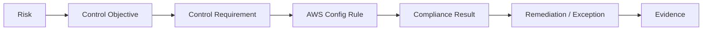
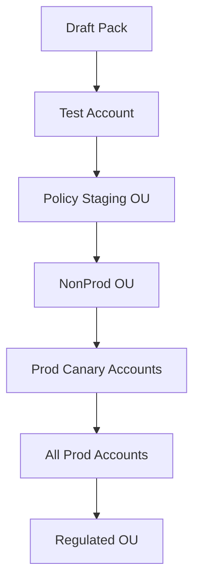
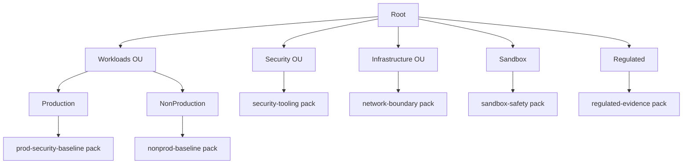
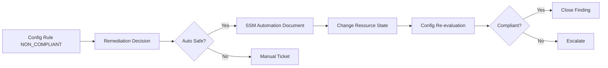
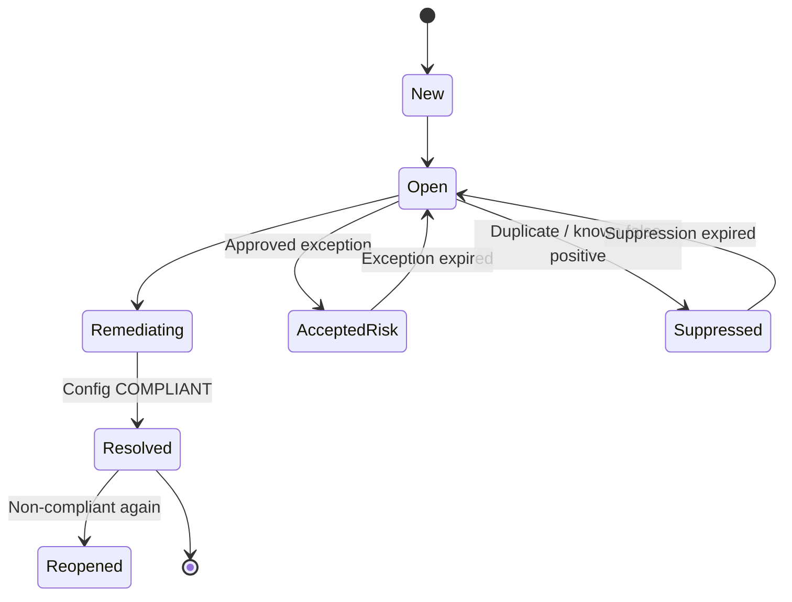
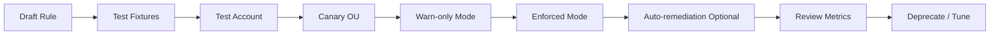

# Part 032 — Config Rules and Conformance Packs

Part sebelumnya memosisikan AWS Config sebagai **configuration timeline**.

Part ini menaikkan levelnya:

```text
Dari "apa state resource?"
menjadi
"apakah state resource boleh seperti itu?"
```

AWS Config Rules adalah predicate terhadap resource state.
Conformance Packs adalah kumpulan rules dan remediation actions yang dikelola sebagai satu unit governance.

Jika CloudTrail adalah event audit dan AWS Config adalah state ledger, maka Config Rules adalah **compliance predicate engine**.

Mental model:

```text
Configuration item + rule logic + parameter + scope = compliance result
```

Part ini membahas cara mendesain Config Rules dan Conformance Packs sebagai sistem production-grade: rule taxonomy, managed vs custom rules, rule parameterization, conformance pack packaging, organization-wide deployment, remediation, exception handling, alerting, testing, cost, dan failure mode.

---

## 1. Config Rule Sebagai Predicate

Config Rule sebaiknya dipahami sebagai fungsi:

```text
evaluate(resource_state, context, parameters) -> COMPLIANT | NON_COMPLIANT | NOT_APPLICABLE | INSUFFICIENT_DATA
```

Contoh:

```text
Rule: s3-bucket-public-read-prohibited
Input: S3 bucket configuration item
Output: NON_COMPLIANT jika bucket memungkinkan public read
```

Atau:

```text
Rule: restricted-ssh
Input: EC2 security group configuration item
Output: NON_COMPLIANT jika inbound rule mengizinkan TCP/22 dari 0.0.0.0/0 atau ::/0
```

Config Rule bukan policy enforcement langsung. Ia adalah evaluation.

Perbedaan penting:

| Control | Fungsi |
|---|---|
| SCP | Mencegah API tertentu melewati permission ceiling. |
| IAM policy | Memberi/membatasi permission principal. |
| Resource policy | Membatasi akses dari sisi resource. |
| Config Rule | Mengevaluasi apakah resource state compliant. |
| Remediation | Mengubah resource agar kembali compliant. |

Rule yang baik tidak hanya mengatakan “bad”. Rule yang baik menjelaskan:

```text
Apa invariant yang dilanggar?
Resource mana?
Owner siapa?
Severity berapa?
Apakah boleh auto-remediate?
Exception apa yang valid?
Evidence apa yang disimpan?
```

---

## 2. Rule Bukan Requirement

Kesalahan umum:

```text
Kita punya rule `encrypted-volumes`, berarti requirement encryption sudah selesai.
```

Tidak.

Rule adalah implementasi dari requirement, bukan requirement itu sendiri.

Urutan yang benar:



Contoh:

```yaml
risk: Data at rest bisa bocor jika storage media diekspos.
control_objective: Semua storage production harus dienkripsi.
control_requirement: EBS volume di production account harus encrypted=true.
implementation: AWS Config managed rule encrypted-volumes.
evidence: Compliance result + configuration item + timestamp.
remediation: Snapshot/copy encrypted volume atau recreate via pipeline.
exception: Legacy workload dengan compensating control, expiry <= 30 hari.
```

Jika requirement tidak jelas, rule akan menjadi checkbox.

---

## 3. Jenis AWS Config Rules

Secara praktis ada tiga kategori penting:

| Jenis Rule | Kapan Dipakai |
|---|---|
| AWS Managed Rules | Untuk best practice umum yang sudah disediakan AWS. |
| Custom Lambda Rules | Untuk logic kompleks, integrasi registry, atau evaluasi lintas API. |
| Custom Policy Rules | Untuk policy logic berbasis Guard/custom policy saat cocok untuk declarative evaluation. |

### AWS Managed Rules

Gunakan managed rules ketika requirement cocok dengan rule AWS.

Contoh:

- S3 public read/write prohibited,
- encrypted volumes,
- CloudTrail enabled,
- root account MFA enabled,
- restricted SSH,
- IAM password policy,
- RDS storage encrypted,
- required tags.

Kelebihan:

- cepat dipakai,
- dikelola AWS,
- tidak perlu kode Lambda,
- mudah masuk conformance pack.

Kekurangan:

- semantics terbatas pada parameter rule,
- tidak selalu tahu konteks bisnis,
- bisa menghasilkan false positive jika environment punya exception valid,
- nama rule kadang terlihat sederhana padahal implikasi remediation kompleks.

### Custom Lambda Rules

Gunakan jika logic membutuhkan:

- query ownership registry,
- validasi exception registry,
- data classification context,
- cross-resource reasoning,
- calling service APIs tambahan,
- complex allowlist,
- severity calculation,
- environment-aware evaluation.

Kekurangan:

- butuh code lifecycle,
- IAM permission lebih kompleks,
- latency dan failure mode Lambda,
- test burden,
- versioning,
- deployment lintas account/region.

### Custom Policy Rules

Gunakan jika logic bisa diekspresikan secara declarative.

Cocok untuk:

- structural checks,
- required properties,
- allowed values,
- simple nested config validation,
- policy-as-code style governance.

Tidak cocok untuk:

- complex external lookup,
- multi-step remediation decision,
- behavior-based detection,
- expensive API calls.

---

## 4. Evaluation Trigger

Config Rules dapat dievaluasi berdasarkan perubahan konfigurasi, periodik, atau kombinasi tergantung jenis rule.

Mental model:

```text
Change-triggered = evaluate ketika resource berubah.
Periodic = evaluate pada interval tertentu.
Hybrid = evaluate saat berubah dan secara berkala.
```

Pilih trigger berdasarkan failure mode.

| Requirement | Trigger yang Cocok |
|---|---|
| Security group tidak boleh expose SSH | Change-triggered. |
| Root MFA harus aktif | Periodic. |
| S3 bucket tidak boleh public | Change-triggered + periodic jika available. |
| IAM user access key rotation | Periodic. |
| Resource harus punya required tags | Change-triggered. |
| CloudTrail harus enabled | Periodic/change sesuai rule. |

Semakin kritikal violation, semakin penting detection cepat. Tetapi jangan salah memakai Config untuk kebutuhan sub-second enforcement. Untuk itu gunakan preventive control.

---

## 5. Scope Rule

Rule harus punya scope.

Scope bisa berdasarkan:

- resource type,
- tag,
- account,
- region,
- OU,
- environment,
- compliance domain,
- data class.

Contoh scope:

```yaml
rule: restricted-ssh
scope:
  accounts: prod
  regions:
    - ap-southeast-1
    - us-east-1
  resource_types:
    - AWS::EC2::SecurityGroup
  exclude:
    exception_tag: SecurityExceptionId
```

Tanpa scope, rule bisa terlalu luas atau terlalu sempit.

Contoh terlalu luas:

```text
Rule melarang public ALB di semua account, termasuk account edge ingress yang memang harus punya public ALB.
```

Contoh terlalu sempit:

```text
Rule hanya aktif di us-east-1, sementara workload production berjalan di ap-southeast-1.
```

Rule yang defensible selalu menyatakan **where it applies**.

---

## 6. Parameterization

Banyak managed rules menerima parameter.

Contoh:

```yaml
rule: restricted-common-ports
parameters:
  blockedPort1: 22
  blockedPort2: 3389
```

Atau:

```yaml
rule: required-tags
parameters:
  tag1Key: Owner
  tag2Key: Environment
  tag3Key: DataClass
```

Parameter harus versioned. Perubahan parameter bisa mengubah compliance posture secara besar.

Contoh:

```diff
 required_tags:
   - Owner
   - Environment
+  - DataClass
```

Perubahan kecil ini bisa menghasilkan ribuan non-compliance.

Karena itu perubahan parameter perlu:

- impact analysis,
- dry run jika memungkinkan,
- rollout bertahap,
- owner communication,
- exception migration,
- dashboard before/after.

---

## 7. Severity Model

AWS Config compliance status tidak cukup untuk prioritas.

`NON_COMPLIANT` bisa berarti:

```text
Missing CostCenter tag
```

atau:

```text
S3 bucket confidential data public to internet
```

Keduanya tidak boleh diperlakukan sama.

Buat severity model:

```yaml
severity_model:
  critical:
    conditions:
      - public_exposure == true
      - data_class in [confidential, regulated, secret]
      - environment == prod
    response_sla: 15m
    auto_remediation: true
  high:
    conditions:
      - internet_exposure == true
      - admin_privilege == true
    response_sla: 4h
  medium:
    conditions:
      - encryption_missing == true
      - environment != prod
    response_sla: 3d
  low:
    conditions:
      - missing_optional_tag == true
    response_sla: 14d
```

Severity sering butuh enrichment:

- tag `Environment`,
- tag `DataClass`,
- account OU,
- Macie classification,
- resource public exposure,
- owner registry,
- known exception,
- business criticality.

AWS Config menghasilkan signal. Risk engine membuat prioritas.

---

## 8. Conformance Pack Mental Model

Conformance Pack adalah paket rules dan remediation actions yang bisa dideploy sebagai satu entity.

Jangan menganggap conformance pack sebagai “template sample AWS”.

Anggap sebagai:

```text
Versioned control bundle untuk satu domain governance.
```

Contoh conformance pack internal:

```text
baseline-security-prod-v2026-07
s3-data-protection-v2026-07
iam-human-access-v2026-07
network-exposure-v2026-07
regulated-workload-v2026-07
sandbox-minimum-safety-v2026-07
```

Conformance pack yang baik punya:

- objective,
- scope,
- rules,
- parameters,
- remediation actions,
- severity mapping,
- owner mapping,
- exception policy,
- rollout notes,
- version,
- changelog.

---

## 9. Conformance Pack as Release Artifact

Treat conformance pack like production software.

Directory structure:

```text
conformance-packs/
  baseline-security/
    README.md
    CHANGELOG.md
    pack.yaml
    parameters-prod.yaml
    parameters-nonprod.yaml
    tests/
      compliant-samples/
      non-compliant-samples/
    remediation/
      ssm-documents/
    rollout.md
```

Release checklist:

- [ ] Requirement mapped to risk/control objective.
- [ ] Rule semantics reviewed.
- [ ] Parameters reviewed.
- [ ] False positive cases documented.
- [ ] Exception path defined.
- [ ] Auto-remediation safety classified.
- [ ] Test account deployment passed.
- [ ] Cost impact estimated.
- [ ] Dashboard updated.
- [ ] Rollback plan exists.

A conformance pack without release process is just YAML with authority.

---

## 10. Example Conformance Pack Skeleton

Simplified conceptual example:

```yaml
Resources:
  S3BucketPublicReadProhibited:
    Type: AWS::Config::ConfigRule
    Properties:
      ConfigRuleName: s3-bucket-public-read-prohibited
      Source:
        Owner: AWS
        SourceIdentifier: S3_BUCKET_PUBLIC_READ_PROHIBITED

  S3BucketPublicWriteProhibited:
    Type: AWS::Config::ConfigRule
    Properties:
      ConfigRuleName: s3-bucket-public-write-prohibited
      Source:
        Owner: AWS
        SourceIdentifier: S3_BUCKET_PUBLIC_WRITE_PROHIBITED

  EncryptedVolumes:
    Type: AWS::Config::ConfigRule
    Properties:
      ConfigRuleName: encrypted-volumes
      Source:
        Owner: AWS
        SourceIdentifier: ENCRYPTED_VOLUMES
```

Real pack perlu lebih banyak detail: parameters, remediation, dependency, naming, account scope, and deployment policy.

Jangan copy-paste sample tanpa memahami semantics rule.

---

## 11. Organization-Wide Deployment

Conformance packs bisa dikelola lintas organization.

Namun organization-wide deployment punya failure mode:

- account baru belum punya recorder,
- region belum enabled,
- service-linked role belum siap,
- remediation role belum ada,
- member account punya SCP yang memblokir operasi,
- rule tidak supported di region tertentu,
- parameter tidak cocok dengan account type,
- deployment retry window terlewat,
- delegated admin salah.

Deployment pipeline harus melakukan preflight:

```yaml
preflight_checks:
  - account_enrolled_in_org
  - config_recorder_exists
  - config_recorder_running
  - delivery_channel_valid
  - required_service_linked_roles_exist
  - target_region_enabled
  - remediation_role_exists
  - scp_allows_config_operations
  - pack_version_not_already_deployed
```

Rollout pattern:



Jangan deploy conformance pack baru langsung ke seluruh organization tanpa canary.

---

## 12. OU-Specific Packs

Semua OU tidak butuh rule yang sama.

Contoh:

| OU | Pack |
|---|---|
| Security | security-tooling-hardening, log-integrity. |
| Infrastructure | network-boundary, shared-services-baseline. |
| Production Workloads | prod-security-baseline, data-protection, backup-readiness. |
| NonProduction | nonprod-security-baseline, cost-hygiene. |
| Sandbox | sandbox-safety-minimum, region/cost exposure checks. |
| Regulated | regulated-evidence-pack, encryption, retention, access review. |
| Suspended | no-workload, billing/security lock. |

Rule inheritance harus mengikuti OU design yang sudah dibahas di Part 010.



Control harus sesuai risk profile, bukan disebar merata tanpa konteks.

---

## 13. Baseline Security Pack

Baseline pack biasanya mencakup minimum security posture.

Contoh domain:

```yaml
baseline_security_pack:
  identity:
    - root-account-mfa-enabled
    - iam-user-mfa-enabled
    - iam-policy-no-statements-with-admin-access
  audit:
    - cloudtrail-enabled
    - cloudtrail-log-file-validation-enabled
    - cloudtrail-cloud-watch-logs-enabled
  storage:
    - s3-bucket-public-read-prohibited
    - s3-bucket-public-write-prohibited
    - s3-bucket-server-side-encryption-enabled
  network:
    - restricted-ssh
    - restricted-common-ports
  compute:
    - encrypted-volumes
  tagging:
    - required-tags
```

Tetapi baseline pack harus realistis.

Jika baseline menghasilkan 10.000 findings tanpa owner dan remediation process, ia tidak meningkatkan security. Ia menciptakan backlog noise.

Mulai dari high-signal controls.

---

## 14. Domain-Specific Packs

Lebih baik pecah pack berdasarkan domain risk.

### S3 Data Protection Pack

```yaml
rules:
  - s3-bucket-public-read-prohibited
  - s3-bucket-public-write-prohibited
  - s3-bucket-server-side-encryption-enabled
  - s3-bucket-logging-enabled
  - s3-bucket-versioning-enabled
  - s3-bucket-ssl-requests-only
```

### Network Exposure Pack

```yaml
rules:
  - restricted-ssh
  - restricted-common-ports
  - vpc-default-security-group-closed
  - ec2-security-group-attached-to-eni
```

### IAM Hygiene Pack

```yaml
rules:
  - iam-user-mfa-enabled
  - iam-user-unused-credentials-check
  - iam-password-policy
  - access-keys-rotated
```

### Backup Readiness Pack

```yaml
rules:
  - backup-plan-min-frequency-and-min-retention-check
  - backup-recovery-point-encrypted
  - backup-recovery-point-manual-deletion-disabled
```

Domain packs membantu ownership.

Storage team melihat storage violations. Network team melihat network violations. IAM team melihat identity violations.

---

## 15. Rule Naming and Metadata

Rule naming harus stabil dan bermakna.

Bad:

```text
rule1
s3check
prod-rule-new
```

Good:

```text
org-prod-s3-public-read-prohibited
org-prod-ec2-restricted-ssh
org-regulated-rds-storage-encrypted
```

Metadata yang perlu dikelola:

```yaml
rule_metadata:
  name: org-prod-s3-public-read-prohibited
  control_id: SEC-S3-001
  risk_id: RISK-DATA-EXFIL-003
  severity: critical
  domain: data-protection
  owner_team: cloud-security
  remediation_mode: automatic
  exception_allowed: true
  exception_max_days: 30
  evidence_retention_years: 7
```

AWS Config sendiri tidak cukup untuk semua metadata bisnis. Simpan metadata di control catalog.

---

## 16. Remediation Model

AWS Config bisa mengasosiasikan remediation actions dengan non-compliant resources. Remediation memakai AWS Systems Manager Automation documents.

Mental model:



Remediation harus diklasifikasikan.

| Remediation Type | Contoh | Risiko |
|---|---|---|
| Safe revert | Re-enable S3 Block Public Access | Rendah untuk kebanyakan prod. |
| Safe quarantine | Remove 0.0.0.0/0 SSH rule | Sedang jika emergency access belum benar. |
| Potential outage | Disable IAM key | Tinggi jika key dipakai production workload. |
| Destructive | Delete resource | Sangat tinggi, butuh approval. |
| Expensive | Snapshot/re-encrypt large storage | Cost/latency tinggi. |

Jangan membuat auto-remediation hanya karena bisa.

---

## 17. Auto-Remediation Guardrails

Auto-remediation perlu guardrails:

```yaml
auto_remediation_guardrails:
  require_exception_check: true
  require_owner_lookup: true
  require_environment_classification: true
  disabled_for_break_glass_tag: true
  max_retries: 3
  backoff_seconds: 60
  write_audit_event: true
  create_ticket_before_action: true
  post_action_validation: true
  rollback_documented: true
```

Gunakan idempotency.

Remediation document harus aman jika dijalankan dua kali.

Bad:

```text
Setiap remediation membuat duplicate rule/ticket/snapshot tanpa cek existing state.
```

Good:

```text
Remediation membaca current state, melakukan perubahan hanya jika violation masih ada, lalu memverifikasi state akhir.
```

---

## 18. Manual Remediation as First-Class Workflow

Tidak semua violation boleh otomatis.

Manual remediation bukan berarti “lempar ke orang”. Manual remediation tetap harus structured:

```yaml
manual_remediation_ticket:
  rule: org-prod-rds-storage-encrypted
  resource: arn:aws:rds:...
  account: 111122223333
  region: ap-southeast-1
  owner: payments-platform
  severity: high
  first_detected: 2026-07-06T02:11:00Z
  last_seen: 2026-07-06T02:25:00Z
  required_action: migrate to encrypted storage
  runbook: https://internal/runbooks/rds-encryption
  sla: 7d
  exception_url: https://internal/exceptions/request
```

Manual workflow harus punya:

- owner,
- SLA,
- escalation,
- evidence,
- recheck,
- close condition.

Jika tidak, Config findings akan menjadi graveyard.

---

## 19. Exception Handling

Exception adalah bagian dari governance. Tanpa exception model, team akan mencari bypass.

Exception harus eksplisit:

```yaml
exception:
  id: EXC-2026-00123
  resource_arn: arn:aws:s3:::legacy-export-bucket
  rule: org-prod-s3-bucket-versioning-enabled
  reason: Legacy integration requires migration window
  compensating_controls:
    - bucket access restricted to partner role
    - CloudTrail data events enabled
    - Macie job weekly
  approved_by: risk-owner
  expires_at: 2026-08-06
  review_interval: 7d
```

Rule evaluation bisa tetap `NON_COMPLIANT`, tetapi finding pipeline dapat menandai `accepted risk`.

Jangan mengubah rule agar exception terlihat compliant kecuali memang requirement-nya berubah.

Lebih defensible:

```text
Resource non-compliant, tetapi memiliki approved time-bound exception dengan compensating controls.
```

Daripada:

```text
Resource compliant karena rule diberi allowlist diam-diam.
```

---

## 20. Suppression vs Exception

Bedakan suppression dan exception.

| Konsep | Arti |
|---|---|
| Exception | Risiko diterima secara formal dengan alasan, owner, expiry. |
| Suppression | Signal tidak diteruskan ke alert/ticket karena sudah ditangani/duplikat/noise. |
| False Positive | Rule salah mengevaluasi resource. |
| Not Applicable | Rule memang tidak relevan untuk resource. |

Anti-pattern:

```text
Semua finding noisy di-suppress tanpa expiry.
```

Correct pattern:

```text
Suppression punya reason code, owner, expiry/review date, dan audit log.
```

---

## 21. Testing Config Rules

Rule harus diuji.

Managed rule testing:

- validasi parameter,
- deploy ke test account,
- buat compliant sample,
- buat non-compliant sample,
- pastikan result sesuai,
- pastikan remediation aman.

Custom rule testing:

- unit test event input,
- integration test AWS API calls,
- permission test,
- timeout test,
- malformed resource test,
- deleted resource test,
- region/account boundary test.

Test matrix:

| Case | Expected |
|---|---|
| S3 private + encryption enabled | COMPLIANT |
| S3 public read | NON_COMPLIANT |
| S3 public but approved exception | NON_COMPLIANT + accepted risk |
| Deleted bucket | NOT_APPLICABLE or handled |
| Unsupported region | Not deployed / documented |
| Missing tag | NON_COMPLIANT |
| Tag present but invalid value | NON_COMPLIANT if custom validation exists |

Policy control yang tidak diuji hanya memindahkan bug ke compliance dashboard.

---

## 22. Custom Rule Design

Custom rule harus kecil, deterministik, dan observable.

Good custom rule properties:

- single responsibility,
- explicit parameters,
- deterministic output,
- idempotent evaluation,
- structured logs,
- metrics for evaluation errors,
- timeout budget,
- least privilege IAM,
- versioned deployment,
- test fixtures,
- no hidden hardcoded account IDs.

Pseudo-logic:

```text
load configuration item
if resource not applicable -> NOT_APPLICABLE
load rule parameters
load owner/exception context if needed
validate resource state
return evaluation with annotation
```

Bad custom rule:

```text
A Lambda that checks 17 unrelated controls, calls many APIs, has hardcoded account IDs, and returns NON_COMPLIANT without annotation.
```

Good custom rule:

```text
A rule that validates whether production KMS keys have rotation enabled unless key type or exception policy makes rotation not applicable.
```

---

## 23. Annotations Matter

Compliance result without explanation is weak.

Bad annotation:

```text
Non compliant.
```

Good annotation:

```text
Security group allows TCP/22 from 0.0.0.0/0. Required: SSH ingress must be restricted to approved admin CIDR or replaced with SSM Session Manager. Exception required for production exposure.
```

Good annotation helps:

- resource owner understand fix,
- security team prioritize,
- audit understand evidence,
- automation route correctly,
- future investigator reconstruct decision.

---

## 24. Compliance Dashboard Design

Dashboard should not only show percentage compliant.

Minimum views:

```yaml
views:
  - non_compliant_by_severity
  - non_compliant_by_account
  - non_compliant_by_ou
  - non_compliant_by_owner
  - non_compliant_by_rule
  - age_of_non_compliance
  - repeated_offenders
  - exception_expiring_soon
  - remediation_success_rate
  - config_coverage
  - data_freshness
```

A 99% compliant dashboard can hide one critical public bucket.

Better question:

```text
Apa top 10 risk-bearing non-compliances yang harus diperbaiki hari ini?
```

---

## 25. Alerting Strategy

Not all non-compliance deserves a page.

Use routing:

| Severity | Action |
|---|---|
| Critical | Page/on-call/security incident or immediate auto-remediation. |
| High | Ticket + SLA + escalation. |
| Medium | Backlog with deadline. |
| Low | Hygiene report. |
| Accepted risk | Track expiry/review. |

Alert payload should include:

- rule,
- resource ARN,
- account,
- region,
- owner,
- severity,
- first detected,
- last detected,
- current state summary,
- runbook,
- exception link,
- remediation mode.

Alert without ownership is noise.

---

## 26. Deduplication

Config can repeatedly report the same non-compliant resource.

Dedup key:

```text
account_id + region + resource_type + resource_id + rule_name
```

Ticket/finding lifecycle:



Without lifecycle, every evaluation becomes a new ticket.

---

## 27. Remediation Feedback Loop

A mature system measures remediation.

Metrics:

```yaml
remediation_metrics:
  mttd: mean_time_to_detect
  mttr: mean_time_to_remediate
  auto_remediation_success_rate: percent
  auto_remediation_failure_rate: percent
  recurring_violation_rate: percent
  exception_rate_by_rule: percent
  false_positive_rate: percent
  rule_noise_score: numeric
```

Questions:

```text
Which rule generates the most recurring violations?
Which owner ignores SLA most often?
Which auto-remediation fails most?
Which exceptions expire without migration?
Which OU has the worst trend?
```

Security governance improves by closing loops, not by adding more rules.

---

## 28. Cost and Noise Control

Every rule has operational cost.

Costs:

- Config rule evaluations,
- Lambda execution for custom rules,
- SSM Automation remediation,
- tickets,
- human review,
- false positive handling,
- engineering time.

Rule value formula:

```text
rule_value = risk_reduction - operational_noise - remediation_risk - cost
```

High-value rule:

```text
Detects public access to sensitive S3 buckets in production.
```

Low-value rule:

```text
Flags cosmetic tag mismatch on ephemeral dev resources every minute.
```

Do not optimize by disabling important controls. Optimize by improving scope, severity, owner routing, and exceptions.

---

## 29. Rule Lifecycle

Rules need lifecycle management.

States:

```text
Draft -> Test -> Canary -> Enforced -> Deprecated -> Removed
```

Process:



Warn-only mode can mean:

- create dashboard only,
- no ticket,
- no page,
- no remediation,
- collect false positive rate.

This is useful before enforcing new controls broadly.

---

## 30. Governance Anti-Patterns

### Anti-pattern 1: Enable all sample packs blindly

Problem:

```text
Massive non-compliance noise, no owner, no remediation, no trust.
```

Better:

```text
Select domain packs, map to control objectives, canary, tune, then enforce.
```

### Anti-pattern 2: One global pack for every account

Problem:

```text
Sandbox, prod, regulated, and shared services get wrong controls.
```

Better:

```text
OU-specific packs with inherited baseline and domain-specific overlays.
```

### Anti-pattern 3: Auto-remediate destructive changes

Problem:

```text
Compliance automation causes outage.
```

Better:

```text
Classify remediation safety and require approval for risky actions.
```

### Anti-pattern 4: Hide exceptions inside rule code

Problem:

```text
Audit cannot see accepted risk.
```

Better:

```text
External exception registry with owner, expiry, compensating controls.
```

### Anti-pattern 5: Dashboard-only compliance

Problem:

```text
Everyone sees red, nobody acts.
```

Better:

```text
Finding lifecycle with owner, SLA, escalation, and closure criteria.
```

---

## 31. Example: Critical Rule Operating Contract

```yaml
control:
  id: SEC-NET-001
  title: Production security groups must not expose SSH to the internet
  objective: Prevent internet-origin administrative access to production compute
  aws_config_rule:
    name: org-prod-restricted-ssh
    source: AWS managed rule
    identifier: INCOMING_SSH_DISABLED
  scope:
    ou: Production
    resource_type: AWS::EC2::SecurityGroup
    regions:
      - ap-southeast-1
      - us-east-1
  severity:
    default: high
    if_public_instance_attached: critical
  remediation:
    mode: automatic
    action: remove offending ingress rule
    approval_required: false
    max_retries: 3
  exception:
    allowed: true
    max_days: 7
    required_compensating_controls:
      - approved_source_cidr
      - ticket_reference
      - expiry
  evidence:
    retain_years: 7
    required_fields:
      - resource_id
      - account_id
      - region
      - offending_rule
      - first_detected
      - remediation_time
```

This is what separates a rule from a governance system.

---

## 32. Example: Data Protection Conformance Pack Contract

```yaml
pack:
  name: org-prod-s3-data-protection
  version: 2026.07.0
  owner: cloud-security
  scope:
    ou: Production
    resource_types:
      - AWS::S3::Bucket
  controls:
    - SEC-S3-001: public read prohibited
    - SEC-S3-002: public write prohibited
    - SEC-S3-003: server-side encryption enabled
    - SEC-S3-004: ssl requests only
    - SEC-S3-005: versioning enabled for critical buckets
  rollout:
    phase_1: dashboard only
    phase_2: ticket high/critical
    phase_3: auto-remediate public access
  exceptions:
    registry: security-exception-service
    max_days: 30
  integrations:
    eventbridge: true
    security_hub: true
    ticketing: true
    macie_enrichment: true
```

The pack is not just YAML. It is a signed operating agreement.

---

## 33. How Config Rules Fit With Security Hub Standards

Security Hub standards often use Config rules under the hood or integrate with configuration checks.

But design responsibility remains:

```text
Do not rely on default standards alone to represent your organization's risk model.
```

Use standards as:

- baseline signal,
- compliance accelerator,
- benchmark mapping,
- external alignment.

Use internal Config/conformance packs as:

- organization-specific invariant enforcement,
- environment-aware governance,
- data-class-aware rules,
- remediation workflow,
- exception lifecycle.

Security Hub answers:

```text
What findings do we have across security services and standards?
```

Config answers:

```text
What resource state violates our configured rules?
```

Both are needed.

---

## 34. Operational Runbook: New Rule Introduction

Step-by-step:

1. Define risk and control objective.
2. Choose managed/custom rule.
3. Define scope and parameters.
4. Define severity mapping.
5. Define remediation mode.
6. Define exception policy.
7. Write tests and sample resources.
8. Deploy to test account.
9. Deploy to policy staging OU.
10. Run in dashboard-only mode.
11. Measure false positives.
12. Fix rule/parameter/scope.
13. Communicate to owners.
14. Enable ticketing.
15. Enable auto-remediation only if safe.
16. Monitor MTTR and recurrence.
17. Review after 30 days.

Rule rollout is change management.

---

## 35. Operational Runbook: Non-Compliant Finding

When a resource becomes non-compliant:

1. Read rule and control objective.
2. Identify resource/account/region/owner.
3. Inspect configuration item.
4. Check first detected time and last evaluation time.
5. Check exception registry.
6. Enrich severity with environment/data class/exposure.
7. Decide auto/manual remediation.
8. Execute remediation or create ticket.
9. Verify Config re-evaluation.
10. Correlate with CloudTrail if unauthorized change suspected.
11. Close finding only when resource is compliant or exception approved.
12. Record root cause if recurring/high severity.

Do not close based on “team said fixed”. Close based on evidence.

---

## 36. Minimum Production Checklist

Before using Config Rules and Conformance Packs as governance system:

- [ ] Baseline Config recorder active.
- [ ] Aggregator active.
- [ ] Rule catalog exists.
- [ ] Rule-to-risk mapping exists.
- [ ] Rule owner defined.
- [ ] Severity model exists.
- [ ] OU-specific scope defined.
- [ ] Conformance packs versioned.
- [ ] Pack rollout process exists.
- [ ] Test/canary account exists.
- [ ] EventBridge routing exists.
- [ ] Ticket/finding dedup exists.
- [ ] Exception registry exists.
- [ ] Auto-remediation safety classification exists.
- [ ] SSM remediation documents are versioned.
- [ ] Dashboard includes coverage and freshness.
- [ ] Metrics include MTTR, recurrence, false positive rate.

---

## 37. Kesimpulan

AWS Config Rules mengubah configuration timeline menjadi compliance signal.

Conformance Packs mengubah kumpulan rules menjadi governance package.

Tetapi maturity tidak datang dari jumlah rules. Maturity datang dari desain:

```text
risk -> control objective -> rule -> scope -> evaluation -> severity -> owner -> remediation -> exception -> evidence -> improvement loop
```

Jika salah satu mata rantai hilang, sistem akan menjadi noise.

Prinsip utama:

```text
Do not build a compliance dashboard. Build a control lifecycle.
```

Part berikutnya akan melanjutkan audit/evidence layer ke **VPC Flow Logs and Network Evidence**, yaitu bagaimana network-level telemetry menjadi bukti investigasi dan detection tanpa mengulang materi dasar networking.

---

## References

- AWS Config Developer Guide — What Is AWS Config: https://docs.aws.amazon.com/config/latest/developerguide/WhatIsConfig.html
- AWS Config — Conformance Packs: https://docs.aws.amazon.com/config/latest/developerguide/conformance-packs.html
- AWS Config — Managing Config Rules Across All Accounts in Your Organization: https://docs.aws.amazon.com/config/latest/developerguide/config-rule-multi-account-deployment.html
- AWS Config — Managing Conformance Packs Across All Accounts in Your Organization: https://docs.aws.amazon.com/config/latest/developerguide/conformance-pack-organization-apis.html
- AWS Config — Remediating Noncompliant Resources: https://docs.aws.amazon.com/config/latest/developerguide/remediation.html
- AWS Config — Setting Up Auto Remediation: https://docs.aws.amazon.com/config/latest/developerguide/setup-autoremediation.html
- AWS Config — Conformance Pack Sample Templates: https://docs.aws.amazon.com/config/latest/developerguide/conformancepack-sample-templates.html
