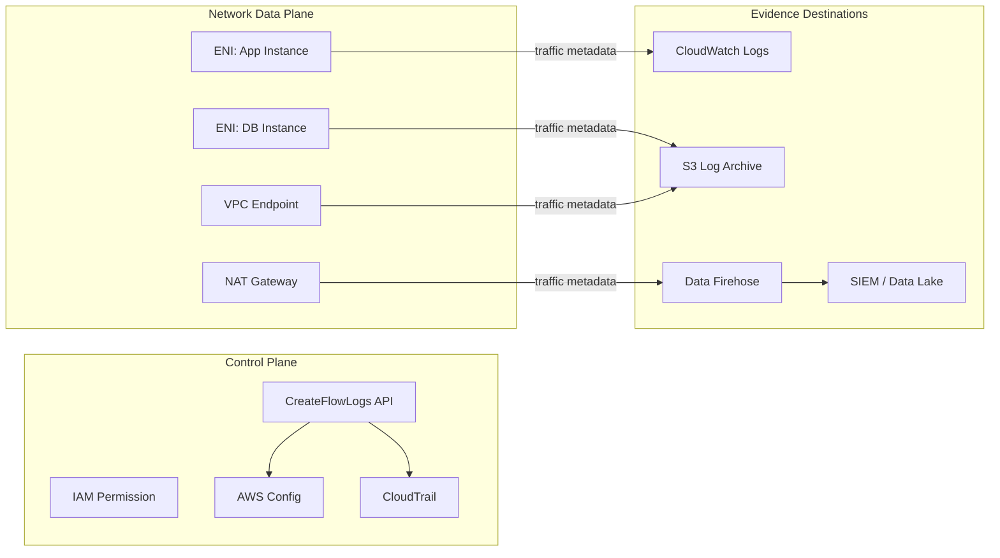
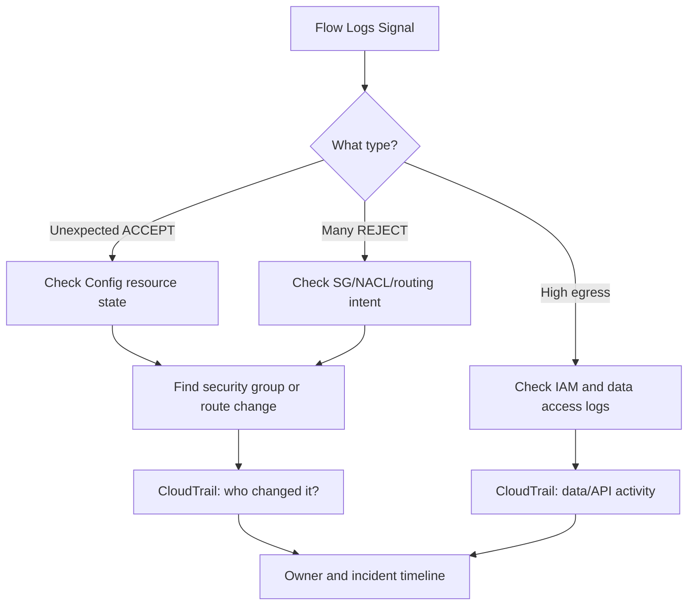
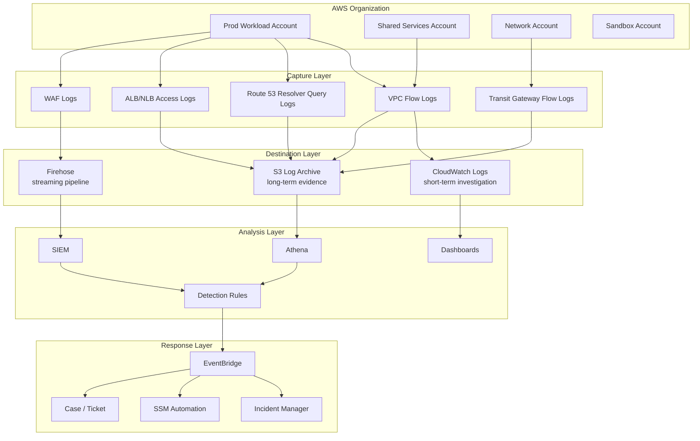

# Part 033 — VPC Flow Logs and Network Evidence

## Tujuan Part Ini

Di part sebelumnya kita membangun audit dari sisi **AWS API** dan **resource configuration state**:

- CloudTrail menjawab: **siapa memanggil API apa, kapan, dari mana, dengan identitas apa**.
- AWS Config menjawab: **resource berubah menjadi konfigurasi apa, kapan, dan apakah compliant**.

Part ini menutup sisi ketiga dari evidence layer: **network movement**.

VPC Flow Logs tidak menjawab isi payload. Ia tidak menggantikan packet capture, WAF logs, ALB access logs, DNS logs, NAT logs, application logs, atau IDS. Tetapi ia sangat penting karena ia memberi bukti bahwa network conversation pernah terjadi atau ditolak.

Mental model yang perlu dipegang:

```text
CloudTrail  = evidence of intent at AWS API level
AWS Config  = evidence of resource state over time
Flow Logs   = evidence of network movement over time
```

Ketika terjadi incident, pertanyaannya jarang hanya satu:

- Siapa membuat security group yang membuka port?
- Resource mana yang berubah menjadi public?
- Instance mana yang mencoba outbound ke IP tidak dikenal?
- Apakah traffic ditolak oleh security group atau NACL?
- Apakah database pernah menerima koneksi dari subnet yang tidak seharusnya?
- Apakah workload menghubungi internet padahal seharusnya hanya private endpoint?
- Apakah ada lateral movement antar subnet atau antar VPC?

CloudTrail dan Config memberi separuh cerita. VPC Flow Logs memberi sisi movement-nya.

---

## 1. Apa Itu VPC Flow Logs dalam Operating Model Security

VPC Flow Logs adalah fitur untuk menangkap informasi tentang IP traffic yang masuk dan keluar dari network interface di VPC. Flow log data dapat dikirim ke CloudWatch Logs, Amazon S3, atau Amazon Data Firehose.

Yang dicatat bukan packet mentah, melainkan **flow record** yang sudah diagregasi.

Satu flow record kira-kira mengatakan:

```text
Dalam window waktu tertentu,
traffic dari srcaddr:srcport ke dstaddr:dstport,
menggunakan protocol tertentu,
melewati interface tertentu,
dengan jumlah packet/bytes tertentu,
dan action ACCEPT/REJECT,
status log tertentu.
```

Dengan kata lain, Flow Logs adalah **network ledger**.

Ia bukan alat untuk menjawab:

- payload HTTP apa yang dikirim,
- user login apa yang dipakai,
- query SQL apa yang dieksekusi,
- header JWT apa yang ada di request,
- file apa yang di-upload.

Ia menjawab:

- siapa bicara ke siapa secara network,
- kapan,
- lewat interface mana,
- pakai port/protocol apa,
- diterima atau ditolak,
- berapa volume kasar traffic-nya,
- apakah ada gap capture (`SKIPDATA`).

Inilah sebabnya Flow Logs cocok untuk **network evidence**, bukan full application observability.

---

## 2. Jangan Salah Memakai Flow Logs

Kesalahan umum engineering team adalah memperlakukan Flow Logs sebagai “log jaringan lengkap”. Itu berbahaya.

Flow Logs memiliki sifat berikut:

1. **Aggregated**  
   Record mewakili traffic dalam aggregation interval, bukan event per packet.

2. **Metadata-only**  
   Tidak ada payload.

3. **Interface-centric**  
   Fokus pada ENI/network interface, bukan logical service name.

4. **May contain skipped data**  
   Dalam kondisi tertentu, record bisa menunjukkan `SKIPDATA`.

5. **Eventually delivered**  
   Bukan synchronous inline enforcement.

6. **Not a firewall**  
   Ia mencatat, bukan memblokir.

7. **Not sufficient alone**  
   Harus dikorelasikan dengan CloudTrail, Config, Route 53 Resolver logs, ALB/NLB logs, WAF logs, application logs, GuardDuty, dan inventory.

Jadi, posisi yang benar:

```text
Flow Logs is not a prevention system.
Flow Logs is an evidence and detection substrate.
```

---

## 3. Control Plane vs Data Plane: Di Mana Flow Logs Berada?

VPC Flow Logs adalah telemetry dari network data plane, tetapi konfigurasi Flow Logs sendiri dibuat melalui AWS control plane.



Konsekuensi praktis:

- CloudTrail dapat menunjukkan **siapa membuat/menghapus/mengubah Flow Logs**.
- AWS Config dapat menunjukkan **apakah Flow Logs masih enabled pada resource yang wajib**.
- Flow Logs sendiri menunjukkan **traffic metadata**.
- S3/CloudWatch/Firehose menjadi bagian dari evidence custody.

Jika attacker bisa mematikan Flow Logs, mengubah destination, menghapus log group, atau mengubah bucket policy, evidence chain rusak.

Maka kontrol Flow Logs harus mencakup:

- enablement,
- destination hardening,
- retention,
- encryption,
- access control,
- delivery monitoring,
- tamper detection,
- exception process.

---

## 4. Level Scope: VPC, Subnet, atau ENI?

Flow Logs bisa dibuat pada beberapa level:

| Scope | Cocok Untuk | Trade-off |
|---|---|---|
| VPC-level | Baseline luas untuk semua ENI dalam VPC | Volume tinggi, noise tinggi |
| Subnet-level | Fokus environment/zone tertentu | Harus disiplin subnet taxonomy |
| ENI-level | Investigasi atau high-value resource | Presisi tinggi, coverage sempit |

### 4.1 VPC-Level

Gunakan VPC-level untuk baseline evidence pada environment penting:

- production VPC,
- regulated VPC,
- shared services VPC,
- ingress/egress VPC,
- inspection VPC,
- network firewall VPC.

Kelemahannya adalah volume. Jika semua VPC di semua account dicatat dengan semua fields, semua traffic, 1-minute aggregation, dan CloudWatch Logs retention indefinite, biaya dan noise bisa membesar.

### 4.2 Subnet-Level

Subnet-level cocok ketika subnet memiliki fungsi jelas:

- public ingress subnet,
- private application subnet,
- isolated database subnet,
- inspection subnet,
- endpoint subnet,
- egress subnet.

Jika taxonomy subnet buruk, subnet-level Flow Logs akan ikut buruk. Nama subnet seperti `subnet-a`, `subnet-b`, atau `private-1` tidak cukup untuk operasi security jangka panjang.

### 4.3 ENI-Level

ENI-level cocok untuk:

- database kritikal,
- domain controller,
- jump host legacy,
- high-risk EC2,
- endpoint penting,
- temporary investigation,
- exception monitoring.

ENI-level bukan baseline yang scalable untuk seluruh organisasi. Ia bagus sebagai **spotlight**, bukan lampu ruangan.

---

## 5. Destination Design: CloudWatch Logs vs S3 vs Firehose

VPC Flow Logs bisa dikirim ke beberapa destination. Pilihan destination adalah keputusan arsitektur, bukan preferensi tooling.

| Destination | Kuat Untuk | Lemah Untuk |
|---|---|---|
| CloudWatch Logs | Query cepat, metric filter, alarm, operasi harian | Biaya ingest/query bisa tinggi, long-term archive kurang ideal |
| S3 | Retention murah, data lake, Athena, forensic archive | Tidak se-interaktif CloudWatch tanpa query layer tambahan |
| Data Firehose | Streaming ke S3/OpenSearch/partner/SIEM | Perlu pipeline design dan failure handling |

### 5.1 CloudWatch Logs

Gunakan CloudWatch Logs ketika butuh:

- operational investigation cepat,
- near-real-time query,
- metric filter sederhana,
- alert berbasis pattern,
- dashboard operational.

Contoh:

- alert banyak `REJECT` ke port database,
- alert outbound ke port tidak umum,
- debug koneksi antar subnet,
- quick check traffic dari ENI tertentu.

### 5.2 S3

Gunakan S3 ketika butuh:

- long-term evidence,
- low-cost retention,
- Athena query,
- partitioned data lake,
- centralized log archive,
- compliance retention,
- WORM/Object Lock.

Untuk security organization, S3 di Log Archive account biasanya menjadi custody layer utama.

### 5.3 Firehose

Gunakan Firehose ketika butuh:

- streaming enrichment,
- centralized pipeline,
- delivery ke S3 + OpenSearch,
- integration ke external SIEM,
- transformation,
- buffering,
- retry semantics.

Firehose cocok untuk organisasi yang sudah punya security data lake/SIEM pipeline matang.

### 5.4 Practical Pattern

Untuk production-grade setup:

```text
S3 Log Archive = source of record / long-term evidence
CloudWatch Logs = operational query for selected high-value scopes
Firehose/SIEM = detection and correlation pipeline
```

Jangan menjadikan satu destination untuk semua kebutuhan. Evidence, detection, dan interactive debugging punya karakteristik berbeda.

---

## 6. Record Format: Default vs Custom

Default format berguna untuk awal, tetapi production security biasanya membutuhkan custom format.

Default fields umum mencakup:

```text
version account-id interface-id srcaddr dstaddr srcport dstport protocol packets bytes start end action log-status
```

Namun untuk forensic dan correlation, sering dibutuhkan field tambahan seperti:

- `vpc-id`,
- `subnet-id`,
- `instance-id`,
- `tcp-flags`,
- `type`,
- `pkt-srcaddr`,
- `pkt-dstaddr`,
- `region`,
- `az-id`,
- `sublocation-type`,
- `sublocation-id`,
- `flow-direction`,
- `traffic-path`.

### 6.1 Kenapa `pkt-srcaddr` dan `pkt-dstaddr` Penting?

`srcaddr`/`dstaddr` bisa dipengaruhi oleh intermediate network interface. `pkt-srcaddr`/`pkt-dstaddr` membantu memahami original packet address dalam skenario tertentu.

Ini penting saat membaca traffic melalui:

- NAT gateway,
- load balancer,
- Transit Gateway,
- VPC endpoint,
- centralized egress,
- inspection architecture.

### 6.2 Kenapa `traffic-path` Penting?

Field seperti `traffic-path` membantu memahami path traffic, misalnya apakah traffic keluar melalui internet gateway, NAT gateway, VPC endpoint, atau jalur lain.

Untuk detection egress, field ini bernilai tinggi karena port/IP saja tidak cukup. Anda ingin tahu apakah traffic ke AWS service berjalan melalui private endpoint atau keluar via internet path.

### 6.3 Format yang Disarankan

Contoh custom format untuk evidence production:

```text
${version} ${account-id} ${region} ${az-id} ${vpc-id} ${subnet-id} ${interface-id} ${instance-id} ${flow-direction} ${srcaddr} ${dstaddr} ${srcport} ${dstport} ${protocol} ${tcp-flags} ${packets} ${bytes} ${start} ${end} ${action} ${log-status} ${pkt-srcaddr} ${pkt-dstaddr} ${traffic-path}
```

Catatan: jangan menambahkan field tanpa memahami biaya dan query pattern. Lebih banyak field berarti lebih banyak volume dan parsing complexity.

---

## 7. Aggregation Interval: 1 Menit vs 10 Menit

Flow Logs memakai aggregation interval. AWS mendokumentasikan default maximum aggregation interval 10 menit, dan Anda dapat memilih 1 menit saat membuat Flow Log. Interval 1 menit menghasilkan volume record lebih tinggi dibanding 10 menit.

Trade-off:

| Interval | Kelebihan | Kekurangan |
|---|---|---|
| 1 menit | Investigasi lebih granular, deteksi lebih cepat | Biaya dan volume lebih tinggi |
| 10 menit | Lebih murah, lebih ringkas | Timeline kurang presisi |

Rekomendasi praktis:

- Production regulated/high-risk: 1 menit untuk critical subnet/ENI atau high-value VPC.
- General production: 10 menit bisa diterima jika dikombinasikan dengan telemetry lain.
- Investigation mode: aktifkan 1 menit sementara pada target tertentu.
- Sandbox/dev: jangan asal 1 menit untuk semua traffic.

### 7.1 Jangan Overclaim Presisi

Flow Logs bukan packet timeline. Walau aggregation 1 menit, tetap ada agregasi. Jangan menulis postmortem seolah setiap record adalah satu koneksi tunggal.

Kalimat yang benar:

```text
Flow Logs indicate that traffic matching this 5-tuple was observed during this time window.
```

Bukan:

```text
At exactly 10:01:02, this single connection transferred exactly this payload.
```

---

## 8. ACCEPT, REJECT, NODATA, SKIPDATA

Field `action` dan `log-status` adalah bagian paling sering disalahbaca.

### 8.1 ACCEPT

`ACCEPT` berarti traffic diizinkan oleh security group dan network ACL pada interface terkait.

Itu tidak berarti:

- aplikasi berhasil memproses request,
- TLS berhasil,
- user authorized,
- database query sukses,
- downstream service sehat.

Ia hanya berarti network layer mengizinkan flow.

### 8.2 REJECT

`REJECT` berarti traffic ditolak oleh security group atau network ACL.

Use case:

- debug connectivity,
- detect scanning,
- detect unauthorized attempt,
- validate segmentation,
- monitor attempted access to restricted ports.

Tetapi `REJECT` tidak selalu malicious. Bisa juga:

- health check salah target,
- client retry,
- stale DNS,
- deployment drift,
- misconfigured security group,
- ephemeral port misunderstanding.

### 8.3 NODATA

`NODATA` berarti tidak ada network traffic yang perlu dicatat untuk interface selama interval tertentu.

### 8.4 SKIPDATA

`SKIPDATA` berarti beberapa record dilewati karena tidak dapat dicapture dalam aggregation interval, misalnya karena constraint internal atau error. Ini bukan hal yang boleh diabaikan dalam forensic.

Jika banyak `SKIPDATA`, evidence quality turun.

Operational response:

- monitor jumlah `SKIPDATA`,
- catat dampaknya pada confidence investigation,
- korelasikan dengan log lain,
- pertimbangkan scope/volume/destination design,
- jangan membuat kesimpulan negatif absolut dari data yang incomplete.

Contoh kesimpulan buruk:

```text
Tidak ada evidence exfiltration karena Flow Logs tidak menunjukkan traffic itu.
```

Kesimpulan lebih defensible:

```text
Dalam Flow Logs yang tersedia, kami tidak menemukan record yang menunjukkan traffic tersebut. Namun periode X memiliki SKIPDATA pada interface Y, sehingga confidence untuk absence-of-evidence pada window tersebut terbatas.
```

---

## 9. Query Mental Model

Saat membaca Flow Logs, jangan mulai dari query. Mulai dari pertanyaan investigasi.

### 9.1 Pertanyaan Connectivity

```text
Apakah A mencoba menghubungi B?
Apakah traffic diterima atau ditolak?
Port apa yang dipakai?
Apakah ada return traffic?
Apakah path sesuai desain?
```

### 9.2 Pertanyaan Egress

```text
Workload mana yang berbicara ke internet?
Apakah destination IP dikenal?
Apakah port/protocol sesuai allowlist?
Apakah keluar via NAT gateway atau private endpoint?
Apakah ada traffic volume abnormal?
```

### 9.3 Pertanyaan Lateral Movement

```text
Apakah subnet aplikasi berbicara ke subnet lain yang tidak seharusnya?
Apakah instance non-admin mencoba port admin?
Apakah ada scanning internal?
Apakah traffic antar environment terjadi?
```

### 9.4 Pertanyaan Segmentation

```text
Apakah deny control benar-benar menghasilkan REJECT?
Apakah ada ACCEPT yang melanggar expected matrix?
Apakah security group terlalu permissive?
```

### 9.5 Pertanyaan Exfiltration

```text
Apakah ada outbound bytes besar ke IP eksternal?
Apakah terjadi di luar jam normal?
Apakah source resource punya akses data sensitif?
Apakah destination baru muncul pertama kali?
```

---

## 10. CloudWatch Logs Insights Query Cookbook

Bagian ini menggunakan asumsi Flow Logs berada di CloudWatch Logs dengan custom format yang dapat diparse. Sesuaikan field names dengan format aktual Anda.

### 10.1 Top Talkers by Bytes

```sql
fields @timestamp, srcaddr, dstaddr, bytes, action
| filter action = "ACCEPT"
| stats sum(bytes) as totalBytes by srcaddr, dstaddr
| sort totalBytes desc
| limit 50
```

Gunakan untuk baseline traffic. Jangan langsung menyimpulkan malicious; top talker bisa saja legitimate backup, replication, batch job, atau telemetry export.

### 10.2 Rejected Traffic to Sensitive Ports

```sql
fields @timestamp, srcaddr, dstaddr, dstport, action
| filter action = "REJECT"
| filter dstport in [22, 3389, 3306, 5432, 6379, 9200, 27017]
| stats count(*) as rejects by srcaddr, dstaddr, dstport
| sort rejects desc
| limit 100
```

Gunakan untuk mendeteksi scanning, misrouting, atau workload yang mencoba akses tidak sah.

### 10.3 Outbound Internet Candidates

```sql
fields @timestamp, srcaddr, dstaddr, dstport, bytes, action, traffic_path
| filter action = "ACCEPT"
| filter flow_direction = "egress"
| filter not like(dstaddr, /^10\./)
| filter not like(dstaddr, /^172\.(1[6-9]|2[0-9]|3[0-1])\./)
| filter not like(dstaddr, /^192\.168\./)
| stats sum(bytes) as totalBytes, count(*) as flows by srcaddr, dstaddr, dstport, traffic_path
| sort totalBytes desc
| limit 100
```

Caveat: IP private range filter ini hanya heuristik. Untuk production gunakan IP intelligence, prefix list, AWS IP ranges, VPC CIDR registry, dan known partner allowlist.

### 10.4 First Seen Destination

CloudWatch Logs Insights bukan full-featured temporal database, tetapi bisa membantu investigasi cepat:

```sql
fields @timestamp, srcaddr, dstaddr, dstport
| filter action = "ACCEPT"
| stats min(@timestamp) as firstSeen, max(@timestamp) as lastSeen, count(*) as flows by srcaddr, dstaddr, dstport
| sort firstSeen asc
| limit 100
```

Untuk deteksi first-seen yang matang, kirim data ke data lake/SIEM dengan stateful baseline.

### 10.5 Potential Internal Scanning

```sql
fields @timestamp, srcaddr, dstaddr, dstport, action
| filter action = "REJECT"
| stats count_distinct(dstaddr) as uniqueTargets, count_distinct(dstport) as uniquePorts, count(*) as attempts by srcaddr
| filter uniqueTargets > 20 or uniquePorts > 20
| sort attempts desc
| limit 50
```

Ini mendeteksi pola scanning kasar. Validasi dengan deployment events, vulnerability scanner resmi, dan security tooling.

### 10.6 High Volume Egress by Instance

Jika format menyertakan `instance-id`:

```sql
fields @timestamp, instance_id, srcaddr, dstaddr, bytes, action, flow_direction
| filter action = "ACCEPT"
| filter flow_direction = "egress"
| stats sum(bytes) as totalBytes by instance_id, srcaddr
| sort totalBytes desc
| limit 50
```

Gunakan untuk egress anomaly dan cost/security analysis.

---

## 11. Athena Query Pattern untuk S3 Flow Logs

Untuk long-term investigation, S3 + Athena biasanya lebih baik.

Prinsip desain:

- gunakan partitioning by account/region/vpc/date,
- kompresi jika memungkinkan,
- format terstruktur bila tersedia,
- lifecycle policy,
- query only relevant partitions,
- jangan query satu bucket flat raksasa.

Contoh partition path:

```text
s3://org-log-archive/vpc-flow-logs/
  account_id=111111111111/
  region=ap-southeast-1/
  vpc_id=vpc-abc123/
  year=2026/
  month=07/
  day=06/
```

Contoh pertanyaan Athena:

```sql
SELECT
  srcaddr,
  dstaddr,
  dstport,
  SUM(bytes) AS total_bytes,
  COUNT(*) AS records
FROM vpc_flow_logs
WHERE year = '2026'
  AND month = '07'
  AND day = '06'
  AND action = 'ACCEPT'
  AND flow_direction = 'egress'
GROUP BY srcaddr, dstaddr, dstport
ORDER BY total_bytes DESC
LIMIT 100;
```

Security data lake yang matang sering memakai pattern:

```text
Raw logs -> normalized table -> enriched table -> detection output -> finding lifecycle
```

Flow Logs raw tidak cukup. Enrichment membuatnya jauh lebih bernilai.

---

## 12. Enrichment: Membuat Flow Logs Bisa Dibaca Manusia

Raw Flow Logs penuh IP dan ENI ID. Security team tidak ingin membaca `eni-0abc...` tanpa konteks.

Minimal enrichment:

| Raw Field | Enrichment |
|---|---|
| `account-id` | account name, OU, environment, owner |
| `vpc-id` | VPC name, classification, region |
| `subnet-id` | subnet tier, route domain, environment |
| `interface-id` | attached resource, service, owner |
| `instance-id` | instance name, ASG, AMI, patch group |
| `srcaddr`/`dstaddr` | private/public, known AWS prefix, threat intel, partner allowlist |
| `dstport` | protocol/service expectation |
| `bytes` | baseline deviation |
| `flow-direction` | ingress/egress |

Tanpa enrichment, Flow Logs hanya log teknis. Dengan enrichment, ia menjadi evidence graph.

### 12.1 Ownership Enrichment

Setiap network evidence harus bisa diturunkan ke owner.

Contoh metadata target:

```yaml
accountId: "111111111111"
accountName: "prod-payments"
ou: "Workloads/Production/Regulated"
service: "payment-api"
ownerTeam: "payments-platform"
dataClassification: "confidential"
criticality: "tier-1"
```

Jika query menemukan outbound aneh tetapi tidak tahu owner, response akan lambat.

Security signal tanpa ownership adalah noise.

---

## 13. Detection Patterns

### 13.1 Unexpected Internet Egress

Invariant:

```text
Workload in isolated/private data subnet must not initiate internet egress except through approved endpoint or egress proxy.
```

Signals:

- flow direction egress,
- destination public IP,
- traffic path internet/NAT,
- source subnet classified as isolated/data,
- destination not in allowlist,
- bytes above threshold.

Response:

- enrich source owner,
- check recent deployment/change,
- inspect NAT/endpoint path,
- check secrets exposure risk,
- isolate if high confidence.

### 13.2 Database Port Access from Unauthorized Subnet

Invariant:

```text
Database ports may only be reached from application subnets or approved admin path.
```

Signals:

- dstport in database ports,
- source subnet not allowed,
- action ACCEPT is worse than REJECT,
- repeated REJECT can indicate attempted scan/misconfig.

Response:

- if ACCEPT, treat as policy violation,
- check security group rule history via CloudTrail/Config,
- remove unauthorized rule,
- open incident if sensitive data system.

### 13.3 Internal Port Scanning

Signals:

- one source to many destinations,
- one source to many ports,
- high REJECT count,
- unusual time window,
- source not known scanner.

Response:

- check if source is approved vulnerability scanner,
- check SSM inventory/process telemetry,
- isolate if suspicious,
- inspect GuardDuty findings.

### 13.4 High-Volume Data Transfer

Signals:

- unusual egress bytes,
- destination external,
- source has data sensitivity,
- off-hours,
- new destination,
- repeated pattern.

Response:

- correlate with S3 data events, database audit logs, application logs,
- check IAM activity,
- check credentials used by workload,
- consider credential rotation.

### 13.5 Control Failure: Missing Flow Logs

Detection is not only traffic. Missing telemetry is itself a signal.

Invariant:

```text
All production VPCs must have Flow Logs enabled to approved destinations.
```

Signals:

- Config rule non-compliant,
- CloudTrail `DeleteFlowLogs`,
- log group stops receiving events,
- S3 prefix no longer updated,
- destination policy modified.

Response:

- validate if approved exception,
- re-enable via automation,
- escalate if disabled by unauthorized principal,
- preserve CloudTrail evidence.

---

## 14. Correlation With CloudTrail and Config

Flow Logs alone says traffic happened. It does not say why.

Investigation pattern:



Example:

1. Flow Logs show ACCEPT from internet-facing subnet to database port.
2. Config shows database security group had ingress rule added at 10:13.
3. CloudTrail shows `AuthorizeSecurityGroupIngress` by assumed role `DeployRole`.
4. IAM Identity Center shows session mapped to engineer/group.
5. Deployment pipeline logs show failed IaC validation bypass.
6. Incident timeline becomes defensible.

Tanpa korelasi, Anda hanya punya potongan data.

---

## 15. Network Evidence Architecture

Production-grade design:



Key idea:

```text
Capture is distributed.
Custody is centralized.
Analysis is layered.
Response is owned.
```

---

## 16. Centralized Enablement Strategy

Anda perlu memastikan Flow Logs tidak bergantung pada engineer manual.

Enablement options:

- Control Tower baseline,
- IaC module untuk setiap VPC,
- AWS Config rule detection,
- EventBridge remediation,
- account provisioning baseline,
- periodic audit query,
- SCP/RCP guardrails untuk melindungi destination.

Minimal production requirement:

```text
Every production VPC must emit Flow Logs to the approved Log Archive account.
Every exception must have expiry, owner, risk acceptance, and compensating controls.
```

### 16.1 Account Vending Integration

Saat account baru dibuat:

1. Account masuk OU yang benar.
2. Baseline IAM/security services aktif.
3. Central log archive permission disiapkan.
4. VPC creation pipeline memakai module yang auto-enable Flow Logs.
5. Config rule memvalidasi Flow Logs.
6. Security Hub menerima non-compliance.
7. Exception registry mengizinkan dev/sandbox tertentu jika memang sengaja.

### 16.2 Preventing Tampering

Protect:

- CloudWatch log group retention,
- log group deletion,
- S3 bucket policy,
- KMS key policy,
- Firehose stream destination,
- Flow Logs deletion,
- IAM permissions to modify logging.

Potential SCP idea:

```json
{
  "Effect": "Deny",
  "Action": [
    "ec2:DeleteFlowLogs",
    "logs:DeleteLogGroup",
    "logs:PutRetentionPolicy",
    "s3:DeleteBucketPolicy",
    "kms:ScheduleKeyDeletion"
  ],
  "Resource": "*",
  "Condition": {
    "StringNotLike": {
      "aws:PrincipalArn": "arn:aws:iam::*:role/security-automation-*"
    }
  }
}
```

Ini hanya ilustrasi. Policy produksi harus diuji dengan OU staging, exception role, dan break-glass flow.

---

## 17. Retention Strategy

Retention harus berdasarkan kebutuhan investigasi, compliance, biaya, dan recovery posture.

Contoh tier:

| Log Type | Hot Retention | Archive Retention | Notes |
|---|---:|---:|---|
| Critical prod Flow Logs | 30–90 hari di CloudWatch/SIEM | 1–7 tahun di S3 | Tergantung compliance |
| General prod Flow Logs | 14–30 hari hot | 1–3 tahun archive | Query long-term via Athena |
| Dev/test Flow Logs | 7–14 hari | optional | Hindari biaya berlebihan |
| Incident-specific ENI logs | selama incident | sesuai legal hold | Tag dan preserve |

Jangan simpan semua log di CloudWatch selamanya tanpa alasan. CloudWatch bagus untuk operasi, S3 bagus untuk archive.

---

## 18. Cost Model

Flow Logs bisa mahal jika didesain asal.

Cost drivers:

- jumlah VPC/subnet/ENI,
- traffic volume,
- aggregation interval,
- field count,
- destination,
- CloudWatch ingest/storage,
- Logs Insights scanned volume,
- Athena scanned data,
- Firehose delivery,
- SIEM ingestion pricing,
- retention indefinite.

Optimization patterns:

- gunakan S3 untuk long-term,
- partition data,
- compress/columnar where possible,
- pakai CloudWatch untuk subset high-value,
- set retention eksplisit,
- pilih 1-minute hanya untuk resource yang butuh,
- monitor `SKIPDATA`,
- query by partition/time window,
- jangan kirim semua raw log ke SIEM mahal tanpa filtering/enrichment strategy.

Security tidak gratis. Tapi biaya yang tidak dikendalikan membuat control dimatikan. Control yang dimatikan karena biaya adalah control yang gagal secara organisasi.

---

## 19. Failure Modes

### 19.1 Flow Logs Enabled but Destination Broken

Gejala:

- Config compliant karena Flow Logs exists,
- tetapi log tidak sampai ke destination.

Penyebab:

- IAM role salah,
- bucket policy berubah,
- KMS deny,
- Firehose delivery failure,
- log group deleted,
- region mismatch.

Mitigasi:

- monitor delivery freshness,
- canary query,
- alarm on missing logs,
- Config custom rule untuk destination integrity.

### 19.2 Logs Exist but Cannot Be Queried

Penyebab:

- format tidak konsisten,
- missing partitions,
- no Glue schema,
- no enrichment,
- team tidak punya read role,
- retention terlalu pendek.

Mitigasi:

- schema governance,
- query templates,
- runbook,
- Athena table lifecycle,
- prebuilt dashboards.

### 19.3 Too Much Noise

Penyebab:

- semua REJECT dianggap alert,
- tidak ada baseline,
- vulnerability scanner resmi tidak dikecualikan,
- ephemeral port salah dibaca,
- no ownership context.

Mitigasi:

- alert hanya pada invariant violation,
- enrich owner/environment,
- suppress known scanners,
- use severity model,
- route findings ke owner.

### 19.4 False Sense of Security

Flow Logs tidak melihat payload. Jika attacker memakai allowed channel, Flow Logs hanya menunjukkan koneksi normal.

Mitigasi:

- combine with application logs,
- WAF logs,
- DNS logs,
- data access logs,
- GuardDuty,
- Macie,
- CloudTrail data events,
- anomaly detection.

---

## 20. Runbook: Investigasi Unexpected Outbound Traffic

Input:

```text
Source: 10.10.21.45
Destination: 203.0.113.10
Port: 443
Bytes: high
Time: 2026-07-06 02:10–02:45 UTC
```

Steps:

1. Identify source ENI and resource.
2. Enrich with account, VPC, subnet, service, owner.
3. Check if destination is approved partner/SaaS/AWS service.
4. Check if traffic path uses NAT, IGW, TGW, endpoint, or firewall.
5. Query prior 30 days: is destination first-seen?
6. Query bytes baseline for source resource.
7. Check CloudTrail for IAM activity by workload role.
8. Check application deployment/change around window.
9. Check GuardDuty/Security Hub findings.
10. Check whether source resource stores or can access sensitive data.
11. If suspicious, isolate via security group/NACL/SSM automation depending architecture.
12. Preserve evidence: Flow Logs, CloudTrail, Config snapshot, instance metadata, relevant app logs.
13. Create incident timeline.
14. After response, encode detection or guardrail if missing.

Output should include confidence level:

```text
Evidence confidence: high/medium/low
Known gaps: SKIPDATA on eni-x during 02:20–02:30; no DNS logs for VPC; app logs retained only 7 days.
```

---

## 21. Runbook: Debugging Connection Failure

Input:

```text
App service cannot connect to database on port 5432.
```

Steps:

1. Identify source ENI/subnet/security group.
2. Identify destination ENI/subnet/security group.
3. Query Flow Logs for src/dst/port.
4. If no records: validate DNS, route, endpoint, source path, traffic generation.
5. If `REJECT`: inspect SG/NACL rules and ephemeral return path.
6. If `ACCEPT`: network layer likely allowed; inspect app, TLS, auth, DB listener, host firewall.
7. Check Config timeline for recent SG/NACL/route changes.
8. Check CloudTrail actor for relevant change.
9. Fix via IaC, not console hotfix, unless emergency path is activated.
10. Add regression test/control if this was caused by drift.

Key distinction:

```text
REJECT means network control denied.
ACCEPT means look above network layer.
No record means verify traffic path and logging coverage.
```

---

## 22. Operational Dashboards

A useful Flow Logs dashboard should not show everything. It should show decision signals.

Recommended widgets:

- top egress sources by bytes,
- top rejected destinations by sensitive port,
- flow logs delivery freshness,
- SKIPDATA count,
- top public destinations,
- traffic by environment/account,
- high-risk subnet egress,
- denied admin ports,
- new destinations,
- traffic to/from regulated subnet,
- NAT gateway egress anomaly,
- private endpoint adoption ratio.

Avoid dashboards that are only pretty heatmaps. A dashboard should answer:

```text
What changed?
What is violating expected movement?
Who owns it?
What should we do next?
```

---

## 23. Evidence Quality Checklist

For each production VPC:

```mdx-code-block
- [ ] Flow Logs enabled at required scope
- [ ] Destination approved
- [ ] Multi-region coverage where applicable
- [ ] Custom format includes account, region, VPC, subnet, interface, action, log-status
- [ ] Retention explicitly configured
- [ ] KMS encryption configured where required
- [ ] Destination access restricted
- [ ] Logs protected from workload account admins
- [ ] Delivery freshness monitored
- [ ] SKIPDATA monitored
- [ ] Query templates available
- [ ] Owner enrichment available
- [ ] Config rule validates enablement
- [ ] CloudTrail alerts on DeleteFlowLogs / destination tampering
- [ ] Exception registry exists
- [ ] Incident runbook tested
```

---

## 24. What Top Engineers Internalize

Top engineers do not treat Flow Logs as a checkbox. They treat it as a **network evidence system** with explicit limitations.

They know:

- network logs are not payload logs,
- accepted traffic is not successful business action,
- rejected traffic is not always attack,
- no evidence is not evidence of absence,
- skipped data matters,
- data without enrichment is operationally weak,
- logging without retention is theater,
- retention without queryability is archive debt,
- detection without owner is noise,
- evidence without integrity is not defensible.

The goal is not “enable VPC Flow Logs”.

The goal is:

```text
For every high-value workload, we can reconstruct meaningful network movement over time, correlate it with identity and configuration changes, assess evidence quality, and respond through owned runbooks.
```

---

## 25. References

- AWS VPC Flow Logs User Guide — https://docs.aws.amazon.com/vpc/latest/userguide/flow-logs.html
- AWS VPC Flow Log Records — https://docs.aws.amazon.com/vpc/latest/userguide/flow-log-records.html
- AWS VPC Flow Log Limitations — https://docs.aws.amazon.com/vpc/latest/userguide/flow-logs-limitations.html
- AWS Transit Gateway Flow Logs — https://docs.aws.amazon.com/vpc/latest/tgw/tgw-flow-logs.html
- Amazon CloudWatch Logs User Guide — https://docs.aws.amazon.com/AmazonCloudWatch/latest/logs/WhatIsCloudWatchLogs.html
- AWS Security Reference Architecture — https://docs.aws.amazon.com/prescriptive-guidance/latest/security-reference-architecture/welcome.html
